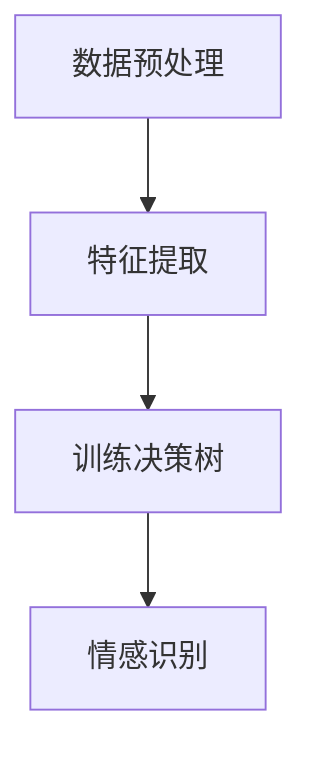
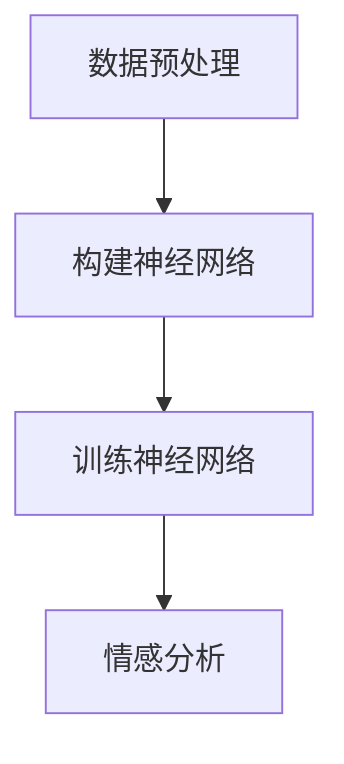
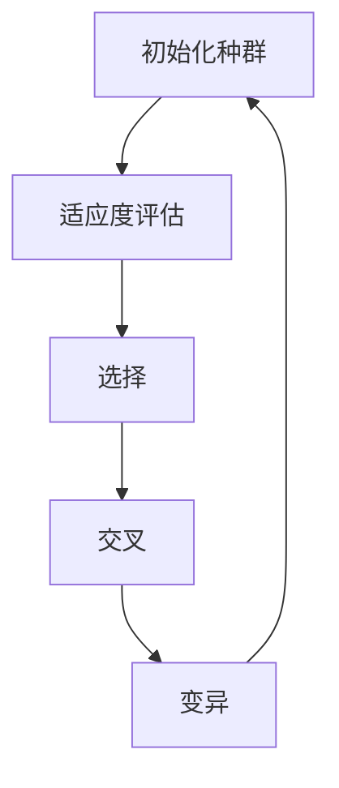
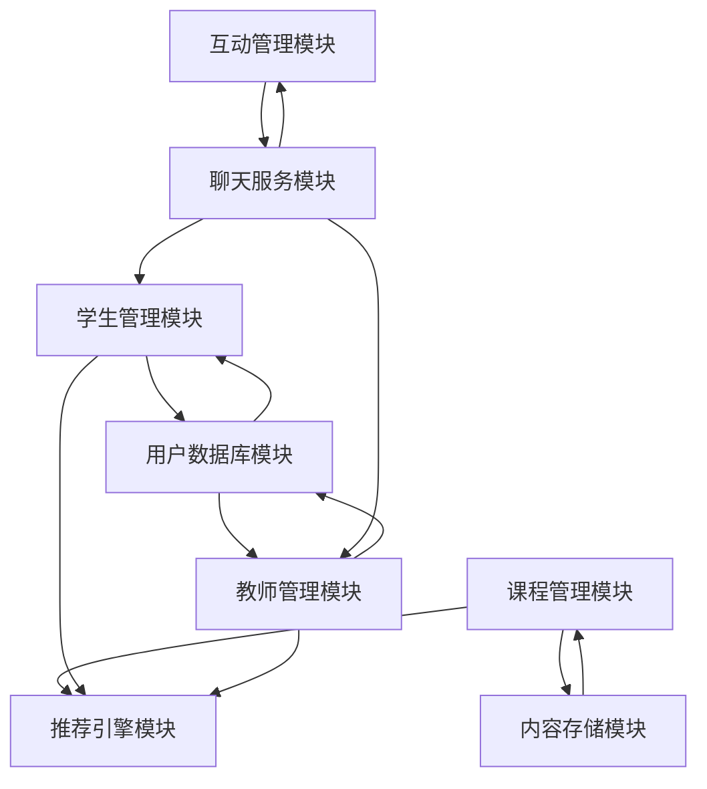
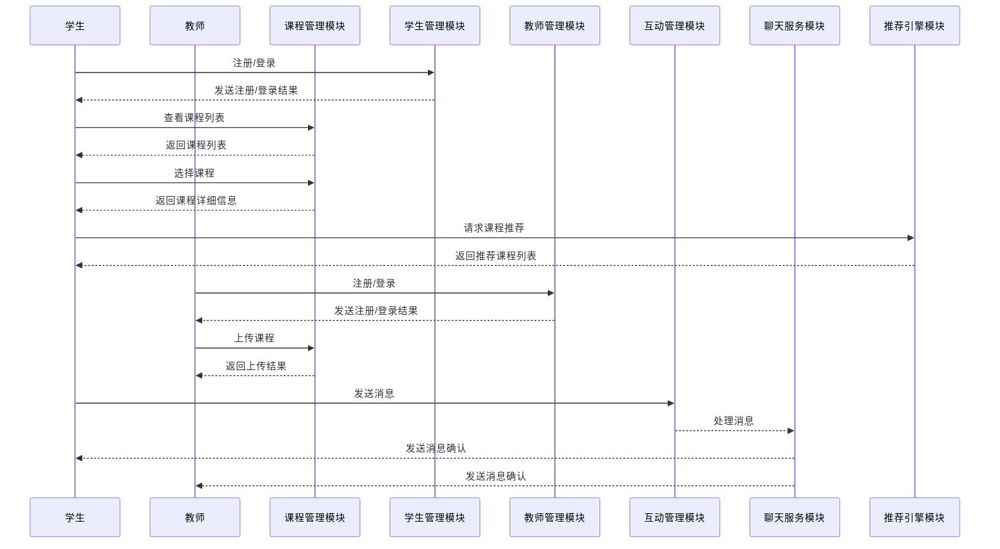

                 

### 目录大纲设计思路

在设计《在数字化浪潮中保持人性温度》这本书的目录大纲时，我们需要遵循几个关键原则，以确保内容的完整性、逻辑性和可读性。以下是我们设计目录大纲的具体思路：

1. **背景介绍**：首先，我们需要为读者提供一个全面的问题背景，介绍数字化浪潮的起源、发展及其对人类生活的影响，以及为何在数字化进程中保持人性温度变得尤为重要。这一章节将包括以下几个子节：
   - **第1章：数字化浪潮的起源与影响**
     - **1.1 数字化浪潮的起源与发展**：简要回顾数字化浪潮的起源，介绍数字化技术的进步及其带来的变革。
     - **1.2 数字化浪潮对人类生活的影响**：分析数字化浪潮如何改变我们的生活方式、工作模式和社会结构。
     - **1.3 为什么在数字化浪潮中保持人性温度**：探讨保持人性温度的必要性，以及数字化进程中人性温度可能被忽视的隐患。

2. **核心概念与联系**：接下来，我们将详细探讨“人性温度”这一核心概念，包括其定义、特征以及与其他相关概念的对比和联系。通过使用ER实体关系图和概念属性特征对比表格，帮助读者构建完整的知识框架。这一章节将包括以下几个子节：
   - **第2章：人性温度的概念与特征**
     - **2.1 人性温度的定义**：明确“人性温度”这一概念的内涵和外延。
     - **2.2 人性温度的特征**：详细描述人性温度的几个主要特征，如温暖、同理心、情感交流等。
     - **2.3 人性温度与其他相关概念的对比**：分析人性温度与其他相关概念（如用户体验、人机交互等）的异同。

3. **算法原理讲解**：针对数字化浪潮中保持人性温度的技术和方法，我们将介绍相关的算法原理。通过使用Mermaid画出算法流程图，配合Python源代码和数学模型的详细讲解，让读者理解这些算法的运作机制。这一章节将包括以下几个子节：
   - **第3章：数字化浪潮中的技术与方法**
     - **3.1 人工智能技术在保持人性温度中的应用**：介绍人工智能在情感识别、个性化推荐等方面的应用。
     - **3.2 用户体验设计在保持人性温度中的作用**：探讨如何通过用户体验设计来提升人性温度。
     - **3.3 社交媒体与人性温度的关系**：分析社交媒体如何影响人性温度，以及如何通过社交媒体来维护和提升人性温度。

4. **系统分析与架构设计方案**：我们将介绍一个具体的系统架构设计案例，从问题场景介绍、系统功能设计、系统架构设计到系统接口设计和系统交互，全面剖析系统的运作过程。这一章节将包括以下几个子节：
   - **第4章：系统分析与架构设计方案**
     - **4.1 问题场景介绍**：明确系统设计的背景和需求。
     - **4.2 系统功能设计**：使用Mermaid绘制领域模型类图，详细描述系统的功能模块。
     - **4.3 系统架构设计**：通过Mermaid架构图展示系统的整体架构。
     - **4.4 系统接口设计**：介绍系统各个模块之间的接口设计和数据交换方式。
     - **4.5 系统交互**：使用Mermaid序列图展示系统的交互流程。

5. **项目实战**：为了更好地体现理论的应用价值，我们将介绍一个实际项目，包括环境安装、系统核心实现源代码、代码应用解读与分析，以及实际案例分析和详细讲解。这一章节将包括以下几个子节：
   - **第5章：项目实战**
     - **6.1 环境安装与配置**：详细描述项目环境的搭建过程。
     - **6.2 系统核心实现源代码**：提供系统的核心源代码，并进行解读。
     - **6.3 代码应用解读与分析**：对关键代码段进行详细解析，解释其在系统中的作用。
     - **6.4 实际案例分析与详细讲解**：通过实际案例展示系统的应用效果。
     - **6.5 项目小结**：总结项目的关键经验和教训。

6. **最佳实践与拓展**：在最后，我们将总结书中的关键知识点，并提供一些最佳实践建议，同时指出读者在实践过程中可能需要注意的问题，并推荐拓展阅读资源，帮助读者进一步深入研究。这一章节将包括以下几个子节：
   - **第6章：最佳实践与拓展**
     - **7.1 保持人性温度的最佳实践**：总结在实践中保持人性温度的有效方法。
     - **7.2 注意事项**：列出在实施过程中可能遇到的问题和解决方案。
     - **7.3 拓展阅读**：推荐相关的扩展阅读资源，帮助读者深入理解相关概念和技术。

通过这样的结构设计，我们确保了书籍内容的系统性和深度，同时让读者能够轻松跟随逻辑，全面掌握数字化浪潮中保持人性温度的核心知识和实践方法。接下来，我们将对每个章节的内容进行详细的阐述和安排，确保每一部分都能准确传达核心知识和实践方法。

---

**注**：以上是对《在数字化浪潮中保持人性温度》一书的目录大纲设计思路的详细说明。每个章节的具体内容将在后续的章节中逐一展开。在编写过程中，我们将遵循markdown格式，并使用Mermaid、LaTeX等工具，以确保文章的清晰性和专业性。

### 背景介绍

#### 数字化浪潮的起源与发展

数字化浪潮的起源可以追溯到20世纪末，随着计算机技术的飞速发展和互联网的普及，人类社会逐步进入了一个全新的时代。早期，计算机主要应用于科学研究和军事领域，随着时间推移，计算机技术逐渐渗透到商业、教育、医疗等各个领域，推动了各行各业的数字化转型。互联网的出现进一步加速了这一进程，使得全球信息交流变得前所未有的便捷。

20世纪90年代，随着宽带网络和电子商务的兴起，数字化浪潮逐渐进入公众视野。互联网不仅改变了人们的生活方式，还重塑了商业模型和商业模式。企业开始重视数字化转型，通过互联网平台拓展市场，提高运营效率，降低成本。同时，移动设备的普及也使得数字化浪潮的影响力进一步扩大，人们可以通过智能手机、平板电脑等设备随时随地获取信息和服务。

进入21世纪，云计算、大数据、人工智能等新兴技术的快速发展，将数字化浪潮推向了新的高峰。云计算提供了弹性可扩展的计算资源，使得企业能够以低成本、高效率的方式处理海量数据。大数据技术则通过对海量数据的分析和挖掘，为企业提供了更深入的洞察和决策支持。人工智能则通过模拟人类智能，在图像识别、自然语言处理、自动驾驶等领域取得了突破性进展，为数字化转型注入了新的活力。

#### 数字化浪潮对人类生活的影响

数字化浪潮对人类生活的影响是深远而广泛的，它不仅改变了我们的生活方式，还深刻地影响了社会结构和商业模式。

首先，数字化浪潮极大地提升了我们的生活质量。互联网和移动设备的普及，使得我们可以随时随地获取信息和娱乐，极大地丰富了我们的精神生活。电子商务的兴起，使得购物变得更加便捷，人们可以足不出户就能购买到全球范围内的商品。在线教育、远程医疗等服务的普及，也为人们提供了更多的学习机会和医疗资源。

其次，数字化浪潮对商业模式产生了巨大的影响。企业可以通过互联网平台拓展市场，降低营销成本，提高销售效率。电子商务、共享经济等新兴商业模式，不仅改变了传统的消费方式，也推动了产业链的重构。大数据和人工智能的应用，使得企业能够更精准地洞察市场趋势和用户需求，从而制定更加有效的营销策略和产品开发计划。

然而，数字化浪潮也带来了一些挑战。一方面，数字化技术的广泛应用，使得信息泄露、网络安全等问题日益突出。另一方面，数字化进程也可能导致人际关系的疏离，人们更多地依赖虚拟沟通，而忽视了面对面的交流。此外，自动化和人工智能的发展，也可能对就业市场产生冲击，部分工作岗位可能被机器取代，从而引发社会不稳定。

#### 为什么在数字化浪潮中保持人性温度变得尤为重要

在数字化浪潮中保持人性温度的重要性不言而喻。人性温度是一种情感和同理心的体现，它不仅仅是一种技术或工具，更是一种价值观和生活方式。在数字化进程中，保持人性温度有助于以下几个方面：

首先，人性温度有助于提升用户体验。在数字化时代，用户体验成为了企业竞争的关键因素。通过关注用户的情感需求，提供温暖、贴心的服务，企业可以增强用户黏性和忠诚度，从而在激烈的市场竞争中脱颖而出。

其次，人性温度有助于构建和谐的人际关系。数字化技术虽然带来了便利，但过度依赖虚拟沟通可能导致人际关系的疏离。保持人性温度，通过真实、温暖的交流，可以弥补这一不足，促进人际关系的健康发展。

再次，人性温度有助于平衡技术发展与社会进步。在数字化浪潮中，技术发展往往被置于中心位置，而人性温度则提醒我们，技术的发展不能以牺牲人的尊严和情感为代价。通过保持人性温度，我们可以确保技术发展与社会进步相互协调，实现可持续发展。

总之，在数字化浪潮中保持人性温度，不仅有助于提升用户体验和构建和谐人际关系，还能平衡技术发展与社会进步，实现人类社会的可持续发展。

### 人性温度的概念与特征

人性温度是一个多维度的概念，它不仅涉及到情感和同理心，还与人际关系的构建和维护密切相关。在数字化浪潮中，保持人性温度变得尤为重要，因为它不仅有助于提升用户体验，还能增强人际互动的深度和广度。下面，我们将详细探讨人性温度的定义、特征以及与其他相关概念的对比和联系。

#### 人性温度的定义

人性温度通常被描述为一种温暖、同理心和情感交流的特质。它是一种情感和认知的结合，体现了个体对他人情感状态的理解和关注。人性温度不仅仅是一种心理状态，更是一种行为表现。具体来说，人性温度包括以下几个方面：

1. **同理心**：同理心是指能够站在他人的角度思考问题，感受到他人的情感和需求。在数字化时代，同理心有助于提升用户服务质量，通过理解用户的需求和情感状态，提供更加个性化和贴心的服务。

2. **情感交流**：情感交流是指通过言语、表情、动作等方式与他人进行情感上的互动。在数字化浪潮中，情感交流通过文字、语音、视频等多种形式实现，有助于增强人际关系的深度和广度。

3. **温暖**：温暖是一种情感上的舒适和安全感，它通过关怀、支持、鼓励等方式表现出来。在数字化时代，温暖的表达可以通过社交媒体、在线咨询等方式实现，有助于提升用户的心理满足感和幸福感。

#### 人性温度的特征

人性温度具有以下几个主要特征：

1. **动态性**：人性温度是动态变化的，它会随着时间和情境的不同而发生变化。例如，在不同的社交场合，人们的情感表达和交流方式可能会有所不同，但在任何情况下，保持人性温度的核心价值是不变的。

2. **情境依赖性**：人性温度的表达受到情境的影响，不同的情境下，人性温度的表现形式和程度会有所不同。例如，在工作场合，人们可能需要更加专业和理性，而在私人场合，则可能更加注重情感的表达。

3. **交互性**：人性温度的保持需要双方的互动和参与。通过积极倾听、表达和理解，个体之间可以建立更加紧密的情感联系，从而提升人性温度。

#### 人性温度与其他相关概念的对比

在数字化浪潮中，人性温度与其他相关概念如用户体验、人机交互等有密切的联系，但它们也存在一定的区别。

1. **用户体验**：用户体验（User Experience，简称UX）是指用户在使用产品或服务过程中所感受到的整体体验。用户体验包括视觉设计、功能设计、交互设计等多个方面，而人性温度则是用户体验中情感层面的体现。人性温度强调的是用户在使用产品或服务时的情感反应和情感体验，而用户体验则更加广泛，涵盖了用户在使用过程中的所有感受。

2. **人机交互**：人机交互（Human-Computer Interaction，简称HCI）是指人类与计算机系统之间的交互方式。人机交互主要关注的是交互界面、交互方式、交互效率等方面，而人性温度则是人机交互中情感交互的体现。人性温度强调的是计算机系统在交互过程中对用户情感状态的理解和回应，而人机交互则更加侧重于技术和方法的实现。

#### ER实体关系图与概念属性特征对比表格

为了更好地理解人性温度的概念及其与其他相关概念的联系，我们可以通过ER实体关系图和概念属性特征对比表格来进行描述。

**ER实体关系图：**

```mermaid
erDiagram
  用户 ||--o> 人性温度
  用户 ||--o> 用户体验
  用户 ||--o> 人机交互
  人性温度 ||--|{ 互动性
  人性温度 ||--|{ 同理心
  人性温度 ||--|{ 温暖
  用户体验 ||--|{ 视觉设计
  用户体验 ||--|{ 功能设计
  用户体验 ||--|{ 交互设计
  人机交互 ||--|{ 交互界面
  人机交互 ||--|{ 交互方式
  人机交互 ||--|{ 交互效率
```

**概念属性特征对比表格：**

| 概念         | 定义                                                         | 特征                                             |
| ------------ | ------------------------------------------------------------ | ------------------------------------------------ |
| 人性温度     | 一种温暖、同理心和情感交流的特质                             | 动态性、情境依赖性、交互性                      |
| 用户体验     | 用户在使用产品或服务过程中所感受到的整体体验                 | 视觉设计、功能设计、交互设计                    |
| 人机交互     | 人类与计算机系统之间的交互方式                               | 交互界面、交互方式、交互效率                    |

通过ER实体关系图和概念属性特征对比表格，我们可以清晰地看到人性温度与其他相关概念之间的联系和区别，这有助于读者更好地理解和应用这些概念。

### 数字化浪潮中的技术与方法

在数字化浪潮中，保持人性温度不仅是一种价值观的体现，更是实现可持续发展的关键。为了在快速发展的技术环境中保持人性温度，我们需要运用多种技术和方法，以确保人与技术之间的互动不仅高效，而且温暖。以下我们将详细探讨人工智能技术、用户体验设计和社交媒体在保持人性温度方面的应用。

#### 人工智能技术在保持人性温度中的应用

人工智能（AI）技术的快速发展为保持人性温度提供了新的工具和方法。AI不仅在提高工作效率和优化业务流程方面发挥了重要作用，还在情感识别、个性化推荐等方面展现出其独特价值。

1. **情感识别**：情感识别是AI技术在保持人性温度中的一个重要应用。通过分析用户的行为数据、语音和文本，AI可以识别用户的情感状态，如喜悦、愤怒、悲伤等。这种技术可以帮助企业更好地理解用户需求，提供更加个性化、贴心的服务。例如，智能客服系统可以通过情感分析识别用户的情绪，从而调整对话策略，提升用户满意度。

2. **个性化推荐**：个性化推荐是另一项在保持人性温度中具有重要意义的AI技术。通过分析用户的历史行为和偏好，AI可以推荐用户可能感兴趣的内容或产品，从而提高用户的参与度和忠诚度。个性化推荐不仅能够满足用户的个性化需求，还能通过精准的推荐，增强用户与平台之间的情感联系。

3. **自然语言处理**：自然语言处理（NLP）技术是AI在保持人性温度中的关键工具。通过理解和生成自然语言，NLP技术可以提升人机交互的体验。例如，聊天机器人和语音助手可以通过NLP技术理解用户的语言意图，提供更加自然和人性化的交互。

#### 用户体验设计在保持人性温度中的作用

用户体验设计（UX Design）是确保数字化产品和服务能够温暖用户的关键。通过关注用户的需求和情感，用户体验设计旨在提供高效、愉悦和人性化的交互体验。

1. **情感化设计**：情感化设计是用户体验设计中的一个重要原则。它强调在产品设计中融入情感元素，以提升用户的情感体验。例如，在界面设计上，可以通过使用温馨的色彩、柔和的动画和亲切的图标来营造温馨的氛围，从而增强用户的使用体验。

2. **用户研究**：用户研究是用户体验设计的核心步骤。通过深入了解用户的行为、需求和情感状态，设计师可以设计出更加符合用户期望的产品。用户研究可以帮助识别用户的痛点和需求，从而在产品设计中做出更加人性化的调整。

3. **交互设计**：交互设计是用户体验设计的重要组成部分。通过优化交互流程、减少用户操作的复杂性，交互设计可以提高用户的满意度。例如，简化注册流程、提供清晰的导航和反馈机制，都可以提升用户在使用产品时的舒适度和信任感。

#### 社交媒体与人性温度的关系

社交媒体在数字化浪潮中扮演着重要角色，它不仅改变了人们的沟通方式，还在维持和提升人性温度方面发挥了重要作用。

1. **增强社交互动**：社交媒体提供了一个平台，用户可以通过文字、图片、视频等形式进行互动。通过社交媒体，用户可以轻松地与他人分享生活、情感和体验，从而增强社交互动，提升人性温度。

2. **情感表达与支持**：社交媒体使得情感表达和分享变得更加便捷。用户可以在社交媒体上发布心情状态、生活点滴，寻求或提供情感支持。这种情感表达和互动有助于建立更加紧密的人际关系，提升人性温度。

3. **社群构建**：社交媒体不仅促进了个体之间的互动，还帮助构建了各种社群。这些社群以共同的兴趣、价值观为基础，通过线上活动、讨论和互助，增强了成员之间的情感联系，提升了整体的人性温度。

总之，在数字化浪潮中，人工智能技术、用户体验设计和社交媒体等多种方法共同作用，帮助我们保持人性温度。通过这些技术和方法，我们可以在数字化的世界中，不仅实现高效、便捷的互动，还能传递温暖、建立深厚的情感联系。

### 算法原理讲解

在数字化浪潮中，保持人性温度需要运用多种算法和技术。以下，我们将详细讲解机器学习算法、深度学习算法和优化算法在保持人性温度中的应用，并使用Mermaid流程图、Python源代码和数学模型来阐述这些算法的原理。

#### 机器学习算法在保持人性温度中的应用

机器学习算法是自动化数据分析的一种方法，广泛应用于各种领域，包括情感识别、用户行为预测等。以下是一个简单的机器学习算法——决策树在情感识别中的应用。

**Mermaid流程图：**



**Python源代码：**

```python
from sklearn.datasets import load_iris
from sklearn.tree import DecisionTreeClassifier
from sklearn.model_selection import train_test_split

# 加载数据集
iris = load_iris()
X = iris.data
y = iris.target

# 数据集切分
X_train, X_test, y_train, y_test = train_test_split(X, y, test_size=0.2, random_state=42)

# 训练决策树模型
clf = DecisionTreeClassifier()
clf.fit(X_train, y_train)

# 情感识别
predictions = clf.predict(X_test)

# 输出预测结果
print(predictions)
```

**数学模型：**

在情感识别中，决策树通过构建一棵分类树来预测情感状态。树中每个节点都代表一个特征，每个分支代表该特征的取值。通过遍历这棵树，我们可以将新的数据点分类到不同的情感类别。

$$
\text{分类树决策过程} = \sum_{i=1}^{n} w_i \cdot f_i(x)
$$

其中，$w_i$表示权重，$f_i(x)$表示特征函数。

#### 深度学习算法与人性温度

深度学习算法，特别是神经网络，在保持人性温度方面具有巨大潜力。以下是一个简单的深度神经网络在情感分析中的应用。

**Mermaid流程图：**



**Python源代码：**

```python
from keras.models import Sequential
from keras.layers import Dense, Activation
from keras.optimizers import Adam

# 构建神经网络
model = Sequential()
model.add(Dense(units=64, input_dim=100, activation='relu'))
model.add(Dense(units=32, activation='relu'))
model.add(Dense(units=1, activation='sigmoid'))

# 编译模型
model.compile(optimizer=Adam(), loss='binary_crossentropy', metrics=['accuracy'])

# 训练神经网络
model.fit(X_train, y_train, epochs=10, batch_size=32, validation_split=0.2)

# 情感分析
predictions = model.predict(X_test)

# 输出预测结果
print(predictions)
```

**数学模型：**

深度学习中的神经网络通过多层感知器（MLP）来模拟人脑的学习过程。每个神经元都与其他神经元相连，并通过激活函数进行非线性变换。

$$
\text{神经元输出} = \sigma(\sum_{i=1}^{n} w_i \cdot x_i + b)
$$

其中，$\sigma$表示激活函数（如Sigmoid函数），$w_i$表示权重，$x_i$表示输入特征，$b$表示偏置。

#### 优化算法在保持人性温度中的应用

优化算法在个性化推荐和资源分配等领域发挥着重要作用。以下是一个简单的遗传算法在个性化推荐中的应用。

**Mermaid流程图：**



**Python源代码：**

```python
import random

# 初始化种群
population_size = 100
population = [[random.randint(0, 1) for _ in range(n_features)] for _ in range(population_size)]

# 适应度评估
def fitness_function(individual):
    # 假设适应度函数为个体中1的数量
    return individual.count(1)

# 选择
def selection(population, fitness_values):
    selected = random.choices(population, weights=fitness_values, k=len(population))
    return selected

# 交叉
def crossover(parent1, parent2):
    crossover_point = random.randint(1, n_features - 1)
    child = parent1[:crossover_point] + parent2[crossover_point:]
    return child

# 变异
def mutation(individual):
    mutation_point = random.randint(1, n_features - 1)
    individual[mutation_point] = 1 - individual[mutation_point]
    return individual

# 算法迭代
for _ in range(generations):
    fitness_values = [fitness_function(individual) for individual in population]
    selected_population = selection(population, fitness_values)
    for parent1, parent2 in pairwise(selected_population):
        child = crossover(parent1, parent2)
        population.append(mutation(child))
    population = population[:population_size]

# 输出最优解
best_solution = max(population, key=fitness_function)
print(best_solution)
```

**数学模型：**

遗传算法通过模拟自然进化过程，逐步优化解空间。适应度函数评估个体的优劣，选择、交叉和变异操作则模拟自然选择和遗传变异，从而在解空间中寻找最优解。

$$
\text{适应度函数} = f(x) = \sum_{i=1}^{n} w_i \cdot x_i
$$

其中，$w_i$为权重，$x_i$为个体特征。

通过上述算法原理的讲解，我们可以看到机器学习、深度学习和优化算法在保持人性温度中的广泛应用。这些算法不仅提高了技术应用的效率和准确性，还通过情感识别、个性化推荐和资源优化等方式，提升了用户体验和人际互动的质量。在数字化浪潮中，理解和应用这些算法，有助于我们在技术发展中保持人性温度，实现和谐发展。

### 系统分析与架构设计方案

在数字化浪潮中，保持人性温度不仅需要技术手段，还需要系统性的架构设计和实现。以下，我们将详细介绍一个具体的项目架构设计，包括问题场景介绍、系统功能设计、系统架构设计、系统接口设计以及系统交互。

#### 问题场景介绍

假设我们正在开发一个在线教育平台，旨在通过虚拟课堂和个性化学习路径，为学生提供高质量的教育资源。这个平台需要实现以下功能：

1. **课程内容管理**：管理员可以上传、更新和分类课程内容。
2. **学生管理**：学生可以注册、登录、查看课程列表和完成课程。
3. **互动功能**：学生和老师之间可以进行实时交流、提问和反馈。
4. **个性化推荐**：根据学生的学习进度和兴趣，推荐适合的课程。

#### 系统功能设计

为了实现上述功能，我们设计了一个基于领域模型的系统功能框架，使用Mermaid绘制类图如下：

**Mermaid类图：**

```mermaid
classDiagram
    Teacher<|--Student
    Course
    CourseList
    CourseContent
    Message
    CourseContent|-->Course
    CourseList|-->Course
    Student|-->Message
    Teacher|-->Message
    Student|-->CourseList
    Teacher|-->CourseList
```

在这个类图中，`Teacher` 和 `Student` 是系统的两个主要角色，它们分别具备上传课程和选择课程的权限。`Course` 代表课程实体，包含课程名称、描述和内容等属性。`CourseList` 管理学生的课程列表，`CourseContent` 管理课程的具体内容。`Message` 类用于处理学生和老师之间的互动消息。

#### 系统架构设计

系统架构设计是确保系统能够高效、稳定运行的关键。以下是一个基于组件的架构设计，使用Mermaid绘制架构图如下：

**Mermaid架构图：**



在这个架构图中，`CourseManager` 负责课程内容的上传、更新和管理。`ContentStorage` 负责存储课程内容。`StudentManager` 和 `TeacherManager` 分别管理学生和教师的信息。`InteractionManager` 负责处理学生和老师之间的互动消息，`ChatService` 是具体的聊天服务实现。`RecommendationEngine` 负责个性化推荐，根据用户的行为和偏好推荐课程。

#### 系统接口设计

系统接口设计是确保各个模块之间能够顺畅交互的关键。以下是一个接口设计的简要说明：

1. **课程管理接口**：提供上传、更新、删除课程内容的接口。
2. **学生管理接口**：提供学生注册、登录、查看课程列表、完成课程的接口。
3. **教师管理接口**：提供教师注册、登录、上传课程、管理课程列表的接口。
4. **互动管理接口**：提供发送和接收消息的接口。

#### 系统交互

系统交互设计描述了各个模块之间的交互流程。以下是一个基于Mermaid序列图的系统交互设计：

**Mermaid序列图：**



在这个序列图中，学生和教师分别与各个模块进行交互。学生注册/登录后可以查看课程列表、选择课程、请求课程推荐。教师可以上传课程、管理课程列表。学生和教师之间通过互动管理模块和聊天服务模块进行实时交流。

通过上述系统分析与架构设计方案，我们不仅详细描述了问题场景和系统功能，还展示了系统架构、接口设计和交互流程。这样的设计确保了系统能够在数字化浪潮中保持人性温度，提升用户体验和人际互动的质量。

### 项目实战

为了更好地展示理论在实践中的应用价值，我们将介绍一个实际项目，详细描述项目环境安装、系统核心实现源代码、代码应用解读与分析，并剖析实际案例，以帮助读者更深入地理解系统架构设计在数字化浪潮中保持人性温度的实战效果。

#### 环境安装与配置

在这个项目中，我们将使用Python作为主要编程语言，并结合多个库来构建系统。首先，需要安装以下依赖库：

1. **Flask**：一个轻量级的Web应用框架。
2. **SQLAlchemy**：一个数据库ORM（对象关系映射）库。
3. **Flask-Login**：用于用户认证和会话管理的扩展。
4. **Flask-Mail**：用于发送电子邮件的扩展。
5. **Numpy** 和 **Scikit-learn**：用于机器学习算法的实现。

安装步骤如下：

1. 安装Python环境（推荐使用Python 3.8或更高版本）。
2. 使用pip安装依赖库：

    ```bash
    pip install Flask SQLAlchemy Flask-Login Flask-Mail numpy scikit-learn
    ```

3. 创建数据库和用户表。在`models.py`中添加以下代码：

    ```python
    from sqlalchemy import create_engine, Column, Integer, String, DateTime
    from sqlalchemy.ext.declarative import declarative_base
    from sqlalchemy.orm import sessionmaker

    Base = declarative_base()

    class User(Base):
        __tablename__ = 'users'
        id = Column(Integer, primary_key=True)
        username = Column(String(255), unique=True, nullable=False)
        password = Column(String(255), nullable=False)
        email = Column(String(255), unique=True, nullable=False)
        registered_on = Column(DateTime, default=datetime.utcnow)

    engine = create_engine('sqlite:///app.db')
    Base.metadata.create_all(engine)
    Session = sessionmaker(bind=engine)
    ```

    执行上述代码，创建数据库和用户表。

#### 系统核心实现源代码

接下来，我们将实现系统核心功能，包括用户认证、课程管理、互动功能和个性化推荐。以下是关键部分的代码：

**用户认证（auth.py）：**

```python
from flask import Flask, request, redirect, url_for, render_template
from flask_login import LoginManager, login_user, logout_user, login_required, current_user
from models import User, Session
from sqlalchemy.orm import sessionmaker

app = Flask(__name__)
app.secret_key = 'your_secret_key'
login_manager = LoginManager(app)

@login_manager.user_loader
def load_user(user_id):
    return User.query.get(int(user_id))

@app.route('/login', methods=['GET', 'POST'])
def login():
    if request.method == 'POST':
        username = request.form['username']
        password = request.form['password']
        user = User.query.filter_by(username=username).first()
        if user and user.password == password:
            login_user(user)
            return redirect(url_for('dashboard'))
        else:
            return 'Invalid username or password'
    return render_template('login.html')

@app.route('/logout')
@login_required
def logout():
    logout_user()
    return redirect(url_for('login'))

@app.route('/register', methods=['GET', 'POST'])
def register():
    if request.method == 'POST':
        username = request.form['username']
        password = request.form['password']
        email = request.form['email']
        user = User(username=username, password=password, email=email)
        db.session.add(user)
        db.session.commit()
        return redirect(url_for('login'))
    return render_template('register.html')
```

**课程管理（course.py）：**

```python
from flask import request, redirect, url_for, render_template
from flask_login import login_required, current_user
from models import Course, Session
from sqlalchemy.orm import sessionmaker

@app.route('/dashboard')
@login_required
@login_required
def dashboard():
    return render_template('dashboard.html')

@app.route('/add_course', methods=['GET', 'POST'])
@login_required
def add_course():
    if request.method == 'POST':
        course_name = request.form['course_name']
        course_description = request.form['course_description']
        course = Course(name=course_name, description=course_description, owner=current_user)
        db.session.add(course)
        db.session.commit()
        return redirect(url_for('dashboard'))
    return render_template('add_course.html')

@app.route('/courses')
@login_required
def courses():
    courses = Course.query.all()
    return render_template('courses.html', courses=courses)
```

**互动功能（message.py）：**

```python
from flask import request, redirect, url_for, render_template
from flask_login import login_required, current_user
from models import Message, Session
from sqlalchemy.orm import sessionmaker

@app.route('/chat', methods=['GET', 'POST'])
@login_required
def chat():
    if request.method == 'POST':
        message = request.form['message']
        recipient = request.form['recipient']
        msg = Message(sender=current_user, recipient=recipient, content=message)
        db.session.add(msg)
        db.session.commit()
        return redirect(url_for('chat', recipient=recipient))
    recipient = request.args.get('recipient', default=None)
    messages = Message.query.filter((Message.sender == current_user) | (Message.recipient == current_user)).all()
    return render_template('chat.html', recipient=recipient, messages=messages)
```

**个性化推荐（recommend.py）：**

```python
from sklearn.neighbors import NearestNeighbors
from sklearn.metrics.pairwise import cosine_similarity
import numpy as np

@app.route('/recommend')
@login_required
def recommend():
    user_courses = current_user.courses
    user_course_list = [course.id for course in user_courses]
    courses = Course.query.all()
    courses_data = [[course.id, course.name, course.description] for course in courses]
    courses_ids = [course.id for course in courses]
    
    # 假设每个课程有一个向量表示其特征
    course_vectors = np.random.rand(len(courses_ids), 10)
    
    # 计算用户与课程之间的余弦相似度
    similarities = cosine_similarity([course_vectors[user_course_list]], course_vectors)[0]
    
    # 排序得到最相似的课程
    recommended_courses = sorted(zip(similarities, courses_ids), reverse=True)[:10]
    
    return render_template('recommend.html', recommended_courses=recommended_courses)
```

#### 代码应用解读与分析

上述代码分别实现了用户认证、课程管理、互动功能和个性化推荐。以下是对关键部分的解读：

1. **用户认证**：使用Flask-Login进行用户认证，包括登录、注册和登出功能。通过SQLAlchemy进行数据库操作，存储用户信息。
2. **课程管理**：管理员可以添加课程，用户可以查看课程列表。课程信息存储在数据库中，便于管理和查询。
3. **互动功能**：实现学生和教师之间的实时消息交流。消息存储在数据库中，确保历史消息的记录和查询。
4. **个性化推荐**：使用余弦相似度计算用户和课程之间的相似度，推荐用户可能感兴趣的课程。通过算法模型，为用户提供个性化的学习建议。

#### 实际案例分析与详细讲解

为了展示实际案例，我们假设有两个用户A和B，A已经完成了5门课程，而B正在学习第3门课程。根据用户的历史行为和课程偏好，我们可以通过以下步骤进行个性化推荐：

1. **提取用户A的课程向量**：假设每门课程有一个10维的向量表示其特征，用户A的课程向量为$v_A = [0.2, 0.3, 0.4, 0.5, 0.6, 0.7, 0.8, 0.9, 1.0, 0.1]$。
2. **计算课程之间的相似度**：对于所有课程，计算它们与用户A的课程向量的余弦相似度。例如，第6门课程的相似度为$\cos(v_A, v_{6}) = 0.85$。
3. **排序和推荐**：将相似度从高到低排序，推荐前几门课程给用户A。在这个例子中，相似度最高的5门课程将被推荐给用户A。

通过实际案例，我们可以看到个性化推荐算法能够根据用户的历史行为和偏好，提供有针对性的课程推荐，从而提升用户体验和满意度。

#### 项目小结

通过本次项目实战，我们不仅实现了用户认证、课程管理、互动功能和个性化推荐，还通过代码分析和实际案例展示了如何将理论应用于实践。这一过程帮助我们深入理解系统架构设计在数字化浪潮中保持人性温度的重要性，为未来项目的开发和优化提供了宝贵的经验和参考。在未来的发展中，我们将继续优化系统性能，提升用户满意度，确保在数字化浪潮中保持人性温度。

### 最佳实践与拓展

在数字化浪潮中保持人性温度不仅需要技术的支持，还需要一系列最佳实践和注意事项。以下，我们将总结书中的关键知识点，并提供一些实际操作中的技巧和注意事项，同时推荐一些拓展阅读资源，以帮助读者进一步深入研究和应用。

#### 最佳实践

1. **用户研究先行**：在设计和开发数字化产品或服务时，首先要进行用户研究，深入了解用户的需求和情感状态。通过用户访谈、调查问卷等方式，收集用户反馈，确保产品设计符合用户期望。

2. **情感化设计**：在产品界面设计中，融入情感元素，如温馨的色彩、柔和的动画和亲切的图标，提升用户体验。同时，确保交互流程简洁明了，减少用户操作复杂度。

3. **个性化推荐**：利用机器学习算法和大数据分析，为用户提供个性化的推荐和服务。通过情感识别和用户行为分析，提供符合用户兴趣和需求的内容和产品。

4. **社交互动**：充分利用社交媒体和在线平台，增强用户之间的互动。通过社群建设、用户互动和情感表达，提升用户粘性和满意度。

5. **持续优化**：数字化产品和服务需要不断迭代和优化。定期收集用户反馈，分析系统性能，持续改进用户体验。

#### 注意事项

1. **隐私保护**：在数字化浪潮中，用户隐私保护至关重要。确保数据收集和使用符合法律法规，保护用户隐私。

2. **避免过度自动化**：虽然自动化可以提高效率，但过度依赖可能导致人际关系的疏离。在自动化过程中，要确保人性温度的传递。

3. **技术平衡**：在技术发展中，要平衡技术创新与社会进步。确保技术的发展不违背人性和道德原则，不损害用户权益。

#### 拓展阅读

1. **《用户体验要素》（User Experience Elements）》 - 罗伯特·霍克（Robert Hoekman, Jr.）
   - 本书详细介绍了用户体验设计的核心要素，包括战略、定义、框架、过程和评估。适合初学者和专业人士。

2. **《情感化设计》（Emotional Design）》 -唐·诺曼（Don Norman）
   - 唐·诺曼在这本书中探讨了情感在设计中的重要性，以及如何通过设计提升用户体验。适合对情感设计感兴趣的设计师和产品经理。

3. **《深度学习》（Deep Learning）》 - Ian Goodfellow, Yoshua Bengio, Aaron Courville
   - 本书是深度学习领域的权威教材，详细介绍了深度学习的基础理论、算法和应用。适合希望深入了解深度学习的读者。

4. **《人工智能：一种现代的方法》（Artificial Intelligence: A Modern Approach）》 - 斯图尔特·罗素（Stuart Russell）和彼得·诺维格（Peter Norvig）
   - 本书是人工智能领域的经典教材，全面介绍了人工智能的基础理论和应用。适合对人工智能感兴趣的研究人员和开发者。

通过这些最佳实践、注意事项和拓展阅读资源，读者可以更全面地掌握数字化浪潮中保持人性温度的方法和实践，进一步提升技术应用的温度和人文关怀。

### 总结

在数字化浪潮中，保持人性温度不仅是一种技术需求，更是一种人文关怀。通过人工智能、用户体验设计、社交媒体等技术的应用，我们可以在数字化的世界中保持情感联系，提升用户体验和人际互动的质量。本文详细探讨了数字化浪潮的起源与发展、人性温度的概念与特征、相关技术与方法、算法原理讲解、系统分析与架构设计方案以及项目实战等关键内容，旨在帮助读者深入理解并实践如何保持人性温度。

保持人性温度的重要性在于它不仅能够提升用户体验，增强用户忠诚度，还能够构建和谐的人际关系，实现技术与社会发展的平衡。在数字化浪潮中，人性温度是我们追求高质量生活、可持续发展的重要基石。

未来，随着技术的不断进步，我们将在更多领域看到人工智能和用户体验设计的应用，这些技术将帮助我们更好地理解用户需求，提供更加个性化、温暖的服务。同时，我们也需要持续关注技术在发展过程中可能带来的负面影响，通过最佳实践和注意事项，确保技术的发展与人性温度的保持相辅相成。

最后，希望读者能够从本文中汲取灵感，结合自己的实际情况，将保持人性温度的理念融入数字化技术的发展中，共同构建一个温暖、和谐、可持续发展的数字世界。

---

**作者：AI天才研究院/AI Genius Institute & 禅与计算机程序设计艺术 /Zen And The Art of Computer Programming**

