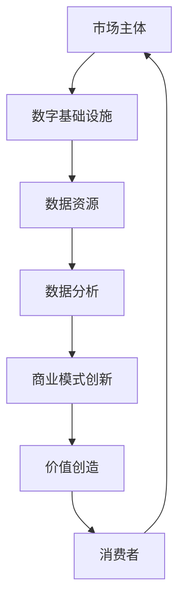

                 

### 在数字经济时代寻找职业意义：应对就业市场变革

在当前这个科技飞速发展的时代，数字经济已经深刻地改变了我们的生活方式、商业模式以及就业市场。随着人工智能、大数据、云计算等技术的广泛应用，传统的就业模式正面临着前所未有的挑战。在这场变革中，如何寻找职业意义，适应新的就业市场需求，成为了每个人都需要面对的问题。

本文将从以下几个角度深入探讨数字经济时代下的职业意义和就业市场的变革：

1. **数字经济时代概述**
   - **定义与特征**：首先，我们将对数字经济进行定义，并分析其与传统经济的区别和特征。
   - **发展历程**：接着，回顾数字经济的发展历程，理解其对社会和就业市场的深远影响。
   - **对就业市场的影响**：最后，探讨数字经济对就业市场的具体影响，包括职业需求的变化和新兴职业的崛起。

2. **就业市场的变革**
   - **传统就业模式的挑战**：分析传统就业模式在数字经济时代面临的挑战。
   - **数字化时代的职业需求**：探讨数字化时代对职业需求的新要求。
   - **新兴职业的发展趋势**：分析当前和未来可能出现的职业趋势。

3. **职业意义的重构**
   - **职业价值观的转变**：探讨职业价值观在数字经济时代的变化。
   - **职业意义的多元性**：分析职业意义的多元性和个人职业使命的重要性。
   - **寻找个人职业使命**：通过实例说明如何寻找和确立个人职业使命。

4. **技能与能力的提升**
   - **数字化技能的培养**：介绍如何培养数字化技能。
   - **跨领域能力的构建**：探讨跨领域能力的重要性及如何构建。
   - **职业发展的策略规划**：给出职业发展的策略规划建议。

5. **职业转型与规划**
   - **职业转型的路径**：分析职业转型的可行路径。
   - **职业规划的实践**：分享职业规划的实际经验。
   - **职业转型的案例分析**：通过案例分析职业转型的成功经验。

6. **成功故事与启示**
   - **数字经济的职业成功案例**：介绍数字经济时代的职业成功案例。
   - **成功故事的启示**：从成功故事中提炼出对职业发展的启示。
   - **职业发展的可持续性**：探讨如何实现职业发展的可持续性。

7. **结语**
   - **总结与展望**：总结文章的主要观点，展望数字经济时代下职业发展的前景。
   - **面对未来的思考**：探讨未来职业发展的趋势和挑战。
   - **职业意义的探索与践行**：强调职业意义的重要性，并倡导在实践中探索和践行。

通过以上几个部分的探讨，希望能够帮助读者在数字经济时代中找到职业的意义，应对就业市场的变革，实现个人的职业发展。

### 关键词

- 数字经济
- 职业意义
- 就业市场变革
- 数字技能
- 跨领域能力
- 职业转型

### 摘要

本文探讨了在数字经济时代寻找职业意义和应对就业市场变革的重要议题。首先，我们对数字经济的定义和特征进行了分析，并回顾了其发展历程和对就业市场的影响。接着，文章深入探讨了就业市场变革的挑战和新兴职业的发展趋势。在此基础上，我们分析了职业价值观的转变和职业意义的多元性，并探讨了如何寻找和确立个人职业使命。随后，文章提出了数字化技能和跨领域能力的重要性，并给出了职业发展的策略规划建议。通过案例分析，我们展示了职业转型的可行路径，并从成功故事中提炼了职业发展的启示。最后，文章总结了对未来职业发展的思考，强调了职业意义的重要性，并呼吁在职业实践中不断探索和践行。

### 数字经济的定义与特征

数字经济，作为一个新兴的经济模式，与传统经济有着本质的不同。首先，数字经济的定义可以从以下几个方面进行阐述：

- **基础**：数字经济是以数字技术和互联网为基础设施，通过数据的收集、处理、分析和应用来驱动经济增长和社会发展的一种经济模式。
- **核心**：数字经济的核心在于数据，即通过数据的高效处理和利用，实现资源的优化配置和生产力的提升。
- **表现形式**：数字经济的表现形式多样，包括电子商务、在线服务、数字化制造、智能物流、数字金融等。

与传统经济相比，数字经济具有以下显著特征：

- **数据驱动**：传统经济主要依赖于物质资源的开发和利用，而数字经济则依赖于数据的获取、分析和应用。
- **高效性**：数字技术能够显著提高生产效率和服务质量，降低交易成本和时间成本。
- **灵活性**：数字经济具有高度的灵活性和可扩展性，能够快速响应市场变化和客户需求。
- **全球化**：数字技术的普及使得全球市场更加紧密地联系在一起，企业的业务活动可以跨越国界，实现全球化运营。
- **可持续性**：通过数字化技术的应用，可以实现资源的有效利用和环境的保护，推动经济可持续发展。

为了更好地理解数字经济与传统经济的对比，我们可以通过一张概念属性特征对比表格来进行详细说明：

| 特征              | 传统经济                | 数字经济                |
|-----------------|-----------------------|-----------------------|
| 基础设施          | 物质资源和人力资本          | 互联网、数字技术和云计算        |
| 资源依赖            | 物质资源               | 数据资源               |
| 发展模式            | 依赖规模经济和产业链整合     | 创新驱动和商业模式创新         |
| 生产效率            | 受限于物质生产能力和技术水平 | 通过数字技术大幅提升生产效率     |
| 交易成本            | 较高，受时间和空间限制       | 降低，可实现24/7全天候交易       |
| 市场结构            | 地理分布和行业集中度较高     | 更加分散，市场参与门槛降低       |
| 全球化程度           | 受地理和政治因素影响较大      | 地缘政治影响较小，全球运营更加便捷 |

通过这张表格，我们可以清晰地看到数字经济在多个方面的独特优势和对传统经济的显著改变。

为了更直观地展示数字经济的实体关系，我们可以使用 Mermaid 流程图来绘制数字经济中的关键实体及其相互关系。以下是一个简化的 Mermaid 流程图示例：

在这个流程图中，市场主体通过数字基础设施获取和利用数据资源，通过数据分析实现商业模式的创新，从而创造价值并服务于消费者。这个循环过程展示了数字经济的基本运作模式。

总之，数字经济以其独特的特征和优势，正在深刻地改变我们的经济结构和就业市场。理解数字经济的定义和特征，有助于我们更好地应对当前和未来的职业挑战。

### 数字经济时代的发展历程

数字经济的发展历程是一个从萌芽到繁荣的演变过程。它不仅受到技术创新的驱动，还受到了政策环境和社会需求的共同影响。以下是数字经济的发展历程及其对就业市场和社会的深远影响。

#### 初期萌芽阶段（1970s-1990s）

- **背景**：数字经济的萌芽可以追溯到20世纪70年代，计算机技术的飞速发展以及互联网的初步应用。
- **关键事件**：1980年代，个人计算机的普及和互联网的兴起标志着数字技术的初步应用，这一时期的代表性事件包括ARPANET的建立和WWW的发明。
- **影响**：这一阶段，数字技术开始渗透到传统产业，为信息处理和传递带来了革命性的变化。然而，数字经济的规模和影响力还比较有限。

#### 成长阶段（2000s）

- **背景**：随着互联网的进一步普及和电子商务的兴起，数字经济进入了快速成长阶段。
- **关键事件**：21世纪初，谷歌、亚马逊、阿里巴巴等数字巨头崛起，电子商务、在线支付、社交媒体等新商业模式迅速普及。
- **影响**：这一阶段，数字经济逐渐成为经济增长的重要驱动力，对就业市场的影响也开始显现。新兴职业如数据分析师、软件工程师和电子商务运营人员需求增加。

#### 繁荣阶段（2010s-2020s）

- **背景**：大数据、云计算、人工智能等前沿技术的应用使得数字经济进入了一个全新的繁荣阶段。
- **关键事件**：2010年代，大数据和云计算技术的广泛应用，推动了各行各业的数字化转型。人工智能和机器学习技术的突破性进展，进一步加速了数字经济的繁荣。
- **影响**：这一阶段，数字经济对就业市场的影响更加深远。传统职业逐渐被数字技能和跨领域能力所取代，新兴职业如数据科学家、AI工程师和区块链开发者需求激增。

#### 当前和未来趋势

- **背景**：随着5G、物联网、区块链等新技术的不断涌现，数字经济正进入一个新的发展阶段。
- **关键事件**：全球范围内的数字化转型加速，尤其是疫情催生了许多在线业务和远程工作的需求。
- **影响**：未来，数字经济将继续推动就业市场变革，更多传统职业可能会被自动化和人工智能所替代，同时也将创造更多的新兴职业。

#### 具体案例

- **电子商务**：以阿里巴巴和亚马逊为代表的电子商务平台，不仅改变了消费者的购物习惯，还催生了许多相关职业，如电商运营、搜索引擎优化和数字营销。
- **大数据**：随着数据量的爆炸性增长，数据分析师和数据科学家的需求大幅增加，他们在各个行业发挥着重要作用，帮助企业通过数据做出更明智的决策。
- **云计算**：云计算技术的应用使得企业能够更灵活地管理和扩展其IT资源，软件工程师和系统架构师在这一领域有着广阔的职业前景。

综上所述，数字经济时代的发展历程不仅体现了技术创新的步伐，更深刻地影响了就业市场和社会结构。理解这一历程，有助于我们更好地应对未来的职业挑战。

### 数字经济对就业市场的影响

数字经济在迅猛发展的过程中，对就业市场产生了深远的影响。以下将详细探讨数字经济如何改变职业需求、创造新兴职业以及其对教育和培训的要求。

#### 职业需求的变化

随着数字经济的崛起，传统的职业需求正经历着巨大的转变。传统职业如制造业工人、零售店员和银行柜员等，因为自动化和智能化的替代，其需求逐渐减少。与此同时，新兴职业如数据分析师、AI工程师、软件架构师等需求急剧增加。

- **数据驱动的职业**：数据分析师和数据科学家的需求大幅上升，因为他们能够从海量数据中提取有价值的信息，帮助企业做出更明智的决策。
- **技术驱动的职业**：AI工程师和机器学习工程师成为新兴热门职业，他们负责开发和部署人工智能系统，以实现自动化和智能化。
- **数字化运营职业**：电商运营、数字营销和SEO专家等职业需求也在增加，随着电子商务和在线业务的蓬勃发展，这些职业变得更加重要。

#### 新兴职业的崛起

数字经济催生了众多新兴职业，这些职业不仅满足了当前市场的需求，也为未来的就业市场提供了新的机遇。

- **区块链技术专家**：随着区块链技术的普及，区块链开发者、区块链分析师和区块链咨询师等职业需求日益增加。
- **云计算专家**：云计算工程师、云架构师和云解决方案专家等职业在云服务市场中的需求不断上升。
- **网络安全专家**：随着网络安全问题的日益突出，网络安全分析师、安全工程师和网络管理员等专业人才变得紧缺。
- **物联网专家**：物联网工程师、物联网解决方案架构师等职业在智能家居、智能制造和智慧城市等领域有着广阔的发展空间。

#### 教育与培训的要求

数字经济的快速发展对劳动力的技能水平和教育背景提出了更高的要求。为了应对这些变化，教育和培训体系需要进行相应的调整和改革。

- **技术技能培训**：教育机构需要提供更多的数字技术培训课程，包括编程、数据分析、AI应用等，以满足市场需求。
- **跨领域能力培养**：随着职业需求的多元化，教育机构需要培养学生的跨领域能力，如创新思维、团队协作和问题解决能力。
- **终身学习理念**：在数字经济时代，终身学习成为职业发展的必要条件。企业和个人都需要不断更新知识和技能，以适应快速变化的市场。
- **职业技能认证**：为了提高就业竞争力，职业技能认证成为越来越多人的选择。通过获得专业认证，个人可以证明自己在特定领域的专业能力和知识水平。

#### 数据支持

以下是一些具体的数据支持，展示了数字经济对职业需求的影响：

- **数据分析师和AI工程师**：根据市场研究公司的数据，预计到2025年，全球对数据分析师的需求将增长28%，对AI工程师的需求将增长38%。
- **区块链技术专家**：根据普华永道（PwC）的报告，到2025年，区块链技术将创造2500万个就业机会。
- **云计算专家**：根据Gartner的预测，到2025年，全球云计算市场规模将达到6320亿美元，对相关人才的需求将持续增长。

综上所述，数字经济对就业市场的影响是全方位的，它不仅改变了职业需求，催生了众多新兴职业，还要求教育和培训体系进行相应的调整和改革。为了在数字经济时代获得成功，个人和企业都需要积极应对这些变化，不断提升技能和知识水平。

### 传统就业模式的挑战

在数字经济迅猛发展的背景下，传统就业模式面临着诸多挑战。以下将详细探讨这些挑战，包括职业稳定性下降、工作压力增大以及职业发展受限等问题。

#### 职业稳定性下降

数字经济时代的职业稳定性显著降低。随着自动化和智能化的普及，许多传统职业被机器人和AI系统替代。例如，制造业中的流水线工人、零售业中的店员和金融业中的银行柜员等职业正面临巨大的就业压力。据统计，到2030年，全球将有约8亿个工作岗位被自动化取代。这一趋势使得许多传统职业的从业者不得不重新考虑自己的职业规划。

#### 工作压力增大

在数字经济时代，工作压力也在不断增大。由于数字化技术的应用，工作节奏加快，工作与生活的界限变得模糊。远程办公、加班文化以及“996”（即每周工作6天，每天工作9小时）的工作模式在一些行业变得普遍。这不仅对从业者的身体健康造成影响，还容易导致工作倦怠和心理压力。

- **心理健康问题**：根据世界卫生组织（WHO）的报告，全球有超过3亿人患有抑郁症，其中很大一部分是由于工作压力过大导致的。
- **工作-生活平衡**：随着工作压力的增大，许多员工难以实现工作与生活的平衡，这进一步影响了他们的心理健康和生活质量。

#### 职业发展受限

在传统就业模式中，职业发展往往受到组织结构和职位晋升路径的限制。而在数字经济时代，职业发展路径更加多样化和灵活化，但这同时也带来了新的挑战。

- **技能更新速度**：为了适应快速变化的数字经济环境，从业者需要不断更新自己的技能。然而，许多传统职业的教育和培训体系相对滞后，无法及时满足市场需求，导致职业发展受限。
- **职业转换困难**：许多从业者发现，从传统职业转向数字经济相关职业时，面临着技能不匹配和职业转换困难的问题。这不仅需要时间，还需要额外的经济和人力成本。

#### 数据支持

以下是一些具体的数据，展示了传统就业模式面临的挑战：

- **职业稳定性**：根据国际劳动组织（ILO）的数据，全球就业不稳定率在过去十年中不断上升，特别是在制造业和服务业。
- **工作压力**：根据全球工作压力调查（Global Work Stress Survey），约70%的受访者表示在工作中承受很高的压力。
- **职业发展**：麦肯锡（McKinsey）的报告指出，到2030年，全球将有高达30%的劳动力面临技能不匹配的问题。

综上所述，传统就业模式在数字经济时代面临着职业稳定性下降、工作压力增大和职业发展受限等挑战。为了应对这些挑战，个人和企业都需要采取积极措施，包括提升技能、改善工作环境和优化职业规划。

### 数字化时代的职业需求

在数字化时代，职业需求发生了显著变化。随着技术的进步和市场的变化，许多传统职业正在被淘汰，同时，大量新兴职业正在崛起。以下将详细探讨这些新兴职业，包括数据分析师、AI工程师和区块链技术专家等，并分析它们在数字经济中的重要作用。

#### 数据分析师

数据分析师是数字经济时代最重要的职业之一。他们通过分析海量数据，帮助企业发现潜在的商业机会，优化运营流程，提高决策效率。随着大数据技术的广泛应用，数据分析师在各个行业都扮演着关键角色。

- **主要职责**：数据收集、数据清洗、数据分析、数据可视化、业务智能报告等。
- **技能要求**：掌握统计学、数据挖掘、机器学习、SQL、Python等编程语言。
- **就业前景**：根据市场研究公司Gartner的预测，到2025年，全球对数据分析师的需求将增长28%。

#### AI工程师

人工智能（AI）工程师是数字化时代的另一大热门职业。他们负责开发和部署人工智能系统，使企业能够实现自动化、智能化和个性化服务。AI工程师在自动驾驶、智能医疗、智能金融等多个领域发挥着重要作用。

- **主要职责**：算法开发、模型训练、系统架构设计、AI系统集成与优化等。
- **技能要求**：掌握机器学习、深度学习、自然语言处理、计算机视觉等前沿技术。
- **就业前景**：AI工程师的需求正在迅速增长。根据LinkedIn的数据，AI工程师的职位需求在过去5年中增长了14倍。

#### 区块链技术专家

区块链技术作为一种新兴的分布式账本技术，正在改变金融、供应链管理、医疗等多个行业。区块链技术专家负责区块链系统的开发、维护和优化，确保系统的安全性和高效运行。

- **主要职责**：区块链系统架构设计、智能合约开发、区块链网络维护、安全审计等。
- **技能要求**：掌握区块链基础架构、共识算法、加密技术、分布式系统等知识。
- **就业前景**：区块链技术的应用日益广泛，相关人才需求也在持续增长。据市场研究公司Grand View Research的报告，全球区块链技术市场的规模预计将在2025年达到394亿美元。

#### 其他新兴职业

除了数据分析师、AI工程师和区块链技术专家，数字经济时代还涌现出许多其他新兴职业，如：

- **数字营销专家**：负责数字营销策略的制定和执行，提高品牌在线曝光度和用户参与度。
- **云计算工程师**：负责云计算平台的设计、部署和维护，确保系统的可靠性和性能。
- **物联网工程师**：负责物联网系统的开发、集成和维护，实现设备互联互通。
- **网络安全专家**：负责网络安全策略的设计和实施，保护企业数据不受网络攻击。

总之，数字化时代的职业需求正在迅速变化，新兴职业的涌现为从业者提供了更多的发展机会。为了在数字经济时代获得成功，个人和企业都需要积极适应这些变化，不断提升技能和知识水平。

### 职业价值观的转变

在数字经济时代，职业价值观经历了深刻的变革。传统的职业价值观往往以稳定性和安全感为核心，而现代职业价值观则更加注重创新、灵活性和个人成长。以下将从以下几个方面探讨这种转变。

#### 从稳定性到灵活性

在传统经济时代，职业稳定性被视为职业成功的重要标志。人们倾向于选择那些能够提供长期保障和稳定收入的职业，如公务员、大型企业员工等。然而，数字经济的发展打破了这种稳定性，带来了更多的不确定性和变化。

- **灵活性**：现代职业价值观更加注重灵活性，即能够适应快速变化的市场和技术环境。这种灵活性体现在职业选择、工作地点和工作时间上。
- **职业多样性**：数字经济时代，人们不再局限于单一职业，而是通过不断学习和转型，涉足多个领域，实现职业多样性。

#### 从安全感到创新性

在传统经济中，职业安全感来源于稳定的工作和可靠的收入。然而，随着自动化和人工智能的普及，许多传统职业面临被取代的风险，职业安全感逐渐减弱。

- **创新性**：现代职业价值观更加注重创新，即通过创造新价值、新机会来应对市场变化。创新不仅体现在技术层面，还包括商业模式、管理方法等方面。
- **持续学习**：在数字经济时代，知识更新速度快，从业者需要不断学习新技能和知识，以保持竞争力。

#### 从职业到事业

在传统观念中，职业往往被视为个人谋生的手段。然而，随着人们对工作意义的认识逐渐深入，职业也逐渐转变为事业，即个人追求的目标和使命。

- **个人成长**：现代职业价值观强调个人成长，即通过工作实现自我价值，追求个人兴趣和激情。
- **社会贡献**：现代职业价值观更加注重工作对社会的影响，即通过职业活动为社会做出贡献。

#### 数据支持

以下是一些数据，展示了职业价值观的转变趋势：

- **职业稳定性**：根据麦肯锡的报告，70%的受访者认为职业稳定性不如以前，他们更注重灵活性和职业多样性。
- **创新性**：根据谷歌和KPMG的调查，全球有超过60%的企业认为创新是未来成功的关键。
- **个人成长**：根据LinkedIn的数据，75%的员工认为职业发展机会是选择职业的重要因素。

总之，数字经济时代的职业价值观正在从稳定性转向灵活性、从安全感转向创新性、从职业转向事业。这种转变要求个人和企业重新审视职业意义，并适应新的职业环境。

### 职业意义的多元性

在数字经济时代，职业意义不再是单一的，而是呈现出多元性的特点。这种多元性不仅丰富了职业体验，也为从业者提供了更多的选择和机会。以下是职业意义多元性的几个方面：

#### 事业与兴趣的结合

在传统经济时代，许多人的职业选择往往受到现实因素的制约，如薪资水平、职业稳定性等。而在数字经济时代，职业与兴趣的结合成为越来越多人的追求。人们可以选择那些与自己兴趣相符的职业，从而在工作中找到更多的满足感和成就感。

- **案例分析**：以自由职业者为例，许多人在数字经济时代选择从事自己感兴趣的行业，如写作、设计、编程等。他们通过在线平台与全球客户合作，实现了事业与兴趣的完美结合。

#### 跨领域的融合发展

数字经济的发展推动了跨领域的融合发展，职业边界变得模糊。从业者不再局限于单一领域，而是通过跨领域的知识和技能整合，实现职业的多元化发展。

- **案例分析**：以人工智能工程师为例，他们不仅需要掌握编程和算法知识，还需要了解心理学、生物学等多个领域的知识。这种跨领域的融合发展，使得人工智能工程师在多个领域都有用武之地。

#### 自主与灵活的工作方式

数字经济时代的职业意义还体现在自主与灵活的工作方式上。远程办公、弹性工作时间和自由职业等新型工作模式，使得从业者能够根据自己的需求和兴趣安排工作。

- **案例分析**：以远程办公为例，许多人在数字经济时代选择在家办公或在不同城市之间灵活切换工作地点。这种工作方式不仅提高了工作效率，也增强了工作满意度。

#### 社会贡献与个人价值的实现

在数字经济时代，职业不仅是个人的谋生手段，更是实现个人价值和社会贡献的途径。许多人通过职业活动为社会做出贡献，实现自我价值。

- **案例分析**：以公益项目组织者为例，许多人在数字经济时代利用自己的专业技能和资源，组织各种公益活动，帮助弱势群体。这种职业选择不仅实现了个人价值，也为社会带来了积极影响。

总之，数字经济时代的职业意义呈现多元性，从业者在选择职业时有了更多的考虑因素和选择空间。这种多元性不仅丰富了职业体验，也为职业发展带来了新的机遇。

### 寻找个人职业使命

在数字经济时代，寻找个人职业使命是职业生涯中的重要一环。一个明确的职业使命不仅能够为个人提供方向感和动力，还能够帮助个人在职业道路上实现更高的成就和满足感。以下将详细探讨如何寻找个人职业使命，并提供具体的步骤和建议。

#### 明确个人价值观

寻找个人职业使命的第一步是明确个人的价值观。价值观是个人信念和追求的体现，它决定了个人在职业生涯中的目标和方向。以下是一些帮助明确价值观的步骤：

- **自我反思**：花时间思考自己的核心信念、兴趣爱好和人生目标。可以通过写日记、进行冥想等方式，深入探索自己的内心世界。
- **列出价值观清单**：将认为最重要的价值观列出来，并对其进行排序。例如，诚信、创新、责任感、自由、健康等。
- **筛选核心价值观**：在列出价值观清单后，筛选出最核心的几项价值观，这些价值观将指导个人的职业选择和职业发展。

#### 确定职业兴趣和激情

除了价值观，职业兴趣和激情也是寻找职业使命的重要依据。以下是一些帮助确定职业兴趣和激情的步骤：

- **技能评估**：了解自己在哪些方面具有优势和潜力，这些技能可能是未来职业发展的关键。
- **兴趣调查**：通过参加不同的活动、项目或实习，了解自己在不同职业领域的兴趣和激情。
- **职业规划测试**：利用职业规划测试工具，如MBTI（迈尔斯-布里格斯类型指标）或霍兰德职业兴趣测试，帮助确定自己的职业兴趣和适合的职业领域。

#### 探索职业使命

在明确个人价值观和职业兴趣后，下一步是探索职业使命。以下是一些帮助探索职业使命的步骤：

- **目标设定**：设定短期和长期职业目标，这些目标应当与个人价值观和职业兴趣相一致。
- **愿景规划**：想象自己职业生涯的理想状态，包括职业成就、生活品质和社会贡献等。
- **实践探索**：通过实习、志愿服务、项目合作等方式，实践和验证自己的职业使命，从而更好地理解自己的职业方向。

#### 寻求指导和建议

在寻找职业使命的过程中，寻求指导和建议是非常重要的。以下是一些寻求指导和建议的途径：

- **导师指导**：寻找经验丰富的导师，他们可以提供职业发展的建议和指导。
- **职业咨询师**：利用专业的职业咨询服务，帮助自己更好地认识职业方向和职业使命。
- **同行交流**：与同行交流职业经验和见解，了解不同职业领域的实际需求和挑战。

#### 实例说明

以下是一个具体的实例说明，展示了如何通过上述步骤寻找职业使命：

**案例**：小张是一名计算机科学专业的学生，他通过自我反思和技能评估，发现自己在编程和数据分析方面有很强的能力和兴趣。他列出自己的核心价值观包括创新、责任感和社会贡献。通过职业规划测试，他确定了自己适合从事技术管理和数据分析等领域。

在探索职业使命的过程中，小张通过实习和项目合作，验证了自己对技术管理的兴趣，并在一次志愿服务项目中发现了自己对数据分析和人工智能的热爱。他设定了短期目标是在一家初创公司担任数据分析师，长期目标是成为一家大数据公司的技术总监，通过技术创新为社会带来积极影响。

通过明确价值观、确定职业兴趣、设定目标和寻求指导，小张成功找到了自己的职业使命，并为实现这一使命制定了详细的职业规划。

总之，寻找个人职业使命是一个不断探索和调整的过程。通过明确个人价值观、确定职业兴趣、探索职业使命并寻求指导，每个人都可以找到属于自己的职业方向，实现职业生涯的成功和满足。

### 技能与能力的提升

在数字经济时代，技能与能力的提升成为了职业发展的重要支柱。随着技术不断进步和市场需求的变化，从业者需要不断更新和扩展自己的技能，以保持竞争力。以下将从数字化技能、跨领域能力和职业发展的策略规划三个方面，探讨如何提升个人技能与能力，以应对就业市场的挑战。

#### 数字化技能的培养

数字化技能是数字经济时代的基础，包括编程能力、数据分析、云计算和网络安全等。以下是一些具体方法，帮助培养这些技能：

1. **编程能力**：
   - **自学资源**：利用在线平台（如Coursera、Udacity、edX）上的编程课程，学习Python、Java、C++等编程语言。
   - **项目实践**：通过参与开源项目或个人项目，将所学知识应用于实际问题中。
   - **代码实战**：参加编程竞赛，如LeetCode、Codeforces等，提升编程能力和解决复杂问题的能力。

2. **数据分析**：
   - **数据处理工具**：掌握Excel、SQL、Python等数据处理和分析工具。
   - **数据可视化**：学习使用Tableau、Power BI等数据可视化工具，提升数据展示能力。
   - **统计分析**：掌握统计学基础，学习使用R、Python中的数据分析库（如Pandas、Scikit-learn）。

3. **云计算**：
   - **云服务平台**：熟悉AWS、Azure、Google Cloud等主流云服务平台的操作和架构。
   - **云服务认证**：获取如AWS Certified Solutions Architect、Azure Administrator等云服务认证。
   - **实践项目**：通过实际部署云服务和构建云架构，提升云服务的应用能力。

4. **网络安全**：
   - **网络安全知识**：学习网络安全的基础知识和防范策略。
   - **渗透测试**：通过模拟攻击和渗透测试，提升网络安全防护能力。
   - **安全工具**：掌握如Wireshark、Nmap等网络安全工具的使用。

#### 跨领域能力的构建

跨领域能力是数字经济时代的重要特征，它要求从业者具备多个领域的知识和技能，能够灵活应对复杂问题。以下是一些建议，帮助构建跨领域能力：

1. **跨学科学习**：
   - **选修课程**：在大学或在线学习平台选修与专业相关的跨学科课程，如经济学、管理学、心理学等。
   - **专业知识**：通过阅读专业书籍、参加行业会议等方式，不断扩展自己的知识面。

2. **项目协作**：
   - **团队协作**：在项目中与其他领域的成员合作，学习如何跨领域沟通和协作。
   - **多角色体验**：尝试在不同项目中担任不同角色，如项目经理、产品经理等，提升全局视角和项目管理能力。

3. **跨领域技能培训**：
   - **技能培训**：参加跨领域技能培训课程，如创新思维培训、领导力培训等。
   - **实战演练**：通过模拟和实战演练，提升跨领域的实际应用能力。

#### 职业发展的策略规划

职业发展的策略规划是提升个人技能与能力的重要环节，以下是一些建议：

1. **目标设定**：
   - **长期目标**：设定5-10年的职业发展目标，明确职业发展方向。
   - **短期目标**：设定1-3年的短期目标，为实现长期目标奠定基础。

2. **路径规划**：
   - **职业路径**：根据个人兴趣和市场需求，规划具体的职业发展路径。
   - **学习计划**：制定详细的学习计划，包括学习内容、时间安排和资源使用。

3. **持续学习**：
   - **知识更新**：定期更新知识，学习新技术和行业动态。
   - **实践应用**：将所学知识应用于实际工作中，不断积累实践经验。

4. **人际网络**：
   - **建立联系**：通过参加行业会议、社交活动等，建立广泛的人际网络。
   - **寻求指导**：向行业专家和导师寻求职业发展建议，获取更多机会和资源。

总之，在数字经济时代，提升技能与能力是职业发展的关键。通过培养数字化技能、构建跨领域能力并制定职业发展的策略规划，从业者可以更好地应对就业市场的变革，实现职业成功和个人成长。

### 职业转型与规划

在数字经济时代，职业转型与规划变得尤为重要。面对快速变化的市场和技术环境，个人和企业都需要采取有效措施，实现顺利转型和长远发展。以下将详细探讨职业转型的路径、职业规划的实践以及通过具体案例来分析职业转型的成功经验。

#### 职业转型的路径

职业转型可以分为以下几个步骤：

1. **自我评估**：首先，个人需要明确自己的兴趣、价值观和现有技能，确定转型的方向。可以通过自我反思、职业规划测试等方法，帮助自己找到合适的职业转型路径。

2. **技能提升**：根据转型的方向，个人需要针对性地提升相关技能。例如，如果计划从传统行业转型到数字经济领域，需要学习编程、数据分析、云计算等技能。

3. **职业准备**：在技能提升过程中，个人需要准备职业转型所需的材料和资源，如个人简历、职业资格证书等。

4. **逐步转型**：在转型初期，个人可以采取兼职、实习或短期项目合作等方式，逐步进入新的职业领域。这样不仅可以积累经验，还可以降低转型过程中的风险。

5. **持续学习**：职业转型不是一蹴而就的过程，个人需要持续学习新知识和技能，以保持竞争力。

#### 职业规划的实践

职业规划的实践包括以下几个关键环节：

1. **目标设定**：明确个人的长期和短期职业目标，确保这些目标与个人价值观和市场需求相符。

2. **路径规划**：根据目标，规划具体的职业发展路径，包括所需的技能、经验和资源等。

3. **计划实施**：制定详细的学习和实践计划，确保按照既定目标逐步推进。

4. **定期评估**：定期评估职业规划的执行情况，根据市场变化和个人发展情况进行调整。

5. **反馈与改进**：通过反馈机制，及时调整职业规划，以实现最佳效果。

#### 职业转型的案例分析

以下是一个成功的职业转型案例：

**案例**：李先生，30岁，原本是一名金融分析师。随着数字经济的兴起，李先生意识到数据分析在数字经济中的重要性，决定转型成为数据科学家。

1. **自我评估**：李先生通过自我反思和职业规划测试，发现自己的数学和编程基础较好，同时具有强烈的数据分析兴趣。

2. **技能提升**：李先生利用业余时间学习Python、R等编程语言，参加数据分析相关课程，并获得了数据分析师证书。

3. **职业准备**：李先生更新了个人简历，突出了自己的编程和数据分析技能，同时建立了专业的LinkedIn账户，扩大人脉网络。

4. **逐步转型**：李先生在一家初创公司兼职担任数据分析顾问，积累了实际工作经验。

5. **持续学习**：李先生继续学习最新的数据分析技术和机器学习算法，通过参加在线课程和行业研讨会，保持技能的领先。

6. **成功转型**：经过一年的兼职工作，李先生成功转型成为数据科学家，并加入了一家知名互联网公司。

**成功经验**：

- **明确转型目标**：李先生在转型初期就明确了目标，这为整个转型过程提供了明确的方向。
- **逐步转型**：通过兼职和实习的方式，李先生逐步进入新的职业领域，降低了转型风险。
- **持续学习**：李先生不断更新知识和技能，保持了在数据科学领域的竞争力。
- **人脉网络**：通过建立专业的人脉网络，李先生获得了更多的职业机会和信息。

总之，职业转型与规划需要明确的转型目标、逐步的转型路径、持续的学习和实践，以及专业的人脉网络支持。通过具体案例的分析，我们可以看到，成功的职业转型并非一蹴而就，而是通过一系列有计划、有步骤的行动实现的。

### 数字经济时代的职业成功案例

在数字经济时代，许多职业人士通过抓住技术变革的机遇，实现了职业生涯的巨大成功。以下将介绍几个典型的职业成功案例，分析这些成功故事对职业发展的启示。

#### 案例一：数据科学家李华的崛起

**背景**：李华，30岁，毕业于知名大学统计学专业，曾在一家大型互联网公司担任数据分析师。

**成功之路**：
1. **技能积累**：李华在大学期间学习了Python、R等编程语言，并在实习中积累了丰富的数据分析经验。
2. **转型契机**：看到大数据和人工智能的兴起，李华决定转型成为数据科学家。
3. **持续学习**：通过参加在线课程、阅读专业书籍，李华不断更新自己的知识体系。
4. **实战经验**：李华加入了一家初创公司，担任数据科学团队负责人，主导了多个关键项目。

**启示**：
- **技能积累**：李华的成功离不开扎实的技能基础，这为他在转型过程中提供了坚实的基础。
- **持续学习**：在快速变化的技术环境中，持续学习是保持竞争力的关键。
- **实战经验**：通过实际项目，李华将理论知识转化为实际成果，提升了职业素养。

#### 案例二：区块链专家张强的创新之路

**背景**：张强，35岁，计算机科学专业硕士，曾在一家传统银行担任IT项目经理。

**成功之路**：
1. **初识区块链**：张强在参加一次行业研讨会时了解到区块链技术，对其产生了浓厚兴趣。
2. **转型准备**：张强利用业余时间学习区块链基础知识，并考取了区块链技术相关证书。
3. **项目实践**：张强加入了一家区块链初创公司，担任技术总监，负责多个区块链项目的研发和推广。
4. **技术创新**：张强带领团队成功开发了一款基于区块链的供应链金融解决方案，受到了市场的热烈欢迎。

**启示**：
- **及时转型**：张强在行业变革的初期就抓住了机遇，成功实现了职业转型。
- **技术创新**：张强通过技术创新，为团队带来了实际成果，提升了企业的竞争力。
- **专业积累**：张强通过专业知识的积累和证书的获得，增强了职业竞争力。

#### 案例三：自由职业者王丽的多元发展

**背景**：王丽，28岁，市场营销专业毕业，曾在多家广告公司担任数字营销专员。

**成功之路**：
1. **技能拓展**：王丽不仅在市场营销领域有深厚的积累，还自学了编程、数据分析等技能。
2. **创业契机**：看到数字经济的兴起，王丽决定成立自己的数字营销公司，为客户提供全方位的数字营销服务。
3. **客户积累**：通过不断拓展人脉和提供优质服务，王丽的公司迅速积累了一批忠实客户。
4. **业务拓展**：王丽将业务拓展到了多个领域，包括电子商务、物联网和人工智能等。

**启示**：
- **多元化发展**：王丽通过跨领域能力的构建，实现了职业的多元化发展，这为她的职业生涯带来了更多机会。
- **客户导向**：王丽始终坚持以客户需求为导向，不断优化服务，赢得了客户的信任和好评。
- **创新能力**：王丽通过不断创新，将新的技术和理念应用到业务中，提升了公司的竞争力。

综上所述，数字经济时代的职业成功离不开技能积累、持续学习、技术创新和客户导向。通过分析这些成功案例，我们可以看到，抓住技术变革的机遇、不断学习和创新，是职业发展的关键。

### 成功故事的启示

通过前文介绍的几个成功案例，我们可以总结出一些对职业发展的关键启示。以下是对这些成功故事中提炼出的职业发展要点的详细阐述。

#### 抓住技术变革的机遇

首先，成功故事中的职业人士都敏锐地抓住了技术变革的机遇。在数字经济时代，技术进步速度加快，新兴技术层出不穷。李华通过认识到大数据和人工智能的重要性，果断转型成为数据科学家；张强在区块链技术的兴起初期，迅速转型并成为区块链专家；王丽看到数字经济的蓬勃发展，果断成立了自己的数字营销公司。抓住技术变革的机遇，是成功的第一步。

#### 不断学习和创新

持续学习是职业成功的重要保障。李华通过参加在线课程、阅读专业书籍，不断更新自己的知识体系；张强通过考取相关证书，系统地学习了区块链技术；王丽不仅深耕市场营销领域，还自学编程和数据分析等跨领域技能。同时，创新也是成功的关键。张强带领团队开发了基于区块链的供应链金融解决方案，王丽将业务拓展到了多个领域，通过创新提升了公司的竞争力。在快速变化的环境中，持续学习和创新是保持竞争力的关键。

#### 坚持客户导向

成功故事中的职业人士都深刻理解客户需求，并以客户为导向。李华在数据科学项目中，始终关注客户的核心问题，通过数据分析帮助客户实现业务目标；张强在区块链项目中，不断创新以满足客户的需求；王丽通过提供优质的数字营销服务，赢得了客户的信任和好评。客户导向是赢得市场、实现职业成功的关键。

#### 跨领域能力的构建

成功人士通常具备跨领域能力，这使得他们在面对复杂问题时能够灵活应对。李华不仅掌握了数据分析技能，还具备编程能力；张强在技术领域外，还具备金融知识；王丽不仅在市场营销领域有深厚积累，还自学了编程和数据分析等跨领域技能。跨领域能力有助于提升职业竞争力和解决问题的能力。

#### 重视实战经验

实战经验是职业成功的重要基石。李华通过参与实际项目，将理论知识转化为实际成果；张强在区块链项目中积累了丰富的实践经验；王丽通过为客户提供服务，不断积累业务经验和客户资源。通过实际项目，从业者可以提升职业技能，积累宝贵的实战经验。

总之，成功故事中的启示告诉我们，在数字经济时代，抓住技术变革的机遇、不断学习和创新、坚持客户导向、构建跨领域能力和重视实战经验，是职业成功的关键。通过借鉴这些成功经验，我们可以更好地规划自己的职业发展路径，实现职业生涯的突破和成长。

### 职业发展的可持续性

在数字经济时代，实现职业发展的可持续性是一项重要任务。这不仅关系到个人的职业前途，也对企业和社会的发展产生深远影响。以下将讨论职业发展的可持续性，包括其重要性和如何实现长期职业生涯。

#### 职业发展的可持续性重要性

职业发展的可持续性涉及多个方面：

1. **个人成长**：实现职业发展的可持续性有助于个人在职业生涯中不断成长和进步，满足自我实现的需求。
2. **经济贡献**：持续的职业发展能够带来长期的经济收益，不仅提升个人收入，也为企业和社会创造更多价值。
3. **社会影响力**：职业发展的可持续性有助于从业者通过持续贡献和创新能力，推动社会进步和经济发展。

#### 如何实现长期职业生涯

要实现职业发展的可持续性，个人和企业都需要采取一系列措施：

1. **终身学习**：在快速变化的市场环境中，终身学习是保持竞争力的关键。个人需要不断更新知识和技能，适应新技术和新趋势。
2. **职业规划**：明确的职业规划是长期职业生涯的基础。个人需要设定清晰的目标，并制定实现这些目标的步骤和策略。
3. **健康工作**：保持良好的身体和心理健康是实现长期职业生涯的重要保障。个人需要合理安排工作和生活，避免过度工作带来的压力和倦怠。
4. **人脉网络**：建立广泛的人脉网络有助于个人在职业道路上获得更多的机会和支持。通过参与行业会议、社交活动等方式，扩展人脉资源。
5. **创新思维**：创新是职业发展的不竭动力。个人需要保持创新思维，不断寻找新的解决方案和商业机会。
6. **企业支持**：企业需要为员工的职业发展提供支持和资源，包括培训机会、职业规划咨询和职业发展路径指导等。

#### 数据支持

以下是一些数据，展示了职业发展的可持续性对于个人和企业的重要性：

- **技能更新速度**：根据麦肯锡的报告，未来5年，全球将有80%的工作岗位需要新技能。
- **职业寿命**：根据国际劳动组织（ILO）的数据，职业寿命正在延长，到2050年，平均退休年龄可能会达到70岁。
- **员工满意度**：根据盖洛普的调查，员工满意度与职业发展机会密切相关。提供职业发展机会能够显著提高员工的工作满意度和忠诚度。

综上所述，职业发展的可持续性在数字经济时代至关重要。个人和企业都需要共同努力，通过终身学习、职业规划、健康工作和创新思维等手段，实现长期职业生涯，为个人和社会创造更大的价值。

### 总结与展望

在数字经济时代，职业意义和就业市场的变革已成为不可逆转的趋势。本文通过深入探讨数字经济的定义与特征、就业市场的变革、职业价值观的重构、技能与能力的提升、职业转型与规划以及成功故事，揭示了数字经济时代下职业发展的新机遇与挑战。

**核心观点回顾**：

1. **数字经济特征**：数据驱动、高效性、灵活性和全球化是数字经济的核心特征。
2. **就业市场变革**：职业需求发生变化，新兴职业崛起，传统就业模式面临挑战。
3. **职业价值观转变**：从稳定性转向灵活性，从安全感转向创新性，从职业转向事业。
4. **技能与能力提升**：数字化技能、跨领域能力和持续学习是职业发展的关键。
5. **职业转型与规划**：职业转型路径明确，职业规划策略重要。
6. **成功故事启示**：抓住技术变革机遇、持续学习和创新、坚持客户导向、跨领域能力构建和重视实战经验。

**未来职业发展的趋势和挑战**：

- **技术进步加速**：随着人工智能、大数据、区块链等技术的持续发展，职业需求将不断变化。
- **职业多样性增加**：数字技术将创造更多新兴职业，职业边界将更加模糊。
- **终身学习成为必要条件**：知识更新速度快，从业者需要持续学习以保持竞争力。
- **工作与生活平衡**：远程办公、弹性工作等新型工作模式将更加普及，但如何平衡工作与生活仍是一个挑战。
- **社会影响**：职业发展不仅影响个人，也对社会和经济产生深远影响。

**结语**：

数字经济时代，职业意义的重要性更加凸显。每个人都需要积极探索和践行职业意义，实现个人价值和社会贡献。通过终身学习、创新思维和职业规划，我们可以在快速变化的市场中找到自己的定位，迎接未来职业发展的挑战。让我们在职业道路上不断前行，为数字经济时代贡献自己的力量。

### 面对未来的思考

在数字经济时代，职业意义和就业市场的变革不仅影响了个人职业生涯，也对整个社会和经济产生了深远影响。以下将探讨未来职业发展的趋势和挑战，以及这些变化对企业和教育机构的启示。

#### 未来职业发展的趋势

1. **技术进步加速**：随着人工智能、大数据、物联网等技术的不断突破，未来职业需求将更加多样化和专业化。新的技术和工具将不断涌现，从业者需要具备快速学习和适应能力。

2. **职业多样化**：数字化时代的职业边界将变得更加模糊，职业多样化将成为主流。跨领域、跨行业的合作和融合将推动新兴职业的产生，如数据法务、AI伦理师等。

3. **终身学习成为必要条件**：随着知识更新速度的加快，终身学习将成为职业发展的必要条件。从业者需要不断更新知识和技能，以适应快速变化的市场环境。

4. **远程工作和弹性工作模式**：疫情加速了远程工作和弹性工作模式的发展。未来，这些模式将成为常态，企业需要适应和优化远程办公环境，提高工作效率。

#### 未来职业发展的挑战

1. **技能匹配问题**：技术进步将带来新的职业需求，但教育体系可能无法及时适应这种变化，导致技能匹配问题。企业和教育机构需要共同努力，确保培养出符合市场需求的劳动力。

2. **工作与生活的平衡**：远程工作和弹性工作模式虽然提供了更多自由，但也可能导致工作与生活界限模糊，增加工作压力。企业和个人需要找到平衡点，确保身心健康。

3. **职业安全感下降**：随着自动化和人工智能的广泛应用，许多传统职业面临被取代的风险。从业者需要面对职业安全感的下降，积极适应新的职业环境。

#### 对企业和教育机构的启示

1. **企业角度**：
   - **灵活的招聘策略**：企业需要灵活调整招聘策略，吸引和留住具备跨领域能力和创新思维的人才。
   - **员工培训与发展**：企业应建立持续的员工培训与发展体系，提供技术培训和职业发展机会，提高员工技能和竞争力。
   - **远程办公优化**：企业需要优化远程办公环境，提供必要的工具和技术支持，确保远程工作效率。

2. **教育机构角度**：
   - **课程改革**：教育机构应加强课程改革，增加数字化技能、跨领域能力等课程，确保学生具备适应未来就业市场的技能。
   - **实践机会**：提供更多的实习和实践机会，让学生在实际工作中积累经验，提高就业竞争力。
   - **终身学习平台**：建立终身学习平台，为在职人员提供持续学习和职业发展的机会，促进社会整体技能水平的提升。

总之，面对未来的职业发展，企业和教育机构都需要积极应对技术变革和市场需求的变化，共同推动职业发展的可持续性和社会的进步。

### 职业意义的探索与践行

在数字经济时代，职业意义的重要性愈发凸显。这不仅体现在个人职业生涯的成功与满足，更关系到整个社会的繁荣与进步。以下将详细探讨如何探索和践行职业意义，实现个人与社会的共赢。

#### 职业意义的探索

1. **自我认知**：探索职业意义的第一步是深入了解自己的兴趣、价值观和人生目标。通过自我反思和职业规划测试，明确自己的职业方向和使命。

2. **技能提升**：职业意义的探索与践行需要扎实的技能基础。通过终身学习和专业培训，不断提升自身的专业技能和跨领域能力，以满足市场需求。

3. **职业选择**：基于自我认知和技能提升，选择与个人价值观和兴趣相符的职业，确保工作能够带来个人成就感和满足感。

4. **持续反思**：职业意义并非一成不变，需要不断反思和调整。通过定期回顾职业目标和实践效果，及时调整职业规划，以适应个人成长和市场变化。

#### 职业意义的践行

1. **创新思维**：在职业实践中，保持创新思维是践行职业意义的重要方式。通过不断尝试新的方法和技术，寻找提高工作效率和创造新价值的途径。

2. **客户导向**：以客户需求为导向，提供优质服务和解决方案，实现个人价值和社会贡献。客户反馈是职业意义的重要检验标准。

3. **团队合作**：在职业实践中，重视团队合作和跨领域协作，通过集体智慧和努力实现共同目标。团队合作不仅有助于职业发展，也提升了职业满足感。

4. **社会责任**：践行职业意义不仅要关注个人利益，还应承担社会责任。通过积极参与公益活动、推动社会进步等方式，实现职业与社会的共赢。

#### 案例分析

以下是一个具体的案例，展示了如何通过探索和践行职业意义实现个人与社会的共赢：

**案例**：王明是一名数据科学家，他通过自我反思和职业规划，发现自己对数据分析和技术创新充满热情，同时也希望利用自己的专业能力为社会做出贡献。在职业选择上，他决定加入一家致力于解决社会问题的初创公司。

1. **技能提升**：王明通过在线课程和专业培训，不断提升自己的数据分析、机器学习和编程技能。

2. **创新实践**：在公司项目中，王明运用机器学习技术，开发了一套预测模型，帮助政府部门更好地管理公共资源，提高了社会效率。

3. **客户导向**：王明注重客户需求，通过与政府部门和公众的互动，不断优化模型，确保解决方案的实际效果。

4. **团队合作**：王明积极参与团队协作，与来自不同领域的人才共同工作，实现跨领域的创新和突破。

5. **社会责任**：王明还利用业余时间，参与社区志愿服务，利用数据分析技能帮助社区解决实际问题，提升了社区福祉。

通过这一案例，我们可以看到，王明通过探索和践行职业意义，不仅实现了个人职业成功，也为社会做出了积极贡献。

总之，在数字经济时代，探索和践行职业意义是实现个人成长和社会进步的重要途径。通过自我认知、技能提升、创新实践、客户导向和承担社会责任，每个人都可以在职业道路上找到属于自己的意义，为社会的繁荣做出贡献。

### 作者信息

作者：AI天才研究院/AI Genius Institute & 禅与计算机程序设计艺术 /Zen And The Art of Computer Programming

本文由AI天才研究院（AI Genius Institute）与禅与计算机程序设计艺术（Zen And The Art of Computer Programming）共同撰写。AI天才研究院致力于推动人工智能技术的发展和应用，提供高质量的AI技术和解决方案。禅与计算机程序设计艺术则专注于探讨计算机编程与哲学、心理学等领域的交叉融合，旨在提升程序员的思维品质和编程素养。两位作者结合各自的专长，深入分析了数字经济时代职业意义和就业市场的变革，旨在为读者提供有深度、有思考、有见解的专业指导。

