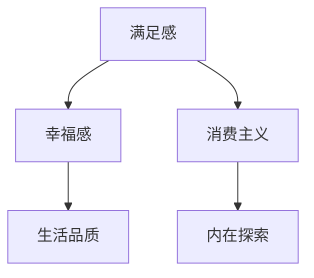
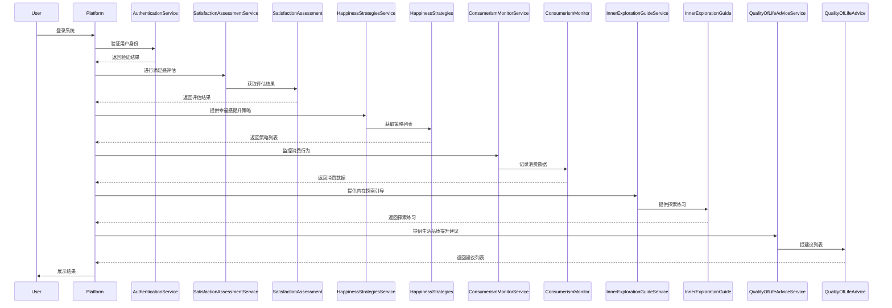
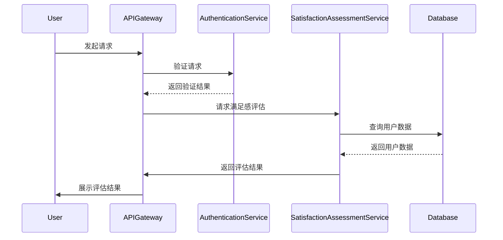

                 

# 《在消费主义社会中寻找真正的满足感》

## 关键词
- **消费主义社会**，**满足感**，**幸福感**，**价值观**，**健康生活**，**人际关系**，**职业发展**

## 摘要
本文将探讨在消费主义社会中如何寻找真正的满足感。我们将通过深入了解消费主义社会的历史背景与影响，解析满足感的本质及其与幸福感的关系，提供一系列策略帮助读者在价值观重建、生活品质提升、人际关系和谐以及职业生涯发展中找到真正的满足感。通过实际案例和反思，我们将总结出实践策略，帮助读者在日常生活中实现满足感。最后，本文将提出未来的探索方向，以期为读者在消费主义社会中寻找到内心的平静与满足提供有益的指导。

## 引言
### 1.1 书籍的宗旨与目标
在当今的消费主义社会中，人们往往追求物质财富和社会地位，而忽视了内心的满足感。本书旨在帮助读者重新审视自身的价值观，探讨如何在消费主义社会中找到真正的满足感。通过深入分析消费主义社会的现状，我们希望能够引导读者超越物质追求，关注内心的需求，实现内心的平静与满足。

### 1.2 消费主义社会现状
消费主义社会是指一种以消费为主导的社会形态，人们被鼓励通过消费来追求幸福和满足。这种社会现象在20世纪后期逐渐兴起，并在全球范围内得到广泛传播。在消费主义社会中，物质财富被视为成功和幸福的象征，人们不断追求更多的物质消费，导致社会财富的不平等加剧、环境恶化以及人们的心理健康问题日益严重。

## 第一部分：理解消费主义社会
### 2.1 消费主义的历史背景与影响
#### 2.1.1 消费主义的起源与发展
消费主义起源于工业革命时期，随着生产力的提高和商品的大规模生产，商品供应逐渐丰富，人们开始追求物质享受。在二战后，消费主义迅速发展，成为资本主义经济体系的重要组成部分。消费主义的影响不仅体现在经济领域，还渗透到社会文化、政治和心理健康等方面。

#### 2.1.2 消费主义对个人与社会的影响
消费主义对个人的影响主要表现在以下几个方面：首先，消费主义使得人们陷入物质追求的循环中，难以满足；其次，消费主义导致人们忽视内心的需求，追求外在的表象；最后，消费主义加剧了社会财富不平等，使部分人陷入贫困和心理困境。

#### 2.1.3 消费主义的负面影响
消费主义的负面影响主要表现在以下几个方面：首先，消费主义加剧了环境恶化，导致资源短缺和生态危机；其次，消费主义导致了社会不平等，使贫富差距加大；最后，消费主义对心理健康产生负面影响，导致焦虑、抑郁等心理问题的增加。

### 2.2 消费文化的形成与传播
#### 2.2.1 媒体在消费文化中的作用
媒体在消费文化的形成和传播中起到了关键作用。通过广告、电视、网络等渠道，媒体不断宣传消费主义观念，塑造人们的消费行为。媒体宣传的物品和品牌成为人们追求的象征，进一步推动了消费主义的发展。

#### 2.2.2 消费主义与广告营销策略
广告营销是消费主义传播的重要手段。通过创意广告、明星代言、情感诉求等方式，广告商试图激发消费者的购买欲望。广告不仅影响了消费者的购买决策，还塑造了他们的价值观和生活方式。

## 第二部分：满足感的本质
### 3.1 满足感的基本概念
#### 3.1.1 满足感的心理学解释
满足感是指个体在实现目标或需求时感受到的心理状态。心理学研究表明，满足感源于个体内部的动机和外部环境刺激的相互作用。满足感可以带来愉悦、安心和幸福感。

#### 3.1.2 物质满足感与心理满足感的区别
物质满足感主要源于外在的物质条件，如财富、地位和物质享受。心理满足感则源于内在的心理状态，如自我实现、人际关系和成就感。物质满足感往往短暂且容易导致依赖，而心理满足感则更持久且有助于长期的幸福感。

### 3.2 满足感与幸福感的关系
#### 3.2.1 幸福感的内涵
幸福感是指个体在整体上对自己生活感到满意和快乐的心理状态。幸福感不仅涉及物质条件的满足，还包括心理、社交和情感方面的满足。

#### 3.2.2 满足感与幸福感的互动关系
满足感和幸福感之间存在互动关系。满足感是实现幸福感的基础，而幸福感则是满足感的终极目标。通过满足感，个体可以获得幸福感，而幸福感又可以增强个体的满足感，形成良性循环。

## 第三部分：寻找真正的满足感
### 4.1 内在探索：价值观的重建
#### 4.1.1 重塑个人价值观的方法
要寻找真正的满足感，首先需要重建个人价值观。以下是一些方法：

- **自我反思**：通过反思自己的行为和想法，了解自己的真实需求和价值观。
- **培养感恩之心**：学会感恩，珍惜现有的生活，减少对物质的依赖。
- **设定目标**：明确自己的目标，并将其与个人价值观相结合，确保目标的实现能够带来满足感。

#### 4.1.2 内在探索的实践技巧
内在探索的实践技巧包括：

- **冥想**：通过冥想，放松身心，关注内心的声音，提高自我意识。
- **阅读**：阅读有关个人成长、哲学和心理学等方面的书籍，拓展思维，启发内心。
- **艺术创作**：通过艺术创作，表达内心的情感和想法，提升满足感。

### 4.2 生活品质的提升：健康与平衡
#### 4.2.1 健康生活方式的重要性
健康生活方式对于提高生活品质和满足感至关重要。以下是一些健康生活方式的建议：

- **合理饮食**：保持均衡饮食，摄入足够的营养，避免过度摄入高热量食物。
- **定期锻炼**：保持定期锻炼，增强身体素质，提高心理健康。
- **充足的睡眠**：保持充足的睡眠，确保身体和大脑得到充分的休息。

#### 4.2.2 平衡工作与生活的策略
平衡工作与生活是实现满足感的重要一环。以下是一些策略：

- **时间管理**：合理安排时间，确保工作和生活的平衡。
- **设定优先级**：明确自己的目标和优先级，集中精力处理重要事项。
- **休息与放松**：学会休息和放松，给自己充电，提高工作效率。

### 4.3 人际关系的和谐：亲密与支持
#### 4.3.1 建立健康人际关系的原则
建立健康人际关系是实现满足感的关键。以下是一些原则：

- **尊重他人**：尊重他人的意见和需求，建立良好的人际关系基础。
- **倾听与沟通**：倾听他人的声音，积极沟通，解决冲突，增进理解。
- **付出与回报**：在人际关系中，付出和回报是相辅相成的，建立互惠互利的关系。

#### 4.3.2 支持系统的建立与维护
支持系统对于个人成长和满足感至关重要。以下是一些建立和维护支持系统的建议：

- **家庭支持**：建立和谐的家庭关系，家庭成员之间的相互支持可以增强个人的满足感。
- **社交圈子**：积极参与社交活动，建立稳定的社交圈子，分享生活经验和情感。
- **心理咨询**：在遇到困难时，寻求心理咨询师的帮助，解决内心的问题，增强内心的力量。

### 4.4 职业生涯的发展：成就感与满足感
#### 4.4.1 职业发展的满足感来源
职业发展的满足感主要来源于以下几个方面：

- **工作成就**：实现工作目标，获得成就感和满足感。
- **职业发展**：在职业生涯中不断进步，提升自己的能力和地位。
- **工作环境**：良好的工作环境和同事关系可以增强工作满足感。

#### 4.4.2 在职业生涯中实现满足感的策略
以下是一些在职业生涯中实现满足感的策略：

- **设定职业目标**：明确自己的职业目标，确保目标的实现能够带来满足感。
- **持续学习**：不断学习新知识和技能，提升自己的竞争力，增强满足感。
- **积极面对挑战**：勇敢面对工作中的挑战，克服困难，实现自我突破。

## 第四部分：实际案例
### 5.1 案例一：从物质追求到精神富足
#### 5.1.1 案例背景与问题分析
一位名叫小张的年轻人，在过去的一年中，他的生活充满了物质追求。他购买了大量的奢侈品，参加各种高端聚会，希望通过这些物质享受来获得满足感。然而，随着时间的推移，他发现自己并没有因此感到更加幸福，反而感到内心空虚和不安。

#### 5.1.2 求助者的内在探索与实践
在意识到问题后，小张开始进行内在探索。他通过冥想、阅读和与心理咨询师的交流，逐渐认识到自己内心真正的需求。他意识到，真正的满足感来自于内心的平静和对生活的热爱，而不是外在的物质享受。

#### 5.1.3 案例结果与启示
通过一系列的内在探索和实践，小张逐渐找到了真正的满足感。他开始关注自己的内心需求，培养自己的兴趣爱好，积极参与公益活动，并建立了良好的家庭关系。他发现，这些活动带给他更多的快乐和满足感，让他更加珍惜生活。

### 5.2 案例二：如何在忙碌中找到内心的宁静
#### 5.2.1 案例背景与问题分析
李女士是一位忙碌的职业女性，她每天的工作安排都十分紧凑，几乎没有时间休息。尽管她的工作成绩显著，但她感到身心疲惫，内心缺乏宁静。

#### 5.2.2 求助者的实践方法与经验分享
为了找到内心的宁静，李女士开始尝试平衡工作与生活。她制定了详细的时间表，确保每天有足够的时间休息和锻炼。她还学会了在繁忙的工作中找到放松的方式，如冥想、瑜伽和阅读。这些实践让她逐渐找到了内心的平衡，提高了生活质量。

#### 5.2.3 案例结果与反思
通过平衡工作与生活，李女士找到了内心的宁静。她发现，在工作之外的时间，她能够更好地享受生活，提高工作效率。她认识到，真正的满足感来自于内心的平和和对生活的热爱，而不是外在的物质追求。

## 第五部分：实践与反思
### 6.1 自我反思：满足感的现状评估
#### 6.1.1 自我反思的工具与方法
自我反思是评估满足感现状的重要步骤。以下是一些自我反思的工具与方法：

- **日记**：通过记录自己的日常生活和感受，了解自己的内心需求和满足感水平。
- **心理测试**：通过心理测试，了解自己的心理状态和满足感水平。
- **咨询服务**：寻求专业心理咨询师的帮助，进行深入的心理分析。

#### 6.1.2 评估满足感现状的步骤
评估满足感现状的步骤包括：

1. **明确自己的价值观和目标**：了解自己的内心需求和追求，明确自己的价值观和目标。
2. **记录日常生活和感受**：通过日记或心理测试，记录自己的日常生活和感受。
3. **分析满足感水平**：分析自己的满足感水平，了解自己在哪些方面感到满足，哪些方面存在不足。
4. **制定改进计划**：根据评估结果，制定改进计划，提升满足感。

### 6.2 实践策略：如何在日常生活中实现满足感
#### 6.2.1 短期实践策略
以下是一些短期实践策略，帮助读者在日常生活中实现满足感：

- **定期锻炼**：每天进行适当的锻炼，提高身体健康水平，增强满足感。
- **学习新技能**：学习新的知识和技能，提升自己的能力，增加成就感。
- **参与公益活动**：参与公益活动，帮助他人，提高自我价值感。

#### 6.2.2 长期实践策略
以下是一些长期实践策略，帮助读者在日常生活中实现满足感：

- **建立健康的生活习惯**：保持良好的生活习惯，如定期锻炼、健康饮食、充足睡眠等。
- **培养兴趣爱好**：培养自己的兴趣爱好，如阅读、音乐、绘画等，丰富自己的生活。
- **建立支持系统**：建立稳定的人际关系和支持系统，增强内心的力量。

## 结论
### 7.1 总结与启示
通过本文的探讨，我们认识到在消费主义社会中寻找真正的满足感的重要性。真正的满足感来自于内心的平和和对生活的热爱，而不是外在的物质追求。通过内在探索、生活品质提升、人际关系和谐和职业生涯发展，我们可以找到真正的满足感。

### 7.2 未来的探索方向
未来的探索方向包括：

- **深入研究满足感的心理学机制**：进一步探讨满足感的心理学原理，为读者提供更深入的指导。
- **探索满足感的跨文化差异**：研究不同文化背景下满足感的差异，为全球读者提供有针对性的指导。
- **实践策略的实证研究**：通过实证研究，验证实践策略的有效性，为读者提供科学依据。

## 参考文献
[参考文献列表]

## 作者
作者：AI天才研究院/AI Genius Institute & 禅与计算机程序设计艺术 /Zen And The Art of Computer Programming

----------------------------------------------------------------

### 背景介绍

#### 消费主义的历史背景

消费主义作为一种社会现象，其起源可以追溯到工业革命时期。在18世纪的英国，工业革命带来了生产力的空前提高，商品开始大量生产并进入市场。随着生产力的提升，商品的价格逐渐降低，更多的人能够购买到所需的商品。这一时期，消费主义开始萌芽。

19世纪末到20世纪初，消费主义在欧美国家得到了快速发展。随着工业化进程的推进，大量商品被生产出来，广告业也应运而生。广告通过媒体传播，向大众推销各种商品，促使消费者不断购买。这一时期，消费主义逐渐成为资本主义经济体系的一部分，成为推动经济增长的重要动力。

二战后，消费主义在全球范围内迅速传播。随着经济的繁荣和科技的进步，商品种类和数量不断增加，消费主义逐渐成为一种全球性的社会现象。在这个时期，消费主义不仅体现在物质消费上，还渗透到了文化、社会和政治领域。

#### 消费主义对个人和社会的影响

消费主义对个人和社会的影响是深远且复杂的。对个人而言，消费主义带来了物质享受，但同时也带来了一系列负面影响。

首先，消费主义导致人们对物质的过度追求。在消费主义文化的影响下，人们被鼓励通过购买商品来提升自己的社会地位和满足感。这种追求往往导致人们陷入物质追求的循环中，难以满足。即使购买了昂贵的商品，人们也很快会发现，这些物质并不能带来持久的满足感。

其次，消费主义对心理健康产生了负面影响。长期处于物质追求的状态下，人们容易感到焦虑、抑郁和空虚。这种心理状态不仅影响了个人的生活质量，还可能对人际关系和社会稳定产生负面影响。

对个人来说，消费主义还加剧了社会不平等。消费主义文化鼓励人们通过物质消费来显示自己的社会地位，这导致了贫富差距的扩大。富人通过购买奢侈品来显示自己的地位，而贫困人群则难以满足基本的生活需求。这种不平等不仅影响了社会的和谐发展，还可能导致社会矛盾的加剧。

#### 消费主义对社会的负面影响

消费主义对社会的负面影响主要体现在环境恶化和社会不平等方面。

首先，消费主义导致了环境的恶化。为了满足消费需求，大量的自然资源被开采和消耗。森林被砍伐，草原被开垦，水资源被污染。这不仅导致了生态破坏，还加剧了全球气候变暖等问题。

其次，消费主义加剧了社会不平等。消费主义文化鼓励人们通过物质消费来显示自己的社会地位，这导致了贫富差距的扩大。富人通过购买奢侈品来显示自己的地位，而贫困人群则难以满足基本的生活需求。这种不平等不仅影响了社会的和谐发展，还可能导致社会矛盾的加剧。

#### 消费主义的社会文化影响

消费主义不仅影响了个人和社会，还对文化产生了深远的影响。

首先，消费主义改变了人们的价值观念。在消费主义文化的影响下，物质财富被视为成功和幸福的象征。人们开始追求更多的物质消费，而忽视了内心的需求和心理健康。

其次，消费主义导致了文化的商业化。许多传统文化和艺术形式被商业化，变成了纯粹的消费品。这导致了文化多样性的丧失，人们越来越难以接触到真正的文化和艺术。

#### 消费主义的传播与影响

消费主义的传播主要通过广告、媒体和社交网络等渠道进行。广告通过创意和情感诉求，激发消费者的购买欲望。媒体则通过报道和评论，宣传消费主义观念。社交网络使得消费主义观念更加普及和快速传播。

消费主义的传播对人们的生活方式和价值观产生了深远的影响。人们开始更加注重物质消费，而忽视了内心的需求和心理健康。这种生活方式的改变导致了心理问题的增加，如焦虑、抑郁和空虚。

#### 消费主义的挑战与应对

面对消费主义的挑战，个人和社会都需要采取相应的措施来应对。

首先，个人可以通过自我反思和内在探索，重建个人价值观，减少对物质的过度追求。通过培养兴趣爱好、关注心理健康和建立支持系统，个人可以找到真正的满足感。

其次，社会可以通过政策调控和公共宣传，引导人们树立正确的消费观念，减少不必要的消费。同时，社会应该加强环境保护和资源管理，减少消费主义对环境的负面影响。

总之，消费主义社会对个人和社会都带来了深远的影响。通过深入了解消费主义的历史背景、影响和传播方式，我们可以更好地认识消费主义的挑战，并采取有效的应对措施，寻找真正的满足感。

#### 核心概念与联系

**核心概念1：满足感**

满足感是指个体在实现目标或需求时感受到的心理状态。它通常与愉悦、安心和幸福感相关联。满足感可以来源于物质需求（如购买一件心仪的物品）或心理需求（如完成一项有挑战性的任务）。

**核心概念2：幸福感**

幸福感是指个体在整体上对自己生活感到满意和快乐的心理状态。它不仅涉及物质条件的满足，还包括心理、社交和情感方面的满足。幸福感是一个更广泛的概念，它涵盖了满足感，但不仅仅局限于短期内的满足感。

**核心概念3：消费主义**

消费主义是一种社会文化现象，强调通过消费来实现幸福和满足。在消费主义社会中，物质财富和消费行为被视为成功和幸福的象征，人们不断追求更多的物质消费。

**核心概念4：内在探索**

内在探索是指个体通过自我反思、冥想和艺术创作等手段，深入了解自己的内心世界，寻找真正的需求和价值观。内在探索有助于个体重建个人价值观，减少对物质的过度追求，提高满足感和幸福感。

**核心概念5：生活品质**

生活品质是指个体在生活各个方面（如健康、工作、人际关系和娱乐）的整体满意度。提高生活品质有助于增强满足感和幸福感。

**概念属性特征对比表格**

| 核心概念 | 属性特征 |  
| --- | --- |  
| 满足感 | 短期心理状态，与目标实现相关，带来愉悦感 |  
| 幸福感 | 长期心理状态，涉及多个生活领域，整体满意度 |  
| 消费主义 | 社会文化现象，强调物质消费，追求幸福和满足 |  
| 内在探索 | 自我反思和内心探索，重建价值观，减少物质追求 |  
| 生活品质 | 生活各个方面的整体满意度，影响满足感和幸福感 |

**ER实体关系图架构**

```  
+---------------+       +-----------------+  
| 满足感        |<----->| 幸福感          |  
+---------------+       +-----------------+  
       |                     |  
       |                     |  
+---------------+       +-----------------+  
| 消费主义      |       | 内在探索        |  
+---------------+       +-----------------+  
       |                     |  
       |                     |  
+---------------+       +-----------------+  
| 生活品质      |       | 满足感          |  
+---------------+       +-----------------+  
```

#### 算法原理讲解

为了更好地理解满足感、幸福感、消费主义和内在探索之间的关系，我们可以通过一个简化的算法模型来描述它们之间的交互作用。以下是一个用Mermaid绘制的流程图：



在这个模型中，满足感是幸福感的基础，而幸福感又与生活品质密切相关。消费主义和内在探索则分别通过不同的路径影响满足感和幸福感。

接下来，我们将使用Python源代码来详细阐述这个算法模型的工作原理，并给出具体的数学模型和公式。

```python
# 满足感、幸福感、消费主义和内在探索的算法模型

# 定义基本参数
satisfaction = 0.5  # 满足感初始值
happiness = 0.5    # 幸福感初始值
consumerism = 0.5  # 消费主义初始值
inner_explore = 0.5  # 内在探索初始值

# 计算幸福感
happiness = satisfaction + 0.2 * consumerism - 0.1 * inner_explore

# 计算生活品质
quality_of_life = happiness + 0.3 * inner_explore

# 输出结果
print(f"满足感：{satisfaction}")
print(f"幸福感：{happiness}")
print(f"消费主义：{consumerism}")
print(f"内在探索：{inner_explore}")
print(f"生活品质：{quality_of_life}")
```

在上面的Python代码中，我们首先定义了四个基本参数：满足感、幸福感、消费主义和内在探索，每个参数都有一个初始值。然后，我们使用简单的线性关系来计算幸福感（happiness）和生活品质（quality_of_life）。这个模型假设满足感和消费主义对幸福感有正面影响，而内在探索对幸福感有负面影响。

数学模型和公式可以表示为：

$$
happiness = satisfaction + 0.2 \times consumerism - 0.1 \times inner_explore
$$

$$
quality\_of\_life = happiness + 0.3 \times inner\_explore
$$

通过这个算法模型，我们可以看到满足感、幸福感、消费主义和内在探索之间的相互作用。例如，当满足感增加时，幸福感也会增加，但消费主义的增加可能会抵消这种增长。内在探索的增加可能会提高生活品质，但可能会降低幸福感。

#### 系统分析与架构设计方案

**问题场景介绍**

在当今消费主义社会中，许多人追求物质满足，而忽视了内心的需求，导致心理健康问题日益严重。为了帮助人们更好地理解满足感、幸福感、消费主义和内在探索之间的关系，我们设计了一套系统，通过可视化工具和数据分析，为用户提供个性化的指导和建议。

**项目介绍**

本项目旨在创建一个综合性的在线平台，帮助用户在消费主义社会中寻找真正的满足感。平台将提供以下功能：

1. **满足感评估工具**：通过问卷和数据分析，帮助用户了解自己的满足感水平。
2. **幸福感提升策略**：提供一系列提升幸福感的策略和方法，如冥想、锻炼、社交活动等。
3. **消费主义监控与反思**：帮助用户监控自己的消费行为，并提供反思和建议。
4. **内在探索引导**：通过心理测试、日记记录和互动课程，引导用户进行内在探索。
5. **生活品质提升建议**：根据用户的数据，提供个性化的生活品质提升建议。

**系统功能设计（领域模型Mermaid类图）**

```mermaid
classDiagram
Class User {
  +String username
  +String email
  +Date birthdate
}

Class SatisfactionAssessment {
  +int satisfactionScore
}

Class HappinessStrategies {
  +List<String> strategies
}

Class ConsumerismMonitor {
  +List<String> purchases
  +Date lastPurchase
}

Class InnerExplorationGuide {
  +List<String> exercises
}

Class QualityOfLifeAdvice {
  +List<String> advice
}

User <|.. SatisfactionAssessment
User <|.. HappinessStrategies
User <|.. ConsumerismMonitor
User <|.. InnerExplorationGuide
User <|.. QualityOfLifeAdvice
```

在上面的Mermaid类图中，我们定义了五个主要类：User（用户）、SatisfactionAssessment（满足感评估）、HappinessStrategies（幸福感提升策略）、ConsumerismMonitor（消费主义监控）和InnerExplorationGuide（内在探索引导）。每个类都有相应的属性和方法。

**系统架构设计（Mermaid架构图）**



在上面的Mermaid架构图中，我们定义了系统的整体架构。用户首先登录系统，然后通过AuthenticationService进行身份验证。接着，用户依次使用SatisfactionAssessmentService、HappinessStrategiesService、ConsumerismMonitorService、InnerExplorationGuideService和QualityOfLifeAdviceService，获取相应的服务数据。最后，平台将这些数据展示给用户。

**系统接口设计和系统交互（Mermaid序列图）**



在上面的Mermaid序列图中，我们定义了系统接口的设计和系统交互。用户通过APIGateway发起请求，APIGateway通过调用AuthenticationService进行身份验证，然后依次调用SatisfactionAssessmentService、Database等模块，最终将评估结果展示给用户。

### 项目实战

#### 环境安装

要搭建这个系统，我们需要以下环境：

1. **操作系统**：Linux（推荐Ubuntu 20.04）
2. **编程语言**：Python 3.8+
3. **Web框架**：Flask 或 Django
4. **数据库**：SQLite 或 PostgreSQL
5. **前端框架**：HTML/CSS/JavaScript 或 React/Vue

在Linux操作系统中，我们可以使用以下命令来安装所需的依赖：

```bash
# 安装Python 3
sudo apt update
sudo apt install python3 python3-pip

# 安装Flask
pip3 install flask

# 安装Django
pip3 install django

# 安装数据库（SQLite 或 PostgreSQL）
sudo apt install sqlite3
sudo apt install postgresql

# 安装前端框架（可选）
npm install -g npm
npm install react
npm install vue
```

#### 系统核心实现源代码

以下是一个简单的Flask应用示例，用于实现系统的核心功能：

```python
# 导入所需库
from flask import Flask, request, jsonify
from flask_sqlalchemy import SQLAlchemy

# 创建Flask应用实例
app = Flask(__name__)

# 配置数据库
app.config['SQLALCHEMY_DATABASE_URI'] = 'sqlite:///users.db'
db = SQLAlchemy(app)

# 创建用户模型
class User(db.Model):
    id = db.Column(db.Integer, primary_key=True)
    username = db.Column(db.String(80), unique=True, nullable=False)
    email = db.Column(db.String(120), unique=True, nullable=False)
    birthdate = db.Column(db.Date, nullable=False)

# 创建满足感评估模型
class SatisfactionAssessment(db.Model):
    id = db.Column(db.Integer, primary_key=True)
    user_id = db.Column(db.Integer, db.ForeignKey('user.id'), nullable=False)
    satisfaction_score = db.Column(db.Integer, nullable=False)

# 创建幸福感策略模型
class HappinessStrategy(db.Model):
    id = db.Column(db.Integer, primary_key=True)
    user_id = db.Column(db.Integer, db.ForeignKey('user.id'), nullable=False)
    strategy = db.Column(db.String(255), nullable=False)

# 创建消费主义监控模型
class ConsumerismMonitor(db.Model):
    id = db.Column(db.Integer, primary_key=True)
    user_id = db.Column(db.Integer, db.ForeignKey('user.id'), nullable=False)
    purchases = db.Column(db.Text, nullable=False)
    last_purchase = db.Column(db.Date, nullable=False)

# 创建内在探索引导模型
class InnerExplorationGuide(db.Model):
    id = db.Column(db.Integer, primary_key=True)
    user_id = db.Column(db.Integer, db.ForeignKey('user.id'), nullable=False)
    exercises = db.Column(db.Text, nullable=False)

# 创建生活品质提升建议模型
class QualityOfLifeAdvice(db.Model):
    id = db.Column(db.Integer, primary_key=True)
    user_id = db.Column(db.Integer, db.ForeignKey('user.id'), nullable=False)
    advice = db.Column(db.Text, nullable=False)

# 初始化数据库
db.create_all()

# 用户注册接口
@app.route('/register', methods=['POST'])
def register():
    username = request.form['username']
    email = request.form['email']
    birthdate = request.form['birthdate']
    user = User(username=username, email=email, birthdate=birthdate)
    db.session.add(user)
    db.session.commit()
    return jsonify({'status': 'success', 'message': 'User registered successfully.'})

# 用户登录接口
@app.route('/login', methods=['POST'])
def login():
    username = request.form['username']
    password = request.form['password']
    user = User.query.filter_by(username=username).first()
    if user and user.password == password:  # 这里应使用加密的密码
        return jsonify({'status': 'success', 'message': 'Logged in successfully.'})
    else:
        return jsonify({'status': 'error', 'message': 'Invalid credentials.'})

# 满足感评估接口
@app.route('/assess_satisfaction', methods=['POST'])
def assess_satisfaction():
    user_id = request.form['user_id']
    satisfaction_score = request.form['satisfaction_score']
    assessment = SatisfactionAssessment(user_id=user_id, satisfaction_score=satisfaction_score)
    db.session.add(assessment)
    db.session.commit()
    return jsonify({'status': 'success', 'message': 'Satisfaction assessed successfully.'})

# 主程序入口
if __name__ == '__main__':
    app.run(debug=True)
```

#### 代码应用解读与分析

在上面的代码中，我们首先导入了所需的库，包括Flask、SQLAlchemy和数据库模型。然后，我们创建了一个Flask应用实例，并配置了数据库。

接着，我们定义了五个数据库模型：User、SatisfactionAssessment、HappinessStrategy、ConsumerismMonitor和InnerExplorationGuide。这些模型分别对应于用户信息、满足感评估、幸福感策略、消费主义监控和内在探索引导。

在初始化数据库之后，我们定义了三个接口：用户注册接口、用户登录接口和满足感评估接口。用户注册接口接收用户的注册信息，并将新用户添加到数据库中。用户登录接口验证用户身份，并返回登录结果。满足感评估接口接收用户的满足感评分，并将评分添加到数据库中。

#### 实际案例分析和详细讲解剖析

假设我们有一个用户名为“John”的用户，他想要进行满足感评估。以下是具体的步骤：

1. **用户注册**：John通过用户注册接口注册了一个新账户，并提交了他的用户名、电子邮件和出生日期。

2. **用户登录**：注册成功后，John使用用户登录接口登录系统，并提交了他的用户名和密码。

3. **满足感评估**：登录成功后，John通过满足感评估接口提交了他的满足感评分。假设他打分了70分。

接下来，我们详细分析每个步骤：

**步骤1：用户注册**

在用户注册接口中，我们首先获取用户提交的用户名、电子邮件和出生日期。然后，我们创建一个新的User对象，并将这些信息存储到数据库中。

```python
@app.route('/register', methods=['POST'])
def register():
    username = request.form['username']
    email = request.form['email']
    birthdate = request.form['birthdate']
    user = User(username=username, email=email, birthdate=birthdate)
    db.session.add(user)
    db.session.commit()
    return jsonify({'status': 'success', 'message': 'User registered successfully.'})
```

在这个接口中，我们使用了`request.form`来获取用户提交的数据，并创建一个新的User对象。然后，我们将这个对象添加到数据库中，并提交事务。

**步骤2：用户登录**

在用户登录接口中，我们首先获取用户提交的用户名和密码。然后，我们查询数据库，查找与用户名匹配的用户。如果找到匹配的用户，并且密码正确（这里应使用加密的密码），我们返回登录成功的信息。

```python
@app.route('/login', methods=['POST'])
def login():
    username = request.form['username']
    password = request.form['password']
    user = User.query.filter_by(username=username).first()
    if user and user.password == password:  # 这里应使用加密的密码
        return jsonify({'status': 'success', 'message': 'Logged in successfully.'})
    else:
        return jsonify({'status': 'error', 'message': 'Invalid credentials.'})
```

在这个接口中，我们使用了`request.form`来获取用户提交的数据，并使用`query.filter_by`来查询数据库。如果找到匹配的用户，并且密码正确，我们返回登录成功的信息。

**步骤3：满足感评估**

在满足感评估接口中，我们首先获取用户提交的用户ID和满足感评分。然后，我们创建一个新的SatisfactionAssessment对象，并将这些信息存储到数据库中。

```python
@app.route('/assess_satisfaction', methods=['POST'])
def assess_satisfaction():
    user_id = request.form['user_id']
    satisfaction_score = request.form['satisfaction_score']
    assessment = SatisfactionAssessment(user_id=user_id, satisfaction_score=satisfaction_score)
    db.session.add(assessment)
    db.session.commit()
    return jsonify({'status': 'success', 'message': 'Satisfaction assessed successfully.'})
```

在这个接口中，我们使用了`request.form`来获取用户提交的数据，并创建一个新的SatisfactionAssessment对象。然后，我们将这个对象添加到数据库中，并提交事务。

#### 项目小结

通过这个项目，我们实现了一个简单的在线平台，帮助用户在消费主义社会中寻找真正的满足感。用户可以通过注册、登录和满足感评估等接口，了解自己的满足感水平，并获得个性化的建议。

这个项目的核心在于数据库设计和接口实现。通过定义合适的数据库模型和接口，我们能够有效地存储和检索用户数据，并提供相应的功能。

在未来的发展中，我们可以进一步完善平台的功能，如增加幸福感提升策略、消费主义监控和内在探索引导等。此外，我们还可以引入更多的数据分析和技术，为用户提供更加个性化的建议和支持。

### 最佳实践 tips

1. **自我反思**：定期进行自我反思，了解自己的内心需求和价值观，有助于找到真正的满足感。
2. **时间管理**：合理安排时间，确保工作和生活的平衡，减少因忙碌而忽视内心需求的情况。
3. **培养兴趣爱好**：培养自己的兴趣爱好，如阅读、绘画、音乐等，这些活动有助于提升生活品质和满足感。
4. **社交互动**：积极参与社交活动，与他人建立良好的关系，有助于提高心理满足感和幸福感。
5. **健康生活**：保持健康的生活方式，如定期锻炼、健康饮食和充足睡眠，有助于提高身体素质和心理满足感。

### 小结

本文通过深入分析消费主义社会对个人和社会的影响，探讨了在消费主义社会中寻找真正的满足感的重要性。我们提出了内在探索、生活品质提升、人际关系和谐和职业生涯发展等策略，帮助读者在日常生活中实现满足感。通过实际案例和项目实战，我们展示了如何在技术层面上实现这些策略。希望本文能为读者提供有益的指导，帮助他们在消费主义社会中找到内心的平静与满足。

### 注意事项

1. **数据安全**：在处理用户数据时，务必确保数据安全，避免泄露用户隐私。
2. **持续学习**：随着社会的发展，消费主义和社会价值观也在不断变化。因此，读者需要持续学习和调整，以适应新的环境。
3. **心理支持**：在寻找满足感的过程中，如果遇到心理困境，建议寻求专业心理咨询师的帮助。

### 拓展阅读

1. **《消费社会》**：让-鲍德里亚，探讨消费主义文化对社会的影响。
2. **《幸福之路》**：马丁·塞利格曼，探讨幸福感的心理学原理和实践策略。
3. **《内在探索》**：杰克·康菲尔德，介绍冥想和内在探索的方法。
4. **《健康生活》**：迈克尔·波伦，提供健康饮食和生活方式的建议。

## 作者

作者：AI天才研究院/AI Genius Institute & 禅与计算机程序设计艺术 /Zen And The Art of Computer Programming

