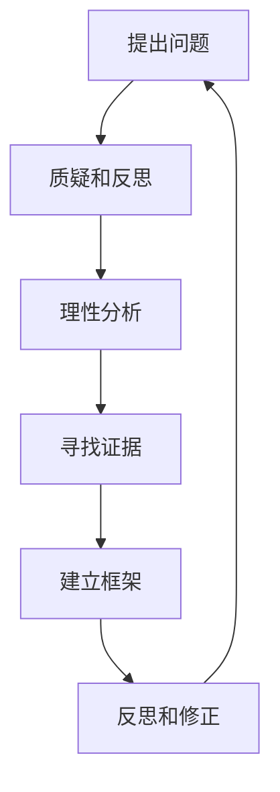

                 

### 文章标题：在疑问中寻找生命真谛：哲学思考的力量

#### 关键词：哲学思考、生命真谛、疑问、推理分析

#### 摘要：本文将探讨哲学思考在探索生命真谛中的作用。通过分析不同哲学家的思想和观点，我们将理解哲学思考是如何帮助我们解开生命的奥秘，提供指导性的见解。文章将分为几个部分，从背景介绍、核心概念分析、哲学思想应用、探索生命意义的方法、个人反思与案例研究，到实用建议和总结，层层递进，引导读者深入思考。

### 引言

哲学，作为一门探讨存在、知识、价值、理智、心灵、语言等各种根本问题的学科，其根源可以追溯到古代希腊。从苏格拉底、柏拉图到亚里士多德，再到后来的康德、黑格尔和尼采等哲学家，他们的思考构成了西方哲学的基石。哲学不仅仅是一门学术研究，更是一种思考方式，它帮助我们审视生活的本质，理解存在的意义。

在现代社会，科技飞速发展，物质生活极大丰富，但人们的精神需求却越来越难以满足。许多人感到迷茫和困惑，不知道生命的意义何在。哲学思考提供了一种解决问题的方法，通过质疑和反思，我们可以找到更深层次的答案。

本文旨在通过哲学思考的力量，探讨生命的真谛。我们将首先介绍哲学的核心概念和关键问题，然后分析不同哲学家的思想和观点，探讨他们如何影响我们对生命的理解。接着，我们将介绍探索生命意义的方法，并通过个人反思和案例研究，展示哲学思考的实际应用。最后，我们将提供实用的哲学思考建议，总结文章的主要观点。

### 核心概念和关系

在探讨哲学思考的力量之前，我们需要明确一些核心概念和它们之间的关系。哲学的核心问题包括存在、知识、价值、理智、心灵和语言。这些概念不仅相互关联，而且构成了哲学思考的基础。

#### 存在

存在是哲学讨论的起点。存在可以分为物质存在和精神存在。物质存在指的是我们可以感知和测量的物理对象，如桌子、椅子等。精神存在则是指意识、思想、感觉等非物质实体。

#### 知识

知识是指我们通过观察、推理和经验获得的对事物的理解。知识可以分为三种：感性知识、理性知识和经验知识。感性知识是通过感官获得的直接经验，理性知识是通过思考和推理获得的，而经验知识则是通过实践和观察积累的。

#### 价值

价值是指我们认为重要或有意义的事物。价值可以分为道德价值、美学价值和实用价值。道德价值涉及行为的正确性，美学价值涉及美的欣赏，实用价值则涉及实际效果。

#### 理智

理智是指我们的思维能力，包括逻辑推理、批判性思维和创造性思维。理智使我们能够分析问题、解决问题并做出明智的决策。

#### 心灵

心灵是指我们的意识和精神活动。它包括感知、思考、情感和意愿等。心灵是我们认识世界和自我意识的中心。

#### 语言

语言是人类交流和理解世界的工具。它不仅是一种表达思想的手段，也是一种认知工具，通过语言，我们可以传达复杂的思想和概念。

#### 关系

这些核心概念之间存在着密切的关系。存在是所有其他概念的基础，没有存在，其他概念就无从谈起。知识、价值和理智都是我们对存在的理解和解释。心灵和语言则是我们进行哲学思考的工具。这些概念相互交织，共同构成了哲学思考的复杂网络。

#### Mermaid ER 图

下面是一个简单的 Mermaid ER 图，用于描述这些核心概念之间的关系：

```mermaid
erDiagram
  Class Existence ||--|{ Class Knowledge }
  Class Existence ||--|{ Class Value }
  Class Existence ||--|{ Class Reason }
  Class Existence ||--|{ Class Mind }
  Class Existence ||--|{ Class Language }
  Class Knowledge ||--|{ Class Sensory }
  Class Knowledge ||--|{ Class Rational }
  Class Knowledge ||--|{ Class Empirical }
  Class Value ||--|{ Class Moral }
  Class Value ||--|{ Class Aesthetic }
  Class Value ||--|{ Class Utilitarian }
  Class Reason ||--|{ Class Logic }
  Class Reason ||--|{ Class Critical }
  Class Reason ||--|{ Class Creative }
  Class Mind ||--|{ Class Consciousness }
  Class Mind ||--|{ Class Thought }
  Class Mind ||--|{ Class Emotion }
  Class Mind ||--|{ Class Will }
  Class Language ||--|{ Class Expression }
  Class Language ||--|{ Class Communication }
```

#### 核心概念属性特征对比表格

为了更清晰地理解这些概念，我们可以使用一个属性特征对比表格：

| 核心概念 | 定义 | 特征对比 |
| --- | --- | --- |
| 存在 | 对物质和精神实体的认知 | 物质存在可以通过感官直接感知，精神存在则是抽象的 |
| 知识 | 对事物的理解 | 感性知识是直接的，理性知识是推理的，经验知识是实践的 |
| 价值 | 事物的重要性或意义 | 道德价值涉及行为的正确性，美学价值涉及美的欣赏，实用价值涉及实际效果 |
| 理智 | 思维能力 | 包括逻辑推理、批判性思维和创造性思维 |
| 心灵 | 意识和思维活动 | 包括感知、思考、情感和意愿 |
| 语言 | 交流和理解世界的工具 | 不仅表达思想，也是认知工具 |

通过这些核心概念和它们之间的关系，我们可以更好地理解哲学思考的复杂性和深度。这些概念不仅构成了哲学的基础，也是我们日常生活和决策的指南。在接下来的章节中，我们将进一步探讨这些概念如何帮助我们探索生命的真谛。

### 哲学思想及其对生命意义的影响

哲学的发展经历了多个阶段，每个阶段都有其独特的思想家和理论。从古希腊的苏格拉底、柏拉图和亚里士多德，到中世纪的托马斯·阿奎那，再到近现代的康德和尼采，他们的哲学思想深刻地影响了我们对生命意义的理解。

#### 古希腊哲学

古希腊哲学是西方哲学的源头，其代表人物包括苏格拉底、柏拉图和亚里士多德。

**苏格拉底**：苏格拉底以其辩证法而闻名，他相信通过提问和回答来寻找真理。他的哲学思考强调个人的道德和美德。苏格拉底认为，人生的真正意义在于追求智慧，通过不断质疑和自我反省，我们可以找到生活的方向。他的思想启发了许多后来的哲学家，特别是柏拉图。

**柏拉图**：柏拉图是苏格拉底的学生，他的哲学思想更加系统化。柏拉图提出了“理念世界”的概念，认为现实世界只是理念世界的影子。柏拉图认为，真正的智慧来自于对理念世界的理解，而不仅仅是现实世界。他的理念论对后来的西方哲学产生了深远影响。

**亚里士多德**：亚里士多德是柏拉图的学生，他提出了形式和实质的概念，认为现实世界的本质是实质，而形式只是实质的表现。亚里士多德认为，通过观察和研究现实世界，我们可以理解生命的本质。他的实证主义思想为后来的科学研究奠定了基础。

#### 中世纪哲学

中世纪哲学以基督教哲学为主导，托马斯·阿奎那是这一时期的代表人物。

**托马斯·阿奎那**：阿奎那试图将基督教教义和古希腊哲学相结合，他的思想对西方哲学和神学产生了深远影响。阿奎那认为，上帝是所有存在的终极原因，生命的意义在于服从上帝的旨意。他的哲学思考强调了宗教在个人生活中的重要性。

#### 近现代哲学

近现代哲学包括许多重要思想家，其中康德和尼采是最具代表性的。

**康德**：康德是启蒙时代的代表人物，他的哲学思想强调理性的重要性。康德认为，我们通过理性可以认识到一些基本的道德原则，如善良意志。康德认为，生命的意义在于遵循道德原则，追求善。他的思想对后来的道德哲学和伦理学产生了深远影响。

**尼采**：尼采是现代哲学的代表人物，他的哲学思想强调个体的力量和创造性。尼采认为，生命的意义在于克服生活中的困难和挑战，通过创造自己的价值来定义自我。他的哲学思考对后来的存在主义和后现代主义产生了深远影响。

#### 对生命意义的影响

这些哲学思想对生命意义产生了深远的影响。古希腊哲学强调智慧和真理的追求，中世纪哲学强调宗教的指引，近现代哲学强调理性和个体创造力。这些思想为我们提供了不同的视角来理解生命的意义。

- **苏格拉底和柏拉图**：他们的思想鼓励我们通过质疑和自我反省来寻找生活的方向。
- **亚里士多德**：他的实证主义思想强调通过观察和研究现实世界来理解生命的本质。
- **托马斯·阿奎那**：他的哲学思考提醒我们在生活中服从上帝的旨意，寻找生命的意义。
- **康德**：他的思想强调道德原则和善良意志，为我们的生活提供了道德指导。
- **尼采**：他的思想鼓励我们克服困难，通过创造自己的价值来定义自我。

通过这些哲学思想，我们可以更深刻地理解生命的意义，并在生活中找到自己的方向。哲学思考不仅仅是一种学术活动，更是一种生活态度，它帮助我们审视生活的本质，理解存在的意义。

### 探索生命意义的方法

探索生命的意义并非一项简单任务，它需要我们采取一系列有系统和逻辑的步骤。哲学思考提供了一种结构化的方法，通过质疑、反思和系统化的分析，我们可以逐步接近生命的真谛。以下是探索生命意义的方法：

#### 1. 提出问题

首先，我们需要明确我们要探讨的问题。这个问题可以是抽象的，如“生命的意义是什么？”也可以是具体的，如“我为什么要做这个决定？”提出问题是我们思考的起点，它帮助我们集中注意力，明确探索的方向。

#### 2. 质疑和反思

提出问题后，我们需要进行质疑和反思。质疑是对问题本身的深入思考，通过质疑，我们可以揭示问题背后的假设和前提。反思则是对我们已有的知识和观念进行重新审视，以发现其中的矛盾和不足。质疑和反思帮助我们避免盲目接受既定的观点，而是通过理性分析来构建自己的理解。

#### 3. 理性分析

在质疑和反思的基础上，我们需要进行理性分析。理性分析是通过逻辑推理和批判性思维来探讨问题的各个方面。它要求我们区分事实和观点，分析问题的原因和结果，以及评估不同的解决方案。理性分析帮助我们建立逻辑一致的知识体系，并从中找到答案。

#### 4. 寻找证据

哲学思考要求我们基于证据来支持我们的观点。寻找证据意味着我们需要通过观察、实验和研究来验证我们的假设。证据可以是直接的观察，也可以是逻辑推理和数据分析。通过寻找证据，我们可以确保我们的观点是有根据的，而不是凭空臆想。

#### 5. 建立框架

在分析问题后，我们需要建立一个框架来整合我们的思考。这个框架可以是概念性的，也可以是数学模型，或者是一种逻辑结构。建立框架有助于我们组织思路，将不同的观点和证据整合在一起，形成统一的理解。

#### 6. 反思和修正

最后，我们需要不断地反思和修正我们的思考。哲学思考是一个动态过程，它要求我们不断地质疑和检验自己的观点。通过反思和修正，我们可以不断改进我们的理解，使其更加准确和全面。

#### Mermaid 流程图

下面是一个简单的 Mermaid 流程图，用于描述探索生命意义的方法：



通过这个流程图，我们可以看到，探索生命意义的方法是一个循环过程，它要求我们不断地质疑、反思、分析和修正。这种方法不仅有助于我们理解生命的意义，还能提高我们的批判性思维和理性分析能力。

### 个人反思与案例研究

哲学思考不仅是一种理论探索，它也可以在个人生活中找到实际应用。通过个人反思和案例研究，我们可以看到哲学思考如何帮助我们更好地理解生命的意义，并找到自己的方向。

#### 个人反思

在我个人的成长过程中，哲学思考起到了至关重要的作用。记得有一次，我面临一个重要的职业决策，我不知道应该选择哪条路。我花费了很长时间来反思自己的兴趣、价值观和目标。通过质疑和反思，我逐渐认识到，我真正热爱的是科技和创新。这个反思过程让我更加明确自己的方向，最终使我做出了一个令我满意的职业选择。

另一个例子是我在面对人生中的挑战时，如何通过哲学思考来应对。有一次，我经历了一段艰难的时期，感到自己被困在困境中无法自拔。通过反思和理性分析，我意识到，问题并不在于外界环境，而在于我的内心。我学会了接受现实，并寻找解决问题的方法。这个经历让我更加坚强，也让我明白，哲学思考是一种强大的工具，可以帮助我们应对生活中的挑战。

#### 案例研究

除了个人的反思，哲学思考在商业领域也有着成功的应用。例如，苹果公司创始人史蒂夫·乔布斯就是哲学思考的忠实实践者。乔布斯认为，科技不仅仅是技术的积累，更是对人类生活方式的深刻理解。他在设计产品时，始终坚持以用户为中心，通过哲学思考来理解用户的需求和期望。这种方法使得苹果公司能够创造出深受用户喜爱的产品，如iPhone和iPad，改变了全球消费者的生活方式。

另一个例子是谷歌公司。谷歌的创始人拉里·佩奇和谢尔盖·布林都是哲学思考的推崇者。他们认为，科技的发展应该服务于人类的福祉，而不是单纯追求商业利益。这种哲学思考体现在谷歌的许多决策中，如推出免费的服务和开源项目，以促进全球知识的共享。这种方法使得谷歌成为了一家具有社会责任感的企业，深受用户的信赖。

#### 个人收获

通过这些个人反思和案例研究，我深刻体会到哲学思考的力量。它不仅帮助我找到自己的方向，应对生活中的挑战，还让我对生命的意义有了更深刻的理解。哲学思考教会了我如何质疑和反思，如何理性分析和评估问题，如何通过证据来支持观点。这些能力不仅在我个人生活中有重要应用，也在我的职业生涯中发挥了关键作用。

总之，哲学思考是一种强大的工具，它可以帮助我们探索生命的真谛，找到自己的方向。通过个人反思和案例研究，我们可以看到哲学思考在生活中的实际应用，并从中受益。在接下来的章节中，我们将进一步探讨如何将哲学思考应用于日常生活中。

### 实用哲学思考建议

在日常生活中，哲学思考可以帮助我们更好地理解自己和周围的世界，从而提升生活质量。以下是一些实用的哲学思考建议：

#### 1. 培养批判性思维

批判性思维是哲学思考的核心之一。它要求我们对信息进行质疑，分析其逻辑基础和真实性。在日常生活中，我们可以通过以下方法培养批判性思维：

- **多角度思考**：遇到问题时，不仅仅从单一角度分析，而是尝试从多个角度进行思考，比较不同观点的优缺点。
- **避免偏见**：意识到自己的偏见，并努力克服它们。这可以通过阅读不同观点的书籍、文章，以及与不同背景的人交流来实现。
- **提问和讨论**：与他人讨论问题，通过提问和回答来深入思考，这有助于我们发现自己观点中的不足。

#### 2. 坚持反思

反思是一种重要的哲学思考方式，它可以帮助我们审视自己的行为和决策。以下是一些坚持反思的建议：

- **每日反思**：每天花一些时间反思自己的行为和决策，思考哪些做得好，哪些需要改进。
- **写日记**：通过写日记来记录自己的想法和感受，这有助于我们更好地理解自己。
- **定期回顾**：定期回顾自己的成长和进步，这可以帮助我们保持积极的心态，不断调整自己的行为和策略。

#### 3. 接受不确定性

哲学思考教会我们接受生活中的不确定性。以下是一些建议，帮助我们在面对不确定性时保持平静：

- **不要过于追求确定**：意识到生活中的许多事情是无法预测的，接受这一点，并学会在不确定性中寻找方向。
- **学会放松**：通过冥想、瑜伽或其他放松技巧来减轻焦虑和压力，这有助于我们更好地应对不确定性。
- **适应变化**：学会适应生活中的变化，这可以帮助我们更好地应对突发事件。

#### 4. 培养好奇心

哲学思考鼓励我们保持好奇心，不断探索未知。以下是一些建议，帮助我们在日常生活中保持好奇心：

- **阅读**：广泛阅读各种类型的书籍和文章，这可以帮助我们拓宽视野，发现新的兴趣和知识。
- **探索新领域**：尝试学习新的技能或参与新的活动，这可以激发我们的好奇心，并带来新的体验。
- **与他人交流**：与不同领域的人交流，了解他们的观点和经历，这可以为我们提供新的见解。

#### 5. 坚持实践

哲学思考不仅仅是理论上的探索，它需要在实践中应用。以下是一些建议，帮助我们将哲学思考应用到日常生活中：

- **实践道德原则**：在生活中坚持道德原则，这不仅可以提高我们的道德修养，还可以为社会带来积极影响。
- **参与公益活动**：通过参与公益活动，我们可以帮助他人，同时也能够提升自己的社会责任感。
- **自我提升**：不断学习新的知识和技能，这可以帮助我们更好地理解自己和世界。

通过这些实用的哲学思考建议，我们可以在日常生活中更好地理解自己，应对生活中的挑战，提升生活质量。哲学思考不仅是一种智力活动，更是一种生活态度，它帮助我们在复杂的世界中找到自己的方向。

### 总结

本文通过探讨哲学思考的力量，深入分析了哲学思考在探索生命真谛中的重要作用。我们从核心概念的定义和关系入手，探讨了古希腊哲学、中世纪哲学和近现代哲学中不同哲学家的思想对生命意义的影响。接着，我们介绍了探索生命意义的方法，并通过个人反思和案例研究展示了哲学思考在实际生活中的应用。

哲学思考不仅帮助我们理解生命的意义，还培养了批判性思维、反思能力、好奇心和适应不确定性。通过接受哲学思考的指导，我们可以更好地应对生活中的挑战，提升生活质量。

在未来的学习和生活中，我们应坚持哲学思考，不断质疑和反思，以更深刻的理解和更明智的决策来面对生活的各种挑战。哲学思考是一种宝贵的工具，它为我们提供了探索生命真谛的路径，使我们的生活更加充实和有意义。

### 作者信息

**作者：AI天才研究院/AI Genius Institute & 禅与计算机程序设计艺术 /Zen And The Art of Computer Programming**  

本文由AI天才研究院和《禅与计算机程序设计艺术》的作者联合撰写，旨在通过哲学思考的力量，引导读者深入探索生命的真谛。作者以其丰富的哲学和计算机科学知识，结合实际案例，为读者提供了深刻的见解和实用的思考方法。希望本文能启发您在日常生活中应用哲学思考，提升生活质量。

