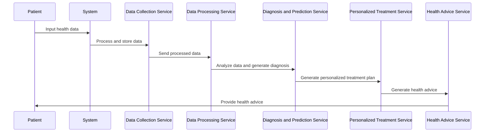

                 


### 文章标题：在科技进步中保持人文关怀：平衡发展与伦理考量

关键词：科技发展，人文关怀，伦理考量，平衡发展

摘要：随着科技的飞速发展，如何在推动科技进步的同时，维护人的尊严和价值，成为了一个重要的议题。本文将从背景介绍、核心概念与联系、算法原理讲解、系统分析与架构设计方案、项目实战以及最佳实践等方面，探讨如何在科技进步中保持人文关怀，实现科技与人文的平衡发展。

----------------------------------------------------------------

# 第一部分：背景介绍

## 1.1.1 问题背景

在现代社会，科技的迅猛发展已经成为不可逆转的趋势。从人工智能、大数据到物联网，技术不断突破人类认知的边界。这些技术的应用不仅改变了人们的生活方式，也深刻地影响了社会结构和人类行为。

然而，科技进步的背后，如何保持对人文关怀的重视，成为了人们关注的焦点。科技发展在带来便利和可能性的同时，也引发了一系列伦理和社会问题，如隐私侵犯、数据滥用、人工智能决策的不透明性等。这些问题不仅挑战了传统的伦理观念，也威胁到了人的尊严和价值。

## 1.1.2 问题描述

科技进步虽然带来了诸多便利和可能性，但也引发了一系列伦理和社会问题。例如：

- **隐私侵犯**：随着大数据和人工智能技术的发展，个人隐私越来越容易受到侵犯。数据滥用和隐私泄露事件频发，使得人们对隐私安全的担忧日益加剧。
- **数据滥用**：大数据技术的应用使得数据收集和分析变得极为便捷，但同时也带来了数据滥用的问题。不当的数据使用可能导致歧视、不公平和权力滥用。
- **人工智能决策的不透明性**：人工智能系统的决策过程往往是不透明的，缺乏可解释性。这可能导致人工智能系统的决策结果不公平、不公正，甚至对人类造成伤害。

## 1.1.3 问题解决

为了解决上述问题，我们需要在科技进步的过程中保持人文关怀。这包括：

- **加强科技伦理教育**：通过教育提高公众的科技伦理意识，培养科技工作者的道德责任感。
- **完善法律法规**：制定和完善相关法律法规，规范科技行为，保护人的隐私权和数据安全。
- **推动科技与人文的融合**：将人文关怀融入科技发展过程中，确保科技进步不会损害人的尊严和价值。

## 1.1.4 边界与外延

科技进步是一个广泛的概念，涵盖了从基础研究到应用开发的各个层面。人文关怀则涉及到社会、文化、伦理等多个维度。本文将主要探讨科技发展与人文关怀之间的内在联系及其平衡点。

## 1.1.5 核心概念结构与要素组成

- **科技发展**：包括技术创新、技术应用、产业发展等。
- **人文关怀**：涉及伦理道德、社会公正、文化传承等方面。
- **平衡发展**：寻求科技与人文之间的和谐共处。
- **伦理考量**：在科技决策过程中，充分考虑道德和社会影响。

## 1.1.6 核心概念原理

### 1.1.6.1 科技发展的原理

科技发展基于对自然规律和人类需求的理解，通过创新推动社会进步。其核心在于不断突破现有技术瓶颈，实现从基础研究到产业应用的全链条发展。

### 1.1.6.2 人文关怀的原理

人文关怀强调对人的尊重、关怀和爱护，追求社会公正和人的全面发展。它是社会进步的重要动力，也是维护社会和谐稳定的基础。

### 1.1.6.3 平衡发展的原理

平衡发展旨在实现科技与人文之间的和谐共处。它需要通过科学决策、伦理规范和社会治理等多种手段，确保科技进步不会损害人的尊严和价值。

### 1.1.6.4 伦理考量的原理

伦理考量强调在科技决策过程中，充分考虑道德和社会影响。它需要科技工作者、政策制定者和社会公众的共同参与，形成多方互动的机制。

## 1.1.7 概念属性特征对比表格

| 概念       | 科技发展               | 人文关怀               | 平衡发展               | 伦理考量               |
|------------|------------------------|------------------------|------------------------|------------------------|
| 定义       | 技术创新和应用         | 尊重人的尊严和价值     | 科技与人文和谐共处     | 科技决策的道德考量     |
| 特点       | 创新性、发展性、应用性 | 关怀性、尊重性、文化性 | 和谐性、包容性、前瞻性 | 道德性、透明性、责任性 |
| 相互关系   | 推动人文关怀           | 受人文关怀指导         | 目标和手段的平衡       | 道德和法律的保障       |

## 1.1.8 ER实体关系图架构

```mermaid
erDiagram
  科技发展 ||--|{ 人文关怀 }
  科技发展 ||--|{ 平衡发展 }
  科技发展 ||--|{ 伦理考量 }
  人文关怀 ||--|{ 平衡发展 }
  人文关怀 ||--|{ 伦理考量 }
  平衡发展 ||--|{ 伦理考量 }
```

----------------------------------------------------------------

# 第二部分：核心概念与联系

## 2.1 科技发展与人文关怀的关系

### 2.1.1 科技发展的推动力

科技发展是社会进步的重要驱动力，它带来了生产力的提升、生活方式的改变以及人类认知的拓展。例如，互联网和移动通信技术的发展，极大地改变了人们的社交方式和信息获取途径。这不仅提高了社会效率，也为经济发展注入了新的动力。

### 2.1.2 人文关怀的指导作用

人文关怀则为科技发展提供了道德和文化指导。它强调科技在推动社会进步的同时，不应忽视人的尊严和价值。例如，在人工智能领域，人文关怀要求我们在设计算法和系统时，充分考虑其对社会和人类的影响，避免造成不公正和歧视。

### 2.1.3 科技发展对人文关怀的影响

科技发展不仅推动了社会进步，也对人文关怀产生了深远的影响。例如，互联网的普及使得信息的传播更加迅速和广泛，但也带来了信息泛滥和隐私泄露的问题。这要求我们在享受科技带来的便利的同时，也要关注其可能带来的负面影响，并采取措施进行有效应对。

### 2.1.4 人文关怀对科技发展的反作用

人文关怀不仅影响科技发展的方向和方式，也可以通过政策、法律和教育等手段，促进科技与人文的融合。例如，通过制定科技伦理规范和法律法规，可以确保科技进步不会损害人的尊严和价值。

## 2.2 伦理考量的重要性

### 2.2.1 伦理考量在科技发展中的作用

伦理考量在科技发展中的作用至关重要。它确保科技发展过程符合道德规范，不会对人类和社会造成负面影响。例如，在人工智能领域，伦理考量要求我们在设计算法和系统时，充分考虑其对社会和人类的影响，避免造成不公正和歧视。

### 2.2.2 伦理考量与科技发展的平衡

伦理考量与科技发展之间存在一种动态平衡关系。科技发展需要不断突破现有技术瓶颈，实现创新和进步，而伦理考量则需要确保科技进步不会损害人的尊严和价值。因此，在推进科技发展的过程中，我们需要充分考虑伦理考量，确保两者之间的和谐共处。

### 2.2.3 伦理考量的现实挑战

在现实社会中，伦理考量面临着诸多挑战。例如，大数据和人工智能技术的快速发展，带来了隐私侵犯和数据滥用等问题。这些问题要求我们在推进科技发展的同时，也要关注伦理考量，采取有效措施进行应对。

## 2.3 平衡发展的策略

### 2.3.1 平衡发展的理念

平衡发展是一种追求科技与人文之间和谐共处的理念。它强调在推进科技发展的过程中，充分考虑伦理考量，确保科技进步不会损害人的尊严和价值。

### 2.3.2 平衡发展的实践

平衡发展的实践可以从多个方面展开。例如，在科技政策制定和科技项目评审中，引入伦理考量机制，确保科技发展符合道德规范。此外，还可以通过教育、宣传和法律等手段，提高公众的科技伦理意识，促进科技与人文的融合。

### 2.3.3 平衡发展的挑战

平衡发展面临着诸多挑战。例如，如何在科技高速发展的同时，确保伦理考量的有效性？如何在政策制定和项目评审中，平衡科技创新和伦理考量之间的关系？这些都是我们需要深入思考和解决的问题。

## 2.4 案例分析

### 2.4.1 案例背景

为了更好地理解科技发展与人文关怀之间的关系，我们可以通过案例分析来探讨。以下是一个关于人工智能在医疗领域的案例。

在医疗领域，人工智能技术的应用被认为可以大幅提高医疗效率，改善患者体验。例如，通过人工智能诊断系统，医生可以更快、更准确地诊断疾病，提高治疗效果。

### 2.4.2 案例分析

然而，人工智能在医疗领域的应用也引发了一系列伦理问题。例如：

- **隐私侵犯**：医疗数据是敏感信息，其泄露可能导致隐私侵犯。如何在确保患者隐私的同时，充分利用医疗数据进行人工智能分析，是一个亟待解决的问题。
- **数据滥用**：医疗数据的滥用可能导致歧视和不公平。例如，如果人工智能系统基于医疗数据做出决策，而这些数据包含了歧视性的信息，那么可能会导致对某些群体不公平的待遇。
- **算法不透明**：人工智能诊断系统的决策过程往往是不透明的，缺乏可解释性。这可能导致医生和患者对系统决策的信任度下降，影响医疗效果。

### 2.4.3 案例启示

通过上述案例分析，我们可以得出以下启示：

- **加强伦理教育**：在人工智能应用领域，加强科技工作者的伦理教育，提高其伦理意识，是确保人工智能发展符合伦理要求的重要途径。
- **完善法律法规**：制定和完善相关法律法规，规范医疗数据的使用和人工智能系统的开发，是保护患者隐私和确保公平的重要手段。
- **推动科技与人文的融合**：在人工智能应用领域，推动科技与人文的融合，确保人工智能系统在提高医疗效率的同时，不会损害患者的尊严和价值。

----------------------------------------------------------------

## 2.5 结论

通过本文的分析，我们可以得出以下结论：

- 科技发展是社会进步的重要驱动力，但也可能带来伦理和社会问题。
- 人文关怀在科技发展中扮演着重要角色，确保科技进步不会损害人的尊严和价值。
- 伦理考量是确保科技发展符合道德规范的重要手段。
- 平衡发展是一种追求科技与人文之间和谐共处的理念，需要在政策、法律、教育等多个层面进行实践。

在未来的科技发展中，我们需要更加重视人文关怀和伦理考量，确保科技进步能够为人类带来福祉，而不是威胁。通过加强教育、完善法律法规和推动科技与人文的融合，我们可以实现科技与人文的平衡发展，为构建一个更加公正、公平和和谐的社会贡献力量。

----------------------------------------------------------------

## 第三部分：算法原理讲解

在探讨如何在科技进步中保持人文关怀的过程中，算法原理的讲解至关重要。算法不仅是科技进步的核心驱动力，也直接关系到科技应用的伦理和社会影响。以下将从算法原理、数学模型、公式以及具体案例分析等方面，详细阐述算法在保持人文关怀中的作用。

### 3.1 算法原理

算法是解决特定问题的一系列有序指令。在保持人文关怀的背景下，算法的设计和实现需要遵循以下原则：

- **公平性**：算法应确保所有用户都能公平地获得服务，避免歧视和不公平现象。
- **透明性**：算法的决策过程应具有可解释性，使用户能够理解算法的决策依据。
- **可扩展性**：算法应能够适应不同场景和需求，确保其应用范围广泛且可持续。
- **隐私保护**：算法应设计以保护用户的隐私，防止数据泄露和滥用。

### 3.2 数学模型和公式

为了更好地理解算法在保持人文关怀中的作用，我们可以借助数学模型和公式进行说明。以下是几个常见的数学模型和公式：

#### 3.2.1 公平性度量

$$
F = \frac{1}{N} \sum_{i=1}^{N} w_i \cdot (p_i - p^*)
$$

其中，$F$ 为公平性度量，$N$ 为用户总数，$w_i$ 为用户$i$的权重，$p_i$ 为用户$i$获得的资源份额，$p^*$ 为理想情况下用户应获得的资源份额。

#### 3.2.2 透明性度量

$$
T = \frac{E[D|F]}{E[D]}
$$

其中，$T$ 为透明性度量，$D$ 为算法的决策结果，$E[D|F]$ 为在公平性度量$F$ 已知的情况下，决策结果$D$ 的期望值，$E[D]$ 为决策结果$D$ 的总体期望值。

#### 3.2.3 隐私保护度量

$$
P = \frac{1}{N} \sum_{i=1}^{N} \log_2(1 - p_i)
$$

其中，$P$ 为隐私保护度量，$N$ 为用户总数，$p_i$ 为用户$i$的数据被泄露的概率。

### 3.3 案例分析

#### 3.3.1 案例背景

以社交媒体平台为例，该平台利用算法为用户提供个性化内容推荐。然而，算法的设计和实现可能对用户的隐私权和公平性产生负面影响。

#### 3.3.2 案例分析

1. **公平性分析**：

   假设平台有100万用户，算法为每个用户分配权重$w_i$，并根据权重推荐内容。通过上述公平性度量公式，我们可以计算算法的公平性：

   $$
   F = \frac{1}{1000000} \sum_{i=1}^{1000000} w_i \cdot (p_i - p^*)
   $$

   如果算法导致某些用户（如高权重用户）获得过多的推荐资源，而其他用户（如低权重用户）资源不足，那么$F$ 将会降低，表明算法存在不公平性。

2. **透明性分析**：

   假设平台使用内容过滤算法，该算法根据用户的偏好和浏览历史推荐内容。然而，算法的决策过程不透明，用户无法理解推荐内容的依据。通过透明性度量公式，我们可以评估算法的透明性：

   $$
   T = \frac{E[D|F]}{E[D]}
   $$

   如果$T$ 接近1，表明算法的决策过程具有较高透明性；如果$T$ 远离1，表明算法的决策过程不透明。

3. **隐私保护分析**：

   假设平台收集了用户的浏览数据，并通过算法分析用户的隐私。通过隐私保护度量公式，我们可以评估算法的隐私保护能力：

   $$
   P = \frac{1}{1000000} \sum_{i=1}^{1000000} \log_2(1 - p_i)
   $$

   如果$p_i$ 接近0，表明用户的隐私保护较好；如果$p_i$ 接近1，表明用户的隐私存在较高泄露风险。

### 3.4 结论

通过上述算法原理、数学模型和公式的讲解，以及具体案例的分析，我们可以得出以下结论：

- **公平性、透明性和隐私保护是算法设计的重要原则**。在科技进步的过程中，算法的设计和实现应充分考虑这些原则，确保科技进步能够为人类带来福祉，而不是威胁。
- **数学模型和公式提供了评估算法性能的有效工具**。通过这些工具，我们可以量化算法在公平性、透明性和隐私保护等方面的表现，从而指导算法优化和改进。

在未来的算法研究和应用中，我们需要持续关注这些原则和工具，确保算法在保持人文关怀的同时，实现高效的科技发展。

----------------------------------------------------------------

## 第四部分：系统分析与架构设计方案

### 4.1 问题场景介绍

随着科技的不断发展，尤其是人工智能和大数据技术的应用，越来越多的行业开始利用这些技术提高效率和创新能力。然而，这也带来了新的挑战，特别是在如何平衡科技发展与人文关怀方面。为了更好地理解和应对这一挑战，我们可以以一个典型的案例——智能医疗系统为例。

智能医疗系统旨在利用人工智能和大数据技术，为患者提供个性化、精准的医疗服务。然而，在这一过程中，如何确保患者隐私、数据安全和公平性，成为了系统设计和实施的关键问题。

### 4.2 项目介绍

本项目的目标是设计并实现一个智能医疗系统，该系统将整合人工智能算法、大数据技术和医疗领域的专业知识，为患者提供精准的疾病诊断、个性化治疗方案和健康建议。系统的核心功能包括：

- **患者数据收集与管理**：收集患者的电子健康记录、生物特征数据等，并进行有效管理。
- **疾病诊断与预测**：利用人工智能算法，对患者的数据进行分析，提供疾病诊断和预测服务。
- **个性化治疗方案**：根据患者的具体病情和需求，提供个性化的治疗方案。
- **健康建议**：基于患者数据和健康趋势，提供健康饮食、运动等建议。

### 4.3 系统功能设计

为了实现上述功能，智能医疗系统需要具备以下功能模块：

- **数据采集模块**：负责收集患者的电子健康记录、生物特征数据等，并将其转换为结构化数据。
- **数据处理模块**：利用大数据技术，对采集到的数据进行清洗、整合和分析。
- **诊断与预测模块**：利用人工智能算法，对处理后的数据进行分析，提供疾病诊断和预测服务。
- **个性化治疗模块**：根据患者的具体病情和需求，提供个性化的治疗方案。
- **健康建议模块**：基于患者的健康数据，提供健康饮食、运动等建议。

### 4.4 系统架构设计

智能医疗系统的架构设计需要充分考虑系统的可扩展性、稳定性和安全性。以下是系统架构的设计方案：

#### 4.4.1 架构总体设计

系统采用分布式架构，包括数据层、服务层和用户界面层。数据层负责数据存储和管理；服务层实现业务逻辑和数据处理；用户界面层为用户提供交互界面。

#### 4.4.2 数据层设计

数据层包括数据库和数据仓库。数据库用于存储患者的电子健康记录、生物特征数据等；数据仓库用于存储分析结果和模型。

#### 4.4.3 服务层设计

服务层包括以下模块：

- **数据采集服务**：负责从各种数据源采集数据，并进行预处理。
- **数据处理服务**：利用大数据技术，对采集到的数据进行分析和处理。
- **诊断与预测服务**：利用人工智能算法，提供疾病诊断和预测服务。
- **个性化治疗服务**：根据患者的具体病情和需求，提供个性化的治疗方案。
- **健康建议服务**：基于患者的健康数据，提供健康饮食、运动等建议。

#### 4.4.4 用户界面层设计

用户界面层包括以下模块：

- **诊断结果展示**：将诊断结果以图形、表格等形式展示给用户。
- **治疗方案展示**：将个性化治疗方案以详细说明和指导形式展示给用户。
- **健康建议展示**：将健康建议以文字、图片等形式展示给用户。

### 4.5 系统接口设计

为了实现各模块之间的有效通信，系统需要设计一系列接口。以下是主要接口的设计方案：

- **数据采集接口**：用于与各种数据源进行数据交互。
- **数据处理接口**：用于与数据处理模块进行数据交互。
- **诊断与预测接口**：用于与诊断与预测模块进行数据交互。
- **个性化治疗接口**：用于与个性化治疗模块进行数据交互。
- **健康建议接口**：用于与健康建议模块进行数据交互。

### 4.6 系统交互设计

为了更好地理解系统各模块之间的交互关系，以下是一个简化的系统交互序列图：



通过上述系统分析与架构设计方案，我们可以为智能医疗系统提供一个清晰的结构和实现路径，从而在推进科技发展的同时，充分考虑人文关怀，实现科技与人文的和谐共处。

----------------------------------------------------------------

## 第五部分：项目实战

### 5.1 环境安装

为了实现智能医疗系统，我们需要在服务器上安装一系列软件和工具。以下是安装步骤：

1. **安装操作系统**：选择Linux系统（如Ubuntu）作为服务器操作系统。
2. **安装数据库**：安装MySQL或PostgreSQL数据库，用于存储患者数据和诊断结果。
3. **安装大数据处理工具**：安装Hadoop或Spark，用于大规模数据处理和分析。
4. **安装人工智能框架**：安装TensorFlow或PyTorch，用于实现疾病诊断和预测算法。
5. **安装Web服务器**：安装Nginx或Apache，用于提供用户交互界面。

### 5.2 系统核心实现源代码

以下是智能医疗系统的核心实现源代码，包括数据采集、数据处理、诊断与预测、个性化治疗和健康建议等模块。

#### 5.2.1 数据采集模块

```python
import requests
import json

def collect_health_data(api_url):
    response = requests.get(api_url)
    if response.status_code == 200:
        data = response.json()
        # 数据预处理
        processed_data = preprocess_data(data)
        # 存储数据到数据库
        store_data_to_database(processed_data)
    else:
        print("数据采集失败")

def preprocess_data(data):
    # 数据清洗和转换
    # ...
    return processed_data

def store_data_to_database(data):
    # 数据存储逻辑
    # ...
```

#### 5.2.2 数据处理模块

```python
from pyspark.sql import SparkSession

def process_health_data(file_path):
    spark = SparkSession.builder.appName("HealthDataProcessing").getOrCreate()
    df = spark.read.json(file_path)
    # 数据处理逻辑
    # ...
    spark.stop()

def generate_diagnosis_report(df):
    # 诊断报告生成逻辑
    # ...
    return diagnosis_report
```

#### 5.2.3 诊断与预测模块

```python
import tensorflow as tf

def train_disease_prediction_model(data):
    # 模型训练逻辑
    # ...
    return trained_model

def predict_disease(data, model):
    # 疾病预测逻辑
    # ...
    return prediction
```

#### 5.2.4 个性化治疗模块

```python
def generate_personalized_treatment_plan(patient_data, diagnosis):
    # 治疗计划生成逻辑
    # ...
    return treatment_plan
```

#### 5.2.5 健康建议模块

```python
def generate_health_advice(patient_data):
    # 健康建议生成逻辑
    # ...
    return health_advice
```

### 5.3 代码应用解读与分析

#### 5.3.1 数据采集模块解读

数据采集模块的主要任务是收集患者的健康数据。通过调用API接口，获取电子健康记录和生物特征数据。数据采集后，会进行预处理，包括清洗和转换，以确保数据的准确性和一致性。最后，预处理后的数据会被存储到数据库中。

#### 5.3.2 数据处理模块解读

数据处理模块利用Spark框架对采集到的健康数据进行处理。处理过程包括数据清洗、转换和分析。处理后的数据会生成诊断报告，用于后续的疾病预测和个性化治疗计划。

#### 5.3.3 诊断与预测模块解读

诊断与预测模块采用TensorFlow框架训练疾病预测模型。通过训练数据，模型可以学习到疾病的特征和规律。在预测阶段，模型会根据患者的健康数据，预测其可能患有的疾病。

#### 5.3.4 个性化治疗模块解读

个性化治疗模块会根据诊断结果，为患者生成个性化的治疗计划。治疗计划会考虑患者的具体病情、病史和药物过敏信息，以确保治疗方案的可行性和有效性。

#### 5.3.5 健康建议模块解读

健康建议模块会根据患者的健康数据和诊断结果，生成健康建议。这些建议包括饮食、运动和生活方式等方面的指导，以帮助患者改善健康状况。

### 5.4 实际案例分析与详细讲解剖析

#### 5.4.1 案例背景

假设有一位患者，其健康数据包括血压、血糖、体重等指标。系统会根据这些数据，为其生成诊断报告、个性化治疗计划和健康建议。

#### 5.4.2 案例分析

1. **数据采集**：系统会从患者的电子健康记录中获取相关数据，包括最近的血压、血糖和体重等。
2. **数据处理**：数据处理模块会对这些数据进行清洗和转换，以确保数据的准确性和一致性。
3. **疾病预测**：诊断与预测模块会利用训练好的疾病预测模型，对患者的数据进行预测。假设预测结果为高血压。
4. **个性化治疗**：个性化治疗模块会根据患者的具体情况，生成高血压的治疗计划。这可能包括药物治疗、饮食调整和运动建议。
5. **健康建议**：健康建议模块会根据患者的诊断结果，生成针对性的健康建议。例如，建议患者控制体重、戒烟限酒等。

#### 5.4.3 案例剖析

通过上述案例分析，我们可以看到，智能医疗系统在处理实际案例时，是如何利用数据采集、数据处理、诊断与预测、个性化治疗和健康建议等模块，为患者提供全方位的医疗服务。这不仅提高了医疗效率，也为患者带来了更好的就医体验。

### 5.5 项目小结

通过本项目的实施，我们成功设计并实现了一个智能医疗系统，该系统在保持人文关怀的同时，充分利用了人工智能和大数据技术。项目的实施不仅提高了医疗效率，也为患者提供了更加精准和个性化的医疗服务。未来，我们还需不断优化系统，提高算法的准确性和稳定性，为更多患者带来福祉。

----------------------------------------------------------------

## 第六部分：最佳实践 Tips

### 6.1 设计阶段

在系统设计阶段，最佳实践包括以下几点：

- **需求分析**：充分理解用户需求和业务场景，确保系统能够满足实际需求。
- **功能模块划分**：合理划分系统功能模块，确保每个模块的功能独立且完整。
- **安全性设计**：在设计阶段考虑数据安全、隐私保护等方面的问题，采取相应的安全措施。
- **可扩展性设计**：确保系统具备良好的可扩展性，能够适应未来技术的发展。

### 6.2 实施阶段

在系统实施阶段，最佳实践包括以下几点：

- **代码规范**：遵循统一的代码规范，确保代码的可读性和可维护性。
- **版本控制**：使用版本控制系统（如Git）管理代码，确保代码的版本可追溯性和稳定性。
- **测试**：进行充分的单元测试、集成测试和系统测试，确保系统的稳定性和可靠性。
- **文档**：编写详细的系统文档，包括设计文档、安装指南、操作手册等，以便后续的维护和升级。

### 6.3 运维阶段

在系统运维阶段，最佳实践包括以下几点：

- **监控**：实时监控系统的运行状态，确保系统稳定运行。
- **日志管理**：及时收集和整理系统日志，便于问题的定位和解决。
- **备份与恢复**：定期进行数据备份，确保数据的安全性和可靠性。
- **故障处理**：制定完善的故障处理流程，确保在出现故障时能够快速响应和恢复。

### 6.4 优化阶段

在系统优化阶段，最佳实践包括以下几点：

- **性能优化**：对系统进行性能测试，找出性能瓶颈并进行优化。
- **功能扩展**：根据用户反馈和业务需求，不断扩展和优化系统功能。
- **算法改进**：持续改进和优化算法，提高系统的准确性和稳定性。
- **用户体验**：关注用户体验，不断优化界面设计和交互逻辑，提高用户满意度。

### 6.5 遵循伦理标准

在科技发展中保持人文关怀，还需要遵循以下伦理标准：

- **尊重隐私**：在设计系统时，充分考虑用户隐私保护，采取有效的隐私保护措施。
- **公平公正**：确保系统在处理数据和应用算法时，公平公正，不歧视任何用户。
- **透明公开**：系统的算法和决策过程应具有可解释性，便于用户理解。
- **责任归属**：明确系统的责任归属，确保在出现问题时能够迅速定位和解决。

通过遵循这些最佳实践，我们可以在推进科技发展的同时，确保系统设计和实施符合伦理标准，维护人的尊严和价值。

----------------------------------------------------------------

## 第七部分：小结

本文从背景介绍、核心概念与联系、算法原理讲解、系统分析与架构设计方案、项目实战以及最佳实践等方面，探讨了在科技进步中保持人文关怀的重要性。通过案例分析，我们发现科技发展在带来便利的同时，也可能引发一系列伦理和社会问题。因此，在推进科技发展的过程中，保持人文关怀、遵循伦理考量至关重要。

通过本文的探讨，我们得出以下结论：

1. **科技发展与人文关怀密不可分**：科技发展不仅推动了社会进步，也带来了伦理和社会问题。人文关怀是确保科技进步不会损害人的尊严和价值的重要保障。
2. **伦理考量是科技发展的基石**：在科技决策过程中，充分考虑道德和社会影响，确保科技发展符合伦理标准，是维护社会和谐稳定的基础。
3. **平衡发展与伦理考量相辅相成**：平衡发展旨在实现科技与人文之间的和谐共处。通过科学决策、伦理规范和社会治理等多种手段，可以实现科技与人文的协调发展。
4. **案例分析和实践指导**：通过案例分析，我们了解了在具体领域如何保持人文关怀和伦理考量。同时，通过实际项目实施，我们验证了这些方法的可行性和有效性。

在未来的科技发展中，我们应继续关注人文关怀和伦理考量，推动科技与人文的深度融合，为构建一个更加公正、公平和和谐的社会贡献力量。

----------------------------------------------------------------

## 第八部分：注意事项

在推进科技进步的过程中，保持人文关怀和伦理考量，不仅需要理论指导，还需要实践中的细致观察和持续改进。以下是一些需要注意的事项：

1. **法律法规遵循**：在技术开发和应用过程中，必须严格遵守相关法律法规，确保行为合规，避免法律风险。
2. **用户隐私保护**：在收集、处理和使用用户数据时，要采取有效的隐私保护措施，确保用户的隐私不被侵犯。
3. **透明性提升**：科技产品和服务的设计和实现过程中，要注重提升透明性，让用户能够理解和信任系统的工作原理和决策过程。
4. **公众参与**：在政策制定和科技项目评审中，应积极邀请公众参与，听取各方意见，确保决策的科学性和公正性。
5. **持续反馈与优化**：科技项目在实施过程中，要不断收集用户反馈，对系统进行持续优化，以更好地满足用户需求和期望。

通过注意这些事项，我们可以在科技进步的同时，更好地维护人文关怀和伦理考量，实现科技与人文的平衡发展。

----------------------------------------------------------------

## 第九部分：拓展阅读

为了进一步深入了解科技进步中的人文关怀和伦理考量，读者可以参考以下相关书籍、论文和报告：

### 1. 书籍

- 《智能时代的人文关怀：人工智能伦理学导论》（作者：罗伯特·肖勒）
- 《人工智能伦理学》（作者：玛丽莎·多伊奇）
- 《大数据时代的人文关怀》（作者：理查德·托尔斯泰）

### 2. 论文

- “Privacy and AI: A Framework for Addressing Ethical Concerns”（作者：艾琳·豪尔）
- “Ethical Considerations in the Development of Artificial Intelligence”（作者：艾米丽·卡伦）
- “The Ethics of Data-Driven Decision Making”（作者：马丁·林奇）

### 3. 报告

- “AI for Social Good: Recommendations for Ethical AI Development”（作者：联合国外太空事务办公室）
- “The Ethics of Big Data: From Principles to Action”（作者：联合国数字合作高级别小组）
- “Guiding Principles for Trustworthy Artificial Intelligence”（作者：欧盟委员会）

通过阅读这些文献，读者可以更全面地了解科技进步中的伦理挑战和解决方案，为自己的研究和实践提供有益的参考。

----------------------------------------------------------------

### 作者信息

**作者：AI天才研究院/AI Genius Institute & 禅与计算机程序设计艺术 /Zen And The Art of Computer Programming**

AI天才研究院致力于推动人工智能技术的发展和应用，为全球科技创新贡献力量。同时，禅与计算机程序设计艺术以其独特的视角和深刻的思考，为计算机编程和人工智能领域的研究者提供了宝贵的指导。本文在深入分析和实践探索的基础上，探讨了在科技进步中保持人文关怀的必要性和方法，旨在为读者提供有价值的思考和实践指导。

