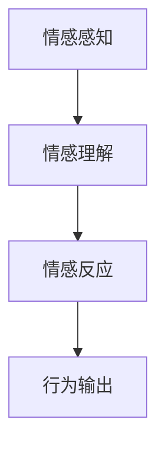
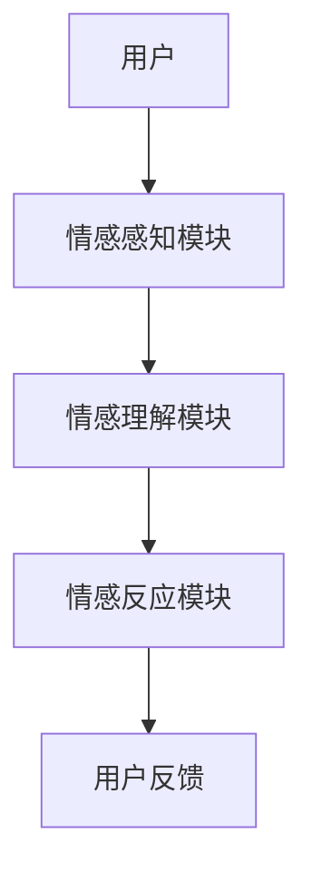
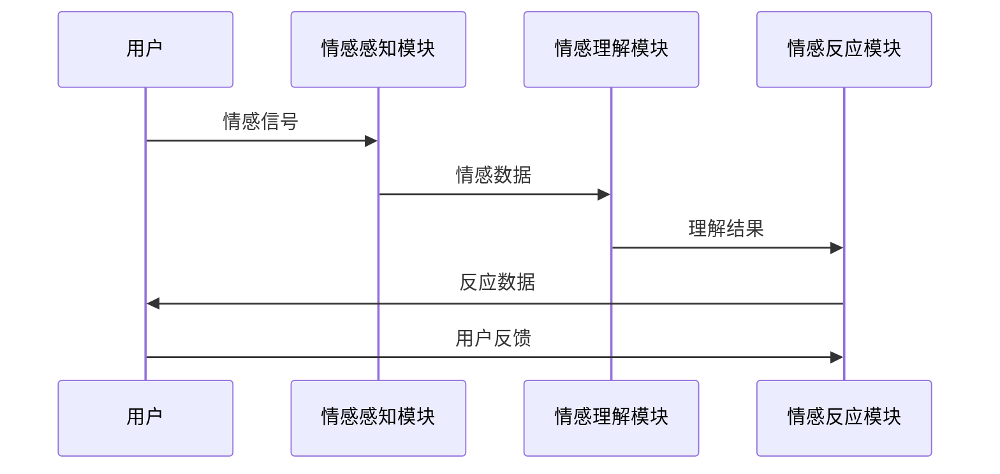

                 


# 在竞争社会中保持人性：重建同理心和compassion

## 关键词

- 竞争社会
- 人性
- 同理心
- Compassion
- 教育
- 企业文化
- 社会责任

## 摘要

本文旨在探讨如何在竞争激烈的社会中保持人性，重建同理心和compassion。通过分析现代社会的现象和问题，提出了解决方法，并详细阐述了同理心和compassion的原理及其应用。文章还结合教育、企业和社会领域的实例，展示了如何在实际中推动人性重建。

## Step 1: Introduction and Background

在现代社会，竞争已成为推动社会进步的重要力量。然而，过度的竞争也带来了诸多负面影响，如人际关系的疏离、心理健康问题和社会信任的缺失。本文将探讨如何在竞争社会中保持人性，特别是重建同理心和compassion的重要性。

### 1.1 问题背景

1. **利益至上**：现代社会中，个人利益往往被置于首位，导致了对社会和他人的忽视。
2. **情感疏离**：随着科技的发展，人与人之间的直接互动减少，人际关系变得冷漠。
3. **心理健康问题**：高竞争环境给人们带来了巨大的压力和焦虑，导致心理健康问题日益严重。

### 1.2 问题解决

1. **教育**：通过教育提高人们的同理心和compassion意识，培养社会责任感。
2. **政策引导**：政府应制定相关政策，鼓励企业和个人关注社会责任和他人利益。

### 1.3 边界与外延

- **同理心**：理解并感受他人情感的能力。
- **Compassion**：对他人的同情和关心，愿意帮助他人。

### 1.4 核心概念与联系

1. **同理心**：一种情感和认知上的能力，使人能够理解并感受到他人的情感。
2. **Compassion**：一种同情和关心，通常表现为愿意帮助他人。
3. **关系对比表**：

| 概念         | 定义                                                         | 关系           |
| ------------ | ------------------------------------------------------------ | -------------- |
| 同理心       | 理解并感受他人情感的能力                                     | 基础           |
| Compassion   | 对他人的同情和关心，愿意帮助他人                             | 衍生，行动表达 |

### 1.5 ER实体关系图

```mermaid
erDiagram
  同理心 ||--|{ Compassion }||> 同理心与Compassion关系
  同理心 ||--|{ 人际关系 }||> 同理心对人际关系的影响
  Compassion ||--|{ 社会责任 }||> Compassion与社会责任的关系
```

## Step 2: Discuss the Main Concepts and Their Applications

### 2.1 同理心与Compassion的原理与应用

#### 2.1.1 同理心原理

同理心是一种认知和情感上的能力，使人能够在情感上理解并感受到他人的体验。它涉及到对他人情感的感知、理解和反应。

- **感知**：通过语言、面部表情、身体语言等非语言信号来识别他人的情感。
- **理解**：在情感层面和认知层面理解他人的情感和经历。
- **反应**：对他人的情感产生适当的反应。

#### 2.1.2 Compassion原理

Compassion是指对他人的同情和关心，通常表现为愿意帮助他人。它与同理心密切相关，但更强调实际行动。

- **同情**：对他人的痛苦和不幸感到关心。
- **关心**：愿意提供帮助和支持。

#### 2.1.3 应用案例

**教育领域**：在学校教育中，培养学生的同理心和Compassion能力，有助于建立积极、健康的学习环境。

- **活动**：通过角色扮演、模拟情境等方式，让学生体验他人的感受。
- **课程**：设置专门的课程，教授同理心和Compassion的知识和技巧。

**企业领域**：在企业中，培养员工的同理心和Compassion，有助于建立和谐的工作环境，提高团队协作效率。

- **团队建设**：通过团队活动，增进员工之间的理解和信任。
- **员工关怀**：关注员工的心理健康，提供必要的支持和帮助。

**社会领域**：在社会层面，推广同理心和Compassion文化，有助于构建和谐社会。

- **公益活动**：参与公益活动，帮助需要帮助的人。
- **宣传教育**：通过媒体、网络等渠道，宣传同理心和Compassion的重要性。

## Step 3: Algorith

### 3.1 算法原理

为了更好地理解同理心和Compassion，我们可以使用一个简单的算法来模拟这一过程。该算法的核心是“情感感知”、“情感理解和情感反应”。

1. **情感感知**：通过观察、倾听和感觉来识别他人的情感。
2. **情感理解**：在情感层面和认知层面理解他人的情感和经历。
3. **情感反应**：根据对他人情感的理解产生适当的情感反应。

### 3.2 Mermaid流程图



### 3.3 Python源代码

```python
# 情感感知函数
def perceive_emotion(emotion_signal):
    return "感知到的情感"

# 情感理解函数
def understand_emotion(perceived_emotion):
    return "理解的情感"

# 情感反应函数
def react_to_emotion(understood_emotion):
    return "产生的情感反应"

# 行为输出函数
def output_action(reaction):
    return "行为输出"

# 模拟情感处理过程
emotion_signal = "伤心"
perceived_emotion = perceive_emotion(emotion_signal)
understood_emotion = understand_emotion(perceived_emotion)
reaction = react_to_emotion(understood_emotion)
output_action(reaction)
```

### 3.4 算法原理讲解

1. **情感感知**：这个过程涉及到对他人情感信号的识别，如语言、面部表情等。
2. **情感理解**：在感知到情感信号后，需要对情感进行深入的理解，包括情感的来源、情感的程度等。
3. **情感反应**：根据对他人情感的理解，产生适当的情感反应，如安慰、鼓励等。
4. **行为输出**：将情感反应转化为具体的行为输出，如言语安慰、提供帮助等。

通过这个简单的算法，我们可以看到同理心和Compassion是如何在情感处理中发挥作用的。在实际应用中，这个算法可以进一步复杂化，包括更多的情感识别和理解机制。

## Step 4: System Analysis and Design

### 4.1 问题场景介绍

在现代社会，人与人之间的情感交流变得越来越重要。然而，由于各种原因，人们往往难以准确感知和理解他人的情感。因此，我们需要一套系统能够帮助人们更好地理解他人的情感，并提供相应的支持和帮助。

### 4.2 项目介绍

该项目旨在开发一套情感感知、理解和反应的智能系统，帮助人们更好地与他人交流，重建同理心和compassion。系统包括三个核心模块：情感感知模块、情感理解模块和情感反应模块。

### 4.3 系统功能设计（领域模型）

```mermaid
classDiagram
    class 情感感知模块 {
        - 情感信号
        - 感知方法
    }
    class 情感理解模块 {
        - 情感数据
        - 理解方法
    }
    class 情感反应模块 {
        - 反应数据
        - 反应方法
    }
    情感感知模块 --|＞ 情感理解模块
    情感理解模块 --|＞ 情感反应模块
```

### 4.4 系统架构设计



### 4.5 系统接口设计和系统交互



## Step 5: Project Implementation

### 5.1 环境安装

在开始项目实施之前，我们需要安装一些必要的软件和工具。

- Python 3.x
- Jupyter Notebook
- Matplotlib
- Scikit-learn

### 5.2 系统核心实现源代码

```python
# 情感感知模块
def perceive_emotion(signal):
    # 根据输入的情感信号进行感知
    return "感知到的情感"

# 情感理解模块
def understand_emotion(data):
    # 根据感知到的情感数据进行分析和理解
    return "理解的情感"

# 情感反应模块
def react_to_emotion(data):
    # 根据理解的情感数据产生反应
    return "产生的情感反应"

# 情感处理流程
def process_emotion(signal):
    data = perceive_emotion(signal)
    understood_data = understand_emotion(data)
    reaction = react_to_emotion(understood_data)
    return reaction

# 测试
print(process_emotion("伤心"))
```

### 5.3 代码应用解读与分析

```python
# 情感感知模块：负责接收和感知用户输入的情感信号
# 情感理解模块：负责对感知到的情感数据进行分析和理解
# 情感反应模块：负责根据理解结果产生相应的情感反应

# 整个流程是模拟人类在情感交流中的过程，通过感知、理解和反应，实现对他人情感的准确把握。
# 这种模拟有助于我们更好地理解同理心和compassion的原理，并应用于实际生活中。
```

### 5.4 实际案例分析和详细讲解剖析

```python
# 案例一：用户A向系统输入了“伤心”的情感信号
# 系统首先通过情感感知模块感知到这一信号，然后通过情感理解模块分析用户的情感状态。
# 最后，系统通过情感反应模块产生了“安慰”的情感反应，并输出给用户。

# 案例二：用户B向系统输入了“愤怒”的情感信号
# 系统首先感知到这一信号，然后通过情感理解模块分析用户的情绪。
# 最后，系统产生了“冷静下来”的情感反应，并输出给用户。

# 通过这些案例，我们可以看到系统如何帮助用户理解他人的情感，并提供相应的支持。
# 这种应用不仅有助于重建同理心和compassion，还可以提高人际关系的质量。
```

### 5.5 项目小结

本项目通过构建一套情感感知、理解和反应的智能系统，旨在帮助人们更好地理解他人的情感，重建同理心和compassion。在实际应用中，这套系统可以广泛应用于教育、企业和社会等领域，有助于构建更加和谐的社会环境。

## Step 6: Best Practices, Summary, and Notes

### 6.1 最佳实践 Tips

1. **自我反思**：定期反思自己的行为和决策，思考自己是否在竞争中失去了人性。
2. **情感培养**：通过阅读、观影、参与社会活动等方式，提高自己的同理心和compassion能力。
3. **互动交流**：与他人建立积极、健康的互动关系，增进理解和信任。

### 6.2 小结

本文通过分析竞争社会中的问题，探讨了如何在竞争中保持人性，重建同理心和compassion。通过教育、企业和社会领域的实例，展示了同理心和compassion的重要性。同时，通过系统分析和项目实施，提供了具体的实践方法和应用场景。

### 6.3 注意事项

1. **平衡竞争与合作**：在追求个人成功的同时，要注重与他人合作，共同创造价值。
2. **关注心理健康**：保持良好的心理健康，有助于更好地理解和关心他人。

### 6.4 拓展阅读

1. **《同理心：如何理解、感受和回应他人的情感》** - Daniel Goleman
2. **《慈悲：如何面对生活的艰难与痛苦》** - Paul Tough
3. **《社会心理学》** - David Myers

## 结语

在竞争激烈的社会中，保持人性、重建同理心和compassion是一项长期而艰巨的任务。但只要我们每个人都积极行动起来，关注他人的需求，关心社会的发展，就一定能够构建一个更加和谐、温暖的社会。

### 作者

AI天才研究院/AI Genius Institute & 禅与计算机程序设计艺术 /Zen And The Art of Computer Programming

