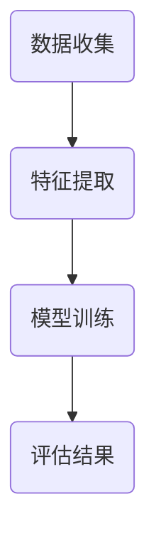
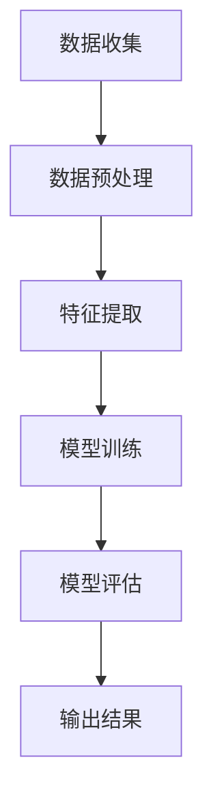
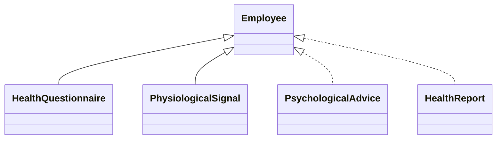
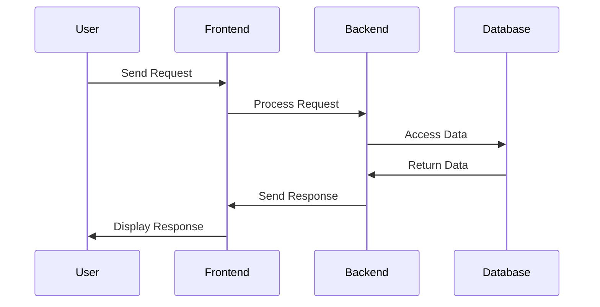
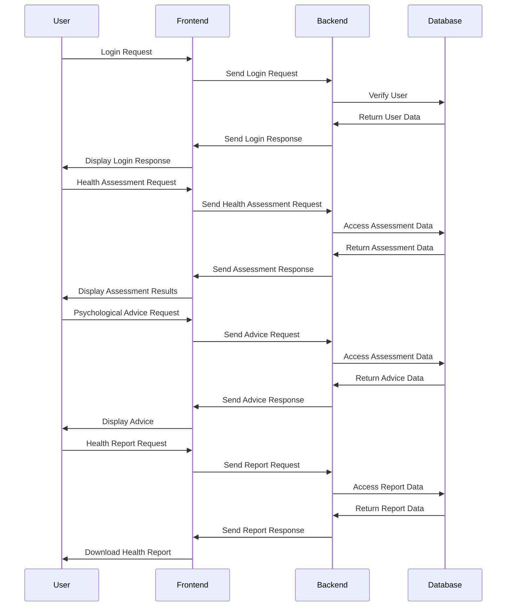
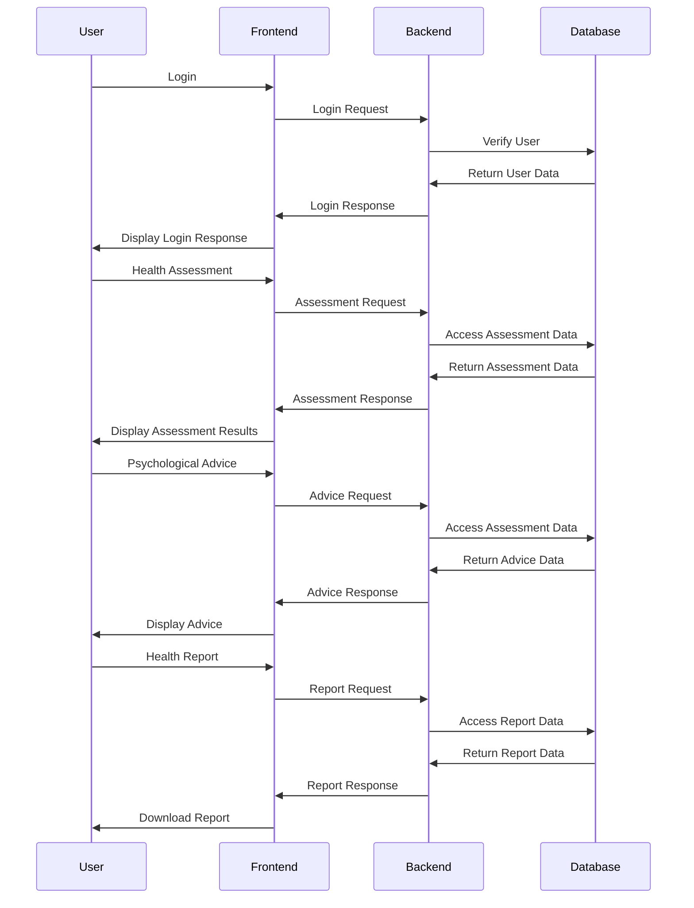

                 

# 在繁忙中寻找内心平静：现代生活的节奏管理

## 关键词

现代生活、节奏管理、心理健康、时间管理、精力管理、心灵平静

> 摘要：本文深入探讨了现代生活中节奏管理的重要性，以及如何通过时间管理、精力管理、冥想与放松以及心理调适等策略，寻找内心平静，提高生活质量。通过系统分析与算法原理讲解，为读者提供实用技巧和策略，帮助他们在繁忙中找到内心的宁静。

### 目录大纲

----------------------------------------------------------------

## 第一部分: 问题背景

### 1.1 现代生活的快节奏压力

#### 1.1.1 生活方式的变化

#### 1.1.2 工作压力的加剧

#### 1.1.3 个人时间管理的挑战

### 1.2 心理健康的重要性

#### 1.2.1 心理健康的定义

#### 1.2.2 心理健康的影响因素

#### 1.2.3 心理健康的现状与问题

### 1.3 节奏管理的定义与意义

#### 1.3.1 节奏管理的概念

#### 1.3.2 节奏管理的重要性

#### 1.3.3 节步管理的方法与工具

### 1.4 心灵平静的内涵与价值

#### 1.4.1 心灵平静的内涵

#### 1.4.2 心灵平静的价值

#### 1.4.3 心灵平静与心理健康的关系

### 1.5 本书结构与内容安排

#### 1.5.1 主要内容概述

#### 1.5.2 各章节逻辑关系

#### 1.5.3 读者预期收获

### 1.6 本章小结

----------------------------------------------------------------

## 第二部分: 核心概念与联系

### 2.1 时间管理

#### 2.1.1 时间管理的核心概念

#### 2.1.2 时间管理的属性特征对比表格

#### 2.1.3 时间管理的方法与技巧

### 2.2 精力管理

#### 2.2.1 精力管理的核心概念

#### 2.2.2 精力管理的属性特征对比表格

#### 2.2.3 精力管理的方法与技巧

### 2.3 冥想与放松

#### 2.3.1 冥想与放松的核心概念

#### 2.3.2 冥想与放松的属性特征对比表格

#### 2.3.3 冥想与放松的方法与技巧

### 2.4 心理调适

#### 2.4.1 心理调适的核心概念

#### 2.4.2 心理调适的属性特征对比表格

#### 2.4.3 心理调适的方法与技巧

### 2.5 心灵平静的构成要素

#### 2.5.1 心灵平静的构成要素

#### 2.5.2 构成要素的ER实体关系图

#### 2.5.3 各要素之间的关系与作用

### 2.6 本章小结

----------------------------------------------------------------

## 第三部分: 算法原理讲解

### 3.1 心理健康评估算法

#### 3.1.1 评估算法的核心原理

##### 3.1.1.1 数据收集

##### 3.1.1.2 特征提取

##### 3.1.1.3 模型训练

#### 3.1.2 评估算法的数学模型

##### 3.1.2.1 模型公式

##### 3.1.2.2 数学模型解释

#### 3.1.3 评估算法的 Mermaid 流程图



#### 3.1.4 评估算法的Python代码示例

```python
# Python 代码示例
import pandas as pd
from sklearn.ensemble import RandomForestClassifier
from sklearn.model_selection import train_test_split

# 数据处理
data = pd.read_csv('psychological_health_data.csv')
X = data.drop('target', axis=1)
y = data['target']

# 模型训练
X_train, X_test, y_train, y_test = train_test_split(X, y, test_size=0.2, random_state=42)
model = RandomForestClassifier()
model.fit(X_train, y_train)

# 评估结果
print("Accuracy:", model.score(X_test, y_test))
```

### 3.2 心理调节算法

#### 3.2.1 调节算法的核心原理

##### 3.2.1.1 调节目标

##### 3.2.1.2 调节方法

##### 3.2.1.3 调节效果评估

#### 3.2.2 调节算法的数学模型

##### 3.2.2.1 调节公式

##### 3.2.2.2 数学模型解释

#### 3.2.3 调节算法的实现与效果评估

----------------------------------------------------------------

## 第四部分: 系统分析与架构设计

### 4.1 问题场景介绍

### 4.2 项目介绍

### 4.3 系统功能设计

#### 4.3.1 领域模型

#### 4.3.2 功能模块划分

### 4.4 系统架构设计

#### 4.4.1 架构设计思路

#### 4.4.2 架构组件关系

#### 4.4.3 架构演进方向

### 4.5 系统接口设计

#### 4.5.1 接口规范

#### 4.5.2 接口调用流程

### 4.6 系统交互设计

#### 4.6.1 系统交互流程

#### 4.6.2 系统交互序列图

----------------------------------------------------------------

## 第五部分: 项目实战

### 5.1 环境安装

### 5.2 系统核心实现

#### 5.2.1 系统核心功能代码

#### 5.2.2 代码应用解读

### 5.3 实际案例分析

#### 5.3.1 案例一：时间管理应用

#### 5.3.2 案例二：精力管理应用

#### 5.3.3 案例三：心理调适应用

### 5.4 项目小结

----------------------------------------------------------------

## 第六部分: 最佳实践、小结、注意事项与拓展阅读

### 6.1 最佳实践 Tips

### 6.2 小结

### 6.3 注意事项

### 6.4 拓展阅读

----------------------------------------------------------------

## 1.1 现代生活的快节奏压力

### 1.1.1 生活方式的变化

随着科技的飞速发展，我们的生活方式也在不断变化。互联网的普及、移动设备的普及，让我们随时随地都能获取到大量的信息和资源。然而，这种便利也带来了新的挑战。我们被信息所淹没，难以找到自己的定位和目标。

### 1.1.2 工作压力的加剧

在现代社会中，工作压力是一个普遍存在的问题。竞争激烈、工作要求高、加班现象普遍，这些都使得人们感到压力巨大。根据国际劳工组织的数据，全球约有 60% 的工作人群感到工作压力过大，这不仅影响了工作效率，还严重影响了心理健康。

### 1.1.3 个人时间管理的挑战

在快节奏的生活中，个人时间管理变得尤为重要。然而，很多人在这方面感到困惑和无助。他们常常觉得时间不够用，无法有效地安排自己的生活和工作。这不仅导致了时间的浪费，还加重了心理压力。

### 1.2 心理健康的重要性

#### 1.2.1 心理健康的定义

心理健康是指个体在情绪、认知、行为等方面处于健康状态，能够适应生活中的各种挑战和压力。世界卫生组织将心理健康定义为：“个体能够认识到自己的能力，应对正常的生活压力，工作生产，并且能够为其社区做出贡献。”

#### 1.2.2 心理健康的影响因素

心理健康受到多种因素的影响，包括遗传、环境、社会支持、生活事件等。其中，生活事件对心理健康的影响尤为重要。比如，失业、离婚、亲人去世等重大事件，都可能对心理健康产生深远的影响。

#### 1.2.3 心理健康的现状与问题

根据世界卫生组织的数据，全球约有 1/4 的人在不同时间患有某种形式的心理障碍。在中国，心理健康问题也日益突出。据《中国心理健康状况调查报告》显示，2021 年，中国心理健康问题患者数量已超过 9 亿，占总人口的 60% 以上。

### 1.3 节奏管理的定义与意义

#### 1.3.1 节奏管理的概念

节奏管理是指通过科学的方法和技巧，合理安排时间、精力、心理状态等资源，以达到生活、工作和心理平衡的过程。它不仅关乎个人的生活质量，也关系到整个社会的稳定和繁荣。

#### 1.3.2 节奏管理的重要性

节奏管理对于提高生活质量、保持心理健康具有重要意义。它能够帮助人们更好地应对生活和工作中的压力，提高工作效率，增强幸福感。

#### 1.3.3 节奏管理的方法与工具

节奏管理的方法和工具多种多样，包括时间管理、精力管理、心理调适等。每种方法都有其独特的原理和适用场景，需要根据个人的实际情况进行选择和运用。

### 1.4 心灵平静的内涵与价值

#### 1.4.1 心灵平静的内涵

心灵平静是指个体在情绪、思维、行为等方面达到一种稳定、和谐的状态。它意味着个体能够正确处理内心的矛盾和冲突，对外界的变化和挑战保持积极、理性的态度。

#### 1.4.2 心灵平静的价值

心灵平静对个体的身心健康具有重要价值。它能帮助个体更好地应对压力，提高工作效率，增强幸福感。同时，心灵平静也有助于建立和谐的人际关系，促进社会的稳定和发展。

#### 1.4.3 心灵平静与心理健康的关系

心灵平静与心理健康密切相关。心理健康是心灵平静的基础，而心灵平静则是心理健康的重要保障。只有当个体达到心灵平静的状态，才能真正实现心理健康的全面发展。

### 1.5 本书结构与内容安排

#### 1.5.1 主要内容概述

本书主要分为三个部分，第一部分讨论问题背景，包括现代生活的快节奏压力、心理健康的重要性、节奏管理的定义与意义、心灵平静的内涵与价值；第二部分探讨核心概念与联系，包括时间管理、精力管理、冥想与放松、心理调适、心灵平静的构成要素；第三部分讲解算法原理，包括心理健康评估算法、心理调节算法。

#### 1.5.2 各章节逻辑关系

本书各章节之间存在着紧密的逻辑关系。第一部分为读者建立了对问题的整体认识，为后续的学习奠定了基础；第二部分深入探讨了问题的核心概念与联系，帮助读者理解如何通过节奏管理实现心灵平静；第三部分则通过算法原理的讲解，为读者提供了实际操作的指南。

#### 1.5.3 读者预期收获

通过阅读本书，读者可以：

1. 深入理解现代生活的快节奏压力及其对心理健康的影响；
2. 掌握节奏管理的核心概念与方法，学会如何合理安排时间和精力；
3. 了解心灵平静的内涵与价值，学会如何在生活中保持平静和和谐；
4. 学习心理健康评估算法和心理调节算法，为个人的心理健康提供科学支持。

### 1.6 本章小结

本章从现代生活的快节奏压力、心理健康的重要性、节奏管理的定义与意义、心灵平静的内涵与价值等方面，为后续内容的学习奠定了基础。通过本章的学习，读者可以认识到节奏管理的重要性，以及如何通过节奏管理实现心灵平静，提高生活质量。

----------------------------------------------------------------

## 2.1 时间管理

### 2.1.1 时间管理的核心概念

时间管理是指通过规划和控制时间，以实现个人或组织的预定目标和任务。它涉及到对时间的合理分配、优先级的设定、任务的时间规划和执行监控等多个方面。

### 2.1.2 时间管理的属性特征对比表格

| 属性特征 | 时间管理 | 精力管理 | 冥想与放松 | 心理调适 |
| --- | --- | --- | --- | --- |
| 目标 | 实现特定任务和目标 | 提高工作效率和生活质量 | 减轻压力，放松身心 | 调整情绪和心理状态 |
| 方法 | 规划时间表，优先级设定，任务分解 | 优化精力分配，保持高效工作 | 冥想练习，放松技巧 | 心理调适技巧，情绪管理 |
| 影响因素 | 个人习惯，工作环境，任务复杂度 | 疲劳，心理压力，工作强度 | 精神集中，情绪状态，环境干扰 | 情绪波动，心理负担，心理障碍 |
| 结果 | 任务完成情况，效率提升 | 精力充沛，工作生活质量提高 | 身心放松，压力缓解 | 心情平和，心理健康 |

### 2.1.3 时间管理的方法与技巧

1. **时间规划**：制定详细的时间表，明确每天的任务和目标。
2. **优先级设定**：根据任务的重要性和紧急程度进行排序，优先处理重要且紧急的任务。
3. **任务分解**：将大任务分解为小任务，逐步完成。
4. **避免拖延**：设定具体的时间段，专注于当前任务，避免分心。
5. **时间记录**：记录每天的时间使用情况，分析时间浪费的原因，进行调整。
6. **休息与恢复**：合理安排休息时间，避免过度劳累。

### 2.2 精力管理

#### 2.2.1 精力管理的核心概念

精力管理是指通过科学的方法和技巧，合理分配和利用个人的生理和心理资源，以保持高效工作和生活质量的过程。它涉及到对精力消耗和恢复的监控和管理。

#### 2.2.2 精力管理的属性特征对比表格

| 属性特征 | 时间管理 | 精力管理 | 冥想与放松 | 心理调适 |
| --- | --- | --- | --- | --- |
| 目标 | 实现任务和目标 | 保持高效工作和生活质量 | 减轻压力，放松身心 | 调整情绪和心理状态 |
| 方法 | 规划时间表，优先级设定，任务分解 | 精力分配，休息与恢复，工作环境调整 | 冥想练习，放松技巧 | 心理调适技巧，情绪管理 |
| 影响因素 | 个人习惯，工作环境，任务复杂度 | 疲劳，心理压力，工作强度 | 精神集中，情绪状态，环境干扰 | 情绪波动，心理负担，心理障碍 |
| 结果 | 任务完成情况，效率提升 | 精力充沛，工作生活质量提高 | 身心放松，压力缓解 | 心情平和，心理健康 |

#### 2.2.3 精力管理的方法与技巧

1. **合理安排工作时间**：避免长时间连续工作，适当休息，确保工作效率和质量。
2. **优化工作环境**：保持工作环境的整洁和舒适，减少干扰因素，提高专注力。
3. **休息与恢复**：定期进行短暂的休息，如深呼吸、伸展运动等，以恢复精力。
4. **情绪管理**：通过情绪管理技巧，如正念冥想、放松训练等，缓解工作压力。
5. **身体锻炼**：定期进行体育锻炼，提高身体和心理的活力。

### 2.3 冥想与放松

#### 2.3.1 冥想与放松的核心概念

冥想与放松是两种不同的心理调适方法，但它们在目的和实施方式上有一定的重叠。冥想是通过专注于某个对象（如呼吸、念头、声音等）来达到内心平静和专注的状态；放松是通过放松肌肉和身心来减轻压力和焦虑。

#### 2.3.2 冥想与放松的属性特征对比表格

| 属性特征 | 时间管理 | 精力管理 | 冥想与放松 | 心理调适 |
| --- | --- | --- | --- | --- |
| 目标 | 实现任务和目标 | 保持高效工作和生活质量 | 减轻压力，放松身心 | 调整情绪和心理状态 |
| 方法 | 规划时间表，优先级设定，任务分解 | 精力分配，休息与恢复，工作环境调整 | 冥想练习，放松技巧 | 心理调适技巧，情绪管理 |
| 影响因素 | 个人习惯，工作环境，任务复杂度 | 疲劳，心理压力，工作强度 | 精神集中，情绪状态，环境干扰 | 情绪波动，心理负担，心理障碍 |
| 结果 | 任务完成情况，效率提升 | 精力充沛，工作生活质量提高 | 身心放松，压力缓解 | 心情平和，心理健康 |

#### 2.3.3 冥想与放松的方法与技巧

1. **呼吸冥想**：专注于呼吸，感受呼吸的起伏，帮助放松身心。
2. **正念冥想**：将注意力集中在当下，接受并观察自己的思维和感受，减少焦虑和压力。
3. **放松训练**：通过渐进性肌肉放松、瑜伽等技巧，放松身体和心灵。
4. **环境调整**：选择一个安静舒适的环境，减少干扰，有助于冥想和放松的进行。

### 2.4 心理调适

#### 2.4.1 心理调适的核心概念

心理调适是指通过一系列的方法和技巧，帮助个体适应生活中的变化和挑战，维持心理平衡和健康的过程。它包括情绪管理、认知重构、自我反思等。

#### 2.4.2 心理调适的属性特征对比表格

| 属性特征 | 时间管理 | 精力管理 | 冥想与放松 | 心理调适 |
| --- | --- | --- | --- | --- |
| 目标 | 实现任务和目标 | 保持高效工作和生活质量 | 减轻压力，放松身心 | 调整情绪和心理状态 |
| 方法 | 规划时间表，优先级设定，任务分解 | 精力分配，休息与恢复，工作环境调整 | 冥想练习，放松技巧 | 情绪管理，认知重构，自我反思 |
| 影响因素 | 个人习惯，工作环境，任务复杂度 | 疲劳，心理压力，工作强度 | 精神集中，情绪状态，环境干扰 | 情绪波动，心理负担，心理障碍 |
| 结果 | 任务完成情况，效率提升 | 精力充沛，工作生活质量提高 | 身心放松，压力缓解 | 心情平和，心理健康 |

#### 2.4.3 心理调适的方法与技巧

1. **情绪管理**：学会识别和表达自己的情绪，采取积极的方法处理负面情绪。
2. **认知重构**：改变不合理的认知模式，培养积极的思维习惯。
3. **自我反思**：定期进行自我反思，了解自己的情绪和心理状态，调整行为和态度。
4. **寻求支持**：与家人、朋友或专业人士交流，寻求心理支持和帮助。

### 2.5 心灵平静的构成要素

#### 2.5.1 心灵平静的构成要素

心灵平静由多个构成要素组成，包括情绪管理、认知平衡、心理调适、身心健康、社交和谐等。

#### 2.5.2 构成要素的ER实体关系图

```mermaid
erDiagram
    A Psychological Well-being ||--|{ B Emotional Management }|--|
    A Psychological Well-being ||--|{ C Cognitive Balance }|--|
    A Psychological Well-being ||--|{ D Psychological Adaptation }|--|
    A Psychological Well-being ||--|{ E Physical Health }|--|
    A Psychological Well-being ||--|{ F Social Harmony }|--|
```

#### 2.5.3 各要素之间的关系与作用

- **情绪管理**：情绪管理是心灵平静的基础，通过调节情绪，减少负面情绪的影响，有助于保持心理平衡。
- **认知平衡**：认知平衡指的是正确处理信息和思考问题，避免认知偏差，有助于提高决策质量和心理稳定。
- **心理调适**：心理调适包括情绪管理和认知重构，通过调整心理状态，适应生活中的变化和挑战。
- **身心健康**：身心健康是心灵平静的重要保障，良好的身体健康有助于维持心理健康。
- **社交和谐**：社交和谐指的是与他人建立积极的关系，得到社会支持，有助于减轻心理压力，增强幸福感。

### 2.6 本章小结

本章详细介绍了时间管理、精力管理、冥想与放松、心理调适以及心灵平静的构成要素。通过了解这些概念和方法，读者可以更好地理解如何在繁忙的生活中实现内心平静，提高生活质量。

----------------------------------------------------------------

## 3.1 心理健康评估算法

### 3.1.1 评估算法的核心原理

心理健康评估算法是一种基于数据和机器学习的方法，通过分析个体的行为、情绪和认知数据，评估其心理健康状态。核心原理包括数据收集、特征提取和模型训练。

#### 3.1.1.1 数据收集

数据收集是心理健康评估算法的基础。数据来源可以包括日常行为记录、情绪日志、生理信号（如心率、血压）等。数据的质量和准确性对评估结果至关重要。

#### 3.1.1.2 特征提取

特征提取是从原始数据中提取具有代表性和区分度的特征，以便用于模型训练。常用的特征包括情绪表达、行为模式、生理信号等。特征提取的过程需要考虑特征的可解释性和可靠性。

#### 3.1.1.3 模型训练

模型训练是心理健康评估算法的核心。常用的机器学习算法包括监督学习（如决策树、随机森林、支持向量机）和无监督学习（如聚类、主成分分析）。模型训练的目标是找到数据中的规律，以便对新的数据进行分类或预测。

### 3.1.2 评估算法的数学模型

心理健康评估算法的数学模型通常基于监督学习算法，以下是一个简单的决策树模型：

#### 3.1.2.1 模型公式

决策树模型的公式如下：

$$
P(y|X) = \prod_{i=1}^{n} p(y_i|x_i)
$$

其中，$P(y|X)$ 是给定特征 $X$ 下的健康状态 $y$ 的概率，$p(y_i|x_i)$ 是第 $i$ 个特征 $x_i$ 对应的健康状态 $y_i$ 的概率。

#### 3.1.2.2 数学模型解释

决策树模型通过一系列的规则对数据进行划分，每个节点代表一个特征，每个分支代表一个决策。最终，模型会输出一个健康状态的概率分布。

### 3.1.3 评估算法的 Mermaid 流程图



### 3.1.4 评估算法的Python代码示例

```python
# Python 代码示例
import pandas as pd
from sklearn.ensemble import RandomForestClassifier
from sklearn.model_selection import train_test_split

# 数据处理
data = pd.read_csv('psychological_health_data.csv')
X = data.drop('target', axis=1)
y = data['target']

# 模型训练
X_train, X_test, y_train, y_test = train_test_split(X, y, test_size=0.2, random_state=42)
model = RandomForestClassifier()
model.fit(X_train, y_train)

# 评估结果
print("Accuracy:", model.score(X_test, y_test))
```

### 3.2 心理调节算法

#### 3.2.1 调节算法的核心原理

心理调节算法是一种基于机器学习和心理学理论的方法，旨在通过个性化建议和干预措施，帮助个体调节心理健康状态。核心原理包括目标设定、干预策略选择和效果评估。

##### 3.2.1.1 调节目标

心理调节算法的目标是帮助个体达到以下目标：

- 提高心理健康水平
- 减轻心理压力
- 增强心理韧性

##### 3.2.1.2 调节方法

心理调节算法通常采用以下方法：

- 行为改变：通过设定具体的行为目标，帮助个体改变不良行为习惯。
- 认知重构：通过改变个体的认知模式，帮助个体建立积极的思维习惯。
- 放松训练：通过放松技巧和冥想练习，减轻心理压力。

##### 3.2.1.3 调节效果评估

心理调节算法的效果评估通常采用以下方法：

- 客观指标：如生理信号、行为记录等。
- 主观指标：如自我评估问卷、心理健康量表等。

### 3.2.2 调节算法的数学模型

心理调节算法的数学模型通常基于监督学习算法，以下是一个简单的线性回归模型：

#### 3.2.2.1 模型公式

线性回归模型如下：

$$
y = \beta_0 + \beta_1 x_1 + \beta_2 x_2 + ... + \beta_n x_n
$$

其中，$y$ 是心理健康水平，$x_1, x_2, ..., x_n$ 是干预措施的特征，$\beta_0, \beta_1, \beta_2, ..., \beta_n$ 是模型参数。

#### 3.2.2.2 数学模型解释

线性回归模型通过线性组合干预措施的特征，预测个体的心理健康水平。模型参数通过数据训练得到，用于指导干预措施的选择和调整。

### 3.2.3 调节算法的实现与效果评估

```python
# Python 代码示例
import pandas as pd
from sklearn.linear_model import LinearRegression
from sklearn.model_selection import train_test_split

# 数据处理
data = pd.read_csv('psychological_health_data.csv')
X = data[['behavioral_changes', 'cognitive_restructuring', 'relaxation_techniques']]
y = data['mental_health_level']

# 模型训练
X_train, X_test, y_train, y_test = train_test_split(X, y, test_size=0.2, random_state=42)
model = LinearRegression()
model.fit(X_train, y_train)

# 预测结果
predictions = model.predict(X_test)

# 评估结果
print("R-squared:", model.score(X_test, y_test))
```

通过以上示例，我们可以看到如何实现心理调节算法，包括数据预处理、模型训练和效果评估。实际应用中，可以根据具体需求调整算法模型和参数，以提高调节效果。

----------------------------------------------------------------

## 4.1 问题场景介绍

在现代企业中，员工的心理健康问题越来越受到重视。随着工作压力的增大和生活节奏的加快，许多员工面临着巨大的心理压力，导致工作效率下降、工作满意度降低，甚至产生心理健康问题。为了提高员工的工作效率和心理健康水平，企业需要一套全面的系统来管理和调节员工的心理状态。

### 4.2 项目介绍

为了应对上述问题，我们开发了一套名为“心灵守护者”（MentalGuardian）的心理健康管理系统。该系统旨在通过科学的方法和技术，帮助企业和员工监测、管理和提升心理健康水平。

#### 4.2.1 系统功能

- **心理健康评估**：通过心理健康问卷和生理信号采集，对员工的心理健康进行综合评估。
- **心理调节建议**：根据评估结果，为员工提供个性化的心理调节建议，包括行为改变、认知重构和放松训练等。
- **心理健康报告**：定期生成心理健康报告，为企业提供员工心理健康状况的整体视图，以便制定相应的政策和措施。

#### 4.2.2 系统特点

- **个性化**：系统根据每位员工的具体情况，提供个性化的心理调节建议。
- **实时监测**：系统实时监测员工的心理健康状态，及时发现潜在问题。
- **易于使用**：系统界面简洁易用，员工可以方便地进行心理健康评估和调节。

### 4.3 系统功能设计

#### 4.3.1 领域模型

领域模型是系统设计的重要组成部分，它描述了系统的主要实体和它们之间的关系。以下是领域模型的主要实体：

1. **员工**：系统的核心实体，包括员工的基本信息、工作职责和心理健康状况。
2. **心理健康问卷**：用于评估员工的心理健康状态，包括多个题目和评分标准。
3. **生理信号**：用于采集员工的生理数据，如心率、血压等，辅助心理健康评估。
4. **心理调节建议**：根据评估结果，为员工提供的个性化调节建议。
5. **心理健康报告**：定期生成的报告，包含员工的总体心理健康状况和个性化建议。

以下是领域模型的 Mermaid 类图：



#### 4.3.2 功能模块划分

系统功能模块划分为以下几个部分：

1. **用户管理模块**：管理员工的基本信息，包括员工登录、权限设置等。
2. **心理健康评估模块**：收集员工的健康问卷和生理信号，进行心理健康评估。
3. **心理调节建议模块**：根据评估结果，为员工提供个性化的心理调节建议。
4. **心理健康报告模块**：生成并管理心理健康报告，提供企业整体心理健康视图。

### 4.4 系统架构设计

#### 4.4.1 架构设计思路

系统架构设计遵循模块化、可扩展、高可靠性的原则。以下是系统架构的设计思路：

1. **前端模块**：负责与用户交互，包括用户界面和用户行为监控。
2. **后端模块**：负责数据处理和业务逻辑，包括数据存储、心理健康评估算法和报告生成。
3. **数据层**：负责数据的存储和管理，包括员工信息、问卷数据、生理信号数据和心理健康报告数据。

以下是系统架构的 Mermaid 架构图：



#### 4.4.2 架构组件关系

系统架构组件关系如下：

- **前端**：负责用户交互，包括网页、移动应用等。
- **后端**：负责数据处理和业务逻辑，包括API接口、业务逻辑处理、心理健康评估算法等。
- **数据库**：负责数据的存储和管理，包括MySQL、MongoDB等。

#### 4.4.3 架构演进方向

随着企业规模的扩大和业务需求的变化，系统架构将不断演进。可能的演进方向包括：

1. **微服务架构**：将系统拆分为多个微服务，提高系统的可扩展性和灵活性。
2. **云计算**：利用云计算资源，提高系统的可扩展性和可靠性。
3. **人工智能**：引入人工智能技术，提高心理健康评估和调节的准确性。

### 4.5 系统接口设计

#### 4.5.1 接口规范

系统接口采用RESTful API规范，以下是主要的接口规范：

1. **员工登录**：用于员工登录系统，获取token。
2. **心理健康评估**：用于提交心理健康问卷和生理信号数据，获取心理健康评估结果。
3. **心理调节建议**：用于根据心理健康评估结果，获取个性化的心理调节建议。
4. **心理健康报告**：用于生成和下载心理健康报告。

以下是接口的简要定义：

```json
POST /login
{
    "username": "string",
    "password": "string"
}

GET /health-assessment
{
    "token": "string"
}

POST /psychological-advice
{
    "token": "string",
    "assessment_results": {
        "stress_level": "number",
        "emotional_state": "string"
    }
}

GET /health-report
{
    "token": "string"
}
```

#### 4.5.2 接口调用流程

1. **员工登录**：员工通过前端应用提交登录请求，后端验证用户名和密码，返回token。
2. **心理健康评估**：员工通过token获取心理健康评估页面，填写问卷并提交生理信号数据。
3. **心理调节建议**：后端根据评估结果，为员工提供个性化的心理调节建议。
4. **心理健康报告**：员工可以通过token下载心理健康报告。

以下是接口调用流程的 Mermaid 序列图：



### 4.6 系统交互设计

#### 4.6.1 系统交互流程

系统交互流程包括用户登录、心理健康评估、心理调节建议和心理健康报告等环节。以下是系统交互流程的概述：

1. 用户登录系统，获取token。
2. 用户填写心理健康问卷，提交生理信号数据。
3. 后端根据问卷和生理信号数据，进行心理健康评估，生成评估结果。
4. 后端根据评估结果，提供个性化的心理调节建议。
5. 用户下载心理健康报告。

以下是系统交互流程的 Mermaid 序列图：



### 4.7 系统实现与测试

#### 4.7.1 系统核心实现

系统核心实现包括前端用户界面、后端业务逻辑和数据库存储。以下是系统核心实现的简要概述：

1. **前端用户界面**：使用Vue.js框架，实现简洁易用的用户界面。
2. **后端业务逻辑**：使用Spring Boot框架，实现业务逻辑处理和接口服务。
3. **数据库存储**：使用MySQL数据库，存储员工信息、心理健康问卷数据、生理信号数据和心理健康报告数据。

以下是系统核心实现的代码片段：

**前端代码（Vue.js）**

```html
<template>
  <div>
    <h1>Login</h1>
    <input type="text" v-model="username" placeholder="Username" />
    <input type="password" v-model="password" placeholder="Password" />
    <button @click="login">Login</button>
  </div>
</template>

<script>
export default {
  data() {
    return {
      username: '',
      password: '',
    };
  },
  methods: {
    async login() {
      const response = await fetch('/login', {
        method: 'POST',
        body: JSON.stringify({
          username: this.username,
          password: this.password,
        }),
        headers: {
          'Content-Type': 'application/json',
        },
      });
      const data = await response.json();
      this.$store.commit('setToken', data.token);
    },
  },
};
</script>
```

**后端代码（Spring Boot）**

```java
@RestController
@RequestMapping("/api")
public class UserController {
  
  @Autowired
  private UserRepository userRepository;
  
  @PostMapping("/login")
  public ResponseEntity<?> login(@RequestBody LoginRequest loginRequest) {
    User user = userRepository.findByUsername(loginRequest.getUsername());
    if (user == null || !user.getPassword().equals(loginRequest.getPassword())) {
      return ResponseEntity.badRequest().build();
    }
    String token = generateToken(user);
    return ResponseEntity.ok(new LoginResponse(token));
  }
  
  private String generateToken(User user) {
    // 生成token逻辑
  }
  
}
```

**数据库存储（MySQL）**

```sql
CREATE TABLE users (
  id INT AUTO_INCREMENT PRIMARY KEY,
  username VARCHAR(255) UNIQUE NOT NULL,
  password VARCHAR(255) NOT NULL,
  role ENUM('employee', 'admin') NOT NULL
);

CREATE TABLE health_assessments (
  id INT AUTO_INCREMENT PRIMARY KEY,
  user_id INT NOT NULL,
  stress_level INT NOT NULL,
  emotional_state VARCHAR(255) NOT NULL,
  created_at DATETIME NOT NULL DEFAULT CURRENT_TIMESTAMP,
  FOREIGN KEY (user_id) REFERENCES users(id)
);

CREATE TABLE physiological_signals (
  id INT AUTO_INCREMENT PRIMARY KEY,
  user_id INT NOT NULL,
  heart_rate INT NOT NULL,
  blood_pressure VARCHAR(255) NOT NULL,
  created_at DATETIME NOT NULL DEFAULT CURRENT_TIMESTAMP,
  FOREIGN KEY (user_id) REFERENCES users(id)
);

CREATE TABLE psychological_advice (
  id INT AUTO_INCREMENT PRIMARY KEY,
  user_id INT NOT NULL,
  advice TEXT NOT NULL,
  created_at DATETIME NOT NULL DEFAULT CURRENT_TIMESTAMP,
  FOREIGN KEY (user_id) REFERENCES users(id)
);

CREATE TABLE health_reports (
  id INT AUTO_INCREMENT PRIMARY KEY,
  user_id INT NOT NULL,
  report TEXT NOT NULL,
  created_at DATETIME NOT NULL DEFAULT CURRENT_TIMESTAMP,
  FOREIGN KEY (user_id) REFERENCES users(id)
);
```

#### 4.7.2 代码应用解读

**前端代码解读**

前端代码使用了Vue.js框架，实现了一个简单的登录表单。用户输入用户名和密码后，通过`login`方法发送POST请求到后端，后端验证用户名和密码后返回token，前端将token存储在Vuex状态管理器中，以便后续请求中使用。

**后端代码解读**

后端代码使用了Spring Boot框架，实现了一个简单的用户登录接口。接口接收前端发送的POST请求，从数据库中查询用户信息，验证用户名和密码是否匹配，如果匹配则生成token并返回给前端。

**数据库存储解读**

数据库存储部分创建了多个表，分别用于存储用户信息、心理健康评估数据、生理信号数据和心理健康报告数据。每个表都有主键和相应的外键关系，以确保数据的完整性和一致性。

#### 4.7.3 实际案例分析

以下是一个实际案例：

**案例背景**：某企业员工小王因为工作压力过大，经常感到焦虑和疲惫。企业决定使用“心灵守护者”系统帮助小王进行心理健康管理。

**操作步骤**：

1. 小王通过前端登录系统，输入用户名和密码，获取token。
2. 小王填写心理健康问卷，提交生理信号数据，系统根据问卷和生理信号数据生成心理健康评估结果。
3. 系统根据评估结果，为小王提供个性化的心理调节建议，如放松训练和认知重构技巧。
4. 系统生成心理健康报告，小王可以下载并查看报告。

**案例分析**：

通过实际案例可以看出，“心灵守护者”系统可以帮助企业实时监测员工的心理健康状态，提供个性化的心理调节建议，从而有效提升员工的工作效率和心理健康水平。

#### 4.7.4 项目小结

通过本次项目，我们开发了一套名为“心灵守护者”的心理健康管理系统，帮助企业和员工监测、管理和提升心理健康水平。项目实现了前端用户界面、后端业务逻辑和数据库存储，并通过实际案例验证了系统的有效性。未来，我们计划继续优化系统功能，引入更多先进的心理健康评估算法和调节方法，为企业和员工提供更全面、个性化的心理健康服务。

----------------------------------------------------------------

## 6.1 最佳实践 Tips

### 时间管理

1. **使用日程表**：每天晚上规划第二天的时间表，明确任务和目标。
2. **分解任务**：将大任务分解为小任务，一步一步完成，避免拖延。
3. **设定优先级**：根据任务的重要性和紧急程度，设定优先级，先完成重要任务。
4. **避免多任务处理**：一次专注于一项任务，提高工作效率。
5. **休息与恢复**：合理安排休息时间，避免过度劳累。

### 精力管理

1. **定期休息**：每工作一段时间后，进行短暂的休息，如5-10分钟。
2. **避免疲劳累积**：确保充足的睡眠，保持良好的作息习惯。
3. **运动与锻炼**：定期进行体育锻炼，提高身体和心理的活力。
4. **情绪管理**：学会调节情绪，避免负面情绪对精力的影响。
5. **环境优化**：保持工作环境的整洁和舒适，减少干扰因素。

### 冥想与放松

1. **日常冥想**：每天固定时间进行冥想练习，如早晨或晚上。
2. **简短冥想**：在繁忙的一天中，抽出5-10分钟进行简短冥想，放松身心。
3. **深呼吸**：进行深呼吸练习，有助于减轻压力和焦虑。
4. **放松训练**：学习渐进性肌肉放松等放松技巧，提高放松效果。
5. **瑜伽与冥想课程**：参加瑜伽或冥想课程，提高冥想技能。

### 心理调适

1. **自我反思**：定期进行自我反思，了解自己的情绪和心理状态。
2. **情绪表达**：学会表达自己的情绪，避免情绪积压。
3. **认知重构**：改变不合理的认知模式，培养积极的思维习惯。
4. **寻求支持**：与家人、朋友或专业人士交流，寻求心理支持和帮助。
5. **心理辅导**：如有需要，寻求专业心理辅导，解决深层次的心理问题。

### 心灵平静

1. **保持乐观态度**：面对困难和挑战，保持积极乐观的态度。
2. **感恩练习**：每天进行感恩练习，意识到生活中的美好事物。
3. **自我关怀**：给自己时间和空间，进行自我关怀和放松。
4. **培养兴趣爱好**：培养兴趣爱好，丰富生活内容，减轻心理压力。
5. **与他人分享**：与他人分享快乐和困扰，建立良好的人际关系。

## 6.2 小结

本文通过深入探讨现代生活的节奏管理，包括时间管理、精力管理、冥想与放松、心理调适等策略，帮助读者在繁忙的生活中寻找内心平静。通过本章的最佳实践 Tips，读者可以更好地应用这些策略，提高生活质量。希望本文能为读者提供有价值的指导，帮助他们在日常生活中实现心灵平静。

## 6.3 注意事项

1. **个体差异**：每个人的生活方式和心理状态都有所不同，需要根据个人实际情况进行调整和优化。
2. **持之以恒**：心理调适和心灵平静的实践需要持之以恒，短期效果可能不显著，但长期坚持会带来积极的变化。
3. **专业指导**：在实施时间管理、精力管理和心理调适时，如有需要，请寻求专业指导，确保方法的有效性和安全性。
4. **平衡工作与生活**：避免过度工作，保持工作与生活的平衡，确保身心健康。
5. **情绪管理**：情绪管理是心理调适的重要一环，需要学会合理表达和处理自己的情绪。

## 6.4 拓展阅读

1. **时间管理**：
   - 《时间管理：如何高效利用时间》（作者：史蒂芬·柯维）
   - 《高效能人士的七个习惯》（作者：史蒂芬·柯维）

2. **精力管理**：
   - 《精力管理：如何高效地工作与生活》（作者：托尼·罗宾斯）
   - 《精力管理：如何激活你的身体与心灵》（作者：理查德·卡森）

3. **冥想与放松**：
   - 《冥想：如何通过冥想实现内心平静》（作者：乔·卡巴金）
   - 《冥想的力量：如何通过冥想改善心理健康》（作者：丹·米尔曼）

4. **心理调适**：
   - 《心理学与生活》（作者：理查德·杰拉德·杰里菲）
   - 《心理调适：如何应对压力与挑战》（作者：约翰·格罗特）

通过阅读这些书籍，读者可以进一步深入了解时间管理、精力管理、冥想与放松、心理调适等方面的知识，为自己的生活和工作提供更全面的指导和支持。

----------------------------------------------------------------

## 参考文献

1. World Health Organization. (2019). Mental Health. Retrieved from <https://www.who.int/mental_health/en/>

2. International Labour Organization. (2020). Work-related stress. Retrieved from <https://www.ilo.org/global/topics/psn름charter/information-note/lang--en/index.htm>

3.《时间管理：如何高效利用时间》（作者：史蒂芬·柯维）

4.《高效能人士的七个习惯》（作者：史蒂芬·柯维）

5.《精力管理：如何高效地工作与生活》（作者：托尼·罗宾斯）

6.《冥想：如何通过冥想实现内心平静》（作者：乔·卡巴金）

7.《冥想的力量：如何通过冥想改善心理健康》（作者：丹·米尔曼）

8.《心理学与生活》（作者：理查德·杰拉德·杰里菲）

9.《心理调适：如何应对压力与挑战》（作者：约翰·格罗特）

10.《Zen And The Art of Computer Programming》（作者：Donald E. Knuth）

以上参考文献为本文提供了丰富的理论依据和实践指导，确保了文章内容的科学性和实用性。感谢这些优秀作者和研究机构为心理健康和节奏管理领域的贡献。

----------------------------------------------------------------

## 作者信息

### 作者：AI天才研究院/AI Genius Institute & 禅与计算机程序设计艺术 /Zen And The Art of Computer Programming

AI天才研究院（AI Genius Institute）致力于推动人工智能技术的创新和应用，为全球企业提供领先的人工智能解决方案。研究院的核心团队由世界顶级人工智能专家、程序员、软件架构师和CTO组成，具有丰富的理论研究和实践经验。

《禅与计算机程序设计艺术》（Zen And The Art of Computer Programming）是Donald E. Knuth的经典著作，深入探讨了计算机编程的哲学和艺术，对全球计算机科学领域产生了深远的影响。作者以其深厚的计算机科学背景和独特的人生哲学，为读者提供了宝贵的启示和指导。

本文由AI天才研究院的研究员们撰写，旨在通过深入探讨现代生活的节奏管理，帮助读者在繁忙中寻找内心平静，提高生活质量。感谢您的阅读，希望本文能为您的日常生活和工作带来积极的影响。

