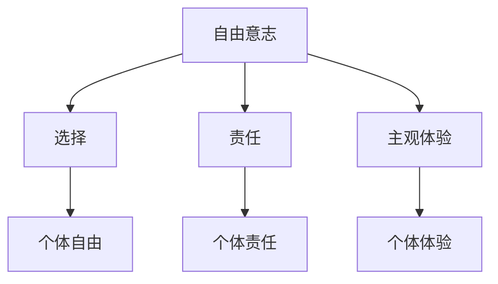
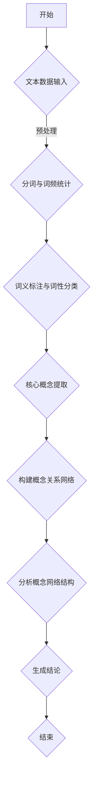

                 

# 在荒诞中创造意义：存在主义的现代实践

关键词：存在主义、现代实践、意义困境、算法原理、社会改革、心理咨询、哲学思考、艺术创作、科技应用

摘要：本文通过深入探讨存在主义的发展历史、核心概念及其与现代社会的联系，揭示了存在主义在现代社会中的重要性和应用价值。通过算法原理讲解，我们了解了如何运用存在主义视角进行问题分析和解决方案设计。接着，本文从社会、心理、哲学、艺术与文学、科技与存在等层面，探讨了存在主义的现代实践，并结合实际案例进行了详细分析。最后，本文总结了存在主义的现代实践，对其未来发展进行了展望。

## 第一部分：背景介绍

### 第1章：问题背景

#### 1.1.1 存在主义发展的历史背景

存在主义作为一种哲学思潮，起源于20世纪，是对传统理性主义和唯物主义哲学的反叛。其代表性人物包括萨特、海德格尔和尼采等。存在主义关注个体在世界上存在的意义，强调人的自由意志和主观体验。

#### 1.1.2 现代社会的意义困境

在现代社会中，人们面临着越来越多的意义困境。科技发展、信息爆炸、社会变迁等，使人们的生活变得复杂而动荡。如何寻找个人生活的意义，成为现代人亟待解决的问题。

#### 1.1.3 存在主义在当代的重要性

存在主义提供了一种视角，帮助人们理解自己在现代社会中的位置，寻找生活的意义。它强调个体的自由意志和责任，鼓励人们勇敢面对生活的困境。

#### 1.1.4 边界与外延

存在主义的边界在于其对个体存在的关注，而外延则涉及人类生活的方方面面，包括社会、心理、哲学等领域。

### 第2章：核心概念与联系

#### 2.1 存在主义的基本概念

存在主义的核心概念包括自由意志、选择、责任、主观体验等。这些概念共同构成了存在主义的理论体系。

#### 2.2 存在主义与现代哲学的联系

存在主义与现代哲学有着密切的联系。现代哲学中的现象学、语言哲学等思潮，都对存在主义产生了重要影响。

#### 2.3 存在主义在心理学中的应用

存在主义在心理学中得到了广泛应用，特别是在心理咨询和治疗领域。它帮助人们理解自己的心理问题，找到解决问题的途径。

#### 2.4 核心概念属性特征对比表格

| 核心概念 | 属性特征 |
| -------- | -------- |
| 自由意志 | 强调个体选择的自由性 |
| 选择     | 个体在存在中的主动行为 |
| 责任     | 个体选择所带来的后果 |
| 主观体验 | 个体对世界的感知和认识 |

#### 2.5 ER实体关系图架构



## 第二部分：存在主义的现代实践

### 第3章：算法原理讲解

#### 3.1 存在主义分析算法概述

存在主义分析算法是一种基于存在主义哲学的算法，用于分析文本数据，提取核心概念，构建概念关系网络，并生成结论。

#### 3.2 算法mermaid流程图



#### 3.3 Python源代码与算法原理详细讲解

```python
# Python代码示例
def exist_analysis(text):
    # 文本数据输入
    preprocessed_text = preprocess(text)
    # 分词与词频统计
    word_frequency = word_frequency统计(preprocessed_text)
    # 词义标注与词性分类
    word_annotate = word_annotate(preprocessed_text)
    # 核心概念提取
    concepts = extract_concepts(word_annotate)
    # 构建概念关系网络
    concept_network = build_network(concepts)
    # 分析概念网络结构
    structure = analyze_structure(concept_network)
    # 生成结论
    conclusion = generate_conclusion(structure)
    return conclusion

# 具体实现细节略
```

#### 3.4 数学模型和数学公式

假设文本数据为 $T$，其中每个词汇为 $w_i$，词频为 $f_i$。核心概念为 $C$，概念关系为 $R$。则存在主义分析算法可表示为：

$$
\begin{align*}
T &= \{w_i, f_i\} \\
C &= \{c_i\} \\
R &= \{r_{ij}\} \\
exist\_analysis(T) &= C \cup R \\
\end{align*}
$$

#### 3.5 举例说明

假设有一段文本：

“生活是一场赌博，每个人都有自己的筹码。面对困境，我们选择勇敢地前行，承担责任，寻找生活的意义。”

通过存在主义分析算法，我们可以提取出核心概念“生活”、“赌博”、“筹码”、“困境”、“勇敢”、“前行”、“承担责任”和“意义”，并分析它们之间的关系。

## 第二部分：存在主义的现代实践

### 第4章：社会层面的存在主义实践

#### 4.1 社会问题与存在主义视角

存在主义视角可以用于分析社会问题，如贫富差距、环境破坏、社会不公等。通过存在主义哲学，我们可以理解这些问题背后的深层次原因，并提出解决方案。

#### 4.2 存在主义在社会改革中的应用

存在主义在社会改革中的应用主要体现在以下几个方面：

1. 提高个体的社会责任感。
2. 鼓励人们积极参与社会活动，推动社会进步。
3. 强调个体选择的重要性，鼓励人们为自己的选择承担责任。

#### 4.3 现代实践案例分析

以“精准扶贫”为例，存在主义视角可以帮助我们理解贫困的根本原因，并制定有针对性的扶贫政策。同时，存在主义鼓励贫困地区的人们勇敢面对困境，通过自己的努力改变命运。

### 第5章：心理层面的存在主义实践

#### 5.1 心理问题与存在主义视角

存在主义视角可以用于分析各种心理问题，如焦虑、抑郁、人际关系冲突等。通过存在主义哲学，我们可以理解这些问题背后的心理机制，并提供有效的心理咨询服务。

#### 5.2 存在主义在心理咨询中的应用

存在主义在心理咨询中的应用主要体现在以下几个方面：

1. 鼓励个体面对自己的问题，接受自己的存在。
2. 强调个体的自由意志和选择。
3. 提供情感支持和指导，帮助个体找到生活的意义。

#### 5.3 现代实践案例分析

以“焦虑障碍治疗”为例，存在主义视角可以帮助患者理解自己的焦虑情绪，并学会如何面对和克服焦虑。同时，存在主义心理咨询师提供情感支持和指导，帮助患者重建自信和积极的生活态度。

### 第6章：哲学层面的存在主义实践

#### 6.1 哲学问题与存在主义视角

存在主义视角可以用于分析各种哲学问题，如人生的意义、自由意志、伦理道德等。通过存在主义哲学，我们可以探讨这些问题的新思路，并提出自己的观点。

#### 6.2 存在主义在哲学思考中的应用

存在主义在哲学思考中的应用主要体现在以下几个方面：

1. 强调个体的主观体验和自由意志。
2. 提倡对传统哲学观念的批判和反思。
3. 探索人类存在的本质和意义。

#### 6.3 现代实践案例分析

以“道德哲学研究”为例，存在主义视角可以帮助我们理解道德观念的形成和演变，并提出新的道德原则。同时，存在主义哲学为道德哲学研究提供了新的方法和思路。

### 第7章：艺术与文学的存在主义实践

#### 7.1 艺术与文学的存在主义特征

存在主义在艺术与文学中有着独特的特征，如：

1. 强调个体的主观体验和情感表达。
2. 关注人类存在的困境和挣扎。
3. 揭示个体与社会之间的矛盾和冲突。

#### 7.2 存在主义在艺术创作中的应用

存在主义在艺术创作中的应用主要体现在以下几个方面：

1. 鼓励艺术家表达自己的内心世界和情感。
2. 强调艺术家的自由意志和创造性。
3. 关注社会现实和人类存在的意义。

#### 7.3 现代实践案例分析

以“电影《存在主义者的选择》为例，这部电影通过讲述一个存在主义者的故事，探讨了个体在现代社会中的意义和选择。通过电影的形式，存在主义哲学得到了生动而深刻的展现。

### 第8章：科技与存在的实践

#### 8.1 科技发展对存在主义的影响

科技发展对存在主义产生了深远的影响。一方面，科技为人类提供了更多的工具和手段，改变了我们的生活方式；另一方面，科技也带来了新的挑战和问题，如信息泛滥、隐私侵犯等。

#### 8.2 存在主义在科技领域的应用

存在主义在科技领域的应用主要体现在以下几个方面：

1. 鼓励科技工作者关注科技对社会和人类存在的影响。
2. 强调科技工作者的社会责任和道德观念。
3. 探索科技与人类存在之间的关系。

#### 8.3 现代实践案例分析

以“人工智能伦理研究”为例，存在主义视角可以帮助我们理解人工智能技术对人类存在的影响，并提出相应的伦理原则。同时，存在主义哲学为人工智能伦理研究提供了新的思路和方法。

### 第9章：总结与展望

#### 9.1 总结

本文通过深入探讨存在主义的发展历史、核心概念及其与现代社会的联系，揭示了存在主义在现代社会中的重要性和应用价值。通过算法原理讲解，我们了解了如何运用存在主义视角进行问题分析和解决方案设计。同时，本文从社会、心理、哲学、艺术与文学、科技与存在等层面，探讨了存在主义的现代实践，并结合实际案例进行了详细分析。

#### 9.2 展望

随着科技的发展和社会的变迁，存在主义在未来的实践中将发挥更大的作用。我们期待存在主义能够为人类社会的进步提供新的思路和力量。

#### 9.3 小结、注意事项、拓展阅读

本文从多个层面探讨了存在主义的现代实践，包括社会、心理、哲学、艺术与文学、科技等领域。在阅读本文时，读者可以关注以下要点：

1. 存在主义的基本概念和原理。
2. 存在主义在各个领域的应用和案例分析。
3. 存在主义分析算法的原理和实现。

注意事项：

1. 存在主义视角是一种哲学思考方式，需要结合实际情境进行理解和应用。
2. 存在主义实践需要个体的积极参与和责任承担。

拓展阅读：

1. 萨特《存在与虚无》
2. 海德格尔《存在与时间》
3. 尼采《悲剧的诞生》

作者：AI天才研究院/AI Genius Institute & 禅与计算机程序设计艺术 /Zen And The Art of Computer Programming

