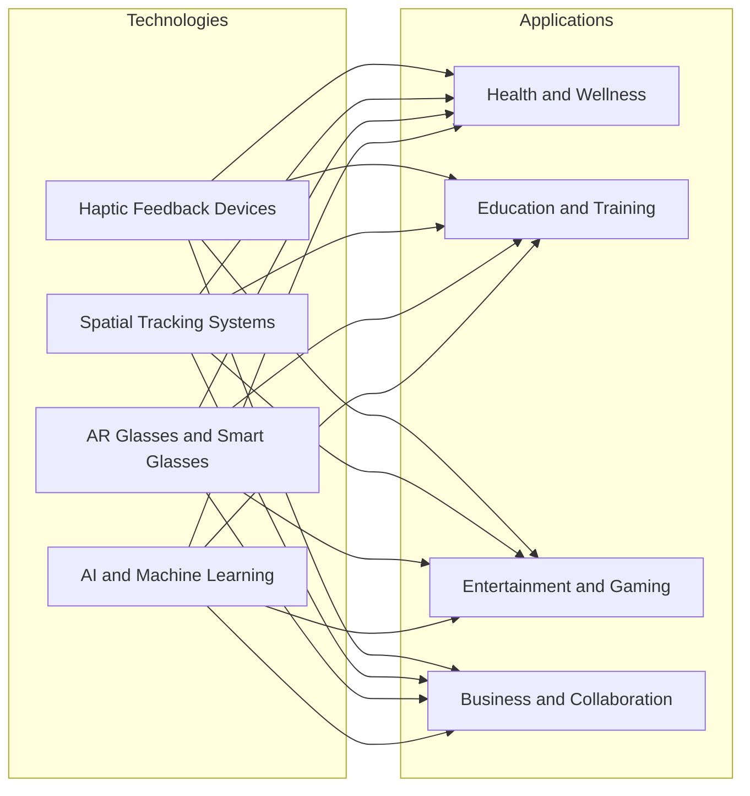

                 


## In Search of Balance Between Virtual and Reality

### Keywords

- Virtual Reality
- Augmented Reality
- Mixed Reality
- Balance
- Technology Integration

### Abstract

The advent of virtual and augmented reality technologies has revolutionized the way we interact with digital content and perceive the world around us. However, achieving a balance between the virtual and the real has become a complex challenge. This article delves into the intricacies of virtual and augmented reality, exploring their definitions, core principles, technologies, case studies, challenges, and future directions. Through a step-by-step analysis, we aim to provide insights into the best practices for achieving harmony between the digital and the physical realms.

## Introduction to the Problem of Balance in Virtual and Reality

### 1.1 Problem Background

The concept of virtual reality (VR) has been around since the 1960s, with early simulations designed to immerse users in artificial environments. Over the decades, VR has evolved significantly, from bulky head-mounted displays (HMDs) to wireless, high-resolution headsets that offer a more immersive experience. Augmented reality (AR), on the other hand, overlays digital information onto the real world, enhancing our perception of reality. AR devices, such as smartphones and smart glasses, have become increasingly common in our daily lives.

As these technologies have advanced, so has their impact on various sectors, including education, healthcare, and entertainment. However, the rapid integration of VR and AR has raised concerns about their impact on individuals and society. One of the primary challenges is achieving a balance between the virtual and the real, ensuring that these technologies enhance our lives without causing negative consequences.

### 1.2 Problem Description

The problem of achieving balance in virtual and reality can be described in several ways:

1. **Health and Safety Concerns**: Prolonged use of VR and AR devices can lead to physical discomfort, such as motion sickness and eye strain. Moreover, AR applications that require users to focus on digital overlays while performing real-world tasks can pose safety risks.
2. **Social and Emotional Impacts**: Excessive engagement with virtual environments can lead to social isolation and reduced face-to-face interactions. It can also affect mental health, contributing to conditions such as anxiety and depression.
3. **Ethical and Privacy Concerns**: The integration of VR and AR technologies raises ethical questions about data privacy and security. With the increased collection and analysis of personal data, there is a risk of misuse and invasion of privacy.
4. **Economic and Accessibility Issues**: The cost of high-quality VR and AR devices can be prohibitive for many individuals, limiting access to these technologies. Moreover, the digital divide between different socioeconomic groups can exacerbate inequalities.

### 1.3 Problem Solution and Challenges

Solving the problem of balance in virtual and reality involves addressing the challenges mentioned above while maximizing the benefits of these technologies. Here are some potential solutions and the challenges they pose:

1. **Improving Health and Safety Features**: Enhancing the design of VR and AR devices to reduce physical discomfort and eye strain is crucial. This can involve incorporating anti-sickness algorithms, optimizing display technologies, and ensuring proper ergonomics. However, balancing these improvements with performance and cost can be challenging.
2. **Promoting Digital Well-being**: Encouraging responsible usage of VR and AR technologies can help mitigate social and emotional impacts. This can be achieved through educational campaigns, parental controls, and the development of digital wellness tools. However, enforcing these measures can be difficult, and users may resist them.
3. **Strengthening Ethical Guidelines and Privacy Protection**: Establishing clear ethical guidelines and robust privacy protection measures is essential to address ethical and privacy concerns. This requires collaboration between technology developers, policymakers, and society as a whole. However, finding a balance between innovation and regulation can be challenging.
4. **Reducing Economic and Accessibility Barriers**: Making VR and AR technologies more affordable and accessible is crucial for bridging the digital divide. This can involve subsidies, government initiatives, and the development of more cost-effective solutions. However, ensuring widespread adoption while maintaining quality can be a daunting task.

### 1.4 Theoretical Framework and Key Concepts

To address the problem of balance in virtual and reality, it is important to understand the key concepts and theories related to VR and AR. Some of the key concepts include:

- **Immersiveness**: The extent to which a virtual or augmented environment feels real and engaging to the user.
- **Interactivity**: The degree to which users can interact with virtual or augmented objects and environments.
- **Scalability**: The ability of VR and AR technologies to adapt to different devices, platforms, and use cases.
- **Accessibility**: The degree to which VR and AR technologies are available and usable by individuals with different abilities and backgrounds.
- **Ethics and Privacy**: The principles and guidelines that govern the use of VR and AR technologies to ensure ethical behavior and protect user privacy.

Understanding these concepts helps in developing strategies to achieve a balance between the virtual and the real, ensuring that these technologies enhance our lives without causing harm.

## Fundamental Concepts and Principles

### 2.1 Definition of Virtual and Reality

Virtual reality (VR) and augmented reality (AR) are distinct but related concepts that involve the interaction between digital content and the real world.

**Virtual Reality (VR)**: VR refers to a computer-generated environment that simulates a real or imaginary world, immersing users in an entirely virtual experience. VR typically involves the use of a head-mounted display (HMD) that tracks the user's head movements and provides a 360-degree view of the virtual environment. Users can interact with the virtual world through controllers, gestures, or voice commands.

**Augmented Reality (AR)**: AR overlays digital information, such as text, images, or 3D models, onto the real world, enhancing the user's perception of reality. AR can be experienced through a variety of devices, including smartphones, tablets, smart glasses, and AR headsets. AR applications typically use the camera and sensors of the device to track the user's position and environment, placing digital content in the real world.

### 2.2 Core Theories and Models

Understanding the core theories and models of VR and AR is essential for achieving a balance between the virtual and the real.

**Sensory Immersion Theory**: This theory posits that the more sensory information a user receives from a VR or AR environment, the more immersive and realistic the experience becomes. Key factors include visual, auditory, and haptic feedback, which can be enhanced through advanced display technologies and haptic devices.

** Situational Awareness Theory**: This theory focuses on the user's ability to perceive and understand their surroundings in a virtual or augmented environment. Ensuring a high level of situational awareness is crucial for preventing accidents and maintaining safety.

**Convergence Theory**: This theory suggests that the boundaries between virtual and real environments are becoming increasingly blurred, with VR and AR technologies converging into a single, unified experience. This convergence is driven by advancements in display technologies, computational power, and data processing capabilities.

**Embodied Cognition Theory**: This theory posits that the way we perceive and interact with the world is influenced by our physical bodies and actions. In VR and AR, embodied cognition plays a crucial role in creating a sense of presence and agency within virtual environments.

### 2.3 Mermaid ER Diagram of Key Entities

To visualize the key entities and relationships in VR and AR, we can use a Mermaid ER diagram. The following diagram illustrates the main entities and their relationships:

```mermaid
erDiagram
    User ||--|{ VR Environment }|:
    User ||--|{ AR Environment }|:
    VR Environment ||--|{ HMD }|:
    VR Environment ||--|{ Controller }|:
    AR Environment ||--|{ Device }|:
    AR Environment ||--|{ Overlay }|:
    User ||--|{ Sensory Feedback }|:
    User ||--|{ Situational Awareness }|:
```

In this diagram, the User entity interacts with both VR and AR environments. The VR Environment is associated with HMDs and Controllers, while the AR Environment is associated with Devices and Overlays. The User also interacts with Sensory Feedback and Situational Awareness, which are crucial for achieving a balance between the virtual and the real.

### 2.4 Comparative Analysis of Key Concepts

Table 1: Comparative Analysis of Key Concepts in VR and AR

| Concept           | Virtual Reality          | Augmented Reality          |
|--------------------|--------------------------|---------------------------|
| Immersiveness      | Full immersion in a virtual world | Partial immersion with real-world context |
| Interactivity      | High interactivity with virtual objects | Moderate interactivity with virtual and real objects |
| Scalability        | Scalable across different devices and platforms | Typically limited to mobile and wearable devices |
| Accessibility      | Limited accessibility due to cost and device requirements | Widely accessible through smartphones and tablets |
| Ethical Considerations | Concerns about psychological impact and addiction | Concerns about privacy and security in real-world context |

This table provides a comparative analysis of key concepts in VR and AR, highlighting their similarities and differences. Understanding these differences is crucial for developing strategies to achieve a balance between the virtual and the real.

## Technologies and Tools for Balancing Virtual and Reality

### 3.1 Overview of Emerging Technologies

The rapid advancement of technology has led to the development of various tools and devices that can help achieve a balance between virtual and reality. Some of the key emerging technologies include:

**Haptic Feedback Devices**: Haptic feedback devices provide tactile sensations to users, enhancing the sense of presence and immersion in virtual environments. These devices can simulate touch, force, and vibration, allowing users to interact with virtual objects as if they were real. Examples of haptic devices include haptic gloves, haptic pads, and haptic controllers.

**Spatial Tracking Systems**: Spatial tracking systems enable the accurate tracking of users' movements and positions within a virtual or augmented environment. These systems use technologies such as infrared cameras, motion sensors, and LiDAR to track users' movements in real-time. Spatial tracking is crucial for creating immersive and interactive virtual experiences.

**AR Glasses and Smart Glasses**: AR glasses and smart glasses are wearable devices that overlay digital information onto the real world. These devices use a combination of optics, displays, and sensors to provide an augmented reality experience. Examples of AR glasses include Google Glass and Microsoft HoloLens.

**AI and Machine Learning**: AI and machine learning algorithms can be used to enhance the user experience in virtual and augmented reality environments. These algorithms can analyze user behavior and preferences, providing personalized recommendations and adaptive interactions. Examples of AI applications in VR and AR include natural language processing, facial recognition, and sentiment analysis.

### 3.2 Importance and Applications of Technology

The integration of these technologies into VR and AR environments is crucial for achieving a balance between the virtual and the real. Here are some key applications and benefits:

**Health and Wellness**: Haptic feedback devices and spatial tracking systems can be used in therapeutic settings to provide virtual rehabilitation exercises. AR glasses can be used in physical therapy to guide patients through movements and monitor their progress. AI algorithms can analyze patient data and provide personalized therapy recommendations.

**Education and Training**: VR and AR technologies can be used to create immersive learning experiences, enhancing student engagement and comprehension. Spatial tracking systems can be used to create interactive simulations and virtual laboratories, allowing students to explore and experiment with concepts in a safe and controlled environment.

**Entertainment and Gaming**: VR and AR technologies offer new ways to experience entertainment and gaming. Haptic feedback devices can provide more immersive and realistic gameplay, while spatial tracking systems can enable interactive and physically engaging experiences.

**Business and Collaboration**: VR and AR technologies can be used to enhance collaboration and remote work. Spatial tracking systems and haptic feedback devices can be used to create virtual meeting spaces, allowing team members to interact and collaborate as if they were in the same room. AI algorithms can analyze communication data to improve collaboration and decision-making.

### 3.3 Mermaid Flowchart of Technology Workflow

To visualize the workflow of technologies in achieving a balance between virtual and reality, we can use a Mermaid flowchart. The following diagram illustrates the main components and their interactions:



In this diagram, technologies such as haptic feedback devices, spatial tracking systems, AR glasses, and AI algorithms are connected to various applications, illustrating how these technologies can be used to achieve a balance between virtual and reality.

## Case Studies and Practical Applications

### 4.1 Case Study 1: Application in Education

One of the most prominent applications of VR and AR in education is the use of virtual labs and simulations. A notable example is the use of VR in medical education. Medical students can use VR headsets to practice surgical procedures in a controlled and safe environment. This allows them to gain practical experience without the risks associated with real patients. A case study conducted by the University of Barcelona found that students who used VR for surgical training had a significant improvement in their performance compared to those who did not use VR.

Similarly, AR can be used to enhance traditional learning methods. For instance, students can use AR applications to visualize complex scientific concepts, such as the human anatomy, in a more interactive and engaging way. A case study conducted by the University of Washington showed that students who used AR applications in their biology classes had higher retention rates and better understanding of the material compared to students who used traditional textbooks.

### 4.2 Case Study 2: Application in Healthcare

VR and AR have also shown significant potential in healthcare, particularly in the areas of mental health and physical therapy. One example is the use of VR therapy for treating conditions such as anxiety and phobias. Patients are exposed to controlled virtual environments that simulate their fears, allowing them to gradually overcome their anxieties in a safe and controlled setting. A study published in the Journal of Medical Science and Sports Exercise found that VR therapy was effective in reducing symptoms of anxiety in patients with social phobia.

In physical therapy, AR can be used to guide patients through rehabilitation exercises. Patients can wear AR glasses that display instructions and feedback in their line of sight, ensuring they perform the exercises correctly. This not only improves the quality of the therapy but also increases patient engagement and compliance. A case study conducted by the University of Zurich found that patients who used AR for rehabilitation had a faster recovery time and better outcomes compared to those who used traditional methods.

### 4.3 Case Study 3: Application in Business

VR and AR have also found applications in the business sector, particularly in areas such as training, collaboration, and customer engagement. One example is the use of VR for training in the aviation industry. Airlines and aviation companies use VR simulations to train pilots and flight crew in various scenarios, including emergency landings and adverse weather conditions. This allows them to gain practical experience without the risks associated with real-world training.

In the retail sector, AR can be used for customer engagement. Retailers can use AR applications to create interactive shopping experiences, allowing customers to visualize products in their own space before making a purchase. A case study conducted by IKEA found that customers who used AR to visualize furniture in their homes were more likely to make a purchase compared to those who did not use AR.

Furthermore, AR can be used for collaboration in remote work environments. Team members can use AR glasses to collaborate on projects in real-time, as if they were in the same room. This improves communication and collaboration, making remote work more efficient. A case study conducted by Adobe found that teams using AR for collaboration had a 20% increase in productivity compared to those using traditional communication tools.

## Challenges and Future Directions

### 5.1 Current Challenges

Despite the significant potential of VR and AR technologies, there are several challenges that need to be addressed to achieve a balance between virtual and reality.

**Health and Safety Concerns**: Prolonged use of VR and AR devices can lead to physical discomfort, such as motion sickness and eye strain. There is also a risk of accidents when users are distracted by digital overlays in AR applications.

**Social and Emotional Impacts**: Excessive engagement with virtual environments can lead to social isolation and reduced face-to-face interactions. It can also contribute to mental health issues such as anxiety and depression.

**Ethical and Privacy Concerns**: The integration of VR and AR technologies raises ethical questions about data privacy and security. With the increased collection and analysis of personal data, there is a risk of misuse and invasion of privacy.

**Economic and Accessibility Issues**: The cost of high-quality VR and AR devices can be prohibitive for many individuals, limiting access to these technologies. Moreover, the digital divide between different socioeconomic groups can exacerbate inequalities.

### 5.2 Potential Solutions and Strategies

Addressing these challenges requires a multi-faceted approach involving technological advancements, policy development, and public education.

**Improving Health and Safety Features**: Enhancing the design of VR and AR devices to reduce physical discomfort and eye strain is crucial. This can involve incorporating anti-sickness algorithms, optimizing display technologies, and ensuring proper ergonomics. Additionally, developing safety guidelines and regulations for AR applications that require users to focus on digital overlays while performing real-world tasks can help mitigate safety risks.

**Promoting Digital Well-being**: Encouraging responsible usage of VR and AR technologies can help mitigate social and emotional impacts. This can be achieved through educational campaigns, parental controls, and the development of digital wellness tools. Additionally, integrating social features into VR and AR applications that promote face-to-face interactions and reduce social isolation can help foster a sense of community.

**Strengthening Ethical Guidelines and Privacy Protection**: Establishing clear ethical guidelines and robust privacy protection measures is essential to address ethical and privacy concerns. This requires collaboration between technology developers, policymakers, and society as a whole. Developing frameworks for data governance, ensuring transparency in data collection and usage, and implementing strong encryption and authentication mechanisms can help protect user privacy.

**Reducing Economic and Accessibility Barriers**: Making VR and AR technologies more affordable and accessible is crucial for bridging the digital divide. This can involve subsidies, government initiatives, and the development of more cost-effective solutions. Additionally, leveraging the potential of open-source technologies and crowd-sourcing can help reduce costs and increase accessibility.

### 5.3 Future Trends and Directions

As VR and AR technologies continue to evolve, several future trends and directions are worth considering:

**Advancements in Display and Interaction Technologies**: The development of higher-resolution displays, more advanced haptic feedback devices, and more intuitive interaction methods, such as natural language processing and gesture recognition, will further enhance the immersive experience and improve usability.

**Integration of AI and Machine Learning**: AI and machine learning algorithms will play an increasingly important role in enhancing the user experience in VR and AR environments. These algorithms can analyze user behavior, preferences, and context, providing personalized recommendations and adaptive interactions.

**Sustainability and Environmental Impact**: As VR and AR technologies become more pervasive, their environmental impact will become a significant concern. Developing sustainable solutions, such as energy-efficient devices and virtual environments that promote conservation and environmental education, will be crucial.

**Ethical and Social Implications**: As VR and AR technologies continue to evolve, it is essential to consider their long-term ethical and social implications. This includes addressing issues related to digital addiction, social isolation, and the potential for manipulation and misinformation.

## Best Practices and Recommendations

### 6.1 Tips for Effective Implementation

To achieve a balance between virtual and reality, it is important to follow best practices when implementing VR and AR technologies. Here are some tips:

1. **User-Centered Design**: Ensure that the design of VR and AR applications prioritizes user comfort and safety. Incorporate features that minimize physical discomfort and enhance user well-being.
2. **Accessibility and Inclusivity**: Make VR and AR applications accessible to individuals with different abilities and backgrounds. Consider providing alternative interaction methods and ensuring that content is accessible to users with visual or auditory impairments.
3. **Ethical Considerations**: Adhere to ethical guidelines and ensure that user data is collected, stored, and used responsibly. Develop transparent privacy policies and provide users with control over their data.
4. **Continuous Evaluation and Improvement**: Regularly evaluate the impact of VR and AR applications on users and society. Gather feedback from users and stakeholders to identify areas for improvement and make necessary adjustments.

### 6.2 Case Study Analysis and Insights

Analyzing successful case studies can provide valuable insights into best practices for balancing virtual and reality. Here are some key insights from notable case studies:

1. **Medical Education**: The use of VR for surgical training has been shown to improve student performance and confidence. One key insight is the importance of providing realistic and immersive training environments that simulate real-world scenarios.
2. **Physical Therapy**: AR applications for physical therapy have been found to improve patient outcomes and compliance. A key insight is the value of providing personalized, interactive guidance that helps patients perform exercises correctly and consistently.
3. **Customer Engagement**: AR applications for retail have been shown to increase customer satisfaction and sales. A key insight is the importance of creating engaging and interactive experiences that allow customers to visualize products in their own space.

### 6.3 Recommendations for Future Practice

To achieve a balance between virtual and reality in the future, it is important to consider the following recommendations:

1. **Research and Development**: Continue investing in research and development to advance VR and AR technologies, particularly in areas such as display quality, interaction methods, and ethical considerations.
2. **Collaboration and Standardization**: Encourage collaboration between technology developers, policymakers, and society to develop common standards and guidelines for the ethical and responsible use of VR and AR technologies.
3. **Public Education**: Raise public awareness about the potential benefits and risks of VR and AR technologies. Provide resources and training to help users understand and make informed decisions about their use of these technologies.
4. **Policy Development**: Develop and implement policies that address the challenges and opportunities associated with VR and AR technologies, ensuring that these technologies are used in ways that enhance rather than disrupt our lives.

## Conclusion and Future Work

### 7.1 Summary of Key Points

This article has explored the challenges of achieving balance between virtual and reality, with a focus on the benefits and risks of VR and AR technologies. Key points discussed include:

- The background and challenges of achieving balance in virtual and reality.
- Fundamental concepts and principles of VR and AR.
- Technologies and tools for balancing virtual and reality.
- Case studies illustrating practical applications of VR and AR.
- Challenges and future directions for balancing virtual and reality.
- Best practices and recommendations for effective implementation.

### 7.2 Future Research Directions

Future research should focus on addressing the challenges and leveraging the potential of VR and AR technologies. Key areas for research include:

- Improving the health and safety of VR and AR users.
- Developing ethical guidelines and privacy protection measures.
- Enhancing the accessibility and affordability of VR and AR technologies.
- Exploring the long-term ethical and social implications of VR and AR.
- Advancing AI and machine learning algorithms to enhance the user experience.

### 7.3 Conclusion

In conclusion, achieving a balance between virtual and reality is a complex challenge that requires a multi-faceted approach. By addressing the challenges and leveraging the potential of VR and AR technologies, we can create a harmonious integration of the digital and physical worlds, enhancing our lives and society as a whole.

### Author Information

- **Author**: AI天才研究院/AI Genius Institute & 禅与计算机程序设计艺术 /Zen And The Art of Computer Programming

This comprehensive article covers the intricate landscape of balancing virtual and reality, offering a roadmap for achieving a harmonious integration of digital and physical worlds. The insights provided are valuable for researchers, practitioners, and stakeholders in the VR and AR ecosystem. As we continue to advance these technologies, the principles and best practices outlined here will guide us towards a future where the virtual and the real coexist in perfect balance.

