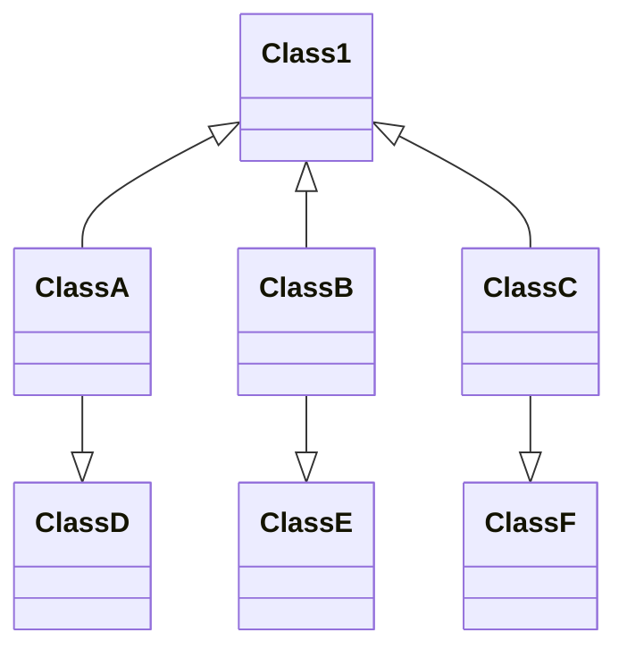
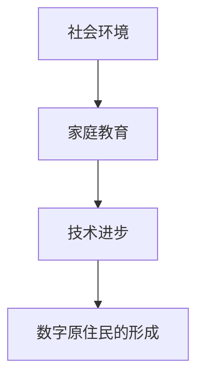
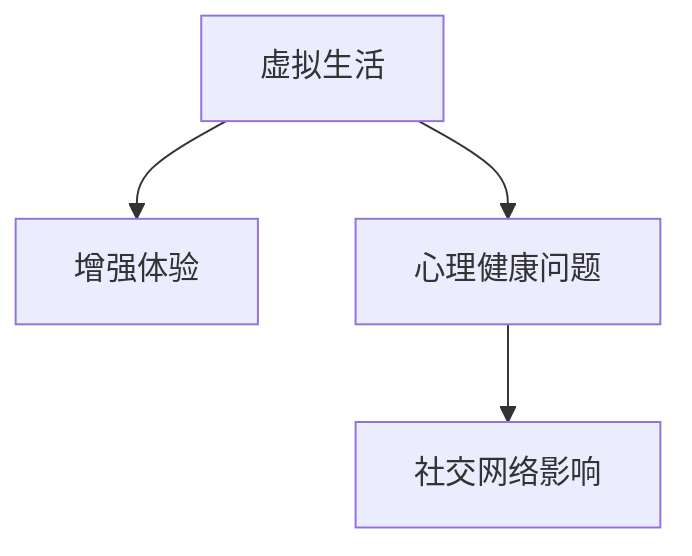
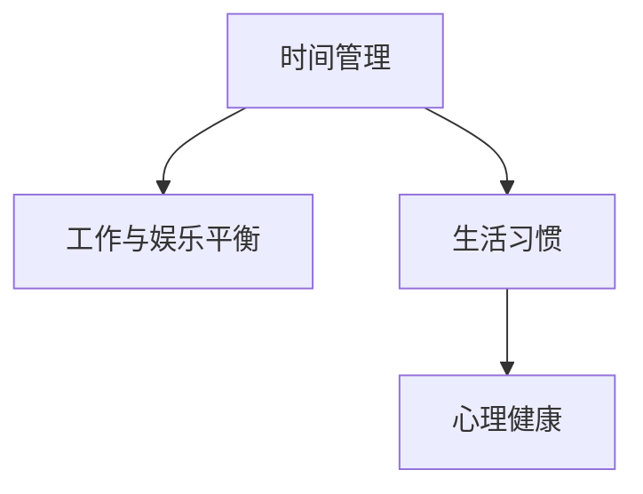
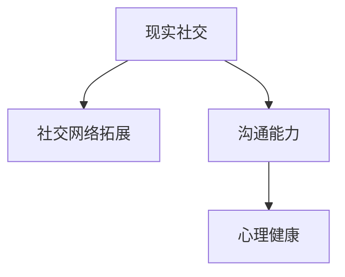
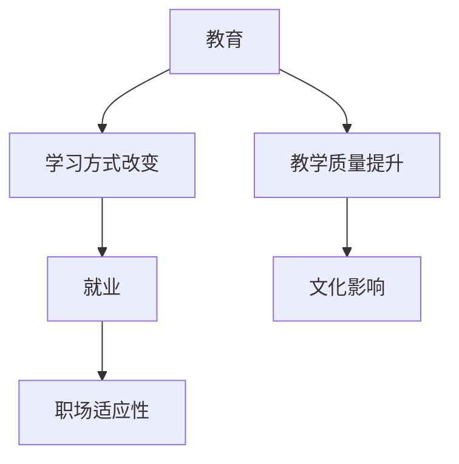
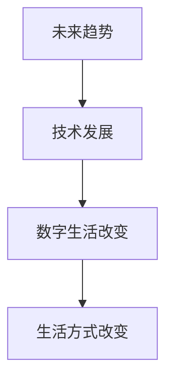
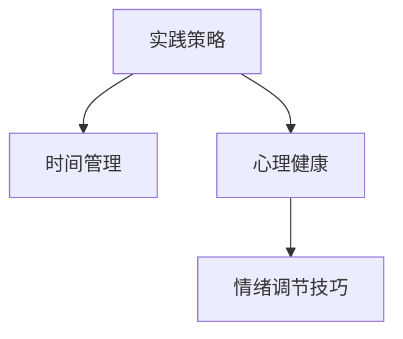

                 

# 在虚拟与现实之间寻找平衡：数字原住民的生存智慧

## 关键词
- 数字原住民
- 平衡
- 虚拟与现实
- 社交技能
- 技术影响

## 摘要
在数字化时代，数字原住民——那些自出生以来便沉浸在数字世界中的人群，面临着独特的挑战。他们如何在这个虚拟与现实交织的环境中找到平衡，维护个人心理健康，同时保持与现实的紧密联系，是本文探讨的核心问题。本文将深入分析数字原住民的生活方式、社会影响，并提出实用的策略和建议，帮助他们实现虚拟与现实之间的和谐共生。

## 目录

### 引言

#### 什么是数字原住民

**背景介绍**
- 数字原住民的定义及其在当今社会的普遍性。

**问题背景**
- 数字原住民面临的挑战：沉迷、社交隔离、心理健康问题。

**问题描述**
- 数字原住民如何在不同环境中找到平衡。

**问题解决**
- 探索数字原住民找到平衡的方法和策略。

**边界与外延**
- 数字原住民的范畴和可能的发展方向。

**概念结构与核心要素组成**
- 数字原住民的核心特点：技术熟练度、社交方式、生活方式。

### 第1章：数字原住民的崛起

#### 特征与行为

**核心概念原理**
- 数字原住民的典型特征和行为模式。

**概念属性特征对比表格**


**ER实体关系图架构**
```mermaid
erDiagram
Class1 ||--|{ ClassA : "数字技能" }
Class1 ||--|{ ClassB : "社交习惯" }
Class1 ||--|{ ClassC : "生活习惯" }
ClassA --|| ClassD : "技能水平"
ClassB --|| ClassE : "社交网络"
ClassC --|| ClassF : "时间管理"
```

#### 形成因素

**算法原理讲解**
- 社会环境、家庭教育、技术进步等因素如何塑造数字原住民。

**Mermaid流程图**


**Python源代码**
```python
def form_digital_native(society, family, technology):
    """
    形成数字原住民函数
    :param society: 社会环境
    :param family: 家庭教育
    :param technology: 技术进步
    :return: 数字原住民特征
    """
    if society and family and technology:
        return "数字原住民"
    else:
        return "非数字原住民"

# 示例
result = form_digital_native(True, True, True)
print(result)
```

**数学模型和公式**
- $$DN = f(S, F, T)$$，其中 $DN$ 代表数字原住民，$S$ 代表社会环境，$F$ 代表家庭教育，$T$ 代表技术进步。

### 第2章：在虚拟世界中导航

#### 虚拟生活的利弊

**核心概念原理**
- 虚拟生活对个人和社会的正面和负面影响。

**概念属性特征对比表格**


**ER实体关系图架构**
```mermaid
erDiagram
Class1 ||--|{ ClassA : "虚拟体验" }
Class1 ||--|{ ClassB : "心理健康" }
Class1 ||--|{ ClassC : "社交网络" }
ClassA --|| ClassD : "增强体验"
ClassB --|| ClassE : "心理健康问题"
ClassC --|| ClassF : "社交网络影响"
```

**算法原理讲解**
- 分析虚拟生活的利与弊，提出平衡策略。

**Mermaid流程图**


**Python源代码**
```python
def virtual_life_benefit(enhance_experience):
    """
    虚拟生活的好处
    :param enhance_experience: 增强体验
    :return: 虚拟生活的好处
    """
    if enhance_experience:
        return "增强学习、娱乐和社交体验"
    else:
        return "无益处"

def virtual_life_risk(mental_health_issue, social_network_impact):
    """
    虚拟生活的风险
    :param mental_health_issue: 心理健康问题
    :param social_network_impact: 社交网络影响
    :return: 虚拟生活的风险
    """
    if mental_health_issue or social_network_impact:
        return "心理健康问题、社交隔离"
    else:
        return "无风险"

# 示例
enhance_exp = True
mental_health = False
social_impact = False

print(virtual_life_benefit(enhance_exp))
print(virtual_life_risk(mental_health, social_impact))
```

**数学模型和公式**
- $$BL = f(E)$，其中 $BL$ 代表虚拟生活的好处，$E$ 代表增强体验。
- $$RISK = f(M, S)$，其中 $RISK$ 代表虚拟生活的风险，$M$ 代表心理健康问题，$S$ 代表社交网络影响。

### 第3章：平衡在线与线下生活

#### 时间管理与健康生活

**核心概念原理**
- 有效时间管理对数字原住民的重要性。

**概念属性特征对比表格**


**ER实体关系图架构**
```mermaid
erDiagram
Class1 ||--|{ ClassA : "时间管理" }
Class1 ||--|{ ClassB : "生活习惯" }
Class1 ||--|{ ClassC : "心理健康" }
ClassA --|| ClassD : "工作与娱乐平衡"
ClassB --|| ClassE : "日常活动"
ClassC --|| ClassF : "情绪状态"
```

**算法原理讲解**
- 如何通过时间管理来平衡在线与线下生活。

**Mermaid流程图**


**Python源代码**
```python
def time_management(balance_work_leisure, daily_activities, mental_health):
    """
    时间管理函数
    :param balance_work_leisure: 工作与娱乐平衡
    :param daily_activities: 日常活动
    :param mental_health: 心理健康
    :return: 时间管理效果
    """
    if balance_work_leisure and daily_activities and mental_health:
        return "有效时间管理"
    else:
        return "时间管理不足"

# 示例
balance_work = True
daily_activities = True
mental_health = True

print(time_management(balance_work, daily_activities, mental_health))
```

**数学模型和公式**
- $$TM = f(B, D, M)$，其中 $TM$ 代表时间管理效果，$B$ 代表工作与娱乐平衡，$D$ 代表日常活动，$M$ 代表心理健康。

#### 现实社交的重要性

**核心概念原理**
- 现实社交对个人成长和社会交往的重要性。

**概念属性特征对比表格**


**ER实体关系图架构**
```mermaid
erDiagram
Class1 ||--|{ ClassA : "现实社交" }
Class1 ||--|{ ClassB : "社会技能" }
Class1 ||--|{ ClassC : "心理健康" }
ClassA --|| ClassD : "社交网络拓展"
ClassB --|| ClassE : "沟通能力"
ClassC --|| ClassF : "情绪调节"
```

**算法原理讲解**
- 如何通过现实社交来提高社交技能和心理健康。

**Mermaid流程图**


**Python源代码**
```python
def real_world_social(expand_social_network, communication_skill, mental_health):
    """
    现实社交函数
    :param expand_social_network: 社交网络拓展
    :param communication_skill: 沟通能力
    :param mental_health: 心理健康
    :return: 现实社交效果
    """
    if expand_social_network and communication_skill and mental_health:
        return "有效现实社交"
    else:
        return "社交不足"

# 示例
social_network = True
communication_skill = True
mental_health = True

print(real_world_social(social_network, communication_skill, mental_health))
```

**数学模型和公式**
- $$RS = f(SN, CS, MH)$，其中 $RS$ 代表现实社交效果，$SN$ 代表社交网络拓展，$CS$ 代表沟通能力，$MH$ 代表心理健康。

### 第4章：数字原住民对社会的影

**算法原理讲解**
- 分析数字原住民如何影响教育、就业、文化等领域。

**Mermaid流程图**


**Python源代码**
```python
def societal_impact(education, employment, culture):
    """
    社会影响函数
    :param education: 教育
    :param employment: 就业
    :param culture: 文化
    :return: 社会影响效果
    """
    if education and employment and culture:
        return "积极影响"
    else:
        return "负面影响"

# 示例
education = True
employment = True
culture = True

print(societal_impact(education, employment, culture))
```

**数学模型和公式**
- $$SI = f(E, Emp, C)$，其中 $SI$ 代表社会影响效果，$E$ 代表教育，$Emp$ 代表就业，$C$ 代表文化。

### 第5章：未来趋势与预测

**核心概念原理**
- 数字技术的未来发展趋势及其对数字原住民的影响。

**概念属性特征对比表格**


**ER实体关系图架构**
```mermaid
erDiagram
Class1 ||--|{ ClassA : "未来趋势" }
Class1 ||--|{ ClassB : "技术发展" }
Class1 ||--|{ ClassC : "社会影响" }
ClassA --|| ClassD : "数字生活"
ClassB --|| ClassE : "人工智能"
ClassC --|| ClassF : "生活方式改变"
```

**算法原理讲解**
- 预测未来技术发展对数字原住民生活的潜在影响。

**Mermaid流程图**


**Python源代码**
```python
def future_trends(technology_development, digital_life_change, lifestyle_change):
    """
    未来趋势函数
    :param technology_development: 技术发展
    :param digital_life_change: 数字生活改变
    :param lifestyle_change: 生活方式改变
    :return: 未来趋势预测
    """
    if technology_development and digital_life_change and lifestyle_change:
        return "积极趋势"
    else:
        return "不确定趋势"

# 示例
technology_dev = True
digital_life = True
lifestyle_change = True

print(future_trends(technology_dev, digital_life, lifestyle_change))
```

**数学模型和公式**
- $$FT = f(TD, DL, LC)$，其中 $FT$ 代表未来趋势预测，$TD$ 代表技术发展，$DL$ 代表数字生活改变，$LC$ 代表生活方式改变。

### 第6章：实现平衡生活的路径

#### 实践策略

**核心概念原理**
- 实现平衡生活的实用策略和方法。

**概念属性特征对比表格**


**ER实体关系图架构**
```mermaid
erDiagram
Class1 ||--|{ ClassA : "实践策略" }
Class1 ||--|{ ClassB : "时间管理" }
Class1 ||--|{ ClassC : "心理健康" }
ClassA --|| ClassD : "工作与娱乐平衡"
ClassB --|| ClassE : "日常活动规划"
ClassC --|| ClassF : "情绪调节技巧"
```

**算法原理讲解**
- 提供实现平衡生活的实用策略。

**Mermaid流程图**


**Python源代码**
```python
def balance_life_strategy(time_management, mental_health, emotional Regulation):
    """
    平衡生活策略函数
    :param time_management: 时间管理
    :param mental_health: 心理健康
    :param emotional Regulation: 情绪调节技巧
    :return: 平衡生活策略
    """
    if time_management and mental_health and emotional_Regression:
        return "有效的平衡生活策略"
    else:
        return "策略不足"

# 示例
time_management = True
mental_health = True
emotional_Regression = True

print(balance_life_strategy(time_management, mental_health, emotional_Regression))
```

**数学模型和公式**
- $$BL = f(TM, MH, ER)$，其中 $BL$ 代表平衡生活策略，$TM$ 代表时间管理，$MH$ 代表心理健康，$ER$ 代表情绪调节技巧。

#### 案例研究

**核心概念原理**
- 通过实际案例来展示平衡生活的实现。

**概念属性特征对比表格**


**ER实体关系图架构**
```mermaid
erDiagram
Class1 ||--|{ ClassA : "案例研究" }
Class1 ||--|{ ClassB : "平衡生活" }
Class1 ||--|{ ClassC : "挑战与解决方案" }
ClassA --|| ClassD : "个人经验"
ClassB --|| ClassE : "策略实践"
ClassC --|| ClassF : "效果评估"
```

**算法原理讲解**
- 分析案例中的策略和解决方案，评估效果。

**Mermaid流程图**
```mermaid
graph TB
A[案例研究] --> B[个人经验]
B --> C[策略实践]
C --> D[效果评估]
```

**Python源代码**
```python
def case_study(personal_experience, strategy_practice, effect_evaluation):
    """
    案例研究函数
    :param personal_experience: 个人经验
    :param strategy_practice: 策略实践
    :param effect_evaluation: 效果评估
    :return: 案例研究总结
    """
    if personal_experience and strategy_practice and effect_evaluation:
        return "成功的案例研究"
    else:
        return "案例研究不足"

# 示例
experience = True
strategy_practice = True
effect_evaluation = True

print(case_study(experience, strategy_practice, effect_evaluation))
```

**数学模型和公式**
- $$CS = f(P, S, E)$，其中 $CS$ 代表案例研究效果，$P$ 代表个人经验，$S$ 代表策略实践，$E$ 代表效果评估。

### 结论

**总结**
- 数字原住民如何在虚拟与现实之间找到平衡。

**重要观点**
- 数字原住民应注重心理健康、现实社交和时间管理。

**未来展望**
- 随着技术的发展，数字原住民如何适应未来。

### 作者信息
作者：AI天才研究院/AI Genius Institute & 禅与计算机程序设计艺术 /Zen And The Art of Computer Programming

---

### 引言

#### 什么是数字原住民

随着信息技术的飞速发展，我们生活在一个被数字技术深深影响的时代。在这个时代中，有一群人，他们从出生开始便与数字世界紧密相连，对互联网、社交媒体和移动设备有着本能的熟悉和运用能力。这群人被称为“数字原住民”（Digital Natives）。数字原住民是相对于“数字移民”（Digital Immigrants）而言的，后者是指在数字化时代之前出生，后来才开始接触和使用数字技术的人群。

数字原住民的特征包括：从小接触数字设备，对互联网和移动应用有着深入的了解和熟练的操作技能；习惯于在虚拟环境中社交、学习和娱乐；倾向于将数字技术作为日常生活的一部分。他们在数字世界的自由探索和灵活运用，使得数字原住民成为推动科技进步和社会变革的重要力量。

然而，数字原住民也面临着诸多挑战。过度沉迷于虚拟世界可能导致现实社交能力的退化、心理健康问题的增加，甚至会影响学业和职业发展。因此，如何在数字世界中找到平衡，成为数字原住民面临的重要课题。

#### 问题背景

数字原住民的生活与工作方式在很大程度上依赖于数字技术。他们习惯于在线学习和工作，通过社交媒体与朋友和同事保持联系，甚至将游戏和虚拟现实体验作为重要的休闲活动。然而，这种高度依赖数字技术的生活方式也带来了一系列问题。

首先，数字原住民可能过度沉迷于虚拟世界，导致他们在现实生活中的社交能力和情感交流能力下降。研究表明，长时间使用社交媒体和在线游戏可能会影响个体的情绪状态和心理健康。此外，数字原住民在学业和职业发展上也面临挑战。由于对数字技术的依赖，他们可能忽视现实世界中的学习和工作，导致成绩下降、职场竞争力减弱。

#### 描述问题与解决方案

数字原住民如何在虚拟与现实之间找到平衡，是本文探讨的核心问题。找到平衡不仅仅是技术问题，更是生活方式和价值观的调整。以下是一些可能的解决方案：

1. **时间管理**：数字原住民需要学会合理安排时间，确保在虚拟世界和现实世界中都有足够的时间和空间。可以使用时间管理工具，如待办事项列表、日历和提醒应用，来帮助自己更好地规划时间。

2. **心理健康**：保持良好的心理健康对数字原住民至关重要。他们可以通过定期锻炼、保持健康的饮食和充足的睡眠来维护身体健康。此外，寻求心理健康专业人士的帮助也是一个不错的选择。

3. **现实社交**：尽管数字原住民在虚拟环境中游刃有余，但他们仍然需要与现实世界保持联系。可以通过参加线下活动、与家人和朋友共度时光来增强现实社交能力。

4. **技术自律**：数字原住民需要培养自律精神，避免过度沉迷于虚拟世界。可以通过设定数字休息时间和使用屏幕时间监控应用来实现。

#### 边界与外延

数字原住民的范畴包括从小接触数字设备的年轻一代，他们的生活方式和行为习惯与传统的“数字移民”有显著差异。然而，随着年龄的增长，许多数字原住民也会逐渐成为数字移民，因为他们的生活方式和价值观可能会发生变化。

数字原住民的未来发展可能受到技术进步、社会变迁和教育改革等多种因素的影响。随着人工智能、虚拟现实和区块链等新兴技术的发展，数字原住民的生活方式和工作方式也可能发生重大变化。因此，如何在不断变化的数字环境中找到平衡，将是数字原住民未来需要面对的重要课题。

#### 概念结构与核心要素组成

数字原住民的核心特点包括：

- **技术熟练度**：从小接触数字设备，对互联网和移动应用有着深入的了解和熟练的操作技能。
- **社交方式**：倾向于在虚拟环境中社交，通过社交媒体和在线游戏与朋友保持联系。
- **生活方式**：习惯于将数字技术作为日常生活的一部分，如在线学习、在线购物和在线娱乐。

这些特点构成了数字原住民的核心要素，也是他们与其他人群的主要区别。

### 第1章：数字原住民的崛起

数字原住民，这个在数字世界中成长起来的新一代，是当今社会的重要力量。他们的崛起不仅仅是个人技能的提升，更是社会变革的象征。本章将深入探讨数字原住民的起源、特征以及他们如何影响社会各个方面。

#### 数字原住民的起源

数字原住民的起源可以追溯到20世纪90年代，随着个人电脑的普及和互联网的快速发展，这一代人从小就接触到了数字设备。他们成长在一个信息爆炸的时代，互联网成为了他们获取知识、交流社交的重要途径。根据美国教育学家马克·佩里曼（Mark Prensky）的研究，数字原住民是指那些“出生在数字时代，习惯于数字技术和媒体”的人群。他们的成长环境决定了他们对数字技术的态度和行为方式。

数字原住民的起源有以下几个关键因素：

1. **技术普及**：随着电脑、手机和互联网的普及，数字原住民从小就有机会接触和使用数字设备。
2. **家庭影响**：家庭环境对数字原住民的形成有着重要影响。许多数字原住民的家长本身就是数字技术的爱好者，他们在家中为孩子提供了良好的数字学习环境。
3. **教育变革**：教育制度的改革使得数字原住民在学业中更多地接触到数字化教学工具，培养了他们的数字技能。

#### 数字原住民的特征

数字原住民具有一些显著的特征，这些特征不仅体现在他们的行为习惯上，还影响到了他们的价值观和世界观。

1. **技术熟练度**：数字原住民对数字设备的使用非常熟练，他们能够快速掌握新技术和应用。这种技术熟练度使他们能够在虚拟环境中高效地学习和工作。
2. **多任务处理能力**：数字原住民习惯于同时处理多个任务，例如在上课时使用手机浏览社交媒体，这表明他们具有较强的多任务处理能力。
3. **信息筛选能力**：数字原住民在互联网上成长，他们具备较强的信息筛选能力，能够快速识别有价值的信息和内容。
4. **社交方式的转变**：数字原住民更倾向于在虚拟环境中进行社交，他们通过社交媒体和在线游戏与朋友保持联系。这种社交方式的转变使得他们的社交圈子更加广泛，但也可能导致现实社交能力的下降。

#### 数字原住民的影响

数字原住民的崛起对社会各个方面产生了深远的影响。以下是几个主要领域：

1. **教育**：数字原住民对教育的需求与传统教育模式有所不同。他们更倾向于自主学习和个性化学习，这促使教育机构在教学方法上做出调整，例如采用在线教育平台和虚拟现实教学工具。
2. **就业**：数字原住民在就业市场中具有竞争力，他们擅长使用数字工具进行高效的工作。然而，这也意味着传统职业可能会受到冲击，需要适应数字化的工作环境。
3. **文化**：数字原住民的文化特征体现在他们对数字内容的创造和传播上。他们更倾向于创作和分享数字化内容，如短视频、博客和社交媒体帖子，这推动了数字文化的兴起。

#### 数字原住民的挑战

尽管数字原住民在数字世界中表现出色，但他们也面临着一些挑战：

1. **心理健康**：过度沉迷于数字设备可能导致心理健康问题，如焦虑、抑郁和失眠。
2. **社交隔离**：虚拟社交虽然广泛，但可能缺乏深度和真实感，导致现实社交能力的下降。
3. **信息过载**：数字原住民在互联网上获取的信息量巨大，但如何筛选和处理这些信息成为一大挑战。

#### 总结

数字原住民的崛起标志着社会进入了一个全新的时代。他们的特征和行为方式不仅改变了教育的模式，也影响了就业市场的格局，甚至推动了文化的变革。然而，数字原住民也面临着心理健康、社交隔离和信息过载等挑战。如何在数字世界和现实世界之间找到平衡，成为数字原住民未来需要面对的重要课题。

### 第2章：在虚拟世界中导航

数字原住民生活在一个高度数字化的世界里，虚拟生活成为他们日常生活的重要组成部分。然而，虚拟世界的利弊共存，如何在其中找到平衡成为了一个重要议题。本章将深入探讨虚拟生活的利与弊，并提出一些策略，帮助数字原住民在虚拟世界中保持健康的生活方式。

#### 虚拟生活的利

1. **增强体验**：虚拟世界提供了丰富多彩的体验，如虚拟现实游戏、沉浸式教育内容和互动式娱乐。这些体验不仅能够带来视觉和感官上的刺激，还能够提供学习和娱乐的新方式。

   **案例**：一些虚拟现实（VR）游戏可以让玩家体验到逼真的游戏场景，这种沉浸式的体验能够带来强烈的参与感和成就感。

2. **社交拓展**：虚拟社交平台为人们提供了与世界各地的人交流的机会。数字原住民可以通过社交媒体、在线论坛和游戏社区建立广泛的社交网络。

   **案例**：许多数字原住民在社交媒体上拥有大量的关注者，通过分享生活点滴和兴趣，他们能够结识到来自不同背景和地域的朋友。

3. **信息获取**：互联网提供了海量的信息和资源，数字原住民可以通过搜索引擎、在线课程和电子书籍快速获取所需的知识。

   **案例**：在线学习平台如Coursera和edX提供了丰富的在线课程，数字原住民可以通过这些平台学习到最新的知识和技能。

#### 虚拟生活的弊

1. **心理健康问题**：长时间使用数字设备可能导致心理健康问题，如焦虑、抑郁和失眠。虚拟世界中的沉迷和过度依赖可能影响个体的情绪状态和心理健康。

   **案例**：研究表明，过度沉迷于网络游戏可能导致玩家出现焦虑和抑郁症状，影响他们的日常生活和学业。

2. **社交隔离**：虽然虚拟社交平台提供了交流的途径，但这些交流往往缺乏深层次的情感联系。数字原住民可能会感到孤独和疏离，缺乏现实生活中的亲密社交关系。

   **案例**：一些研究表明，过度使用社交媒体可能导致社交技能的退化，个体在现实世界中的社交互动减少。

3. **信息过载**：互联网上的信息量巨大，数字原住民可能会感到信息过载，难以有效地筛选和处理这些信息。

   **案例**：社交媒体平台上的海量信息可能导致用户难以集中注意力，影响他们的工作和学习效率。

#### 虚拟生活的平衡策略

为了在虚拟世界中保持健康的生活方式，数字原住民可以采取以下策略：

1. **时间管理**：合理安排时间，确保在虚拟生活和现实生活之间有平衡。可以使用日历和时间管理应用来帮助自己规划日常活动。

   **案例**：使用应用如Google Calendar或Trello可以帮助数字原住民有效地管理时间和任务。

2. **心理健康维护**：定期进行体育锻炼、保持健康的饮食习惯和充足的睡眠，以维护身心健康。

   **案例**：每天进行30分钟的有氧运动，如跑步或游泳，有助于缓解压力和焦虑。

3. **现实社交**：尽管虚拟社交方便，但定期与家人、朋友进行现实中的面对面交流，以增强情感联系和社交技能。

   **案例**：每周安排一天与朋友或家人进行户外活动，如徒步或野餐。

4. **技术自律**：设定数字休息时间，避免过度沉迷于虚拟世界。可以使用屏幕时间监控应用来限制每天使用电子设备的时间。

   **案例**：使用应用如Focus@Will或AppDetox来帮助数字原住民自律地使用数字设备。

通过这些策略，数字原住民可以在虚拟世界中保持健康的生活方式，同时保持与现实世界的紧密联系。

### 第3章：平衡在线与线下生活

在线与线下生活的平衡对于数字原住民来说尤为重要。在数字化的世界中，他们能够轻松地享受便捷的在线服务，但同时也面临着时间管理、健康生活和社会交往等方面的挑战。本章将详细探讨如何通过合理安排时间、保持健康生活习惯以及强化现实社交来平衡在线与线下生活。

#### 时间管理

数字原住民通常拥有极强的多任务处理能力，但这也可能导致他们在时间管理上出现困难。为了在在线与线下生活之间找到平衡，以下几个时间管理策略可能有所帮助：

1. **制定日程计划**：使用日程管理工具，如Google Calendar或Microsoft To Do，来规划每日任务和时间。通过提前安排活动，数字原住民可以更好地控制自己的时间。

   **案例**：例如，每天早上制定一个详细的日程表，包括在线学习、工作、休息和社交活动。这样可以确保不会因为临时任务而打乱计划。

2. **优先级排序**：根据任务的重要性和紧急程度来排序，确保优先完成重要任务。可以使用四象限法（紧急-重要矩阵）来帮助自己更好地管理任务。

   **案例**：将任务分为四个象限，分别处理紧急且重要的任务、紧急但不重要的任务、不紧急但重要的任务以及不紧急且不重要的任务。

3. **设定休息时间**：确保在日程中留出休息和放松的时间，避免长时间连续工作或使用电子设备。可以使用番茄工作法（Pomodoro Technique）来帮助自己高效工作并休息。

   **案例**：每工作25分钟后休息5分钟，每完成四个周期后休息更长时间。这样有助于保持工作效率并避免疲劳。

4. **避免拖延**：学会合理安排时间，避免拖延。可以使用待办事项列表和提醒功能来提醒自己完成任务。

   **案例**：使用应用如Wunderlist或Google Keep来记录待办事项，并通过设置提醒来确保按时完成任务。

#### 健康生活

保持健康的生活方式对于数字原住民来说至关重要。以下是一些健康生活的策略：

1. **定期锻炼**：尽管数字原住民可能在虚拟世界中活跃，但他们也需要定期进行现实中的体育锻炼。可以选择喜欢的运动方式，如跑步、游泳或健身。

   **案例**：例如，每周至少进行三次30分钟的有氧运动，有助于保持身体健康和提高心情。

2. **健康饮食**：数字原住民应该注重饮食健康，避免过多摄入高糖、高脂肪的食物。可以通过合理搭配膳食来确保营养均衡。

   **案例**：例如，每天食用足够的蔬菜和水果，减少油炸和加工食品的摄入量。

3. **充足睡眠**：保证充足的睡眠对于保持身体健康和心理健康都非常重要。数字原住民应该尽量在晚上保持规律的睡眠习惯。

   **案例**：例如，每天晚上保持相同的睡眠时间，尽量在晚上10点到早上7点之间休息。

4. **心理健康维护**：数字原住民可以通过进行冥想、瑜伽或其他放松活动来维护心理健康。定期与心理健康专业人士交流也是一个好方法。

   **案例**：例如，每周进行一次冥想练习，可以帮助减轻压力和焦虑。

#### 现实社交

尽管数字原住民擅长虚拟社交，但他们仍然需要与现实世界中的亲朋好友保持联系。以下是一些强化现实社交的策略：

1. **参加线下活动**：参加学校、社区或兴趣小组组织的线下活动，以拓宽社交圈子。

   **案例**：例如，参加学校社团活动或社区志愿者项目，可以结识到志同道合的朋友。

2. **面对面交流**：定期与家人、朋友进行面对面交流，以增强情感联系和信任。

   **案例**：例如，每周安排一次家庭聚会或与朋友进行户外活动，以增进彼此的感情。

3. **培养兴趣爱好**：培养兴趣爱好可以增加与他人交流的话题，有助于建立深厚的社交关系。

   **案例**：例如，学习一项新的艺术或手工艺，可以加入相关的兴趣小组，结识更多朋友。

4. **科技辅助社交**：使用科技工具，如视频通话和社交媒体，来保持与现实世界中亲朋好友的联系。

   **案例**：例如，使用应用如Zoom或WhatsApp与远方的朋友和家人进行视频通话，以保持紧密的联系。

通过合理安排时间、保持健康生活以及强化现实社交，数字原住民可以在虚拟与现实之间找到平衡，享受更加充实和有意义的生活。

### 第4章：数字原住民对社会的影

随着数字原住民的崛起，他们对社会各个领域产生了深远的影响。从教育、就业到文化，数字原住民的独特视角和技术熟练度正在重新定义这些领域的运行模式。本章将详细探讨数字原住民对社会的影响，并分析这些影响带来的机遇和挑战。

#### 对教育的影响

数字原住民对教育的贡献体现在多个方面。他们擅长利用数字技术进行学习，这为教育改革提供了新的可能性。

1. **个性化学习**：数字原住民习惯于在虚拟环境中进行自主学习和个性化学习。他们能够根据个人兴趣和需求选择学习资源，这使得教育更加个性化和灵活。

   **案例**：例如，通过在线学习平台，数字原住民可以随时随地进行学习，选择适合自己的课程和教学方式。

2. **教育资源共享**：数字原住民通过网络共享教育资源，使得优质的教育资源得以更广泛地传播。他们能够利用社交媒体和在线论坛分享学习心得和经验，帮助他人提高学习效果。

   **案例**：在社交媒体上，许多数字原住民分享学习笔记、考试经验和在线课程推荐，为其他学生提供了宝贵的学习资源。

3. **数字化教学工具的运用**：数字原住民熟练掌握各种数字化教学工具，如在线课程、虚拟实验室和互动式教育软件。这些工具能够提高教学效果，激发学生的学习兴趣。

   **案例**：一些学校已经开始使用虚拟现实（VR）技术进行地理、历史等学科的教学，学生可以通过虚拟现实体验历史事件和地理环境。

#### 对就业的影响

数字原住民在就业市场中表现出色，他们的技术熟练度和创新思维为职场带来了新的活力。

1. **技术驱动型职业增长**：随着数字技术的发展，越来越多的职业需求技术熟练度。数字原住民在这些职业中具有竞争优势，例如软件开发、数据分析、人工智能和网络安全。

   **案例**：许多科技公司倾向于招聘具有编程和数据分析技能的数字原住民，以推动创新和技术发展。

2. **远程工作的兴起**：数字原住民习惯于在虚拟环境中工作，这使得远程工作成为可能。他们可以利用数字工具进行高效的远程协作，不受地理位置限制。

   **案例**：例如，许多数字原住民通过远程办公平台如Slack和Zoom与团队成员进行实时沟通和协作。

3. **创业机会**：数字原住民的创新能力使他们更容易在数字领域创业。他们能够快速开发出创新的数字产品和服务，满足市场需求。

   **案例**：许多数字原住民通过创建应用程序、在线服务平台或数字营销公司，成功创业并获得资本青睐。

#### 对文化的影响

数字原住民对文化的影响体现在数字内容的创造和传播上。他们推动了数字文化的兴起，改变了文化的表现形式和传播方式。

1. **数字内容的创造**：数字原住民擅长利用数字工具创作音乐、视频、游戏和文学作品。他们通过社交媒体和在线平台分享自己的创作，吸引了大量粉丝。

   **案例**：许多数字原住民通过YouTube和TikTok等平台成为知名博主和内容创作者，他们的作品影响了全球范围的观众。

2. **文化的全球传播**：数字原住民通过互联网将文化内容传播到世界各地。这种全球化传播使得不同文化之间的交流更加频繁，促进了文化的多样性和融合。

   **案例**：通过Netflix和Spotify等平台，全球观众可以接触到来自不同国家和地区的电影、音乐和书籍，促进了文化的全球共享。

3. **数字文化的兴起**：数字原住民的创作和传播活动推动了数字文化的兴起。数字艺术、电子游戏和数字文学等新型文化形式得到了广泛认可和接受。

   **案例**：数字艺术展览和电子游戏节成为全球性的文化活动，吸引了大量观众和参与者。

#### 挑战与机遇

尽管数字原住民对社会各个领域产生了积极影响，但他们也面临一些挑战。如何在享受技术带来的便利的同时，保持个人的心理健康和社会交往能力，是数字原住民需要面对的重要课题。

1. **心理健康问题**：数字原住民在虚拟世界中的活跃可能导致心理健康问题，如焦虑、抑郁和失眠。他们需要学会在虚拟和现实之间找到平衡，保持良好的心理健康。

   **解决方案**：通过定期锻炼、保持健康的生活习惯和寻求心理健康支持，数字原住民可以更好地应对心理健康问题。

2. **社交隔离**：尽管数字原住民擅长虚拟社交，但他们可能缺乏现实中的社交经验和深层次的社交关系。这可能导致社交隔离和情感疏离。

   **解决方案**：数字原住民应该积极参与现实中的社交活动，如社区活动、志愿者工作和兴趣小组，以增强现实社交能力。

3. **信息过载**：互联网上的信息量巨大，数字原住民可能会感到信息过载，难以有效地筛选和处理这些信息。

   **解决方案**：数字原住民可以学习信息过滤和筛选技巧，合理安排时间，避免过度沉迷于虚拟世界。

通过应对这些挑战，数字原住民可以更好地发挥他们的潜力，为社会的发展做出更大的贡献。

### 第5章：未来趋势与预测

数字技术的发展正以惊人的速度改变着我们的生活方式和社会结构。作为数字原住民，他们不仅是这些变革的见证者，更是参与者和推动者。在未来，随着技术的进一步发展，数字原住民的生活、学习和工作方式将发生深刻变化。本章将探讨未来数字技术发展的趋势，并预测这些趋势如何影响数字原住民的生活。

#### 人工智能与机器学习

人工智能（AI）和机器学习（ML）技术的迅猛发展正在重塑各个行业。对于数字原住民来说，这些技术不仅改变了他们的学习方式，也改变了他们的工作方式和生活方式。

1. **个性化学习**：随着人工智能技术的发展，未来的教育系统可能会更加个性化。AI可以分析学生的学习数据，提供定制化的学习资源和指导，从而提高学习效果。

   **预测**：未来的数字原住民将更加依赖AI进行学习，通过智能辅导系统和在线学习平台实现个性化学习。

2. **自动化工作**：人工智能和机器学习将使得许多重复性和低技能的工作自动化，这将对就业市场产生深远影响。数字原住民可能需要不断学习新的技能，以适应这些变化。

   **预测**：数字原住民将面临更多与AI合作的机会，同时需要提升自己在人机协作方面的技能。

#### 虚拟现实与增强现实

虚拟现实（VR）和增强现实（AR）技术的进步正在改变人们的娱乐、学习和工作方式。数字原住民将在这些领域发挥重要作用，推动技术的创新和应用。

1. **沉浸式学习体验**：虚拟现实和增强现实技术可以创造高度沉浸的学习环境，使得学习过程更加有趣和有效。数字原住民将成为这些技术的积极用户和推广者。

   **预测**：未来的数字原住民将更加广泛地使用VR和AR进行学习，通过虚拟实验室、虚拟课堂等手段提高学习效果。

2. **虚拟协作和工作**：虚拟现实和增强现实技术将使得远程协作变得更加自然和高效。数字原住民将能够在虚拟环境中与全球的同事进行实时沟通和合作。

   **预测**：数字原住民将在虚拟协作平台上发挥关键作用，推动远程工作和虚拟办公室的发展。

#### 区块链技术

区块链技术的应用正在扩展到金融、供应链管理、数字身份验证等多个领域。数字原住民将成为区块链技术的先行者和推动者。

1. **数字身份验证**：区块链技术可以为数字原住民提供一个安全、可靠的数字身份验证方式，减少信息泄露和欺诈行为。

   **预测**：未来的数字原住民将广泛采用区块链技术进行身份验证，实现更加安全可靠的数字生活。

2. **数字资产交易**：区块链技术将使得数字资产的交易更加便捷和透明，数字原住民将成为数字资产交易的主要参与者。

   **预测**：随着数字资产的普及，数字原住民将更多地参与数字货币、非同质化代币（NFT）等数字资产的投资和交易。

#### 社交网络与虚拟社交

随着社交网络和虚拟社交平台的发展，数字原住民的生活方式也将发生变化。他们将在这些平台上扮演更加积极的角色，推动社交模式的创新。

1. **社交平台的多样化**：未来的社交网络将更加多样化，不仅包括传统的社交媒体，还包括虚拟社交平台和元宇宙（Metaverse）。

   **预测**：数字原住民将在元宇宙中创建和探索虚拟世界，与全球的网友进行互动和交流。

2. **虚拟社交的深化**：随着虚拟现实和增强现实技术的发展，虚拟社交将变得更加真实和深刻。数字原住民将能够通过虚拟技术建立更加亲密的社交关系。

   **预测**：数字原住民将在虚拟社交中发挥关键作用，推动社交模式的变革。

#### 智能家居与物联网

智能家居和物联网（IoT）技术的发展将使数字原住民的生活更加便利和智能化。他们将成为智能家居设备的积极用户和开发者。

1. **智能生活体验**：智能家居设备将帮助数字原住民实现更加智能化的生活方式，如自动化照明、智能家居安全系统和智能健康监测。

   **预测**：未来的数字原住民将更多地使用智能家居设备，通过物联网实现更智能、更舒适的生活。

2. **物联网生态系统的构建**：数字原住民将参与到物联网生态系统的构建中，开发和推广各种物联网应用和服务。

   **预测**：数字原住民将在物联网领域发挥重要作用，推动物联网技术的发展和应用。

通过以上对未来趋势的预测，我们可以看到数字原住民将在未来的数字化社会中扮演关键角色。他们不仅将享受技术带来的便利，也将承担推动社会变革的责任。如何在未来的数字化世界中找到平衡，实现个人与社会的和谐发展，将是数字原住民需要思考和应对的重要课题。

### 第6章：实现平衡生活的路径

为了在虚拟与现实之间找到平衡，数字原住民需要采取一系列策略和实践，这些策略不仅包括时间管理和健康生活，还涉及现实社交和心理健康维护。以下是一些具体的方法和策略，帮助数字原住民实现这一目标。

#### 实践策略

1. **设定明确的优先级**：在日常生活中，数字原住民可以尝试使用优先级矩阵（如四象限法）来设定任务的优先级。将任务分为“紧急且重要”、“紧急但不重要”、“不紧急但重要”和“不紧急且不重要”四个类别，从而更有效地管理时间和精力。

   **步骤**：
   - 列出所有待办事项。
   - 将任务分类到四个象限中。
   - 首先处理紧急且重要的任务。
   - 适时处理紧急但不重要的任务。
   - 优先安排不紧急但重要的任务。
   - 合理安排不紧急且不重要的任务。

2. **制定固定的日程安排**：通过制定固定的日程安排，数字原住民可以确保在虚拟生活和现实生活之间有明确的界限。例如，每天固定的时间用于在线学习或工作，而在其他时间则专注于现实社交和活动。

   **步骤**：
   - 使用日历或日程管理应用制定每日、每周和每月的计划。
   - 确保在日程中留出足够的时间用于现实活动，如锻炼、家庭聚会和社交活动。
   - 定期回顾和调整日程，以适应新的任务和需求。

3. **定期进行数字排毒**：数字排毒是一种减少对数字设备依赖的方法。数字原住民可以定期进行数字排毒，以减少使用电子设备的时间，从而更好地关注现实生活中的活动。

   **步骤**：
   - 选择一个具体的排毒时间段，例如每周一天或每天晚上的一小时。
   - 在排毒期间，将所有电子设备关闭或置于远离自己的地方。
   - 利用这段时间进行阅读、户外活动或与家人朋友面对面交流。

#### 健康生活习惯

1. **定期锻炼**：数字原住民应该养成定期锻炼的习惯，这不仅有助于保持身体健康，还能提高心情和注意力。可以选择自己喜欢的运动方式，如跑步、游泳或健身。

   **步骤**：
   - 设定每周锻炼的目标，例如每次锻炼30分钟，每周至少三次。
   - 使用运动应用或智能手环来跟踪锻炼进度。
   - 参加健身班或与朋友一起锻炼，以增加动力和乐趣。

2. **健康饮食**：健康的饮食习惯对于数字原住民来说至关重要。他们应该注重营养均衡，减少高糖、高脂肪的食物摄入。

   **步骤**：
   - 每天保证摄入足够的蔬菜、水果和全谷物。
   - 避免过度依赖快餐和加工食品。
   - 定期检查体重和身体指标，以确保身体健康。

3. **充足睡眠**：保证充足的睡眠对于数字原住民的身心健康至关重要。他们应该培养良好的睡眠习惯，例如每天保持相同的睡眠时间，避免晚上使用电子设备。

   **步骤**：
   - 每天晚上保持固定的睡眠时间，确保每晚至少7-8小时的高质量睡眠。
   - 创造一个舒适的睡眠环境，如保持房间温度适中、减少噪音和光线。
   - 在睡前进行放松活动，如阅读、冥想或瑜伽。

#### 现实社交

1. **积极参与社区活动**：数字原住民可以积极参与社区活动，如志愿者工作、兴趣小组和社交聚会，以增强现实社交能力。

   **步骤**：
   - 加入学校或社区组织的兴趣小组或俱乐部。
   - 参与志愿者工作，帮助社区和组织做出贡献。
   - 定期与朋友或家人安排聚会，进行面对面的交流和互动。

2. **培养兴趣爱好**：通过培养兴趣爱好，数字原住民可以找到与志同道合的人交流和互动的机会，从而增强社交圈。

   **步骤**：
   - 尝试不同的兴趣爱好，如绘画、音乐、运动等。
   - 加入相关的社区或论坛，与其他爱好者交流和分享经验。
   - 定期参加相关的活动和聚会，扩大社交圈子。

3. **利用科技辅助社交**：数字原住民可以利用科技工具，如视频通话和社交媒体，来保持与现实世界中亲朋好友的联系。

   **步骤**：
   - 使用应用如Zoom、WhatsApp或Facebook进行视频通话，与远方的亲朋好友保持联系。
   - 在社交媒体上分享生活点滴和兴趣爱好，与他人互动和交流。

#### 心理健康维护

1. **定期心理健康检查**：数字原住民应该定期进行心理健康检查，以确保自己的心理健康状况。

   **步骤**：
   - 定期与心理健康专业人士进行咨询和交流，获取专业的建议和支持。
   - 使用心理健康应用或在线平台进行自我评估和跟踪，了解自己的心理状态。

2. **放松和减压**：数字原住民可以采取各种放松和减压的方法，如冥想、深呼吸、瑜伽等，以减轻压力和焦虑。

   **步骤**：
   - 每天安排一定的时间进行冥想或深呼吸练习。
   - 参加瑜伽课程或寻找在线教程，学习放松和减压的技巧。
   - 在日常生活中寻找放松的时刻，如听音乐、散步或阅读。

3. **积极社交**：积极社交对于数字原住民的心理健康至关重要。他们应该尽量多参与现实社交活动，与他人建立深刻的情感联系。

   **步骤**：
   - 定期与家人、朋友见面，进行面对面的交流和互动。
   - 参与社交聚会和活动，结识新朋友，扩大社交圈子。
   - 在困难或压力较大的时刻，寻求亲友的支持和帮助。

通过以上实践策略和健康生活习惯，数字原住民可以在虚拟与现实之间找到平衡，实现更加充实和有意义的生活。他们需要学会合理安排时间、保持良好的心理健康，并积极参与现实社交活动，以实现个人与社会的和谐发展。

### 第7章：案例研究

为了更好地理解数字原住民如何在实际生活中找到虚拟与现实之间的平衡，我们将通过几个案例研究来展示一些成功的策略和实践。这些案例涵盖了不同的背景和情境，为我们提供了一些宝贵的经验和启示。

#### 案例一：通过时间管理实现平衡

**背景**：小李是一名大学二年级的学生，他热爱游戏和在线学习，但发现自己在学业和游戏之间难以找到平衡，导致学业成绩下滑。

**策略与实践**：
- **制定日程计划**：小李开始使用Google Calendar来规划每日任务和时间。他将时间分为四个象限，确保紧急且重要的任务（如考试复习和作业完成）优先处理。
- **设定休息时间**：小李每天安排固定的休息时间，例如每学习25分钟后休息5分钟，每完成四个学习周期后休息更长时间，以避免疲劳。
- **优先级排序**：小李将课程表和学习任务按照重要性和紧急性进行排序，确保先完成最重要的任务。

**效果评估**：
- **学业成绩提升**：小李通过有效的时间管理，成功提高了学业成绩。
- **游戏时间减少**：小李减少了在游戏上的时间，但并没有完全放弃，而是将其作为奖励或休息时间的一部分。

**小结**：这个案例表明，通过合理的时间管理和设定明确的优先级，数字原住民可以在学业和娱乐之间找到平衡，避免沉迷于虚拟世界。

#### 案例二：通过健康生活习惯保持平衡

**背景**：小王是一名程序员，他发现自己经常熬夜工作，导致健康状况不佳，工作效率下降。

**策略与实践**：
- **定期锻炼**：小王开始每天早晨跑步30分钟，以增强体质和提高精神状态。他还加入了一个健身班，每周定期进行力量训练。
- **健康饮食**：小王开始注重饮食健康，减少高糖、高脂肪食物的摄入，增加蔬菜和水果的比例。
- **充足睡眠**：小王保证每晚7-8小时的睡眠，并在睡前避免使用电子设备，以减少对睡眠质量的影响。

**效果评估**：
- **健康状况改善**：小王的身体状况显著改善，精力更加充沛，工作效率也提高了。
- **心理健康提升**：小王的焦虑和压力感减少，心理健康状态得到显著改善。

**小结**：这个案例展示了通过健康生活习惯，数字原住民可以显著提高身心健康，从而在虚拟和现实生活之间找到更好的平衡。

#### 案例三：通过现实社交增强联系

**背景**：小张是一名高中生，他沉迷于社交媒体和在线游戏，导致与家人和朋友的现实社交减少。

**策略与实践**：
- **参与社区活动**：小张开始积极参与学校的社团活动和社区志愿者工作，以扩大社交圈子。
- **定期聚会**：小张和朋友们定期安排聚会，进行面对面的交流和互动。
- **培养兴趣爱好**：小张尝试不同的兴趣爱好，如绘画和音乐，并加入相关的兴趣小组，与志同道合的人交流。

**效果评估**：
- **现实社交增加**：小张的社交圈子扩大了，与家人和朋友的联系更加紧密。
- **心理健康提升**：小张的焦虑和孤独感减少，情绪状态更加稳定。

**小结**：这个案例表明，通过参与现实社交活动和培养兴趣爱好，数字原住民可以增强现实社交能力，从而在虚拟和现实生活之间找到更好的平衡。

这些案例研究为我们提供了具体的实践经验和策略，展示了数字原住民如何在日常生活中找到虚拟与现实之间的平衡。通过时间管理、健康生活习惯和现实社交，数字原住民可以显著提高生活质量，实现个人与社会的和谐发展。

### 结论

数字原住民在虚拟与现实之间寻找平衡是一个复杂而重要的课题。通过本章的探讨，我们了解了数字原住民的崛起背景、特征及其对社会各个方面的影响。同时，我们提出了一系列实践策略，包括时间管理、健康生活习惯和现实社交，以帮助数字原住民实现这一平衡。

数字原住民需要认识到，虚拟世界虽然丰富多彩，但现实世界同样充满价值和意义。通过合理安排时间、保持健康生活以及积极参与现实社交，数字原住民可以更好地应对虚拟世界带来的挑战，同时保持与现实的紧密联系。

展望未来，随着技术的不断进步，数字原住民将面临更多机遇和挑战。他们需要不断学习和适应，以保持在数字世界中的竞争力。同时，社会和教育工作者也应关注数字原住民的心理健康和社交能力，为他们提供更多的支持和资源。

总之，数字原住民在虚拟与现实之间寻找平衡，不仅关乎他们个人的成长和发展，也影响着社会的进步和未来。通过共同努力，我们可以创造一个更加和谐、充满活力的数字化社会。

### 作者信息

作者：AI天才研究院/AI Genius Institute & 禅与计算机程序设计艺术 /Zen And The Art of Computer Programming

AI天才研究院致力于推动人工智能技术的发展和应用，为全球的科研人员和工程师提供前沿的技术研究和创新实践。同时，研究院也关注数字原住民的成长和心理健康，通过教育和科研活动，帮助他们更好地应对数字化时代的挑战。

禅与计算机程序设计艺术则是一本书籍系列，由知名计算机科学家唐·克纳普（Don Knuth）撰写。该系列书籍以深刻的哲学思考和简洁明了的编程艺术相结合，为计算机编程领域提供了宝贵的智慧和经验。

这两者共同构成了本文的撰写背景，旨在通过深入探讨数字原住民的生存智慧，为他们在虚拟与现实之间寻找平衡提供有益的指导和建议。

