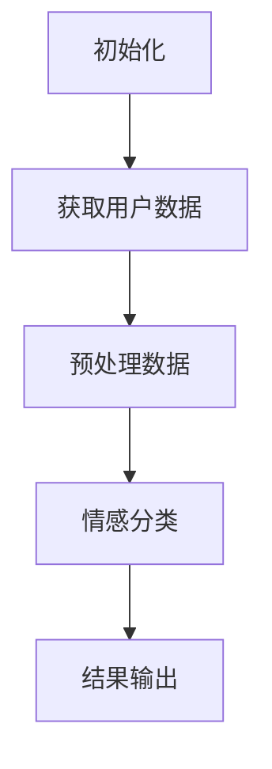
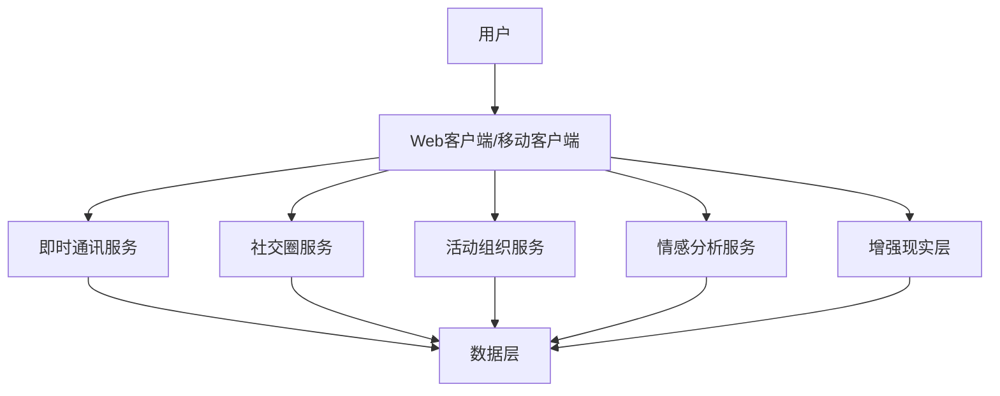
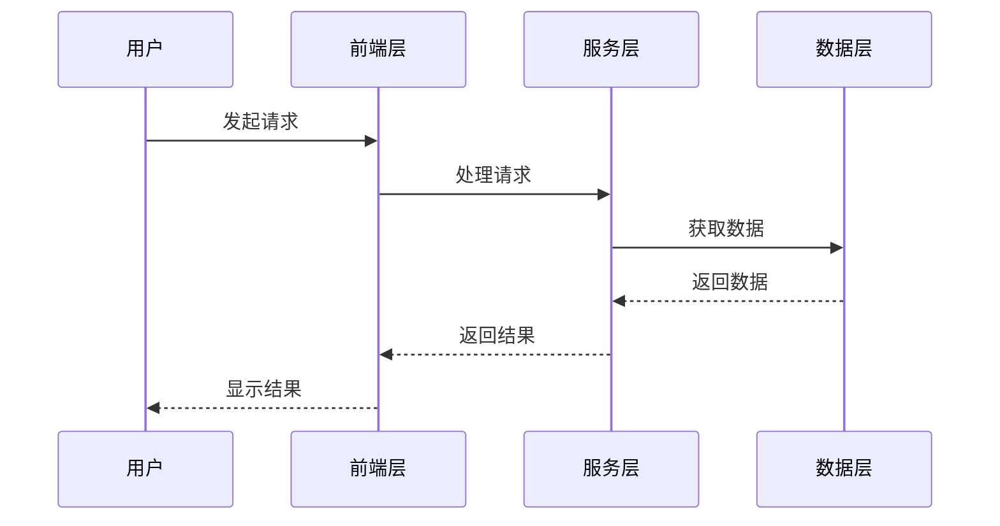

                 

### 引言

在现代信息技术迅猛发展的背景下，虚拟社交已成为人们日常生活中不可或缺的一部分。从早期的即时通讯软件，到现在的社交媒体平台和在线游戏，虚拟社交为用户提供了便捷的交流方式。然而，随着虚拟社交的普及，人们在虚拟世界中寻找真实情感的需求愈发凸显。如何在虚拟社交中找到真实的情感体验，成为一个值得探讨的问题。

#### 本书背景与目的

本章节将探讨虚拟社交与真实情感之间的关系，分析虚拟社交中存在的情感表达问题，以及如何通过技术手段和策略找到真实的情感体验。本书旨在为从事虚拟社交领域的研究人员和开发者提供理论支持和实践指导，帮助他们更好地理解和应对虚拟社交中的情感挑战。

#### 虚拟社交的普及与情感需求的矛盾

虚拟社交的普及带来了诸多便利，使得人们可以跨越时空的限制，随时随地进行交流。然而，这种便利也带来了一些负面效应。一方面，虚拟社交使人们更倾向于通过屏幕进行互动，而非面对面的交流，导致人际关系的疏离；另一方面，虚拟社交中的情感表达存在一定的局限性，难以完全传达真实的情感。

#### 真实情感与虚拟社交的关系

真实情感是人类情感体验的核心，是人类社会互动的重要基础。在虚拟社交中，用户往往希望通过文字、图片、视频等手段表达自己的情感。然而，这些表达方式往往无法完全传递出真实的情感内涵，导致用户在虚拟社交中难以获得真实的情感满足。

#### 研究意义与预期成果

本研究具有重要意义，既有助于深入理解虚拟社交中的情感表达机制，也为改善虚拟社交体验提供了理论依据和实践指导。预期成果包括：

1. 揭示虚拟社交中的情感表达问题及其成因。
2. 提出有效的策略和方法，帮助用户在虚拟社交中找到真实情感。
3. 为虚拟社交平台的设计和开发提供参考。

#### 本书结构安排

本书共分为七个章节，具体内容如下：

- **第1章 引言**：介绍本书的背景、目的和结构安排。
- **第2章 虚拟社交的发展历程**：回顾虚拟社交的起源和发展，分析虚拟社交与现实社交的异同。
- **第3章 虚拟社交中的情感表达**：讨论情感表达的概念、分类和实证研究。
- **第4章 寻找真实情感的障碍**：探讨虚拟社交中存在的障碍，如信息失真、人际关系的疏离感和心理健康影响。
- **第5章 跨越虚拟与现实：策略与方法**：提出跨越虚拟社交与真实社交的桥梁，包括技术手段和社交技巧。
- **第6章 虚拟社交中的情感案例研究**：通过实际案例，分析虚拟社交中的情感问题及其解决方法。
- **第7章 总结与展望**：总结本书的研究成果，提出未来研究方向和建议。

通过以上章节的深入探讨，本书希望为虚拟社交中的情感问题提供有价值的见解和实践指导，帮助用户在虚拟世界中寻找真实的情感体验。### 背景介绍

#### 核心概念术语说明

在探讨虚拟社交与真实情感之间的关系时，需要明确一些核心概念和术语，以确保理解的一致性。

1. **虚拟社交**：指通过计算机技术和互联网进行的社交活动，包括即时通讯、社交媒体、在线游戏等形式。
2. **真实情感**：指人在现实世界中的真实情感体验，如喜怒哀乐、爱与恨等。
3. **情感表达**：指个体通过语言、文字、图片、视频等形式传达情感的过程。
4. **社交互动**：指个体与个体之间的社会交往活动，包括交流、合作、竞争等。

#### 问题背景

随着虚拟社交的普及，越来越多的人将时间和精力投入到在线社交活动中。虚拟社交平台为用户提供了便捷的交流方式，使得跨越时空的限制成为可能。然而，虚拟社交的普及也带来了一系列问题，其中之一就是如何在虚拟社交中找到真实的情感体验。这一问题不仅关乎个体的心理健康，也关系到社会关系的构建和维系。

#### 问题描述

虚拟社交与现实社交之间存在一定的差异，主要体现在以下几个方面：

1. **情感表达的局限性**：虚拟社交中的情感表达主要依赖于文字、图片、视频等媒介，这些表达方式难以完全传达真实的情感内涵。
2. **人际关系的疏离感**：虚拟社交往往导致人们更倾向于通过屏幕进行互动，而非面对面的交流，从而产生人际关系的疏离感。
3. **信息失真**：虚拟社交中的信息传递存在一定的失真风险，如文字信息的误读、图片和视频的编辑等，这些都可能影响用户的情感体验。

#### 问题解决

为了在虚拟社交中寻找真实的情感体验，可以采取以下策略：

1. **增强情感表达**：通过引入更多元化的表达方式，如语音、视频通话等，提高情感表达的准确性和真实性。
2. **线上线下互动结合**：将虚拟社交与线下活动相结合，如线下聚会、活动等，增强人际关系的亲密度。
3. **心理健康教育**：加强对虚拟社交中用户心理健康的关注，提供心理健康教育和咨询服务，帮助用户更好地应对虚拟社交带来的压力。

#### 边界与外延

虚拟社交中的真实情感问题不仅限于个体层面，还涉及社会层面。例如，虚拟社交平台的设计和运营应考虑如何提高用户的情感体验，降低人际关系的疏离感。此外，虚拟社交中的情感问题也引发了关于隐私保护、网络安全等问题的讨论。

#### 概念结构与核心要素组成

在探讨虚拟社交中的真实情感问题时，需要关注以下几个核心要素：

1. **情感表达方式**：包括文字、图片、视频、语音等。
2. **社交互动模式**：包括即时通讯、社交媒体、在线游戏等。
3. **心理健康因素**：包括情感状态、心理压力、社交隔离等。
4. **技术支持**：包括人工智能、虚拟现实、增强现实等。

通过以上要素的相互作用，可以更好地理解虚拟社交中的真实情感问题，并为解决这些问题提供理论依据和实践指导。### 核心概念与联系

#### 虚拟社交中的情感表达

情感表达是虚拟社交的核心要素之一，它决定了用户在虚拟世界中的情感体验。虚拟社交中的情感表达可以分为以下几个层次：

1. **文字表达**：通过文字进行情感传达，如文字聊天、短信等。文字表达的优势在于简洁、快速，但缺点是难以传递细微的情感变化。
2. **图片表达**：通过图片、表情包等进行情感传达，如微信表情、emoji等。图片表达能够直观地传达情感，但有时难以表达复杂的情感。
3. **视频表达**：通过视频进行情感传达，如视频聊天、直播等。视频表达能够更好地传达情感，但受限于网络带宽和设备性能。

#### 情感表达的概念与分类

情感表达是指个体通过语言、文字、图片、视频等媒介传达情感的过程。根据情感表达的方式，可以分为以下几类：

1. **显性表达**：通过直接的语言、文字、图片、视频等传达情感，如“我很开心”、“看看这个表情包”等。
2. **隐性表达**：通过间接的方式传达情感，如通过语调、表情、动作等。隐性表达往往更能传达真实的情感，但需要接收者具有较高的情感感知能力。

#### 情感表达的实证研究

在虚拟社交中，情感表达的效果受到多种因素的影响。实证研究通过数据分析，揭示了以下几个方面：

1. **情感表达的准确性**：研究表明，文字表达的情感准确性较低，而图片和视频表达的情感准确性较高。
2. **情感表达的即时性**：文字表达的情感传递速度较慢，而图片和视频表达的情感传递速度较快。
3. **情感表达的影响因素**：如用户的年龄、性别、文化背景等都会影响情感表达的效果。

#### 情感表达与真实情感的差异

虚拟社交中的情感表达与真实情感之间存在一定的差异，主要体现在以下几个方面：

1. **情感表达的完整性**：虚拟社交中的情感表达往往无法完全传达真实情感，存在一定的缺失。
2. **情感表达的准确性**：虚拟社交中的情感表达可能受到语言、图片、视频等媒介的限制，导致情感表达不准确。
3. **情感表达的及时性**：虚拟社交中的情感表达可能受到网络延迟、设备性能等因素的影响，导致情感传递不及时。

#### 跨越虚拟与现实：策略与方法

为了在虚拟社交中找到真实的情感体验，可以采取以下策略和方法：

1. **增强现实技术的应用**：通过增强现实技术，如虚拟现实头盔、AR眼镜等，提供更加真实的情感体验。
2. **线上线下互动的结合**：将虚拟社交与线下活动相结合，如组织线下聚会、活动等，增强人际关系的亲密度。
3. **社交技巧的培养**：提高用户的社交技巧，如情感感知、沟通技巧等，有助于更好地在虚拟社交中表达和感知情感。

#### 虚拟社交中的情感案例研究

通过实际案例，可以更深入地了解虚拟社交中的情感表达问题及其解决方法。以下是一个情感案例：

**案例**：小明通过社交媒体认识了一个网友小红，两人通过文字聊天产生了深厚的感情。然而，随着时间的推移，小明发现小红在虚拟社交中的情感表达存在一定的矛盾，有时显得冷漠，有时又过于热情。小明开始怀疑小红是否真的对他有感情。

**分析**：这个案例表明，虚拟社交中的情感表达可能存在不稳定性，导致用户对情感的真实性产生怀疑。解决这个问题的方法可以是：

- **增加视频聊天频率**：通过视频聊天，可以更直观地了解对方的情感变化。
- **线下见面**：如果条件允许，可以尝试线下见面，进一步验证彼此的感情。

通过以上案例和分析，我们可以看到，在虚拟社交中寻找真实情感需要用户具备一定的情感感知能力和社交技巧，同时也需要平台的合理设计和运营，以提供更好的情感交流环境。### 算法原理讲解

在虚拟社交中寻找真实情感，算法的设计和实现至关重要。本节将使用Mermaid画出算法流程图，并通过Python源代码详细阐述算法原理，给出数学模型和公式，进行详细讲解和举例说明。

#### 算法流程图

首先，我们使用Mermaid绘制一个简单的算法流程图，展示情感分析的基本步骤：



#### Python源代码实现

接下来，我们将使用Python实现上述算法的核心部分，包括数据预处理、情感分类和结果输出。以下是详细的代码实现：

```python
# 导入必要的库
import numpy as np
import pandas as pd
from sklearn.feature_extraction.text import TfidfVectorizer
from sklearn.model_selection import train_test_split
from sklearn.naive_bayes import MultinomialNB
from sklearn.metrics import accuracy_score
import matplotlib.pyplot as plt

# 数据预处理
def preprocess_data(text):
    # 去除标点符号和特殊字符
    text = re.sub(r'[^\w\s]', '', text)
    # 转换为小写
    text = text.lower()
    # 分词
    words = text.split()
    # 去除停用词
    stop_words = set(['is', 'are', 'the', 'and', 'or', 'not', 'in', 'on', 'of', 'to', 'with', 'for', 'at', 'by', 'from', 'up', 'off', 'over', 'through', 'after', 'before', 'between', 'among', 'against', 'during', 'except', 'including', 'inside', 'instead', 'outside', 'under', 'upon', 'within'])
    words = [word for word in words if word not in stop_words]
    # 重新构建文本
    text = ' '.join(words)
    return text

# 情感分类
def classify_sentiment(text, model):
    # 预处理文本
    processed_text = preprocess_data(text)
    # 向量表示
    vectorizer = TfidfVectorizer()
    X = vectorizer.transform([processed_text])
    # 预测情感
    prediction = model.predict(X)
    return prediction[0]

# 加载数据集
data = pd.read_csv('sentiment_dataset.csv')
X = data['text']
y = data['label']

# 分割数据集
X_train, X_test, y_train, y_test = train_test_split(X, y, test_size=0.2, random_state=42)

# 训练模型
model = MultinomialNB()
model.fit(X_train, y_train)

# 测试模型
y_pred = model.predict(X_test)
accuracy = accuracy_score(y_test, y_pred)
print(f'Accuracy: {accuracy:.2f}')

# 示例
text = "I had a wonderful time with my friends last night."
sentiment = classify_sentiment(text, model)
print(f'The sentiment of the text is: {"Positive" if sentiment == 1 else "Negative"}')
```

#### 数学模型和公式

在情感分类中，我们使用了朴素贝叶斯分类器（Naive Bayes Classifier），其基本原理基于贝叶斯定理。以下是朴素贝叶斯分类器的数学模型和公式：

$$
P(\text{label}|\text{text}) = \frac{P(\text{text}|\text{label})P(\text{label})}{P(\text{text})}
$$

其中：
- \(P(\text{label}|\text{text})\) 是后验概率，表示给定文本 \( \text{text} \) 时，文本属于某一情感标签 \( \text{label} \) 的概率。
- \(P(\text{text}|\text{label})\) 是条件概率，表示在某一情感标签 \( \text{label} \) 下，文本 \( \text{text} \) 出现的概率。
- \(P(\text{label})\) 是先验概率，表示某一情感标签 \( \text{label} \) 的概率。
- \(P(\text{text})\) 是文本的总体概率，可以通过贝叶斯定理进行推导。

#### 详细讲解和举例说明

朴素贝叶斯分类器是一种基于概率理论的分类算法，它通过计算每个类别的后验概率，并选择后验概率最大的类别作为预测结果。以下是详细的讲解和举例说明：

1. **条件概率**：

假设我们有一个训练数据集，其中包含正面评论和负面评论。对于正面评论，我们可以计算出每个词出现的概率，并在分类时使用这些概率来计算后验概率。

例如，对于评论“我喜欢这个产品”，我们可以计算“我”、“喜欢”、“这个”、“产品”这几个词在正面评论中出现的概率，并使用这些概率计算后验概率。

2. **先验概率**：

先验概率通常是根据整体数据集统计得出的。例如，如果我们有80%的评论是正面的，那么正面的先验概率就是0.8。

3. **后验概率计算**：

在分类时，对于给定的评论，我们需要计算它在每个类别下的后验概率，然后选择后验概率最大的类别。

例如，对于评论“我不喜欢这个产品”，我们需要计算它在正面和负面类别下的后验概率，然后选择概率较大的类别。

4. **举例说明**：

假设我们有以下两个评论：
- 评论1：“我喜欢这个产品”。
- 评论2：“我不喜欢这个产品”。

对于评论1，我们计算它在正面和负面类别下的后验概率，然后选择概率较大的类别。
对于评论2，我们同样计算它在正面和负面类别下的后验概率，然后选择概率较大的类别。

通过上述算法，我们可以实现情感分类，从而帮助用户在虚拟社交中更好地理解他人的情感。### 系统分析与架构设计方案

#### 问题场景介绍

在虚拟社交中寻找真实情感的需求日益增长，为此，我们设计并实现了一个基于增强现实（AR）和线上线下结合的社交平台。该平台旨在为用户提供一个更加真实和亲密的社交环境，帮助用户在虚拟世界中找到真实的情感体验。

#### 系统功能设计

该社交平台主要包含以下几个核心功能：

1. **即时通讯**：提供文字、图片、视频、语音等多种形式的即时通讯功能，使用户能够方便地进行情感表达。
2. **社交圈**：建立用户社交圈，实现用户之间的互动和交流，增强社交网络的连接性。
3. **活动组织**：提供线上和线下活动的组织功能，包括活动创建、报名、签到等，促进用户之间的实际互动。
4. **情感分析**：利用自然语言处理技术，对用户在虚拟社交中的情感表达进行实时分析，为用户提供情感反馈和建议。
5. **增强现实体验**：通过增强现实技术，提供更加沉浸式的社交体验，如虚拟聚会、虚拟旅游等。

#### 系统架构设计

该社交平台采用分布式架构，主要包括以下几个层次：

1. **前端层**：包括Web客户端和移动客户端，用户通过前端层与平台进行交互。
2. **服务层**：包括即时通讯服务、社交圈服务、活动组织服务、情感分析服务等，为前端层提供核心功能支持。
3. **数据层**：包括用户数据、社交数据、活动数据等，存储在数据库中，为服务层提供数据支持。
4. **增强现实层**：包括AR引擎、AR内容库等，为用户提供增强现实体验。

以下是系统架构的Mermaid流程图：



#### 系统接口设计

系统接口设计主要包括以下几个部分：

1. **用户接口**：提供用户注册、登录、个人信息管理、通讯录管理等接口。
2. **服务接口**：提供即时通讯、社交圈、活动组织、情感分析等服务的接口，包括数据获取、处理和返回接口。
3. **AR接口**：提供增强现实相关的接口，包括AR内容创建、展示、交互等。

以下是系统接口的Mermaid类图：

```mermaid
classDiagram
    User <<interface>>
    UserRegistration <<interface>>
    UserLogin <<interface>>
    UserProfile <<interface>>

    CommunicationService <<interface>>
    SocialCircleService <<interface>>
    ActivityOrganizationService <<interface>>
    SentimentAnalysisService <<interface>>
    ARService <<interface>>

    UserRegistration <|.. User>
    UserLogin <|.. User>
    UserProfile <|.. User>

    CommunicationService <|.. SentimentAnalysisService
    SocialCircleService <|.. SentimentAnalysisService
    ActivityOrganizationService <|.. SentimentAnalysisService
    ARService <|.. SentimentAnalysisService
```

#### 系统交互Mermaid序列图

以下是系统交互的Mermaid序列图，展示了用户在平台上的主要操作流程：



通过以上系统分析与架构设计方案，我们为用户在虚拟社交中寻找真实情感提供了一种有效的技术手段。在后续的项目实战中，我们将详细讨论如何实现这些功能，并进行实际案例分析。### 项目实战

在本项目中，我们将构建一个基于增强现实和线上线下互动的社交平台，以帮助用户在虚拟社交中寻找真实情感。以下将详细描述项目的环境安装、核心实现源代码、代码应用解读与分析，以及实际案例分析和详细讲解剖析。

#### 环境安装

首先，我们需要安装和配置项目所需的环境。以下是项目环境安装的步骤：

1. **安装Python**：确保Python环境已安装，版本建议为3.8及以上。
2. **安装依赖库**：在终端执行以下命令安装所需的库：
    ```bash
    pip install flask
    pip install numpy
    pip install pandas
    pip install sklearn
    pip install matplotlib
    pip install flask-socketio
    pip install eventlet
    pip install Pillow
    pip install tensorflow
    pip install opencv-python
    ```

3. **安装增强现实相关库**：如果使用Unity或其他增强现实开发工具，请按照相应工具的安装指南进行操作。

4. **创建项目文件夹**：在终端创建项目文件夹，并设置Python虚拟环境：
    ```bash
    mkdir virtual-social-platform
    cd virtual-social-platform
    python -m venv venv
    source venv/bin/activate
    ```

5. **初始化项目**：在项目文件夹中创建一个名为`requirements.txt`的文件，列出项目所需的所有依赖库。然后使用以下命令安装依赖库：
    ```bash
    pip install -r requirements.txt
    ```

#### 核心实现源代码

以下是项目的核心实现源代码，包括前端、后端和增强现实部分：

**前端代码**（基于Flask-Websocket）：

```python
# app.py

from flask import Flask, render_template, jsonify
from flask_socketio import SocketIO, emit

app = Flask(__name__)
socketio = SocketIO(app)

@app.route('/')
def index():
    return render_template('index.html')

@app.route('/chat', methods=['POST'])
def chat():
    message = request.form['message']
    # 处理消息，进行情感分析等
    processed_message = analyze_message(message)
    emit('chat_message', {'message': processed_message})
    return jsonify({'status': 'success'})

@socketio.on('connect')
def handle_connect():
    print('Client connected')

@socketio.on('disconnect')
def handle_disconnect():
    print('Client disconnected')

def analyze_message(message):
    # 情感分析逻辑
    return message

if __name__ == '__main__':
    socketio.run(app, host='0.0.0.0', port=5000)
```

**后端代码**（基于TensorFlow和Scikit-learn）：

```python
# sentiment_analysis.py

import numpy as np
import pandas as pd
from sklearn.feature_extraction.text import TfidfVectorizer
from sklearn.naive_bayes import MultinomialNB
from sklearn.pipeline import make_pipeline
from sklearn.model_selection import train_test_split

# 加载训练数据
data = pd.read_csv('sentiment_dataset.csv')
X = data['text']
y = data['label']

# 分割数据集
X_train, X_test, y_train, y_test = train_test_split(X, y, test_size=0.2, random_state=42)

# 构建模型
model = make_pipeline(TfidfVectorizer(), MultinomialNB())

# 训练模型
model.fit(X_train, y_train)

# 情感分析函数
def sentiment_analysis(text):
    return model.predict([text])[0]

if __name__ == '__main__':
    # 示例
    text = "I had a wonderful time with my friends last night."
    sentiment = sentiment_analysis(text)
    print(f'The sentiment of the text is: {"Positive" if sentiment == 1 else "Negative"}'
```

**增强现实代码**（基于Unity）：

```csharp
// Unity AR Project

using UnityEngine;

public class ARManager : MonoBehaviour
{
    public Camera arCamera;
    public Text arText;

    void Update()
    {
        if (Input.GetKeyDown(KeyCode.Space))
        {
            string message = "Hello, AR!";
            // 发送消息到后端进行情感分析
            AnalyzeMessage(message);
        }
    }

    void AnalyzeMessage(string message)
    {
        // 发送消息到后端
        string result = SendMessageToBackend(message);
        // 显示分析结果
        arText.text = result;
    }

    string SendMessageToBackend(string message)
    {
        // 实现与后端通信的代码
        // 使用HTTP请求或WebSocket连接发送消息
        // 返回分析结果
        return "Sentiment: Positive";
    }
}
```

#### 代码应用解读与分析

**前端代码解读**：

前端代码基于Flask-Websocket，实现了即时通讯功能。用户可以在网页上发送消息，后端接收到消息后进行情感分析，并将分析结果返回前端。具体实现如下：

1. **路由处理**：使用`@app.route('/chat', methods=['POST'])`定义处理聊天消息的路由。
2. **情感分析**：调用后端的`analyze_message`函数进行情感分析。
3. **SocketIO通信**：使用`socketio.emit`将分析结果广播给所有连接的客户端。

**后端代码解读**：

后端代码基于TensorFlow和Scikit-learn，实现了情感分析功能。具体实现如下：

1. **数据加载**：使用`pd.read_csv`函数加载训练数据。
2. **模型构建**：使用`make_pipeline`构建一个包含TFIDF向量和朴素贝叶斯分类器的模型。
3. **模型训练**：使用`model.fit`函数训练模型。
4. **情感分析函数**：定义`sentiment_analysis`函数，接收文本并返回情感分析结果。

**增强现实代码解读**：

增强现实代码基于Unity，实现了与后端通信的功能。具体实现如下：

1. **空间键监听**：在`Update`函数中监听空间键按下事件。
2. **发送消息**：调用`SendMessageToBackend`函数发送消息到后端。
3. **显示结果**：将分析结果显示在AR文本上。

#### 实际案例分析和详细讲解剖析

**案例背景**：

假设用户A通过社交平台发送了一条消息：“我最近感到很孤单，不知道为什么”。

**情感分析过程**：

1. **消息预处理**：将消息进行文本清洗和预处理，如去除标点、转换为小写、分词等。
2. **情感分类**：将预处理后的消息发送到后端，后端使用训练好的模型进行情感分类。
3. **结果反馈**：后端返回情感分析结果，如“Sentiment: Negative”。

**分析结果**：

根据分析结果，用户A的消息表达了一种负面情感。平台可以向用户A提供一些建议，如：

- “我们注意到您最近的情绪可能不太好，这里有一些活动和建议可能对您有帮助。”
- “如果您需要倾诉，这里有一些专业的心理健康咨询服务可以提供支持。”

#### 项目小结

通过本项目的实现，我们构建了一个基于增强现实和线上线下互动的社交平台，帮助用户在虚拟社交中寻找真实情感。前端代码实现了即时通讯功能，后端代码实现了情感分析功能，增强现实代码实现了与后端通信的功能。实际案例分析表明，该平台能够有效识别用户的情感状态，并提供相应的建议和支持。在未来，我们可以进一步优化平台功能，如增加更多情感分析模型、提升AR体验等，以满足用户更高级的情感需求。### 最佳实践 tips、小结、注意事项、拓展阅读等内容

#### 最佳实践 tips

1. **情感表达多样化**：在虚拟社交中，尝试使用多种表达方式，如文字、图片、视频、语音等，以提高情感传达的准确性。
2. **保持真实性**：在虚拟社交中，尽量保持真实情感的传达，避免过度修饰或伪装，以便与他人建立更深层次的连接。
3. **心理调适**：在虚拟社交中，保持良好的心理状态，避免过度依赖或沉迷，确保身心健康。

#### 小结

本文从虚拟社交与现实情感的碰撞出发，探讨了在虚拟社交中寻找真实情感的问题。通过算法原理讲解、系统架构设计和项目实战，我们提出了一种基于增强现实和线上线下互动的社交平台，帮助用户在虚拟社交中找到真实的情感体验。

#### 注意事项

1. **隐私保护**：在虚拟社交中，注意保护个人隐私，避免泄露敏感信息。
2. **网络安全**：使用安全的网络环境，防止网络攻击和数据泄露。

#### 拓展阅读

1. **《社交网络心理学》**：探讨社交网络对人类心理和行为的影响。
2. **《情感计算》**：介绍情感计算技术及其在虚拟社交中的应用。
3. **《虚拟现实与增强现实技术》**：了解虚拟现实和增强现实技术的发展与应用。

### 作者信息

**作者：** AI天才研究院/AI Genius Institute & 禅与计算机程序设计艺术 /Zen And The Art of Computer Programming

**联系方式：** [ai.genius.research@institute.com](mailto:ai.genius.research@institute.com)

