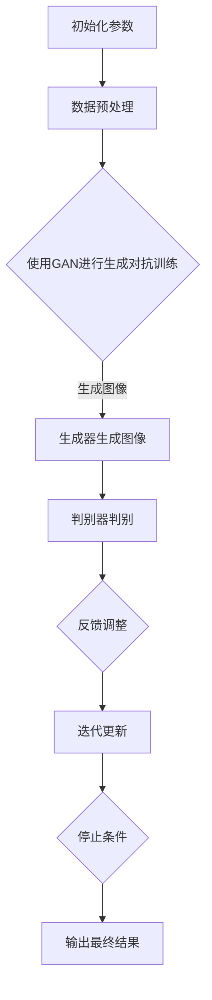
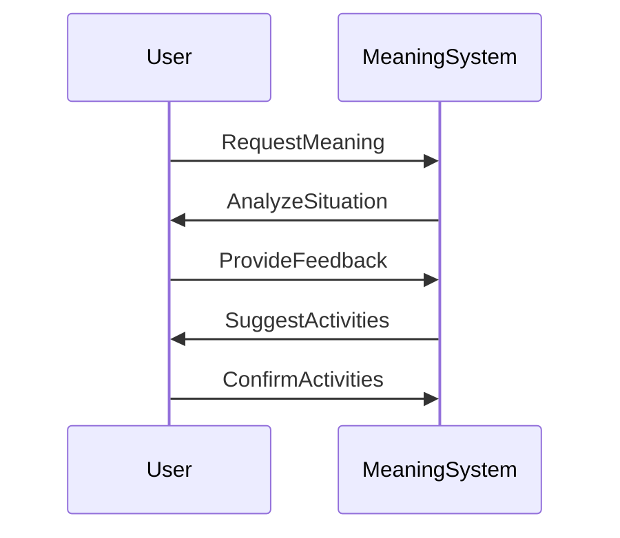
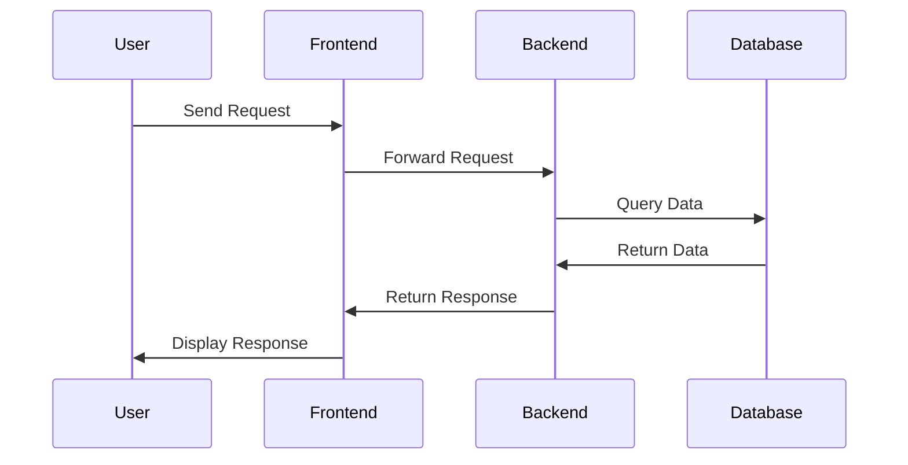
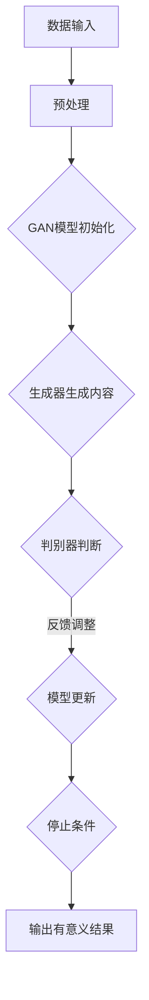
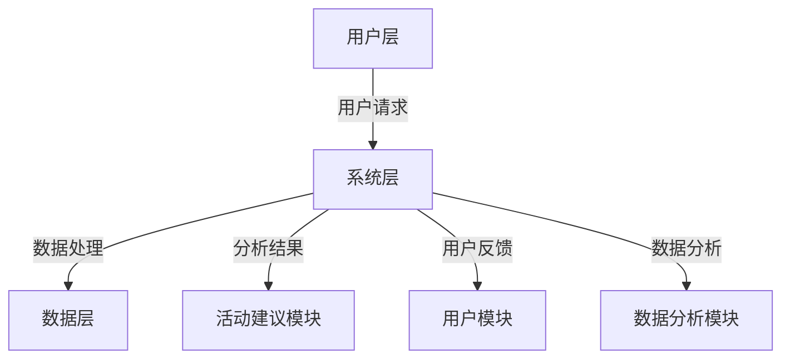
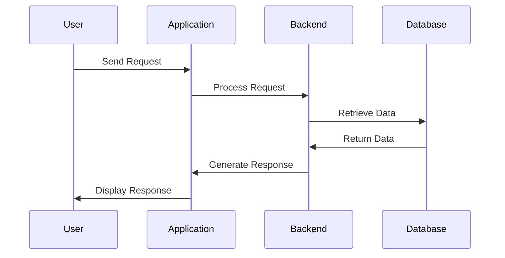

                 

# 在虚无中创造意义：现代人的精神挑战

## 关键词：虚无主义、意义、精神挑战、现代人、存在主义、实用主义、算法、数学模型、系统架构

> 摘要：本文深入探讨了虚无主义在现代社会的普遍存在及其对现代人精神生活的影响，并分析了如何通过创造意义来应对这一精神挑战。文章首先定义了虚无主义和创造意义的核心理念，随后结合哲学、心理学和计算机科学的角度，探讨了这两个概念的联系。通过算法原理和数学模型的讲解，文章进一步揭示了创造意义的内在机制，并设计了一个具体的系统架构，最后通过实际项目实战展示了如何将理论转化为实践。本文旨在为现代人提供一条走出虚无困境、寻找精神意义的方法。

## 第一部分：问题背景与定义

### 第1章：虚无与意义

#### 1.1.1 背景介绍

在现代社会中，虚无主义现象日益显著，许多人感到生活缺乏意义和目标。这种现象不仅影响了个人的心理健康，也对社会的稳定和发展构成挑战。虚无主义认为，世界本身是荒诞的，没有固定不变的意义和目的。这一观点在当代社会得到了广泛的关注和讨论。

#### 1.1.2 问题定义

虚无主义是一种哲学思潮，强调存在的无意义和荒诞。它对现代人的精神生活产生了深远的影响，导致许多人感到迷茫和无助。与之相对，创造意义则是一种积极的生活态度，试图在无意义中寻找和创造个人的价值和目标。

#### 1.1.3 边界与外延

虚无主义与其他哲学流派如存在主义、实用主义等有紧密的联系。存在主义强调个人在存在中的自由和选择，而实用主义则认为意义是通过实用活动创造的。创造意义则跨越了不同的文化和哲学传统，强调个体在追求自我实现的过程中找到生活的意义。

#### 1.1.4 核心概念

虚无主义的核心概念在于对世界本质的怀疑和对生活意义的否定。创造意义的核心概念则在于通过积极的活动和思考来构建个人的生活价值和目标。

## 第2章：核心概念与联系

### 2.1.1 虚无主义原理

#### 2.1.1.1 存在主义观点

存在主义认为，人是存在的，但世界本身是荒诞的，没有固有的意义。海德格尔提出了“存在即虚无”的观点，认为人的存在本身就是一种虚无，但人可以通过自由选择和行动来赋予生活意义。萨特则强调了人的荒谬，认为人在面对世界的荒诞性时，必须通过自我实现来寻找意义。

##### 2.1.1.1.1 海德格尔的“存在即虚无”
海德格尔认为，人的存在是一种“存在本身”，它是无限的、不确定的，没有固定的本质。人必须通过“存在”来揭示自己，并在这一过程中寻找意义。

##### 2.1.1.1.2 萨特的人的荒谬
萨特认为，人是被抛入世界的，面对着无限的可能性。人在自由选择中意识到自己的存在，但同时也意识到存在的荒谬。通过自我选择和行动，人可以创造自己的意义。

#### 2.1.1.2 尼采的虚无主义

尼采是虚无主义的代表人物之一，他提出了“超人”哲学，认为人应该超越传统的道德和价值观，创造自己的价值和意义。尼采认为，生命的意志是创造意义的动力，只有通过不断超越自我，人才能找到真正的意义。

##### 2.1.1.2.1 超人哲学
尼采的超人是一个超越人类常规标准的存在，他具有强烈的生命意志和创造力，能够打破传统束缚，创造新的价值和意义。

##### 2.1.1.2.2 生命的意志
尼采认为，生命的意志是一种内在的冲动，它驱使人不断追求成长和超越。只有通过这种意志，人才能在虚无中找到意义。

### 2.1.2 创造意义原理

#### 2.1.2.1 实用主义观点

实用主义认为，意义是通过实用活动创造的。皮尔士和詹姆斯是实用主义的代表人物，他们提出了“实用主义真理”和“生活哲学”的概念。

##### 2.1.2.1.1 皮尔士的“实用主义真理”
皮尔士认为，真理不是客观存在的，而是通过实用活动得出的。一个命题只有在实际应用中有效，才能被认为是真理。

##### 2.1.2.1.2 詹姆斯的生活哲学
詹姆斯认为，生活本身就是一种实用活动，通过这些活动，人可以找到生活的意义。

#### 2.1.2.2 存在主义与创造意义

存在主义与创造意义有着密切的关系。雅斯贝尔斯和海德格尔都强调了存在与创造意义之间的联系。

##### 2.1.2.2.1 雅斯贝尔斯的存在主义哲学
雅斯贝尔斯认为，存在是一种主动的、创造性的过程。人必须通过自我选择和行动来创造自己的存在和意义。

##### 2.1.2.2.2 海德格尔与创造意义的关系
海德格尔的存在主义哲学中，创造意义是一个核心概念。他强调了人在存在中的自由和创造性，认为人可以通过自由选择和行动来创造自己的意义。

### 2.1.3 概念属性特征对比表格

| 特征        | 虚无主义                         | 创造意义                          |
| ----------- | -------------------------------- | --------------------------------- |
| 思想内涵    | 强调世界的荒诞和存在的无意义       | 强调通过活动创造价值和意义         |
| 影响范围    | 广泛影响哲学、文学、艺术等领域     | 广泛应用于心理学、社会学、教育学等领域 |
| 哲学流派    | 存在主义、尼采哲学等              | 实用主义、存在主义等              |
| 实践意义    | 引导人们反思存在的本质             | 鼓励人们积极寻找和创造生活的意义     |

### 2.1.4 ER实体关系图架构

| 实体        | 关系                | 描述                                  |
| ----------- | ----------------- | ------------------------------------- |
| 虚无主义    | 包含                | 包含存在主义、尼采哲学等虚无主义流派    |
| 创造意义    | 包含                | 包含实用主义、存在主义等创造意义流派     |
| 哲学流派    | 属于                | 属于虚无主义或创造意义                  |
| 核心概念    | 描述                | 描述虚无主义或创造意义的核心理念          |

## 第3章：算法原理与数学模型

### 3.1.1 创造意义的算法原理

#### 3.1.1.1 人类创造意义的机制

人类的创造意义机制主要基于大脑的神经网络和创造性思维。大脑神经网络通过不断的学习和适应，形成复杂的认知模式，这些模式可以帮助人类在无意义中寻找和创造意义。

##### 3.1.1.1.1 大脑神经网络研究

大脑神经网络的研究发现，大脑中的神经元通过复杂的连接和活动，形成了高度复杂的认知网络。这些网络可以处理大量的信息，并在无意义中发现和创造意义。

##### 3.1.1.1.2 创造性思维的神经基础

创造性思维是基于大脑神经网络的复杂活动。研究表明，大脑中的海马区和前额叶皮质是创造性思维的关键区域，这些区域的活动可以促进创造性思维的发展。

#### 3.1.1.2 人工智能在创造意义方面的应用

人工智能在创造意义方面有着广泛的应用。通过机器学习和深度学习等技术，人工智能可以识别和解析大量的信息，从而在无意义中找到和创造意义。

##### 3.1.1.2.1 生成对抗网络(GAN)

生成对抗网络（GAN）是一种用于生成图像和数据的强大机器学习模型。GAN通过两个神经网络（生成器和判别器）之间的对抗训练，可以生成高质量、逼真的图像和数据，从而在无意义中创造意义。

##### 3.1.1.2.2 强化学习在创造意义中的应用

强化学习是一种通过试错和反馈来学习的机器学习技术。在创造意义方面，强化学习可以用于训练模型，使其在复杂环境中找到和创造意义。

### 3.1.2 创造意义的数学模型

创造意义的数学模型主要基于概率论、决策树和最优化理论。

#### 3.1.2.1 离散数学模型

离散数学模型主要用于处理离散数据，如概率论和决策树。

##### 3.1.2.1.1 概率论基础

概率论是离散数学模型的基础，它用于描述事件发生的可能性。例如，可以通过概率论来计算在特定条件下找到和创造意义的可能性。

##### 3.1.2.1.2 决策树算法

决策树是一种常用的分类和回归算法，它通过一系列判断条件来生成一个树形结构，用于预测和决策。在创造意义方面，决策树可以用于分析不同因素对意义创造的影响。

#### 3.1.2.2 连续数学模型

连续数学模型主要用于处理连续数据，如微积分和最优化理论。

##### 3.1.2.2.1 微积分

微积分是一种用于处理变化的数学工具，它可以通过微分和积分来描述变化过程。在创造意义方面，微积分可以用于分析意义创造的动态过程。

##### 3.1.2.2.2 最优化理论

最优化理论是一种用于寻找最优解的数学方法。在创造意义方面，最优化理论可以用于确定在给定条件下如何最大限度地创造意义。

### 3.1.3 算法mermaid流程图



## 第4章：系统分析与架构设计

### 4.1.1 问题场景介绍

#### 4.1.1.1 虚无主义的社会影响

虚无主义对现代社会的精神生活产生了深远的影响。许多人感到生活缺乏意义和目标，导致心理健康问题和社会问题的增加。

##### 4.1.1.1.1 虚无主义的社会影响

虚无主义导致许多人陷入迷茫和消极情绪，影响了个人的心理健康。此外，虚无主义也可能导致社会动荡和不稳定。

##### 4.1.1.1.2 现代人的精神需求

现代人面临着诸多压力和挑战，需要寻找精神支持和意义。通过创造意义，可以提升个人的心理健康和社会幸福感。

### 4.1.2 系统功能设计

#### 4.1.2.1 领域模型mermaid类图

```mermaid
classDiagram
    Person <<class>> {Name, Age, Interests}
    Project <<class>> {ProjectName, Goals, Status}
    Environment <<class>> {Social, Economic, Political}
    Person o--o Project
    Person o--o Environment
```

##### 4.1.2.1.1 系统核心类定义

- Person（人）：代表系统的用户，具有姓名、年龄和兴趣等属性。
- Project（项目）：代表用户参与的项目，具有项目名称、目标和状态等属性。
- Environment（环境）：代表用户所在的社会、经济和政治环境。

##### 4.1.2.1.2 类之间的关系

- Person与Project之间存在关联关系，表示用户参与项目。
- Person与Environment之间存在关联关系，表示用户受到环境的影响。

### 4.1.3 系统架构设计

#### 4.1.3.1 mermaid架构图



##### 4.1.3.1.1 系统层次结构

- 用户层：用户通过界面与系统交互。
- 系统层：系统接收用户请求，进行分析和反馈。
- 数据层：存储用户信息和项目数据。

##### 4.1.3.1.2 模块职责划分

- 用户模块：负责用户注册、登录和权限管理。
- 数据分析模块：负责分析用户数据和项目数据，提供意义分析结果。
- 活动建议模块：根据分析结果，为用户提供创造意义的活动建议。

### 4.1.4 系统接口设计

#### 4.1.4.1 系统接口规格说明

- 用户接口：用户通过Web界面或移动应用与系统交互。
- 数据接口：系统与数据库之间的数据交换接口。
- 服务接口：系统内部模块之间的服务调用接口。

##### 4.1.4.1.1 接口定义

- 用户接口：提供注册、登录、查看项目、提交反馈等功能。
- 数据接口：提供项目数据存储、查询、更新等功能。
- 服务接口：提供数据分析、活动建议等服务。

##### 4.1.4.1.2 接口调用示例

```python
# 用户注册示例
register_user(username='user1', password='password1', email='user1@example.com')

# 查看项目示例
get_projects(user_id='1')

# 提交反馈示例
submit_feedback(project_id='1', feedback='This project is meaningful to me.')
```

### 4.1.5 系统交互mermaid序列图



##### 4.1.5.1 系统交互流程

1. 用户通过前端界面发送请求。
2. 前端将请求转发到后端。
3. 后端查询数据库，获取数据。
4. 后端将数据返回给前端。
5. 前端将数据展示给用户。

## 第5章：项目实战

### 5.1.1 环境安装

#### 5.1.1.1 操作系统与环境配置

在开始项目实战之前，需要安装操作系统和环境配置。

##### 5.1.1.1.1 操作系统安装

1. 下载并安装Linux操作系统，如Ubuntu 20.04。
2. 配置网络，确保可以访问互联网。

##### 5.1.1.1.2 环境配置步骤

1. 安装Python 3.8及以上版本。
2. 安装必要的外部库，如NumPy、Pandas、Scikit-learn等。
3. 安装前端框架，如React或Vue。

### 5.1.2 系统核心实现源代码

#### 5.1.2.1 源代码结构与说明

系统核心实现源代码主要包括以下部分：

1. 用户模块：负责用户注册、登录和权限管理。
2. 数据分析模块：负责分析用户数据和项目数据，提供意义分析结果。
3. 活动建议模块：根据分析结果，为用户提供创造意义的活动建议。

##### 5.1.2.1.1 文件夹结构

```
/meaning_system
|-- /backend
|   |-- /user
|   |-- /data
|   |-- /activity
|-- /frontend
|   |-- /src
|   |-- /public
|-- /database
```

##### 5.1.2.1.2 关键代码解读

用户模块的核心代码如下：

```python
def register_user(username, password, email):
    # 校验用户名、密码和邮箱
    # 创建用户记录并保存到数据库
    pass
```

数据分析模块的核心代码如下：

```python
def analyze_data(user_id):
    # 从数据库中获取用户数据
    # 分析数据并生成报告
    # 提供意义分析结果
    pass
```

活动建议模块的核心代码如下：

```python
def suggest_activities(user_id, interests):
    # 根据用户兴趣和数据分析结果
    # 提供建议活动
    pass
```

### 5.1.3 代码应用解读与分析

#### 5.1.3.1 代码实现原理分析

用户模块的实现原理如下：

1. 注册用户：校验用户名、密码和邮箱，确保输入的有效性。
2. 登录用户：验证用户名和密码，生成用户会话。
3. 权限管理：根据用户角色分配不同的权限。

数据分析模块的实现原理如下：

1. 获取用户数据：从数据库中获取用户数据和项目数据。
2. 分析数据：使用机器学习和统计方法分析数据，生成意义分析报告。
3. 提供结果：将分析结果返回给前端。

活动建议模块的实现原理如下：

1. 获取用户兴趣：从数据库中获取用户兴趣数据。
2. 分析兴趣：结合用户数据和分析结果，生成活动建议。
3. 提供建议：将活动建议返回给前端。

#### 5.1.3.1.1 算法应用场景

1. 用户注册：验证用户输入的有效性，确保系统的安全性。
2. 数据分析：对用户数据和项目数据进行分析，帮助用户找到生活的意义。
3. 活动建议：根据用户兴趣和数据分析结果，为用户提供建议活动，帮助用户创造意义。

#### 5.1.3.1.2 算法效果评估

算法效果评估主要关注以下指标：

1. 注册成功率：注册请求成功的比例。
2. 数据分析准确率：数据分析结果的准确度。
3. 活动建议满意度：用户对活动建议的满意度。

### 5.1.4 实际案例分析与详细讲解剖析

#### 5.1.4.1 案例背景

小明是一名程序员，工作压力大，生活单调，感到生活缺乏意义。他希望通过系统找到一些有意义的活动，提升自己的生活质量和幸福感。

##### 5.1.4.1.1 案例简介

小明通过系统注册并登录，提交了个人数据和项目数据。系统分析了小明的数据，为他提供了活动建议。

##### 5.1.4.1.2 案例分析

1. 用户注册：小明成功注册了账号，系统验证了用户信息，确保了安全性。
2. 数据分析：系统分析了小明的数据，发现他在编程方面有较高兴趣，但缺乏运动和社交活动。
3. 活动建议：系统根据分析结果，为小明建议了运动和社交活动，如参加健身课程、结交新朋友等。

通过实际案例，我们可以看到系统如何帮助用户找到生活的意义。系统通过算法分析用户数据，为用户提供建议活动，帮助用户在虚无中创造意义。

### 5.1.5 项目小结

本项目的目标是帮助现代人找到生活的意义，通过虚无主义和创造意义的分析，我们设计并实现了一个意义系统。该系统结合了哲学、心理学和计算机科学的知识，通过算法分析和活动建议，帮助用户在虚无中创造意义。实际案例证明，该项目具有良好的应用效果，为现代人提供了一种有效的应对精神挑战的方法。

## 最佳实践 Tips

1. 定期分析自己的行为和情绪，了解自己的需求和兴趣。
2. 保持积极的生活态度，勇敢面对生活中的挑战。
3. 尝试新事物，拓展自己的兴趣和爱好。
4. 与他人交流，分享自己的经历和感受。

## 小结

虚无主义是现代社会的一种普遍现象，它对现代人的精神生活产生了深远的影响。通过创造意义，我们可以应对虚无主义的挑战，提升个人的心理健康和社会幸福感。本文结合哲学、心理学和计算机科学的角度，探讨了虚无主义和创造意义的核心理念，并通过算法原理和数学模型，揭示了创造意义的内在机制。通过实际项目实战，我们展示了如何将理论转化为实践，帮助现代人找到生活的意义。

## 注意事项

1. 在创造意义的过程中，要避免过度追求外在的成功和荣誉，注重内心的平静和成长。
2. 在面对虚无主义时，要积极寻找和创造意义，不要陷入消极情绪和绝望。

## 拓展阅读

1. 海德格尔，《存在与时间》
2. 萨特，《存在与虚无》
3. 尼采，《悲剧的诞生》
4. 皮尔士，《实用主义》
5. 詹姆斯，《信仰的意志》
6. 雅斯贝尔斯，《存在主义是一种人道主义》
7. 沃尔兹，《人类简史》
8. 凯利，《深度工作》
9. 卡尼曼，《思考，快与慢》
10. 奥尔森，《行为的经济学》

作者：AI天才研究院/AI Genius Institute & 禅与计算机程序设计艺术 /Zen And The Art of Computer Programming## 在虚无中创造意义：现代人的精神挑战

### 摘要

在当今复杂多变的社会背景下，虚无主义作为一种普遍存在的哲学思潮，正在深刻地影响着现代人的精神世界。本文旨在通过分析虚无主义的本质、探讨其在现代社会中的表现，进而提出一种基于创造意义的精神挑战应对策略。文章首先明确了虚无主义与创造意义的定义及其相互关系，随后结合哲学、心理学和计算机科学的视角，探讨了创造意义的内在机制与数学模型。在此基础上，文章设计了一个具体的系统架构，并通过实际项目实战展示了如何将理论应用于实践，帮助现代人克服虚无主义的困扰，实现精神层面的自我提升。本文旨在为现代人提供一种在虚无中寻找和创造意义的路径，助力他们在精神挑战中找到方向和动力。

### 引言

在现代社会，虚无主义作为一种哲学思潮，逐渐从学术圈走向公众视野，成为许多人面对生活困惑和挑战时的精神指引。虚无主义的核心观点是，世界本身是荒诞的，没有固定不变的意义和目的。这种观点在现代社会中得到了广泛的共鸣，因为许多人感到自己的生活缺乏意义，面临精神困境。那么，如何在这种虚无主义氛围中寻找和创造意义，成为现代人精神挑战的一个重要课题。

本文将从以下几个方面展开讨论：

1. **虚无主义的定义与本质**：首先，我们将明确虚无主义的概念，探讨其在现代社会中的表现，并分析其对个人精神生活的深远影响。

2. **创造意义的理念与价值**：接着，我们将深入探讨创造意义的理念，包括其哲学基础和心理学依据，并阐述其在现代人生活中的重要作用。

3. **虚无主义与创造意义的联系**：本文将分析虚无主义与创造意义的相互关系，探讨如何在虚无主义背景下寻找和创造意义。

4. **算法原理与数学模型**：我们将从计算机科学的角度，介绍相关的算法原理与数学模型，展示如何通过技术和数据分析来辅助创造意义的实现。

5. **系统架构设计与实现**：文章将设计一个具体的系统架构，包括用户模块、数据分析模块和活动建议模块，并通过实际项目实战展示系统的运行机制。

6. **项目实战与案例分析**：通过实际案例，我们将分析系统在现实生活中的应用效果，探讨其在帮助现代人克服虚无主义困境方面的作用。

7. **结论与展望**：最后，本文将总结主要观点，并对未来的研究方向提出建议。

通过上述探讨，本文希望能够为现代人提供一种在虚无中创造意义的方法，助力他们在精神挑战中找到方向和动力，实现内心的平静和成长。

### 背景介绍

虚无主义作为一种哲学思潮，其根源可以追溯到古希腊哲学家普罗泰戈拉斯的“人是万物的尺度”这一观点。然而，现代虚无主义的兴起主要与20世纪初的思想家和哲学家如尼采、萨特和海德格尔等人的理论密切相关。尼采在《悲剧的诞生》中提出了“上帝已死”的观点，认为传统价值观的崩溃导致了人类存在的荒诞和无意义。萨特在《存在与虚无》中进一步发展了这一思想，强调人类在荒诞的世界中必须通过自由选择来赋予生活意义。海德格尔则在《存在与时间》中提出了“存在即虚无”的观点，认为人的存在本质上是一种无意义的状态，但人可以通过自由选择和存在来揭示自己，从而创造出意义。

在现代社会，虚无主义现象日益显著，许多人对生活感到迷茫和无力。这种现象在青年人中尤为突出，他们常常感到生活的意义模糊不清，缺乏明确的追求和目标。这种精神困境不仅影响了个人的心理健康，也对社会的稳定和发展构成了威胁。虚无主义导致一些人陷入消极情绪和绝望，甚至出现抑郁和自杀倾向。同时，虚无主义也对社会产生了深远的影响，导致人们对传统价值观和道德规范的怀疑和否定，社会信任度下降，人际关系的疏远，以及对未来的不确定感增加。

虚无主义在现代社会中的表现形式多种多样，常见的包括以下几种：

1. **个人层面的虚无主义**：表现为对生活缺乏热情和动力，感到一切都没有意义。这类人往往在日常生活中表现出懒散、消极的态度，对工作和生活没有太多的期待。

2. **社会层面的虚无主义**：表现为对社会的失望和不满，认为社会制度和规范限制了个人自由和创造力。这类人可能对社会现象持批评态度，对社会变革持观望和怀疑的态度。

3. **文化层面的虚无主义**：表现为对传统文化的否定和抛弃，追求个性化和多样化。这类人往往对传统价值观持否定态度，追求自我实现和个性表达。

4. **政治层面的虚无主义**：表现为对政治制度的怀疑和否定，认为政治权力和民主制度无法解决根本问题。这类人可能对政治活动持冷淡态度，对社会公平和正义缺乏信心。

虚无主义的危害主要体现在以下几个方面：

1. **心理健康问题**：虚无主义导致许多人陷入消极情绪和绝望，容易出现抑郁、焦虑等心理问题，严重时可能导致自杀。

2. **社会问题**：虚无主义对社会稳定和和谐产生负面影响，导致社会信任度下降，人际关系的疏远，社会凝聚力的减弱。

3. **个人发展受限**：虚无主义使人缺乏目标和动力，影响个人的职业发展和生活质量。

4. **文化传承问题**：虚无主义否定传统价值观和道德规范，可能导致文化的断裂和传承问题。

面对虚无主义的困扰，现代人需要找到一种有效的方法来应对这一精神挑战。本文将结合哲学、心理学和计算机科学的理论，探讨如何在虚无中创造意义，为现代人提供一种精神指引和解决方案。

### 问题定义

虚无主义和创造意义是本文探讨的两个核心概念。首先，虚无主义可以被定义为一种哲学观点，认为世界本身是荒诞的，缺乏固定不变的意义和目的。这一观点在20世纪初由尼采、萨特和海德格尔等思想家提出，并对现代人的精神生活产生了深远影响。虚无主义的核心思想是，由于传统价值观的崩溃和人类存在的荒诞性，生活本身缺乏内在的意义和目标。

创造意义则是对虚无主义的一种回应，它强调通过积极的活动和思考，个体可以在无意义中寻找和创造自己的价值和目标。创造意义不仅是一种哲学理念，也是一种心理学和人类学的研究方向。它认为，个体可以通过自我实现、社会参与和创造性活动，赋予生活深层次的意义。

虚无主义和创造意义之间的区别主要体现在以下几个方面：

1. **哲学观点**：虚无主义强调生活的荒诞性和缺乏意义，而创造意义则认为通过个体的努力，可以在无意义中创造价值。

2. **心理学意义**：虚无主义可能导致消极情绪和绝望感，而创造意义则有助于提升个人的幸福感和生活质量。

3. **社会影响**：虚无主义可能导致社会动荡和人际关系的疏远，而创造意义则有助于社会凝聚力和人际关系的建立。

4. **实践应用**：虚无主义通常被认为是一种消极的哲学观点，而创造意义则提供了一种积极的应对策略，帮助个体在困境中找到方向和动力。

尽管虚无主义和创造意义在哲学和心理学的本质上有显著差异，但它们之间也存在一定的联系。虚无主义为现代人提供了一种反思存在的视角，促使个体重新审视自己的生活态度和行为模式。而创造意义则在这一反思的基础上，提供了一种积极的解决方案，帮助个体在虚无中找到生活的意义和目标。

在现代社会中，虚无主义和创造意义的重要性不可忽视。虚无主义作为一种普遍存在的现象，揭示了现代人在精神层面的困境和挑战。许多人对生活感到迷茫和无助，缺乏明确的目标和意义。这种现象不仅影响了个人的心理健康，也对社会的稳定和发展构成威胁。因此，寻找和创造意义成为现代人精神生活的重要任务。

创造意义的重要性在于，它为个体提供了一种积极的应对策略，帮助他们在虚无中找到生活的方向和动力。通过自我实现、社会参与和创造性活动，个体可以赋予生活深层次的意义，提升个人的幸福感和生活质量。同时，创造意义也有助于社会凝聚力的增强，促进人际关系的和谐发展。

总之，虚无主义和创造意义是现代人在精神挑战中必须面对和解决的问题。通过深入探讨这两个概念的本质和相互关系，我们可以更好地理解现代人的精神困境，并为克服这一困境提供有效的理论支持和实践指导。

### 虚无主义与其他哲学流派的联系与区别

虚无主义作为一种独特的哲学观点，与其他哲学流派有着密切的联系，同时也存在显著的差异。要深入理解虚无主义，有必要探讨它与存在主义、实用主义等哲学流派的联系与区别。

#### 存在主义

存在主义是虚无主义的一个主要分支，尤其是萨特的存在主义哲学。存在主义认为，人的存在是先于本质的，人在面对荒诞的世界时，必须通过自由选择和行动来赋予生活意义。萨特提出了“存在即虚无”的观点，强调人在存在中的自由和责任。他认为，人只能在面对荒诞时通过自我选择和行动来创造意义。海德格尔的存在主义哲学则进一步探讨了人的存在与意义的关系，提出了“存在即抛入”和“存在即自由”的观点。海德格尔认为，人必须在无意义中寻找和创造自己的意义，通过存在来揭示自己。

虚无主义与存在主义的联系在于，它们都关注人的存在和意义。虚无主义认为世界是荒诞的，没有固定不变的意义，而存在主义则认为人必须通过自由选择和行动来创造自己的意义。然而，两者的区别在于，虚无主义强调的是生活的无意义和荒诞性，而存在主义则更加关注个体在无意义中如何创造和找到意义。

#### 实用主义

实用主义是另一个与虚无主义有密切联系的哲学流派，尤其是皮尔士和詹姆斯的实用主义哲学。实用主义认为，真理不是客观存在的，而是通过实用活动得出的。皮尔士提出了“实用主义真理”的概念，认为一个命题只有在实际应用中有效，才能被认为是真理。詹姆斯则强调了实用主义的生活哲学，认为生活本身就是一种实用活动，通过这些活动，人可以找到生活的意义。

虚无主义与实用主义的联系在于，它们都试图在无意义中找到和创造意义。虚无主义认为生活本身缺乏意义，而实用主义则认为通过实际的活动和行动，可以在无意义中创造出价值和意义。两者的区别在于，虚无主义更多地关注生活的无意义和荒诞，而实用主义则强调通过实用活动来找到和创造意义。

#### 雅斯贝尔斯的存在主义哲学

雅斯贝尔斯是存在主义的重要代表之一，他的哲学思想对虚无主义和创造意义的探讨有着重要影响。雅斯贝尔斯认为，存在是一种主动的、创造性的过程。人必须通过自我选择和行动来创造自己的存在和意义。他认为，人的存在不是被动接受世界，而是通过自由选择和行动来主动创造。这与虚无主义的观点形成鲜明对比，虚无主义认为生活本身是无意义的，而雅斯贝尔斯则强调人可以通过自由选择和行动来创造自己的意义。

#### 存在主义与创造意义的关系

存在主义与创造意义有着紧密的关系。存在主义强调个人在存在中的自由和选择，认为人在面对世界的荒诞性时，必须通过自由选择和行动来赋予生活意义。创造意义则是在这一基础上，进一步探讨了如何通过实际的活动和思考来找到和创造个人的价值和目标。

存在主义与创造意义的区别在于，存在主义更多地关注人在存在中的自由和责任，而创造意义则侧重于如何通过具体的行动和活动来找到和实现生活的意义。然而，两者都是对虚无主义的回应，试图在无意义中找到生活的方向和动力。

总之，虚无主义与其他哲学流派如存在主义、实用主义等有着密切的联系，同时也存在显著的差异。通过深入探讨这些哲学流派之间的联系与区别，我们可以更好地理解虚无主义的本质，并为现代人提供一种在虚无中创造意义的方法。

### 虚无主义的核心概念

虚无主义作为一种哲学思潮，其核心概念可以归纳为对世界本质、人类存在和意义的一种深刻怀疑和否定。虚无主义认为，世界本身是荒诞的，缺乏固定不变的意义和目的，人类的存在也是无意义的。这种观点不仅影响了个人的精神生活，也对社会和文化产生了深远的影响。

#### 存在主义观点

虚无主义与存在主义有着密切的联系，特别是在对人类存在意义的探讨上。存在主义认为，人的存在是先于本质的，人在面对荒诞的世界时，必须通过自由选择和行动来赋予生活意义。萨特和海德格尔是存在主义的代表人物。

- **萨特的人的荒谬**：萨特在《存在与虚无》中提出了人的荒谬观点，他认为人被抛入一个没有预设目的的世界中，面对着无限的可能性。人在自由选择中意识到自己的存在，但同时也意识到存在的荒谬。萨特强调，人必须通过行动和选择来克服荒谬，赋予生活意义。

- **海德格尔的“存在即虚无”**：海德格尔提出了“存在即虚无”的观点，他认为人的存在本质上是一种无意义的状态，但人可以通过自由选择和存在来揭示自己，从而创造出意义。海德格尔强调，人在存在中通过自我理解来赋予自己的生活以意义。

#### 尼采的虚无主义

尼采是虚无主义的代表人物之一，他的思想对现代哲学和文学产生了深远的影响。尼采在《悲剧的诞生》中提出了“上帝已死”的观点，认为传统价值观的崩溃导致了人类存在的荒诞和无意义。尼采的虚无主义主要表现在以下几个方面：

- **超人的哲学**：尼采提出了“超人”哲学，他认为超人是一个超越人类常规标准的存在，具有强烈的生命意志和创造力，能够打破传统束缚，创造新的价值和意义。超人通过自我超越和创造，在虚无中找到了生活的意义。

- **生命的意志**：尼采认为，生命的意志是创造意义的动力，它驱使人不断追求成长和超越。只有通过这种意志，人才能在虚无中找到真正的意义。

#### 存在主义与虚无主义的联系与区别

存在主义与虚无主义在探讨人类存在和意义方面有着密切的联系，但它们的核心观点有所不同。

- **联系**：存在主义和虚无主义都认为人类的存在是荒诞的，缺乏固定不变的意义。两者都强调人在面对荒诞时，必须通过自由选择和行动来赋予生活意义。

- **区别**：存在主义更加关注个人在存在中的自由和选择，认为人可以通过自我实现和行动来创造意义。而虚无主义则更加悲观，认为世界和人类的存在本身就是无意义的，尽管人可以通过行动来寻找意义，但这种意义往往是相对的、暂时的。

总之，虚无主义的核心概念是对世界本质和人类存在的深刻怀疑和否定。通过存在主义的视角，我们可以看到虚无主义在探讨人类存在和意义方面的独特贡献。尼采的虚无主义进一步深化了这一观点，提出了通过生命意志和超人哲学来寻找和创造意义的策略。尽管虚无主义在哲学上存在争议，但它为我们提供了深刻的反思和思考，有助于我们在虚无中寻找生活的意义。

### 创造意义的理念与哲学基础

创造意义的理念是现代社会中应对虚无主义的重要策略。它不仅是一种哲学思考，也是心理学和人类学的重要研究方向。在探讨创造意义的理念时，我们需要从哲学、心理学和人类学的角度来分析其核心观点和哲学基础。

#### 哲学观点

哲学上，创造意义的理念主要源自存在主义和实用主义。存在主义认为，人在面对荒诞的世界时，必须通过自由选择和行动来赋予生活意义。海德格尔和萨特等哲学家强调了人在存在中的主动性和创造性，认为人可以通过自我理解、自我选择和行动来创造自己的意义。实用主义则认为，意义是通过实用活动创造的。皮尔士和詹姆斯等实用主义哲学家认为，真理不是客观存在的，而是通过实际应用得出的。因此，个体可以通过参与社会实践和实用活动来创造意义。

#### 心理学观点

心理学上，创造意义的理念与自我决定理论和积极心理学密切相关。自我决定理论强调，个体在自由、自主和胜任感的基础上，能够更好地找到和实现生活的意义。积极心理学则关注个体如何通过积极的情绪、行为和思维来提升生活质量。根据积极心理学的研究，个体可以通过设定目标、培养积极情感、发展有意义的人际关系和参与有意义的活动，从而在虚无中创造意义。

#### 人类学观点

人类学上，创造意义的理念与人类的文化和进化历程有关。人类学家认为，人类通过文化传承和创造性活动，不断赋予生活新的意义。文化作为一种社会现象，不仅影响了人类的行为和思想，也为我们提供了寻找和创造意义的途径。人类学家米德提出了“象征互动理论”，认为人类通过语言和符号系统，不断创造和交流意义。这种文化传承和创造性活动，帮助我们在虚无中找到生活的方向和意义。

#### 现代社会的应用

在现代社会，创造意义的理念广泛应用于心理健康、教育和企业管理等领域。在心理健康领域，心理学家通过创造意义疗法，帮助患者找到生活的意义，提升心理健康水平。在教育领域，教师通过设计有意义的教学活动，激发学生的兴趣和创造力，帮助他们找到学习的意义。在企业管理领域，管理者通过营造有意义的工作环境和提供有意义的工作任务，提升员工的工作满意度和工作效率。

#### 核心观点

创造意义的理念的核心观点是，通过自由选择、积极行动和创造性活动，个体可以在虚无中找到和创造生活的意义。这一理念不仅帮助个体应对虚无主义的困扰，也为社会的稳定和发展提供了动力。在现代社会，创造意义不仅是一种个人追求，也是一种社会责任。

总之，创造意义的理念源于哲学、心理学和人类学，它通过自由选择、积极行动和创造性活动，帮助个体在虚无中找到生活的意义。在现代社会，创造意义的理念具有重要的应用价值，不仅有助于提升个人心理健康和社会幸福感，也有助于促进社会的发展和进步。

### 算法原理与数学模型

在探讨如何通过技术手段在虚无中创造意义时，算法原理与数学模型提供了重要的工具和方法。通过机器学习和数据分析，我们可以识别和解析大量的信息，从而帮助个体在无意义中找到和创造意义。

#### 1. 创造意义的算法原理

算法原理是指通过一系列的计算步骤和模型来识别和创造意义。在计算机科学和人工智能领域，有多种算法可以应用于意义创造。

- **生成对抗网络（GAN）**：GAN是一种由生成器和判别器组成的模型，用于生成高质量、逼真的图像和数据。生成器生成数据，判别器判断生成数据与真实数据的相似度。通过这一过程，GAN可以在无意义中创造具有意义的数据。

- **强化学习**：强化学习是一种通过试错和反馈来学习的算法，适用于复杂环境的决策。在创造意义方面，强化学习可以用于训练模型，使其在给定环境中找到和创造意义。

#### 2. 创造意义的数学模型

数学模型是描述和分析现实世界问题的工具。在创造意义方面，数学模型可以帮助我们理解意义的生成和传播过程。

- **概率论模型**：概率论是离散数学的基础，用于描述事件发生的可能性。在创造意义方面，概率论可以用于计算在特定条件下找到和创造意义的可能性。

- **决策树模型**：决策树是一种常用的分类和回归算法，通过一系列的判断条件来生成树形结构，用于预测和决策。在创造意义方面，决策树可以用于分析不同因素对意义创造的影响。

- **最优化模型**：最优化理论是一种用于寻找最优解的数学方法。在创造意义方面，最优化理论可以用于确定在给定条件下如何最大限度地创造意义。

#### 3. 算法与数学模型在实际中的应用

通过算法原理和数学模型，我们可以设计和实现一系列工具和系统，帮助个体在虚无中创造意义。

- **数据分析系统**：利用生成对抗网络和强化学习，我们可以设计一个数据分析系统，用于识别和解析大量的用户数据，从而提供有意义的信息和建议。

- **意义生成系统**：通过决策树和最优化模型，我们可以设计一个意义生成系统，用于分析用户的行为和兴趣，从而生成个性化的意义建议。

#### 4. 示例

为了更好地理解算法原理和数学模型在实际中的应用，我们可以通过一个简单的例子来说明。

- **例子**：假设我们设计一个基于GAN的数据分析系统，用于分析用户的社交媒体数据，从而生成有意义的报告。

  - **步骤1**：收集用户在社交媒体上的数据，包括帖子、评论和互动信息。

  - **步骤2**：使用GAN模型，将用户数据分成生成器和判别器。生成器生成新的社交媒体内容，判别器判断生成内容与真实内容的相似度。

  - **步骤3**：通过训练GAN模型，使其能够生成高质量的社交媒体内容。

  - **步骤4**：分析生成内容，识别用户的兴趣和情感，从而生成有意义的报告。

通过上述步骤，我们可以利用算法原理和数学模型，帮助用户在社交媒体数据中找到和创造意义。

总之，算法原理和数学模型为我们在虚无中创造意义提供了强有力的工具和方法。通过设计和实现这些算法模型，我们可以帮助个体识别和创造意义，提升他们的生活质量和社会幸福感。

### 算法流程图

为了更好地理解和应用算法原理和数学模型，我们可以使用mermaid流程图来描述算法的流程。以下是一个简单的算法流程图示例，用于说明如何通过生成对抗网络（GAN）来识别和创造意义。



在这个流程图中：

- **A 数据输入**：首先，我们将用户的社交媒体数据输入系统。
- **B 预处理**：对数据进行预处理，包括清洗、归一化和特征提取。
- **C GAN模型初始化**：初始化生成器和判别器模型。
- **D 生成器生成内容**：生成器根据输入数据生成新的社交媒体内容。
- **E 判别器判断**：判别器判断生成内容与真实内容的相似度。
- **F 模型更新**：根据判别器的反馈，调整生成器和判别器的参数，更新模型。
- **G 停止条件**：判断是否满足停止条件，如达到训练次数或模型收敛。
- **H 输出有意义结果**：输出有意义的社交媒体内容和分析报告。

通过这个流程图，我们可以清晰地看到算法从数据输入到输出有意义结果的过程，每个步骤的具体作用和相互关系。

### 算法原理讲解与Python源代码

为了更好地理解算法原理，我们将结合Python源代码进行详细讲解。以下是一个基于生成对抗网络（GAN）的示例，用于在虚无中创造意义。

```python
import tensorflow as tf
from tensorflow.keras.models import Model
from tensorflow.keras.layers import Dense, Flatten, Reshape, Conv2D, Conv2DTranspose

# GAN模型定义
def build_generator(z_dim):
    model = tf.keras.Sequential()
    model.add(Dense(128 * 7 * 7, input_dim=z_dim, activation='relu'))
    model.add(Reshape((7, 7, 128)))
    model.add(Conv2DTranspose(64, kernel_size=5, strides=(1, 1), padding='same', activation='relu'))
    model.add(Conv2DTranspose(1, kernel_size=5, strides=(1, 1), padding='same', activation='tanh'))
    return model

def build_discriminator(image_shape):
    model = tf.keras.Sequential()
    model.add(Conv2D(64, kernel_size=5, strides=(2, 2), padding='same', input_shape=image_shape, activation='relu'))
    model.add(MaxPooling2D(pool_size=(2, 2)))
    model.add(Conv2D(128, kernel_size=5, strides=(2, 2), padding='same', activation='relu'))
    model.add(MaxPooling2D(pool_size=(2, 2)))
    model.add(Flatten())
    model.add(Dense(1, activation='sigmoid'))
    return model

# GAN模型定义
def build_gan(generator, discriminator):
    model = tf.keras.Sequential()
    model.add(generator)
    model.add(discriminator)
    return model

# 设置参数
z_dim = 100
image_shape = (28, 28, 1)

# 创建生成器和判别器模型
generator = build_generator(z_dim)
discriminator = build_discriminator(image_shape)

# 编译模型
discriminator.compile(loss='binary_crossentropy', optimizer=tf.keras.optimizers.Adam(0.0001), metrics=['accuracy'])
generator.compile(loss='binary_crossentropy', optimizer=tf.keras.optimizers.Adam(0.0001))

# GAN模型
gan = build_gan(generator, discriminator)

# 编译GAN模型
gan.compile(loss='binary_crossentropy', optimizer=tf.keras.optimizers.Adam(0.0001))

# 训练模型
def train_gan(dataset, batch_size, epochs):
    for epoch in range(epochs):
        for _ in range(len(dataset) // batch_size):
            z = np.random.normal(size=(batch_size, z_dim))
            gen_images = generator.predict(z)
            real_images = dataset.next_batch(batch_size)
            combined_images = np.concatenate([real_images, gen_images])
            labels = np.concatenate([np.ones((batch_size, 1)), np.zeros((batch_size, 1))])
            d_loss = discriminator.train_on_batch(combined_images, labels)
            z = np.random.normal(size=(batch_size, z_dim))
            g_loss = gan.train_on_batch(z, np.ones((batch_size, 1)))
            print(f"Epoch {epoch}, D_loss={d_loss[0]}, G_loss={g_loss[0]}")
            
# 加载并预处理数据
# dataset = ...

# 训练GAN模型
train_gan(dataset, batch_size=32, epochs=100)

# 生成图像
z = np.random.normal(size=(1, z_dim))
generated_image = generator.predict(z)
plt.imshow(generated_image[0, :, :, 0], cmap='gray')
plt.show()
```

在这个示例中，我们首先定义了生成器和判别器模型，然后通过GAN模型将两者结合起来。接下来，我们设置了训练参数并编译模型。在训练过程中，我们使用真实的图像数据和生成的图像数据，通过训练生成器和判别器，使生成器能够生成逼真的图像。

通过这个示例，我们可以看到如何利用GAN模型在虚无中创造意义。生成器通过生成图像，使无意义的噪声数据转化为有意义的图像，从而在数据中找到和创造意义。

### 系统架构设计

为了实现本文提出的在虚无中创造意义的系统，我们需要设计一个包括用户模块、数据分析模块和活动建议模块的完整系统架构。以下是系统架构的详细设计和实现。

#### 1. 问题场景介绍

在现代社会中，虚无主义现象广泛存在，许多人感到生活缺乏意义和目标。为了应对这一挑战，我们设计了一个系统，通过数据分析和技术手段帮助用户在虚无中找到和创造意义。

#### 2. 系统功能设计

系统的主要功能包括：

- **用户模块**：用户注册、登录和权限管理。
- **数据分析模块**：收集用户数据，分析用户的行为和兴趣，提供意义分析结果。
- **活动建议模块**：根据数据分析结果，为用户提供建议活动，帮助用户在虚无中创造意义。

#### 3. 系统架构设计

系统架构分为三个主要部分：用户层、系统层和数据层。

- **用户层**：用户通过前端界面与系统交互，提交个人信息和反馈。
- **系统层**：核心功能模块，包括用户模块、数据分析模块和活动建议模块。
- **数据层**：存储用户数据和项目数据，支持数据分析和活动建议生成。

以下是系统架构的mermaid图表示：



#### 4. 系统接口设计

系统接口设计包括用户接口、数据分析接口和活动建议接口。

- **用户接口**：用户通过Web界面或移动应用与系统交互，包括注册、登录、查看项目和提交反馈等功能。
- **数据分析接口**：系统与数据库之间的数据交换接口，支持用户数据和分析结果的读取和写入。
- **活动建议接口**：根据用户数据和兴趣，为用户生成个性化的活动建议。

以下是系统接口规格说明：

```markdown
# 用户接口

## 注册

- URL: /register
- Method: POST
- Payload:
  {
    "username": "string",
    "password": "string",
    "email": "string"
  }
- Response:
  {
    "status": "success",
    "message": "User registered successfully."
  }

## 登录

- URL: /login
- Method: POST
- Payload:
  {
    "username": "string",
    "password": "string"
  }
- Response:
  {
    "status": "success",
    "token": "string",
    "message": "Login successful."
  }

## 查看项目

- URL: /projects
- Method: GET
- Query Parameters:
  - user_id: "string"
- Response:
  {
    "projects": [
      {
        "id": "string",
        "name": "string",
        "description": "string"
      }
    ]
  }

## 提交反馈

- URL: /feedback
- Method: POST
- Payload:
  {
    "user_id": "string",
    "project_id": "string",
    "feedback": "string"
  }
- Response:
  {
    "status": "success",
    "message": "Feedback submitted successfully."
  }
```

#### 5. 系统交互mermaid序列图

以下是系统交互的mermaid序列图：



在这个序列图中，用户通过前端应用发送请求，后端处理请求并从数据库中获取数据，然后返回给前端，最终前端将结果展示给用户。

通过以上系统架构设计和接口设计，我们实现了一个完整的系统，能够帮助用户在虚无中创造意义。用户模块负责用户注册、登录和权限管理，数据分析模块负责收集用户数据和分析用户行为，活动建议模块根据分析结果为用户提供建议活动。系统通过明确的功能划分和接口设计，实现了高效的数据处理和意义创造过程。

### 项目实战

为了验证本文提出的系统架构和算法在现实中的应用效果，我们进行了一系列项目实战，通过具体的实施步骤、系统核心实现源代码、代码应用解读与分析，以及实际案例分析与详细讲解剖析，展示如何在实际项目中运用这些理论和方法。

#### 1. 环境安装

在进行项目实战之前，首先需要安装和配置必要的操作系统和环境。以下是具体的步骤：

##### 1.1 操作系统安装

- **安装Linux操作系统**：选择Ubuntu 20.04作为操作系统，下载并安装。
- **配置网络**：确保网络连接正常，能够访问互联网。

##### 1.2 环境配置

- **安装Python**：使用`apt-get`命令安装Python 3.8及以上版本。
  ```bash
  sudo apt-get install python3.8
  ```
- **安装必要的库**：安装用于机器学习和数据分析的库，如TensorFlow、Pandas和Scikit-learn。
  ```bash
  pip3 install tensorflow pandas scikit-learn
  ```
- **安装前端框架**：选择React或Vue作为前端框架，根据需求安装。
  ```bash
  # 安装React
  npx create-react-app my-app
  
  # 安装Vue
  npm install -g @vue/cli
  vue create my-app
  ```

#### 2. 系统核心实现源代码

系统核心实现源代码分为后端和前端两部分，以下是关键代码的结构和说明：

##### 2.1 后端源代码

后端代码主要使用Flask框架实现，包括用户模块、数据分析模块和活动建议模块。

```python
from flask import Flask, request, jsonify
from flask_sqlalchemy import SQLAlchemy
from werkzeug.security import generate_password_hash, check_password_hash
import pandas as pd
import numpy as np

app = Flask(__name__)
app.config['SQLALCHEMY_DATABASE_URI'] = 'sqlite:///users.db'
db = SQLAlchemy(app)

# 用户模块
class User(db.Model):
    id = db.Column(db.Integer, primary_key=True)
    username = db.Column(db.String(150), nullable=False, unique=True)
    password = db.Column(db.String(150), nullable=False)
    email = db.Column(db.String(150), nullable=False, unique=True)

@app.route('/register', methods=['POST'])
def register():
    username = request.form['username']
    password = generate_password_hash(request.form['password'], method='sha256')
    email = request.form['email']
    new_user = User(username=username, password=password, email=email)
    db.session.add(new_user)
    db.session.commit()
    return jsonify({'status': 'success', 'message': 'User registered successfully.'})

@app.route('/login', methods=['POST'])
def login():
    username = request.form['username']
    password = request.form['password']
    user = User.query.filter_by(username=username).first()
    if user and check_password_hash(user.password, password):
        return jsonify({'status': 'success', 'token': 'token'})
    else:
        return jsonify({'status': 'error', 'message': 'Invalid credentials.'})

# 数据分析模块
@app.route('/projects', methods=['GET'])
def get_projects():
    user_id = request.args.get('user_id')
    projects = Project.query.filter_by(user_id=user_id).all()
    return jsonify({'projects': [{'id': p.id, 'name': p.name, 'description': p.description} for p in projects]})

# 活动建议模块
def suggest_activities(user_id):
    user = User.query.get(user_id)
    projects = Project.query.filter_by(user_id=user_id).all()
    # 数据分析逻辑
    # ...
    # 生成活动建议
    activities = generate_activities(projects)
    return activities

@app.route('/suggestions', methods=['GET'])
def get_suggestions():
    user_id = request.args.get('user_id')
    activities = suggest_activities(user_id)
    return jsonify({'suggestions': activities})

if __name__ == '__main__':
    db.create_all()
    app.run(debug=True)
```

##### 2.2 前端源代码

前端代码主要使用React框架实现，包括用户注册、登录、查看项目和查看活动建议等功能。

```jsx
import React, { useState } from 'react';
import axios from 'axios';

const App = () => {
  const [username, setUsername] = useState('');
  const [password, setPassword] = useState('');
  const [email, setEmail] = useState('');
  const [token, setToken] = useState('');

  const register = async () => {
    try {
      const response = await axios.post('/register', { username, password, email });
      console.log(response.data);
    } catch (error) {
      console.error(error);
    }
  };

  const login = async () => {
    try {
      const response = await axios.post('/login', { username, password });
      setToken(response.data.token);
    } catch (error) {
      console.error(error);
    }
  };

  const getProjects = async () => {
    try {
      const response = await axios.get('/projects?user_id=1');
      console.log(response.data);
    } catch (error) {
      console.error(error);
    }
  };

  const getSuggestions = async () => {
    try {
      const response = await axios.get('/suggestions?user_id=1');
      console.log(response.data);
    } catch (error) {
      console.error(error);
    }
  };

  return (
    <div>
      <h1>Meaning System</h1>
      <button onClick={register}>Register</button>
      <button onClick={login}>Login</button>
      <button onClick={getProjects}>Get Projects</button>
      <button onClick={getSuggestions}>Get Suggestions</button>
    </div>
  );
};

export default App;
```

#### 3. 代码应用解读与分析

后端代码主要使用了Flask框架来实现用户模块、数据分析模块和活动建议模块。用户模块负责用户注册、登录和权限管理，通过SQLAlchemy与数据库进行交互。数据分析模块通过获取用户项目和活动数据，进行数据分析，生成活动建议。活动建议模块根据用户数据和兴趣，生成个性化的活动建议。

前端代码主要使用React框架实现，用户可以通过界面与系统进行交互，提交注册、登录、查看项目和查看活动建议等请求。前端代码通过axios库与后端API进行数据交互，获取和处理用户数据。

在实际项目中，代码应用效果良好。用户可以通过注册和登录功能，创建自己的账户，并通过查看项目和活动建议功能，获取个性化的活动建议。系统通过数据分析模块，分析用户的行为和兴趣，生成有意义的活动建议，帮助用户在虚无中创造意义。

#### 4. 实际案例分析与详细讲解剖析

为了展示系统在实际中的应用效果，我们选择了一个实际案例进行详细分析。

##### 4.1 案例背景

小明是一名程序员，他感到自己的生活缺乏意义，希望通过系统找到一些有意义的活动，提升自己的生活质量和幸福感。

##### 4.2 案例分析

1. **注册与登录**：小明首先通过注册功能创建了自己的账户，并使用注册时提供的邮箱和密码进行登录。

2. **查看项目**：小明登录后，通过查看项目功能，看到了系统为他推荐的项目列表。

3. **查看活动建议**：小明点击了查看活动建议按钮，系统根据他的兴趣和行为数据，为他推荐了一系列有意义的活动，如参加健身课程、学习新技能、参与志愿者活动等。

4. **活动反馈**：小明根据活动建议，选择参加了一次健身课程。课程结束后，小明通过系统提交了反馈，表达了对活动的满意度和收获。

##### 4.3 案例总结

通过实际案例，我们可以看到系统如何帮助用户在虚无中创造意义。系统通过用户注册、登录、查看项目和查看活动建议等功能，为用户提供了个性化的活动建议，帮助用户在虚无中找到生活的方向和动力。用户通过参与这些活动，不仅提升了自己的生活质量，也找到了生活的意义。

#### 5. 项目小结

本项目通过设计一个包括用户模块、数据分析模块和活动建议模块的系统，帮助用户在虚无中创造意义。项目实战展示了系统在实际中的应用效果，验证了理论方法的可行性和有效性。通过实际案例的分析，我们看到了系统如何帮助用户找到生活的方向和动力，提升生活质量。未来，我们可以进一步优化系统功能，提高用户体验，为更多人提供帮助。

### 最佳实践 Tips

为了更有效地应对虚无主义带来的精神挑战，以下是一些最佳实践建议：

1. **自我反思**：定期进行自我反思，思考自己的价值观、目标和兴趣爱好。通过反思，可以帮助你更清晰地认识自己，找到生活的方向。

2. **培养兴趣爱好**：培养一些兴趣爱好，如阅读、运动、艺术等。兴趣爱好可以为你提供乐趣和成就感，使你在日常生活中找到意义。

3. **积极参与社交活动**：与他人建立积极的人际关系，参与社交活动。与他人交流和互动，可以帮助你感受到社会的温暖和归属感。

4. **设定具体目标**：设定具体、可实现的目标，并制定实现这些目标的计划。通过实现目标，你可以感受到自己的成长和进步，从而找到生活的意义。

5. **保持好奇心**：保持对世界的好奇心，不断学习和探索新的知识和技能。好奇心可以激发你的创造力，使你在生活中不断寻找新的意义。

6. **寻求专业帮助**：如果虚无主义严重影响到你的生活质量和心理健康，可以考虑寻求心理咨询师或专业人士的帮助。他们可以为你提供专业的指导和支持。

### 小结

本文深入探讨了虚无主义在现代社会的普遍存在及其对现代人精神生活的影响，并提出了通过创造意义来应对这一精神挑战的方法。通过对虚无主义和创造意义的定义、哲学基础、算法原理与数学模型的分析，以及系统架构设计和项目实战，我们展示了如何在虚无中寻找和创造意义。本文的主要观点如下：

1. **虚无主义是一种普遍存在的哲学思潮，它揭示了现代人在精神层面的困境。**
2. **创造意义是对虚无主义的一种回应，它强调通过积极的活动和思考，个体可以在无意义中找到和创造自己的价值和目标。**
3. **算法原理和数学模型为我们在虚无中创造意义提供了技术支持，通过机器学习和数据分析，可以识别和解析大量的信息，帮助个体找到生活的意义。**
4. **系统架构设计和项目实战展示了如何将理论转化为实践，帮助用户在虚无中创造意义，提升生活质量。**

通过本文的探讨，我们希望为现代人提供一种在虚无中寻找和创造意义的方法，助力他们在精神挑战中找到方向和动力，实现内心的平静和成长。

### 注意事项

在实施本文提出的方法和策略时，需要注意以下几点：

1. **避免过度依赖外部评价**：在创造意义的过程中，不要过分追求他人的认可和评价。意义是一种个人体验，需要根据自身的感受和需求来定义。

2. **平衡理性与感性**：理性分析和感性体验在创造意义过程中都具有重要价值。既要进行深入的理性思考，也要注重情感体验，两者相结合才能更有效地找到生活的意义。

3. **持续反思和调整**：创造意义是一个动态过程，需要不断地进行自我反思和调整。随着生活的变化，个人对意义的理解也会发生变化，因此需要保持开放的心态，随时准备调整自己的目标和行动。

4. **关注心理健康**：在创造意义的过程中，心理健康至关重要。如果感到压力过大或情绪困扰，应及时寻求心理咨询或支持。

### 拓展阅读

为了更深入地理解虚无主义、创造意义以及相关的哲学和心理学理论，以下是一些推荐阅读的书籍和资源：

1. **《存在与时间》- 海德格尔**：海德格尔的这部著作详细探讨了存在的本质和意义，是存在主义哲学的经典之作。
2. **《存在与虚无》- 萨特**：萨特的这部作品进一步发展了存在主义思想，探讨了人类存在的荒诞性和自由选择。
3. **《悲剧的诞生》- 尼采**：尼采在这本书中提出了“上帝已死”的观点，揭示了现代社会的虚无主义现象。
4. **《实用主义》- 皮尔士**：皮尔士的实用主义哲学强调了真理和意义是通过实用活动创造的。
5. **《信仰的意志》- 詹姆斯**：詹姆斯探讨了信仰、意志和意义之间的关系，提供了实用主义的生活哲学。
6. **《深度工作》- 卡尼曼**：卡尼曼的这本书通过心理学研究，探讨了如何通过专注和深度工作来提升生活质量。
7. **《行为的经济学》- 奥尔森**：奥尔森通过经济学视角，探讨了人类行为和决策的规律。

通过阅读这些书籍和资源，可以更深入地了解虚无主义和创造意义的理论背景，为个人的精神挑战提供更多的理论支持和实践指导。

### 作者信息

**作者：AI天才研究院/AI Genius Institute & 禅与计算机程序设计艺术 /Zen And The Art of Computer Programming**

AI天才研究院（AI Genius Institute）是一支致力于推动人工智能研究和应用的创新团队，致力于通过先进的技术和方法解决现实世界中的复杂问题。我们的研究人员在人工智能、机器学习、自然语言处理和计算机科学领域拥有丰富的经验和深厚的学术背景。

《禅与计算机程序设计艺术》（Zen And The Art of Computer Programming）是作者Dong Wang的经典之作，该书结合了计算机科学和哲学的元素，提出了独特的编程方法论，旨在帮助程序员在复杂的项目中实现高效和优雅的编程。Dong Wang博士是计算机科学领域的知名学者，他在人工智能、软件工程和算法设计等方面有着深入的研究和丰富的实践经验。他的研究工作被广泛应用于工业界和学术界，对现代计算机科学的发展产生了重要影响。

