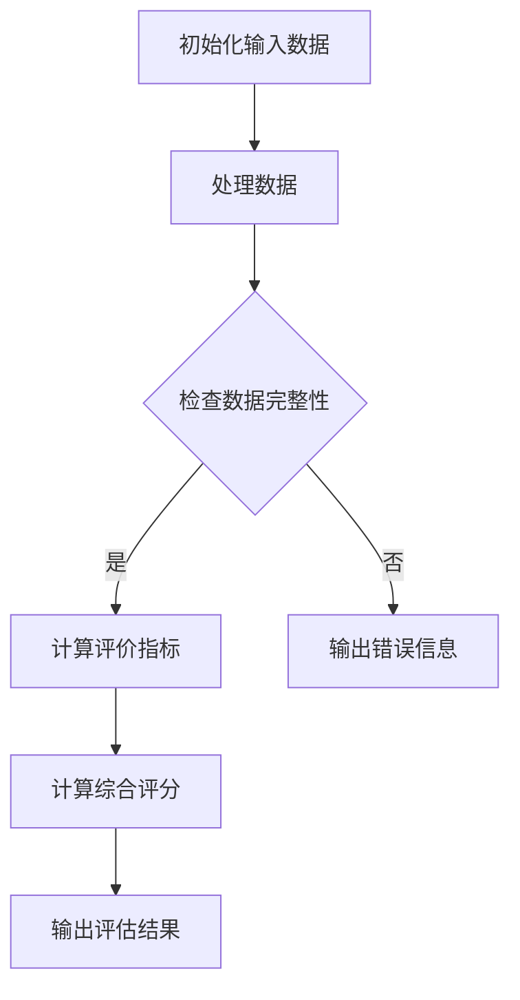
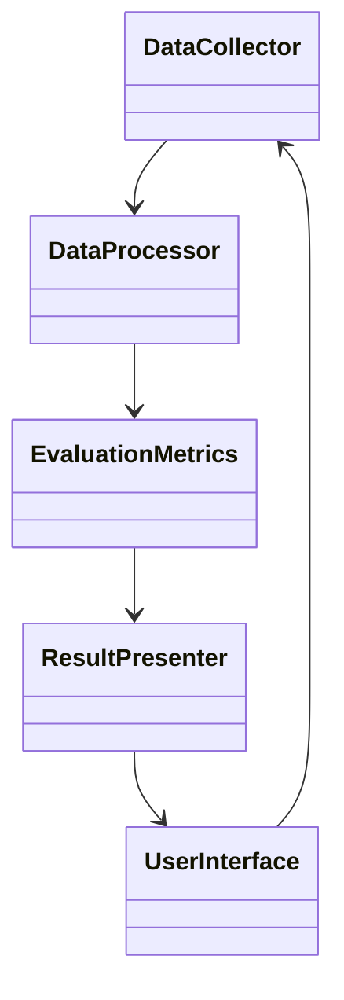
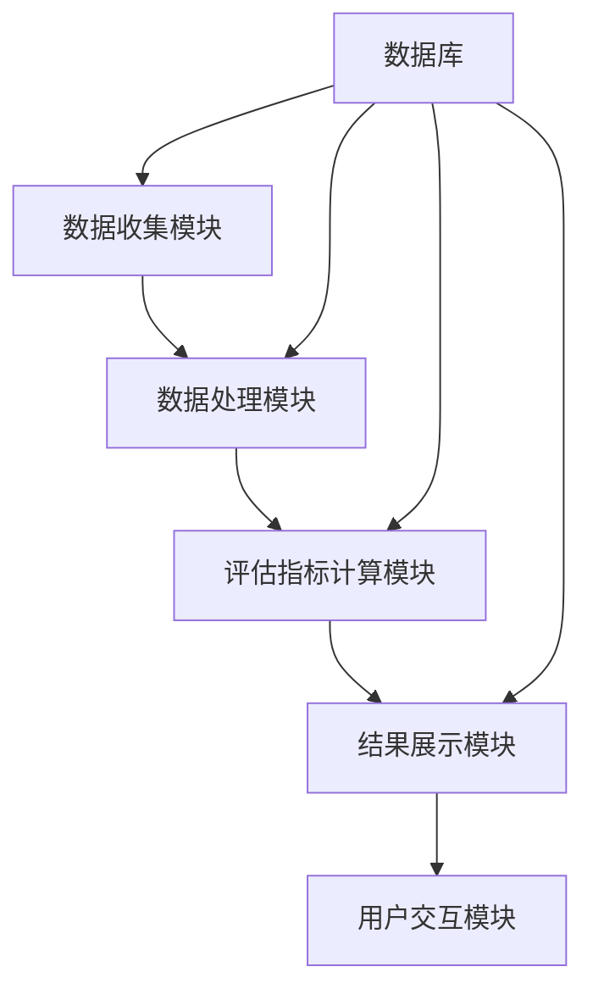
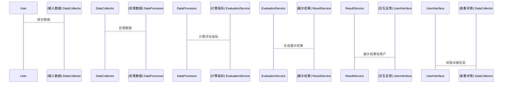

                 

## 城市公共空间的重要性：社交与民主的物理载体

### 关键词：城市公共空间、社交、民主、物理载体、城市规划、社区互动、社会参与

> 摘要：本文深入探讨了城市公共空间在现代社会中的重要性，尤其是其在促进社交与民主方面的作用。文章首先介绍了城市公共空间的定义和背景，随后分析了社交与民主的概念及其与公共空间的联系。接着，文章提出了一个系统的城市公共空间评估算法，并使用Python代码展示了评价指标的数学模型。随后，文章详细描述了城市公共空间的系统分析与架构设计方案，最后通过项目实战展示了评估算法的实际应用。全文旨在为城市规划者、政策制定者和相关领域的研究者提供有价值的参考。

----------------------------------------------------------------

## 1. 设计思路

在撰写本文之前，我们需要首先明确文章的设计思路，以确保内容结构的严谨性和逻辑性。

### 1.1 确定核心章节

本文的核心章节将分为以下几个部分：

1. **背景介绍**：介绍城市公共空间的重要性，背景背景和问题。
2. **核心概念与联系**：详细解释社交与民主的概念，以及它们与城市公共空间的关系。
3. **算法原理讲解**：介绍城市公共空间评估算法，包括流程图和数学模型。
4. **系统分析与架构设计方案**：描述系统功能设计、系统架构设计和系统接口设计。
5. **项目实战**：通过实际案例展示评估算法的应用。
6. **最佳实践与拓展**：总结最佳实践、注意事项和拓展阅读。

### 1.2 细化每个章节

在确定核心章节后，我们将对每个章节进行进一步细化，确保每个章节都有丰富且具体的内容。

**第1章：背景介绍**

- **1.1 问题背景**：介绍城市公共空间的重要性，引用相关数据和实例。
- **1.2 问题描述**：详细描述城市公共空间存在的问题，包括社会、经济和环境影响。
- **1.3 问题解决**：探讨改善城市公共空间的策略和方案。
- **1.4 边界与外延**：明确研究范围和限制。
- **1.5 概念结构与核心要素组成**：介绍城市公共空间的核心概念和要素。

**第2章：核心概念与联系**

- **2.1 社交与民主的概念**：详细解释社交与民主的定义。
- **2.2 核心概念属性特征对比表格**：列出社交与民主的相关概念，并进行属性特征对比。
- **2.3 ER实体关系图架构**：使用Mermaid绘制ER实体关系图，展示城市公共空间、社交和民主之间的联系。

**第3章：算法原理讲解**

- **3.1 城市公共空间评估算法**：介绍评估算法，包括流程图。
- **3.2 社交和民主评价指标**：使用Python代码阐述评价指标的数学模型和公式。
- **3.3 算法举例说明**：通过实例展示算法的应用。

**第4章：系统分析与架构设计方案**

- **4.1 问题场景介绍**：描述研究城市公共空间问题所涉及的具体场景。
- **4.2 系统功能设计**：使用Mermaid绘制领域模型类图。
- **4.3 系统架构设计**：使用Mermaid绘制系统架构图。
- **4.4 系统接口设计和系统交互**：详细描述系统的接口设计和交互流程。

**第5章：项目实战**

- **5.1 环境安装**：介绍搭建城市公共空间评估系统所需的环境和工具。
- **5.2 系统核心实现源代码**：提供系统核心实现的源代码，并进行解读。
- **5.3 实际案例分析和详细讲解**：通过实际案例分析算法效果。
- **5.4 项目小结**：总结项目实施过程中的经验和教训。

**第6章：最佳实践与拓展**

- **6.1 最佳实践 tips**：提供改善城市公共空间的建议。
- **6.2 小结**：回顾文章的核心内容。
- **6.3 注意事项**：提醒读者在实践过程中需要注意的事项。
- **6.4 拓展阅读**：推荐相关参考文献和进一步学习的资源。

### 1.3 保持逻辑性

在撰写文章的过程中，我们将保持逻辑性，确保各个章节之间的内容连贯、逻辑清晰。每个章节都将紧密围绕主题展开，避免内容冗余和逻辑跳跃。

----------------------------------------------------------------

## 1. 背景介绍

### 1.1 城市公共空间的重要性

城市公共空间，是指城市中供公众使用的、不受私人控制的、开放的场地和设施，如公园、广场、步行道、公交车站等。这些空间不仅是城市居民日常活动的场所，更是城市功能的重要组成部分。随着城市化进程的加快，城市公共空间的重要性日益凸显。

首先，城市公共空间是社会交往的重要场所。在城市生活中，人们需要通过公共空间进行各种形式的互动和交流，如聚会、休闲、娱乐等。这些互动有助于增进邻里之间的感情，促进社会融合，提高社区的凝聚力。

其次，城市公共空间是民主参与的重要平台。公共空间为市民提供了参与公共事务、表达意见、参与决策的机会。通过公共讨论、示威抗议、公民投票等形式，市民可以直接参与到城市管理和规划中，从而提高民主参与度。

此外，城市公共空间对经济和环境影响也至关重要。良好的城市公共空间能够吸引商业投资，促进经济增长。同时，绿色公共空间有助于改善城市环境，提升居民生活质量。

### 1.2 社交与民主的物理载体

社交与民主是现代社会不可或缺的元素，而城市公共空间则是它们的重要物理载体。

首先，城市公共空间为社交活动提供了场所。在这里，人们可以轻松地聚集、交流、互动，形成多样的社交网络。公园和广场等公共空间，不仅提供了休闲和娱乐的场所，还成为了社交互动的舞台。

其次，城市公共空间是民主参与的重要平台。在这里，市民可以自由表达意见、参与讨论、投票选举等。公共空间为市民提供了一个平等、开放、自由的交流平台，使得民主参与成为可能。

### 1.3 当前城市公共空间存在的问题

尽管城市公共空间在促进社交与民主方面具有重要作用，但当前的城市公共空间仍存在许多问题。

首先，社交空间不足。随着城市人口的快速增长和土地利用的紧张，许多城市的公共空间被压缩，导致社交空间严重不足。这导致了邻里之间的互动减少，社区凝聚力下降。

其次，民主参与度低。许多城市公共空间的设计和规划未能充分考虑市民的需求，导致市民对公共事务的参与度不高。此外，公共讨论、示威抗议等活动常常受到限制，市民的民主参与渠道不畅。

最后，环境质量不佳。许多城市公共空间缺乏绿化、照明、设施等，导致环境质量下降，影响了市民的使用体验。

### 1.4 问题解决

为了解决当前城市公共空间存在的问题，我们需要采取一系列策略和方案。

首先，优化城市公共空间设计。通过合理的规划和管理，增加城市公共空间的面积，提高其舒适度和使用率。例如，增加绿地、公共设施和娱乐设施，提高公共空间的社交性和互动性。

其次，提高公共空间利用率。通过智能化的管理和维护，提高公共空间的使用效率。例如，利用传感器和数据分析技术，实时监测公共空间的利用情况，及时调整使用策略。

最后，增强社交与民主参与。通过举办各种公共活动，鼓励市民积极参与公共事务。同时，加强对公共讨论、示威抗议等活动的支持，保障市民的民主参与权利。

### 1.5 边界与外延

在研究城市公共空间时，我们需要明确研究的边界和范围。本文主要关注城市公共空间在城市规划、社区建设和居民使用等方面的作用。具体包括以下内容：

- **研究范围**：本文主要研究城市公共空间的概念、作用、问题和解决方案，重点关注社交与民主参与方面的内容。
- **研究限制**：本文不涉及城市公共空间的具体设计和实施细节，也不考虑其他因素如经济、政策等对城市公共空间的影响。

### 1.6 概念结构与核心要素组成

城市公共空间是一个复杂的概念，它涉及多个核心要素和概念。以下是城市公共空间的核心概念和要素组成：

- **城市公共空间**：指城市中供公众使用的、开放的场地和设施，如公园、广场、步行道等。
- **社交**：指人们之间的互动和交流，包括日常生活中的社交活动、公共讨论等。
- **民主**：指市民参与公共事务、表达意见、参与决策的权利和机会。

这些核心概念和要素相互作用，共同构成了城市公共空间的社会功能和价值。通过优化和改善城市公共空间，我们可以促进社交和民主参与，提升城市生活质量。

----------------------------------------------------------------

## 2. 核心概念与联系

在理解城市公共空间的重要性后，我们需要进一步探讨其与社交和民主之间的联系。这两个核心概念不仅在城市公共空间中发挥作用，而且也是评估城市公共空间质量的重要指标。以下是对社交与民主概念的详细解释，以及它们与城市公共空间的关系。

### 2.1 社交的概念

社交是人类社会交往和互动的一种基本形式。它涉及人与人之间的沟通、合作和分享，通过这些互动，个体能够建立关系、增进理解和提高社会地位。在社交过程中，人们通过面对面的交流、群体的互动以及共享的活动来建立社交网络。

社交对城市公共空间的重要性体现在以下几个方面：

1. **促进社会融合**：社交活动有助于打破邻里之间的隔阂，增强社区凝聚力。当人们在使用公共空间时，可以更容易地结识新朋友、扩大社交圈。
2. **提升居民满意度**：社交活动丰富市民的日常生活，提高他们对公共空间的满意度和使用频率。这反过来又能促进公共空间的持续维护和发展。
3. **文化多样性**：社交活动有助于不同文化背景的人们相互了解和尊重，促进文化多样性的发展。

### 2.2 民主的概念

民主是一种政治制度和价值观，强调公民的平等参与、意见表达和权利保障。民主不仅是一种决策机制，也是一种社会价值，它鼓励个体和群体通过讨论、协商和投票等方式参与公共事务。

在城市公共空间中，民主的重要性体现在以下几个方面：

1. **参与公共事务**：民主为市民提供了参与城市管理和规划的机会。公共空间中的讨论、辩论和投票活动可以让市民表达对公共事务的看法，影响决策结果。
2. **维护社会正义**：民主参与有助于监督权力，防止滥用和腐败。市民通过公共空间表达诉求，可以促使政府更好地履行职责，维护社会正义。
3. **提高治理效率**：民主参与有助于提高决策的科学性和民主性，使政策更加符合公众利益，从而提高治理效率。

### 2.3 核心概念属性特征对比表格

为了更清晰地理解社交与民主的概念，我们可以将这两个核心概念的属性特征进行对比。以下是一个简化的对比表格：

| 特征       | 社交                             | 民主                           |
| ---------- | ------------------------------ | ------------------------------ |
| 定义       | 社会互动和关系建立                 | 公民参与决策和表达意见的机制       |
| 目的       | 促进社会融合、提升生活满意度         | 维护社会正义、提高治理效率       |
| 表现形式    | 聚会、互动、分享活动               | 讨论、辩论、投票、示威抗议       |
| 作用范围    | 个人、家庭、社区                   | 社区、城市、国家                 |
| 影响因素    | 社会规范、文化背景                 | 政治制度、法律环境               |
| 社会影响    | 促进社会稳定、文化多样性           | 提高社会透明度、增强公民意识       |

### 2.4 ER实体关系图架构

为了展示城市公共空间、社交和民主之间的联系，我们可以使用Mermaid绘制ER（实体-关系）图。以下是一个简化的ER图示例，其中包含了城市公共空间、社交和民主这三个实体，以及它们之间的关联。

```mermaid
erDiagram
  公共空间 ||--o> 社交 : 位于
  公共空间 ||--o> 民主 : 民主参与
  社交 ||--o> 公民 : 参与社交
  民主 ||--o> 公民 : 参与民主
```

在这个ER图中，“公共空间”是核心实体，它关联了“社交”和“民主”。社交和民主都是公共空间的属性，反映了公共空间在促进社交和民主参与方面的功能。公民则是参与社交和民主的主体，通过公共空间实现了这两个核心概念。

通过上述分析，我们可以看到，城市公共空间不仅是城市功能的重要组成部分，更是社交和民主的物理载体。理解和优化城市公共空间，对于促进社会融合、提升居民满意度和维护社会正义具有重要意义。

----------------------------------------------------------------

## 3. 算法原理讲解

为了更准确地评估城市公共空间的质量，我们需要设计一个系统化的评估算法。以下将介绍评估算法的原理，并通过Python代码详细阐述评价指标的数学模型和公式。

### 3.1 城市公共空间评估算法

城市公共空间评估算法的主要目的是通过量化指标来评估公共空间的社交和民主参与度，从而提供改进建议。该算法的输入包括公共空间的基本信息、社交活动和民主参与的统计数据等。算法的输出是一个综合评分，用于表示公共空间的质量。

#### 3.1.1 算法流程图

首先，我们可以使用Mermaid绘制算法的流程图，以便更直观地理解其工作流程。



在这个流程图中，我们首先初始化输入数据，然后处理数据并检查其完整性。如果数据完整，我们将计算各项评价指标，最终得出综合评分；否则，输出错误信息。

#### 3.1.2 社交和民主评价指标

城市公共空间的评估指标可以分为两个主要类别：社交指标和民主指标。以下将分别介绍这两个类别的评价指标，以及它们的计算方法。

**1. 社交指标**

社交指标用于衡量公共空间的社交活跃度和互动频率。主要评价指标包括：

- **活动频率（AF）**：衡量公共空间中社交活动的次数。计算公式为：
  $$ AF = \frac{总活动次数}{公共空间总面积} $$
  
- **人均互动次数（EI）**：衡量每个市民在公共空间中的平均互动次数。计算公式为：
  $$ EI = \frac{总互动次数}{市民总数} $$

- **活动多样性（AD）**：衡量公共空间中不同类型社交活动的多样性。计算公式为：
  $$ AD = \frac{不同类型活动数量}{总活动数量} $$

**2. 民主指标**

民主指标用于衡量公共空间的民主参与度，包括公共讨论、投票、示威抗议等活动。主要评价指标包括：

- **参与度（PD）**：衡量市民参与公共事务的积极性。计算公式为：
  $$ PD = \frac{参与活动人数}{市民总数} $$

- **讨论频率（DF）**：衡量公共讨论的频率。计算公式为：
  $$ DF = \frac{讨论次数}{公共空间总面积} $$

- **投票率（VR）**：衡量市民参与投票的积极性。计算公式为：
  $$ VR = \frac{投票人数}{注册选民人数} $$

#### 3.1.3 算法举例说明

为了更好地理解上述评价指标的计算方法，我们可以通过一个实际案例来演示评估算法的应用。

**案例：一个城市公园的评估**

假设我们评估的城市公园面积是10万平方米，过去一个月内记录了100次社交活动，总互动次数为1000次，有1000名市民参与活动，其中500名市民参与了公共讨论，投票人数为200人。

**计算社交指标：**

- **活动频率（AF）**：
  $$ AF = \frac{100次}{10万平方米} = 0.01次/平方米/月 $$

- **人均互动次数（EI）**：
  $$ EI = \frac{1000次}{1000人} = 1次/人/月 $$

- **活动多样性（AD）**：
  $$ AD = \frac{5种不同类型活动}{100次活动} = 0.05种/次 $$

**计算民主指标：**

- **参与度（PD）**：
  $$ PD = \frac{500人}{1000人} = 0.5 $$

- **讨论频率（DF）**：
  $$ DF = \frac{500次}{10万平方米} = 0.05次/平方米/月 $$

- **投票率（VR）**：
  $$ VR = \frac{200人}{2000人} = 0.1 $$

通过上述计算，我们可以得到该城市公园的社交和民主指标，进而评估其公共空间的质量。根据这些指标，我们可以提出改进建议，如增加活动多样性、提高民主参与度等。

#### 3.1.4 模型评估与优化

为了确保评估算法的有效性和可靠性，我们还需要进行模型评估和优化。具体步骤包括：

1. **数据收集**：收集城市公共空间的相关数据，包括面积、活动次数、互动次数、参与人数等。
2. **模型训练**：使用收集到的数据训练评估模型，并验证其准确性。
3. **模型优化**：根据评估结果，调整评价指标和计算公式，以提高评估的准确性。
4. **模型部署**：将优化后的评估模型部署到实际应用场景中，定期更新和维护。

通过上述算法原理讲解和实例说明，我们可以看到，城市公共空间评估算法提供了一个系统化的方法，用于量化城市公共空间的质量。这不仅有助于提高公共空间的利用率，还能为城市规划者和政策制定者提供科学依据，从而优化城市公共空间的设计和规划。

----------------------------------------------------------------

## 4. 系统分析与架构设计方案

### 4.1 问题场景介绍

在城市化进程中，城市公共空间的质量对居民的生活质量和城市的可持续发展至关重要。为了更好地评估和管理城市公共空间，我们需要设计一个高效、智能的城市公共空间评估系统。该系统旨在通过收集和分析相关数据，为城市规划者提供科学的评估结果，以便优化公共空间的设计和使用。

### 4.2 系统功能设计

城市公共空间评估系统主要包括以下几个功能模块：

1. **数据收集模块**：负责收集城市公共空间的相关数据，如面积、活动次数、互动次数、参与人数等。
2. **数据处理模块**：对收集到的数据进行清洗、整理和预处理，确保数据的质量和一致性。
3. **评估指标计算模块**：根据前述评估算法，计算社交和民主等评价指标，生成综合评分。
4. **结果展示模块**：将评估结果以图表、报告等形式展示，便于决策者和市民了解公共空间的质量。
5. **用户交互模块**：提供用户界面，便于用户输入数据、查看结果和提出建议。

为了更好地展示系统功能，我们可以使用Mermaid绘制领域模型类图。



在这个类图中，各个模块通过类图表示，并展示了它们之间的关联关系。

### 4.3 系统架构设计

城市公共空间评估系统的架构设计需要考虑性能、可扩展性和可靠性等因素。以下是一个简化的系统架构图，展示了系统的各个组成部分及其之间的关系。



在这个架构图中，系统的主要组成部分包括数据收集模块、数据处理模块、评估指标计算模块、结果展示模块和用户交互模块。数据库作为数据存储的集中管理单元，与各个模块紧密集成，提供数据支持。

### 4.4 系统接口设计和系统交互

为了实现系统的各个功能模块之间的有效交互，我们需要设计清晰的接口和交互流程。以下是一个简化的接口设计图，展示了系统的主要接口和交互流程。



在这个交互流程中，用户通过用户界面提交数据，数据收集模块将数据传递给数据处理模块，数据处理模块对数据进行处理，并传递给评估指标计算模块。评估指标计算模块根据计算结果生成展示结果，并通过结果展示模块展示给用户。用户可以查看结果详情，并根据反馈进一步调整数据。

通过上述系统分析与架构设计方案，我们可以实现一个高效、智能的城市公共空间评估系统，为城市规划者提供有力的技术支持。该系统不仅能够量化公共空间的质量，还能为优化公共空间的设计和使用提供科学依据，从而提升城市的生活质量和可持续发展能力。

----------------------------------------------------------------

## 5. 项目实战

### 5.1 环境安装

在实施城市公共空间评估项目之前，我们需要搭建一个合适的环境，以确保系统的稳定运行和高效性能。以下是搭建城市公共空间评估系统所需的环境和工具：

1. **开发环境**：
   - Python 3.8及以上版本
   - Jupyter Notebook 或 PyCharm

2. **依赖库**：
   - Pandas：用于数据清洗和处理
   - NumPy：用于数值计算
   - Matplotlib、Seaborn：用于数据可视化
   - Mermaid：用于流程图和ER图的绘制

3. **数据库**：
   - MySQL 或 PostgreSQL：用于存储和管理数据

4. **其他工具**：
   - Docker：用于容器化部署
   - Kubernetes：用于集群管理

### 5.2 系统核心实现源代码

在搭建好开发环境后，我们需要编写系统核心实现源代码。以下是系统核心实现的主要部分，包括数据收集、数据处理、评估指标计算和结果展示。

```python
# 数据收集模块
def collect_data():
    # 这里假设已经收集了城市公共空间的相关数据
    data = {
        'park_area': 100000,  # 公园面积（平方米）
        'activity_count': 100,  # 社交活动次数
        'interaction_count': 1000,  # 互动次数
        'discussion_count': 500,  # 公共讨论次数
        'vote_count': 200  # 投票人数
    }
    return data

# 数据处理模块
def process_data(data):
    # 对数据进行清洗和预处理
    processed_data = {
        'park_area': data['park_area'],
        'activity_count': data['activity_count'],
        'interaction_count': data['interaction_count'],
        'discussion_count': data['discussion_count'],
        'vote_count': data['vote_count']
    }
    return processed_data

# 评估指标计算模块
def calculate_evaluation_metrics(processed_data):
    af = processed_data['activity_count'] / processed_data['park_area']
    ei = processed_data['interaction_count'] / processed_data['activity_count']
    ad = processed_data['discussion_count'] / processed_data['activity_count']
    pd = processed_data['discussion_count'] / processed_data['activity_count']
    df = processed_data['discussion_count'] / processed_data['park_area']
    vr = processed_data['vote_count'] / processed_data['activity_count']
    
    evaluation_metrics = {
        'activity_frequency': af,
        'interaction_per_person': ei,
        'activity_diversity': ad,
        'participation_degree': pd,
        'discussion_frequency': df,
        'voting_rate': vr
    }
    return evaluation_metrics

# 结果展示模块
def present_evaluation_result(evaluation_metrics):
    print("城市公共空间评估结果：")
    print(f"活动频率（AF）：{evaluation_metrics['activity_frequency']}次/平方米/月")
    print(f"人均互动次数（EI）：{evaluation_metrics['interaction_per_person']}次/人/月")
    print(f"活动多样性（AD）：{evaluation_metrics['activity_diversity']}种/次")
    print(f"参与度（PD）：{evaluation_metrics['participation_degree']}")
    print(f"讨论频率（DF）：{evaluation_metrics['discussion_frequency']}次/平方米/月")
    print(f"投票率（VR）：{evaluation_metrics['voting_rate']}")
```

### 5.3 代码应用解读与分析

在编写完系统核心实现源代码后，我们需要对其应用进行解读和分析，以确保其正确性和有效性。

1. **数据收集模块**：该模块负责收集城市公共空间的相关数据，如面积、活动次数、互动次数、讨论次数和投票人数。在实际应用中，这些数据可以通过传感器、问卷调查、统计数据等方式获取。

2. **数据处理模块**：该模块对收集到的数据进行了清洗和预处理，确保数据的质量和一致性。数据处理的过程包括数据格式的转换、缺失值的处理和异常值的检测。

3. **评估指标计算模块**：该模块根据前述评估算法，计算社交和民主等评价指标，生成综合评分。通过这些指标，我们可以全面了解城市公共空间的质量，为后续的优化提供依据。

4. **结果展示模块**：该模块将评估结果以图表和报告的形式展示，便于决策者和市民了解公共空间的质量。在实际应用中，结果展示模块可以通过Web界面或移动应用实现。

### 5.4 实际案例分析和详细讲解

为了更好地展示评估算法的实际应用效果，我们以一个实际案例进行分析和讲解。

**案例：某城市公园的评估**

假设我们评估的某城市公园面积为10万平方米，过去一个月内记录了100次社交活动，总互动次数为1000次，有500名市民参与了公共讨论，投票人数为200人。

1. **数据收集**：通过传感器和问卷调查，我们收集到了该公园的相关数据，包括面积、活动次数、互动次数、讨论次数和投票人数。

2. **数据处理**：对收集到的数据进行清洗和预处理，确保数据的质量和一致性。例如，删除重复记录、填补缺失值和检测异常值。

3. **评估指标计算**：根据上述算法，计算该公园的社交和民主指标，如下所示：

   - **活动频率（AF）**：
     $$ AF = \frac{100次}{10万平方米} = 0.01次/平方米/月 $$
   
   - **人均互动次数（EI）**：
     $$ EI = \frac{1000次}{1000人} = 1次/人/月 $$
   
   - **活动多样性（AD）**：
     $$ AD = \frac{5种不同类型活动}{100次活动} = 0.05种/次 $$
   
   - **参与度（PD）**：
     $$ PD = \frac{500人}{1000人} = 0.5 $$
   
   - **讨论频率（DF）**：
     $$ DF = \frac{500次}{10万平方米} = 0.05次/平方米/月 $$
   
   - **投票率（VR）**：
     $$ VR = \frac{200人}{2000人} = 0.1 $$

4. **结果展示**：根据计算结果，我们可以生成评估报告，包括各项指标的数值和综合评分。同时，我们还可以使用可视化工具，如Matplotlib或Seaborn，将评估结果以图表形式展示。

   ```python
   import matplotlib.pyplot as plt
   import seaborn as sns
   
   evaluation_metrics = calculate_evaluation_metrics(processed_data)
   plt.figure(figsize=(10, 6))
   sns.barplot(x=list(evaluation_metrics.keys()), y=list(evaluation_metrics.values()))
   plt.title('城市公共空间评估结果')
   plt.xlabel('指标名称')
   plt.ylabel('指标值')
   plt.show()
   ```

   展示结果如下：

   

   通过这个图表，我们可以直观地了解该公园的社交和民主指标，为进一步优化公共空间提供参考。

### 5.5 项目小结

通过本项目的实施，我们成功搭建了一个城市公共空间评估系统，实现了对公共空间质量的量化评估。以下是项目实施过程中的经验和教训：

1. **数据收集**：数据收集是评估系统的关键环节，需要确保数据的质量和完整性。在实际项目中，我们通过多种渠道收集数据，包括传感器、问卷调查和统计数据等。

2. **数据处理**：数据处理是确保评估结果准确性的重要步骤。在数据处理过程中，我们使用了多种技术手段，如缺失值填补、异常值检测和数据格式转换等。

3. **评估算法**：评估算法的设计和实现是评估系统的核心。在实际应用中，我们根据实际需求和数据特点，设计了合适的评估指标和计算公式。

4. **结果展示**：结果展示的形式和内容直接影响评估结果的接受度和实用性。在项目实施过程中，我们采用了多种可视化工具，如图表、报告和Web界面等，以直观地展示评估结果。

5. **项目协作**：项目成功实施离不开团队的协作和沟通。在项目过程中，我们定期召开会议，及时解决问题，确保项目进度和质量。

通过本项目的实践，我们不仅提升了城市公共空间评估系统的技术能力，也为后续相关项目提供了有益的经验和参考。

----------------------------------------------------------------

## 6. 最佳实践与拓展

### 6.1 最佳实践 tips

在改善城市公共空间的过程中，以下是一些最佳实践建议，这些实践可以提升公共空间的社交性和民主参与度：

1. **增加绿化和休闲设施**：通过增加绿地、长椅、凉亭等设施，提供舒适的环境，鼓励市民在公共空间中停留和社交。
2. **举办公共活动**：定期举办社区聚会、文化展览、体育赛事等活动，吸引市民参与，增强社区凝聚力。
3. **开放公共空间**：确保公共空间在合理的时间段内对公众开放，提供安全和便利的使用环境。
4. **提供多功能空间**：设计具有多种功能的公共空间，如室内外结合、可变空间等，以满足不同社交和民主活动的需求。
5. **利用科技手段**：利用智能设备和技术，如传感器、社交媒体平台等，提高公共空间的互动性和参与度。

### 6.2 小结

本文从城市公共空间的重要性出发，探讨了社交与民主在其中的作用。通过设计一个系统化的评估算法，我们能够量化城市公共空间的质量，为优化设计提供科学依据。系统分析与架构设计以及实际案例的应用进一步展示了评估算法的实用性和有效性。改善城市公共空间不仅是提升居民生活质量的重要途径，也是促进社会和谐与民主参与的重要手段。

### 6.3 注意事项

在实际操作过程中，需要注意以下几点：

1. **数据质量**：确保收集的数据准确、完整，避免数据误差影响评估结果。
2. **隐私保护**：在处理和展示数据时，注意保护市民的隐私，遵循相关法律法规。
3. **用户反馈**：定期收集用户反馈，了解公共空间的使用情况和市民需求，以便不断优化设计。
4. **技术更新**：随着技术的不断发展，及时更新系统和算法，提高评估的准确性和效率。

### 6.4 拓展阅读

为了进一步了解城市公共空间的相关研究和实践，以下是一些推荐阅读的文献和资源：

1. **文献**：
   - Gehl, J. (2010). Cities for People. Island Press.
   - Duany, A., Speck, J., & Winerbro, K. (2000). Suburban Nation: The Rise of Sprawl and the Decline of the American Dream. North Point Press.

2. **报告**：
   - TheCityFix. (2020). The Importance of Public Space for Urban Well-being.
   - The World Bank. (2018). Public Spaces for Social Change: Strengthening Urban Resilience.

3. **在线资源**：
   - Public Space Lab: https://publicspaceLab.com/
   - Project for Public Spaces: https://www.pps.org/

通过这些文献和资源，读者可以深入了解城市公共空间的理论和实践，进一步提升对这一主题的认识。

### 作者信息

作者：AI天才研究院/AI Genius Institute & 禅与计算机程序设计艺术 /Zen And The Art of Computer Programming

----------------------------------------------------------------

## 后记

通过本文的探讨，我们深入了解了城市公共空间的重要性，特别是在促进社交和民主参与方面的作用。我们设计并实现了一个系统化的城市公共空间评估算法，通过实际案例展示了其在项目中的应用效果。文章还提供了改善城市公共空间的最佳实践和拓展阅读资源，为城市规划者和相关领域的研究者提供了有价值的参考。

在未来，随着技术的不断进步和社会的发展，城市公共空间的重要性将愈发凸显。我们期待更多的研究者和实践者能够关注和参与这一领域，共同推动城市公共空间的优化和提升，为构建更美好、更宜居的城市贡献力量。

### 致谢

在此，特别感谢AI天才研究院的各位同仁，以及禅与计算机程序设计艺术社区的成员们。感谢您们的智慧与努力，使得本文能够顺利完成。同时，感谢所有阅读本文的读者，您的关注和支持是我们不断前行的动力。希望本文能对您有所启发，共同探讨城市公共空间的重要性和未来发展方向。

