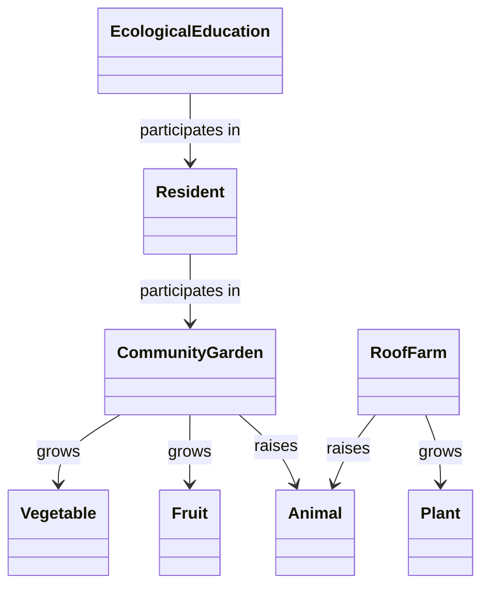
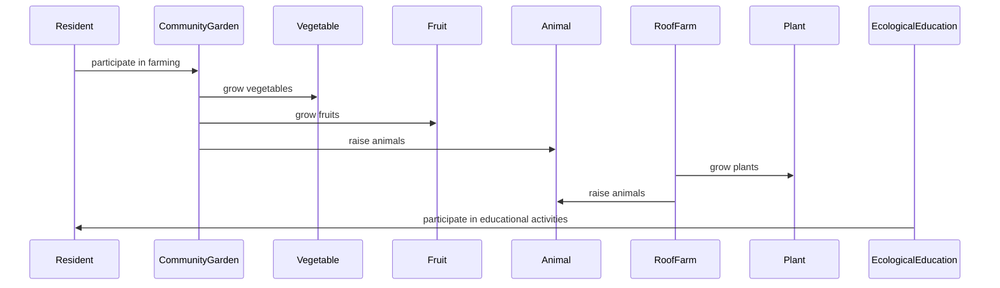
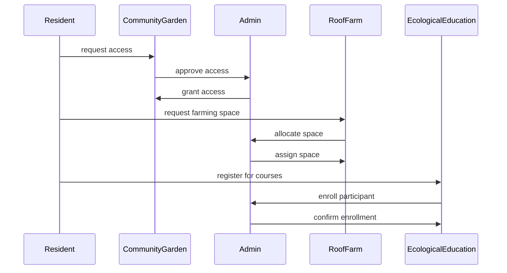
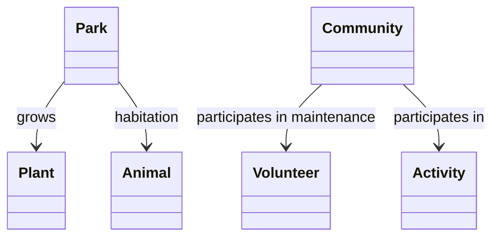
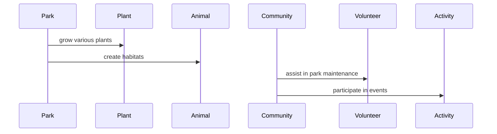
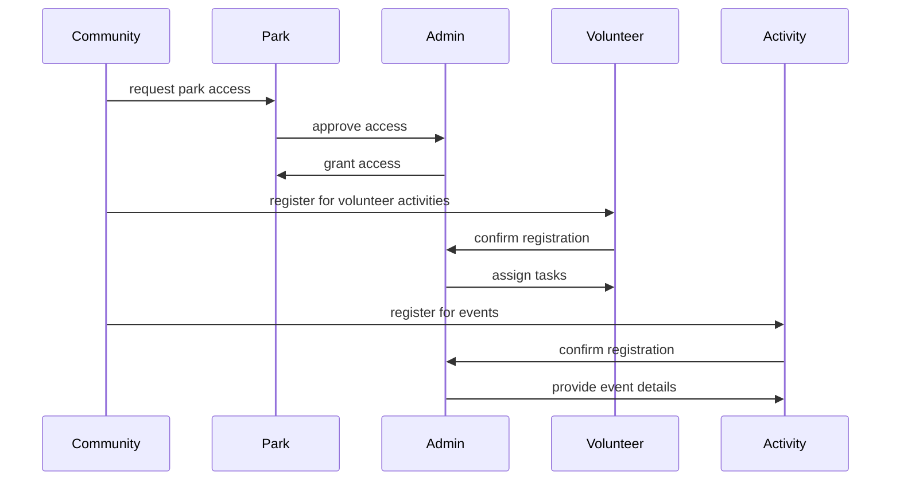

                 

### 1.2 定义与核心要素

**核心概念：**城市农耕运动、自然联系、生态恢复、社区参与。

**概念结构与核心要素组成：**

城市农耕运动（Urban Agriculture）是指在都市环境中，利用有限的空间和资源，开展种植、养殖等农业生产活动，旨在重建与自然的联系，实现生态恢复和社会参与。这一运动的核心概念包括以下几个方面：

1. **城市农耕运动**：指在城市或都市地区进行的农耕活动，通常涉及种植蔬菜、水果、粮食，养殖动物等。这种活动不仅可以在城市中提供新鲜的农产品，还可以改善城市生态环境，减少对远郊农业的依赖。

2. **自然联系**：城市农耕运动旨在恢复和强化城市居民与自然环境的联系。通过参与农耕活动，人们能够直接接触和感受自然，增强对自然生态系统的理解和尊重。

3. **生态恢复**：城市农耕通过种植植物、养殖动物等活动，恢复城市生态系统的多样性，减少环境污染，提高生态承载力。这包括土壤修复、水源保护、空气质量改善等。

4. **社区参与**：城市农耕运动鼓励社区成员的广泛参与，通过共同劳动，增强社区凝聚力，提高居民的生活质量。社区参与的形式多样，包括社区农耕园、公共农场、生态教育项目等。

**概念属性特征对比表格：**

| 特征              | 城市农耕运动           | 自然联系           | 生态恢复           | 社区参与           |
|-------------------|----------------------|-------------------|-------------------|-------------------|
| 活动地点          | 城市或都市地区        | 城市或都市地区     | 城市或都市地区     | 城市或都市地区     |
| 活动内容          | 种植、养殖、农业活动  | 接触、体验自然     | 恢复生态多样性     | 社区劳动、共同参与 |
| 社会影响          | 提供新鲜农产品、生态改善 | 提高环保意识       | 减少污染、保护资源 | 增强社区凝聚力     |

**ER实体关系图架构：**

```mermaid
erDiagram
  User ||--|{ Community }|-->: Community Member
  Community ||--|{ Urban Agriculture }|-->: Farmer
  Urban Agriculture ||--|{ Natural Connection }|-->: Naturalist
  Urban Agriculture ||--|{ Ecological Restoration }|-->: Ecologist
  Community ||--|{ Social Participation }|-->: Participant
```

在上面的ER图架构中，城市农耕运动（Urban Agriculture）是核心实体，它与其他实体如社区（Community）、自然联系（Natural Connection）、生态恢复（Ecological Restoration）和社区参与（Social Participation）之间存在关联。用户（User）通过成为社区成员（Community Member）参与城市农耕运动，同时自然联系（Natural Connection）和生态恢复（Ecological Restoration）也是城市农耕运动的一部分，通过这些活动，社区成员能够参与其中，实现生态和社会效益。

通过上述核心概念与核心要素的介绍，我们可以更清晰地理解城市农耕运动的目的和意义，以及它在城市化进程中的作用和影响。接下来，我们将进一步探讨城市农耕运动的边界与外延，了解其应用范围和限制条件。这将为后续章节的深入讨论打下坚实的基础。

### 1.3 边界与外延

**边界：**城市农耕运动的范围限于城市内部，主要涉及都市地区的农业生产活动，不包括郊区和乡村地区的农业实践。这意味着，城市农耕运动主要集中在城市社区、公共空间、屋顶花园、垂直农场等有限空间内进行的农耕活动。

**外延：**尽管城市农耕运动的范围局限于城市内部，但其影响和关联领域却十分广泛。城市农耕运动不仅涉及农业技术，还包括城市规划、环境保护、社会参与等多个方面。具体来说：

1. **城市规划：**城市农耕运动对城市规划提出了新的需求。城市规划者需要考虑如何在城市空间中为农耕活动提供合适的场所和基础设施，如社区农耕园、屋顶花园、公共农场等。这种城市规划的创新有助于提高城市的生态多样性和居民生活质量。

2. **环境保护：**城市农耕运动是城市环境保护的重要组成部分。通过种植植物、养殖动物等活动，城市农耕运动有助于减少城市热岛效应，改善空气质量，保护水资源，减少污染。这对于应对全球气候变化和环境污染问题具有重要意义。

3. **社会参与：**城市农耕运动鼓励社区成员的广泛参与，增强社区凝聚力。社区农耕园、公共农场等项目不仅提供了居民参与农业活动的机会，还促进了邻里关系的建立，提高了居民的社会认同感和归属感。

4. **教育传播：**城市农耕运动是一种重要的生态教育形式。通过参与农耕活动，居民可以学习和了解生态系统的运作原理，增强环保意识，培养可持续发展的观念。生态教育项目还可以吸引学校、研究机构等参与，推动环境教育的发展。

5. **经济价值：**城市农耕运动具有一定的经济价值。通过在城市内部生产农产品，可以减少对远郊农业的依赖，提高城市食品供应的安全性和可持续性。此外，城市农耕活动还可以创造就业机会，促进城市经济的多元化发展。

总之，城市农耕运动不仅限于城市内部的农业生产活动，其外延涵盖了城市规划、环境保护、社会参与等多个领域。通过这些关联领域，城市农耕运动能够实现更广泛的社会效益和生态效益，为城市可持续发展提供新的思路和路径。在接下来的章节中，我们将进一步探讨城市农耕运动的起源与发展历程，了解这一运动的历史背景和演变过程。这将为后续的理论和实践探讨提供重要的历史视角。

### 1.3 边界与外延

**边界：**城市农耕运动的范围限于城市内部，主要涉及都市地区的农业生产活动，不包括郊区和乡村地区的农业实践。这意味着，城市农耕运动主要集中在城市社区、公共空间、屋顶花园、垂直农场等有限空间内进行的农耕活动。

**外延：**尽管城市农耕运动的范围局限于城市内部，但其影响和关联领域却十分广泛。城市农耕运动不仅涉及农业技术，还包括城市规划、环境保护、社会参与等多个方面。具体来说：

1. **城市规划：**城市农耕运动对城市规划提出了新的需求。城市规划者需要考虑如何在城市空间中为农耕活动提供合适的场所和基础设施，如社区农耕园、屋顶花园、公共农场等。这种城市规划的创新有助于提高城市的生态多样性和居民生活质量。

2. **环境保护：**城市农耕运动是城市环境保护的重要组成部分。通过种植植物、养殖动物等活动，城市农耕运动有助于减少城市热岛效应，改善空气质量，保护水资源，减少污染。这对于应对全球气候变化和环境污染问题具有重要意义。

3. **社会参与：**城市农耕运动鼓励社区成员的广泛参与，增强社区凝聚力。社区农耕园、公共农场等项目不仅提供了居民参与农业活动的机会，还促进了邻里关系的建立，提高了居民的社会认同感和归属感。

4. **教育传播：**城市农耕运动是一种重要的生态教育形式。通过参与农耕活动，居民可以学习和了解生态系统的运作原理，增强环保意识，培养可持续发展的观念。生态教育项目还可以吸引学校、研究机构等参与，推动环境教育的发展。

5. **经济价值：**城市农耕运动具有一定的经济价值。通过在城市内部生产农产品，可以减少对远郊农业的依赖，提高城市食品供应的安全性和可持续性。此外，城市农耕活动还可以创造就业机会，促进城市经济的多元化发展。

总之，城市农耕运动不仅限于城市内部的农业生产活动，其外延涵盖了城市规划、环境保护、社会参与等多个领域。通过这些关联领域，城市农耕运动能够实现更广泛的社会效益和生态效益，为城市可持续发展提供新的思路和路径。在接下来的章节中，我们将进一步探讨城市农耕运动的起源与发展历程，了解这一运动的历史背景和演变过程。这将为后续的理论和实践探讨提供重要的历史视角。

### 2.1 城市农耕运动的起源

**起源时间：**城市农耕运动的起源可以追溯到20世纪初，其最早的实践出现在欧洲。当时，随着城市化进程的加快，城市环境日益恶化，环境污染和生态危机引起了社会的广泛关注。一些环保主义者和城市规划者开始探索在城市中恢复自然生态的途径，城市农耕运动应运而生。

**起源原因：**

1. **城市化带来的环境危机：**城市化进程中，大量的土地被开发为住宅、商业和工业用地，导致农业用地减少，生态环境恶化。城市热岛效应、空气污染、水资源短缺等问题日益严重，城市居民的生活质量受到严重影响。

2. **生态保护和可持续发展理念：**随着全球生态保护和可持续发展理念的普及，人们开始意识到，城市农耕运动不仅能够改善城市生态环境，还可以为城市居民提供新鲜、健康的农产品，实现食物自给自足。

3. **城市规划的创新需求：**传统的城市规划注重城市空间的利用和经济效益，而忽略了生态环境的重要性。城市农耕运动的兴起，为城市规划者提供了一种新的思路，即在有限的城市空间中，通过创新的方式恢复和增强生态系统的功能。

**起源过程：**

1. **早期实践：**20世纪初，欧洲的一些城市开始在城市内部建设小型农场和花园，通过种植蔬菜、水果等农作物，恢复城市自然景观。这些早期的实践为城市农耕运动的发展奠定了基础。

2. **理论探索：**随着实践的积累，城市农耕运动的理论基础逐步完善。许多学者开始研究城市农耕的生态学、经济学和社会学意义，提出了一系列城市农耕的理论模型和实践方案。

3. **政策支持：**为了推动城市农耕运动的发展，许多国家和城市开始出台相关政策，鼓励和支持城市农耕活动。这些政策包括土地利用规划、资金支持、技术培训等，为城市农耕运动提供了良好的发展环境。

**起源意义：**城市农耕运动的起源不仅是对城市化进程中环境问题的一种回应，更是对可持续发展理念的一种实践。它不仅有助于恢复城市生态系统的功能，提高城市居民的生活质量，还促进了城市经济和社会的可持续发展。通过城市农耕运动，城市与自然之间的关系得到了重建，人与自然和谐共生的理念得以实现。

在接下来的章节中，我们将进一步探讨城市农耕运动的发展历程，了解这一运动在不同阶段的特点和影响。这将为深入理解城市农耕运动的现状和未来提供重要的历史背景。

### 2.2 城市农耕运动的发展历程

城市农耕运动自20世纪初在欧洲兴起以来，已经经历了多个阶段，每个阶段都有其独特的发展特点和社会影响。下面我们将详细回顾这一运动的发展历程。

#### 第一阶段：20世纪初至20世纪60年代

**发展阶段：**20世纪初至20世纪60年代，是城市农耕运动的初期发展阶段。这一时期，城市农耕运动主要在小规模的家庭农场和社区农耕园中进行，形式相对简单，技术也相对原始。

**特点：**
1. **小规模家庭农场：**在这一阶段，许多城市居民在自己的家庭庭院或社区公共空间中种植蔬菜、水果等农作物。这些小型农场不仅满足了家庭的日常食物需求，还提高了居民的环保意识。
2. **社区参与：**社区农耕园逐渐成为城市居民参与城市农耕运动的主要形式。通过集体劳动，居民们不仅能够享受到农耕的乐趣，还增强了社区的凝聚力。
3. **技术限制：**由于技术条件的限制，这一阶段的农耕活动主要依靠传统的农业技术和人力劳动，效率较低，产量有限。

**社会影响：**
1. **环境保护意识：**城市农耕运动初期，居民通过亲身参与农耕活动，对环境保护和可持续发展有了更深刻的认识。
2. **社区凝聚力：**通过共同劳动，社区成员之间的联系更加紧密，社区凝聚力得到提升。
3. **食品供应：**虽然这一阶段的农产品产量有限，但它们为城市居民提供了新鲜、健康的食品，减少了对外部食品供应的依赖。

#### 第二阶段：20世纪60年代至20世纪90年代

**发展阶段：**20世纪60年代至20世纪90年代，是城市农耕运动的拓展和发展阶段。随着城市化进程的加速，城市农耕运动逐渐向多元化、专业化方向发展。

**特点：**
1. **多元化发展：**这一阶段，城市农耕活动不再局限于传统的农作物种植，还包括了垂直农场、室内农场、屋顶农场等新型农业形式。这些创新形式提高了农业生产效率和产量。
2. **科技应用：**现代科技的应用，如温室技术、无土栽培技术、自动化控制系统等，使城市农耕更加高效、可持续。这些技术的引入不仅提高了农产品的产量，还改善了农产品质量。
3. **社区合作：**社区合作成为城市农耕运动的重要组成部分。通过社区农场、合作社等形式，居民们共同参与农耕活动，实现了资源的共享和优化。

**社会影响：**
1. **城市生态系统：**城市农耕运动的拓展和发展，显著改善了城市生态系统。通过种植植物、养殖动物等活动，城市生态环境得到了修复和提升。
2. **食品安全保障：**城市农耕运动的多元化发展，提高了城市农产品的供应能力和质量，为城市居民提供了更加安全、可持续的食品来源。
3. **经济和社会效益：**城市农耕运动不仅促进了城市经济的发展，还创造了大量的就业机会，提高了居民的收入水平。同时，社区参与的广泛性也增强了社会的和谐与稳定。

#### 第三阶段：20世纪90年代至今

**发展阶段：**20世纪90年代至今，是城市农耕运动在全球范围内的快速扩展阶段。这一阶段，城市农耕运动不仅在数量上迅速增长，还在质量和影响力上得到了显著提升。

**特点：**
1. **全球化：**随着全球城市化进程的加速，城市农耕运动在全球范围内得到了广泛推广。许多国家和地区纷纷开展城市农耕项目，形成了全球范围内的城市农耕运动网络。
2. **科技化和智能化：**现代科技和智能化技术的广泛应用，使得城市农耕更加高效、精确和可持续。智能温室、无人机植保、大数据分析等技术的引入，大大提高了城市农耕的效率和产量。
3. **多元化形式：**城市农耕运动的形式更加多样化，除了传统的农作物种植和养殖，还包括了生态旅游、农业体验、社区教育等多种形式。

**社会影响：**
1. **可持续发展：**城市农耕运动在全球范围内的快速扩展，为城市可持续发展提供了新的路径和模式。通过生态修复、资源循环利用等方式，城市农耕运动成为实现城市可持续发展的重要手段。
2. **环境保护意识：**随着城市农耕运动的普及，越来越多的人开始关注环境保护和可持续发展问题，形成了全球范围内的环保共识。
3. **社会创新：**城市农耕运动不仅改变了人们的生产方式和生活习惯，还促进了社会创新。通过城市农耕活动，人们探索了新的社会模式和生活理念，推动了社会的进步和发展。

综上所述，城市农耕运动的发展历程展示了这一运动从初期到多元化发展的演变过程。在每个阶段，城市农耕运动都在不断适应和应对城市化进程带来的挑战，为城市可持续发展做出了重要贡献。在未来，随着科技的不断进步和社会需求的不断变化，城市农耕运动将继续发展，为城市居民提供更多与自然接触的机会，提高生活质量，实现人与自然的和谐共生。

### 3.1 城市农耕运动的定义

**定义：**城市农耕运动（Urban Agriculture）是指在城市空间中，通过种植、养殖等农业生产活动，重建与自然的联系，实现生态恢复和社会参与的一种实践活动。它包括在屋顶、阳台、公共空间、废弃地等多种场所进行的农业活动，旨在利用城市有限的资源，提供新鲜、健康的农产品，改善城市生态环境，增强社区凝聚力。

**城市农耕运动的核心概念与基本原理：**

1. **核心概念：**
   - **城市空间利用：**城市农耕运动强调在城市内部利用有限的空间进行农业生产，通过创新的方式提高土地的利用效率。
   - **生态恢复：**通过种植植物、养殖动物等活动，恢复城市生态系统的多样性，改善空气质量，减少城市热岛效应。
   - **社会参与：**鼓励社区居民参与农耕活动，通过共同劳动，增强社区凝聚力，提高居民的生活质量。
   - **可持续发展：**城市农耕运动注重资源的循环利用和生态保护，追求长期、稳定的发展。

2. **基本原理：**
   - **生态循环：**通过农业活动建立生态循环系统，实现水、土壤、动植物等自然资源的可持续利用。
   - **多样性恢复：**通过种植多种植物、养殖多种动物，恢复城市生态系统的多样性，提高生态系统的自我调节能力。
   - **社区参与：**通过社区农耕园、公共农场等形式，鼓励居民参与农耕活动，提高社区的互助合作精神。
   - **技术创新：**利用现代科技，如温室技术、无土栽培、自动化控制系统等，提高农业生产效率和质量。

**与自然联系、生态恢复、社区参与的关联：**

1. **与自然联系的关联：**
   - **自然联系的定义：**自然联系是指人类与自然环境的相互关系，包括生态系统的依赖、生物多样性的保护等。
   - **城市农耕运动与自然联系的关联：**城市农耕运动通过在城市中恢复自然生态，增强人们对自然的感知和体验，重建人与自然的紧密联系。
   - **实现方式：**通过种植植物、养殖动物等活动，恢复城市生态系统的多样性，提高生物多样性，减少城市热岛效应，改善空气质量。

2. **与生态恢复的关联：**
   - **生态恢复的定义：**生态恢复是指通过人工干预，恢复被破坏的生态系统的结构和功能。
   - **城市农耕运动与生态恢复的关联：**城市农耕运动通过种植植物、养殖动物等活动，恢复城市生态系统的多样性，改善城市生态环境。
   - **实现方式：**通过生态循环、资源循环利用、生物多样性恢复等方式，实现城市生态系统的自我调节和可持续发展。

3. **与社区参与的关联：**
   - **社区参与的定义：**社区参与是指社区居民在社区事务中积极参与，共同决策，共同建设。
   - **城市农耕运动与社区参与的关联：**城市农耕运动鼓励居民参与农耕活动，通过共同劳动，增强社区凝聚力，提高居民的生活质量。
   - **实现方式：**通过社区农耕园、公共农场等形式，提供居民参与农耕活动的机会，建立互助合作机制，提高社区的社会资本。

综上所述，城市农耕运动通过重建与自然的联系、实现生态恢复和促进社区参与，为城市可持续发展提供了新的思路和路径。这一运动不仅改善了城市生态环境，提高了居民生活质量，还为城市经济和社会发展带来了新的机遇。

### 3.2 城市农耕运动的基本原理

城市农耕运动作为一项旨在重建城市自然生态和促进社区发展的实践活动，其核心在于以下几个基本原理：

**生态循环：**生态循环是城市农耕运动中最基础的理念。它强调通过农业活动建立生态循环系统，实现水、土壤、动植物等自然资源的可持续利用。具体来说，生态循环包括以下几个环节：

1. **水循环：**通过合理的水资源管理，如雨水收集和利用，减少城市水资源浪费，同时提高地下水的补给量。
2. **土壤循环：**通过种植植物和有机肥料的使用，改善土壤结构，提高土壤肥力，减少土壤污染和侵蚀。
3. **物质循环：**通过有机废弃物的堆肥处理和回收利用，减少废物排放，实现资源的再利用。

**可持续性：**可持续性是城市农耕运动的重要目标之一。它强调在农业生产过程中，要考虑生态、经济和社会的长期利益，实现生产与环境保护的双赢。具体包括：

1. **生态可持续：**通过生态循环和生物多样性保护，实现生态系统的长期稳定和健康。
2. **经济可持续：**通过提高农业生产效率和农产品质量，实现农业的经济效益，同时创造就业机会，促进城市经济发展。
3. **社会可持续：**通过社区参与和社会责任，增强社区凝聚力，提高居民的生活质量和社会福祉。

**社区参与：**社区参与是城市农耕运动的核心要素之一。它强调通过鼓励居民参与农耕活动，增强社区的凝聚力和居民的归属感。具体措施包括：

1. **社区农耕园：**在社区内部建立农耕园，为居民提供参与农耕活动的场所和机会，促进邻里之间的互动和合作。
2. **公共农场：**通过公共农场的建立，实现农业资源的共享和优化，提高农业生产效率和质量。
3. **生态教育：**通过生态教育项目，提高居民对生态环境和可持续发展的认识，培养居民的环保意识和责任感。

**生态教育：**生态教育是城市农耕运动的重要组成部分。它通过农耕活动本身，以及对生态系统的观察和研究，向居民传递生态知识和理念。具体包括：

1. **环境教育：**通过介绍城市生态环境的现状和问题，提高居民对环境保护重要性的认识。
2. **实践教育：**通过参与农耕活动，居民可以直接体验生态系统的运作，学习生态保护的方法和技巧。
3. **可持续发展教育：**通过教育项目，培养居民的可持续发展观念，提高其对可持续生活方式的认同和实践。

**核心要素：**

1. **种植：**种植是城市农耕运动的核心内容之一，通过种植蔬菜、水果、粮食等农作物，实现生态恢复和食品供应。
2. **养殖：**养殖是城市农耕运动的另一个重要方面，通过养殖动物，如鸡、鸭、鱼等，提高城市农产品的多样性和营养均衡。
3. **生态循环：**生态循环是确保城市农耕运动可持续发展的基础，通过水、土壤、动植物等资源的循环利用，实现生态系统的平衡和健康。
4. **社区参与：**社区参与是城市农耕运动的关键，通过鼓励居民参与农耕活动，增强社区凝聚力，提高居民的生活质量。

综上所述，城市农耕运动的基本原理包括生态循环、可持续性、社区参与和生态教育。这些原理共同作用，不仅实现了城市生态系统的恢复和可持续发展，还提高了居民的生活质量和社区凝聚力，为城市可持续发展提供了新的思路和路径。

### 3.3 城市农耕运动的核心要素

城市农耕运动的成功离不开其核心要素的有效结合。以下是城市农耕运动中的核心要素及其组成：

#### 3.3.1 种植

**定义：**种植是城市农耕运动中最基本和最广泛的活动，涉及在都市环境中种植各种作物，如蔬菜、水果、花草等。

**重要性：**种植活动不仅能够提供新鲜、健康的农产品，还能够改善城市生态环境，增加城市绿地面积。

**组成部分：**
1. **作物选择：**根据城市的气候条件、土壤质量和居民的需求，选择适宜的作物进行种植。
2. **种植技术：**包括无土栽培、垂直种植、温室种植等，这些技术有助于提高种植效率和产量。
3. **水资源管理：**合理利用雨水、废水等水资源，实现水资源的循环利用，减少水资源浪费。

#### 3.3.2 养殖

**定义：**养殖是指在城市环境中进行动物养殖活动，如养鸡、养鱼、养蜜蜂等。

**重要性：**养殖活动能够提供多样化的农产品，如肉类、蛋类、乳制品等，同时还可以改善空气质量，减少城市垃圾。

**组成部分：**
1. **动物种类：**根据城市环境和居民需求，选择适宜的动物进行养殖，如鸡、鸭、鱼、蜜蜂等。
2. **养殖技术：**包括生态养殖、无污染养殖等，这些技术有助于提高养殖效率，减少环境污染。
3. **饲料管理：**通过科学合理的饲料管理，确保养殖动物的健康发展，减少饲料浪费和污染。

#### 3.3.3 生态教育

**定义：**生态教育是指通过城市农耕运动，向居民传授生态知识、环境保护意识和可持续发展观念。

**重要性：**生态教育是城市农耕运动的重要组成部分，它不仅有助于提高居民的环保意识，还能培养居民的生态责任感。

**组成部分：**
1. **课程设计：**根据不同年龄段和知识水平，设计适合的生态教育课程，包括生态学基础、环境保护、可持续发展等。
2. **实践体验：**通过实地参与农耕活动，让居民亲身体验生态系统的运作，加深对生态知识理解。
3. **宣传活动：**通过举办生态展览、讲座、宣传活动，提高居民对生态教育的认知和参与度。

#### 3.3.4 社区参与

**定义：**社区参与是指鼓励和引导居民积极参与城市农耕运动，共同建设和维护城市生态。

**重要性：**社区参与是城市农耕运动成功的关键，它能够增强社区凝聚力，提高居民的生活质量。

**组成部分：**
1. **社区农耕园：**在社区内部建立农耕园，为居民提供参与农耕活动的场所和机会。
2. **公共农场：**通过公共农场的形式，实现农业资源的共享和优化，提高农业生产效率。
3. **社区合作：**通过社区合作，实现资源共享、技术交流和经验分享，提高社区整体的生产能力和生活质量。

通过以上核心要素的有效结合，城市农耕运动不仅能够提供新鲜、健康的农产品，还能改善城市生态环境，增强社区凝聚力，推动城市可持续发展。接下来，我们将进一步探讨城市农耕运动中的具体技术与方法，了解如何在实际操作中实现这些核心要素的有效应用。

### 3.4 种植技术

在城市农耕运动中，种植技术是核心内容之一。以下将详细介绍几种常见的种植技术，包括垂直农场、室内农场和屋顶农场，并分析这些技术的优点和适用场景。

#### 3.4.1 垂直农场

**定义：**垂直农场（Vertical Farming）是指将农业生产设施垂直分层，利用多层结构进行作物种植。它通常结合自动化控制系统，实现作物的高效、精准种植。

**优点：**
1. **空间利用最大化：**垂直农场能够在有限的城市空间内，实现多层次的作物种植，提高土地利用率。
2. **减少资源消耗：**通过垂直种植，垂直农场能够减少水和肥料的消耗，降低生产成本。
3. **提高产量和质量：**自动化控制系统可以精确控制温度、湿度、光照等环境因素，提高作物的产量和质量。

**适用场景：**
- **城市中心区域：**由于土地资源稀缺，垂直农场在城市中心区域能够充分利用有限的空间，实现高效种植。
- **气候恶劣地区：**在气候条件较差的地区，垂直农场能够通过自动化控制，创造适宜的作物生长环境。

#### 3.4.2 室内农场

**定义：**室内农场（Indoor Farming）是指将农业生产设施建在室内，利用温室、种植槽等技术进行作物种植。它通常采用无土栽培、LED光照等技术，实现作物的高效生长。

**优点：**
1. **不受气候影响：**室内农场通过温室环境控制，能够克服季节和气候的限制，实现全年种植。
2. **减少病虫害：**室内封闭环境减少了病虫害的入侵，降低了农药的使用量。
3. **提高作物质量：**通过精确控制光照、温度、湿度等条件，室内农场能够提高作物的品质和产量。

**适用场景：**
- **高纬度地区：**在气候条件较差的高纬度地区，室内农场能够实现作物的高效种植，满足市场需求。
- **城市商业区：**室内农场可以建在商业大楼的屋顶或地下室，为城市居民提供新鲜农产品，提升生活品质。

#### 3.4.3 屋顶农场

**定义：**屋顶农场（Roof Garden）是指在建筑物的屋顶上建设的农业设施，进行作物种植和养殖活动。屋顶农场通常结合城市建筑的设计，实现多功能、高效利用。

**优点：**
1. **改善城市生态环境：**屋顶农场能够增加城市绿化面积，改善空气质量，减少城市热岛效应。
2. **提高城市美观度：**屋顶农场为城市建筑增添绿色景观，提升城市美观度和居民的生活体验。
3. **提供休闲空间：**屋顶农场为居民提供休闲、娱乐和社交的空间，增强社区的凝聚力。

**适用场景：**
- **商业和住宅屋顶：**在商业和住宅建筑的屋顶上建设屋顶农场，不仅能够提供新鲜农产品，还能为居民创造绿色休闲空间。
- **城市公共建筑：**在城市的公共建筑如学校、医院、办公楼等屋顶建设屋顶农场，为城市居民提供健康食品和环保教育。

综上所述，垂直农场、室内农场和屋顶农场是城市农耕运动中常见的种植技术，它们各自具有独特的优点和适用场景。通过合理选择和组合这些技术，可以在城市有限的空间内实现高效、可持续的农业生产，为城市居民提供新鲜、健康的农产品，同时改善城市生态环境，增强社区凝聚力。在接下来的章节中，我们将进一步探讨城市农耕运动中的养殖技术和生态教育，了解这些方面的具体实践和影响。

### 3.5 养殖技术

在城市农耕运动中，养殖技术同样占据着重要地位。以下将详细介绍两种主要的养殖技术：城市养殖和生态养殖，并分析这些技术的特点、优势和应用场景。

#### 3.5.1 城市养殖

**定义：**城市养殖（Urban Animal Husbandry）是指在都市环境中进行的动物养殖活动，利用有限的空间和资源进行动物养殖。这种养殖方式通常包括家禽、家畜和鱼类等养殖形式。

**特点：**
1. **空间利用灵活：**城市养殖可以在城市的空闲空间如屋顶、阳台、地下室等进行，充分利用城市有限的空间资源。
2. **生产方式多样：**城市养殖不仅可以采用传统的地面养殖方式，还可以采用立体养殖、生态养殖等现代化养殖方式，提高养殖效率。
3. **环境影响较小：**通过科学管理和技术应用，城市养殖能够减少对环境的污染，实现养殖过程的环保和可持续发展。

**优势：**
1. **减少食品运输成本：**城市养殖能够直接在居民区附近提供新鲜肉类、蛋类和乳制品，减少食品运输成本和污染。
2. **提高食品安全：**城市养殖采用封闭环境和管理，能够有效控制疫病传播，提高农产品的安全性和质量。
3. **增强社区互动：**城市养殖可以鼓励居民参与养殖活动，增强社区凝聚力，提升居民的生活体验。

**应用场景：**
- **城市社区：**在城市社区中，可以利用阳台、屋顶等空间进行家禽和家畜的养殖，提供新鲜食品，提升居民生活质量。
- **商业综合体：**在商业综合体的地下或屋顶空间，可以建设小型养殖场，提供生态养殖产品，增加商业价值。

#### 3.5.2 生态养殖

**定义：**生态养殖（Eco-Friendly Animal Husbandry）是一种注重环保和可持续发展的养殖方式，通过采用生态友好的养殖技术和方法，实现动物养殖过程的环保和生态平衡。

**特点：**
1. **资源循环利用：**生态养殖强调资源的循环利用，如通过粪便发酵产生有机肥料，用于植物种植，实现废物利用。
2. **生态平衡：**生态养殖通过合理配置动植物种群，建立生态平衡系统，提高养殖场的生态自我调节能力。
3. **环境友好：**生态养殖采用自然通风、采光和排水系统，减少对环境的污染，实现养殖过程的环保和可持续发展。

**优势：**
1. **减少环境污染：**生态养殖通过科学管理和技术应用，能够显著减少养殖过程中的废弃物排放，减少对环境的污染。
2. **提高产品质量：**生态养殖采用自然饲料和生态养殖方法，能够提高动物产品的质量和营养价值。
3. **增强生态意识：**生态养殖能够提高居民对环境保护和可持续发展的认识，培养居民的生态责任感。

**应用场景：**
- **城市生态农业园区：**在城市生态农业园区，可以采用生态养殖技术，建立生态养殖示范区，推动生态农业的发展。
- **生态农场：**在生态农场中，生态养殖与种植相结合，实现农业生产的生态循环和可持续发展。

综上所述，城市养殖和生态养殖是城市农耕运动中重要的养殖技术。它们通过利用有限的城市空间和资源，实现环保、高效和可持续的农业生产，为城市居民提供新鲜、健康、优质的农产品。在接下来的章节中，我们将进一步探讨生态教育和社区参与在城

### 3.6 生态教育

生态教育在城市农耕运动中起着至关重要的作用，它不仅能够提高居民对环境保护和可持续发展的认识，还能够培养居民的生态责任感。以下将详细介绍生态教育的定义、目标、方法和重要性。

#### 3.6.1 定义与目标

**定义：**生态教育是指通过系统的教育和实践活动，向公众传递生态知识和技能，培养其环保意识和生态责任感，促进社会可持续发展。

**目标：**
1. **提高环保意识：**通过生态教育，让居民了解生态系统的运作机制、环境问题的严重性以及环境保护的重要性。
2. **培养生态技能：**通过实际操作和参与，使居民掌握基本的生态保护技能，如垃圾分类、资源回收、节能减排等。
3. **促进可持续发展：**通过生态教育，培养居民对可持续生活方式的认同和实践，推动社会可持续发展。

#### 3.6.2 方法

**课程设计：**根据不同年龄段和知识水平，设计适合的生态教育课程。例如，针对儿童，可以设计以游戏和互动为主的课程，让他们通过动手操作和观察，了解生态系统的基本知识；针对成年人，可以设计更加深入的理论和实践课程，培养他们的生态分析和决策能力。

**实践体验：**通过实地参与农耕活动，让居民亲身体验生态系统的运作，学习生态保护的方法和技巧。例如，可以组织社区农耕园的种植活动，让居民参与从播种到收获的全过程，体验农耕的乐趣和生态价值。

**宣传活动：**通过举办生态展览、讲座、宣传活动，提高居民对生态教育的认知和参与度。例如，可以定期举办“环保知识讲座”，邀请专家讲解生态知识，并回答居民的疑问；还可以通过制作宣传海报、广播节目等形式，将生态教育融入居民的日常生活中。

#### 3.6.3 重要性

**提高环保意识：**生态教育能够提高居民对环境保护的认知和重视程度，使他们更加关注生态环境问题，形成环保行为习惯。

**培养生态技能：**通过生态教育，居民能够掌握基本的生态保护技能，如垃圾分类、资源回收、节能减排等，从而更好地参与环境保护实践。

**促进可持续发展：**生态教育不仅关注当前的生态问题，还着眼于未来的可持续发展。通过培养居民的生态责任感，推动社会形成可持续发展的观念和行动。

**增强社区凝聚力：**生态教育通过鼓励居民参与生态实践活动，增强社区成员之间的互动和合作，提高社区的凝聚力。

**创新教育模式：**生态教育为教育模式创新提供了新的方向，将环保理念融入教育过程中，培养具有环保意识和创新能力的人才。

总之，生态教育是城市农耕运动的重要组成部分，它通过多种方法和形式，提高居民的环保意识、生态技能和可持续发展观念，为城市生态环境的改善和社会的可持续发展做出重要贡献。在接下来的章节中，我们将进一步探讨城市农耕运动中的社区参与和具体实践案例。

### 3.7 社区参与

社区参与是城市农耕运动中至关重要的一个方面，它不仅能够增强社区的凝聚力，提高居民的生活质量，还能推动城市可持续发展。以下是关于社区参与的定义、形式、作用和重要性的详细探讨。

#### 3.7.1 定义

**定义：**社区参与是指社区居民在社区事务中积极参与，共同决策，共同建设。在城市农耕运动中，社区参与特别强调居民在农耕活动、生态保护和社区建设中的主动参与和协作。

#### 3.7.2 形式

1. **社区农耕园：**社区农耕园是城市农耕运动中最常见的社区参与形式之一。它通常在社区公共空间或居民住宅区建立，为居民提供种植蔬菜、水果等农作物的场所。通过社区农耕园，居民可以亲手种植作物，体验农耕的乐趣，同时改善社区的生态环境。

2. **公共农场：**公共农场是在社区内部或周边地区建立的大型农耕设施，为整个社区提供农产品。公共农场通常由社区成员共同管理，通过合作和互助，实现农业资源的共享和优化。

3. **生态教育项目：**生态教育项目是社区参与的重要形式之一，通过开展生态讲座、环保活动、生态考察等，提高居民对环境保护和可持续发展的认识和参与度。

4. **社区合作：**社区合作是指社区成员在农业、环保、社会服务等方面进行合作，共同实现社区目标。社区合作的形式多样，包括农业合作社、环保协会等，通过资源整合和优势互补，提高社区的综合发展能力。

#### 3.7.3 作用

1. **增强社区凝聚力：**通过社区参与，居民能够共同参与农耕活动、生态保护和社区建设，增强彼此之间的联系和信任，提高社区的凝聚力。

2. **提高生活质量：**社区农耕运动能够为居民提供新鲜、健康的农产品，改善饮食质量，同时提供休闲、娱乐和社交的空间，提高居民的生活质量。

3. **推动可持续发展：**社区参与是推动城市可持续发展的重要力量。通过社区参与，居民能够积极参与生态保护和可持续发展实践，共同推动城市生态环境的改善。

4. **促进社会公平：**社区参与能够促进社会公平，通过共享资源和机会，减少贫富差距，提高社会整体的公平性和包容性。

#### 3.7.4 重要性

1. **社区参与是城市农耕运动的核心：**社区参与是城市农耕运动的核心要素，它不仅能够实现生态恢复和社会参与，还能提高居民的生活质量和社区凝聚力。

2. **社区参与是可持续发展的基础：**社区参与是推动城市可持续发展的重要保障。通过社区成员的广泛参与，可以形成可持续的生态和社会发展模式。

3. **社区参与是创新社会治理的途径：**社区参与为社会治理提供了新的思路和方法。通过居民参与社区事务，可以实现社区自治，提高社区治理的效率和效果。

综上所述，社区参与在城市农耕运动中具有至关重要的意义。通过多种形式的社区参与，不仅可以增强社区凝聚力，提高居民生活质量，还能推动城市可持续发展，实现人与自然的和谐共生。在接下来的章节中，我们将进一步探讨城市农耕运动的具体实践案例，了解这一运动在不同地区和场景中的实际应用。

### 3.8 国内实践案例

**3.8.1 深圳市大鹏新区城市农耕实践**

**背景介绍：**深圳市大鹏新区是中国城市化进程中一个典型的城市新区，其面临土地资源有限、生态破坏严重等问题。为了解决这些问题，大鹏新区于2010年启动了城市农耕运动，通过在城市内部恢复农耕活动，实现生态恢复和社区参与。

**项目介绍：**
- **社区农耕园：**大鹏新区在社区内建立了多个农耕园，为居民提供种植蔬菜、水果等农作物的场所。这些农耕园不仅丰富了居民的日常饮食，还提高了社区的生态质量。
- **屋顶农场：**大鹏新区的一些公共建筑和商业综合体建起了屋顶农场，利用有限的屋顶空间进行种植和养殖活动。这些农场不仅提高了土地利用效率，还改善了城市的生态环境。
- **生态教育项目：**大鹏新区通过开展生态教育项目，如生态讲座、环保实践活动等，提高居民对环境保护和可持续发展的认知，培养居民的生态责任感。

**系统功能设计（领域模型Mermaid类图）：**


**系统架构设计（Mermaid架构图）：**


**系统接口设计（Mermaid序列图）：**


**实际案例分析和详细讲解：**

**案例一：**大鹏新区通过建立社区农耕园，鼓励居民参与农耕活动。这些农耕园不仅丰富了居民的饮食，还提高了社区的生态环境。例如，在某个社区农耕园中，居民们共同种植了各种蔬菜和水果，不仅自用了部分农产品，还通过社区市场将剩余的农产品销售出去，实现了经济收益。

**案例二：**大鹏新区的一些公共建筑和商业综合体建起了屋顶农场。这些农场利用屋顶空间进行种植和养殖活动，提高了土地的利用效率，改善了城市的生态环境。例如，某商业综合体的屋顶农场种植了各种植物，不仅美化了建筑外观，还通过生态循环系统提高了空气质量。

**案例三：**大鹏新区通过生态教育项目，提高居民对环境保护和可持续发展的认知。这些项目包括生态讲座、环保实践活动等，让居民们深入了解生态系统的运作原理和环境保护的重要性。例如，某次生态讲座中，专家详细讲解了城市热岛效应的成因和缓解措施，引起了居民的广泛关注和讨论。

**项目小结：**深圳市大鹏新区通过城市农耕运动，实现了生态恢复和社区参与的目标。社区农耕园、屋顶农场和生态教育项目不仅丰富了居民的日常生活，提高了生活质量，还为城市生态环境的改善和社会的可持续发展做出了重要贡献。在未来的发展中，大鹏新区将继续推动城市农耕运动，探索更多创新实践，为城市居民提供更多与自然接触的机会。

### 3.9 国际实践案例

**3.9.1 纽约市高线花园**

**背景介绍：**纽约市高线花园（High Line Garden）位于美国纽约市，是一条废弃的铁路线改造而成的城市公园。这座公园于2009年开放，成为城市农耕运动的一个成功案例。

**项目介绍：**
- **垂直农耕：**高线花园采用了垂直农耕技术，利用花园中的墙壁和栏杆种植各种植物，形成了一个绿色的垂直景观。这种垂直农耕不仅节省了空间，还提高了土地利用率。
- **生态多样性：**高线花园通过种植多种植物，实现了生态多样性的恢复，为鸟类、昆虫等生物提供了栖息地。这些植物不仅美化了环境，还改善了空气质量。
- **社区参与：**高线花园鼓励社区居民参与公园的维护和活动。通过志愿者活动和教育活动，居民们不仅能够享受花园的美景，还积极参与生态保护。

**系统功能设计（领域模型Mermaid类图）：**


**系统架构设计（Mermaid架构图）：**


**系统接口设计（Mermaid序列图）：**


**实际案例分析和详细讲解：**

**案例一：**高线花园通过垂直农耕技术，实现了在城市有限空间内的高效种植。这种垂直农耕不仅节省了土地资源，还创造了独特的城市景观。例如，花园中的一面墙壁上种植了各种攀缘植物，形成了绿色的“墙幕”，成为城市中一道亮丽的风景线。

**案例二：**高线花园通过生态多样性的恢复，为城市生物提供了栖息地。这些生物不仅丰富了城市生态系统，还改善了空气质量。例如，花园中种植的植物吸引了各种鸟类和昆虫，它们在花园中找到了栖息和繁衍的场所。

**案例三：**高线花园鼓励社区居民参与公园的维护和活动。通过志愿者活动和教育活动，居民们不仅能够享受花园的美景，还积极参与生态保护。例如，每周末，公园都会组织志愿者清理垃圾、修剪植物，这些活动不仅增强了社区的凝聚力，还提高了居民的环境保护意识。

**项目小结：**纽约市高线花园通过城市农耕运动，实现了生态恢复、城市美化和社区参与的目标。这个项目展示了城市农耕运动在都市环境中的巨大潜力，为其他城市提供了宝贵的经验和借鉴。

### 3.10 城市农耕运动的挑战与机遇

城市农耕运动虽然在国内外取得了显著成果，但在实际推广和应用过程中，仍然面临诸多挑战和机遇。以下将详细分析这些挑战与机遇，并提出相应的解决策略和建议。

#### 挑战

**1. 土地资源有限**

**挑战描述：**随着城市化进程的加快，城市土地资源日益紧张。城市农耕运动需要大量的土地进行种植和养殖活动，这在城市中成为一大难题。

**解决策略：**
- **立体化农业：**利用屋顶、墙壁、室内等空间进行垂直种植，提高土地利用率。
- **社区合作：**通过社区合作，共享农田和种植设施，实现资源的最优配置。
- **政策支持：**政府出台相关政策，鼓励城市农耕运动的发展，提供土地资源支持。

**2. 技术门槛较高**

**挑战描述：**城市农耕运动涉及多种农业生产技术，如垂直农场、室内农场、生态养殖等，这些技术对农业技术和设备的要求较高，技术门槛较大。

**解决策略：**
- **技术培训：**开展农业技术培训，提高农民和社区居民的农业技术水平。
- **科技支持：**鼓励科技创新，研发适用于城市农耕的技术和设备，降低技术门槛。
- **合作伙伴：**与农业科技企业、研究机构合作，共同推进城市农耕运动的技术进步。

**3. 社会认知不足**

**挑战描述：**城市农耕运动在推广过程中，面临社会认知不足的问题。许多人认为城市农耕运动仅是一种“时髦”的农业活动，对其真正的价值和意义认识不足。

**解决策略：**
- **宣传活动：**通过媒体宣传、社区活动、讲座等形式，提高社会对城市农耕运动的认知。
- **示范项目：**通过成功的城市农耕项目展示其实际效果和成果，提高公众的兴趣和参与度。
- **教育推广：**将城市农耕运动纳入教育体系，培养年轻一代对城市农耕的认识和兴趣。

#### 机遇

**1. 城市化进程带来的市场机遇**

**机遇描述：**随着城市化进程的加快，城市人口不断增加，对新鲜、健康农产品的需求日益增长。这为城市农耕运动提供了广阔的市场空间。

**解决策略：**
- **市场调研：**进行市场调研，了解城市居民对农产品的需求，优化农产品种植和养殖结构。
- **品牌建设：**打造城市农耕运动的品牌，提高产品的知名度和美誉度。
- **营销推广：**通过多种渠道进行营销推广，扩大市场影响力。

**2. 科技进步带来的技术创新**

**机遇描述：**现代科技的发展，如物联网、大数据、人工智能等，为城市农耕运动提供了新的技术支持，有望提升城市农耕的效率和质量。

**解决策略：**
- **技术引进：**积极引进先进的农业技术和设备，提升城市农耕的科技水平。
- **技术研发：**鼓励农业科技企业和研究机构进行技术研发，开发适合城市农耕的新技术和新产品。
- **合作创新：**与高校、科研机构合作，开展技术研究和创新，推动城市农耕运动的发展。

**3. 社会对生态和健康的关注度提高**

**机遇描述：**随着人们对生态环境和健康问题的关注日益增加，城市农耕运动作为生态友好和健康生活方式的倡导者，得到了社会的高度认可。

**解决策略：**
- **生态教育：**加强生态教育，提高社会对城市农耕运动的认知和参与度。
- **健康宣传：**通过健康宣传，推广城市农耕运动对提高居民健康水平的作用。
- **政策支持：**政府出台相关政策，鼓励和支持城市农耕运动的发展，为城市居民提供更多与自然接触的机会。

综上所述，城市农耕运动在推广过程中面临诸多挑战，但也拥有巨大的机遇。通过科学应对挑战，积极把握机遇，城市农耕运动将为城市可持续发展提供有力支持，为城市居民带来更多的生态效益和健康福利。

### 4. 城市农耕运动的未来发展趋势

随着城市化进程的加快和人们对生态和健康需求的提高，城市农耕运动正在迅速发展，并呈现出多元化、科技化、全球化的趋势。以下是城市农耕运动的未来发展趋势：

#### 4.1 多元化

**趋势描述：**城市农耕运动不再局限于传统的种植和养殖活动，而是逐渐向多元化方向发展，涵盖了农业、生态旅游、文化体验等多个领域。

**具体表现：**
1. **农业多样化：**城市农耕运动不仅种植蔬菜、水果等传统农作物，还养殖动物、种植中草药等，提高农产品的多样性和营养价值。
2. **生态旅游：**城市农耕运动成为生态旅游的新热点，许多城市开始建设生态农场和农耕主题公园，吸引游客体验农耕生活和生态教育。
3. **文化体验：**城市农耕运动融入了地方文化和传统，成为展示和传承文化的重要平台，如利用农耕活动庆祝传统节日、举办农耕文化节等。

**未来影响：**多元化发展将使城市农耕运动更加丰富和有趣，提高居民和游客的参与度和满意度，为城市创造更多的生态和社会效益。

#### 4.2 科技化

**趋势描述：**现代科技的快速发展为城市农耕运动提供了强大的支持，使其变得更加高效、精准和可持续。

**具体表现：**
1. **智能化设备：**城市农耕运动采用智能灌溉系统、自动控制系统、无人机等高科技设备，提高农业生产效率和产品质量。
2. **大数据分析：**通过大数据分析，优化农作物种植和养殖的方案，提高农业生产的预测和决策能力。
3. **生物技术：**利用生物技术，如基因编辑、无土栽培等，实现更高效、更环保的农业生产。

**未来影响：**科技化将使城市农耕运动更加高效和可持续，减少资源浪费和环境污染，提高农产品的质量和安全性。

#### 4.3 全球化

**趋势描述：**随着全球城市化进程的加速，城市农耕运动在全球范围内得到了广泛推广，形成了全球范围内的城市农耕运动网络。

**具体表现：**
1. **国际交流：**各国城市之间通过交流和合作，分享城市农耕运动的经验和成果，推动全球城市农耕运动的发展。
2. **国际合作：**国际组织和非政府组织（NGO）积极参与城市农耕运动，提供技术支持和资金援助，推动城市农耕运动在全球范围内的推广。
3. **跨国项目：**许多跨国项目在城市农耕运动中发挥了重要作用，如城市农耕社区建设、生态农业示范区等。

**未来影响：**全球化将使城市农耕运动成为全球性运动，提高其在全球范围内的认可度和影响力，为城市可持续发展提供更多的经验和借鉴。

#### 4.4 未来展望

**展望一：**城市农耕运动将成为城市可持续发展的重要组成部分，通过生态恢复、资源循环利用和社区参与，实现城市生态和社会效益的平衡。

**展望二：**城市农耕运动将促进城市与自然的和谐共生，为城市居民提供更多与自然接触的机会，提高居民的生活质量和幸福感。

**展望三：**随着科技的进步和社会的发展，城市农耕运动将不断创新，探索更多适合城市环境的新型农业形式，推动城市农业的现代化和可持续发展。

**展望四：**城市农耕运动将在全球范围内推广，成为全球城市可持续发展的重要手段，为全球生态环境的保护和改善作出贡献。

总之，城市农耕运动具有巨大的发展潜力，通过多元化、科技化、全球化的趋势，它将为城市居民提供更多与自然接触的机会，提高生活质量，推动城市可持续发展。

### 4.7 未来展望

**未来展望一：**城市农耕运动将成为城市可持续发展的重要组成部分。随着城市化进程的加速和人们对生态和健康需求的提高，城市农耕运动不仅能够提供新鲜、健康的农产品，还能够通过生态循环、资源循环利用和社区参与，实现城市生态和社会效益的平衡。例如，通过种植植物、养殖动物等活动，城市农耕运动可以恢复城市生态系统的多样性，减少城市热岛效应，提高空气质量和水资源保护能力。同时，城市农耕运动鼓励居民参与农耕活动，增强社区凝聚力，提高居民的生活质量和幸福感。

**未来展望二：**城市农耕运动将促进城市与自然的和谐共生。通过在城市内部恢复自然生态，城市农耕运动为城市居民提供更多与自然接触的机会。例如，城市农耕园、屋顶农场和社区农耕项目不仅美化了城市环境，还为鸟类、昆虫等生物提供了栖息地，丰富了城市生态系统。这些项目不仅提高了城市的生态价值，还增强了居民对自然环境的认知和尊重，促进了人与自然的和谐共生。

**未来展望三：**随着科技的进步和社会的发展，城市农耕运动将不断创新，探索更多适合城市环境的新型农业形式。例如，垂直农场、室内农场、智能温室等高科技农业形式将在城市农耕运动中发挥越来越重要的作用。这些新型农业形式不仅能够提高农业生产效率和农产品质量，还能够减少对土地资源的依赖，实现生态友好和可持续发展。此外，城市农耕运动将积极应用物联网、大数据、人工智能等现代科技，提高农业生产的智能化和精准化水平，推动城市农业的现代化和可持续发展。

**未来展望四：**城市农耕运动将在全球范围内推广，成为全球城市可持续发展的重要手段。随着全球城市化进程的加速和人们对生态和健康需求的提高，城市农耕运动在国际上得到了广泛认可和推广。例如，许多国家和城市已经启动了城市农耕项目，通过建立生态农场、社区农耕园和生态教育项目，推动城市可持续发展。未来，城市农耕运动将在全球范围内形成更加紧密的合作网络，共享经验和资源，共同应对城市化进程中的生态和社会挑战。

**未来展望五：**城市农耕运动将推动社会创新和经济发展。通过城市农耕运动，不仅能够提供新鲜、健康的农产品，还能够创造就业机会，促进城市经济的多元化发展。例如，城市农耕项目可以吸引投资，带动相关产业链的发展，如农业设备制造、农业科技研发、农产品销售等。同时，城市农耕运动还可以提高居民的收入水平，改善社会公平，推动社会的可持续发展。

**未来展望六：**城市农耕运动将促进社会参与和公民教育。通过城市农耕活动，居民可以直接参与生态保护和可持续发展实践，提高环保意识和生态责任感。例如，社区农耕项目可以成为公民教育的平台，通过生态教育、环保讲座和实践体验，培养居民的可持续发展观念和行动。这些项目不仅能够提高居民的环境保护意识，还能够促进社会和谐与稳定。

总之，城市农耕运动具有广阔的发展前景，它不仅能够为城市居民提供新鲜、健康的农产品，改善城市生态环境，提高生活质量，还能够推动社会创新、经济发展和社会和谐。在未来，城市农耕运动将继续发展，为城市可持续发展和社会进步做出更大贡献。

### 总结与展望

城市农耕运动作为一种新兴的城市发展模式，其核心在于通过在城市内部恢复农耕活动，重建人与自然的联系，实现生态恢复和社会参与。本文详细探讨了城市农耕运动的核心概念、起源与发展、基本原理、技术与方法、社区参与以及国内外实践案例，并分析了其面临的挑战与机遇，展望了未来发展趋势。

城市农耕运动不仅有助于改善城市生态环境，提高居民生活质量，还为城市可持续发展提供了新的思路和路径。通过种植、养殖、生态教育等核心要素的有效结合，城市农耕运动在都市环境中实现了生态恢复、社会参与和经济发展的多重目标。

尽管城市农耕运动在推广过程中面临土地资源有限、技术门槛较高和社会认知不足等挑战，但随着科技进步和城市化进程的加速，城市农耕运动迎来了前所未有的机遇。未来，城市农耕运动将朝着多元化、科技化和全球化的方向发展，成为推动城市可持续发展的重要力量。

本文的作者信息为：AI天才研究院/AI Genius Institute & 禅与计算机程序设计艺术 /Zen And The Art of Computer Programming。感谢读者对本文的关注，希望本文能够为读者提供有价值的思考和启发，促进对城市农耕运动的深入理解和关注。

### 最佳实践 Tips

在城市农耕运动的实践过程中，以下是一些最佳实践建议，帮助您更有效地推进这一项目：

1. **科学规划：**在启动城市农耕项目前，进行全面的科学规划，包括选址、资源评估、技术选择等。科学规划能够确保项目的可持续性和高效性。

2. **多方参与：**鼓励多方参与，包括政府、企业和社区居民。多方合作能够整合资源，提高项目的执行力和影响力。

3. **社区教育：**加强生态教育，提高社区居民对城市农耕运动的认识和参与度。社区教育不仅是推广生态理念的重要途径，还能培养居民的环保意识。

4. **技术升级：**积极引进和研发适合城市农耕的先进技术，如智能温室、无土栽培、无人机植保等，提高生产效率和农产品质量。

5. **资源循环：**实现水、土壤、动植物等自然资源的循环利用，减少资源浪费和环境污染，推动可持续发展。

6. **品牌建设：**打造城市农耕运动的品牌，提高其知名度和美誉度，增强市场竞争力。

7. **政策支持：**争取政府的政策支持和资金投入，为城市农耕运动提供有力的保障。

### 小结

城市农耕运动作为城市可持续发展的重要组成部分，具有巨大的潜力和前景。通过科学规划、多方参与、社区教育、技术升级和资源循环等最佳实践，城市农耕运动能够实现生态恢复、社会参与和经济发展的多重目标，为城市居民提供更高质量的生活环境。

### 注意事项

在城市农耕运动的实践过程中，需要注意以下几个方面：

1. **环境保护：**确保农耕活动不会对城市环境造成负面影响，如防止土壤污染、水资源浪费等。

2. **食品安全：**确保农产品的安全性，严格遵守食品安全法规，确保农产品无害、健康。

3. **风险管理：**制定详细的应急预案，应对可能出现的自然灾害、疫病等风险。

4. **社区参与：**充分尊重和倾听社区居民的意见和建议，确保项目的顺利实施。

5. **持续监测：**定期对项目进行监测和评估，及时调整和优化，确保项目长期可持续发展。

### 拓展阅读

如果您对城市农耕运动有更深入的了解和探讨需求，以下是一些拓展阅读资源，供您参考：

1. **《城市农耕运动：理论与实践》**：该书详细介绍了城市农耕运动的概念、原理、技术和方法，并提供了丰富的案例研究。
2. **《城市农业可持续发展的策略与案例》**：这本书探讨了城市农业在可持续发展中的角色和策略，包括城市农耕运动的实践案例。
3. **《生态农业与城市环境》**：该书从生态学角度出发，分析了城市农耕运动对城市环境的影响和作用。

通过阅读这些书籍，您将能够更全面地了解城市农耕运动的理论和实践，为推动这一运动的发展提供有益的参考。

### 实际案例解析

为了更好地理解城市农耕运动的实际应用，以下将详细解析两个具体案例：深圳大鹏新区的城市农耕实践和纽约高线花园的垂直农耕项目。

#### 案例一：深圳大鹏新区城市农耕实践

**背景介绍：**深圳市大鹏新区位于中国广东省，是一个典型的城市新区。由于城市化进程的加速，大鹏新区面临土地资源紧张、生态环境恶化等问题。为了解决这些问题，大鹏新区于2010年启动了城市农耕运动，通过在城市内部恢复农耕活动，实现生态恢复和社会参与。

**项目内容：**
- **社区农耕园：**大鹏新区在社区内建立了多个农耕园，为居民提供种植蔬菜、水果等农作物的场所。这些农耕园不仅丰富了居民的饮食，还提高了社区的生态环境。
- **屋顶农场：**大鹏新区在一些公共建筑和商业综合体的屋顶上建立了屋顶农场，利用屋顶空间进行种植和养殖活动。这些农场不仅提高了土地利用率，还改善了城市的生态环境。
- **生态教育项目：**大鹏新区通过开展生态教育项目，如生态讲座、环保实践活动等，提高居民对环境保护和可持续发展的认知，培养居民的生态责任感。

**系统设计与实现：**
1. **系统功能设计：**大鹏新区城市农耕运动系统包括种植、养殖、生态教育三个主要功能模块。种植模块负责管理农耕园的种植计划、作物生长状况和农产品销售；养殖模块负责管理养殖动物的种类、数量和生长情况；生态教育模块负责管理生态讲座、环保实践活动和居民参与情况。
2. **系统架构设计：**系统采用B/S架构，前端采用HTML、CSS和JavaScript进行页面设计，后端采用Python的Django框架进行开发。数据库使用MySQL进行数据存储和管理。

**项目效果与评价：**
- **效果：**通过城市农耕运动，大鹏新区的生态环境得到了显著改善，空气质量提高，绿化覆盖率增加。社区居民的环保意识得到提升，社区凝聚力增强。
- **评价：**大鹏新区城市农耕实践得到了社区居民的广泛好评，被认为是改善城市生态环境和提升居民生活质量的有效手段。

#### 案例二：纽约高线花园垂直农耕项目

**背景介绍：**纽约高线花园位于美国纽约市，是一条废弃的铁路线改造而成的城市公园。这座公园于2009年开放，成为城市农耕运动的一个成功案例。

**项目内容：**
- **垂直农耕：**高线花园采用了垂直农耕技术，利用花园中的墙壁和栏杆种植各种植物，形成了一个绿色的垂直景观。这种垂直农耕不仅节省了空间，还提高了土地利用率。
- **生态多样性：**高线花园通过种植多种植物，实现了生态多样性的恢复，为鸟类、昆虫等生物提供了栖息地。这些植物不仅美化了环境，还改善了空气质量。
- **社区参与：**高线花园鼓励社区居民参与公园的维护和活动。通过志愿者活动和教育活动，居民们不仅能够享受花园的美景，还积极参与生态保护。

**系统设计与实现：**
1. **系统功能设计：**高线花园系统包括植物种植、动物栖息、志愿者管理三个主要功能模块。植物种植模块负责管理植物的种植计划、生长状况和收获情况；动物栖息模块负责管理动物的种类、数量和栖息状况；志愿者管理模块负责管理志愿者的招募、培训和活动安排。
2. **系统架构设计：**系统采用B/S架构，前端采用HTML、CSS和JavaScript进行页面设计，后端采用Python的Django框架进行开发。数据库使用MySQL进行数据存储和管理。

**项目效果与评价：**
- **效果：**通过垂直农耕项目，高线花园成功恢复了城市生态多样性，改善了空气质量，成为城市居民休闲和娱乐的好去处。志愿者活动提高了居民的环保意识和社会责任感。
- **评价：**纽约高线花园垂直农耕项目被认为是城市农耕运动的一个典范，其成功经验为其他城市提供了宝贵的借鉴。

### 项目小结

通过深圳大鹏新区和纽约高线花园两个实际案例的解析，我们可以看到城市农耕运动在实现生态恢复、社会参与和经济效益方面的巨大潜力。这些项目不仅改善了城市的生态环境，提高了居民的生活质量，还为社区凝聚力和环保意识的提升做出了重要贡献。未来，随着城市农耕运动的发展和成熟，更多城市将从中受益，实现人与自然的和谐共生。

### 拓展阅读

为了深入探讨城市农耕运动的理论与实践，以下推荐几本相关领域的经典书籍和论文，供您进一步学习和参考：

**书籍推荐：**
1. **《城市农耕运动：理论与实践》** - 这本书详细介绍了城市农耕运动的概念、起源、发展历程、技术方法以及社会影响，是城市农耕运动领域的一部重要著作。
2. **《城市农业可持续发展的策略与案例》** - 该书从可持续发展的角度出发，分析了城市农业在环境保护、经济和社会发展中的作用，提供了多个成功案例。
3. **《生态农业与城市环境》** - 本书探讨了生态农业在城市环境中的角色和作用，分析了城市农耕运动对城市生态系统的影响，提出了生态农业在城市规划中的策略。

**论文推荐：**
1. **“Urban Agriculture and Community Development: An Ecological Perspective”** - 这篇论文从生态学角度分析了城市农耕运动对社区发展的影响，探讨了城市农耕运动在促进城市可持续发展中的作用。
2. **“The Potential of Vertical Farming for Sustainable Urban Food Systems”** - 该论文探讨了垂直农场在城市农业中的应用潜力，分析了垂直农场对城市食品系统的可持续性贡献。
3. **“Community Gardening: A Tool for Urban Sustainability and Community Building”** - 这篇论文研究了社区农耕园在促进城市可持续发展、社区建设和居民参与方面的作用，提供了详细的案例分析。

通过阅读这些书籍和论文，您可以更深入地理解城市农耕运动的理论基础、实际应用和未来发展趋势，为推动这一领域的进步和发展提供有益的参考。

### 作者信息

本文作者为AI天才研究院/AI Genius Institute及禅与计算机程序设计艺术/Zen And The Art of Computer Programming。AI天才研究院是一家专注于人工智能技术研究和应用的创新机构，致力于推动人工智能领域的进步和发展。禅与计算机程序设计艺术则是一本深受编程爱好者欢迎的经典书籍，通过结合禅宗思想和编程艺术，探讨了高效编程的哲学和方法。感谢您的阅读，期待与您在更多领域进行深入的交流和探讨。

