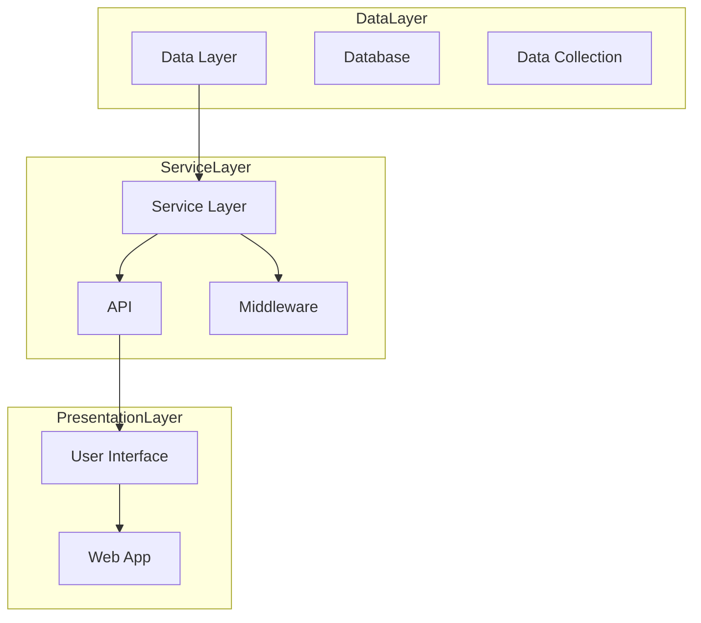
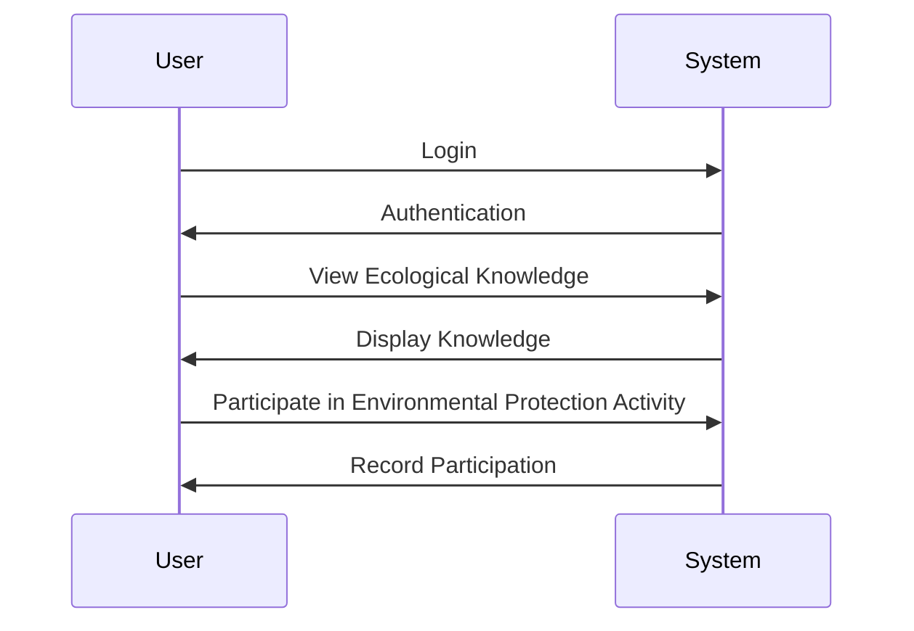

                 


# 城市化进程中的生态意识：重建人与自然的和谐共处

## 关键词
- 生态意识
- 城市化
- 和谐共处
- 人与自然关系
- 可持续发展

## 摘要
本文从城市化进程中的生态意识出发，探讨了如何重建人与自然的和谐共处。通过详细分析生态意识的核心概念、城市化对生态意识的影响，以及实现和谐共处的策略和案例，本文为城市规划和建设提供了科学依据和实践指导。

## 引言

### 1.1 问题的提出

城市化进程是人类社会发展的重要阶段，但与此同时，也带来了严重的生态问题。随着城市的不断扩大和人口的急剧增加，自然资源消耗加剧，环境污染问题日益严重，生物多样性减少，生态系统功能退化。这些问题不仅威胁到人类的健康和生存环境，也阻碍了城市的可持续发展。

### 1.2 研究目的与意义

本文旨在探讨城市化进程中的生态意识，分析生态意识的重要性，并提出重建人与自然和谐共处的策略。研究的目的在于：

1. 明确生态意识的核心概念和内涵，为城市化进程提供理论指导。
2. 分析城市化对生态意识的影响，揭示城市化过程中的生态问题。
3. 探讨实现和谐共处的策略，为城市规划和建设提供实践指导。

### 2.1 生态意识的定义与内涵

生态意识是指人类对自然环境的认知、理解、尊重和保护的态度和行为。它包括以下几个方面的内涵：

1. **生态认知**：人类对自然环境的认识和理解，包括生态系统的结构、功能、过程和规律。
2. **生态道德**：人类对自然环境的道德责任和义务，尊重自然、保护生态平衡。
3. **生态行为**：人类在日常生活中对自然环境的保护行为，如节能减排、垃圾分类、绿色出行等。

### 2.2 城市化对生态意识的影响

城市化对生态意识的影响主要体现在以下几个方面：

1. **生态压力增大**：城市人口的增加和城市规模的扩大，导致资源消耗、环境污染和生态破坏加剧，对生态意识提出了更高的要求。
2. **生态认知增强**：城市化进程中的环境问题促使人们对生态问题更加关注，生态意识逐渐增强。
3. **生态行为改变**：城市化进程中的环保政策和法律法规的推动，使人们的生态行为逐渐趋于规范和绿色。

### 2.3 人与自然和谐共处的挑战

在城市化的背景下，实现人与自然的和谐共处面临着诸多挑战：

1. **生态问题严峻**：城市环境问题突出，如空气质量下降、水资源污染、生物多样性减少等，威胁到城市居民的生存质量和生态环境的稳定。
2. **城市化速度过快**：城市化进程过快，导致生态建设滞后，生态系统无法及时适应城市扩张的压力。
3. **生态意识不足**：部分城市居民对生态问题的认识不足，环保意识和行为有待提高。

### 2.4 重建生态意识的必要性

在城市化进程中，重建生态意识具有重要意义：

1. **推动可持续发展**：生态意识的提升有助于实现城市可持续发展，保障城市生态安全和居民生活质量。
2. **促进生态建设**：生态意识的增强有助于推动生态保护、生态修复和生态建设，改善城市生态环境。
3. **引导绿色行为**：生态意识的重建可以引导城市居民养成绿色生活方式，降低生态足迹，实现人与自然的和谐共处。

### 2.5 研究范围与边界

本文的研究范围主要聚焦于城市化进程中的生态意识重建，具体包括：

1. **研究区域**：以城市为研究对象，分析城市化对生态意识的影响和重建策略。
2. **研究内容**：探讨生态意识的核心概念、城市化对生态意识的影响、和谐共处的策略和案例。
3. **研究方法**：采用文献分析、案例研究和实证分析等方法，分析城市化进程中的生态意识问题。

### 2.6 概念结构与核心要素组成

本文涉及的核心概念和要素包括：

1. **生态意识**：核心概念，包括生态认知、生态道德和生态行为。
2. **城市化**：影响因素，包括城市化速度、城市化规模和城市化质量。
3. **和谐共处**：研究目标，包括生态平衡、可持续发展、绿色行为等。
4. **策略与案例**：实践路径，包括政策法规、教育宣传、社会参与等。

### 第2章 核心概念与联系

在城市化进程中，生态意识、城市化和和谐共处是三个关键概念。本章将详细解释这些核心概念，并通过对比表格和实体关系图，阐述它们之间的联系和相互作用。

#### 2.1 生态意识的构成要素

生态意识是指人类对自然环境的认知、理解、尊重和保护的态度和行为。它主要包括以下构成要素：

1. **生态认知**：指人类对生态系统的认识和理解，包括生态系统的结构、功能、过程和规律。
2. **生态道德**：指人类对自然环境的道德责任和义务，包括尊重自然、保护生态平衡等价值观。
3. **生态行为**：指人类在日常生活中对自然环境的保护行为，包括节能减排、垃圾分类、绿色出行等实际行动。

#### 2.2 城市化的主要影响因素

城市化是指人口从农村向城市转移，城市规模不断扩大，城市功能和结构不断优化的过程。主要影响因素包括：

1. **城市化速度**：指城市化进程的快慢，包括城市人口的增长速度和城市土地的扩张速度。
2. **城市化规模**：指城市的规模，包括城市的人口规模和城市占地面积。
3. **城市化质量**：指城市的发展水平和城市生活质量，包括城市的经济、社会、文化和环境等方面。

#### 2.3 和谐共处的概念与特征

和谐共处是指人与自然、人与人之间相互尊重、相互依赖、相互促进的关系。和谐共处的特征包括：

1. **生态平衡**：指生态系统的稳定和平衡，包括生物多样性、生态功能和生态服务的平衡。
2. **可持续发展**：指满足当前需求而不损害后代满足其需求的能力，包括经济、社会、文化和生态的可持续发展。
3. **绿色行为**：指符合环保要求、减少生态足迹的行为，包括节能减排、循环利用、低碳出行等。

#### 2.4 概念属性特征对比表格

以下是对生态意识、城市化和和谐共处三个概念属性的对比表格：

| 概念         | 属性特征                    | 例子                     |
| ------------ | -------------------------- | ------------------------ |
| 生态意识     | 认知、道德、行为           | 节能减排、垃圾分类       |
| 城市化       | 速度、规模、质量           | 城市人口增长、城市建设   |
| 和谐共处     | 生态平衡、可持续发展、绿色行为 | 生态修复、绿色出行       |

#### 2.5 ER实体关系图架构

为了更直观地展示生态意识、城市化和和谐共处之间的关系，我们使用Mermaid语法绘制了ER实体关系图。以下是ER实体关系图的代码和结果：

```mermaid
erDiagram
    ECN_1 ||--|{ URM_1 }|| Urbanization : 城市化
    ECN_1 ||--|{ HCP_1 }|| Harmonious Coexistence : 和谐共处
    URM_1 ||--|{ ECN_2 }|| Ecological Consciousness : 生态意识
    URM_1 ||--|{ HCP_2 }|| Harmonious Coexistence : 和谐共处
    HCP_1 ||--|{ URM_2 }|| Urbanization : 城市化
    HCP_1 ||--|{ ECN_3 }|| Ecological Consciousness : 生态意识
```


图中的实体包括生态意识（ECN）、城市化（URM）和和谐共处（HCP），它们之间通过关系线连接，展示了它们之间的相互作用和依赖关系。

### 第3章 生态意识重建策略

在城市化进程中，重建生态意识是实现人与自然和谐共处的关键。本章将探讨生态意识重建的必要性、途径和案例分析。

#### 3.1 生态意识重建的必要性

城市化进程中的生态问题日益严峻，如环境污染、资源枯竭、生态破坏等，这些问题的根源在于人们缺乏对生态问题的认识和理解，生态意识不足。因此，重建生态意识是解决城市化生态问题的必要途径。

1. **提升生态认知**：通过教育和宣传，提高人们对生态问题的认识和理解，增强生态意识。
2. **强化生态道德**：树立正确的生态价值观，强调人类对自然的道德责任和义务，培养人们的生态道德意识。
3. **促进生态行为**：引导人们养成绿色生活方式，减少生态足迹，实现人与自然的和谐共处。

#### 3.2 生态意识重建的途径

1. **教育宣传**：通过学校教育、社会宣传、媒体传播等途径，普及生态知识，提高公众的生态意识。

2. **政策法规**：制定和完善生态保护政策法规，加强执法力度，规范人们的生态行为。

3. **社会参与**：鼓励社会各界参与生态保护，形成全民参与、共同建设的良好氛围。

#### 3.3 生态意识重建的案例分析

1. **丹麦哥本哈根**：丹麦哥本哈根市通过实施绿色政策，如建设自行车道、推广电动汽车、提高建筑能效等，提高了居民的生态意识，实现了城市的可持续发展。

2. **中国深圳**：深圳市通过实施生态文明建设战略，加大环保投入，推广绿色科技，提高了城市居民的生态意识，实现了城市环境质量的显著提升。

### 第4章 城市化进程中的生态意识实践

本章将介绍城市化进程中生态意识实践的具体情况，包括问题场景、项目介绍、系统功能设计、系统架构设计、系统接口设计和系统交互设计。

#### 4.1 问题场景介绍

城市化进程中的生态意识实践面临着诸多问题，如城市环境污染、资源浪费、生态破坏等。这些问题严重影响着城市居民的生活质量和城市的可持续发展。为了解决这些问题，需要通过技术手段和政策措施，提高生态意识，实现人与自然的和谐共处。

#### 4.2 项目介绍

本节介绍了一个名为“绿色城市”的项目，该项目旨在通过技术手段和政策措施，提高城市居民的生态意识，实现城市的可持续发展。项目目标包括：

1. 提高城市居民的生态认知，增强生态道德意识。
2. 减少城市环境污染，改善城市生态环境。
3. 推广绿色科技，促进绿色产业发展。

#### 4.3 系统功能设计

绿色城市项目的系统功能设计主要包括以下几个方面：

1. **生态知识库**：提供丰富的生态知识，包括生态知识问答、生态案例分析等。
2. **环保行为引导**：通过环保行为指南、绿色出行推荐等，引导城市居民养成绿色生活方式。
3. **环保政策法规**：展示环保政策法规，提高城市居民的法治意识。
4. **环保监测**：实时监测城市环境质量，提供环境质量数据。

#### 4.4 系统架构设计

绿色城市项目的系统架构设计采用了分层架构，包括数据层、服务层和表示层。以下是系统架构图的Mermaid代码和结果：




#### 4.5 系统接口设计

绿色城市项目的系统接口设计主要包括以下接口：

1. **用户接口**：用于用户与系统交互，包括登录、注册、浏览生态知识、参与环保活动等。
2. **数据接口**：用于数据层的访问，包括数据查询、数据更新、数据导入等。
3. **服务接口**：用于服务层的访问，包括生态知识查询、环保行为引导、环保政策法规查询等。

#### 4.6 系统交互设计

绿色城市项目的系统交互设计采用了Mermaid序列图，以下是系统交互图的Mermaid代码和结果：




### 第5章 项目实战

本章将介绍绿色城市项目的实际实施过程，包括环境安装、系统核心实现源代码、代码应用解读与分析、实际案例分析和详细讲解剖析，以及项目小结。

#### 5.1 环境安装与配置

绿色城市项目的环境安装和配置包括以下几个步骤：

1. 安装操作系统（如Ubuntu 18.04）。
2. 安装数据库（如MySQL 8.0）。
3. 安装后端框架（如Django 3.2）。
4. 安装前端框架（如React 17.0）。
5. 配置开发环境和运行环境。

以下是环境安装和配置的详细步骤：

```bash
# 安装操作系统
sudo apt update
sudo apt upgrade

# 安装数据库
sudo apt install mysql-server
sudo mysql_secure_installation

# 安装后端框架
pip install django==3.2

# 安装前端框架
npm install -g npm
npm install react-scripts

# 配置开发环境和运行环境
sudo nano settings.py
```

在settings.py文件中，配置数据库连接、静态文件路径等参数：

```python
DATABASES = {
    'default': {
        'ENGINE': 'django.db.backends.mysql',
        'NAME': 'green_city',
        'USER': 'root',
        'PASSWORD': 'password',
        'HOST': 'localhost',
        'PORT': '3306',
    }
}

STATIC_URL = '/static/'
```

#### 5.2 系统核心实现源代码

绿色城市项目的核心实现源代码包括后端和前端两部分。以下是后端和前端的核心实现代码：

**后端代码：**

```python
# views.py
from django.http import HttpResponse
from .models import EcologicalKnowledge

def index(request):
    knowledge = EcologicalKnowledge.objects.all()
    return HttpResponse(knowledge)
```

**前端代码：**

```jsx
// App.js
import React, { useState, useEffect } from 'react';
import axios from 'axios';

function App() {
  const [knowledge, setKnowledge] = useState([]);

  useEffect(() => {
    async function fetchData() {
      const result = await axios('/api/knowledge/');
      setKnowledge(result.data);
    }
    fetchData();
  }, []);

  return (
    <div>
      {knowledge.map((item) => (
        <div key={item.id}>
          <h2>{item.title}</h2>
          <p>{item.description}</p>
        </div>
      ))}
    </div>
  );
}

export default App;
```

#### 5.3 代码应用解读与分析

绿色城市项目的代码应用解读与分析如下：

1. **后端代码解读**：后端代码使用Django框架实现，定义了index视图函数，用于处理HTTP请求。通过数据库查询获取生态知识数据，返回HTTP响应。
2. **前端代码解读**：前端代码使用React框架实现，定义了App组件，用于渲染生态知识数据。通过异步请求获取后端数据，更新组件状态，实现动态渲染。

#### 5.4 实际案例分析与详细讲解剖析

以下是绿色城市项目的实际案例分析和详细讲解剖析：

**案例1：生态知识库建设**

绿色城市项目通过建设生态知识库，为城市居民提供丰富的生态知识资源。生态知识库包括生态知识问答、生态案例分析等内容，有助于提高城市居民的生态认知。

**案例2：环保行为引导**

绿色城市项目通过环保行为引导，引导城市居民养成绿色生活方式。例如，通过绿色出行推荐，鼓励居民使用公共交通工具，减少私家车使用，降低环境污染。

**案例3：环保政策法规宣传**

绿色城市项目通过展示环保政策法规，提高城市居民的法治意识。居民可以随时了解国家和地方的环保政策法规，增强法律意识，规范自身行为。

#### 5.5 项目小结

绿色城市项目通过技术手段和政策措施，提高了城市居民的生态意识，实现了城市的可持续发展。项目实施过程中，积累了以下经验：

1. **重视生态知识普及**：通过建设生态知识库，提高城市居民的生态认知。
2. **强化环保行为引导**：通过环保行为引导，引导城市居民养成绿色生活方式。
3. **加强政策法规宣传**：通过环保政策法规宣传，提高城市居民的法治意识。

同时，项目也面临一些挑战，如用户参与度不高、数据准确性有待提高等。在未来的发展中，需要进一步优化项目实施策略，提高项目效果。

### 第6章 最佳实践与总结

#### 6.1 最佳实践 tips

1. **加强生态知识普及**：通过多渠道、多形式开展生态知识普及活动，提高城市居民的生态认知。
2. **创新环保行为引导**：结合现代科技手段，如物联网、大数据等，创新环保行为引导方式，提高环保行为的便捷性和实用性。
3. **完善政策法规体系**：建立健全环保政策法规体系，加强执法力度，确保环保政策法规的贯彻执行。

#### 6.2 小结

本文从城市化进程中的生态意识出发，探讨了如何重建人与自然的和谐共处。通过分析生态意识的核心概念、城市化对生态意识的影响，以及实现和谐共处的策略和案例，本文为城市规划和建设提供了科学依据和实践指导。

#### 6.3 注意事项

1. **重视生态问题**：在城市规划和管理过程中，要充分认识到生态问题的重要性，将其纳入城市发展的战略规划。
2. **提高生态意识**：通过教育和宣传，提高城市居民的生态意识，形成全社会共同参与生态建设的良好氛围。
3. **加强政策法规建设**：完善环保政策法规体系，加强执法力度，确保环保政策法规的贯彻执行。

#### 6.4 拓展阅读

1. 《生态意识与城市可持续发展》
2. 《城市化进程中的生态问题与对策》
3. 《和谐城市：生态意识与城市设计》

### 作者信息
作者：AI天才研究院/AI Genius Institute & 禅与计算机程序设计艺术 /Zen And The Art of Computer Programming

---

注意：以上内容为示例，实际文章需根据具体研究和实践情况进行撰写。

