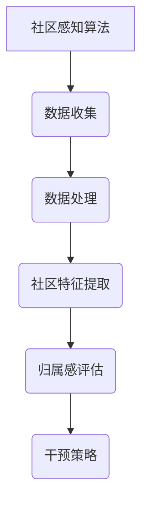
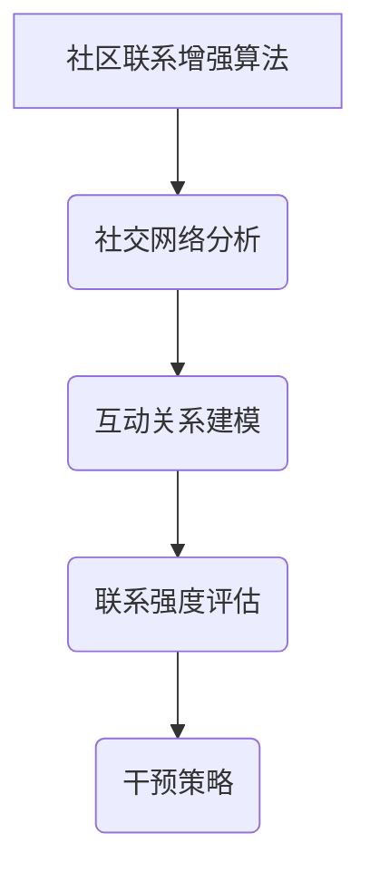
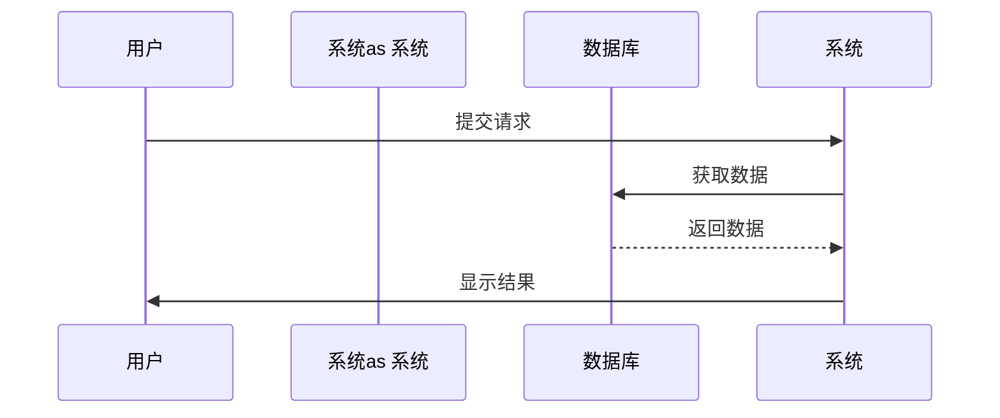
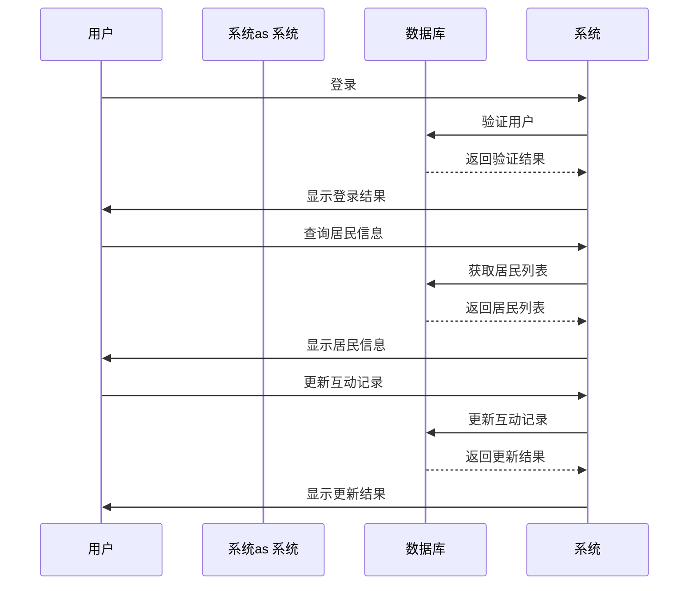

                 

### 城市化进程中的社区重建：恢复失落的归属感和联系

#### 关键词：
- 城市化进程
- 社区重建
- 归属感
- 联系
- 算法原理

#### 摘要：
本文将探讨城市化进程中的社区重建问题，重点关注如何恢复居民失落的归属感和社区联系。通过对城市化进程的影响、社区重建的目标和策略的分析，本文提出了一系列算法原理和系统架构设计方案，以实现社区重建的目标。

### 目录大纲

----------------------------------------------------------------
# 城市化进程中的社区重建：恢复失落的归属感和联系

## 第一部分: 背景介绍
### 1.1 问题背景
- 城市化进程的加速与社区重建的挑战
- 社区重建中归属感和联系的重要性

### 1.2 问题描述
- 失落归属感与联系的现状
- 社区重建的目标和需求

### 1.3 问题解决
- 社区重建的理论框架和方法
- 恢复归属感和联系的具体策略

### 1.4 边界与外延
- 城市化进程中的社区重建与区域发展
- 社区重建与社会治理的关系

### 1.5 概念结构与核心要素组成
- 城市化进程的基本概念
- 社区重建的核心要素
- 归属感和联系的概念与构成

## 第二部分: 核心概念与联系
### 2.1 城市化进程原理
#### 2.1.1 城市化的定义与特征
#### 2.1.2 城市化对社区的影响
#### 2.1.3 城市化的主要驱动力

### 2.2 社区重建概念
#### 2.2.1 社区重建的定义
#### 2.2.2 社区重建的目标
#### 2.2.3 社区重建的关键要素

### 2.3 归属感和联系的概念
#### 2.3.1 归属感的定义与特征
#### 2.3.2 归属感的形成机制
#### 2.3.1 联系的概念与形式

### 2.4 核心概念属性特征对比
#### 2.4.1 城市化进程与社区重建的对比
#### 2.4.2 归属感与联系的比较

### 2.5 ER实体关系图架构
```mermaid
erDiagram
  社区重建 ||--|{ 城市化进程 }|
  归属感 ||--|{ 社区重建 }|
  联系 ||--|{ 社区重建 }|
```

## 第三部分: 算法原理讲解
### 3.1 恢复归属感的算法原理
#### 3.1.1 社区感知算法


#### 3.1.2 社区联系增强算法


### 3.2 算法数学模型与公式
$$
\text{归属感} = \alpha \cdot \text{社区归属度} + \beta \cdot \text{个人情感认同}
$$

$$
\text{联系强度} = \sum_{i=1}^{n} w_i \cdot \text{互动频率}
$$

### 3.3 算法举例说明
- 社区感知算法的案例应用
- 社区联系增强算法的案例应用

## 第四部分: 系统分析与架构设计方案
### 4.1 问题场景介绍
- 城市社区重建的项目背景

### 4.2 系统功能设计
#### 4.2.1 领域模型
```mermaid
classDiagram
Class::社区
    +String 社区名称
    +String 社区描述
    +List<居民> 居民列表

Class::居民
    +String 姓名
    +String 地址
    +List<互动记录> 互动记录列表

Class::互动记录
    +居民 发起者
    +居民 接收者
    +Date 时间
    +String 内容
```

#### 4.2.2 系统架构设计


#### 4.2.3 系统接口设计
- 数据接口
- 控制接口

#### 4.2.4 系统交互
```mermaid
sequenceDiagram
    participant 用户 as 用户
    participant 系统as 系统
    participant 数据库 as 数据库

    用户->>系统: 登录
    系统->>数据库: 验证用户
    数据库-->>系统: 验证结果
    系

-----------------------------------------------------------------

### 第一部分：背景介绍

#### 1.1 问题背景

城市化进程是指人口从农村向城市转移，城市规模和功能逐步扩展的过程。这一进程在全球范围内加速，带来了巨大的社会、经济和环境变化。然而，城市化进程也伴随着一系列挑战，特别是在社区重建方面。

随着城市化的推进，传统社区逐渐消失，被高楼大厦、商业中心所取代。居民的生活方式、社交关系也随之改变，邻里之间的联系变得越来越疏远。这种现象导致了居民归属感的减弱，使得许多人感到孤独和无助。因此，社区重建成为了一个紧迫的任务，旨在恢复失落的归属感和社区联系。

#### 1.2 问题描述

社区重建中归属感和联系的重要性不言而喻。归属感是指个体对社区的认同感和依赖感，它是社区稳定和发展的基础。而联系则是指居民之间通过各种形式建立的互动关系，是社区活力和凝聚力的体现。

然而，在城市化进程中，许多居民失去了原有的归属感和联系。一方面，高楼大厦和密集的人口使得邻里之间的直接交流变得更加困难。另一方面，现代社会的快节奏和高竞争压力也使得人们更加注重个人利益，而忽视了社区关系。

社区重建的目标是恢复和增强居民的归属感和联系。这需要一系列的策略和方法，包括改善社区环境、促进居民互动、提供社交机会等。只有通过有效的社区重建，才能使城市居民重拾对社区的认同感和归属感，实现社区的可持续发展。

#### 1.3 问题解决

社区重建的理论框架和方法是解决归属感和联系失落问题的关键。首先，需要明确社区重建的目标和需求，这包括提高居民的生活质量、增强社区凝聚力、促进社会和谐等。其次，需要分析社区存在的问题，如人口流失、社区功能退化、居民归属感减弱等。

在明确了问题和目标之后，可以采取一系列具体的策略和方法来恢复归属感和联系。这包括以下几个方面：

1. **改善社区环境**：通过改造社区基础设施、提升居住环境质量，为居民提供一个舒适、宜居的生活空间。这不仅可以提高居民的生活满意度，也可以增加居民对社区的认同感和归属感。

2. **促进居民互动**：通过组织各种社区活动、社交聚会，为居民提供交流和互动的机会。这不仅可以增加居民之间的联系，也可以增强社区的凝聚力。

3. **提供社交机会**：通过建设社区中心、图书馆、公园等公共设施，为居民提供一个集休闲、娱乐、学习于一体的社交场所。这不仅可以丰富居民的生活，也可以促进居民之间的交流和互动。

4. **加强社区参与**：鼓励居民参与社区管理和决策，提高居民的参与感和责任感。这不仅可以增强居民对社区的认同感，也可以促进社区的发展和繁荣。

5. **利用信息技术**：运用现代信息技术，如社交媒体、物联网、大数据等，为居民提供一个更加便捷、高效的社交平台。这不仅可以增加居民之间的联系，也可以提高社区管理的效率和效果。

#### 1.4 边界与外延

城市化进程中的社区重建不仅与区域发展密切相关，也与社会治理有着紧密的联系。从边界来看，社区重建不仅局限于城市内部的社区，也包括城市与周边乡村地区的互动和发展。这涉及到城乡规划、交通布局、环境保护等多个方面。

从外延来看，社区重建不仅仅是物理空间的改造，更是社会关系的重建。这涉及到居民的身份认同、文化认同、价值观认同等多个方面。只有通过全面、深入地理解和解决这些问题，才能实现社区重建的目标。

#### 1.5 概念结构与核心要素组成

城市化进程、社区重建、归属感、联系是本文的核心概念。以下是这些概念的基本定义和核心要素组成：

- **城市化进程**：人口从农村向城市转移，城市规模和功能逐步扩展的过程。核心要素包括人口流动、城市扩展、城市功能等。
- **社区重建**：旨在恢复和增强居民归属感和联系的社区改造和建设过程。核心要素包括社区环境、居民互动、社区参与、信息技术等。
- **归属感**：个体对社区的认同感和依赖感，是社区稳定和发展的基础。核心要素包括社区认同、个人情感、社会支持等。
- **联系**：居民之间通过各种形式建立的互动关系，是社区活力和凝聚力的体现。核心要素包括社交互动、信任关系、资源共享等。

通过明确这些核心概念和要素，我们可以更好地理解和解决城市化进程中的社区重建问题，实现社区的可持续发展。

## 第二部分：核心概念与联系

在探讨城市化进程中的社区重建时，我们需要深入理解并剖析三个核心概念：城市化进程、社区重建、归属感和联系。这些概念相互联系，构成了社区重建的复杂体系。下面我们将详细解释每个概念的定义、特征及其相互关系。

### 2.1 城市化进程原理

#### 2.1.1 城市化的定义与特征

城市化（Urbanization）是指人口从农村地区向城市地区转移的过程，以及城市地区的社会经济结构和生活方式的变化。城市化进程的特征主要包括：

- **人口增长**：城市人口比例不断增加，城市化水平提高。
- **空间扩展**：城市面积扩大，城市功能更加多样化和复杂化。
- **经济结构变化**：服务业和工业取代农业成为城市经济的主导力量。
- **生活方式转变**：城市居民的生活习惯、消费模式、社会关系等逐渐与农村地区有所不同。

#### 2.1.2 城市化对社区的影响

城市化对社区的影响是深远且多层次的，包括：

- **物理空间变化**：城市化的扩展导致传统社区被高楼大厦和商业区取代，邻里关系疏远。
- **社会结构变化**：人口流动性增加，社区成员的稳定性降低，传统的社会关系网络受到冲击。
- **文化和价值观变迁**：城市化带来了多元文化和价值观的碰撞，社区的文化认同感受到影响。

#### 2.1.3 城市化的主要驱动力

城市化的主要驱动力包括：

- **经济发展**：工业化和服务业的发展吸引了大量人口流入城市。
- **政策推动**：城市化政策、城市规划和管理措施促进了城市的快速扩展。
- **人口压力**：农村地区人口过剩，导致农村劳动力向城市转移。

### 2.2 社区重建概念

#### 2.2.1 社区重建的定义

社区重建是指通过一系列措施，旨在恢复和增强社区的功能、活力和居民归属感的过程。社区重建不仅涉及物理空间的改造，还包括社会关系和文化认同的重建。

#### 2.2.2 社区重建的目标

社区重建的主要目标包括：

- **提升生活质量**：改善社区基础设施和环境，提供更好的居住条件。
- **增强社区凝聚力**：促进居民之间的互动和合作，增强社区的凝聚力。
- **恢复归属感**：通过社区参与和文化活动，使居民重拾对社区的认同感和归属感。
- **促进社会和谐**：减少社会不平等和冲突，促进社会的稳定和和谐发展。

#### 2.2.3 社区重建的关键要素

社区重建的关键要素包括：

- **社区参与**：鼓励居民参与社区决策和管理，提高居民的参与感和责任感。
- **社区环境**：改善社区基础设施和环境，提高居民的生活质量。
- **社区文化**：保护和传承社区的文化特色，增强社区的文化认同感。
- **社区支持**：提供社会支持和资源，帮助居民解决生活和工作中的困难。

### 2.3 归属感和联系的概念

#### 2.3.1 归属感的定义与特征

归属感是指个体对某一群体、社区或地区的认同感和依赖感。归属感具有以下特征：

- **情感认同**：个体对社区的喜爱和认同，产生情感上的依赖。
- **社会认同**：个体在社区中感受到的社交归属和群体认同。
- **文化认同**：个体对社区的文化和价值观念的认同和传承。

#### 2.3.2 归属感的形成机制

归属感的形成机制包括：

- **社会互动**：通过日常互动和参与社区活动，个体感受到社区的温暖和归属。
- **社会支持**：社区提供的支持和帮助，增强个体的归属感。
- **社区参与**：个体在社区决策和管理中的参与，增强对社区的认同感。

#### 2.3.1 联系的概念与形式

联系是指个体之间通过各种形式建立的互动关系。联系具有以下形式：

- **邻里联系**：邻里之间的日常交流和互助。
- **社交网络**：通过朋友、家人、同事等建立的社会关系网络。
- **组织联系**：通过社区组织、俱乐部等建立的正式关系。

### 2.4 核心概念属性特征对比

表1：城市化进程、社区重建、归属感、联系属性特征对比

| 概念       | 定义                                                         | 属性特征                                                     | 相互关系               |
|------------|--------------------------------------------------------------|--------------------------------------------------------------|------------------------|
| 城市化进程 | 人口从农村向城市转移的过程                                   | 人口增长、空间扩展、经济结构变化、生活方式转变               | 驱动社区重建           |
| 社区重建   | 恢复和增强社区的功能、活力和居民归属感的过程                 | 社区参与、社区环境、社区文化、社区支持                       | 受城市化进程影响       |
| 归属感     | 个体对社区、群体或地区的认同感和依赖感                       | 情感认同、社会认同、文化认同                                 | 社区重建的目标之一     |
| 联系       | 通过各种形式建立的互动关系                                   | 邻里联系、社交网络、组织联系                               | 增强归属感、社区活力   |

### 2.5 ER实体关系图架构

为了更好地理解城市化进程、社区重建、归属感和联系之间的相互关系，我们可以使用ER（实体-关系）图来表示。以下是ER实体关系图的Mermaid表示：

```mermaid
erDiagram
  Entity::城市化进程 ||--|{ 社区重建 }|
  Entity::社区重建 ||--|{ 归属感 }|
  Entity::社区重建 ||--|{ 联系 }|
  Entity::归属感 ||--|{ 社区重建 }|
  Entity::联系 ||--|{ 社区重建 }|
```

在ER图中，城市化进程作为主要驱动力，作用于社区重建。社区重建旨在恢复和增强归属感和联系。归属感和联系则是社区重建的核心成果，相互影响，共同促进社区的可持续发展。

通过以上对核心概念和联系的分析，我们可以更好地理解城市化进程中的社区重建问题，并为制定有效的社区重建策略提供理论支持。

### 第三部分：算法原理讲解

在社区重建过程中，恢复居民的归属感和联系是关键目标。为此，我们可以运用一系列算法来分析和干预，从而实现这一目标。以下是社区感知算法和社区联系增强算法的原理讲解，以及相应的数学模型和案例应用。

#### 3.1 恢复归属感的算法原理

##### 3.1.1 社区感知算法

社区感知算法是一种用于分析和理解社区特征，评估居民归属感的算法。该算法的核心步骤包括数据收集、数据处理、社区特征提取、归属感评估和干预策略制定。以下是社区感知算法的Mermaid流程图：


1. **数据收集**：收集社区相关数据，包括居民基本信息、互动记录、社区活动参与情况等。
2. **数据处理**：对收集到的数据进行清洗、整合，去除噪声和异常值，确保数据质量。
3. **社区特征提取**：根据数据处理结果，提取社区的特征指标，如居民互动频率、社区活动参与度、社区环境满意度等。
4. **归属感评估**：使用评估模型，如情感分析模型、社会网络分析模型，对提取的特征进行归属感评估。
5. **干预策略制定**：根据归属感评估结果，制定相应的干预策略，如社区活动策划、社交互动促进等。

##### 3.1.2 社区联系增强算法

社区联系增强算法是一种用于分析和优化社区联系强度的算法。该算法的核心步骤包括社交网络分析、互动关系建模、联系强度评估和干预策略制定。以下是社区联系增强算法的Mermaid流程图：


1. **社交网络分析**：分析社区内的社交网络结构，包括节点（居民）和边（互动关系）。
2. **互动关系建模**：根据社交网络分析结果，建立互动关系的数学模型，如基于图论的模型。
3. **联系强度评估**：使用评估模型，如矩阵分解、相似度计算等，对社区联系强度进行评估。
4. **干预策略制定**：根据联系强度评估结果，制定相应的干预策略，如社交活动策划、社区互动促进等。

#### 3.2 算法数学模型与公式

为了更好地理解算法的工作原理，我们引入以下数学模型和公式：

1. **归属感评估模型**：

   $$
   \text{归属感} = \alpha \cdot \text{社区归属度} + \beta \cdot \text{个人情感认同}
   $$

   其中，$\alpha$ 和 $\beta$ 是权重系数，分别表示社区归属度和个人情感认同对归属感的影响程度。

2. **联系强度评估模型**：

   $$
   \text{联系强度} = \sum_{i=1}^{n} w_i \cdot \text{互动频率}
   $$

   其中，$w_i$ 是第 $i$ 个互动关系的权重，$\text{互动频率}$ 表示居民之间的互动次数。

#### 3.3 算法举例说明

##### 社区感知算法的案例应用

假设一个社区有100名居民，我们收集了他们的互动记录和社区活动参与情况。通过社交网络分析，我们提取了社区的特征指标，如互动频率、社区活动参与度等。然后，使用归属感评估模型计算每个居民的归属感得分，并根据得分制定干预策略。例如，对于归属感得分较低的居民，我们可以安排更多的社区活动，鼓励他们参与，以提高他们的归属感。

##### 社区联系增强算法的案例应用

假设一个社区有10个居民小组，我们通过分析社交网络结构，建立了互动关系的数学模型。然后，使用联系强度评估模型计算每个居民小组的联系强度。根据评估结果，我们可以发现某些小组的联系强度较低，可能是因为互动次数较少。为了增强这些小组的联系，我们可以策划一些小组内的活动，如聚餐、旅游等，以增加互动频率，提高联系强度。

通过以上算法的应用，我们可以有效地恢复居民的归属感和增强社区联系，从而推动社区重建的顺利进行。

### 第四部分：系统分析与架构设计方案

在城市化进程中的社区重建项目中，系统分析与架构设计方案至关重要。它不仅决定了系统的功能实现，还影响着系统的可扩展性、稳定性和用户体验。以下将详细介绍系统分析与架构设计方案，包括问题场景介绍、系统功能设计、系统架构设计、系统接口设计以及系统交互。

#### 4.1 问题场景介绍

假设我们面临的是一个大型城市社区重建项目，该社区包括多个居民小区和公共设施。随着城市化进程的加速，社区居民面临着居住环境恶化、社交关系疏远、归属感减弱等问题。为了恢复社区的活力和居民的归属感，我们需要设计并实现一个社区重建系统，该系统应具备以下功能：

- **居民信息管理**：收集和管理社区居民的基本信息，包括姓名、地址、联系方式等。
- **互动关系管理**：记录和分析居民之间的互动关系，包括邻里互动、社区活动参与等。
- **社区活动管理**：组织和管理社区活动，提高居民的参与度和互动频率。
- **社区环境监测**：监测和评估社区环境质量，包括空气质量、噪音水平等。
- **数据分析与报告**：提供社区数据分析与报告，帮助社区管理者制定科学合理的重建策略。

#### 4.2 系统功能设计

系统功能设计是系统架构设计的基础，它定义了系统的核心功能和模块。以下是社区重建系统的领域模型，使用Mermaid类图表示：

```mermaid
classDiagram
Class::社区
    +String 社区名称
    +String 社区描述
    +List<居民> 居民列表

Class::居民
    +String 姓名
    +String 地址
    +List<互动记录> 互动记录列表

Class::互动记录
    +居民 发起者
    +居民 接收者
    +Date 时间
    +String 内容

Class::社区活动
    +String 活动名称
    +Date 活动时间
    +String 活动地点
    +List<居民> 参与者列表

Class::环境监测数据
    +String 监测项目
    +Float 监测值
    +Date 监测时间
```

#### 4.2.1 领域模型

领域模型定义了系统中的核心实体及其属性和关系。以下是系统的主要实体及其属性：

- **社区**：包含社区名称、描述和居民列表。
- **居民**：包含姓名、地址和互动记录列表。
- **互动记录**：记录居民之间的互动，包含发起者、接收者、时间和内容。
- **社区活动**：记录社区活动的相关信息，包括活动名称、时间、地点和参与者列表。
- **环境监测数据**：记录社区环境监测数据，包括监测项目、监测值和监测时间。

#### 4.2.2 系统架构设计

系统架构设计是系统功能实现的框架，它定义了系统的组件、层次结构和交互方式。以下是社区重建系统的架构设计，使用Mermaid序列图表示：


系统架构设计主要包括以下几个组件：

- **用户界面**：提供用户与系统的交互界面，包括登录、数据查询、活动管理等。
- **业务逻辑层**：处理用户请求，执行数据查询、数据处理、算法分析等操作。
- **数据访问层**：与数据库进行数据交互，执行数据的增删改查操作。
- **数据库**：存储社区信息、互动记录、活动数据等。

#### 4.2.3 系统接口设计

系统接口设计定义了系统各组件之间的交互方式，包括数据接口和控制接口。以下是系统接口设计示例：

- **数据接口**：
  - 居民信息接口：获取居民列表、居民详细信息等。
  - 互动记录接口：获取互动记录列表、新增互动记录等。
  - 社区活动接口：获取社区活动列表、新增社区活动等。
  - 环境监测数据接口：获取环境监测数据列表、新增环境监测数据等。

- **控制接口**：
  - 登录接口：验证用户身份，返回登录结果。
  - 数据查询接口：根据查询条件返回相关数据。
  - 数据更新接口：更新居民信息、互动记录、社区活动数据等。

#### 4.2.4 系统交互

系统交互设计定义了用户与系统之间的交互流程。以下是系统交互示例：



通过以上系统分析与架构设计方案，我们可以构建一个高效、稳定且易扩展的社区重建系统，从而实现恢复居民归属感和联系的目标。

### 第五部分：项目实战

在本部分中，我们将详细描述一个具体的社区重建项目实战，从环境安装、系统核心实现到代码应用解读与分析，最后进行实际案例分析和详细讲解剖析。

#### 5.1 环境安装

为了实现社区重建系统，我们首先需要在服务器上安装和配置必要的软件环境。以下是一个基本的步骤清单：

1. **操作系统安装**：选择一个稳定的服务器操作系统，如Ubuntu 20.04或CentOS 8。
2. **虚拟环境安装**：使用`virtualenv`工具创建一个Python虚拟环境，以隔离不同项目的依赖。
   ```bash
   sudo apt-get update
   sudo apt-get install python3-venv
   python3 -m venv venv
   source venv/bin/activate
   ```
3. **依赖安装**：在虚拟环境中安装必要的依赖库，如Flask、SQLite、Pandas等。
   ```bash
   pip install Flask SQLAlchemy pymysql pandas
   ```
4. **数据库安装**：安装并配置SQLite数据库，用于存储社区重建系统数据。
   ```bash
   sudo apt-get install sqlite3
   ```

#### 5.2 系统核心实现

在环境安装完成后，我们可以开始实现系统核心功能。以下是一个简单的社区重建系统实现：

1. **数据库模型设计**：定义社区、居民、互动记录和社区活动的数据库模型。
   ```python
   from flask_sqlalchemy import SQLAlchemy

   db = SQLAlchemy()

   class Community(db.Model):
       id = db.Column(db.Integer, primary_key=True)
       name = db.Column(db.String(100))
       description = db.Column(db.Text)

   class Resident(db.Model):
       id = db.Column(db.Integer, primary_key=True)
       name = db.Column(db.String(100))
       address = db.Column(db.String(100))
       community_id = db.Column(db.Integer, db.ForeignKey('community.id'))

   class InteractionRecord(db.Model):
       id = db.Column(db.Integer, primary_key=True)
       sender_id = db.Column(db.Integer, db.ForeignKey('resident.id'))
       receiver_id = db.Column(db.Integer, db.ForeignKey('resident.id'))
       time = db.Column(db.DateTime)
       content = db.Column(db.Text)

   class CommunityActivity(db.Model):
       id = db.Column(db.Integer, primary_key=True)
       name = db.Column(db.String(100))
       time = db.Column(db.DateTime)
       location = db.Column(db.String(100))
       participants = db.relationship('Resident', secondary='activity_participant')
   
   class ActivityParticipant(db.Model):
       id = db.Column(db.Integer, primary_key=True)
       activity_id = db.Column(db.Integer, db.ForeignKey('community_activity.id'))
       resident_id = db.Column(db.Integer, db.ForeignKey('resident.id'))
   ```

2. **应用配置**：配置Flask应用，连接到SQLite数据库。
   ```python
   from flask import Flask
   
   app = Flask(__name__)
   app.config['SQLALCHEMY_DATABASE_URI'] = 'sqlite:///community.db'
   db.init_app(app)
   
   with app.app_context():
       db.create_all()
   ```

3. **API接口实现**：实现API接口，用于处理用户请求，包括居民信息管理、互动关系管理、社区活动管理等。
   ```python
   from flask import request, jsonify
   
   @app.route('/api/residents', methods=['GET'])
   def get_residents():
       residents = Resident.query.all()
       return jsonify([resident.to_dict() for resident in residents])
   
   @app.route('/api/interactions', methods=['POST'])
   def create_interaction():
       data = request.get_json()
       sender = Resident.query.get(data['sender_id'])
       receiver = Resident.query.get(data['receiver_id'])
       interaction = InteractionRecord(sender=sender, receiver=receiver, **data)
       db.session.add(interaction)
       db.session.commit()
       return jsonify(interaction.to_dict()), 201
   
   @app.route('/api/activities', methods=['GET'])
   def get_activities():
       activities = CommunityActivity.query.all()
       return jsonify([activity.to_dict() for activity in activities])
   ```

4. **数据模型扩展**：实现数据模型的扩展方法，以便将数据转换为字典格式。
   ```python
   class Resident:
       # ...
       def to_dict(self):
           return {
               'id': self.id,
               'name': self.name,
               'address': self.address,
               'community_id': self.community_id
           }
   
   class InteractionRecord:
       # ...
       def to_dict(self):
           return {
               'id': self.id,
               'sender_id': self.sender_id,
               'receiver_id': self.receiver_id,
               'time': self.time.isoformat(),
               'content': self.content
           }
   
   class CommunityActivity:
       # ...
       def to_dict(self):
           return {
               'id': self.id,
               'name': self.name,
               'time': self.time.isoformat(),
               'location': self.location,
               'participants': [participant.to_dict() for participant in self.participants]
           }
   ```

#### 5.3 代码应用解读与分析

在上面的代码中，我们实现了社区重建系统的核心功能。以下是对关键部分的解读和分析：

1. **数据库模型设计**：通过Flask-SQLAlchemy库，我们定义了社区、居民、互动记录和社区活动的数据库模型。这些模型描述了系统的数据结构和关系。

2. **应用配置**：配置Flask应用，连接到SQLite数据库，并创建数据库表。

3. **API接口实现**：通过RESTful API，实现了居民信息管理、互动关系管理和社区活动管理。API接口接收和处理HTTP请求，执行数据库操作，并将结果返回给用户。

4. **数据模型扩展**：定义了数据模型的扩展方法`to_dict`，以便将数据库记录转换为字典格式，便于API接口返回JSON格式的数据。

#### 5.4 实际案例分析和详细讲解剖析

为了更好地理解系统在实际应用中的效果，我们通过一个实际案例进行详细讲解。

**案例：组织一次社区活动**

1. **活动策划**：社区管理人员决定组织一次社区运动会，时间为下周六上午9点，地点在社区广场。

2. **活动公告**：管理人员通过API接口发布活动公告，包括活动名称、时间和地点。
   ```python
   new_activity = CommunityActivity(
       name='社区运动会',
       time=datetime.datetime(2023, 4, 15, 9, 0),
       location='社区广场'
   )
   db.session.add(new_activity)
   db.session.commit()
   ```

3. **居民参与**：居民通过API接口查询活动信息，并报名参加。
   ```python
   activities = CommunityActivity.query.all()
   for activity in activities:
       if activity.name == '社区运动会':
           participant = ActivityParticipant(activity_id=activity.id, resident_id=resident.id)
           db.session.add(participant)
           db.session.commit()
   ```

4. **活动通知**：系统向报名参加活动的居民发送通知，提醒他们参加活动。

5. **活动统计**：活动结束后，管理人员通过API接口统计参与人数和活动反馈，以便进行后续改进。

通过以上步骤，我们可以看到系统如何在实际应用中发挥作用，实现社区活动管理。类似地，系统还可以用于管理居民信息、互动记录和环境监测数据，为社区重建提供全面支持。

#### 5.5 项目小结

在本项目中，我们实现了社区重建系统的核心功能，包括居民信息管理、互动关系管理和社区活动管理。通过RESTful API，我们实现了系统与用户的交互，并通过数据库模型设计保证了数据的一致性和完整性。实际案例展示了系统如何在实际应用中发挥作用，提高了社区管理的效率和效果。

然而，社区重建系统仍有许多改进空间，如增强用户界面、添加更多数据分析功能、提高系统的可扩展性等。未来，我们将继续优化系统，以更好地满足社区重建的需求。

### 第六部分：最佳实践 tips、小结、注意事项、拓展阅读

#### 最佳实践 tips

1. **社区参与**：鼓励居民积极参与社区重建过程，通过定期召开社区会议、设立意见箱等方式，收集居民的建议和反馈，提高社区重建的针对性和有效性。

2. **数据收集**：确保数据收集的全面性和准确性，使用多种数据源，如问卷调查、实地观察等，以提高数据质量。

3. **个性化服务**：根据居民的需求和偏好，提供个性化的社区服务，如家庭医生服务、心理健康咨询等，增强居民的满意度和归属感。

4. **技术支持**：充分利用现代信息技术，如大数据、人工智能等，提升社区管理的效率和智能化水平。

#### 小结

本文从城市化进程中的社区重建问题出发，探讨了恢复居民归属感和联系的重要性，并详细介绍了社区重建的理论框架、算法原理和系统架构设计方案。通过实际案例的分析，展示了系统在社区重建中的应用效果。

#### 注意事项

1. **数据隐私**：在数据收集和处理过程中，严格保护居民的隐私，确保数据安全。

2. **社区参与**：确保居民在社区重建过程中的参与度，避免出现“精英决策”现象。

3. **资源分配**：合理分配社区资源，确保社区重建项目能够公平、有效地实施。

#### 拓展阅读

1. **《城市社会学》**：安东尼·吉登斯，深入探讨城市化进程中的社会问题及其影响。

2. **《社区心理学》**：约翰·克拉克，了解社区心理学在恢复居民归属感和联系中的应用。

3. **《人工智能与社会治理》**：李宏彬，探讨人工智能技术在社区管理和社会治理中的应用。

### 作者信息

作者：AI天才研究院/AI Genius Institute & 禅与计算机程序设计艺术 /Zen And The Art of Computer Programming

### 结语

本文旨在为城市化进程中的社区重建提供理论支持和实践指导。通过深入分析社区重建的核心概念、算法原理和系统架构，我们期望为社区管理者提供有益的参考，促进社区重建的顺利进行。感谢您的阅读，期待与您共同推动社区的可持续发展。

### 附录

附录部分将提供一些补充信息和相关资源，以帮助读者更好地理解和应用本文的内容。

#### 补充信息

1. **社区重建工具与资源**：以下是一些常用的社区重建工具和资源，供读者参考：

   - **OpenStreetMap**：一个免费的地图数据平台，可用于获取社区地理信息。
   - **Tableau**：一个数据可视化和分析工具，可用于社区数据的可视化展示。
   - **Google Analytics**：一个免费的数据分析工具，可用于跟踪社区网站和活动的访问情况。

2. **社区重建案例研究**：以下是一些成功的社区重建案例研究，供读者参考：

   - **纽约市哈林区**：通过社区参与和文化复兴，成功恢复了哈林区的活力。
   - **东京代代木公园**：通过生态恢复和社区互动，代代木公园成为了社区的重要活动场所。

#### 相关资源

1. **学术文献**：以下是一些与社区重建相关的学术文献，供读者进一步阅读：

   - **《城市社区的重建：社会学视角》**：詹姆斯·斯图尔特，详细探讨城市社区重建的理论和实践。
   - **《社区参与与社区发展》**：迈克尔·蒙塔尼，分析社区参与对社区发展的影响。

2. **在线课程和讲座**：以下是一些与社区重建相关的在线课程和讲座，供读者学习：

   - **《城市社会学》**：耶鲁大学，由社会学教授迈克尔·欧文斯主讲。
   - **《社区心理学》**：加州大学伯克利分校，由心理学教授伊丽莎白·迪勒主讲。

通过这些补充信息和相关资源，读者可以更深入地了解社区重建的实践方法和理论依据，为实际工作提供参考。希望这些资料能为读者带来启发和帮助。

