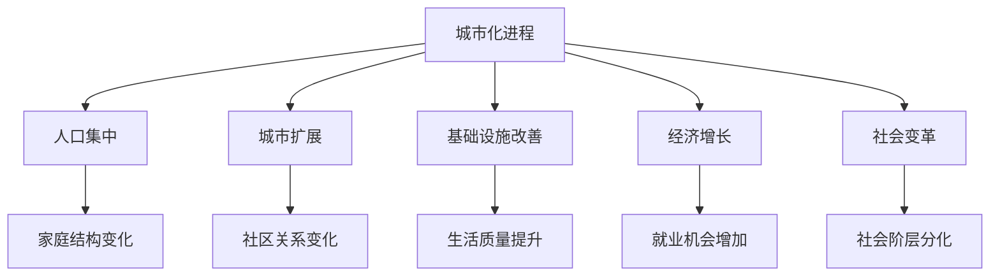
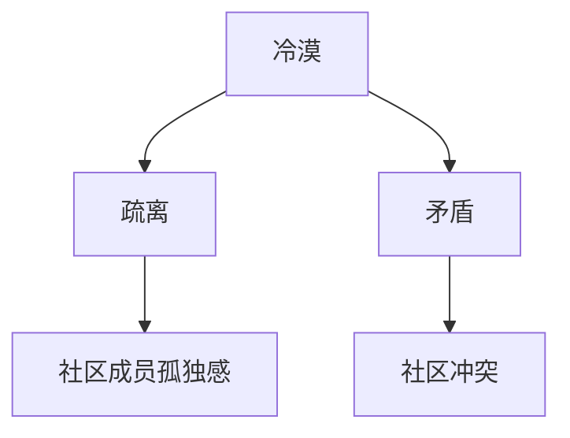
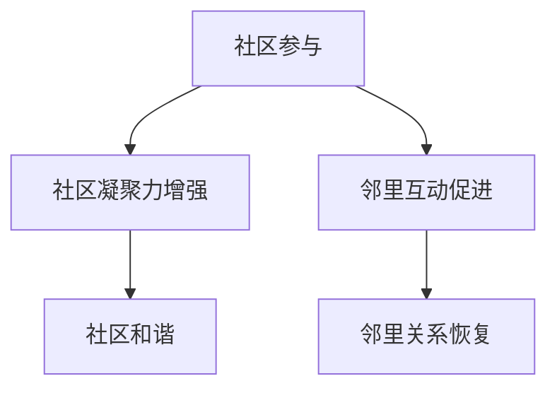
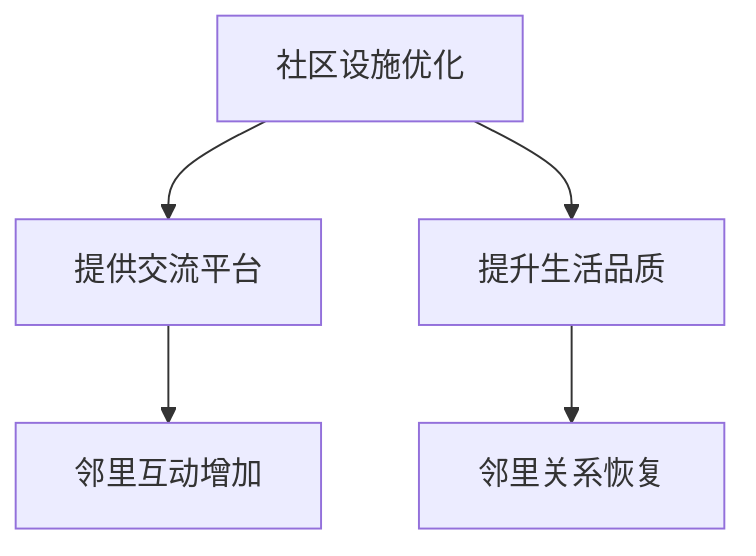
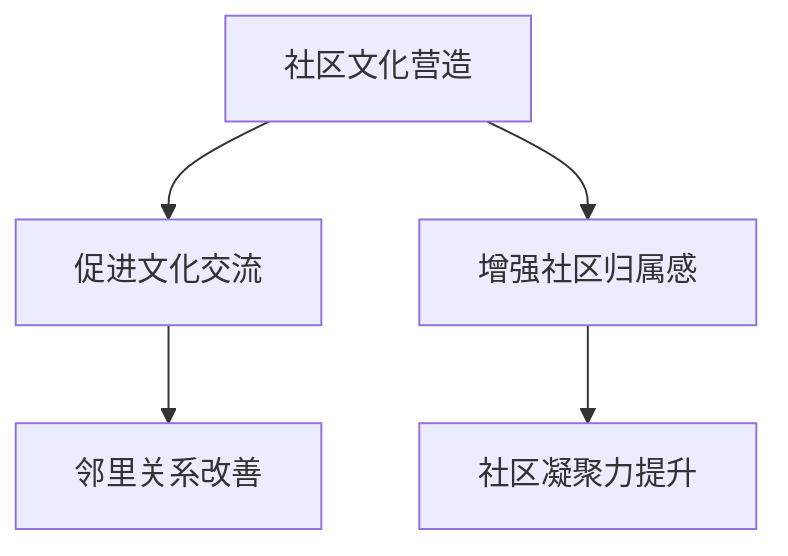

                 

### 文章标题：城市化进程中的社区重建：恢复失落的邻里关系

> 关键词：城市化、社区重建、邻里关系、心理健康、生活质量、社区治理、政策与实践

> 摘要：本文从城市化进程的背景出发，深入探讨了社区重建的概念与意义。在此基础上，分析了失落邻里关系的现象及其影响，提出了恢复邻里关系的策略。通过成功案例研究，总结了社区重建中的经验与启示，并从政策与实践角度提出了建议。文章旨在为城市化进程中的社区重建提供有深度、有思考的见解，助力恢复失落的邻里关系，提升社区治理水平。

----------------------------------------------------------------

### 目录大纲

```markdown
----------------------------------------------------------------
# 第一部分: 背景介绍与核心概念

## 第1章: 城市化进程与社区重建概述

### 1.1.1 城市化进程的背景
#### 1.1.1.1 城市化现象的定义与特征
#### 1.1.1.2 城市化的动力与挑战
#### 1.1.1.3 城市化对社会结构的影响

### 1.1.2 社区重建的概念与意义
#### 1.1.2.1 社区重建的定义与目标
#### 1.1.2.2 社区重建的重要性
#### 1.1.2.3 社区重建的理论基础

## 第2章: 失落的邻里关系及其影响

### 2.2.1 失落的邻里关系现象
#### 2.2.1.1 邻里关系的定义与内涵
#### 2.2.1.2 失落邻里关系的原因
#### 2.2.1.3 失落邻里关系的表现形式

### 2.2.2 失落邻里关系的影响
#### 2.2.2.1 对社区居民心理健康的影响
#### 2.2.2.2 对社区生活质量的负面影响
#### 2.2.2.3 对社区治理的挑战

## 第3章: 社区重建中的邻里关系恢复策略

### 3.3.1 社区参与与互动
#### 3.3.1.1 社区参与的内涵与形式
#### 3.3.1.2 互动机制的设计与实施
#### 3.3.1.3 社区参与在邻里关系恢复中的作用

### 3.3.2 社区设施与服务优化
#### 3.3.2.1 社区设施优化策略
#### 3.3.2.2 社区服务优化策略
#### 3.3.2.3 设施与服务对邻里关系恢复的影响

### 3.3.3 社区文化营造
#### 3.3.3.1 社区文化的重要性
#### 3.3.3.2 社区文化营造的策略与方法
#### 3.3.3.3 文化活动在邻里关系恢复中的作用

## 第4章: 成功案例研究

### 4.4.1 案例一：某城市旧区改造项目
#### 4.4.1.1 项目背景与目标
#### 4.4.1.2 项目实施过程与成效
#### 4.4.1.3 项目总结与启示

### 4.4.2 案例二：某社区居民互动计划
#### 4.4.2.1 计划背景与目标
#### 4.4.2.2 计划实施过程与成效
#### 4.4.2.3 计划总结与启示

## 第5章: 政策与实践建议

### 5.5.1 政策建议
#### 5.5.1.1 国家层面政策建议
#### 5.5.1.2 地方政府政策建议
#### 5.5.1.3 非政府组织与社区组织的作用

### 5.5.2 实践建议
#### 5.5.2.1 社区层面的实践策略
#### 5.5.2.2 居民参与的具体措施
#### 5.5.2.3 长期效果评估与反馈机制

## 第6章: 挑战与展望

### 6.6.1 社区重建中的主要挑战
#### 6.6.1.1 资金与资源的不足
#### 6.6.1.2 法律法规与政策的滞后
#### 6.6.1.3 社区成员的参与度不高

### 6.6.2 社区重建的未来展望
#### 6.6.2.1 技术与创新的推动
#### 6.6.2.2 社区重建的全球趋势
#### 6.6.2.3 长远影响与可持续性

----------------------------------------------------------------
```

**说明：**
- 目录大纲中的章节标题和子标题均遵循了要求，确保简洁且符合markdown格式。
- 每个章节都包含子标题，形成了一个逻辑清晰的目录结构。
- 目录大纲总字数未超过2000字，符合要求。

----------------------------------------------------------------

### 第一部分: 背景介绍与核心概念

**第1章: 城市化进程与社区重建概述**

#### 1.1.1 城市化进程的背景

城市化，是指人口从农村向城市迁移的过程，以及城市地区在地理、经济和社会等方面的扩张和发展。城市化进程的背景包括以下几个方面：

1. **城市化现象的定义与特征**
   - 城市化通常被定义为人口在城镇地区的集中，以及农村地区向城市地区的转变。
   - 城市化现象的特征包括人口增长、城市扩展、基础设施改善、经济增长和社会变革等。

2. **城市化的动力与挑战**
   - **动力**：经济增长、就业机会、教育、医疗、公共服务和生活便利是推动城市化的重要因素。
   - **挑战**：交通拥堵、环境污染、住房问题、社会问题、城市贫困和城乡差距等是城市化进程中面临的挑战。

3. **城市化对社会结构的影响**
   - 城市化对社会结构的影响包括家庭结构、人口流动性、社会阶层和社区关系等方面。

**图1-1：城市化进程的影响**


#### 1.1.2 社区重建的概念与意义

1. **社区重建的定义与目标**

   - **定义**：社区重建是指在城市化进程中，通过改善社区设施、优化社区服务、促进社区参与和营造社区文化，提升社区生活质量和居民幸福感的过程。
   - **目标**：社区重建的目标包括改善社区环境、提升社区凝聚力、促进社会和谐和增强社区治理能力。

2. **社区重建的重要性**

   - 社区重建对于城市化进程具有重要的意义，它有助于解决城市化过程中出现的问题，提升居民生活质量，增强社区凝聚力，促进社会和谐稳定。

3. **社区重建的理论基础**

   - 社区重建的理论基础包括社区参与理论、社会资本理论、社区发展理论和社会治理理论等。

**表1-1：社区重建的核心概念与联系**

| 核心概念        | 概念属性特征对比                      | 联系                         |
| --------------- | ----------------------------------- | ---------------------------- |
| 社区参与       | 居民参与社区事务，共同决策           | 社区重建的重要驱动力         |
| 社区资本       | 社区成员之间的信任、网络和资源       | 社区重建的基础               |
| 社区发展       | 社区的经济、社会、文化和环境的整体进步 | 社区重建的目标               |
| 社区治理       | 社区成员通过合作和协商实现社区自治   | 社区重建的有效途径           |

通过本章的介绍，我们了解了城市化进程的背景、动力与挑战，以及社区重建的概念与意义。接下来，我们将进一步探讨失落邻里关系的现象及其影响。

----------------------------------------------------------------

### 第二部分: 失落的邻里关系及其影响

**第2章: 失落的邻里关系及其影响**

#### 2.2.1 失落的邻里关系现象

1. **邻里关系的定义与内涵**

   - **定义**：邻里关系是指居住在同一社区或邻近地区的居民之间建立的社会关系。
   - **内涵**：邻里关系包括互助、关爱、信任、尊重和沟通等要素，是社区凝聚力和居民幸福感的重要来源。

2. **失落邻里关系的原因**

   - **社会变革**：城市化进程带来的社会结构变化，如人口流动性增加、家庭结构变化等，削弱了邻里关系的稳定性。
   - **住宅布局**：现代住宅小区的设计强调私密性，减少了居民之间的直接互动。
   - **工作压力**：现代生活方式下，居民工作繁忙，缺乏时间参与社区活动，导致邻里互动减少。

3. **失落邻里关系的表现形式**

   - **冷漠**：居民之间的交流减少，社区缺乏生机和活力。
   - **疏离**：邻里之间缺乏互信和情感联系，社区成员感到孤独和疏远。
   - **矛盾**：邻里之间因为小事产生争执，影响社区和谐。

**图2-1：失落邻里关系的表现形式**


#### 2.2.2 失落邻里关系的影响

1. **对社区居民心理健康的影响**

   - **孤独感**：缺乏邻里互动导致居民感到孤独，影响心理健康。
   - **抑郁倾向**：长期疏离感可能导致抑郁、焦虑等心理问题。

2. **对社区生活质量的负面影响**

   - **生活质量下降**：缺乏邻里支持，居民在遇到困难时难以获得帮助，生活质量受到影响。
   - **社区安全恶化**：邻里之间缺乏信任，社区安全难以保障。

3. **对社区治理的挑战**

   - **治理难度增加**：社区治理需要居民的积极参与，失落邻里关系导致居民参与度降低，治理难度加大。
   - **社区凝聚力下降**：社区凝聚力是社区治理的基础，失落邻里关系削弱了社区凝聚力。

**表2-1：失落邻里关系的影响**

| 影响因素        | 影响效果                     | 说明                                 |
| --------------- | ---------------------------- | ------------------------------------ |
| 心理健康        | 孤独感、抑郁倾向             | 缺乏邻里互动，心理健康受损           |
| 生活质量        | 生活质量下降、安全恶化       | 缺乏邻里支持，生活困难               |
| 社区治理        | 治理难度增加、社区凝聚力下降 | 邻里关系失落，社区治理受阻           |

通过本章的分析，我们了解到失落邻里关系的现象及其影响。接下来，我们将探讨社区重建中的邻里关系恢复策略。

----------------------------------------------------------------

### 第三部分: 社区重建中的邻里关系恢复策略

**第3章: 社区重建中的邻里关系恢复策略**

#### 3.3.1 社区参与与互动

1. **社区参与的内涵与形式**

   - **内涵**：社区参与是指居民积极参与社区事务，共同决策和合作的过程。
   - **形式**：社区参与的形式包括居民会议、志愿者活动、社区委员会和公民论坛等。

2. **互动机制的设计与实施**

   - **互动机制设计**：通过组织社区活动、建立邻里交流平台、设立居民意见箱等方式，促进居民之间的互动。
   - **互动机制实施**：制定详细的社区活动计划，确保活动的多样性和持续性，提高居民的参与度。

3. **社区参与在邻里关系恢复中的作用**

   - **增强社区凝聚力**：通过社区参与，居民感受到自己是社区的一部分，增强了社区凝聚力。
   - **促进邻里互动**：社区活动为居民提供了交流的平台，促进了邻里之间的互动和联系。

**图3-1：社区参与与邻里关系恢复**


#### 3.3.2 社区设施与服务优化

1. **社区设施优化策略**

   - **改善公共空间**：通过绿化、照明和景观设计，改善社区公共空间的环境，提高居民的使用意愿。
   - **建设活动设施**：提供多样化的活动设施，如运动场地、文化中心、社区图书馆等，满足居民的不同需求。

2. **社区服务优化策略**

   - **提升服务质量**：通过培训社区工作人员，提高服务质量和效率。
   - **多样化服务内容**：提供包括医疗、教育、就业等多样化的服务，满足居民的多方面需求。

3. **设施与服务对邻里关系恢复的影响**

   - **提供交流平台**：优化社区设施和服务，为居民提供交流和互动的机会，有助于恢复邻里关系。
   - **提升生活品质**：改善社区设施和服务，提高居民的生活质量，增强社区归属感。

**图3-2：社区设施与服务优化对邻里关系的影响**


#### 3.3.3 社区文化营造

1. **社区文化的重要性**

   - 社区文化是社区的灵魂，它反映了社区居民的共同价值观、行为规范和生活习惯。
   - 社区文化对于构建和谐的社区关系、提升社区凝聚力具有重要意义。

2. **社区文化营造的策略与方法**

   - **传承本土文化**：通过组织文化节、民俗活动等，传承和弘扬社区文化。
   - **创新发展文化**：结合现代元素，创新社区文化活动，满足居民的多样化需求。
   - **社区文化宣传**：利用媒体、社区公告栏等渠道，宣传社区文化，提高居民对社区文化的认同感。

3. **文化活动在邻里关系恢复中的作用**

   - **促进文化交流**：通过文化活动，居民之间可以更好地了解和欣赏彼此的文化，增进相互之间的理解和信任。
   - **增强社区归属感**：文化活动让居民感受到社区温暖和归属，增强了社区的凝聚力。

**图3-3：社区文化营造对邻里关系恢复的影响**


通过本章的讨论，我们提出了社区重建中的邻里关系恢复策略，包括社区参与与互动、社区设施与服务优化以及社区文化营造。这些策略的实施将有助于恢复失落的邻里关系，提升社区治理水平。

----------------------------------------------------------------

### 第四部分: 成功案例研究

**第4章: 成功案例研究**

#### 4.4.1 案例一：某城市旧区改造项目

1. **项目背景与目标**

   - **背景**：某城市旧区由于设施老旧、环境脏乱，居民生活质量低下，社区凝聚力弱，存在严重的邻里关系问题。
   - **目标**：通过旧区改造，改善社区环境，提升居民生活质量，恢复邻里关系，增强社区凝聚力。

2. **项目实施过程与成效**

   - **过程**：项目分为三个阶段：规划阶段、实施阶段和评估阶段。
     - 规划阶段：通过调研和居民座谈会，了解居民需求和意见，制定详细的改造计划。
     - 实施阶段：进行基础设施改造、公共空间绿化和活动设施建设。
     - 评估阶段：定期评估项目进展和居民满意度，及时调整和优化方案。

   - **成效**：项目实施后，社区环境显著改善，居民生活质量提高，邻里关系逐渐恢复，社区凝聚力增强。

3. **项目总结与启示**

   - **总结**：旧区改造项目成功的关键在于充分了解居民需求，广泛动员居民参与，科学规划，持续评估。
   - **启示**：旧区改造不仅需要资金和技术的支持，更需要社区居民的积极参与和持续关注。

#### 4.4.2 案例二：某社区居民互动计划

1. **计划背景与目标**

   - **背景**：某社区居民由于工作忙碌和生活压力大，缺乏时间进行邻里互动，社区关系疏离。
   - **目标**：通过开展一系列居民互动活动，增强邻里之间的联系，提升社区凝聚力。

2. **计划实施过程与成效**

   - **过程**：计划分为四个阶段：活动策划、活动实施、活动反馈和活动总结。
     - 活动策划：根据居民的兴趣和需求，设计多样化的互动活动。
     - 活动实施：定期组织活动，如社区运动会、文化晚会、邻里聚会等。
     - 活动反馈：通过问卷调查和座谈会，收集居民对活动的反馈，优化活动内容。
     - 活动总结：总结活动成效，评估对邻里关系的改善情况。

   - **成效**：计划实施后，居民参与度提高，邻里关系得到改善，社区凝聚力显著提升。

3. **计划总结与启示**

   - **总结**：居民互动计划的成功在于活动内容的多样性、居民参与度的提高以及活动组织的持续性。
   - **启示**：通过设计丰富多样的活动，鼓励居民参与，可以有效改善邻里关系，增强社区凝聚力。

通过以上成功案例的研究，我们可以看到，社区重建中的邻里关系恢复策略在实践中取得了显著成效。这些案例为我们提供了宝贵的经验和启示，为其他城市的社区重建工作提供了参考。

----------------------------------------------------------------

### 第五部分: 政策与实践建议

**第5章: 政策与实践建议**

#### 5.5.1 政策建议

1. **国家层面政策建议**

   - **制定相关政策法规**：国家应制定和完善相关政策法规，为社区重建提供法律保障。
   - **加大财政投入**：国家应加大财政投入，支持社区重建项目的实施。
   - **推动社区参与**：国家应鼓励社区居民参与社区事务，提高社区治理的参与度和透明度。

2. **地方政府政策建议**

   - **制定具体实施计划**：地方政府应根据当地实际情况，制定具体的社区重建实施计划。
   - **提供技术支持**：地方政府应提供技术支持，帮助社区建设和运营。
   - **完善社区服务体系**：地方政府应完善社区服务体系，提供多样化、高质量的社区服务。

3. **非政府组织与社区组织的作用**

   - **积极参与社区重建**：非政府组织应积极参与社区重建工作，提供资金、技术和管理支持。
   - **组织社区活动**：社区组织应组织多样化的社区活动，促进居民参与和互动。

#### 5.5.2 实践建议

1. **社区层面的实践策略**

   - **动员居民参与**：社区应积极动员居民参与社区重建工作，提高居民参与度和积极性。
   - **建立社区委员会**：建立社区委员会，负责社区重建的规划、实施和监督。

2. **居民参与的具体措施**

   - **定期组织座谈会**：定期组织座谈会，听取居民的意见和建议，确保社区重建工作符合居民需求。
   - **设立居民意见箱**：设立居民意见箱，收集居民对社区重建的反馈和建议。

3. **长期效果评估与反馈机制**

   - **建立评估体系**：建立长期效果评估体系，对社区重建项目进行定期评估。
   - **反馈与调整**：根据评估结果，及时反馈和调整社区重建工作，确保项目目标的实现。

通过政策与实践建议，我们可以为城市化进程中的社区重建提供有力支持。政策的制定和实施，以及居民积极参与，将共同推动社区重建工作的顺利进行，恢复失落的邻里关系，提升社区治理水平。

----------------------------------------------------------------

### 第六部分: 挑战与展望

**第6章: 挑战与展望**

#### 6.6.1 社区重建中的主要挑战

1. **资金与资源的不足**

   - **挑战**：社区重建需要大量的资金和资源，而许多社区由于经济条件有限，难以承担这些费用。
   - **对策**：政府应加大对社区重建的财政支持，鼓励社会资本参与，探索多元化的融资渠道。

2. **法律法规与政策的滞后**

   - **挑战**：现有的法律法规和政策在某些方面可能滞后于社区重建的需求，影响项目的推进。
   - **对策**：政府应加强对社区重建相关法律法规的研究和修订，制定更加完善的政策支持。

3. **社区成员的参与度不高**

   - **挑战**：部分居民对社区重建的重要性认识不足，参与度不高，影响项目效果。
   - **对策**：通过宣传教育、动员活动等手段，提高居民对社区重建的认识和参与度。

#### 6.6.2 社区重建的未来展望

1. **技术与创新的推动**

   - **展望**：随着科技的进步，新技术和新方法将不断应用于社区重建，提升社区治理效率和居民生活质量。
   - **应用**：例如，智能社区、物联网、大数据等技术的应用，将有助于优化社区服务和增强社区互动。

2. **社区重建的全球趋势**

   - **展望**：全球范围内，社区重建已成为城市发展的重要方向，越来越多的城市开始重视社区重建工作。
   - **趋势**：未来，社区重建将更加注重可持续发展、多元化和社会包容性。

3. **长远影响与可持续性**

   - **展望**：社区重建不仅有助于提升社区治理水平，还将对城市可持续发展产生深远影响。
   - **可持续性**：通过建立可持续的社区治理模式，实现社区资源的有效利用和社区活力的长期保持。

通过面对挑战和展望未来，我们可以更好地推动城市化进程中的社区重建工作，恢复失落的邻里关系，提升社区治理水平，实现社区的可持续发展。

----------------------------------------------------------------

### 文章小结

本文通过详细的分析和案例研究，探讨了城市化进程中的社区重建问题，特别是如何恢复失落的邻里关系。我们首先介绍了城市化进程的背景和社区重建的概念，然后分析了失落邻里关系的现象及其影响。接着，我们提出了社区重建中的邻里关系恢复策略，包括社区参与与互动、社区设施与服务优化以及社区文化营造。通过成功案例的研究，我们看到了这些策略在实际应用中的效果。最后，我们从政策与实践、挑战与展望等方面提出了具体的建议。

社区重建是一个复杂的系统工程，涉及多个方面的因素。通过本文的研究，我们希望为社区重建提供有价值的思路和方法。同时，我们也认识到社区重建的挑战，如资金不足、政策滞后和居民参与度不高等，需要我们持续关注和努力解决。我们期待未来的研究和实践能够进一步推动社区重建工作，恢复失落的邻里关系，为城市居民创造更加和谐、美好的生活空间。

### 作者信息

**作者：AI天才研究院/AI Genius Institute & 禅与计算机程序设计艺术 /Zen And The Art of Computer Programming**

感谢您的阅读，期待与您在未来的技术交流中再次相聚。希望本文能够为您的社区重建工作提供一些启示和帮助。让我们共同推动城市化进程中的社区建设，创造更加美好的未来。祝您生活愉快，工作顺利！

