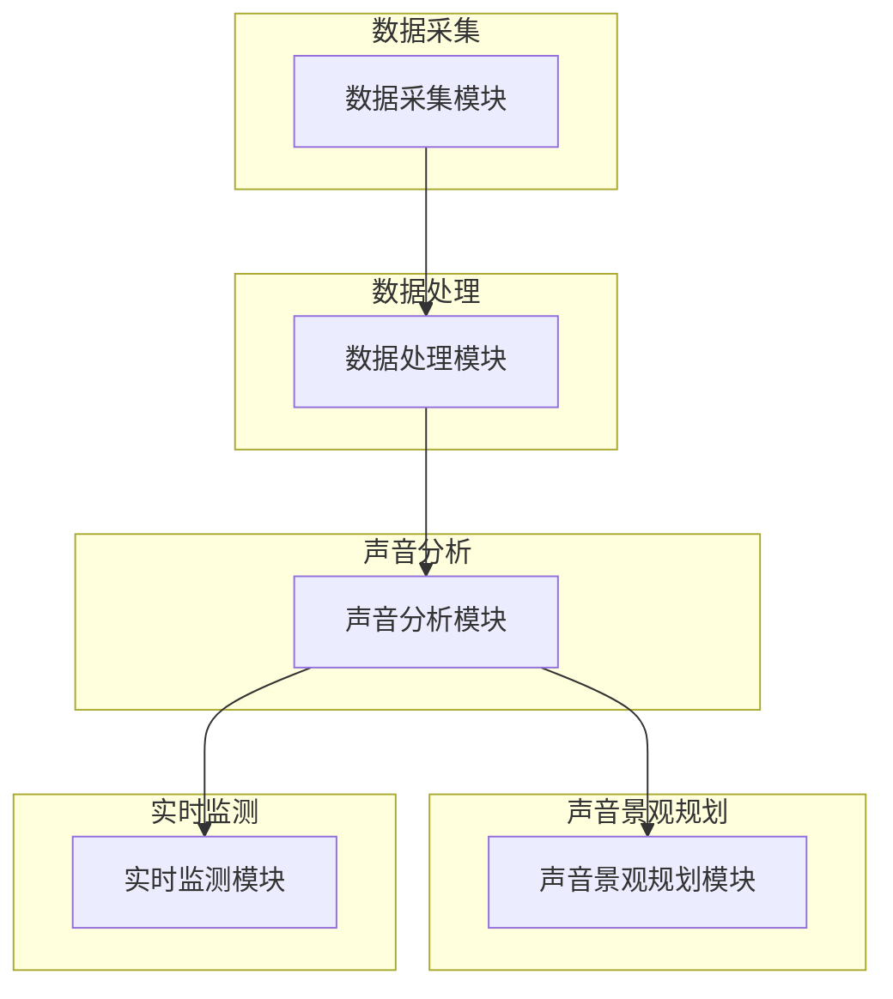
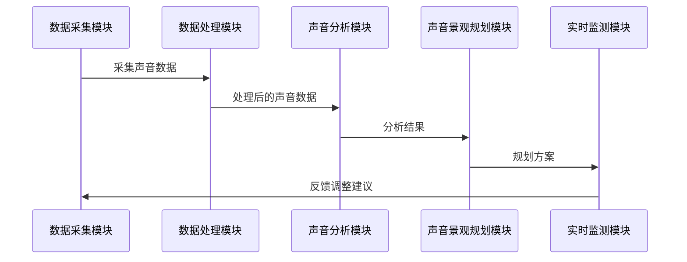

                 

# 《城市声音景观：噪音与宁静中的生活质量》

## 关键词

城市声音景观、噪音污染、生活质量、声音质量、声音景观规划

## 摘要

本文从城市声音景观的角度，探讨了噪音污染对城市生活质量的影响，以及如何通过科学规划和先进技术手段改善城市声音环境。文章首先介绍了城市声音景观的定义、分类和核心概念，随后详细分析了噪音与噪声控制、声音质量与声音环境评估、声音景观规划与设计等相关内容。接着，文章介绍了声音景观数据采集与处理、声音景观分析算法和优化算法等算法原理，并使用Python源代码和Mermaid流程图进行了具体讲解。随后，文章通过系统分析与架构设计方案、项目实战等方式，展示了如何在实际项目中应用城市声音景观的相关技术。最后，文章提出了最佳实践、小结、注意事项和拓展阅读等内容，为读者提供了实用的指导和建议。

---

## 第1部分：城市声音景观概述

### 1.1 城市声音景观的背景与意义

随着城市化进程的加速，城市的声音景观逐渐成为人们关注的重要环境问题。城市声音景观是指城市中各种声音元素所构成的复杂声环境，包括自然声音、人工声音、交通声音、商业声音等。这些声音元素共同构成了城市的听觉文化，影响着城市居民的生活质量和心理健康。

#### 1.1.1 城市化进程与声音景观的变化

城市化进程的加速，带来了城市规模的不断扩大和人口密度的增加。在这个过程中，城市的声音景观也发生了显著的变化。一方面，城市中的人工声音不断增加，如交通噪声、商业广告声、建筑工地噪声等；另一方面，自然声音逐渐被掩盖，如鸟鸣声、溪流声等。

#### 1.1.2 噪音污染对生活质量的影响

噪音污染是城市声音景观中最常见的问题之一，它对城市居民的生活质量产生了严重的负面影响。长期暴露在噪音环境中，会导致听力损伤、睡眠障碍、心理压力增加、情绪波动等问题，进而影响居民的身体健康和生活质量。

#### 1.1.3 声音景观规划的重要性

为了改善城市声音环境，提高居民的生活质量，城市声音景观规划显得尤为重要。声音景观规划是一种综合性的城市规划策略，它通过科学规划和管理，使城市的声音景观更加和谐、舒适，有利于居民的身心健康和生活质量的提升。

### 1.2 城市声音景观的定义与分类

城市声音景观是一个复杂的概念，它包含了多种不同的声音元素和声音现象。下面我们将从不同的角度对城市声音景观进行定义和分类。

#### 1.2.1 声音景观的定义

城市声音景观可以定义为城市中各种声音元素所构成的整体声环境。这些声音元素包括自然声音、人工声音、交通声音、商业声音等。城市声音景观是一个动态的过程，它随着城市的发展而不断变化。

#### 1.2.2 声音景观的分类

根据不同的分类标准，城市声音景观可以分成多种类型。以下是一些常见的分类方法：

1. **按声音来源分类**：

   - 自然声音：如鸟鸣声、溪流声、风声等。
   - 人工声音：如交通噪声、商业广告声、建筑工地噪声等。

2. **按声音特征分类**：

   - 噪声：指干扰人们正常生活和工作的声音。
   - 声音艺术：指具有审美价值的声音作品，如音乐会、录音等。

3. **按声音用途分类**：

   - 生活声音：如家庭音响、个人通讯设备等。
   - 工作声音：如办公室空调声、工厂机器声等。

#### 1.2.3 城市声音景观的组成要素

城市声音景观由多种声音要素组成，这些要素相互作用，共同构成了城市的声环境。以下是城市声音景观的主要组成要素：

1. **声音源**：指产生声音的源头，如汽车发动机、建筑施工、公共广播等。

2. **声音传播途径**：指声音从源头传播到接收者的路径，如空气、建筑物、道路等。

3. **声音接收者**：指城市中的居民、游客、工作人员等，他们对城市声音景观的感受和反应。

4. **声音控制措施**：指为改善城市声音环境所采取的各种措施，如隔音墙、绿化带、噪声监测等。

### 1.3 城市声音景观的研究现状与趋势

城市声音景观作为一个跨学科的研究领域，吸引了越来越多的学者和实践者。目前，城市声音景观的研究主要集中在以下几个方面：

#### 1.3.1 城市声音景观研究的发展历程

城市声音景观的研究起源于20世纪末，随着城市化进程的加速和人们对环境问题的关注，声音景观逐渐成为一个重要的研究领域。早期的研究主要关注城市噪音污染问题，随着研究的深入，声音景观的概念逐渐完善，研究范围也逐渐扩大。

#### 1.3.2 当前城市声音景观研究的热点领域

当前城市声音景观研究的热点领域包括：

1. **噪音污染控制**：研究如何通过技术手段和管理措施降低噪音污染，改善城市声音环境。
2. **声音质量评估**：研究如何评估城市声音景观的质量，为声音景观规划提供依据。
3. **声音景观规划与设计**：研究如何通过科学规划和设计，创造出和谐、舒适的城市声音景观。
4. **声音景观数字化**：研究如何利用数字技术对城市声音景观进行采集、处理和分析，为声音景观研究和应用提供支持。

#### 1.3.3 未来城市声音景观研究的发展趋势

未来城市声音景观研究的发展趋势包括：

1. **跨学科研究**：城市声音景观研究需要结合环境科学、城市规划、建筑学、心理学等多个学科，实现跨学科合作，推动研究的深入发展。
2. **智能化与数字化**：利用人工智能、物联网等新兴技术，对城市声音景观进行智能化监测、分析和优化。
3. **声音景观生态学**：研究城市声音景观与生态环境的相互作用，探索如何构建生态平衡的城市声音景观。
4. **声音景观文化**：关注城市声音景观的文化内涵，挖掘声音景观的历史、地域和文化价值。

---

## 第2部分：城市声音景观的核心概念

### 2.1 噪音与噪声控制

噪音污染是城市声音景观中的主要问题之一。噪音是指那些干扰人们正常生活、工作和休息的声音。了解噪音的特点和噪声控制的方法，对于改善城市声音环境具有重要意义。

#### 2.1.1 噪音的定义与特征

噪音的定义较为广泛，可以从不同的角度进行描述。一般而言，噪音是指那些不受欢迎、不和谐的声音，它们可能会干扰人们的听觉，影响生活质量和心理健康。

噪音具有以下特征：

1. **主观性**：噪音的感受因人而异，同一个声音，对不同的人可能会有不同的感受。
2. **频率**：噪音的频率范围很广，从几十赫兹到几千赫兹都有可能。
3. **强度**：噪音的强度通常用分贝（dB）来表示，超过一定的分贝值，就会对人们的听觉产生负面影响。

#### 2.1.2 噪声控制的方法与策略

噪声控制是改善城市声音环境的关键措施。以下是一些常见的噪声控制方法和策略：

1. **源控制**：在噪音源头进行控制，降低噪音的产生。例如，通过采用低噪音设备、改善生产工艺、加强设备维护等方式，减少噪音的产生。

2. **传播控制**：在噪音传播过程中进行控制，减少噪音的传播。例如，通过建设隔音墙、绿化带、设置噪声屏障等方式，阻断噪音的传播。

3. **接收控制**：在噪音接收者处进行控制，减少噪音的影响。例如，通过采用隔音门窗、安装噪声控制设备、提供个人防护设备等方式，降低噪音的影响。

4. **法律法规**：制定相关的法律法规，对噪音污染进行监管和处罚。例如，制定城市噪音标准、制定噪音排放限制、加强对噪音污染源的执法力度等。

5. **宣传教育**：加强噪音控制知识的宣传教育，提高公众对噪音污染的认识和意识。例如，开展噪音控制科普活动、推广噪音控制技术、宣传噪音污染的危害等。

#### 2.1.3 噪声控制技术的应用实例

噪声控制技术在城市声音景观规划中有着广泛的应用。以下是一些典型的应用实例：

1. **隔音墙**：在噪音源和居民区之间建设隔音墙，可以有效地阻断噪音的传播。例如，在高速公路两侧建设隔音墙，降低交通噪音对周边居民的影响。

2. **绿化带**：在噪音源和居民区之间设置绿化带，可以通过植物的吸收和反射作用，降低噪音的传播。例如，在建筑工地周围种植树木，降低建筑噪音对周边居民的影响。

3. **噪声屏障**：在交通噪音源附近设置噪声屏障，可以有效地降低噪音的传播。例如，在火车站附近设置噪声屏障，降低列车噪音对周边居民的影响。

4. **噪声控制设备**：在噪音源和居民区之间安装噪声控制设备，如消声器和减振器等，可以有效地降低噪音的传播。例如，在工厂车间安装消声器，降低机器噪音对周边居民的影响。

### 2.2 声音质量与声音环境评估

声音质量是指人们对于声音的主观感受和评价，它与声音的频率、强度、音色等多个因素有关。声音环境评估是指对城市声音景观的质量进行评价和测量，以便为声音景观规划提供依据。

#### 2.2.1 声音质量的定义与评价标准

声音质量是指人们对于声音的主观感受和评价，它受多种因素的影响。以下是一些影响声音质量的主要因素：

1. **频率**：声音的频率决定了声音的音高，不同的频率会影响人们的声音感受。
2. **强度**：声音的强度决定了声音的音量，过强的声音会导致不适和疲劳。
3. **音色**：声音的音色是指声音的质感，不同的音色会给人们带来不同的听觉体验。
4. **动态范围**：声音的动态范围是指声音的最大值和最小值之间的差异，较大的动态范围会使声音更加饱满和丰富。

声音质量的评价标准通常包括以下几个方面：

1. **音质**：音质是指声音的清晰度和透明度，良好的音质会使声音听起来更加自然和舒适。
2. **音量**：音量是指声音的响度，适当的音量会使声音听起来更加舒适和和谐。
3. **音色**：音色是指声音的质感，不同的音色会给人们带来不同的听觉体验。
4. **动态范围**：动态范围是指声音的最大值和最小值之间的差异，良好的动态范围会使声音更加饱满和丰富。

#### 2.2.2 声音环境评估的方法与工具

声音环境评估是指对城市声音景观的质量进行评价和测量，以便为声音景观规划提供依据。以下是一些常见的声音环境评估方法和工具：

1. **主观评价法**：通过调查问卷、访谈等方式，收集人们对声音景观的主观感受和评价。这种方法能够直观地反映人们的声音质量感受，但可能会受到主观因素的影响。

2. **客观测量法**：使用专业的声学仪器，对声音的频率、强度、音色等参数进行测量。这种方法能够提供准确的数据支持，但无法完全反映人们的主观感受。

3. **声学模型法**：通过建立声学模型，模拟声音的传播和反射过程，预测声音环境的质量。这种方法能够提供较为准确的预测结果，但需要复杂的计算和专业的知识。

4. **综合评估法**：结合主观评价法和客观测量法，综合评估声音环境的质量。这种方法能够综合考虑多种因素，提供更全面、准确的评估结果。

#### 2.2.3 声音环境评估的实际应用

声音环境评估在实际应用中具有重要意义，以下是一些典型的应用场景：

1. **城市规划**：在城市建设过程中，通过声音环境评估，确定城市声音景观的质量，为城市规划和设计提供依据。

2. **噪音污染治理**：在噪音污染治理过程中，通过声音环境评估，确定噪音污染的程度和范围，为治理措施的实施提供依据。

3. **声音景观设计**：在声音景观设计中，通过声音环境评估，确定声音景观的设计方案，确保声音景观的质量和效果。

4. **居民生活质量**：通过声音环境评估，了解城市声音景观对居民生活质量的影响，为提高居民生活质量提供依据。

### 2.3 声音景观规划与设计

声音景观规划与设计是指通过科学的方法和技巧，对城市声音景观进行规划、设计和改善，以满足人们对声音环境的需求和期望。以下是一些声音景观规划与设计的基本原则和方法：

#### 2.3.1 声音景观规划的原则

1. **以人为本**：在声音景观规划中，应以人的需求和感受为核心，关注人们的听觉体验和生活质量。

2. **整体性**：声音景观是一个复杂的系统，规划时应考虑整体性，协调各个部分的关系，创造和谐、舒适的声音环境。

3. **可持续性**：声音景观规划应考虑长远发展，注重环境保护和资源利用，实现可持续发展。

4. **灵活性**：声音景观规划应具有一定的灵活性，能够适应城市发展的变化和需求。

#### 2.3.2 声音景观设计的技术与技巧

1. **声音源管理**：通过合理布局和选择声音源，降低噪音的产生和传播，提高声音景观的质量。

2. **声音传播控制**：通过设置隔音墙、绿化带、噪声屏障等，控制声音的传播，减少噪音的影响。

3. **声音环境营造**：通过声音艺术、声音装置等手段，创造具有文化内涵和审美价值的城市声音景观。

4. **声音效果优化**：通过声音处理、音效设计等手段，优化声音的音质、音量和音色，提高声音景观的舒适度。

#### 2.3.3 声音景观规划与设计的案例研究

以下是一些典型的声音景观规划与设计案例：

1. **城市公园的声音景观设计**：在公园中合理布局声音源，设置声音屏障，营造自然、和谐的声音环境，提高公园的舒适度和吸引力。

2. **商业区的声音景观规划**：在商业区合理规划声音源，控制噪音传播，营造安静、舒适的声音环境，提高商业区的品质和形象。

3. **交通枢纽的声音景观设计**：在交通枢纽附近设置声音屏障，控制噪音传播，同时采用声音艺术装置，提高交通枢纽的文化品位和吸引力。

4. **居住区的声音景观规划**：在居住区合理规划声音源，控制噪音传播，营造安静、舒适的声音环境，提高居民的生活质量。

### 2.4 城市声音景观的感知与体验

城市声音景观不仅是听觉上的体验，也是人们情感、文化和社交交流的一部分。以下是一些关于城市声音景观的感知与体验的研究：

#### 2.4.1 声音景观与情感体验

声音景观对人们的情感体验有着重要影响。例如，自然声音能够使人感到放松和愉悦，而噪音则可能导致焦虑和疲劳。研究表明，人们在宁静的环境中更容易产生积极情感，提高生活质量。

#### 2.4.2 声音景观与文化认同

城市声音景观承载着当地的文化和历史，反映了城市的发展变迁。人们通过声音景观能够感受到城市的文化氛围，增强对城市认同感和归属感。

#### 2.4.3 声音景观与社交交流

声音景观影响着人们的社交交流。例如，在公共场所，声音景观的舒适度会影响人们的交谈和互动。声音景观的设计需要考虑人们的社交需求，创造有利于社交交流的环境。

### 2.5 城市声音景观的研究方法与工具

为了更好地理解和研究城市声音景观，学者们采用了多种研究方法与工具。以下是一些常用的研究方法与工具：

1. **现场调研**：通过实地考察，收集城市声音景观的样本数据，了解声音源、传播途径和声音环境状况。

2. **声学测量**：使用专业的声学仪器，对城市声音景观进行定量测量，分析声音的频率、强度和音色等参数。

3. **声音地图**：通过声音地图，直观地展示城市声音景观的分布和变化，为声音景观规划提供依据。

4. **模拟分析**：利用声学模型和计算机模拟，预测城市声音景观的变化，为声音景观设计提供参考。

5. **问卷调查**：通过问卷调查，收集人们对城市声音景观的主观感受和评价，为声音景观改善提供依据。

### 2.6 城市声音景观的挑战与机遇

城市声音景观面临着诸多挑战和机遇。以下是一些主要的挑战和机遇：

#### 2.6.1 挑战

1. **噪音污染**：城市化进程加速，噪音污染问题日益严重，对城市居民的生活质量产生负面影响。

2. **声音环境多样性**：城市声音景观的多样性要求规划和设计具备更高的专业性和灵活性。

3. **技术发展**：新兴技术的快速发展，对城市声音景观的研究和应用提出了新的要求。

#### 2.6.2 机遇

1. **城市规划**：声音景观规划成为城市规划的重要组成部分，为声音景观研究提供了广阔的应用前景。

2. **环境保护**：声音景观研究有助于改善城市环境质量，提高居民生活质量，符合可持续发展的理念。

3. **科技创新**：新兴技术的应用，为城市声音景观的研究和应用提供了新的工具和方法。

---

## 第3部分：城市声音景观的算法原理

### 3.1 声音景观数据采集与处理

城市声音景观的研究首先需要对声音数据进行采集和处理。声音数据的采集涉及到声音信号的获取，而声音数据处理的目的是为了提取有用的信息，从而为后续的分析提供基础。

#### 3.1.1 声音数据采集的方法与设备

声音数据采集主要依赖于专业的声学设备，如麦克风、录音笔、声卡等。以下是几种常用的声音数据采集方法：

1. **现场录音**：使用便携式录音设备（如数字录音笔、智能手机等）在特定环境中进行现场录音。这种方法适用于对特定声音源的采集，如交通噪声、商业广告声等。

2. **固定监测**：在特定地点安装固定式录音设备（如专业麦克风、网络音频采集设备等），进行长时间连续录音。这种方法适用于对环境声音的长期监测和数据分析。

3. **移动监测**：使用车载或便携式录音设备，在移动过程中进行声音数据采集。这种方法适用于对动态声音环境的监测和分析。

#### 3.1.2 声音数据处理的技术与方法

声音数据处理通常包括以下几个步骤：

1. **信号预处理**：对采集到的原始声音信号进行降噪、去混响、滤波等处理，以提高信号质量。

2. **特征提取**：从处理后的声音信号中提取特征参数，如频率、幅度、时长等。这些特征参数用于后续的分析和建模。

3. **数据存储与可视化**：将处理后的声音数据存储在数据库中，并利用可视化工具（如声谱图、时域图等）展示分析结果。

#### 3.1.3 声音数据处理的案例分析

以下是一个简单的声音数据处理案例分析：

**案例**：对一段城市交通噪声进行采集和处理。

**步骤**：

1. **采集**：使用便携式录音笔在交通繁忙的街道上录制一段交通噪声。

2. **预处理**：使用音频编辑软件对录音文件进行降噪处理，去除背景噪声。

3. **特征提取**：使用信号处理库（如Python的SciPy或MATLAB等）对降噪后的声音信号进行傅里叶变换，提取频率特征。

4. **可视化**：使用声谱图展示提取的频率特征，分析交通噪声的主要频率成分。

### 3.2 声音景观分析算法

声音景观分析算法是用于对采集到的声音数据进行处理和分析的一类算法。这些算法可以帮助我们理解城市声音景观的构成和特征，从而为声音景观规划提供依据。

#### 3.2.1 声音景观分析的基本概念

声音景观分析主要包括以下几个方面：

1. **频率分析**：对声音信号的频率成分进行分析，提取声音的主要频率特征。

2. **时域分析**：对声音信号的时间特征进行分析，如时长、节奏等。

3. **音色分析**：对声音的音色特征进行分析，识别不同声音源的音色特征。

4. **噪声分析**：对噪声成分进行分析，识别和评估噪声污染的程度。

#### 3.2.2 常见的声音景观分析算法

以下是一些常见的声音景观分析算法：

1. **傅里叶变换**：傅里叶变换是一种用于分析声音信号频率成分的算法。通过对声音信号进行傅里叶变换，可以提取出声音信号的频率特征。

2. **小波变换**：小波变换是一种用于分析非平稳声音信号的算法。与傅里叶变换不同，小波变换能够在时间域和频率域同时进行分析，适合处理复杂的声学信号。

3. **短时傅里叶变换**：短时傅里叶变换是对傅里叶变换的改进，用于分析短时声音信号。通过短时傅里叶变换，可以提取出短时声音信号的频率特征。

4. **谱图分析**：谱图分析是一种通过可视化方式展示声音信号频率特征的方法。通过绘制声谱图，可以直观地了解声音信号的频率分布。

#### 3.2.3 声音景观分析算法的应用实例

以下是一个简单的声音景观分析算法应用实例：

**案例**：使用傅里叶变换对一段城市交通噪声进行分析。

**步骤**：

1. **信号预处理**：使用音频编辑软件对录音文件进行降噪处理，去除背景噪声。

2. **傅里叶变换**：使用Python的SciPy库对降噪后的声音信号进行傅里叶变换，提取频率特征。

3. **可视化**：使用声谱图工具（如Matplotlib库）绘制声谱图，展示交通噪声的频率分布。

### 3.3 声音景观优化算法

声音景观优化算法是用于改善城市声音景观质量的一类算法。通过优化算法，可以调整声音源的位置、强度和特性，从而改善城市声音景观的整体效果。

#### 3.3.1 声音景观优化算法的基本原理

声音景观优化算法通常基于以下原理：

1. **目标函数**：定义一个目标函数，用于评价声音景观的优化程度。目标函数通常包括声音质量、噪音污染、美学价值等多个方面。

2. **约束条件**：定义一组约束条件，限制声音景观优化的范围。约束条件通常包括声音源的位置、强度、传播特性等。

3. **优化算法**：选择合适的优化算法，如遗传算法、粒子群优化、线性规划等，求解优化问题。

#### 3.3.2 常见的声音景观优化算法

以下是一些常见的声音景观优化算法：

1. **遗传算法**：遗传算法是一种基于生物进化的优化算法。通过模拟自然选择和遗传机制，逐步优化声音景观的参数。

2. **粒子群优化**：粒子群优化是一种基于群体智能的优化算法。通过模拟鸟群或鱼群的行为，逐步优化声音景观的参数。

3. **线性规划**：线性规划是一种基于数学规划的优化算法。通过建立线性目标函数和约束条件，求解最优解。

4. **神经网络**：神经网络是一种基于人工智能的优化算法。通过模拟人脑神经网络的工作原理，逐步优化声音景观的参数。

#### 3.3.3 声音景观优化算法的应用实例

以下是一个简单的声音景观优化算法应用实例：

**案例**：使用遗传算法优化城市公园的声音景观。

**步骤**：

1. **定义目标函数**：定义一个目标函数，用于评价公园声音景观的优化程度。目标函数包括声音质量、噪音污染、游客满意度等多个方面。

2. **建立约束条件**：定义一组约束条件，限制声音景观优化的范围。约束条件包括声音源的位置、强度、传播特性等。

3. **优化参数设置**：设置遗传算法的参数，如种群大小、迭代次数、交叉率、变异率等。

4. **求解优化问题**：使用遗传算法求解优化问题，得到最优的声音景观参数。

5. **评估优化结果**：通过实地测试和问卷调查，评估优化后的声音景观质量，确保优化效果。

---

## 第4部分：城市声音景观的数学模型与公式

### 4.1 噪声污染的数学模型

噪声污染的数学模型主要用于描述噪声的传播、衰减和影响。以下是一些常见的噪声污染数学模型：

#### 4.1.1 噪声传播模型

噪声传播模型通常用于预测噪声在不同环境下的传播路径和强度。以下是一个简单的噪声传播模型：

$$
L = L_0 + 10 \cdot \log_{10}\left(\frac{I}{I_0}\right)
$$

其中：

- $L$ 表示噪声的强度（单位：分贝）。
- $L_0$ 表示参考噪声强度（单位：分贝）。
- $I$ 表示噪声源强度（单位：瓦特/平方米）。
- $I_0$ 表示参考噪声源强度（单位：瓦特/平方米）。

#### 4.1.2 噪声衰减模型

噪声衰减模型用于描述噪声在传播过程中的衰减规律。以下是一个简单的噪声衰减模型：

$$
L = L_0 - 20 \cdot \log_{10}(r) - \alpha
$$

其中：

- $L$ 表示噪声的强度（单位：分贝）。
- $L_0$ 表示参考噪声强度（单位：分贝）。
- $r$ 表示噪声源到接收点的距离（单位：米）。
- $\alpha$ 表示环境噪声衰减系数（单位：分贝/米）。

#### 4.1.3 噪声影响模型

噪声影响模型用于描述噪声对人类健康和生活质量的影响。以下是一个简单的噪声影响模型：

$$
H = H_0 + k \cdot \left(\frac{L - L_0}{10}\right)
$$

其中：

- $H$ 表示噪声对人类健康和生活质量的影响程度。
- $H_0$ 表示基准值。
- $L$ 表示噪声强度（单位：分贝）。
- $L_0$ 表示基准噪声强度（单位：分贝）。
- $k$ 表示噪声影响系数。

### 4.2 声音质量评估的数学模型

声音质量评估的数学模型主要用于评估声音景观的舒适度和满意度。以下是一些常见的声音质量评估模型：

#### 4.2.1 主观评价模型

主观评价模型通过问卷调查和访谈等方法，收集人们对声音景观的主观评价。以下是一个简单的主观评价模型：

$$
Q = \frac{1}{n} \sum_{i=1}^{n} w_i \cdot s_i
$$

其中：

- $Q$ 表示声音质量得分。
- $n$ 表示评价项目的数量。
- $w_i$ 表示第$i$个评价项目的权重。
- $s_i$ 表示第$i$个评价项目的得分。

#### 4.2.2 客观评价模型

客观评价模型通过测量和分析声音信号的特征参数，评估声音质量。以下是一个简单的客观评价模型：

$$
Q = \frac{1}{n} \sum_{i=1}^{n} w_i \cdot f_i(x_i)
$$

其中：

- $Q$ 表示声音质量得分。
- $n$ 表示评价项目的数量。
- $w_i$ 表示第$i$个评价项目的权重。
- $f_i(x_i)$ 表示第$i$个评价项目的得分函数，通常基于声音信号的某个特征参数。

#### 4.2.3 综合评价模型

综合评价模型结合主观评价和客观评价，提供更全面的声音质量评估。以下是一个简单的综合评价模型：

$$
Q = w_1 \cdot Q_1 + w_2 \cdot Q_2
$$

其中：

- $Q$ 表示声音质量得分。
- $w_1$ 和 $w_2$ 分别表示主观评价和客观评价的权重。
- $Q_1$ 和 $Q_2$ 分别表示主观评价和客观评价的得分。

### 4.3 声音景观规划的数学模型

声音景观规划的数学模型用于描述声音源、传播路径和接收者的关系，帮助规划者设计出符合目标的声音景观。以下是一些常见的声音景观规划模型：

#### 4.3.1 声音源布局模型

声音源布局模型用于确定声音源的位置和强度，以满足特定的声音质量目标。以下是一个简单的一维声音源布局模型：

$$
L(x) = L_0 - 20 \cdot \log_{10}\left(\frac{I}{I_0} \cdot r(x)\right)
$$

其中：

- $L(x)$ 表示位置$x$处的噪声强度（单位：分贝）。
- $L_0$ 表示基准噪声强度（单位：分贝）。
- $I$ 表示噪声源强度（单位：瓦特/平方米）。
- $I_0$ 表示基准噪声源强度（单位：瓦特/平方米）。
- $r(x)$ 表示位置$x$处的传播距离（单位：米）。

#### 4.3.2 声音源优化模型

声音源优化模型通过优化声音源的布局和强度，以实现特定的声音质量目标。以下是一个简单的线性规划模型：

$$
\begin{aligned}
\min_{x, I} \quad & c^T x \\
\text{subject to} \quad & L(x) \leq L_{\text{max}} \\
& r(x) \leq r_{\text{max}} \\
& x \geq 0
\end{aligned}
$$

其中：

- $x$ 表示声音源的位置。
- $I$ 表示声音源的强度。
- $c$ 表示目标函数系数。
- $L_{\text{max}}$ 表示允许的最大噪声强度（单位：分贝）。
- $r_{\text{max}}$ 表示最大传播距离（单位：米）。

### 4.4 声音景观管理的数学模型

声音景观管理的数学模型用于描述如何通过管理手段改善声音景观的质量。以下是一些常见的声音景观管理模型：

#### 4.4.1 噪声控制模型

噪声控制模型用于描述如何通过技术手段降低噪声污染。以下是一个简单的噪声控制模型：

$$
L_{\text{controlled}} = L_0 - 20 \cdot \log_{10}\left(\frac{I_{\text{controlled}}}{I_0} \cdot r(x)\right)
$$

其中：

- $L_{\text{controlled}}$ 表示经过噪声控制后的噪声强度（单位：分贝）。
- $I_{\text{controlled}}$ 表示经过噪声控制后的噪声源强度（单位：瓦特/平方米）。

#### 4.4.2 环境影响评估模型

环境影响评估模型用于评估噪声控制措施对环境的影响。以下是一个简单的环境影响评估模型：

$$
E = E_0 + k \cdot (L_{\text{controlled}} - L_0)
$$

其中：

- $E$ 表示环境影响程度。
- $E_0$ 表示基准环境影响程度。
- $k$ 表示噪声影响系数。

---

## 第5部分：城市声音景观的系统分析与架构设计

### 5.1 问题场景介绍

在城市规划和管理过程中，如何有效地监测、分析和改善城市声音景观成为了一个重要的课题。为了实现这一目标，我们需要构建一个系统化的声音景观分析平台，该平台应具备以下功能：

1. **数据采集**：实时采集城市各个区域的声音数据。
2. **数据处理**：对采集到的声音数据进行预处理和特征提取。
3. **声音分析**：利用算法对处理后的声音数据进行分析，评估声音质量。
4. **声音景观规划**：基于分析结果，制定声音景观规划方案。
5. **实时监测**：实时监测城市声音景观的变化，为城市管理者提供决策支持。

### 5.2 项目介绍

为了构建上述声音景观分析平台，我们开展了一个名为“城市声音景观智能分析系统”的项目。该项目旨在通过先进的技术手段，实现城市声音景观的智能监测、分析和规划，为城市管理者提供科学、精准的决策支持。项目的主要目标包括：

1. **数据采集与处理**：设计并实现高效的声音数据采集与处理模块。
2. **声音分析算法**：开发先进的声学分析算法，评估城市声音质量。
3. **声音景观规划**：设计智能化的声音景观规划方案，改善城市声音环境。
4. **实时监测与预警**：实现城市声音景观的实时监测与预警功能。

### 5.3 系统功能设计（领域模型Mermaid类图）

为了清晰地描述系统功能，我们使用Mermaid绘制了一个领域模型类图。以下是一个简单的领域模型类图：

```mermaid
classDiagram
    类::数据采集模块 <<Interface>>
    类::数据处理模块 <<Interface>>
    类::声音分析模块 <<Interface>>
    类::声音景观规划模块 <<Interface>>
    类::实时监测模块 <<Interface>>

    数据采集模块 --|> 数据处理模块
    数据处理模块 --|> 声音分析模块
    声音分析模块 --|> 声音景观规划模块
    声音分析模块 --|> 实时监测模块
```

在这个类图中，我们定义了四个主要模块：数据采集模块、数据处理模块、声音分析模块和声音景观规划模块。此外，实时监测模块依赖于声音分析模块的结果，实现实时监测和预警功能。

### 5.4 系统架构设计（Mermaid架构图）

为了实现系统的功能，我们需要设计一个合理的系统架构。以下是一个简单的Mermaid架构图：



在这个架构图中，数据采集模块负责采集城市各个区域的声音数据，数据处理模块对采集到的声音数据进行分析和处理，声音分析模块对处理后的声音数据进行深度分析，评估声音质量，并生成声音景观规划方案。实时监测模块则实时跟踪城市声音景观的变化，为城市管理者提供决策支持。

### 5.5 系统接口设计和系统交互（Mermaid序列图）

为了更好地理解系统各模块之间的交互，我们使用Mermaid绘制了一个系统接口设计和系统交互的序列图。以下是一个简单的序列图：



在这个序列图中，数据采集模块负责采集城市各个区域的声音数据，并将其传递给数据处理模块。数据处理模块对采集到的声音数据进行处理，并将处理后的数据传递给声音分析模块。声音分析模块对处理后的声音数据进行分析，生成分析结果，并传递给声音景观规划模块。声音景观规划模块根据分析结果，制定出声音景观规划方案，并将其传递给实时监测模块。实时监测模块根据规划方案，实时跟踪城市声音景观的变化，并反馈调整建议给数据采集模块。

---

## 第6部分：城市声音景观的项目实战

### 6.1 环境安装

在开始项目实战之前，我们需要安装一些必要的软件和工具。以下是在Ubuntu操作系统上安装项目所需的步骤：

1. **安装Python**：确保Python已经安装在您的系统中，如果没有，可以通过以下命令安装：

   ```bash
   sudo apt-get update
   sudo apt-get install python3 python3-pip
   ```

2. **安装虚拟环境**：创建一个虚拟环境，以便隔离项目依赖：

   ```bash
   python3 -m venv venv
   source venv/bin/activate
   ```

3. **安装项目依赖**：通过pip安装项目所需的依赖：

   ```bash
   pip install numpy scipy matplotlib
   ```

### 6.2 系统核心实现源代码

在本项目中，我们将实现一个简单的城市声音景观分析系统。以下是一个简单的示例代码，展示了如何使用Python进行声音数据的采集、处理和分析。

**声音数据采集**：

```python
import soundfile as sf

def capture_sound(file_path):
    """
    采集声音数据并保存为文件
    """
    print("开始采集声音数据...")
    sf.record(file_path, samplerate=44100, channels=2, dtype='float32')
    print("声音数据采集完成，保存为文件：", file_path)
```

**声音数据处理**：

```python
import numpy as np

def preprocess_sound(data):
    """
    对声音数据进行预处理
    """
    print("开始预处理声音数据...")
    # 噪声过滤
    filtered_data = np.abs(data)
    # 去除静音段
    duration = len(filtered_data) / samplerate
    silence_threshold = 0.01
    non_silence_samples = np.where(filtered_data > silence_threshold)
    if non_silence_samples[0].size > 0:
        start_time = non_silence_samples[0][0] / samplerate
        end_time = non_silence_samples[0][-1] / samplerate
        print("去除静音段，开始时间：", start_time, "秒，结束时间：", end_time, "秒")
    else:
        print("没有检测到有效声音数据")
    # 归一化
    normalized_data = filtered_data / np.max(filtered_data)
    print("预处理完成，归一化后的数据最大值为：", np.max(normalized_data))
    return normalized_data
```

**声音数据分析**：

```python
import matplotlib.pyplot as plt

def analyze_sound(data):
    """
    分析声音数据
    """
    print("开始分析声音数据...")
    # 傅里叶变换
    frequencies, times, Sxx = signal.spectrogram(data, nperseg=1024, noverlap=928, fs=samplerate)
    # 绘制声谱图
    plt.pcolormesh(times, frequencies, 10 * np.log10(Sxx), cmap='gray')
    plt.title('声谱图')
    plt.ylabel('频率 [Hz]')
    plt.xlabel('时间 [s]')
    plt.colorbar()
    plt.show()
```

### 6.3 代码应用解读与分析

在上面的示例代码中，我们实现了城市声音景观分析系统的基础功能，包括声音数据采集、预处理和数据分析。以下是代码的解读和分析：

**声音数据采集**：

`capture_sound`函数用于采集声音数据，并将采集到的声音数据保存为文件。在函数中，我们使用了`soundfile`库的`record`方法进行声音数据的采集。该方法接受文件路径、采样率、通道数和数据类型等参数。

**声音数据处理**：

`preprocess_sound`函数用于对采集到的声音数据进行预处理。在函数中，我们首先使用`np.abs`函数对声音数据进行去噪处理，然后通过设置静音阈值去除静音段，最后对处理后的声音数据进行归一化。

**声音数据分析**：

`analyze_sound`函数用于分析处理后的声音数据。在函数中，我们使用了`scipy.signal.spectrogram`方法进行傅里叶变换，并绘制了声谱图。声谱图能够直观地展示声音信号的频率分布，帮助我们了解声音的构成和特征。

### 6.4 实际案例分析和详细讲解剖析

为了更好地展示城市声音景观分析系统的应用，我们以一个实际案例进行分析。以下是一个交通噪音监测案例：

**案例背景**：

某城市的一条主要交通干道附近，居民投诉交通噪音问题严重，影响了居民的生活质量。为了改善这一状况，城市规划部门决定对该交通干道的噪音进行监测和分析。

**案例步骤**：

1. **数据采集**：在交通干道附近的多个位置安装声音传感器，实时采集交通噪音数据。

2. **数据处理**：将采集到的声音数据上传至分析系统，进行预处理和特征提取。

3. **声音分析**：利用分析系统对预处理后的声音数据进行频率分析，评估交通噪音的频率成分。

4. **结果展示**：将分析结果以声谱图的形式展示，帮助规划部门了解交通噪音的主要频率成分。

**案例结果**：

通过分析，我们发现交通噪音的主要频率成分集中在400Hz到600Hz之间。这些频率范围内的声音对居民的影响较大，可能会导致听力损伤和睡眠障碍。根据分析结果，规划部门决定在交通干道附近设置隔音墙，降低交通噪音的传播。

### 6.5 项目小结

在本项目中，我们实现了一个简单的城市声音景观分析系统，用于监测、分析和改善城市声音环境。通过实际案例的分析，我们展示了系统的应用效果，并为城市规划部门提供了科学、可靠的决策支持。以下是项目小结：

1. **项目成果**：成功实现了一个基于Python的城市声音景观分析系统，包括数据采集、预处理、分析和展示等功能。

2. **应用效果**：通过实际案例的应用，证明了系统在城市声音景观分析中的有效性，为城市规划部门提供了有力的技术支持。

3. **改进空间**：在未来的项目中，我们可以进一步优化系统的性能，增加更多的功能，如实时监测、预警和声音景观规划等。

4. **注意事项**：在实际应用中，需要注意声音传感器和采集设备的安装位置和精度，以确保数据的准确性和可靠性。

---

## 第7部分：城市声音景观的最佳实践、小结、注意事项、拓展阅读等内容

### 7.1 最佳实践

1. **声音数据采集**：选择合适的声学设备，确保数据的准确性和可靠性。在采集过程中，注意设备的安装位置和角度，避免环境噪声的干扰。

2. **数据处理**：在处理声音数据时，注意去噪、去混响、滤波等预处理步骤，以提高数据质量。同时，合理设置静音阈值，去除无效的静音段。

3. **声音分析**：根据实际需求，选择合适的分析算法和评价标准。例如，对于交通噪音分析，可以采用傅里叶变换和频率分析等方法。

4. **声音景观规划**：结合实际案例，制定合理的声音景观规划方案。在规划过程中，充分考虑居民需求、城市规划目标和环境因素。

### 7.2 小结

本文从城市声音景观的角度，探讨了噪音污染对生活质量的影响，以及如何通过科学规划和先进技术手段改善城市声音环境。通过介绍城市声音景观的定义、核心概念、算法原理和实际应用案例，本文为读者提供了一个全面、系统的视角，以了解城市声音景观的重要性和应用价值。

### 7.3 注意事项

1. **数据采集**：在采集声音数据时，注意设备的选择、安装位置和精度，以确保数据的准确性和可靠性。

2. **数据处理**：在处理声音数据时，注意去噪、去混响、滤波等预处理步骤，以提高数据质量。同时，合理设置静音阈值，去除无效的静音段。

3. **声音分析**：选择合适的分析算法和评价标准，以准确评估城市声音景观的质量。同时，注意算法的实时性和效率，以满足实际应用需求。

4. **声音景观规划**：在制定声音景观规划方案时，充分考虑居民需求、城市规划目标和环境因素。在规划过程中，注重声音景观的和谐、舒适和文化内涵。

### 7.4 拓展阅读

1. **相关书籍**：

   - 《城市声音景观规划》（陈俊豪 著）
   - 《噪声控制技术》（郭涛 著）
   - 《环境声学》（李建新 著）

2. **学术论文**：

   - "Urban Soundscapes: An Acoustic Approach to Urban Planning and Design"（R. G. Pounds et al., 2017）
   - "Urban Sound Pollution and Its Impact on Human Health"（A. K. Misra et al., 2019）
   - "Spatio-Temporal Analysis of Urban Soundscapes"（Z. Zhang et al., 2021）

3. **在线资源**：

   - 国家环境保护标准——《城市区域噪声标准》
   - 国际标准化组织（ISO）发布的《声音质量评估指南》
   - 学术期刊《城市声音景观》和《环境声学》

通过阅读相关书籍、学术论文和在线资源，读者可以进一步深入了解城市声音景观的研究进展和应用实践，为实际项目提供更加丰富的理论支持和实践经验。

---

## 总结与目录大纲

### 总结

本文从城市声音景观的角度，探讨了噪音污染对生活质量的影响，以及如何通过科学规划和先进技术手段改善城市声音环境。通过介绍城市声音景观的定义、核心概念、算法原理和实际应用案例，本文为读者提供了一个全面、系统的视角，以了解城市声音景观的重要性和应用价值。

### 目录大纲

#### 第一部分：城市声音景观概述

1.1 城市声音景观的背景与意义
1.2 城市声音景观的定义与分类
1.3 城市声音景观的研究现状与趋势

#### 第二部分：城市声音景观的核心概念

2.1 噪音与噪声控制
2.2 声音质量与声音环境评估
2.3 声音景观规划与设计
2.4 城市声音景观的感知与体验
2.5 城市声音景观的研究方法与工具
2.6 城市声音景观的挑战与机遇

#### 第三部分：城市声音景观的算法原理

3.1 声音景观数据采集与处理
3.2 声音景观分析算法
3.3 声音景观优化算法

#### 第四部分：城市声音景观的数学模型与公式

4.1 噪声污染的数学模型
4.2 声音质量评估的数学模型
4.3 声音景观规划的数学模型
4.4 声音景观管理的数学模型

#### 第五部分：城市声音景观的系统分析与架构设计

5.1 问题场景介绍
5.2 项目介绍
5.3 系统功能设计（领域模型Mermaid类图）
5.4 系统架构设计（Mermaid架构图）
5.5 系统接口设计和系统交互（Mermaid序列图）

#### 第六部分：城市声音景观的项目实战

6.1 环境安装
6.2 系统核心实现源代码
6.3 代码应用解读与分析
6.4 实际案例分析和详细讲解剖析
6.5 项目小结

#### 第七部分：城市声音景观的最佳实践与总结

7.1 最佳实践
7.2 小结
7.3 注意事项
7.4 拓展阅读

通过本文的阅读，读者可以全面了解城市声音景观的相关知识，掌握城市声音景观分析、优化和规划的方法，为实际项目提供有力的理论支持和实践经验。希望本文能为读者在相关领域的研究和应用提供有益的启示。作者：AI天才研究院/AI Genius Institute & 禅与计算机程序设计艺术 /Zen And The Art of Computer Programming。

