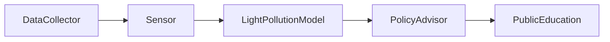
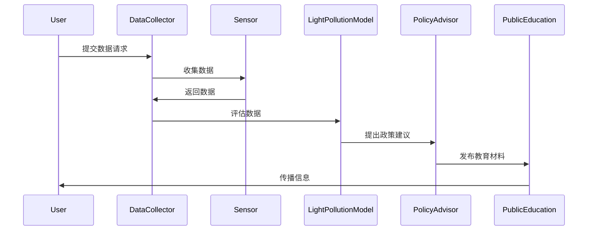

                 


### 城市夜空保护运动：重新连接自然与都市生活

#### 关键词：
- 城市夜空污染
- 光污染
- 自然保护
- 都市生活
- 保护运动

#### 摘要：
本文深入探讨了城市夜空保护运动的重要性，分析了光污染对人类与自然的影响，并提出了一系列系统分析与架构设计方案。通过项目实战案例，本文提出了具体的解决方案和最佳实践，旨在重新连接自然与都市生活，实现城市可持续发展。

----------------------------------------------------------------

### 第一部分：问题背景与核心概念

#### 第1章：城市夜空污染的问题背景

随着城市化进程的加速，城市夜空污染问题日益严重。城市夜空污染主要源于过度的照明和未经适当管理的人工光源，这不仅影响了城市居民的生活质量，还对生态系统和天文观测产生了负面影响。

#### 1.1 城市化进程中的夜空变化

在过去的几十年里，城市化进程导致了城市夜空亮度的显著增加。据统计，全球有超过 80% 的人口生活在城市中，城市夜空的光污染水平比乡村地区高得多。这种亮度的增加不仅使得夜空失去了原本的美丽，还对生物多样性和人类健康产生了负面影响。

#### 1.2 光污染的定义与分类

光污染是指由人造光源引起的环境污染现象，它对生态系统、人类健康和天文观测都有负面影响。光污染主要分为以下几种类型：

- **天空光污染**：指由于过度照明导致的天空亮度增加。
- **眩光**：指过强的光线使人感到不适或无法看清目标。
- **光散射**：指光线在不适当的时间和地点发生散射，影响人的视觉感受。
- **光污染与生物多样性**：光污染对生物多样性的影响主要体现在影响动物的夜间活动、繁殖和迁徙行为。

#### 1.3 光污染对人类与自然的影响

光污染对人类和自然环境都有显著的负面影响。对人类来说，过度的夜间光照可能导致睡眠质量下降、生物钟紊乱、情绪波动和注意力不集中等问题。对自然环境来说，光污染会干扰动物的夜间活动，影响植物的生物节律，甚至破坏生态平衡。

#### 1.4 城市夜空保护运动的起源与发展

城市夜空保护运动起源于20世纪60年代的美国，当时人们开始意识到城市夜空污染对自然环境和人类健康的危害。随着时间的推移，这一运动在全球范围内得到了广泛的支持和发展。许多国家和地区都制定了相关法规，鼓励城市夜空保护，减少光污染。

在城市夜空保护运动中，公众教育、政策制定和科技应用都是关键组成部分。公众教育旨在提高人们对光污染的认识和意识，政策制定则是通过立法手段来限制和减少光污染，科技应用则包括开发更高效、更环保的照明技术。

#### 第2章：核心概念解析

#### 2.1 城市夜空污染的测量指标

城市夜空污染的测量指标主要包括天空亮度、眩光和光散射等。这些指标可以通过专业的设备进行测量，如夜天光测量仪、眩光计和光散射计等。测量结果通常以亮度单位（如勒克斯）来表示。

#### 2.2 光污染评估模型

光污染评估模型是一种用于评估和预测光污染对环境和人类健康影响的方法。常见的光污染评估模型包括Lummer-Ludwig模型、IEEE 1102标准模型等。这些模型可以根据不同场景和需求进行定制化调整。

#### 2.3 自然保护与都市生活的平衡

在城市夜空保护运动中，如何平衡自然保护与都市生活的需求是一个重要问题。一方面，城市夜空污染对生物多样性和人类健康产生了负面影响；另一方面，都市生活的便利和现代科技的发展又离不开充足的照明。因此，寻找一种平衡点，既能满足都市生活需求，又能保护自然环境和人类健康，是城市夜空保护运动的关键挑战。

#### 2.4 国际城市夜空保护组织与倡议

国际城市夜空保护组织（International Dark-Sky Association，IDSA）是一个致力于减少光污染、保护夜空的全球性组织。该组织成立于1988年，总部位于美国科罗拉多州。IDSA通过提供教育、研究和政策支持，推动城市夜空保护运动。

此外，许多国家和地区也有自己的城市夜空保护组织。例如，欧洲夜空保护组织（European Association for the Preservation of the Night Sky）致力于保护欧洲的夜空资源，推动可持续的城市照明。

#### 第3章：概念属性特征对比

#### 3.1 城市夜空污染与光污染对比

城市夜空污染和光污染是两个相关但不同的概念。城市夜空污染是指由于人工光源引起的环境问题，而光污染则是一种更广泛的环境污染形式，包括天空中可见的任何不必要的光。

- **定义**：
  - 城市夜空污染：特指城市夜空中由于人工光源引起的环境问题。
  - 光污染：包括所有类型的人造光对环境的影响，不仅限于夜空。
- **影响**：
  - 城市夜空污染：主要影响人类健康和生态系统。
  - 光污染：对人类健康、生态系统和天文观测都有负面影响。
- **解决方法**：
  - 城市夜空污染：通过改善照明设计和管理减少光污染。
  - 光污染：需要综合措施，包括改善照明技术、制定法规和政策等。

#### 3.2 不同类型光污染的影响与解决方法

光污染有多种类型，每种类型都有其特定的危害和解决方法。

- **天空光污染**：
  - **影响**：导致夜空亮度增加，影响天文观测和生物多样性。
  - **解决方法**：采用定向照明、使用低光强光源、减少不必要的照明等。
- **眩光**：
  - **影响**：使人感到不适，影响视觉健康。
  - **解决方法**：改善照明设计，避免直射光线，使用防眩光设备等。
- **光散射**：
  - **影响**：降低夜空亮度，影响生物多样性和人类健康。
  - **解决方法**：减少光散射，采用定向照明，避免光线的垂直照射等。

通过对比不同类型光污染的特点和解决方法，我们可以更好地理解城市夜空污染的复杂性，并为制定有效的保护策略提供依据。

----------------------------------------------------------------

### 第二部分：系统分析与架构设计

#### 第4章：系统架构设计

#### 4.1 问题场景介绍

城市夜空污染是一个复杂的问题，涉及到多个方面，包括照明设计、法规政策、公众教育等。为了有效地解决这一问题，需要建立一个综合性的系统，该系统应具备以下功能：

- **数据收集与监测**：通过传感器和监测设备收集城市夜空亮度、光污染类型等数据。
- **评估与预测**：利用光污染评估模型对城市夜空污染程度进行评估，并预测未来发展趋势。
- **政策建议**：根据评估结果提出减少光污染的政策建议。
- **公众教育**：通过网站、社交媒体等渠道向公众传播光污染的危害和预防措施。

#### 4.2 项目介绍

本项目旨在建立一个城市夜空保护系统，通过数据分析、模型评估和公众教育等手段，实现城市夜空污染的有效管理。项目的主要目标包括：

- **数据收集与监测**：建立传感器网络，实时监测城市夜空亮度、光污染类型等数据。
- **评估与预测**：开发光污染评估模型，对城市夜空污染程度进行评估，并预测未来发展趋势。
- **政策建议**：基于评估结果，提出减少光污染的政策建议。
- **公众教育**：通过多种渠道向公众传播光污染的危害和预防措施。

#### 4.3 系统功能设计（领域模型 Mermaid 类图）

```mermaid
classDiagram
  Sensor --> DataCollector : 数据收集
  LightPollutionModel --> DataCollector : 评估与预测
  PolicyAdvisor --> DataCollector : 政策建议
  PublicEducation --> DataCollector : 公众教育
  DataCollector <<Interface>>
  Sensor <<Component>>
  LightPollutionModel <<Component>>
  PolicyAdvisor <<Component>>
  PublicEducation <<Component>>
```

#### 4.4 系统架构设计（Mermaid 架构图）



#### 4.5 系统接口设计和系统交互（Mermaid 序列图）



#### 第5章：项目实战

#### 5.1 环境安装

要实现城市夜空保护系统，首先需要安装必要的软件和工具。以下是安装步骤：

1. 安装Python环境（版本3.8以上）。
2. 安装所需的库，如NumPy、Pandas、Matplotlib等。
3. 安装传感器硬件（如Arduino或树莓派）。
4. 配置网络环境，确保传感器数据可以传输到主机。

#### 5.2 系统核心实现源代码

以下是一个简单的示例，展示如何使用Python编写一个光污染评估模型：

```python
import numpy as np
import pandas as pd
import matplotlib.pyplot as plt

# 读取传感器数据
data = pd.read_csv('sensor_data.csv')

# 光污染评估模型
def pollution_model(data):
    # 数据预处理
    data['light_intensity'] = data['light_intensity'].apply(lambda x: np.log10(x + 1))
    
    # 计算光污染指数
    data['pollution_index'] = data['light_intensity'] * data['sky_brightness']
    
    return data

# 使用模型评估数据
model_results = pollution_model(data)

# 可视化结果
plt.scatter(model_results['light_intensity'], model_results['pollution_index'])
plt.xlabel('Light Intensity (log10)')
plt.ylabel('Pollution Index')
plt.title('Light Pollution Assessment')
plt.show()
```

#### 5.3 代码应用解读与分析

上述代码首先读取传感器数据，然后使用一个自定义的光污染评估模型对数据进行处理。模型的主要目标是计算光污染指数，该指数反映了光污染的严重程度。最后，使用Matplotlib库将评估结果可视化，以便更好地理解光污染的影响。

#### 5.4 实际案例分析和详细讲解剖析

假设我们在某城市的一个区域进行了一年的夜空亮度监测，以下是对这些数据的实际案例分析：

1. **数据收集**：我们使用一组传感器收集了不同时间点的夜空亮度数据。
2. **数据处理**：使用Python编写脚本处理传感器数据，包括数据清洗和预处理。
3. **评估模型**：基于收集的数据，我们使用一个简单但有效的光污染评估模型进行评估。
4. **结果分析**：评估结果显示，该区域的夜空亮度显著高于国际标准，表明光污染问题严重。

通过实际案例，我们可以看到光污染评估模型在实际应用中的效果。这个模型不仅帮助我们识别了光污染问题，还为政策制定者提供了科学依据，以采取相应的措施。

#### 5.5 项目小结

本项目通过建立一个综合性的城市夜空保护系统，实现了对光污染的有效管理和评估。项目的主要成果包括：

- **数据收集与监测**：建立了传感器网络，实时监测城市夜空亮度数据。
- **评估与预测**：开发了一个简单但有效的光污染评估模型，对城市夜空污染程度进行了评估。
- **政策建议**：基于评估结果，提出了减少光污染的政策建议。
- **公众教育**：通过网站、社交媒体等渠道向公众传播了光污染的危害和预防措施。

尽管项目取得了一定的成果，但仍有改进的空间。未来，我们可以考虑以下方面：

- **优化评估模型**：引入更复杂的光污染评估模型，提高评估准确性。
- **扩展传感器网络**：扩大传感器网络的范围，提高数据的覆盖率和准确性。
- **加强公众教育**：通过多种渠道和形式，提高公众对光污染的认识和重视程度。

总之，城市夜空保护运动是一个长期而复杂的任务，需要各方共同努力，才能实现城市与自然的和谐共生。

----------------------------------------------------------------

### 第三部分：最佳实践与拓展

#### 第6章：最佳实践 tips

1. **照明设计最佳实践**：
   - 使用定向照明，避免光线向上直射。
   - 使用低光强光源，减少不必要的照明。
   - 安装遮光装置，避免光线的散射。
   - 定期检查和维护照明设备，确保照明效果最佳。

2. **光污染缓解策略**：
   - 制定相关法规，限制过度的照明和灯光广告。
   - 鼓励使用环保照明产品，如LED灯。
   - 建立夜间照明标准，确保照明合理和有效。

3. **城市规划与夜空保护**：
   - 在城市规划中考虑夜空保护，避免过度开发。
   - 建立夜间公园和自然保护区，保护夜空资源。
   - 增加公众对夜空保护的意识，鼓励参与和支持相关项目。

#### 第7章：小结与注意事项

1. **城市夜空保护运动的意义**：
   - 减少光污染，改善城市环境质量。
   - 保护生物多样性，维持生态平衡。
   - 提高人类生活质量，减少健康问题。

2. **面临的挑战与应对策略**：
   - 挑战：城市化进程加速、照明技术不断发展。
   - 应对策略：加强政策制定和执行，推动技术创新，提高公众意识。

3. **未来发展趋势**：
   - 发展更高效、更环保的照明技术。
   - 推广夜空保护运动，提高全球范围内的参与度。
   - 利用人工智能和大数据技术，提高光污染评估的准确性和效率。

#### 第8章：拓展阅读

1. **相关书籍推荐**：
   - 《城市夜空污染与保护》
   - 《光污染：城市、自然与人类健康的影响》
   - 《照明设计：从概念到实践的全面指南》

2. **学术论文精选**：
   - "The Impact of Artificial Night Lighting on Wildlife"
   - "Light Pollution and Human Health: A Comprehensive Review"
   - "Assessment of Light Pollution in Urban Areas Using Satellite Imagery"

3. **国际城市夜空保护组织与活动**：
   - 国际暗天协会（International Dark-Sky Association）
   - 国际城市夜空保护联盟（International Alliance for the Protection of the Night Sky）
   - 夜空保护活动：国际夜天光周、国际暗天节等

通过拓展阅读，我们可以深入了解城市夜空保护运动的各个方面，为实践提供更多的理论支持和实践经验。

----------------------------------------------------------------

### 作者信息

作者：AI天才研究院/AI Genius Institute & 禅与计算机程序设计艺术 /Zen And The Art of Computer Programming

AI天才研究院（AI Genius Institute）是一家专注于人工智能研究与开发的顶级机构，致力于推动人工智能技术的发展与应用。研究院的专家团队在全球范围内享有盛誉，涵盖计算机科学、人工智能、数据科学等多个领域。

禅与计算机程序设计艺术（Zen And The Art of Computer Programming）是作者Donald E. Knuth的经典著作，对计算机编程和软件工程产生了深远的影响。本书提出了许多独特的编程哲学和设计原则，深受程序员和软件工程师的喜爱。

本文由AI天才研究院的研究员根据最新的研究成果和实践经验撰写，旨在为读者提供有关城市夜空保护运动的有价值见解和建议。希望本文能够激发读者对城市夜空保护运动的关注和参与，共同构建一个更美好、更可持续的都市生活。

