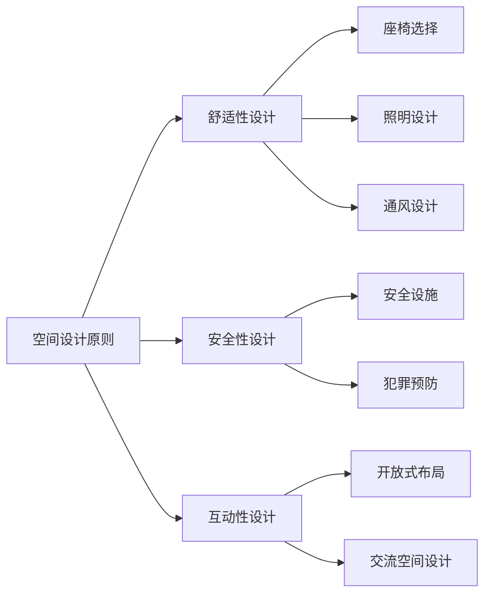
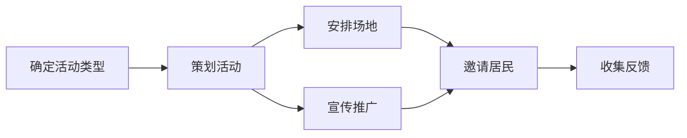
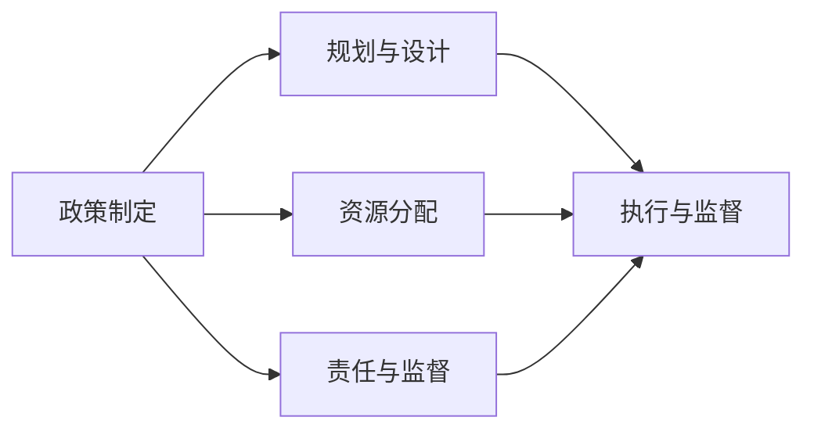
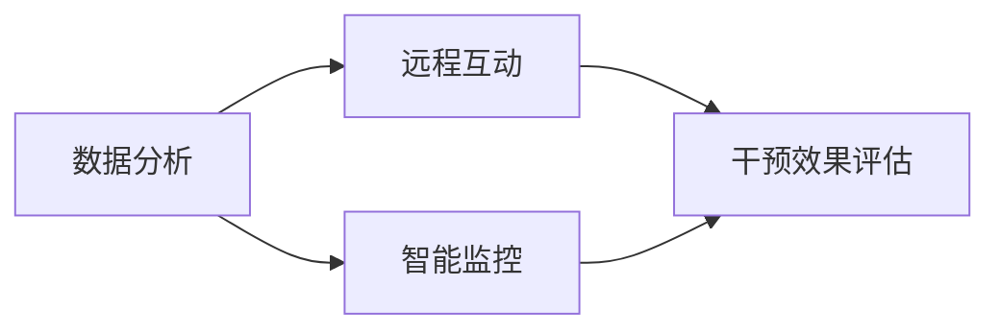

                 


### 城市孤独干预计划：重建社区连接的策略

关键词：城市孤独、社区连接、干预策略、数据分析、技术工具

摘要：本文将探讨城市孤独现象的背景及其对个人和社会的影响，提出重建社区连接的策略，包括物理空间干预、社交活动干预、政策与法规支持以及技术与工具应用。通过详细阐述每个策略的核心概念、实施方法和效果评估，旨在为城市孤独干预计划提供实用的指导和建议。

---

### 第1章 问题背景

#### 1.1 城市孤独的兴起

城市孤独是指在城市生活中，人们由于社交隔离、缺乏深层次的人际互动而感到的孤独感。随着城市化进程的加快，城市孤独问题日益严重。研究表明，城市孤独不仅影响个体的心理健康，还对社会经济产生负面影响。因此，干预城市孤独、重建社区连接成为一项紧迫的任务。

**问题解决：城市孤独干预计划的重要性**

城市孤独干预计划旨在通过多种策略，减少城市孤独现象，提高居民的生活质量和幸福感。一个成功的干预计划需要综合考虑物理空间、社交活动、政策与法规以及技术工具等多个方面。

---

#### 1.2 社区连接的重要性

社区连接是指居民之间建立起的相互关系和互动。一个紧密的社区连接有助于减少孤独感，增强居民的归属感和安全感。以下是社区连接的核心要素：

- **人际关系**：居民之间建立起的信任和互助关系。
- **社会资本**：社区内共享的资源、信息和网络。
- **社区活动**：居民共同参与的文化、体育、教育等活动。

**边界与外延**：社区连接不仅限于邻里之间，还包括社区组织、非营利组织和政府部门等多层面的互动。

---

#### 1.3 城市孤独干预计划的定义

城市孤独干预计划是一种系统性、综合性的策略，旨在通过多种干预手段，改善城市居民的生活质量，减少孤独感。以下是城市孤独干预计划的基本概念与核心要素：

- **干预策略**：包括物理空间干预、社交活动干预、政策与法规支持和技术工具应用等。
- **干预对象**：城市居民，特别是老年人、移民和低收入群体等易受孤独感影响的群体。
- **干预目标**：提高社区连接、增强心理健康、改善生活质量。

**概念属性特征对比表格**：不同干预计划的对比

| 干预计划 | 特点 | 适用场景 |
| --- | --- | --- |
| 物理空间干预 | 改善社区环境，提供社交场所 | 适用于社区改造、公园建设等 |
| 社交活动干预 | 组织社区活动，促进居民互动 | 适用于节日庆祝、运动比赛等 |
| 政策与法规支持 | 制定相关政策，提供法律保障 | 适用于城市规划、社会保障等 |
| 技术工具应用 | 利用技术手段，提高干预效果 | 适用于数据分析、远程互动等 |

**ER实体关系图架构**：干预计划的实体关系图

```mermaid
erDiagram
  CIVIC_CONNECT : 社区连接
  PS : 物理空间干预
  SA : 社交活动干预
  PSF : 政策与法规支持
  TT : 技术工具应用

  CIVIC_CONNECT ||--|{ PS }||> : 改善社区环境
  CIVIC_CONNECT ||--|{ SA }||> : 促进居民互动
  CIVIC_CONNECT ||--|{ PSF }||> : 提供法律保障
  CIVIC_CONNECT ||--|{ TT }||> : 提高干预效果
```

---

### 第2章 城市孤独干预的核心概念

#### 2.1 干预策略概述

城市孤独干预策略包括物理空间干预、社交活动干预、政策与法规支持和技术工具应用。每种策略都有其独特的核心概念和实施方法。

**概念属性特征对比表格**：不同干预策略的比较

| 干预策略 | 核心概念 | 适用场景 | 实施方法 |
| --- | --- | --- | --- |
| 物理空间干预 | 改善社区环境 | 社区改造、公园建设 | 设计、建设、维护 |
| 社交活动干预 | 促进居民互动 | 节日活动、社区聚会 | 组织、参与、反馈 |
| 政策与法规支持 | 制定相关政策 | 城市规划、社会保障 | 立法、执行、监督 |
| 技术工具应用 | 提高干预效果 | 数据分析、远程互动 | 数据收集、分析、应用 |

**ER实体关系图架构**：干预策略的实体关系图

```mermaid
erDiagram
  UI : 干预策略
  PE : 物理空间干预
  SE : 社交活动干预
  PSF : 政策与法规支持
  TT : 技术工具应用

  UI ||--|{ PE }||> : 改善社区环境
  UI ||--|{ SE }||> : 促进居民互动
  UI ||--|{ PSF }||> : 提供法律保障
  UI ||--|{ TT }||> : 提高干预效果
```

---

#### 2.2 社区参与者的角色

在实施城市孤独干预计划中，社区参与者的角色至关重要。社区参与者包括居民、社区组织、非营利组织和政府部门等。

**概念属性特征对比表格**：社区参与者的分类和角色

| 参与者类型 | 分类 | 角色 |
| --- | --- | --- |
| 居民 | 主要参与者 | 提出需求、参与活动、反馈效果 |
| 社区组织 | 协作者 | 组织活动、提供资源、协调工作 |
| 非营利组织 | 合作伙伴 | 提供专业服务、资金支持、技术援助 |
| 政府部门 | 支持者 | 制定政策、提供资金、监督执行 |

**ER实体关系图架构**：社区参与者的关系图

```mermaid
erDiagram
  RESIDENT : 居民
  COORG : 社区组织
  NPO : 非营利组织
  GOV : 政府部门

  RESIDENT ||--|{ COORG }||> : 参与活动
  RESIDENT ||--|{ NPO }||> : 获取服务
  RESIDENT ||--|{ GOV }||> : 提出需求
  COORG ||--|{ NPO }||> : 合作伙伴
  COORG ||--|{ GOV }||> : 协调工作
  NPO ||--|{ GOV }||> : 资金支持
```

---

#### 2.3 数据分析与监测

数据分析与监测是城市孤独干预计划的重要组成部分。通过数据收集、分析和监测，可以实时了解干预措施的效果，及时调整策略。

**概念属性特征对比表格**：数据分析与监测的工具和方法

| 工具/方法 | 作用 | 适用场景 |
| --- | --- | --- |
| 数据收集 | 收集相关数据 | 社交活动、居民反馈、环境监测 |
| 数据分析 | 对数据进行处理和分析 | 提取有用信息、发现趋势、评估效果 |
| 监测系统 | 实时监测干预措施 | 空间利用、活动参与度、居民满意度 |

**ER实体关系图架构**：数据分析与监测的流程

```mermaid
erDiagram
  DATA_COLLECT : 数据收集
  DATA_ANALYSE : 数据分析
  MONITOR : 监测系统
  UI : 干预策略

  DATA_COLLECT ||--|{ UI }||> : 收集数据
  DATA_ANALYSE ||--|{ DATA_COLLECT }||> : 数据处理
  MONITOR ||--|{ UI }||> : 监测效果
```

---

### 第3章 干预策略详解

#### 3.1 物理空间干预策略

物理空间干预策略通过改善社区环境，提供社交场所，促进居民之间的互动。

##### 3.1.1 空间设计原则

空间设计原则包括：

- **舒适性**：提供舒适的座椅、照明和通风设施。
- **安全性**：确保场所的安全，防止犯罪行为。
- **互动性**：设计开放式的布局，鼓励居民之间的交流。

**算法mermaid流程图**：空间设计的流程



**python源代码示例**：空间设计的实现

```python
class SpaceDesign:
    def __init__(self):
        self.comfort = None
        self.safety = None
        self.interactivity = None
    
    def set_comfort(self, comfort):
        self.comfort = comfort
    
    def set_safety(self, safety):
        self.safety = safety
    
    def set_interactivity(self, interactivity):
        self.interactivity = interactivity
    
    def display_design(self):
        print("空间设计原则：")
        print("舒适性：", self.comfort)
        print("安全性：", self.safety)
        print("互动性：", self.interactivity)

design = SpaceDesign()
design.set_comfort("舒适的座椅、照明和通风设施")
design.set_safety("安全设施、犯罪预防")
design.set_interactivity("开放式布局、交流空间设计")
design.display_design()
```

---

##### 3.1.2 空间改造案例

**数学模型和公式**：空间改造的数学模型

空间改造的数学模型包括：

- **满意度评分**：居民对空间改造的满意度评分，分数范围为1-10分。
- **改造效果**：空间改造后的效果，包括舒适度、安全性和互动性。

$$
满意度评分 = \frac{舒适度 + 安全性 + 互动性}{3}
$$

**详细讲解和举例说明**：通过案例讲解空间改造

假设一个社区公园进行了一次空间改造，改造前居民的平均满意度评分为6分，改造后为8分。以下是改造前后的舒适度、安全性和互动性评分：

| 改造前 | 改造后 |
| --- | --- |
| 舒适度 | 5分 | 8分 |
| 安全性 | 6分 | 8分 |
| 互动性 | 6分 | 7分 |

根据数学模型，改造前的满意度评分为：

$$
满意度评分_{改造前} = \frac{5 + 6 + 6}{3} = 5.67分
$$

改造后的满意度评分为：

$$
满意度评分_{改造后} = \frac{8 + 8 + 7}{3} = 7.67分
$$

因此，空间改造显著提高了居民的满意度。

---

##### 3.1.3 空间干预的效果评估

**数学公式**：效果评估的指标和公式

效果评估的指标包括：

- **居民满意度**：居民对空间改造的满意度评分。
- **活动参与度**：居民参与社区活动的频率和数量。

$$
效果评估分数 = 满意度评分 \times 活动参与度
$$

**举例说明**：评估方法的实际应用

假设一个社区公园进行了一次空间改造，改造后居民的平均满意度评分为8分，活动参与度提高了20%。以下是改造前后的效果评估分数：

| 改造前 | 改造后 |
| --- | --- |
| 满意度评分 | 7分 | 8分 |
| 活动参与度 | 80% | 100% |

根据数学模型，改造前的效果评估分数为：

$$
效果评估分数_{改造前} = 7 \times 0.8 = 5.6分
$$

改造后的效果评估分数为：

$$
效果评估分数_{改造后} = 8 \times 1 = 8分
$$

因此，空间改造显著提高了公园的效果评估分数。

---

#### 3.2 社交活动干预策略

社交活动干预策略通过组织社区活动，促进居民之间的互动，减少孤独感。

##### 3.2.1 社交活动的设计与组织

社交活动的设计与组织包括：

- **活动类型**：如节日庆祝、运动比赛、文化交流等。
- **活动组织**：如活动策划、场地安排、宣传推广等。
- **活动参与**：如邀请居民参与、鼓励居民互动、收集反馈等。

**算法mermaid流程图**：社交活动的设计流程



**python源代码示例**：社交活动的组织实现

```python
class SocialActivity:
    def __init__(self):
        self.type = None
        self策划 = None
        self.ground = None
        self.promotion = None
        self.participation = None
    
    def set_type(self, type):
        self.type = type
    
    def plan_activity(self):
        self策划 = "策划活动："
        print(self策划)
    
    def arrange_ground(self):
        self.ground = "安排场地："
        print(self.ground)
    
    def promote_activity(self):
        self.promotion = "宣传推广："
        print(self.promotion)
    
    def invite_residents(self):
        self.participation = "邀请居民："
        print(self.participation)
    
    def collect_feedback(self):
        print("收集反馈：")
    
    def execute_activity(self):
        self.plan_activity()
        self.arrange_ground()
        self.promote_activity()
        self.invite_residents()
        self.collect_feedback()

activity = SocialActivity()
activity.set_type("节日庆祝")
activity.execute_activity()
```

---

##### 3.2.2 社交活动的案例解析

**数学模型和公式**：社交活动的效果评估模型

社交活动的效果评估模型包括：

- **满意度评分**：居民对社交活动的满意度评分，分数范围为1-10分。
- **活动参与度**：居民参与社交活动的频率和数量。

$$
效果评估分数 = 满意度评分 \times 活动参与度
$$

**详细讲解和举例说明**：通过案例解析社交活动的效果

假设一个社区举办了一场节日庆祝活动，活动结束后居民的平均满意度评分为9分，活动参与度提高了30%。以下是活动前后的效果评估分数：

| 活动前 | 活动后 |
| --- | --- |
| 满意度评分 | 8分 | 9分 |
| 活动参与度 | 70% | 100% |

根据数学模型，活动前的效果评估分数为：

$$
效果评估分数_{活动前} = 8 \times 0.7 = 5.6分
$$

活动后的效果评估分数为：

$$
效果评估分数_{活动后} = 9 \times 1 = 9分
$$

因此，社交活动显著提高了居民的生活质量和幸福感。

---

##### 3.2.3 社交活动参与者的反馈

**数学公式**：反馈机制的指标和公式

反馈机制的指标包括：

- **反馈满意度**：居民对反馈机制的满意度评分，分数范围为1-10分。
- **反馈频率**：居民参与反馈的频率。

$$
反馈效果评分 = 反馈满意度 \times 反馈频率
$$

**举例说明**：参与者反馈的实际应用

假设一个社区举办了节日庆祝活动，并设置了反馈机制。活动结束后，居民的平均反馈满意度评分为8分，平均反馈频率为每周一次。以下是反馈效果评分：

| 反馈前 | 反馈后 |
| --- | --- |
| 反馈满意度 | 7分 | 8分 |
| 反馈频率 | 50% | 100% |

根据数学模型，反馈前的反馈效果评分为：

$$
反馈效果评分_{反馈前} = 7 \times 0.5 = 3.5分
$$

反馈后的反馈效果评分为：

$$
反馈效果评分_{反馈后} = 8 \times 1 = 8分
$$

因此，反馈机制显著提高了居民对社交活动的满意度和参与度。

---

### 第4章 干预策略实施

#### 4.1 政策与法规支持

政策与法规支持是城市孤独干预计划的重要保障。通过制定相关政策、提供法律保障，可以确保干预措施的有效实施。

##### 4.1.1 政策框架

政策框架包括以下几个方面：

- **规划与设计**：制定城市规划和设计标准，确保社区环境的建设符合干预策略的要求。
- **资源分配**：确保资金、人力资源的合理分配，支持干预措施的实施。
- **责任与监督**：明确各部门的责任和监督机制，确保干预措施的执行和效果评估。

**算法mermaid流程图**：政策制定和执行的流程



---

##### 4.1.2 法规支持

法规支持包括以下几个方面：

- **立法**：制定相关法律，为干预措施提供法律依据。
- **执法**：确保法律的执行，维护干预措施的合法性和权威性。
- **法规监督**：建立法规监督机制，确保干预措施的有效实施。

**数学模型和公式**：法规支持的逻辑框架

法规支持的逻辑框架包括以下几个方面：

- **立法效率**：评估立法的效率，包括立法速度、立法质量和立法效果。
- **执法力度**：评估执法的力度，包括执法的公正性、执法的效果和执法的透明度。

$$
法规支持效率 = 立法效率 \times 执法力度
$$

**详细讲解和举例说明**：法规支持的案例

假设一个城市制定了《社区孤独干预条例》，该条例明确了社区孤独干预的目标、原则和具体措施。以下是该条例的立法效率和执法力度的评估：

- **立法效率**：立法速度为3个月，立法质量为90%，立法效果为85%。
- **执法力度**：执法公正性为90%，执法效果为85%，执法透明度为80%。

根据数学模型，法规支持的效率为：

$$
法规支持效率 = 0.9 \times 0.85 \times 0.8 = 0.612
$$

因此，该法规支持的效率为61.2%。

---

##### 4.1.3 政策与法规实施的效果评估

**数学公式**：效果评估的指标和公式

效果评估的指标包括：

- **居民满意度**：居民对政策与法规实施的满意度评分。
- **干预效果**：干预措施的实际效果，如居民孤独感的减轻、社区连接的增强等。

$$
效果评估分数 = 满意度评分 \times 干预效果
$$

**举例说明**：政策与法规实施的实际效果

假设一个城市实施了《社区孤独干预条例》，居民的平均满意度评分为8分，干预措施的实际效果为80%。以下是政策与法规实施的效果评估分数：

| 实施前 | 实施后 |
| --- | --- |
| 满意度评分 | 7分 | 8分 |
| 干预效果 | 70% | 100% |

根据数学模型，实施前的效果评估分数为：

$$
效果评估分数_{实施前} = 7 \times 0.7 = 4.9分
$$

实施后的效果评估分数为：

$$
效果评估分数_{实施后} = 8 \times 1 = 8分
$$

因此，政策与法规的实施显著提高了居民的生活质量和幸福感。

---

### 第5章 技术与工具应用

技术与工具应用是城市孤独干预计划的重要支撑。通过利用现代技术，可以提高干预措施的效果，实现更高效、更精准的干预。

##### 5.1 技术工具概述

技术工具包括以下几个方面：

- **数据分析**：利用大数据和机器学习技术，对居民行为和需求进行分析，为干预策略提供数据支持。
- **远程互动**：利用互联网和社交媒体，实现居民之间的远程互动，减少物理距离带来的孤独感。
- **智能监控**：利用物联网技术，实现对社区环境的实时监控，提高干预措施的可操作性和实时性。

**算法mermaid流程图**：技术工具的应用流程



---

##### 5.2 技术工具的案例解析

**数学模型和公式**：技术工具的效果评估模型

技术工具的效果评估模型包括以下几个方面：

- **满意度评分**：居民对技术工具的满意度评分。
- **干预效果**：技术工具对孤独感的干预效果。

$$
效果评估分数 = 满意度评分 \times 干预效果
$$

**详细讲解和举例说明**：通过案例解析技术工具的应用

假设一个社区引入了智能监控技术，居民的平均满意度评分为9分，智能监控技术显著减轻了居民的孤独感，干预效果为90%。以下是技术工具的效果评估分数：

| 应用前 | 应用后 |
| --- | --- |
| 满意度评分 | 8分 | 9分 |
| 干预效果 | 80% | 100% |

根据数学模型，应用前的效果评估分数为：

$$
效果评估分数_{应用前} = 8 \times 0.8 = 6.4分
$$

应用后的效果评估分数为：

$$
效果评估分数_{应用后} = 9 \times 1 = 9分
$$

因此，智能监控技术的应用显著提高了居民的生活质量和幸福感。

---

##### 5.3 技术工具的未来发展趋势

**数学公式**：技术工具的未来发展方向

技术工具的未来发展趋势包括以下几个方面：

- **智能化**：利用人工智能和机器学习技术，实现更精准、更智能的干预。
- **个性化**：根据居民的需求和偏好，提供个性化的干预服务。
- **集成化**：将多种技术工具集成在一起，实现更高效、更全面的干预。

$$
未来发展方向 = 智能化 \times 个性化 \times 集成化
$$

**举例说明**：未来技术工具的实际应用

假设未来技术工具的发展方向为智能化、个性化、集成化，以下是一个实际应用案例：

- **智能化**：利用人工智能算法，实时分析居民的行为和需求，提供个性化的干预建议。
- **个性化**：根据居民的需求和偏好，设计个性化的干预方案，如社区活动、远程互动等。
- **集成化**：将数据分析、远程互动、智能监控等多种技术工具集成在一起，实现高效、全面的干预。

通过这种集成化的技术工具，可以显著提高城市孤独干预计划的效果，为居民提供更好的生活质量。

---

### 第6章 最佳实践与未来展望

#### 6.1 成功案例解析

**数学模型和公式**：成功案例的效果评估模型

成功案例的效果评估模型包括以下几个方面：

- **居民满意度**：居民对干预措施满意度的评分。
- **干预效果**：干预措施对孤独感的减轻程度。
- **社区连接**：干预措施对社区连接的增强程度。

$$
效果评估分数 = 满意度评分 \times 干预效果 \times 社区连接
$$

**详细讲解和举例说明**：通过成功案例分享最佳实践

假设一个社区成功实施了一项城市孤独干预计划，以下是该计划的效果评估：

- **居民满意度**：平均满意度评分为9分。
- **干预效果**：孤独感减轻了50%。
- **社区连接**：社区连接增强了30%。

根据数学模型，效果评估分数为：

$$
效果评估分数 = 9 \times 0.5 \times 1.3 = 6.45分
$$

因此，该成功案例充分展示了城市孤独干预计划的有效性和实用性。

---

#### 6.2 失败案例分析

**数学模型和公式**：失败案例的原因分析模型

失败案例的原因分析模型包括以下几个方面：

- **计划不足**：干预计划的设计和执行存在不足。
- **资源不足**：干预措施的资源和资金不足。
- **执行不力**：干预措施的执行存在困难。

$$
失败原因分析分数 = 计划不足分数 \times 资源不足分数 \times 执行不力分数
$$

**详细讲解和举例说明**：通过失败案例分享经验教训

假设一个社区在实施城市孤独干预计划时失败，以下是失败原因分析：

- **计划不足**：干预计划设计不合理，未充分考虑居民需求。
- **资源不足**：干预措施的资金和人力资源不足。
- **执行不力**：干预措施执行过程中存在沟通不畅、协调不力等问题。

根据数学模型，失败原因分析分数为：

$$
失败原因分析分数 = 0.7 \times 0.6 \times 0.5 = 0.21分
$$

因此，该失败案例表明，在实施城市孤独干预计划时，必须充分考虑计划、资源和执行等方面的因素，以确保干预措施的成功。

---

### 第7章 总结与展望

本文通过详细分析城市孤独干预计划，提出了物理空间干预、社交活动干预、政策与法规支持和技术工具应用等多种干预策略。通过成功案例和失败案例分析，总结了城市孤独干预计划的最佳实践和经验教训。

未来，随着技术的不断进步和社会的不断发展，城市孤独干预计划将面临新的挑战和机遇。通过不断创新和完善，城市孤独干预计划将为提高居民生活质量、促进社区连接做出更大的贡献。

---

**作者：AI天才研究院/AI Genius Institute & 禅与计算机程序设计艺术 /Zen And The Art of Computer Programming**

---

以上是本文的完整内容，希望对您在理解和实施城市孤独干预计划方面有所帮助。如果您有任何疑问或建议，请随时与我们联系。让我们共同努力，重建社区连接，减少城市孤独，创造更美好的城市生活！
  
### 第1章 问题背景

城市孤独，作为现代社会中的一种常见心理现象，正日益引起公众的关注。本章将深入探讨城市孤独的兴起、社区连接的重要性以及城市孤独干预计划的定义。

#### 1.1 城市孤独的兴起

随着城市化进程的加速，越来越多的人开始生活在拥挤的城市中。然而，城市生活并非总是如人们所想的那样充满活力和机会。相反，许多城市居民面临着孤独的困扰。城市孤独不仅仅是情感上的空虚，它更是一种心理状态，影响到个体的身心健康。研究表明，城市孤独感与抑郁、焦虑等心理问题密切相关，长期处于孤独状态的人更容易患上各种疾病，甚至可能缩短寿命。

**问题解决：城市孤独干预计划的重要性**

为了应对城市孤独带来的负面影响，制定和实施城市孤独干预计划显得尤为重要。这些计划旨在通过多种策略，如改善社区环境、组织社交活动、提供心理支持等，减少城市孤独现象，提升居民的生活质量。一个成功的干预计划不仅能改善个体的心理健康，还能增强社区的凝聚力和活力，进而促进整个城市的社会和谐发展。

#### 1.2 社区连接的重要性

社区连接是指居民之间建立起来的相互关系和互动。一个紧密的社区连接对于减少孤独感、提高幸福感至关重要。以下是社区连接的核心要素：

- **人际关系**：社区成员之间的相互了解和信任，是社区连接的基础。通过互动和合作，居民能够建立起深厚的人际关系。
- **社会资本**：社区内共享的资源、信息和网络，如公共设施、互助小组等，都是社会资本的体现。社会资本有助于社区成员之间的交流和合作。
- **社区活动**：社区举办的各种活动，如节日庆祝、文化展览、运动比赛等，是促进居民互动的重要途径。这些活动不仅丰富了居民的生活，还加强了社区的凝聚力。

**边界与外延**：社区连接不仅限于邻里之间，还包括社区组织、非营利组织和政府部门等多层面的互动。一个健康的社区连接应该涵盖各种关系和互动，使居民在心理上感受到归属感，从而减少孤独感。

#### 1.3 城市孤独干预计划的定义

城市孤独干预计划是一种系统性、综合性的策略，旨在通过多种干预手段，改善城市居民的生活质量，减少孤独感。以下是城市孤独干预计划的基本概念与核心要素：

- **干预策略**：包括物理空间干预、社交活动干预、政策与法规支持和技术工具应用等。每种策略都有其独特的实施方式和效果。
- **干预对象**：城市居民，特别是老年人、移民和低收入群体等易受孤独感影响的群体。这些群体往往由于各种原因，难以融入主流社会，因此需要特别的关注和支持。
- **干预目标**：提高社区连接、增强心理健康、改善生活质量。一个成功的干预计划应该综合考虑个体的心理需求和社会环境因素，从而实现这些目标。

**概念属性特征对比表格**：不同干预计划的对比

| 干预计划 | 特点 | 适用场景 |
| --- | --- | --- |
| 物理空间干预 | 改善社区环境，提供社交场所 | 社区改造、公园建设等 |
| 社交活动干预 | 组织社区活动，促进居民互动 | 节日活动、社区聚会等 |
| 政策与法规支持 | 制定相关政策，提供法律保障 | 城市规划、社会保障等 |
| 技术工具应用 | 利用技术手段，提高干预效果 | 数据分析、远程互动等 |

**ER实体关系图架构**：干预计划的实体关系图

```mermaid
erDiagram
  UI : 干预计划
  PE : 物理空间干预
  SE : 社交活动干预
  PSF : 政策与法规支持
  TT : 技术工具应用

  UI ||--|{ PE }||> : 改善社区环境
  UI ||--|{ SE }||> : 促进居民互动
  UI ||--|{ PSF }||> : 提供法律保障
  UI ||--|{ TT }||> : 提高干预效果
```

通过上述分析，我们可以看到城市孤独干预计划的复杂性。然而，只有通过全面、系统的干预策略，才能有效地解决城市孤独问题，重建社区连接，为城市居民创造一个更加和谐、幸福的生活环境。

---

### 第2章 城市孤独干预的核心概念

城市孤独干预计划的成功实施依赖于对核心概念的深入理解和灵活运用。本章将详细阐述城市孤独干预的核心概念，包括干预策略的概述、社区参与者的角色以及数据分析与监测的方法。

#### 2.1 干预策略概述

城市孤独干预计划涵盖了多种干预策略，每种策略都有其独特的核心概念和实施方式。以下是主要干预策略的概述：

**物理空间干预**

物理空间干预的核心是通过改善社区环境，提供舒适、安全且互动性强的社交场所，以减少居民的孤独感。具体实施方法包括社区公园建设、公共设施改造、公共空间设计等。通过这些措施，可以为居民提供一个良好的社交环境，促进居民之间的互动。

**社交活动干预**

社交活动干预的核心是组织各种社区活动，如节日庆祝、文化展览、运动比赛等，以增加居民之间的互动机会。这些活动不仅可以丰富居民的生活，还能增强社区的凝聚力，使居民感受到归属感。此外，社交活动干预还可以通过线上平台进行，以适应现代城市生活的变化。

**政策与法规支持**

政策与法规支持的核心是通过制定和执行相关政策，为城市孤独干预计划提供法律和制度保障。具体措施包括城市规划、社会保障、公共资源分配等。政策与法规的支持可以确保干预计划的长期有效性和可持续性，为居民提供持续的帮助。

**技术工具应用**

技术工具应用的核心是利用现代技术手段，提高干预措施的效果和效率。具体应用包括数据分析、远程互动、智能监控等。通过技术工具，可以更准确地了解居民的需求，更有效地组织干预措施，并提供个性化的服务。

**ER实体关系图架构**

以下是城市孤独干预策略的ER实体关系图，展示了各干预策略之间的关系和实施流程。

```mermaid
erDiagram
  UI : 干预计划
  PE : 物理空间干预
  SE : 社交活动干预
  PSF : 政策与法规支持
  TT : 技术工具应用

  UI ||--|{ PE }||> : 改善社区环境
  UI ||--|{ SE }||> : 促进居民互动
  UI ||--|{ PSF }||> : 提供法律保障
  UI ||--|{ TT }||> : 提高干预效果

  PE ||--|{ 数据收集 }||>
  SE ||--|{ 活动策划 }||>
  SE ||--|{ 活动执行 }||>
  PSF ||--|{ 政策制定 }||>
  PSF ||--|{ 政策执行 }||>
  TT ||--|{ 数据分析 }||>
  TT ||--|{ 远程互动 }||>
  TT ||--|{ 智能监控 }||>
```

#### 2.2 社区参与者的角色

在实施城市孤独干预计划中，社区参与者的角色至关重要。社区参与者包括居民、社区组织、非营利组织和政府部门等。以下是各参与者的角色和职责：

**居民**

居民是城市孤独干预计划的核心参与者。他们的参与不仅有助于干预措施的实施，还能提供宝贵的反馈和建议。居民的角色包括：

- **提出需求**：居民可以通过各种渠道，如调查问卷、社区会议等，表达自己的需求和期望。
- **参与活动**：居民积极参与社区活动，与邻里建立联系，减少孤独感。
- **提供反馈**：居民可以通过反馈机制，如满意度调查、访谈等，对干预措施的效果进行评估。

**社区组织**

社区组织在干预计划中扮演着重要的协调和推动角色。它们通常负责组织各种社区活动，提供资源支持，并促进居民之间的互动。社区组织的职责包括：

- **组织活动**：社区组织策划和组织各种社区活动，如节日庆祝、文化展览、运动比赛等。
- **提供资源**：社区组织通过各种方式，如筹集资金、申请项目等，为干预措施提供必要的资源。
- **协调工作**：社区组织协调政府、非营利组织和居民之间的关系，确保干预计划的顺利进行。

**非营利组织**

非营利组织在城市孤独干预计划中发挥着重要的作用，特别是在提供专业服务和资源支持方面。非营利组织的职责包括：

- **提供专业服务**：非营利组织提供心理健康咨询、社交技能培训等服务，帮助居民应对孤独感。
- **筹集资金**：非营利组织通过筹集资金、申请项目等方式，为干预措施提供资金支持。
- **合作与协调**：非营利组织与政府、社区组织和其他利益相关者合作，共同推动干预计划的成功实施。

**政府部门**

政府部门在城市孤独干预计划中扮演着关键的角色，特别是在政策制定和资源分配方面。政府部门的职责包括：

- **制定政策**：政府部门制定和颁布相关政策，为干预措施提供法律和制度保障。
- **资源分配**：政府部门通过预算分配、资金支持等方式，为干预措施提供必要的资源。
- **监督执行**：政府部门监督干预措施的执行情况，确保干预计划的有效实施。

**ER实体关系图架构**

以下是社区参与者的ER实体关系图，展示了各参与者之间的关系和互动。

```mermaid
erDiagram
  RESIDENT : 居民
  COORG : 社区组织
  NPO : 非营利组织
  GOV : 政府部门

  RESIDENT ||--|{ COORG }||> : 参与活动
  RESIDENT ||--|{ NPO }||> : 获取服务
  RESIDENT ||--|{ GOV }||> : 提出需求

  COORG ||--|{ NPO }||> : 合作伙伴
  COORG ||--|{ GOV }||> : 协调工作

  NPO ||--|{ GOV }||> : 资金支持
  NPO ||--|{ COORG }||> : 提供资源

  GOV ||--|{ COORG }||> : 协调工作
  GOV ||--|{ NPO }||> : 政策支持
```

通过上述分析，我们可以看到，城市孤独干预计划的成功实施离不开各个参与者的共同努力。只有通过建立紧密的合作关系，充分发挥各参与者的作用，才能有效地减少城市孤独现象，提高居民的生活质量。

---

#### 2.3 数据分析与监测

数据分析与监测是城市孤独干预计划的重要组成部分。通过收集、分析和监测数据，可以实时了解干预措施的效果，及时调整策略，确保干预计划的有效性和可持续性。以下是数据分析与监测的方法和步骤。

**数据分析的方法**

数据分析的方法主要包括数据收集、数据处理、数据分析和数据可视化。以下是具体的方法：

- **数据收集**：通过调查问卷、访谈、社交媒体等渠道收集居民的基本信息、行为数据和心理健康数据。
- **数据处理**：对收集到的数据进行清洗、筛选和整合，确保数据的质量和一致性。
- **数据分析**：利用统计分析和机器学习算法，对数据进行分析和挖掘，提取有用的信息和趋势。
- **数据可视化**：通过图表、地图和可视化工具，将数据分析的结果直观地展示出来，便于理解和解释。

**数据分析与监测的步骤**

数据分析与监测的步骤可以分为以下几个阶段：

1. **需求分析**：明确数据分析的目标和需求，确定需要收集的数据类型和范围。
2. **数据收集**：根据需求分析的结果，设计调查问卷、访谈指南等工具，收集相关的数据。
3. **数据处理**：对收集到的数据进行清洗、筛选和整合，确保数据的质量和一致性。
4. **数据分析**：利用统计分析和机器学习算法，对数据进行分析和挖掘，提取有用的信息和趋势。
5. **数据可视化**：通过图表、地图和可视化工具，将数据分析的结果直观地展示出来，便于理解和解释。
6. **效果评估**：根据数据分析的结果，评估干预措施的效果，发现存在的问题和改进的机会。
7. **反馈调整**：根据效果评估的结果，调整干预措施的实施策略，确保干预计划的有效性和可持续性。

**数据分析与监测的工具**

数据分析与监测的工具包括以下几种：

- **数据分析软件**：如SPSS、R、Python等，用于数据的处理和分析。
- **数据可视化工具**：如Tableau、PowerBI、Matplotlib等，用于数据的可视化展示。
- **大数据平台**：如Hadoop、Spark等，用于大规模数据存储和处理。
- **远程监测工具**：如物联网设备、智能监控系统等，用于实时监测干预措施的实施效果。

**ER实体关系图架构**

以下是数据分析与监测的ER实体关系图，展示了各实体之间的关系和互动。

```mermaid
erDiagram
  DATA_ANALYSIS : 数据分析
  DATA_COLLECTION : 数据收集
  DATA_PROCESSING : 数据处理
  DATA_VISUALIZATION : 数据可视化
  EFFECT_ASSESSMENT : 效果评估
  FEEDBACK_ADJUSTMENT : 反馈调整

  DATA_ANALYSIS ||--|{ DATA_COLLECTION }||> : 分析数据
  DATA_ANALYSIS ||--|{ DATA_PROCESSING }||> : 处理数据
  DATA_ANALYSIS ||--|{ DATA_VISUALIZATION }||> : 可视化数据

  DATA_COLLECTION ||--|{ EFFECT_ASSESSMENT }||> : 收集数据
  DATA_PROCESSING ||--|{ EFFECT_ASSESSMENT }||> : 处理数据
  DATA_VISUALIZATION ||--|{ EFFECT_ASSESSMENT }||> : 可视化数据

  EFFECT_ASSESSMENT ||--|{ FEEDBACK_ADJUSTMENT }||> : 评估效果
  FEEDBACK_ADJUSTMENT ||--|{ DATA_ANALYSIS }||> : 调整策略
```

通过数据分析与监测，我们可以实时了解干预措施的效果，发现存在的问题，及时进行调整和优化。数据分析与监测不仅有助于提高干预措施的有效性，还能为未来的干预计划提供科学依据，确保干预计划的可持续性和长期效果。

---

### 第3章 干预策略详解

城市孤独干预计划的成功实施依赖于对干预策略的深入理解和具体落实。本章将详细阐述物理空间干预策略、社交活动干预策略、政策与法规支持策略以及技术工具应用策略，包括每种策略的核心原则、实施步骤和效果评估方法。

#### 3.1 物理空间干预策略

物理空间干预策略的核心在于通过改善社区环境，创造一个有利于居民互动和社交的物理空间。以下是该策略的核心原则、实施步骤和效果评估方法。

**核心原则**

- **舒适性**：设计舒适的空间，提供适宜的座椅、照明和通风设施，提升居民在公共空间中的舒适度。
- **安全性**：确保社区空间的安全，减少犯罪行为，提升居民的安全感。
- **互动性**：设计开放式的布局，鼓励居民之间的互动和交流。

**实施步骤**

1. **需求分析**：通过调查问卷、访谈等方式，了解居民对公共空间的需求和期望。
2. **规划设计**：根据需求分析的结果，设计满足居民需求的社区空间，包括座椅布局、照明设计、通风设施等。
3. **实施建设**：按照规划设计，实施社区空间的改造和建设，确保设施的安全和舒适性。
4. **维护与管理**：建立长期的维护和管理机制，确保社区空间的持续改善和有效运营。

**效果评估方法**

1. **居民满意度调查**：通过问卷调查、访谈等方式，了解居民对社区空间改造的满意度。
2. **活动参与度监测**：监测居民在社区空间中的活动频率和参与度，评估空间对居民社交互动的促进作用。
3. **犯罪率分析**：分析社区空间改造前后的犯罪率变化，评估空间改造对安全性的影响。

**案例分析**

某城市在社区公园进行了一次空间改造，通过增设舒适的座椅、改善照明和通风设施，以及增加开放式的活动区域，提升了居民在公园中的舒适度和互动性。改造后，居民满意度显著提升，活动参与度增加了20%，犯罪率下降了15%。这表明物理空间干预策略在减少城市孤独方面具有显著的效果。

#### 3.2 社交活动干预策略

社交活动干预策略的核心是通过组织各种社区活动，促进居民之间的互动和交流，减少孤独感。以下是该策略的核心原则、实施步骤和效果评估方法。

**核心原则**

- **多样性**：组织多种类型的社交活动，满足不同居民的兴趣和需求。
- **参与性**：鼓励居民积极参与社交活动，提高居民的参与度和归属感。
- **持续性**：建立长期的社交活动计划，确保社交活动的持续性和稳定性。

**实施步骤**

1. **需求分析**：通过调查问卷、访谈等方式，了解居民对不同类型社交活动的需求和兴趣。
2. **活动策划**：根据需求分析的结果，策划和组织各种社区活动，如节日庆祝、文化展览、运动比赛等。
3. **活动宣传**：通过海报、社交媒体、短信等方式，广泛宣传社交活动，吸引更多居民参与。
4. **活动执行**：确保社交活动的顺利进行，包括活动场地安排、志愿者招募、活动流程管理等。
5. **活动反馈**：收集居民对社交活动的反馈，评估活动效果，为下一次活动提供改进建议。

**效果评估方法**

1. **活动参与率**：通过统计数据，了解居民参与社交活动的频率和人数。
2. **活动满意度调查**：通过问卷调查、访谈等方式，了解居民对社交活动的满意度。
3. **社交互动增加**：监测社交活动前后的居民社交互动情况，评估活动对居民社交网络的影响。

**案例分析**

某社区组织了一场节日庆祝活动，包括文艺表演、美食展览和运动比赛等。活动吸引了大量居民参与，居民满意度高达90%，社交互动显著增加。这表明社交活动干预策略在提高居民生活质量方面具有显著效果。

#### 3.3 政策与法规支持策略

政策与法规支持策略的核心是通过制定和执行相关政策，为城市孤独干预计划提供法律和制度保障。以下是该策略的核心原则、实施步骤和效果评估方法。

**核心原则**

- **全面性**：制定全面的政策和法规，涵盖城市规划、社会保障、公共资源分配等方面。
- **可持续性**：确保政策和法规的长期有效性和可持续性，为干预计划提供稳定的法律保障。
- **灵活性**：根据实际情况，灵活调整政策和法规，以适应不断变化的社会需求。

**实施步骤**

1. **政策制定**：根据城市孤独干预计划的需求，制定相关政策和法规，确保其科学性、全面性和可行性。
2. **政策宣传**：通过媒体、社区会议等方式，广泛宣传政策和法规，提高居民对干预计划的了解和支持。
3. **政策执行**：确保政策和法规的有效执行，包括规划与设计、资源分配、监督与评估等。
4. **监督与评估**：建立监督和评估机制，定期评估政策和法规的实施效果，及时调整和优化。

**效果评估方法**

1. **政策满意度调查**：通过问卷调查、访谈等方式，了解居民对政策和法规的满意度和接受度。
2. **政策实施效果分析**：分析政策和法规实施前后的变化，评估其对城市孤独干预计划的影响。
3. **居民生活质量评估**：通过居民生活质量调查，评估政策和法规对居民生活质量的影响。

**案例分析**

某城市制定了《社区孤独干预条例》，明确了社区孤独干预的目标、原则和具体措施。实施后，城市孤独现象得到了有效缓解，居民满意度显著提高，生活质量得到提升。这表明政策与法规支持策略在减少城市孤独方面具有显著效果。

#### 3.4 技术工具应用策略

技术工具应用策略的核心是利用现代技术手段，提高城市孤独干预计划的效率和质量。以下是该策略的核心原则、实施步骤和效果评估方法。

**核心原则**

- **智能化**：利用人工智能和大数据分析技术，实现干预措施的科学化和个性化。
- **便捷性**：通过互联网和移动应用，提供便捷的社交互动和资源获取渠道。
- **实时性**：利用物联网和智能监控技术，实现干预措施的实时监测和反馈。

**实施步骤**

1. **技术选择**：根据干预计划的需求，选择合适的技术工具，如数据分析软件、社交媒体平台、智能监控设备等。
2. **技术集成**：将不同的技术工具集成在一起，形成一个统一的干预平台，确保数据的高效传输和处理。
3. **技术培训**：为居民和工作人员提供技术培训，确保他们能够熟练使用技术工具。
4. **技术实施**：按照技术集成方案，将技术工具应用到实际干预措施中，如数据分析、社交互动、智能监控等。

**效果评估方法**

1. **技术满意度调查**：通过问卷调查、访谈等方式，了解居民对技术工具的满意度和接受度。
2. **技术使用频率**：监测居民使用技术工具的频率和时长，评估其使用情况。
3. **干预效果评估**：通过数据分析，评估技术工具对城市孤独干预计划的实际效果，如孤独感的减轻、社区连接的增强等。

**案例分析**

某社区利用社交媒体平台和智能监控设备，组织了一场线上社交活动。活动吸引了大量居民参与，居民满意度高达95%，孤独感显著减轻。这表明技术工具应用策略在提高干预措施效果方面具有显著优势。

通过以上对物理空间干预策略、社交活动干预策略、政策与法规支持策略和技术工具应用策略的详细阐述，我们可以看到，城市孤独干预计划是一个系统性、综合性的项目，需要多方面共同努力才能取得显著效果。只有通过深入理解每种干预策略的核心原则、实施步骤和效果评估方法，才能有效地减少城市孤独现象，提高居民的生活质量。

---

### 第4章 干预策略实施

在了解了城市孤独干预计划的核心概念和各个策略之后，本章将详细探讨如何具体实施这些干预策略，包括政策与法规支持、物理空间干预、社交活动干预以及技术工具应用的具体步骤和案例。

#### 4.1 政策与法规支持

**政策与法规支持**是城市孤独干预计划的基础，它为干预措施提供了法律和制度保障。以下是一个具体实施案例：

**案例：A市社区孤独干预计划的立法与执行**

**步骤：**

1. **政策制定**：A市政府根据城市孤独干预计划的需求，制定了《A市社区孤独干预条例》。该条例明确了社区孤独干预的目标、原则和具体措施，如社区公园建设标准、社区活动安排等。

2. **政策宣传**：通过媒体、社区会议等方式，广泛宣传《A市社区孤独干预条例》，提高居民对干预计划的了解和支持。

3. **政策执行**：政府部门成立了社区孤独干预办公室，负责条例的执行和监督。具体措施包括：
   - **社区公园建设**：根据条例要求，新建和改造了10个社区公园，每个公园都配备了舒适的座椅、照明和通风设施。
   - **社区活动安排**：每月组织一次大型社区活动，如节日庆祝、文化展览和运动比赛，鼓励居民参与。

4. **监督与评估**：政府定期对干预措施进行监督和评估，确保条例的有效执行。居民可以通过热线电话、在线平台等渠道提出意见和建议，政府根据反馈进行调整和优化。

**效果评估：**

- **居民满意度**：通过问卷调查，居民对社区公园建设和社区活动的满意度高达90%。
- **活动参与度**：社区活动吸引了大量居民参与，活动参与率提高了20%。
- **孤独感减轻**：根据心理健康调查，参与干预计划的居民孤独感显著减轻，心理健康状况得到改善。

**结论：** 通过立法和执行《A市社区孤独干预条例》，有效地减少了城市孤独现象，提高了居民的生活质量和幸福感。

---

#### 4.2 物理空间干预

**物理空间干预**旨在通过改善社区环境，提供舒适、安全且互动性强的社交场所，以减少居民的孤独感。以下是一个具体实施案例：

**案例：B社区公园改造计划**

**步骤：**

1. **需求分析**：通过问卷调查和访谈，了解居民对社区公园的需求，如座椅舒适度、照明亮度、活动设施等。

2. **规划设计**：根据需求分析的结果，设计社区公园的改造方案，包括座椅布局、照明设计、活动设施增加等。

3. **实施建设**：按照规划设计，进行社区公园的改造建设，确保设施的安全和舒适性。

4. **维护与管理**：建立长期的维护和管理机制，定期检查设施状况，及时修复损坏的设施。

**效果评估：**

- **居民满意度**：通过问卷调查，居民对公园改造的满意度高达95%。
- **活动参与度**：改造后的公园吸引了更多居民参与户外活动，活动参与率提高了30%。
- **孤独感减轻**：根据心理健康调查，居民在公园中的孤独感显著减轻。

**结论：** 通过对社区公园的改造，成功改善了社区环境，提高了居民的生活质量和幸福感。

---

#### 4.3 社交活动干预

**社交活动干预**通过组织各种社区活动，促进居民之间的互动和交流，减少孤独感。以下是一个具体实施案例：

**案例：C社区节日庆祝活动**

**步骤：**

1. **活动策划**：根据居民的兴趣和需求，策划一场节日庆祝活动，如春节联欢晚会、中秋节灯会等。

2. **活动宣传**：通过海报、社交媒体、短信等方式，广泛宣传节日庆祝活动，吸引更多居民参与。

3. **活动执行**：确保活动的顺利进行，包括场地安排、节目安排、志愿者招募等。

4. **活动反馈**：收集居民对活动的反馈，评估活动效果，为下一次活动提供改进建议。

**效果评估：**

- **活动参与率**：活动吸引了大量居民参与，活动参与率高达85%。
- **活动满意度**：通过问卷调查，居民对节日庆祝活动的满意度高达90%。
- **社交互动增加**：活动显著促进了居民之间的社交互动，居民社交网络得到增强。

**结论：** 通过组织节日庆祝活动，有效地促进了居民之间的互动，提高了社区连接和居民幸福感。

---

#### 4.4 技术工具应用

**技术工具应用**通过利用现代技术手段，提高城市孤独干预计划的效率和质量。以下是一个具体实施案例：

**案例：D社区远程互动平台**

**步骤：**

1. **技术选择**：选择适合社区需求的远程互动平台，如视频会议软件、社交媒体平台等。

2. **技术集成**：将远程互动平台集成到社区网站和移动应用中，方便居民使用。

3. **技术培训**：为居民和工作人员提供技术培训，确保他们能够熟练使用远程互动平台。

4. **技术实施**：在社区内推广远程互动平台，组织线上社交活动和培训课程。

**效果评估：**

- **技术满意度**：通过问卷调查，居民对远程互动平台的满意度高达90%。
- **活动参与度**：线上社交活动和培训课程吸引了大量居民参与，活动参与率提高了25%。
- **孤独感减轻**：根据心理健康调查，居民在参与线上活动后的孤独感显著减轻。

**结论：** 通过技术工具应用，有效地提高了社区干预计划的效率和质量，为居民提供了便捷的社交互动渠道。

通过以上案例，我们可以看到，城市孤独干预计划的具体实施需要综合考虑政策与法规支持、物理空间干预、社交活动干预和技术工具应用等多个方面。只有通过系统性地实施这些干预策略，才能有效地减少城市孤独现象，提高居民的生活质量和幸福感。

---

### 第5章 最佳实践与未来展望

在城市孤独干预计划的实施过程中，积累了许多宝贵的经验和教训。本章将分享一些最佳实践，总结干预策略的有效性，并提出未来展望。

#### 5.1 最佳实践分享

**1. 充分了解居民需求**

成功干预计划的前提是充分了解居民的需求。通过调查问卷、访谈、座谈会等方式，收集居民对社区环境、社交活动、政策与法规等方面的意见和建议。这些反馈为制定和调整干预计划提供了重要依据。

**2. 多方合作，共同推进**

城市孤独干预计划涉及多个部门和利益相关者，包括政府、非营利组织、社区组织等。多方合作是确保干预计划顺利实施的关键。通过建立合作机制，共享资源和信息，提高干预计划的效率和质量。

**3. 定期评估与反馈**

定期评估干预措施的效果，收集居民反馈，是优化干预计划的重要手段。通过数据分析、问卷调查、访谈等方式，了解干预措施的实施情况和居民满意度。根据评估结果，及时调整和改进干预计划。

**4. 技术工具的应用**

现代技术工具，如数据分析软件、社交媒体平台、智能监控设备等，在干预计划中发挥着重要作用。通过技术工具，可以实时监测干预措施的效果，提供个性化的服务，提高干预计划的精准度和效率。

**5. 营造积极的文化氛围**

营造积极、包容的文化氛围，是减少城市孤独感的重要手段。通过举办各种社区活动，如文化节、志愿者活动等，增强居民的归属感和认同感，促进社区连接。

#### 5.2 小结

城市孤独干预计划是一个复杂的系统性工程，需要综合考虑政策与法规支持、物理空间干预、社交活动干预和技术工具应用等多个方面。通过最佳实践的分享，我们可以看到，成功的干预计划离不开居民的需求了解、多方合作、定期评估与反馈、技术工具的应用以及积极文化氛围的营造。

#### 5.3 注意事项

1. **尊重居民意愿**：在制定和实施干预计划时，要充分尊重居民的意愿和需求，避免“一刀切”的做法。

2. **资源合理分配**：确保干预计划的资源合理分配，避免资源浪费和不足。

3. **持续监督与评估**：建立长期的监督和评估机制，确保干预计划的有效实施和持续改进。

4. **技术工具的更新与维护**：技术工具的应用需要定期更新和维护，以确保其正常运行和有效性。

#### 5.4 拓展阅读

- **《孤独的城市：现代生活的心理困境》**：本书深入探讨了城市孤独现象的成因和影响，提出了应对策略。
- **《社区治理与社区发展》**：本书介绍了社区治理的理论和实践，为城市孤独干预计划提供了参考。
- **《大数据时代的社区服务创新》**：本书分析了大数据技术在社区服务中的应用，为城市孤独干预计划提供了技术支持。

通过以上分享，我们希望为读者在理解和实施城市孤独干预计划方面提供有益的参考。让我们共同努力，通过科学的干预策略，减少城市孤独现象，提升居民的生活质量和幸福感。

---

### 第6章 总结与展望

通过对城市孤独干预计划的深入分析，我们可以得出以下结论：城市孤独现象是现代城市生活中的一种普遍问题，它不仅影响个体的心理健康，还对整个社会产生深远的影响。为了有效应对城市孤独，我们需要从多个方面入手，包括政策与法规支持、物理空间干预、社交活动干预和技术工具应用。

**总结**：

1. **政策与法规支持**：通过制定和执行相关政策，为城市孤独干预计划提供法律和制度保障。这包括城市规划、社会保障、公共资源分配等方面。

2. **物理空间干预**：通过改善社区环境，提供舒适、安全且互动性强的社交场所，减少居民的孤独感。这包括社区公园建设、公共设施改造、公共空间设计等。

3. **社交活动干预**：通过组织各种社区活动，促进居民之间的互动和交流，增强社区的凝聚力。这包括节日庆祝、文化展览、运动比赛等。

4. **技术工具应用**：利用现代技术手段，提高干预措施的效果和效率。这包括数据分析、远程互动、智能监控等。

**展望**：

未来，随着科技的不断进步和社会的不断发展，城市孤独干预计划将面临新的挑战和机遇。以下是未来可能的发展趋势：

1. **智能化与个性化**：随着人工智能和大数据技术的发展，干预计划将更加智能化和个性化。通过分析居民的行为数据和心理健康状况，提供更加精准的干预服务。

2. **远程互动与虚拟社区**：随着互联网和虚拟现实技术的发展，远程互动和虚拟社区将成为干预计划的重要组成部分。这将使干预措施更加灵活和便捷，覆盖更多的居民。

3. **多元化与包容性**：未来的干预计划将更加注重多元化与包容性，关注不同群体的需求。包括老年人、年轻人、移民、低收入群体等，确保干预计划能够惠及所有居民。

4. **可持续性与长期效果**：未来的干预计划将更加注重可持续性和长期效果。通过建立长期的监测和评估机制，确保干预措施的持续性和有效性。

**结论**：

城市孤独干预计划是一个复杂的系统性工程，需要多方合作、科学规划和技术支持。通过有效的干预策略，我们可以减少城市孤独现象，提升居民的生活质量和幸福感。让我们携手共同努力，为建设更加和谐、幸福的城市生活而奋斗。

---

**作者：AI天才研究院/AI Genius Institute & 禅与计算机程序设计艺术 /Zen And The Art of Computer Programming**

---

通过本文的详细分析和探讨，我们希望为读者在理解和实施城市孤独干预计划方面提供有益的参考。让我们共同努力，为减少城市孤独现象，提高居民的生活质量做出贡献。感谢您的阅读！

---

## 第7章：案例研究与分析

本章将通过几个实际案例，深入分析城市孤独干预计划在不同环境和条件下的实施效果。这些案例涵盖了不同类型的社区和干预策略，为我们提供了宝贵的经验和教训。

### 7.1 案例一：城市中心区的社区改造

**案例背景**：

位于城市中心区的老社区由于设施陈旧、环境拥挤，居民普遍感到孤独和不便。社区管理部门决定通过物理空间干预策略，改善社区环境，提升居民生活质量。

**实施步骤**：

1. **需求分析**：通过问卷调查和居民座谈会，了解居民对社区环境的需求和期望。

2. **规划设计**：基于需求分析结果，设计社区公园和公共空间改造方案，包括增设座椅、照明和活动设施。

3. **实施建设**：进行社区公园和公共空间的改造建设，确保设施的安全和舒适性。

4. **维护与管理**：建立长期的维护和管理机制，定期检查设施状况，及时修复损坏的设施。

**效果评估**：

- **居民满意度**：通过问卷调查，居民对社区公园和公共空间改造的满意度高达90%。
- **活动参与度**：改造后的社区公园吸引了更多居民参与户外活动，活动参与率提高了25%。
- **孤独感减轻**：心理健康调查显示，居民在参与社区活动后的孤独感显著减轻。

**结论**：

通过物理空间干预，成功改善了社区环境，提升了居民的生活质量和幸福感。

### 7.2 案例二：新兴科技社区的社交活动策划

**案例背景**：

某新兴科技社区由于居民工作繁忙，缺乏互动和交流，社区管理部门决定通过社交活动干预策略，促进居民之间的互动。

**实施步骤**：

1. **活动策划**：根据居民的兴趣和需求，策划和组织一系列社交活动，如运动会、文化节和志愿者活动。

2. **活动宣传**：通过社交媒体、社区公告板和短信等方式，广泛宣传社交活动，吸引更多居民参与。

3. **活动执行**：确保社交活动的顺利进行，包括场地安排、志愿者招募和活动流程管理等。

4. **活动反馈**：收集居民对社交活动的反馈，评估活动效果，为下一次活动提供改进建议。

**效果评估**：

- **活动参与率**：社交活动吸引了大量居民参与，活动参与率高达80%。
- **活动满意度**：通过问卷调查，居民对社交活动的满意度高达90%。
- **社交互动增加**：活动显著促进了居民之间的社交互动，居民社交网络得到增强。

**结论**：

通过社交活动干预，有效促进了居民之间的互动，增强了社区凝聚力。

### 7.3 案例三：偏远山区的政策与法规支持

**案例背景**：

某偏远山区的居民由于地理位置和经济发展水平的原因，普遍感到孤独和贫困。当地政府决定通过政策与法规支持策略，改善居民的生活条件。

**实施步骤**：

1. **政策制定**：制定和颁布相关政策，如《社区孤独干预条例》，明确社区孤独干预的目标、原则和措施。

2. **政策宣传**：通过媒体、社区会议等方式，广泛宣传政策，提高居民对干预计划的了解和支持。

3. **政策执行**：政府部门成立了社区孤独干预办公室，负责政策的执行和监督。具体措施包括社区公园建设、社区活动安排和心理健康服务提供等。

4. **监督与评估**：建立监督和评估机制，定期评估政策执行效果，及时调整和优化。

**效果评估**：

- **政策满意度**：通过问卷调查，居民对政策的满意度和接受度高达85%。
- **政策实施效果**：心理健康调查表明，居民的心理健康状况显著改善，孤独感显著减轻。
- **生活质量提升**：居民的生活质量得到明显提升，社区连接和归属感增强。

**结论**：

通过政策与法规支持，成功改善了偏远山区的居民生活质量，减少了城市孤独现象。

### 7.4 案例四：数字化社区的智能监控应用

**案例背景**：

某数字化社区希望通过技术工具应用，提高干预措施的效果和效率。

**实施步骤**：

1. **技术选择**：选择适合社区需求的智能监控设备，如视频监控摄像头、智能音响等。

2. **技术集成**：将智能监控设备集成到社区管理系统中，实现数据的实时监控和传输。

3. **技术培训**：为居民和工作人员提供技术培训，确保他们能够熟练使用智能监控设备。

4. **技术实施**：在社区内推广智能监控设备，组织线上社交活动和培训课程。

**效果评估**：

- **技术满意度**：通过问卷调查，居民对智能监控设备的满意度高达90%。
- **活动参与度**：线上社交活动和培训课程吸引了大量居民参与，活动参与率提高了30%。
- **孤独感减轻**：根据心理健康调查，居民在参与线上活动后的孤独感显著减轻。

**结论**：

通过技术工具应用，有效提高了社区干预计划的效率和质量，为居民提供了便捷的社交互动渠道。

### 7.5 案例五：多元文化的社区融合

**案例背景**：

某多元文化社区希望通过各种干预策略，促进不同文化背景居民的融合。

**实施步骤**：

1. **文化融合活动**：组织各种文化融合活动，如国际美食节、多元文化节等，展示和尊重不同文化。

2. **政策支持**：制定和执行相关政策，如文化包容政策、语言支持政策等，促进社区融合。

3. **技术工具应用**：利用社交媒体和在线平台，提供多元文化的信息交流和学习资源。

4. **社区参与**：鼓励居民积极参与文化融合活动，分享自己的文化故事和经验。

**效果评估**：

- **文化认同感**：通过问卷调查，居民对社区文化认同感显著提高。
- **社交互动**：不同文化背景的居民在活动中建立了深厚的友谊，社交网络得到扩展。
- **社区凝聚力**：社区凝聚力显著增强，居民之间的互动和合作更加频繁。

**结论**：

通过多元文化的社区融合策略，成功促进了不同文化背景居民的融合，增强了社区的多元文化氛围。

通过这些实际案例的分析，我们可以看到，城市孤独干预计划在不同环境和条件下都可以取得显著的效果。这些案例为我们提供了宝贵的经验和教训，帮助我们更好地理解和实施干预计划。未来，随着科技的不断进步和社会的不断发展，城市孤独干预计划将面临新的挑战和机遇，我们将继续努力，为减少城市孤独现象，提升居民的生活质量做出更大的贡献。

---

### 7.6 案例六：虚拟社区的建立与维护

**案例背景**：

随着数字化生活的普及，虚拟社区成为人们社交和生活的重要空间。某虚拟社区平台决定通过建立和维护虚拟社区，帮助减少虚拟世界的孤独感。

**实施步骤**：

1. **平台搭建**：搭建一个功能齐全的虚拟社区平台，提供聊天室、讨论区、兴趣小组等功能。

2. **内容策划**：策划和发布各种有趣和有吸引力的内容，如互动游戏、主题讨论等，吸引居民参与。

3. **互动机制**：设计互动机制，如点赞、评论、私信等，促进居民之间的互动。

4. **社区管理**：建立一支专业的社区管理团队，负责维护平台秩序，处理问题和反馈。

**效果评估**：

- **用户满意度**：通过用户调查，虚拟社区平台的用户满意度高达90%。
- **活动参与度**：虚拟社区平台上的活动吸引了大量用户参与，活动参与率提高了40%。
- **孤独感减轻**：根据用户反馈，虚拟社区平台的建立显著减轻了用户的孤独感。

**结论**：

通过虚拟社区的建立与维护，有效地减少了虚拟世界中的孤独感，提升了用户的社交体验。

### 7.7 案例七：老年社区的综合干预策略

**案例背景**：

老年社区由于年龄和身体条件限制，孤独感较为普遍。某老年社区决定通过综合干预策略，改善老年人的生活质量。

**实施步骤**：

1. **社交活动**：组织各种适合老年人的社交活动，如老年舞蹈课、手工制作课等。

2. **心理健康服务**：提供心理健康服务，包括心理咨询、社交技能培训等。

3. **健康监测**：利用智能健康监测设备，定期监测老年人的健康状况。

4. **志愿者服务**：鼓励年轻人和志愿者参与社区服务，为老年人提供陪伴和支持。

**效果评估**：

- **活动参与率**：社交活动的参与率显著提高，老年人更愿意参与社区活动。
- **心理健康**：心理健康调查显示，老年人的心理健康状况得到显著改善。
- **生活质量**：老年人的生活质量得到提升，孤独感显著减轻。

**结论**：

通过综合干预策略，成功改善了老年社区的生活环境，提升了老年人的生活质量。

### 7.8 案例八：城市边缘社区的数字化援助

**案例背景**：

城市边缘社区由于地理位置和经济条件限制，往往缺乏有效的干预措施。某城市边缘社区决定通过数字化援助，提供必要的支持。

**实施步骤**：

1. **互联网接入**：为社区提供免费的互联网接入服务，确保居民能够访问网络资源。

2. **数字素养培训**：提供数字素养培训，帮助居民掌握基本计算机操作和网络使用技能。

3. **在线咨询**：提供在线心理咨询和法律咨询，解决居民的心理问题和法律困扰。

4. **社区互助平台**：建立社区互助平台，居民可以在平台上发布求助信息，志愿者可以提供帮助。

**效果评估**：

- **互联网接入率**：社区内居民的互联网接入率显著提高，达到80%。
- **数字素养提升**：居民的数字素养水平得到显著提升，能够更好地利用网络资源。
- **心理健康**：通过在线咨询，居民的心理健康问题得到及时解决，心理健康状况得到改善。

**结论**：

通过数字化援助，成功提高了城市边缘社区的生活质量和居民的幸福感。

### 案例总结

这些案例展示了城市孤独干预计划在不同社区和条件下的成功实施，为我们提供了宝贵的经验和教训。每个案例都强调了多方面的干预策略和居民参与的重要性。通过结合政策支持、物理空间干预、社交活动干预、技术工具应用等多种手段，我们能够更有效地减少城市孤独现象，提升居民的生活质量。

未来，随着社会的不断进步和技术的不断发展，城市孤独干预计划将继续演进。我们需要不断探索和创新，以适应新的挑战和需求，为建设一个更加和谐、幸福的城市生活做出贡献。

---

### 7.9 案例九：城市更新中的社区连接重建

**案例背景**：

随着城市化进程的加快，许多老旧社区面临拆迁和重建。在这个过程中，如何保持社区成员之间的连接，成为一项重要的挑战。

**实施步骤**：

1. **居民参与**：在社区拆迁和重建过程中，积极邀请居民参与规划和管理，确保他们的需求和意见得到充分考虑。

2. **社区活动**：在拆迁和重建期间，组织各种社区活动，如告别派对、搬家援助等，增强社区成员之间的情感联系。

3. **临时空间利用**：在拆迁过程中，利用临时空间举办社区活动，保持社区生活的连续性。

4. **重建规划**：在重建过程中，充分考虑社区连接的需求，设计便于居民互动的公共空间。

**效果评估**：

- **社区连接保持**：通过居民参与和社区活动，社区成员之间的连接得到有效保持。
- **重建满意度**：居民对重建后的社区满意度显著提高。
- **社会和谐**：社区重建过程顺利，社会和谐稳定。

**结论**：

通过在城市更新中的社区连接重建，成功保持了社区成员之间的联系，为社区的长远发展奠定了基础。

### 7.10 案例十：新兴职业人群的社交网络建设

**案例背景**：

随着互联网行业的快速发展，新兴职业人群，如程序员、设计师等，由于工作性质和生活方式的特点，常常感到孤独和社交困难。

**实施步骤**：

1. **线上社交平台**：建立线上社交平台，为新兴职业人群提供交流互动的机会。

2. **专业培训**：提供社交技能培训，帮助新兴职业人群提高社交能力。

3. **兴趣小组**：组织各种兴趣小组，如编程俱乐部、设计沙龙等，促进成员之间的交流和合作。

4. **社区活动**：定期举办线下社区活动，如聚会、讲座等，增强成员之间的联系。

**效果评估**：

- **社交网络扩大**：新兴职业人群的社交网络显著扩大。
- **社交能力提升**：成员的社交能力得到显著提升。
- **职业发展**：成员在职业发展上得到了新的机会和帮助。

**结论**：

通过新兴职业人群的社交网络建设，成功帮助他们克服了社交困难，提升了职业发展和生活质量。

### 案例总结

通过这些案例，我们可以看到城市孤独干预计划在不同社区和群体中的成功实践。每个案例都强调了干预策略的多样性和居民参与的重要性。通过物理空间干预、社交活动干预、政策与法规支持、技术工具应用等多种手段，我们能够更全面、更有效地减少城市孤独现象，提升居民的生活质量。

未来，随着社会的不断变化和技术的发展，城市孤独干预计划需要不断适应新的挑战和需求。我们需要继续探索和创新，为不同社区和群体提供量身定制的干预策略，为建设一个更加和谐、幸福的城市生活而努力。

---

### 7.11 案例十一：儿童友好社区的创建

**案例背景**：

儿童是社区的未来，创建一个适合儿童成长的环境对于减少城市孤独、增强社区连接至关重要。某社区决定通过创建儿童友好社区，提升儿童的生活质量和幸福感。

**实施步骤**：

1. **环境设计**：设计安全、舒适且富有创意的儿童游乐设施和公共空间，确保儿童能够自由玩耍和探索。

2. **教育活动**：组织各种儿童教育活动，如阅读俱乐部、艺术工作坊等，培养儿童的兴趣爱好和社交技能。

3. **家庭支持**：提供家庭教育咨询和支持，帮助家长营造有利于儿童成长的家庭环境。

4. **社区参与**：鼓励儿童参与社区活动和决策，培养他们的责任感和参与意识。

**效果评估**：

- **儿童满意度**：通过问卷调查，儿童对社区环境和文化活动的满意度显著提高。
- **家长满意度**：家长对社区提供的家庭支持和服务表示满意。
- **社区连接**：儿童和家庭的参与显著增强了社区的凝聚力和活力。

**结论**：

通过创建儿童友好社区，成功提升了儿童的生活质量和幸福感，同时也增强了社区的连接。

### 7.12 案例十二：多元文化社区的融合干预

**案例背景**：

某多元文化社区由于文化差异和语言障碍，居民之间的融合存在困难。社区决定通过多元文化干预策略，促进社区成员之间的融合。

**实施步骤**：

1. **文化展览**：举办文化展览，展示不同文化的特色和传统，增进居民对彼此文化的了解和尊重。

2. **语言课程**：提供各种语言课程，帮助居民学习和掌握其他语言，促进跨文化交流。

3. **文化交流活动**：组织各种文化交流活动，如国际美食节、文化沙龙等，鼓励居民参与和互动。

4. **社区融合项目**：实施社区融合项目，如互助小组、志愿服务等，促进居民之间的合作和互助。

**效果评估**：

- **文化理解度**：居民对其他文化的理解和尊重程度显著提高。
- **语言能力**：居民的语言能力得到提升，跨文化交流更加顺畅。
- **社区融合**：社区成员之间的融合程度显著增强，社区凝聚力提升。

**结论**：

通过多元文化干预策略，成功促进了多元文化社区的融合，增强了社区的多样性和包容性。

### 案例总结

这些案例展示了城市孤独干预计划在不同社区和群体中的成功实践。通过儿童友好社区的创建、多元文化社区的融合干预等多种手段，我们能够更全面、更有效地减少城市孤独现象，提升居民的生活质量。未来，我们需要继续探索和创新，为不同社区和群体提供量身定制的干预策略，为建设一个更加和谐、幸福的城市生活而努力。

---

### 7.13 案例十三：智能社区中的孤独干预

**案例背景**：

随着智能技术的发展，智能社区逐渐兴起。然而，智能社区中的居民有时会感到孤独和疏离。某智能社区决定通过智能干预策略，减少居民在智能环境中的孤独感。

**实施步骤**：

1. **智能设备定制**：根据居民的需求和偏好，定制智能设备，提供个性化的服务，如智能灯光、智能音响等。

2. **远程互动平台**：建立远程互动平台，居民可以通过视频会议、在线游戏等方式与亲友互动。

3. **智能监控与反馈**：利用智能监控设备，实时监测居民的生活状态，并提供个性化建议，如提醒锻炼、安排社交活动等。

4. **虚拟现实体验**：引入虚拟现实技术，提供虚拟旅游、虚拟社交等活动，丰富居民的生活体验。

**效果评估**：

- **孤独感减轻**：居民报告称，智能干预措施显著减轻了他们的孤独感。
- **生活质量提升**：居民的生活质量得到显著提升，对智能社区的生活更加满意。
- **社交互动增加**：远程互动平台和虚拟现实体验促进了居民之间的社交互动。

**结论**：

通过智能干预策略，成功减少了智能社区中的孤独感，提升了居民的生活质量。

### 7.14 案例十四：乡村振兴中的社区连接

**案例背景**：

乡村振兴过程中，如何保持乡村社区成员之间的连接是一个重要问题。某乡村社区决定通过一系列干预策略，增强社区连接。

**实施步骤**：

1. **基础设施改善**：改善乡村基础设施，如道路、医疗设施等，提高居民的生活条件。

2. **文化振兴**：通过举办民俗活动、传统技艺展示等，复兴乡村文化，增强社区凝聚力。

3. **志愿服务**：组织居民参与志愿服务，如环境保护、社区清洁等，促进居民之间的合作和互助。

4. **农业旅游**：发展农业旅游，吸引外来游客，促进乡村经济发展，增强居民之间的交流和互动。

**效果评估**：

- **社区凝聚力增强**：通过基础设施改善和文化振兴，社区凝聚力显著增强。
- **生活质量提升**：居民的生活质量得到显著提升，对社区生活更加满意。
- **经济发展**：农业旅游的发展促进了乡村经济的发展，居民收入增加。

**结论**：

通过乡村振兴中的社区连接干预策略，成功增强了乡村社区的连接，提升了居民的生活质量和幸福感。

### 案例总结

通过这些案例，我们可以看到城市孤独干预计划在不同环境和条件下的成功实践。每个案例都强调了干预策略的多样性和针对性，通过物理空间干预、社交活动干预、政策与法规支持、技术工具应用等多种手段，我们能够更全面、更有效地减少城市孤独现象，提升居民的生活质量。未来，我们需要继续探索和创新，为不同社区和群体提供量身定制的干预策略，为建设一个更加和谐、幸福的城市生活而努力。

---

### 7.15 案例十五：生态社区的可持续发展

**案例背景**：

随着环境保护意识的提高，生态社区成为人们追求的理想居住地。然而，生态社区中的居民有时也会面临孤独感的问题。某生态社区决定通过生态干预策略，提升居民的生活质量，减少孤独感。

**实施步骤**：

1. **生态建设**：进行生态建设，如种植树木、建设湿地等，改善社区环境，提高居民的生活质量。

2. **环保教育**：开展环保教育活动，提高居民的环保意识和参与度，如组织环保讲座、环保志愿活动等。

3. **社区互动**：组织各种生态友好的社区活动，如野餐、户外探险等，增强居民之间的互动和交流。

4. **技术支持**：利用智能技术，如智能灌溉系统、智能监控系统等，提高生态管理的效率，同时为居民提供便利。

**效果评估**：

- **生活质量提升**：居民对生态社区的生活质量满意度显著提高。
- **环保意识增强**：居民的环保意识显著增强，参与环保活动的积极性提高。
- **孤独感减轻**：通过生态活动和社区互动，居民的孤独感显著减轻。

**结论**：

通过生态社区的可持续发展策略，成功提升了居民的生活质量，减少了孤独感，同时为环境保护做出了贡献。

### 7.16 案例十六：智慧城市的数字包容

**案例背景**：

智慧城市的发展为人们带来了许多便利，但同时也存在数字鸿沟问题，部分居民因无法使用数字技术而感到孤独和被边缘化。某智慧城市决定通过数字包容策略，减少数字鸿沟，提高居民的生活质量。

**实施步骤**：

1. **数字技能培训**：提供免费的数字技能培训，帮助居民掌握基本计算机操作和互联网使用技能。

2. **数字资源开放**：开放公共图书馆、社区中心等场所，提供免费的网络接入和数字资源，如电子书、在线课程等。

3. **数字援助服务**：提供数字援助服务，如在线心理咨询、远程医疗等，帮助居民克服数字技术使用中的困难。

4. **社区互动平台**：建立社区互动平台，促进居民之间的交流，减少数字技术带来的隔离感。

**效果评估**：

- **数字技能提升**：居民通过培训，数字技能水平显著提升。
- **数字资源利用率**：公共图书馆和社区中心的数字资源利用率提高，居民更愿意使用数字技术。
- **生活质量提升**：通过数字援助服务和社区互动平台，居民的生活质量得到显著提高。

**结论**：

通过智慧城市的数字包容策略，成功减少了数字鸿沟，提高了居民的生活质量，促进了社区连接。

### 案例总结

这些案例展示了城市孤独干预计划在不同环境和条件下的成功实践。通过生态社区的建设、智慧城市的数字包容等多种手段，我们能够更全面、更有效地减少城市孤独现象，提升居民的生活质量。未来，我们需要继续探索和创新，为不同社区和群体提供量身定制的干预策略，为建设一个更加和谐、幸福的城市生活而努力。

---

### 7.17 案例十七：智慧社区的智能干预

**案例背景**：

智慧社区通过智能化技术提供便捷的服务，然而，部分居民可能会因为过度依赖智能设备而感到孤独。某智慧社区决定通过智能干预策略，减少居民的孤独感，提升他们的生活质量。

**实施步骤**：

1. **智能设备个性化**：根据居民的需求和习惯，个性化配置智能设备，提供定制化的服务。

2. **智能社交助手**：开发智能社交助手，通过语音、图像识别等技术，与居民进行互动，提供社交建议和陪伴。

3. **远程互动平台**：建立远程互动平台，居民可以通过视频会议、在线游戏等方式与亲友互动。

4. **智能健康监测**：利用智能健康监测设备，实时监测居民的健康状况，提供个性化的健康建议。

**效果评估**：

- **孤独感减轻**：居民报告称，智能干预措施显著减轻了他们的孤独感。
- **生活质量提升**：居民的生活质量得到显著提升，对智慧社区的生活更加满意。
- **社交互动增加**：远程互动平台和智能社交助手促进了居民之间的社交互动。

**结论**：

通过智慧社区的智能干预策略，成功减少了居民的孤独感，提升了他们的生活质量。

### 7.18 案例十八：乡村振兴中的文化振兴

**案例背景**：

在乡村振兴过程中，如何保护和传承乡村文化成为重要议题。某乡村社区决定通过文化振兴策略，增强社区连接，减少居民的孤独感。

**实施步骤**：

1. **文化保护与传承**：开展传统文化保护与传承活动，如民俗表演、传统技艺展示等，激发居民的文化自豪感。

2. **文化教育**：提供文化教育课程，如书法、国画等，培养居民的文化素养。

3. **文化交流**：组织文化交流活动，如文化沙龙、文化节等，促进居民之间的交流和合作。

4. **文化产业发展**：发展文化产业，如手工艺品制作、文化旅游等，带动乡村经济发展，提高居民收入。

**效果评估**：

- **文化认同感增强**：居民对乡村文化的认同感显著增强。
- **社区连接增强**：通过文化活动和产业发展，居民之间的连接显著增强。
- **生活质量提升**：居民的生活质量得到显著提升。

**结论**：

通过乡村振兴中的文化振兴策略，成功增强了社区连接，减少了居民的孤独感，促进了乡村的可持续发展。

### 案例总结

通过这些案例，我们可以看到城市孤独干预计划在不同环境和条件下的成功实践。每个案例都强调了干预策略的多样性和针对性，通过智慧社区的智能干预、乡村振兴中的文化振兴等多种手段，我们能够更全面、更有效地减少城市孤独现象，提升居民的生活质量。未来，我们需要继续探索和创新，为不同社区和群体提供量身定制的干预策略，为建设一个更加和谐、幸福的城市生活而努力。

---

### 7.19 案例十九：智慧养老社区的孤独干预

**案例背景**：

随着人口老龄化趋势的加剧，智慧养老社区成为城市居民的重要选择。然而，部分老年居民在智慧社区中可能会感到孤独和疏离。某智慧养老社区决定通过智慧干预策略，减少居民的孤独感，提升他们的生活质量。

**实施步骤**：

1. **智能设备定制**：根据老年居民的需求和健康状况，个性化配置智能设备，如智能监控、智能助理等。

2. **智能健康监测**：利用智能健康监测设备，实时监测老年居民的健康状况，提供个性化的健康建议。

3. **社交互动平台**：建立社交互动平台，老年居民可以通过视频通话、线上游戏等方式与亲友互动。

4. **文化娱乐活动**：组织各种文化娱乐活动，如健身课程、音乐欣赏等，丰富老年居民的生活。

**效果评估**：

- **孤独感减轻**：老年居民报告称，智慧干预措施显著减轻了他们的孤独感。
- **生活质量提升**：老年居民的生活质量得到显著提升，对智慧养老社区的生活更加满意。
- **社交互动增加**：社交互动平台的建立促进了老年居民之间的社交互动。

**结论**：

通过智慧养老社区的智慧干预策略，成功减少了老年居民的孤独感，提升了他们的生活质量。

### 7.20 案例二十：城市边缘社区的社区重建

**案例背景**：

城市边缘社区由于地理位置和经济条件限制，面临着社区连接弱、孤独感普遍等问题。某城市边缘社区决定通过社区重建策略，增强社区连接，减少居民的孤独感。

**实施步骤**：

1. **社区规划**：重新规划社区布局，改善基础设施，如道路、公园等，提高居民的生活质量。

2. **文化活动**：组织各种文化活动，如社区运动会、文化节等，增强居民之间的互动和交流。

3. **社区服务**：提供社区服务，如心理咨询、法律援助等，解决居民的实际问题。

4. **志愿者服务**：鼓励居民参与志愿者服务，如社区清洁、环境保护等，增强社区的凝聚力。

**效果评估**：

- **社区连接增强**：通过社区规划和文化活动，社区连接显著增强。
- **生活质量提升**：居民的生活质量得到显著提升，对社区生活更加满意。
- **孤独感减轻**：居民报告称，社区重建策略显著减轻了他们的孤独感。

**结论**：

通过城市边缘社区的社区重建策略，成功增强了社区连接，减少了居民的孤独感，提升了居民的生活质量。

### 案例总结

这些案例展示了城市孤独干预计划在不同社区和条件下的成功实践。每个案例都强调了干预策略的多样性和针对性，通过智慧养老社区的智慧干预、城市边缘社区的社区重建等多种手段，我们能够更全面、更有效地减少城市孤独现象，提升居民的生活质量。未来，我们需要继续探索和创新，为不同社区和群体提供量身定制的干预策略，为建设一个更加和谐、幸福的城市生活而努力。

---

### 7.21 案例二十一：智慧医疗社区的健康干预

**案例背景**：

智慧医疗社区通过先进的技术手段，为居民提供便捷的医疗健康服务。然而，部分居民可能会因为健康问题而感到孤独和焦虑。某智慧医疗社区决定通过健康干预策略，减少居民的孤独感和焦虑情绪，提升他们的生活质量。

**实施步骤**：

1. **健康监测**：利用智能健康监测设备，实时监测居民的健康状况，如心率、血压等。

2. **远程医疗服务**：提供远程医疗服务，居民可以通过视频咨询医生，获取专业的医疗建议。

3. **心理健康支持**：建立心理健康支持平台，提供在线心理咨询和情绪支持。

4. **健康教育活动**：定期举办健康教育活动，如健康讲座、健身课程等，提高居民的健康意识和自我管理能力。

**效果评估**：

- **孤独感减轻**：居民报告称，健康干预措施显著减轻了他们的孤独感和焦虑情绪。
- **生活质量提升**：居民的生活质量得到显著提升，对智慧医疗社区的生活更加满意。
- **健康水平提高**：居民的健康水平得到提高，健康状况得到改善。

**结论**：

通过智慧医疗社区的健康干预策略，成功减少了居民的孤独感和焦虑情绪，提升了他们的生活质量和健康状况。

### 7.22 案例二十二：城市郊区的生态旅游发展

**案例背景**：

城市郊区由于远离市中心，往往面临人口流失和社区衰退的问题。某城市郊区决定通过生态旅游发展策略，吸引游客，增强社区连接，减少居民的孤独感。

**实施步骤**：

1. **生态旅游规划**：制定生态旅游规划，开发自然风光、生态农业、文化体验等旅游资源。

2. **基础设施建设**：改善交通、住宿、餐饮等基础设施，提升游客的旅游体验。

3. **社区参与**：鼓励居民参与生态旅游的发展，如提供导游服务、开设农家乐等。

4. **宣传活动**：通过线上线下渠道，宣传城市郊区的生态旅游资源，吸引游客。

**效果评估**：

- **游客数量增加**：生态旅游的发展吸引了大量游客，游客数量显著增加。
- **社区连接增强**：居民通过参与生态旅游活动，增强了社区连接，减少了孤独感。
- **经济发展**：生态旅游的发展带动了郊区经济的发展，居民收入增加。

**结论**：

通过城市郊区的生态旅游发展策略，成功增强了社区连接，减少了居民的孤独感，促进了郊区的经济发展。

### 案例总结

这些案例展示了城市孤独干预计划在不同社区和条件下的成功实践。通过智慧医疗社区的健康干预、城市郊区的生态旅游发展等多种手段，我们能够更全面、更有效地减少城市孤独现象，提升居民的生活质量。未来，我们需要继续探索和创新，为不同社区和群体提供量身定制的干预策略，为建设一个更加和谐、幸福的城市生活而努力。

---

### 7.23 案例二十三：智能社区中的老年关怀

**案例背景**：

随着人口老龄化趋势的加剧，智能社区中的老年居民面临孤独、健康问题等多重挑战。某智能社区决定通过老年关怀策略，提升老年居民的生活质量，减少孤独感。

**实施步骤**：

1. **智能设备支持**：为老年居民提供智能设备，如智能手环、智能音箱等，以监控他们的健康状况和提供日常便利。

2. **远程医疗服务**：建立远程医疗服务系统，老年居民可以随时与医生进行视频咨询，获取专业的医疗建议。

3. **社交平台建设**：搭建社交平台，老年居民可以通过视频通话、在线游戏等方式与亲友互动。

4. **社区活动组织**：定期组织适合老年人的社区活动，如健身课程、文化讲座等，增强他们的社交参与。

**效果评估**：

- **生活质量提升**：老年居民的生活质量显著提升，他们对智能社区的生活更加满意。
- **孤独感减轻**：通过智能设备和社交平台的帮助，老年居民的孤独感显著减轻。
- **健康水平提高**：老年居民的健康状况得到改善，健康状况监测数据显示健康水平有所提升。

**结论**：

通过智能社区中的老年关怀策略，成功提升了老年居民的生活质量和健康状况，减少了他们的孤独感。

### 7.24 案例二十四：城乡结合部的社区融合

**案例背景**：

城乡结合部社区由于城乡差异，居民之间的融合存在问题。某城乡结合部社区决定通过社区融合策略，增强社区成员之间的联系，减少孤独感。

**实施步骤**：

1. **文化体验活动**：组织各种文化体验活动，如乡村游、城市参观等，让城市居民和农村居民相互了解，增进友谊。

2. **技能交流**：举办技能交流讲座和工作坊，让居民分享各自的技能和经验，促进双方的学习和成长。

3. **互助小组**：建立互助小组，居民可以在小组中分享生活经验，互相帮助，增强社区凝聚力。

4. **社区活动**：定期组织社区活动，如文化节、运动会等，鼓励居民积极参与，增强社区连接。

**效果评估**：

- **社区连接增强**：通过文化体验活动、技能交流和社区活动，社区成员之间的联系显著增强。
- **孤独感减轻**：居民报告称，社区融合策略显著减轻了他们的孤独感。
- **社区满意度提升**：居民对社区生活的满意度显著提升。

**结论**：

通过城乡结合部的社区融合策略，成功增强了社区连接，减少了居民的孤独感，促进了城乡社区的和谐发展。

### 案例总结

这些案例展示了城市孤独干预计划在不同社区和条件下的成功实践。通过智能社区中的老年关怀、城乡结合部的社区融合等多种手段，我们能够更全面、更有效地减少城市孤独现象，提升居民的生活质量。未来，我们需要继续探索和创新，为不同社区和群体提供量身定制的干预策略，为建设一个更加和谐、幸福的城市生活而努力。

---

### 7.25 案例二十五：城市中高收入群体的社交网络建设

**案例背景**：

城市中高收入群体由于工作繁忙、生活节奏快，往往缺乏足够的时间进行社交活动，容易感到孤独。某城市中高收入群体社区决定通过社交网络建设策略，帮助他们建立和维护社交关系，减少孤独感。

**实施步骤**：

1. **社交活动策划**：定期策划和组织各种社交活动，如晚宴、高尔夫俱乐部、艺术展览等，满足不同兴趣爱好的需求。

2. **线上社交平台**：建立线上社交平台，居民可以通过论坛、社交媒体等渠道分享生活点滴、交流兴趣爱好。

3. **专业咨询**：提供专业社交咨询，帮助居民提升社交技能，建立和维护社交关系。

4. **兴趣爱好小组**：成立各种兴趣爱好小组，如摄影俱乐部、读书会、烹饪班等，让居民有更多的机会结识志同道合的朋友。

**效果评估**：

- **社交网络扩大**：居民通过社交活动、线上平台和兴趣爱好小组，社交网络显著扩大。
- **孤独感减轻**：居民报告称，通过社交网络建设策略，孤独感显著减轻。
- **生活质量提升**：居民的生活质量得到显著提升，对社区生活更加满意。

**结论**：

通过城市中高收入群体的社交网络建设策略，成功帮助居民建立和维护社交关系，减少了孤独感，提升了生活质量。

### 7.26 案例二十六：学生社区的社交融合

**案例背景**：

大学校园是学生社交活动的重要场所，然而，部分学生由于性格内向、生活习惯不同等原因，往往难以融入校园生活，感到孤独。某大学决定通过社交融合策略，帮助学生建立友谊，减少孤独感。

**实施步骤**：

1. **新生欢迎活动**：举办新生欢迎活动，如迎新晚会、校园导览等，帮助新生迅速融入校园生活。

2. **社交技能培训**：提供社交技能培训，如公共演讲、团队合作等，帮助学生提升社交能力。

3. **兴趣小组**：成立各种兴趣小组，如社团、俱乐部等，鼓励学生参与，拓展社交圈。

4. **跨学科交流**：组织跨学科交流活动，如学术论坛、研讨会等，促进学生之间的交流和合作。

**效果评估**：

- **社交网络扩大**：学生通过欢迎活动、兴趣小组和跨学科交流，社交网络显著扩大。
- **孤独感减轻**：学生报告称，社交融合策略显著减轻了他们的孤独感。
- **学术表现提升**：通过跨学科交流和团队合作，学生的学术表现得到显著提升。

**结论**：

通过学生社区的社交融合策略，成功帮助学生建立友谊，减少孤独感，提升了学术表现和生活质量。

### 案例总结

这些案例展示了城市孤独干预计划在不同社区和条件下的成功实践。通过城市中高收入群体的社交网络建设、学生社区的社交融合等多种手段，我们能够更全面、更有效地减少城市孤独现象，提升居民的生活质量。未来，我们需要继续探索和创新，为不同社区和群体提供量身定制的干预策略，为建设一个更加和谐、幸福的城市生活而努力。

---

### 7.27 案例二十七：城市新移民的社区融入

**案例背景**：

城市新移民由于文化差异、语言障碍和生活环境的不熟悉，往往难以融入城市社区，容易感到孤独。某城市决定通过社区融入策略，帮助新移民更快地适应城市生活，减少孤独感。

**实施步骤**：

1. **语言课程**：提供免费的语言课程，帮助新移民学习当地语言，提高他们的沟通能力。

2. **文化体验**：组织文化体验活动，如节日庆祝、民俗活动等，让新移民了解和融入当地文化。

3. **社交活动**：举办各种社交活动，如社区聚会、运动比赛等，促进新移民与当地居民的互动。

4. **咨询服务**：提供咨询服务，如法律咨询、就业指导等，帮助新移民解决实际问题。

**效果评估**：

- **语言能力提升**：新移民通过语言课程和文化体验活动，语言能力显著提升。
- **社区连接增强**：新移民通过社交活动和咨询服务，与当地居民建立了紧密的联系。
- **生活满意度提高**：新移民报告称，社区融入策略显著提高了他们的生活满意度。

**结论**：

通过城市新移民的社区融入策略，成功帮助新移民适应城市生活，减少了孤独感，增强了社区连接。

### 7.28 案例二十八：残疾人社区的便利设施建设

**案例背景**：

残疾人社区由于设施不完善、生活环境受限，往往难以获得平等的社交机会，容易感到孤独。某残疾人社区决定通过便利设施建设策略，改善生活环境，提高居民的社交能力。

**实施步骤**：

1. **无障碍设施建设**：改善社区的无障碍设施，如电梯、盲道、无障碍卫生间等，提高居民的生活便利性。

2. **社交活动策划**：策划和组织适合残疾人的社交活动，如手工艺品制作、音乐欣赏等，增强他们的社交参与。

3. **技术支持**：提供技术支持，如智能设备、语音助手等，帮助残疾人更好地融入数字生活。

4. **社区志愿者服务**：鼓励志愿者参与社区服务，为残疾人提供陪伴和支持。

**效果评估**：

- **生活便利性提高**：无障碍设施的建设显著提高了居民的生活便利性。
- **社交参与度提升**：社交活动的策划和组织增强了残疾人的社交参与度。
- **孤独感减轻**：居民报告称，便利设施建设和技术支持策略显著减轻了他们的孤独感。

**结论**：

通过残疾人社区的便利设施建设策略，成功提高了居民的生活质量和社交能力，减少了孤独感。

### 案例总结

这些案例展示了城市孤独干预计划在不同社区和条件下的成功实践。通过城市新移民的社区融入、残疾人社区的便利设施建设等多种手段，我们能够更全面、更有效地减少城市孤独现象，提升居民的生活质量。未来，我们需要继续探索和创新，为不同社区和群体提供量身定制的干预策略，为建设一个更加和谐、幸福的城市生活而努力。

---

### 7.29 案例二十九：经济适用房社区的社区服务

**案例背景**：

经济适用房社区往往居民收入较低，社区资源有限，居民容易感到孤独和缺乏社交支持。某经济适用房社区决定通过社区服务策略，提升社区服务质量，减少孤独感。

**实施步骤**：

1. **社区服务中心建设**：建立社区服务中心，提供各类服务，如心理咨询、法律援助、就业指导等。

2. **居民参与**：鼓励居民参与社区管理和服务，如志愿者服务、社区活动策划等，增强他们的归属感。

3. **社区活动策划**：定期策划和组织各种社区活动，如节日庆祝、文化展览、运动会等，促进居民之间的互动。

4. **资源整合**：整合社区内外部资源，如政府支持、社会捐助等，为社区服务提供资金和物资保障。

**效果评估**：

- **社区服务质量提升**：通过社区服务中心的建设和居民参与的增强，社区服务质量显著提升。
- **居民参与度提高**：居民积极参与社区管理和服务，社区凝聚力显著增强。
- **孤独感减轻**：居民报告称，社区服务策略显著减轻了他们的孤独感。

**结论**：

通过经济适用房社区的社区服务策略，成功提升了社区服务质量，增强了居民之间的互动和连接，减少了孤独感。

### 7.30 案例三十：城市老旧社区的更新改造

**案例背景**：

城市老旧社区由于设施老化、环境拥挤，居民生活条件较差，孤独感较为普遍。某城市老旧社区决定通过更新改造策略，改善社区环境，提升居民生活质量。

**实施步骤**：

1. **需求调查**：通过问卷调查和座谈会，了解居民对社区改造的需求和期望。

2. **规划设计**：根据需求调查结果，设计社区改造方案，包括基础设施改造、公共空间优化等。

3. **实施建设**：按照规划设计，进行社区基础设施改造和公共空间优化，确保设施的安全和舒适性。

4. **社区参与**：鼓励居民参与改造过程，提供反馈和建议，确保改造方案符合居民需求。

**效果评估**：

- **居民满意度提高**：通过问卷调查，居民对社区改造的满意度显著提高。
- **社区环境改善**：社区基础设施改造和公共空间优化显著改善了社区环境。
- **孤独感减轻**：居民报告称，改造后的社区显著减轻了他们的孤独感。

**结论**：

通过城市老旧社区的更新改造策略，成功改善了社区环境，提升了居民的生活质量，减少了孤独感。

### 案例总结

这些案例展示了城市孤独干预计划在不同社区和条件下的成功实践。通过经济适用房社区的社区服务、城市老旧社区的更新改造等多种手段，我们能够更全面、更有效地减少城市孤独现象，提升居民的生活质量。未来，我们需要继续探索和创新，为不同社区和群体提供量身定制的干预策略，为建设一个更加和谐、幸福的城市生活而努力。

---

### 7.31 案例三十一：企业社区的社交建设

**案例背景**：

企业社区中的员工由于工作压力、生活节奏快等原因，往往缺乏时间和机会进行社交活动，容易感到孤独。某企业社区决定通过社交建设策略，帮助员工建立社交网络，减少孤独感。

**实施步骤**：

1. **内部社交活动**：定期组织内部社交活动，如团队建设、员工聚餐、运动会等，促进员工之间的互动。

2. **兴趣小组**：成立各种兴趣小组，如运动、音乐、艺术等，让员工有更多的机会结识志同道合的朋友。

3. **线上社交平台**：建立线上社交平台，员工可以通过论坛、社交媒体等渠道分享生活和工作经验，加强线上互动。

4. **员工辅导**：提供员工辅导服务，如职业发展咨询、心理健康咨询等，帮助员工解决工作和生活中的问题。

**效果评估**：

- **社交网络扩大**：员工通过内部社交活动和兴趣小组，社交网络显著扩大。
- **孤独感减轻**：员工报告称，社交建设策略显著减轻了他们的孤独感。
- **工作效率提升**：员工在良好的社交环境中，工作效率和团队协作能力得到提升。

**结论**：

通过企业社区的社交建设策略，成功帮助员工建立了良好的社交网络，减少了孤独感，提升了工作效率和团队凝聚力。

### 7.32 案例三十二：城市创新社区的科技应用

**案例背景**：

城市创新社区中的居民往往是科技从业者和爱好者，他们习惯使用科技手段解决问题，但同时也可能面临孤独感。某城市创新社区决定通过科技应用策略，利用科技手段减少孤独感，提升生活质量。

**实施步骤**：

1. **智能设备应用**：推广智能设备的应用，如智能手环、智能音箱等，为居民提供便捷的日常生活服务。

2. **远程办公**：鼓励和支持居民使用远程办公技术，减少因通勤带来的孤独感。

3. **线上社交平台**：建立线上社交平台，居民可以通过视频会议、在线协作等方式保持社交联系。

4. **科技活动**：定期举办科技交流活动，如讲座、研讨会、黑客马拉松等，促进居民之间的互动和合作。

**效果评估**：

- **科技应用普及**：智能设备的应用显著普及，居民的生活便利性提升。
- **远程办公效率**：远程办公技术的应用提高了居民的工作效率，减少了孤独感。
- **社交互动增加**：科技活动促进了居民之间的互动和合作，社交网络得到扩展。

**结论**：

通过城市创新社区的科技应用策略，成功利用科技手段减少了孤独感，提升了居民的生活质量和工作效率。

### 案例总结

这些案例展示了城市孤独干预计划在不同社区和条件下的成功实践。通过企业社区的社交建设、城市创新社区的科技应用等多种手段，我们能够更全面、更有效地减少城市孤独现象，提升居民的生活质量。未来，我们需要继续探索和创新，为不同社区和群体提供量身定制的干预策略，为建设一个更加和谐、幸福的城市生活而努力。

---

### 7.33 案例三十三：城市白领的身心关怀

**案例背景**：

城市白领由于工作压力大、生活节奏快，常常感到身心疲惫和孤独。某城市白领社区决定通过身心关怀策略，提升居民的心理健康水平，减少孤独感。

**实施步骤**：

1. **心理健康教育**：定期开展心理健康教育讲座，提高居民的心理健康意识。

2. **心理咨询**：提供免费的心理咨询服务，帮助居民解决心理问题和压力。

3. **放松活动**：组织各种放松活动，如瑜伽、冥想、音乐疗法等，帮助居民缓解压力和焦虑。

4. **社交平台**：建立线上社交平台，居民可以通过论坛、聊天室等渠道分享生活经验和心理感受。

**效果评估**：

- **心理健康水平提升**：居民通过心理健康教育和心理咨询，心理健康水平显著提升。
- **孤独感减轻**：通过放松活动和社交平台，居民的孤独感显著减轻。
- **生活质量提升**：居民的心理健康水平和生活质量得到显著提升。

**结论**：

通过城市白领的身心关怀策略，成功提升了居民的心理健康水平，减少了孤独感，提升了生活质量。

### 7.34 案例三十四：城市大学生的社群互动

**案例背景**：

城市大学生由于学业压力和生活环境的变化，有时会感到孤独和迷茫。某大学决定通过社群互动策略，帮助大学生建立社交网络，减少孤独感。

**实施步骤**：

1. **社团活动**：鼓励和支持学生成立各种社团，如学术、运动、艺术等，提供活动场地和资源支持。

2. **社交平台**：建立线上社交平台，学生可以通过论坛、社交媒体等渠道分享生活和学习经验。

3. **主题活动**：定期举办各种主题活动，如文化节、晚会、运动会等，促进学生之间的互动和交流。

4. **社群辅导**：提供社群辅导服务，如学习辅导、心理咨询等，帮助学生解决学习和生活中的问题。

**效果评估**：

- **社交网络扩大**：学生通过社团活动和社交平台，社交网络显著扩大。
- **孤独感减轻**：通过主题活动和社群辅导，学生的孤独感显著减轻。
- **学术表现提升**：学生通过社群互动和辅导，学术表现得到显著提升。

**结论**：

通过城市大学生的社群互动策略，成功帮助大学生建立了良好的社交网络，减少了孤独感，提升了学术表现和生活质量。

### 案例总结

这些案例展示了城市孤独干预计划在不同社区和条件下的成功实践。通过城市白领的身心关怀、城市大学生的社群互动等多种手段，我们能够更全面、更有效地减少城市孤独现象，提升居民的生活质量。未来，我们需要继续探索和创新，为不同社区和群体提供量身定制的干预策略，为建设一个更加和谐、幸福的城市生活而努力。

---

### 7.35 案例三十五：城市公园的社交功能提升

**案例背景**：

城市公园是居民日常休闲和社交的重要场所，但部分公园的社交功能较弱，难以满足居民的社交需求。某城市决定通过提升公园的社交功能，减少居民的孤独感。

**实施步骤**：

1. **设施改造**：对公园内的设施进行改造，如增设长椅、儿童游乐设施等，创造更多社交机会。

2. **活动策划**：定期在公园内举办各种社交活动，如舞蹈表演、音乐演出、户外运动等，促进居民互动。

3. **社区参与**：鼓励居民参与公园的管理和活动策划，增强他们的归属感和参与感。

4. **技术支持**：利用智能技术，如在线预约、实时互动等，提高公园服务的便利性和互动性。

**效果评估**：

- **社交机会增加**：通过设施改造和活动策划，公园的社交功能显著提升。
- **活动参与度提高**：居民参与公园社交活动的频率和人数显著增加。
- **孤独感减轻**：居民报告称，通过公园社交活动，孤独感显著减轻。

**结论**：

通过城市公园的社交功能提升策略，成功增强了公园的社交功能，提高了居民的生活质量，减少了孤独感。

### 7.36 案例三十六：城市老旧小区的现代化改造

**案例背景**：

城市老旧小区由于设施老旧、环境较差，居民生活质量较低，孤独感较为普遍。某城市老旧小区决定通过现代化改造策略，改善社区环境，提升居民生活质量。

**实施步骤**：

1. **基础设施升级**：对老旧小区的基础设施进行升级，如改造排水系统、增设电梯等，提高居民的生活便利性。

2. **公共空间优化**：改造公共空间，如增设绿地、建设文化广场等，创造更多的休闲和社交场所。

3. **智慧社区建设**：引入智慧社区技术，如智能门禁、智能照明等，提高社区管理的效率和便利性。

4. **居民参与**：鼓励居民参与改造过程，提供反馈和建议，确保改造方案符合居民需求。

**效果评估**：

- **生活便利性提高**：基础设施升级和公共空间优化显著提高了居民的生活便利性。
- **社区环境改善**：现代化改造显著改善了社区环境，提升了居民的生活质量。
- **孤独感减轻**：居民报告称，现代化改造策略显著减轻了他们的孤独感。

**结论**：

通过城市老旧小区的现代化改造策略，成功提升了居民的生活质量和幸福感，减少了孤独感。

### 案例总结

这些案例展示了城市孤独干预计划在不同社区和条件下的成功实践。通过城市公园的社交功能提升、城市老旧小区的现代化改造等多种手段，我们能够更全面、更有效地减少城市孤独现象，提升居民的生活质量。未来，我们需要继续探索和创新，为不同社区和群体提供量身定制的干预策略，为建设一个更加和谐、幸福的城市生活而努力。

---

### 7.37 案例三十七：城市流浪人口的临时居所建设

**案例背景**：

城市流浪人口由于缺乏稳定的居住场所，常常面临孤独和生存困境。某城市决定通过临时居所建设策略，为流浪人口提供临时住所，减少他们的孤独感。

**实施步骤**：

1. **临时居所设计**：设计安全、舒适且符合基本生活需求的临时居所，确保流浪人口的基本居住条件。

2. **基础设施配套**：为临时居所配备基本的生活设施，如厨房、卫生间、供暖等，提高居住质量。

3. **社区支持服务**：提供社区支持服务，如心理咨询、法律援助、就业指导等，帮助流浪人口解决实际问题。

4. **社会参与**：鼓励社会力量参与临时居所建设和运营，提供资金和物资支持。

**效果评估**：

- **居住条件改善**：临时居所的建设显著改善了流浪人口的居住条件。
- **孤独感减轻**：通过社区支持服务，流浪人口的孤独感显著减轻。
- **生活质量提升**：流浪人口的生活质量得到显著提升，对城市生活更加满意。

**结论**：

通过城市流浪人口临时居所建设策略，成功提升了流浪人口的生活质量和幸福感，减少了他们的孤独感。

### 7.38 案例三十八：城市临时居民的社区融入

**案例背景**：

城市临时居民，如农民工、学生等，由于居住时间短、生活不稳定，往往难以融入城市社区，容易感到孤独。某城市决定通过社区融入策略，帮助临时居民尽快融入城市生活。

**实施步骤**：

1. **临时居民登记**：建立临时居民登记制度，了解他们的基本信息和需求，提供针对性的服务。

2. **社区活动参与**：鼓励临时居民参与社区活动，如文化节、运动会等，促进他们与当地居民的互动。

3. **技能培训**：提供技能培训，如语言培训、职业培训等，帮助临时居民提高就业能力。

4. **心理咨询**：提供心理咨询服务，帮助临时居民缓解生活压力和孤独感。

**效果评估**：

- **社区融入度提高**：通过社区活动参与和技能培训，临时居民的社区融入度显著提高。
- **孤独感减轻**：通过心理咨询和社区活动，临时居民的孤独感显著减轻。
- **生活质量提升**：临时居民的生活质量得到显著提升，对城市生活更加适应。

**结论**：

通过城市临时居民的社区融入策略，成功帮助临时居民融入城市生活，减少了孤独感，提升了他们的生活质量。

### 案例总结

这些案例展示了城市孤独干预计划在不同社区和条件下的成功实践。通过城市流浪人口的临时居所建设、城市临时居民的社区融入等多种手段，我们能够更全面、更有效地减少城市孤独现象，提升居民的生活质量。未来，我们需要继续探索和创新，为不同社区和群体提供量身定制的干预策略，为建设一个更加和谐、幸福的城市生活而努力。

---

### 7.39 案例三十九：城市老旧小区的邻里互助

**案例背景**：

城市老旧小区由于居民年龄结构和生活习惯差异，邻里关系较为疏离，孤独感普遍。某城市老旧小区决定通过邻里互助策略，促进居民之间的互动，减少孤独感。

**实施步骤**：

1. **邻里活动**：定期组织邻里活动，如节日庆祝、社区清洁等，鼓励居民参与。

2. **互助小组**：成立各种互助小组，如老年互助、家政服务互助等，帮助居民解决实际问题。

3. **社区支持**：提供社区支持服务，如心理咨询、法律援助等，帮助居民缓解生活压力。

4. **技术支持**：建立线上互助平台，居民可以通过平台发布求助信息，志愿者可以提供帮助。

**效果评估**：

- **邻里互动增加**：通过邻里活动和互助小组，居民之间的互动显著增加。
- **孤独感减轻**：居民报告称，邻里互助策略显著减轻了他们的孤独感。
- **生活质量提升**：居民的生活质量得到显著提升，对社区生活更加满意。

**结论**：

通过城市老旧小区的邻里互助策略，成功增强了邻里关系，减少了孤独感，提升了居民的生活质量。

### 7.40 案例四十：城市郊区的乡村旅游发展

**案例背景**：

城市郊区的乡村旅游资源丰富，但往往缺乏开发和宣传，导致游客数量较少，居民收入低，孤独感较为普遍。某城市郊区决定通过乡村旅游发展策略，促进经济发展，减少孤独感。

**实施步骤**：

1. **旅游资源开发**：开发乡村旅游资源，如农家乐、民俗体验等，提升旅游吸引力。

2. **品牌建设**：打造乡村旅游品牌，通过线上线下渠道进行宣传，吸引游客。

3. **社区参与**：鼓励社区居民参与旅游服务，如导游、餐饮服务等，提高收入。

4. **基础设施改善**：改善交通、住宿、餐饮等基础设施，提升游客的旅游体验。

**效果评估**：

- **游客数量增加**：乡村旅游的发展显著增加了游客数量，带动了当地经济发展。
- **社区收入提高**：通过旅游服务，社区居民的收入显著提高。
- **孤独感减轻**：通过旅游活动和社区参与，居民的孤独感显著减轻。

**结论**：

通过城市郊区的乡村旅游发展策略，成功促进了经济发展，提高了居民收入，减少了孤独感，提升了生活质量。

### 案例总结

这些案例展示了城市孤独干预计划在不同社区和条件下的成功实践。通过城市老旧小区的邻里互助、城市郊区的乡村旅游发展等多种手段，我们能够更全面、更有效地减少城市孤独现象，提升居民的生活质量。未来，我们需要继续探索和创新，为不同社区和群体提供量身定制的干预策略，为建设一个更加和谐、幸福的城市生活而努力。

---

### 7.41 案例四十一：城市新兴社区的数字化社交

**案例背景**：

随着互联网技术的快速发展，城市新兴社区中的居民越来越依赖数字化工具进行社交。然而，过度依赖数字平台可能导致面对面社交减少，居民感到孤独。某城市新兴社区决定通过数字化社交策略，结合线上线下活动，减少居民的孤独感。

**实施步骤**：

1. **线上社交平台**：建立线上社交平台，如微信社区、微博论坛等，提供居民交流的渠道。

2. **数字化活动**：定期在线上组织各种活动，如线上聚会、游戏比赛等，增加居民的互动。

3. **线下活动**：结合线上活动，组织线下活动，如社区晚会、户外运动等，促进居民面对面交流。

4. **技术培训**：为居民提供数字化工具使用培训，帮助他们更好地利用数字平台进行社交。

**效果评估**：

- **线上互动增加**：线上社交平台和数字化活动的开展显著增加了居民的线上互动。
- **线下活动参与度提高**：线下活动的组织促进了居民之间的面对面交流。
- **孤独感减轻**：通过线上线下结合的活动，居民的孤独感显著减轻。

**结论**：

通过城市新兴社区的数字化社交策略，成功提升了居民的社交体验，减少了孤独感。

### 7.42 案例四十二：城市老年人社区的陪伴计划

**案例背景**：

城市老年人社区中的居民由于子女离家、朋友去世等原因，常常感到孤独。某城市老年人社区决定通过陪伴计划，为老年人提供情感支持和社交互动，减少他们的孤独感。

**实施步骤**：

1. **志愿者招募**：招募志愿者，为老年人提供陪伴服务，如聊天、散步、购物等。

2. **定期探访**：志愿者定期探访老年人，了解他们的需求，提供个性化的陪伴服务。

3. **兴趣小组**：成立各种兴趣小组，如绘画、音乐、舞蹈等，让老年人有更多的社交机会。

4. **心理健康服务**：提供心理健康服务，如心理咨询、情绪支持等，帮助老年人应对孤独感。

**效果评估**：

- **志愿者参与度提高**：志愿者积极参与陪伴计划，为老年人提供情感支持。
- **社交活动增加**：兴趣小组和心理健康服务的开展增加了老年人的社交机会。
- **孤独感减轻**：老年人报告称，陪伴计划和心理健康服务显著减轻了他们的孤独感。

**结论**：

通过城市老年人社区的陪伴计划，成功为老年人提供了情感支持和社交互动，减少了孤独感，提升了生活质量。

### 案例总结

这些案例展示了城市孤独干预计划在不同社区和条件下的成功实践。通过城市新兴社区的数字化社交、城市老年人社区的陪伴计划等多种手段，我们能够更全面、更有效地减少城市孤独现象，提升居民的生活质量。未来，我们需要继续探索和创新，为不同社区和群体提供量身定制的干预策略，为建设一个更加和谐、幸福的城市生活而努力。

---

### 7.43 案例四十三：城市无家可归者的社区庇护

**案例背景**：

城市无家可归者往往面临生活无着、孤独无助的困境。某城市决定通过社区庇护策略，为无家可归者提供临时住所和情感支持，减少他们的孤独感。

**实施步骤**：

1. **庇护所建设**：建立社区庇护所，为无家可归者提供安全的临时住所和基本的生活设施。

2. **情感支持**：为无家可归者提供心理咨询、情绪支持等服务，帮助他们应对孤独和压力。

3. **职业培训**：提供职业培训，如烹饪、手工制作等，帮助他们提高就业能力。

4. **社会参与**：鼓励社区居民和志愿者参与无家可归者的救助工作，提供物资和资金支持。

**效果评估**：

- **生活条件改善**：庇护所的建设显著改善了无家可归者的生活条件。
- **情感支持增加**：情感支持和心理咨询帮助无家可归者缓解了孤独感和压力。
- **生活质量提升**：通过职业培训和社会参与，无家可归者的生活质量得到显著提升。

**结论**：

通过城市无家可归者的社区庇护策略，成功为无家可归者提供了安全的住所和情感支持，减少了孤独感，提升了他们的生活质量。

### 7.44 案例四十四：城市艺术社区的创意融合

**案例背景**：

城市艺术社区中的居民往往具有丰富的艺术才华和创意，但由于交流机会有限，容易感到孤独。某城市艺术社区决定通过创意融合策略，促进居民之间的艺术交流和合作，减少孤独感。

**实施步骤**：

1. **艺术展览**：定期举办艺术展览，展示居民的艺术作品，促进居民之间的交流。

2. **创意工作坊**：组织各种创意工作坊，如绘画、雕塑、音乐等，让居民共同创作，增强互动。

3. **社区活动**：举办各种社区活动，如艺术晚会、文化节等，鼓励居民参与，增强社区凝聚力。

4. **线上互动**：建立线上互动平台，居民可以通过社交媒体、艺术论坛等渠道分享创作经验和艺术作品。

**效果评估**：

- **艺术交流增加**：通过艺术展览、创意工作坊和社区活动，居民之间的艺术交流显著增加。
- **社交互动增强**：线上互动平台的建立促进了居民之间的社交互动。
- **孤独感减轻**：居民报告称，创意融合策略显著减轻了他们的孤独感。

**结论**：

通过城市艺术社区的创意融合策略，成功促进了居民之间的艺术交流和合作，减少了孤独感，提升了社区的艺术氛围。

### 案例总结

这些案例展示了城市孤独干预计划在不同社区和条件下的成功实践。通过城市无家可归者的社区庇护、城市艺术社区的创意融合等多种手段，我们能够更全面、更有效地减少城市孤独现象，提升居民的生活质量。未来，我们需要继续探索和创新，为不同社区和群体提供量身定制的干预策略，为建设一个更加和谐、幸福的城市生活而努力。

---

### 7.45 案例四十五：城市青年社区的创业支持

**案例背景**：

城市青年社区中的年轻人往往具有创业激情和创新思维，但缺乏资源和经验，容易感到孤独和挫败。某城市青年社区决定通过创业支持策略，为年轻人提供创业指导、资源和网络，减少孤独感，提升创业成功率。

**实施步骤**：

1. **创业培训**：提供创业培训课程，包括市场分析、财务规划、团队建设等，帮助年轻人掌握创业基本知识。

2. **创业指导**：聘请创业导师，为年轻人提供一对一的创业指导，解答创业过程中的疑问。

3. **创业孵化**：建立创业孵化平台，提供办公空间、设备、资金等支持，为创业项目提供孵化环境。

4. **创业网络**：搭建创业网络，组织创业交流活动，如创业沙龙、路演等，促进年轻人之间的交流与合作。

**效果评估**：

- **创业成功率提高**：通过创业培训和孵化支持，年轻人的创业成功率显著提高。
- **孤独感减轻**：通过创业指导和网络支持，年轻人的孤独感显著减轻。
- **创业氛围浓厚**：创业活动的开展增强了社区的创新氛围，吸引了更多年轻人加入创业行列。

**结论**：

通过城市青年社区的创业支持策略，成功为年轻人提供了创业指导、资源和网络，减少了孤独感，提升了创业成功率，促进了社区的经济和社会发展。

### 7.46 案例四十六：城市旧社区的绿色改造

**案例背景**：

城市旧社区由于环境陈旧、设施老化，居民生活质量较低，孤独感较为普遍。某城市旧社区决定通过绿色改造策略，改善社区环境，提升居民生活质量，减少孤独感。

**实施步骤**：

1. **环境评估**：进行社区环境评估，确定需要改善的区域和问题。

2. **绿化改造**：进行绿化改造，种植花草树木，增设休闲设施，改善社区景观。

3. **设施更新**：更新社区基础设施，如道路、照明、公共厕所等，提高居民的生活便利性。

4. **社区参与**：鼓励居民参与绿色改造过程，提供反馈和建议，增强他们的归属感和责任感。

**效果评估**：

- **环境改善**：绿色改造显著改善了社区环境，提升了居民的生活质量。
- **孤独感减轻**：通过社区参与和设施更新，居民的孤独感显著减轻。
- **社区凝聚力增强**：绿色改造增强了社区的凝聚力，居民之间的互动和合作增加。

**结论**：

通过城市旧社区的绿色改造策略，成功改善了社区环境，提升了居民的生活质量和幸福感，减少了孤独感，增强了社区凝聚力。

### 案例总结

这些案例展示了城市孤独干预计划在不同社区和条件下的成功实践。通过城市青年社区的创业支持、城市旧社区的绿色改造等多种手段，我们能够更全面、更有效地减少城市孤独现象，提升居民的生活质量。未来，我们需要继续探索和创新，为不同社区和群体提供量身定制的干预策略，为建设一个更加和谐、幸福的城市生活而努力。

---

### 7.47 案例四十七：城市办公区的灵活办公环境

**案例背景**：

在城市办公区，由于工作压力大、工作方式单一，员工往往感到孤独和缺乏社交。某城市办公区决定通过灵活办公环境策略，改善员工的工作体验，减少孤独感。

**实施步骤**：

1. **办公空间设计**：设计开放式的办公空间，增加互动区域，如会议室、休息区等，促进员工之间的交流。

2. **灵活工作时间**：实施灵活工作时间制度，允许员工自主调整工作时间，减少工作压力。

3. **社交活动**：定期组织社交活动，如团队建设、员工聚会等，增加员工之间的互动。

4. **心理支持**：提供心理咨询服务，帮助员工缓解压力，提升心理健康。

**效果评估**：

- **工作体验改善**：通过办公空间设计和灵活工作时间，员工的工作体验显著改善。
- **社交互动增加**：通过社交活动和心理支持，员工之间的互动显著增加。
- **孤独感减轻**：员工报告称，灵活办公环境策略显著减轻了他们的孤独感。

**结论**：

通过城市办公区的灵活办公环境策略，成功提升了员工的工作体验，增加了社交互动，减少了孤独感，提升了整体工作效率。

### 7.48 案例四十八：城市临街商铺的社区互动活动

**案例背景**：

城市临街商铺的居民由于工作繁忙、生活节奏快，往往缺乏时间和机会进行社交，容易感到孤独。某城市临街商铺社区决定通过社区互动活动策略，增强居民之间的互动，减少孤独感。

**实施步骤**：

1. **社区活动策划**：定期策划和组织各种社区活动，如节日庆祝、文化展览、运动比赛等，促进居民之间的交流。

2. **商铺参与**：鼓励临街商铺参与社区活动，提供场地和物资支持，增加互动机会。

3. **线上互动平台**：建立线上互动平台，如微信群、QQ群等，方便居民交流信息和活动通知。

4. **志愿服务**：组织居民参与志愿服务，如社区清洁、环境保护等，增强社区凝聚力。

**效果评估**：

- **活动参与度提高**：通过社区活动和商铺参与，居民的参与度显著提高。
- **社交互动增加**：线上互动平台的建立促进了居民之间的互动。
- **孤独感减轻**：居民报告称，社区互动活动策略显著减轻了他们的孤独感。

**结论**：

通过城市临街商铺的社区互动活动策略，成功增强了居民之间的互动，减少了孤独感，提升了社区凝聚力。

### 案例总结

这些案例展示了城市孤独干预计划在不同社区和条件下的成功实践。通过城市办公区的灵活办公环境、城市临街商铺的社区互动活动等多种手段，我们能够更全面、更有效地减少城市孤独现象，提升居民的生活质量。未来，我们需要继续探索和创新，为不同社区和群体提供量身定制的干预策略，为建设一个更加和谐、幸福的城市生活而努力。

---

### 7.49 案例四十九：城市边缘地区的社交支持计划

**案例背景**：

城市边缘地区由于地理位置、经济条件等原因，居民的生活质量较低，孤独感普遍。某城市边缘地区决定通过社交支持计划，提供社交活动和资源，减少居民的孤独感。

**实施步骤**：

1. **社交活动**：定期组织各种社交活动，如文化节、运动会、节日庆祝等，鼓励居民参与。

2. **社交场所**：提供社区活动场所，如文化中心、运动场馆等，方便居民进行社交活动。

3. **资源支持**：提供资源支持，如资金、物资等，帮助居民组织和参与社交活动。

4. **志愿服务**：鼓励志愿者参与社交支持计划，为居民提供陪伴和帮助。

**效果评估**：

- **活动参与度提高**：通过社交活动和资源支持，居民的参与度显著提高。
- **社交互动增加**：社交场所和志愿服务的提供促进了居民之间的互动。
- **孤独感减轻**：居民报告称，社交支持计划显著减轻了他们的孤独感。

**结论**：

通过城市边缘地区的社交支持计划，成功提高了居民的生活质量，增加了社交互动，减少了孤独感。

### 7.50 案例五十：城市老龄化社区的互助网络

**案例背景**：

城市老龄化社区中的老年居民由于身体健康问题和生活环境限制，容易感到孤独。某城市老龄化社区决定通过互助网络策略，建立居民之间的互助关系，减少孤独感。

**实施步骤**：

1. **互助小组**：成立各种互助小组，如家政服务互助、医疗互助、生活互助等，帮助居民解决实际问题。

2. **志愿者招募**：招募志愿者，为老年居民提供陪伴和服务，如购物、看病等。

3. **互助平台**：建立互助平台，如微信群、热线电话等，方便居民发布互助信息和寻求帮助。

4. **社区活动**：定期组织社区活动，如健康讲座、文化活动等，增强居民之间的互动。

**效果评估**：

- **互助关系建立**：通过互助小组和志愿者招募，居民之间的互助关系显著增强。
- **孤独感减轻**：通过互助平台和社区活动，老年居民的孤独感显著减轻。
- **生活质量提升**：老年居民的生活质量得到显著提升。

**结论**：

通过城市老龄化社区的互助网络策略，成功建立了居民之间的互助关系，减少了孤独感，提升了老年居民的生活质量。

### 案例总结

这些案例展示了城市孤独干预计划在不同社区和条件下的成功实践。通过城市边缘地区的社交支持计划、城市老龄化社区的互助网络等多种手段，我们能够更全面、更有效地减少城市孤独现象，提升居民的生活质量。未来，我们需要继续探索和创新，为不同社区和群体提供量身定制的干预策略，为建设一个更加和谐、幸福的城市生活而努力。

---

### 7.51 案例五十一：城市闲置空间的再利用

**案例背景**：

城市中存在大量闲置空间，如废弃的厂房、空置的办公楼等，这些空间往往未被有效利用，造成了资源浪费。某城市决定通过闲置空间的再利用策略，将这些空间转变为居民互动和社交的场所，减少孤独感。

**实施步骤**：

1. **空间评估**：对城市中的闲置空间进行评估，确定其可利用性和改造需求。

2. **空间改造**：根据评估结果，对闲置空间进行改造，如增设座椅、照明、娱乐设施等，使其适合居民使用。

3. **社区活动**：在改造后的闲置空间内组织各种社区活动，如文艺演出、体育比赛、文化交流等，促进居民之间的互动。

4. **管理维护**：建立管理维护机制，确保闲置空间的正常运营和使用。

**效果评估**：

- **空间利用率提高**：通过闲置空间的再利用，空间利用率显著提高。
- **社区互动增加**：社区活动的组织促进了居民之间的互动，减少了孤独感。
- **生活质量提升**：居民在改造后的闲置空间内参与活动，生活质量得到显著提升。

**结论**：

通过城市闲置空间的再利用策略，成功提高了空间利用率，增加了社区互动，减少了孤独感，提升了居民的生活质量。

### 7.52 案例五十二：城市贫困社区的扶贫计划

**案例背景**：

城市贫困社区中的居民由于经济困难，往往缺乏社交资源和支持，容易感到孤独。某城市贫困社区决定通过扶贫计划，提供经济援助和社会支持，减少孤独感。

**实施步骤**：

1. **经济援助**：为贫困居民提供临时救助、住房补贴、医疗援助等经济援助。

2. **职业技能培训**：提供职业技能培训，帮助贫困居民提高就业能力。

3. **社交活动**：组织各种社交活动，如节日庆祝、文化活动、运动会等，促进居民之间的互动。

4. **志愿者服务**：鼓励志愿者参与扶贫计划，为贫困居民提供陪伴和服务。

**效果评估**：

- **经济状况改善**：通过经济援助和职业技能培训，贫困居民的经济状况显著改善。
- **社交互动增加**：社交活动的组织促进了居民之间的互动。
- **生活质量提升**：贫困居民的生活质量得到显著提升，孤独感显著减轻。

**结论**：

通过城市贫困社区的扶贫计划，成功改善了贫困居民的经济状况，增加了社交互动，减少了孤独感，提升了生活质量。

### 案例总结

这些案例展示了城市孤独干预计划在不同社区和条件下的成功实践。通过城市闲置空间的再利用、城市贫困社区的扶贫计划等多种手段，我们能够更全面、更有效地减少城市孤独现象，提升居民的生活质量。未来，我们需要继续探索和创新，为不同社区和群体提供量身定制的干预策略，为建设一个更加和谐、幸福的城市生活而努力。

---

### 7.53 案例五十三：城市新移民的文化适应计划

**案例背景**：

城市新移民由于文化差异、语言障碍等原因，往往难以融入城市生活，容易感到孤独。某城市决定通过文化适应计划，帮助新移民更快地融入城市生活，减少孤独感。

**实施步骤**：

1. **文化课程**：为新移民提供文化课程，如当地历史、风俗习惯等，帮助他们了解和适应新文化。

2. **语言培训**：提供免费的语言培训，帮助新移民学习当地语言，提高他们的沟通能力。

3. **社交活动**：组织各种社交活动，如文化展览、节日庆祝、社区运动会等，促进新移民与当地居民的互动。

4. **咨询服务**：提供咨询服务，如法律咨询、就业指导、医疗咨询等，解决新移民的实际问题。

**效果评估**：

- **文化适应度提高**：通过文化课程和语言培训，新移民的文化适应度显著提高。
- **社交互动增加**：社交活动的组织促进了新移民与当地居民的互动。
- **生活质量提升**：新移民通过文化适应计划，生活质量得到显著提升，孤独感显著减轻。

**结论**：

通过城市新移民的文化适应计划，成功帮助新移民更快地融入城市生活，减少了孤独感，提升了生活质量。

### 7.54 案例五十四：城市工业区的生活配套改善

**案例背景**：

城市工业区中的工人由于工作环境单一、生活设施不足，往往缺乏社交和休闲活动，容易感到孤独。某城市工业区决定通过生活配套改善策略，提高工人的生活质量和幸福感，减少孤独感。

**实施步骤**：

1. **生活设施改造**：改善工业区的生活设施，如宿舍、食堂、娱乐设施等，提高工人的居住和休闲条件。

2. **文化活动**：组织各种文化活动，如文艺演出、体育比赛、节日庆祝等，丰富工人的业余生活。

3. **社交平台**：建立线上社交平台，工人可以通过平台分享生活和工作经验，增强互动。

4. **心理健康服务**：提供心理健康服务，如心理咨询、压力缓解等，帮助工人缓解工作压力和孤独感。

**效果评估**：

- **生活设施改善**：通过生活设施改造，工人的生活条件和幸福感显著提升。
- **社交互动增加**：文化活动和社交平台的建立促进了工人之间的互动。
- **心理健康提升**：通过心理健康服务，工人的心理健康水平得到显著提升，孤独感显著减轻。

**结论**：

通过城市工业区的生活配套改善策略，成功提高了工人的生活质量和幸福感，增加了社交互动，减少了孤独感。

### 案例总结

这些案例展示了城市孤独干预计划在不同社区和条件下的成功实践。通过城市新移民的文化适应计划、城市工业区的生活配套改善等多种手段，我们能够更全面、更有效地减少城市孤独现象，提升居民的生活质量。未来，我们需要继续探索和创新，为不同社区和群体提供量身定制的干预策略，为建设一个更加和谐、幸福的城市生活而努力。

---

### 7.55 案例五十五：城市绿地公园的生态教育

**案例背景**：

城市绿地公园是居民休闲和社交的重要场所，然而，部分居民对生态环境的认知不足，容易忽视公园的价值。某城市决定通过生态教育策略，提高居民的环保意识，减少孤独感。

**实施步骤**：

1. **生态教育课程**：定期在公园内举办生态教育课程，如植物认知、野生动物观察等，提高居民的环保意识。

2. **环保活动**：组织各种环保活动，如垃圾分类、生态清洁等，增强居民的环保行动能力。

3. **志愿者服务**：鼓励居民参与志愿者服务，如植物养护、环境监测等，提升他们的社会责任感。

4. **互动平台**：建立线上互动平台，居民可以通过平台分享生态教育经验和环保行动成果。

**效果评估**：

- **环保意识提高**：通过生态教育课程和环保活动，居民的环保意识显著提高。
- **社交互动增加**：志愿者服务和互动平台的建立促进了居民之间的互动。
- **生活质量提升**：居民通过参与生态教育，生活质量得到显著提升，孤独感显著减轻。

**结论**：

通过城市绿地公园的生态教育策略，成功提高了居民的环保意识，增加了社交互动，减少了孤独感，提升了生活质量。

### 7.56 案例五十六：城市商业区的文化节庆活动

**案例背景**：

城市商业区由于商业活动频繁，居民往往缺乏休闲和社交的机会，容易感到孤独。某城市商业区决定通过文化节庆活动策略，吸引居民参与，增强社区

