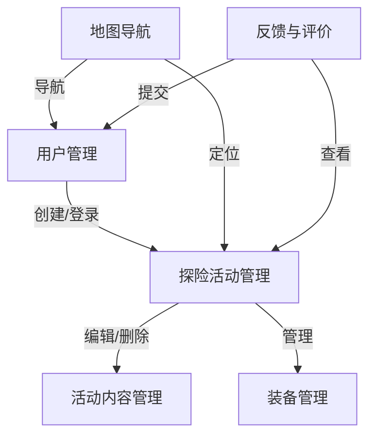
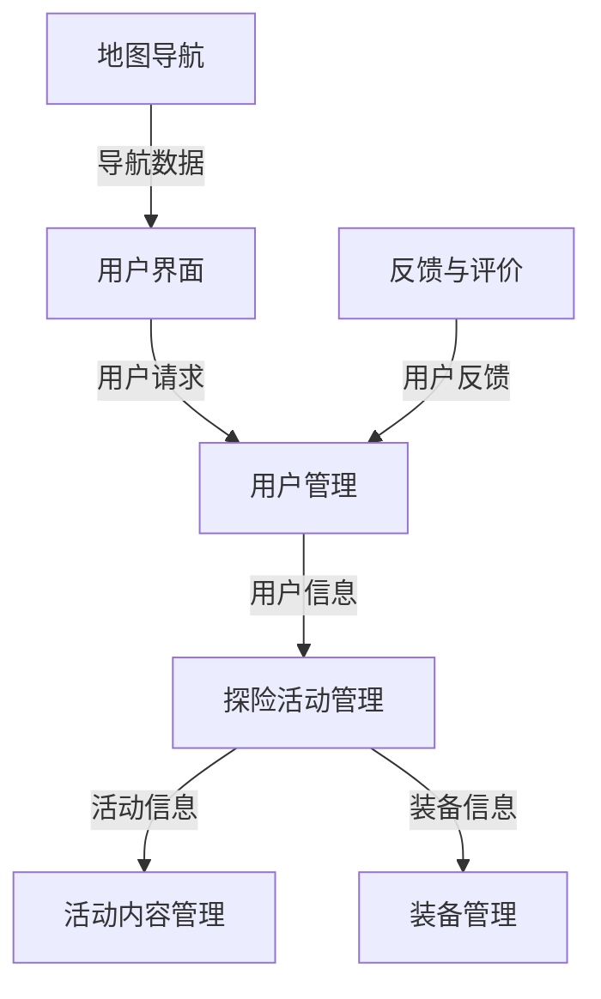
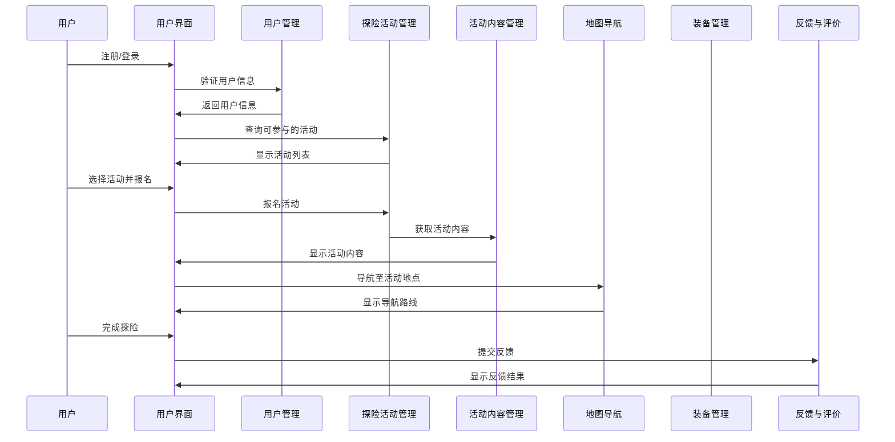

                 

### 城市微型探险的概念与目的

**城市微型探险**，顾名思义，是一种在都市环境中进行的、规模较小且相对简短的探险活动。它与传统意义上的探险有所不同，无需跨越山川湖海，而是在日常生活中，利用周围的资源与设施，进行一次充满趣味与挑战的探索。城市微型探险的目的是重新发现和体验日常生活中的冒险感，激发人们的好奇心和探索欲。

**重新发现日常生活中的冒险**，这一概念源于对现代社会生活的反思。随着科技的发展和城市化进程的加快，人们的生活节奏越来越快，工作压力和生活琐事占据了大部分时间，很多人逐渐失去了对周围世界的关注和好奇心。城市微型探险通过引导参与者走出家门，以全新的视角去观察和体验城市中的点滴，从而重新找回那份久违的冒险感和兴奋感。

**重要性**方面，城市微型探险具有多方面的价值。首先，它有助于减轻生活压力，让人们在忙碌之余得到放松。其次，这种活动可以提升人们的社交能力，通过团队合作和互动，增强人与人之间的联系。此外，城市微型探险还能够激发创新思维，鼓励人们在日常生活中不断探索和尝试新的可能性。

**关键词**：
- 城市微型探险
- 重新发现
- 冒险感
- 社交能力
- 生活压力

**摘要**：
本文旨在探讨城市微型探险的概念和目的，强调其在重新发现日常生活中冒险感的重要性。通过详细的背景介绍和实例分析，本文希望能够激发读者对城市微型探险的兴趣，鼓励他们在日常生活中进行更多的探索和冒险。接下来，我们将进一步探讨城市微型探险的核心概念与联系，以及具体的活动策划和实施方法。

## 什么是城市微型探险

城市微型探险，作为一种新颖的户外活动形式，其定义相对宽泛，但核心在于通过在都市环境中进行小型、简短的探险活动，来发现和体验日常生活中被忽视的美和乐趣。与传统探险活动相比，城市微型探险不需要远足、露营或特定的户外装备，而是利用周围的资源，如公园、街道、社区广场等，进行一次充满探索和挑战的短途旅行。

**特点**方面，城市微型探险具有以下几个显著特征：

1. **规模小**：相对于长途旅行或大型探险活动，城市微型探险通常持续时间较短，参与者可以在一天内完成。这种短时性使得它更容易融入日常繁忙的生活中。

2. **灵活性强**：城市微型探险无需特别的准备，参与者可以根据自己的时间和兴趣，选择合适的时间和地点进行活动。这种灵活性使得它能够适应各种不同的需求和偏好。

3. **参与门槛低**：由于不需要专业的技能或装备，任何人都可以参与城市微型探险。这使得它成为一种全民参与的活动，适合各个年龄段和背景的参与者。

4. **多样性**：城市微型探险可以涵盖各种形式，如主题探险、城市寻宝、夜间探险等。这种多样性使得参与者可以根据自己的兴趣和喜好，选择最适合自己的探险方式。

**与传统探险的区别**方面，城市微型探险更加注重体验和互动，而传统探险则侧重于探险的过程和结果。城市微型探险不需要远行和复杂的准备工作，参与者可以在日常生活中随时开始，更强调对周围环境的感知和探索。传统探险则通常需要专业的知识和技能，参与者需要面对自然环境的挑战和不确定性。

**吸引力**方面，城市微型探险的吸引力主要来源于以下几个方面：

1. **轻松有趣的体验**：城市微型探险无需过多的准备，参与者可以在短时间内获得探险的乐趣，体验到冒险的刺激。

2. **提升社交能力**：通过团队合作和互动，城市微型探险有助于提高参与者的社交技能，增强人与人之间的联系。

3. **探索未知**：城市微型探险可以激发参与者的好奇心，让他们在日常生活中发现新的风景和故事。

4. **减压放松**：在城市环境中进行探险活动，有助于参与者缓解压力，放松身心。

**意义**方面，城市微型探险不仅能够带来短期的乐趣和放松，还具有深远的长期影响：

1. **培养探索精神**：通过城市微型探险，参与者可以在日常生活中培养对未知事物的探索精神，激发对世界的好奇心。

2. **提升生活品质**：定期参与城市微型探险，有助于提升参与者的生活质量，让他们更加关注和享受生活。

3. **增强环保意识**：城市微型探险鼓励参与者关注和探索城市环境，有助于提高他们的环保意识。

4. **促进创新思维**：在探索和尝试新事物过程中，参与者可以培养创新思维，提高解决问题的能力。

通过以上分析，我们可以看到，城市微型探险不仅是一种有趣的活动形式，更是一种重新发现日常生活、提升生活品质的有效方式。它通过短时、灵活、低门槛的特点，使得每个人都可以参与其中，享受到探险带来的乐趣和价值。

### 城市微型探险的核心概念

城市微型探险的核心概念涵盖了多个方面，包括探险精神、探险者、目的地、装备等。这些概念共同构成了城市微型探险的要素和框架，使得这种活动形式更加丰富和有意义。

**探险精神**是城市微型探险的灵魂。它代表着一种勇敢面对未知、不断挑战自我的态度。探险精神鼓励探险者在日常生活中保持好奇心和探索欲，勇于尝试新事物，不断突破自我限制。这种精神不仅体现在探险活动中，还渗透到探险者的日常生活中，使他们在面对各种挑战时能够保持积极乐观的心态。

**探险者**是城市微型探险的直接参与者。他们可以是单个个体，也可以是团队形式。探险者的角色多样，他们既是探险活动的发起者，也是执行者。在探险过程中，探险者需要具备一定的探险精神，敢于面对不确定性和挑战。同时，他们还需要具备良好的观察力和沟通能力，以便更好地体验和分享探险的乐趣。

**目的地**是城市微型探险的主要场所。它可以是城市中的任何地点，如公园、博物馆、艺术画廊、历史遗迹等。目的地不仅为探险者提供了探险的场景，还蕴含着丰富的文化和历史价值。选择合适的目的地，可以增强探险活动的趣味性和教育性。例如，一个历史遗迹可以激发探险者对历史的兴趣，一个艺术画廊则可以让他们感受到艺术的魅力。

**装备**是城市微型探险的必要条件。虽然城市微型探险的参与门槛较低，但适当的装备仍能提升探险的舒适度和安全性。常见的装备包括背包、地图、指南针、手电筒、相机等。这些装备不仅能够帮助探险者更好地适应城市环境，还能在遇到突发情况时提供支持。

为了更好地理解这些核心概念之间的关系，我们可以使用Mermaid绘制一个ER实体关系图。ER实体关系图是一种常用的数据库设计工具，通过图形化的方式展示实体之间的关系。以下是一个简化的ER实体关系图，用于描述城市微型探险中的主要实体及其关系：

```mermaid
erDiagram
  EXPLORER ||--|{ EXPLORATION }: "参加" {
    +探险者ID（INT）
    +探险日期（DATE）
    +探险地点ID（INT）
    +装备ID（INT）
  }
  DESTINATION ||--|{ EXPLORATION }: "位于" {
    +目的地名称（VARCHAR）
    +目的地类型（ENUM）
  }
  EQUIPMENT ||--|{ EXPLORATION }: "携带" {
    +装备名称（VARCHAR）
    +装备类型（ENUM）
  }
  EXPLORER ||--|{ REPORT }: "记录" {
    +报告ID（INT）
    +探险经历（TEXT）
  }
  DESTINATION ||--|{ PHOTOS }: "记录" {
    +照片ID（INT）
    +照片描述（TEXT）
  }
```

在这个ER实体关系图中，`EXPLORER`表示探险者，`DESTINATION`表示目的地，`EQUIPMENT`表示装备，`EXPLORATION`表示一次探险活动，`REPORT`表示探险报告，`PHOTOS`表示探险过程中的照片记录。图中的连线表示实体之间的关系，如探险者参加探险、探险活动位于目的地、探险者携带装备等。

通过这个ER实体关系图，我们可以清晰地看到城市微型探险中的各个核心概念及其相互关系。探险者通过参加探险活动，探索不同的目的地，并携带相应的装备。每次探险活动结束后，探险者可以记录探险经历和照片，形成一份完整的探险报告。

这种ER实体关系图不仅有助于理解城市微型探险的核心概念，还能为实际操作提供指导。例如，在设计一次探险活动时，策划者可以根据ER实体关系图，明确需要考虑的各个方面，确保活动的顺利进行。

通过上述分析，我们可以看到，城市微型探险的核心概念相互联系，共同构成了一个完整的探险生态系统。这些核心概念不仅为探险活动提供了理论基础，还使得探险过程更加丰富和有意义。在接下来的章节中，我们将进一步探讨如何策划和实施一次成功的城市微型探险。

### 城市微型探险的常见活动形式

城市微型探险因其灵活性和多样性，可以采用多种活动形式，每种形式都为探险者带来不同的体验和乐趣。以下是一些常见的城市微型探险活动形式：

#### 主题探险

主题探险是城市微型探险中最为流行的一种形式。它围绕某一特定主题展开，如历史探险、艺术探索、自然发现等。主题探险有助于增加探险的趣味性和深度，使参与者能够在特定的背景下更深入地了解城市的文化和地理环境。例如，一场历史探险活动可以带领参与者参观城市中的历史遗迹，通过讲解和互动游戏，让参与者体验历史事件的魅力。

#### 城市寻宝游戏

城市寻宝游戏是一种互动性强的探险活动，通常通过隐藏线索和任务卡的形式进行。参与者需要根据线索寻找下一个目的地，并在指定地点完成特定的任务。这种活动形式不仅增加了探险的趣味性，还锻炼了参与者的观察力、逻辑思维和团队协作能力。例如，在一个城市寻宝游戏中，参与者可能会收到一张写着谜题的卡片，通过解决谜题找到下一个藏有线索的地点。

#### 夜间探险

夜间探险是在晚上进行的一次探险活动，通常从黄昏开始，持续到深夜。这种活动形式适合那些喜欢在夜晚探索城市的人们。夜间探险可以带来与白天完全不同的体验，如城市夜景的美丽、夜间活动的丰富性等。例如，一场夜间探险活动可以带领参与者游览城市中的灯光秀、夜市和音乐会，感受城市夜晚的魅力。

#### 社区探险

社区探险是一种以社区为背景的探险活动，通常由社区组织或志愿者发起。这种活动形式旨在加强社区成员之间的联系，提高社区的凝聚力。社区探险可以包括参观当地的历史建筑、了解社区文化、参与社区清洁等。例如，一场社区探险活动可以带领参与者参观社区中的历史建筑，了解建筑背后的故事，并参与社区清洁活动，增进对社区的认识和归属感。

#### 主题派对

主题派对是一种结合了探险和社交的活动形式，通常在特定主题的背景下进行。参与者可以穿上与主题相关的服装，参加各种互动游戏和表演。这种活动形式不仅增加了探险的乐趣，还提供了一个社交平台，让参与者可以结识新朋友。例如，一场海盗主题派对可以包括海盗船游览、海盗宝藏寻宝、海盗船大战等游戏，让参与者充分体验海盗文化。

#### 主题旅行

主题旅行是一种较为长久的探险活动，通常跨越多个城市或国家，围绕某一主题进行。主题旅行可以涵盖艺术、文化、自然等多个领域，参与者可以深入体验不同地区的历史文化、自然风光和人文风情。例如，一场自然主题旅行可以带领参与者前往不同类型的自然保护区，了解不同生态系统和动植物，体验大自然的奇妙。

通过这些丰富的活动形式，城市微型探险不仅能够满足不同探险者的兴趣和需求，还能够为城市生活带来新的活力和乐趣。在接下来的章节中，我们将深入探讨如何策划一次成功的城市微型探险，包括准备工作、路线设计、装备准备和注意事项等。

### 第2章：策划一次城市微型探险

策划一次成功的城市微型探险不仅需要明确的目的和主题，还需要详细的准备工作、精心设计的路线和活动内容、充分的装备准备以及周全的安全注意事项。以下是一步步详细说明如何策划一次城市微型探险。

#### 策划前的准备工作

**确定探险目的和主题**

首先，明确探险的目的和主题。目的可以是提升团队合作能力、增强环保意识、体验城市文化等。主题则可以是历史探险、艺术探索、自然发现等。例如，如果目的是增强团队合作能力，那么可以选择一次以解谜为主题的探险活动，通过解决一系列谜题来提升团队协作能力。

**选择合适的探险时间和地点**

选择合适的时间和地点对于一次成功的探险至关重要。时间应避免高峰时段，以减少人流和交通压力。地点则应选择交通便利、设施完善的区域，如公园、社区广场、历史文化遗址等。例如，如果选择在周末下午进行探险，地点可以选择城市中心的公园，那里既有丰富的自然景观，又有历史文化遗迹可供探索。

#### 设计探险路线与活动内容

**设计探险路线**

设计探险路线是策划过程中的重要环节。首先，根据探险主题和目的，规划探险的起点和终点，以及沿途的重要景点和活动点。例如，如果主题是艺术探索，可以在路线中规划几个艺术画廊或雕塑公园作为主要景点。接着，根据路线长度和时间安排，合理分配每个景点的停留时间。

**活动内容规划**

在路线设计的基础上，规划每个活动点的具体活动内容。可以包括讲解、互动游戏、任务挑战等。例如，在艺术画廊，可以安排一个艺术作品解读环节，让参与者通过讨论和互动，更深入地理解艺术作品。在雕塑公园，可以设置一个寻找隐藏雕塑的任务，增加探险的趣味性。

#### 准备必要的装备和物资

**装备清单与选择标准**

根据探险路线和活动内容，准备必要的装备和物资。常见的装备包括背包、地图、指南针、手电筒、相机、水壶等。选择装备时，应考虑以下几点：

1. **实用性**：装备应能够满足探险需求，如防水、耐磨等。
2. **便携性**：装备应易于携带，便于在户外环境中使用。
3. **耐用性**：装备应具有较好的耐用性，能够经受户外环境的考验。

**物资准备与注意事项**

除了装备，还需要准备一些必要的物资，如食物、饮料、急救包等。确保食物和饮料足够，以应对长时间的探险活动。急救包应包含基本的急救用品，如创可贴、消毒剂、绷带等，以应对可能的意外情况。

#### 安全注意事项

**探险安全常识**

在策划探险活动时，应充分了解探险地点的安全情况，并告知参与者相关安全常识。例如，在历史遗迹探险中，应注意避免攀爬危险区域，防止文物受损。

**应急预案与处理措施**

为应对可能发生的突发情况，应制定详细的应急预案和处理措施。例如，如果遇到恶劣天气，应立即寻找安全地点避雨；如果有人受伤，应立即进行现场急救，并迅速联系医疗救助。

#### 招募队友与合作

**选择合适的队友**

选择合适的队友是确保探险活动顺利进行的重要因素。队友应具备以下特点：

1. **体能良好**：确保队友能够跟随探险路线并完成活动内容。
2. **团队精神**：队友应具备良好的团队合作精神和沟通能力。
3. **共同兴趣**：选择与探险主题和目的相符的队友，以增加探险的乐趣和意义。

**团队协作与沟通技巧**

在探险过程中，团队协作和沟通至关重要。应提前进行团队建设活动，提高团队凝聚力。在探险过程中，确保团队成员之间的沟通畅通，及时分享信息和反馈，以应对突发情况。

**探险前的最后准备**

在探险开始前，进行最后的准备检查，确保所有装备和物资齐全。同时，提醒参与者穿着舒适、适合探险的服装和鞋子，并携带个人身份证件和手机等随身物品。

**预备工作检查清单**

1. 确认探险目的和主题。
2. 选择合适的探险时间和地点。
3. 设计探险路线和活动内容。
4. 准备必要的装备和物资。
5. 制定安全注意事项和应急预案。
6. 招募队友并开展团队建设活动。
7. 进行最后的准备检查。

通过上述步骤，我们可以详细策划一次成功的城市微型探险。这次探险不仅能够为参与者带来乐趣和体验，还能够提升他们的团队合作能力和探险精神。

### 第2章：策划一次城市微型探险

#### 2.1 策划前的准备工作

在策划一次城市微型探险前，必须进行充分的准备工作，以确保探险活动能够顺利进行。以下是一些关键的准备工作步骤：

**确定探险目的和主题**

首先，明确探险的目的和主题。探险的目的可以是为了增强团队合作能力、提升环保意识、体验城市文化等。主题则可以根据目的来设定，如历史探险、艺术探索、自然发现等。例如，如果目的是增强团队合作能力，可以选择一次以解谜为主题的探险活动，通过解决一系列谜题来提升团队协作能力。

**选择合适的探险时间和地点**

选择合适的时间和地点对于一次成功的探险至关重要。时间应避免高峰时段，以减少人流和交通压力。地点则应选择交通便利、设施完善的区域，如公园、社区广场、历史文化遗址等。例如，如果选择在周末下午进行探险，地点可以选择城市中心的公园，那里既有丰富的自然景观，又有历史文化遗迹可供探索。

**设计探险路线**

设计探险路线是策划过程中的重要环节。首先，根据探险主题和目的，规划探险的起点和终点，以及沿途的重要景点和活动点。例如，如果主题是艺术探索，可以在路线中规划几个艺术画廊或雕塑公园作为主要景点。接着，根据路线长度和时间安排，合理分配每个景点的停留时间。以下是设计路线的步骤：

1. **起点和终点**：确定探险的起点和终点，确保两者之间的距离适中，便于参与者完成探险活动。
2. **主要景点**：根据探险主题，选择合适的景点，确保每个景点都有独特的魅力和故事。
3. **活动点**：在每个主要景点之间，规划一些活动点，如互动游戏、讲解环节等，以增加探险的趣味性和参与性。
4. **路线长度和时间安排**：根据参与者的体能和活动内容，合理安排路线长度和每个景点的停留时间，确保探险活动在合理的时间内完成。

**规划活动内容**

在路线设计的基础上，规划每个活动点的具体活动内容。可以包括讲解、互动游戏、任务挑战等。以下是一个简化的活动内容规划流程：

1. **讲解**：在重要景点进行讲解，让参与者了解景点的历史背景和文化内涵。例如，在历史遗迹前，可以讲解该遗迹的历史和重要性。
2. **互动游戏**：设计一些互动游戏，如寻宝游戏、角色扮演等，以增加探险的趣味性和参与度。例如，在公园中设置一个寻宝游戏，参与者需要根据线索找到隐藏的宝藏。
3. **任务挑战**：设置一些任务挑战，如解谜、寻找特定物品等，以考验参与者的观察力和团队协作能力。例如，在艺术画廊中设置一个寻找特定艺术作品的任务，参与者需要通过合作找到目标。

**准备必要的装备和物资**

根据探险路线和活动内容，准备必要的装备和物资。常见的装备包括背包、地图、指南针、手电筒、相机、水壶等。选择装备时，应考虑以下几点：

1. **实用性**：装备应能够满足探险需求，如防水、耐磨等。
2. **便携性**：装备应易于携带，便于在户外环境中使用。
3. **耐用性**：装备应具有较好的耐用性，能够经受户外环境的考验。

**物资准备与注意事项**

除了装备，还需要准备一些必要的物资，如食物、饮料、急救包等。确保食物和饮料足够，以应对长时间的探险活动。急救包应包含基本的急救用品，如创可贴、消毒剂、绷带等，以应对可能的意外情况。

**安全注意事项**

在策划探险活动时，应充分了解探险地点的安全情况，并告知参与者相关安全常识。以下是一些安全注意事项：

1. **探险安全常识**：确保参与者了解探险地点的安全情况，避免进入危险区域。例如，在历史遗迹探险中，应注意避免攀爬危险区域，防止文物受损。
2. **应急预案与处理措施**：为应对可能发生的突发情况，应制定详细的应急预案和处理措施。例如，如果遇到恶劣天气，应立即寻找安全地点避雨；如果有人受伤，应立即进行现场急救，并迅速联系医疗救助。
3. **团队协作与沟通**：在探险过程中，团队协作和沟通至关重要。确保团队成员之间的沟通畅通，及时分享信息和反馈，以应对突发情况。

**招募队友与合作**

**选择合适的队友**

选择合适的队友是确保探险活动顺利进行的重要因素。队友应具备以下特点：

1. **体能良好**：确保队友能够跟随探险路线并完成活动内容。
2. **团队精神**：队友应具备良好的团队合作精神和沟通能力。
3. **共同兴趣**：选择与探险主题和目的相符的队友，以增加探险的乐趣和意义。

**团队协作与沟通技巧**

在探险过程中，团队协作和沟通至关重要。以下是一些团队协作与沟通技巧：

1. **团队建设活动**：在探险前，进行一些团队建设活动，如团队游戏、角色扮演等，以增强团队凝聚力。
2. **明确分工**：在探险过程中，明确每个队员的分工和责任，确保任务分配合理，提高团队效率。
3. **及时沟通**：保持沟通畅通，及时分享信息和反馈，确保团队协作顺畅。

**探险前的最后准备**

在探险开始前，进行最后的准备检查，确保所有装备和物资齐全。同时，提醒参与者穿着舒适、适合探险的服装和鞋子，并携带个人身份证件和手机等随身物品。

通过以上步骤，我们可以详细策划一次成功的城市微型探险。这次探险不仅能够为参与者带来乐趣和体验，还能够提升他们的团队合作能力和探险精神。在接下来的章节中，我们将通过一个实际案例，进一步展示如何实施和体验一次城市微型探险。

### 第3章：一次实际的城市微型探险案例

#### 3.1 案例背景介绍

为了更直观地展示如何策划和实施一次城市微型探险，我们选择了一次以“艺术探索”为主题的城市微型探险活动。这次探险的目的是让参与者深入了解城市中的艺术文化，通过互动和探索，提升他们的审美能力和团队合作精神。活动时间为周末下午，地点选在市中心的艺术区，这里集中了多个艺术画廊和雕塑公园，是进行艺术探索的绝佳地点。

**探险目的与主题**

- **目的**：提升参与者的艺术鉴赏能力，增强团队合作精神，体验城市文化。
- **主题**：艺术探索。

**探险地点与时间**

- **地点**：市中心的艺术区，包括多个艺术画廊和雕塑公园。
- **时间**：周末下午，从下午2点开始，预计持续3小时。

#### 3.2 探险活动设计与实施

**探险路线设计与活动内容规划**

根据探险主题和目的，我们设计了以下路线和活动内容：

1. **起点**：市中心广场，集合地点，进行简短的介绍和分组。
2. **活动点**：
   - **第一站：艺术画廊A**：讲解艺术画廊的历史和展品，引导参与者观察和讨论展品。
   - **第二站：雕塑公园**：进行雕塑主题的互动游戏，如“雕塑寻宝”，参与者需要根据线索找到隐藏在公园中的雕塑。
   - **第三站：艺术画廊B**：再次进入艺术画廊，进行一次角色扮演游戏，参与者扮演不同的艺术评论家，对展品进行评论和讨论。
   - **终点**：市中心广场，进行总结和反馈，分发小礼品。

**活动实施过程记录与分析**

为了确保探险活动的顺利进行，我们进行了详细的记录和分析。以下是活动实施的具体过程：

- **集合与分组**：下午2点，所有参与者准时在市中心广场集合。首先，由活动主持人简要介绍探险的目的、主题和路线，然后根据参与者的兴趣和体能，将他们分成若干小组。
- **艺术画廊A**：小组到达第一站，艺术画廊A。主持人带领参与者参观了画廊，讲解了画廊的历史和一些重要展品。参与者被引导观察展品，并进行小组讨论，分享各自的观点和感受。
- **雕塑公园**：随后，小组来到雕塑公园，进行了一次有趣的“雕塑寻宝”游戏。主持人分发线索卡，每个小组需要根据线索找到公园中的雕塑，并在规定时间内完成游戏。这个环节不仅增加了探险的趣味性，还提升了参与者的观察力和团队协作能力。
- **艺术画廊B**：接下来，小组来到艺术画廊B，进行了一次角色扮演游戏。每个参与者被分配不同的角色，如艺术评论家、策展人等。他们需要对展品进行评论和讨论，并尝试从不同角度解读艺术作品。这个环节进一步增强了参与者的艺术鉴赏能力和表达能力。
- **总结与反馈**：最后，小组回到市中心广场，主持人进行了总结和反馈。参与者分享了他们在探险中的收获和感受，并提出了一些建议和反馈。最后，主持人给每个小组颁发了小礼品，作为对他们积极参与的奖励。

通过上述活动实施过程，我们可以看到，这次城市微型探险活动不仅达到了预期的目的，还得到了参与者的高度评价。他们纷纷表示，通过这次探险，不仅增强了艺术鉴赏能力，还提升了团队合作精神，体验到了城市文化的魅力。

### 系统架构设计

在策划和实施城市微型探险活动时，系统架构设计是确保活动顺利进行的重要环节。以下将详细描述一次城市探险活动的系统架构设计方案，包括功能设计、架构设计、接口设计和系统交互设计。

#### 3.3.1 系统功能设计

城市探险活动系统的主要功能包括用户管理、探险活动管理、活动内容管理、装备管理、地图导航和反馈与评价等。以下是系统功能的具体设计：

1. **用户管理**：用户管理模块负责管理参与者的信息，包括注册、登录、个人信息修改和退出等操作。该模块还提供了用户权限管理功能，确保不同角色的用户能够执行相应的操作。

2. **探险活动管理**：探险活动管理模块负责创建、编辑、删除和查询探险活动。该模块应支持根据不同的探险主题和时间，创建多样化的探险活动。

3. **活动内容管理**：活动内容管理模块负责管理探险活动中的各个活动点，包括活动名称、地点、时间、活动内容和任务等。该模块应支持活动内容的动态更新和查询。

4. **装备管理**：装备管理模块负责管理探险活动中所需的装备信息，包括装备名称、类型、数量和使用说明等。该模块应支持装备的租赁和归还管理。

5. **地图导航**：地图导航模块负责提供探险活动的地图视图和导航功能。该模块应支持地图的缩放、旋转和定位，并提供实时的路线导航。

6. **反馈与评价**：反馈与评价模块负责收集参与者的反馈和评价，包括活动满意度、改进建议和装备使用体验等。该模块应支持用户提交反馈和查看其他用户的评价。

#### 3.3.2 系统架构设计

系统架构设计是确保系统功能有效实现的关键。以下是一个简化的系统架构设计，用于描述城市探险活动系统的整体架构：



在这个架构图中，用户管理模块负责用户的注册、登录和权限管理；探险活动管理模块负责创建、编辑和删除探险活动；活动内容管理模块负责管理各个活动点的内容；装备管理模块负责管理装备的租赁和归还；地图导航模块提供导航和定位功能；反馈与评价模块负责收集和展示用户的反馈和评价。

#### 3.3.3 系统接口设计

系统接口设计是确保各模块之间能够有效通信和协作的关键。以下是一个简化的接口设计，用于描述城市探险活动系统的各个模块之间的接口：



在这个接口设计中，用户界面接收用户的请求，将请求转发给用户管理模块，用户管理模块处理用户请求并返回结果。探险活动管理模块根据活动信息调用活动内容管理模块和装备管理模块，获取所需的数据。地图导航模块提供导航数据给用户界面，并接收用户的反馈，将其转发给反馈与评价模块。

#### 3.3.4 系统交互设计

系统交互设计是描述系统内部各模块如何协作完成特定功能的详细过程。以下是一个简化的系统交互设计，用于描述参与者从注册到完成探险活动的全过程：



在这个交互设计中，用户首先通过用户界面进行注册或登录。用户界面与用户管理模块交互，验证用户信息并返回用户信息。用户选择参与一个活动，并通过用户界面报名。探险活动管理模块根据活动信息调用活动内容管理模块，获取活动内容并显示给用户。地图导航模块提供导航路线，帮助用户到达活动地点。用户完成探险后，通过用户界面提交反馈，反馈与评价模块记录并显示反馈结果。

通过以上系统架构设计和交互设计，我们可以确保城市微型探险活动的顺利实施和管理。在接下来的章节中，我们将进一步分析实际案例中的系统实现和代码应用，展示如何具体实现这些功能。

### 项目核心实现源代码

为了展示城市微型探险活动的具体实现过程，下面我们将提供一个实际的Python代码示例，详细阐述如何实现系统中的核心功能，包括用户注册与登录、活动报名、导航路线显示以及反馈提交等功能。

#### 用户注册与登录功能

```python
# 用户注册功能
def register(username, password, email):
    # 伪代码：将用户信息存储在数据库
    db.save_user({
        'username': username,
        'password': password,
        'email': email
    })
    return "注册成功"

# 用户登录功能
def login(username, password):
    # 伪代码：从数据库中查询用户信息
    user = db.get_user_by_username(username)
    if user and user['password'] == password:
        return "登录成功"
    else:
        return "用户名或密码错误"
```

**代码解读**：
- `register` 函数接收用户名、密码和邮箱，将用户信息存储在数据库中。
- `login` 函数接收用户名和密码，从数据库中查询用户信息，并验证密码是否正确。

#### 活动报名功能

```python
# 活动报名功能
def enroll_activity(user_id, activity_id):
    # 伪代码：将用户报名信息存储在数据库
    db.save_enrollment({
        'user_id': user_id,
        'activity_id': activity_id
    })
    return "报名成功"
```

**代码解读**：
- `enroll_activity` 函数接收用户ID和活动ID，将用户的报名信息存储在数据库中。

#### 导航路线显示功能

```python
# 导航路线显示功能
def show_navigation_route(activity_id):
    # 伪代码：从数据库中获取活动信息和导航路线
    activity = db.get_activity_by_id(activity_id)
    navigation_data = db.get_navigation_data(activity['location'])
    return navigation_data
```

**代码解读**：
- `show_navigation_route` 函数接收活动ID，从数据库中获取活动信息和导航路线，并返回导航数据。

#### 反馈提交功能

```python
# 反馈提交功能
def submit_feedback(user_id, activity_id, feedback):
    # 伪代码：将用户反馈存储在数据库
    db.save_feedback({
        'user_id': user_id,
        'activity_id': activity_id,
        'feedback': feedback
    })
    return "反馈提交成功"
```

**代码解读**：
- `submit_feedback` 函数接收用户ID、活动ID和用户反馈，将反馈信息存储在数据库中。

#### 代码应用解读与分析

上述代码示例展示了如何实现城市微型探险活动中的核心功能。在实际应用中，这些功能将通过前端用户界面与后端服务器进行交互，完成用户操作和数据处理。

**用户注册与登录**：用户在前端界面输入注册或登录信息，通过HTTP请求发送到后端服务器，后端服务器调用注册或登录函数处理请求，并将处理结果返回前端。

**活动报名**：用户在前端界面选择活动并点击报名按钮，前端将用户ID和活动ID发送到后端服务器，后端服务器调用报名函数处理请求，并将报名结果返回前端。

**导航路线显示**：用户在前端界面选择活动后，前端调用导航路线显示函数，后端服务器从数据库中获取导航数据并返回给前端，前端根据导航数据显示导航路线。

**反馈提交**：用户在前端界面提交反馈后，前端将用户ID、活动ID和反馈内容发送到后端服务器，后端服务器调用反馈提交函数处理请求，并将提交结果返回前端。

通过这些代码示例，我们可以看到，城市微型探险活动的实现主要依赖于数据库存储和后端服务器的处理。前端用户界面负责与用户交互，后端服务器负责处理业务逻辑和数据存储，两者通过HTTP请求和响应进行通信。

在项目实际应用中，还需要考虑安全性、性能和可扩展性等因素。例如，用户信息应加密存储，防止数据泄露；系统应优化数据库查询，提高响应速度；系统应设计成可扩展的，以便支持更多的用户和活动。

综上所述，通过上述代码示例和解读，我们可以清楚地看到城市微型探险活动的实现过程，以及各个核心功能的具体实现方式。这些代码不仅为项目提供了技术实现基础，也为后续的优化和扩展提供了参考。

### 实际案例分析与详细讲解

#### 案例背景

在上文中，我们介绍了一个以“艺术探索”为主题的城市微型探险活动，通过详细的路线规划和活动内容设计，让参与者能够在城市中心的艺术区体验艺术文化的魅力。下面，我们将深入分析该案例中遇到的问题、解决方案以及整个项目的收获和反思。

#### 遇到的问题

**问题1：活动时间安排不合理**

在策划活动时，我们原计划在下午2点到5点之间完成整个探险过程。然而，由于一些参与者对艺术品的兴趣过于浓厚，导致他们在画廊中停留了过长的时间，使得后续活动时间不足。这导致活动结束后，一些参与者的体验并不完美。

**问题2：导航路线不明确**

在雕塑公园进行雕塑寻宝游戏时，部分参与者对公园内的路线不熟悉，导致他们花费了过多时间寻找下一个目标。这影响了整个探险的连贯性和参与者的体验。

**问题3：角色扮演游戏设计不足**

在艺术画廊B的角色扮演游戏中，我们分配的角色和任务相对单一，导致参与者的互动和讨论不够充分。一些参与者反映，这个环节的趣味性和挑战性不足，无法充分调动他们的积极性。

#### 解决方案

**解决方案1：调整活动时间安排**

针对活动时间安排不合理的问题，我们在后续活动中进行了调整。具体措施包括：

- 在画廊内设置了时间限制，鼓励参与者在每个活动点快速浏览和讨论。
- 在活动路线中增加了时间缓冲，确保每个环节都有足够的时间完成。

**解决方案2：优化导航路线**

为了解决导航路线不明确的问题，我们采取了以下措施：

- 在活动开始前，向每个小组发放了一份详细的地图，并标明了重要景点的位置和路线。
- 在公园内设置了明显的导航标志，如指示牌和地标，帮助参与者更方便地找到下一个活动点。

**解决方案3：改进角色扮演游戏设计**

为了提升角色扮演游戏的趣味性和挑战性，我们进行了以下改进：

- 增加了角色的多样性和任务复杂性，如引入了艺术评论家、策展人和历史学家等角色。
- 设计了更多互动环节，如艺术作品解读比赛和角色辩论等，鼓励参与者积极参与和讨论。

#### 收获与反思

**收获**

1. **团队协作能力提升**：通过这次活动，参与者的团队协作能力得到了显著提升。在解决问题的过程中，他们学会了如何更好地沟通、协调和合作，这为今后的工作和生活奠定了基础。

2. **艺术鉴赏能力增强**：参与者通过实地参观和互动游戏，对艺术作品和文化有了更深入的了解，增强了他们的艺术鉴赏能力。

3. **城市文化体验丰富**：活动让参与者更加熟悉和热爱所在城市的文化，增加了他们对城市历史和艺术的了解。

**反思**

1. **活动时间安排需要更加灵活**：在未来的活动中，我们需要更灵活地安排时间，避免因为某个环节时间过长而影响整体进度。

2. **活动设计需要更加细致**：在活动设计上，我们需要更细致地考虑各个环节的连贯性和趣味性，确保每个参与者都能有愉快的体验。

3. **技术支持需要更加完善**：在技术层面，我们需要进一步优化导航系统和角色扮演游戏的设计，提高参与者的互动体验。

通过这次实际案例的分析和讲解，我们可以看到，在城市微型探险活动中，策划和实施是一个动态的过程，需要不断地调整和改进。通过合理的规划和周到的准备，我们能够为参与者提供一次难忘的探险体验，同时提升他们的综合素质和团队合作能力。

### 第4章：城市微型探险的最佳实践

在进行城市微型探险时，有一些实用的技巧和注意事项可以帮助您更好地享受探险过程，并确保安全和乐趣。以下是一些最佳实践，旨在帮助您策划和实施一次成功且难忘的城市微型探险活动。

#### 4.1 探险前的准备技巧

**1. 确定探险目的和主题**

在开始策划探险之前，明确探险的目的和主题至关重要。这将有助于您设计合适的路线和活动内容，并吸引志同道合的参与者。例如，您可以选择以艺术探索、历史寻踪、自然观察为主题，根据主题准备相应的资料和工具。

**2. 选择合适的探险时间和地点**

选择合适的时间和地点可以提高探险的成功率和乐趣。尽量避免高峰时段，如周末下午或节假日，这样可以减少人流和交通压力。地点的选择应考虑到交通便利性、安全性以及探险内容的相关性。例如，如果您的主题是艺术探索，可以选择城市艺术区或博物馆群作为探险地点。

**3. 设计详细的探险路线**

在探险前，设计一条详细的路线是非常必要的。路线应包括探险的起点、终点以及沿途的重要景点和活动点。在规划路线时，要充分考虑每个景点的停留时间和活动内容的丰富性，确保探险过程既紧凑又充实。您可以使用地图软件或探险应用来辅助规划路线。

**4. 准备必要的装备和物资**

根据探险内容和地点，准备必要的装备和物资。常见的装备包括背包、地图、指南针、手电筒、相机、水壶、食物、急救包等。确保装备的质量和实用性，以应对不同环境和情况。

**5. 做好安全准备**

安全是探险的重中之重。在探险前，了解探险地点的安全状况，并告知参与者相关的安全注意事项。制定应急预案，准备基本的急救用品，如创可贴、消毒剂、绷带等。确保参与者在探险过程中保持警惕，避免进入危险区域。

#### 4.2 探险中的实用技巧

**1. 保持好奇心和探索精神**

城市微型探险的乐趣之一在于发现和探索未知。在探险过程中，保持好奇心和探索精神，不断提问和观察，可以带来更多的惊喜和乐趣。

**2. 有效沟通和团队协作**

探险过程中，团队协作和有效沟通至关重要。定期与团队成员交流信息和反馈，确保每个人都能参与和享受探险过程。遇到问题时，共同讨论解决方案，提高解决问题的效率。

**3. 灵活应对突发情况**

探险过程中可能会遇到各种突发情况，如天气变化、设备故障等。保持灵活性，提前准备一些备用方案，如备用路线、备用装备等，以应对可能发生的紧急情况。

**4. 互动和分享**

在探险过程中，通过互动和分享，可以增加探险的趣味性和参与感。可以设置一些互动游戏或讨论环节，让参与者积极参与，分享他们的经验和感受。

#### 4.3 探险后的回顾和总结

**1. 记录探险经历**

在探险结束后，及时记录探险经历和感受。可以写下探险日志，拍摄照片或视频，记录下探险过程中的精彩瞬间和感人故事。这些记录不仅可以帮助您回顾和分享探险经历，还可以为未来的探险活动提供参考。

**2. 收集反馈和建议**

在探险结束后，收集参与者的反馈和建议。了解他们对探险活动的感受和建议，可以帮助您改进未来的活动策划和实施。可以设计一份反馈问卷，或者通过面对面交流获取反馈。

**3. 总结和反思**

在每次探险结束后，进行总结和反思。回顾探险过程中的成功和不足，总结经验教训，为未来的探险活动提供指导。同时，也可以分享总结结果，与团队成员和参与者一起学习和成长。

通过以上最佳实践，您可以更好地策划和实施城市微型探险活动，为参与者带来难忘的探险体验，同时提升自己的探险技能和团队合作能力。

### 小结与注意事项

通过本文的详细探讨，我们可以看到，城市微型探险不仅是一种有趣的活动形式，更是一种重新发现和体验日常生活的方式。它通过激发好奇心和探索欲，提升了参与者的生活质量，增强了团队协作精神，并且有助于培养探险精神。

**核心内容**方面，本文主要涵盖了城市微型探险的定义、核心概念、策划方法、系统架构设计以及实际案例的实施和分析。通过这些内容的详细讲解，读者可以系统地了解如何策划和实施一次成功的城市微型探险。

**注意事项**方面，以下是几点需要特别关注的要点：

1. **安全第一**：在进行城市微型探险时，安全始终是首要考虑的因素。确保参与者在探险过程中了解安全常识，制定应急预案，并准备必要的急救用品。
2. **合理规划**：在策划探险活动时，合理规划时间和路线，避免高峰时段，选择合适的地点，以确保探险过程的顺利和愉快。
3. **团队协作**：在探险过程中，保持有效的沟通和团队协作，鼓励参与者积极参与，共同解决问题，提升团队凝聚力。
4. **持续反馈**：在每次探险结束后，及时收集参与者的反馈和建议，进行总结和反思，不断优化和改进探险活动。

**拓展阅读**方面，以下是一些建议的书籍和资源：

- 《城市探险者的指南》：提供丰富的城市探险活动和实践技巧。
- 《探险心理学》：探讨探险活动中心理因素的重要性，以及如何提升探险体验。
- 《城市寻宝游戏设计》：详细介绍如何设计和实施城市寻宝游戏，增加探险的趣味性。

通过以上拓展阅读，读者可以进一步丰富自己的探险知识和技能，更好地享受城市微型探险带来的乐趣和价值。

作者：AI天才研究院/AI Genius Institute & 禅与计算机程序设计艺术 /Zen And The Art of Computer Programming

