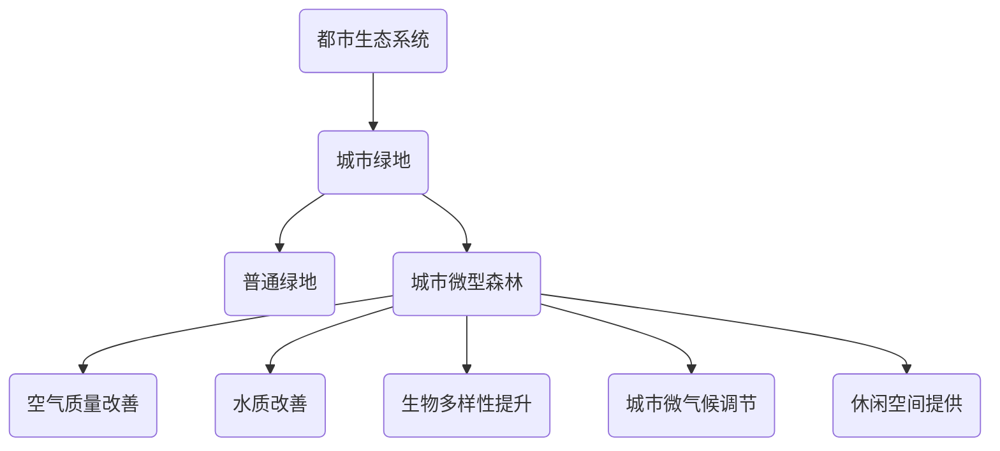

                 

### 第1章：城市微型森林的核心概念

#### 1.1 问题背景

随着城市化进程的加速，现代都市面临着诸多生态问题。空气污染、水资源短缺、生物多样性丧失等现象日益严重。这些问题不仅威胁到城市居民的身体健康，也影响了城市的可持续发展。为了应对这些挑战，构建城市微型森林成为了一种有效的解决方案。城市微型森林不仅可以在一定程度上改善城市的生态环境，还能提供休闲、娱乐和教育的空间，从而提升城市居民的生活质量。

#### 1.1.1 都市生态问题的严峻性

都市生态系统所面临的挑战是多方面的。首先，城市人口的快速增长导致了大量的建筑和基础设施的建设，这些建筑和基础设施占据了大量的绿地和水资源。其次，工业化进程和汽车尾气的排放使得城市空气污染问题日益严重。最后，城市热岛效应的加剧使得城市的气温逐年上升，影响了城市的生态平衡。

#### 1.1.2 微型森林在城市生态系统中的角色

城市微型森林是一种在城市环境中营造的小型森林生态系统，其目的是改善城市生态环境，提高城市居民的生活质量。微型森林通过植被的覆盖和土壤的吸附，可以有效地降低城市空气污染，改善水质，增加城市的绿地面积。此外，微型森林还能为城市提供额外的生态系统服务，如调节气候、提供栖息地等。

#### 1.1.3 城市微型森林的挑战与机遇

尽管城市微型森林在改善城市生态系统中具有巨大的潜力，但其建设和维护也面临着诸多挑战。首先，城市用地紧张，找到合适的地点建设微型森林具有一定的难度。其次，微型森林的建设和维护需要投入大量的资金和人力资源。此外，公众对微型森林的认知和接受度也是一个重要的挑战。

然而，随着人们对生态环境的关注度不断提高，以及现代科技的发展，城市微型森林的建设也面临着前所未有的机遇。通过运用智能规划工具和现代监测技术，可以更高效地设计和维护城市微型森林。同时，政策的支持和社会的参与也为城市微型森林的建设提供了有力的保障。

#### 1.2 核心概念与联系

##### 1.2.1 城市微型森林的定义

城市微型森林是指在城市化过程中，利用有限的土地资源，通过人工手段营造的具有森林生态特征的微型生态系统。它通常包括乔木、灌木、草本植物等多种植物，以及相应的土壤、水源等生态要素。

##### 1.2.2 城市微型森林的属性特征对比表格

| 特征       | 普通城市绿地 | 城市微型森林 |
|------------|---------------|--------------|
| 绿地面积   | 大           | 小           |
| 植被种类   | 少           | 多           |
| 生物多样性 | 低           | 高           |
| 功能性     | 较弱         | 强           |

##### 1.2.3 微型森林与都市生态系统的关系图

从上述关系图中可以看出，城市微型森林不仅是都市生态系统的一部分，而且在多个方面对城市生态环境产生积极影响。

#### 1.3 国内外案例介绍

##### 1.3.1 国外成功案例

- **纽约的“高线公园”**：这是世界上第一条垂直堆叠的公园，它将废弃的高架铁路改造成了城市中的绿色空间，为城市居民提供了宝贵的休闲场所。
- **伦敦的“绿色网格”**：这是一个将城市中各种绿地、花园和公园连接起来的项目，旨在通过提高城市绿化覆盖率来改善城市生态环境。

##### 1.3.2 国内实践探索

- **北京的小汤山国家森林公园**：这个公园通过大量植树造林，提高了城市的绿化水平，成为了城市居民休闲娱乐的好去处。
- **上海的“苏州河绿带”**：苏州河绿带通过植被覆盖和景观设计，改善了河流水质，同时也提供了城市居民休闲活动的场所。

#### 1.4 本章小结

本章介绍了城市微型森林的核心概念及其在城市生态系统中的角色和挑战。通过对比表格和关系图，我们对城市微型森林的属性特征有了更深入的理解。同时，通过介绍国内外成功案例，我们看到了城市微型森林在实际应用中的潜力和前景。在接下来的章节中，我们将进一步探讨城市微型森林的设计原则、规划方法、维护策略以及未来发展的挑战和机遇。

