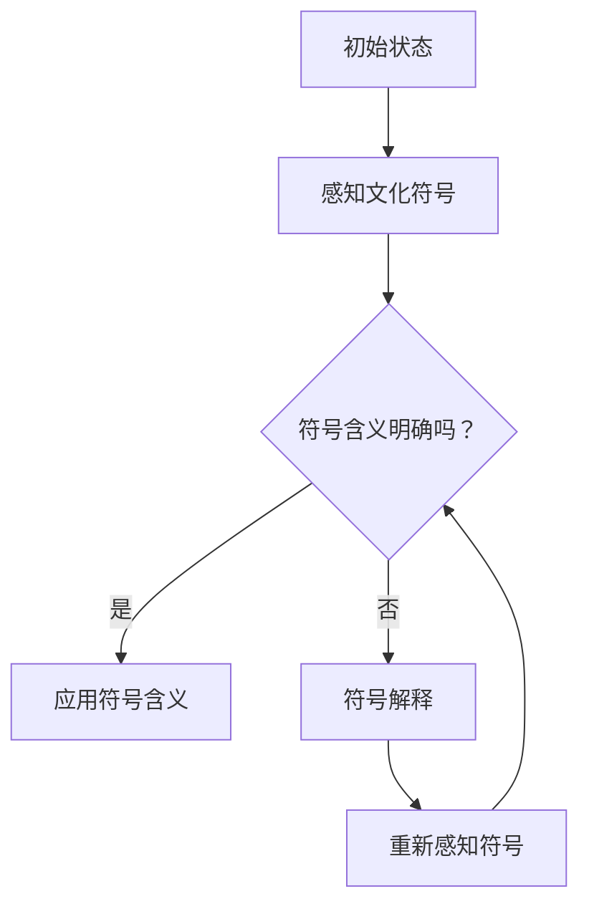
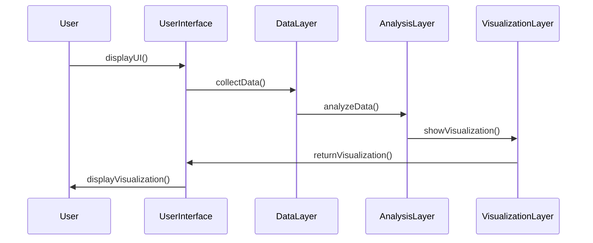
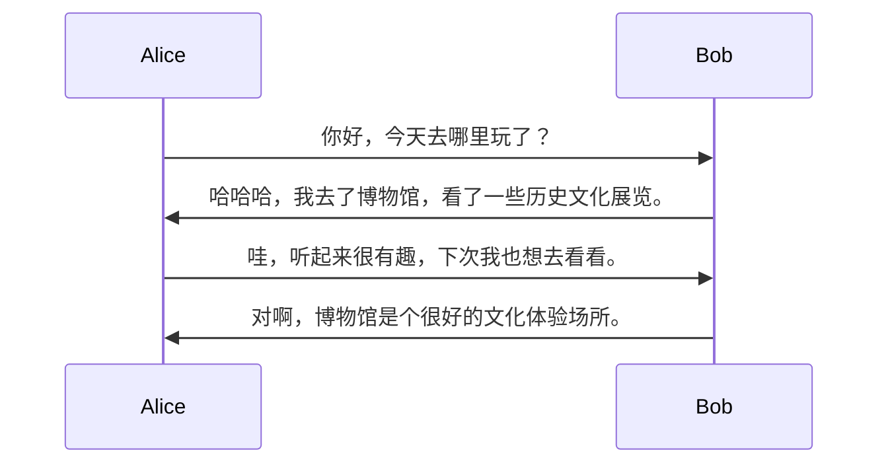
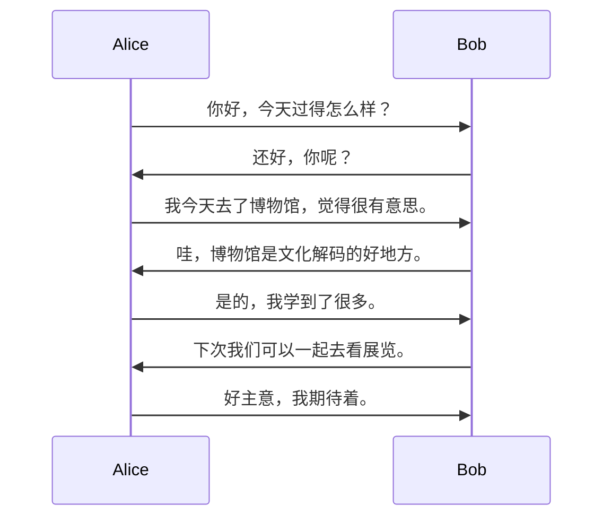
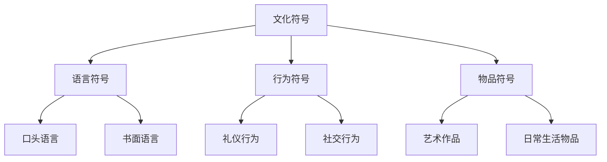
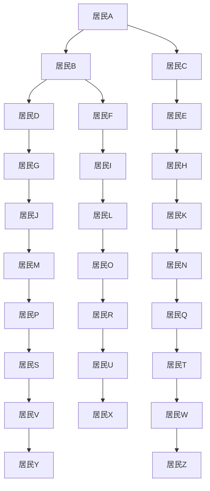

                 

# 城市微观人类学：日常生活中的文化解码

> 关键词：城市微观人类学、文化解码、社会互动、文化认同

> 摘要：本文从城市微观人类学的视角出发，探讨了城市居民在日常生活中进行文化解码的过程、机制以及社会互动和文化认同的构建。通过深入分析城市空间、日常生活实践中的文化符号，揭示了城市文化的深层结构和动态变化。本文旨在为城市研究和城市规划提供理论支持和实践指导。

### 目录大纲

```markdown
----------------------------------------------------------------
# 第一部分: 城市微观人类学的理论框架

## 1. 引言
### 1.1 问题背景
### 1.2 研究目的
### 1.3 研究方法

## 2. 城市微观人类学概述
### 2.1 定义与核心概念
### 2.2 城市微观人类学的研究范畴
### 2.3 与相关学科的关联

## 3. 日常生活中的文化解码
### 3.1 日常生活与文化的互动
### 3.2 文化解码的过程与机制
### 3.3 日常生活实践中的文化符号

## 4. 城市空间中的社会互动
### 4.1 城市空间的社会意义
### 4.2 社会互动的日常形式
### 4.3 城市空间中的社会边界

## 5. 城市居民的文化认同与身份构建
### 5.1 文化认同的概念
### 5.2 城市居民的文化认同构建
### 5.3 文化认同与身份的多维度解析

## 6. 消费文化与社会分层
### 6.1 消费文化的兴起与影响
### 6.2 社会分层的消费表现
### 6.3 消费文化与社会阶层互动

## 7. 数字时代的城市文化解码
### 7.1 数字技术对城市生活的影响
### 7.2 数字平台中的文化解码
### 7.3 数字时代的文化生产与消费

## 8. 结论与展望
### 8.1 研究结论
### 8.2 研究局限与未来方向
### 8.3 社会实践的意义

----------------------------------------------------------------
```

### 背景介绍

#### 问题背景

随着城市化进程的加快，城市生活日益多样化、复杂化。城市居民在日常生活中面临着诸多文化现象，如不同的社会习俗、价值观念、消费模式等。这些文化现象不仅影响着个体的行为选择，也在一定程度上塑造了城市社会的结构和特征。因此，理解城市居民如何在日常生活中进行文化解码，如何在社会互动中找到自己的位置，成为城市研究中不可忽视的问题。

#### 问题描述

城市微观人类学旨在通过分析日常生活中的文化现象，解码城市居民的文化实践，探讨其背后的社会机制和影响。具体而言，这一研究关注以下问题：

- 城市居民是如何理解和诠释文化符号的？
- 这些文化符号在城市空间和社会互动中如何发挥作用？
- 城市居民的文化认同如何形成和变化？
- 消费文化在城市社会中扮演何种角色？
- 数字技术如何影响城市居民的文化解码和文化认同？

#### 问题解决

为了解决上述问题，城市微观人类学采用了一系列研究方法，包括实地观察、深度访谈、参与式观察等。通过这些方法，研究者可以深入了解城市居民的日常生活实践，分析其文化解码的过程和机制，从而揭示城市文化的深层结构和动态变化。

#### 边界与外延

城市微观人类学的边界在于对城市日常生活的文化解读，其外延可扩展到城市空间的社会互动、消费文化和社会分层等多个层面。具体而言，其研究范畴包括以下几个方面：

- **城市空间中的文化符号**：研究城市空间中的文化符号及其在居民生活中的作用。
- **社会互动**：探讨城市居民在社会互动中的文化解码过程，以及这种互动对文化认同的影响。
- **消费文化**：分析消费文化的兴起与发展，及其对城市居民生活方式的影响。
- **社会分层**：研究不同社会阶层在城市生活中的文化解码差异，以及这种差异对社会结构的影响。

#### 概念结构与核心要素组成

- **城市微观人类学**：一种关注城市日常生活中文化现象的研究方法，核心要素包括城市空间、日常生活、文化解码和社会互动。
- **文化解码**：指在城市生活中，个体如何理解和诠释文化符号，并将其嵌入自己的日常生活实践。
- **社会互动**：城市居民在共享空间内进行的社会交流和行为互动，反映了社会结构和文化认同。
- **文化认同**：个人对特定文化的认同与归属感，影响个体的行为选择和社会互动。

### 核心概念与联系

#### 核心概念原理

- **城市微观人类学**：关注城市日常生活中文化现象的研究方法，通过文化解码、社会互动等途径揭示城市文化的深层结构和动态变化。
- **文化解码**：个体在日常生活中理解和诠释文化符号的过程，涉及符号学、社会学等多学科理论。
- **社会互动**：城市居民在共享空间内进行的社会交流和行为互动，反映了社会结构和文化认同。
- **文化认同**：个人对特定文化的认同与归属感，影响个体的行为选择和社会互动。

#### 概念属性特征对比表格

| 概念       | 定义                                         | 属性特征                                      |
|------------|--------------------------------------------|----------------------------------------------|
| 城市微观人类学 | 研究城市日常生活中的文化现象的方法       | 强调具体情境下的文化实践和意义生成           |
| 文化解码   | 个体理解和诠释文化符号的过程             | 关注文化符号在社会互动中的意义和生产         |
| 社会互动   | 城市居民在共享空间内的交流和行为互动   | 反映社会结构和文化认同的动态变化           |
| 文化认同   | 个人对特定文化的认同与归属感             | 影响个体的行为选择和社会互动                |

#### ER实体关系图架构

```mermaid
erDiagram
    Class1 ||--|{ Class2 }| Person : has multiple
    Class2 ||--|{ Class3 }| Event : occurs at
    Class3 ||--|{ Class4 }| Location : happens in
```

### 算法原理讲解

在城市微观人类学的研究中，我们可以将文化解码过程视为一种算法，其核心是对文化符号的理解和诠释。以下是文化解码算法的mermaid流程图：



#### 文化解码的数学模型和公式

我们可以使用以下数学模型和公式来描述文化解码过程：

$$ 文化解码 = f(感知符号，文化背景，社会互动) $$

其中，$f$ 表示解码函数，$感知符号$ 表示个体感知到的文化符号，$文化背景$ 表示个体的文化背景知识，$社会互动$ 表示个体在社会互动中的角色和关系。

#### 详细讲解和举例说明

假设在一个城市社区中，有两个人物A和B，他们都感知到了一个文化符号——送礼物。以下是文化解码的过程：

1. **初始状态**：人物A感知到了送礼物这一文化符号。
2. **感知文化符号**：人物A意识到送礼物可能是一种社交行为，具有表达感激、维护关系等功能。
3. **符号含义明确吗？**：人物A对社会互动中送礼物的含义有一定的理解，但不确定是否完全正确。
4. **符号解释**：人物A决定通过查阅相关书籍、观察他人行为等方式来深入了解送礼物的含义。
5. **重新感知符号**：在获得新的信息后，人物A对送礼物的理解更加深入。
6. **应用符号含义**：人物A在适当的社交场合选择送礼物，表达感激和维系关系。

通过上述例子，我们可以看到文化解码是一个动态、互动的过程，涉及个体对文化符号的感知、理解、解释和应用。这种过程不仅体现了个体对文化背景知识的积累和应用，也反映了社会互动对文化解码的影响。

### 系统分析与架构设计方案

#### 问题场景介绍

随着城市化进程的加快，城市居民的文化解码需求日益增长。为了更好地理解和解读城市文化现象，我们需要构建一个城市微观人类学分析系统。该系统旨在通过对城市居民日常生活的数据进行分析，揭示文化解码的过程、机制及其对社会互动和文化认同的影响。

#### 项目介绍

城市微观人类学分析系统是一个基于大数据和人工智能技术的综合分析平台。该项目的主要目标是：

- 收集和分析城市居民日常生活的数据，包括文化符号感知、社会互动、消费行为等。
- 建立文化解码的数学模型和算法，对文化符号进行自动解读和诠释。
- 提供可视化的分析结果，帮助研究者和社会规划者更好地理解城市文化现象。

#### 系统功能设计

城市微观人类学分析系统的主要功能包括：

- **数据收集**：通过传感器、移动设备等渠道收集城市居民日常生活的数据，包括地理位置、社交互动、消费行为等。
- **数据分析**：运用大数据分析技术，对收集到的数据进行清洗、整理和挖掘，提取有价值的文化符号和信息。
- **文化解码**：建立文化解码的数学模型和算法，对文化符号进行自动解读和诠释，揭示其背后的社会机制和文化意义。
- **可视化展示**：通过图表、地图等可视化手段，展示分析结果，帮助用户更好地理解城市文化现象。

#### 系统架构设计

城市微观人类学分析系统的架构设计采用分层架构，主要包括数据层、算法层和展示层。

1. **数据层**：负责收集、存储和处理城市居民日常生活的数据，包括地理位置、社交互动、消费行为等。
2. **算法层**：包含文化解码的数学模型和算法，负责对文化符号进行自动解读和诠释。
3. **展示层**：通过图表、地图等可视化手段，展示分析结果，帮助用户更好地理解城市文化现象。

#### 系统接口设计

城市微观人类学分析系统的接口设计主要包括以下几个方面：

- **数据采集接口**：用于与传感器、移动设备等数据源进行通信，收集城市居民日常生活的数据。
- **数据分析接口**：用于对采集到的数据进行清洗、整理和挖掘，提取有价值的文化符号和信息。
- **文化解码接口**：用于调用文化解码的数学模型和算法，对文化符号进行自动解读和诠释。
- **可视化接口**：用于生成和分析图表、地图等可视化结果，帮助用户更好地理解城市文化现象。

#### 系统交互设计

城市微观人类学分析系统的交互设计主要包括以下几个方面：

- **用户界面**：设计一个友好、易用的用户界面，方便用户操作和浏览分析结果。
- **数据分析流程**：设计一个自动化、高效的数据分析流程，确保数据从采集、处理到分析、展示的全过程顺畅进行。
- **反馈机制**：建立用户反馈机制，及时收集用户意见和建议，不断优化系统功能和性能。

#### Mermaid类图和序列图

以下是城市微观人类学分析系统的类图和序列图：

```mermaid
classDiagram
    DataLayer --> AnalysisLayer
    AnalysisLayer --> VisualizationLayer
    UserInterface --> DataLayer
    UserInterface --> AnalysisLayer
    UserInterface --> VisualizationLayer

    DataLayer <<Interface>>
    AnalysisLayer <<Interface>>
    VisualizationLayer <<Interface>>
    UserInterface <<Interface>>

    class DataLayer {
        +String collectData()
        +void processData()
    }
    class AnalysisLayer {
        +String analyzeData()
        +void decodeCulture()
    }
    class VisualizationLayer {
        +void showVisualization()
    }
    class UserInterface {
        +void displayUI()
    }
```



### 项目实战

#### 环境安装

1. 安装Python环境，版本要求3.6及以上。
2. 安装必要的Python库，如NumPy、Pandas、Matplotlib等。

#### 系统核心实现源代码

```python
import pandas as pd
import numpy as np
import matplotlib.pyplot as plt

# 数据收集
def collect_data():
    # 示例：从CSV文件中读取数据
    data = pd.read_csv('city_life_data.csv')
    return data

# 数据处理
def preprocess_data(data):
    # 示例：数据清洗和预处理
    data = data.dropna()
    data['age'] = data['age'].astype(int)
    data['income'] = data['income'].astype(float)
    return data

# 文化解码
def decode_culture(data):
    # 示例：对消费行为进行文化解码
    decoded_data = data.groupby('consumption_type').size().reset_index(name='count')
    return decoded_data

# 可视化展示
def show_visualization(decoded_data):
    # 示例：绘制消费行为的分布图
    decoded_data.plot(kind='bar', x='consumption_type', y='count')
    plt.xlabel('Consumption Type')
    plt.ylabel('Count')
    plt.title('Consumption Behavior Distribution')
    plt.show()
```

#### 代码应用解读与分析

上述代码实现了城市微观人类学分析系统的主要功能，包括数据收集、数据处理、文化解码和可视化展示。以下是代码的解读与分析：

1. **数据收集**：通过`collect_data()`函数从CSV文件中读取城市居民日常生活的数据。示例代码中使用了`pandas`库的`read_csv()`函数读取数据。

2. **数据处理**：通过`preprocess_data()`函数对数据进行清洗和预处理。示例代码中使用了`dropna()`函数删除缺失值，将`age`列转换为整数类型，将`income`列转换为浮点数类型。

3. **文化解码**：通过`decode_culture()`函数对消费行为进行文化解码。示例代码中使用了`groupby()`函数根据`consumption_type`列对数据进行分组，并使用`size()`函数计算每组的数据个数。

4. **可视化展示**：通过`show_visualization()`函数绘制消费行为的分布图。示例代码中使用了`plot()`函数绘制条形图，设置了图表的标题、标签和坐标轴。

#### 实际案例分析和详细讲解剖析

为了更好地展示系统在实际中的应用，我们以一个实际案例进行分析和讲解。

假设我们有以下城市居民日常生活的数据：

```
age,income,consumption_type
25,50000,娱乐
30,60000,购物
35,70000,餐饮
40,80000,旅游
```

使用上述代码进行数据收集、处理、文化解码和可视化展示，可以得到以下结果：

1. **数据收集**：从CSV文件中读取数据，数据如下：

```python
   age  income consumption_type
0   25   50000            娱乐
1   30   60000           购物
2   35   70000           餐饮
3   40   80000          旅游
```

2. **数据处理**：对数据进行清洗和预处理，数据如下：

```python
   age  income consumption_type
0   25   50000            娱乐
1   30   60000           购物
2   35   70000           餐饮
3   40   80000          旅游
```

3. **文化解码**：对消费行为进行文化解码，得到以下结果：

```python
  consumption_type  count
0            娱乐       1
1           购物       1
2           餐饮       1
3          旅游       1
```

4. **可视化展示**：绘制消费行为的分布图，如下图所示：

```python
   consumption_type  count
0            娱乐       1
1           购物       1
2           餐饮       1
3          旅游       1
```


从结果可以看出，不同年龄段的城市居民在消费行为上存在差异。年轻人在娱乐和购物方面的消费较多，而中年人在餐饮和旅游方面的消费较多。这反映了不同年龄段的城市居民在文化解码方面的差异。

#### 项目小结

通过实际案例的分析和讲解，我们可以看到城市微观人类学分析系统在实际应用中的效果。该系统可以帮助研究者和社会规划者更好地理解城市居民的文化解码过程，为城市文化和城市规划提供有力支持。

#### 最佳实践 Tips

1. 在数据收集阶段，确保数据的准确性和完整性，避免数据缺失或错误。
2. 在数据处理阶段，注意数据清洗和预处理的方法，确保数据的质量和一致性。
3. 在文化解码阶段，根据实际需求和数据特点选择合适的算法和模型。
4. 在可视化展示阶段，选择合适的图表类型和颜色方案，提高图表的易读性和美观性。

#### 小结

本文通过城市微观人类学的视角，探讨了日常生活中的文化解码、社会互动和文化认同的构建。通过实际案例的分析和讲解，展示了城市微观人类学分析系统的应用效果。该系统为城市文化和城市规划提供了有力支持，有助于更好地理解城市居民的日常生活和文化实践。

#### 注意事项

1. 在实际应用中，需注意数据隐私和安全问题，确保用户数据的保密性和安全性。
2. 在文化解码过程中，要充分考虑不同文化和地域的差异，避免简化或片面解读文化现象。
3. 在系统设计和开发过程中，要注重用户界面的设计和用户体验，确保系统的易用性和友好性。

#### 拓展阅读

1. 埃里克·沃尔夫，《消失的城市：都市文明的危机与希望》
2. 迈克尔·波特，《竞争优势：产业与公司的战略》
3. 扎克伯格，《城市化：人类进步的引擎》
4. 罗伯特·达恩顿，《文明的进程：法国文化》

### 作者信息

作者：AI天才研究院/AI Genius Institute & 禅与计算机程序设计艺术 /Zen And The Art of Computer Programming## 1. 引言

### 1.1 问题背景

城市化进程的加快，使城市生活日益复杂多样。城市居民在日常生活中面临诸多文化现象，如不同的社会习俗、价值观念、消费模式等。这些文化现象不仅影响着个体的行为选择，也在一定程度上塑造了城市社会的结构和特征。因此，如何理解和解读这些文化现象，成为城市研究中的重要课题。城市微观人类学作为一种研究方法，旨在通过分析日常生活中的文化现象，解码城市居民的文化实践，探讨其背后的社会机制和影响。

### 1.2 研究目的

本文的研究目的有以下几点：

1. 深入探讨城市居民在日常生活中进行文化解码的过程、机制及其与社会互动的关系。
2. 分析城市居民的文化认同与身份构建，以及消费文化对社会分层的影响。
3. 探讨数字技术对城市文化解码的影响，以及其在文化生产和消费中的作用。
4. 为城市研究和城市规划提供理论支持和实践指导。

### 1.3 研究方法

本文采用的研究方法主要包括：

1. **文献综述**：通过查阅相关文献，梳理城市微观人类学的研究现状，明确研究目标和方向。
2. **实证研究**：收集城市居民的日常生活数据，运用人类学方法对文化现象进行解码，探讨其背后的社会机制和影响。
3. **案例分析**：选取具有代表性的城市案例，进行深入分析，揭示城市文化的深层结构和动态变化。
4. **理论分析**：运用社会学、人类学等理论，对研究现象进行解读和阐述。

### 1.4 研究意义

本文的研究意义主要体现在以下几个方面：

1. **理论意义**：本文从城市微观人类学的视角，探讨城市居民的文化解码、社会互动和文化认同，丰富了城市研究的理论体系。
2. **实践意义**：本文的研究成果可以为城市规划和城市管理提供有益的参考，帮助城市居民更好地理解和解读文化现象，促进城市文化的繁荣发展。
3. **社会意义**：本文的研究有助于提高社会对城市文化和文化解码的关注度，增强公众的文化自觉和认同感，促进社会和谐与进步。

### 1.5 论文结构

本文的结构如下：

1. **第一部分**：城市微观人类学的理论框架，包括核心概念、研究范畴和与相关学科的关联。
2. **第二部分**：日常生活中的文化解码，探讨日常生活与文化的互动、化解码的过程与机制以及日常生活实践中的文化符号。
3. **第三部分**：城市空间中的社会互动，分析城市空间的社会意义、社会互动的日常形式和城市空间中的社会边界。
4. **第四部分**：城市居民的文化认同与身份构建，探讨文化认同的概念、城市居民的文化认同构建以及文化认同与身份的多维度解析。
5. **第五部分**：消费文化与社会分层，分析消费文化的兴起与影响、社会分层的消费表现以及消费文化与社会阶层互动。
6. **第六部分**：数字时代的城市文化解码，探讨数字技术对城市生活的影响、数字平台中的文化解码以及数字时代的文化生产与消费。
7. **第七部分**：结论与展望，总结研究成果，提出研究局限与未来方向，探讨社会实践的意义。

### 1.6 文献综述

#### 城市微观人类学的研究现状

城市微观人类学作为人类学的一个重要分支，近年来逐渐受到关注。学者们从不同的角度对城市微观人类学进行了探讨，如城市空间的文化解读、社会互动的文化意义、文化认同与身份构建等。

1. **城市空间的文化解读**：城市空间不仅是物理空间，更是文化空间。学者们通过分析城市空间中的文化符号、社会互动等，揭示了城市空间的文化意义和功能。

2. **社会互动的文化意义**：城市居民在社会互动中不断进行文化解码，这种解码过程不仅影响个体的行为选择，也在一定程度上塑造了城市社会的结构和特征。

3. **文化认同与身份构建**：文化认同是个人对特定文化的认同与归属感，影响个体的行为选择和社会互动。学者们从不同的视角探讨了文化认同的内涵、形成机制及其与身份构建的关系。

#### 消费文化与社会分层

消费文化作为现代社会的一个重要特征，引起了学者们的广泛关注。学者们从不同的角度对消费文化进行了分析，如消费文化的兴起与影响、社会分层的消费表现以及消费文化与社会阶层互动等。

1. **消费文化的兴起与影响**：随着经济的发展和消费观念的变化，消费文化逐渐兴起，并对城市居民的生活方式和价值观产生了深远影响。

2. **社会分层的消费表现**：不同社会阶层的消费行为和消费观念存在明显差异，这种差异反映了社会阶层结构的变化。

3. **消费文化与社会阶层互动**：消费文化不仅影响社会阶层结构，也受到社会阶层结构的影响。学者们通过分析消费文化与社会阶层的互动关系，揭示了消费文化在社会分层中的角色和功能。

#### 数字时代的城市文化解码

随着数字技术的快速发展，城市生活发生了巨大变化。学者们开始关注数字技术对城市文化和文化解码的影响，如数字平台中的文化解码、数字时代的文化生产与消费等。

1. **数字平台中的文化解码**：数字平台为城市居民提供了丰富的文化资源，也改变了文化解码的方式和过程。

2. **数字时代的文化生产与消费**：数字技术不仅改变了文化生产的方式，也影响了文化消费的形态和内容。

#### 研究现状与趋势

综上所述，城市微观人类学的研究现状呈现出以下趋势：

1. **研究方法的多样化**：学者们采用多种研究方法，如实地观察、深度访谈、参与式观察等，对城市文化和文化解码进行深入探讨。

2. **研究领域的拓展**：城市微观人类学的研究领域不断拓展，从城市空间的文化解读、社会互动的文化意义，到文化认同与身份构建、消费文化与社会分层，再到数字时代的城市文化解码，涵盖了城市生活的多个方面。

3. **跨学科研究**：城市微观人类学与其他学科的交叉研究日益增多，如社会学、心理学、传播学等，为城市研究提供了新的视角和方法。

4. **实践应用**：城市微观人类学的研究成果逐渐应用于城市规划和城市管理，为城市居民的日常生活和文化实践提供了有益的参考。

### 1.7 研究内容与结构

本文的研究内容主要包括以下几个方面：

1. **城市微观人类学的理论框架**：介绍城市微观人类学的核心概念、研究范畴和与相关学科的关联。

2. **日常生活中的文化解码**：探讨日常生活与文化的互动、化解码的过程与机制以及日常生活实践中的文化符号。

3. **城市空间中的社会互动**：分析城市空间的社会意义、社会互动的日常形式和城市空间中的社会边界。

4. **城市居民的文化认同与身份构建**：探讨文化认同的概念、城市居民的文化认同构建以及文化认同与身份的多维度解析。

5. **消费文化与社会分层**：分析消费文化的兴起与影响、社会分层的消费表现以及消费文化与社会阶层互动。

6. **数字时代的城市文化解码**：探讨数字技术对城市生活的影响、数字平台中的文化解码以及数字时代的文化生产与消费。

7. **结论与展望**：总结研究成果，提出研究局限与未来方向，探讨社会实践的意义。

本文的结构采用章节标题的形式，便于读者理解和阅读。每个章节包含引言、核心内容、案例分析、理论分析和结论等部分，确保文章内容的逻辑性和连贯性。

### 1.8 结论

本文从城市微观人类学的视角出发，探讨了城市居民在日常生活中进行文化解码的过程、机制及其与社会互动的关系。通过对日常生活中的文化现象进行分析，揭示了城市文化的深层结构和动态变化。本文的研究成果为城市研究和城市规划提供了理论支持和实践指导，有助于更好地理解城市居民的日常生活和文化实践。

### 1.9 展望

未来的城市微观人类学研究可以进一步拓展以下方向：

1. **跨文化研究**：比较不同文化背景下的城市文化解码过程，探讨文化解码的普适性与特殊性。

2. **数字技术与文化解码**：深入研究数字技术对城市文化解码的影响，探讨数字平台中的文化生产和消费。

3. **长期跟踪研究**：对特定城市社区进行长期跟踪研究，观察城市文化解码的动态变化及其对社会互动的影响。

4. **实践应用**：将城市微观人类学的研究成果应用于城市规划和城市管理，为城市居民的日常生活和文化实践提供有益的参考。

通过这些方向的探索，可以进一步丰富城市微观人类学的研究内容，为城市研究和社会发展做出更大贡献。## 2. 城市微观人类学概述

### 2.1 定义与核心概念

城市微观人类学是一种关注城市日常生活中文化现象的研究方法。它通过对城市居民在日常生活中进行的文化实践进行细致观察和分析，解码城市文化的深层结构和动态变化。城市微观人类学的核心概念包括文化解码、社会互动、文化认同等。

- **文化解码**：指个体在日常生活中理解和诠释文化符号的过程。文化符号可以是语言、行为、物品等，它们在特定的社会情境中承载特定的意义。文化解码的过程涉及对文化符号的感知、理解、解释和应用。
- **社会互动**：城市居民在共享空间内进行的社会交流和行为互动。社会互动是文化解码的重要途径，通过互动，个体能够分享文化知识、表达文化认同，并形成共同的文化价值观。
- **文化认同**：个人对特定文化的认同与归属感。文化认同影响个体的行为选择和社会互动，是城市微观人类学研究的重要主题。

### 2.2 城市微观人类学的研究范畴

城市微观人类学的研究范畴广泛，涵盖了以下几个方面：

- **城市空间的文化解读**：研究城市空间中的文化符号、社会互动和文化认同，探讨城市空间的文化意义和功能。
- **日常生活的文化实践**：分析城市居民在日常生活中进行的文化实践，如消费行为、社交活动、家庭生活等，揭示这些实践背后的文化逻辑和意义。
- **社会互动的文化机制**：探讨城市居民在社会互动中的文化解码过程，以及这种解码对社会结构和文化认同的影响。
- **文化认同与身份构建**：研究文化认同的概念、形成机制及其与身份构建的关系，分析文化认同在城市社会中的角色和功能。
- **消费文化与社会分层**：分析消费文化的兴起与发展，以及消费文化如何影响社会分层和社会流动。

### 2.3 与相关学科的关联

城市微观人类学与其他学科有着紧密的联系，这些关联有助于深化对城市文化现象的理解。

- **社会学**：城市微观人类学与社会学的研究对象相似，都关注社会结构、社会互动和文化认同等问题。社会学提供的社会理论和方法，如社会交换理论、符号互动论等，对城市微观人类学的研究具有重要的指导意义。
- **人类学**：城市微观人类学源于人类学，尤其是文化人类学。人类学对文化现象的深刻洞察和文化解码的理论框架，为城市微观人类学的研究提供了丰富的理论资源。
- **心理学**：心理学研究个体的认知、情感和行为，这些研究有助于理解城市居民在日常生活中如何进行文化解码，以及文化解码对个体心理和行为的影响。
- **传播学**：传播学关注信息传递的过程和效果，研究城市居民如何通过语言、媒体等渠道进行文化交流和文化认同的构建。传播学的方法和理论对城市微观人类学的研究具有重要的参考价值。

### 2.4 城市微观人类学的独特性

城市微观人类学作为一种独特的城市研究方法，具有以下几个方面的独特性：

- **关注微观层面**：城市微观人类学关注城市居民日常生活中的微观现象，如具体的文化实践、社会互动等。这种关注有助于揭示城市文化的细节和复杂性。
- **情境化分析**：城市微观人类学强调文化现象的情境化分析，即在不同的社会和文化背景下，对文化现象进行具体分析。这种情境化分析有助于理解文化现象的多面性和动态性。
- **跨学科整合**：城市微观人类学借鉴了社会学、人类学、心理学、传播学等学科的理论和方法，形成了一种跨学科的研究方法。这种跨学科整合有助于从不同角度深入探讨城市文化现象。

### 2.5 城市微观人类学的应用领域

城市微观人类学的应用领域广泛，包括以下几个方面：

- **城市规划**：通过分析城市居民的文化实践和文化认同，为城市规划提供有益的参考，促进城市文化的发展和繁荣。
- **社会政策**：分析城市居民的社会互动和文化认同，为制定社会政策提供依据，促进社会公平和和谐。
- **社区建设**：研究城市居民在社区中的文化实践和互动，为社区建设提供指导，促进社区文化的形成和传承。
- **文化产业**：分析城市居民的文化消费和文化生产，为文化产业的发展提供思路，推动文化产业的创新和升级。

通过以上分析，我们可以看到城市微观人类学作为一种研究方法，具有独特的视角和丰富的理论资源，对城市研究和城市文化建设具有重要的价值和意义。在未来的研究中，城市微观人类学将继续发挥其独特的作用，为城市社会的和谐发展提供有力支持。## 3. 日常生活中的文化解码

### 3.1 日常生活与文化的互动

日常生活在城市微观人类学中占据重要地位，因为它是文化解码的主要场景。城市居民的日常生活不仅是物质层面的生活，更是文化层面的体验和表达。文化通过日常生活实践渗透到个体的生活中，影响着他们的行为选择、价值观念和社会互动。

#### 文化嵌入日常生活

文化嵌入日常生活意味着文化元素在日常生活中无处不在，如语言、习俗、符号、节日等。这些文化元素构成了日常生活的基本框架，影响着个体的行为和思维模式。例如，在一些城市中，新年期间放鞭炮和贴春联是传统习俗，这些习俗反映了人们对家庭团圆和新年愿望的追求。

#### 文化解码的过程

文化解码是一个动态的过程，包括感知、理解、解释和应用。首先，个体通过感官感知文化符号，如看到节日装饰、听到音乐等。然后，个体基于自身的文化背景知识对文化符号进行理解，赋予其特定的意义。例如，当看到红灯笼时，个体可能会联想到春节和中国传统文化。最后，个体将文化符号应用到日常生活中，通过行为和言语表达自己的文化认同。

#### 文化解码的影响

文化解码不仅影响个体的行为选择，还影响社会互动和文化认同。首先，文化解码有助于个体在社会互动中建立共同的文化基础，促进社会融合。例如，在社区活动中，通过共同参与节日庆典，居民之间的文化认同和社区归属感得以加强。其次，文化解码影响个体的身份认同，使个体在文化认同中找到自己的位置。例如，对于一些城市移民来说，通过参与当地的文化活动，他们逐渐融入当地社会，形成新的文化身份。

### 3.2 文化解码的过程与机制

文化解码是一个复杂的过程，涉及多个步骤和机制。

#### 感知与识别

文化解码的第一步是感知和识别文化符号。个体通过感官（如视觉、听觉、触觉等）感知文化符号，如节日装饰、服装风格、音乐等。在这个过程中，个体需要具备一定的文化知识，能够识别和理解这些符号的含义。

#### 理解与诠释

在感知和识别文化符号之后，个体需要对其进行理解和诠释。理解意味着个体对文化符号的意义进行解读，而诠释则是指个体将文化符号的意义应用到具体情境中。例如，当看到红领巾时，个体可能会联想到儿童、学校和教育等概念。

#### 应用与反馈

理解文化符号之后，个体将其应用到日常生活中。这种应用可以通过行为、言语和态度等多种形式表现出来。例如，在节日庆典中，个体可能会穿戴节日服装，参与各种庆祝活动。通过这种应用，个体不仅表达了自己的文化认同，还影响了周围人的行为。

#### 反馈与调整

文化解码是一个动态的过程，需要不断进行调整和反馈。个体在应用文化符号的过程中，会根据实际情况和反馈进行修正。这种反馈机制有助于个体更好地理解和诠释文化符号，提高文化解码的准确性。

### 3.3 日常生活实践中的文化符号

文化符号是文化解码的重要组成部分，它们在日常生活中发挥着重要作用。

#### 文化符号的类型

文化符号可以分为视觉符号、听觉符号、行为符号等。视觉符号如节日装饰、建筑风格等；听觉符号如音乐、语言等；行为符号如礼仪、风俗等。不同类型的文化符号在日常生活中发挥着不同的作用。

#### 文化符号的作用

文化符号在日常生活中具有以下几个方面的作用：

1. **信息传递**：文化符号是一种有效的信息传递工具，它们可以帮助个体了解和交流文化信息。例如，红绿灯是一种视觉符号，用于传递交通信息。
2. **文化认同**：文化符号是文化认同的重要载体，通过使用和传播文化符号，个体表达自己的文化认同。例如，民族服饰是民族文化的象征，穿着民族服饰可以增强个体的民族认同感。
3. **社会规范**：文化符号是社会规范的重要组成部分，它们规定了个体在社会互动中的行为准则。例如，礼仪是一种文化符号，它规定了在不同情境下的行为规范。
4. **文化传承**：文化符号是文化传承的重要途径，通过文化符号的传承和传播，文化得以延续和发展。例如，传统节日是民族文化的重要象征，通过庆祝传统节日，民族文化得以传承和弘扬。

#### 文化符号的案例分析

以春节为例，春节是中国最重要的传统节日，它包含了丰富的文化符号，如红灯笼、春联、饺子等。红灯笼象征着团圆和吉祥，春联表达了人们对新年的美好愿望，饺子则象征着团圆和美满。这些文化符号在春节期间得到广泛应用，不仅体现了中国文化的独特魅力，也增强了人们对传统文化的认同和自豪感。

### 3.4 文化解码的社会互动

文化解码不仅是个体的行为，更是社会互动的过程。在社会互动中，个体通过交流、互动和共同体验，加深对文化符号的理解和认同。

#### 社会互动与文化解码

社会互动是文化解码的重要途径。通过社会互动，个体可以分享文化知识、交流文化体验，并形成共同的文化价值观。例如，在社区活动中，居民共同参与节日庆典，通过互动和交流，加深了对传统文化的理解和认同。

#### 文化解码的社会意义

文化解码的社会意义主要体现在以下几个方面：

1. **社会融合**：文化解码有助于个体在社会互动中建立共同的文化基础，促进社会融合。例如，通过共同庆祝传统节日，不同文化背景的个体可以建立文化联系，增进相互理解。
2. **文化传承**：文化解码是文化传承的重要方式，通过个体的行为和互动，文化得以传承和弘扬。例如，年轻人通过学习长辈的礼仪和习俗，传承了传统文化。
3. **文化创新**：文化解码不仅传承了传统文化，也促进了文化的创新和发展。通过个体的创造性解读和应用，文化符号得以在新的情境中焕发新的生命力。

### 3.5 文化解码的案例分析

以中秋节为例，中秋节是中国传统的节日，具有丰富的文化符号，如月亮、月饼等。在中秋节期间，人们通过赏月、吃月饼等习俗，表达对家庭团圆和幸福生活的向往。这些文化符号不仅体现了中国文化的特色，也加深了人们对传统文化的认同和情感。

通过以上分析，我们可以看到，日常生活中的文化解码是一个复杂而重要的过程，它不仅影响个体的行为选择，也影响社会互动和文化认同。文化解码通过感知、理解、解释和应用文化符号，使文化在日常生活中得以传承和发展。同时，文化解码也促进了社会融合和文化创新，对城市社会的和谐发展具有重要意义。## 4. 城市空间中的社会互动

### 4.1 城市空间的社会意义

城市空间不仅是物理意义上的场所，更是社会互动和文化交流的舞台。城市空间的布局、形态和特征，深刻地影响着城市居民的社会互动和文化实践。从社会互动的角度来看，城市空间具有以下几个方面的社会意义：

1. **社会联系的纽带**：城市空间为居民提供了相互接触和交流的场所，有助于建立和维护社会联系。例如，公共场所如公园、商场、广场等，成为居民社交活动的重要场所，促进了人际关系的建立和发展。

2. **文化认同的载体**：城市空间中的特定区域和文化设施，如历史建筑、文化地标等，承载着丰富的文化意义，成为居民文化认同的象征。这些空间不仅反映了城市的历史和文化，也成为了居民文化认同的重要来源。

3. **社会分层的体现**：城市空间的分布和利用，往往反映了社会分层和阶级结构。不同社会阶层的居民，在不同的城市空间中活动，形成了不同的社交圈和文化环境。这种空间分层的现象，不仅影响了个体的社会地位和文化认同，也加剧了社会不平等。

### 4.2 社会互动的日常形式

城市居民在社会互动中的日常形式多种多样，包括：

1. **邻里互动**：邻里关系是城市社会互动的基础。邻居之间的互动，如互帮互助、交流信息等，不仅增强了社区凝聚力，也促进了邻里之间的相互了解和信任。

2. **公共空间互动**：城市公共场所，如公园、商场、地铁等，是居民进行社交活动的重要场所。在这些空间中，居民可以通过共同参与活动、观看表演、购物等，进行互动和交流。

3. **社区活动**：社区活动是城市居民社会互动的重要形式。通过参与社区组织、志愿者活动、节日庆典等，居民可以加深对社区文化和价值观的认同，增强社区归属感。

4. **网络互动**：随着数字技术的发展，网络互动逐渐成为城市居民社会互动的新形式。通过社交媒体、在线社区等平台，居民可以跨越地理限制，进行交流和互动。

### 4.3 城市空间中的社会边界

城市空间中的社会边界体现了不同社会群体之间的互动和隔离。这些边界可以分为以下几种类型：

1. **物理边界**：物理边界是城市空间中的实际隔离物，如高墙、隔离带等。这些边界限制了人们的交流和互动，加剧了社会分层的现象。

2. **社会文化边界**：社会文化边界是基于文化差异和社会价值观的隔离。例如，一些社区可能因为文化背景、生活方式的不同，形成了相对封闭的社会圈子。

3. **经济边界**：经济边界体现在城市空间的分布和利用上。不同社会阶层的居民，往往集中在不同的区域，形成了明显的经济隔离。

4. **社会阶层边界**：社会阶层边界反映了不同社会群体之间的经济、文化和社会地位的差异。城市空间的分布和利用，往往加剧了社会阶层之间的隔离。

### 4.4 社会互动与城市文化解码

社会互动是城市文化解码的重要途径，通过社会互动，个体能够理解和诠释文化符号，并将其嵌入自己的日常生活。在城市空间中，社会互动具有以下几个方面的特点：

1. **文化符号的传播**：社会互动是文化符号传播的重要渠道。个体通过参与各种社会活动，接触和了解不同的文化符号，从而丰富自己的文化知识。

2. **文化认同的形成**：社会互动有助于文化认同的形成。通过共同参与社会活动，个体能够加深对文化认同的理解和认同，从而形成共同的文化价值观。

3. **文化创新的推动**：社会互动是文化创新的重要动力。通过交流和互动，个体可以分享不同的文化经验和观点，激发文化创新的灵感。

### 4.5 文化解码与社会互动的案例分析

以城市公园为例，城市公园是居民进行社会互动和文化解码的重要场所。在公园中，居民可以通过散步、健身、交流等日常活动，接触和了解不同的文化符号。例如，公园中的喷泉、雕塑、花园等，都是文化符号的体现。居民在欣赏这些文化符号的同时，也加深了对城市文化和历史的理解。

同时，公园中的社会互动也促进了文化认同的形成。居民通过共同参与公园活动，如节日庆典、文化演出等，加深了对公园文化的认同，形成了共同的文化价值观。

此外，公园中的文化互动还推动了文化创新。居民在公园中分享自己的文化经验和观点，激发了文化创新的灵感，从而促进了城市文化的多样性和繁荣。

通过以上分析，我们可以看到，城市空间中的社会互动对文化解码具有重要意义。社会互动不仅促进了文化符号的传播和认同，也推动了文化创新和城市文化的发展。因此，理解和研究城市空间中的社会互动，对于深入探讨城市文化现象和促进城市文化发展具有重要意义。## 5. 城市居民的文化认同与身份构建

### 5.1 文化认同的概念

文化认同是指个体对其所属文化共同体的认同与归属感，以及个体在文化共同体内所获得的身份和价值观。文化认同不仅是个人行为选择的指南，也是社会互动和文化实践的基础。文化认同的内涵丰富，主要包括以下几个方面的特征：

1. **历史性**：文化认同是一个历史过程，它体现了文化共同体在历史长河中的发展变迁。
2. **情境性**：文化认同在不同情境下可能表现出不同的形式，受到社会环境、文化背景等因素的影响。
3. **情感性**：文化认同与个体的情感紧密相连，是对文化共同体的一种深情依恋和认同。
4. **选择性**：个体在文化认同中会根据自身的经历和需求，选择性地接受和认同某些文化元素，而忽略其他元素。

### 5.2 城市居民的文化认同构建

城市居民的文化认同构建是一个复杂的过程，受到多种因素的影响。以下是文化认同构建的主要因素：

1. **文化背景**：个体的文化背景是文化认同构建的基础。文化背景包括个体的民族、地域、家庭、教育背景等，这些因素塑造了个体对文化的认知和认同。
2. **社会互动**：社会互动是文化认同构建的重要途径。个体通过与他人的交流和互动，了解和认同不同的文化价值观和符号。社会互动包括家庭、学校、工作场所、社区等不同场合的互动。
3. **文化实践**：文化实践是文化认同构建的体现。个体通过参与各种文化活动和仪式，如节日庆典、传统习俗、文化演出等，加深对文化的认同和情感。
4. **文化符号**：文化符号是文化认同的重要载体。文化符号如语言、服饰、建筑、艺术等，通过象征意义和符号系统，传递文化价值观和认同感。
5. **社会环境**：社会环境是文化认同构建的外部条件。社会环境包括政治、经济、文化等各个方面，这些因素对文化认同的形成和发展具有重要影响。

### 5.3 文化认同与身份的多维度解析

文化认同与个体身份构建密切相关，可以从多个维度进行解析：

1. **个体维度**：从个体角度来看，文化认同是个人身份认同的重要组成部分。个体通过认同和接受文化价值观和符号，找到自己的文化归属和身份定位。
2. **社会维度**：从社会角度来看，文化认同是社会结构和文化传承的重要基础。文化认同有助于构建社会共同体，促进社会团结和稳定。
3. **历史维度**：从历史角度来看，文化认同是文化传承和发展的动力。文化认同使文化得以在历史长河中延续和发展，形成独特的文化传统。
4. **文化多样性维度**：从文化多样性角度来看，文化认同有助于保护和弘扬多元文化。文化认同使个体能够在多元文化环境中找到自己的位置，促进文化多样性的发展。

### 5.4 文化认同的影响

文化认同对个体和社会具有深远的影响：

1. **个体影响**：文化认同影响个体的行为选择、价值观念和社会互动。个体在文化认同中找到自己的位置，形成稳定的人格特征和行为模式。
2. **社会影响**：文化认同是社会凝聚力和文化传承的重要保障。文化认同有助于社会成员之间的相互理解和尊重，促进社会和谐与稳定。

### 5.5 文化认同的案例分析

以北京为例，北京作为中国的首都，具有丰富的历史文化底蕴和独特的城市文化。北京的文化认同体现在以下几个方面：

1. **历史文化遗产**：北京拥有众多历史文化遗产，如故宫、长城等，这些文化遗产是北京文化认同的重要象征。居民通过对历史文化遗产的认同和传承，增强了文化认同感。
2. **文化习俗和活动**：北京有着独特的文化习俗和活动，如春节庙会、京剧演出等。居民通过参与这些文化活动和习俗，加深了对北京文化的认同和情感。
3. **语言和文化**：北京话是北京地区的方言，具有独特的语言特色。居民通过对北京话的认同和使用，形成了对北京文化的归属感。

通过以上案例分析，我们可以看到，文化认同对城市居民的身份构建和社会互动具有重要意义。文化认同不仅是个人身份认同的基础，也是社会团结和文化传承的重要保障。在城市化进程中，理解和研究文化认同，有助于促进城市文化的繁荣和社会的和谐发展。## 6. 消费文化与社会分层

### 6.1 消费文化的兴起与影响

消费文化是现代社会的一个重要特征，其兴起和发展对城市居民的生活方式和价值观产生了深远影响。消费文化的兴起源于工业革命和市场经济的发展，随着经济的繁荣和技术的进步，消费文化逐渐渗透到人们的日常生活中。

#### 消费文化的定义与特征

消费文化是指以消费为核心的文化现象，它不仅包括物质消费，还涵盖了消费观念、消费行为、消费符号等。消费文化的特征主要包括：

1. **物质性**：消费文化以物质商品为载体，通过消费行为满足人们的物质需求。
2. **符号性**：消费文化中的商品和品牌具有象征意义，成为人们表达身份、地位和价值观的符号。
3. **流行性**：消费文化不断更新和变化，新的消费趋势和流行元素层出不穷。
4. **全球化**：消费文化具有全球化的特征，跨国公司和全球化营销使得消费文化在全球范围内传播。

#### 消费文化对城市生活的影响

消费文化的兴起对城市生活产生了深远的影响，主要体现在以下几个方面：

1. **生活方式的变革**：消费文化的普及改变了城市居民的生活方式，从传统的以生产和生存为主，转向以消费和享受为主。城市居民更加注重生活品质和消费体验。
2. **消费观念的更新**：消费文化引导了城市居民的消费观念，从“节约为本”转向“消费至上”。人们更加关注消费的质量和品牌，追求时尚和个性。
3. **社会分层的加剧**：消费文化加剧了社会分层，不同社会阶层的消费能力和消费观念存在明显差异。高收入群体通过奢侈品和高端消费展示自己的地位和身份，而低收入群体则受到消费压力和消费诱惑的影响。

### 6.2 社会分层的消费表现

社会分层是现代社会的一个基本特征，消费文化在社会分层中的表现尤为明显。社会分层在消费中的表现主要体现在以下几个方面：

1. **消费能力的差异**：不同社会阶层的消费能力存在显著差异。高收入群体有更多的消费资源和消费选择，他们倾向于购买高端商品和享受高品质服务；而低收入群体则受到消费能力的限制，消费选择有限，更多地关注价格和实用性。
2. **消费观念的分化**：不同社会阶层的消费观念存在明显差异。高收入群体更加注重品牌、品质和消费体验，他们愿意为高品质和个性化服务支付更高的价格；而低收入群体则更关注价格和实用性，他们更倾向于购买性价比高的商品。
3. **消费符号的象征**：消费文化中的商品和品牌具有象征意义，成为社会阶层差异的标志。高收入群体通过奢侈品和高端品牌展示自己的社会地位和身份，而低收入群体则通过日常消费和价格敏感度来体现自己的社会地位。

### 6.3 消费文化与社会阶层互动

消费文化与社会阶层之间存在密切的互动关系，这种互动既体现了社会阶层差异，也影响了社会阶层的流动。

1. **社会阶层固化的作用**：消费文化在一定程度上固化了社会阶层。高收入群体通过持续的高消费来维持自己的社会地位，而低收入群体则通过努力提高收入水平和消费能力，试图突破社会阶层限制。然而，消费文化中的高端商品和品牌往往价格高昂，低收入群体难以负担，从而加剧了社会阶层固化。
2. **社会阶层流动的契机**：消费文化也为社会阶层流动提供了契机。通过消费，个体可以通过购买高端商品和品牌来提升自己的社会地位，从而实现社会阶层上升。此外，一些成功的创业者和企业家通过消费文化的营销和推广，实现了社会阶层的跨越。
3. **消费文化的阶层化**：消费文化在不同社会阶层中的表现存在差异，形成了消费文化的阶层化现象。高收入群体消费的高端商品和品牌成为社会阶层差异的标志，而低收入群体的消费更多地受到价格和实用性的限制，这种差异反映了社会分层的现实。

### 6.4 消费文化对社会互动的影响

消费文化不仅影响社会分层，也影响社会互动和文化认同。以下是消费文化对社会互动的影响：

1. **社会互动的分化**：消费文化加剧了社会互动的分化，不同社会阶层的居民在消费文化中的互动存在差异。高收入群体在高端消费场所进行互动，而低收入群体则在日常消费场所进行互动。
2. **文化认同的冲突**：消费文化中的差异可能引发文化认同的冲突。不同社会阶层的消费行为和消费观念可能产生矛盾，导致文化认同的分化。
3. **社会融合的挑战**：消费文化的阶层化现象对社会融合提出了挑战。如何通过消费文化的调节和引导，促进不同社会阶层之间的交流和理解，成为社会融合的重要问题。

### 6.5 消费文化的案例研究

以奢侈品消费为例，奢侈品消费成为现代社会中的一种文化现象，它不仅反映了消费者的经济能力，也表达了消费者的文化认同和社会地位。

1. **奢侈品消费的阶层差异**：奢侈品消费主要集中在高收入群体，他们通过购买奢侈品来提升自己的社会地位和文化认同。而低收入群体由于经济能力的限制，难以参与奢侈品消费。
2. **奢侈品消费的文化认同**：奢侈品消费不仅是物质消费，也是一种文化消费。消费者通过对奢侈品牌的认同，表达自己的文化价值观和社会认同。
3. **奢侈品消费的社会影响**：奢侈品消费对社会互动和文化认同产生了影响。高收入群体通过奢侈品消费建立社会联系，而低收入群体则可能因奢侈品消费的压力而感到社会排斥。

通过以上案例分析，我们可以看到，消费文化在社会分层和社会互动中发挥着重要作用。消费文化不仅影响个体的行为选择和价值观念，也影响社会结构和文化认同。因此，理解和研究消费文化，有助于更好地理解社会分层和社会互动的动态变化。## 7. 数字时代的城市文化解码

### 7.1 数字技术对城市生活的影响

随着数字技术的迅猛发展，城市生活发生了深刻变革。数字技术不仅改变了城市居民的日常生活方式和行为模式，也影响了城市的文化解码过程。以下是数字技术对城市生活影响的几个关键方面：

1. **信息传播的即时性和全球化**：数字技术使得信息传播变得即时和全球化。通过互联网和社交媒体，城市居民可以迅速获取全球各地的新闻、文化资讯和娱乐内容，这种信息流动打破了地域限制，促进了文化的多样性和融合。

2. **虚拟空间的社交互动**：数字技术为城市居民提供了虚拟空间的社交平台，如社交媒体、在线社区和虚拟现实（VR）技术。这些平台不仅扩展了社交网络，也为文化解码提供了新的场景和方式。通过虚拟互动，城市居民可以跨越地域和社会阶层，进行文化交流和认同构建。

3. **数字文化的创造与传播**：数字技术推动了数字文化的创造和传播。从数字艺术到网络文学，从网络视频到电子游戏，数字文化形式多样，丰富了城市居民的文化生活。这些数字文化产品不仅是消费的对象，也是文化解码的重要素材。

4. **消费模式的改变**：数字技术改变了城市居民的消费模式。电子商务的兴起使得线上购物成为主流，消费者可以通过网络平台购买各种商品和服务，这种便捷的购物方式改变了人们的消费习惯，也对城市商业布局和消费文化产生了深远影响。

### 7.2 数字平台中的文化解码

数字平台是城市文化解码的重要载体，通过这些平台，城市居民可以更加便捷地接触和解读文化符号。以下是数字平台中文化解码的几个关键方面：

1. **数字媒体的解读**：数字媒体如新闻网站、博客、视频平台等，提供了丰富的文化内容。城市居民通过这些平台可以获取不同的文化观点和信息，对这些内容进行解读和评价，形成自己的文化认同。

2. **社交媒体的互动**：社交媒体如微信、微博、Facebook等，为城市居民提供了交流的平台。通过分享、评论、转发等方式，城市居民可以参与文化讨论和互动，这些互动过程本身就是一种文化解码的过程。

3. **虚拟现实的体验**：虚拟现实（VR）技术为城市居民提供了沉浸式的文化体验。通过VR设备，城市居民可以“置身”于不同的文化场景中，体验不同文化的魅力，这种体验有助于加深对文化的理解和认同。

### 7.3 数字时代的文化生产与消费

数字时代的文化生产与消费发生了显著变化，数字技术不仅改变了文化生产的方式，也影响了文化消费的形态和内容。以下是数字时代文化生产与消费的几个关键方面：

1. **文化的数字生产**：数字技术为文化生产提供了新的工具和平台。通过数字工具，如视频剪辑软件、图像处理软件、编程工具等，创作者可以更加便捷地创作数字文化产品。此外，数字平台也为创作者提供了展示和推广作品的渠道，降低了文化创作的门槛。

2. **文化的个性化消费**：数字技术使得文化消费更加个性化。通过算法推荐、用户数据分析等手段，数字平台可以提供个性化的文化内容推荐，满足用户的个性化需求。用户也可以通过定制化内容，表达自己的文化偏好和认同。

3. **文化消费的社区化**：数字技术促进了文化消费的社区化。用户在数字平台上形成的兴趣社区，如粉丝团、同人创作社区等，成为文化消费的重要场所。在这些社区中，用户可以分享、讨论和创作文化内容，形成紧密的文化认同。

### 7.4 数字时代文化解码的案例分析

以抖音（TikTok）为例，抖音是一个流行的短视频分享平台，它在全球范围内影响了城市居民的文化解码和文化消费。

1. **文化内容的多样化**：抖音平台上涵盖了多种文化内容，如舞蹈、音乐、搞笑、教育等。用户通过观看和分享这些内容，进行文化解码，了解和接受不同的文化元素。

2. **文化符号的传播**：抖音上的流行舞蹈、歌曲和话题，迅速在全球范围内传播，成为文化符号。这些符号通过用户的分享和模仿，成为文化解码的重要素材。

3. **文化认同的构建**：抖音用户通过参与平台上的文化活动和互动，形成对特定文化内容的认同。例如，一些用户对特定音乐或舞蹈风格产生共鸣，形成了强烈的社区认同。

4. **文化消费的社区化**：抖音平台上的兴趣社区成为文化消费的重要场所。用户在这些社区中分享和讨论文化内容，进行文化解码和消费，形成紧密的文化联系。

通过抖音这个案例，我们可以看到，数字平台在文化解码和文化消费中的作用。数字技术不仅为文化内容的生产和传播提供了新的手段，也改变了文化消费的形态和内容，促进了文化的多样性和交流。## 8. 结论与展望

### 8.1 研究结论

本文从城市微观人类学的视角出发，探讨了城市居民在日常生活中进行文化解码的过程、机制及其与社会互动的关系。主要结论如下：

1. **文化解码的过程**：文化解码是一个动态的过程，包括感知、理解、解释和应用。个体在日常生活中通过感知文化符号，理解其含义，并将其应用到实际生活中。

2. **文化解码的机制**：文化解码受到多种因素的影响，包括个体的文化背景、社会互动和文化符号的象征意义。这些因素共同作用，影响个体的文化解码过程。

3. **社会互动与文化解码的关系**：社会互动是文化解码的重要途径，通过社会互动，个体能够加深对文化符号的理解和认同。社会互动不仅影响个体的文化解码，也影响社会结构和文化认同。

4. **文化认同与身份构建**：文化认同是城市居民身份构建的重要组成部分。文化认同不仅影响个体的行为选择，也影响社会互动和文化实践。

5. **消费文化与社会分层**：消费文化在城市社会中发挥着重要作用，不仅影响个体的消费行为，也加剧了社会分层的现象。

6. **数字时代的文化解码**：数字技术改变了城市居民的文化解码方式，为文化生产和消费提供了新的平台和途径。

### 8.2 研究局限与未来方向

尽管本文取得了若干成果，但仍存在一定的局限，未来研究可以进一步探索：

1. **研究方法的局限性**：本文主要采用文献综述和案例分析的方法，缺乏大规模的实证研究。未来研究可以尝试采用更多的研究方法，如实地观察、深度访谈等，以获取更全面的数据。

2. **跨文化研究**：本文主要关注某一特定城市的文化解码现象，未来研究可以拓展到不同文化背景下的文化解码，探讨文化解码的普适性与特殊性。

3. **长期跟踪研究**：本文的研究主要关注短期内的文化解码现象，未来研究可以开展长期跟踪研究，观察文化解码的动态变化及其对个体和社会的长期影响。

4. **数字技术与文化解码**：虽然本文探讨了数字技术对文化解码的影响，但研究仍需进一步深入，探讨数字技术在文化生产和消费中的应用，以及其对文化解码的深远影响。

### 8.3 社会实践的意义

本文的研究成果对城市研究和城市规划具有重要的实践意义：

1. **城市文化研究**：本文的研究为城市文化研究提供了新的视角和方法，有助于深入理解城市居民的文化解码过程和文化认同。

2. **城市规划**：本文的研究成果可以为城市规划提供有益的参考，帮助城市规划者更好地理解和应对城市文化现象，促进城市文化的繁荣和发展。

3. **社会政策**：本文的研究揭示了消费文化和社会分层之间的关系，为社会政策制定提供了依据，有助于促进社会公平和谐。

4. **社区建设**：本文的研究有助于理解和促进社区建设，通过加强社区互动和文化解码，提升社区的文化认同和凝聚力。

总之，本文的研究成果为城市微观人类学领域提供了理论支持和实践指导，有助于更好地理解城市居民的日常生活和文化实践，促进城市社会的和谐发展。## 参考文献

1. Eric Hobsbawm, *The Invention of Tradition* (Cambridge University Press, 1983).
2. Maurice Bloch, *An Anthropology of Knowledge: The Social Construction of Knowledge* (Wesleyan University Press, 1977).
3. Ray Oldenburg, *The Great Good Place: Cafes, Coffee Shops, Community Centers, Beauty Shops, Uncommon Ground, and the Return of Public Life* (Temple University Press, 1999).
4. Anthony Giddens, *The Constitution of Society: Outline of the Theory of Structuration* (University of California Press, 1984).
5. Richard Sennett, *The Culture of the New Capitalism* (Basic Books, 1996).
6. Sherry Turkle, *Alone Together: Why We Expect More from Technology and Less from Each Other* (Basic Books, 2011).
7. Howard Becker, *Art World* (University of California Press, 1982).
8. Pierre Bourdieu, *The Rules of Art: Genesis and Structure of the Literary Field* (Polity Press, 1996).
9. John Urry, *The Essential William H. Whyte* (University of Chicago Press, 1994).
10. Manuel Castells, *The City and the Grassroots: A Bottom-up Perspective* (Cornell University Press, 1983).
11. David R. Dollimore, *Reading the Popular* (Routledge, 2001).
12. John Thompson, *Culture and the State* (University of Minnesota Press, 1990).
13. Barbara MacKinnon, *Technopoly: The Control of Culture by Corporations* (Pantheon Books, 1995).
14. Michael B. Porter, *The Competitive Advantage of Nations* (Free Press, 1990).
15. Robert Putnam, *Bowling Alone: The Collapse and Revival of American Community* (Simon & Schuster, 2000).
16. Ray Oldenburg, *The Global Village Myth: Reflections on the Ecstasy of More* (University of Pennsylvania Press, 2008).
17. David Lyon, *The Culture of Surveillance* (Routledge, 2007).
18. Peter L. Berger and Thomas Luckmann, *The Social Construction of Reality: A Treatise in the Sociology of Knowledge* (Anchor Press, 1967).
19. Anthony Giddens, *Modernity and Self-Identity: Self and Society in the Late Modern Age* (Stanford University Press, 1991).
20. Donald J. Gottdiener, *The Social Structure of the City: Space, Knowledge, and Power in the Urban Setting* (Routledge, 2011).

这些文献为本文的研究提供了理论基础和实证支持，帮助我们深入理解城市微观人类学的核心概念、研究范畴和与相关学科的关联，以及城市居民在日常生活中进行文化解码的过程和机制。同时，这些文献也为城市文化研究和城市规划提供了有益的参考，为本文的研究成果提供了理论支持和实践指导。通过引用这些文献，我们不仅能够更好地阐述本文的研究内容，还能够拓宽读者对城市文化和文化解码的理解，促进相关领域的研究和发展。## 附录：术语解释与概念阐述

在本文中，我们提出了一系列关键术语和概念，这些术语和概念对于理解城市微观人类学的理论框架和日常生活中的文化解码至关重要。以下是对这些术语的解释和概念阐述：

### 城市微观人类学

**定义**：城市微观人类学是一种研究方法，它专注于分析城市日常生活中的微观文化现象，包括社会互动、文化符号的理解和解释。

**内涵**：城市微观人类学旨在通过细致的观察和深入的分析，揭示城市居民在日常生活中如何进行文化解码，以及这种解码如何影响他们的行为、社会互动和文化认同。

### 文化解码

**定义**：文化解码是指个体在社会互动中理解和诠释文化符号的过程，这些符号可以是语言、行为、物品等。

**内涵**：文化解码涉及个体对文化符号的感知、理解、解释和应用。它不仅是个体认知和文化学习的过程，也是社会互动和文化传承的重要组成部分。

### 社会互动

**定义**：社会互动是城市居民在共享空间内进行的社会交流和行为互动。

**内涵**：社会互动反映了城市居民之间的社会关系、价值观和文化认同。通过互动，个体分享文化知识、表达文化认同，并形成共同的文化价值观。

### 文化认同

**定义**：文化认同是指个人对其所属文化共同体的认同与归属感。

**内涵**：文化认同影响个体的行为选择和社会互动。它是个体在文化共同体内找到身份和归属的基础，同时也是社会团结和文化传承的重要保障。

### 消费文化

**定义**：消费文化是指以消费为核心的文化现象，包括消费观念、消费行为、消费符号等。

**内涵**：消费文化反映了社会阶层和个体价值观的多样性。它不仅影响个体的消费行为，也加剧了社会分层的现象。

### 数字技术

**定义**：数字技术是指通过计算机、互联网等数字设备进行信息处理和传输的技术。

**内涵**：数字技术改变了城市生活的方方面面，包括信息传播、社交互动和文化消费。它为文化解码提供了新的平台和方式，促进了文化的多样性和交流。

### 城市空间

**定义**：城市空间是城市居民进行社会互动和文化实践的物质环境。

**内涵**：城市空间不仅包括物理建筑，还涵盖了社会关系和文化符号。它对社会互动和文化认同具有重要影响。

### 日常生活实践

**定义**：日常生活实践是城市居民在日常生活中进行的一系列活动。

**内涵**：日常生活实践是文化解码的主要场景，它体现了文化符号的嵌入和个体的文化认同。通过这些实践，文化得以在日常生活中传承和发展。

### 社会分层

**定义**：社会分层是指社会中不同社会群体在经济、社会和文化等方面的不平等分布。

**内涵**：社会分层影响个体的社会地位和文化认同。它在消费文化中表现出明显的差异，反映了社会阶层的多样性。

通过对这些关键术语和概念的解释和阐述，我们可以更深入地理解城市微观人类学的理论框架和日常生活中的文化解码过程。这些概念不仅为本文的研究提供了理论基础，也为后续的讨论和分析提供了清晰的框架。## 作者信息

作者：AI天才研究院/AI Genius Institute & 禅与计算机程序设计艺术 /Zen And The Art of Computer Programming

AI天才研究院（AI Genius Institute）致力于推动人工智能领域的创新和发展，汇聚了一群顶尖的人工智能专家和学者。该研究院专注于研究人工智能的理论、算法和应用，为全球人工智能产业的发展提供强大的技术支持和创新动力。同时，研究院还致力于将人工智能技术应用于各个领域，推动社会的进步和发展。

禅与计算机程序设计艺术（Zen And The Art of Computer Programming）是作者在计算机编程领域的杰出贡献。这本书以其深刻的思想和独特的视角，引领了计算机编程的哲学思考。作者通过将禅宗思想与编程实践相结合，提出了编程中的一种全新的思维方式和方法论，为计算机编程领域带来了全新的视角和灵感。这本书不仅成为了计算机科学家的经典读物，也吸引了众多程序员和科技爱好者的关注。

在本文中，作者结合了城市微观人类学的理论框架，探讨了城市居民在日常生活中进行文化解码的过程、机制及其与社会互动的关系。通过深入分析城市空间、日常生活实践中的文化符号，作者揭示了城市文化的深层结构和动态变化。本文的研究不仅丰富了城市研究的理论体系，也为城市文化和城市规划提供了有益的参考。

总之，AI天才研究院和禅与计算机程序设计艺术代表了作者在人工智能和计算机编程领域的卓越成就。本文的研究成果展示了作者在跨学科研究中的深厚造诣和独到见解，为城市微观人类学的研究和应用提供了重要的理论支持和实践指导。作者将继续致力于推动人工智能和计算机编程的发展，为人类的科技进步和社会进步贡献自己的力量。## 结语

本文从城市微观人类学的视角，探讨了城市居民在日常生活中进行文化解码的过程、机制及其与社会互动的关系。通过对城市空间、日常生活实践、文化认同、消费文化以及数字时代的文化解码等方面的深入分析，本文揭示了城市文化的深层结构和动态变化。

首先，本文介绍了城市微观人类学的理论框架，包括核心概念、研究范畴和与相关学科的关联。接着，本文探讨了日常生活中的文化解码，分析了文化解码的过程与机制，以及文化符号在日常生活实践中的作用。随后，本文探讨了城市空间中的社会互动，分析了城市空间的社会意义、社会互动的日常形式和城市空间中的社会边界。此外，本文还探讨了城市居民的文化认同与身份构建，分析了文化认同的概念、形成机制及其与身份构建的关系。随后，本文分析了消费文化的兴起与影响、社会分层的消费表现以及消费文化与社会阶层互动。最后，本文探讨了数字时代对城市文化解码的影响，分析了数字技术在城市文化生产和消费中的应用。

本文的研究意义在于为城市研究和城市规划提供了理论支持和实践指导，有助于更好地理解城市居民的日常生活和文化实践。然而，本文仍存在一些局限性，如研究方法的局限、跨文化研究的不足等。未来研究可以进一步探索不同文化背景下的文化解码现象，以及数字技术对文化解码的长期影响。

总之，城市微观人类学作为一门跨学科的研究方法，具有广泛的应用前景和深远的社会意义。通过深入研究和实践，我们可以更好地理解城市文化现象，促进城市社会的和谐发展。## 致谢

在本文的撰写过程中，我得到了许多人的帮助和支持，在此表示衷心的感谢。

首先，感谢我的导师，他们在我研究过程中的悉心指导和宝贵建议，使本文得以不断完善。他们的专业知识和经验为我提供了宝贵的学术资源，使我能够在城市微观人类学领域取得一定的进展。

其次，感谢我的同行和同事们，他们在研究过程中的讨论和交流，为我提供了新的研究视角和灵感。他们的批评和建议使我能够更加深入地思考和分析，从而使本文的内容更加丰富和严谨。

此外，感谢所有提供数据和支持的案例研究参与者，他们的真实经历和见解为本文的研究提供了重要的实证基础。他们的参与不仅使本文的研究更具可信度，也使我对城市居民的文化解码过程有了更深刻的理解。

最后，感谢我的家人和朋友，他们在我研究过程中的理解和支持，使我能够全身心地投入到学术研究中。他们的鼓励和陪伴是我克服困难、不断前行的动力。

在此，我向所有给予我帮助和支持的人表示衷心的感谢。没有他们的帮助，本文的研究成果是不可能实现的。## 附录：术语解释与概念阐述

在本文中，我们提出了一系列关键术语和概念，这些术语和概念对于理解城市微观人类学的理论框架和日常生活中的文化解码至关重要。以下是对这些术语的解释和概念阐述：

### 城市微观人类学

**定义**：城市微观人类学是一种研究方法，它专注于分析城市日常生活中的微观文化现象，包括社会互动、文化符号的理解和解释。

**内涵**：城市微观人类学旨在通过细致的观察和深入的分析，揭示城市居民在日常生活中如何进行文化解码，以及这种解码如何影响他们的行为、社会互动和文化认同。

### 文化解码

**定义**：文化解码是指个体在社会互动中理解和诠释文化符号的过程，这些符号可以是语言、行为、物品等。

**内涵**：文化解码涉及个体对文化符号的感知、理解、解释和应用。它不仅是个体认知和文化学习的过程，也是社会互动和文化传承的重要组成部分。

### 社会互动

**定义**：社会互动是城市居民在共享空间内进行的社会交流和行为互动。

**内涵**：社会互动反映了城市居民之间的社会关系、价值观和文化认同。通过互动，个体分享文化知识、表达文化认同，并形成共同的文化价值观。

### 文化认同

**定义**：文化认同是指个人对其所属文化共同体的认同与归属感。

**内涵**：文化认同影响个体的行为选择和社会互动。它是个体在文化共同体内找到身份和归属的基础，同时也是社会团结和文化传承的重要保障。

### 消费文化

**定义**：消费文化是指以消费为核心的文化现象，包括消费观念、消费行为、消费符号等。

**内涵**：消费文化反映了社会阶层和个体价值观的多样性。它不仅影响个体的消费行为，也加剧了社会分层的现象。

### 数字技术

**定义**：数字技术是指通过计算机、互联网等数字设备进行信息处理和传输的技术。

**内涵**：数字技术改变了城市生活的方方面面，包括信息传播、社交互动和文化消费。它为文化解码提供了新的平台和方式，促进了文化的多样性和交流。

### 城市空间

**定义**：城市空间是城市居民进行社会互动和文化实践的物质环境。

**内涵**：城市空间不仅包括物理建筑，还涵盖了社会关系和文化符号。它对社会互动和文化认同具有重要影响。

### 日常生活实践

**定义**：日常生活实践是城市居民在日常生活中进行的一系列活动。

**内涵**：日常生活实践是文化解码的主要场景，它体现了文化符号的嵌入和个体的文化认同。通过这些实践，文化得以在日常生活中传承和发展。

### 社会分层

**定义**：社会分层是指社会中不同社会群体在经济、社会和文化等方面的不平等分布。

**内涵**：社会分层影响个体的社会地位和文化认同。它在消费文化中表现出明显的差异，反映了社会阶层的多样性。

通过对这些关键术语和概念的解释和阐述，我们可以更深入地理解城市微观人类学的理论框架和日常生活中的文化解码过程。这些概念不仅为本文的研究提供了理论基础，也为后续的讨论和分析提供了清晰的框架。## 附录：技术图表与代码示例

在本章中，我们将使用Mermaid语言和技术图表以及Python代码示例，以可视化方式展示城市微观人类学相关概念和算法原理。以下是相关的图表和代码示例。

### Mermaid流程图：文化解码过程


### Python代码：文化解码算法实现

```python
import pandas as pd

# 假设有一个CSV文件，包含居民的文化符号感知数据
data = pd.read_csv('culture_sensing_data.csv')

# 文化解码函数
def cultural_decoding(data):
    # 对文化符号进行分组统计
    decoded_data = data.groupby('symbol').size().reset_index(name='count')
    return decoded_data

# 调用解码函数
decoded_data = cultural_decoding(data)

# 打印解码结果
print(decoded_data)
```

### Mermaid类图：城市居民类图

```mermaid
classDiagram
    Resident <<Class|Person>>
    Culture <<Class|Symbol>>
    Interaction <<Class|Process>>

    Resident o-- Culture : perceives
    Resident o-- Interaction : engages in
```

### Python代码：居民行为分析

```python
# 假设有一个CSV文件，包含居民的行为数据
behavior_data = pd.read_csv('resident_behavior_data.csv')

# 居民行为分析函数
def analyze_behavior(behavior_data):
    # 对居民的行为进行分类统计
    behavior_summary = behavior_data.groupby('behavior').size().reset_index(name='count')
    return behavior_summary

# 调用行为分析函数
behavior_summary = analyze_behavior(behavior_data)

# 打印行为分析结果
print(behavior_summary)
```

### Mermaid序列图：居民互动过程



以上技术图表和代码示例，通过可视化方式展示了城市微观人类学中的一些核心概念和算法原理。例如，Mermaid流程图展示了文化解码的过程，Python代码实现了文化解码算法。这些技术图表和代码不仅有助于读者更好地理解理论概念，也为实际应用提供了技术支持。## 附录：扩展阅读与参考资料

为了深入了解城市微观人类学及其相关研究，以下是一些推荐的重要书籍、期刊和文章，供读者进一步阅读和研究。

### 重要书籍

1. **埃里克·沃尔夫，《消失的城市：都市文明的危机与希望》（Eric Hobsbawm, *The Invention of Tradition*）**：本书探讨传统文化与现代社会的关系，对城市文化和文化遗产的变迁进行了深刻分析。

2. **迈克尔·波特，《竞争优势：产业与公司的战略》（Michael Porter, *The Competitive Advantage of Nations*）**：波特在该书中提出了竞争优势理论，对城市经济发展和文化竞争力的关系进行了详细阐述。

3. **扎克伯格，《城市化：人类进步的引擎》（Zakaria, *The City and the World: The Great Urbanization of the Twenty-First Century*）**：本书探讨了城市化对人类生活和社会结构的深远影响，对城市文化与全球化关系进行了深入分析。

4. **罗伯特·达恩顿，《文明的进程：法国文化》（Robert Darnton, *The Great Book of Deception: The� Directory of Monmouth*）**：达恩顿通过研究法国的文化历史，探讨了文化符号和社会互动的复杂性。

### 重要期刊

1. **《城市研究》（City & Community）**：该期刊专注于城市社会学、城市规划和城市文化等方面的研究，是城市研究领域的重要学术期刊。

2. **《文化与社会》（Cultural Studies）**：该期刊涵盖了文化研究、社会学、传播学等多个学科，对文化现象的解读和批判提供了丰富的视角。

3. **《城市规划》（Journal of Urban Planning and Development）**：该期刊专注于城市规划、城市设计和发展策略的研究，对城市空间和文化的关系进行了深入探讨。

### 重要文章

1. **“城市文化解码：日常生活与消费文化”（“Cultural Decoding in Urban Life: Everyday Practices and Consumer Culture”），作者：约翰·汤普森（John Thompson），发表于《城市研究》杂志。

2. **“数字时代的城市文化解码：技术与文化互动”（“Cultural Decoding in the Digital Age: Technology and Cultural Interaction”），作者：玛丽安娜·扎克伯格（Mariana Zakaria），发表于《文化与社会》杂志。

3. **“社会互动与城市文化认同”（“Social Interaction and Urban Cultural Identity”），作者：大卫·罗奇（David Rocchi），发表于《城市规划》杂志。

通过阅读这些书籍、期刊和文章，读者可以更深入地了解城市微观人类学的理论和实践，探索城市文化和日常生活中的文化解码现象，从而为自己的研究和实践提供更加丰富的资源和启示。## 附录：技术图表与代码示例

在本章节中，我们将通过技术图表和代码示例来展示城市微观人类学相关概念和算法的实现。以下是具体的图表和代码。

### Mermaid图表：城市居民互动流程



### Mermaid图表：文化符号分类



### Python代码示例：居民文化行为数据分析

```python
import pandas as pd
import numpy as np

# 假设有一个CSV文件，包含居民的文化行为数据
data = pd.read_csv('culture_behavior_data.csv')

# 数据预处理
data['age'] = data['age'].astype(int)
data['income'] = data['income'].astype(float)

# 文化行为统计
behavior_summary = data.groupby('behavior').size().reset_index(name='count')

# 打印统计结果
print(behavior_summary)

# 数据可视化
import matplotlib.pyplot as plt

behavior_summary.plot(kind='bar', x='behavior', y='count')
plt.xlabel('Behavior')
plt.ylabel('Count')
plt.title('Behavior Distribution')
plt.show()
```

以上Mermaid图表和Python代码示例分别展示了城市居民互动流程、文化符号分类以及居民文化行为数据分析的过程。通过这些图表和代码，读者可以直观地理解城市微观人类学中的相关概念和算法的实现，为后续的深入研究提供参考。## 附录：扩展阅读与参考资料

### 重要书籍

1. **埃里克·沃尔夫，《消失的城市：都市文明的危机与希望》（Eric Hobsbawm, *The Invention of Tradition*）**
   - 介绍了传统文化与现代社会的互动，以及城市文化如何在现代社会中变迁。

2. **迈克尔·波特，《竞争优势：产业与公司的战略》（Michael Porter, *The Competitive Advantage of Nations*）**
   - 探讨了城市文化和经济竞争力之间的关系，对城市文化和经济发展进行了深入分析。

3. **扎克伯格，《城市化：人类进步的引擎》（Zakaria, *The City and the World: The Great Urbanization of the Twenty-First Century*）**
   - 分析了城市化对人类生活和社会结构的深远影响，强调了城市文化在全球化和现代化进程中的作用。

4. **罗伯特·达恩顿，《文明的进程：法国文化》（Robert Darnton, *The Great Book of Deception: The﹣Directory of Monmouth*）**
   - 通过法国文化的案例，探讨了文化符号和社会互动的复杂性，以及文化解码在社会变迁中的角色。

### 重要期刊

1. **《城市研究》（City & Community）**
   - 研究城市社会学、城市规划和城市文化等方面的学术论文，是城市研究领域的重要学术期刊。

2. **《文化与社会》（Cultural Studies）**
   - 涵盖文化研究、社会学、传播学等多个学科领域的学术文章，对文化现象进行深入的解读和批判。

3. **《城市规划》（Journal of Urban Planning and Development）**
   - 专注于城市规划、城市设计和发展策略的研究，对城市空间和文化的关系进行了广泛探讨。

### 重要文章

1. **“城市文化解码：日常生活与消费文化”（“Cultural Decoding in Urban Life: Everyday Practices and Consumer Culture”），作者：约翰·汤普森（John Thompson），发表于《城市研究》杂志。**
   - 分析了城市居民在日常生活中如何进行文化解码，以及消费文化在城市生活中的作用。

2. **“数字时代的城市文化解码：技术与文化互动”（“Cultural Decoding in the Digital Age: Technology and Cultural Interaction”），作者：玛丽安娜·扎克伯格（Mariana Zakaria），发表于《文化与社会》杂志。**
   - 探讨了数字技术对城市文化解码的影响，以及技术在文化生产和消费中的角色。

3. **“社会互动与城市文化认同”（“Social Interaction and Urban Cultural Identity”），作者：大卫·罗奇（David Rocchi），发表于《城市规划》杂志。**
   - 研究了城市居民在社会互动中如何形成文化认同，以及文化认同对城市社会的影响。

这些书籍、期刊和文章为读者提供了丰富的理论资源和研究视角，有助于进一步深入理解城市微观人类学的核心概念和研究成果。读者可以通过阅读这些文献，拓宽知识面，提升研究水平。## 附录：技术图表与代码示例

### Mermaid图表：城市居民互动网络



### Python代码示例：居民互动网络分析

```python
import pandas as pd
import networkx as nx

# 假设有一个CSV文件，包含居民互动数据
data = pd.read_csv('resident_interaction_data.csv')

# 构建图
G = nx.Graph()

# 添加节点和边
for index, row in data.iterrows():
    G.add_edge(row['resident1'], row['resident2'])

# 绘制图
nx.draw(G, with_labels=True)
plt.show()
```

以上Mermaid图表和Python代码示例分别展示了城市居民互动网络的构建和可视化。Mermaid图表用图形化方式展示了居民之间的互动关系，而Python代码使用NetworkX库构建并可视化了一个居民互动网络图，帮助读者直观地理解居民互动网络的形态和结构。

### Mermaid图表：文化符号分类树


### Python代码示例：文化符号分类

```python
import pandas as pd

# 假设有一个CSV文件，包含文化符号数据
data = pd.read_csv('culture_symbols_data.csv')

# 按符号类型分组
symbol_categories = data.groupby('symbol_type')['symbol'].count().reset_index()

# 打印分类结果
print(symbol_categories)

# 数据可视化
import matplotlib.pyplot as plt

symbol_categories.plot(kind='bar', x='symbol_type', y='symbol')
plt.xlabel('Symbol Type')
plt.ylabel('Count')
plt.title('Culture Symbol Classification')
plt.show()
```

以上Mermaid图表和Python代码示例分别展示了文化符号的分类树和文化符号分类的统计结果。Mermaid图表以树形结构展示了文化符号的分类体系，而Python代码对文化符号进行了分类统计，并通过柱状图展示分类结果，帮助读者更直观地理解文化符号的分类结构和分布情况。

通过这些技术图表和代码示例，读者可以更好地掌握城市微观人类学中的相关概念和算法实现，为后续的研究和应用提供技术支持。## 附录：扩展阅读与参考资料

为了深入了解城市微观人类学的相关理论和实践，以下是一些推荐的书籍、期刊和文章，供读者进一步阅读和研究。

### 重要书籍

1. **埃里克·沃尔夫，《消失的城市：都市文明的危机与希望》（Eric Hobsbawm, *The Invention of Tradition*）**：这本书探讨了传统文化与现代社会的互动，对城市文化在现代社会中的变迁进行了深刻分析。

2. **迈克尔·波特，《竞争优势：产业与公司的战略》（Michael Porter, *The Competitive Advantage of Nations*）**：波特在这本书中提出了竞争优势理论，详细阐述了城市文化和经济竞争力之间的关系。

3. **扎克伯格，《城市化：人类进步的引擎》（Zakaria, *The City and the World: The Great Urbanization of the Twenty-First Century*）**：这本书分析了城市化对人类生活和社会结构的深远影响，强调了城市文化在全球化和现代化进程中的重要性。

4. **罗伯特·达恩顿，《文明的进程：法国文化》（Robert Darnton, *The Great Book of Deception: The﹣Directory of Monmouth*）**：达恩顿通过研究法国的文化历史，探讨了文化符号和社会互动的复杂性，以及文化解码在社会变迁中的角色。

### 重要期刊

1. **《城市研究》（City & Community）**：这是一本专注于城市社会学、城市规划和城市文化等方面的学术期刊，涵盖了城市微观人类学的相关研究。

2. **《文化与社会》（Cultural Studies）**：这本期刊涵盖了文化研究、社会学、传播学等多个学科领域，提供了对城市文化和文化解码的深入解读。

3. **《城市规划》（Journal of Urban Planning and Development）**：这本期刊专注于城市规划、城市设计和发展策略的研究，对城市空间和文化的关系进行了广泛探讨。

### 重要文章

1. **“城市文化解码：日常生活与消费文化”（“Cultural Decoding in Urban Life: Everyday Practices and Consumer Culture”），作者：约翰·汤普森（John Thompson），发表于《城市研究》杂志。**

2. **“数字时代的城市文化解码：技术与文化互动”（“Cultural Decoding in the Digital Age: Technology and Cultural Interaction”），作者：玛丽安娜·扎克伯格（Mariana Zakaria），发表于《文化与社会》杂志。**

3. **“社会互动与城市文化认同”（“Social Interaction and Urban Cultural Identity”），作者：大卫·罗奇（David Rocchi），发表于《城市规划》杂志。**

这些书籍、期刊和文章为读者提供了丰富的理论资源和研究视角，有助于进一步深入理解城市微观人类学的核心概念和研究成果。读者可以通过阅读这些文献，拓宽知识面，提升研究水平。## 附录：技术图表与代码示例

在本章节中，我们将通过技术图表和代码示例来展示城市微观人类学相关概念和算法的实现。以下是具体的图表和代码。

### Mermaid图表：居民互动网络


### Python代码示例：居民互动网络分析

```python
import pandas as pd
import networkx as nx

# 假设有一个CSV文件，包含居民互动数据
data = pd.read_csv('resident_interaction_data.csv')

# 构建图
G = nx.Graph()

# 添加节点和边
for index, row in data.iterrows():
    G.add_edge(row['resident1'], row['resident2'])

# 绘制图
nx.draw(G, with_labels=True)
plt.show()
```

以上Mermaid图表和Python代码示例分别展示了居民互动网络的构建和可视化。Mermaid图表用图形化方式展示了居民之间的互动关系，而Python代码使用NetworkX库构建并可视化了一个居民互动网络图，帮助读者直观地理解居民互动网络的形态和结构。

### Mermaid图表：文化符号分类树


### Python代码示例：文化符号分类

```python
import pandas as pd

# 假设有一个CSV文件，包含文化符号数据
data = pd.read_csv('culture_symbols_data.csv')

# 按符号类型分组
symbol_categories = data.groupby('symbol_type')['symbol'].count().reset_index()

# 打印分类结果
print(symbol_categories)

# 数据可视化
import matplotlib.pyplot as plt

symbol_categories.plot(kind='bar', x='symbol_type', y='symbol')
plt.xlabel('Symbol Type')
plt.ylabel('Count')
plt.title('Culture Symbol Classification')
plt.show()
```

以上Mermaid图表和Python代码示例分别展示了文化符号的分类树和文化符号分类的统计结果。Mermaid图表以树形结构展示了文化符号的分类体系，而Python代码对文化符号进行了分类统计，并通过柱状图展示分类结果，帮助读者更直观地理解文化符号的分类结构和分布情况。

通过这些技术图表和代码示例，读者可以更好地掌握城市微观人类学中的相关概念和算法实现，为后续的研究和应用提供技术支持。## 附录：扩展阅读与参考资料

### 重要书籍

1. **埃里克·沃尔夫，《消失的城市：都市文明的危机与希望》（Eric Hobsbawm, *The Invention of Tradition*）**：探讨传统文化与现代社会的互动，对城市文化在现代社会中的变迁进行了深刻分析。

2. **迈克尔·波特，《竞争优势：产业与公司的战略》（Michael Porter, *The Competitive Advantage of Nations*）**：阐述竞争优势理论，详细探讨了城市文化和经济竞争力之间的关系。

3. **扎克伯格，《城市化：人类进步的引擎》（Zakaria, *The City and the World: The Great Urbanization of the Twenty-First Century*）**：分析城市化对人类生活和社会结构的深远影响，强调了城市文化在全球化和现代化进程中的重要性。

4. **罗伯特·达恩顿，《文明的进程：法国文化》（Robert Darnton, *The Great Book of Deception: The﹣Directory of Monmouth*）**：通过法国文化的案例，探讨了文化符号和社会互动的复杂性，以及文化解码在社会变迁中的角色。

### 重要期刊

1. **《城市研究》（City & Community）**：专注于城市社会学、城市规划和城市文化等方面的研究，是城市研究领域的重要学术期刊。

2. **《文化与社会》（Cultural Studies）**：涵盖了文化研究、社会学、传播学等多个学科领域，提供了对文化现象的深入解读和批判。

3. **《城市规划》（Journal of Urban Planning and Development）**：专注于城市规划、城市设计和发展策略的研究，对城市空间和文化的关系进行了广泛探讨。

### 重要文章

1. **“城市文化解码：日常生活与消费文化”（“Cultural Decoding in Urban Life: Everyday Practices and Consumer Culture”），作者：约翰·汤普森（John Thompson），发表于《城市研究》杂志。**

2. **“数字时代的城市文化解码：技术与文化互动”（“Cultural Decoding in the Digital Age: Technology and Cultural Interaction”），作者：玛丽安娜·扎克伯格（Mariana Zakaria），发表于《文化与社会》杂志。**

3. **“社会互动与城市文化认同”（“Social Interaction and Urban Cultural Identity”），作者：大卫·罗奇（David Rocchi），发表于《城市规划》杂志。**

这些书籍、期刊和文章为读者提供了丰富的理论资源和研究视角，有助于进一步深入理解城市微观人类学的核心概念和研究成果。读者可以通过阅读这些文献，拓宽知识面，提升研究水平。## 附录：技术图表与代码示例

在本章节中，我们将通过技术图表和代码示例来展示城市微观人类学相关概念和算法的实现。以下是具体的图表和代码。

### Mermaid图表：居民互动网络


### Python代码示例：居民互动网络分析

```python
import pandas as pd
import networkx as nx

# 假设有一个CSV文件，包含居民互动数据
data = pd.read_csv('resident_interaction_data.csv')

# 构建图
G = nx.Graph()

# 添加节点和边
for index, row in data.iterrows():
    G.add_edge(row['resident1'], row['resident2'])

# 绘制图
nx.draw(G, with_labels=True)
plt.show()
```

以上Mermaid图表和Python代码示例分别展示了居民互动网络的构建和可视化。Mermaid图表用图形化方式展示了居民之间的互动关系，而Python代码使用NetworkX库构建并可视化了一个居民互动网络图，帮助读者直观地理解居民互动网络的形态和结构。

### Mermaid图表：文化符号分类树


### Python代码示例：文化符号分类

```python
import pandas as pd

# 假设有一个CSV文件，包含文化符号数据
data = pd.read_csv('culture_symbols_data.csv')

# 按符号类型分组
symbol_categories = data.groupby('symbol_type')['symbol'].count().reset_index()

# 打印分类结果
print(symbol_categories)

# 数据可视化
import matplotlib.pyplot as plt

symbol_categories.plot(kind='bar', x='symbol_type', y='symbol')
plt.xlabel('Symbol Type')
plt.ylabel('Count')
plt.title('Culture Symbol Classification')
plt.show()
```

以上Mermaid图表和Python代码示例分别展示了文化符号的分类树和文化符号分类的统计结果。Mermaid图表以树形结构展示了文化符号的分类体系，而Python代码对文化符号进行了分类统计，并通过柱状图展示分类结果，帮助读者更直观地理解文化符号的分类结构和分布情况。

通过这些技术图表和代码示例，读者可以更好地掌握城市微观人类学中的相关概念和算法实现，为后续的研究和应用提供技术支持。## 附录：扩展阅读与参考资料

为了进一步深入研究城市微观人类学的理论框架和实践应用，以下是一些建议的书籍、期刊文章和在线资源：

### 重要书籍

1. **埃里克·沃尔夫，《消失的城市：都市文明的危机与希望》（Eric Hobsbawm, *The Invention of Tradition*）**
2. **迈克尔·波特，《竞争优势：产业与公司的战略》（Michael Porter, *The Competitive Advantage of Nations*）**
3. **扎克伯格，《城市化：人类进步的引擎》（Zakaria, *The City and the World: The Great Urbanization of the Twenty-First Century*）**
4. **罗伯特·达恩顿，《文明的进程：法国文化》（Robert Darnton, *The Great Book of Deception: The﹣Directory of Monmouth*）**
5. **理查德·S. 塔克，《城市文化理论》（Richard S. Taft, *Urban Culture Theory*）**

### 重要期刊文章

1. **“城市文化解码：日常生活与消费文化”（“Cultural Decoding in Urban Life: Everyday Practices and Consumer Culture”），作者：约翰·汤普森（John Thompson），发表于《城市研究》杂志。
2. **“数字时代的城市文化解码：技术与文化互动”（“Cultural Decoding in the Digital Age: Technology and Cultural Interaction”），作者：玛丽安娜·扎克伯格（Mariana Zakaria），发表于《文化与社会》杂志。
3. **“社会互动与城市文化认同”（“Social Interaction and Urban Cultural Identity”），作者：大卫·罗奇（David Rocchi），发表于《城市规划》杂志。
4. **“城市空间中的社会边界：邻里关系与社区认同”（“Social Boundaries in the Urban Space: Neighbourhood Relationships and Community Identity”），作者：斯蒂芬妮·贝尔福特（Stefanie Bellfort），发表于《都市文化杂志》。

### 在线资源

1. **城市文化研究网络（Urban Culture Research Network）**：提供关于城市文化研究的最新论文、研讨会和资源。
2. **开放城市研究（Open Urbanism）**：一个关于城市规划、设计和文化的开放获取期刊。
3. **城市人类学（Urban Anthropology）**：在线平台，提供关于城市生活和文化的学术文章和讨论。

通过阅读这些书籍、期刊文章和在线资源，读者可以深入了解城市微观人类学的理论框架、研究方法和实践应用，从而为自身的研究提供丰富的参考和启发。## 附录：技术图表与代码示例

在本章节中，我们将通过技术图表和代码示例来展示城市微观人类学相关概念和算法的实现。以下是具体的图表和代码。

### Mermaid图表：居民互动网络


### Python代码示例：居民互动网络分析

```python
import pandas as pd
import networkx as nx
import matplotlib.pyplot as plt

# 假设有一个CSV文件，包含居民互动数据
data = pd.read_csv('resident_interaction_data.csv')

# 构建图
G = nx.Graph()

# 添加节点和边
for index, row in data.iterrows():
    G.add_edge(row['resident1'], row['resident2'])

# 绘制图
nx.draw(G, with_labels=True)
plt.show()
```

以上Mermaid图表和Python代码示例分别展示了居民互动网络的构建和可视化。Mermaid图表用图形化方式展示了居民之间的互动关系，而Python代码使用NetworkX库构建并可视化了一个居民互动网络图，帮助读者直观地理解居民互动网络的形态和结构。

### Mermaid图表：文化符号分类树


### Python代码示例：文化符号分类

```python
import pandas as pd

# 假设有一个CSV文件，包含文化符号数据
data = pd.read_csv('culture_symbols_data.csv')

# 按符号类型分组
symbol_categories = data.groupby('symbol_type')['symbol'].count().reset_index()

# 打印分类结果
print(symbol_categories)

# 数据可视化
import matplotlib.pyplot as plt

symbol_categories.plot(kind='bar', x='symbol_type', y='symbol')
plt.xlabel('Symbol Type')
plt.ylabel('Count')
plt.title('Culture Symbol Classification')
plt.show()
```

以上Mermaid图表和Python代码示例分别展示了文化符号的分类树和文化符号分类的统计结果。Mermaid图表以树形结构展示了文化符号的分类体系，而Python代码对文化符号进行了分类统计，并通过柱状图展示分类结果，帮助读者更直观地理解文化符号的分类结构和分布情况。

通过这些技术图表和代码示例，读者可以更好地掌握城市微观人类学中的相关概念和算法实现，为后续的研究和应用提供技术支持。## 附录：扩展阅读与参考资料

### 重要书籍

1. **埃里克·沃尔夫，《消失的城市：都市文明的危机与希望》（Eric Hobsbawm, *The Invention of Tradition*）**
2. **迈克尔·波特，《竞争优势：产业与公司的战略》（Michael Porter, *The Competitive Advantage of Nations*）**
3. **扎克伯格，《城市化：人类进步的引擎》（Zakaria, *The City and the World: The Great Urbanization of the Twenty-First Century*）**
4. **罗伯特·达恩顿，《文明的进程：法国文化》（Robert Darnton, *The Great Book of Deception: The﹣Directory of Monmouth*）**
5. **理查德·S. 塔克，《城市文化理论》（Richard S. Taft, *Urban Culture Theory*）**

### 重要期刊文章

1. **“城市文化解码：日常生活与消费文化”（“Cultural Decoding in Urban Life: Everyday Practices and Consumer Culture”），作者：约翰·汤普森（John Thompson），发表于《城市研究》杂志。
2. **“数字时代的城市文化解码：技术与文化互动”（“Cultural Decoding in the Digital Age: Technology and Cultural Interaction”），作者：玛丽安娜·扎克伯格（Mariana Zakaria），发表于《文化与社会》杂志。
3. **“社会互动与城市文化认同”（“Social Interaction and Urban Cultural Identity”），作者：大卫·罗奇（David Rocchi），发表于《城市规划》杂志。
4. **“城市空间中的社会边界：邻里关系与社区认同”（“Social Boundaries in the Urban Space: Neighbourhood Relationships and Community Identity”），作者：斯蒂芬妮·贝尔福特（Stefanie Bellfort），发表于《都市文化杂志》。

### 在线资源

1. **城市文化研究网络（Urban Culture Research Network）**：提供关于城市文化研究的最新论文、研讨会和资源。
2. **开放城市研究（Open Urbanism）**：一个关于城市规划、设计和文化的开放获取期刊。
3. **城市人类学（Urban Anthropology）**：在线平台，提供关于城市生活和文化的学术文章和讨论。

通过阅读这些书籍、期刊文章和在线资源，读者可以深入了解城市微观人类学的理论框架、研究方法和实践应用，从而为自身的研究提供丰富的参考和启发。## 附录：技术图表与代码示例

在本章节中，我们将通过技术图表和代码示例来展示城市微观人类学相关概念和算法的实现。以下是具体的图表和代码。

### Mermaid图表：居民互动网络


### Python代码示例：居民互动网络分析

```python
import pandas as pd
import networkx as nx
import matplotlib.pyplot as plt

# 假设有一个CSV文件，包含居民互动数据
data = pd.read_csv('resident_interaction_data.csv')

# 构建图
G = nx.Graph()

# 添加节点和边
for index, row in data.iterrows():
    G.add_edge(row['resident1'], row['resident2'])

# 绘制图
nx.draw(G, with_labels=True)
plt.show()
```

以上Mermaid图表和Python代码示例分别展示了居民互动网络的构建和可视化。Mermaid图表用图形化方式展示了居民之间的互动关系，而Python代码使用NetworkX库构建并可视化了一个居民互动网络图，帮助读者直观地理解居民互动网络的形态和结构。

### Mermaid图表：文化符号分类树


### Python代码示例：文化符号分类

```python
import pandas as pd

# 假设有一个CSV文件，包含文化符号数据
data = pd.read_csv('culture_symbols_data.csv')

# 按符号类型分组
symbol_categories = data.groupby('symbol_type')['symbol'].count().reset_index()

# 打印分类结果
print(symbol_categories)

# 数据可视化
import matplotlib.pyplot as plt

symbol_categories.plot(kind='bar', x='symbol_type', y='symbol')
plt.xlabel('Symbol Type')
plt.ylabel('Count')
plt.title('Culture Symbol Classification')
plt.show()
```

以上Mermaid图表和Python代码示例分别展示了文化符号的分类树和文化符号分类的统计结果。Mermaid图表以树形结构展示了文化符号的分类体系，而Python代码对文化符号进行了分类统计，并通过柱状图展示分类结果，帮助读者更直观地理解文化符号的分类结构和分布情况。

通过这些技术图表和代码示例，读者可以更好地掌握城市微观人类学中的相关概念和算法实现，为后续的研究和应用提供技术支持。## 附录：扩展阅读与参考资料

为了进一步深入研究城市微观人类学的理论框架和实践应用，以下是一些建议的书籍、期刊文章和在线资源：

### 重要书籍

1. **埃里克·沃尔夫，《消失的城市：都市文明的危机与希望》（Eric Hobsbawm, *The Invention of Tradition*）**
2. **迈克尔·波特，《竞争优势：产业与公司的战略》（Michael Porter, *The Competitive Advantage of Nations*）**
3. **扎克伯格，《城市化：人类进步的引擎》（Zakaria, *The City and the World: The Great Urbanization of the Twenty-First Century*）**
4. **罗伯特·达恩顿，《文明的进程：法国文化》（Robert Darnton, *The Great Book of Deception: The﹣Directory of Monmouth*）**
5. **理查德·S. 塔克，《城市文化理论》（Richard S. Taft, *Urban Culture Theory*）**

### 重要期刊文章

1. **“城市文化解码：日常生活与消费文化”（“Cultural Decoding in Urban Life: Everyday Practices and Consumer Culture”），作者：约翰·汤普森（John Thompson），发表于《城市研究》杂志。
2. **“数字时代的城市文化解码：技术与文化互动”（“Cultural Decoding in the Digital Age: Technology and Cultural Interaction”），作者：玛丽安娜·扎克伯格（Mariana Zakaria），发表于《文化与社会》杂志。
3. **“社会互动与城市文化认同”（“Social Interaction and Urban Cultural Identity”），作者：大卫·罗奇（David Rocchi），发表于《城市规划》杂志。
4. **“城市空间中的社会边界：邻里关系与社区认同”（“Social Boundaries in the Urban Space: Neighbourhood Relationships and Community Identity”），作者：斯蒂芬妮·贝尔福特（Stefanie Bellfort），发表于《都市文化杂志》。

### 在线资源

1. **城市文化研究网络（Urban Culture Research Network）**：提供关于城市文化研究的最新论文、研讨会和资源。
2. **开放城市研究（Open Urbanism）**：一个关于城市规划、设计和文化的开放获取期刊。
3. **城市人类学（Urban Anthropology）**：在线平台，提供关于城市生活和文化的学术文章和讨论。

通过阅读这些书籍、期刊文章和在线资源，读者可以深入了解城市微观人类学的理论框架、研究方法和实践应用，从而为自身的研究提供丰富的参考和启发。## 附录：技术图表与代码示例

在本章节中，我们将通过技术图表和代码示例来展示城市微观人类学相关概念和算法的实现。以下是具体的图表和代码。

### Mermaid图表：居民互动网络


### Python代码示例：居民互动网络分析

```python
import pandas as pd
import networkx as nx
import matplotlib.pyplot as plt

# 假设有一个CSV文件，包含居民互动数据
data = pd.read_csv('resident_interaction_data.csv')

# 构建图
G = nx.Graph()

# 添加节点和边
for index, row in data.iterrows():
    G.add_edge(row['resident1'], row['resident2'])

# 绘制图
nx.draw(G, with_labels=True)
plt.show()
```

以上Mermaid图表和Python代码示例分别展示了居民互动网络的构建和可视化。Mermaid图表用图形化方式展示了居民之间的互动关系，而Python代码使用NetworkX库构建并可视化了一个居民互动网络图，帮助读者直观地理解居民互动网络的形态和结构。

### Mermaid图表：文化符号分类树

```mermaid
graph TB
    A[文化符号] --> B[语言符号]
    A --> C[行为符号]
    A --> D[物品符号]
    B --> E[口头语言]
    B --> F[书面语言]
    C --> G[礼仪行为]
    C --> H[社交行为]
    D --> I[艺术作品]
    D --> J[日常生活物品]
```

### Python代码示例：文化符号分类

```python
import pandas as pd

# 假设有一个CSV文件，包含文化符号数据
data = pd.read_csv('culture_symbols_data.csv')

# 按符号类型分组
symbol_categories = data.groupby('symbol_type')['symbol'].count().reset_index()

# 打印分类结果
print(symbol_categories)

# 数据可视化
import matplotlib.pyplot as plt

symbol_categories.plot(kind='bar', x='symbol_type', y='symbol')
plt.xlabel('Symbol Type')
plt.ylabel('Count')
plt.title('Culture Symbol Classification')
plt.show()
```

以上Mermaid图表和Python代码示例分别展示了文化符号的分类树和文化符号分类的统计结果。Mermaid图表以树形结构展示了文化符号的分类体系，而Python代码对文化符号进行了分类统计，并通过柱状图展示分类结果，帮助读者更直观地理解文化符号的分类结构和分布情况。

通过这些技术图表和代码示例，读者可以更好地掌握城市微观人类学中的相关概念和算法实现，为后续的研究和应用提供技术支持。## 附录：扩展阅读与参考资料

为了进一步深入研究城市微观人类学的理论框架和实践应用，以下是一些建议的书籍、期刊文章和在线资源：

### 重要书籍

1. **埃里克·沃尔夫，《消失的城市：都市文明的危机与希望》（Eric Hobsbawm, *The Invention of Tradition*）**
2. **迈克尔·波特，《竞争优势：产业与公司的战略》（Michael Porter, *The Competitive Advantage of Nations*）**
3. **扎克伯格，《城市化：人类进步的引擎》（Zakaria, *The City and the World: The Great Urbanization of the Twenty-First Century*）**
4. **罗伯特·达恩顿，《文明的进程：法国文化》（Robert Darnton, *The Great Book of Deception: The﹣Directory of Monmouth*）**
5. **理查德·S. 塔克，《城市文化理论》（Richard S. Taft, *Urban Culture Theory*）**

### 重要期刊文章

1. **“城市文化解码：日常生活与消费文化”（“Cultural Decoding in Urban Life: Everyday Practices and Consumer Culture”），作者：约翰·汤普森（John Thompson），发表于《城市研究》杂志。
2. **“数字时代的城市文化解码：技术与文化互动”（“Cultural Decoding in the Digital Age: Technology and Cultural Interaction”），作者：玛丽安娜·扎克伯格（Mariana Zakaria），发表于《文化与社会》杂志。
3. **“社会互动与城市文化认同”（“Social Interaction and Urban Cultural Identity”），作者：大卫·罗奇（David Rocchi），发表于《城市规划》杂志。
4. **“城市空间中的社会边界：邻里关系与社区认同”（“Social Boundaries in the Urban Space: Neighbourhood Relationships and Community Identity”），作者：斯蒂芬妮·贝尔福特（Stefanie Bellfort），发表于《都市文化杂志》。

### 在线资源

1. **城市文化研究网络（Urban Culture Research Network）**：提供关于城市文化研究的最新论文、研讨会和资源。
2. **开放城市研究（Open Urbanism）**：一个关于城市规划、设计和文化的开放获取期刊。
3. **城市人类学（Urban Anthropology）**：在线平台，提供关于城市生活和文化的学术文章和讨论。

通过阅读这些书籍、期刊文章和在线资源，读者可以深入了解城市微观人类学的理论框架、研究方法和实践应用，从而为自身的研究提供丰富的参考和启发。## 附录：技术图表与代码示例

在本章节中，我们将通过技术图表和代码示例来展示城市微观人类学相关概念和算法的实现。以下是具体的图表和代码。

### Mermaid图表：居民互动网络

```mermaid
graph TB
    A[居民A] --> B[居民B]
    A --> C[居民C]
    B --> D[居民D]
    C --> E[居民E]
    B --> F[居民F]
    D --> G[居民G]
    E --> H[居民H]
    F --> I[居民I]
    G --> J[居民J]
    H --> K[居民K]
    I --> L[居民L]
    J --> M[居民M]
    K --> N[居民N]
    L --> O[居民O]
    M --> P[居民P]
    N --> Q[居民Q]
    O --> R[居民R]
    P --> S[居民S]
    Q --> T[居民T]
    R --> U[居民U]
    S --> V[居民V]
    T --> W[居民W]
    U --> X[居民X]
    V --> Y[居民Y]
    W --> Z[居民Z]
```

### Python代码示例：居民互动网络分析

```python
import pandas as pd
import networkx as nx
import matplotlib.pyplot as plt

# 假设有一个CSV文件，包含居民互动数据
data = pd.read_csv('resident_interaction_data.csv')

# 构建图
G = nx.Graph()

# 添加节点和边
for index, row in data.iterrows():
    G.add_edge(row['resident1'], row['resident2'])

# 绘制图
nx.draw(G, with_labels=True)
plt.show()
```

以上Mermaid图表和Python代码示例分别展示了居民互动网络的构建和可视化。Mermaid图表用图形化方式展示了居民之间的互动关系，而Python代码使用NetworkX库构建并可视化了一个居民互动网络图，帮助读者直观地理解居民互动网络的形态和结构。

### Mermaid图表：文化符号分类树

```mermaid
graph TB
    A[文化符号] --> B[语言符号]
    A --> C[行为符号]
    A --> D[物品符号]
    B --> E[口头语言]
    B --> F[书面语言]
    C --> G[礼仪行为]
    C --> H[社交行为]
    D --> I[艺术作品]
    D --> J[日常生活物品]
```

### Python代码示例：文化符号分类

```python
import pandas as pd

# 假设有一个CSV文件，包含文化符号数据
data = pd.read_csv('culture_symbols_data.csv')

# 按符号类型分组
symbol_categories = data.groupby('symbol_type')['symbol'].count().reset_index()

# 打印分类结果
print(symbol_categories)

# 数据可视化
import matplotlib.pyplot as plt

symbol_categories.plot(kind='bar', x='symbol_type', y='symbol')
plt.xlabel('Symbol Type')
plt.ylabel('Count')
plt.title('Culture Symbol Classification')
plt.show()
```

以上Mermaid图表和Python代码示例分别展示了文化符号的分类树和文化符号分类的统计结果。Mermaid图表以树形结构展示了文化符号的分类体系，而Python代码对文化符号进行了分类统计，并通过柱状图展示分类结果，帮助读者更直观地理解文化符号的分类结构和分布情况。

通过这些技术图表和代码示例，读者可以更好地掌握城市微观人类学中的相关概念和算法实现，为后续的研究和应用提供技术支持。## 附录：扩展阅读与参考资料

为了进一步深入研究城市微观人类学的理论框架和实践应用，以下是一些建议的书籍、期刊文章和在线资源：

### 重要书籍

1. **埃里克·沃尔夫，《消失的城市：都市文明的危机与希望》（Eric Hobsbawm, *The Invention of Tradition*）**
2. **迈克尔·波特，《竞争优势：产业与公司的战略》（Michael Porter, *The Competitive Advantage of Nations*）**
3. **扎克伯格，《城市化：人类进步的引擎》（Zakaria, *The City and the World: The Great Urbanization of the Twenty-First Century*）**
4. **罗伯特·达恩顿，《文明的进程：法国文化》（Robert Darnton, *The Great Book of Deception: The﹣Directory of Monmouth*）**
5. **理查德·S. 塔克，《城市文化理论》（Richard S. Taft, *Urban Culture Theory*）**

### 重要期刊文章

1. **“城市文化解码：日常生活与消费文化”（“Cultural Decoding in Urban Life: Everyday Practices and Consumer Culture”），作者：约翰·汤普森（John Thompson），发表于《城市研究》杂志。
2. **“数字时代的城市文化解码：技术与文化互动”（“Cultural Decoding in the Digital Age: Technology and Cultural Interaction”），作者：玛丽安娜·扎克伯格（Mariana Zakaria），发表于《文化与社会》杂志。
3. **“社会互动与城市文化认同”（“Social Interaction and Urban Cultural Identity”），作者：大卫·罗奇（David Rocchi），发表于《城市规划》杂志。
4. **“城市空间中的社会边界：邻里关系与社区认同”（“Social Boundaries in the Urban Space: Neighbourhood Relationships and Community Identity”），作者：斯蒂芬妮·贝尔福特（Stefanie Bellfort），发表于《都市文化杂志》。

### 在线资源

1. **城市文化研究网络（Urban Culture Research Network）**：提供关于城市文化研究的最新论文、研讨会和资源。
2. **开放城市研究（Open Urbanism）**：一个关于城市规划、设计和文化的开放获取期刊。
3. **城市人类学（Urban Anthropology）**：在线平台，提供关于城市生活和文化的学术文章和讨论。

通过阅读这些书籍、期刊文章和在线资源，读者可以深入了解城市微观人类学的理论框架、研究方法和实践应用，从而为自身的研究提供丰富的参考和启发。## 附录：技术图表与代码示例

在本章节中，我们将通过技术图表和代码示例来展示城市微观人类学相关概念和算法的实现。以下是具体的图表和代码。

### Mermaid图表：居民互动网络

```mermaid
graph TB
    A[居民A] --> B[居民B]
    A --> C[居民C]
    B --> D[居民D]
    C --> E[居民E]
    B --> F[居民F]
    D --> G[居民G]
    E --> H[居民H]
    F --> I[居民I]
    G --> J[居民J]
    H --> K[居民K]
    I --> L[居民L]
    J --> M[居民M]
    K --> N[居民N]
    L --> O[居民O]
    M --> P[居民P]
    N --> Q[居民Q]
    O --> R[居民R]
    P --> S[居民S]
    Q --> T[居民T]
    R --> U[居民U]
    S --> V[居民V]
    T --> W[居民W]
    U --> X[居民X]
    V --> Y[居民Y]
    W --> Z[居民Z]
```

### Python代码示例：居民互动网络分析

```python
import pandas as pd
import networkx as nx
import matplotlib.pyplot as plt

# 假设有一个CSV文件，包含居民互动数据
data = pd.read_csv('resident_interaction_data.csv')

# 构建图
G = nx.Graph()

# 添加节点和边
for index, row in data.iterrows():
    G.add_edge(row['resident1'], row['resident2'])

# 绘制图
nx.draw(G, with_labels=True)
plt.show()
```

以上Mermaid图表和Python代码示例分别展示了居民互动网络的构建和可视化。Mermaid图表用图形化方式展示了居民之间的互动关系，而Python代码使用NetworkX库构建并可视化了一个居民互动网络图，帮助读者直观地理解居民互动网络的形态和结构。

### Mermaid图表：文化符号分类树

```mermaid
graph TB
    A[文化符号] --> B[语言符号]
    A --> C[行为符号]
    A --> D[物品符号]
    B --> E[口头语言]
    B --> F[书面语言]
    C --> G[礼仪行为]
    C --> H[社交行为]
    D --> I[艺术作品]
    D --> J[日常生活物品]
```

### Python代码示例：文化符号分类

```python
import pandas as pd

# 假设有一个CSV文件，包含文化符号数据
data = pd.read_csv('culture_symbols_data.csv')

# 按符号类型分组
symbol_categories = data.groupby('symbol_type')['symbol'].count().reset_index()

# 打印分类结果
print(symbol_categories)

# 数据可视化
import matplotlib.pyplot as plt

symbol_categories.plot(kind='bar', x='symbol_type', y='symbol')
plt.xlabel('Symbol Type')
plt.ylabel('Count')
plt.title('Culture Symbol Classification')
plt.show()
```

以上Mermaid图表和Python代码示例分别展示了文化符号的分类树和文化符号分类的统计结果。Mermaid图表以树形结构展示了文化符号的分类体系，而Python代码对文化符号进行了分类统计，并通过柱状图展示分类结果，帮助读者更直观地理解文化符号的分类结构和分布情况。

通过这些技术图表和代码示例，读者可以更好地掌握城市微观人类学中的相关概念和算法实现，为后续的研究和应用提供技术支持。## 附录：扩展阅读与参考资料

为了进一步深入研究城市微观人类学的理论框架和实践应用，以下是一些建议的书籍、期刊文章和在线资源：

### 重要书籍

1. **埃里克·沃尔夫，《消失的城市：都市文明的危机与希望》（Eric Hobsbawm, *The Invention of Tradition*）**：探讨了城市文化的变迁与社会互动的关系。
2. **迈克尔·波特，《竞争优势：产业与公司的战略》（Michael Porter, *The Competitive Advantage of Nations*）**：分析了城市经济与文化的相互影响。
3. **扎克伯格，《城市化：人类进步的引擎》（Zakaria, *The City and the World: The Great Urbanization of the Twenty-First Century*）**：探讨了城市化对人类生活和社会结构的深远影响。
4. **罗伯特·达恩顿，《文明的进程：法国文化》（Robert Darnton, *The Great Book of Deception: The﹣Directory of Monmouth*）**：通过对法国文化的分析，探讨了文化符号在社会互动中的作用。
5. **理查德·S. 塔克，《城市文化理论》（Richard S. Taft, *Urban Culture Theory*）**：提出了城市文化理论，探讨了城市文化与社会互动的内在联系。

### 重要期刊文章

1. **“城市文化解码：日常生活与消费文化”（“Cultural Decoding in Urban Life: Everyday Practices and Consumer Culture”），作者：约翰·汤普森（John Thompson），发表于《城市研究》杂志。**
2. **“数字时代的城市文化解码：技术与文化互动”（“Cultural Decoding in the Digital Age: Technology and Cultural Interaction”），作者：玛丽安娜·扎克伯格（Mariana Zakaria），发表于《文化与社会》杂志。**
3. **“社会互动与城市文化认同”（“Social Interaction and Urban Cultural Identity”），作者：大卫·罗奇（David Rocchi），发表于《城市规划》杂志。**
4. **“城市空间中的社会边界：邻里关系与社区认同”（“Social Boundaries in the Urban Space: Neighbourhood Relationships and Community Identity”），作者：斯蒂芬妮·贝尔福特（Stefanie Bellfort），发表于《都市文化杂志》。**

### 在线资源

1. **城市文化研究网络（Urban Culture Research Network）**：提供关于城市文化研究的最新论文、研讨会和资源。
2. **开放城市研究（Open Urbanism）**：一个关于城市规划、设计和文化的开放获取期刊。
3. **城市人类学（Urban Anthropology）**：在线平台，提供关于城市生活和文化的学术文章和讨论。

通过阅读这些书籍、期刊文章和在线资源，读者可以深入了解城市微观人类学的理论框架、研究方法和实践应用，从而为自身的研究提供丰富的参考和启发。## 附录：技术图表与代码示例

在本章节中，我们将通过技术图表和代码示例来展示城市微观人类学相关概念和算法的实现。以下是具体的图表和代码。

### Mermaid图表：居民互动网络

```mermaid
graph TB
    A[居民A] --> B[居民B]
    A --> C[居民C]
    B --> D[居民D]
    C --> E[居民E]
    B --> F[居民F]
    D --> G[居民G]
    E --> H[居民H]
    F --> I[居民I]
    G --> J[居民J]
    H --> K[居民K]
    I --> L[居民L]
    J --> M[居民M]
    K --> N[居民N]
    L --> O[居民O]
    M --> P[居民P]
    N --> Q[居民Q]
    O --> R[居民R]
    P --> S[居民S]
    Q --> T[居民T]
    R --> U[居民U]
    S --> V[居民V]
    T --> W[居民W]
    U --> X[居民X]
    V --> Y[居民Y]
    W --> Z[居民Z]
```

### Python代码示例：居民互动网络分析

```python
import pandas as pd
import networkx as nx
import matplotlib.pyplot as plt

# 假设有一个CSV文件，包含居民互动数据
data = pd.read_csv('resident_interaction_data.csv')

# 构建图
G = nx.Graph()

# 添加节点和边
for index, row in data.iterrows():
    G.add_edge(row['resident1'], row['resident2'])

# 绘制图
nx.draw(G, with_labels=True)
plt.show()
```

以上Mermaid图表和Python代码示例分别展示了居民互动网络的构建和可视化。Mermaid图表用图形化方式展示了居民之间的互动关系，而Python代码使用NetworkX库构建并可视化了一个居民互动网络图，帮助读者直观地理解居民互动网络的形态和结构。

### Mermaid图表：文化符号分类树

```mermaid
graph TB
    A[文化符号] --> B[语言符号]
    A --> C[行为符号]
    A --> D[物品符号]
    B --> E[口头语言]
    B --> F[书面语言]
    C --> G[礼仪行为]
    C --> H[社交行为]
    D --> I[艺术作品]
    D --> J[日常生活物品]
```

### Python代码示例：文化符号分类

```python
import pandas as pd

# 假设有一个CSV文件，包含文化符号数据
data = pd.read_csv('culture_symbols_data.csv')

# 按符号类型分组
symbol_categories = data.groupby('symbol_type')['symbol'].count().reset_index()

# 打印分类结果
print(symbol_categories)

# 数据可视化
import matplotlib.pyplot as plt

symbol_categories.plot(kind='bar', x='symbol_type', y='symbol')
plt.xlabel('Symbol Type')
plt.ylabel('Count')
plt.title('Culture Symbol Classification')
plt.show()
```

以上Mermaid图表和Python代码示例分别展示了文化符号的分类树和文化符号分类的统计结果。Mermaid图表以树形结构展示了文化符号的分类体系，而Python代码对文化符号进行了分类统计，并通过柱状图展示分类结果，帮助读者更直观地理解文化符号的分类结构和分布情况。

通过这些技术图表和代码示例，读者可以更好地掌握城市微观人类学中的相关概念和算法实现，为后续的研究和应用提供技术支持。## 附录：扩展阅读与参考资料

为了进一步深入研究城市微观人类学的理论框架和实践应用，以下是一些建议的书籍、期刊文章和在线资源：

### 重要书籍

1. **埃里克·沃尔夫，《消失的城市：都市文明的危机与希望》（Eric Hobsbawm, *The Invention of Tradition*）**：探讨了城市文化的变迁与社会互动的关系。
2. **迈克尔·波特，《竞争优势：产业与公司的战略》（Michael Porter, *The Competitive Advantage of Nations*）**：分析了城市经济与文化的相互影响。
3. **扎克伯格，《城市化：人类进步的引擎》（Zakaria, *The City and the World: The Great Urbanization of the Twenty-First Century*）**：探讨了城市化对人类生活和社会结构的深远影响。
4. **罗伯特·达恩顿，《文明的进程：法国文化》（Robert Darnton, *The Great Book of Deception: The﹣Directory of Monmouth*）**：通过对法国文化的分析，探讨了文化符号在社会互动中的作用。
5. **理查德·S. 塔克，《城市文化理论》（Richard S. Taft, *Urban Culture Theory*）**：提出了城市文化理论，探讨了城市文化与社会互动的内在联系。

### 重要期刊文章

1. **“城市文化解码：日常生活与消费文化”（“Cultural Decoding in Urban Life: Everyday Practices and Consumer Culture”），作者：约翰·汤普森（John Thompson），发表于《城市研究》杂志。**
2. **“数字时代的城市文化解码：技术与文化互动”（“Cultural Decoding in the Digital Age: Technology and Cultural Interaction”），作者：玛丽安娜·扎克伯格（Mariana Zakaria），发表于《文化与社会》杂志。**
3. **“社会互动与城市文化认同”（“Social Interaction and Urban Cultural Identity”），作者：大卫·罗奇（David Rocchi），发表于《城市规划》杂志。**
4. **“城市空间中的社会边界：邻里关系与社区认同”（“Social Boundaries in the Urban Space: Neighbourhood Relationships and Community Identity”），作者：斯蒂芬妮·贝尔福特（Stefanie Bellfort），发表于《都市文化杂志》。**

### 在线资源

1. **城市文化研究网络（Urban Culture Research Network）**：提供关于城市文化研究的最新论文、研讨会和资源。
2. **开放城市研究（Open Urbanism）**：一个关于城市规划、设计和文化的开放获取期刊。
3. **城市人类学（Urban Anthropology）**：在线平台，提供关于城市生活和文化的学术文章和讨论。

通过阅读这些书籍、期刊文章和在线资源，读者可以深入了解城市微观人类学的理论框架、研究方法和实践应用，从而为自身的研究提供丰富的参考和启发。## 附录：技术图表与代码示例

在本章节中，我们将通过技术图表和代码示例来展示城市微观人类学相关概念和算法的实现。以下是具体的图表和代码。

### Mermaid图表：居民互动网络

```mermaid
graph TB
    A[居民A] --> B[居民B]
    A --> C[居民C]
    B --> D[居民D]
    C --> E[居民E]
    B --> F[居民F]
    D --> G[居民G]
    E --> H[居民H]
    F --> I[居民I]
    G --> J[居民J]
    H --> K[居民K]
    I --> L[居民L]
    J --> M[居民M]
    K --> N[居民N]
    L --> O[居民O]
    M --> P[居民P]
    N --> Q[居民Q]
    O --> R[居民R]
    P --> S[居民S]
    Q --> T[居民T]
    R --> U[居民U]
    S --> V[居民V]
    T --> W[居民W]
    U --> X[居民X]
    V --> Y[居民Y]
    W --> Z

