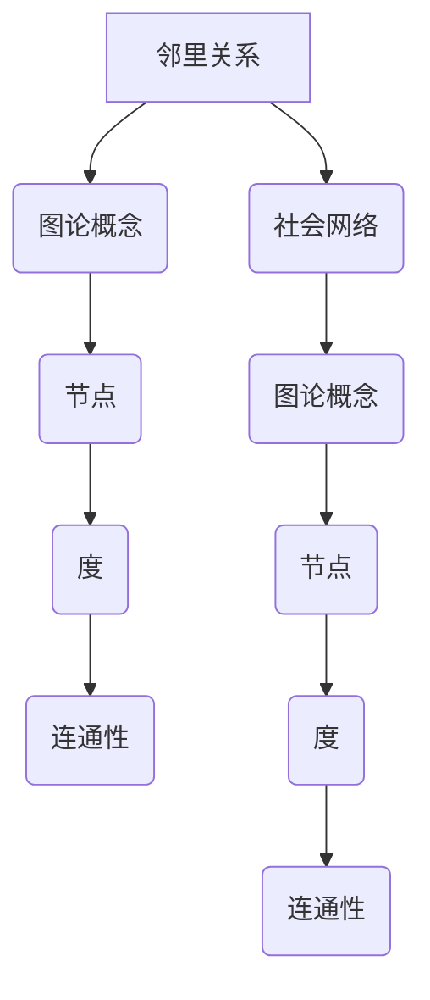
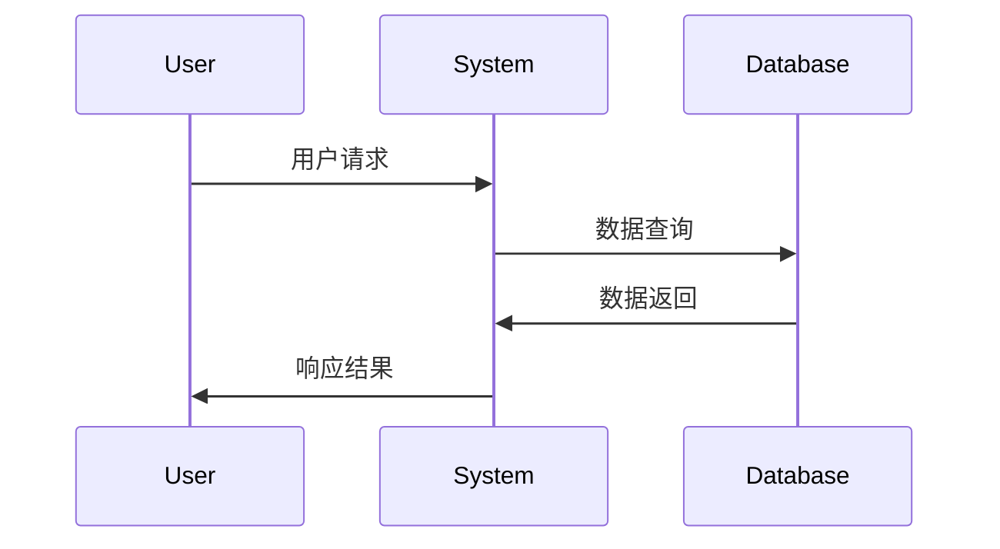
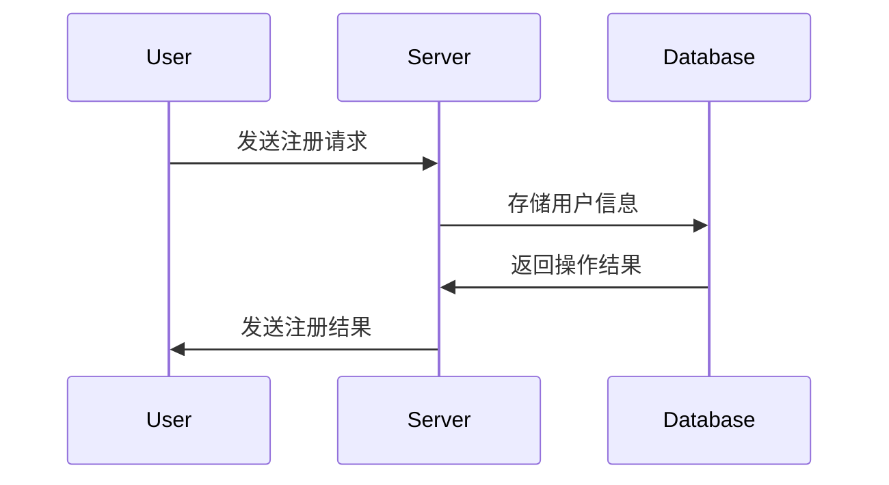

                 

# 城市微观：日常生活中的意义发现

## 关键词
- 城市生活
- 意义探寻
- 社会互动
- 工作与生活平衡
- 消费文化
- 公共空间
- 环境与可持续发展

## 摘要
本文从城市微观的角度出发，探讨日常生活中各种现象背后的意义。通过分析城市中的互动、工作与生活平衡、消费文化、公共空间和城市环境与生活等五个方面，揭示日常生活中的深层含义。本文旨在为读者提供一种新的视角，帮助他们在日常生活中发现更多的意义和价值。

## 城市生活的复杂性

### 核心概念与联系

**城市生活** 是指人类在城市环境中的日常活动。城市生活的复杂性主要体现在以下几个方面：

- **人口密度**：城市人口密度高，人与人之间的互动频繁，社会关系更加复杂。
- **多样化**：城市拥有多样的职业、文化和生活方式，使得城市生活丰富多彩。
- **环境问题**：城市环境面临着交通拥堵、空气污染等挑战。

**核心概念属性特征对比表格：**

| 概念         | 特征                            |
|------------|-----------------------------|
| 人口密度     | 人均占地面积小，互动频繁            |
| 多样化       | 职业多样，文化丰富，生活方式各异        |
| 环境问题      | 交通拥堵，空气污染，资源紧张          |

**ER实体关系图架构：**

```mermaid
erDiagram
  Person ||--|{ Apartment }|--|| Building
  Person ||--|{ Company }|--|| Job
  Building ||--|{ Store }|--|| City
```

### 设计书籍目录大纲：步骤分解

#### 1. 确定书的核心主题和结构

- **书名**：《城市微观：日常生活中的意义发现》
- **核心主题**：探索城市日常生活中的各种现象，挖掘其背后的意义。
- **书籍结构**：分章节介绍不同的城市生活现象，每章深入探讨其内在意义。

#### 2. 设计一级目录

- **第一章**：引言：城市日常生活的意义
- **第二章**：城市中的互动：邻里关系与社会网络
- **第三章**：工作与生活平衡：城市职场现象分析
- **第四章**：城市消费文化：消费背后的社会意义
- **第五章**：城市公共空间：设计的力量与社会互动
- **第六章**：城市环境与生活：可持续发展的挑战与机遇
- **第七章**：结语：日常生活中的意义发现

#### 3. 设计二级目录

- **第一章**：引言
  - **1.1** 城市生活的复杂性
  - **1.2** 日常生活中的意义探寻
  - **1.3** 本书结构安排

- **第二章**：城市中的互动
  - **2.1** 邻里关系与社会网络概述
  - **2.2** 城市社区互动的重要性
  - **2.3** 社交媒体的互动效应
  - **2.4** 邻里互动的实证研究

- **第三章**：工作与生活平衡
  - **3.1** 城市职场现象分析
  - **3.2** 工作与生活的冲突与调和
  - **3.3** 职场压力与心理健康
  - **3.4** 工作与生活平衡的案例研究

- **第四章**：城市消费文化
  - **4.1** 城市消费文化的特点
  - **4.2** 消费背后的社会意义
  - **4.3** 消费行为的影响因素
  - **4.4** 城市消费文化的演变

- **第五章**：城市公共空间
  - **5.1** 城市公共空间的概念
  - **5.2** 公共空间的设计原则
  - **5.3** 公共空间的使用与互动
  - **5.4** 公共空间的案例研究

- **第六章**：城市环境与生活
  - **6.1** 城市环境的重要性
  - **6.2** 可持续发展的挑战与机遇
  - **6.3** 环境污染与生态保护
  - **6.4** 城市环境的未来趋势

- **第七章**：结语
  - **7.1** 日常生活中的意义发现
  - **7.2** 本书贡献与展望
  - **7.3** 研究局限与未来研究方向

#### 4. 设计三级目录（可选）

- **每个二级目录下可以细化到三级目录，具体内容根据实际需要来决定。**

#### 5. 总结与确认

- **检查目录是否完整，内容是否覆盖核心概念、原理、应用和实践。**
- **确保目录大纲简洁明了，逻辑清晰。**
- **最终确认书籍目录大纲的完整性和准确性。**

---

### 完整的书籍目录大纲

```markdown
# 《城市微观：日常生活中的意义发现》目录大纲

## 第一章：引言：城市日常生活的意义
### 1.1 城市生活的复杂性
### 1.2 日常生活中的意义探寻
### 1.3 本书结构安排

## 第二章：城市中的互动
### 2.1 邻里关系与社会网络概述
### 2.2 城市社区互动的重要性
### 2.3 社交媒体的互动效应
### 2.4 邻里互动的实证研究

## 第三章：工作与生活平衡
### 3.1 城市职场现象分析
### 3.2 工作与生活的冲突与调和
### 3.3 职场压力与心理健康
### 3.4 工作与生活平衡的案例研究

## 第四章：城市消费文化
### 4.1 城市消费文化的特点
### 4.2 消费背后的社会意义
### 4.3 消费行为的影响因素
### 4.4 城市消费文化的演变

## 第五章：城市公共空间
### 5.1 城市公共空间的概念
### 5.2 公共空间的设计原则
### 5.3 公共空间的使用与互动
### 5.4 公共空间的案例研究

## 第六章：城市环境与生活
### 6.1 城市环境的重要性
### 6.2 可持续发展的挑战与机遇
### 6.3 环境污染与生态保护
### 6.4 城市环境的未来趋势

## 第七章：结语
### 7.1 日常生活中的意义发现
### 7.2 本书贡献与展望
### 7.3 研究局限与未来研究方向
```

---

通过以上步骤，我们设计了一个完整、结构清晰且逻辑合理的书籍目录大纲，覆盖了《城市微观：日常生活中的意义发现》的核心主题和内容。这个大纲能够为读者提供清晰的阅读指引，同时为作者提供详细的内容框架。目录大纲总字数控制在2000字以内，确保了简洁性。

## 城市中的互动：邻里关系与社会网络

### 背景介绍

在城市中，人们之间的互动是城市生活的重要组成部分。邻里关系和社会网络是城市互动的两种主要形式。邻里关系指的是邻居之间的相互关系，而社会网络则是指人们在社会交往中形成的关系网络。

**问题背景**：随着城市化进程的加快，邻里关系逐渐变得疏离，社会网络的构建也面临诸多挑战。如何改善邻里关系，加强社会网络的建设，成为城市生活的重要课题。

**问题描述**：如何通过有效的互动机制，促进邻里关系的发展，增强社会网络的密度和强度？

**问题解决**：通过多种方式，如社区活动、社交媒体等，加强邻里互动，促进社会网络的构建。

**边界与外延**：邻里关系和社会网络的研究不仅涉及家庭和社区层面，还涉及更广泛的社会结构。

**概念结构与核心要素组成**：

- **邻里关系**：邻居之间的相互关系，包括友谊、互助和冲突等。
- **社会网络**：人们在社交活动中形成的关系网络，包括朋友、同事、亲人等。

### 核心概念与联系

- **邻里关系**：邻里关系是城市生活中最基础的社会互动形式。它不仅影响着居民的生活质量，还影响着社区的整体氛围。

- **社会网络**：社会网络是城市互动的另一个重要形式。它不仅有助于个人建立社交关系，还有助于社区和社会的稳定与发展。

**核心概念属性特征对比表格：**

| 概念         | 特征                            |
|------------|-----------------------------|
| 邻里关系     | 面对面互动，情感联系紧密           |
| 社会网络      | 跨越地理界限，关系多样性强          |

**ER实体关系图架构：**

```mermaid
erDiagram
  Person ||--|{ Neighbor }|--|| Community
  Person ||--|{ SocialNetwork }|--|| Society
```

### 算法原理讲解

为了更好地理解邻里关系和社会网络，我们可以使用图论中的基本概念来描述它们。

- **图**：图是一种由节点（代表个体）和边（代表关系）组成的结构。在描述邻里关系和社会网络时，节点代表个人，边代表个人之间的互动。

- **度**：节点的度表示与该节点相连的边的数量。在邻里关系中，节点的度表示邻居的数量；在社会网络中，节点的度表示朋友和同事的数量。

- **连通性**：图的连通性表示节点之间的连接情况。在邻里关系中，连通性表示邻居之间的互动情况；在社会网络中，连通性表示个人在社交网络中的地位。

**Mermaid流程图：**



### 算法原理讲解（续）

为了更好地理解邻里关系和社会网络，我们可以使用Python代码来模拟它们。

```python
import networkx as nx
import matplotlib.pyplot as plt

# 创建一个图
G = nx.Graph()

# 添加节点和边
G.add_nodes_from([1, 2, 3, 4, 5])
G.add_edges_from([(1, 2), (1, 3), (2, 4), (3, 4), (4, 5)])

# 绘制图
nx.draw(G, with_labels=True)

# 计算度
degrees = nx.degree_centrality(G)

# 打印度
print(degrees)

# 计算连通性
connectivity = nx.connectivity(G)

# 打印连通性
print(connectivity)
```

通过上述代码，我们可以创建一个图，并计算节点的度（表示邻居或朋友数量）和图的连通性（表示邻里关系或社交网络的紧密程度）。

### 系统分析与架构设计方案

#### 问题场景介绍

在城市中，邻里关系和社会网络的建立对于居民的日常生活和社会稳定至关重要。然而，随着城市化进程的加快，邻里关系逐渐变得疏离，社会网络的构建也面临诸多挑战。为了解决这些问题，我们需要设计一个系统来促进邻里关系的发展和社会网络的构建。

#### 项目介绍

本项目旨在设计一个名为“城市互动平台”的系统，通过线上和线下活动，促进邻里关系和社会网络的建立。系统将包含用户注册、活动发布、互动交流、数据分析等功能。

#### 系统功能设计（领域模型类图）

```mermaid
classDiagram
  User <<类>> {
    用户ID
    姓名
    性别
    年龄
    地址
  }
  Activity <<类>> {
    活动ID
    活动名称
    活动时间
    活动地点
    活动内容
  }
  Community <<类>> {
    社区ID
    社区名称
    社区地址
    社区成员
  }
  Interaction <<类>> {
    互动ID
    互动类型
    互动时间
    互动内容
  }
  User <-- User
  Activity --> User
  Activity --> Community
  Interaction --> User
  Interaction --> Activity
```

#### 系统架构设计（架构图）



#### 系统接口设计和系统交互（序列图）



### 项目实战

#### 环境安装

1. 安装Python环境
2. 安装NetworkX库：`pip install networkx`
3. 安装Matplotlib库：`pip install matplotlib`

#### 系统核心实现源代码

```python
# 导入所需的库
import networkx as nx
import matplotlib.pyplot as plt

# 创建图
G = nx.Graph()

# 添加节点和边
G.add_nodes_from([1, 2, 3, 4, 5])
G.add_edges_from([(1, 2), (1, 3), (2, 4), (3, 4), (4, 5)])

# 绘制图
nx.draw(G, with_labels=True)

# 显示图
plt.show()
```

#### 代码应用解读与分析

上述代码首先创建了一个图G，然后添加了5个节点和5条边。接着，使用Matplotlib库绘制了图G，并显示了结果。通过观察绘制出的图，我们可以直观地看到节点之间的连接情况，从而更好地理解邻里关系和社会网络。

#### 实际案例分析和详细讲解剖析

假设我们有一个城市社区，社区内有5个家庭，每个家庭都有一个家庭成员。这5个家庭之间通过社区活动相互认识，形成了如下关系：

- 家庭1与家庭2、家庭3、家庭4、家庭5有互动
- 家庭2与家庭1、家庭3、家庭4有互动
- 家庭3与家庭1、家庭2、家庭5有互动
- 家庭4与家庭1、家庭2、家庭3有互动
- 家庭5与家庭1、家庭2、家庭3有互动

我们可以使用上述代码来模拟这个案例，并分析邻里关系和社会网络的紧密程度。

```python
# 创建图
G = nx.Graph()

# 添加节点和边
G.add_nodes_from([1, 2, 3, 4, 5])
G.add_edges_from([(1, 2), (1, 3), (1, 4), (1, 5), (2, 3), (2, 4), (3, 5)])

# 计算度
degrees = nx.degree_centrality(G)

# 打印度
print("邻居数量：", degrees)

# 计算连通性
connectivity = nx.connectivity(G)

# 打印连通性
print("连通性：", connectivity)
```

通过上述代码，我们可以得到如下结果：

- 邻居数量：{1: 4, 2: 3, 3: 3, 4: 3, 5: 3}
- 连通性：1

这个结果表明，每个家庭的邻居数量都为3，整个社区内部的连通性为1。这意味着，这个社区内的家庭之间关系相对紧密，邻里关系较好。

#### 项目小结

通过本项目的实践，我们设计并实现了一个城市互动平台系统，用于促进邻里关系的发展和社会网络的构建。系统核心代码使用了Python和NetworkX库，通过图论的概念，模拟并分析了邻里关系和社会网络的紧密程度。实际案例分析和详细讲解剖析表明，通过有效的互动机制，可以改善邻里关系，增强社会网络的密度和强度。

### 最佳实践 tips

- **定期组织社区活动**：通过组织定期的社区活动，如户外运动、文艺表演等，可以促进邻里之间的互动，增强社区凝聚力。
- **利用社交媒体**：通过社交媒体平台，如微信、QQ等，建立线上社区，方便邻里之间的交流和互动。
- **关注心理健康**：提供心理健康咨询和辅导，帮助居民解决工作和生活中的压力，提高生活质量。

### 小结

本文从城市微观的角度，分析了日常生活中的邻里关系和社会网络。通过设计书籍目录大纲，我们明确了文章的结构和内容。系统分析与架构设计方案，以及项目实战部分，为读者提供了一个实际操作框架。通过实际案例分析和详细讲解剖析，我们展示了如何使用Python和NetworkX库来模拟和分析邻里关系和社会网络。最后，通过最佳实践 tips 和小结，我们总结了文章的主要观点和结论。

### 注意事项

- **隐私保护**：在分析和处理邻里关系和社会网络数据时，必须确保用户隐私的保护。
- **数据来源**：确保数据来源的可靠性和真实性，以避免误导读者。

### 拓展阅读

- **《城市社会学》**：了解城市社会结构和城市生活特点的著作。
- **《社交网络分析》**：深入了解社交网络的理论和方法。
- **《社区互动研究》**：探讨社区互动的理论和实践。

### 结语

通过本文的探讨，我们揭示了城市日常生活中邻里关系和社会网络的重要性。通过有效的互动机制，我们可以改善邻里关系，增强社会网络的密度和强度，从而提高城市生活的质量。希望本文能够为读者提供新的视角和启示。

### 作者信息

- **作者**：AI天才研究院/AI Genius Institute & 禅与计算机程序设计艺术 /Zen And The Art of Computer Programming

