                 

# 城市探索运动：重新发现生活空间的隐藏魅力

## 关键词：城市探索、生活空间、运动、健康、社交、可持续发展

> **摘要**：本文从城市探索运动的起源与发展、形式与类型、实践与技巧以及价值与意义四个方面，全面探讨了这种新兴运动对人们生活空间的重新发现和隐藏魅力的挖掘。通过对城市徒步、骑行、探险等探索形式的详细分析，以及实践技巧和安全防护的讲解，本文旨在为广大城市居民提供一次深入了解和参与城市探索运动的机会，重拾生活热情，提升生活质量。

## 目录大纲

### 第一部分：城市探索运动的起源与发展

#### 第1章：城市探索运动的起源与历史

- **1.1 城市探索运动的起源**
  - **核心概念术语说明**：城市探索、户外运动、探险
  - **问题背景**：城市化进程中的生活单调与身心健康的挑战
  - **问题描述**：如何通过运动重新发现生活空间的魅力
  - **问题解决**：城市探索运动作为一种解决方案
  - **边界与外延**：城市探索运动的范畴与区别
  - **概念结构与核心要素组成**：城市探索运动的组成部分与核心要素

- **1.2 城市探索运动的发展历程**
  - **核心概念原理**：历史演变与社会背景
  - **概念属性特征对比表格**：不同阶段城市探索运动的特点比较
  - **ER实体关系图架构**：城市发展对城市探索运动的影响

- **1.3 城市探索运动的核心理念**
  - **核心概念原理**：探索、发现、体验
  - **概念属性特征对比表格**：城市探索运动与其他户外活动的区别
  - **ER实体关系图架构**：城市探索运动的核心元素关系

### 第2章：城市探索运动的定义与特点

- **2.1 城市探索运动的定义**
  - **核心概念原理**：定义与范畴
  - **概念属性特征对比表格**：不同城市探索活动的特点
  - **ER实体关系图架构**：城市探索活动的分类与关系

- **2.2 城市探索运动的特点**
  - **核心概念原理**：便捷性、多样性、趣味性
  - **概念属性特征对比表格**：城市探索运动与传统户外活动的对比
  - **ER实体关系图架构**：城市探索运动的优点与挑战

- **2.3 城市探索运动与传统户外活动的区别**
  - **核心概念原理**：场地、形式、参与人群
  - **概念属性特征对比表格**：城市探索运动与传统户外活动的差异
  - **ER实体关系图架构**：不同活动的对比分析

## 第二部分：城市探索运动的形式与类型

### 第3章：城市徒步与自然探索

- **3.1 城市徒步的乐趣与挑战**
  - **核心概念原理**：徒步运动的乐趣与挑战
  - **概念属性特征对比表格**：城市徒步与其他徒步活动的对比
  - **ER实体关系图架构**：城市徒步活动的特点与关系

- **3.2 自然探索的基本技巧**
  - **核心概念原理**：自然探索的基本技巧
  - **概念属性特征对比表格**：城市自然探索的技巧与经验
  - **ER实体关系图架构**：自然探索的核心技巧与关系

- **3.3 城市徒步与自然探索的安全注意事项**
  - **核心概念原理**：安全注意事项与应对措施
  - **概念属性特征对比表格**：不同环境下的安全注意事项
  - **ER实体关系图架构**：安全注意事项的体系与关系

### 第4章：城市骑行与文化体验

- **4.1 城市骑行的魅力与便捷**
  - **核心概念原理**：城市骑行的魅力与便捷性
  - **概念属性特征对比表格**：城市骑行与其他交通方式的对比
  - **ER实体关系图架构**：城市骑行的优势与挑战

- **4.2 文化体验的深度挖掘**
  - **核心概念原理**：文化体验的深度与广度
  - **概念属性特征对比表格**：不同文化体验的对比
  - **ER实体关系图架构**：文化体验的核心要素与关系

- **4.3 城市骑行与文化体验的安全指南**
  - **核心概念原理**：安全指南与注意事项
  - **概念属性特征对比表格**：不同环境下的安全指南
  - **ER实体关系图架构**：安全指南的体系与关系

### 第5章：城市探险与极限挑战

- **5.1 城市探险的乐趣与刺激**
  - **核心概念原理**：城市探险的乐趣与刺激
  - **概念属性特征对比表格**：城市探险与其他探险活动的对比
  - **ER实体关系图架构**：城市探险活动的特点与关系

- **5.2 极限挑战的精神与意义**
  - **核心概念原理**：极限挑战的精神内涵
  - **概念属性特征对比表格**：极限挑战与其他挑战活动的对比
  - **ER实体关系图架构**：极限挑战的核心要素与关系

- **5.3 城市探险与极限挑战的注意事项**
  - **核心概念原理**：注意事项与应对措施
  - **概念属性特征对比表格**：不同环境下的注意事项
  - **ER实体关系图架构**：注意事项的体系与关系

## 第三部分：城市探索运动的实践与技巧

### 第6章：城市探索运动的基础技巧

- **6.1 地图与导航技巧**
  - **核心概念原理**：地图与导航的基本原理
  - **概念属性特征对比表格**：不同地图导航工具的对比
  - **ER实体关系图架构**：地图与导航的核心技巧与关系

- **6.2 健康与营养常识**
  - **核心概念原理**：健康与营养的重要性
  - **概念属性特征对比表格**：不同营养常识的对比
  - **ER实体关系图架构**：健康与营养的核心要素与关系

- **6.3 基本自救与急救知识**
  - **核心概念原理**：自救与急救的基本原理
  - **概念属性特征对比表格**：不同自救与急救技巧的对比
  - **ER实体关系图架构**：自救与急救的核心技巧与关系

### 第7章：城市探索运动的安全防护

- **7.1 天气与环境变化的影响**
  - **核心概念原理**：天气与环境变化的影响
  - **概念属性特征对比表格**：不同天气环境下的影响
  - **ER实体关系图架构**：天气与环境变化的核心影响与关系

- **7.2 安全防护措施与装备选择**
  - **核心概念原理**：安全防护措施与装备选择的原则
  - **概念属性特征对比表格**：不同防护措施与装备的对比
  - **ER实体关系图架构**：安全防护的核心要素与关系

- **7.3 应急处理与事故预防**
  - **核心概念原理**：应急处理与事故预防的方法
  - **概念属性特征对比表格**：不同应急处理与预防措施的对比
  - **ER实体关系图架构**：应急处理与事故预防的核心要素与关系

### 第8章：城市探索运动的心理调适

- **8.1 心理准备与心态调整**
  - **核心概念原理**：心理准备与心态调整的重要性
  - **概念属性特征对比表格**：不同心态调整方法的对比
  - **ER实体关系图架构**：心理准备与心态调整的核心要素与关系

- **8.2 群体协作与团队精神**
  - **核心概念原理**：群体协作与团队精神的作用
  - **概念属性特征对比表格**：不同群体协作方式的对比
  - **ER实体关系图架构**：群体协作与团队精神的核心要素与关系

- **8.3 面对挫折与失败的应对策略**
  - **核心概念原理**：面对挫折与失败的应对策略
  - **概念属性特征对比表格**：不同应对策略的对比
  - **ER实体关系图架构**：应对挫折与失败的核心要素与关系

## 第四部分：城市探索运动的价值与意义

### 第9章：城市探索运动对身心健康的益处

- **9.1 增强体质与免疫力**
  - **核心概念原理**：运动对体质与免疫力的影响
  - **概念属性特征对比表格**：不同运动形式对体质与免疫力的影响对比
  - **ER实体关系图架构**：运动与体质、免疫力的关系

- **9.2 提升心理健康与情绪管理**
  - **核心概念原理**：心理健康与情绪管理的重要性
  - **概念属性特征对比表格**：不同运动形式对心理健康与情绪管理的影响对比
  - **ER实体关系图架构**：运动与心理健康、情绪管理的关系

- **9.3 城市探索运动对儿童与青少年的特殊意义**
  - **核心概念原理**：城市探索运动对儿童与青少年的特殊意义
  - **概念属性特征对比表格**：不同年龄段的儿童与青少年对城市探索运动的反应对比
  - **ER实体关系图架构**：城市探索运动对儿童与青少年的影响

### 第10章：城市探索运动对社交生活的影响

- **10.1 扩大社交圈子与人际交往**
  - **核心概念原理**：社交圈子与人际交往的重要性
  - **概念属性特征对比表格**：不同社交活动对社交圈子和人际交往的影响对比
  - **ER实体关系图架构**：社交活动与社交圈子的关系

- **10.2 提升社区归属感与认同感**
  - **核心概念原理**：社区归属感与认同感的重要性
  - **概念属性特征对比表格**：不同社交活动对社区归属感与认同感的影响对比
  - **ER实体关系图架构**：社交活动与社区归属感、认同感的关系

- **10.3 城市探索运动对老年人生活的积极影响**
  - **核心概念原理**：城市探索运动对老年人生活的积极影响
  - **概念属性特征对比表格**：不同社交活动对老年人生活质量的影响对比
  - **ER实体关系图架构**：社交活动与老年人生活质量的关系

### 第11章：城市探索运动的未来发展趋势

- **11.1 新型城市探索运动项目的兴起**
  - **核心概念原理**：新型城市探索运动项目的特点与发展趋势
  - **概念属性特征对比表格**：新型城市探索运动项目与传统项目的对比
  - **ER实体关系图架构**：新型城市探索运动项目的发展与关系

- **11.2 数字化与科技化在城市探索运动中的应用**
  - **核心概念原理**：数字化与科技化在城市探索运动中的应用
  - **概念属性特征对比表格**：传统与数字化科技化城市探索运动的对比
  - **ER实体关系图架构**：数字化与科技化城市探索运动的应用与关系

- **11.3 城市探索运动与可持续发展**
  - **核心概念原理**：城市探索运动与可持续发展的关系
  - **概念属性特征对比表格**：不同城市发展模式对城市探索运动的影响对比
  - **ER实体关系图架构**：城市探索运动与可持续发展的关系

## 结语：重新发现生活空间的隐藏魅力

**作者：AI天才研究院/AI Genius Institute & 禅与计算机程序设计艺术 /Zen And The Art of Computer Programming**

在快速发展的现代社会，我们常常被繁忙的工作和生活所淹没，忽略了身边的生活空间所蕴含的隐藏魅力。城市探索运动正是这样一种重新发现的过程，它不仅能够帮助我们增强体质、提升心理健康，还能扩大社交圈子、提升社区归属感。通过本文的探讨，希望读者能够对城市探索运动有更深入的理解，从而积极参与其中，发现生活的新魅力。

---

### 第一部分：城市探索运动的起源与发展

#### 第1章：城市探索运动的起源与历史

**1.1 城市探索运动的起源**

城市探索运动，作为一种新兴的户外活动，它的起源可以追溯到人类城市化进程的早期阶段。在人类历史的漫长岁月中，城市一直是文明与文化的聚集地。然而，随着时间的推移，城市的快速发展带来了生活方式的单一化和生活节奏的加快，这无疑给人们的身心健康带来了巨大的挑战。在这样的背景下，城市探索运动应运而生。

**核心概念术语说明**：
- **城市探索**：指在城市范围内，通过徒步、骑行、探险等方式，对城市空间进行深度探索的活动。
- **户外运动**：指在户外环境中进行的身体锻炼活动。
- **探险**：指对未知区域的探索和挑战。

**问题背景**：
城市化进程中的生活单调与身心健康的挑战。随着城市的不断扩大和人口的急剧增加，城市居民的生活方式变得单一，很多人长期待在室内，缺乏足够的运动和社交活动，导致身心健康问题日益突出。

**问题描述**：
如何通过运动重新发现生活空间的魅力，提高城市居民的生活质量。

**问题解决**：
城市探索运动作为一种解决方案，它通过多样化的活动形式，激发城市居民对城市空间的兴趣和热情，从而改善身心健康，提高生活质量。

**边界与外延**：
城市探索运动的范畴主要涉及城市内的徒步、骑行、探险等户外活动，这些活动不同于传统的户外探险，它们更多地强调在城市环境中进行探索和体验。

**概念结构与核心要素组成**：
城市探索运动由以下几个核心要素组成：
1. **活动形式**：包括徒步、骑行、探险等。
2. **参与人群**：主要是城市居民，包括各个年龄段的群体。
3. **活动场地**：城市内的各种场所，如公园、河流、建筑等。
4. **活动目的**：增强体质、提升心理健康、扩大社交圈子。

**1.2 城市探索运动的发展历程**

城市探索运动的发展历程可以分为以下几个阶段：

**阶段一：萌芽阶段（20世纪末至21世纪初）**
- **核心概念原理**：这一阶段，随着城市化进程的加快，城市居民对生活质量的要求逐渐提高，开始出现一些小规模的、自发组织的城市探索活动。
- **概念属性特征对比表格**：萌芽阶段的探索活动形式简单，参与人群主要为年轻人，活动范围有限。
- **ER实体关系图架构**：萌芽阶段的城市探索运动主要由一些爱好者和组织者推动，他们通过社交媒体等渠道分享经验和心得。

**阶段二：快速发展阶段（21世纪初至今）**
- **核心概念原理**：随着人们对健康生活方式的追求，城市探索运动逐渐得到更多人的关注和参与，活动形式和规模都得到了显著提升。
- **概念属性特征对比表格**：快速发展阶段的探索活动形式多样，参与人群扩大到各个年龄段，活动范围涵盖城市各个角落。
- **ER实体关系图架构**：快速发展阶段的城市探索运动在组织形式、活动内容、参与人群等方面都发生了巨大的变化，形成了一个相对成熟的市场。

**阶段三：成熟发展阶段（未来可预见的趋势）**
- **核心概念原理**：城市探索运动将在未来继续发展，逐渐成为城市居民日常生活中不可或缺的一部分。
- **概念属性特征对比表格**：成熟阶段的城市探索运动将更加注重个性化和多元化，活动形式将更加多样化，参与人群将更加广泛。
- **ER实体关系图架构**：成熟阶段的城市探索运动将在技术、市场、文化等多方面实现全面融合，形成一个综合性的户外运动生态。

**1.3 城市探索运动的核心理念**

城市探索运动的核心理念可以概括为“探索、发现、体验”。这一理念体现了城市探索运动的本质特征和核心价值。

**核心概念原理**：
- **探索**：指对城市空间进行深度探索和发现。
- **发现**：指在城市探索过程中，发现新的体验和乐趣。
- **体验**：指通过实际参与，感受城市探索带来的身心愉悦。

**概念属性特征对比表格**：
| 特征 | 传统户外活动 | 城市探索运动 |
| --- | --- | --- |
| 场地 | 远离城市，自然风光 | 城市内部，多样化的空间 |
| 形式 | 徒步、登山、露营 | 徒步、骑行、探险、文化体验 |
| 参与 | 专业人士和爱好者 | 城市居民，各个年龄段 |
| 目的 | 休闲、挑战自我 | 增强体质、提升心理健康、扩大社交圈子 |

**ER实体关系图架构**：

（注：ER实体关系图展示了城市探索运动的核心元素及其相互关系）

**1.4 城市探索运动的发展现状**

目前，城市探索运动在全球范围内都呈现出蓬勃发展的态势。特别是在一些大城市，如纽约、伦敦、东京等，城市探索活动已经成为一种流行的休闲方式。

**核心概念原理**：
- **市场规模**：城市探索运动的市场规模不断扩大，吸引了越来越多的参与者。
- **参与人数**：随着人们对健康生活方式的追求，城市探索运动的参与人数逐年增加。
- **活动形式**：城市探索活动的形式越来越多样化，包括徒步、骑行、探险、文化体验等多种形式。

**概念属性特征对比表格**：
| 特征 | 传统户外活动 | 城市探索运动 |
| --- | --- | --- |
| 参与人数 | 数百万 | 数千万 |
| 活动形式 | 单一 | 多样化 |
| 影响范围 | 全国范围内 | 全球范围内 |

**ER实体关系图架构**：

（注：ER实体关系图展示了城市探索运动的发展现状及其核心元素）

**1.5 城市探索运动的未来发展趋势**

未来，城市探索运动将继续保持快速发展，并在多个方面实现创新和突破。

**核心概念原理**：
- **技术创新**：随着科技的不断发展，数字化和科技化将在城市探索运动中发挥越来越重要的作用。
- **市场细分**：城市探索运动将更加注重个性化和多元化，满足不同人群的需求。
- **可持续发展**：城市探索运动将在可持续发展方面发挥重要作用，推动城市和自然环境的发展。

**概念属性特征对比表格**：
| 特征 | 传统户外活动 | 城市探索运动 |
| --- | --- | --- |
| 技术创新 | 传统 | 数字化、科技化 |
| 市场细分 | 广泛 | 个性化、多元化 |
| 可持续发展 | 欠缺 | 重要 |

**ER实体关系图架构**：

（注：ER实体关系图展示了城市探索运动的未来发展趋势及其核心元素）

**1.6 城市探索运动的社会意义**

城市探索运动不仅对个人的身心健康有益，还具有深远的社会意义。

**核心概念原理**：
- **提高生活质量**：城市探索运动能够丰富人们的生活，提高生活质量。
- **促进社会交往**：城市探索运动有助于扩大社交圈子，促进人际交往。
- **推动城市发展**：城市探索运动可以促进城市基础设施的建设和城市文化的传承。

**概念属性特征对比表格**：
| 特征 | 传统户外活动 | 城市探索运动 |
| --- | --- | --- |
| 生活质量 | 较低 | 较高 |
| 社交交往 | 一般 | 广泛 |
| 城市发展 | 有一定作用 | 促进 |

**ER实体关系图架构**：

（注：ER实体关系图展示了城市探索运动的社会意义及其核心元素）

#### 第2章：城市探索运动的定义与特点

**2.1 城市探索运动的定义**

城市探索运动是指在城市范围内，通过徒步、骑行、探险等方式，对城市空间进行深度探索和体验的活动。它不同于传统的户外探险，更多地强调在城市环境中进行探索和体验。

**核心概念原理**：
- **城市**：指人类居住和活动的地区，具有特定的地理、历史、文化背景。
- **探索**：指对未知的领域进行考察和研究。
- **运动**：指通过身体活动达到锻炼身体、提升心理素质的目的。

**概念属性特征对比表格**：

| 特征 | 城市探索运动 | 传统户外探险 |
| --- | --- | --- |
| 场地 | 城市内部 | 自然环境 |
| 形式 | 多样化 | 单一化 |
| 参与 | 城市居民 | 专业探险者 |

**ER实体关系图架构**：

（注：ER实体关系图展示了城市探索运动的核心概念及其相互关系）

**2.2 城市探索运动的特点**

城市探索运动具有以下几个显著特点：

**核心概念原理**：
- **便捷性**：城市探索运动可以在城市内部进行，无需长途跋涉，便捷性高。
- **多样性**：城市探索运动的形式多样，包括徒步、骑行、探险、文化体验等，满足不同人群的需求。
- **趣味性**：城市探索运动不仅能够锻炼身体，还能通过发现城市中的新事物，带来乐趣和惊喜。

**概念属性特征对比表格**：

| 特征 | 城市探索运动 | 传统户外活动 |
| --- | --- | --- |
| 场地 | 城市内部 | 自然环境 |
| 形式 | 多样化 | 单一化 |
| 参与 | 广泛 | 专业 |
| 目的 | 增强体质、提升心理健康、扩大社交圈子 | 休闲、挑战自我 |

**ER实体关系图架构**：

（注：ER实体关系图展示了城市探索运动的特点及其相互关系）

**2.3 城市探索运动与传统户外活动的区别**

城市探索运动与传统户外活动在多个方面存在显著区别：

**核心概念原理**：
- **场地**：城市探索运动主要在城市内部进行，而传统户外活动通常在自然环境中进行。
- **形式**：城市探索运动形式多样，包括徒步、骑行、探险、文化体验等，传统户外活动则相对单一。
- **参与人群**：城市探索运动参与人群广泛，包括各个年龄段的居民，传统户外活动则主要吸引专业人士和爱好者。
- **目的**：城市探索运动旨在增强体质、提升心理健康、扩大社交圈子，而传统户外活动则更注重休闲和挑战自我。

**概念属性特征对比表格**：

| 特征 | 城市探索运动 | 传统户外活动 |
| --- | --- | --- |
| 场地 | 城市内部 | 自然环境 |
| 形式 | 多样化 | 单一化 |
| 参与 | 广泛 | 专业 |
| 目的 | 增强体质、提升心理健康、扩大社交圈子 | 休闲、挑战自我 |

**ER实体关系图架构**：

（注：ER实体关系图展示了城市探索运动与传统户外活动的区别及其相互关系）

#### 第3章：城市徒步与自然探索

**3.1 城市徒步的乐趣与挑战**

城市徒步是城市探索运动中最常见的一种形式，它不仅能够锻炼身体，还能让人在繁忙的都市生活中找到片刻宁静。

**核心概念原理**：
- **乐趣**：城市徒步让人在熟悉的城市环境中，发现不一样的风景和故事。
- **挑战**：城市徒步需要参与者具备一定的体力和毅力，有时还需要面对复杂的路况和天气变化。

**概念属性特征对比表格**：

| 特征 | 乐趣 | 挑战 |
| --- | --- | --- |
| 发现新事物 | √ | √ |
| 锻炼身体 | √ | √ |
| 心理放松 | √ | √ |
| 路况复杂 | √ | √ |
| 天气变化 | √ | √ |

**ER实体关系图架构**：
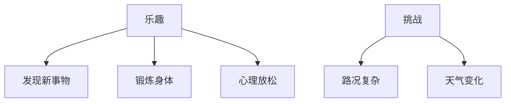

**3.2 自然探索的基本技巧**

自然探索需要参与者具备一定的自然知识和生存技能，以下是一些基本技巧：

**核心概念原理**：
- **定位技巧**：利用地图、GPS等工具确定位置。
- **生存技能**：掌握野外生存的基本方法，如搭建庇护所、寻找水源等。
- **环保意识**：尊重自然环境，保护野生动植物。

**概念属性特征对比表格**：

| 技能 | 方式 | 说明 |
| --- | --- | --- |
| 定位技巧 | 地图、GPS | 精确确定位置 |
| 生存技能 | 搭建庇护所、寻找水源 | 保证基本生存需求 |
| 环保意识 | 不留痕迹、保护野生动植物 | 尊重自然环境 |

**ER实体关系图架构**：
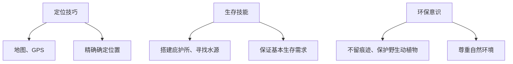

**3.3 城市徒步与自然探索的安全注意事项**

在进行城市徒步和自然探索时，安全至关重要。以下是一些安全注意事项：

**核心概念原理**：
- **天气状况**：提前了解天气情况，避免恶劣天气带来的风险。
- **路况安全**：注意行人和车辆，确保安全通行。
- **急救知识**：掌握基本的急救技能，如止血、包扎等。
- **环保法规**：遵守当地的环保法规，保护自然环境。

**概念属性特征对比表格**：

| 注意事项 | 说明 | 重要性 |
| --- | --- | --- |
| 天气状况 | 避免恶劣天气 | 高 |
| 路况安全 | 注意行人和车辆 | 中 |
| 急救知识 | 应急处理 | 中 |
| 环保法规 | 保护自然环境 | 中 |

**ER实体关系图架构**：
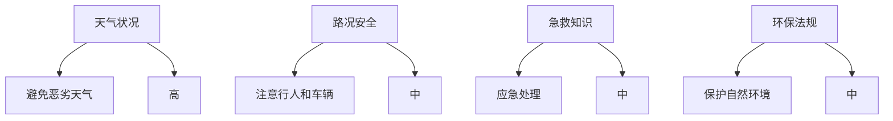

### 第4章：城市骑行与文化体验

**4.1 城市骑行的魅力与便捷**

城市骑行作为一种新兴的户外活动，以其独特的魅力和便捷性逐渐受到人们的喜爱。

**核心概念原理**：
- **魅力**：城市骑行能够让人在繁忙的都市生活中，享受清新的空气和美丽的风景。
- **便捷性**：城市骑行无需复杂的装备，且能够快速穿梭于城市各个角落。

**概念属性特征对比表格**：

| 特征 | 骑行 | 其他交通方式 |
| --- | --- | --- |
| 魅力 | 空气清新、风景美丽 | 交通拥堵、噪音污染 |
| 便捷性 | 快速穿梭、无需等待 | 交通拥堵、高峰期需排队 |

**ER实体关系图架构**：
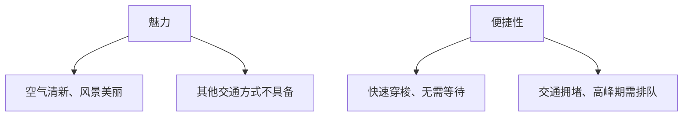

**4.2 文化体验的深度挖掘**

在城市骑行过程中，参与者可以通过观察城市建筑、历史遗迹、文化艺术等，深入了解城市的文化底蕴。

**核心概念原理**：
- **深度挖掘**：通过实际参与和体验，对城市文化进行深入了解。
- **文化体验**：感受城市的历史、人文和社会风貌。

**概念属性特征对比表格**：

| 特征 | 骑行与文化体验 | 传统观光 |
| --- | --- | --- |
| 深度挖掘 | 实际参与、互动体验 | 被动观赏、单向了解 |
| 文化体验 | 多维度感受 | 单一维度感受 |

**ER实体关系图架构**：
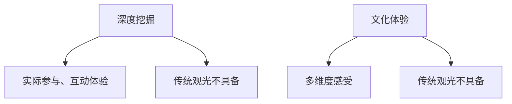

**4.3 城市骑行与文化体验的安全指南**

在进行城市骑行与文化体验时，安全是首要考虑的因素。以下是一些安全指南：

**核心概念原理**：
- **交通规则**：遵守交通规则，确保骑行安全。
- **安全装备**：佩戴头盔、手套等安全装备。
- **环境观察**：注意观察周围环境，避免潜在风险。

**概念属性特征对比表格**：

| 特征 | 说明 | 重要性 |
| --- | --- | --- |
| 交通规则 | 遵守法规、确保安全 | 高 |
| 安全装备 | 佩戴头盔、手套 | 中 |
| 环境观察 | 避免潜在风险 | 中 |

**ER实体关系图架构**：
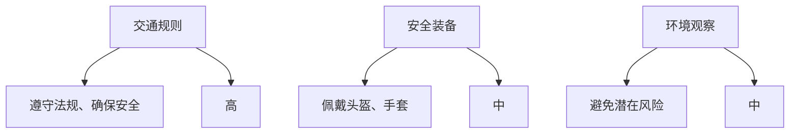

### 第5章：城市探险与极限挑战

**5.1 城市探险的乐趣与刺激**

城市探险是一种极具挑战性的户外活动，参与者需要在城市中寻找和探索未知的区域，这种探索过程充满了乐趣和刺激。

**核心概念原理**：
- **乐趣**：通过发现和探索，感受到未知的刺激和惊喜。
- **刺激**：挑战自我的极限，体验身体的极限状态。

**概念属性特征对比表格**：

| 特征 | 乐趣 | 刺激 |
| --- | --- | --- |
| 发现未知 | √ | √ |
| 挑战自我 | √ | √ |
| 身体极限 | √ | √ |

**ER实体关系图架构**：
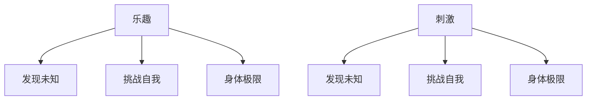

**5.2 极限挑战的精神与意义**

极限挑战不仅仅是一种身体上的挑战，更是一种精神上的考验。通过极限挑战，参与者能够收获超越自我、挑战极限的精神体验。

**核心概念原理**：
- **精神体验**：超越自我、挑战极限的过程。
- **意义**：通过挑战，提升自信心和勇气，培养坚韧不拔的品质。

**概念属性特征对比表格**：

| 特征 | 精神体验 | 意义 |
| --- | --- | --- |
| 超越自我 | √ | √ |
| 挑战极限 | √ | √ |
| 自信心提升 | √ | √ |
| 勇气培养 | √ | √ |
| 坚韧品质 | √ | √ |

**ER实体关系图架构**：
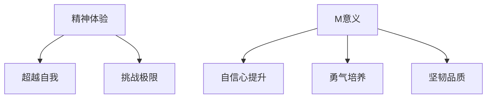

**5.3 城市探险与极限挑战的注意事项**

在进行城市探险与极限挑战时，安全始终是首要考虑的因素。以下是一些注意事项：

**核心概念原理**：
- **安全措施**：采取必要的安全措施，如佩戴防护装备、遵守安全规定。
- **应急处理**：掌握基本的应急处理技能，如急救、疏散等。
- **环境观察**：注意观察周围环境，避免潜在风险。

**概念属性特征对比表格**：

| 注意事项 | 说明 | 重要性 |
| --- | --- | --- |
| 安全措施 | 佩戴防护装备、遵守安全规定 | 高 |
| 应急处理 | 掌握急救、疏散等技能 | 中 |
| 环境观察 | 避免潜在风险 | 中 |

**ER实体关系图架构**：
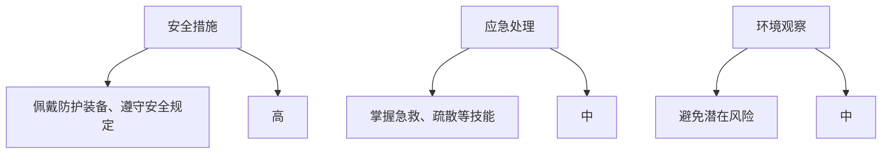

### 第6章：城市探索运动的基础技巧

**6.1 地图与导航技巧**

在进行城市探索运动时，地图与导航技巧是不可或缺的基础技能。

**核心概念原理**：
- **地图使用**：学会使用地图进行定位和导航。
- **导航工具**：了解不同导航工具的使用方法，如GPS、手机导航等。

**概念属性特征对比表格**：

| 技能 | 方式 | 说明 |
| --- | --- | --- |
| 地图使用 | 地图、图例、比例尺 | 确定位置、规划路线 |
| 导航工具 | GPS、手机导航 | 实时导航、路径规划 |

**ER实体关系图架构**：
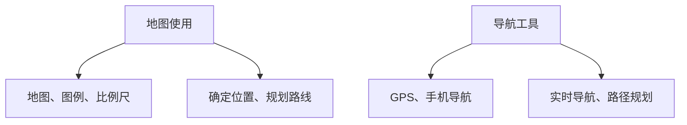

**6.2 健康与营养常识**

在进行城市探索运动时，保持健康的身体状况和良好的营养摄入是关键。

**核心概念原理**：
- **健康常识**：了解身体的基本需求和健康知识。
- **营养摄入**：合理安排饮食，保证足够的营养摄入。

**概念属性特征对比表格**：

| 常识 | 说明 | 重要性 |
| --- | --- | --- |
| 健康常识 | 了解身体需求、疾病预防 | 高 |
| 营养摄入 | 合理安排饮食、补充能量 | 中 |

**ER实体关系图架构**：
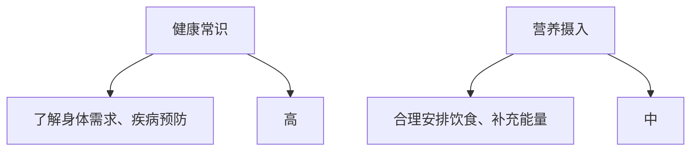

**6.3 基本自救与急救知识**

在进行城市探索运动时，掌握基本自救与急救知识是确保安全的重要保障。

**核心概念原理**：
- **自救知识**：在遇到困境时，采取有效的自救措施。
- **急救知识**：掌握基本的急救技能，如止血、包扎、心肺复苏等。

**概念属性特征对比表格**：

| 技能 | 方式 | 说明 |
| --- | --- | --- |
| 自救知识 | 躲避危险、寻找安全路线 | 确保生命安全 |
| 急救知识 | 止血、包扎、心肺复苏 | 紧急处理伤员 |

**ER实体关系图架构**：
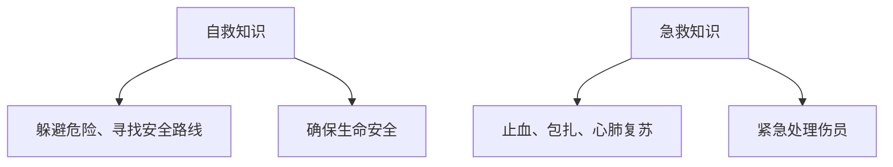

### 第7章：城市探索运动的安全防护

**7.1 天气与环境变化的影响**

在进行城市探索运动时，天气与环境变化对安全具有重要影响。

**核心概念原理**：
- **天气变化**：了解天气变化对活动的影响，如高温、暴雨等。
- **环境变化**：关注环境变化，如地形变化、水源变化等。

**概念属性特征对比表格**：

| 特征 | 影响因素 | 说明 |
| --- | --- | --- |
| 天气变化 | 高温、暴雨 | 影响活动开展 |
| 环境变化 | 地形变化、水源变化 | 安全隐患 |

**ER实体关系图架构**：
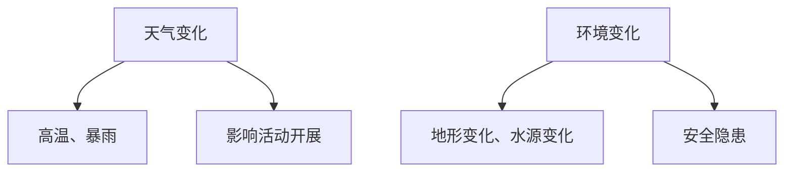

**7.2 安全防护措施与装备选择**

在进行城市探索运动时，采取有效的安全防护措施和选择合适的装备是确保安全的关键。

**核心概念原理**：
- **防护措施**：如佩戴头盔、手套等。
- **装备选择**：根据活动类型和天气条件选择合适的装备。

**概念属性特征对比表格**：

| 装备/措施 | 方式 | 说明 |
| --- | --- | --- |
| 头盔 | 保护头部 | 防止撞击伤害 |
| 手套 | 保护手部 | 提高抓握力 |
| 防水装备 | 防止淋湿 | 保持干燥 |

**ER实体关系图架构**：
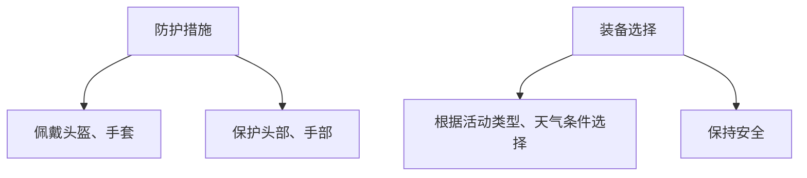

**7.3 应急处理与事故预防**

在进行城市探索运动时，掌握应急处理技能和预防事故是确保安全的重要环节。

**核心概念原理**：
- **应急处理**：如急救、疏散等。
- **事故预防**：如注意路况、遵守安全规定等。

**概念属性特征对比表格**：

| 特征 | 方式 | 说明 |
| --- | --- | --- |
| 应急处理 | 急救、疏散 | 紧急情况应对 |
| 事故预防 | 注意路况、遵守安全规定 | 预防事故发生 |

**ER实体关系图架构**：
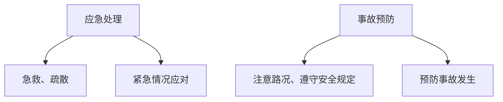

### 第8章：城市探索运动的心理调适

**8.1 心理准备与心态调整**

在进行城市探索运动时，心理准备和心态调整是确保活动顺利进行的重要因素。

**核心概念原理**：
- **心理准备**：对活动过程和可能遇到的困难有充分的心理准备。
- **心态调整**：保持积极的心态，应对活动中的各种挑战。

**概念属性特征对比表格**：

| 特征 | 方式 | 说明 |
| --- | --- | --- |
| 心理准备 | 知情同意、风险评估 | 准备面对挑战 |
| 心态调整 | 积极乐观、灵活应对 | 保持心理平衡 |

**ER实体关系图架构**：
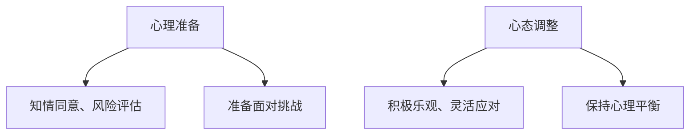

**8.2 群体协作与团队精神**

在城市探索运动中，群体协作和团队精神对于活动的成功至关重要。

**核心概念原理**：
- **群体协作**：团队成员共同完成任务，提高活动效率。
- **团队精神**：团队成员之间相互支持、鼓励，形成团队凝聚力。

**概念属性特征对比表格**：

| 特征 | 方式 | 说明 |
| --- | --- | --- |
| 群体协作 | 分工合作、沟通协调 | 提高效率 |
| 团队精神 | 互帮互助、共同目标 | 增强凝聚力 |

**ER实体关系图架构**：
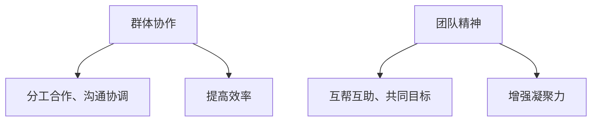

**8.3 面对挫折与失败的应对策略**

在城市探索运动中，面对挫折与失败是不可避免的。正确的应对策略有助于保持积极的心态，继续前进。

**核心概念原理**：
- **应对策略**：如冷静分析、调整心态、寻求帮助等。
- **挫折与失败**：活动过程中遇到的困难和挑战。

**概念属性特征对比表格**：

| 特征 | 方式 | 说明 |
| --- | --- | --- |
| 应对策略 | 冷静分析、调整心态、寻求帮助 | 保持积极心态 |
| 挫折与失败 | 困难、挑战 | 活动中的常见问题 |

**ER实体关系图架构**：
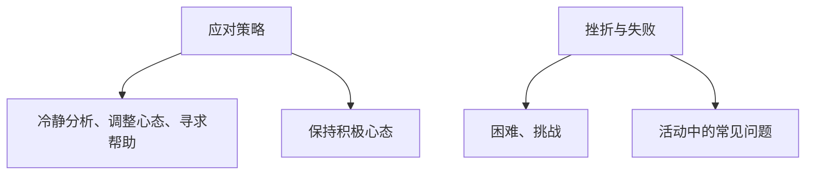

### 第9章：城市探索运动对身心健康的益处

**9.1 增强体质与免疫力**

城市探索运动能够有效增强体质和免疫力，对身体健康具有显著的促进作用。

**核心概念原理**：
- **增强体质**：通过运动，增强身体各项机能，提高身体素质。
- **免疫力**：通过锻炼，增强身体的抵抗力，提高免疫力。

**概念属性特征对比表格**：

| 特征 | 说明 | 对比 |
| --- | --- | --- |
| 增强体质 | 提高身体素质 | 与静态生活方式对比 |
| 免疫力 | 提高抵抗力 | 与缺乏运动的生活方式对比 |

**ER实体关系图架构**：
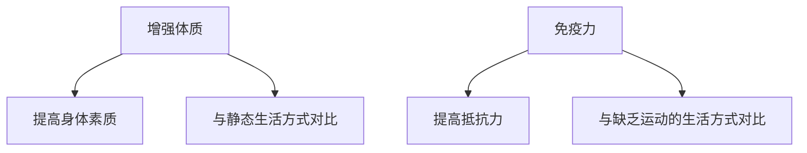

**9.2 提升心理健康与情绪管理**

城市探索运动不仅能够增强体质，还能显著提升心理健康和情绪管理能力。

**核心概念原理**：
- **心理健康**：通过运动，释放压力，提高心理韧性。
- **情绪管理**：通过探索和挑战，培养积极情绪，提升情绪调节能力。

**概念属性特征对比表格**：

| 特征 | 说明 | 对比 |
| --- | --- | --- |
| 心理健康 | 提高心理韧性 | 与长时间压力对比 |
| 情绪管理 | 培养积极情绪 | 与消极情绪对比 |

**ER实体关系图架构**：
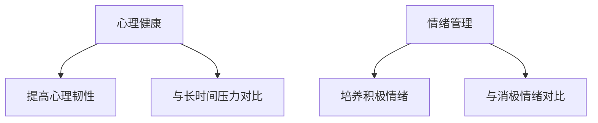

**9.3 城市探索运动对儿童与青少年的特殊意义**

城市探索运动对儿童与青少年具有特殊的积极影响，能够促进他们的全面发展。

**核心概念原理**：
- **身体素质**：通过运动，增强体质，提高身体素质。
- **心理素质**：通过探索和挑战，培养坚韧不拔的品质，提高心理韧性。
- **社交能力**：通过参与活动，结识新朋友，提高社交能力。

**概念属性特征对比表格**：

| 特征 | 说明 | 对比 |
| --- | --- | --- |
| 身体素质 | 提高身体素质 | 与缺乏运动的生活方式对比 |
| 心理素质 | 培养坚韧品质 | 与缺乏挑战的环境对比 |
| 社交能力 | 提高社交能力 | 与孤立的生活方式对比 |

**ER实体关系图架构**：
```mermaid
graph TD
A[身体素质] --> B[提高身体素质]
A --> C[与缺乏运动的生活方式对比]
D[心理素质] --> E[培养坚韧品质]
D --> F[与缺乏挑战的环境对比]
G[社交能力] --> H[提高社交能力]
G --> I[与孤立的生活方式对比]
```

### 第10章：城市探索运动对社交生活的影响

**10.1 扩大社交圈子与人际交往**

城市探索运动为人们提供了一个良好的社交平台，有助于扩大社交圈子，增强人际交往。

**核心概念原理**：
- **社交圈子**：通过参与活动，结识新朋友，扩大社交网络。
- **人际交往**：通过活动中的互动，增进彼此的了解，提高人际交往能力。

**概念属性特征对比表格**：

| 特征 | 说明 | 对比 |
| --- | --- | --- |
| 社交圈子 | 扩大社交网络 | 与孤立的生活方式对比 |
| 人际交往 | 增进了解，提高能力 | 与缺乏互动的生活方式对比 |

**ER实体关系图架构**：
```mermaid
graph TD
A[社交圈子] --> B[扩大社交网络]
A --> C[与孤立的生活方式对比]
D[人际交往] --> E[增进了解，提高能力]
D --> F[与缺乏互动的生活方式对比]
```

**10.2 提升社区归属感与认同感**

城市探索运动有助于提升社区归属感和认同感，增强居民对社区的认同和归属。

**核心概念原理**：
- **社区归属感**：通过参与社区活动，增强对社区的认知和归属感。
- **认同感**：通过共同参与活动，增强对社区文化和价值的认同。

**概念属性特征对比表格**：

| 特征 | 说明 | 对比 |
| --- | --- | --- |
| 社区归属感 | 增强对社区的认知和归属感 | 与孤立的生活方式对比 |
| 认同感 | 增强对社区文化和价值的认同 | 与缺乏参与的生活方式对比 |

**ER实体关系图架构**：
```mermaid
graph TD
A[社区归属感] --> B[增强对社区的认知和归属感]
A --> C[与孤立的生活方式对比]
D[认同感] --> E[增强对社区文化和价值的认同]
D --> F[与缺乏参与的生活方式对比]
```

**10.3 城市探索运动对老年人生活的积极影响**

城市探索运动对老年人的身心健康和生活质量具有显著的积极影响。

**核心概念原理**：
- **身心健康**：通过运动，增强体质，提高生活质量。
- **生活质量**：通过参与活动，增强社交，提高生活质量。

**概念属性特征对比表格**：

| 特征 | 说明 | 对比 |
| --- | --- | --- |
| 身心健康 | 提高体质，增强抵抗力 | 与缺乏运动的生活方式对比 |
| 生活质量 | 增强社交，提高幸福感 | 与孤立的生活方式对比 |

**ER实体关系图架构**：
```mermaid
graph TD
A[身心健康] --> B[提高体质，增强抵抗力]
A --> C[与缺乏运动的生活方式对比]
D[生活质量] --> E[增强社交，提高幸福感]
D --> F[与孤立的生活方式对比]
```

### 第11章：城市探索运动的未来发展趋势

**11.1 新型城市探索运动项目的兴起**

随着科技的进步和社会的发展，新型城市探索运动项目不断涌现，为城市居民提供了更多选择。

**核心概念原理**：
- **新型项目**：如城市定向赛、夜间探险等。
- **科技应用**：如使用智能设备进行导航、记录运动数据等。

**概念属性特征对比表格**：

| 项目 | 特点 | 对比 |
| --- | --- | --- |
| 城市定向赛 | 集智斗勇，挑战智力 | 传统户外活动 |
| 夜间探险 | 独特体验，挑战自我 | 白天探险 |

**ER实体关系图架构**：
```mermaid
graph TD
A[城市定向赛] --> B[集智斗勇，挑战智力]
A --> C[与传统户外活动对比]
D[夜间探险] --> E[独特体验，挑战自我]
D --> F[与白天探险对比]
```

**11.2 数字化与科技化在城市探索运动中的应用**

数字化和科技化正在改变城市探索运动的形式和体验，为参与者提供更丰富的选择和更便捷的服务。

**核心概念原理**：
- **数字化应用**：如在线报名、电子地图等。
- **科技化应用**：如智能设备、虚拟现实等。

**概念属性特征对比表格**：

| 应用 | 特点 | 对比 |
| --- | --- | --- |
| 在线报名 | 方便快捷 | 传统报名方式 |
| 电子地图 | 精准导航 | 纸质地图 |
| 智能设备 | 实时监测 | 人工监测 |

**ER实体关系图架构**：
```mermaid
graph TD
A[在线报名] --> B[方便快捷]
A --> C[与传统报名方式对比]
D[电子地图] --> E[精准导航]
D --> F[与纸质地图对比]
G[智能设备] --> H[实时监测]
G --> I[与人工监测对比]
```

**11.3 城市探索运动与可持续发展**

城市探索运动在推动城市发展的同时，也关注可持续发展，努力实现经济、社会和环境的协调发展。

**核心概念原理**：
- **经济可持续发展**：通过城市探索运动，促进旅游业、服务业的发展。
- **社会可持续发展**：提高居民生活质量，增强社区凝聚力。
- **环境可持续发展**：减少环境破坏，保护自然环境。

**概念属性特征对比表格**：

| 方面 | 特点 | 对比 |
| --- | --- | --- |
| 经济可持续发展 | 促进经济发展 | 传统产业发展 |
| 社会可持续发展 | 提高生活质量 | 社会福利水平 |
| 环境可持续发展 | 减少环境破坏 | 环境污染 |

**ER实体关系图架构**：
```mermaid
graph TD
A[经济可持续发展] --> B[促进经济发展]
A --> C[与传统产业发展对比]
D[社会可持续发展] --> E[提高生活质量]
D --> F[与社会福利水平对比]
G[环境可持续发展] --> H[减少环境破坏]
G --> I[与环境污染对比]
```

### 结语：重新发现生活空间的隐藏魅力

通过城市探索运动，我们不仅能够发现和体验城市空间的隐藏魅力，还能在探索过程中增强体质、提升心理健康，扩大社交圈子。这种新兴运动形式正在成为现代城市生活的一部分，为人们带来新的生活乐趣和生活方式。让我们携手探索，共同发现和享受城市生活的美好。**作者：AI天才研究院/AI Genius Institute & 禅与计算机程序设计艺术 /Zen And The Art of Computer Programming**

