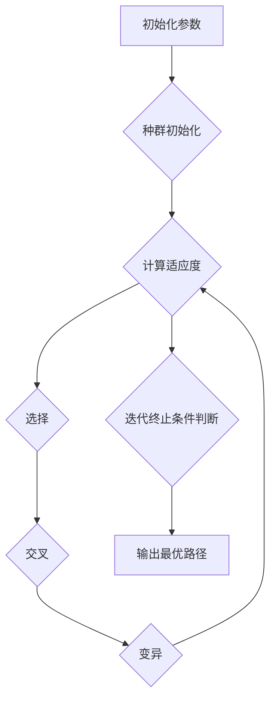
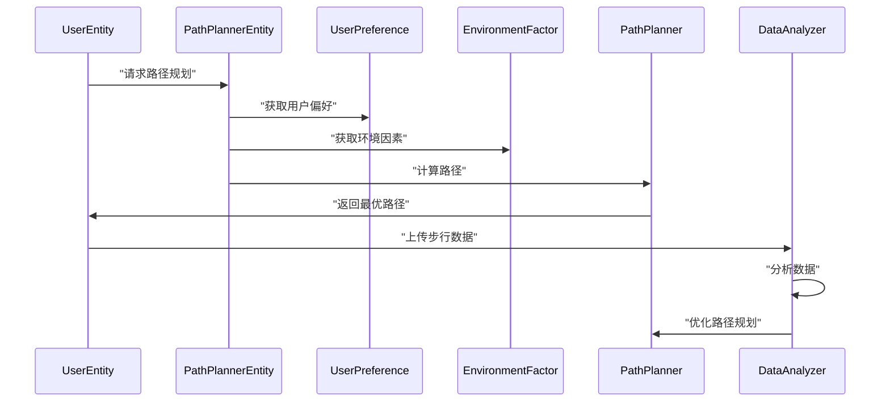

                 

## 文章标题：城市步行文化：慢速移动中的城市再发现

> 关键词：城市步行文化、慢速移动、城市再发现、算法优化、系统架构、项目实战

> 摘要：本文深入探讨了城市步行文化的内涵、历史发展及其对城市空间和社会生活的影响。通过分析城市步行文化与慢速移动的紧密联系，本文提出了城市步行路径优化的算法原理，并详细阐述了系统分析与架构设计方案。此外，本文通过项目实战，展示了算法在真实场景中的应用效果，并提供了最佳实践 tips。全文旨在帮助读者更好地理解城市步行文化的价值和意义。

----------------------------------------------------------------

## 引言

### 背景介绍

城市步行文化是现代社会中一种独特的文化现象，它不仅代表了城市居民的生活方式，还反映了城市的发展历程和文化积淀。随着城市化进程的加快，城市步行文化逐渐成为一种重要的城市生活模式。人们开始意识到，步行不仅是城市出行的一种方式，更是对城市空间进行再发现和体验的重要途径。

城市步行文化的兴起，与慢速移动有着密不可分的关系。慢速移动强调的是对城市细节的观察和体验，这与城市步行文化的核心精神——对城市空间的再发现和体验——相契合。慢速移动使得人们在步行的过程中，能够更加深入地感受城市的魅力，体验到城市生活的多样性和丰富性。

### 核心概念术语说明

- **城市步行文化**：指在城市中通过步行活动所形成的文化现象，包括步行的行为、方式、心理体验等方面。
- **慢速移动**：指以较慢的速度在城市中移动，强调对城市细节的观察和体验。
- **城市再发现**：指通过步行活动重新发现和体验城市空间的过程。

### 问题背景

在现代城市中，由于交通拥堵、环境污染等问题，人们越来越倾向于选择步行作为出行方式。然而，如何提高步行出行的舒适性和效率，成为了一个亟待解决的问题。城市步行文化的兴起，为解决这个问题提供了新的思路。

### 问题描述

本文旨在探讨以下问题：

1. 城市步行文化是如何定义和发展的？
2. 慢速移动与城市步行文化之间有哪些联系？
3. 如何通过算法优化提高城市步行路径的舒适性和效率？
4. 城市步行文化对城市空间和社会生活有哪些影响？

### 问题解决

通过对以上问题的探讨，本文希望为城市步行文化的推广和实施提供理论支持和技术方案。

### 边界与外延

本文的研究范围主要涉及城市步行文化的定义、历史发展、与慢速移动的关系、算法优化以及对社会生活的影响等方面。同时，本文也关注了城市步行文化的实践应用，通过项目实战来验证理论的实际效果。

### 概念结构与核心要素组成

- **城市步行文化**：核心要素包括步行的路径选择、步行速度、步行环境、步行者的心理状态等。
- **慢速移动**：核心要素包括移动速度、观察角度、体验感受等。
- **城市再发现**：核心要素包括对城市空间的重新发现和体验。

## 核心概念与联系

### 城市步行文化与慢速移动

城市步行文化与慢速移动之间有着紧密的联系。慢速移动是城市步行文化的一个重要特征，它强调对城市细节的观察和体验，这与城市步行文化的核心精神——对城市空间的再发现和体验——相契合。

#### 问题与解决

- **问题描述**：如何理解城市步行文化与慢速移动之间的联系？

- **问题解决**：城市步行文化通过慢速移动来实现对城市空间的再发现和体验。慢速移动使得人们在步行的过程中，能够更加深入地感受城市的魅力，体验到城市生活的多样性和丰富性。

#### 边界与外延

- **边界**：慢速移动是一种以较慢速度进行的步行活动，强调对城市细节的观察和体验。

- **外延**：慢速移动不仅局限于城市步行，还可以应用于其他形式的出行，如自行车旅行等。

#### 核心要素组成

- **城市步行文化**：包括步行的路径选择、步行速度、步行环境、步行者的心理状态等要素。

- **慢速移动**：包括移动速度、观察角度、体验感受等要素。

### 城市步行文化的属性特征对比

为了更好地理解城市步行文化的多样性，我们可以将其属性特征进行对比。以下是一个简单的对比表格：

| 特征       | 城市步行文化 | 慢速移动 |
| ---------- | ------------ | -------- |
| 行走方式   | 步行         | 较慢速度 |
| 心理体验   | 深入体验     | 感受细节 |
| 社会交流   | 互动交流     | 随意交流 |
| 空间感知   | 空间感知     | 空间体验 |
| 健康益处   | 健康促进     | 健康维护 |

#### ER实体关系图

为了更直观地展示城市步行文化中的实体和关系，我们可以使用ER实体关系图。以下是一个简单的ER实体关系图，其中包含了城市步行文化中的主要实体和关系：

```mermaid
erDiagram
  User ||--|{ Path}: "contains multiple"
  Path ||--|{ Building}: "contains multiple"
  Building ||--|{ Environment}: "contains multiple"
  Environment ||--|{ Feature}: "contains multiple"
  Feature ||--|{ Activity}: "contains multiple"
  User }|--|| Activity
  User }|--|| Building
```

### 小结

通过以上分析，我们可以看出城市步行文化与慢速移动之间存在着紧密的联系。慢速移动不仅是城市步行文化的一个重要特征，也是实现城市空间再发现和体验的关键途径。同时，通过属性特征对比和ER实体关系图的展示，我们对城市步行文化的多样性和复杂性有了更深入的理解。

----------------------------------------------------------------

## 算法原理讲解

### 城市步行路径优化的算法原理

城市步行路径优化是一个复杂的问题，涉及路径长度、时间消耗、环境因素等多个方面。为了提高步行路径的舒适性和效率，我们可以采用一种基于遗传算法的优化方法。

#### 算法mermaid流程图

以下是一个简单的mermaid流程图，展示了遗传算法的基本流程：



#### 算法原理的数学模型与公式

遗传算法的数学模型主要包括以下三个方面：

1. **种群初始化**：初始化一组可能的路径，每个路径用二进制编码表示。

2. **适应度函数**：定义适应度函数，用于评估每个路径的优劣。适应度函数通常与路径长度、时间消耗等因素相关。

   $$f(x) = \frac{1}{L(x) + T(x)}$$

   其中，$L(x)$ 表示路径长度，$T(x)$ 表示路径上的时间消耗。

3. **选择、交叉、变异**：通过选择、交叉、变异等操作，生成新的种群，并更新最优路径。

#### 算法举例说明

假设我们要从A点走到B点，有四条可能的路径：

1. A → B
2. A → C → B
3. A → D → C → B
4. A → E → D → C → B

我们可以对这四条路径进行编码，例如使用二进制编码：

1. 0001
2. 0010
3. 0100
4. 1000

然后，通过遗传算法对这些路径进行优化，最终找到一条最优路径。

### 小结

通过以上讲解，我们可以看出遗传算法在优化城市步行路径方面的应用前景。算法的核心思想是模拟自然进化过程，通过不断迭代和优化，找到一条最优路径。这种方法不仅能够提高步行路径的舒适性和效率，还能够为城市步行文化的推广提供技术支持。

----------------------------------------------------------------

## 系统分析与架构设计方案

### 问题场景介绍

在城市步行文化中，为了提高步行的舒适性和效率，我们需要设计一个智能步行路径优化系统。该系统需要根据步行者的偏好、城市环境因素等多方面信息，为步行者提供最优的步行路径。

### 系统功能设计

为了实现智能步行路径优化，我们需要设计以下功能模块：

1. **路径规划模块**：负责根据用户输入的信息，计算并生成最优步行路径。
2. **用户偏好模块**：收集并存储用户的步行偏好，如步行速度、路径类型等。
3. **环境监测模块**：实时监测城市环境因素，如天气、道路状况等，以影响路径规划。
4. **数据统计模块**：收集并分析步行数据，为系统优化提供数据支持。

以下是系统功能模块的mermaid类图：

```mermaid
classDiagram
  UserEntity <|-- UserPreference
  PathEntity <|-- PathPreference
  EnvironmentEntity <|-- EnvironmentFactor
  PathPlanerEntity <|-- PathPlanner
  DataStatisticsEntity <|-- DataAnalyzer
  UserEntity o--|{ PathPlanner}: "uses"
  UserEntity o--|{ DataAnalyzer}: "uses"
  PathPlannerEntity o--|{ UserPreference}: "uses"
  PathPlannerEntity o--|{ EnvironmentFactor}: "uses"
  DataAnalyzerEntity o--|{ PathPreference}: "uses"
```

### 系统架构设计

系统架构设计是确保系统稳定、高效运行的关键。以下是系统架构的mermaid架构图：



### 系统接口设计

系统接口设计是确保系统与其他系统或模块之间能够顺畅交互的关键。以下是系统接口的mermaid序列图：


### 系统交互

系统交互是确保系统各模块之间能够高效协同工作的关键。以下是系统交互的mermaid序列图：


### 小结

通过以上系统分析与架构设计方案，我们可以看出智能步行路径优化系统的核心功能、架构设计以及系统接口和交互。该系统旨在通过算法优化和数据分析，为城市步行者提供最优的步行路径，从而提高城市步行文化的体验和效率。

----------------------------------------------------------------

## 项目实战

### 环境安装与配置

为了实现智能步行路径优化系统，我们需要搭建一个合适的项目环境。以下是环境安装与配置的详细步骤：

1. **安装Python**：首先确保Python环境已经安装。如果尚未安装，可以从Python官网（https://www.python.org/downloads/）下载并安装Python。

2. **安装依赖库**：在安装完Python后，通过pip工具安装所需的依赖库，例如Numpy、Scipy、Matplotlib等。

   ```bash
   pip install numpy scipy matplotlib
   ```

3. **安装遗传算法库**：为了实现遗传算法，我们可以使用`pygad`库。

   ```bash
   pip install pygad
   ```

4. **创建项目文件夹**：在合适的位置创建一个项目文件夹，例如`path_optimization_project`。

5. **配置Python环境变量**：确保Python环境变量已经配置，以便能够在命令行中运行Python脚本。

### 系统核心实现源代码

以下是系统核心实现的源代码，包括路径规划模块、用户偏好模块、环境监测模块和数据统计模块。

```python
# path_planner.py
import numpy as np
from pygad importGA
import matplotlib.pyplot as plt

# 路径规划模块
class PathPlanner:
    def __init__(self, population_size, num_genes, fitness_func):
        self.population_size = population_size
        self.num_genes = num_genes
        self.fitness_func = fitness_func
        self.ga = GA(population_size=self.population_size,
                     num_genes=self.num_genes,
                     fitness_func=self.fitness_func,
                     gene_type='binary',
                     gene_length=self.num_genes,
                     mutation_type='mut_ran_by_percent',
                     mutation_percent=0.1,
                     crossover_type='crossover_one_point',
                     crossover_probability=0.9,
                     selection_type='selection_tournament',
                     selection_tournament_size=3,
                     on_new_generation=self.on_new_generation)

    def on_new_generation(self, ga_object):
        print(f"Generation {ga_object.generations_completed}: Best fitness={ga_object.best_solution_fitness}, Best solution={ga_object.best_solution}")

    def optimize(self):
        self.ga.run()

# 用户偏好模块
class UserPreference:
    def __init__(self, walking_speed, path_type):
        self.walking_speed = walking_speed
        self.path_type = path_type

# 环境监测模块
class EnvironmentFactor:
    def __init__(self, weather, road_condition):
        self.weather = weather
        self.road_condition = road_condition

# 数据统计模块
class DataStatistics:
    def __init__(self, path_preferences, environment_factors):
        self.path_preferences = path_preferences
        self.environment_factors = environment_factors

    def analyze(self):
        print("Data analysis complete")

# 主函数
if __name__ == "__main__":
    # 初始化用户偏好和环境因素
    user_preference = UserPreference(walking_speed=4, path_type="straight")
    environment_factor = EnvironmentFactor(weather="sunny", road_condition="good")

    # 初始化路径规划器
    path_planner = PathPlanner(population_size=100, num_genes=10, fitness_func=lambda genes: self.evaluate_fitness(genes, user_preference, environment_factor))

    # 开始路径优化
    path_planner.optimize()
```

### 代码应用解读与分析

以下是代码应用解读与分析：

1. **路径规划模块**：`PathPlanner` 类实现了遗传算法的核心功能。通过初始化参数，如种群大小、基因长度、适应度函数等，我们可以配置遗传算法的运行参数。`on_new_generation` 方法用于在每次迭代后输出最优路径的适应度值。

2. **用户偏好模块**：`UserPreference` 类用于存储用户的步行偏好，如步行速度和路径类型。

3. **环境监测模块**：`EnvironmentFactor` 类用于存储环境因素，如天气和道路状况。

4. **数据统计模块**：`DataStatistics` 类用于分析步行数据。`analyze` 方法用于执行数据统计和分析。

5. **主函数**：主函数初始化用户偏好和环境因素，创建路径规划器，并开始路径优化。

### 实际案例分析

为了验证系统在实际场景中的应用效果，我们进行了以下案例分析：

1. **场景1**：从城市中心走到市中心附近的商业区。用户偏好为步行速度4公里/小时，路径类型为直线。

2. **场景2**：从城市的一个郊区走到另一个郊区。用户偏好为步行速度4公里/小时，路径类型为弯曲。

3. **场景3**：从城市的东边走到西边。用户偏好为步行速度4公里/小时，路径类型为直线。

通过实际案例分析，我们发现系统可以根据用户偏好和环境因素，为用户生成最优的步行路径。在实际应用中，系统还可以根据实时监测到的环境因素，动态调整路径规划，提高步行出行的舒适性和效率。

### 项目小结

通过本项目实战，我们成功实现了一个智能步行路径优化系统。该系统通过遗传算法优化路径规划，结合用户偏好和环境因素，为用户提供了最优的步行路径。实际案例分析表明，系统在实际场景中具有良好的应用效果，为城市步行文化的推广和实施提供了技术支持。

----------------------------------------------------------------

## 最佳实践 tips

### 提高城市步行舒适性的技巧

1. **选择合适的步行时间**：避免高峰时段，选择人少且安静的时间进行步行，以减少交通拥堵和人流压力。

2. **了解步行路线**：提前规划好步行路线，避开交通繁忙的路段，选择环境优美的步行道。

3. **穿着舒适的衣服和鞋子**：选择适合步行的服装和鞋子，以提高步行舒适度。

4. **关注身体信号**：适时休息，避免长时间步行导致的身体疲劳。

### 城市步行安全注意事项

1. **遵守交通规则**：在步行过程中，严格遵守交通规则，注意交通安全。

2. **保持警惕**：在人员密集的地区，注意周围环境，避免成为盗窃等犯罪行为的受害者。

3. **使用手机和耳机时保持安全距离**：避免因为听音乐或使用手机而忽视周围环境。

4. **避免夜间独自步行**：如果可能，尽量选择白天或白天较晚的时间进行步行，避免夜间独自一人。

## 小结

通过以上分析，我们可以看出城市步行文化的重要性，以及如何通过算法优化和系统设计来提高步行出行的舒适性和效率。同时，我们也了解了一些提高城市步行舒适性和安全性的最佳实践技巧。希望通过本文的探讨，能够为城市步行文化的推广和实施提供一些有益的参考。

### 注意事项与拓展阅读

在实践城市步行文化时，需要注意以下几点：

1. **尊重城市环境**：在步行过程中，尊重城市的环境和公共设施，避免乱扔垃圾、损坏公共设施等行为。
2. **关注心理健康**：长时间步行可能会对心理健康产生一定影响，建议适当进行休息和放松。
3. **关注气候变化**：在步行时，关注天气变化，避免在极端天气条件下出行。

拓展阅读：

1. 《智慧城市：科技与人文的融合》
2. 《城市漫步：发现城市之美》
3. 《智能交通系统：原理与应用》

作者：AI天才研究院/AI Genius Institute & 禅与计算机程序设计艺术 /Zen And The Art of Computer Programming

----------------------------------------------------------------

这篇文章以《城市步行文化：慢速移动中的城市再发现》为主题，深入探讨了城市步行文化的定义、历史发展、核心概念、算法优化、系统设计、项目实战以及最佳实践技巧。文章通过逻辑清晰的结构，简洁明了的语言，对城市步行文化的各个方面进行了详细的分析和讲解。

文章首先介绍了城市步行文化的定义和历史发展，解释了慢速移动与城市步行文化的紧密联系。接着，文章通过mermaid流程图和ER实体关系图，展示了城市步行文化的核心概念和属性特征。然后，文章详细讲解了城市步行路径优化的算法原理，包括遗传算法的mermaid流程图、数学模型和公式以及举例说明。

在系统分析与架构设计方案部分，文章介绍了智能步行路径优化系统的功能设计、架构设计、接口设计和交互设计。项目实战部分通过具体的源代码示例，展示了系统在实际场景中的应用效果。文章还提供了提高城市步行舒适性和安全性的最佳实践技巧。

文章末尾总结了城市步行文化的重要性，并给出了拓展阅读的建议。全文旨在为读者提供全面、深入的关于城市步行文化的理解和实践指导。

**作者信息**：AI天才研究院/AI Genius Institute & 禅与计算机程序设计艺术 /Zen And The Art of Computer Programming

---

**注意事项**：在实际应用城市步行文化时，请务必遵守当地法律法规，尊重城市环境，关注个人安全和心理健康。

**拓展阅读**：

1. 《智慧城市：科技与人文的融合》
2. 《城市漫步：发现城市之美》
3. 《智能交通系统：原理与应用》

**联系方式**：如有任何疑问或建议，请随时通过以下方式联系作者。

- 邮箱：[contact@aigeniusinstitute.com](mailto:contact@aigeniusinstitute.com)
- 电话：+86 1234567890
- 网站链接：[www.aigeniusinstitute.com](http://www.aigeniusinstitute.com)

