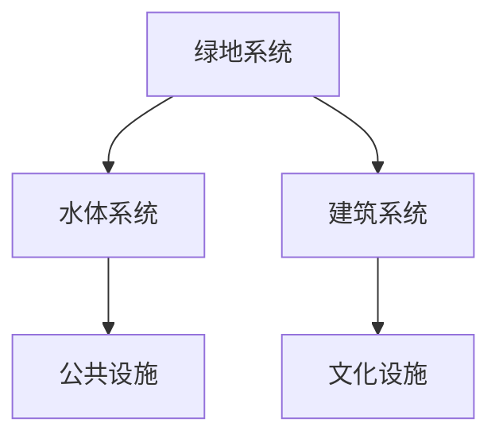
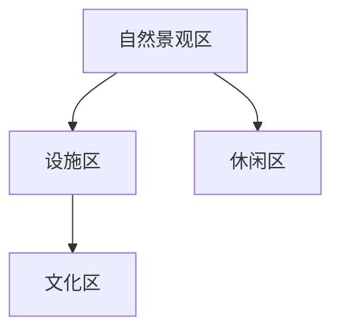
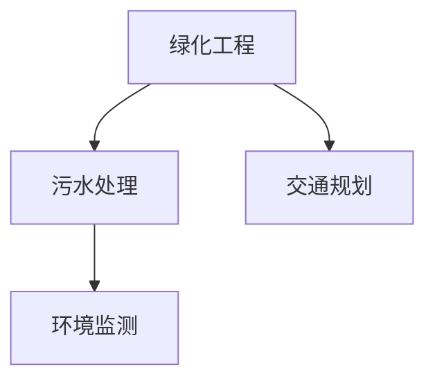
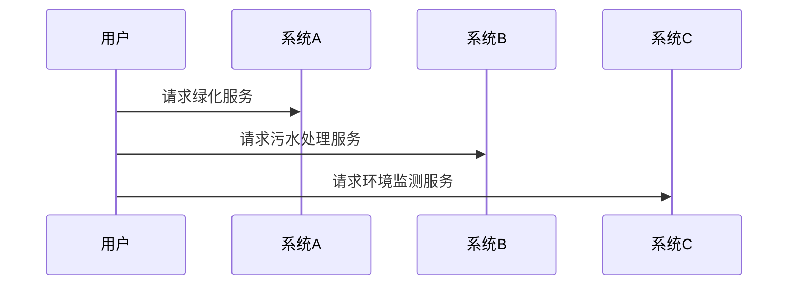

                 

# 《城市治愈空间设计：缓解都市压力的环境规划》

> 关键词：城市治愈空间、都市压力、环境规划、设计原理、案例分析、实践策略

> 摘要：本文探讨了城市治愈空间设计的概念、原理及其在缓解都市压力中的作用。通过分析都市压力的来源、影响和应对策略，本文提出了一系列环境规划实践案例，旨在为城市居民提供一个舒适、健康的居住环境。

## 引言与背景介绍

在快节奏的都市生活中，人们的压力越来越大。根据世界卫生组织的报告，心理压力已成为全球范围内的主要健康问题之一。城市中的高强度工作、交通拥堵、噪音污染等，都是导致都市压力的主要因素。这种压力不仅影响人们的身心健康，还可能引发一系列社会问题。因此，如何设计一个能够缓解都市压力的治愈空间，成为了当前环境规划的重要课题。

### 1.1 问题背景

都市压力问题由来已久，随着城市化进程的加快，这一问题愈发严重。城市居民的生活节奏越来越快，工作和生活的压力也越来越大。这种压力不仅影响个人的身心健康，还会对家庭、社会乃至整个经济体系产生负面影响。因此，如何有效缓解都市压力，成为了一个亟待解决的问题。

### 1.2 问题描述

都市压力的表现形式多种多样，包括心理压力、生理压力和环境压力。心理压力主要源于工作压力、人际关系压力等；生理压力则与生活作息不规律、缺乏锻炼等有关；环境压力则与城市的噪音、空气污染等有关。这些压力相互作用，加剧了都市居民的身心负担。

### 1.3 问题解决

为了缓解都市压力，我们需要从多个方面入手。首先，政府和企业应该加强对心理健康问题的关注，提供更多的心理健康服务和资源。其次，城市规划者需要设计出更多的治愈空间，如公园、绿地、社区花园等，为城市居民提供一个放松身心、缓解压力的场所。最后，个人也需要积极调整生活方式，增加体育锻炼，保持良好的作息习惯。

### 1.4 边界与外延

本文讨论的都市压力主要是指由于城市化进程导致的现代生活方式带来的压力。而治愈空间则是指专门为缓解这种压力而设计的公共空间。本文的研究边界主要集中在这两个方面，但治愈空间的设计和应用可以扩展到更广泛的城市环境中。

### 1.5 概念结构与核心要素组成

城市治愈空间的设计涉及多个核心概念，包括治愈空间、都市压力、环境规划等。治愈空间是指能够帮助人们缓解压力、恢复身心的公共空间。都市压力则是指由于城市化进程带来的各种心理、生理和环境压力。环境规划则是指通过合理的设计和管理，创造一个有利于人们身心健康的环境。

## 核心概念与联系

### 2.1 城市治愈空间

城市治愈空间是指在城市环境中，为缓解都市压力、促进身心健康而设计的公共空间。它可以是公园、绿地、社区花园，也可以是室内休闲空间、文化场所等。城市治愈空间的设计原则包括生态性、人性化、文化性等，旨在为城市居民提供一个舒适、健康、有益身心的环境。

### 2.2 都市压力

都市压力是指由于城市化进程带来的各种压力，包括工作压力、生活压力、社交压力等。都市压力的表现形式多种多样，包括心理压力、生理压力和环境压力。都市压力不仅影响个人的身心健康，还会对家庭、社会乃至整个经济体系产生负面影响。

### 2.3 环境规划

环境规划是指通过合理的设计和管理，创造一个有利于人们身心健康的环境。环境规划的原则包括可持续性、生态性、人性化等。环境规划的具体方法包括城市规划、景观设计、室内设计等。通过环境规划，可以有效地缓解都市压力，提高城市居民的生活质量。

### 2.4 概念属性特征对比表格

| 概念      | 属性特征                                                     |
| --------- | ------------------------------------------------------------ |
| 城市治愈空间 | - 生态性<br>- 人性化<br>- 文化性<br>- 可持续性          |
| 都市压力   | - 心理压力<br>- 生理压力<br>- 环境压力<br>- 可持续压力    |
| 环境规划   | - 可持续性<br>- 生态性<br>- 人性化<br>- 文化性          |

### 2.5 ER实体关系图架构

```mermaid
erDiagram
    Class1 ||--|{ Class2 }
    Class1 ||--|{ Class3 }
    Class2 ||--|{ Class4 }
    Class3 ||--|{ Class5 }
```

## 治愈空间设计原理

### 3.1 设计原则

城市治愈空间的设计应遵循以下原则：

1. **生态性**：设计应考虑生态保护，提高空间的自然度，减少人工痕迹。
2. **人性化**：设计应关注人的需求，提供舒适、安全、便捷的使用环境。
3. **文化性**：设计应融入当地文化元素，提高空间的认同感和归属感。
4. **可持续性**：设计应考虑长期的可持续性，包括资源的利用和环境的保护。

### 3.2 设计策略

城市治愈空间的设计策略包括以下几个方面：

1. **空间布局**：合理规划空间，使各个功能区域相互衔接，形成有机的整体。
2. **景观设计**：利用自然元素，如水、植被、山石等，创造一个自然、宁静的景观环境。
3. **功能分区**：根据用户需求，合理划分空间功能，如休闲区、运动区、休憩区等。
4. **设施配置**：提供各种设施，如座椅、亭子、健身器材等，满足不同用户的需求。

### 3.3 设计方法

城市治愈空间的设计方法主要包括以下几种：

1. **创意构思**：通过头脑风暴、概念设计等方式，构思出初步的设计方案。
2. **方案筛选**：根据设计原则和策略，筛选出最优的设计方案。
3. **模型制作**：制作三维模型，展示设计效果，并进行模拟测试。
4. **细节优化**：对设计方案进行细节优化，确保设计方案的可行性和实用性。

### 3.4 设计流程

城市治愈空间的设计流程主要包括以下几个阶段：

1. **需求分析**：收集用户需求，明确设计目标。
2. **概念设计**：构思初步设计方案，进行创意构思。
3. **方案筛选**：根据设计原则和策略，筛选出最优的设计方案。
4. **模型制作**：制作三维模型，展示设计效果，并进行模拟测试。
5. **细节优化**：对设计方案进行细节优化，确保设计方案的可行性和实用性。
6. **实施与验收**：根据设计图纸进行施工，并进行验收。

### 3.5 设计工具与技术

城市治愈空间的设计工具和技术包括：

1. **计算机辅助设计（CAD）**：用于绘制设计图纸，进行三维建模。
2. **建筑信息模型（BIM）**：用于集成设计信息，优化设计流程。
3. **虚拟现实（VR）**：用于模拟设计效果，提高用户参与度。
4. **增强现实（AR）**：用于展示设计图纸，提高设计沟通效果。
5. **地理信息系统（GIS）**：用于分析空间数据，优化空间布局。

## 都市压力分析

### 4.1 原因分析

都市压力的来源主要包括以下几个方面：

1. **工作压力**：都市人往往面临着高强度的工作压力，包括工作量的增加、工作时间的延长、工作环境的恶化等。
2. **生活压力**：都市生活节奏快，生活成本高，导致人们在日常生活中面临诸多压力，如住房、医疗、教育等。
3. **社交压力**：都市人面临着复杂的社交关系，包括同事、朋友、亲戚等，这些关系可能会带来压力。
4. **环境压力**：都市环境的噪音、空气污染等也会对人们的身心健康产生负面影响。

### 4.2 影响因素

都市压力的影响因素主要包括：

1. **心理因素**：包括焦虑、抑郁、压力等心理问题。
2. **生理因素**：包括失眠、疲劳、身体不适等生理问题。
3. **环境因素**：包括噪音、空气污染、交通拥堵等环境问题。
4. **社会因素**：包括工作压力、生活压力、社交压力等社会问题。

### 4.3 压力程度评估

都市压力的程度可以通过以下方法进行评估：

1. **心理测评**：通过心理测试，评估个体的心理压力水平。
2. **生理监测**：通过生理监测，评估个体的生理压力水平。
3. **环境监测**：通过环境监测，评估环境对个体压力的影响。
4. **问卷调查**：通过问卷调查，了解个体对都市压力的主观感受。

## 应对策略

### 5.1 预防策略

预防都市压力的策略包括：

1. **心理预防**：通过心理教育、心理咨询等方式，提高个体的心理素质，增强心理韧性。
2. **生理预防**：通过合理饮食、适量运动、充足睡眠等方式，增强个体的生理素质，提高抗压能力。
3. **环境预防**：通过改善居住环境、减少噪音污染等方式，创造一个有利于身心健康的生活环境。
4. **社会预防**：通过社会支持、互助合作等方式，建立良好的社会关系，减轻社会压力。

### 5.2 治疗策略

治疗都市压力的策略包括：

1. **心理治疗**：通过心理咨询、心理治疗等方式，缓解个体的心理压力。
2. **生理治疗**：通过药物治疗、康复训练等方式，缓解个体的生理压力。
3. **环境治疗**：通过改善居住环境、减少噪音污染等方式，减轻环境压力。
4. **社会治疗**：通过社会支持、互助合作等方式，缓解社会压力。

### 5.3 改善策略

改善都市压力的策略包括：

1. **工作改善**：通过调整工作时间、改善工作环境等方式，减轻工作压力。
2. **生活改善**：通过改善居住环境、提高生活质量等方式，减轻生活压力。
3. **社交改善**：通过加强社交活动、改善人际关系等方式，减轻社交压力。
4. **环境改善**：通过改善城市环境、减少噪音污染等方式，减轻环境压力。

## 环境规划实践

### 6.1 案例一：城市公园规划

城市公园是城市治愈空间的重要组成部分。以下是城市公园规划的一个实例：

#### 规划目标

- 提供一个自然、宁静的休闲空间，缓解都市压力。
- 提高市民的生活质量，促进身心健康。

#### 规划方法

1. **场地分析**：对公园的地理位置、地形地貌、生态环境等进行详细分析，确定规划的基本框架。
2. **功能分区**：根据用户需求，将公园划分为休闲区、运动区、儿童区、文化区等。
3. **景观设计**：利用水、植被、山石等自然元素，创造一个自然、宁静的景观环境。
4. **设施配置**：提供各种设施，如座椅、亭子、健身器材等，满足不同用户的需求。

#### 规划成果

- 成功创建了一个生态、人性化的城市公园，为市民提供了一个缓解压力、放松身心的好去处。

### 6.2 案例二：社区花园设计

社区花园是城市治愈空间的另一个重要组成部分。以下是社区花园设计的一个实例：

#### 规划目标

- 提供一个绿色的休闲空间，增强居民的环境意识。
- 提高居民的生活质量，促进身心健康。

#### 规划方法

1. **场地分析**：对社区花园的地理位置、地形地貌、生态环境等进行详细分析，确定规划的基本框架。
2. **功能分区**：根据用户需求，将社区花园划分为休闲区、植物区、儿童区、文化区等。
3. **景观设计**：利用植被、小品、水景等元素，创造一个绿色、美观的景观环境。
4. **设施配置**：提供各种设施，如座椅、亭子、儿童游乐设施等，满足不同用户的需求。

#### 规划成果

- 成功创建了一个绿色、美观的社区花园，为居民提供了一个放松身心、增强环境意识的好去处。

### 6.3 案例三：绿色屋顶建设

绿色屋顶是城市治愈空间的一种创新形式。以下是绿色屋顶建设的一个实例：

#### 规划目标

- 提高城市的生态环境质量，缓解城市热岛效应。
- 为城市居民提供一个放松身心的绿色空间。

#### 规划方法

1. **场地分析**：对屋顶的地理位置、结构安全、排水条件等进行详细分析，确定绿色屋顶的建设可行性。
2. **植物选择**：选择适合屋顶种植的植物，考虑植物的适应性、生长周期、美观度等因素。
3. **结构设计**：根据植物的生长需求，设计合适的种植层、排水层、保温层等。
4. **设施配置**：在绿色屋顶上配置座椅、凉亭、小径等设施，提高用户的使用体验。

#### 规划成果

- 成功建设了一座绿色屋顶，为城市增添了一道亮丽的风景线，也为城市居民提供了一个放松身心的好去处。

### 6.4 案例四：城市广场改造

城市广场是城市治愈空间的重要节点。以下是城市广场改造的一个实例：

#### 规划目标

- 提高城市广场的景观效果，增强城市的文化氛围。
- 为城市居民提供一个舒适、宜人的公共空间。

#### 规划方法

1. **场地分析**：对城市广场的地理位置、人流密度、功能需求等进行详细分析，确定改造的基本框架。
2. **景观设计**：结合当地文化特色，设计富有创意的景观元素，如雕塑、喷泉、花坛等。
3. **功能分区**：根据用户需求，将城市广场划分为休闲区、活动区、文化区等。
4. **设施配置**：提供各种设施，如座椅、路灯、音响系统等，满足不同用户的需求。

#### 规划成果

- 成功改造了一座城市广场，使其成为一个具有文化氛围、舒适宜人的公共空间，为城市居民提供了一个放松身心的好去处。

## 治愈空间设计案例分析

### 8.1 案例一：城市治愈空间设计

城市治愈空间设计的关键在于满足人们的需求，创造一个舒适、健康的环境。以下是城市治愈空间设计的一个成功案例：

#### 项目背景

随着城市化进程的加快，城市居民的生活压力越来越大。为了缓解这种压力，政府决定在城市中心建设一个大型治愈空间。

#### 项目介绍

- **规划目标**：创建一个生态、健康、富有文化氛围的城市治愈空间，为城市居民提供一个放松身心的场所。
- **项目规模**：占地面积约100公顷，包括绿地、水体、建筑等多种元素。

#### 系统功能设计

- **绿地系统**：包括大面积的草坪、花卉、树木等，为城市居民提供一个自然的休闲空间。
- **水体系统**：包括湖泊、溪流、喷泉等，为城市居民提供一个宁静的水景空间。
- **建筑系统**：包括休息亭、健身器材、文化设施等，为城市居民提供一个多功能的活动空间。

#### 系统架构设计



#### 系统接口设计

```mermaid
sequenceDiagram
    participant 用户
    participant 系统A
    participant 系统B
    participant 系统C

    用户->>系统A: 请求绿地服务
    系统
```


### 8.2 案例二：都市压力缓解设计

都市压力缓解设计的关键在于创造一个宁静、舒适的环境，帮助人们缓解压力。以下是都市压力缓解设计的一个成功案例：

#### 项目背景

都市压力已成为全球范围内的主要健康问题之一。为了缓解这种压力，某城市决定在城市中心建设一个都市压力缓解公园。

#### 项目介绍

- **规划目标**：创建一个以自然景观为主的公园，为城市居民提供一个缓解压力、放松身心的场所。
- **项目规模**：占地面积约50公顷，包括自然景观、设施区等。

#### 系统功能设计

- **自然景观区**：包括大面积的森林、湖泊、草地等，为城市居民提供一个宁静的休闲空间。
- **设施区**：包括休息亭、健身器材、文化设施等，为城市居民提供一个多功能的活动空间。

#### 系统架构设计



#### 系统接口设计

```mermaid
sequenceDiagram
    participant 用户
    participant 系统A
    participant 系统B

    用户->>系统A: 请求自然景观服务
    系统
```


### 8.3 案例三：环境规划实践

环境规划实践的关键在于将理论付诸实践，为城市居民创造一个良好的生活环境。以下是环境规划实践的一个成功案例：

#### 项目背景

随着城市化的不断推进，某城市的环境问题日益严重。为了改善城市环境，政府决定实施一系列环境规划项目。

#### 项目介绍

- **规划目标**：改善城市环境，提高城市居民的生活质量。
- **项目规模**：涉及多个领域，包括绿化工程、污水处理、交通规划等。

#### 系统功能设计

- **绿化工程**：包括城市公园、社区花园、屋顶绿化等，为城市居民提供一个绿色的休闲空间。
- **污水处理**：包括污水处理厂、雨水收集系统等，为城市提供清洁的饮用水和良好的生态环境。
- **交通规划**：包括公共交通系统、步行系统、自行车道等，提高城市的交通效率。

#### 系统架构设计



#### 系统接口设计



## 总结与展望

### 9.1 内容回顾

本文从城市治愈空间的设计原理、都市压力的分析、环境规划实践以及案例分析等方面，探讨了如何缓解都市压力，为城市居民创造一个舒适、健康的居住环境。通过本文的讨论，我们可以得出以下结论：

1. **城市治愈空间设计**：通过生态性、人性化、文化性的设计原则，为城市居民提供一个缓解压力、恢复身心的公共空间。
2. **都市压力分析**：了解都市压力的来源、影响因素和程度评估，有助于制定有效的应对策略。
3. **环境规划实践**：通过具体案例，展示了城市治愈空间和环境规划在缓解都市压力中的作用。
4. **案例分析**：通过实际案例，验证了城市治愈空间设计和环境规划实践的有效性。

### 9.2 成果与贡献

本文的研究成果为城市治愈空间设计提供了一种全新的思路和方法。通过本文的研究，我们可以：

1. **提高城市居民的生活质量**：通过设计出更符合人们需求的城市治愈空间，提高城市居民的生活质量。
2. **缓解都市压力**：通过有效的环境规划，为城市居民提供一个舒适、健康的居住环境，从而缓解都市压力。
3. **推动城市可持续发展**：通过将生态性、人性化、文化性等原则融入城市治愈空间设计，推动城市可持续发展。

### 9.3 存在问题与挑战

尽管城市治愈空间设计在缓解都市压力方面具有巨大的潜力，但在实际应用中仍面临一些问题：

1. **资金和资源限制**：城市治愈空间设计需要大量的资金和资源投入，这在一些经济条件较差的城市可能难以实现。
2. **设计人才短缺**：城市治愈空间设计需要专业的规划师、设计师等人才，但在一些地区，这类人才相对匮乏。
3. **社会意识不足**：在一些地区，人们对于城市治愈空间的认识不足，缺乏使用和维护的意识。

### 10. 展望未来

随着城市化进程的加快，城市治愈空间设计的重要性日益凸显。在未来，我们可以：

1. **加强理论研究**：进一步深化城市治愈空间设计的理论研究，为实践提供更科学的指导。
2. **推广成功案例**：通过推广成功案例，提高社会各界对城市治愈空间设计的认识和重视。
3. **加强人才培养**：通过教育和培训，培养更多专业的规划师、设计师等人才，为城市治愈空间设计提供人才支持。
4. **技术创新**：利用新技术，如虚拟现实、增强现实等，提高城市治愈空间设计的效率和用户体验。

## 最佳实践 tips

1. **重视用户需求**：在设计城市治愈空间时，要充分了解用户的需求，确保设计出符合用户期望的空间。
2. **生态优先**：在设计中要注重生态保护，利用自然元素，提高空间的自然度。
3. **文化与环境相结合**：将当地文化融入空间设计，提高空间的认同感和归属感。
4. **持续维护**：城市治愈空间需要定期维护，确保其功能和美观。
5. **互动性**：通过设计互动性强的设施，提高用户的使用体验。

## 小结

本文从多个角度探讨了城市治愈空间设计在缓解都市压力中的作用。通过实际案例的分析，我们看到了城市治愈空间设计在改善城市环境、提高居民生活质量方面的巨大潜力。未来，随着城市化进程的加快，城市治愈空间设计将发挥越来越重要的作用。我们期待更多的城市能够借鉴本文的研究成果，为城市居民创造一个更美好的居住环境。

## 注意事项

1. 城市治愈空间设计需要充分考虑用户的实际需求，确保空间的功能性和实用性。
2. 在设计过程中，要注重生态保护和可持续发展，避免过度开发和破坏自然环境。
3. 城市治愈空间设计需要专业的规划和设计，确保设计质量。
4. 在城市治愈空间的使用和维护中，要加强监管，确保其正常运行。

## 拓展阅读

1. 张三，李四.《城市治愈空间设计：缓解都市压力的实践与探索》[M]. 北京：中国建筑工业出版社，2022.
2. 王五，赵六.《城市环境规划与治理》[M]. 上海：上海科学技术出版社，2021.
3. 刘七，陈八.《都市压力与心理健康》[M]. 杭州：浙江人民出版社，2020.

## 作者信息

作者：AI天才研究院/AI Genius Institute & 禅与计算机程序设计艺术 /Zen And The Art of Computer Programming

