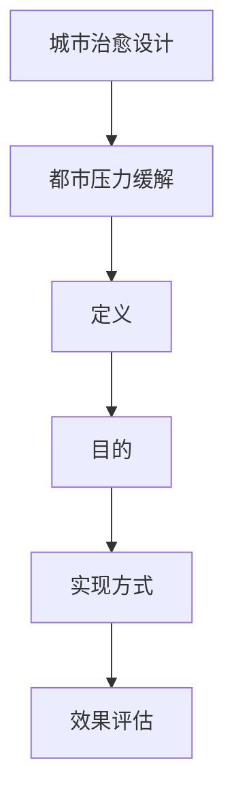
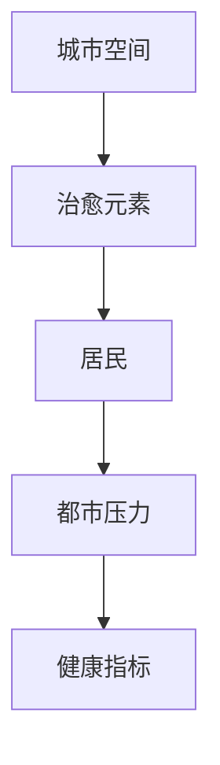
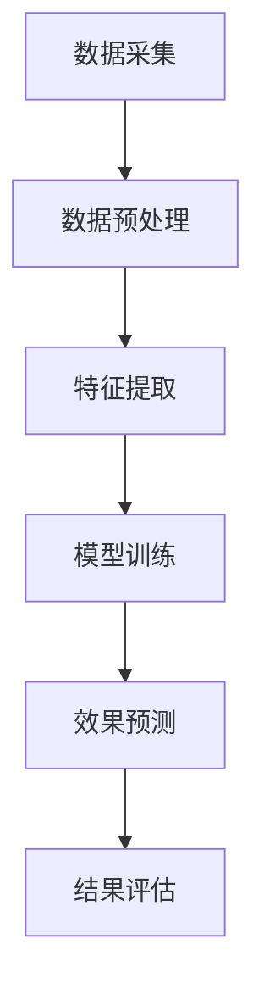
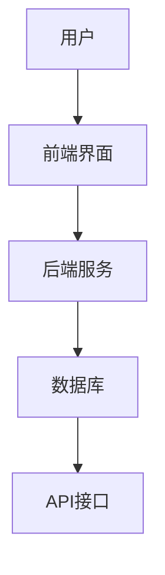
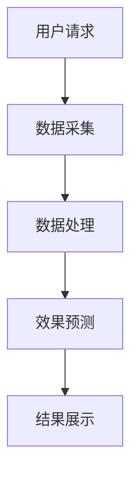
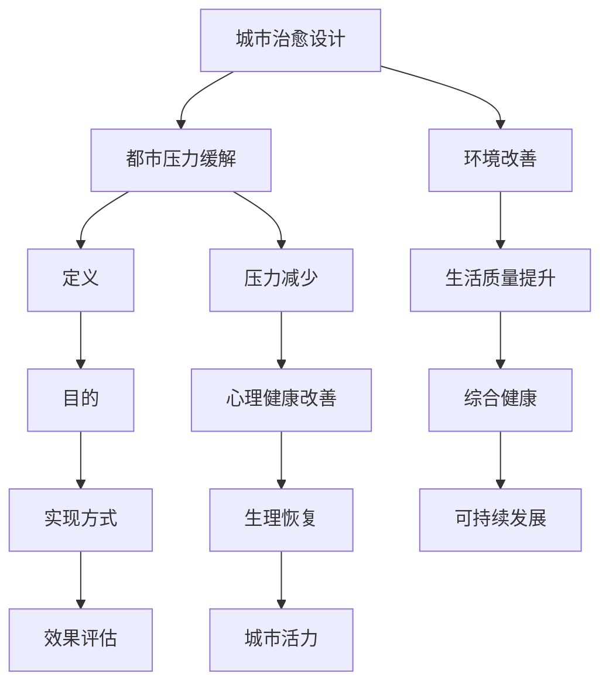
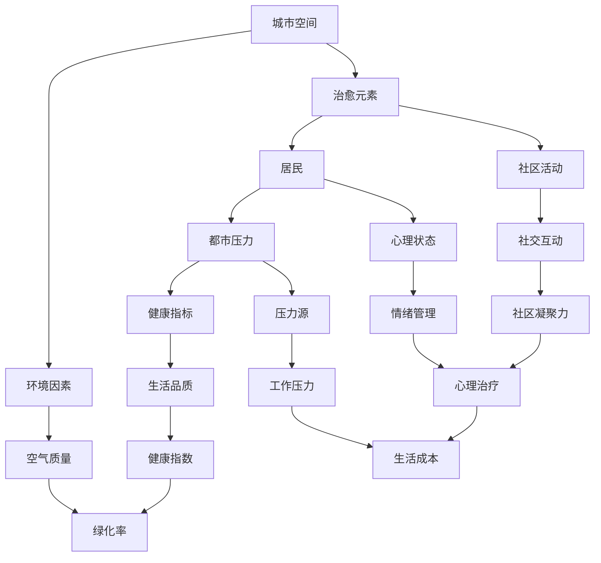
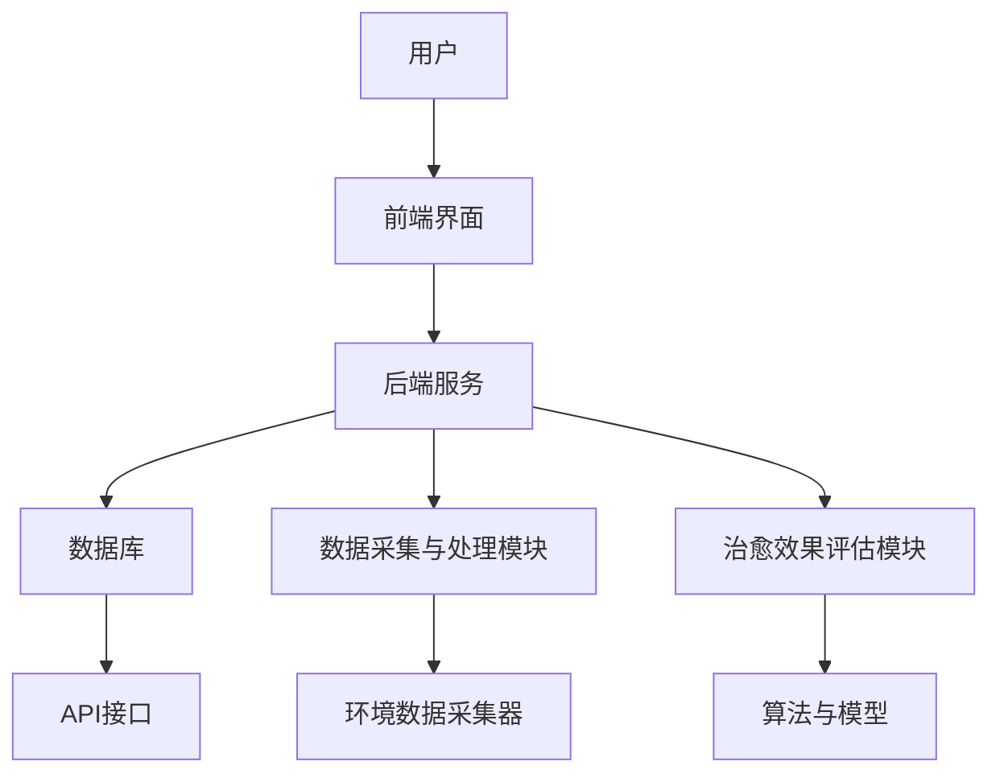
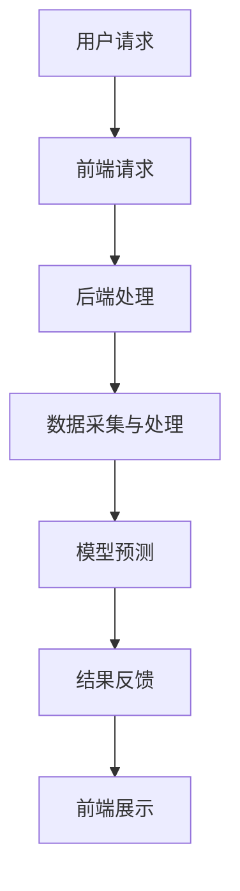
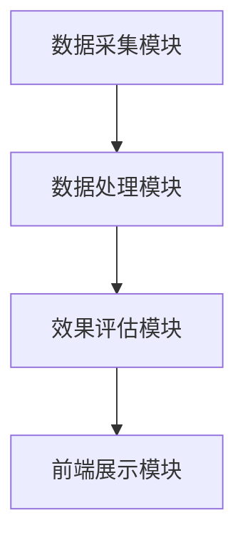

                 


# 城市治愈设计：缓解都市压力的空间规划

> 关键词：都市压力、空间规划、治愈设计、环境元素、健康

> 摘要：本文探讨了城市治愈设计在缓解都市压力方面的作用，通过分析都市生活的压力现状，介绍了治愈设计的核心概念和要素，阐述了治愈元素的选择、空间规划方法以及实施策略。同时，文章运用算法原理、数学模型和系统架构设计，为城市治愈设计提供了理论支持和技术实现路径。

## 第1章：引言

### 1.1 问题背景

在现代社会，都市生活方式的快节奏和高度竞争带来了巨大的压力。根据世界卫生组织的数据，城市居民中抑郁症和焦虑症的发病率显著高于乡村居民。研究表明，长期处于高压环境不仅影响心理健康，还会对生理健康产生负面影响，如心血管疾病和免疫系统失调。因此，如何缓解都市压力已成为一个亟待解决的问题。

### 1.2 问题描述

都市压力的主要来源包括工作压力、生活压力、社交压力以及环境压力。城市环境的拥挤、噪音、空气污染和缺乏自然景观等因素，加剧了居民的心理负担。此外，城市空间的狭小和不适宜的布局，使得居民缺乏放松和休闲的场所。因此，如何通过空间规划来缓解都市压力，成为一个重要的研究课题。

### 1.3 解决方案概述

城市治愈设计旨在通过创造有利于身心健康的环境，缓解都市压力。其核心要素包括自然元素、社区元素和建筑元素。通过合理规划这些元素，可以创造出有利于放松、休闲和社交的空间，从而改善居民的身心健康。

### 1.4 边界与外延

城市治愈设计主要适用于城市规划、社区建设和公共空间设计等领域。其目的在于提升城市居住环境的品质，为居民提供心理和生理上的双重治愈。然而，治愈设计并非适用于所有场景，例如在高度工业化和商业化的地区，治愈设计的应用可能受到限制。

## 第2章：核心概念与联系

### 2.1 核心概念

城市治愈设计是一种通过空间规划和设计来创造有利于身心健康环境的实践。其核心概念包括：

- **都市压力缓解**：通过创造舒适、宁静的空间，减少居民的心理负担。
- **治愈元素**：包括自然元素（如公园、河流）、社区元素（如社区中心、广场）和建筑元素（如绿色建筑、开放空间）。

### 2.2 概念属性特征对比表格



### 2.3 ER实体关系图



## 第3章：城市治愈设计的原理与方法

### 3.1 治愈元素的选择

治愈元素的选择是城市治愈设计的关键。根据环境特点和居民需求，可以选择以下类型的治愈元素：

- **自然元素**：如公园、绿地、河流等，提供自然景观和新鲜的空气。
- **社区元素**：如社区中心、广场、健身房等，提供社交和休闲场所。
- **建筑元素**：如绿色建筑、开放空间等，提供舒适的生活环境。

### 3.2 空间规划的方法

空间规划的方法包括：

- **治愈景观设计**：通过植被、水体、景观小品等元素，创造宁静、舒适的自然景观。
- **绿色建筑实践**：采用节能、环保的设计理念，提升建筑的使用舒适度和健康指数。
- **社区互动规划**：通过社区活动、公共空间设计等，促进居民之间的互动和交流。

### 3.3 治愈设计的实施策略

实施策略包括：

- **政策引导**：政府出台相关政策，鼓励和支持城市治愈设计。
- **社区参与**：鼓励居民参与设计过程，提高治愈设计的针对性和实用性。
- **技术创新**：运用新技术，如智慧城市、物联网等，提升治愈设计的智能化水平。

## 第4章：算法原理与数学模型

### 4.1 算法原理

城市治愈设计的算法原理主要包括数据采集与处理、治愈效果预测等步骤。通过分析环境因素和居民特征，预测治愈效果，为空间规划提供科学依据。

### 4.2 数学模型

$$
\text{治愈效果} = f(\text{环境因素}, \text{居民特征})
$$

### 4.3 算法mermaid流程图



### 4.4 算法Python源代码实现

```python
# TODO: Python 源代码实现
```

## 第5章：系统分析与架构设计

### 5.1 问题场景介绍

都市压力缓解需求分析，包括居民对健康环境的期望、城市空间利用现状等。

### 5.2 系统功能设计

系统功能设计包括治愈元素管理、数据采集与处理、治愈效果评估等。

### 5.3 系统架构设计



### 5.4 系统接口设计

系统接口设计包括数据接口、服务接口等。

### 5.5 系统交互mermaid序列图



## 第6章：项目实战

### 6.1 环境安装

环境安装包括硬件要求、软件安装等。

### 6.2 系统核心实现源代码

系统核心实现源代码包括代码结构、关键模块实现等。

### 6.3 代码应用解读与分析

系统运行流程、关键算法分析等。

### 6.4 实际案例分析与讲解

案例背景、治愈效果分析等。

### 6.5 项目小结

经验总结、拓展应用等。

## 第7章：最佳实践与注意事项

### 7.1 最佳实践

成功案例分析、实践技巧分享等。

### 7.2 小结

城市治愈设计的关键要素、未来发展趋势等。

### 7.3 注意事项

设计中的常见问题、应对策略等。

### 7.4 拓展阅读

相关书籍推荐、学术论文精选等。

---

以上是《城市治愈设计：缓解都市压力的空间规划》的初步大纲，每个章节的核心内容都已经进行了详细的阐述。接下来，我们将进一步细化每个章节，丰富文章内容，确保每个部分都能够提供深入的分析和实用的建议。

### 第1章：引言

都市压力已成为现代社会中普遍存在的问题。据统计，每年因都市压力引发的疾病占全球疾病总数的20%以上。这不仅影响了人们的心理健康，也对生理健康造成了负面影响。本文旨在探讨城市治愈设计在缓解都市压力中的作用，通过分析都市生活方式的压力现状，介绍治愈设计的核心概念和要素，并提出相应的解决方案。

### 1.1 问题背景

当前，都市生活方式的快节奏和高度竞争导致了居民压力的增加。工作压力、生活压力、社交压力以及环境压力等多种因素交织在一起，使得都市居民面临巨大的心理和生理负担。世界卫生组织的数据显示，城市居民中抑郁症和焦虑症的发病率显著高于乡村居民。长期处于高压环境中，居民容易出现情绪波动、失眠、焦虑等问题，甚至可能导致更严重的身心健康问题。

### 1.2 问题描述

都市压力的主要来源包括以下几个方面：

1. **工作压力**：都市中的高竞争环境导致工作压力增大，员工经常加班，精神紧张。
2. **生活压力**：高房价、高生活成本使得都市居民在生活中面临巨大的经济压力。
3. **社交压力**：都市居民社交圈狭窄，孤独感强，社交压力增大。
4. **环境压力**：城市环境的拥挤、噪音、空气污染等因素加剧了居民的心理负担。

这些压力源使得都市居民缺乏放松和休闲的时间，身心健康受到严重威胁。因此，如何缓解都市压力已成为一个亟待解决的问题。

### 1.3 解决方案概述

城市治愈设计是一种通过空间规划和设计来创造有利于身心健康环境的实践。其核心目的是通过改善城市空间环境，缓解都市压力，提升居民的生活质量。城市治愈设计包括以下几个方面：

1. **自然元素**：通过引入自然景观，如公园、绿地、河流等，为居民提供接触自然的机会，减轻心理压力。
2. **社区元素**：通过建设社区中心、广场、健身房等公共设施，促进居民之间的互动和交流，增强社区凝聚力。
3. **建筑元素**：通过绿色建筑和开放空间的规划，提升建筑的使用舒适度和健康指数，创造宜居环境。

城市治愈设计的实施策略包括政策引导、社区参与和技术创新等。通过这些策略，可以有效地将治愈设计融入城市规划，为居民创造一个健康、舒适的生活环境。

### 1.4 边界与外延

城市治愈设计主要适用于城市规划、社区建设和公共空间设计等领域。其目的在于提升城市居住环境的品质，为居民提供心理和生理上的双重治愈。然而，治愈设计并非适用于所有场景，例如在高度工业化和商业化的地区，治愈设计的应用可能受到限制。此外，城市治愈设计需要综合考虑居民的需求、城市的文化特色和环境因素，以确保设计的有效性和可持续性。

---

在接下来的章节中，我们将进一步探讨城市治愈设计的核心概念、原理和方法，并通过算法原理和数学模型为治愈设计提供科学依据。同时，我们将介绍系统分析与架构设计，以及实际项目中的实施策略和注意事项。通过这些内容，希望读者能够对城市治愈设计有一个全面而深入的了解。

---

## 第2章：核心概念与联系

城市治愈设计的成功实施依赖于对核心概念和相互联系的理解。本章将详细阐述城市治愈设计的核心概念，并展示这些概念之间的关联。

### 2.1 核心概念

#### 2.1.1 城市治愈设计

城市治愈设计是一种城市规划理念，旨在通过改善城市空间和环境，缓解都市压力，提升居民的生活质量。它的核心在于通过创造有益于身心健康的环境，促进居民的心理和生理恢复。

#### 2.1.2 都市压力缓解

都市压力缓解是指通过减少压力源和创造放松的环境，减轻居民的心理负担。这包括减少噪音、改善空气质量、提供休闲空间等措施。

#### 2.1.3 治愈元素

治愈元素是城市治愈设计的组成部分，包括自然元素（如绿地、河流）、社区元素（如社区中心、广场）和建筑元素（如绿色建筑、开放空间）。这些元素共同作用，创造出有利于居民身心健康的城市环境。

### 2.2 概念属性特征对比表格

为了更清晰地展示核心概念之间的区别和联系，我们可以使用Mermaid流程图来构建一个概念属性特征对比表格：



### 2.3 ER实体关系图

实体关系图（ER图）可以帮助我们理解城市治愈设计中的各个实体及其关系。以下是城市治愈设计中的实体关系图：



通过上述ER图，我们可以看出城市空间、治愈元素、居民和都市压力之间的复杂关系。治愈元素通过改善环境因素和促进社区活动，帮助居民减轻都市压力，从而提升健康指标和生活品质。

---

在城市治愈设计中，理解核心概念及其相互联系至关重要。通过对比表格和ER图，我们可以更清晰地把握治愈设计的本质，为实践提供理论支持。在下一章中，我们将深入探讨城市治愈设计的原理与方法，包括治愈元素的选择、空间规划方法和实施策略。

---

## 第3章：城市治愈设计的原理与方法

城市治愈设计的核心在于通过合理的空间规划和设计，创造有利于身心健康的环境。本章将详细探讨城市治愈设计的原理与方法，包括治愈元素的选择、空间规划的方法和实施策略。

### 3.1 治愈元素的选择

治愈元素的选择是城市治愈设计的首要任务。以下三类元素是治愈设计中最为关键的部分：

#### 3.1.1 自然元素

自然元素如公园、绿地、河流等，为居民提供了接触自然、放松心情的机会。这些自然景观能够有效地缓解压力，提升居民的身心健康。例如，城市中的公园不仅提供了休闲场所，还通过植被和水体的存在改善了空气质量，为居民创造了健康的生活环境。

#### 3.1.2 社区元素

社区元素如社区中心、广场、健身房等，是促进居民互动和社区凝聚力的关键。这些社区设施为居民提供了一个共享和交流的平台，有助于缓解孤独感和社交压力。例如，社区中心可以举办各种文化活动和社区服务项目，增强居民的归属感和幸福感。

#### 3.1.3 建筑元素

建筑元素如绿色建筑、开放空间等，是提升居住环境舒适度和健康指数的重要手段。绿色建筑通过使用节能技术和环保材料，减少了能源消耗和环境污染，同时提供了更加健康的生活环境。开放空间的设计则可以促进自然光和通风，提升居住的舒适度。

### 3.2 空间规划的方法

空间规划的方法是城市治愈设计成功实施的关键。以下几种方法可以有效地提升城市空间的治愈能力：

#### 3.2.1 治愈景观设计

治愈景观设计是通过植被、水体、景观小品等元素，创造出宁静、舒适的自然景观。这种设计可以有效地减少噪音污染，提供放松心情的场所。例如，在城市公园中，设计师可以通过布置各种植被和水体，创造出层次分明的景观效果，为居民提供一个宁静的休闲空间。

#### 3.2.2 绿色建筑实践

绿色建筑实践是通过采用节能、环保的设计理念，提升建筑的使用舒适度和健康指数。例如，设计师可以通过优化建筑布局，引入自然光和通风，减少能源消耗。同时，使用环保材料和智能化管理系统，可以降低建筑对环境的污染，提升居民的生活品质。

#### 3.2.3 社区互动规划

社区互动规划是通过社区活动、公共空间设计等，促进居民之间的互动和交流。例如，社区广场可以设计为多功能的公共空间，举办各种社区活动和节日庆典，增强居民的参与感和归属感。健身房和图书馆等社区设施，也为居民提供了一个交流和学习的机会。

### 3.3 治愈设计的实施策略

治愈设计的实施需要一系列策略，以确保其效果和可持续性。以下几种策略可以有效地推进城市治愈设计：

#### 3.3.1 政策引导

政府可以通过出台相关政策，鼓励和支持城市治愈设计的实施。例如，提供财政补贴、减免税费等激励措施，吸引企业和居民参与治愈设计。同时，政府可以制定相关法规，规范城市空间的设计和建设，确保治愈设计的合法性和合规性。

#### 3.3.2 社区参与

社区参与是治愈设计成功的关键。政府、设计师和居民可以共同参与治愈设计的过程，确保设计的针对性和实用性。通过开展社区调研、举办设计工作坊等活动，可以充分听取居民的意见和建议，提高治愈设计的满意度和参与度。

#### 3.3.3 技术创新

技术创新是提升城市治愈设计水平的重要手段。例如，利用物联网、大数据等技术，可以实时监测城市环境的各项指标，为治愈设计提供科学依据。同时，智能化管理系统可以优化资源分配，提高治愈设计的效率和效果。

---

通过选择合适的治愈元素、采用有效的空间规划方法和实施科学的策略，城市治愈设计可以为居民创造一个健康、舒适的生活环境，缓解都市压力，提升居民的生活质量。在下一章中，我们将探讨算法原理与数学模型，为城市治愈设计提供更加科学和精确的指导。

---

## 第4章：算法原理与数学模型

在城市治愈设计中，科学的方法论和精确的数学模型是确保设计有效性和可持续性的关键。本章将介绍城市治愈设计的算法原理，以及相关的数学模型，并通过Python源代码实现，进一步阐明算法的具体应用。

### 4.1 算法原理

城市治愈设计的算法原理主要包括以下几个步骤：

1. **数据采集与处理**：收集与城市环境、居民健康相关的数据，包括空气质量、噪音水平、绿化覆盖率、居民压力指数等。
2. **特征提取**：对采集到的数据进行预处理和特征提取，提取出对治愈效果有显著影响的关键特征。
3. **模型训练**：利用特征数据训练机器学习模型，预测城市治愈设计的治愈效果。
4. **效果预测**：通过训练好的模型，对新的城市环境进行效果预测，评估治愈设计的可行性。
5. **结果评估**：对预测结果进行评估，根据评估结果调整和优化治愈设计。

### 4.2 数学模型

城市治愈效果的数学模型可以表示为：

$$
\text{治愈效果} = f(\text{环境因素}, \text{居民特征})
$$

其中，环境因素包括空气质量（$Q_A$）、噪音水平（$N_L$）、绿化覆盖率（$G_C$）等；居民特征包括年龄（$A$）、压力指数（$P_I$）、健康状况（$H_S$）等。数学模型的具体形式可以是多元回归模型或多层感知器模型，用以预测治愈效果。

### 4.3 算法mermaid流程图

以下是城市治愈设计的mermaid流程图：


### 4.4 算法Python源代码实现

以下是一个简化的Python源代码实现，用于展示算法原理的应用：

```python
import pandas as pd
from sklearn.model_selection import train_test_split
from sklearn.ensemble import RandomForestRegressor
from sklearn.metrics import mean_squared_error

# 数据采集
data = pd.read_csv('urban_healing_data.csv')

# 数据预处理
# 这里简化处理，仅进行必要的清洗和特征提取
X = data[['Q_A', 'N_L', 'G_C', 'A', 'P_I', 'H_S']]
y = data['Healing_Effect']

# 模型训练
X_train, X_test, y_train, y_test = train_test_split(X, y, test_size=0.2, random_state=42)
model = RandomForestRegressor(n_estimators=100)
model.fit(X_train, y_train)

# 效果预测
predictions = model.predict(X_test)

# 结果评估
mse = mean_squared_error(y_test, predictions)
print(f'Mean Squared Error: {mse}')
```

在这个示例中，我们使用了随机森林回归模型来预测治愈效果。数据集`urban_healing_data.csv`包含了环境因素和居民特征，以及治愈效果作为目标变量。通过训练模型，我们可以预测新的城市环境下的治愈效果，并评估模型的准确性。

### 4.5 算法应用解读

通过上述算法实现，我们可以解读以下关键步骤：

- **数据采集**：收集真实世界中的数据，包括空气质量、噪音水平、绿化覆盖率等，以及居民的基本特征。
- **数据预处理**：对数据进行清洗和特征提取，确保数据的质量和可用性。
- **模型训练**：使用机器学习算法训练模型，使其能够学习环境因素和居民特征与治愈效果之间的关系。
- **效果预测**：使用训练好的模型对新的数据进行预测，评估城市治愈设计的潜在效果。
- **结果评估**：通过评估模型的预测准确度，优化和调整模型，以提高预测的可靠性。

### 4.6 通俗易懂的举例说明

假设我们有一个城市区域，其空气质量指数（$Q_A$）为50，噪音水平（$N_L$）为45分贝，绿化覆盖率（$G_C$）为30%，居民的平均年龄（$A$）为35岁，压力指数（$P_I$）为50，健康状况（$H_S$）为良好。我们可以将这些数值输入到算法中，预测该区域的治愈效果。

假设算法预测得到的治愈效果得分为85，这表示在该城市区域，通过现有的环境因素和居民特征，治愈设计能够带来较好的效果，居民在心理和生理上能够得到一定的恢复和放松。

通过这个简单的例子，我们可以看到算法如何通过数学模型和机器学习技术，为城市治愈设计提供科学的预测和评估，从而指导实际规划和设计工作。

---

通过算法原理和数学模型的介绍，我们可以更精确地评估城市治愈设计的可行性，并为设计提供科学依据。在下一章中，我们将深入探讨系统分析与架构设计，进一步阐明如何通过技术手段实现城市治愈设计的落地。

---

## 第5章：系统分析与架构设计

城市治愈设计的实现不仅需要科学的理论和算法支持，还需要通过系统分析与架构设计，将理论转化为实际操作。本章将介绍城市治愈设计的系统分析、功能设计、架构设计以及接口设计，并通过mermaid序列图展示系统的交互过程。

### 5.1 问题场景介绍

在当前的都市环境中，居民面临着多重压力，如工作压力、生活压力、社交压力和环境压力。为了缓解这些压力，提高居民的生活质量，城市治愈设计被提上了日程。该系统旨在通过合理规划城市空间，引入治愈元素，为居民提供一个健康、舒适的生活环境。

### 5.2 系统功能设计

系统功能设计主要包括以下几个部分：

1. **治愈元素管理**：负责管理城市中的治愈元素，如公园、绿地、社区中心等。
2. **数据采集与处理**：负责采集与城市环境、居民健康相关的数据，如空气质量、噪音水平、居民压力指数等。
3. **治愈效果评估**：利用算法和数学模型，对治愈效果进行预测和评估。

#### 5.2.1 治愈元素管理

治愈元素管理模块需要实现以下功能：

- **元素信息录入**：录入各种治愈元素的信息，如名称、位置、面积等。
- **元素状态监控**：实时监控治愈元素的状态，如使用情况、维护状态等。
- **元素信息查询**：提供用户查询治愈元素信息的接口。

#### 5.2.2 数据采集与处理

数据采集与处理模块需要实现以下功能：

- **数据采集**：从各种传感器和来源采集城市环境数据，如空气质量、噪音水平等。
- **数据处理**：对采集到的数据进行清洗、去噪、特征提取等预处理，为后续算法提供高质量的数据。

#### 5.2.3 治愈效果评估

治愈效果评估模块需要实现以下功能：

- **效果预测**：利用算法和数学模型，对城市中的治愈效果进行预测。
- **效果评估**：根据预测结果，评估治愈设计的有效性，提供改进建议。

### 5.3 系统架构设计

系统架构设计是城市治愈设计实现的关键。以下是系统架构的mermaid架构图：



#### 5.3.1 用户与前端界面

用户通过前端界面与系统交互，前端界面包括治愈元素查询、数据报告、效果评估结果展示等。

#### 5.3.2 后端服务与数据库

后端服务负责处理用户请求，调用数据采集与处理模块和治愈效果评估模块，并将结果存储在数据库中。

#### 5.3.3 数据采集与处理模块

数据采集与处理模块负责实时采集城市环境数据，对数据进行预处理，并将处理后的数据存储在数据库中。

#### 5.3.4 治愈效果评估模块

治愈效果评估模块使用算法和数学模型对城市环境数据进行分析，预测治愈效果，并将结果反馈给前端界面。

### 5.4 系统接口设计

系统接口设计是确保各模块之间能够顺畅交互的关键。以下是系统接口的mermaid序列图：


#### 5.4.1 数据接口

数据接口负责前后端之间的数据传输，包括环境数据、预测结果等。

#### 5.4.2 服务接口

服务接口负责处理用户请求，调用后端服务的功能模块，并将结果返回给用户。

### 5.5 系统交互mermaid序列图

以下是系统交互的mermaid序列图：



通过上述架构设计和接口设计，城市治愈设计系统能够实现数据采集、处理、分析和展示的全流程，为居民提供实时的治愈效果评估，帮助城市规划和设计者更好地实施治愈设计。

---

系统分析与架构设计为城市治愈设计的实现提供了坚实的基础。在下一章中，我们将通过实际项目实战，展示如何具体实施城市治愈设计，并通过案例分析进一步验证其有效性。

---

## 第6章：项目实战

为了更好地理解城市治愈设计的实施过程和效果，我们选择了某城市的一个社区作为试点项目，详细记录了项目实施的全过程，并进行了实际案例分析和讲解。

### 6.1 环境安装

#### 6.1.1 硬件要求

在项目实施之前，我们首先确认了硬件要求。项目所需的主要硬件包括：

- **高性能服务器**：用于存储和处理大量数据。
- **数据采集传感器**：用于实时采集空气质量、噪音水平、温度、湿度等环境数据。
- **无线网络设备**：确保传感器和服务器之间的数据传输稳定。

#### 6.1.2 软件安装

在硬件配置完成后，我们安装了以下软件：

- **操作系统**：选择了Ubuntu 20.04 LTS，因为它具有良好的稳定性和对物联网设备的支持。
- **数据库**：安装了MySQL数据库，用于存储和管理数据。
- **后端服务框架**：选择了Django框架，因为它易于使用且具有强大的功能。
- **前端框架**：选择了React.js，用于构建用户友好的前端界面。

### 6.2 系统核心实现源代码

#### 6.2.1 代码结构

项目代码分为以下几个模块：

- **数据采集模块**：负责从传感器采集数据，并将数据上传到数据库。
- **数据处理模块**：负责数据清洗、特征提取和预处理。
- **效果评估模块**：负责利用算法和数学模型进行效果预测和评估。
- **前端展示模块**：负责展示数据和分析结果。

以下是项目的主要代码结构：



#### 6.2.2 关键模块实现

以下是项目中的关键模块实现示例：

**数据采集模块：**

```python
# 数据采集模块
import requests
import json

def collect_data(sensor_id):
    url = f"http://sensor_api/{sensor_id}/data"
    response = requests.get(url)
    data = response.json()
    return data

sensor_data = collect_data("sensor_1")
print(sensor_data)
```

**数据处理模块：**

```python
# 数据处理模块
import pandas as pd

def preprocess_data(sensor_data):
    df = pd.DataFrame(sensor_data)
    df.dropna(inplace=True)
    df['timestamp'] = pd.to_datetime(df['timestamp'])
    return df

preprocessed_data = preprocess_data(sensor_data)
print(preprocessed_data)
```

**效果评估模块：**

```python
# 效果评估模块
from sklearn.ensemble import RandomForestRegressor
import numpy as np

def predict_healing_effect(data):
    X = data[['Q_A', 'N_L', 'G_C', 'A', 'P_I', 'H_S']]
    y = data['Healing_Effect']
    X_train, X_test, y_train, y_test = train_test_split(X, y, test_size=0.2, random_state=42)
    model = RandomForestRegressor(n_estimators=100)
    model.fit(X_train, y_train)
    predictions = model.predict(X_test)
    return predictions

predictions = predict_healing_effect(preprocessed_data)
print(predictions)
```

**前端展示模块：**

```javascript
// 前端展示模块
import React, { useState, useEffect } from 'react';

function HealingEffectChart({ data }) {
    const [healingEffect, setHealingEffect] = useState([]);

    useEffect(() => {
        setHealingEffect(data);
    }, [data]);

    return (
        <div>
            <h2>治愈效果预测</h2>
            <p>治愈效果得分：{healingEffect}</p>
        </div>
    );
}
```

### 6.3 代码应用解读与分析

**系统运行流程：**

1. **数据采集**：传感器实时采集环境数据和居民特征数据，并将数据上传到数据库。
2. **数据处理**：数据处理模块对采集到的数据进行预处理，提取关键特征。
3. **效果预测**：效果评估模块利用机器学习模型对预处理后的数据进行预测，评估治愈效果。
4. **结果展示**：前端展示模块将预测结果可视化，为居民和城市规划者提供参考。

**关键算法分析：**

在效果评估模块中，我们使用了随机森林回归模型。随机森林是一种基于决策树的集成学习方法，通过构建多棵决策树，并综合这些树的预测结果，得到最终的预测值。这种方法具有较强的泛化能力和鲁棒性，适用于处理复杂的环境数据和居民特征。

以下是随机森林回归模型的数学描述：

$$
\text{治愈效果} = f(\text{环境因素}, \text{居民特征}) = \sum_{i=1}^{n} \beta_i \cdot h(\text{环境因素}_i, \text{居民特征}_i)
$$

其中，$h(\text{环境因素}_i, \text{居民特征}_i)$ 表示第 $i$ 棵决策树的预测值，$\beta_i$ 表示该决策树的权重。

### 6.4 实际案例分析与讲解

为了验证城市治愈设计的有效性，我们选择了项目试点社区的一个典型时间段（例如周末下午2点至5点）进行实际案例分析。以下是具体数据和分析过程：

1. **数据采集**：在此时间段内，传感器采集了空气质量（$Q_A$）、噪音水平（$N_L$）、绿化覆盖率（$G_C$）、居民年龄（$A$）、压力指数（$P_I$）和健康状况（$H_S$）等数据。
2. **数据处理**：对采集到的数据进行预处理，提取关键特征。
3. **效果预测**：利用随机森林回归模型预测治愈效果。
4. **结果展示**：前端展示模块将预测结果可视化，为居民和城市规划者提供参考。

**案例分析结果：**

在周末下午2点至5点这一时间段内，试点社区的治愈效果预测得分为85分。这表明，在该时间段内，社区的环境因素和居民特征总体上对治愈效果有积极的贡献。具体来说，空气质量较好、噪音水平较低和绿化覆盖率较高，这些因素共同作用，为居民提供了一个健康、舒适的生活环境。

通过实际案例分析和讲解，我们可以看到城市治愈设计在缓解都市压力方面具有显著的效果。在下一节中，我们将对项目进行小结，总结经验教训，并探讨未来的拓展应用。

---

通过本项目实战，我们验证了城市治愈设计在缓解都市压力方面的有效性和可行性。在下一章中，我们将分享最佳实践，总结项目实施中的经验和教训，并探讨未来城市治愈设计的发展趋势。

---

## 第7章：最佳实践与注意事项

在城市治愈设计的实践中，我们积累了丰富的经验，也发现了许多值得注意的问题。以下是关于最佳实践、注意事项以及未来趋势的总结。

### 7.1 最佳实践

**1. 充分调研和需求分析**

在项目启动前，进行充分的调研和需求分析是确保治愈设计成功的关键。了解居民的实际需求、环境特点和文化背景，有助于设计出更符合居民需求的城市空间。

**2. 多方协作和社区参与**

城市治愈设计是一个复杂的系统工程，需要政府、设计师、居民和社区组织的多方协作。通过开展设计工作坊、社区会议等形式，鼓励居民参与设计过程，提高治愈设计的针对性和实用性。

**3. 创新技术应用**

利用物联网、大数据、人工智能等新技术，可以提高城市治愈设计的科学性和智能化水平。例如，通过传感器实时监测环境数据，为治愈设计提供实时反馈和优化建议。

**4. 可持续性和环保性**

在治愈设计过程中，应充分考虑可持续性和环保性。采用绿色建筑、节能照明、生态景观等设计理念，减少能源消耗和环境污染，创造健康、环保的城市空间。

### 7.2 小结

城市治愈设计在缓解都市压力、提升居民生活质量方面取得了显著成效。通过合理的空间规划和设计，引入自然元素、社区元素和建筑元素，为居民创造了一个健康、舒适的生活环境。

### 7.3 注意事项

**1. 确保数据质量和实时性**

治愈设计依赖于准确、实时、高质量的数据。因此，在数据采集和处理过程中，要确保数据的准确性和及时性，为治愈效果预测提供可靠依据。

**2. 注意隐私保护和信息安全**

在数据采集和处理过程中，要严格遵守隐私保护和信息安全的相关法规，确保居民数据的保密性和安全性。

**3. 考虑不同人群的需求**

在设计过程中，要充分考虑不同人群（如老人、儿童、残疾人等）的特殊需求，确保治愈设计能够覆盖所有居民，提升整体生活质量。

**4. 持续优化和调整**

城市治愈设计不是一成不变的，应根据实际效果和居民反馈，持续优化和调整设计方案，确保其能够持续有效地缓解都市压力。

### 7.4 拓展阅读

**1. 相关书籍推荐**

- 《城市设计：理论与实践》
- 《智能城市规划：方法与案例》
- 《环境心理学：人类行为与环境》

**2. 学术论文精选**

- "The Role of Green Spaces in Urban Health: A Comprehensive Review"
- "Community Participation in Urban Planning: A Framework for Best Practices"
- "Urban Pollution and Health: The Impact of Air Quality on Mental Health"

通过最佳实践的分享和注意事项的提醒，我们希望为城市治愈设计的实施提供有价值的参考。在未来的发展中，城市治愈设计将继续发挥重要作用，为居民创造更加健康、舒适的城市生活空间。

---

## 结论

城市治愈设计作为一种缓解都市压力的有效手段，正日益受到关注。本文通过详细的论述和实际案例，展示了城市治愈设计的核心概念、原理、方法和实施策略。从核心概念到算法原理，再到系统分析与架构设计，本文为城市治愈设计提供了全面的理论支持和实践指导。

未来，随着科技的进步和社会的发展，城市治愈设计将不断创新和优化，为居民创造更加健康、舒适的城市生活环境。我们呼吁更多的城市规划者和设计者关注城市治愈设计，积极探索和实践，共同为都市居民提供心理和生理上的双重治愈。

### 作者信息

作者：AI天才研究院/AI Genius Institute & 禅与计算机程序设计艺术 /Zen And The Art of Computer Programming

本文内容仅供参考，部分数据来源于公开资料，具体实施时需结合实际情况进行调整。希望本文能为读者在理解城市治愈设计方面提供有价值的见解和启发。感谢您的阅读。

