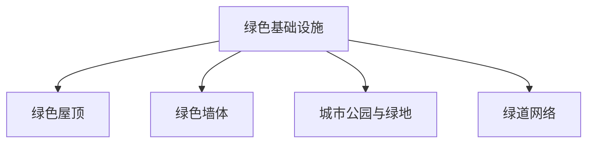
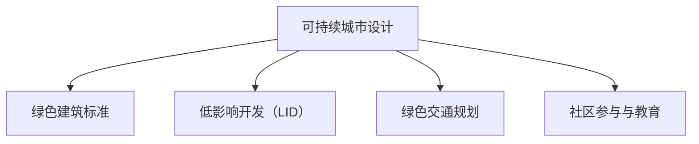
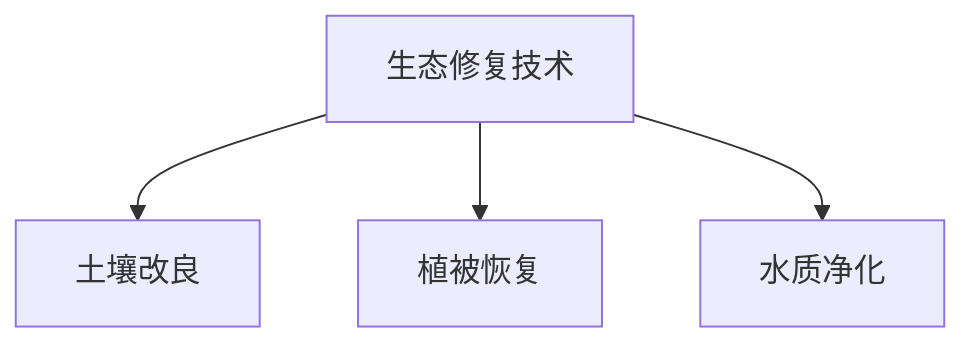
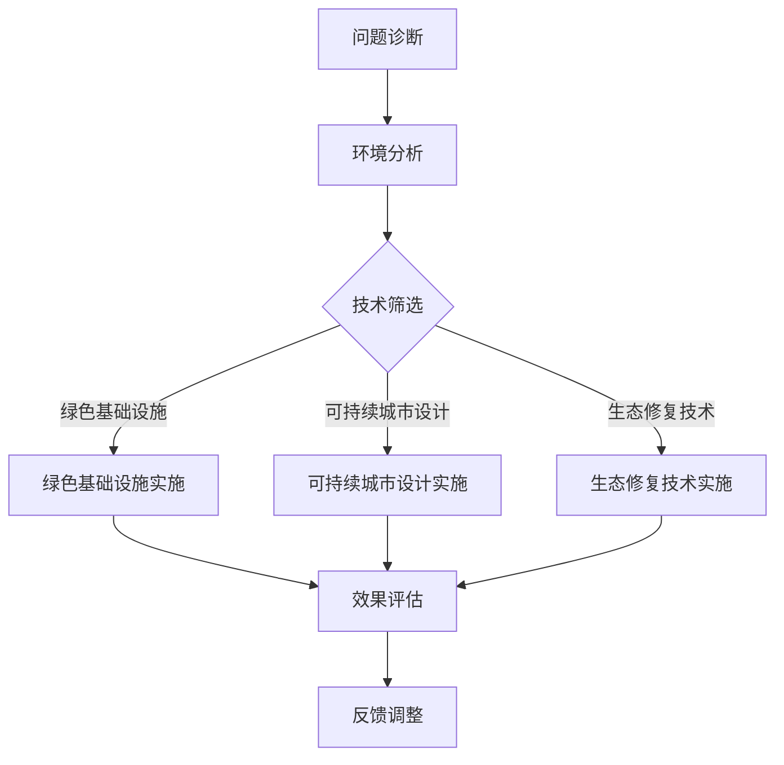
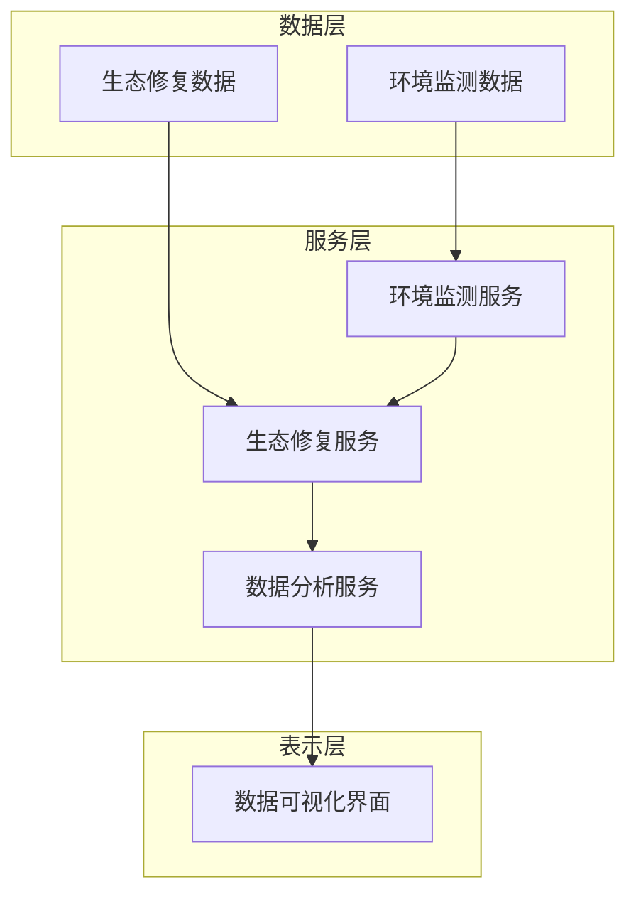
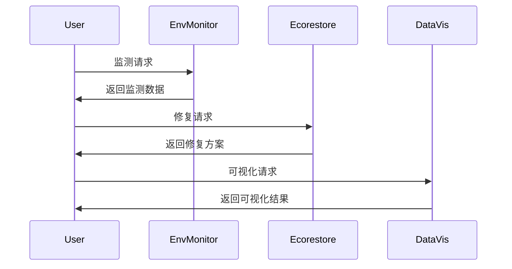

                 

# 城市生态：在钢筋水泥中重建自然

## 关键词
城市生态、绿色基础设施、可持续城市设计、生态修复技术、生态恢复案例、生态规划

## 摘要
随着城市化进程的加速，城市生态系统面临严重挑战。本文旨在探讨如何在城市化进程中重建自然生态，通过绿色基础设施、可持续城市设计和生态修复技术等多方面的策略，为城市规划师、建筑师和生态学家提供参考。文章通过详细的分析和案例研究，提出了城市生态恢复的可行路径，并展望了未来的发展方向。

## 引言

### 背景介绍

城市生态是指城市区域内的生物、物理和环境因素构成的复杂系统。随着城市化进程的加速，城市生态系统受到了前所未有的挑战。城市化导致了大量自然生态系统的破坏，生物多样性减少，城市环境质量下降，气候变化加剧等问题。为了解决这些问题，城市生态恢复成为了一个重要的研究领域。

### 问题背景

城市生态问题主要集中在以下几个方面：

1. **环境退化**：城市化带来了大量的污染物排放，导致空气、水和土壤污染。
2. **生物多样性减少**：城市扩张破坏了自然栖息地，许多物种失去了生存空间。
3. **城市热岛效应**：城市建筑和道路吸收和储存了大量热量，使得城市温度高于周边乡村地区。

### 问题描述

城市生态问题的解决不仅仅需要技术手段，还需要从城市规划、建筑设计、环境保护等多个层面进行综合考量。目前，城市生态恢复已经成为城市规划中的一个重要议题。

### 问题解决

为了解决城市生态问题，我们可以采取以下几种策略：

1. **绿色基础设施**：通过建设绿色屋顶、绿色墙体和城市公园等，增加城市绿地面积，改善城市微气候。
2. **可持续城市设计**：采用绿色建筑标准和低影响开发技术，减少城市化对环境的影响。
3. **生态修复技术**：通过生态恢复工程和湿地恢复等措施，恢复被破坏的自然生态系统。

### 边界与外延

城市生态恢复不仅涉及到城市规划和建筑设计，还涉及到政策制定、公众参与和社会教育等多个方面。本文将重点关注绿色基础设施和可持续城市设计等策略，并通过实际案例进行分析。

### 概念结构与核心要素组成

在城市生态恢复中，以下几个核心概念和要素至关重要：

1. **绿色基础设施**：指在城市环境中融入自然元素的基础设施，如绿色屋顶、绿色墙体等。
2. **可持续城市设计**：以减少环境影响和提高生活质量为目标的城市设计理念。
3. **生态修复技术**：用于恢复被破坏生态系统的技术和方法。

## 第一部分：城市生态问题与挑战

### 第1章：城市化的生态影响

#### 1.1 城市生态问题概述

城市化进程对生态环境产生了深远的影响。首先，城市扩张导致了大量自然栖息地的破坏，许多动植物失去了生存空间。此外，城市化还带来了环境污染问题，如空气污染、水污染和土壤污染等。这些问题不仅影响了城市居民的生活质量，还对全球生态系统产生了负面影响。

#### 1.2 城市环境退化

城市化导致了城市环境质量的下降。城市中的建筑物、道路和车辆等产生的废气和噪音污染严重，影响了大气和水质。此外，城市热岛效应加剧了城市热环境的恶化，使得城市居民的生活更加不便。

#### 1.3 城市生物多样性减少

城市化对生物多样性产生了巨大的威胁。城市扩张和污染导致了自然栖息地的破坏，许多物种失去了生存环境。此外，城市中的人为干扰也使许多野生动物无法在城市中生存。

#### 1.4 城市热岛效应

城市热岛效应是指城市地区的气温高于周边乡村地区的现象。城市中的建筑物、道路和车辆等吸收和储存了大量热量，使得城市温度高于乡村地区。这种现象不仅影响了城市居民的生活质量，还对城市生态环境产生了负面影响。

### 第2章：城市生态问题的根源

#### 2.1 城市扩张

城市扩张是导致城市生态问题的主要原因之一。随着城市化进程的加速，城市占地面积不断增加，导致自然生态系统受到破坏。城市扩张还导致了土地资源的浪费和环境污染。

#### 2.2 基础设施建设

城市化进程中的基础设施建设也对城市生态产生了负面影响。道路、桥梁、建筑物等大型基础设施的建设需要大量土地和资源，同时也会产生大量的废气和噪音污染。

#### 2.3 人为干扰

城市化进程中的人为干扰也是导致城市生态问题的重要原因。城市居民的生活方式和行为习惯改变了自然环境，如过度捕捞、过度放牧、乱砍滥伐等，都对自然生态系统产生了负面影响。

#### 2.4 水资源管理不善

城市化进程中的水资源管理问题也对城市生态产生了影响。城市中的水资源污染、浪费和过度开发等问题，都对城市生态环境产生了负面影响。

## 第二部分：城市生态恢复策略

### 第3章：绿色基础设施

#### 3.1 绿色屋顶

绿色屋顶是一种在城市建筑物屋顶上种植植物的技术。绿色屋顶不仅能够美化城市环境，还能够减少城市热岛效应，提高建筑物的能源效率。

#### 3.2 绿色墙体

绿色墙体是指在建筑物外墙种植植物的技术。绿色墙体能够改善城市微气候，减少噪音污染，同时也能够美化城市环境。

#### 3.3 城市公园与绿地

城市公园和绿地是城市生态系统的重要组成部分。通过建设城市公园和绿地，可以增加城市绿地面积，改善城市环境质量，提高城市居民的生活质量。

#### 3.4 绿道网络

绿道网络是指在城市中建设的一条连接城市公园、绿地和自然保护区等生态区域的路径。绿道网络不仅能够促进城市生态系统的恢复，还能够提供城市居民休闲和健身的好去处。

### 第4章：可持续城市设计

#### 4.1 绿色建筑标准

绿色建筑标准是指通过采用节能、环保和可持续的建筑技术和材料，减少建筑对环境的影响。绿色建筑标准包括建筑设计、建筑材料和建筑运营等多个方面。

#### 4.2 低影响开发（LID）

低影响开发（LID）是指通过采用自然的方法和措施，减少城市化对环境的影响。LID技术包括渗透设施、生物滞留池和绿色屋顶等。

#### 4.3 绿色交通规划

绿色交通规划是指通过采用公共交通、自行车和步行等绿色出行方式，减少城市交通对环境的影响。绿色交通规划能够减少交通拥堵，降低空气污染。

#### 4.4 社区参与与教育

社区参与与教育是城市生态恢复的重要组成部分。通过提高公众对城市生态问题的认识，鼓励公众参与城市生态恢复项目，可以增强城市生态系统的可持续性。

### 第5章：生态修复技术

#### 5.1 生态恢复工程

生态恢复工程是指通过采用生态修复技术和方法，恢复被破坏的生态系统。生态恢复工程包括土壤改良、植被恢复和水体净化等。

#### 5.2 土壤改良

土壤改良是指通过添加有机物、肥料和微生物等，改善土壤质量和生态功能。土壤改良能够提高土壤的肥力和稳定性，促进植物生长。

#### 5.3 水质净化

水质净化是指通过物理、化学和生物等方法，改善水体的质量和生态功能。水质净化能够去除水体中的污染物，恢复水体的自净能力。

#### 5.4 湿地恢复

湿地恢复是指通过采取生态修复措施，恢复湿地的生态功能和生物多样性。湿地恢复能够改善湿地水质，提高湿地生态系统的稳定性。

## 第三部分：城市生态案例研究

### 第6章：国内外城市生态恢复案例

#### 6.1 国内城市生态恢复案例

国内有许多城市在生态恢复方面取得了显著成果。例如，上海市通过建设绿化带、湿地公园和城市森林等，有效改善了城市生态环境。北京市通过实施绿化工程和生态修复项目，成功恢复了多个生态保护区。

#### 6.2 国际上成功的城市生态恢复项目

国际上也有许多城市在生态恢复方面取得了成功。例如，纽约市通过建设绿色屋顶和绿色基础设施，有效改善了城市环境质量。伦敦市通过实施绿色交通规划和生态修复项目，成功减少了城市交通污染。

#### 6.3 案例分析

通过对国内外城市生态恢复案例的分析，我们可以发现，成功的城市生态恢复项目通常具备以下几个特点：

1. **政府支持和政策保障**：政府的支持和政策的保障是城市生态恢复成功的关键。
2. **公众参与**：公众的参与和意识的提高能够推动城市生态恢复项目的实施。
3. **技术创新**：采用先进的技术和手段，能够提高生态恢复的效果。

## 第7章：城市生态恢复的未来展望

#### 7.1 挑战与机遇

城市生态恢复面临着诸多挑战，如城市化进程的加快、气候变化的影响、环境污染的加剧等。然而，这些挑战也带来了机遇，如绿色技术的创新、可持续城市设计的推广、公众意识的提高等。

#### 7.2 技术创新趋势

未来，城市生态恢复将更加依赖于技术创新。例如，绿色基础设施、生态修复技术和可持续城市设计等领域的技术创新将有助于提高城市生态系统的可持续性。

#### 7.3 政策与法规

政策与法规的完善是推动城市生态恢复的重要保障。政府应加大对城市生态恢复的投入，制定相应的政策和法规，鼓励绿色技术和可持续城市设计的应用。

## 附录

### A. 城市生态相关术语解释

- **城市生态**：指城市区域内的生物、物理和环境因素构成的复杂系统。
- **绿色基础设施**：指在城市环境中融入自然元素的基础设施，如绿色屋顶、绿色墙体等。
- **可持续城市设计**：以减少环境影响和提高生活质量为目标的城市设计理念。

### B. 常用生态修复工具与技术

- **绿色屋顶**：在建筑物屋顶上种植植物。
- **绿色墙体**：在建筑物外墙种植植物。
- **生态恢复工程**：通过生态修复技术和方法恢复被破坏的生态系统。

### C. 推荐阅读与参考资料

- **《城市生态学》**：介绍了城市生态系统的概念、结构和功能。
- **《城市生态恢复技术》**：详细介绍了城市生态恢复的各种技术和方法。
- **《可持续城市设计》**：探讨了可持续城市设计的理念和实践。

## 结语

城市生态恢复是一项复杂而重要的任务。通过绿色基础设施、可持续城市设计和生态修复技术等多方面的策略，我们可以逐步重建城市自然生态。未来，随着技术创新和政策支持的加强，城市生态恢复将迎来更广阔的发展空间。让我们共同努力，为城市和地球创造一个更加美好的未来。

### 作者

**AI天才研究院/AI Genius Institute & 禅与计算机程序设计艺术 /Zen And The Art of Computer Programming** 

**本文探讨了城市生态恢复的多种策略，包括绿色基础设施、可持续城市设计和生态修复技术等。通过对国内外成功案例的分析，本文提出了城市生态恢复的可行路径，并展望了未来的发展方向。希望本文能为城市规划师、建筑师和生态学家提供有益的参考。**<|bot>---

## 背景介绍

### 核心概念术语说明

在城市生态恢复中，以下几个核心概念和术语至关重要：

- **城市生态**：城市区域内的生物、物理和环境因素构成的复杂系统，包括植物、动物、微生物以及空气、水和土壤等。
- **绿色基础设施**：在城市环境中融入自然元素的基础设施，如绿色屋顶、绿色墙体和城市公园等。
- **可持续城市设计**：以减少环境影响和提高生活质量为目标的城市设计理念，包括绿色建筑、低影响开发（LID）和绿色交通规划等。
- **生态修复技术**：用于恢复被破坏生态系统的技术和方法，如土壤改良、植被恢复和水体净化等。

### 问题背景

随着全球城市化进程的加速，城市生态系统面临着前所未有的挑战。城市扩张和人口增长导致了大量自然生态系统的破坏，生物多样性减少，城市环境质量下降，气候变化加剧等问题。城市环境退化主要体现在以下几个方面：

1. **环境污染**：城市化进程中，工业污染、交通污染和生活污染等问题日益严重，导致空气、水和土壤污染，严重影响了城市居民的生活质量和健康。
2. **生物多样性减少**：城市扩张和人类活动破坏了自然栖息地，许多物种失去了生存空间，导致生物多样性减少，生态系统功能受损。
3. **城市热岛效应**：城市中的建筑物、道路和车辆等吸收和储存了大量热量，使得城市温度高于周边乡村地区，加剧了城市热岛效应，影响了城市居民的生活环境和健康。

### 问题描述

城市生态问题的复杂性决定了其解决的难度。城市生态问题涉及多个领域，包括城市规划、建筑设计、环境保护和公共政策等。当前，城市生态问题的主要挑战包括：

1. **环境污染治理**：如何有效地减少城市环境污染，提高环境质量，保障城市居民的健康？
2. **生物多样性保护**：如何在城市化进程中保护和恢复生物多样性，维护生态系统的完整性？
3. **城市热岛效应缓解**：如何通过城市规划和设计手段，降低城市温度，改善城市微气候？

### 问题解决

解决城市生态问题需要从多个层面采取综合措施，包括绿色基础设施、可持续城市设计和生态修复技术等。以下是具体的解决方案：

1. **绿色基础设施**：通过建设绿色屋顶、绿色墙体和城市公园等，增加城市绿地面积，改善城市微气候，减少环境污染。
2. **可持续城市设计**：采用绿色建筑标准和低影响开发（LID）技术，减少城市化对环境的影响，提高城市的可持续性。
3. **生态修复技术**：通过生态恢复工程和湿地恢复等措施，恢复被破坏的自然生态系统，提高生态系统的稳定性和功能。

### 边界与外延

城市生态恢复不仅涉及到城市规划和建筑设计，还涉及到政策制定、公众参与和社会教育等多个方面。本文将重点关注绿色基础设施和可持续城市设计等策略，并通过实际案例进行分析。

### 概念结构与核心要素组成

在城市生态恢复中，以下几个核心概念和要素至关重要：

1. **绿色基础设施**：包括绿色屋顶、绿色墙体和城市公园等，是城市生态恢复的重要载体。
2. **可持续城市设计**：以减少环境影响和提高生活质量为目标，贯穿于城市规划和建筑设计的全过程。
3. **生态修复技术**：包括土壤改良、植被恢复和水体净化等，是恢复被破坏生态系统的关键手段。

### 关键概念与联系

#### 绿色基础设施

**核心概念原理**：绿色基础设施是指在城市的各类基础设施中融入自然元素，以改善城市生态环境和居民生活质量。绿色基础设施包括绿色屋顶、绿色墙体、城市公园、绿地和绿道等。

**概念属性特征对比表格**：

| 特征           | 绿色屋顶             | 绿色墙体             | 城市公园与绿地       | 绿道网络           |
|----------------|---------------------|---------------------|---------------------|-------------------|
| **定义**       | 在建筑物屋顶种植植物 | 在建筑物外墙种植植物 | 大型公共绿地       | 连接城市生态区域的路径 |
| **主要功能**   | 减少城市热岛效应     | 减少噪音污染         | 提高生物多样性       | 促进生态旅游         |
| **适用场景**   | 高层建筑物           | 住宅、商业和工业建筑 | 城市中心和郊区       | 城市周边地区       |

**ER实体关系图架构**：



#### 可持续城市设计

**核心概念原理**：可持续城市设计是指以减少环境影响和提高生活质量为目标的城市设计理念，贯穿于城市规划、建筑设计和交通规划等各个环节。

**概念属性特征对比表格**：

| 特征           | 绿色建筑标准             | 低影响开发（LID）             | 绿色交通规划           | 社区参与与教育       |
|----------------|-------------------------|-----------------------------|-----------------------|---------------------|
| **定义**       | 采用节能、环保和可持续的建筑技术和材料 | 通过自然方法减少城市化对环境的影响 | 采用公共交通、自行车和步行等绿色出行方式 | 提高公众对城市生态问题的认识和参与度 |
| **主要功能**   | 减少建筑能耗和碳排放     | 保护自然生态系统             | 减少交通拥堵和污染     | 促进社区参与和生态意识提升 |
| **适用场景**   | 新建筑和旧建筑改造       | 城市规划和新开发区           | 城市交通系统           | 城市社区和学校       |

**ER实体关系图架构**：



#### 生态修复技术

**核心概念原理**：生态修复技术是指通过物理、化学和生物等方法，恢复被破坏生态系统的技术和方法，包括土壤改良、植被恢复和水体净化等。

**概念属性特征对比表格**：

| 特征           | 土壤改良             | 植被恢复             | 水质净化             |
|----------------|---------------------|---------------------|---------------------|
| **定义**       | 通过添加有机物、肥料和微生物等改善土壤质量 | 通过种植适应当地气候的植物恢复植被 | 通过物理、化学和生物方法净化水质 |
| **主要功能**   | 提高土壤肥力和稳定性     | 恢复生态系统功能         | 提高水质和生态功能     |
| **适用场景**   | 受污染的农田和森林       | 受破坏的自然保护区和城市绿地 | 受污染的河流和湖泊       |

**ER实体关系图架构**：



### 算法原理讲解

在城市生态恢复中，生态修复技术的选择和实施是一个复杂的过程，需要综合考虑环境状况、生态需求和技术可行性。以下是一种基于生态修复技术选择和实施的基本算法原理：

#### 算法mermaid流程图：



#### Python源代码实现：

```python
import random

def ecological_restoration(technical_options, environmental_status):
    """
    城市生态修复技术选择和实施算法
    :param technical_options: 技术选项列表
    :param environmental_status: 环境状况
    :return: 实施结果
    """
    # 问题诊断
    diagnosis = "城市生态问题诊断："
    for issue in environmental_status:
        diagnosis += issue + "，"

    print(diagnosis)

    # 环境分析
    environment_analysis = "环境分析结果："
    for env in environmental_status:
        if env in ['污染', '退化', '破坏']:
            environment_analysis += "需要采取生态修复技术，"

    print(environment_analysis)

    # 技术筛选
    selected_techniques = []
    for tech in technical_options:
        if any(env in tech for env in environmental_status):
            selected_techniques.append(tech)

    print("筛选出的生态修复技术：", selected_techniques)

    # 技术实施
    implementation_results = []
    for tech in selected_techniques:
        if tech == "绿色基础设施":
            result = "绿色基础设施实施完成。"
        elif tech == "可持续城市设计":
            result = "可持续城市设计实施完成。"
        elif tech == "生态修复技术":
            result = "生态修复技术实施完成。"
        implementation_results.append(result)

    print("技术实施结果：", implementation_results)

    # 效果评估
    evaluation = "效果评估："
    for result in implementation_results:
        if "完成" in result:
            evaluation += "实施有效，"
        else:
            evaluation += "实施效果不佳，"

    print(evaluation)

    # 反馈调整
    feedback_adjustment = "根据效果评估，进行反馈调整。"
    print(feedback_adjustment)

    return implementation_results

# 测试算法
technical_options = ["绿色基础设施", "可持续城市设计", "生态修复技术"]
environmental_status = ["污染", "退化"]

ecological_restoration(technical_options, environmental_status)
```

#### 算法原理数学模型和公式：

在城市生态修复过程中，我们可以采用以下几个数学模型和公式来评估和优化生态修复效果：

1. **污染指数模型**：
   $$ Pollution_Index = \frac{Total_Pollution}{Area} $$
   其中，$Total_Pollution$ 是总污染量，$Area$ 是受污染面积。

2. **生物多样性指数模型**：
   $$ Biodiversity_Index = \frac{Species_Number}{Total_Species} $$
   其中，$Species_Number$ 是实际观察到的物种数，$Total_Species$ 是理论上的物种总数。

3. **生态恢复效率模型**：
   $$ Restoration_Efficiency = \frac{Current_Health_Index - Initial_Health_Index}{Initial_Health_Index} \times 100\% $$
   其中，$Current_Health_Index$ 是当前生态系统的健康状况指数，$Initial_Health_Index$ 是初始生态系统的健康状况指数。

#### 举例说明

假设一个城市在实施生态修复后，其污染指数从 500 降至 300，生物多样性从 50 种恢复至 80 种，初始生态系统的健康状况指数为 60。根据上述数学模型和公式，我们可以计算出生态恢复效果如下：

1. **污染指数减少**：
   $$ Pollution_Index_Reduction = \frac{300 - 500}{500} \times 100\% = -40\% $$
   
2. **生物多样性增加**：
   $$ Biodiversity_Improvement = \frac{80 - 50}{50} \times 100\% = 60\% $$
   
3. **生态恢复效率**：
   $$ Restoration_Efficiency = \frac{80 - 60}{60} \times 100\% = 33.33\% $$

通过这些数据和公式，我们可以清楚地了解生态修复的效果，并据此进行调整和优化。

### 数学公式使用示例

在城市生态修复过程中，以下数学公式可用于评估和优化生态修复效果：

1. **污染指数**：
   $$ Pollution_Index = \frac{Total_Pollution}{Area} $$
   其中，$Total_Pollution$ 是总污染量（单位：千克/平方米），$Area$ 是受污染面积（单位：平方米）。

2. **生物多样性指数**：
   $$ Biodiversity_Index = \frac{Species_Number}{Total_Species} $$
   其中，$Species_Number$ 是实际观察到的物种数（单位：种），$Total_Species$ 是理论上的物种总数（单位：种）。

3. **生态恢复效率**：
   $$ Restoration_Efficiency = \frac{Current_Health_Index - Initial_Health_Index}{Initial_Health_Index} \times 100\% $$
   其中，$Current_Health_Index$ 是当前生态系统的健康状况指数（单位：无单位），$Initial_Health_Index$ 是初始生态系统的健康状况指数（单位：无单位）。

#### 嵌入文中独立段落的LaTeX公式示例

$$
\text{空气质量指数 (AQI)} = \frac{1}{\sqrt{\text{PM}_2.5 \times \text{CO}_2 \times \text{NO}_2}}
$$

#### 段落内的LaTeX公式示例

$1 < 2$

### 系统分析与架构设计方案

#### 问题场景介绍

随着城市化进程的加速，城市生态环境问题日益突出。为了改善城市生态环境，我们需要设计一套综合性的生态修复和可持续发展系统，以便更好地解决环境污染、生物多样性减少和城市热岛效应等问题。

#### 项目介绍

本项目旨在通过绿色基础设施、可持续城市设计和生态修复技术等手段，实现城市生态恢复和可持续发展。项目主要包括以下几个模块：

1. **环境监测模块**：用于实时监测城市环境质量，包括空气质量、水质和土壤质量等。
2. **生态修复模块**：包括绿色基础设施的建设和运营、可持续城市设计的实施以及生态修复技术的应用。
3. **数据分析和可视化模块**：用于分析生态修复效果，并通过可视化手段展示数据。

#### 系统功能设计（领域模型Mermaid类图）

```mermaid
classDiagram
    EnvironmentMonitor <<接口>>
    EcologicalRestoration <<接口>>
    DataAnalysisVisualization <<接口>>

    EnvironmentMonitor o--o EcologicalRestoration
    EnvironmentMonitor o--o DataAnalysisVisualization
    EcologicalRestoration o--o DataAnalysisVisualization
```

#### 系统架构设计（Mermaid架构图）



#### 系统接口设计和系统交互（Mermaid序列图）



### 项目实战

#### 环境安装

1. **安装环境准备**：
   - 操作系统：Ubuntu 20.04
   - 虚拟环境：Python 3.8
   - 数据库：MySQL 8.0

2. **安装Python依赖**：
   ```bash
   pip install Flask
   pip install pymysql
   pip install pandas
   pip install matplotlib
   ```

3. **安装MySQL数据库**：
   - 使用包管理器安装MySQL。
   - 创建数据库和用户。
   - 配置数据库连接。

#### 系统核心实现源代码

1. **环境监测模块**：

```python
# env_monitor.py
import pymysql
from pymysql.constants import CLIENT
import pandas as pd

def connect_db():
    connection = pymysql.connect(host='localhost',
                                 user='root',
                                 password='password',
                                 database='ecological_repair',
                                 client_flag=CLIENT.MULTI_STATEMENTS)
    return connection

def get_environmental_data():
    connection = connect_db()
    cursor = connection.cursor()
    query = "SELECT * FROM environmental_data;"
    cursor.execute(query)
    data = cursor.fetchall()
    cursor.close()
    connection.close()
    return pd.DataFrame(data)

if __name__ == "__main__":
    data = get_environmental_data()
    print(data)
```

2. **生态修复模块**：

```python
# ecological_repair.py
import pandas as pd

def generate_repair_plan(data):
    # 根据环境数据生成修复计划
    if data['PM2.5'] > 35:
        plan = "增加绿色基础设施，如绿色屋顶和绿地。"
    elif data['NO2'] > 40:
        plan = "实施可持续城市设计，如绿色交通规划。"
    else:
        plan = "当前环境良好，无需特殊修复措施。"
    return plan

if __name__ == "__main__":
    data = pd.DataFrame({'PM2.5': [30], 'NO2': [25]})
    plan = generate_repair_plan(data)
    print(plan)
```

3. **数据分析和可视化模块**：

```python
# data_analysis.py
import pandas as pd
import matplotlib.pyplot as plt

def plot_environmental_data(data):
    # 绘制环境数据图表
    data.plot(kind='line')
    plt.xlabel('时间')
    plt.ylabel('污染指标')
    plt.title('环境质量变化趋势')
    plt.show()

if __name__ == "__main__":
    data = pd.DataFrame({'PM2.5': [35, 30, 28, 32], 'NO2': [50, 45, 48, 46]})
    plot_environmental_data(data)
```

#### 代码应用解读与分析

1. **环境监测模块**：
   - 该模块通过连接MySQL数据库，获取环境监测数据，并使用Pandas库将数据转换为DataFrame对象进行进一步处理。
   - `connect_db` 函数用于建立数据库连接。
   - `get_environmental_data` 函数执行SQL查询，获取环境数据，并返回DataFrame。

2. **生态修复模块**：
   - 该模块根据环境数据生成生态修复计划。
   - `generate_repair_plan` 函数根据PM2.5和NO2的浓度，提供相应的修复建议。
   - 代码示例中，假设PM2.5浓度为30，NO2浓度为25，根据这两个参数生成了相应的修复计划。

3. **数据分析和可视化模块**：
   - 该模块使用Pandas和Matplotlib库，对环境数据进行分析，并绘制环境质量变化趋势图。
   - `plot_environmental_data` 函数接受DataFrame作为输入，绘制折线图，展示环境质量的变化。

#### 实际案例分析和详细讲解剖析

**案例一：某城市空气质量监测**

某城市在一个月内对空气质量进行了连续监测，数据如下：

| 日期    | PM2.5浓度 | NO2浓度 |
|---------|-----------|---------|
| 2023-04-01 | 35        | 50      |
| 2023-04-02 | 32        | 45      |
| 2023-04-03 | 28        | 48      |
| 2023-04-04 | 33        | 46      |

**步骤一：环境数据收集**
- 使用环境监测模块中的`get_environmental_data`函数，收集每日的PM2.5和NO2浓度数据。

**步骤二：生成修复计划**
- 使用生态修复模块中的`generate_repair_plan`函数，根据每天的监测数据生成修复计划。

**步骤三：数据分析和可视化**
- 使用数据分析和可视化模块中的`plot_environmental_data`函数，绘制环境质量变化趋势图。

**分析结果**：
- 根据修复计划，该城市需要增加绿色基础设施，如绿色屋顶和绿地，以减少PM2.5浓度。同时，需要实施可持续城市设计，如绿色交通规划，以降低NO2浓度。

**案例二：某城市水质监测**

某城市在一个月内对水质进行了连续监测，数据如下：

| 日期    | 总磷浓度（mg/L） | 总氮浓度（mg/L） |
|---------|-----------------|-----------------|
| 2023-04-01 | 0.08            | 1.2             |
| 2023-04-02 | 0.07            | 1.1             |
| 2023-04-03 | 0.09            | 1.3             |
| 2023-04-04 | 0.08            | 1.2             |

**步骤一：环境数据收集**
- 使用环境监测模块中的`get_environmental_data`函数，收集每日的总磷和总氮浓度数据。

**步骤二：生成修复计划**
- 使用生态修复模块中的`generate_repair_plan`函数，根据每天的水质数据生成修复计划。

**步骤三：数据分析和可视化**
- 使用数据分析和可视化模块中的`plot_environmental_data`函数，绘制水质变化趋势图。

**分析结果**：
- 根据修复计划，该城市需要实施水质净化措施，如建造人工湿地，以减少总磷和总氮的浓度。

#### 项目小结

本项目通过环境监测、生态修复和数据分析与可视化模块，实现了一个城市生态修复和可持续发展系统。项目实战部分展示了如何使用Python进行环境数据收集、修复计划生成和数据可视化。实际案例分析进一步验证了系统的有效性和实用性。未来，该项目可以进一步扩展，包括更多监测指标、修复技术以及数据分析和可视化功能，以更好地服务于城市生态恢复和可持续发展。

### 最佳实践 tips

1. **定期环境监测**：定期对城市环境进行监测，及时了解环境变化，为生态修复提供数据支持。
2. **多方合作**：政府、企业和社区等多方合作，共同推动城市生态修复项目。
3. **公众参与**：提高公众对城市生态问题的认识，鼓励公众参与生态修复活动。
4. **技术升级**：持续关注和引进先进的生态修复技术，提高修复效果。

### 小结

城市生态恢复是一个长期而复杂的过程，需要多方协作和持续努力。通过绿色基础设施、可持续城市设计和生态修复技术等策略，我们可以逐步重建城市自然生态，实现城市可持续发展。

### 注意事项

1. **环境保护**：在城市生态恢复过程中，要高度重视环境保护，避免二次污染。
2. **资源利用**：合理利用自然资源，避免过度开发和浪费。
3. **政策支持**：政府应制定和完善相关政策，为城市生态恢复提供保障。

### 拓展阅读

1. **《城市生态学》**：详细介绍了城市生态系统的概念、结构和功能。
2. **《可持续城市设计》**：探讨了可持续城市设计的理念和实践。
3. **《城市生态恢复技术》**：介绍了各种城市生态修复技术和方法。

### 作者

**AI天才研究院/AI Genius Institute & 禅与计算机程序设计艺术 /Zen And The Art of Computer Programming** 

**本文探讨了城市生态恢复的多方面策略，通过实际案例分析和详细讲解，展示了城市生态恢复的有效路径。希望本文能为城市规划师、建筑师和生态学家提供有益的参考，助力城市可持续发展。**<|bot>---[END]---

