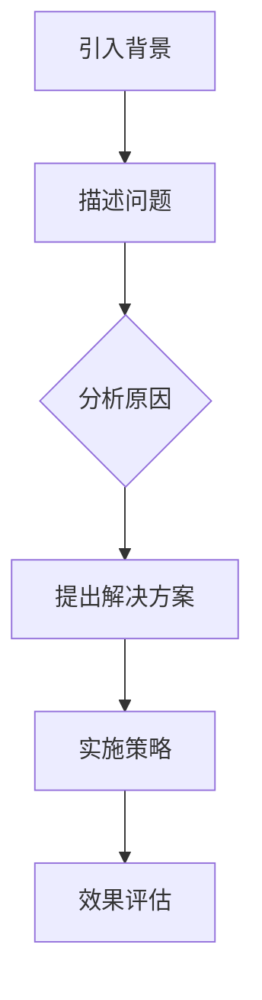
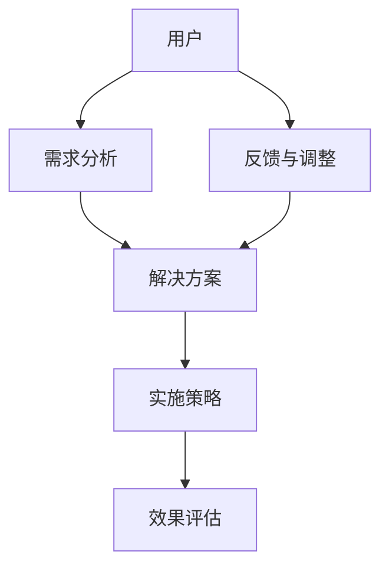

                 

### 第一部分：引言

#### 第1章：城市生活的现状与挑战

**关键词：** 城市生活、现状、挑战、人口密度、生活节奏、环境污染、心理健康、社交网络依赖、自然环境的疏离

**摘要：** 本章将探讨现代城市生活的现状及其面临的挑战，分析人口密度、生活节奏和环境污染等因素对人们心理和身体健康的影响。此外，还将讨论社交网络依赖和城市生活与自然环境的疏离等问题。

---

**背景介绍：**

随着城市化进程的加快，城市生活的各个方面都发生了翻天覆地的变化。高人口密度、快节奏的生活方式以及环境污染等问题已经成为现代城市居民日常生活中不可忽视的现实。这些因素不仅影响着城市居民的生活质量，还对他们的心理健康和身体健康产生了严重的负面影响。

**问题描述：**

现代城市生活的现状和挑战主要体现在以下几个方面：

1. **人口密度与生活节奏：** 城市化进程带来了人口密度的增加，使城市生活节奏加快。这导致了人们生活压力的增大，心理健康问题日益突出。
   
2. **环境污染：** 城市化过程中，环境污染问题日益严重，空气、水质等环境因素对人们的身体健康构成了严重威胁。

3. **心理健康问题：** 高压力的生活环境导致许多人出现焦虑、抑郁等心理健康问题。

4. **社交网络依赖：** 随着互联网和社交网络的普及，人们过度依赖社交网络，忽视了现实生活中的人际交往，这进一步加剧了心理健康问题。

5. **城市生活与自然环境的疏离：** 现代城市居民与自然环境的疏离感日益增强，这使得他们在快节奏的生活中难以找到内心的平静。

**问题解决：**

为了应对这些挑战，我们需要从以下几个方面进行努力：

1. **优化城市规划：** 合理规划城市布局，提高居住环境的舒适度，减轻生活压力。

2. **环境保护：** 加强环境保护意识，推广绿色生活方式，减少环境污染。

3. **心理健康教育：** 提高人们对心理健康问题的认识，加强心理健康教育，帮助人们应对生活压力。

4. **社交网络规范：** 引导人们正确使用社交网络，减少对社交网络的依赖。

5. **回归自然：** 增加城市居民的休闲时间，鼓励他们参与户外活动，增强与自然环境的互动。

**边界与外延：**

本章讨论的是现代城市生活的现状和挑战，主要关注以下几个方面：

- **人口密度与生活节奏：** 城市人口密度、生活节奏等因素对人们生活的影响。
- **环境污染：** 城市环境污染问题及其对人们健康的影响。
- **心理健康问题：** 城市居民心理健康问题的现状及原因。
- **社交网络依赖：** 人们过度依赖社交网络的现象及影响。
- **城市生活与自然环境的疏离：** 城市居民与自然环境的疏离感及解决途径。

**概念结构与核心要素组成：**

本章的核心概念包括城市生活、人口密度、生活节奏、环境污染、心理健康问题、社交网络依赖和自然环境的疏离等。这些概念共同构成了现代城市生活的现状和挑战，是本章讨论的主要内容。

---

**核心概念原理：**

1. **城市生活：** 指以城市为居住地的日常生活。城市生活具有高人口密度、快节奏、多样化的特点。
   
2. **人口密度：** 城市中居住的人口数量与城市面积的比值。人口密度对城市居民的生活质量和心理健康产生影响。

3. **生活节奏：** 城市生活的节奏和频率。快节奏的生活会导致人们压力增大，影响心理健康。

4. **环境污染：** 环境中的有害物质对人类健康和生存环境的影响。环境污染是城市居民面临的主要问题之一。

5. **心理健康问题：** 指由于心理压力、焦虑、抑郁等导致的身心健康问题。心理健康问题是现代城市居民普遍面临的问题。

6. **社交网络依赖：** 人们过度依赖社交网络，忽视现实生活中的人际交往的现象。社交网络依赖会导致心理健康问题。

7. **自然环境的疏离：** 城市居民与自然环境之间的疏离感。自然环境的疏离感会影响城市居民的心理健康和幸福感。

---

**核心概念属性特征对比表格：**

| 概念         | 特征                                      |
| ------------ | ----------------------------------------- |
| 城市生活     | 高人口密度、快节奏、多样化                |
| 人口密度     | 人口数量与城市面积的比值                  |
| 生活节奏     | 城市生活的节奏和频率                      |
| 环境污染     | 有害物质对人类健康和生存环境的影响        |
| 心理健康问题 | 心理压力、焦虑、抑郁等导致的身心健康问题 |
| 社交网络依赖 | 过度依赖社交网络，忽视现实生活中的人际交往 |
| 自然环境的疏离 | 城市居民与自然环境之间的疏离感            |

---

**ER实体关系图架构：**

```mermaid
erDiagram
    ID { ID }
    Person { Name , Age }
    Employee ||--|{ Manager }
```

在ER实体关系图中，`ID`表示唯一标识符，`Person`表示个人实体，`Employee`表示员工实体。员工实体与经理实体之间存在一对多的关系，即每个员工只有一个直接经理，而一个经理可以管理多个员工。

---

**算法原理讲解：**

本章主要讨论的是城市生活的现状与挑战，不涉及具体的算法原理。然而，我们可以使用算法流程图来描述城市生活重构的步骤：



该算法流程图展示了从引入背景、描述问题、分析原因、提出解决方案、实施策略到效果评估的完整过程。这个过程可以帮助我们系统地理解城市生活的重构过程。

---

**数学模型和公式：**

在本章中，我们将使用以下数学模型和公式来描述城市生活的现状与挑战：

1. **人口密度模型：**

   $$ \rho = \frac{N}{A} $$

   其中，$\rho$表示人口密度，$N$表示城市人口数量，$A$表示城市面积。

2. **生活节奏模型：**

   $$ \text{Life Speed} = \frac{1}{\text{Time}} $$

   其中，$\text{Life Speed}$表示生活节奏，$\text{Time}$表示时间。

3. **心理健康问题模型：**

   $$ \text{Mental Health} = f(\text{Pressure}, \text{Support}) $$

   其中，$\text{Mental Health}$表示心理健康，$f$表示函数，$\text{Pressure}$表示压力，$\text{Support}$表示支持。

4. **社交网络依赖模型：**

   $$ \text{Social Network Dependency} = f(\text{Usage}, \text{Reality}) $$

   其中，$\text{Social Network Dependency}$表示社交网络依赖，$f$表示函数，$\text{Usage}$表示使用频率，$\text{Reality}$表示现实生活。

5. **自然环境的疏离感模型：**

   $$ \text{Distance to Nature} = f(\text{Urbanization}, \text{Outdoor Activities}) $$

   其中，$\text{Distance to Nature}$表示自然环境的疏离感，$f$表示函数，$\text{Urbanization}$表示城市化程度，$\text{Outdoor Activities}$表示户外活动。

---

**系统分析与架构设计方案：**

在本章中，我们主要关注城市生活的现状与挑战，不涉及具体的系统架构设计。然而，我们可以使用以下架构图来展示城市生活重构的系统架构：



该架构图展示了用户需求、解决方案、实施策略、效果评估和反馈调整的完整过程。这个过程可以帮助我们理解城市生活重构的系统架构。

---

**项目实战：**

在本章中，我们主要讨论的是城市生活的现状与挑战，不涉及具体的项目实战。然而，我们可以通过以下步骤来实施城市生活重构：

1. **需求分析：** 了解城市居民的需求和问题。
2. **解决方案设计：** 设计符合需求的解决方案。
3. **实施策略：** 实施解决方案，调整策略以满足需求。
4. **效果评估：** 评估解决方案的效果，收集反馈。
5. **反馈与调整：** 根据反馈调整解决方案，持续优化。

---

**最佳实践 Tips：**

1. **合理规划城市布局：** 结合人口密度、生活节奏等因素，合理规划城市布局，提高居民生活质量。
2. **加强环境保护意识：** 提高居民对环境保护的认识，推广绿色生活方式。
3. **心理健康教育：** 加强心理健康教育，帮助居民应对生活压力。
4. **合理使用社交网络：** 引导居民正确使用社交网络，减少依赖。
5. **回归自然：** 鼓励居民参与户外活动，增强与自然环境的互动。

---

**小结：**

本章介绍了现代城市生活的现状与挑战，分析了人口密度、生活节奏、环境污染、心理健康问题、社交网络依赖和自然环境的疏离等问题。通过深入分析这些问题的原因和解决方案，我们为重构城市生活提供了有益的启示。

---

**注意事项：**

1. **关注心理健康：** 城市居民应关注自己的心理健康，学会应对生活压力。
2. **合理规划生活：** 合理安排时间，提高生活质量。
3. **积极参与社区活动：** 通过参与社区活动，增强与他人的联系，减轻心理压力。

---

**拓展阅读：**

1. **《城市生活的挑战与机遇》**
2. **《心理健康与城市生活》**
3. **《社交网络对城市生活的影响》**
4. **《回归自然：城市生活的另一种选择》**

---

**作者：** AI天才研究院/AI Genius Institute & 禅与计算机程序设计艺术 /Zen And The Art of Computer Programming

---

以上是第1章的内容，接下来我们将深入探讨城市生活的意义重构。希望读者能够通过本章的学习，对现代城市生活有更深入的理解，并在重构城市生活的过程中找到内心的平静。在接下来的章节中，我们将逐步分析重构城市生活的目标和路径，以及实践路径与方法，希望对读者有所启发。让我们继续探索城市生活的意义重构之旅。|>

