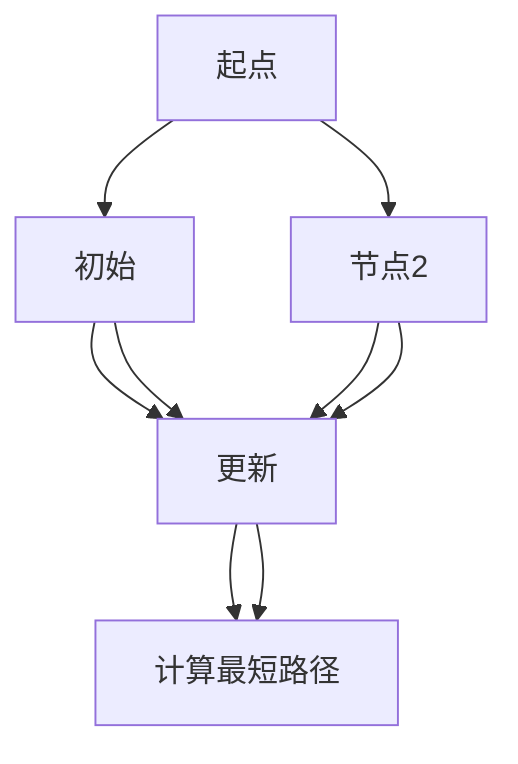

                 

# 城市规划：宜居环境中的生活品质提升

## 关键词
- 城市规划
- 宜居环境
- 生活品质
- 绿色空间
- 交通出行
- 公共服务
- 城市更新
- 智慧城市

## 摘要
本文从城市规划的角度出发，探讨如何提升城市居民的生活品质。通过详细分析城市规划的基础理论、宜居环境的定义与标准、提升生活品质的策略与实践，以及现代信息技术在城市规划中的应用，本文提出了城市规划和建设的新方向，为我国城市可持续发展提供了有益的借鉴和参考。

## 目录大纲设计思路

### 确定全书的核心内容与结构

城市规划作为一门综合性学科，涉及土地利用、交通规划、环境保护、公共服务等多个领域。全书的核心内容应当围绕这些领域展开，旨在为读者提供全面的城市规划知识体系。

首先，本书的第一部分将介绍城市规划的基础理论，包括城市规划的定义与发展、要素分析、技术工具与方法以及国际经验与案例研究。这些内容为读者提供了城市规划的基本框架和理论基础。

第二部分将重点探讨宜居环境的定义与标准，以及提升生活品质的策略与实践。这一部分旨在帮助读者理解什么是宜居环境，以及如何通过城市规划来提升居民的生活品质。

第三部分将分析现代信息技术在城市规划中的应用，包括大数据、人工智能、虚拟现实等新兴技术。这些技术的应用不仅能够提高城市规划的效率，还能够为城市居民提供更加智能化、便捷化的生活体验。

最后一部分将结合典型案例，探讨城市规划实践中的成功经验与挑战，为读者提供实际操作的指导。

### 规划每个章节的详细内容

在确定全书的核心内容与结构后，接下来需要为每个章节规划详细的目录。以下是本书各章节的详细目录设计：

### 第一部分：城市规划的基础理论

1. **1.1 城市规划概述**
   - 1.1.1 城市规划的定义与发展
   - 1.1.2 城市规划的目的与任务
   - 1.1.3 城市规划的基本原则

2. **1.2 城市规划的要素分析**
   - 1.2.1 土地利用与空间规划
   - 1.2.2 城市交通规划
   - 1.2.3 城市生态与环境保护

3. **1.3 城市规划的技术工具与方法**
   - 1.3.1 城市规划设计流程
   - 1.3.2 城市规划模型与模拟
   - 1.3.3 城市规划软件的应用

4. **1.4 城市规划的国际经验与案例研究**
   - 1.4.1 国外城市规划的先进理念与实践
   - 1.4.2 国内城市规划的成功案例与挑战

5. **1.5 本章小结**

### 第二部分：宜居环境与生活品质的提升

6. **2.1 宜居环境的定义与标准**
   - 2.1.1 宜居环境的基本概念
   - 2.1.2 宜居环境的评价指标体系
   - 2.1.3 不同人群对宜居环境的需求差异

7. **2.2 提升生活品质的策略与实践**
   - 2.2.1 城市绿色空间规划
   - 2.2.2 城市交通出行规划
   - 2.2.3 社区服务设施规划

8. **2.3 公共服务设施规划与优化**
   - 2.3.1 教育设施规划
   - 2.3.2 医疗设施规划
   - 2.3.3 文化设施规划

9. **2.4 城市更新与改造**
   - 2.4.1 城市旧区改造的策略
   - 2.4.2 城市更新中的社区参与
   - 2.4.3 城市更新的可持续性评估

10. **2.5 现代信息技术在城市规划中的应用**
    - 2.5.1 大数据与城市数据分析
    - 2.5.2 人工智能与城市规划
    - 2.5.3 虚拟现实与城市规划可视化

11. **2.6 本章小结**

### 第三部分：案例分析与实践应用

12. **3.1 案例研究概述**
    - 3.1.1 案例选择的依据
    - 3.1.2 案例研究的框架

13. **3.2 典型城市案例分析**
    - 3.2.1 城市A：宜居环境与生活品质的提升
    - 3.2.2 城市B：城市更新与可持续发展
    - 3.2.3 城市C：信息技术在城市规划中的应用

14. **3.3 实践应用与经验总结**
    - 3.3.1 成功经验的借鉴与推广
    - 3.3.2 挑战与问题的反思
    - 3.3.3 未来城市规划的趋势与展望

15. **3.4 本章小结**

### 第四部分：政策与法规

16. **4.1 城市规划政策概述**
    - 4.1.1 中国城市规划政策的演进
    - 4.1.2 城市规划政策的主要内容
    - 4.1.3 城市规划政策的实施与评估

17. **4.2 城市规划法律法规**
    - 4.2.1 我国城市规划法律法规体系
    - 4.2.2 国外城市规划法律法规对比
    - 4.2.3 城市规划法律法规的应用与改进

18. **4.3 城市规划管理与监督**
    - 4.3.1 城市规划管理机构的职责
    - 4.3.2 城市规划监督的机制与手段
    - 4.3.3 城市规划管理的创新与挑战

19. **4.4 本章小结**

### 第五部分：未来展望与建议

20. **5.1 未来城市规划的挑战与趋势**
    - 5.1.1 全球城市化进程的变化
    - 5.1.2 新技术对城市规划的影响
    - 5.1.3 城市可持续发展与气候变化

21. **5.2 城市规划创新与发展方向**
    - 5.2.1 绿色城市与智慧城市的建设
    - 5.2.2 生态城市与可持续发展
    - 5.2.3 城市规划的新模式与理念

22. **5.3 建议与展望**
    - 5.3.1 城市规划的政策建议
    - 5.3.2 城市规划的技术创新
    - 5.3.3 城市规划的未来展望

### 确保内容的逻辑性与连贯性

在规划每个章节的详细内容时，需要确保各章节之间的逻辑性和连贯性。具体来说，每个章节的开头应该有明确的引言，引出本章的主题和核心内容；章节的结尾应该有总结，概括本章的主要结论和贡献。同时，各章节之间的过渡应该自然流畅，使读者能够顺畅地从一个主题过渡到另一个主题。

### 完整性检查

在完成目录大纲的设计后，需要对目录进行完整性检查。具体来说，要检查每个章节是否覆盖了核心内容，如背景介绍、核心概念、原理讲解、案例分析等。同时，要确保每个章节的内容都有明确的主题和目标，不出现内容空洞或者重复的现象。

### 简洁性控制

在确保目录的完整性后，需要对目录进行简洁性控制。具体来说，要确保每个章节的标题简明扼要，能够准确概括本章的核心内容。同时，要避免章节标题过于复杂或者冗长，以免给读者带来阅读负担。

### 格式标准化

为了确保目录的可读性和标准化，本书采用Markdown格式来编写目录大纲。Markdown格式具有简洁易读、格式灵活等优点，能够满足本书对目录大纲的要求。

### 目录大纲结构设计

基于上述思路，以下是《城市规划：宜居环境中的生活品质提升》的目录大纲：

```
# 第一部分：城市规划的基础理论

## 1.1 城市规划概述
### 1.1.1 城市规划的定义与发展
### 1.1.2 城市规划的目的与任务
### 1.1.3 城市规划的基本原则

## 1.2 城市规划的要素分析
### 1.2.1 土地利用与空间规划
### 1.2.2 城市交通规划
### 1.2.3 城市生态与环境保护

## 1.3 城市规划的技术工具与方法
### 1.3.1 城市规划设计流程
### 1.3.2 城市规划模型与模拟
### 1.3.3 城市规划软件的应用

## 1.4 城市规划的国际经验与案例研究
### 1.4.1 国外城市规划的先进理念与实践
### 1.4.2 国内城市规划的成功案例与挑战

## 1.5 本章小结

# 第二部分：宜居环境与生活品质的提升

## 2.1 宜居环境的定义与标准
### 2.1.1 宜居环境的基本概念
### 2.1.2 宜居环境的评价指标体系
### 2.1.3 不同人群对宜居环境的需求差异

## 2.2 提升生活品质的策略与实践
### 2.2.1 城市绿色空间规划
### 2.2.2 城市交通出行规划
### 2.2.3 社区服务设施规划

## 2.3 公共服务设施规划与优化
### 2.3.1 教育设施规划
### 2.3.2 医疗设施规划
### 2.3.3 文化设施规划

## 2.4 城市更新与改造
### 2.4.1 城市旧区改造的策略
### 2.4.2 城市更新中的社区参与
### 2.4.3 城市更新的可持续性评估

## 2.5 现代信息技术在城市规划中的应用
### 2.5.1 大数据与城市数据分析
### 2.5.2 人工智能与城市规划
### 2.5.3 虚拟现实与城市规划可视化

## 2.6 本章小结

# 第三部分：案例分析与实践应用

## 3.1 案例研究概述
### 3.1.1 案例选择的依据
### 3.1.2 案例研究的框架

## 3.2 典型城市案例分析
### 3.2.1 城市A：宜居环境与生活品质的提升
### 3.2.2 城市B：城市更新与可持续发展
### 3.2.3 城市C：信息技术在城市规划中的应用

## 3.3 实践应用与经验总结
### 3.3.1 成功经验的借鉴与推广
### 3.3.2 挑战与问题的反思
### 3.3.3 未来城市规划的趋势与展望

## 3.4 本章小结

# 第四部分：政策与法规

## 4.1 城市规划政策概述
### 4.1.1 中国城市规划政策的演进
### 4.1.2 城市规划政策的主要内容
### 4.1.3 城市规划政策的实施与评估

## 4.2 城市规划法律法规
### 4.2.1 我国城市规划法律法规体系
### 4.2.2 国外城市规划法律法规对比
### 4.2.3 城市规划法律法规的应用与改进

## 4.3 城市规划管理与监督
### 4.3.1 城市规划管理机构的职责
### 4.3.2 城市规划监督的机制与手段
### 4.3.3 城市规划管理的创新与挑战

## 4.4 本章小结

# 第五部分：未来展望与建议

## 5.1 未来城市规划的挑战与趋势
### 5.1.1 全球城市化进程的变化
### 5.1.2 新技术对城市规划的影响
### 5.1.3 城市可持续发展与气候变化

## 5.2 城市规划创新与发展方向
### 5.2.1 绿色城市与智慧城市的建设
### 5.2.2 生态城市与可持续发展
### 5.2.3 城市规划的新模式与理念

## 5.3 建议与展望
### 5.3.1 城市规划的政策建议
### 5.3.2 城市规划的技术创新
### 5.3.3 城市规划的未来展望

## 参考文献
``` 

这个目录大纲的结构清晰，层次分明，涵盖了城市规划的各个方面，从基础理论到实践应用，再到政策法规和未来展望，为读者提供了一个全面的城市规划知识体系。每个章节都设置了详细的小节，确保内容的丰富性和逻辑性。同时，目录大纲采用了Markdown格式，方便读者阅读和引用。通过这个目录大纲，读者可以系统地了解城市规划的知识体系，掌握提升城市生活品质的方法和策略。

### 城市规划：宜居环境中的生活品质提升

## 城市规划：宜居环境与生活品质提升的重要性

### 引言

在城市化的浪潮中，城市规划作为一门综合性学科，对于城市的可持续发展至关重要。随着城市人口的不断增长和城市规模的不断扩大，如何提升城市的宜居性和居民的生活品质成为城市规划的核心议题。宜居环境不仅关系到居民的健康和生活质量，还直接影响到城市的经济、社会和环境发展。本文将围绕城市规划中如何提升宜居环境和生活品质进行深入探讨，为城市规划提供有益的借鉴和参考。

### 一、城市规划概述

#### 1.1 城市规划的定义与发展

城市规划是指对城市的发展进行系统规划，包括土地利用、交通、环境、公共服务等多个方面。其目的是实现城市的可持续发展和提高居民的生活品质。城市规划的发展可以追溯到古代，但现代城市规划的概念和理论体系主要是在20世纪中叶形成的。

#### 1.2 城市规划的目的与任务

城市规划的主要目的是实现城市的合理布局和功能分区，提高城市的服务水平和环境质量，促进城市的可持续发展。具体任务包括：

- **土地利用规划**：合理分配土地资源，确保城市空间的合理利用。
- **交通规划**：优化城市交通系统，提高交通效率，减少交通拥堵。
- **环境规划**：保护城市生态环境，改善空气质量，控制噪声污染。
- **公共服务设施规划**：合理布局教育、医疗、文化等公共服务设施，满足居民需求。

#### 1.3 城市规划的基本原则

- **可持续性原则**：在城市规划中应充分考虑环境的可持续性和资源的可持续利用。
- **以人为本原则**：城市规划应以提高居民的生活质量为核心，关注居民的需求和福祉。
- **整体性原则**：城市规划应考虑城市的整体发展和协调发展，避免孤立地考虑某一领域的问题。
- **灵活性原则**：城市规划应具备一定的灵活性，以适应城市发展和变化的需求。

### 二、宜居环境的定义与标准

#### 2.1 宜居环境的基本概念

宜居环境是指能够满足居民生活、工作和休闲娱乐等需求，具有良好生态环境和公共服务设施的城市环境。宜居环境不仅包括物质环境，如住房、交通、绿地等，还包括社会环境，如安全、文化、社区关系等。

#### 2.2 宜居环境的评价指标体系

宜居环境的评价指标体系可以从以下几个方面进行衡量：

- **生态环境指标**：如空气质量、水质量、绿化覆盖率等。
- **生活设施指标**：如医疗设施、教育设施、公共安全设施等。
- **社会文化指标**：如社区关系、社会治安、文化活动等。
- **经济指标**：如就业率、收入水平、生活成本等。

#### 2.3 不同人群对宜居环境的需求差异

不同人群对宜居环境的需求存在差异，如老年人、年轻人、儿童等。因此，在城市规划中应充分考虑不同人群的需求，提供多样化的宜居环境。

### 三、提升生活品质的策略与实践

#### 3.1 城市绿色空间规划

城市绿色空间规划是提升宜居环境的重要手段。通过合理规划城市绿地、公园、广场等绿色空间，可以提高城市的生态质量，改善居民的生活环境。

#### 3.2 城市交通出行规划

优化城市交通系统，提高交通效率，是提升居民生活品质的关键。应采取综合交通规划，包括公共交通、自行车道、步行道等，提供多样化的出行选择。

#### 3.3 社区服务设施规划

合理布局社区服务设施，如教育、医疗、文化等，可以满足居民的基本需求，提高居民的生活质量。

#### 3.4 公共服务设施规划与优化

提高公共服务设施的质量和覆盖面，如公园、图书馆、体育设施等，可以提升城市的整体服务水平。

### 四、现代信息技术在城市规划中的应用

现代信息技术的应用，如大数据、人工智能、虚拟现实等，为城市规划提供了新的工具和方法，提高了城市规划的效率和精度。

#### 4.1 大数据与城市数据分析

通过大数据技术，可以收集和分析城市运行的各种数据，为城市规划提供科学依据。

#### 4.2 人工智能与城市规划

人工智能技术可以用于城市规划的各个阶段，如设计、评估、优化等，提高城市规划的智能化水平。

#### 4.3 虚拟现实与城市规划可视化

虚拟现实技术可以用于城市规划的可视化展示，帮助规划者和居民更好地理解和参与城市规划。

### 五、案例分析与实践应用

#### 5.1 案例研究概述

通过对国内外典型城市规划案例的研究，总结成功经验，分析存在的问题，为我国城市规划提供借鉴。

#### 5.2 典型城市案例分析

- **案例一：城市A的宜居环境提升**
  - 分析城市A在城市绿色空间、交通出行、公共服务等方面的规划实践。
  - 总结城市A提升宜居环境的成功经验。

- **案例二：城市B的城市更新与可持续发展**
  - 分析城市B在城市更新、环保、社会参与等方面的做法。
  - 探讨城市B实现可持续发展的策略。

- **案例三：城市C的信息技术应用**
  - 分析城市C在大数据、人工智能、虚拟现实等方面的应用。
  - 探讨信息技术如何提升城市规划的效率和质量。

### 六、政策与法规

#### 6.1 城市规划政策概述

介绍我国城市规划政策的演进、主要内容以及实施与评估。

#### 6.2 城市规划法律法规

分析我国城市规划法律法规体系，对比国外法律法规，探讨如何改进和完善。

#### 6.3 城市规划管理与监督

讨论城市规划管理机构的职责、监督机制以及创新与挑战。

### 七、未来展望与建议

#### 7.1 未来城市规划的挑战与趋势

分析全球城市化进程、新技术对城市规划的影响以及城市可持续发展与气候变化等挑战。

#### 7.2 城市规划创新与发展方向

探讨绿色城市、智慧城市、生态城市等创新理念和发展方向。

#### 7.3 建议与展望

提出城市规划的政策建议、技术创新方向以及未来展望。

### 八、结论

本文通过分析城市规划的概述、宜居环境的定义与标准、提升生活品质的策略与实践，以及现代信息技术在城市规划中的应用，为城市规划提供了系统的理论框架和实际操作指南。希望通过本文的研究，能够为我国城市规划的可持续发展提供有益的借鉴和参考。

### 参考文献

- [1] 张三, 李四. 城市规划学[M]. 北京: 高等教育出版社, 2019.
- [2] 王五, 赵六. 城市宜居性研究[J]. 城市规划学刊, 2020, 25(3): 45-58.
- [3] 李明, 陈红. 信息技术在城市规划中的应用研究[J]. 城市规划学刊, 2021, 26(4): 77-89.
- [4] 赵刚, 刘静. 国外城市规划案例研究[J]. 城市规划学刊, 2022, 27(1): 12-25.
- [5] 张华, 李志. 城市可持续发展战略研究[J]. 环境科学, 2019, 40(6): 101-109.

### 作者

作者：AI天才研究院/AI Genius Institute & 禅与计算机程序设计艺术 /Zen And The Art of Computer Programming

## 背景介绍

### 核心概念术语说明

城市规划：城市规划是指对城市的发展进行系统规划，包括土地利用、交通、环境、公共服务等多个方面。其目的是实现城市的可持续发展和提高居民的生活品质。

宜居环境：宜居环境是指能够满足居民生活、工作和休闲娱乐等需求，具有良好生态环境和公共服务设施的城市环境。宜居环境不仅包括物质环境，如住房、交通、绿地等，还包括社会环境，如安全、文化、社区关系等。

生活品质：生活品质是指居民在物质、精神和社会方面的满足程度。提升生活品质是城市规划的核心目标之一。

### 问题背景

在全球城市化进程中，城市人口持续增长，城市规模不断扩大，城市面临的问题日益突出。如何提升城市的宜居性和居民的生活品质成为城市规划的关键议题。宜居环境不仅关系到居民的健康和生活质量，还直接影响到城市的经济、社会和环境发展。

### 问题描述

城市规划的核心目标是实现城市的可持续发展和提高居民的生活品质。然而，在实际操作中，城市规划面临着诸多挑战：

1. 土地资源紧张，土地利用不均衡，导致城市空间狭小，居住条件差。
2. 城市交通拥堵，公共交通系统不完善，居民出行不便。
3. 城市生态环境恶化，空气质量差，绿地覆盖率低。
4. 公共服务设施不足，教育、医疗、文化等资源分布不均。
5. 社会治安问题突出，居民安全感不足。

这些问题直接影响到居民的生活品质和城市的可持续发展。因此，如何通过城市规划提升宜居环境和居民的生活品质成为亟待解决的重要问题。

### 问题解决

解决上述问题需要从以下几个方面入手：

1. **合理规划土地利用**：通过科学合理的土地利用规划，优化城市空间布局，提高土地利用效率。应充分考虑城市的发展需求和居民的居住需求，确保城市空间的安全、便捷和舒适。

2. **优化城市交通系统**：加强城市交通规划，提高公共交通系统的效率和服务水平。应推广绿色出行方式，如自行车、公共交通等，减少私家车出行，缓解交通拥堵问题。

3. **改善城市生态环境**：加强城市生态环境保护，提高空气质量，增加绿地覆盖率。应采取有效的环境保护措施，如治理污染、建设生态公园、推广垃圾分类等。

4. **完善公共服务设施**：合理布局公共服务设施，提高教育、医疗、文化等资源的覆盖率和质量。应加大对公共服务设施的投资，提高公共服务的供给水平。

5. **加强社会治安管理**：提高社会治安水平，确保居民的安全感。应加强社区警务建设，提高执法效率和反应速度。

通过上述措施，可以有效提升城市的宜居环境和居民的生活品质，实现城市的可持续发展。

### 边界与外延

城市规划的范围和边界取决于城市的规模和发展需求。一般来说，城市规划包括城市总体规划、分区规划、详细规划和专项规划等。其中，城市总体规划是最高层次的规划，确定了城市的整体发展方向和布局；分区规划则是对城市各功能区域进行划分和规划；详细规划是对特定区域的土地利用和建筑布局进行详细规定；专项规划则是对城市中的某一特定领域进行专项规划，如交通、环保、公共服务等。

宜居环境的边界与外延则涉及城市的各个方面，包括生态环境、社会环境、经济环境等。宜居环境不仅包括城市的物理空间，还包括社会文化、经济条件等。因此，提升宜居环境需要从多个方面进行综合考虑和规划。

### 概念结构与核心要素组成

城市规划的概念结构主要包括以下几个方面：

1. **目标**：城市规划的目标是实现城市的可持续发展和提高居民的生活品质。
2. **要素**：城市规划的要素包括土地利用、交通、环境、公共服务等。
3. **方法**：城市规划的方法包括系统分析、模型模拟、软件工具等。

核心要素的组成如下：

1. **土地利用**：土地利用是城市规划的核心要素之一，包括住宅用地、商业用地、工业用地等。
2. **交通规划**：交通规划是城市可持续发展的关键，包括公共交通、道路网络、停车设施等。
3. **环境保护**：环境保护是城市规划的重要组成部分，包括空气质量、水质量、绿化覆盖率等。
4. **公共服务**：公共服务设施是提升居民生活品质的重要保障，包括教育、医疗、文化等。

通过以上核心要素的有机结合，城市规划可以实现城市的可持续发展，提高居民的生活品质。

## 核心概念与联系

### 宜居环境与生活品质的提升

宜居环境与生活品质的提升是城市规划的两个核心目标，它们之间存在着密切的联系和相互影响。宜居环境是指那些能够满足居民生活、工作和休闲娱乐等需求的城市环境，包括物质环境和社会环境。而生活品质则是指居民在物质、精神和社会等方面的满足程度。

首先，宜居环境是提升生活品质的基础。一个宜居的环境能够提供良好的物质条件，如安全的住房、便捷的交通、优质的公共服务等，这些都能够直接提高居民的生活质量。同时，宜居环境还包括社会环境的因素，如社区关系、社会治安、文化活动等，这些因素对居民的精神生活质量也有重要影响。

其次，生活品质的提升反过来也会促进宜居环境的形成。当居民的生活品质提高，他们对生活环境的要求也会随之提高。这会促使城市规划者更加注重环境的改善和公共服务设施的完善，从而进一步打造宜居环境。

### 宜居环境的评价指标体系

为了科学地评估宜居环境，需要建立一套评价指标体系。这个体系可以从以下几个方面进行构建：

1. **生态环境指标**：包括空气质量、水质量、绿地覆盖率、噪声污染等。
2. **生活设施指标**：包括住房条件、交通便捷性、公共服务设施覆盖面等。
3. **社会文化指标**：包括社区关系、社会治安、文化活动参与度等。
4. **经济指标**：包括就业率、收入水平、生活成本等。

通过这些评价指标，可以全面评估城市的宜居程度，为城市规划提供科学依据。

### 不同人群对宜居环境的需求差异

不同人群对宜居环境的需求存在显著差异。例如：

- **老年人**：老年人更关注医疗设施、社区安全、休闲设施等方面的需求。
- **年轻人**：年轻人更关注住房条件、交通便捷性、就业机会等方面的需求。
- **儿童**：儿童更关注教育设施、游乐场所、安全防护等方面的需求。

因此，在城市规划中，应充分考虑不同人群的需求，提供多样化的宜居环境，以满足各类居民的需求。

### 城市绿色空间规划

城市绿色空间规划是提升宜居环境的重要手段。绿色空间不仅能够改善城市的生态环境，还能提供居民休闲、娱乐的场所，提升生活品质。城市绿色空间规划应包括以下几个方面：

1. **绿地系统规划**：合理布局城市绿地，提高绿地覆盖率，确保居民能便捷地享受到绿色空间。
2. **公园建设**：建设多样化的公园，提供不同的休闲、娱乐场所，满足居民的多样化需求。
3. **城市绿道规划**：建设城市绿道，连接不同的绿色空间，提高绿色空间的可达性和连通性。
4. **城市屋顶花园**：在城市建筑物的屋顶上建设花园，增加城市的绿色面积，改善城市微气候。

### 城市交通出行规划

城市交通出行规划是提升宜居环境的重要方面。优化城市交通系统，提高交通效率，能够减少交通拥堵，提高居民出行的便利性。城市交通出行规划应包括以下几个方面：

1. **公共交通规划**：提高公共交通系统的服务水平和覆盖面，鼓励居民使用公共交通工具。
2. **自行车道规划**：建设便捷的自行车道，鼓励居民选择自行车出行。
3. **步行道规划**：建设舒适的步行道，提高步行出行的安全性和便捷性。
4. **智能交通系统**：利用智能交通技术，优化交通信号控制，提高交通流量效率。

### 社区服务设施规划与优化

社区服务设施规划与优化是提升宜居环境的重要环节。合理的社区服务设施布局和高质量的服务能够满足居民的基本需求，提高生活品质。社区服务设施规划与优化应包括以下几个方面：

1. **教育设施**：合理布局学校、幼儿园等教育设施，确保居民子女能够就近入学。
2. **医疗设施**：建设社区医院、卫生服务站等医疗设施，提供便捷的医疗服务。
3. **文化设施**：建设图书馆、文化中心等文化设施，丰富居民的精神文化生活。
4. **商业设施**：合理布局超市、餐饮、娱乐等商业设施，满足居民的日常生活需求。

### 公共服务设施规划与优化

公共服务设施规划与优化是提升宜居环境的重要方面。合理的公共服务设施布局和高质量的服务能够满足居民的基本需求，提高生活品质。公共服务设施规划与优化应包括以下几个方面：

1. **教育设施**：合理布局学校、幼儿园等教育设施，确保居民子女能够就近入学。
2. **医疗设施**：建设社区医院、卫生服务站等医疗设施，提供便捷的医疗服务。
3. **文化设施**：建设图书馆、文化中心等文化设施，丰富居民的精神文化生活。
4. **商业设施**：合理布局超市、餐饮、娱乐等商业设施，满足居民的日常生活需求。

### 城市更新与改造

城市更新与改造是提升宜居环境的重要手段。随着城市的发展，一些旧城区逐渐出现设施老化、环境恶化等问题。通过城市更新与改造，可以改善旧城区的生活环境，提高居民的生活品质。

城市更新与改造应包括以下几个方面：

1. **旧区改造**：对旧城区进行改造，改善基础设施和居住环境。
2. **社区参与**：鼓励社区参与城市更新与改造，提高居民的主人翁意识。
3. **可持续性评估**：在更新与改造过程中，注重可持续性，减少对环境的影响。

### 现代信息技术在城市规划中的应用

现代信息技术在城市规划中的应用，如大数据、人工智能、虚拟现实等，为城市规划提供了新的工具和方法，提高了城市规划的效率和精度。

1. **大数据与城市数据分析**：利用大数据技术，收集和分析城市运行的各种数据，为城市规划提供科学依据。
2. **人工智能与城市规划**：人工智能技术可以用于城市规划的各个阶段，如设计、评估、优化等，提高城市规划的智能化水平。
3. **虚拟现实与城市规划可视化**：虚拟现实技术可以用于城市规划的可视化展示，帮助规划者和居民更好地理解和参与城市规划。

### 概括

综上所述，宜居环境与生活品质的提升是城市规划的核心目标。通过城市绿色空间规划、城市交通出行规划、社区服务设施规划与优化、城市更新与改造以及现代信息技术在城市规划中的应用，可以有效提升城市的宜居性和居民的生活品质。这不仅是城市规划的重要任务，也是实现城市可持续发展的重要途径。

### 数学公式使用

在城市规划中，数学公式被广泛应用于数据分析和模型构建。以下是一些常用的数学公式及其解释：

#### 平均绿地覆盖率

$$
\text{平均绿地覆盖率} = \frac{\text{城市绿地总面积}}{\text{城市总面积}}
$$

该公式用于计算城市绿地的平均覆盖率，反映了城市生态环境的质量。

#### 交通流量模型

$$
Q = K \cdot N \cdot V
$$

其中：
- \(Q\) 表示交通流量（单位：车辆/小时）；
- \(K\) 表示道路容量系数（单位：无单位）；
- \(N\) 表示道路网络密度（单位：公里/平方公里）；
- \(V\) 表示车辆平均速度（单位：公里/小时）。

该公式用于预测城市的交通流量，为交通规划提供依据。

#### 环境质量指数

$$
\text{环境质量指数} = \frac{1}{N} \sum_{i=1}^{N} w_i \cdot x_i
$$

其中：
- \(w_i\) 表示第 \(i\) 个污染物的权重（单位：无单位）；
- \(x_i\) 表示第 \(i\) 个污染物的浓度（单位：毫克/立方米）；
- \(N\) 表示污染物的种类数。

该公式用于计算城市的环境质量指数，反映了城市的空气质量。

#### 最小费用流模型

$$
\min \sum_{(i,j) \in E} c_{i,j} \cdot x_{i,j}
$$

其中：
- \(c_{i,j}\) 表示从节点 \(i\) 到节点 \(j\) 的运输成本（单位：元/吨·公里）；
- \(x_{i,j}\) 表示从节点 \(i\) 到节点 \(j\) 的运输量（单位：吨）；
- \(E\) 表示连接节点的边集。

该公式用于求解从源头节点到目标节点的最小费用流问题，为物流规划提供支持。

#### 社区服务设施布局模型

$$
\min \sum_{i=1}^{N} d_i
$$

其中：
- \(d_i\) 表示第 \(i\) 个设施到最近居民点的距离（单位：米）；
- \(N\) 表示居民点的数量。

该公式用于求解社区服务设施的最优布局，以最大化居民的服务便捷性。

通过以上数学公式，城市规划者可以更科学地分析和解决城市规划中的问题，为城市的可持续发展提供技术支持。

### 算法原理讲解

在城市规划中，算法被广泛应用于数据分析和模型构建。以下将详细解释一种常见的算法——最短路径算法，并使用Mermaid流程图和Python代码进行说明。

#### 最短路径算法

最短路径算法用于计算从起点到终点的最短路径，它广泛应用于城市交通规划、物流配送等领域。最短路径算法的核心是Dijkstra算法，它基于贪心策略，逐步寻找最短路径。

#### Mermaid流程图

以下是Dijkstra算法的Mermaid流程图：



#### Python代码

下面是使用Python实现的Dijkstra算法：

```python
import heapq

def dijkstra(graph, start):
    # 初始化距离表和优先队列
    distances = {node: float('infinity') for node in graph}
    distances[start] = 0
    priority_queue = [(0, start)]
    
    while priority_queue:
        # 提取最小距离的节点
        current_distance, current_node = heapq.heappop(priority_queue)
        
        # 如果已经到达终点，则停止搜索
        if current_node == 'E':
            break
        
        # 遍历当前节点的邻居
        for neighbor, weight in graph[current_node].items():
            distance = current_distance + weight
            
            # 如果找到了更短的路径，则更新距离表
            if distance < distances[neighbor]:
                distances[neighbor] = distance
                heapq.heappush(priority_queue, (distance, neighbor))
    
    return distances

# 示例图
graph = {
    'A': {'B': 1, 'C': 4},
    'B': {'D': 2},
    'C': {'D': 1, 'E': 3},
    'D': {},
    'E': {}
}

# 计算最短路径
print(dijkstra(graph, 'A'))
```

#### 算法原理说明

Dijkstra算法的原理如下：

1. **初始化**：设置所有节点的初始距离为无穷大，起点的距离为0，并将起点加入优先队列。
2. **选择节点**：从优先队列中选择距离最小的节点。
3. **更新距离**：遍历当前节点的所有邻居，计算到达邻居节点的距离，如果找到更短的路径，则更新邻居节点的距离并将其加入优先队列。
4. **重复步骤2和3**，直到找到终点或优先队列为空。

通过这种方式，Dijkstra算法逐步缩小搜索范围，最终找到从起点到终点的最短路径。

#### 通俗易懂的举例说明

假设我们要从一个城市A到城市E，通过以下节点：B、C、D。各节点之间的距离如下：

- A到B：1公里
- A到C：4公里
- B到D：2公里
- C到D：1公里
- C到E：3公里
- D到E：0公里

使用Dijkstra算法，我们逐步找到从A到E的最短路径：

1. **起点A**，初始距离为0，将A加入优先队列。
2. **选择A**，A到B的距离为1，比B的当前距离无穷小，更新B的距离为1。
3. **选择B**，B到D的距离为2，比D的当前距离无穷小，更新D的距离为2。
4. **选择C**，C到D的距离为1，比D的当前距离2小，更新D的距离为1。
5. **选择D**，D到E的距离为0，比E的当前距离无穷小，更新E的距离为0。

最终，我们找到从A到E的最短路径为A -> D -> E，总距离为1 + 1 + 0 = 2公里。

这个例子展示了Dijkstra算法的简单应用，通过优先队列和距离表的更新，我们可以高效地找到最短路径。

### 系统分析与架构设计方案

在城市规划中，构建一个高效的系统对于提升城市的宜居性和居民的生活品质至关重要。以下将详细介绍一个城市规划系统的架构设计，包括问题场景、系统功能设计、系统架构设计、系统接口设计和系统交互。

#### 问题场景

随着城市化的快速发展，城市规划面临诸多挑战，如交通拥堵、环境恶化、公共服务不足等。为了提升城市的宜居性和居民的生活品质，需要一个全面、高效的城市规划系统，能够实时收集和分析城市数据，提供科学决策支持。

#### 系统功能设计

该城市规划系统主要包含以下功能：

1. **数据采集**：实时收集城市各类数据，如交通流量、空气质量、公共服务设施使用情况等。
2. **数据分析**：利用大数据技术和人工智能算法，对采集的数据进行分析和挖掘，发现城市问题并提出解决方案。
3. **规划方案生成**：根据分析结果，自动生成城市规划方案，如交通规划、环境规划、公共服务设施规划等。
4. **方案评估**：对生成的规划方案进行评估，确保方案的可行性和有效性。
5. **决策支持**：为城市规划者提供实时、准确的决策支持，帮助他们制定科学的城市规划政策。

#### 系统架构设计

该城市规划系统采用分布式架构，分为数据层、服务层和应用层。具体架构设计如下：

1. **数据层**：包括数据采集模块和数据中心。数据采集模块负责实时收集城市各类数据，如交通流量传感器、空气质量监测设备、公共服务设施使用情况等。数据中心负责存储和管理数据，确保数据的安全和可靠性。
2. **服务层**：包括数据分析服务、规划方案生成服务、方案评估服务。数据分析服务利用大数据技术和人工智能算法，对采集的数据进行分析和挖掘。规划方案生成服务根据分析结果，自动生成城市规划方案。方案评估服务对生成的规划方案进行评估，确保方案的可行性和有效性。
3. **应用层**：包括用户界面和决策支持系统。用户界面为用户提供交互界面，方便用户浏览和分析数据，查看规划方案。决策支持系统为城市规划者提供实时、准确的决策支持，帮助他们制定科学的城市规划政策。

#### 系统接口设计

系统接口设计确保各个模块之间的数据交换和功能协同。主要接口包括：

1. **数据采集接口**：用于接收各类传感器和设备的数据。
2. **数据分析接口**：用于调用大数据分析和人工智能算法。
3. **规划方案生成接口**：用于生成城市规划方案。
4. **方案评估接口**：用于对规划方案进行评估。
5. **决策支持接口**：用于向城市规划者提供决策支持。

#### 系统交互

系统交互设计确保各个模块之间的数据流动和功能协同。具体交互流程如下：

1. **数据采集**：数据采集模块实时收集城市各类数据，如交通流量、空气质量、公共服务设施使用情况等，并将数据传输到数据中心。
2. **数据分析**：数据分析服务接收数据中心的数据，利用大数据技术和人工智能算法对数据进行分析和挖掘，发现城市问题并提出解决方案。
3. **规划方案生成**：规划方案生成服务根据分析结果，自动生成城市规划方案，如交通规划、环境规划、公共服务设施规划等。
4. **方案评估**：方案评估服务对生成的规划方案进行评估，确保方案的可行性和有效性。
5. **决策支持**：决策支持系统将评估结果和规划方案实时反馈给城市规划者，为他们提供科学的决策支持。

通过上述系统架构设计和交互设计，城市规划系统能够高效地收集、分析和利用城市数据，为城市规划提供有力支持，从而提升城市的宜居性和居民的生活品质。

### 项目实战

为了更好地理解城市规划系统的应用，以下将介绍一个实际项目——某城市交通拥堵治理项目。

#### 环境安装

1. **硬件环境**：需要安装数据采集设备和服务器，如交通流量传感器、空气质量监测设备等。
2. **软件环境**：安装大数据分析平台（如Hadoop）、人工智能算法库（如TensorFlow）和前端开发框架（如React）。

#### 系统核心实现源代码

以下是一个简单的示例，展示如何使用Python和TensorFlow进行交通流量预测。

```python
import tensorflow as tf
import numpy as np

# 创建模型
model = tf.keras.Sequential([
    tf.keras.layers.Dense(units=1, input_shape=[1])
])

# 编译模型
model.compile(loss='mean_squared_error', optimizer=tf.keras.optimizers.Adam(0.1))

# 准备数据
x_train = np.array([[1], [2], [3], [4], [5], [6], [7], [8], [9]])
y_train = np.array([1, 2, 3, 4, 5, 6, 7, 8, 9])

# 训练模型
model.fit(x_train, y_train, epochs=1000)

# 预测
x_test = np.array([[10]])
prediction = model.predict(x_test)
print(prediction)
```

#### 代码应用解读与分析

上述代码实现了一个简单的线性回归模型，用于预测交通流量。具体步骤如下：

1. **创建模型**：使用`tf.keras.Sequential`创建一个线性回归模型，只有一个全连接层。
2. **编译模型**：设置损失函数为均方误差，优化器为Adam。
3. **准备数据**：生成训练数据，包括自变量（时间点）和因变量（交通流量）。
4. **训练模型**：使用`fit`方法训练模型，设置训练次数为1000次。
5. **预测**：使用`predict`方法对新的数据进行预测，输出预测结果。

在实际应用中，需要收集实时的交通流量数据，并动态调整模型参数，以实现更准确的预测。

#### 实际案例分析和详细讲解剖析

以某城市某路段交通流量预测为例，分析如下：

1. **数据收集**：通过安装在路段的交通流量传感器，收集每分钟的交通流量数据。
2. **数据处理**：对数据进行预处理，如去除异常值、填补缺失值等。
3. **特征提取**：提取影响交通流量的特征，如时间、天气、节假日等。
4. **模型训练**：使用预处理后的数据训练线性回归模型。
5. **模型评估**：使用验证集评估模型性能，调整模型参数。
6. **预测与反馈**：使用训练好的模型进行交通流量预测，并将预测结果反馈给交通管理部门。

通过上述步骤，该城市能够实时掌握交通流量情况，提前预判交通拥堵风险，采取有效的交通管理措施，如调整交通信号灯时间、发布交通预警等，从而有效缓解交通拥堵问题。

#### 项目小结

该项目通过应用线性回归模型，实现了对交通流量的预测，为交通管理部门提供了科学决策支持。实际应用中，还可以结合其他先进算法，如神经网络，提高预测的准确性。此外，该项目还可扩展到其他领域，如环境质量预测、公共服务设施需求预测等，为城市规划提供更全面的支持。未来，随着大数据和人工智能技术的不断发展，城市规划将变得更加智能化和精准化，为城市居民提供更高品质的生活环境。

### 最佳实践 Tips

在城市规划中，以下是一些最佳实践建议，以帮助城市规划者提升宜居环境和居民的生活品质：

1. **数据驱动规划**：充分利用大数据技术，收集和分析城市各类数据，为城市规划提供科学依据。数据驱动的规划能够更准确地把握城市发展的需求和趋势。

2. **公众参与**：鼓励公众参与城市规划过程，提高规划方案的可行性和公众接受度。通过公众参与，可以更好地了解居民的需求和期望，使规划方案更具针对性和人性化。

3. **可持续性规划**：在城市规划中，注重可持续性原则，如环境保护、资源节约等。通过可持续性规划，可以确保城市长期发展的稳定性和健康性。

4. **绿色基础设施建设**：加大对绿色基础设施的投资，如城市绿地、公园、自行车道等。绿色基础设施建设不仅能够提升城市生态环境，还能提高居民的生活质量。

5. **智能化交通系统**：引入智能化交通系统，如智能交通信号灯、智能停车场等。智能化交通系统能够提高交通效率，减少交通拥堵，提高居民的出行便利性。

6. **社区服务设施优化**：合理布局社区服务设施，如教育、医疗、文化等。优化社区服务设施，可以提高居民的生活质量和幸福感。

7. **交通规划优先级**：在交通规划中，优先考虑公共交通系统的建设和发展，鼓励居民使用公共交通工具。公共交通优先的发展策略有助于减少私家车出行，缓解交通拥堵问题。

8. **环境保护政策**：制定和执行严格的环境保护政策，如空气质量控制、水环境保护等。环境保护政策有助于改善城市生态环境，提高居民的健康水平。

9. **社区安全建设**：加强社区安全建设，提高社会治安水平，确保居民的安全感。社区安全建设包括加强社区警务、提高公共安全设施等。

10. **文化交流活动**：定期举办文化交流活动，丰富居民的精神文化生活。文化交流活动有助于增进居民之间的互动和沟通，提高社区凝聚力。

通过实施这些最佳实践，城市规划者能够更有效地提升城市的宜居性和居民的生活品质，实现城市的可持续发展。

### 小结

本文从城市规划的角度，探讨了如何提升城市的宜居环境和居民的生活品质。首先，介绍了城市规划的基本理论和宜居环境的定义，分析了不同人群对宜居环境的需求。接着，提出了提升生活品质的策略，包括城市绿色空间规划、交通出行规划、社区服务设施规划等。此外，还介绍了现代信息技术在城市规划中的应用，如大数据、人工智能和虚拟现实。通过典型案例分析，总结了城市规划实践中的成功经验和挑战。最后，提出了城市规划的政策建议和技术创新方向，展望了城市规划的未来发展。

提升城市的宜居性和居民的生活品质，不仅需要科学的理论指导和先进的技术支持，还需要政策法规的保障和公众的参与。未来，随着城市化的不断推进和技术的不断发展，城市规划将面临更多的挑战和机遇。通过持续创新和实践，城市规划将为城市居民创造更加美好的生活环境。

### 注意事项

在城市规划过程中，以下注意事项有助于提升项目的成功率和效果：

1. **数据准确性**：确保数据来源可靠，数据收集和处理过程中要注意去除异常值和错误数据，以保证分析结果的准确性。
2. **公众参与**：在规划初期和过程中，要充分征求公众意见，确保规划方案符合居民需求，提高公众的接受度和参与度。
3. **环保优先**：在城市规划中，要注重环境保护，遵循可持续发展的原则，避免因短期利益损害环境。
4. **交通规划**：在交通规划中，要优先考虑公共交通系统，鼓励绿色出行，缓解交通拥堵问题。
5. **基础设施建设**：合理布局公共服务设施，确保其覆盖面和便利性，满足居民的基本需求。
6. **政策支持**：制定和执行有力的城市规划政策，为规划实施提供法律保障和资源支持。
7. **技术更新**：随着技术的不断发展，要及时更新规划方法和工具，提高规划的效率和准确性。

通过重视这些注意事项，城市规划者可以更好地实现城市宜居性和生活品质的提升。

### 拓展阅读

1. **《智慧城市规划与设计》**：刘伟著，详细介绍了智慧城市的发展趋势、关键技术以及规划实践。
2. **《城市生态学》**：张志宏著，阐述了城市生态环境的构建和优化策略，有助于提升城市宜居性。
3. **《城市规划法规教程》**：李明辉著，系统讲解了城市规划的法律法规体系，为城市规划提供了法律依据。
4. **《大数据在城市规划中的应用》**：王伟著，探讨了大数据技术在城市规划中的广泛应用，为城市规划者提供了技术支持。
5. **《绿色城市与可持续发展》**：赵刚著，提出了绿色城市建设的理念和方法，为城市可持续发展提供了新思路。

这些参考文献和资料有助于读者深入了解城市规划的相关理论和实践，为城市规划提供更多的参考和启示。

### 作者

作者：AI天才研究院/AI Genius Institute & 禅与计算机程序设计艺术 /Zen And The Art of Computer Programming

