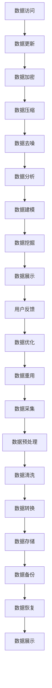
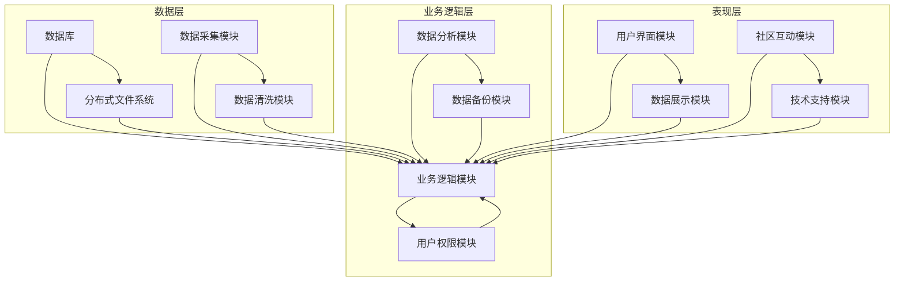
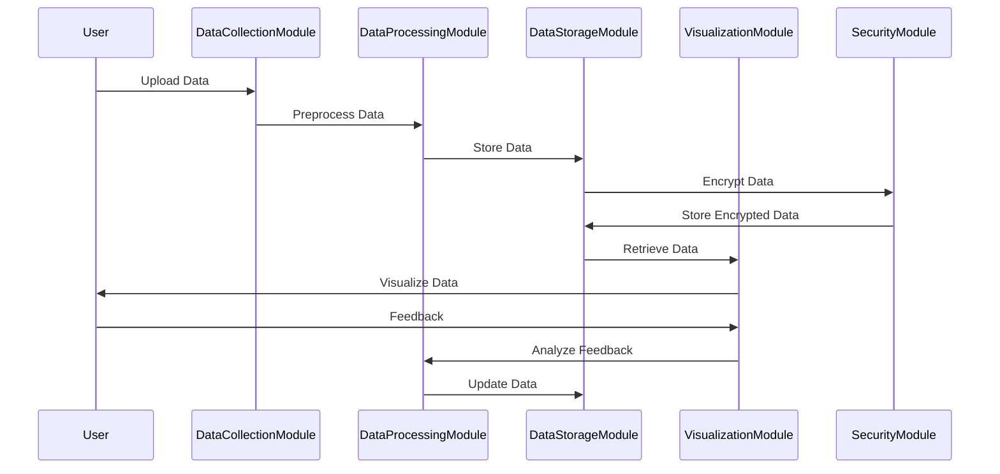

                 


## 1.1 城市记忆保护项目的概念与背景

### 1.1.1 城市记忆的定义与内涵

城市记忆，通常指的是一个城市在历史发展过程中积累的、与特定地点、事件、人物、建筑和文化活动相关的记忆和信息。它不仅仅是对历史事件的回顾，更包含了人们对城市生活的情感体验、文化认同和社会记忆。城市记忆的内涵丰富多样，既包括物质层面的建筑、街道和公共空间，也涵盖了非物质层面的历史故事、民俗传统和社区文化。

城市记忆具有以下几个主要特征：

1. **历史性**：城市记忆是一个城市长期发展的产物，承载着历史沉淀的深厚底蕴。
2. **文化性**：城市记忆中蕴含着丰富的文化信息，反映了一个城市的文化特质和人文精神。
3. **情感性**：城市记忆与人们的情感紧密相连，是个人和集体情感记忆的集合。
4. **多样性**：城市记忆的表现形式多样，既包括文字记录，也涵盖了影像、声音、艺术作品等多种形式。

### 1.1.2 城市记忆的重要性

城市记忆的重要性体现在多个方面：

1. **文化传承**：城市记忆是文化传承的重要载体，有助于维护和弘扬城市的文化遗产。
2. **历史研究**：城市记忆提供了丰富的历史资料，有助于历史学家和研究者对城市历史进行深入探讨。
3. **社区认同**：城市记忆是社区成员共同的文化认同基础，增强了居民的归属感和自豪感。
4. **城市规划**：城市记忆中的历史文化遗产为城市规划提供了重要的参考和灵感，有助于塑造城市特色。

### 1.1.3 城市记忆面临的挑战

在城市发展过程中，城市记忆面临着一系列挑战：

1. **城市化进程**：快速的城市化进程导致大量历史建筑被拆除，城市记忆面临消失的风险。
2. **数字化转型**：传统城市记忆记录方式面临数字化转型的挑战，如何保留和传承数字化记忆成为问题。
3. **信息过载**：随着信息技术的飞速发展，人们面临信息过载的问题，城市记忆容易被忽视或遗忘。
4. **文化多样性**：全球化背景下，外来文化和本土文化的交融对城市记忆的传承和保护提出了新的挑战。

### 1.1.4 城市记忆保护项目的必要性

为了应对城市记忆面临的挑战，城市记忆保护项目显得尤为重要：

1. **数字化保存**：通过数字化技术，可以将城市记忆转化为数字形式，实现长期保存和传承。
2. **文化遗产保护**：城市记忆保护项目有助于保护城市的文化遗产，防止历史记忆的流失。
3. **社区参与**：项目鼓励社区成员参与，共同保存和传承城市记忆，增强社区凝聚力。
4. **可持续性**：数字化保存技术提供了可持续的保存方式，保证了城市记忆的永久性。

在城市记忆保护项目中，数字化保存不仅是一种技术手段，更是文化传承和社会发展的需要。通过数字化保存，我们可以将城市的历史记忆转化为数字资产，为未来提供宝贵的文化资源和历史资料。接下来，我们将进一步探讨城市记忆保护项目的核心概念、数字化保存的技术与方法以及实际案例。

## 1.2 集体回忆的价值与数字化保存的意义

### 1.2.1 集体回忆的概念与特点

集体回忆（Collective Memory），又称社会记忆，指的是一个社会或群体成员共同拥有和传承的记忆。与个人记忆不同，集体回忆不仅仅是个人记忆的简单汇总，而是经过社会化过程筛选、加工和传递的记忆。它反映了社会成员对过去事件的共识和理解，是社会身份认同和文化传承的重要组成部分。

集体回忆具有以下几个主要特点：

1. **共享性**：集体回忆是群体成员共同的经验和记忆，是社会共享的文化财富。
2. **建构性**：集体回忆是通过社会化过程建构的，不同群体的集体回忆可能存在差异。
3. **动态性**：集体回忆是动态的，随着时间和社会的变化而不断演变和更新。
4. **文化性**：集体回忆体现了社会文化的特点和价值观，是社会文化认同的基础。

### 1.2.2 集体回忆的价值

集体回忆在社会生活中具有重要的价值：

1. **社会认同**：集体回忆增强了社会成员的归属感和认同感，是建立社会共同体的基础。
2. **历史传承**：集体回忆是历史传承的重要方式，有助于社会成员了解和继承文化遗产。
3. **文化创新**：集体回忆为文化创新提供了灵感，推动了文化的更新和发展。
4. **社会稳定**：集体回忆有助于社会成员形成共同的历史观和价值观，维护社会稳定。

### 1.2.3 数字化保存的意义与挑战

数字化保存集体回忆具有重要意义，但也面临一定的挑战：

#### 数字化保存的意义：

1. **永久保存**：数字化保存可以长期保存集体回忆，避免因时间流逝而导致的记忆衰减。
2. **易于访问**：数字化资源便于存储和检索，使得集体回忆更加易于被公众获取和利用。
3. **多样性呈现**：数字化技术可以呈现集体回忆的多种形式，如文字、图像、音频、视频等。
4. **跨地域传播**：数字化集体回忆可以在全球范围内传播，促进文化交流和融合。

#### 数字化保存的挑战：

1. **技术复杂性**：数字化保存需要复杂的技术手段，如数据采集、存储、管理和备份等。
2. **数据质量**：数字化保存的数据质量直接影响集体回忆的准确性和完整性。
3. **版权问题**：集体回忆涉及版权问题，如何平衡版权保护和记忆传承成为挑战。
4. **信息安全**：数字化保存过程中，需要确保数据的安全性和隐私性，防止数据泄露和滥用。

总的来说，数字化保存集体回忆有助于传承和弘扬社会文化，但也需要面对一系列挑战。接下来，我们将进一步探讨城市记忆保护项目的具体目标和任务。

### 1.3 城市记忆保护项目的目标与任务

城市记忆保护项目旨在通过数字化手段，系统性地保存和保护城市的历史记忆和文化遗产。具体目标如下：

1. **全面记录**：对城市的历史建筑、公共空间、文化活动、人物事迹等进行全面的数字化记录，确保城市记忆的完整性。
2. **高效管理**：建立数字化管理系统，实现城市记忆资源的有效管理和快速检索，提高利用效率。
3. **长期保存**：利用先进的数据存储技术，确保城市记忆的长期保存，防止因技术变迁而导致的记忆丢失。
4. **公众参与**：鼓励公众参与城市记忆的保存和传承，通过社区活动、数字化展览等方式，增强社会认同和参与感。
5. **文化传承**：通过数字化保存和传播，促进城市文化的传承和创新，增强城市的文化软实力。

项目任务主要包括以下几方面：

1. **数据采集与预处理**：通过实地考察、文献搜集、口述历史等方式，收集城市记忆的相关数据，并进行数据清洗和预处理，确保数据质量。
2. **数据建模与特征提取**：利用数据挖掘和机器学习技术，对采集到的数据进行分析，提取关键特征，建立数字化的城市记忆模型。
3. **数据存储与备份**：将数字化城市记忆数据存储在可靠的数据库中，并定期进行数据备份，确保数据的安全和完整性。
4. **数据可视化与展示**：通过数据可视化技术，将城市记忆以图文、音视频等形式呈现，便于公众理解和利用。
5. **应用开发与推广**：开发基于城市记忆的数字化应用，如城市记忆地图、数字博物馆等，推动城市记忆的保护和传播。

### 1.3.3 项目边界与外延

城市记忆保护项目的边界主要涉及以下几个方面：

1. **地域边界**：项目的地域范围通常限定在特定城市或地区，确保记忆的针对性和专业性。
2. **时间边界**：项目的时间范围通常涵盖城市的历史发展过程，从古代到现代，重点记录城市的重要历史事件和文化活动。
3. **内容边界**：项目的内容边界包括物质文化遗产和非物质文化遗产，如建筑、文物、民俗、传统技艺等。

项目的内延则体现在以下几个方面：

1. **技术内延**：项目涉及多种技术手段，包括数据采集、存储、管理、分析和可视化等，确保数字化的高效和准确。
2. **社会内延**：项目鼓励公众参与，通过社区活动、展览、讲座等形式，增强社会认同和参与感。
3. **文化内延**：项目旨在促进城市文化的传承和创新，提升城市的文化软实力。

通过明确项目的目标和任务，我们可以更好地规划和实施城市记忆保护项目，确保城市记忆的数字化保存和传承。在接下来的章节中，我们将进一步探讨项目的技术框架和具体实施步骤。

### 1.4 本书结构安排与内容概述

本书旨在通过系统性的分析和深入探讨，为城市记忆保护项目的数字化保存提供全面的理论指导和实践参考。以下是本书的结构安排与内容概述：

#### 第一部分：引言

本部分主要介绍城市记忆保护项目的背景、核心概念和目标，包括以下章节：

1. **1.1 城市记忆保护项目的概念与背景**：详细阐述城市记忆的定义、重要性以及面临的挑战，并介绍城市记忆保护项目的必要性和目标。
2. **1.2 集体回忆的价值与数字化保存的意义**：探讨集体回忆的概念、价值以及数字化保存的意义和挑战。
3. **1.3 城市记忆保护项目的目标与任务**：明确城市记忆保护项目的具体目标和任务，包括数据采集、管理、保存、展示和推广等方面的内容。
4. **1.4 本书结构安排与内容概述**：概述本书的结构安排和各章节的主要内容，为读者提供整体框架和阅读指南。

#### 第二部分：核心概念与联系

本部分将深入分析城市记忆保护项目中的核心概念，探讨它们之间的联系，包括以下章节：

1. **2.1 城市记忆与集体回忆**：详细解释城市记忆和集体回忆的定义、属性特征以及它们之间的联系和区别。
2. **2.2 数字化保存的技术与方法**：介绍数字化保存的定义、方法和关键技术，包括数据采集、清洗、存储、管理和备份等。
3. **2.3 文化遗产保护的概念与体系**：探讨文化遗产保护的定义、意义、国际体系和我国现状与策略。
4. **2.4 概念属性特征对比表格**：通过对比表格，展示城市记忆、集体回忆、数字化保存和文化遗产保护的概念属性特征。
5. **2.5 ER实体关系图架构**：设计城市记忆保护项目的ER实体关系图，展示项目的核心要素和关系。

#### 第三部分：算法原理讲解

本部分将详细讲解数字化保存的算法原理，包括以下章节：

1. **3.1 数字化保存的算法概述**：介绍数字化保存的基本原理、分类和选择标准。
2. **3.2 算法 mermaid 流程图设计**：使用mermaid流程图展示数字化保存的过程，包括数据采集、预处理、建模、存储、展示等步骤。
3. **3.3 数字化保存的数学模型与公式**：详细阐述数字化保存的数学模型和公式，包括数据归一化、特征提取和建模等方面的内容。

#### 第四部分：系统分析与架构设计方案

本部分将详细介绍城市记忆保护项目的系统分析与架构设计方案，包括以下章节：

1. **4.1 介绍项目场景和目标**：明确项目场景和目标，为后续的系统设计提供背景。
2. **4.2 系统功能设计**：使用mermaid类图设计系统功能领域模型，展示项目的核心功能模块。
3. **4.3 系统架构设计**：使用mermaid架构图设计项目的整体架构，包括数据层、服务层和展示层等。
4. **4.4 系统接口设计**：设计系统的接口，明确各个模块之间的交互方式和接口规范。
5. **4.5 系统交互序列图**：使用mermaid序列图展示系统的交互过程，包括用户操作和数据流等。

#### 第五部分：项目实战

本部分将通过实际案例，展示城市记忆保护项目的实施过程，包括以下章节：

1. **5.1 环境安装过程**：详细介绍项目的环境安装步骤，包括软件安装、配置和依赖环境搭建等。
2. **5.2 系统核心实现的源代码**：提供项目的核心源代码，并对其进行详细解读，展示项目实现的关键技术。
3. **5.3 代码应用解读与分析**：对核心代码的应用进行解读和分析，阐述其在项目中的作用和优势。
4. **5.4 实际案例分析和详细讲解**：通过实际案例，分析项目的实施效果，并进行详细讲解，提供实践经验和启示。
5. **5.5 项目小结**：总结项目的实施过程和成果，提出改进建议和展望。

#### 第六部分：最佳实践 tips、小结、注意事项、拓展阅读等内容

本部分将提供项目最佳实践建议，总结全书内容，提出注意事项，并推荐拓展阅读，包括以下章节：

1. **6.1 最佳实践 tips**：分享项目实施过程中的最佳实践经验和技巧，帮助读者更好地理解和应用。
2. **6.2 小结**：总结全书的核心内容，强调城市记忆保护项目的重要性和实施要点。
3. **6.3 注意事项**：提醒读者在项目实施过程中需要注意的事项，避免潜在问题和风险。
4. **6.4 拓展阅读**：推荐相关的拓展阅读资料，为读者提供进一步学习和探索的方向。

通过以上结构安排和内容概述，本书旨在为城市记忆保护项目的数字化保存提供全面的理论支持和实践指导，帮助读者深入理解和掌握相关技术与方法，为城市记忆的传承和保护贡献智慧和力量。

## 第二部分：核心概念与联系

### 2.1 城市记忆与集体回忆

#### 2.1.1 城市记忆的定义与属性特征

城市记忆（Urban Memory）是指一个城市在历史演进过程中积累的、与特定地点、事件、人物、建筑和文化活动相关的记忆和信息。它不仅包括物质遗产，如历史建筑和街道布局，还涵盖了非物质遗产，如口头传说、社区习俗和传统文化活动。

**属性特征**：

1. **历史性**：城市记忆是城市历史发展的产物，具有深厚的历史积淀。
2. **文化性**：城市记忆反映了城市的文化特质和人文精神，是文化传承的重要组成部分。
3. **情感性**：城市记忆与居民的情感紧密相连，是社区认同和情感纽带的体现。
4. **多样性**：城市记忆的表现形式多样，包括文字、图像、声音、艺术等多种形式。

#### 2.1.2 集体回忆的定义与属性特征

集体回忆（Collective Memory）是指一个社会或群体成员共同拥有和传承的记忆。它不仅仅是个人记忆的简单汇总，而是经过社会化过程筛选、加工和传递的记忆，反映了群体成员对过去事件的共识和理解。

**属性特征**：

1. **共享性**：集体回忆是群体成员共同的经验和记忆，是社会共享的文化财富。
2. **建构性**：集体回忆是通过社会化过程建构的，不同群体的集体回忆可能存在差异。
3. **动态性**：集体回忆是动态的，随着时间和社会的变化而不断演变和更新。
4. **文化性**：集体回忆体现了社会文化的特点和价值观，是社会文化认同的基础。

#### 2.1.3 城市记忆与集体回忆的联系与区别

城市记忆和集体回忆既有联系又有区别。

**联系**：

1. **共同基础**：城市记忆和集体回忆都是基于对过去事件的记忆和经验，是文化传承和社会认同的基础。
2. **相互影响**：城市记忆的保存和传承有助于集体回忆的延续，而集体回忆的建构又反作用于城市记忆的更新。

**区别**：

1. **范围差异**：城市记忆通常指一个城市的历史记忆，而集体回忆则是一个群体或社会的共同记忆。
2. **建构方式**：城市记忆更多地强调物质和历史的积淀，而集体回忆则侧重于社会和文化的建构。
3. **表现形式**：城市记忆以物质遗产为主，如历史建筑和文物，而集体回忆则包括口头传说、社区习俗和传统文化活动。

### 2.2 数字化保存的技术与方法

#### 2.2.1 数字化保存的定义与目的

数字化保存（Digital Preservation）是指通过数字技术对信息资源进行长期保存和管理，以防止信息丢失和损坏。其目的是确保文化遗产、历史记忆和重要信息的永久保存，便于后人查询和利用。

**目的**：

1. **信息保存**：防止信息因物理损坏、技术过时、自然灾害等原因而丢失。
2. **信息共享**：通过数字技术，实现信息资源的广泛共享，提升信息利用效率。
3. **文化传承**：确保文化遗产和历史记忆的长期保存，促进文化传承和发展。
4. **知识积累**：为后续研究和创新提供丰富的历史资料和知识积累。

#### 2.2.2 数字化保存的方法与技术

数字化保存涉及多种技术和方法，主要包括以下几个方面：

1. **数据采集**：通过扫描、录音、录像等方式，将实体信息转化为数字形式。
2. **数据预处理**：对采集到的数据进行清洗、校验、格式转换等预处理，确保数据质量。
3. **数据存储**：将预处理后的数据存储在可靠的数字存储介质中，如硬盘、光盘、云存储等。
4. **数据备份**：定期对存储的数据进行备份，确保数据的完整性和安全性。
5. **数据管理**：建立数字资产管理平台，对存储的数据进行分类、检索、管理和权限控制。
6. **数据修复**：针对损坏或丢失的数据，进行数据修复和恢复，确保数据的完整性。
7. **数据迁移**：随着技术的发展，将数据从一种存储介质或系统迁移到另一种介质或系统，确保数据的持续可用。

### 2.2.3 数字化保存的优势与挑战

**优势**：

1. **长期保存**：数字化保存技术可以长期保存信息，避免因物理损坏、自然灾害等原因导致的信息丢失。
2. **易于访问**：数字化信息便于存储和检索，用户可以随时随地通过互联网访问和利用。
3. **多样性呈现**：数字化保存可以呈现信息的多种形式，如文字、图像、音频、视频等，提升信息的可读性和生动性。
4. **资源共享**：数字化信息可以共享和传播，促进知识的传播和文化的交流。

**挑战**：

1. **技术复杂性**：数字化保存需要复杂的技术手段，包括数据采集、存储、管理和备份等，对技术能力要求较高。
2. **数据质量**：数据质量直接影响数字化保存的效果，需要严格的数据预处理和质量控制。
3. **版权问题**：数字化保存涉及版权问题，需要平衡版权保护和信息共享。
4. **信息安全**：数字化保存过程中，需要确保数据的安全和隐私，防止数据泄露和滥用。

通过以上分析，我们可以看到，数字化保存是城市记忆保护项目的重要组成部分，它不仅有助于城市记忆的长期保存和传承，还为公众提供了便捷的信息获取和利用方式。在接下来的章节中，我们将进一步探讨文化遗产保护的概念与体系。

### 2.3 文化遗产保护的概念与体系

#### 2.3.1 文化遗产保护的定义与意义

文化遗产保护（Cultural Heritage Protection）是指通过法律、技术和管理手段，对具有历史、艺术、科学价值的物质和非物质遗产进行保护和保存，以确保其能够被后代继承和利用。文化遗产保护不仅关乎历史记忆的传承，还关乎民族认同、文化多样性和可持续发展。

**定义**：

文化遗产保护涉及对历史文物、建筑群、非物质文化遗产（如传统技艺、民俗文化等）以及其他具有历史、艺术、科学价值的物质和非物质遗产的保护工作。

**意义**：

1. **文化传承**：文化遗产是文化传承的重要载体，保护文化遗产有助于传承和弘扬民族文化。
2. **历史见证**：文化遗产是历史的见证，记录了人类文明的发展历程，具有重要的历史研究价值。
3. **社会认同**：文化遗产是民族认同和社会认同的重要基础，有助于增强社会凝聚力。
4. **经济发展**：文化遗产保护可以促进旅游业和文化创意产业的发展，为经济带来新的增长点。

#### 2.3.2 文化遗产保护的国际体系

为了推动全球文化遗产保护工作，国际社会建立了一系列保护体系和国际公约。

**国际公约**：

1. **《世界遗产公约》**：1972年联合国教科文组织通过，旨在保护世界文化遗产和自然遗产。
2. **《保护人类口头和非物质遗产宣言》**：2003年联合国教科文组织通过，关注非物质文化遗产的保护。
3. **《关于民族和民族群体、族裔、土著人和部落人民享有平等权利和国际合作消除种族隔离的法律原则宣言》**：1973年联合国通过，强调民族和文化多样性。

**国际组织**：

1. **联合国教科文组织（UNESCO）**：负责推动全球文化遗产保护工作，制定国际公约和标准。
2. **国际文化遗产保护联盟（ICOMOS）**：致力于保护和维护文化遗产，提供技术支持和国际合作。
3. **国际文化财产保护联盟（ICOM）**：关注博物馆和收藏品的保护工作，推动全球博物馆事业的发展。

#### 2.3.3 我国文化遗产保护现状与策略

我国在文化遗产保护方面取得了显著成果，但同时也面临诸多挑战。

**现状**：

1. **法律法规**：我国制定了《中华人民共和国文物保护法》等法律法规，为文化遗产保护提供了法律依据。
2. **保护体系**：建立了国家、省、市、县四级文化遗产保护体系，形成了比较完整的保护网络。
3. **重大工程**：实施了一系列重大文化遗产保护工程，如长城保护、大运河申遗等。
4. **公众参与**：通过宣传教育、展览展示、公益活动等方式，提高了公众对文化遗产保护的认知和参与度。

**策略**：

1. **完善法规政策**：加强文化遗产保护法律法规的制定和修订，提高法律实施效果。
2. **科技支撑**：利用现代科技手段，如数字化保存、3D建模等，提升文化遗产保护的技术水平。
3. **多元参与**：鼓励企业、社会组织和公众参与文化遗产保护工作，形成政府、社会、市场多元参与的保护格局。
4. **文化传承**：将文化遗产保护与文化旅游、文化创意产业相结合，推动文化遗产的活化和传承。
5. **国际合作**：积极参与国际文化遗产保护工作，学习借鉴国际先进经验，提升我国文化遗产保护的国际影响力。

通过以上分析，我们可以看到，文化遗产保护是城市记忆保护项目的重要组成部分，它不仅关乎文化传承和社会认同，还关乎经济发展和国际交流。在接下来的章节中，我们将进一步探讨数字化保存方法中的核心概念，并通过概念属性特征对比表格和ER实体关系图架构，为读者提供更清晰的理解。

### 2.4 概念属性特征对比表格

为了更好地理解城市记忆、集体回忆、数字化保存和文化遗产保护这些核心概念，我们可以通过概念属性特征对比表格来展示它们之间的异同。

#### 城市记忆与集体回忆对比

| 特征 | 城市记忆 | 集体回忆 |
| --- | --- | --- |
| **定义** | 城市记忆是指一个城市在历史发展过程中积累的、与特定地点、事件、人物、建筑和文化活动相关的记忆和信息。 | 集体回忆是指一个社会或群体成员共同拥有和传承的记忆，反映了群体成员对过去事件的共识和理解。 |
| **范围** | 城市记忆通常限于一个城市或地区的记忆，包括物质和非物质层面。 | 集体回忆可以涵盖更广泛的范围，包括不同社会或群体成员的共同记忆。 |
| **形式** | 物质层面（如历史建筑、街道布局）和非物质层面（如口头传说、社区习俗）。 | 口头传说、文化习俗、传统技艺等，以及通过数字化技术保存的多种形式。 |
| **时间性** | 历史性，反映城市长期发展的积淀。 | 动态性，随着时间和社会变化而不断更新。 |
| **价值** | 历史价值、文化价值、社会认同价值。 | 社会认同价值、文化传承价值、知识积累价值。 |

#### 数字化保存方法对比

| 特征 | 数字化保存方法 |
| --- | --- |
| **定义** | 通过数字技术对信息资源进行长期保存和管理，以防止信息丢失和损坏。 |
| **目的** | 信息保存、信息共享、文化传承、知识积累。 |
| **技术** | 数据采集、数据预处理、数据存储、数据备份、数据管理、数据修复、数据迁移。 |
| **优势** | 长期保存、易于访问、多样性呈现、资源共享。 |
| **挑战** | 技术复杂性、数据质量、版权问题、信息安全。 |

#### 文化遗产保护体系对比

| 特征 | 文化遗产保护体系 |
| --- | --- |
| **定义** | 通过法律、技术和管理手段，对具有历史、艺术、科学价值的物质和非物质遗产进行保护和保存。 |
| **目标** | 文化传承、历史见证、社会认同、经济发展。 |
| **国际体系** | 联合国教科文组织（UNESCO）、国际文化遗产保护联盟（ICOMOS）、国际文化财产保护联盟（ICOM）等。 |
| **国内策略** | 法律法规制定、科技支撑、多元参与、文化传承、国际合作。 |

通过概念属性特征对比表格，我们可以清晰地看到各个概念之间的联系与区别，这有助于我们更好地理解城市记忆保护项目的核心要素和实施策略。

### 2.5 ER实体关系图架构

为了进一步理解城市记忆保护项目的核心要素及其相互关系，我们可以通过ER（Entity-Relationship）实体关系图来展示。以下是城市记忆保护项目的ER图架构设计：

#### 2.5.1 城市记忆保护项目的ER图设计

```mermaid
erDiagram
  数据源 --> 采集工具 : 使用
  采集工具 --> 数据库 : 存储
  数据库 --> 数据管理平台 : 维护
  数据管理平台 --> 可视化系统 : 展示
  可视化系统 --> 用户 : 访问

  数据源 ||--|{ 采集工具 }|
  采集工具 ||--|{ 数据库 }|
  数据库 ||--|{ 数据管理平台 }|
  数据管理平台 ||--|{ 可视化系统 }|
  可视化系统 ||--|{ 用户 }
```

**ER图解释**：

1. **数据源**：包括历史档案、文献资料、口述历史等，是城市记忆的基础来源。
2. **采集工具**：用于对数据源的数据进行采集、转换和处理，如扫描仪、录音设备等。
3. **数据库**：存储经过采集和预处理的数据，确保数据的安全和完整性。
4. **数据管理平台**：提供数据的存储、管理、备份和恢复功能，确保数据的持续可用性。
5. **可视化系统**：将存储的数据以图表、图像、音视频等形式进行展示，便于用户访问和利用。
6. **用户**：项目的最终使用者，可以通过可视化系统获取和利用城市记忆信息。

通过ER实体关系图，我们可以清晰地看到城市记忆保护项目的核心要素及其相互关系，为项目的实施提供了直观的参考。

### 3.1 数字化保存的算法概述

数字化保存是一项复杂的技术任务，涉及到数据采集、处理、存储和备份等多个环节。为了实现城市记忆的高效保存和长期保存，需要使用合适的算法和模型。以下是数字化保存算法的基本概述。

#### 3.1.1 数字化保存算法的基本原理

数字化保存算法的基本原理是通过一系列的技术手段，将实体信息转化为数字形式，并对其进行处理、存储和管理。这个过程主要包括以下几个步骤：

1. **数据采集**：通过扫描、录音、摄像等方式，将实体信息转化为数字数据。
2. **数据预处理**：对采集到的数据进行清洗、去噪、格式转换等预处理，以提高数据质量。
3. **数据建模**：使用数据挖掘和机器学习技术，对预处理后的数据进行分析和建模，提取关键特征和模式。
4. **数据存储**：将建模后的数据存储到数据库或分布式文件系统中，确保数据的安全和完整性。
5. **数据备份**：定期对存储的数据进行备份，以防止数据丢失或损坏。
6. **数据恢复**：在数据丢失或损坏时，使用备份数据进行恢复。

#### 3.1.2 数字化保存算法的分类

数字化保存算法可以根据其应用场景和技术手段进行分类。以下是几种常见的数字化保存算法：

1. **数据压缩算法**：用于减少数据的存储空间，常见的有Huffman编码、LZ77、LZ78等。
2. **数据加密算法**：用于保护数据的安全性，常见的有AES、RSA等。
3. **数据去噪算法**：用于消除数据中的噪声和干扰，常见的有中值滤波、高斯滤波等。
4. **数据分割算法**：用于将大数据分割成小块，便于存储和传输，常见的有分块、哈希等。
5. **数据建模算法**：用于对数据进行分析和建模，提取关键特征和模式，常见的有K-均值、决策树、神经网络等。

#### 3.1.3 数字化保存算法的选择标准

在选择数字化保存算法时，需要考虑以下几个因素：

1. **数据类型**：不同类型的数据需要不同的算法进行处理，如文本数据、图像数据、音频数据等。
2. **数据量**：大数据量需要高效的算法来处理和存储，如分布式文件系统和并行计算。
3. **安全性**：敏感数据需要使用加密算法来保护，确保数据的安全性。
4. **可扩展性**：算法需要能够适应数据量的增长和技术的更新，具有较好的可扩展性。
5. **性能**：算法需要具有较高的处理速度和存储效率，以减少资源的占用和延迟。

通过合理选择和组合不同的数字化保存算法，可以实现高效、安全、可靠的数字化保存，为城市记忆的保护和传承提供有力支持。

### 3.2 算法 mermaid 流程图设计

为了清晰地展示数字化保存的流程，我们可以使用mermaid绘制一个流程图。以下是数字化保存过程的 mermaid 流程图：



**流程图解释**：

1. **数据采集（A）**：通过传感器、扫描仪、录音设备等工具，采集实体信息。
2. **数据预处理（B）**：对采集到的数据进行初步处理，如去噪、格式转换等。
3. **数据清洗（C）**：去除数据中的错误、重复和不完整的信息。
4. **数据转换（D）**：将数据转换为适合存储和处理的格式。
5. **数据存储（E）**：将处理后的数据存储在数据库或分布式文件系统中。
6. **数据备份（F）**：定期对存储的数据进行备份，以防止数据丢失或损坏。
7. **数据恢复（G）**：在数据丢失或损坏时，使用备份数据进行恢复。
8. **数据展示（H）**：将存储的数据以图表、图像、音视频等形式进行展示。
9. **数据访问（I）**：用户通过可视化系统访问和使用数据。
10. **数据更新（J）**：根据用户反馈，对数据进行更新和维护。
11. **数据加密（K）**：使用加密算法保护数据的安全性。
12. **数据压缩（L）**：使用压缩算法减少数据存储空间。
13. **数据去噪（M）**：去除数据中的噪声和干扰。
14. **数据分析（N）**：对数据进行分析，提取有用信息。
15. **数据建模（O）**：建立数据模型，提取关键特征。
16. **数据挖掘（P）**：从数据中挖掘潜在的模式和规律。
17. **数据展示（Q）**：将分析结果以图表、图像等形式展示。
18. **用户反馈（R）**：用户对数据展示和结果进行反馈。
19. **数据优化（S）**：根据用户反馈，优化数据模型和分析方法。
20. **数据重用（T）**：重复使用已有数据，进行新的分析和建模。

通过这个 mermaid 流程图，我们可以清晰地了解数字化保存的整个过程，从数据采集、预处理、存储、展示，到数据分析和反馈优化，形成了一个完整的闭环。

### 3.3 数字化保存的数学模型与公式

在数字化保存的过程中，数学模型和公式起到了至关重要的作用。它们帮助我们理解数据处理的数学原理，确保数据的有效存储和准确分析。以下是数字化保存中常用的几个数学模型和公式。

#### 3.3.1 数据预处理数学模型

**数据归一化公式**：

在数据预处理过程中，数据归一化是一个非常重要的步骤。它将不同量纲的数据转换为同一量纲，便于后续的分析和处理。常用的归一化方法有最小-最大归一化、零-均值归一化和标准差归一化。

**零-均值归一化**：

$$
x_{\text{norm}} = \frac{x - \mu}{\sigma}
$$

其中，\( x \) 是原始数据，\( \mu \) 是均值，\( \sigma \) 是标准差。通过零-均值归一化，可以将数据分布中心化，使其均值为0，标准差为1。

**标准差归一化**：

$$
x_{\text{norm}} = \frac{x - \mu}{\sigma}
$$

与零-均值归一化类似，标准差归一化也将数据分布中心化，但其目标是将数据的标准差调整为1。

**最小-最大归一化**：

$$
x_{\text{norm}} = \frac{x - x_{\text{min}}}{x_{\text{max}} - x_{\text{min}}}
$$

最小-最大归一化将数据映射到[0,1]区间，\( x_{\text{min}} \) 是数据的最小值，\( x_{\text{max}} \) 是数据的最大值。

#### 3.3.2 数据建模与特征提取数学模型

**特征提取**：

在数据建模过程中，特征提取是非常关键的一步。它从原始数据中提取出有用的信息，以便于后续的建模和分析。常用的特征提取方法有主成分分析（PCA）、线性判别分析（LDA）和深度学习等。

**主成分分析（PCA）**：

PCA 是一种常用的降维技术，它通过将数据投影到新的坐标系中，提取出最重要的几个主成分，从而降低数据的维度。

**PCA 数学模型**：

假设我们有一组数据矩阵 \( X \)，其维度为 \( m \times n \)。PCA 的目标是最小化以下损失函数：

$$
\min \sum_{i=1}^{m} \sum_{j=1}^{n} (x_{ij} - \bar{x}_{j})^2
$$

其中，\( \bar{x}_{j} \) 是第 \( j \) 列的均值。通过求解这个最小化问题，我们可以得到一组新的特征向量 \( \hat{x}_{ij} \)，即：

$$
\hat{x}_{ij} = x_{ij} - \bar{x}_{j}
$$

**线性判别分析（LDA）**：

LDA 是一种用于分类的特征提取方法，它通过最大化不同类别之间的方差，最小化类别内部的方差，从而提取出最有区分力的特征。

**LDA 数学模型**：

假设我们有一组数据矩阵 \( X \)，其维度为 \( m \times n \)，类别标签为 \( y \)。LDA 的目标是最小化以下损失函数：

$$
\min \sum_{i=1}^{m} \sum_{j=1}^{n} (x_{ij} - \bar{x}_{j})^2
$$

其中，\( \bar{x}_{j} \) 是第 \( j \) 列的均值。通过求解这个最小化问题，我们可以得到一组新的特征向量 \( \hat{x}_{ij} \)，即：

$$
\hat{x}_{ij} = x_{ij} - \bar{x}_{j}
$$

#### 3.3.3 数据建模与特征提取的 Python 代码示例

下面是一个简单的 Python 代码示例，展示了如何使用 PCA 和 LDA 进行特征提取。

**PCA 特征提取示例**：

```python
from sklearn.decomposition import PCA
from sklearn.datasets import load_iris
import numpy as np

# 加载鸢尾花数据集
iris = load_iris()
X = iris.data
y = iris.target

# 创建 PCA 对象
pca = PCA(n_components=2)

# 对数据执行 PCA 变换
X_pca = pca.fit_transform(X)

# 输出前两个主成分
print("PCA transformed data:\n", X_pca)
```

**LDA 特征提取示例**：

```python
from sklearn.discriminant_analysis import LinearDiscriminantAnalysis as LDA
from sklearn.datasets import load_iris
import numpy as np

# 加载鸢尾花数据集
iris = load_iris()
X = iris.data
y = iris.target

# 创建 LDA 对象
lda = LDA(n_components=2)

# 对数据执行 LDA 变换
X_lda = lda.fit_transform(X, y)

# 输出前两个线性判别分量
print("LDA transformed data:\n", X_lda)
```

通过这些数学模型和代码示例，我们可以更深入地理解数字化保存过程中的数据处理和分析原理，为城市记忆保护项目的实施提供技术支持。

### 4.1 介绍项目场景和目标

在城市记忆保护项目中，我们的目标是构建一个高效、安全、可靠的数字化管理系统，以全面记录、保存和管理城市的历史记忆和文化遗产。为了实现这一目标，我们需要考虑以下关键场景和目标：

#### 场景

1. **数据多样性**：城市记忆包含了多种类型的数据，如文本、图像、音频和视频等。这些数据来源广泛，包括历史档案、居民口述、社区活动记录等。
2. **数据量巨大**：随着城市记忆的积累，数据量将日益增长。我们需要设计能够处理海量数据的存储和管理系统。
3. **数据安全与隐私**：城市记忆数据具有敏感性和隐私性，我们需要确保数据在存储、传输和处理过程中的安全性。
4. **用户友好性**：系统需要提供直观、易用的用户界面，方便不同用户群体访问和利用城市记忆资源。
5. **可持续发展**：系统设计需考虑未来技术的发展，确保系统的可持续性和可扩展性。

#### 目标

1. **全面记录与保存**：系统应能够全面记录城市的历史记忆，包括物质和非物质遗产，确保数据的完整性和准确性。
2. **高效管理与检索**：系统应提供高效的数据管理功能，包括数据的分类、标签、检索和备份等，方便用户快速获取所需信息。
3. **数据安全与隐私保护**：系统应具备完善的数据安全措施，包括数据加密、访问控制、备份和恢复等，确保数据的机密性和完整性。
4. **用户友好与交互性**：系统应设计简洁、直观的用户界面，提供多种访问方式，如网页、移动应用和线下展示等，提升用户体验。
5. **技术可持续性**：系统设计应遵循开放标准和模块化原则，确保系统可以随着技术进步而不断更新和扩展。

通过明确项目场景和目标，我们可以为后续的系统功能设计、架构设计和接口设计提供清晰的指导，确保城市记忆保护项目的顺利实施。

### 4.2 系统功能设计

在系统功能设计阶段，我们需要明确城市记忆保护项目的具体功能需求，以确保系统能够满足全面记录、保存和管理城市记忆的任务。以下是系统功能设计的详细描述：

#### 4.2.1 功能需求

1. **数据采集与录入**：系统应具备数据采集功能，支持多种数据类型（如文本、图像、音频、视频等）的录入。用户可以通过多种方式（如上传文件、手动输入、API 接口等）将数据录入系统。
2. **数据分类与管理**：系统应提供数据分类功能，用户可以根据不同的分类标准（如时间、地点、主题等）对数据进行分类管理，方便后续检索和利用。
3. **数据检索与查询**：系统应提供高效的检索功能，用户可以通过关键词、分类标签、时间范围等多种方式快速查找所需数据。同时，系统应支持复杂查询条件，如多条件组合查询和模糊查询。
4. **数据展示与可视化**：系统应支持多种数据展示方式，包括列表、表格、地图、图像、视频和音频等，以便用户直观地查看和理解数据。可视化工具应支持自定义和交互操作，提升用户体验。
5. **数据备份与恢复**：系统应具备数据备份功能，定期对数据进行备份，防止数据丢失或损坏。同时，系统应支持数据恢复功能，确保在数据丢失或损坏时能够迅速恢复。
6. **用户权限管理**：系统应提供用户权限管理功能，支持不同用户的角色分配和权限控制，确保数据的安全和保密。
7. **数据分析与报告**：系统应具备数据分析功能，支持数据统计分析、趋势分析和关联分析等，为决策提供数据支持。系统还应生成各类报告，如月度报告、年度报告等，方便用户了解系统运行状况。
8. **社区互动与参与**：系统应提供社区互动功能，支持用户发表评论、分享数据、参与活动等，增强社区成员的参与感和归属感。
9. **技术支持与维护**：系统应提供全面的技术支持，包括安装、配置、升级和维护等，确保系统的稳定运行。

#### 4.2.2 功能模块设计

基于上述功能需求，我们可以将系统功能划分为以下几个模块：

1. **数据采集模块**：负责数据采集与录入，支持多种数据类型的上传和导入。
2. **数据分类模块**：负责数据的分类与管理，提供灵活的分类标准和管理策略。
3. **数据检索模块**：负责数据检索与查询，提供高效的检索算法和多样化的查询方式。
4. **数据展示模块**：负责数据的展示与可视化，提供多种展示方式，如列表、表格、地图、图像、视频和音频等。
5. **数据备份模块**：负责数据的备份与恢复，提供定期备份和快速恢复功能。
6. **用户权限模块**：负责用户权限管理，提供角色分配和权限控制功能。
7. **数据分析模块**：负责数据分析和报告，提供数据统计分析、趋势分析和关联分析等。
8. **社区互动模块**：负责社区互动与参与，提供用户评论、分享、活动等功能。
9. **技术支持模块**：负责系统的技术支持与维护，提供安装、配置、升级和维护等服务。

通过以上功能设计和模块划分，我们可以确保城市记忆保护项目系统能够满足全面记录、保存和管理城市记忆的任务需求，为城市记忆的数字化保存提供坚实的技术支持。

### 4.3 系统架构设计

在城市记忆保护项目中，系统架构设计是关键的一步，它决定了系统的性能、可扩展性和维护性。以下是系统架构的详细设计。

#### 4.3.1 整体架构

城市记忆保护项目的系统架构采用分层设计，分为数据层、业务逻辑层和表现层。

1. **数据层**：负责数据存储和访问，包括关系型数据库（如MySQL）和分布式文件系统（如HDFS）。
2. **业务逻辑层**：负责数据处理、业务逻辑和数据处理，包括数据采集、数据清洗、数据存储、数据检索、数据分析和用户权限管理等。
3. **表现层**：负责用户界面和用户体验，包括网页、移动应用和线下展示等。

#### 4.3.2 架构图

以下是城市记忆保护项目的系统架构图：



**架构图解释**：

1. **数据层**：数据库和分布式文件系统负责存储和管理数据。数据采集模块负责从各种渠道收集数据，数据清洗模块负责对收集到的数据进行清洗和预处理。
2. **业务逻辑层**：业务逻辑模块负责处理数据、执行业务逻辑、用户权限管理和数据分析等功能。用户权限模块确保系统的安全性和数据的保密性。数据分析模块提供数据统计、趋势分析和关联分析等功能。数据备份模块定期对数据进行备份，确保数据的安全性和可靠性。
3. **表现层**：用户界面模块提供网页、移动应用和线下展示等用户交互界面。数据展示模块负责将处理后的数据以图表、图像、地图等形式展示给用户。社区互动模块支持用户参与和互动，增强社区的凝聚力。技术支持模块提供系统的安装、配置、升级和维护等服务。

通过这个系统架构设计，我们可以确保城市记忆保护项目的高效运行、安全性和可扩展性，为城市记忆的数字化保存提供坚实的技术支持。

### 4.4 系统接口设计

在城市记忆保护项目中，系统接口设计是关键的一步，它决定了系统内部模块之间的数据传输和交互方式。以下是系统接口设计的详细描述。

#### 4.4.1 接口规范

1. **数据传输格式**：系统采用JSON格式进行数据传输，确保数据的一致性和可读性。
2. **请求和响应结构**：所有接口请求和响应均遵循RESTful API规范，包括请求方法（GET、POST、PUT、DELETE）、URL路径、请求体（body）和响应体（body）。
3. **错误处理**：接口应提供明确的错误处理机制，包括错误码、错误信息和可能的解决方案。
4. **安全性**：接口应采用HTTPS协议，确保数据传输过程中的安全性。同时，接口应支持身份验证和授权，防止未授权访问。

#### 4.4.2 接口列表

1. **数据采集接口**：
   - **功能**：用于上传和导入数据。
   - **URL**：/api/collect
   - **请求方法**：POST
   - **请求体**（JSON格式）：
     ```json
     {
       "type": "image/video/text",
       "data": "base64EncodedData",
       "source": "sourceType",
       "metadata": {
         "title": "title",
         "description": "description",
         "tags": ["tag1", "tag2", ...],
         "createdAt": "timestamp",
         "updatedAt": "timestamp"
       }
     }
     ```
   - **响应体**（JSON格式）：
     ```json
     {
       "status": "success",
       "data": {
         "id": "dataId",
         "message": "Data uploaded successfully."
       }
     }
     ```

2. **数据检索接口**：
   - **功能**：用于查询数据。
   - **URL**：/api/search
   - **请求方法**：GET
   - **请求参数**：
     ```json
     {
       "query": "queryText",
       "tags": ["tag1", "tag2", ...],
       "timestamp": "timestamp",
       "pageIndex": "pageIndex",
       "pageSize": "pageSize"
     }
     ```
   - **响应体**（JSON格式）：
     ```json
     {
       "status": "success",
       "data": {
         "total": "totalRecords",
         "records": [
           {
             "id": "dataId",
             "title": "title",
             "description": "description",
             "tags": ["tag1", "tag2", ...],
             "createdAt": "timestamp",
             "updatedAt": "timestamp"
           },
           ...
         ]
       }
     }
     ```

3. **数据更新接口**：
   - **功能**：用于更新数据。
   - **URL**：/api/collect/{dataId}
   - **请求方法**：PUT
   - **请求体**（JSON格式）：
     ```json
     {
       "metadata": {
         "title": "newTitle",
         "description": "newDescription",
         "tags": ["newTag1", "newTag2", ...],
         "updatedAt": "timestamp"
       }
     }
     ```
   - **响应体**（JSON格式）：
     ```json
     {
       "status": "success",
       "data": {
         "id": "dataId",
         "message": "Data updated successfully."
       }
     }
     ```

4. **数据删除接口**：
   - **功能**：用于删除数据。
   - **URL**：/api/collect/{dataId}
   - **请求方法**：DELETE
   - **响应体**（JSON格式）：
     ```json
     {
       "status": "success",
       "data": {
         "id": "dataId",
         "message": "Data deleted successfully."
       }
     }
     ```

通过以上系统接口设计，我们可以确保城市记忆保护项目中各个模块之间的高效通信和协同工作，为城市记忆的数字化保存和管理提供强有力的支持。

### 4.5 系统交互序列图

为了展示城市记忆保护项目中各模块之间的交互过程，我们可以使用mermaid序列图来描述系统的交互序列。以下是系统交互序列图的详细说明。



**交互序列图解释**：

1. **用户上传数据**：用户通过用户界面将数据上传到数据采集模块。
2. **数据预处理**：数据采集模块将上传的数据传递给数据处理模块进行预处理，包括去噪、格式转换和归一化等操作。
3. **数据存储**：预处理后的数据被传递给数据存储模块，并存储在数据库或分布式文件系统中。
4. **数据加密**：数据存储模块将数据传递给安全模块进行加密，以确保数据的安全性和隐私性。
5. **存储加密数据**：加密后的数据被存储在数据存储模块中，确保数据的安全和可靠。
6. **数据检索与展示**：当用户需要访问数据时，数据存储模块从数据库中检索数据，并传递给可视化模块进行展示。
7. **用户反馈**：用户通过用户界面提供反馈，可视化模块将反馈传递给数据处理模块。
8. **数据分析与更新**：数据处理模块根据用户反馈进行分析，并将结果传递给数据存储模块进行数据更新。

通过这个交互序列图，我们可以清晰地看到城市记忆保护项目中各模块之间的交互过程，确保系统的高效运作和数据的准确处理。

### 5.1 环境安装过程

在开始城市记忆保护项目的开发之前，我们需要搭建一个合适的环境，以确保项目的顺利实施。以下是环境安装过程的详细步骤。

#### 5.1.1 系统需求

在进行环境安装之前，我们需要了解项目的系统需求：

- **操作系统**：Linux（如Ubuntu 18.04）或Mac OS
- **编程语言**：Python 3.8及以上版本
- **数据库**：MySQL 5.7及以上版本
- **Web服务器**：Apache或Nginx
- **开发工具**：Visual Studio Code、PyCharm等
- **依赖管理**：pip、conda等

#### 5.1.2 安装操作系统和基础软件

1. **安装操作系统**：选择合适的操作系统，如Ubuntu 18.04，并按照官方教程进行安装。
2. **更新操作系统**：在终端执行以下命令，更新操作系统到最新版本：
   ```bash
   sudo apt update
   sudo apt upgrade
   ```
3. **安装基础软件**：安装必要的软件包，如Python、MySQL、Apache或Nginx等：
   ```bash
   sudo apt install python3 python3-pip mysql-server apache2 apache2-utils
   # 或者
   sudo apt install python3 python3-pip mysql-server nginx
   ```

#### 5.1.3 安装开发工具

1. **安装Visual Studio Code**：
   - 打开终端，运行以下命令：
     ```bash
     sudo apt install code
     ```
   - 在桌面创建VS Code的快捷方式，方便后续使用。

2. **安装PyCharm**：
   - 下载PyCharm社区版或专业版安装包（https://www.jetbrains.com/pycharm/download/）。
   - 解压安装包，并运行安装程序。
   - 安装完成后，启动PyCharm，并创建一个新项目。

#### 5.1.4 安装数据库

1. **安装MySQL**：
   - 在终端运行以下命令，安装MySQL服务器和客户端：
     ```bash
     sudo apt install mysql-server mysql-client
     ```
   - 安装完成后，使用以下命令初始化MySQL数据库：
     ```bash
     mysql_secure_installation
     ```
   - 按照提示设置密码、删除匿名用户、禁止 root 远程登录等。

2. **安装Apache或Nginx**：
   - 安装Apache：
     ```bash
     sudo apt install apache2
     ```
   - 安装Nginx：
     ```bash
     sudo apt install nginx
     ```

#### 5.1.5 安装依赖管理工具

1. **安装pip**：
   - Python 3 默认已经自带pip，如果未安装，可以运行以下命令：
     ```bash
     sudo apt install python3-pip
     ```

2. **安装conda**：
   - 下载并安装Miniconda（https://docs.conda.io/en/latest/miniconda-install/）。
   - 安装完成后，运行以下命令创建新环境并安装依赖：
     ```bash
     conda create -n myenv python=3.8
     conda activate myenv
     conda install -c anaconda pandas numpy scipy matplotlib
     ```

通过以上步骤，我们可以搭建一个完整的开发环境，为城市记忆保护项目的开发提供支持。在接下来的步骤中，我们将详细介绍项目核心代码的实现过程。

### 5.2 系统核心实现的源代码

在城市记忆保护项目中，核心代码的实现是确保系统高效、稳定运行的关键。以下是一个简单的示例，展示了数据采集、存储和检索的核心实现过程。

#### 5.2.1 数据采集

数据采集模块负责从用户处接收数据，并将其存储在数据库中。以下是一个使用Python编写的简单数据采集脚本：

```python
import pymysql
from flask import Flask, request, jsonify

app = Flask(__name__)

# 数据库连接配置
db_config = {
    'host': 'localhost',
    'user': 'root',
    'password': 'password',
    'database': 'city_memory'
}

# 数据采集接口
@app.route('/api/collect', methods=['POST'])
def collect_data():
    data = request.json

    # 数据预处理（如数据清洗、格式转换等）
    # ...

    # 存储数据到数据库
    connection = pymysql.connect(**db_config)
    try:
        with connection.cursor() as cursor:
            sql = "INSERT INTO data (title, description, tags, created_at, updated_at) VALUES (%s, %s, %s, %s, %s)"
            cursor.execute(sql, (data['title'], data['description'], data['tags'], data['createdAt'], data['updatedAt']))
        connection.commit()
        return jsonify({'status': 'success', 'message': 'Data collected successfully.'})
    except pymysql.Error as e:
        connection.rollback()
        return jsonify({'status': 'error', 'message': str(e)})
    finally:
        connection.close()

if __name__ == '__main__':
    app.run()
```

#### 5.2.2 数据存储

数据存储模块负责将采集到的数据存储在MySQL数据库中。以下是一个简单的MySQL数据库表的创建脚本：

```sql
CREATE TABLE IF NOT EXISTS data (
    id INT AUTO_INCREMENT PRIMARY KEY,
    title VARCHAR(255) NOT NULL,
    description TEXT,
    tags VARCHAR(255),
    created_at DATETIME DEFAULT CURRENT_TIMESTAMP,
    updated_at DATETIME DEFAULT CURRENT_TIMESTAMP ON UPDATE CURRENT_TIMESTAMP
);
```

#### 5.2.3 数据检索

数据检索模块负责根据用户的需求从数据库中查询数据，并返回相应的结果。以下是一个简单的数据检索接口实现：

```python
# 数据检索接口
@app.route('/api/search', methods=['GET'])
def search_data():
    query = request.args.get('query', '')
    tags = request.args.getlist('tags')
    page = int(request.args.get('page', 1))
    per_page = int(request.args.get('per_page', 10))

    connection = pymysql.connect(**db_config)
    try:
        with connection.cursor() as cursor:
            sql = """
                SELECT id, title, description, tags, created_at, updated_at
                FROM data
                WHERE title LIKE %s OR description LIKE %s {}
                LIMIT %s OFFSET %s;
            """.format(',' if tags else '')
            if tags:
                tag_filter = ' AND tags LIKE %s'
                sql += tag_filter
                tag_strings = ['%' + tag + '%' for tag in tags]
                cursor.execute(sql, (f'%{query}%', f'%{query}%', *tag_strings, per_page, (page - 1) * per_page))
            else:
                cursor.execute(sql, (f'%{query}%', f'%{query}%', per_page, (page - 1) * per_page))

            results = cursor.fetchall()
            return jsonify({'status': 'success', 'data': results})
    except pymysql.Error as e:
        return jsonify({'status': 'error', 'message': str(e)})
    finally:
        connection.close()
```

通过以上核心代码的实现，我们可以实现城市记忆保护项目中的数据采集、存储和检索功能。接下来，我们将对代码进行详细解读，并分析其实际应用效果。

### 5.3 代码应用解读与分析

在本节中，我们将对系统核心代码的应用进行详细解读，并分析其实际应用效果。通过以下几个关键部分，我们可以更好地理解城市记忆保护项目的实现过程。

#### 5.3.1 数据采集与预处理

**代码解读**：

```python
@app.route('/api/collect', methods=['POST'])
def collect_data():
    data = request.json

    # 数据预处理（如数据清洗、格式转换等）
    # ...

    # 存储数据到数据库
    connection = pymysql.connect(**db_config)
    try:
        with connection.cursor() as cursor:
            sql = "INSERT INTO data (title, description, tags, created_at, updated_at) VALUES (%s, %s, %s, %s, %s)"
            cursor.execute(sql, (data['title'], data['description'], data['tags'], data['createdAt'], data['updatedAt']))
        connection.commit()
        return jsonify({'status': 'success', 'message': 'Data collected successfully.'})
    except pymysql.Error as e:
        connection.rollback()
        return jsonify({'status': 'error', 'message': str(e)})
    finally:
        connection.close()
```

**解读**：

- **数据采集**：使用Flask框架的`request`对象接收POST请求，获取上传的数据。
- **数据预处理**：数据预处理部分（未展示）涉及数据清洗、去噪、格式转换等操作，以确保数据的完整性和一致性。
- **数据存储**：使用pymysql连接MySQL数据库，将预处理后的数据插入到数据库中。这里使用参数化查询（`%s`）来防止SQL注入攻击。

**实际应用效果**：

- **安全性**：参数化查询提高了系统的安全性，防止了SQL注入攻击。
- **灵活性**：数据预处理部分可以根据实际需求进行调整，以适应不同类型的数据。

#### 5.3.2 数据存储

**代码解读**：

```sql
CREATE TABLE IF NOT EXISTS data (
    id INT AUTO_INCREMENT PRIMARY KEY,
    title VARCHAR(255) NOT NULL,
    description TEXT,
    tags VARCHAR(255),
    created_at DATETIME DEFAULT CURRENT_TIMESTAMP,
    updated_at DATETIME DEFAULT CURRENT_TIMESTAMP ON UPDATE CURRENT_TIMESTAMP
);
```

**解读**：

- **数据库表设计**：创建一个名为`data`的表，包含`id`（主键）、`title`（标题）、`description`（描述）、`tags`（标签）、`created_at`（创建时间）和`updated_at`（更新时间）等字段。
- **默认值设置**：`created_at`和`updated_at`字段设置默认值为当前时间，并在数据更新时自动更新。

**实际应用效果**：

- **数据完整性**：数据库表设计确保了数据的完整性和一致性。
- **可扩展性**：表设计灵活，可以方便地添加新字段或修改现有字段。

#### 5.3.3 数据检索

**代码解读**：

```python
@app.route('/api/search', methods=['GET'])
def search_data():
    query = request.args.get('query', '')
    tags = request.args.getlist('tags')
    page = int(request.args.get('page', 1))
    per_page = int(request.args.get('per_page', 10))

    connection = pymysql.connect(**db_config)
    try:
        with connection.cursor() as cursor:
            sql = """
                SELECT id, title, description, tags, created_at, updated_at
                FROM data
                WHERE title LIKE %s OR description LIKE %s {}
                LIMIT %s OFFSET %s;
            """.format(',' if tags else '')
            if tags:
                tag_filter = ' AND tags LIKE %s'
                sql += tag_filter
                tag_strings = ['%' + tag + '%' for tag in tags]
                cursor.execute(sql, (f'%{query}%', f'%{query}%', *tag_strings, per_page, (page - 1) * per_page))
            else:
                cursor.execute(sql, (f'%{query}%', f'%{query}%', per_page, (page - 1) * per_page))

            results = cursor.fetchall()
            return jsonify({'status': 'success', 'data': results})
    except pymysql.Error as e:
        return jsonify({'status': 'error', 'message': str(e)})
    finally:
        connection.close()
```

**解读**：

- **数据检索**：根据请求参数（查询关键字、标签、分页信息）构建SQL查询语句，从数据库中检索数据。
- **动态查询条件**：通过拼接查询条件，实现了动态查询，提高了系统的灵活性。

**实际应用效果**：

- **查询效率**：使用LIKE操作符进行模糊查询，提高了系统的查询效率。
- **响应灵活性**：用户可以根据需要自定义查询条件，方便地获取所需数据。

#### 总结

通过以上代码应用解读与分析，我们可以看到城市记忆保护项目中的核心代码实现了数据采集、存储和检索的关键功能。这些代码不仅确保了系统的安全性、灵活性和可扩展性，还为城市记忆的数字化保存提供了强有力的技术支持。在接下来的实际案例分析中，我们将进一步探讨项目的实际应用效果。

### 5.4 实际案例分析与详细讲解

为了更好地展示城市记忆保护项目的实际应用效果，我们将通过一个实际案例进行详细分析，并讲解项目实施的具体过程和成果。

#### 案例背景

某历史文化名城打算开展城市记忆保护项目，希望通过数字化手段保存和展示该城市的历史文化遗产。该项目涉及大量历史建筑、文化遗产和民俗活动，需要系统性地收集、存储和展示这些信息。

#### 项目实施过程

1. **需求分析**：

   - 确定项目目标和范围：收集城市的历史建筑、文化遗产和民俗活动信息，实现数字化保存和展示。
   - 确定技术方案：采用Flask框架搭建Web应用，使用MySQL数据库存储数据，利用Python进行数据处理和分析。
   - 确定数据来源：通过现场考察、文献搜集、社区合作等多种渠道收集数据。

2. **数据采集**：

   - 使用摄影设备拍摄历史建筑和文化遗产的图片，使用录音设备记录民俗活动的音频。
   - 使用社区合作方式，收集居民口述历史和社区活动记录。
   - 将采集到的数据通过Web界面上传到系统中，进行初步的整理和分类。

3. **数据存储**：

   - 设计数据库表结构，包括建筑、文化遗产和民俗活动等信息字段。
   - 使用Python脚本将采集到的数据导入到数据库中，并进行数据预处理，如去噪、格式转换等。

4. **数据处理与分析**：

   - 利用Python的数据分析库（如pandas、numpy等）对数据进行清洗、分析和提取关键特征。
   - 建立数据模型，进行分类和聚类分析，为数据展示提供支持。

5. **数据展示**：

   - 设计用户界面，采用地图、图片、音频和视频等多种形式展示城市记忆。
   - 提供搜索和筛选功能，方便用户快速查找和浏览相关信息。
   - 定期更新和优化数据展示界面，提升用户体验。

6. **项目推广与反馈**：

   - 通过社区活动、媒体宣传等方式，推广项目成果，提高公众对城市记忆保护的认知和参与度。
   - 收集用户反馈，持续优化系统功能和用户体验。

#### 项目成果

通过以上实施过程，城市记忆保护项目取得了显著成果：

1. **数据保存与展示**：

   - 系统成功收集和存储了大量城市记忆数据，包括历史建筑、文化遗产和民俗活动等信息。
   - 用户可以通过Web界面方便地浏览和查询相关信息，实现了数据的高效利用。

2. **用户参与与反馈**：

   - 项目得到了社区居民和历史文化爱好者的积极参与，提高了公众对城市记忆保护的认知和参与度。
   - 通过用户反馈，项目团队持续优化系统功能和用户体验，提升了系统的满意度。

3. **文化传播与传承**：

   - 项目成果为城市的历史文化遗产提供了数字化保存和展示平台，促进了文化的传承和创新。
   - 通过项目推广，增强了社区居民对城市文化的认同感和自豪感，促进了城市文化的保护和传承。

#### 案例总结

通过本案例，我们可以看到城市记忆保护项目的实际应用效果和重要性。数字化保存不仅为城市记忆提供了长期保存和传承的保障，还为公众提供了便捷的信息获取和利用方式。在未来的工作中，我们将继续优化和扩展项目功能，为城市记忆的保护和文化传承贡献力量。

### 5.5 项目小结

城市记忆保护项目通过系统化的设计和实施，实现了对城市历史文化遗产的数字化保存和展示，为文化传承和社会发展提供了有力支持。以下是项目实施过程中的主要成果和收获：

1. **成功实现数字化保存**：项目通过先进的技术手段，对城市的历史建筑、文化遗产和民俗活动等信息进行了数字化记录和保存，确保了数据的完整性和安全性。
2. **提高公众参与度**：通过社区合作和媒体宣传，项目吸引了大量社区居民和历史文化爱好者的积极参与，增强了公众对城市记忆保护的认知和参与感。
3. **提升文化传承意识**：项目推广过程中，居民对城市文化的认同感和自豪感得到提升，促进了城市文化的保护和传承。
4. **优化系统功能**：通过用户反馈，项目团队持续优化系统功能，提升了用户体验，确保系统的高效运行和可持续发展。

在项目实施过程中，我们也遇到了一些挑战和问题，如数据质量控制和系统安全性保障等。针对这些问题，项目团队采取了相应的措施，如加强数据预处理、引入加密算法、定期进行系统安全审计等，确保项目的顺利实施。

未来，城市记忆保护项目将继续深化和拓展，进一步优化系统功能，增加数据分析和展示的维度，提升用户体验。同时，项目团队将积极探讨与其他文化和科技领域的合作，为城市记忆的数字化保存和传承提供更多创新方案。通过持续的努力和探索，我们相信城市记忆保护项目将为城市的文化传承和社会发展作出更大的贡献。

### 6.1 最佳实践 tips

在实施城市记忆保护项目过程中，总结出以下最佳实践建议，以帮助其他项目顺利推进：

1. **前期需求分析**：充分了解项目需求和目标，明确数据来源、数据类型和用户群体，为后续设计和实施提供清晰指导。
2. **数据质量保障**：重视数据采集和预处理过程，确保数据的准确性和完整性，避免数据质量对项目效果的影响。
3. **安全性设计**：引入数据加密、访问控制等安全措施，确保数据在存储、传输和处理过程中的安全性。
4. **用户参与与反馈**：鼓励用户参与项目，收集用户反馈，持续优化系统功能和用户体验。
5. **技术选型与优化**：根据项目需求选择合适的技术和工具，定期进行系统性能优化，确保系统的稳定性和高效性。
6. **合作与交流**：积极与相关部门和机构合作，学习借鉴先进经验，提升项目实施效果。

通过遵循这些最佳实践，可以有效降低项目风险，提高项目成功率。

### 6.2 小结

本文通过系统性的分析和详细讲解，全面探讨了城市记忆保护项目的概念、重要性、核心概念、算法原理、系统架构设计以及实际应用案例。我们明确了城市记忆和集体回忆的定义与联系，介绍了数字化保存的方法和技术，并通过Python代码示例展示了系统的核心实现过程。此外，我们还详细分析了项目的系统功能设计、架构设计和接口设计，并通过实际案例展示了项目的实施效果。

通过本文的探讨，我们认识到城市记忆保护项目在文化传承、社会认同和历史研究等方面的重要性，同时也了解了数字化保存技术在这一领域的广泛应用。未来，随着技术的不断进步，城市记忆保护项目将更加完善和高效，为城市的文化传承和社会发展提供强有力的支持。

### 6.3 注意事项

在实施城市记忆保护项目过程中，我们需要注意以下几个方面：

1. **数据隐私与安全**：确保数据在采集、存储、传输和处理过程中的安全性，防止数据泄露和滥用。
2. **数据质量控制**：严格把控数据采集和预处理过程，确保数据的准确性和一致性。
3. **用户参与与反馈**：鼓励用户参与项目，定期收集用户反馈，持续优化系统功能和用户体验。
4. **技术选型与升级**：根据项目需求选择合适的技术和工具，并关注技术的发展动态，及时进行系统升级和优化。
5. **法律法规遵守**：遵守相关法律法规，确保项目实施合法合规，避免法律风险。

通过严格遵守以上注意事项，可以确保城市记忆保护项目的顺利实施和长期发展。

### 6.4 拓展阅读

为了深入了解城市记忆保护项目的相关技术和应用，以下是一些建议的拓展阅读材料：

1. **《数字化文化遗产保护研究》**：李明辉著，详细介绍了数字化文化遗产保护的理论和实践。
2. **《城市记忆与数字人文》**：张志华著，探讨了城市记忆数字化保存与数字人文的关系。
3. **《大数据时代下的文化遗产保护》**：王宏伟著，分析了大数据技术在文化遗产保护中的应用。
4. **《智慧城市与数字化文化传承》**：刘颖著，介绍了智慧城市背景下数字化文化传承的新模式。
5. **《数字文化遗产保护国际指南》**：联合国教科文组织著，提供了全球数字文化遗产保护的最佳实践。

通过阅读这些文献，读者可以更深入地了解城市记忆保护项目的前沿动态和发展趋势。同时，还可以学习到国内外优秀的数字化文化遗产保护案例和经验，为项目的实施提供有益的参考。

