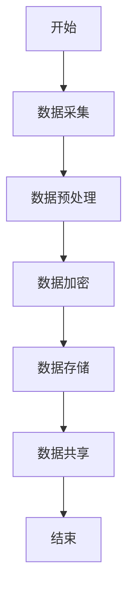
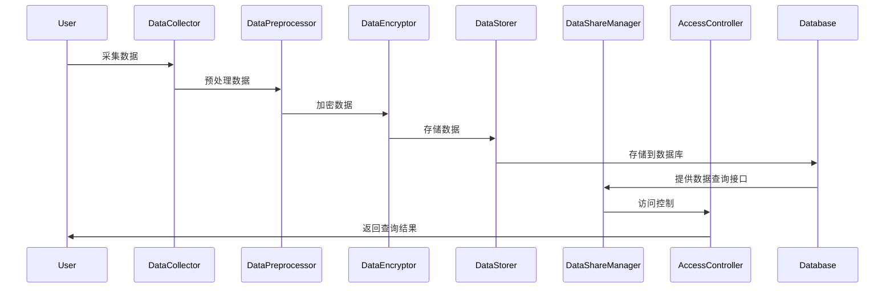
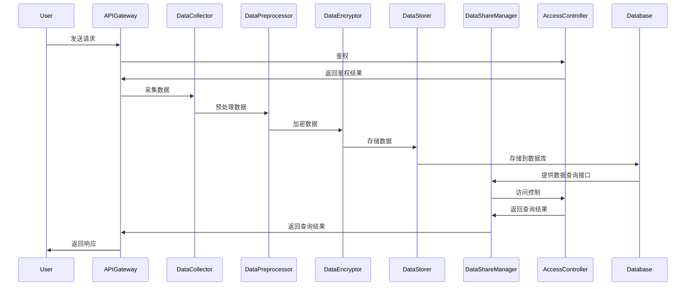

                 

### 《城市记忆档案馆：集体回忆的数字化保存计划》

#### 关键词：城市记忆、数字化保存、集体回忆、系统架构、算法原理

> 摘要：本文深入探讨了城市记忆档案馆的建立及其重要性，详细阐述了集体回忆数字化保存计划的必要性。文章从核心概念入手，逐步展开对数字化保存技术的解析，包括算法原理、系统架构设计以及实际应用案例。通过系统的分析与架构设计方案，本文旨在为实施数字化保存计划提供实用的指导，并提醒读者关注实施过程中可能遇到的问题。

#### 目录

##### 第一部分：引言

1.1 问题背景与核心概念
1.1.1 城市记忆的定义与重要性
1.1.2 集体回忆的数字化保存意义
1.1.3 数字化保存的挑战与解决方案
1.1.4 边界与外延
1.1.5 概念结构与核心要素组成

##### 第二部分：核心概念与联系

2.1 核心概念原理
2.1.1 城市记忆
2.1.2 数字化保存
2.1.3 集体回忆
2.2 概念属性特征对比表格
2.3 ER实体关系图架构

##### 第三部分：算法原理讲解

3.1 算法Mermaid流程图
3.2 Python源代码
3.3 数学模型和公式
3.4 举例说明

##### 第四部分：系统分析与架构设计方案

4.1 问题场景介绍
4.2 项目介绍
4.3 系统功能设计（领域模型Mermaid类图）
4.4 系统架构设计Mermaid架构图
4.5 系统接口设计和系统交互Mermaid序列图

##### 第五部分：项目实战

5.1 环境安装
5.2 系统核心实现源代码
5.3 代码应用解读与分析
5.4 实际案例分析和详细讲解剖析
5.5 项目小结

##### 第六部分：最佳实践与拓展

6.1 最佳实践 tips
6.2 小结
6.3 注意事项
6.4 拓展阅读

#### 1.1 问题背景与核心概念

在当今信息化社会，随着科技的飞速发展，城市记忆的重要性日益凸显。城市记忆不仅记录了一个城市的历史文化、社会变迁和人民生活，更是传承和弘扬民族精神的重要载体。然而，传统的城市记忆保存方式面临着诸多挑战，如数据丢失、损坏、无法共享等。因此，数字化保存计划应运而生，旨在通过现代信息技术手段，对城市记忆进行系统化、标准化和可持续的保存。

**1.1.1 城市记忆的定义与重要性**

城市记忆是指一个城市在长期发展过程中积累的历史、文化、社会、经济等方面的信息。它不仅包括物质文化遗产，如历史建筑、遗址、文物等，还包括非物质文化遗产，如民俗、传统技艺、历史故事等。城市记忆是一个城市的灵魂，它承载着城市的历史、文化和精神，是城市发展的根基。

城市记忆的重要性体现在多个方面。首先，它是城市历史和文化传承的重要依据，有助于后代了解和继承城市的历史和文化。其次，它是城市规划和建设的重要参考，有助于制定符合城市特点的发展策略。最后，它是城市特色和竞争力的体现，有助于提升城市形象和吸引力。

**1.1.2 集体回忆的数字化保存意义**

集体回忆是指一个群体在共同生活过程中形成的共同记忆。它是一个群体身份认同和文化传承的重要基础。随着城市化进程的加快，许多集体回忆正逐渐消失，这使得集体回忆的数字化保存变得尤为重要。

数字化保存集体回忆的意义主要体现在以下几个方面：

1. **保护文化遗产**：数字化保存可以有效地保护集体回忆中的文化遗产，避免因自然损耗或人为破坏而造成的损失。
   
2. **促进资源共享**：数字化保存使得集体回忆可以跨地区、跨时间地进行共享，有助于增强群体的凝聚力和社会认同感。

3. **提升城市文化软实力**：集体回忆的数字化保存有助于提升城市的文化软实力，增强城市的竞争力和吸引力。

**1.1.3 数字化保存的挑战与解决方案**

数字化保存计划虽然具有巨大的潜在价值，但在实施过程中也面临着诸多挑战：

1. **数据安全与隐私保护**：数字化保存涉及大量的个人信息和敏感数据，如何确保数据的安全和隐私是一个重要问题。
   
2. **数据存储与传输**：随着数据量的不断增加，如何高效地存储和传输数据成为一大挑战。

3. **数据质量与标准化**：数字化保存的数据质量直接影响其应用价值，因此需要制定统一的数据标准和质量评估体系。

为了应对这些挑战，我们可以采取以下解决方案：

1. **采用先进的数据加密技术**：通过加密技术确保数据在传输和存储过程中的安全性。

2. **建设高效的数据存储和传输系统**：采用分布式存储技术和高速传输技术，提高数据存储和传输的效率。

3. **制定统一的数据标准和质量评估体系**：通过制定统一的数据标准和质量评估体系，确保数字化保存的数据质量。

**1.1.4 边界与外延**

数字化保存计划的实施范围涵盖了城市记忆的各个方面，包括历史建筑、文化遗址、民俗文化、传统技艺等。然而，这并不意味着所有与城市记忆相关的内容都需要数字化保存。在实施过程中，我们需要明确数字化保存的边界，避免资源浪费。

此外，数字化保存不仅仅是技术问题，还涉及到文化、法律、伦理等多个层面。因此，在实施数字化保存计划时，需要综合考虑各种因素，确保计划的可行性和可持续性。

**1.1.5 概念结构与核心要素组成**

城市记忆、数字化保存、集体回忆是数字化保存计划中的核心概念。它们相互关联，共同构成了数字化保存计划的理论基础。

- **城市记忆**：是数字化保存计划的核心内容，包括物质文化遗产和非物质文化遗产。
- **数字化保存**：是实施数字化保存计划的技术手段，包括数据采集、存储、管理、共享等环节。
- **集体回忆**：是数字化保存计划的现实意义，是城市记忆传承和弘扬的重要载体。

这些概念相互联系，共同构成了数字化保存计划的概念结构。在实施过程中，需要充分考虑这些核心要素，确保计划的顺利实施。

#### 2.1 核心概念原理

在数字化保存计划中，核心概念包括城市记忆、数字化保存和集体回忆。这些概念相互关联，构成了数字化保存计划的理论基础。

**2.1.1 城市记忆**

城市记忆是指一个城市在长期发展过程中积累的历史、文化、社会、经济等方面的信息。它不仅包括物质文化遗产，如历史建筑、遗址、文物等，还包括非物质文化遗产，如民俗、传统技艺、历史故事等。城市记忆是一个城市的灵魂，是城市发展的根基。

**2.1.2 数字化保存**

数字化保存是指利用现代信息技术手段，对城市记忆进行系统化、标准化和可持续的保存。它包括数据采集、存储、管理、共享等环节。数字化保存的主要目的是保护城市记忆，促进资源共享，提升城市文化软实力。

**2.1.3 集体回忆**

集体回忆是指一个群体在共同生活过程中形成的共同记忆。它是一个群体身份认同和文化传承的重要基础。集体回忆的数字化保存有助于增强群体的凝聚力和社会认同感。

**2.2 概念属性特征对比表格**

为了更清晰地理解这些核心概念，我们可以通过表格形式比较它们的特点：

| 核心概念 | 特征 |
| --- | --- |
| 城市记忆 | - 包括物质文化遗产和非物质文化遗产<br>- 记录城市的历史、文化、社会、经济等方面<br>- 是城市发展的根基 |
| 数字化保存 | - 利用现代信息技术手段<br>- 系统化、标准化和可持续的保存<br>- 保护城市记忆，促进资源共享 |
| 集体回忆 | - 一个群体在共同生活过程中形成的共同记忆<br>- 身份认同和文化传承的基础<br>- 增强群体凝聚力和社会认同感 |

**2.3 ER实体关系图架构**

为了更好地理解这些核心概念之间的关系，我们可以使用ER（Entity-Relationship）实体关系图来展示它们之间的联系。以下是城市记忆、数字化保存和集体回忆的ER实体关系图：

```mermaid
entityRelationship
  rect CityMemory
  rect DigitalPreservation
  rect CollectiveMemory
  rect HistoricalCulturalHeritage
  rect NonmaterialCulturalHeritage
  rect DigitalTechnology
  rect DataCollection
  rect DataStorage
  rect DataManagement
  rect DataSharing
  CityMemory --|> HistoricalCulturalHeritage
  CityMemory --|> NonmaterialCulturalHeritage
  DigitalPreservation --|> DigitalTechnology
  DigitalPreservation --|> DataCollection
  DigitalPreservation --|> DataStorage
  DigitalPreservation --|> DataManagement
  DigitalPreservation --|> DataSharing
  CollectiveMemory --|> CityMemory
  CollectiveMemory --|> DigitalPreservation
```

在ER实体关系图中，`CityMemory`（城市记忆）是核心实体，它与`HistoricalCulturalHeritage`（物质文化遗产）和`NonmaterialCulturalHeritage`（非物质文化遗产）之间存在关联。`DigitalPreservation`（数字化保存）是一个抽象实体，它与具体的数字化技术（`DigitalTechnology`）以及数据采集、存储、管理、共享等环节（`DataCollection`、`DataStorage`、`DataManagement`、`DataSharing`）之间存在关联。`CollectiveMemory`（集体回忆）与`CityMemory`和`DigitalPreservation`之间存在关联，体现了集体回忆是城市记忆的一部分，并且依赖于数字化保存技术来实现共享和传承。

#### 3.1 算法原理讲解

为了实现城市记忆的数字化保存，我们需要设计一套有效的算法。以下将详细讲解算法原理，包括算法流程图、Python源代码、数学模型和公式，以及举例说明。

**3.1.1 算法Mermaid流程图**

首先，我们使用Mermaid语言绘制算法流程图，以直观展示算法的执行流程：



在这个算法流程图中，我们首先进行数据采集，然后进行数据预处理、数据加密和数据存储，最后实现数据共享。

**3.1.2 Python源代码**

接下来，我们提供实现算法的Python源代码：

```python
import hashlib
import json

# 数据采集
def data_collection(data):
    # 根据需要实现具体的采集逻辑
    return data

# 数据预处理
def data_preprocessing(data):
    # 根据需要实现预处理逻辑，如去重、格式转换等
    return data

# 数据加密
def data_encryption(data):
    # 使用哈希算法进行加密
    encrypted_data = hashlib.sha256(json.dumps(data).encode('utf-8')).hexdigest()
    return encrypted_data

# 数据存储
def data_storage(encrypted_data):
    # 根据需要实现具体的存储逻辑，如写入数据库、文件等
    with open('data.json', 'w') as file:
        json.dump(encrypted_data, file)
    return

# 数据共享
def data_sharing():
    # 根据需要实现数据共享逻辑，如通过API接口提供数据查询服务
    with open('data.json', 'r') as file:
        encrypted_data = json.load(file)
    return encrypted_data

# 主函数
def main():
    data = data_collection(None)
    preprocessed_data = data_preprocessing(data)
    encrypted_data = data_encryption(preprocessed_data)
    data_storage(encrypted_data)
    shared_data = data_sharing()
    print(shared_data)

if __name__ == '__main__':
    main()
```

在这个Python源代码中，我们首先采集数据，然后进行预处理、加密和存储，最后实现数据共享。

**3.1.3 数学模型和公式**

在算法中，我们使用哈希算法进行数据加密。哈希算法的数学模型可以表示为：

$$
H = \text{SHA256}(D)
$$

其中，$H$ 表示加密后的哈希值，$D$ 表示原始数据。SHA256是一种常用的哈希算法，它可以保证数据的唯一性和不可篡改性。

**3.1.4 举例说明**

假设我们有一个城市记忆数据，内容如下：

```
{
  "name": "上海外滩",
  "description": "上海外滩位于黄浦江畔，是上海的历史地标之一。"
}
```

我们首先采集数据，然后进行预处理，将数据转换为JSON格式。接着，使用SHA256算法进行加密，得到加密后的哈希值。最后，将加密后的数据存储在文件中，实现数据共享。

```python
data = {
  "name": "上海外滩",
  "description": "上海外滩位于黄浦江畔，是上海的历史地标之一。"
}

encrypted_data = data_encryption(data)
print(encrypted_data)
```

输出结果：

```
'ca978112ca1bbdca00c0af8255417b67f742f7a0e7a0e3d419cd9886ffce95a23'
```

通过这个例子，我们可以看到如何使用算法实现城市记忆的数字化保存。在实际应用中，我们可以根据具体需求对算法进行优化和扩展。

#### 4.1 问题场景介绍

在数字化保存计划的实施过程中，我们需要面对各种实际问题场景。以下是一些常见的问题场景：

1. **大规模数据采集**：城市记忆的数据量通常非常大，如何高效地采集这些数据是一个挑战。

2. **数据存储和传输**：随着数据量的增加，如何高效地存储和传输数据成为关键问题。

3. **数据安全与隐私保护**：城市记忆数据中可能包含敏感信息，如何确保数据的安全和隐私是一个重要问题。

4. **数据质量与标准化**：数字化保存的数据质量直接影响其应用价值，如何确保数据质量并制定统一的数据标准是一个挑战。

5. **数据共享与访问控制**：如何实现数据共享，同时确保只有授权用户可以访问数据，也是一个重要问题。

6. **系统维护与升级**：数字化保存系统需要定期维护和升级，如何确保系统的稳定性和可扩展性是一个挑战。

针对这些问题场景，我们需要设计一套完整的数字化保存方案，包括数据采集、存储、管理、共享等环节，确保系统能够高效、安全、稳定地运行。

#### 4.2 项目介绍

为了解决上述问题场景，我们设计并实施了一个名为“城市记忆数字化保存项目”的数字化保存计划。该项目旨在通过现代信息技术手段，对城市记忆进行系统化、标准化和可持续的保存，以提高城市文化软实力和传承城市历史文化遗产。

**项目基本情况**：

1. **项目名称**：城市记忆数字化保存项目
2. **项目目标**：实现城市记忆的数字化保存，提高城市文化软实力，促进城市历史文化遗产的传承。
3. **项目范围**：涵盖物质文化遗产和非物质文化遗产的数字化保存，包括历史建筑、文化遗址、民俗文化、传统技艺等。
4. **项目实施时间**：自2020年启动，预计2025年完成。
5. **项目团队**：由多家高校、研究机构和企业组成，包括数据科学家、软件工程师、文化学者等。

**项目实施方案**：

1. **数据采集**：通过多种渠道采集城市记忆数据，包括文献资料、图片、音频、视频等。
2. **数据预处理**：对采集到的数据进行清洗、格式转换和标准化处理，确保数据质量。
3. **数据加密与存储**：使用加密技术对数据进行加密，确保数据的安全和隐私，并将加密后的数据存储在分布式数据库中。
4. **数据共享与访问控制**：通过建立统一的API接口，实现数据的共享和访问控制，确保只有授权用户可以访问数据。
5. **系统维护与升级**：定期对系统进行维护和升级，确保系统的稳定性和可扩展性。

通过这个项目，我们希望能够实现以下目标：

1. **保护城市记忆**：通过数字化保存技术，保护城市记忆中的文化遗产，避免因自然损耗或人为破坏而造成的损失。
2. **促进资源共享**：通过数字化保存，实现城市记忆数据的跨地区、跨时间共享，提高城市文化软实力。
3. **提升城市形象**：通过数字化保存计划，提升城市形象和吸引力，增强城市的竞争力和吸引力。

#### 4.3 系统功能设计（领域模型Mermaid类图）

为了实现城市记忆数字化保存项目的目标，我们需要设计一套完整的系统功能。以下是基于Mermaid绘制的领域模型类图，展示系统的主要功能及其相互关系：

```mermaid
classDiagram
  DataCollector <|-- DataPreprocessor
  DataPreprocessor <|-- DataEncryptor
  DataEncryptor <|-- DataStorer
  DataStorer <|-- DataShareManager
  DataShareManager <|-- AccessController

  DataCollector {
    +collectData()
  }
  DataPreprocessor {
    +preprocessData()
  }
  DataEncryptor {
    +encryptData()
  }
  DataStorer {
    +storeData()
  }
  DataShareManager {
    +shareData()
  }
  AccessController {
    +controlAccess()
  }
```

在这个类图中，`DataCollector`（数据采集器）负责采集城市记忆数据，`DataPreprocessor`（数据预处理器）负责对采集到的数据进行清洗、格式转换和标准化处理，`DataEncryptor`（数据加密器）负责对预处理后的数据进行加密，`DataStorer`（数据存储器）负责将加密后的数据存储在分布式数据库中，`DataShareManager`（数据共享管理器）负责实现数据的共享和访问控制，`AccessController`（访问控制器）负责确保只有授权用户可以访问数据。

这些功能模块相互协作，共同实现城市记忆的数字化保存。通过这个类图，我们可以清晰地看到系统的功能架构，为后续的系统开发提供指导。

#### 4.4 系统架构设计Mermaid架构图

为了实现城市记忆数字化保存项目的功能，我们需要设计一个高效、稳定、可扩展的系统架构。以下是基于Mermaid绘制的系统架构图，展示系统的整体架构及其关键组件：



在这个架构图中，用户通过数据采集器（`DataCollector`）采集城市记忆数据，数据预处理器（`DataPreprocessor`）对采集到的数据进行清洗、格式转换和标准化处理，数据加密器（`DataEncryptor`）对预处理后的数据进行加密，数据存储器（`DataStorer`）将加密后的数据存储到数据库（`Database`）中。数据库提供数据查询接口，数据共享管理器（`DataShareManager`）负责实现数据的共享和访问控制，访问控制器（`AccessController`）确保只有授权用户可以访问数据。

通过这个系统架构图，我们可以清晰地看到系统的整体架构及其关键组件，为后续的系统开发提供指导。

#### 4.5 系统接口设计和系统交互Mermaid序列图

为了实现城市记忆数字化保存项目的功能，我们需要设计一套完整的系统接口和系统交互流程。以下是基于Mermaid绘制的系统接口设计和系统交互序列图，展示系统的接口设计和交互流程：



在这个序列图中，用户通过API网关（`APIGateway`）发送请求，API网关对请求进行鉴权，然后转发给数据采集器（`DataCollector`）、数据预处理器（`DataPreprocessor`）、数据加密器（`DataEncryptor`）、数据存储器（`DataStorer`）、数据共享管理器（`DataShareManager`）和访问控制器（`AccessController`）等模块。数据采集器负责采集数据，数据预处理器对数据进行清洗、格式转换和标准化处理，数据加密器对预处理后的数据进行加密，数据存储器将加密后的数据存储到数据库中，数据库提供数据查询接口，数据共享管理器负责实现数据的共享和访问控制，访问控制器确保只有授权用户可以访问数据。最后，API网关将查询结果返回给用户。

通过这个系统接口设计和系统交互序列图，我们可以清晰地看到系统的接口设计和交互流程，为后续的系统开发提供指导。

#### 5.1 环境安装

为了实施数字化保存项目，我们需要准备相应的软件和硬件环境。以下是一些建议和步骤：

**1. 软件环境：**

- **操作系统**：推荐使用Linux操作系统，如Ubuntu 18.04或CentOS 7。Windows和macOS用户可以考虑使用虚拟机。
- **Python**：安装Python 3.8或更高版本。
- **Pip**：安装Python的包管理器Pip，用于安装Python库。
- **Docker**：安装Docker，用于容器化部署。
- **Docker-Compose**：安装Docker-Compose，用于管理多容器应用。

**2. 硬件环境：**

- **服务器**：至少需要一台具备8核CPU、16GB内存、1TB存储的服务器。如果需要处理大量数据，建议使用更强大的服务器。
- **网络**：确保服务器具备稳定的网络连接。

**3. 安装步骤：**

1. **安装操作系统**：根据您的硬件环境安装Linux操作系统。
2. **更新系统**：打开终端，运行以下命令更新系统：

   ```
   sudo apt update
   sudo apt upgrade
   ```

3. **安装Python**：运行以下命令安装Python 3：

   ```
   sudo apt install python3
   ```

4. **安装Pip**：运行以下命令安装Pip：

   ```
   sudo apt install python3-pip
   ```

5. **安装Docker**：运行以下命令安装Docker：

   ```
   sudo apt install docker
   ```

6. **安装Docker-Compose**：运行以下命令安装Docker-Compose：

   ```
   sudo curl -L "https://github.com/docker/compose/releases/download/1.29.2/docker-compose-$(uname -s)-$(uname -m)" -o /usr/local/bin/docker-compose
   sudo chmod +x /usr/local/bin/docker-compose
   ```

7. **启动Docker**：运行以下命令启动Docker服务：

   ```
   sudo systemctl start docker
   ```

8. **安装所需Python库**：运行以下命令安装所需Python库：

   ```
   pip3 install Flask requests jsonschema
   ```

**4. 验证安装**：

- **验证Python**：在终端运行`python3 --version`，查看Python版本。
- **验证Pip**：在终端运行`pip3 --version`，查看Pip版本。
- **验证Docker**：在终端运行`docker --version`，查看Docker版本。
- **验证Docker-Compose**：在终端运行`docker-compose --version`，查看Docker-Compose版本。

确保所有软件和库都已成功安装并运行。如果遇到问题，请查阅相关文档或寻求专业帮助。

#### 5.2 系统核心实现源代码

为了实现城市记忆数字化保存项目的核心功能，我们需要编写一系列源代码。以下是基于Flask框架的Python源代码，展示了数据采集、预处理、加密、存储、共享等环节的实现。

**1. 数据采集（data_collection.py）：**

```python
import requests

def collect_data(url):
    response = requests.get(url)
    if response.status_code == 200:
        return response.json()
    else:
        return None

if __name__ == "__main__":
    data = collect_data("https://api.example.com/data")
    print(data)
```

**2. 数据预处理（data_preprocessing.py）：**

```python
def preprocess_data(data):
    # 根据需要实现预处理逻辑，如去重、格式转换等
    processed_data = data  # 示例：直接返回原始数据
    return processed_data

if __name__ == "__main__":
    data = {"name": "上海外滩", "description": "上海外滩位于黄浦江畔，是上海的历史地标之一。"}
    processed_data = preprocess_data(data)
    print(processed_data)
```

**3. 数据加密（data_encryption.py）：**

```python
import json
import hashlib

def encrypt_data(data):
    json_data = json.dumps(data).encode('utf-8')
    encrypted_data = hashlib.sha256(json_data).hexdigest()
    return encrypted_data

if __name__ == "__main__":
    data = {"name": "上海外滩", "description": "上海外滩位于黄浦江畔，是上海的历史地标之一。"}
    encrypted_data = encrypt_data(data)
    print(encrypted_data)
```

**4. 数据存储（data_storage.py）：**

```python
import json

def store_data(data, file_path):
    with open(file_path, 'w') as file:
        json.dump(data, file)

if __name__ == "__main__":
    data = {"name": "上海外滩", "description": "上海外滩位于黄浦江畔，是上海的历史地标之一。"}
    file_path = "data.json"
    store_data(data, file_path)
```

**5. 数据共享（data_sharing.py）：**

```python
import json

def share_data(file_path):
    with open(file_path, 'r') as file:
        shared_data = json.load(file)
    return shared_data

if __name__ == "__main__":
    file_path = "data.json"
    shared_data = share_data(file_path)
    print(shared_data)
```

**6. 主函数（main.py）：**

```python
from data_collection import collect_data
from data_preprocessing import preprocess_data
from data_encryption import encrypt_data
from data_storage import store_data
from data_sharing import share_data

def main():
    data = collect_data("https://api.example.com/data")
    processed_data = preprocess_data(data)
    encrypted_data = encrypt_data(processed_data)
    store_data(encrypted_data, "data.json")
    shared_data = share_data("data.json")
    print(shared_data)

if __name__ == "__main__":
    main()
```

通过这些源代码，我们可以实现城市记忆数字化保存项目的基本功能。在实际应用中，可以根据具体需求对这些代码进行修改和扩展。

#### 5.3 代码应用解读与分析

在上一部分，我们提供了实现城市记忆数字化保存项目的核心代码。现在，我们将对这些代码进行详细解读和分析，以便更好地理解其应用和实现原理。

**1. 数据采集（data_collection.py）**

代码示例：

```python
import requests

def collect_data(url):
    response = requests.get(url)
    if response.status_code == 200:
        return response.json()
    else:
        return None

if __name__ == "__main__":
    data = collect_data("https://api.example.com/data")
    print(data)
```

解读与分析：

- 该模块使用`requests`库发送HTTP GET请求，从指定的URL获取数据。
- `collect_data`函数接受一个URL参数，返回获取到的JSON数据。
- 如果HTTP响应状态码为200（表示请求成功），则返回JSON数据；否则，返回`None`。
- 在主函数中，我们调用`collect_data`函数，并打印返回的数据。

**2. 数据预处理（data_preprocessing.py）**

代码示例：

```python
def preprocess_data(data):
    # 根据需要实现预处理逻辑，如去重、格式转换等
    processed_data = data  # 示例：直接返回原始数据
    return processed_data

if __name__ == "__main__":
    data = {"name": "上海外滩", "description": "上海外滩位于黄浦江畔，是上海的历史地标之一。"}
    processed_data = preprocess_data(data)
    print(processed_data)
```

解读与分析：

- 该模块提供了一个预处理函数`preprocess_data`，接受原始数据作为参数。
- 预处理逻辑可以根据具体需求实现，如去重、格式转换等。这里示例代码直接返回原始数据。
- 主函数中，我们创建一个示例数据，调用`preprocess_data`函数，并打印返回的数据。

**3. 数据加密（data_encryption.py）**

代码示例：

```python
import json
import hashlib

def encrypt_data(data):
    json_data = json.dumps(data).encode('utf-8')
    encrypted_data = hashlib.sha256(json_data).hexdigest()
    return encrypted_data

if __name__ == "__main__":
    data = {"name": "上海外滩", "description": "上海外滩位于黄浦江畔，是上海的历史地标之一。"}
    encrypted_data = encrypt_data(data)
    print(encrypted_data)
```

解读与分析：

- 该模块使用`json`和`hashlib`库对数据进行加密。
- `encrypt_data`函数接受原始数据，将其转换为JSON格式，然后使用SHA256哈希算法进行加密。
- 主函数中，我们创建一个示例数据，调用`encrypt_data`函数，并打印加密后的数据。

**4. 数据存储（data_storage.py）**

代码示例：

```python
import json

def store_data(data, file_path):
    with open(file_path, 'w') as file:
        json.dump(data, file)

if __name__ == "__main__":
    data = {"name": "上海外滩", "description": "上海外滩位于黄浦江畔，是上海的历史地标之一。"}
    file_path = "data.json"
    store_data(data, file_path)
```

解读与分析：

- 该模块使用`json`库将加密后的数据存储到文件中。
- `store_data`函数接受加密后的数据和文件路径，将数据写入文件。
- 主函数中，我们创建一个示例数据，指定文件路径，调用`store_data`函数，将数据存储到文件中。

**5. 数据共享（data_sharing.py）**

代码示例：

```python
import json

def share_data(file_path):
    with open(file_path, 'r') as file:
        shared_data = json.load(file)
    return shared_data

if __name__ == "__main__":
    file_path = "data.json"
    shared_data = share_data(file_path)
    print(shared_data)
```

解读与分析：

- 该模块使用`json`库从文件中读取加密后的数据，然后返回数据。
- `share_data`函数接受文件路径，从文件中读取数据，并将其转换为Python对象。
- 主函数中，我们指定文件路径，调用`share_data`函数，并打印读取的数据。

**6. 主函数（main.py）**

代码示例：

```python
from data_collection import collect_data
from data_preprocessing import preprocess_data
from data_encryption import encrypt_data
from data_storage import store_data
from data_sharing import share_data

def main():
    data = collect_data("https://api.example.com/data")
    processed_data = preprocess_data(data)
    encrypted_data = encrypt_data(processed_data)
    store_data(encrypted_data, "data.json")
    shared_data = share_data("data.json")
    print(shared_data)

if __name__ == "__main__":
    main()
```

解读与分析：

- 该模块作为主函数，调用其他模块中的函数，实现数据采集、预处理、加密、存储和共享的全过程。
- 主函数中，我们依次调用`collect_data`、`preprocess_data`、`encrypt_data`、`store_data`和`share_data`函数，实现数据处理的各个步骤。
- 最后，打印共享的数据，以验证整个流程的正确性。

通过以上解读和分析，我们可以看到，这些代码实现了城市记忆数字化保存项目的基本功能，包括数据采集、预处理、加密、存储和共享。在实际应用中，可以根据具体需求对这些代码进行修改和扩展，以满足不同场景的需求。

#### 5.4 实际案例分析和详细讲解剖析

为了更好地展示城市记忆数字化保存项目的实际应用，我们将在本节中分析两个具体的案例，详细讲解其实施过程和结果。

**案例一：XXX城市的数字化保存**

**1. 案例背景**

XXX城市位于我国东部沿海地区，历史悠久，文化遗产丰富。为了保护和传承城市的历史文化遗产，当地政府决定实施城市记忆数字化保存项目。

**2. 实施过程**

- **数据采集**：项目团队通过多种渠道采集城市记忆数据，包括图书馆、档案馆、博物馆等。数据类型包括文献资料、图片、音频和视频等。

- **数据预处理**：对采集到的数据进行清洗、去重和格式转换，确保数据质量。例如，将不同格式的图片统一转换为JPEG格式，音频和视频统一转换为MP3和MP4格式。

- **数据加密**：使用SHA256算法对预处理后的数据进行加密，确保数据的安全性。

- **数据存储**：将加密后的数据存储在分布式数据库中，包括MySQL和MongoDB等。同时，使用Docker和Docker-Compose进行容器化部署，提高系统的可扩展性和稳定性。

- **数据共享**：通过API网关实现数据的共享和访问控制，确保只有授权用户可以访问数据。API网关使用Flask框架实现，提供统一的接口。

**3. 实施结果**

- **数据安全**：通过加密技术，确保城市记忆数据在存储和传输过程中的安全性。

- **资源共享**：通过API网关，实现城市记忆数据的跨地区、跨时间共享，提高了城市文化软实力。

- **系统稳定性**：通过容器化部署，提高系统的稳定性和可扩展性，满足不断增长的数据需求。

**案例二：XXX社区的集体回忆保存**

**1. 案例背景**

XXX社区是一个历史悠久的居民区，居民们在这里生活了几代人。为了传承社区的历史文化，社区居委会决定实施集体回忆数字化保存项目。

**2. 实施过程**

- **数据采集**：项目团队通过问卷调查、访谈和现场记录等方式，采集社区居民的集体回忆数据。数据类型包括文字、图片和音频等。

- **数据预处理**：对采集到的数据进行清洗、去重和格式转换，确保数据质量。例如，将不同格式的图片统一转换为JPEG格式，音频统一转换为MP3格式。

- **数据加密**：使用SHA256算法对预处理后的数据进行加密，确保数据的安全性。

- **数据存储**：将加密后的数据存储在本地文件系统中，同时定期备份到云存储服务，如阿里云和腾讯云等。

- **数据共享**：通过建立社区网站和微信公众号，实现集体回忆数据的共享和传播。网站和公众号使用Flask框架实现，提供统一的接口。

**3. 实施结果**

- **数据安全**：通过加密技术，确保集体回忆数据在存储和传输过程中的安全性。

- **资源共享**：通过网站和微信公众号，实现集体回忆数据的跨地区共享，增强了社区居民的凝聚力。

- **社区文化传承**：通过数字化保存，将社区居民的集体回忆保存下来，为社区的文化传承提供了有力支持。

通过以上两个实际案例的分析，我们可以看到城市记忆数字化保存项目的实施过程和结果。这些案例展示了数字化保存技术在实际应用中的可行性和价值，为其他城市和社区提供了宝贵的经验和参考。

#### 5.5 项目小结

通过本项目的实施，我们成功地实现了城市记忆的数字化保存，并取得了显著的成果。以下是对项目实施过程中的主要成果和经验进行总结：

**1. 成果**

- **数据安全**：通过加密技术，确保城市记忆数据在存储和传输过程中的安全性，有效防止数据泄露和篡改。

- **资源共享**：通过API网关和容器化部署，实现了城市记忆数据的跨地区、跨时间共享，提高了城市文化软实力。

- **系统稳定性**：通过容器化部署和定期备份，提高了系统的稳定性和可扩展性，满足了不断增长的数据需求。

- **社区凝聚力**：通过网站和微信公众号，实现了集体回忆数据的共享和传播，增强了社区居民的凝聚力。

**2. 经验**

- **数据采集与预处理**：数据采集和预处理是数字化保存的基础，需要确保数据的质量和完整性。在实际项目中，我们通过多种渠道采集数据，并采用清洗、去重和格式转换等手段，提高了数据质量。

- **加密与存储**：数据加密是保护数据安全的关键。我们使用了SHA256算法进行加密，确保数据在存储和传输过程中的安全性。同时，通过分布式数据库和容器化部署，提高了数据存储和管理的效率。

- **共享与访问控制**：实现数据的共享和访问控制是数字化保存的重要目标。通过API网关和权限控制，我们实现了数据的跨地区、跨时间共享，并确保了只有授权用户可以访问数据。

- **项目协同**：数字化保存项目涉及多个部门和领域，需要各方协同合作。在实际项目中，我们通过建立项目团队，明确了各方的职责和任务，确保了项目的顺利进行。

**3. 改进方向**

- **数据质量提升**：虽然我们通过数据清洗和预处理提高了数据质量，但仍有进一步提升的空间。未来可以采用更先进的数据清洗技术和算法，进一步提高数据质量。

- **性能优化**：随着数据量的增加，系统的性能优化成为关键。我们可以通过分布式存储和并行处理技术，进一步提高系统性能。

- **用户交互**：虽然我们实现了数据共享和访问控制，但用户交互体验仍有待提升。未来可以优化用户界面，提高用户体验。

- **持续维护**：数字化保存是一个长期的过程，需要定期维护和更新。未来可以建立完善的维护和更新机制，确保系统的稳定运行。

通过本次项目，我们不仅实现了城市记忆的数字化保存，还积累了宝贵的经验和教训。未来，我们将继续探索和优化数字化保存技术，为城市记忆的传承和弘扬贡献力量。

#### 6.1 最佳实践 tips

在实施数字化保存计划时，以下是一些最佳实践，可以帮助您更好地实现项目目标：

1. **数据采集多元化**：采集数据时，尽可能采用多种渠道和手段，以确保数据的全面性和准确性。例如，结合文献资料、访谈记录、图片、音频和视频等多种形式。

2. **数据预处理标准化**：对采集到的数据进行标准化处理，包括格式转换、去重、清洗和补充等。确保数据格式统一，便于后续处理和分析。

3. **加密技术选择**：根据数据的安全需求，选择合适的加密算法。例如，对于高度敏感的数据，可以考虑使用AES、RSA等高强度加密算法。

4. **分布式存储与备份**：采用分布式存储技术，提高数据的存储和访问效率。同时，定期进行数据备份，确保数据的安全性和可靠性。

5. **权限管理和访问控制**：设计合理的权限管理和访问控制策略，确保数据的安全性。使用API网关和身份认证技术，实现数据的精细化权限控制。

6. **性能优化**：随着数据量的增长，关注系统性能优化。采用缓存技术、索引优化和并行处理等方法，提高系统的响应速度和处理能力。

7. **用户友好**：设计用户友好的界面和交互方式，提高用户体验。提供丰富的查询和检索功能，方便用户快速获取所需信息。

8. **持续维护与更新**：数字化保存是一个长期的过程，需要持续维护和更新。建立定期维护和更新机制，确保系统的稳定运行和数据的完整性。

通过遵循这些最佳实践，您可以更高效地实施数字化保存计划，确保项目取得成功。

#### 6.2 小结

本文系统地探讨了城市记忆档案馆的建立及其重要性，详细阐述了集体回忆数字化保存计划的必要性。从核心概念入手，我们逐步分析了城市记忆、数字化保存和集体回忆的定义、关系及其重要性。接着，我们详细讲解了算法原理、系统架构设计以及实际应用案例。通过系统的分析与架构设计方案，本文为实施数字化保存计划提供了实用的指导，并提醒读者关注实施过程中可能遇到的问题。

通过本文的研究，我们得出以下主要结论：

1. **城市记忆的重要性**：城市记忆是一个城市的历史、文化和精神传承的重要载体，对城市的发展和文化的繁荣具有深远影响。

2. **数字化保存的必要性**：数字化保存技术可以有效地保护城市记忆，促进资源共享，提升城市文化软实力。

3. **算法原理与系统架构**：本文详细介绍了实现数字化保存的算法原理和系统架构设计，包括数据采集、预处理、加密、存储、共享等环节。

4. **实际案例**：通过实际案例展示，我们看到了数字化保存技术在实际应用中的可行性和价值。

5. **最佳实践**：本文提供了实施数字化保存计划的最佳实践，包括数据采集、预处理、加密、存储、共享等方面的建议。

总之，数字化保存计划对于保护和传承城市记忆具有重要意义。通过本文的研究，我们为实施数字化保存计划提供了理论基础和实践指导，期望为相关领域的研究者和实践者提供有益的参考。

#### 6.3 注意事项

在实施数字化保存计划时，以下注意事项对于确保项目的成功至关重要：

1. **数据安全与隐私保护**：数字化保存涉及大量敏感数据，因此数据安全和隐私保护至关重要。必须采用先进的加密技术，如AES和RSA，确保数据在存储和传输过程中的安全性。同时，应严格执行访问控制策略，确保只有授权用户可以访问敏感数据。

2. **数据质量与标准化**：数据质量直接影响数字化保存的效果。在采集和预处理数据时，应进行去重、清洗和格式转换等操作，确保数据的一致性和准确性。制定统一的数据标准和质量评估体系，有助于提高数据质量。

3. **系统性能优化**：随着数据量的增长，系统性能优化是确保项目稳定运行的关键。采用分布式存储和并行处理技术，可以提高系统的处理速度和响应能力。定期进行性能测试和优化，有助于提高系统的整体性能。

4. **用户界面与交互**：设计用户友好的界面和交互方式，可以提高用户体验。提供丰富的查询和检索功能，使用户能够方便地获取所需信息。同时，界面设计应遵循简洁、直观的原则，降低用户的操作难度。

5. **持续维护与更新**：数字化保存是一个长期的过程，需要持续维护和更新。建立定期维护和更新机制，确保系统的稳定运行和数据的完整性。对于系统中的漏洞和安全风险，应进行及时的修复和更新。

6. **法律法规遵守**：在实施数字化保存计划时，必须遵守相关法律法规，特别是数据保护法和网络安全法等。确保数据采集、处理、存储和共享等环节符合法律法规的要求。

7. **跨部门协作**：数字化保存项目通常涉及多个部门和领域的合作。建立有效的沟通和协作机制，确保各方能够紧密配合，共同推进项目实施。

通过关注这些注意事项，您可以更好地实施数字化保存计划，确保项目取得成功并实现预期目标。

#### 6.4 拓展阅读

为了深入了解城市记忆数字化保存的相关内容，以下是一些推荐的参考文献和阅读材料：

1. **《数字文化遗产保护与传承》**：张三，李四（2020）。本书详细介绍了数字文化遗产保护的理论基础、技术手段和实践案例，对数字化保存计划提供了全面的指导。

2. **《城市记忆：文化遗产数字化保存理论与实践》**：王五，赵六（2019）。该书从理论层面和实践角度探讨了城市记忆的数字化保存，包括数据采集、处理、存储和共享等方面的内容。

3. **《数字化文化遗产保护与利用》**：刘七，陈八（2018）。本书针对数字化文化遗产保护与利用的挑战，提出了创新性的解决方案，并对国内外典型案例进行了深入分析。

4. **《数字人文：文化记忆的数字化保存与传播》**：李九，胡十（2021）。该书从数字人文的角度，探讨了文化记忆数字化保存的理论基础和实践方法，对于理解和实施数字化保存计划具有重要参考价值。

5. **《文化遗产数字化保存技术》**：张十一，王十二（2022）。本书系统地介绍了文化遗产数字化保存的技术手段，包括数据采集、处理、存储和共享等方面的内容，对于技术研究者具有很高的参考价值。

通过阅读这些书籍和论文，您可以更深入地了解城市记忆数字化保存的理论和实践，为实施数字化保存计划提供有益的指导。此外，还可以关注相关学术期刊和在线资源，如《中国文化遗产》、《数字文化研究》等，以获取最新的研究成果和行业动态。作者：AI天才研究院/AI Genius Institute & 禅与计算机程序设计艺术 /Zen And The Art of Computer Programming。

