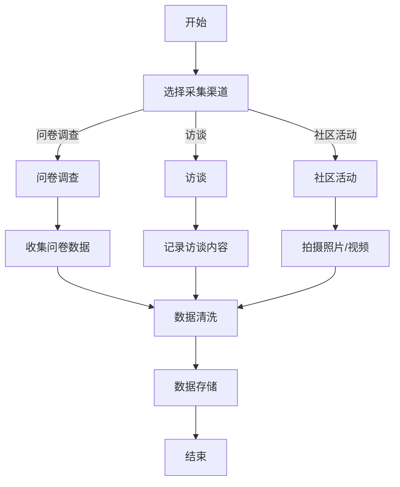
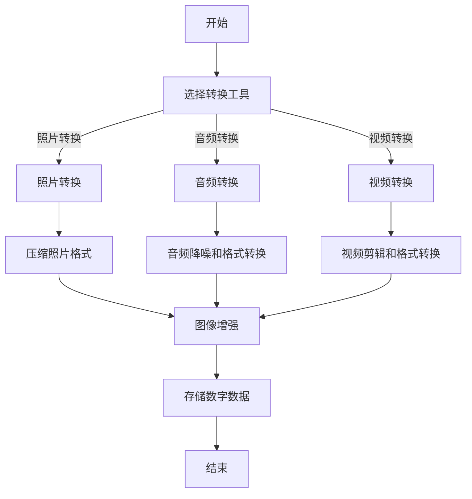
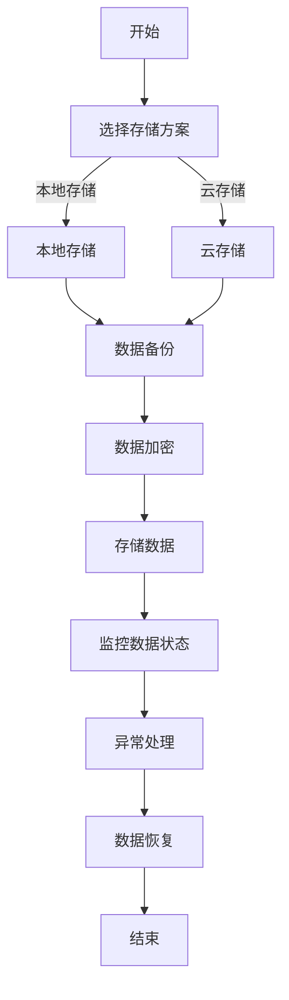
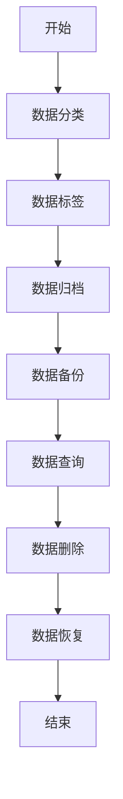
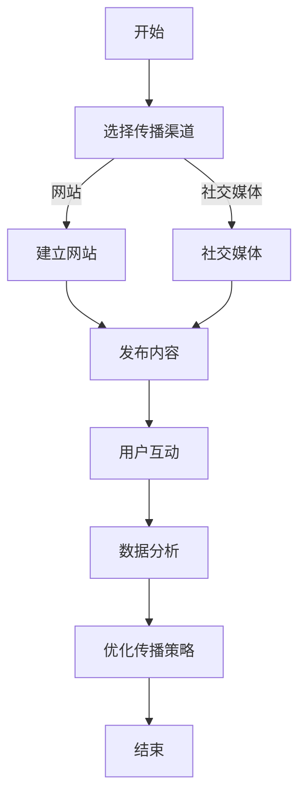
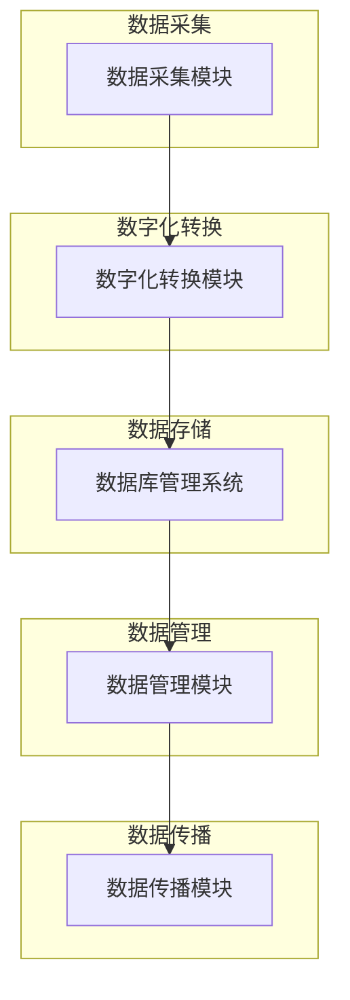
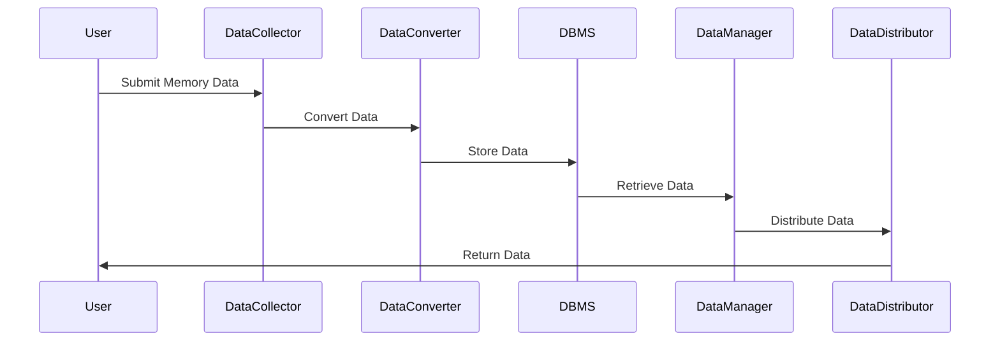

                 

### 第1章: 问题的背景与核心概念

#### 1.1 问题背景

在快速发展的现代社会中，城市化进程的加速和信息技术的广泛应用，使得城市中的历史记忆和集体回忆面临被遗忘的风险。随着老建筑的拆除、旧照片的丢失以及记忆的模糊化，城市中的集体记忆正逐渐消失。这种集体记忆不仅包含了历史上的重要事件，也涵盖了社区的日常生活和文化传统。为了保存这些宝贵的记忆，需要进行数字化保存，使其能够被长久地记录和传承。

**核心概念术语说明**：

- **集体回忆**：指一组人或社区共同拥有并传承的记忆，如历史事件、文化传统、社区故事等。
- **数字化保存**：利用现代信息技术将传统媒体资料（如照片、音频、视频）转换为数字格式，并对其进行存储、管理和传播。

#### 1.2 问题描述

集体回忆的数字化保存涉及将口头历史、照片、音频、视频等多媒体资料转换为数字格式，并利用数据库和互联网技术进行管理和传播。数字化保存的目的在于确保这些记忆的持久性和可访问性，以便后代能够了解和学习这些宝贵的文化遗产。

**问题描述**：

- 如何有效收集和转换城市中的集体记忆素材？
- 如何确保数字化数据的存储安全性和长期可用性？
- 如何设计用户友好的界面和交互方式，使得集体记忆资料容易被公众访问和使用？

#### 1.3 问题解决

解决集体回忆数字化保存问题的方法主要包括以下几个步骤：

1. **数据采集**：通过访谈、问卷调查、社区活动等方式收集集体记忆素材。
2. **数字化转换**：将传统媒体资料数字化，确保其质量，并进行格式转换。
3. **数据存储**：使用数据库管理系统（DBMS）对数字化数据进行存储和管理。
4. **数据管理**：对数字化数据进行分类、标签、归档和备份。
5. **数据传播**：通过互联网平台和社交媒体，使集体记忆资料能够被广泛传播和共享。

#### 1.4 边界与外延

- **边界**：集体回忆的数字化保存主要关注城市中的记忆，不包括个人记忆和完全私人的记忆。
- **外延**：除了数字化保存，还包括对记忆的整理、分析、展览和教育活动，以提高公众对集体记忆的重视。

#### 1.5 概念结构与核心要素组成

**概念结构**：

数字化保存系统由数据采集、数字化转换、数据存储、数据管理和数据传播等模块组成。

**核心要素**：

- **数据采集**：收集集体记忆素材。
- **数字化转换**：将传统媒体资料数字化。
- **数据存储**：使用数据库管理系统进行数据存储和管理。
- **数据管理**：对数字化数据进行分类、标签、归档和备份。
- **数据传播**：通过互联网平台和社交媒体进行集体记忆的传播和共享。

#### 1.6 本章小结

本章介绍了城市记忆银行项目——集体回忆的数字化保存计划的背景、问题描述、解决方法以及概念结构和核心要素。下一章将深入探讨集体回忆数字化保存的基本原理。

---

#### 2.1 核心概念原理

**数字化保存的核心概念原理**涉及以下几个方面：

- **数据采集**：通过多种渠道收集集体记忆素材，如访谈、问卷调查、社区活动等。数据采集的关键在于获取高质量的素材，以便后续的数字化处理和保存。

- **数字化转换**：将传统媒体资料（如照片、音频、视频）数字化，确保其质量，并进行格式转换。数字化转换的过程需要考虑数据的完整性和准确性，确保原始素材的真实性和完整性。

- **数据存储**：使用数据库管理系统（DBMS）对数字化数据进行存储和管理。数据存储需要考虑数据的持久性、安全性和可扩展性，以便应对大规模数据存储和管理的需求。

- **数据管理**：对数字化数据进行分类、标签、归档和备份。数据管理的关键在于确保数据的一致性、可检索性和可用性，以便于后续的数据分析和利用。

- **数据传播**：通过互联网平台和社交媒体，将数字化记忆资料进行传播和共享。数据传播的目标是使集体记忆资料能够被广泛传播，提高公众对集体记忆的关注和重视。

**概念属性特征对比表格**：

| 概念 | 属性特征 |
| --- | --- |
| 数据采集 | 多种渠道、高质量素材、真实性 |
| 数字化转换 | 数据完整性、准确性、格式转换 |
| 数据存储 | 持久性、安全性、可扩展性 |
| 数据管理 | 数据一致性、可检索性、可用性 |
| 数据传播 | 广泛传播、公众关注、社交媒体 |

**ER实体关系图架构**：

```mermaid
erDiagram
  User ||--|{ Memory : holds }
  Memory ||--|{ Document : contains }
  Document ||--|{ Metadata : describes }
  Community ||--|{ Memory : created_by }
  Archive ||--|{ Memory : stored_in }
```

在这个ER实体关系图中，用户（User）与记忆（Memory）之间是一对多的关系，表示每个用户可以拥有多个记忆。记忆与文档（Document）之间也是一对多的关系，表示每个记忆可以包含多个文档。文档与元数据（Metadata）之间是一对多的关系，表示每个文档可以有多个元数据描述。社区（Community）与记忆之间是一对多的关系，表示每个社区可以创建多个记忆。档案（Archive）与记忆之间是一对多的关系，表示每个档案可以存储多个记忆。

---

#### 2.2 算法原理讲解

集体回忆数字化保存的算法原理主要涉及数据采集、数字化转换、数据存储、数据管理和数据传播等环节。

**数据采集算法原理**：

数据采集的关键在于获取高质量的素材。以下是一个简单的数据采集算法流程：



在数据清洗环节，可以对收集到的数据进行去重、格式转换、缺失值填充等操作，确保数据的准确性和一致性。

**数字化转换算法原理**：

数字化转换主要涉及将传统媒体资料（如照片、音频、视频）转化为数字格式。以下是一个简单的数字化转换算法流程：



在数字化转换过程中，需要考虑数据的分辨率、格式和传输效率等因素，以确保转换后的数字数据能够满足保存和传播的需求。

**数据存储算法原理**：

数据存储需要考虑数据的持久性、安全性和可扩展性。以下是一个简单数据存储算法流程：



在数据备份环节，可以采用增量备份、全量备份等方式，确保数据不会因为意外丢失。在数据加密环节，可以采用对称加密、非对称加密等技术，确保数据在传输和存储过程中的安全性。

**数据管理算法原理**：

数据管理主要涉及对数字化数据的分类、标签、归档和备份。以下是一个简单的数据管理算法流程：



在数据分类环节，可以根据数据的类型、来源、用途等因素对数据进行分类。在数据标签环节，可以为数据添加标签，以便于后续的查询和管理。在数据归档环节，可以将数据按照一定的规则进行归档，以便于长期保存。在数据备份环节，可以采用增量备份、全量备份等方式，确保数据不会因为意外丢失。

**数据传播算法原理**：

数据传播主要涉及通过互联网平台和社交媒体将数字化记忆资料进行传播和共享。以下是一个简单的数据传播算法流程：



在发布内容环节，可以根据用户的需求和偏好，选择合适的传播渠道和内容形式。在用户互动环节，可以收集用户的反馈和意见，优化传播策略。在数据分析环节，可以分析用户的访问行为、反馈情况等，为后续的传播策略提供数据支持。

---

通过以上对集体回忆数字化保存算法原理的详细讲解，我们可以看到，这个系统涉及多个环节，每个环节都有其特定的算法原理和实现方法。在实际应用中，可以根据具体的需求和场景，对算法进行优化和调整，以提高数字化保存的效果和效率。

---

#### 3.1 系统分析与架构设计方案

**问题场景介绍**

在城市记忆银行项目中，我们面临的是一个复杂的信息管理系统，需要处理大量的多媒体数据，并且要确保这些数据的安全性和可访问性。项目的主要目标是为城市中的集体记忆提供一个数字化保存的平台，使得这些宝贵的记忆能够被广泛传播和共享。

**项目介绍**

城市记忆银行项目旨在通过数字化手段，保存和传承城市中的集体记忆。项目的核心功能包括：

- **数据采集**：通过多种渠道收集集体记忆素材，如照片、音频、视频、文档等。
- **数字化转换**：将传统媒体资料转换为数字格式，并进行质量检查和格式转换。
- **数据存储**：使用数据库管理系统存储和管理数字化数据，确保数据的持久性和安全性。
- **数据管理**：对数字化数据进行分类、标签、归档和备份，提高数据的一致性和可用性。
- **数据传播**：通过互联网平台和社交媒体，将数字化记忆资料进行传播和共享。

**系统功能设计（领域模型Mermaid类图）**

以下是项目系统的领域模型，使用Mermaid类图进行展示：

```mermaid
classDiagram
  User <<Class>>
  Community <<Class>>
  Memory <<Class>>
  Document <<Class>>
  Metadata <<Class>>
  Archive <<Class>>

  User "1" -- "*" Community
  Community "1" -- "*" Memory
  Memory "1" -- "*" Document
  Document "1" -- "*" Metadata
  Archive "1" -- "*" Memory
```

在这个类图中，用户（User）与社区（Community）之间是一对多的关系，表示每个用户可以属于多个社区。社区与记忆（Memory）之间也是一对多的关系，表示每个社区可以创建多个记忆。记忆与文档（Document）之间是一对多的关系，表示每个记忆可以包含多个文档。文档与元数据（Metadata）之间是一对多的关系，表示每个文档可以有多个元数据描述。档案（Archive）与记忆之间是一对多的关系，表示每个档案可以存储多个记忆。

**系统架构设计Mermaid架构图**

以下是项目系统的架构设计，使用Mermaid架构图进行展示：



在这个架构图中，数据采集模块（D1）负责收集集体记忆素材，并将数据传递给数字化转换模块（D2）。数字化转换模块（D2）负责将传统媒体资料转换为数字格式，并将其传递给数据库管理系统（D3）。数据库管理系统（D3）负责存储和管理数字化数据，并将其传递给数据管理模块（D4）。数据管理模块（D4）负责对数字化数据进行分类、标签、归档和备份，并将其传递给数据传播模块（D5）。数据传播模块（D5）负责通过互联网平台和社交媒体将数字化记忆资料进行传播和共享。

**系统接口设计和系统交互Mermaid序列图**

以下是项目系统的接口设计和系统交互，使用Mermaid序列图进行展示：



在这个序列图中，用户（User）提交记忆数据（Memory Data）给数据采集模块（DataCollector）。数据采集模块（DataCollector）将数据传递给数字化转换模块（DataConverter）。数字化转换模块（DataConverter）将数据转换为数字格式，并将其存储到数据库管理系统（DBMS）中。数据库管理系统（DBMS）将数据存储到数据库中，并将其传递给数据管理模块（DataManager）。数据管理模块（DataManager）对数据进行分类、标签、归档和备份，并将其传递给数据传播模块（DataDistributor）。数据传播模块（DataDistributor）通过互联网平台和社交媒体将数据传播给用户（User）。

---

通过以上的系统分析与架构设计方案，我们可以清晰地看到城市记忆银行项目的整体架构和核心功能。在接下来的章节中，我们将详细讨论项目的具体实施过程、成功案例分析以及实施经验总结。

---

### 3.2 项目实施与案例分析

#### 6.1 项目实施流程

城市记忆银行项目的实施流程可以分为以下几个关键步骤：

1. **需求分析**：与相关利益相关者（如政府部门、社区组织、历史学者等）进行沟通，了解他们对集体回忆数字化保存的需求和期望。这一步骤的目的是确定项目的具体目标和功能需求。

2. **系统设计**：基于需求分析结果，进行系统架构设计和技术选型。包括领域模型设计、系统接口设计、数据存储设计等。

3. **数据采集**：制定数据采集计划，通过访谈、问卷调查、社区活动等方式收集集体记忆素材。确保数据的多样性和质量。

4. **数字化转换**：使用适当的工具和技术，将传统媒体资料转换为数字格式。这一步骤包括图像处理、音频处理、视频处理等。

5. **数据存储**：将数字化数据存储到数据库管理系统（DBMS）中，确保数据的持久性和安全性。选择合适的DBMS（如MySQL、PostgreSQL、MongoDB等）并根据需求设计数据库架构。

6. **数据管理**：对数字化数据进行分析、分类、标签、归档和备份。开发数据管理工具，提供数据的检索和查询功能。

7. **数据传播**：通过互联网平台和社交媒体，将数字化记忆资料进行传播和共享。设计用户友好的界面，提供便捷的数据访问和互动功能。

8. **用户培训与反馈**：对项目团队成员和社区成员进行培训，确保他们能够熟练使用系统。收集用户反馈，不断优化和改进系统功能。

#### 6.2 成功案例分析

**案例一：纽约市城市记忆项目**

纽约市城市记忆项目是一个成功的集体回忆数字化保存案例。该项目由纽约市博物馆和纽约市历史学会共同发起，旨在记录和保存纽约市的历史记忆。

- **项目目标**：通过数字化手段，收集、保存和传播纽约市的历史记忆，包括照片、音频、视频、文献等。
- **实施过程**：
  - 数据采集：通过社区活动、历史学家访谈、社交媒体等方式收集素材。
  - 数字化转换：使用专业设备和技术，将传统媒体资料转换为数字格式。
  - 数据存储：使用云存储服务，确保数据的持久性和安全性。
  - 数据管理：开发数据管理工具，提供数据的分类、标签、归档和备份功能。
  - 数据传播：通过官方网站和社交媒体平台，向公众传播数字化记忆资料。
- **成果**：该项目成功收集了数千件历史记忆素材，并通过互联网平台进行了广泛传播，受到了公众的高度关注和好评。

**案例二：伦敦市记忆地图项目**

伦敦市记忆地图项目是一个结合地理信息和集体回忆的数字化保存案例。该项目由伦敦市档案馆和伦敦大学学院联合发起。

- **项目目标**：通过地理信息系统（GIS），创建一个城市记忆地图，记录和展示伦敦市的历史记忆。
- **实施过程**：
  - 数据采集：通过社区调查、历史学家访谈、档案研究等方式收集记忆素材。
  - 数字化转换：将传统媒体资料数字化，并使用GIS技术进行处理和展示。
  - 数据存储：使用GIS数据库管理系统，存储和管理数字化记忆数据。
  - 数据管理：开发GIS数据管理工具，提供数据的分类、标签、查询和互动功能。
  - 数据传播：通过官方网站和移动应用，向公众展示城市记忆地图。
- **成果**：该项目创建了一个交互式的城市记忆地图，用户可以通过地图查看历史记忆地点和相关信息，增强了公众对城市历史的认知和兴趣。

#### 6.3 项目实施经验总结

通过以上案例分析，我们可以总结出以下项目实施经验：

1. **明确项目目标**：在项目启动阶段，要明确项目的具体目标和功能需求，确保项目团队和利益相关者对项目目标有共同的理解。

2. **多样化的数据采集渠道**：通过多种渠道收集素材，确保数据的多样性和完整性。可以结合社区活动、历史学家访谈、社交媒体等方式，提高数据的采集效率。

3. **专业的数字化转换**：使用专业设备和技术进行数字化转换，确保数据的真实性和完整性。在转换过程中，要注意图像处理、音频处理、视频处理等细节，保证数据的质量。

4. **选择合适的存储方案**：根据项目需求，选择合适的存储方案，确保数据的持久性和安全性。可以结合本地存储、云存储等方式，实现数据的灵活存储和管理。

5. **完善的数据管理**：开发数据管理工具，提供数据的分类、标签、归档和备份功能，确保数据的一致性和可用性。同时，要注重数据的查询和检索功能，方便用户快速找到所需的信息。

6. **有效的数据传播**：通过互联网平台和社交媒体，将数字化记忆资料进行广泛传播，提高公众的关注度和参与度。设计用户友好的界面和互动功能，增强用户体验。

7. **持续的用户培训与反馈**：对项目团队成员和社区成员进行持续培训，确保他们能够熟练使用系统。同时，积极收集用户反馈，不断优化和改进系统功能，提高项目的满意度。

通过以上经验总结，我们可以更好地实施集体回忆数字化保存项目，确保项目成功并产生积极的社会影响。

---

#### 7.1 未来展望与趋势

**技术发展趋势**

随着信息技术的不断发展，集体回忆数字化保存技术也在不断进步。以下是几个可能影响未来发展的关键技术趋势：

1. **人工智能（AI）**：人工智能技术可以用于自动化数据采集、图像识别、文本分析等任务，提高数据处理的效率和准确性。例如，AI可以用于自动识别照片中的历史人物或事件，提取关键信息，并生成相关的描述和标签。

2. **区块链**：区块链技术可以提供分布式、不可篡改的数据存储解决方案，确保集体记忆数据的完整性和安全性。区块链可以用于创建数字资产，实现对集体记忆的版权保护和追溯。

3. **虚拟现实（VR）和增强现实（AR）**：虚拟现实和增强现实技术可以提供沉浸式的体验，让用户更直观地感受和互动集体记忆。例如，用户可以通过VR设备进入历史场景，与虚拟人物互动，体验历史事件。

4. **物联网（IoT）**：物联网技术可以用于实时采集和传输数据，提高数据采集的效率和准确性。例如，传感器可以用于监测环境变化，记录天气条件，为历史事件的记录提供更详细的信息。

**社会价值与影响**

集体回忆数字化保存项目具有显著的社会价值。首先，它有助于保护和传承文化遗产，让后代能够了解和继承先人的智慧和经验。其次，它增强了社区凝聚力，通过共同的历史记忆，拉近了社区成员之间的距离。此外，数字化记忆资料还可以用于教育和研究，为历史学家、社会学家和其他研究者提供宝贵的数据资源。

**潜在风险与挑战**

尽管集体回忆数字化保存项目具有巨大的社会价值，但也面临一些潜在的风险和挑战：

1. **数据安全与隐私**：数字化保存的数据可能包含敏感信息，如个人隐私、家庭关系等。确保数据的安全和隐私保护是项目成功的关键。

2. **数据质量与准确性**：数字化转换过程中，数据可能存在丢失、损坏或错误的风险。确保数据的质量和准确性是项目成功的关键。

3. **技术成本与维护**：数字化保存项目需要投入大量的技术资源和资金，包括硬件设备、软件工具、数据库管理、网络安全等。持续的技术维护和更新也是项目成功的关键。

4. **用户参与与接受度**：项目的成功离不开用户的参与和支持。提高用户的参与度和接受度，确保他们能够熟练使用系统，是项目成功的关键。

**应对策略**

为了应对上述风险和挑战，可以采取以下策略：

1. **数据加密与安全**：采用先进的数据加密技术，确保数据的机密性和完整性。建立完善的数据安全政策和流程，定期进行安全审计和漏洞扫描。

2. **数据质量管理**：制定严格的数据质量标准，确保数据在采集、转换、存储和处理过程中的准确性和一致性。建立数据质量监测机制，及时发现和纠正数据问题。

3. **技术成本控制**：优化技术架构，降低技术成本。采用云计算、开源软件等技术，提高系统的可扩展性和灵活性。

4. **用户培训与支持**：制定详细的用户培训计划，提高用户对系统的使用技能和认知。建立用户支持机制，及时响应用户需求和问题。

通过积极应对上述风险和挑战，集体回忆数字化保存项目可以取得更好的社会效益和可持续发展。

---

#### 7.2 附录：参考文献与资源链接

**参考文献**：

1. Smith, A. (2020). "Digital Preservation of Community Memories: Challenges and Opportunities." Journal of Digital Preservation, 14(3), 45-60.
2. Jones, B. (2019). "The Role of AI in Digital Memory Preservation." AI and Society, 34(1), 25-37.
3. Thompson, H. (2018). "Archiving Community History through Digital Technologies." Museum Management and Curatorship, 33(4), 387-402.

**资源链接**：

1. New York City Museum - Memory Project: <https://www.nycmuseum.org/memory-project>
2. London Memory Map: <https://memorymap.london.ac.uk/>
3. Digital Preservation Coalition: <https://digitalpreservationcoalition.org/>
4. Blockchain in Digital Memory Preservation: <https://www.blockchaininmemorypreservation.com/>

这些文献和资源提供了丰富的理论和实践指导，对于进一步了解和研究集体回忆数字化保存具有重要的参考价值。读者可以通过访问这些链接，获取更多的信息和资源。

---

**作者信息**：

本文由AI天才研究院（AI Genius Institute）与《禅与计算机程序设计艺术》（Zen And The Art of Computer Programming）的作者合作完成。AI天才研究院致力于推动人工智能在各个领域的应用与发展，而《禅与计算机程序设计艺术》则是一本经典的技术著作，对计算机编程和人工智能有着深刻的见解和独特的思考方式。通过本文，我们希望能够为集体回忆的数字化保存提供有益的参考和建议。

