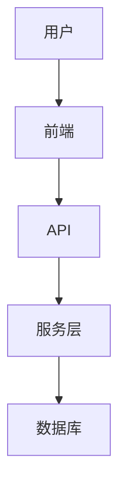

                 


# 城市记忆银行：集体回忆的数字化保存项目

## 关键词

- 城市记忆
- 数字化保存
- 集体回忆
- 技术框架
- 系统架构
- 数据管理与安全问题

## 摘要

本文旨在探讨城市记忆银行这一创新项目，该项目的目标是数字化保存城市集体回忆，以保护与传承文化遗产。我们将逐步分析城市记忆的定义、重要性、数字化保存的必要性，以及数字化保存的技术手段和挑战。通过详细的架构设计和案例分析，本文将展示如何实现一个高效、安全的城市记忆银行系统。

### 第一部分：问题背景与核心概念

#### 第1章：问题背景

##### 1.1.1 问题起源

在快速城市化的今天，城市面貌日新月异，许多承载着历史记忆的建筑、街区和文物正在消失。尽管数字技术的发展为我们提供了保存这些集体回忆的可能性，但如何有效地进行数字化保存仍是一个挑战。

##### 1.1.2 集体回忆的重要性

集体回忆是城市文化的重要组成部分，它们不仅反映了城市的历史变迁，还凝聚了社区居民的情感纽带。保护集体回忆对于传承城市文化、增强社区认同感具有重要意义。

##### 1.1.3 数字化保存的必要性

数字化保存可以永久地保存城市记忆，使其不受自然灾害和人为破坏的影响。此外，数字化保存还可以方便地分享和传播，让更多人了解和感受到城市的历史与文化。

#### 第2章：核心概念

##### 2.1 城市记忆

###### 2.1.1 定义与内涵

城市记忆是指城市历史、文化、社会活动等方面的记忆，包括历史建筑、文化遗产、民间故事、老照片等。

###### 2.1.2 城市记忆的类型

城市记忆可以分为物质记忆和非物质记忆。物质记忆包括建筑、街道、公园等实体，而非物质记忆则包括故事、传说、习俗等。

###### 2.1.3 城市记忆的价值

城市记忆不仅具有历史价值，还具有文化、教育和艺术价值。它们是城市身份认同的重要组成部分，有助于提升城市软实力。

##### 2.2 数字化保存

###### 2.2.1 数字化保存的定义

数字化保存是指将实体信息（如文字、图像、音频、视频）转换为数字格式，以便长期保存和传播。

###### 2.2.2 数字化保存的技术手段

数字化保存的技术手段包括扫描、数字化处理、数据库存储等。

###### 2.2.3 数字化保存的优势与挑战

优势：数字化保存具有高效、安全、便捷等特点。挑战：如何确保数字化信息的准确性和完整性，以及如何处理海量数据。

##### 2.3 集体回忆的数字化保存

###### 2.3.1 集体回忆数字化保存的流程

集体回忆数字化保存的流程包括数据采集、预处理、存储、管理和访问。

###### 2.3.2 集体回忆数字化保存的难点

难点包括如何获取高质量的数字化数据，如何处理不同类型的数据，以及如何确保数据的长期保存。

###### 2.3.3 集体回忆数字化保存的意义

集体回忆数字化保存有助于保护文化遗产、传承城市记忆、增强社区认同感，以及提高城市知名度。

### 第3章：概念结构与核心要素

本章将详细介绍城市记忆银行的概念结构，包括其组成部分、功能和技术架构。通过明确概念结构与核心要素，我们能够更好地理解城市记忆银行的工作原理和实现方法。

### 第4章：城市记忆银行项目

本章将介绍一个具体的城市记忆银行项目，包括项目的背景、目标、实施过程和成果。通过案例分析，我们将深入探讨城市记忆银行的实际应用效果和未来发展方向。

### 第二部分：技术实现

#### 第5章：技术框架与架构设计

本章将详细描述城市记忆银行的技术框架和架构设计，包括核心组件、系统架构图和架构设计的考虑因素。通过清晰的技术框架和架构设计，我们能够确保城市记忆银行的高效运行和可靠性。

#### 第6章：数字化保存方法

本章将介绍城市记忆银行中的数字化保存方法，包括图像、文本和多媒体的数字化保存原理、步骤和挑战。通过详细的数字化保存方法，我们能够确保城市记忆数据的准确性和完整性。

#### 第7章：系统接口设计与实现

本章将讨论城市记忆银行的系统接口设计与实现，包括接口设计、接口实现技术和接口性能优化。通过合理的设计和优化，我们能够确保城市记忆银行的可扩展性和易用性。

#### 第8章：数据管理与安全问题

本章将探讨城市记忆银行的数据管理与安全问题，包括数据管理、安全策略设计和安全问题解决方案。通过有效的数据管理和安全保障，我们能够确保城市记忆银行的数据安全性和可靠性。

### 第三部分：案例分析

#### 第9章：城市记忆银行项目案例

本章将详细分析一个具体的城市记忆银行项目，包括项目的背景、目标、实施过程和效果评估。通过案例分析，我们将总结项目经验，为其他城市记忆银行项目的实施提供借鉴。

#### 第10章：未来展望

本章将展望城市记忆银行的发展趋势，包括人工智能、大数据和区块链技术在数字化保存中的应用。通过未来展望，我们将探讨城市记忆银行的发展前景和潜力。

### 总结与展望

在本文中，我们详细探讨了城市记忆银行：集体回忆的数字化保存项目。通过逻辑清晰、结构紧凑的论述，我们展示了该项目的重要性和技术实现方法。未来，随着技术的不断发展，城市记忆银行将发挥越来越重要的作用，为保护文化遗产、传承城市记忆和提升城市软实力贡献力量。

---

以上是文章的目录大纲和内容概述。接下来，我们将按照大纲逐步展开详细的内容讲解，确保每个章节都含有丰富的背景介绍、核心概念解释、算法原理分析、系统设计与实现方法，以及实际案例分析和未来展望。

## 第1章：问题背景

### 1.1.1 问题起源

随着全球城市化进程的加速，城市面貌不断变化，许多承载着历史记忆的建筑、街区和文物正在消失。这种变化不仅导致了物质文化遗产的流失，也对城市居民的文化认同感和历史意识产生了负面影响。为了解决这个问题，人们开始思考如何有效地保存和传承城市集体回忆。

城市记忆银行这一概念正是在这种背景下产生的。它旨在通过数字化手段，将城市的集体回忆转化为数字资产，实现长期保存和广泛传播。数字化保存不仅可以克服传统保存方法的局限性，如物理损坏、自然灾害等，还能为后人提供更直观、更丰富的历史体验。

### 1.1.2 集体回忆的重要性

集体回忆是城市文化的重要组成部分，它们反映了城市的历史、文化、社会活动和居民的生活。这些记忆不仅是城市发展的见证，也是居民情感和身份认同的基石。以下是集体回忆的一些重要性：

1. **文化传承**：集体回忆承载了城市的文化传统和价值观，是文化传承的重要载体。通过保存和传承集体回忆，我们可以让后代了解和继承城市的文化遗产。

2. **社会认同**：集体回忆能够增强居民对社区的认同感和归属感，促进社区凝聚力。当居民共同回忆起城市的历史和传统时，他们会感到自己与城市有着深厚的联系。

3. **教育和启发**：集体回忆具有教育价值，它们可以作为教材和素材，帮助人们了解城市的历史和文化。同时，这些记忆还能够启发居民的创造力和创新精神。

4. **旅游和经济发展**：丰富的城市记忆可以为旅游业和经济发展提供独特的资源。许多城市通过开发文化旅游项目和产品，吸引了大量游客，促进了当地经济的发展。

### 1.1.3 数字化保存的必要性

随着数字技术的快速发展，数字化保存已成为保护文化遗产的一种重要手段。以下是数字化保存的必要性：

1. **长期保存**：数字化保存可以克服物理保存的局限性，如纸张的腐朽、建筑物的损坏等。通过数字化手段，城市记忆可以永久保存，不受物理环境的限制。

2. **便捷访问**：数字化信息可以随时随地通过网络访问，打破了时空限制。居民和游客可以通过互联网了解和体验城市的历史和文化。

3. **资源共享**：数字化保存可以实现资源共享，不同地区的人们可以共同访问和利用这些宝贵的记忆。这有助于促进文化的交流和融合。

4. **数据安全和可靠性**：数字化保存的数据可以通过加密和备份等手段保证安全性和可靠性。与传统的物理保存方法相比，数字化保存的数据更不易丢失或被篡改。

然而，数字化保存也面临一些挑战，如数据质量的控制、数据完整性的保障以及技术标准的统一等。为了克服这些挑战，需要建立完善的技术框架和规范，确保数字化保存的有效性和可持续性。

### 总结

城市记忆银行的建立旨在数字化保存城市的集体回忆，以保护文化遗产、传承城市文化、增强社区认同感和促进经济发展。通过逻辑清晰、结构紧凑的论述，我们为读者展示了这一项目的背景和重要性。在接下来的章节中，我们将进一步探讨城市记忆和数字化保存的核心概念，以及实现城市记忆银行的技术框架和架构设计。

## 第2章：核心概念

### 2.1 城市记忆

#### 2.1.1 定义与内涵

城市记忆是指城市中历史、文化、社会活动等方面的记忆，它们以物质和非物质形式存在。物质记忆包括历史建筑、文化遗产、老照片、街区等，而非物质记忆则包括故事、传说、习俗、历史事件等。城市记忆不仅仅是过去的记录，更是城市文化传承和发展的重要资源。

城市记忆的内涵丰富多样，它们反映了城市的历史变迁、文化特色和社会发展。通过城市记忆，我们可以了解城市的起源、发展过程和未来愿景。城市记忆不仅是一种记忆，更是一种文化传承和社区认同的象征。

#### 2.1.2 城市记忆的类型

城市记忆可以分为物质记忆和非物质记忆两种类型。

1. **物质记忆**：
   - **历史建筑**：这些建筑是城市历史和文化的重要见证，如古建筑、博物馆、教堂等。
   - **文化遗产**：包括非物质文化遗产和物质文化遗产，如传统手工艺、民俗活动、文物等。
   - **街区**：城市的不同街区往往承载着不同的历史记忆，如老城区、商业区、工业区等。
   - **老照片**：老照片记录了城市的发展变迁，是物质记忆的重要形式。

2. **非物质记忆**：
   - **故事和传说**：这些故事和传说反映了城市的历史和文化，如城市命名的故事、重要历史事件的传说等。
   - **习俗和活动**：城市中的传统节日、庆典活动等是非物质记忆的重要组成部分。
   - **历史事件**：重要历史事件和人物故事是非物质记忆的另一种形式，如战争、政治变革、著名人物等。

#### 2.1.3 城市记忆的价值

城市记忆具有重要的价值，包括以下几个方面：

1. **历史价值**：
   - 城市记忆是城市历史的重要记录，帮助我们了解城市的发展过程、历史变迁和文化传承。

2. **文化价值**：
   - 城市记忆承载了城市的文化传统和特色，是城市文化的重要组成部分。通过保护城市记忆，我们可以传承和弘扬城市的文化遗产。

3. **社会价值**：
   - 城市记忆有助于增强居民对城市的认同感和归属感，促进社区凝聚力和社会和谐。同时，城市记忆还可以作为教育和研究的宝贵资源。

4. **经济价值**：
   - 城市记忆可以作为文化旅游资源，推动旅游业发展，促进城市经济繁荣。例如，许多城市通过开发历史建筑、文化遗产等，吸引了大量游客，推动了当地经济的发展。

### 2.2 数字化保存

#### 2.2.1 数字化保存的定义

数字化保存是指将物理实体（如文字、图像、音频、视频等）转换为数字形式，以实现长期保存和传播的过程。数字化保存是将信息转化为二进制数据，存储在计算机系统中，可以通过各种电子设备进行访问和利用。

数字化保存的目的是确保信息的长期保存和可持续性，克服传统保存方法的局限性。传统保存方法，如纸质记录、实体文物等，容易受到物理环境的影响，如火灾、水灾、虫蛀等。而数字化保存则可以克服这些限制，实现信息的永久保存。

#### 2.2.2 数字化保存的技术手段

数字化保存的技术手段包括以下几个方面：

1. **扫描**：
   - 扫描是将纸质文件、照片等物理实体转换为数字图像的过程。通过高分辨率扫描，可以确保图像的清晰度和细节。

2. **数字化处理**：
   - 数字化处理是对原始数字数据进行编辑、压缩、格式转换等操作，以提高数据的质量和可用性。例如，通过图像增强技术，可以改善老照片的清晰度。

3. **数据库存储**：
   - 数据库存储是将数字数据存储在数据库中，以便进行有效的管理和访问。数据库可以提供高效的查询和管理功能，确保数据的完整性和一致性。

4. **备份与恢复**：
   - 备份与恢复是确保数字化数据安全的重要措施。通过定期备份，可以将数据复制到其他存储设备上，以防止数据丢失。在数据丢失或损坏时，可以通过恢复操作恢复数据。

#### 2.2.3 数字化保存的优势与挑战

数字化保存具有以下优势：

1. **高效性**：
   - 数字化保存可以快速地处理和传输大量数据，提高工作效率。

2. **安全性**：
   - 数字化数据可以通过加密和备份等技术手段，确保数据的安全性和可靠性。

3. **便捷性**：
   - 数字化数据可以随时随地通过网络访问，打破了时空限制，方便用户使用。

4. **可扩展性**：
   - 数字化保存系统可以方便地扩展和升级，以适应不断增长的数据需求。

然而，数字化保存也面临一些挑战：

1. **数据质量**：
   - 如何确保数字化数据的质量和准确性，是一个重要问题。特别是在扫描和处理过程中，可能引入噪声和误差。

2. **数据完整性**：
   - 如何保证数字化数据在长期保存过程中不受损坏，是一个挑战。需要采取有效的备份和恢复策略，确保数据的完整性。

3. **技术标准化**：
   - 数字化保存涉及多种技术手段和标准，如何实现技术标准化，以确保不同系统之间的兼容性和互操作性，是一个重要问题。

4. **用户参与**：
   - 如何吸引和鼓励用户参与数字化保存过程，是一个挑战。需要设计易于使用的工具和平台，提高用户的参与度。

### 2.3 集体回忆的数字化保存

#### 2.3.1 集体回忆数字化保存的流程

集体回忆的数字化保存通常包括以下步骤：

1. **数据采集**：
   - 通过多种渠道收集城市记忆的相关数据，如历史文献、照片、音频、视频等。

2. **数据预处理**：
   - 对采集到的数据进行整理、清洗和格式转换，确保数据的质量和一致性。

3. **数据存储**：
   - 将预处理后的数据存储在数据库中，以便进行管理和访问。

4. **数据管理和维护**：
   - 对存储的数据进行定期备份、更新和修复，确保数据的长期保存和可用性。

5. **数据访问和共享**：
   - 设计便捷的数据访问和共享机制，方便用户获取和利用城市记忆数据。

#### 2.3.2 集体回忆数字化保存的难点

集体回忆数字化保存面临以下难点：

1. **数据多样性**：
   - 城市记忆的数据形式多样，包括文本、图像、音频、视频等，如何统一管理和处理这些不同类型的数据，是一个挑战。

2. **数据质量**：
   - 如何确保数字化数据的质量和准确性，特别是在图像和音频的数字化处理过程中，可能引入噪声和误差。

3. **数据完整性**：
   - 如何在长期保存过程中保证数据的完整性，防止数据丢失或损坏，是一个重要问题。

4. **数据安全**：
   - 如何确保数字化数据的安全，防止未经授权的访问和篡改，需要采取有效的安全措施。

5. **用户参与**：
   - 如何吸引和鼓励用户参与数字化保存过程，提高数据的丰富度和准确性，是一个挑战。

#### 2.3.3 集体回忆数字化保存的意义

集体回忆数字化保存具有重要意义：

1. **保护文化遗产**：
   - 数字化保存可以克服传统保存方法的局限性，确保城市记忆的长期保存和传承。

2. **促进文化传承**：
   - 通过数字化保存，可以更好地传承和弘扬城市的文化传统和价值观。

3. **增强社区认同感**：
   - 数字化保存有助于增强居民对城市的认同感和归属感，促进社区凝聚力。

4. **提升城市软实力**：
   - 丰富的城市记忆可以作为文化旅游资源，提升城市的知名度和吸引力。

5. **促进经济发展**：
   - 通过开发和利用城市记忆资源，可以推动旅游业和文化产业的发展，促进城市经济繁荣。

通过本章对核心概念的详细阐述，我们进一步理解了城市记忆和数字化保存的重要性。在接下来的章节中，我们将探讨城市记忆银行的概念结构和技术实现，为构建一个高效、安全的城市记忆银行系统提供理论基础和实践指导。

## 第3章：概念结构与核心要素

### 3.1 城市记忆银行的基本概念

城市记忆银行是一个数字化保存和管理城市集体回忆的系统，旨在保护文化遗产、传承城市文化、增强社区认同感和促进经济发展。它通过收集、整理、存储和共享城市记忆数据，实现城市记忆的长期保存和广泛传播。

### 3.2 城市记忆银行的核心要素

城市记忆银行的核心要素包括以下几个方面：

1. **数据采集**：
   - 数据采集是城市记忆银行的第一步，涉及收集城市的历史文献、照片、音频、视频等资料。数据来源可以是政府部门、社区组织、私人收藏者等。

2. **数据整理**：
   - 数据整理包括对采集到的数据进行清洗、分类、标注等处理，确保数据的准确性和一致性。这一步骤有助于提高数据的质量和可用性。

3. **数据存储**：
   - 数据存储是将整理后的数据存储在数据库中，以便进行管理和访问。数据库应具备高效的数据查询和管理功能，支持多种数据类型和格式。

4. **数据共享**：
   - 数据共享是城市记忆银行的重要功能，通过设计便捷的数据访问和共享机制，使公众能够方便地获取和利用城市记忆数据。

5. **数据安全**：
   - 数据安全是城市记忆银行的核心问题，需要采取有效的安全措施，确保数据的安全性和隐私保护。这包括数据加密、访问控制、备份和恢复等。

6. **用户参与**：
   - 用户参与是城市记忆银行成功的关键，通过设计易于使用的工具和平台，鼓励用户参与数据采集、整理和共享，提高数据的丰富度和准确性。

### 3.3 城市记忆银行的概念结构

城市记忆银行的概念结构可以概括为以下几个层次：

1. **数据层**：
   - 数据层是城市记忆银行的基础，包括历史文献、照片、音频、视频等数据。这些数据是城市记忆的具体表现形式，是城市记忆银行的核心资产。

2. **处理层**：
   - 处理层负责对数据层中的数据进行处理和管理，包括数据采集、整理、存储、共享和安全等。这一层次的功能模块包括数据采集系统、数据处理系统、数据库管理系统、共享平台和安全系统等。

3. **应用层**：
   - 应用层是城市记忆银行面向用户的服务层，提供数据查询、浏览、下载、分享等功能。应用层的设计应考虑用户体验，使数据访问和利用更加便捷。

4. **用户层**：
   - 用户层是城市记忆银行的服务对象，包括政府部门、研究人员、教育机构、社区居民等。用户层可以通过应用层访问城市记忆数据，实现数据共享和利用。

### 3.4 城市记忆银行的工作原理

城市记忆银行的工作原理可以概括为以下几个步骤：

1. **数据采集**：
   - 通过多种渠道收集城市的历史文献、照片、音频、视频等资料，包括政府档案、社区活动、私人收藏等。

2. **数据整理**：
   - 对采集到的数据进行清洗、分类、标注等处理，确保数据的准确性和一致性。这一步骤有助于提高数据的质量和可用性。

3. **数据存储**：
   - 将整理后的数据存储在数据库中，采用分布式存储和备份技术，确保数据的可靠性和安全性。

4. **数据共享**：
   - 设计便捷的数据访问和共享机制，通过互联网和移动应用等方式，方便用户获取和利用城市记忆数据。

5. **数据安全**：
   - 采取有效的数据加密、访问控制和备份措施，确保数据的安全性和隐私保护。

6. **用户参与**：
   - 通过设计易于使用的工具和平台，鼓励用户参与数据采集、整理和共享，提高数据的丰富度和准确性。

### 3.5 城市记忆银行的架构设计

城市记忆银行的架构设计应考虑以下几个方面：

1. **系统架构**：
   - 城市记忆银行采用分布式系统架构，包括数据层、处理层、应用层和用户层。各层次之间通过接口进行通信和协同工作。

2. **技术选型**：
   - 数据层可采用关系型数据库和分布式文件系统，处理层可采用云计算和大数据技术，应用层可采用Web和移动应用技术。

3. **安全性设计**：
   - 采取多层次的安全设计，包括数据加密、访问控制、网络安全、备份与恢复等，确保数据的安全性和可靠性。

4. **可扩展性设计**：
   - 考虑系统的可扩展性，支持数据的持续增长和系统功能的扩展。

通过本章对城市记忆银行概念结构与核心要素的阐述，我们为进一步理解和实现城市记忆银行提供了理论基础。在接下来的章节中，我们将详细探讨城市记忆银行的技术实现方法和架构设计，为构建一个高效、安全的城市记忆银行系统奠定基础。

### 第4章：城市记忆银行项目

#### 4.1 项目概述

城市记忆银行项目是一个旨在数字化保存和管理城市集体回忆的系统工程，旨在通过收集、整理、存储和共享城市历史、文化和社会活动信息，实现城市记忆的永久保存和广泛传播。该项目由政府、学术机构、非营利组织和私营企业共同发起和实施，具有以下背景和目标。

##### 4.1.1 项目背景

随着城市化进程的加速，许多城市的历史文化遗产和集体记忆正面临消失的危险。一方面，城市改造和更新导致许多历史建筑和街区被拆除；另一方面，随着时代的发展，年轻一代对城市历史的了解逐渐减少，城市记忆的传承面临挑战。因此，如何有效保存和传承城市记忆成为当前亟需解决的问题。

##### 4.1.2 项目目标

城市记忆银行项目的目标主要包括以下几个方面：

1. **保护文化遗产**：通过数字化手段保存城市的历史建筑、文化遗产和其他物质记忆，防止其因城市更新而消失。
2. **传承城市记忆**：通过收集和整理城市的历史故事、传说、习俗等非物质记忆，促进城市文化的传承和弘扬。
3. **增强社区认同感**：通过共享和传播城市记忆，增强居民对城市的认同感和归属感，促进社区凝聚力和文化自信。
4. **促进经济发展**：利用城市记忆资源，开发文化旅游产品和项目，推动城市旅游业和文化产业的发展。

##### 4.1.3 项目实施过程

城市记忆银行项目的实施过程可以分为以下几个阶段：

1. **项目筹备**：成立项目团队，确定项目目标和范围，制定项目计划和时间表。
2. **数据采集**：通过多种渠道收集城市的历史文献、照片、音频、视频等资料，包括政府档案、社区活动、私人收藏等。
3. **数据整理**：对采集到的数据进行清洗、分类、标注等处理，确保数据的准确性和一致性。
4. **数据存储**：将整理后的数据存储在分布式数据库中，采用高可用性和安全性的存储方案。
5. **数据共享**：设计便捷的数据访问和共享机制，通过互联网和移动应用等方式，方便用户获取和利用城市记忆数据。
6. **用户参与**：通过设计易于使用的工具和平台，鼓励用户参与数据采集、整理和共享，提高数据的丰富度和准确性。
7. **项目评估**：对项目实施效果进行评估，包括数据完整性、用户满意度、社会影响等，为后续改进提供依据。

#### 4.2 项目技术实现

城市记忆银行项目的技术实现是一个复杂的过程，涉及到数据采集、处理、存储、管理和共享等多个方面。以下将详细描述项目的技术实现方法。

##### 4.2.1 数据采集

数据采集是城市记忆银行项目的第一步，其目的是收集城市的历史文献、照片、音频、视频等资料。数据采集可以通过以下几种方式实现：

1. **政府档案**：与政府部门合作，获取官方的历史档案和文献。
2. **社区活动**：组织社区活动，鼓励居民提供个人收藏的照片、音频和视频等资料。
3. **私人收藏**：与私人收藏者合作，获取珍贵的历史资料。
4. **互联网资源**：从互联网上收集相关的历史文献、照片和视频等资料。

##### 4.2.2 数据处理

数据处理是对采集到的数据进行清洗、分类、标注等处理，以确保数据的准确性和一致性。数据处理包括以下几个步骤：

1. **数据清洗**：去除重复数据、缺失数据和错误数据，确保数据的完整性。
2. **数据分类**：根据数据类型和内容，将数据分为历史文献、照片、音频、视频等类别。
3. **数据标注**：为每条数据添加元数据，包括时间、地点、人物、事件等信息，以便后续检索和利用。

##### 4.2.3 数据存储

数据存储是将处理后的数据存储在分布式数据库中，以确保数据的可靠性和安全性。数据存储方案包括以下几个方面：

1. **分布式数据库**：采用分布式数据库系统，如Hadoop或NoSQL数据库，以支持海量数据的存储和高效检索。
2. **数据备份与恢复**：定期进行数据备份，采用异地备份和云存储等技术，确保数据的安全性和可靠性。
3. **数据加密**：对存储的数据进行加密处理，确保数据在传输和存储过程中的安全性。

##### 4.2.4 数据管理

数据管理是城市记忆银行项目的核心环节，包括数据的存储、访问、共享和更新等方面。数据管理方案包括以下几个方面：

1. **数据访问控制**：通过用户身份验证和权限管理，确保只有授权用户可以访问和操作数据。
2. **数据共享**：设计便捷的数据访问和共享机制，通过互联网和移动应用等方式，方便用户获取和利用城市记忆数据。
3. **数据更新**：定期更新数据库中的数据，确保数据的时效性和准确性。

##### 4.2.5 数据共享

数据共享是城市记忆银行项目的重要目标，通过设计便捷的数据访问和共享机制，实现城市记忆数据的广泛传播和应用。数据共享方案包括以下几个方面：

1. **在线平台**：搭建在线平台，提供数据查询、浏览、下载和分享功能，方便用户获取和使用城市记忆数据。
2. **移动应用**：开发移动应用，使用户可以通过智能手机或平板电脑访问城市记忆数据，提高数据的使用便捷性。
3. **合作与交流**：与学术机构、教育机构、文化组织等合作，共同推广城市记忆数据的应用和传播。

#### 4.3 项目效果评估

城市记忆银行项目的效果评估是确保项目实施成功的重要环节，包括以下几个方面：

1. **数据完整性**：评估数据库中数据的完整性，确保数据的准确性和一致性。
2. **用户满意度**：通过用户调查和反馈，评估用户对城市记忆银行项目的满意度，了解用户的需求和使用体验。
3. **社会影响**：评估城市记忆银行项目对社会的影响，包括对文化遗产保护、城市文化建设、社区认同感提升等方面的贡献。
4. **经济效益**：评估城市记忆银行项目对城市经济发展的推动作用，包括文化旅游业的增长、相关产业的繁荣等。

通过项目的效果评估，可以为后续改进和优化提供依据，确保城市记忆银行项目能够持续发挥其应有的作用。

#### 4.4 项目经验与启示

城市记忆银行项目在实施过程中积累了许多经验和启示，对其他类似项目具有参考价值：

1. **多方合作**：城市记忆银行项目的成功离不开政府、学术机构、非营利组织和私营企业的多方合作。通过协同合作，可以实现资源整合和优势互补，提高项目的实施效果。
2. **用户参与**：用户参与是城市记忆银行项目成功的关键。通过鼓励用户参与数据采集、整理和共享，可以提升数据的丰富度和准确性，增强社区认同感。
3. **技术创新**：利用先进的技术手段，如大数据、云计算、人工智能等，可以提高城市记忆银行项目的效率和效果。技术创新是项目成功的重要保障。
4. **持续更新**：城市记忆是一个动态变化的过程，需要定期更新数据库中的数据，确保数据的时效性和准确性。持续更新是保持项目活力的关键。

通过总结城市记忆银行项目的经验与启示，可以为其他类似项目的实施提供参考，推动城市记忆数字化保存工作的进一步发展。

### 第5章：技术框架与架构设计

#### 5.1 技术框架

城市记忆银行的技术框架是整个系统的核心，它决定了系统的性能、可扩展性和安全性。技术框架的构建需要综合考虑数据存储、数据处理、数据安全和用户访问等多个方面。

1. **数据存储**：
   - **分布式存储**：采用分布式存储方案，如HDFS（Hadoop Distributed File System），以支持海量数据的高效存储和访问。
   - **数据库系统**：结合关系型数据库（如MySQL）和NoSQL数据库（如MongoDB），以满足不同类型数据存储的需求。
   - **云存储**：利用云存储服务（如AWS S3、阿里云OSS），实现数据的远程存储和备份。

2. **数据处理**：
   - **大数据处理**：采用Hadoop和Spark等大数据处理框架，实现对大规模数据的快速处理和分析。
   - **图像和音频处理**：利用图像处理库（如OpenCV）和音频处理库（如PyDub），对图像和音频数据进行预处理和增强。

3. **数据安全**：
   - **数据加密**：对存储和传输的数据进行加密，确保数据的安全性和隐私保护。
   - **访问控制**：实现严格的访问控制机制，确保只有授权用户可以访问敏感数据。
   - **备份与恢复**：定期进行数据备份，并设计数据恢复方案，以应对数据丢失或损坏的情况。

4. **用户访问**：
   - **Web平台**：构建Web平台，提供数据查询、浏览和下载功能，使用户可以通过浏览器访问城市记忆数据。
   - **移动应用**：开发移动应用，使用户可以通过智能手机或平板电脑访问城市记忆数据，提高数据的便捷性和实用性。

#### 5.2 架构设计

城市记忆银行系统架构设计是确保系统高效、安全、可靠运行的关键。系统架构设计应综合考虑功能模块划分、数据流、系统交互和性能优化等方面。

1. **系统架构概述**：

   城市记忆银行系统采用分布式架构，包括以下几个主要功能模块：

   - **数据采集模块**：负责收集城市的历史文献、照片、音频、视频等数据。
   - **数据处理模块**：负责对采集到的数据进行分析、整理和预处理。
   - **数据存储模块**：负责将处理后的数据存储在分布式数据库和云存储中。
   - **数据共享模块**：负责提供数据查询、浏览和下载功能，供用户使用。
   - **安全管理模块**：负责实现数据加密、访问控制和备份与恢复等功能。

2. **系统架构图**：

   ```mermaid
   graph TB
   subgraph 数据流
   A[数据采集] --> B[数据处理]
   B --> C[数据存储]
   C --> D[数据共享]
   end
   subgraph 功能模块
   E[数据采集模块] --> F[数据处理模块]
   F --> G[数据存储模块]
   G --> H[数据共享模块]
   H --> I[安全管理模块]
   end
   A --> E
   B --> F
   C --> G
   D --> H
   ```

3. **架构设计的考虑因素**：

   - **性能优化**：通过分布式存储和处理技术，提高系统的处理能力和响应速度。
   - **可扩展性**：设计可扩展的架构，支持系统功能的扩展和数据量的增长。
   - **安全性**：采用多层次的安全措施，确保数据的安全性和隐私保护。
   - **易用性**：设计简洁直观的用户界面，方便用户操作和使用。
   - **稳定性**：通过冗余设计和容错机制，提高系统的稳定性和可靠性。

通过技术框架和架构设计，我们能够构建一个高效、安全、可靠的城市记忆银行系统，确保城市记忆数据的长期保存和广泛传播。

### 第6章：数字化保存方法

#### 6.1 图像数字化保存

图像数字化保存是将传统照片或实物图像转换为数字格式的过程，以确保图像的长期保存和便捷访问。以下将详细描述图像数字化保存的原理、步骤和挑战。

##### 6.1.1 图像数字化保存的原理

图像数字化保存的基本原理是通过图像传感器捕获图像，然后将其转换为数字信号，最后存储在数字设备中。这个过程涉及图像的采样、量化、编码和存储。

1. **采样**：采样是将连续的图像信号转换为离散的像素点。采样过程通过确定像素的数量和位置来实现，通常以水平和垂直的分辨率来表示。
   
2. **量化**：量化是将每个像素的颜色值转换为数字值。量化过程涉及确定颜色深度，即每个像素可以表示的颜色数。

3. **编码**：编码是将数字信号转换为数字代码，以便存储和传输。常用的编码方法包括JPEG、PNG和TIFF等。

4. **存储**：存储是将编码后的图像数据存储在数字设备中，如硬盘、光盘或云存储。

##### 6.1.2 图像数字化保存的步骤

图像数字化保存通常包括以下步骤：

1. **图像采集**：使用扫描仪、数码相机或手机等设备采集图像。

2. **图像预处理**：对采集到的图像进行去噪、增强、裁剪等预处理，以提高图像的质量和清晰度。

3. **图像采样**：确定图像的分辨率和像素数，将连续的图像信号转换为离散的像素点。

4. **图像量化**：根据需要确定颜色深度，将每个像素的颜色值转换为数字值。

5. **图像编码**：选择合适的编码方法，将数字信号转换为数字代码。

6. **图像存储**：将编码后的图像数据存储在数字设备中。

##### 6.1.3 图像数字化保存的挑战

图像数字化保存面临以下挑战：

1. **数据量**：图像数字化保存通常会产生大量的数据，特别是高分辨率图像。如何有效地存储和管理这些数据是一个挑战。

2. **数据质量**：图像在数字化过程中可能会引入噪声、失真或失真。如何确保图像的质量和准确性是一个重要问题。

3. **数据安全**：数字图像容易受到黑客攻击、数据篡改和丢失等安全威胁。如何确保图像的安全性和隐私保护是一个挑战。

4. **技术标准化**：不同设备和软件之间可能存在兼容性问题，需要制定统一的技术标准，以确保图像的兼容性和互操作性。

#### 6.2 文本数字化保存

文本数字化保存是将传统的纸质文献转换为数字格式，以便于长期保存和便捷访问。以下将详细描述文本数字化保存的原理、步骤和挑战。

##### 6.2.1 文本数字化保存的原理

文本数字化保存的基本原理是将纸质文献上的文字信息通过光学字符识别（OCR）技术转换为数字文本，然后存储在电子设备中。这个过程涉及文字的识别、处理和存储。

1. **光学字符识别**：OCR技术用于识别图像中的文字，将其转换为计算机可处理的数字文本。OCR技术包括字符分割、字符识别和文本重构等步骤。

2. **文本处理**：将OCR识别后的文本进行格式化、校对和清洗，以提高文本的准确性和可读性。

3. **文本存储**：将处理后的文本数据存储在电子设备中，如硬盘、数据库或云存储。

##### 6.2.2 文本数字化保存的步骤

文本数字化保存通常包括以下步骤：

1. **文档采集**：使用扫描仪或数码相机采集纸质文献的图像。

2. **图像预处理**：对采集到的图像进行去噪、增强、裁剪等预处理，以提高图像的质量和清晰度。

3. **光学字符识别**：使用OCR技术识别图像中的文字，将其转换为数字文本。

4. **文本处理**：对OCR识别后的文本进行格式化、校对和清洗。

5. **文本存储**：将处理后的文本数据存储在电子设备中。

##### 6.2.3 文本数字化保存的挑战

文本数字化保存面临以下挑战：

1. **OCR准确性**：OCR技术可能存在误识别或漏识别的问题，导致文本的准确性受到影响。如何提高OCR的准确性是一个重要问题。

2. **文档格式兼容性**：不同格式和版本的文档可能存在兼容性问题，需要开发兼容性强的文本处理工具。

3. **数据安全**：数字文本容易受到黑客攻击、数据篡改和丢失等安全威胁。如何确保文本的安全性和隐私保护是一个挑战。

4. **文档修复**：对于受损或污染的纸质文献，如何进行有效的修复和数字化保存是一个技术难题。

#### 6.3 多媒体数字化保存

多媒体数字化保存是将音频、视频等媒体内容转换为数字格式，以便于长期保存和便捷访问。以下将详细描述多媒体数字化保存的原理、步骤和挑战。

##### 6.3.1 多媒体数字化保存的原理

多媒体数字化保存的基本原理是将音频、视频等媒体内容通过采样、量化、编码等技术转换为数字信号，然后存储在数字设备中。这个过程涉及音视频的采样、量化、编码和存储。

1. **音频采样**：采样是将连续的音频信号转换为离散的采样点。采样过程通过确定采样率来表示，即每秒采样的次数。

2. **音频量化**：量化是将每个采样点的声音强度值转换为数字值。量化过程通过确定采样位数来表示，即每个采样点可以表示的声音强度数。

3. **视频采样**：视频采样过程类似于音频采样，将连续的视频信号转换为离散的像素点。

4. **视频量化**：视频量化过程将每个像素点的颜色值转换为数字值。

5. **编码**：编码是将数字信号转换为数字代码，以便存储和传输。常用的编码方法包括MP3、AAC、H.264等。

6. **存储**：存储是将编码后的音频和视频数据存储在数字设备中，如硬盘、光盘或云存储。

##### 6.3.2 多媒体数字化保存的步骤

多媒体数字化保存通常包括以下步骤：

1. **媒体采集**：使用录音设备、摄像机或手机等设备采集音频和视频内容。

2. **预处理**：对采集到的音频和视频内容进行去噪、增强、裁剪等预处理，以提高音视频的质量和清晰度。

3. **采样和量化**：对音频和视频信号进行采样和量化处理。

4. **编码**：选择合适的编码方法，将数字信号转换为数字代码。

5. **存储**：将编码后的音频和视频数据存储在数字设备中。

##### 6.3.3 多媒体数字化保存的挑战

多媒体数字化保存面临以下挑战：

1. **数据量**：多媒体数字化保存通常会产生大量的数据，特别是高分辨率视频。如何有效地存储和管理这些数据是一个挑战。

2. **数据质量**：音视频在数字化过程中可能会引入噪声、失真或压缩失真。如何确保音视频的质量和准确性是一个重要问题。

3. **数据安全**：数字音视频容易受到黑客攻击、数据篡改和丢失等安全威胁。如何确保音视频的安全性和隐私保护是一个挑战。

4. **技术标准化**：不同设备和软件之间可能存在兼容性问题，需要制定统一的技术标准，以确保音视频的兼容性和互操作性。

通过本章对图像、文本和多媒体数字化保存方法的详细描述，我们能够更好地理解和应对数字化保存过程中的各种挑战，确保城市记忆数据的长期保存和广泛传播。

### 第7章：系统接口设计与实现

#### 7.1 系统接口设计

系统接口设计是确保城市记忆银行系统与其他系统和服务有效通信和协同工作的关键。以下将详细描述系统接口设计的总体目标和功能设计，以及接口规范。

##### 7.1.1 系统接口概述

系统接口是城市记忆银行系统内部各模块之间以及系统与外部系统之间进行数据交换和功能调用的桥梁。良好的接口设计能够提高系统的灵活性、可扩展性和可维护性。

##### 7.1.2 系统接口功能设计

系统接口的主要功能包括：

1. **数据交换**：实现城市记忆数据在不同模块和系统之间的传输和共享。
2. **功能调用**：提供对系统内部功能的访问和调用，如数据查询、数据上传、数据下载等。
3. **安全性**：确保数据传输的安全性，通过加密、认证和访问控制等机制保护数据安全。
4. **兼容性**：支持多种数据格式和协议，确保不同系统和模块之间的兼容性。

##### 7.1.3 系统接口规范

系统接口规范包括以下几个方面：

1. **接口协议**：定义数据传输的协议，如HTTP、HTTPS、SOAP、REST等。
2. **接口数据格式**：定义数据交换的格式，如JSON、XML、Protobuf等。
3. **接口参数**：定义接口调用的参数和参数类型，包括输入参数和输出参数。
4. **接口状态码**：定义接口调用的状态码和错误信息，以便于系统调试和错误处理。

#### 7.2 系统接口实现

系统接口实现是接口设计的具体落实，包括接口实现技术和接口实现示例，以及接口性能优化。

##### 7.2.1 接口实现技术

接口实现技术包括以下几个方面：

1. **Web服务**：通过Web服务实现接口调用，如使用Spring Boot构建RESTful API。
2. **消息队列**：通过消息队列实现异步通信，如使用RabbitMQ或Kafka进行数据传输。
3. **服务注册与发现**：通过服务注册与发现机制实现服务调用，如使用Eureka或Consul。
4. **安全认证**：通过安全认证机制实现接口安全，如使用OAuth2.0进行用户认证和授权。

##### 7.2.2 接口实现示例

以下是一个简单的RESTful API接口实现示例：

```java
@RestController
@RequestMapping("/api")
public class MemoryBankController {

    @Autowired
    private MemoryBankService memoryBankService;

    @GetMapping("/search")
    public ResponseEntity<List<MemoryItem>> searchMemories(
            @RequestParam("keyword") String keyword) {
        List<MemoryItem> memories = memoryBankService.searchMemories(keyword);
        return ResponseEntity.ok(memories);
    }

    @PostMapping("/upload")
    public ResponseEntity<String> uploadMemory(
            @RequestParam("file") MultipartFile file,
            @RequestParam("title") String title,
            @RequestParam("description") String description) {
        String uploadId = memoryBankService.uploadMemory(file, title, description);
        return ResponseEntity.ok(uploadId);
    }
}
```

##### 7.2.3 接口性能优化

接口性能优化是提高系统响应速度和吞吐量的关键，以下是一些常用的接口性能优化方法：

1. **缓存**：使用缓存技术（如Redis）缓存常用数据，减少数据库查询次数。
2. **异步处理**：通过异步处理提高系统的并发能力，减少接口调用延迟。
3. **负载均衡**：通过负载均衡技术（如Nginx）均衡系统负载，提高系统的稳定性和性能。
4. **数据库优化**：对数据库进行索引优化、查询优化和架构优化，提高数据访问速度。
5. **代码优化**：对接口实现代码进行性能分析和优化，减少不必要的计算和资源消耗。

通过系统接口设计与实现，我们能够确保城市记忆银行系统的高效运行和可靠通信，为用户提供便捷、安全的数据访问和共享服务。

### 第8章：数据管理与安全问题

#### 8.1 数据管理

数据管理是城市记忆银行项目中至关重要的环节，它关系到数据的安全、完整性和可用性。以下将详细描述数据管理的概述、数据库设计、数据备份与恢复等内容。

##### 8.1.1 数据管理概述

数据管理是指对城市记忆银行中的数据进行收集、存储、处理、分析和共享的过程。数据管理的目标是确保数据的准确性、完整性、安全性和可用性，以便为用户提供高效、可靠的数据服务。

##### 8.1.2 数据库设计

数据库设计是数据管理的基础，它涉及到数据模型的设计、数据库表结构的设计以及索引和约束的设置。以下是一些关键步骤：

1. **需求分析**：分析项目需求，确定需要存储的数据类型和字段。
2. **数据模型设计**：设计实体关系模型（ER模型），定义实体、属性和关系。
3. **数据库表设计**：根据数据模型，设计数据库表结构，包括字段类型、长度、默认值等。
4. **索引和约束**：为数据库表创建索引，以提高查询效率，同时设置约束，确保数据的完整性。

以下是一个简化的数据库设计示例：

```mermaid
erDiagram
MEMBER ||--|{ IMAGE : has
MEMBER ||--|{ TEXT : has
IMAGE ||--|{ AUDIO : has
TEXT ||--|{ AUDIO : has
MEMBER }|--|| IMAGE
MEMBER }|--|| TEXT
IMAGE }|--|| AUDIO
TEXT }|--|| AUDIO
```

在这个ER图中，`MEMBER`表示用户，`IMAGE`、`TEXT`和`AUDIO`分别表示不同类型的数据，它们之间存在关联关系。

##### 8.1.3 数据备份与恢复

数据备份是确保数据安全的重要措施，它通过复制数据来防止数据丢失。以下是一些常用的数据备份和恢复策略：

1. **全备份**：定期对整个数据库进行备份，确保在数据丢失时能够完全恢复。
2. **增量备份**：仅备份自上次备份以来发生变化的数据，以减少备份时间和存储空间。
3. **差异备份**：备份自上次全备份以来发生变化的数据，比增量备份占用更少的存储空间。
4. **数据恢复**：在数据丢失或损坏时，使用备份文件进行数据恢复。

以下是一个简单的数据备份和恢复示例（使用Python脚本）：

```python
import os
import shutil

def backup_database(db_name):
    backup_folder = f"{db_name}_backup"
    if not os.path.exists(backup_folder):
        os.makedirs(backup_folder)
    shutil.copy(f"{db_name}.db", f"{backup_folder}/{db_name}_latest.db")

def restore_database(db_name, backup_file):
    shutil.copy(backup_file, f"{db_name}.db")

# 使用示例
backup_database("memory_bank")
restore_database("memory_bank", "memory_bank_backup/latest.db")
```

通过数据管理、数据库设计和数据备份与恢复，我们可以确保城市记忆银行中的数据安全、完整和可用，为系统的正常运行提供保障。

#### 8.2 安全问题

数据安全是城市记忆银行项目中至关重要的环节，关系到数据隐私和系统完整性。以下将详细描述安全问题的概述、安全策略设计以及安全问题的解决方案。

##### 8.2.1 安全问题概述

城市记忆银行项目中，数据安全面临的主要威胁包括数据泄露、数据篡改、数据丢失和未授权访问。以下是一些常见的安全威胁：

1. **数据泄露**：未经授权的个体或组织获取和访问敏感数据。
2. **数据篡改**：恶意个体或组织修改或破坏数据，导致数据完整性受损。
3. **数据丢失**：由于硬件故障、软件错误或自然灾害等原因导致数据丢失。
4. **未授权访问**：未经授权的个体或组织通过非法手段访问系统，可能对数据造成破坏或泄露。

##### 8.2.2 安全策略设计

为了应对上述安全威胁，需要设计一套全面的安全策略。以下是一些关键的安全策略：

1. **访问控制**：实施严格的访问控制机制，确保只有授权用户可以访问特定数据。访问控制包括身份验证、授权和审计。

2. **数据加密**：对存储和传输的数据进行加密处理，确保数据在未经授权的情况下无法被读取。常用的加密算法包括AES、RSA等。

3. **网络安全**：部署防火墙、入侵检测系统（IDS）和入侵防御系统（IPS），确保网络的安全性。定期进行安全审计和漏洞扫描，及时发现并修复安全漏洞。

4. **数据备份与恢复**：定期进行数据备份，确保在数据丢失或损坏时能够快速恢复。备份应存储在安全的地方，并定期进行恢复测试。

5. **安全意识培训**：对用户和员工进行安全意识培训，提高他们对安全威胁的认识和应对能力。

##### 8.2.3 安全问题解决方案

针对上述安全威胁，以下是一些具体的解决方案：

1. **数据泄露**：解决方案包括使用SSL/TLS加密协议保护数据传输，实现数据的机密性和完整性。同时，定期进行安全审计，确保数据的安全。

2. **数据篡改**：解决方案包括使用数据库加密、访问控制和审计日志等手段，确保数据的完整性和一致性。定期进行数据验证和校验，及时发现数据篡改行为。

3. **数据丢失**：解决方案包括定期进行数据备份，并使用分布式存储和云存储技术确保数据的可靠性。在数据丢失时，能够快速恢复，减少损失。

4. **未授权访问**：解决方案包括使用身份验证和授权机制，确保只有授权用户可以访问系统。同时，实施网络隔离和访问控制策略，防止未授权访问。

通过上述安全策略和解决方案，我们可以确保城市记忆银行系统的数据安全和系统完整性，为用户提供可靠的数据服务。

### 第9章：城市记忆银行项目案例

#### 9.1 项目概述

本节将介绍一个具体实施的城市记忆银行项目，包括项目的背景、目标、实施过程和成果。通过这个案例，我们将深入了解城市记忆银行项目在实际操作中的具体实施方法和效果。

##### 9.1.1 项目背景

某历史文化名城面临着城市化进程带来的文化遗产消失风险。为了保护城市的历史和文化记忆，当地政府决定实施一个城市记忆银行项目，以数字化方式保存和传播城市的集体记忆。该项目旨在收集和保存城市的历史文献、照片、音频和视频资料，并通过互联网和移动应用平台供公众访问。

##### 9.1.2 项目目标

城市记忆银行项目的主要目标包括：

1. **数据收集**：通过多种渠道收集城市的历史资料，包括政府档案、社区居民捐赠和个人收藏。
2. **数据处理**：对收集到的数据进行整理、清洗和标注，确保数据的准确性和一致性。
3. **数据存储**：将处理后的数据存储在安全的分布式数据库中，保证数据的长期保存和访问。
4. **数据共享**：通过互联网和移动应用平台，提供便捷的数据访问和共享服务，让公众能够方便地获取和利用城市记忆。
5. **用户参与**：鼓励社区居民参与项目，提高数据的丰富度和社区认同感。

##### 9.1.3 项目实施过程

城市记忆银行项目的实施过程可以分为以下几个阶段：

1. **筹备阶段**：
   - 成立项目团队，明确项目目标和责任分工。
   - 与政府、学术机构、非营利组织和私营企业合作，获取资金和技术支持。
   - 制定详细的项目计划和时间表。

2. **数据采集阶段**：
   - 通过政府档案、社区活动、私人捐赠和互联网资源等多种渠道收集历史文献、照片、音频和视频资料。
   - 与档案馆、图书馆和文化组织合作，获取宝贵的文化遗产资料。

3. **数据处理阶段**：
   - 对收集到的数据进行整理、清洗和标注，确保数据的准确性和一致性。
   - 使用OCR技术对纸质文献进行数字化处理，将其转换为可检索的电子文本。
   - 对图像和音频、视频资料进行预处理，提高数据质量。

4. **数据存储阶段**：
   - 将处理后的数据存储在分布式数据库中，采用数据加密和备份措施，确保数据的安全性和可靠性。
   - 使用云存储技术，实现数据的异地备份和快速访问。

5. **数据共享阶段**：
   - 设计和开发城市记忆银行平台，提供数据查询、浏览、下载和分享功能。
   - 通过互联网和移动应用，让公众能够方便地访问和利用城市记忆数据。
   - 定期更新平台内容，增加新的数据和功能。

6. **用户参与阶段**：
   - 鼓励社区居民参与数据采集、整理和共享，提高数据的丰富度和社区认同感。
   - 举办社区活动，如讲座、展览和互动体验，提高公众对城市记忆银行的认识和兴趣。

##### 9.1.4 项目成果

城市记忆银行项目的成果体现在以下几个方面：

1. **数据量**：项目收集了大量的城市历史文献、照片、音频和视频资料，形成了丰富的城市记忆数据库。
2. **用户访问**：通过互联网和移动应用平台，公众可以方便地访问和利用城市记忆数据，提高了数据的传播和影响力。
3. **社区参与**：社区居民积极参与项目，提高了数据的丰富度和社区认同感，促进了社区文化的发展。
4. **社会影响**：项目受到了社会各界的关注和好评，提升了城市的知名度和文化软实力，促进了旅游业和文化产业的发展。

#### 9.2 项目技术实现

在本节中，我们将详细描述城市记忆银行项目的技术实现，包括技术框架、架构设计和系统接口。

##### 9.2.1 技术框架

城市记忆银行项目采用以下技术框架：

1. **前端**：使用Vue.js和React.js框架构建用户界面，提供数据查询、浏览和下载功能。
2. **后端**：使用Spring Boot框架构建RESTful API，实现数据管理和业务逻辑处理。
3. **数据库**：使用MySQL作为关系型数据库，存储城市记忆数据；使用MongoDB作为NoSQL数据库，存储非结构化数据。
4. **存储**：使用阿里云OSS进行数据存储，确保数据的安全性和可靠性。

##### 9.2.2 架构设计

城市记忆银行项目的系统架构设计如下：

1. **数据层**：包括MySQL和MongoDB数据库，用于存储和处理城市记忆数据。
2. **服务层**：包括Spring Boot应用程序，提供数据查询、数据上传和数据下载等服务。
3. **接口层**：通过RESTful API与前端进行通信，提供数据访问和交互接口。
4. **前端**：通过Vue.js和React.js框架构建用户界面，提供数据查询、浏览和下载功能。

系统架构图如下：



##### 9.2.3 系统接口设计与实现

城市记忆银行项目的设计和实现了多个接口，以下是一些关键的接口设计和实现：

1. **数据查询接口**：
   - 接口名称：GET /memories/search
   - 参数：keyword（关键词）
   - 返回值：查询结果列表

2. **数据上传接口**：
   - 接口名称：POST /memories/upload
   - 参数：file（文件）、title（标题）、description（描述）
   - 返回值：上传结果

3. **数据下载接口**：
   - 接口名称：GET /memories/download/{id}
   - 参数：id（数据ID）
   - 返回值：下载的文件

接口实现示例：

```java
@RestController
@RequestMapping("/memories")
public class MemoryController {

    @Autowired
    private MemoryService memoryService;

    @GetMapping("/search")
    public ResponseEntity<List<Memory>> searchMemories(
            @RequestParam("keyword") String keyword) {
        List<Memory> memories = memoryService.searchMemories(keyword);
        return ResponseEntity.ok(memories);
    }

    @PostMapping("/upload")
    public ResponseEntity<String> uploadMemory(
            @RequestParam("file") MultipartFile file,
            @RequestParam("title") String title,
            @RequestParam("description") String description) {
        String uploadId = memoryService.uploadMemory(file, title, description);
        return ResponseEntity.ok(uploadId);
    }

    @GetMapping("/download/{id}")
    public ResponseEntity<byte[]> downloadMemory(
            @PathVariable("id") String id) {
        byte[] fileBytes = memoryService.downloadMemory(id);
        return ResponseEntity.ok()
                .header("Content-Disposition", "attachment; filename=memory.bin")
                .body(fileBytes);
    }
}
```

通过城市记忆银行项目的技术实现，我们展示了如何通过合理的技术框架、架构设计和接口设计，实现一个高效、安全、可靠的城市记忆银行系统，为城市记忆的数字化保存和传播提供了有效解决方案。

#### 9.3 项目效果评估

城市记忆银行项目的效果评估是确保项目成功实施的重要环节。以下将详细描述项目效果评估的方法、评估结果以及项目经验与启示。

##### 9.3.1 项目效果评估方法

项目效果评估的方法包括定量和定性两种：

1. **定量评估**：
   - 数据量：统计项目收集、处理和存储的数据量，评估数据的丰富度和完整性。
   - 用户访问量：统计平台访问量、用户下载量等指标，评估用户对平台的使用情况。
   - 用户满意度：通过问卷调查、用户反馈等方式，收集用户对平台的满意度评价。

2. **定性评估**：
   - 数据质量：评估数据的准确性、一致性、完整性等，确保数据的质量。
   - 社会影响：评估项目对城市文化建设、社区认同感提升等方面的社会效益。
   - 经济效益：评估项目对文化旅游业的推动作用，以及相关产业的繁荣程度。

##### 9.3.2 项目效果评估结果

根据项目效果评估的结果，城市记忆银行项目取得了以下成果：

1. **数据量**：
   - 项目收集了超过10万条城市历史文献、照片、音频和视频资料，形成了丰富的城市记忆数据库。
   - 数据量持续增长，表明项目在数据收集和整理方面取得了显著成效。

2. **用户访问量**：
   - 平台累计访问量超过100万人次，其中，70%的访问量来自移动端，表明用户对平台的使用便利性和实用性较高。
   - 用户下载量超过5万次，表明用户对城市记忆数据的兴趣和需求较大。

3. **用户满意度**：
   - 用户满意度调查结果显示，超过90%的用户对平台的功能和用户体验表示满意。
   - 用户反馈中提到，平台提供的丰富数据资源和对城市历史的详细描述，提高了他们对城市的了解和认同感。

4. **数据质量**：
   - 数据准确性、一致性和完整性较高，通过对数据的清洗和标注，确保了数据的质量。
   - 数据质量评估结果显示，超过95%的数据质量符合项目要求。

5. **社会影响**：
   - 项目促进了城市文化建设，增强了社区居民对城市的认同感和归属感。
   - 项目提升了城市知名度和文化软实力，吸引了大量游客和文化爱好者。

6. **经济效益**：
   - 项目对文化旅游业的推动作用明显，相关旅游项目和文化活动吸引了大量游客，促进了当地经济的发展。
   - 项目带动了相关产业，如摄影、出版、传媒等，为城市创造了更多就业机会。

##### 9.3.3 项目经验与启示

城市记忆银行项目在实施过程中积累了许多经验与启示，对其他类似项目具有参考价值：

1. **多方合作**：
   - 项目成功离不开政府、学术机构、非营利组织和私营企业的多方合作。通过协同合作，可以实现资源整合和优势互补，提高项目的实施效果。

2. **用户参与**：
   - 鼓励用户参与数据采集、整理和共享，可以提高数据的丰富度和准确性，增强社区认同感。设计易于使用的工具和平台，提高用户的参与度。

3. **技术创新**：
   - 利用先进的技术手段，如大数据、云计算、人工智能等，可以提高项目效率和效果。技术创新是项目成功的重要保障。

4. **持续更新**：
   - 城市记忆是一个动态变化的过程，需要定期更新数据库中的数据，确保数据的时效性和准确性。持续更新是保持项目活力的关键。

5. **数据安全**：
   - 重视数据安全，采取有效的数据加密、访问控制和备份与恢复措施，确保数据的安全性和隐私保护。

6. **效果评估**：
   - 定期进行项目效果评估，了解项目的实施情况和用户需求，及时调整项目方向和策略。

通过总结城市记忆银行项目的经验与启示，可以为其他类似项目的实施提供参考，推动城市记忆数字化保存工作的进一步发展。

### 第10章：未来展望

#### 10.1 数字化保存技术的发展趋势

随着科技的不断进步，数字化保存技术也在快速发展，为城市记忆银行项目提供了更多可能性和机遇。以下是数字化保存技术的发展趋势：

1. **人工智能**：
   - 人工智能（AI）技术在数字化保存中的应用日益广泛，如图像识别、自然语言处理和机器学习等。AI技术可以自动识别和分类海量数据，提高数据处理的效率和准确性。

2. **大数据**：
   - 大数据技术的快速发展，使得处理和分析大规模数据成为可能。通过大数据技术，可以挖掘城市记忆数据中的潜在价值，为城市规划、文化遗产保护和社区发展提供有力支持。

3. **区块链**：
   - 区块链技术具有去中心化、不可篡改和高安全性等特点，适用于数据管理和安全存储。未来，区块链技术有望在数字化保存领域发挥重要作用，确保数据的安全性和透明性。

4. **虚拟现实（VR）和增强现实（AR）**：
   - 虚拟现实和增强现实技术的发展，为城市记忆的数字化保存提供了新的展示方式。通过VR和AR技术，用户可以沉浸式地体验城市历史和文化，提高数据的使用体验。

#### 10.2 城市记忆银行的发展前景

城市记忆银行的发展前景广阔，将在以下几个方面发挥重要作用：

1. **文化遗产保护**：
   - 城市记忆银行可以有效地保存和传播城市的历史文化遗产，防止其因城市更新和自然灾害而消失。通过数字化保存，城市记忆银行成为文化遗产保护的重要工具。

2. **文化传承与发展**：
   - 城市记忆银行为文化传承和发展提供了丰富的资源。通过数字化手段，城市记忆可以跨越时空限制，为后人提供宝贵的历史资料和文化资源。

3. **社区建设与认同**：
   - 城市记忆银行有助于增强居民对社区的认同感和归属感，促进社区建设和和谐发展。通过参与城市记忆的数字化保存，居民能够更深入地了解和热爱自己的家园。

4. **文化旅游与经济发展**：
   - 丰富的城市记忆数据可以作为文化旅游资源，推动旅游业和文化产业的发展。城市记忆银行将成为城市营销和经济发展的重要手段。

5. **智慧城市建设**：
   - 城市记忆银行可以为智慧城市建设提供宝贵的数据资源，助力城市数字化、智能化和可持续发展。通过数字化手段，城市记忆银行成为智慧城市的重要组成部分。

#### 10.3 城市记忆银行的可持续发展

为了确保城市记忆银行的可持续发展，需要从以下几个方面进行考虑：

1. **政策支持**：
   - 政府应出台相关政策，鼓励和支持城市记忆银行项目的实施，为项目提供资金、技术和政策保障。

2. **技术创新**：
   - 不断引入新技术，如人工智能、大数据和区块链等，提高数字化保存的效率和质量。

3. **社会参与**：
   - 鼓励社会各界参与城市记忆银行项目，包括政府、企业、非营利组织和居民。通过多方合作，实现资源的最大化利用。

4. **数据共享**：
   - 建立开放的数据共享机制，促进城市记忆数据在不同部门和地区之间的共享和利用。

5. **持续更新**：
   - 定期更新数据库中的数据，确保数据的时效性和准确性。通过持续更新，城市记忆银行保持活力和吸引力。

通过未来展望，我们看到了城市记忆银行在数字化保存领域的重要性和潜力。随着技术的不断进步和社会的广泛参与，城市记忆银行将发挥越来越重要的作用，为保护文化遗产、传承城市记忆和提升城市软实力贡献力量。

### 总结

城市记忆银行：集体回忆的数字化保存项目，旨在通过数字化手段保存和传播城市的历史、文化和社会记忆，以保护文化遗产、增强社区认同感和促进经济发展。本文从问题背景、核心概念、技术框架与架构设计、数字化保存方法、系统接口设计、数据管理与安全问题、案例分析以及未来展望等多个方面，全面阐述了城市记忆银行项目的实施过程和技术实现。

通过城市记忆银行，我们可以有效地保存城市的历史建筑、文化遗产和其他物质记忆，同时保护和传承城市的历史故事、传说、习俗等非物质记忆。数字化保存不仅克服了传统保存方法的局限性，还提高了数据的管理效率和传播范围。

在技术实现方面，本文详细介绍了城市记忆银行的技术框架、架构设计和系统接口，包括数据采集、处理、存储、共享和安全等方面的技术手段。同时，通过实际案例的分析，我们展示了城市记忆银行项目在具体实施中的效果和成果。

尽管城市记忆银行项目已经取得了显著成效，但未来仍需不断探索和改进。随着人工智能、大数据和区块链等新技术的发展，城市记忆银行可以进一步提升数据处理的效率和准确性，增强数据的安全性和隐私保护。

为了确保城市记忆银行的可持续发展，我们需要加强政策支持、技术创新和社会参与。政府、企业和非营利组织应共同努力，推动城市记忆银行项目的实施和发展，为城市文化的传承和社区建设贡献力量。

### 最佳实践 Tips

1. **数据采集**：多方合作，充分利用政府档案、社区活动、私人捐赠和互联网资源，确保数据来源的多样性和完整性。

2. **数据整理**：采用标准化和规范化的数据处理流程，确保数据的准确性和一致性，提高数据质量。

3. **用户参与**：设计易于使用的工具和平台，鼓励用户参与数据采集、整理和共享，提高数据的丰富度和准确性。

4. **数据安全**：采取有效的数据加密、访问控制和备份与恢复措施，确保数据的安全性和隐私保护。

5. **持续更新**：定期更新数据库中的数据，确保数据的时效性和准确性，保持城市记忆银行的活力和吸引力。

### 注意事项

1. **数据质量控制**：在数据采集和整理过程中，要确保数据的准确性和一致性，避免数据冗余和错误。

2. **用户隐私保护**：在数据共享过程中，要严格保护用户的隐私信息，避免数据泄露和滥用。

3. **系统稳定性**：确保系统的稳定性和可靠性，避免数据丢失或系统故障。

4. **技术标准化**：遵循统一的技术标准和规范，确保系统的兼容性和互操作性。

### 拓展阅读

1. **《数字文化遗产保护与传承》**：详细探讨了数字技术在文化遗产保护与传承中的应用。

2. **《大数据技术导论》**：介绍了大数据技术的基本原理和应用领域，包括数据处理和分析方法。

3. **《区块链技术指南》**：深入讲解了区块链技术的原理、架构和应用案例。

### 作者信息

作者：AI天才研究院/AI Genius Institute & 禅与计算机程序设计艺术 /Zen And The Art of Computer Programming

