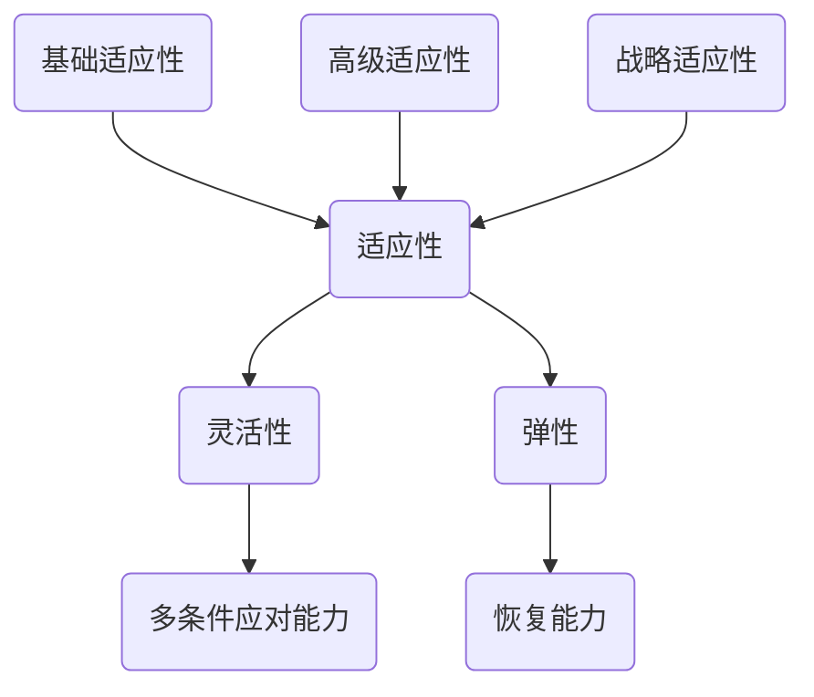

                 

### 第1章：问题的背景与定义

#### 1.1 问题的背景

**1.1.1 现代社会的变化速度**

现代社会正经历着前所未有的变化速度，这种变化不仅体现在技术层面，还渗透到经济、文化、社会等多个领域。技术的发展，尤其是人工智能、大数据和云计算的兴起，已经彻底改变了我们的生活方式和工作方式。这些技术的迅猛发展不仅带来了新机遇，也引发了新的挑战。比如，自动化和智能化的普及，使得某些职业面临被取代的风险，同时也催生了对新型技能的需求。

**1.1.2 个体在变化中的困境**

在这种快速变化的环境中，个体常常感到困惑和无助。一方面，他们可能无法及时掌握新技术，导致技能落后；另一方面，他们可能无法适应新环境的要求，导致职业发展受限。此外，社会的快速发展也带来了工作不稳定、经济波动等问题，进一步增加了个体的压力和焦虑。

**1.1.3 适应性的重要性**

适应性是指个体或组织在面对外部环境变化时，能够迅速作出反应、调整策略并采取行动的能力。在现代社会中，适应性的重要性不言而喻。它不仅是个人职业发展的关键，也是组织持续创新和发展的基础。具备高适应性的人或组织，能够在变化中抓住机遇，实现自我超越。

#### 1.2 适应性的定义

**1.2.1 适应性的概念**

适应性（Adaptability）通常被定义为个体或组织在面对外部环境变化时，能够快速做出调整的能力。这种调整不仅包括对现有资源的重新配置，还涉及对新技能和新知识的快速掌握。

**1.2.2 适应性的类型**

适应性可以划分为多个层次：

- **个人适应性**：指个体在面对变化时，能够迅速调整自己的行为和思维方式。
- **组织适应性**：指组织在应对外部环境变化时，能够灵活调整内部结构、流程和文化。
- **系统适应性**：指整个社会系统在面对全球性变化时，能够保持稳定并推动创新。

**1.2.3 适应性的必要性**

在快速变化的时代，适应性成为了一种基本生存技能。它不仅是应对变化的关键，也是实现自我超越和持续发展的基础。缺乏适应性的个体和组织，很难在激烈的市场竞争中立足。

#### 1.3 边界与外延

**1.3.1 适应性与其他概念的区分**

适应性不同于灵活性（Flexibility）和弹性（Resilience）。灵活性强调的是在多种条件下都能正常运作的能力，而弹性则强调在遭受打击后能够迅速恢复的能力。适应性则更侧重于面对环境变化时，能够迅速调整和适应的能力。

**1.3.2 适应性的层次结构**

适应性可以划分为三个层次：

- **基础适应性**：个体或组织能够对外部变化做出基本的反应，如调整工作流程或学习新技能。
- **高级适应性**：个体或组织能够预见变化，并采取主动措施进行准备和应对。
- **战略适应性**：个体或组织能够在变化中看到机遇，并利用这些变化推动自身的长期发展。

#### 1.4 核心概念与联系

**1.4.1 关键概念对比**

- **适应性**（Adaptability）vs**灵活性**（Flexibility）vs**弹性**（Resilience）
  - **适应性**：侧重于面对变化时的调整和适应。
  - **灵活性**：侧重于在多种条件下都能灵活应对。
  - **弹性**：侧重于在遭受打击后能够快速恢复。

- **基础适应性**vs**高级适应性**vs**战略适应性**
  - **基础适应性**：基本反应。
  - **高级适应性**：预见变化并主动应对。
  - **战略适应性**：看到机遇并推动长期发展。

**1.4.2 概念的Mermaid实体关系图**

#### 1.5 本章小结

本章首先介绍了现代社会变化速度的背景，并探讨了个体在变化中的困境。随后，我们详细定义了适应性的概念，并分析了其重要性。最后，本章对比了适应性、灵活性和弹性，并展示了适应性的层次结构。通过本章的学习，读者应该能够理解适应性的核心概念及其在不同情境下的应用。

### 第2章：提升认知灵活性

#### 2.1 认知灵活性的概念

**2.1.1 认知灵活性的定义**

认知灵活性（Cognitive Flexibility）是指个体在思考和处理信息时，能够灵活、快速地在不同模式、观点和策略之间切换的能力。这种能力不仅涉及对信息的理解，还包括对信息的创造性应用和重新组织。简而言之，认知灵活性是大脑在处理复杂问题时的一种适应性。

**2.1.2 认知灵活性的重要性**

认知灵活性在现代社会中具有重要性，原因如下：

- **创新力提升**：具备高认知灵活性的人能够从不同的角度看待问题，从而激发创新思维。
- **问题解决能力**：在面对复杂和多变的问题时，认知灵活性能够帮助个体迅速找到解决方案。
- **学习能力**：认知灵活性有助于个体快速掌握新知识和技能，提升学习效率。

**2.1.3 认知灵活性的评估**

评估认知灵活性通常涉及以下几个方面：

- **任务切换能力**：评估个体在不同任务之间快速切换的能力。
- **观点采择能力**：评估个体从不同角度理解问题的能力。
- **适应性思维**：评估个体在面对变化时的思维灵活性和适应性。

#### 2.2 提升认知灵活性的策略

**2.2.1 学习多样化技能**

学习多样化技能是提升认知灵活性的一种有效策略。通过学习不同领域的知识和技能，个体能够拓宽思维视野，增强在不同模式间切换的能力。例如，一个只熟悉编程的工程师，可以通过学习数据分析、设计思维等跨领域技能，提升自己的认知灵活性。

**2.2.2 增强反思与自我监控**

反思与自我监控是提升认知灵活性的关键步骤。通过定期反思自己的思考过程和行为模式，个体可以发现并纠正认知偏差，从而提高思维的灵活性和准确性。例如，在项目开发过程中，工程师可以通过反思和评估代码质量，不断优化代码结构和性能。

**2.2.3 挑战性思维训练**

挑战性思维训练可以帮助个体提升认知灵活性。这种训练通常涉及解决复杂问题、进行假设验证和创造性思维练习。例如，通过参与逻辑谜题、创意写作和辩论等活动，个体可以锻炼大脑的灵活性，提高在复杂情境中快速适应和解决问题的能力。

#### 2.3 实际案例分析

**2.3.1 案例一：成功适应变化的个人经历**

张华是一名软件工程师，在传统软件开发领域工作了多年。为了应对快速变化的市场和技术环境，他决定学习数据分析技能。通过参加在线课程和实战项目，他不仅掌握了数据分析的基本方法，还利用这些技能帮助公司优化了业务流程，提升了工作效率。这一经历不仅提升了他的职业竞争力，还显著提高了他的认知灵活性。

**2.3.2 案例二：组织层面的适应性提升**

某大型科技公司意识到，为了在激烈的市场竞争中保持领先地位，必须提升员工的认知灵活性。为此，公司实施了一系列培训计划，包括跨部门项目合作、思维训练工作坊和领导力发展课程。通过这些措施，员工不仅增强了跨领域技能，还培养了批判性思维和创新能力，公司整体的适应性显著提升。

#### 2.4 本章小结

本章首先介绍了认知灵活性的概念及其重要性，随后提出了提升认知灵活性的几种策略，并通过实际案例展示了这些策略的应用效果。通过本章的学习，读者应该能够理解认知灵活性的核心概念，并掌握提升认知灵活性的方法。

### 第3章：增强心理韧性

#### 3.1 心理韧性的概念

**3.1.1 心理韧性的定义**

心理韧性（Psychological Resilience）是指个体在面对压力、挫折和挑战时，能够迅速恢复并保持积极心态的能力。它不仅包括情感上的适应能力，还涉及认知上的灵活性、行为上的积极应对和社交支持的使用。简而言之，心理韧性是心灵在面对逆境时的“弹性”。

**3.1.2 心理韧性的重要性**

心理韧性在现代社会中具有显著的重要性，原因如下：

- **应对压力**：现代社会充满压力，具备高心理韧性的人能够更好地应对压力，保持心理健康。
- **恢复能力**：在遭遇挫折时，心理韧性有助于个体迅速恢复，减少负面情绪的影响。
- **长期健康**：心理韧性对个体的长期健康和幸福感有积极影响，有助于提高生活质量。

**3.1.3 心理韧性的构成**

心理韧性由多个关键要素构成：

- **情感调节能力**：个体能够有效管理自己的情绪，避免负面情绪的过度影响。
- **积极心态**：个体在面对挑战时，能够保持乐观和积极的态度。
- **适应性策略**：个体能够灵活应对变化，采取有效的应对策略。
- **社交支持**：个体能够充分利用社交资源，获得支持和帮助。

#### 3.2 增强心理韧性的方法

**3.2.1 正念练习**

正念练习是一种增强心理韧性的有效方法。通过正念，个体可以培养对当下时刻的专注和觉察，减少对过去和未来的过度担忧。正念练习包括冥想、呼吸练习和身体扫描等。例如，通过每天早晨进行10分钟的冥想，个体可以显著提高心理韧性，减少焦虑和压力。

**3.2.2 积极情绪的培养**

培养积极情绪是增强心理韧性的关键步骤。个体可以通过感恩练习、积极日记和自我激励等方法，培养积极情绪。例如，在每天结束之前，写下三件让自己感到感激的事情，可以帮助个体保持积极心态，增强心理韧性。

**3.2.3 应对策略的训练**

应对策略的训练是提升心理韧性的重要方法。个体可以通过角色扮演、情景模拟和实际应对练习，提高应对挑战的能力。例如，在面临重大决策时，通过模拟不同应对策略，个体可以更好地准备和应对各种情况，提高心理韧性。

#### 3.3 实际案例分析

**3.3.1 案例一：个体心理韧性的培养**

李梅是一名项目经理，在项目过程中经常面临各种挑战和压力。为了提升心理韧性，她开始进行正念练习，每天早晨进行冥想和呼吸练习。此外，她还通过阅读积极心理学书籍，学习各种应对策略。通过这些方法，李梅显著提高了心理韧性，能够更加冷静和有效地应对项目中的各种挑战。

**3.3.2 案例二：团队心理韧性的提升**

某公司团队在面临市场竞争压力时，决定通过团队建设活动提升心理韧性。公司组织了多次户外拓展训练，包括攀岩、绳索课程和团队合作游戏。通过这些活动，团队成员不仅增强了团队协作能力，还培养了积极心态和应对压力的能力，团队整体心理韧性显著提升。

#### 3.4 本章小结

本章首先介绍了心理韧性的概念及其重要性，随后提出了增强心理韧性的几种方法，并通过实际案例展示了这些方法的实用性。通过本章的学习，读者应该能够理解心理韧性的核心概念，并掌握提升心理韧性的方法。

### 第4章：建立有效的人际关系

#### 4.1 人际关系的概念

**4.1.1 人际关系的定义**

人际关系是指个体与个体之间，基于情感、认知和行为互动的连接。它不仅包括个人层面的关系，如友谊、家庭关系和爱情关系，还涵盖社会层面和组织层面的关系，如同事关系、团队协作和合作伙伴关系。人际关系是社会中不可或缺的一部分，对个体的心理健康和社会地位有重要影响。

**4.1.2 人际关系的重要性**

人际关系在个体的成长、发展和幸福中扮演着关键角色。以下是人际关系重要性的几个方面：

- **情感支持**：良好的人际关系能够为个体提供情感支持，帮助个体在面临压力和困难时保持心理平衡。
- **社会融入**：人际关系有助于个体融入社会，增强归属感和自尊心。
- **职业发展**：良好的人际关系能够促进职业发展，帮助个体在职场中获得更多的机会和资源。
- **心理健康**：研究表明，稳定和健康的人际关系对心理健康有显著积极影响，有助于减轻压力和抑郁症状。

**4.1.3 人际关系的类型**

人际关系可以根据不同标准进行分类：

- **水平关系**：指在同一社会地位或角色中的个体之间的关系，如同事关系。
- **垂直关系**：指在不同社会地位或角色中的个体之间的关系，如上下级关系。
- **亲密关系**：指基于情感深度和亲密程度的个体关系，如友谊和爱情关系。
- **工作关系**：指在职业环境中形成的个体关系，如同事和合作伙伴关系。

#### 4.2 建立有效人际关系的策略

**4.2.1 提高沟通能力**

提高沟通能力是建立有效人际关系的基础。有效的沟通包括倾听、表达清晰和适时的反馈。以下是一些提高沟通能力的策略：

- **积极倾听**：在沟通过程中，不仅要听对方说什么，还要关注对方的情感和非语言信息。
- **表达清晰**：确保自己的表达准确、明确，避免产生误解。
- **适时反馈**：在沟通中给予对方及时的反馈，帮助对方理解自己的想法和需求。

**4.2.2 培养同理心**

同理心是指能够从他人的角度理解问题，感同身受的情感能力。培养同理心有助于建立信任和深入的人际关系。以下是一些培养同理心的策略：

- **换位思考**：在处理人际关系时，尝试从对方的角度看待问题。
- **倾听并理解**：在沟通过程中，倾听对方的意见和感受，并努力理解对方的立场。
- **表达关心**：通过行动和语言表达对对方的关心和支持。

**4.2.3 解决冲突的技巧**

在人际关系中，冲突是不可避免的。有效的冲突解决技巧有助于维护良好的人际关系。以下是一些解决冲突的技巧：

- **冷静处理**：在冲突发生时，保持冷静，避免情绪化的行为。
- **开诚布公**：与对方进行开放和诚实的交流，表达自己的观点和感受。
- **寻求共识**：在冲突中寻找共同点和解决方案，避免对峙和对抗。

#### 4.3 实际案例分析

**4.3.1 案例一：个人人际关系的发展**

王丽是一名销售人员，她意识到良好的人际关系对职业成功至关重要。为了提升人际关系，她参加了沟通技巧培训，学习了积极倾听和同理心的技巧。同时，她开始定期与朋友和家人沟通，表达自己的关心和支持。通过这些努力，王丽的人际关系得到了显著改善，她的销售业绩也大幅提升。

**4.3.2 案例二：团队人际关系的优化**

某公司团队在面临项目压力时，发现人际关系紧张，影响了团队的协作效率。为了优化团队人际关系，公司管理层组织了团队建设活动，包括团队合作游戏和心理韧性培训。通过这些活动，团队成员之间的关系得到了加强，团队协作效率显著提高，项目成功完成。

#### 4.4 本章小结

本章首先介绍了人际关系的概念及其重要性，随后提出了建立有效人际关系的几种策略，并通过实际案例展示了这些策略的应用效果。通过本章的学习，读者应该能够理解人际关系的核心概念，并掌握建立有效人际关系的技巧。

### 第5章：适应性实践的应用

#### 5.1 适应性实践的概念

**5.1.1 适应性实践的定义**

适应性实践（Adaptive Practice）是指个体或组织在面对变化和不确定性时，通过持续的学习、调整和创新，实现可持续发展的过程。适应性实践不仅仅是一种应对策略，更是一种积极主动的行动，旨在从变化中寻找机遇，推动个人和组织的发展。

**5.1.2 适应性实践的重要性**

在快速变化和充满不确定性的现代社会，适应性实践的重要性体现在以下几个方面：

- **持续发展**：适应性实践有助于个体和组织在面对环境变化时，保持持续发展的动力和能力。
- **创新能力**：通过适应性实践，个体和组织能够不断学习新知识、新技能，培养创新能力，从而在竞争激烈的市场中立于不败之地。
- **风险管理**：适应性实践能够帮助个体和组织更好地识别和管理风险，减少由于环境变化带来的负面影响。
- **适应能力提升**：通过持续的适应性实践，个体和组织的适应能力得到提升，能够在变化中迅速作出反应，抓住机遇。

**5.1.3 适应性实践的步骤**

适应性实践通常包括以下几个步骤：

1. **问题识别**：识别当前面临的问题或挑战，明确变化的原因和影响。
2. **学习与准备**：通过学习和准备，积累应对变化所需的知识和技能，增强适应能力。
3. **调整与改进**：根据变化的情况，调整策略和行动，不断改进和完善。
4. **实施与监控**：实施适应性策略，并对其进行持续的监控和评估，确保其有效性。
5. **总结与反馈**：总结实践经验，为下一次适应性实践提供反馈和改进方向。

#### 5.2 适应性实践的应用场景

**5.2.1 职场中的应用**

在职场中，适应性实践可以帮助员工和团队更好地应对工作环境的变化和挑战。以下是一些具体的适应性实践应用场景：

- **岗位轮换**：通过岗位轮换，员工可以了解不同岗位的职责和要求，增强跨领域的适应能力。
- **持续学习**：鼓励员工参加培训和学习新技能，提升个人竞争力，适应不断变化的市场需求。
- **团队协作**：通过团队建设活动和跨部门合作，增强团队的适应能力和协作效率。
- **灵活的工作制度**：采用灵活的工作制度，如远程办公和弹性工作时间，提高员工的工作适应性和满意度。

**5.2.2 教育中的应用**

在教育领域，适应性实践可以帮助学生和教师更好地应对教育环境和教学方法的变革。以下是一些具体的适应性实践应用场景：

- **个性化教学**：根据学生的兴趣和能力，提供个性化的教学方案，提高学生的适应能力和学习效果。
- **项目式学习**：通过项目式学习，学生可以实际参与项目，培养解决问题的能力和创新思维。
- **终身学习理念**：倡导终身学习的理念，鼓励学生和教师不断学习和成长，适应社会和技术的变化。
- **教育技术应用**：利用教育技术，如在线学习平台和虚拟现实，提高教学的效果和适应性。

**5.2.3 社会服务中的应用**

在社会服务领域，适应性实践可以帮助组织和志愿者更好地应对社会变化和需求。以下是一些具体的适应性实践应用场景：

- **社区服务**：通过社区服务，组织和志愿者可以了解社区的需求和问题，提供更有效的服务。
- **危机应对**：在突发事件和危机中，适应性实践可以帮助组织和志愿者迅速响应，提供有效的援助。
- **社会创新**：通过社会创新，组织和志愿者可以探索新的服务模式和方法，提高服务的质量和效率。
- **可持续性发展**：通过适应性实践，组织和志愿者可以促进社会的可持续性发展，应对环境和社会问题。

#### 5.3 实际案例分析

**5.3.1 案例一：职场适应性实践**

某公司是一家高科技企业，为了应对快速变化的市场和技术环境，决定实施适应性实践。公司管理层制定了全面的培训计划，鼓励员工参加行业研讨会、技术培训和学习新技能。同时，公司推行了跨部门项目合作，员工有机会在不同岗位和项目中积累经验。通过这些措施，公司的员工适应能力显著提升，公司在市场竞争中保持了领先地位。

**5.3.2 案例二：教育适应性实践**

某学校意识到教育环境的变化对学生的适应能力提出了新的要求。为了培养学生的适应性，学校推行了项目式学习和个性化教学。教师通过项目式教学，将课程内容与实际生活相结合，激发学生的兴趣和创造力。同时，学校建立了个性化学习平台，根据学生的兴趣和能力提供定制化的学习方案。通过这些措施，学生的适应能力得到了显著提升，学习效果显著改善。

**5.3.3 案例三：社会服务适应性实践**

某社会服务组织在应对气候变化和社会变革时，决定实施适应性实践。组织开展了多项社区服务和环保项目，如垃圾分类、节能减排和社区教育。同时，组织利用社交媒体和在线平台，扩大服务范围和影响力。通过这些措施，组织的适应能力得到了显著提升，服务质量和覆盖面显著提高。

#### 5.4 本章小结

本章首先介绍了适应性实践的概念及其重要性，随后讨论了适应性实践在不同领域的应用场景，并通过实际案例展示了适应性实践的应用效果。通过本章的学习，读者应该能够理解适应性实践的核心概念，并掌握在不同场景下实施适应性实践的方法。

### 第6章：个人与组织层面的适应性战略

#### 6.1 个人层面的适应性战略

**6.1.1 个人适应性战略的制定**

个人适应性战略是指个体在职业生涯和个人生活中，制定的一系列应对变化和挑战的策略。以下是制定个人适应性战略的步骤：

1. **自我评估**：个体需要首先进行自我评估，了解自己的优势、劣势、兴趣和价值观。这有助于个体明确自己的目标和发展方向。
2. **环境分析**：个体需要分析外部环境，包括职业市场、行业趋势和技术发展等，了解可能面临的机遇和挑战。
3. **制定目标**：基于自我评估和环境分析，个体需要设定短期和长期目标，确保目标与个人价值观和职业发展相一致。
4. **策略规划**：个体需要制定具体的策略和行动计划，包括学习新技能、建立人际关系、参与项目等。
5. **持续评估**：个体需要定期评估战略的实施效果，根据反馈进行调整和优化。

**6.1.2 个人适应性战略的实施**

在实施个人适应性战略时，个体可以采取以下策略：

- **持续学习**：积极参与培训、研讨会和在线课程，不断更新知识和技能。
- **建立人际网络**：与同行建立良好的关系，获取行业信息和资源，增强社会支持。
- **积极应对挑战**：面对挑战时，保持积极心态，采取有效策略进行应对。
- **灵活调整**：根据环境变化和个人发展，灵活调整目标和策略。

**6.1.3 个人适应性战略的评估**

个人适应性战略的评估主要包括以下几个方面：

- **目标达成情况**：评估设定的目标是否实现，未达成的目标原因分析。
- **技能提升**：评估学习新技能的效果，包括知识掌握程度和实际应用能力。
- **适应能力**：评估个体在面对变化和挑战时的适应能力和应对效果。
- **反馈与改进**：收集反馈意见，针对不足进行改进，优化战略实施效果。

#### 6.2 组织层面的适应性战略

**6.2.1 组织适应性战略的制定**

组织适应性战略是指组织在应对外部环境变化时，制定的一系列策略和措施。以下是制定组织适应性战略的步骤：

1. **环境分析**：组织需要分析外部环境，包括市场趋势、技术发展、竞争对手和法律法规等，了解可能面临的机遇和挑战。
2. **内部评估**：组织需要评估内部资源和能力，包括人力资源、技术能力、组织结构和企业文化等。
3. **制定目标**：基于环境分析和内部评估，组织需要设定短期和长期目标，确保目标与组织愿景和战略相一致。
4. **策略规划**：组织需要制定具体的策略和行动计划，包括人才培养、技术创新、流程优化和组织文化建设等。
5. **资源分配**：组织需要根据策略规划，合理分配资源，确保各项计划的有效实施。

**6.2.2 组织适应性战略的实施**

在实施组织适应性战略时，组织可以采取以下策略：

- **人才培养**：通过培训、招聘和人才发展计划，提升员工的技能和素质，增强组织的创新能力。
- **技术创新**：投入资源进行技术研发和创新，开发新产品和服务，保持竞争优势。
- **流程优化**：通过流程再造和优化，提高组织的运营效率，降低成本。
- **文化建设**：培养积极向上的组织文化，增强员工的归属感和凝聚力，提高组织的整体适应性。

**6.2.3 组织适应性战略的评估**

组织适应性战略的评估主要包括以下几个方面：

- **目标达成情况**：评估设定的目标是否实现，未达成的目标原因分析。
- **绩效指标**：评估各项绩效指标，如销售额、市场份额、员工满意度等，了解战略实施的效果。
- **环境适应能力**：评估组织在面对环境变化时的适应能力和应对效果。
- **反馈与改进**：收集反馈意见，针对不足进行改进，优化战略实施效果。

#### 6.3 个人与组织适应性战略的协同作用

**6.3.1 战略协同的重要性**

个人与组织适应性战略的协同作用对于个体的职业发展和组织的长期成功至关重要。以下是战略协同的重要性：

- **资源整合**：个人与组织战略协同有助于整合个人和组织资源，实现资源的最优配置。
- **信息共享**：个人与组织战略协同有助于信息共享，提高决策质量和执行力。
- **协同创新**：个人与组织战略协同有助于激发创新思维，推动个人和组织的共同发展。
- **风险管理**：个人与组织战略协同有助于降低风险，提高应对环境变化的能力。

**6.3.2 战略协同的实践方法**

实现个人与组织战略协同可以通过以下方法：

- **建立沟通机制**：建立个人与组织之间的沟通机制，确保信息畅通，促进理解和支持。
- **共同目标设定**：明确个人与组织之间的共同目标，确保个人发展目标与组织战略一致。
- **培训与发展**：为个人和组织提供培训和发展机会，提升能力，实现协同发展。
- **绩效评估**：建立个人与组织绩效评估体系，确保个人和组织的战略协同得到有效执行。

**6.3.3 战略协同的案例分析**

某公司为了实现个人与组织战略的协同，采取了以下措施：

- **共同目标设定**：公司管理层与员工共同制定个人发展目标，确保与公司战略一致。
- **沟通机制**：公司建立了定期的沟通会议，确保个人与组织之间的信息畅通。
- **培训与发展**：公司为员工提供各种培训和发展机会，提升员工的技能和素质。
- **绩效评估**：公司建立了个人与组织绩效评估体系，根据评估结果调整个人和组织的战略。

通过这些措施，公司实现了个人与组织战略的协同，员工的发展得到了显著提升，公司整体绩效也取得了显著增长。

#### 6.4 本章小结

本章首先介绍了个人与组织层面的适应性战略，包括制定和实施的步骤，以及评估和改进的方法。随后，讨论了个人与组织战略的协同作用及其重要性，并通过实际案例展示了战略协同的效果。通过本章的学习，读者应该能够理解个人与组织适应性战略的核心概念，并掌握实施和协同的方法。

### 第7章：持续适应与终身学习

#### 7.1 持续适应的重要性

**7.1.1 持续适应的定义**

持续适应（Continuous Adaptation）是指个体或组织在面对不断变化的外部环境时，能够持续调整自身的行为、策略和结构，以保持竞争力和适应性的过程。持续适应不仅是一种应对策略，更是一种积极主动的实践，旨在从变化中寻找机遇，实现长期发展。

**7.1.2 持续适应的好处**

持续适应具有以下几个显著好处：

- **提高竞争力**：通过持续适应，个体和组织能够不断调整和优化，提高在竞争激烈的市场中的竞争力。
- **增强创新能力**：持续适应有助于个体和组织在面对新挑战时，能够迅速做出反应，创新思维和方法，推动发展。
- **降低风险**：持续适应能够帮助个体和组织识别和管理潜在的风险，降低由于环境变化带来的负面影响。
- **提高生活质量**：持续适应有助于个体在面对生活变化时，能够保持积极的心态，提高生活质量。

**7.1.3 持续适应的挑战**

尽管持续适应具有诸多好处，但实现持续适应也面临一些挑战：

- **信息过载**：在信息爆炸的时代，个体和组织需要处理大量的信息，筛选有用的信息并做出明智的决策，是一项巨大挑战。
- **心理压力**：持续适应可能导致个体和组织面临较大的心理压力，需要保持高度的心理韧性，以应对不断变化的环境。
- **资源限制**：实现持续适应需要投入大量的时间、精力和资源，个体和组织需要在有限的资源下进行有效的资源配置。

#### 7.2 终身学习的理念与实践

**7.2.1 终身学习的概念**

终身学习（Lifelong Learning）是指个体在整个生命过程中，持续获取知识、技能和态度，以适应社会发展的需求和自我发展的追求。终身学习不仅包括学校教育，还包括在职培训、自学、实践和互动学习等多种形式。

**7.2.2 终身学习的策略**

为了实现终身学习，个体和组织可以采取以下策略：

- **设定学习目标**：明确自己的学习目标和需求，制定合理的学习计划，确保学习过程有序进行。
- **多样化的学习方式**：利用各种学习资源和工具，如在线课程、图书、研讨会和实际项目，提高学习效率和质量。
- **积极参与互动学习**：通过参与讨论、交流和合作，与他人分享知识和经验，促进共同学习和成长。
- **自我评估与反馈**：定期对自己的学习过程和成果进行评估和反馈，识别不足并进行改进。

**7.2.3 终身学习的案例**

**案例一：个人层面的终身学习**

张伟是一名软件工程师，为了提升自己的职业竞争力，他采取了以下终身学习策略：

- **在线课程**：通过参加在线课程，学习最新的编程技术和框架，如人工智能和大数据处理。
- **实践项目**：参与开源项目，实际应用所学知识，提升自己的编程技能和项目经验。
- **学习社区**：加入技术社区，与同行交流，分享经验，获取行业动态和资源。

通过这些终身学习策略，张伟不仅提升了专业技能，还在职场中获得了更多的机会和认可。

**案例二：组织层面的终身学习**

某科技公司为了提升员工的专业技能和创新能力，采取了以下终身学习策略：

- **内部培训**：定期组织内部培训，邀请行业专家进行技术讲座和培训，提升员工的技能和知识水平。
- **在职学习**：鼓励员工参加外部培训和在线课程，提供学习津贴和奖励，支持员工持续学习。
- **项目式学习**：通过项目式学习，员工在实际项目中学习和应用新技能，提高实践能力和创新能力。

通过这些措施，公司员工的技能和创新能力得到了显著提升，公司在市场竞争中保持了领先地位。

#### 7.3 持续适应与终身学习的关系

**7.3.1 两者之间的联系**

持续适应与终身学习之间存在密切的联系。持续适应需要通过终身学习来获取新的知识和技能，以应对外部环境的变化。而终身学习则是实现持续适应的重要手段。两者相互促进，共同推动个体和组织的成长和发展。

**7.3.2 两者之间的互补性**

持续适应与终身学习具有互补性。持续适应强调的是在变化中迅速作出反应和调整，而终身学习则注重在长期中不断积累和提升。持续适应需要终身学习提供知识和技能支持，而终身学习则需要在持续适应的实践中不断验证和优化。

**7.3.3 两者之间的协同**

为了实现持续适应和终身学习的协同，个体和组织可以采取以下措施：

- **建立学习型文化**：营造鼓励学习、创新和持续改进的文化氛围，促进持续适应和终身学习。
- **设立学习目标**：明确个体和组织的长期和短期学习目标，确保持续适应和终身学习的方向一致。
- **资源整合**：整合内外部学习资源，为个体和组织提供多样化的学习机会和平台。
- **评估与反馈**：建立评估和反馈机制，定期评估持续适应和终身学习的效果，识别不足并进行改进。

#### 7.4 本章小结

本章首先介绍了持续适应的重要性，随后讨论了终身学习的理念与实践，并通过实际案例展示了两者之间的联系和互补性。通过本章的学习，读者应该能够理解持续适应和终身学习的核心概念，并掌握实现两者协同的方法。

### 总结与展望

本文通过系统性的分析和详细讲解，深入探讨了培养应对变化能力的重要性，并提出了提高生存适应性的策略和实践方法。首先，我们明确了适应性的定义和类型，分析了其核心概念与联系。接着，从提升认知灵活性、增强心理韧性、建立有效人际关系等多个角度，阐述了适应性能力的培养策略。随后，我们讨论了适应性实践在不同领域中的应用，并分析了个人与组织层面的适应性战略。最后，我们强调了持续适应与终身学习的重要性，并提供了具体的实践方法。

在快速变化的时代，具备高适应性能力不仅是个人职业发展的关键，也是组织持续创新和发展的基础。通过本文的学习，读者应该能够更好地理解适应性的概念，掌握提升适应性的方法和策略。

展望未来，随着技术的不断进步和社会的快速发展，适应性的要求将越来越高。个体和组织需要不断学习、调整和创新，以应对不断变化的挑战。因此，持续适应和终身学习将成为未来个体和组织发展的核心能力。我们鼓励读者将本文的理论和实践方法应用到实际工作中，不断实践和反思，以提升自身的适应性能力。

### 拓展阅读

- **《适应性思维：如何在变化中保持领先》**：本书详细探讨了适应性的概念和培养方法，提供了丰富的案例和实践指导，有助于读者深入理解适应性的本质和应用。

- **《终身学习手册：掌握未来必备技能》**：本书介绍了终身学习的理念和策略，通过案例分析和实践指南，帮助读者建立终身学习的习惯，提升自我发展能力。

- **《心理学与生活》**：这本书涵盖了心理韧性的重要概念和方法，通过生动的案例和科学的分析，帮助读者理解和培养心理韧性，提高生活质量。

- **《沟通的艺术》**：本书详细介绍了人际沟通的技巧和策略，包括倾听、表达、沟通障碍和冲突解决等，对建立有效人际关系具有重要参考价值。

### 注意事项

- **实践应用**：在实施适应性和终身学习策略时，要结合自身实际情况，制定合理的目标和计划，确保策略的有效实施。
- **定期反思**：定期对自己的适应性能力和学习成果进行反思和评估，识别不足并进行改进，以持续提升自身的能力。
- **灵活调整**：在面对变化和挑战时，要保持灵活性和开放心态，及时调整策略和行动，以应对新的情况。

### 最佳实践 Tips

- **制定明确目标**：在开始适应性和终身学习之前，设定明确的目标和计划，确保行动有方向。
- **利用在线资源**：利用在线课程、论坛和社区等资源，扩大学习范围和深度，提高学习效率。
- **建立学习社区**：与他人分享学习和实践经验，建立学习社区，促进共同成长和进步。
- **定期自我评估**：定期进行自我评估，了解自己的进步和不足，及时调整学习策略。

通过本文的深入学习，希望读者能够更好地理解适应性的重要性，掌握提升适应性的方法和策略，在快速变化的时代中保持领先地位。作者：AI天才研究院/AI Genius Institute & 禅与计算机程序设计艺术 /Zen And The Art of Computer Programming。

