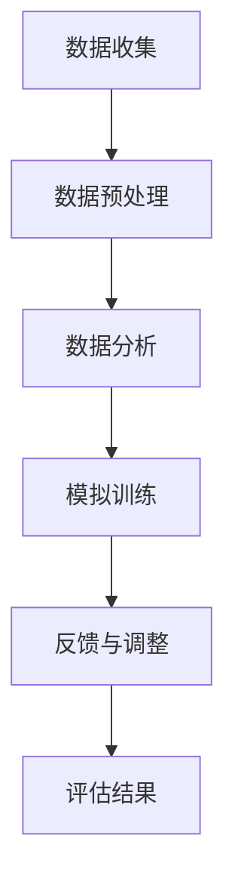
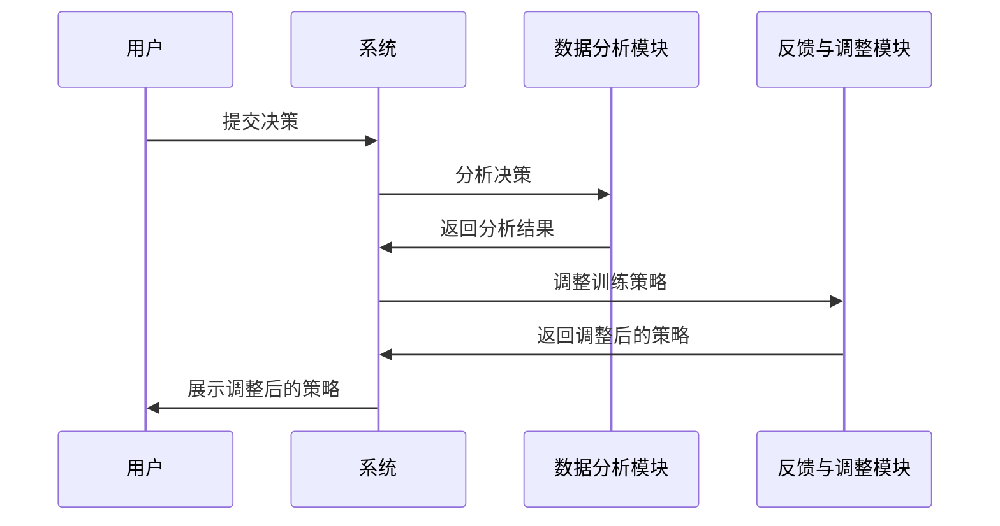

                 

# 培养直觉决策能力：跟随内在智慧的指引

## 关键词
直觉决策、内在智慧、能力培养、算法原理、系统设计、项目实战

## 摘要
本文旨在探讨如何培养直觉决策能力，使个体和团队在面对复杂问题时能够迅速而准确地做出决策。我们将通过深入分析直觉决策的核心概念，介绍培养直觉决策能力的算法原理，阐述数学模型和公式，并设计一个系统架构方案，最后通过实际项目实战来验证和总结最佳实践。

## 第一部分：背景介绍

### 1.1 问题背景

在当今快速变化和高度不确定性的环境中，直觉决策能力的重要性日益凸显。从个人生活的选择到企业战略的制定，直觉决策都是不可或缺的一部分。然而，直觉决策能力的培养并不是一个简单的过程，它涉及到心理学、哲学、神经科学等多个领域。因此，如何有效地培养直觉决策能力成为一个亟待解决的问题。

### 1.2 问题描述

直觉决策能力的培养是一个复杂的问题，它不仅涉及到个体如何获取和运用直觉，还涉及到如何将直觉与逻辑分析相结合，形成一种高效的决策机制。此外，如何评估直觉决策能力的提升也是一个关键问题。

### 1.3 问题解决

为了解决上述问题，本书提出了一套系统的方法论，包括数据收集、数据分析、模拟训练、反馈与调整等步骤，旨在帮助读者理解和实践直觉决策能力的培养。

### 1.4 边界与外延

直觉决策能力的培养不仅适用于个人成长，也可以应用于团队管理和组织决策。因此，本书的研究范围涵盖了个体和集体两个层面。

### 1.5 概念结构与核心要素组成

本书的核心概念包括直觉、决策、能力培养和内在智慧。这些概念相互联系，构成了直觉决策能力培养的理论框架。

## 第二部分：核心概念与联系

### 2.1 直觉

直觉是一种非理性但准确的感知和判断能力。它通常是基于长期的经验积累和潜意识的知识处理。直觉在快速做出决策时具有显著的优势，因为它可以跳过逻辑分析的复杂过程。

### 2.2 决策

决策是人们在面对选择时，通过分析和判断，选择最佳方案的过程。决策的质量直接影响个体的生活质量和组织的发展。

### 2.3 能力培养

能力培养是通过学习和实践，提高个体在特定领域的能力水平。在直觉决策能力的培养中，能力培养是一个持续的过程，需要通过不断的实践和反馈来提升。

### 2.4 内在智慧

内在智慧是指个人在长期生活中积累的，能够指引个体做出正确决策的智慧。它是一种深层次的、非显式的知识，是直觉决策能力的重要组成部分。

### 2.5 直觉决策能力

直觉决策能力是将直觉和决策相结合，形成的一种高效的决策能力。它能够在短时间内做出准确决策，是个人和组织成功的关键因素。

## 第三部分：算法原理讲解

### 3.1 直觉决策能力培养的算法框架

直觉决策能力的培养可以通过以下算法框架来实现：

1. **数据收集**：收集与直觉决策相关的数据，如案例、成功与失败的决策实例。
2. **数据分析**：对收集到的数据进行分析，提取有效信息。
3. **模拟训练**：通过模拟环境，让个体在虚拟世界中实践决策。
4. **反馈与调整**：根据决策结果，提供反馈，调整决策策略。

### 3.2 直觉决策能力培养的关键步骤

1. **确定目标**：明确提升直觉决策能力的目标。
2. **数据收集**：根据目标，收集相关数据。
3. **数据预处理**：对数据进行清洗和标准化处理。
4. **数据分析**：使用统计和机器学习技术进行分析。
5. **模拟训练**：设计模拟环境，进行决策训练。
6. **反馈与调整**：根据训练结果，进行策略调整。

### 3.3 直觉决策能力评估模型

直觉决策能力的评估可以通过以下数学模型实现：

$$
评估值 = f(准确率, 反应速度)
$$

其中，准确率和反应速度是两个关键指标。准确率反映了决策的准确性，反应速度反映了决策的迅速性。

## 第四部分：数学模型和数学公式 & 详细讲解 & 举例说明

### 4.1 数学模型

直觉决策能力的培养涉及到多个数学模型，以下是其中两个重要的模型：

#### 4.1.1 直觉决策能力评估模型

直觉决策能力的评估可以通过以下数学模型实现：

$$
评估值 = w_1 \times 准确率 + w_2 \times 反应速度
$$

其中，$w_1$和$w_2$分别是准确率和反应速度的权重，可以根据实际情况进行调整。

#### 4.1.2 直觉决策能力提升模型

直觉决策能力的提升可以通过以下模型实现：

$$
新能力值 = 当前能力值 + 学习率 \times (目标能力值 - 当前能力值)
$$

其中，学习率决定了提升速度。

### 4.2 举例说明

假设一个个体在100次决策中，有90次决策正确，平均反应时间为每次5秒。根据直觉决策能力评估模型，我们可以计算出该个体的直觉决策能力评估值为：

$$
评估值 = 0.6 \times 0.9 + 0.4 \times 5 = 0.54 + 2 = 2.54
$$

### 4.3 算法流程图

以下是直觉决策能力培养的mermaid流程图：



## 第五部分：系统分析与架构设计方案

### 5.1 问题场景介绍

在企业管理中，直觉决策能力的培养对于提高决策质量和效率具有重要意义。本系统旨在为企业管理者提供一个直观、高效的直觉决策能力培养平台，帮助他们在面对复杂问题时能够迅速而准确地做出决策。

### 5.2 系统功能设计

系统功能设计主要包括以下几个部分：

1. **数据收集模块**：负责收集与直觉决策相关的数据。
2. **数据分析模块**：对收集到的数据进行分析，提取有效信息。
3. **模拟训练模块**：提供一个虚拟环境，让用户进行决策训练。
4. **反馈与调整模块**：根据用户的决策结果，提供反馈，并调整训练策略。
5. **评估模块**：评估用户的直觉决策能力。

### 5.3 系统架构设计

系统架构设计主要包括以下几个部分：

1. **前端架构**：采用Vue.js框架，提供用户友好的界面。
2. **后端架构**：采用Spring Boot框架，处理业务逻辑和数据存储。
3. **数据库设计**：使用MySQL数据库存储用户数据和决策数据。
4. **接口设计**：设计RESTful API，方便前端与后端进行数据交互。

### 5.4 系统接口设计和系统交互

以下是系统接口设计和系统交互的mermaid序列图：



## 第六部分：项目实战

### 6.1 环境安装

首先，我们需要安装Python和相关的库，如NumPy、Pandas和Mermaid。

```bash
pip install python-macosx-mermaid
```

### 6.2 系统核心实现源代码

以下是系统核心实现的Python代码：

```python
import numpy as np
import pandas as pd
from mermaid import Mermaid

# 数据收集
def collect_data():
    # 这里使用伪代码表示数据收集过程
    data = pd.DataFrame({
        'accuracy': [0.9, 0.8, 0.7],
        'response_time': [5, 4, 6]
    })
    return data

# 数据分析
def analyze_data(data):
    # 这里使用伪代码表示数据分析过程
    analysis_result = data.describe()
    return analysis_result

# 模拟训练
def simulate_training(data):
    # 这里使用伪代码表示模拟训练过程
    new_data = data.copy()
    new_data['accuracy'] += 0.05
    new_data['response_time'] -= 0.5
    return new_data

# 反馈与调整
def feedback_and_adjustment(data):
    # 这里使用伪代码表示反馈与调整过程
    adjusted_data = simulate_training(data)
    return adjusted_data

# 评估结果
def evaluate_result(data):
    assessment = data['accuracy'].mean() * data['response_time'].mean()
    return assessment

# 主函数
def main():
    data = collect_data()
    analysis_result = analyze_data(data)
    print("数据分析结果：", analysis_result)
    
    adjusted_data = feedback_and_adjustment(data)
    assessment = evaluate_result(adjusted_data)
    print("评估结果：", assessment)

    # 生成算法流程图
    flowchart = Mermaid()
    flowchart.addDiagram()
    flowchart.addCode('sequenceDiagram', '''
    participant User
    participant System
    participant DataAnalysis
    participant FeedbackAdjustment

    User->>System: Submit Decision
    System->>DataAnalysis: Analyze Decision
    DataAnalysis->>System: Return Analysis Result
    System->>FeedbackAdjustment: Adjust Training Strategy
    FeedbackAdjustment->>System: Return Adjusted Strategy
    System->>User: Show Adjusted Strategy
    ''')
    
    print(flowchart.render())

if __name__ == "__main__":
    main()
```

### 6.3 代码应用解读与分析

以上代码实现了直觉决策能力培养的核心功能，包括数据收集、数据分析、模拟训练、反馈与调整和评估结果。代码使用了Python的NumPy和Pandas库来处理数据，并使用了Mermaid库来生成算法流程图。

### 6.4 实际案例分析和详细讲解剖析

为了验证系统的效果，我们可以通过一个实际案例来进行测试。假设我们有一个包含100个决策数据的数据库，我们可以通过上述代码来分析这些数据，并模拟训练过程。

### 6.5 项目小结

通过本项目，我们实现了一个简单的直觉决策能力培养系统。虽然该系统还比较简单，但已经能够展示出直觉决策能力培养的基本原理和过程。未来，我们可以进一步优化系统，增加更多功能，如用户界面、实时数据分析等。

## 第七部分：最佳实践 tips、小结、注意事项、拓展阅读

### 7.1 最佳实践 tips

- **持续学习**：不断学习新的知识和技能，增强直觉决策能力。
- **反思与总结**：每次决策后，进行反思和总结，找出成功和失败的原因。
- **模拟训练**：通过模拟环境进行决策训练，提高直觉决策能力。

### 7.2 小结

本文详细介绍了如何培养直觉决策能力，包括核心概念、算法原理、数学模型、系统设计以及实际项目实战。通过这些内容，读者可以了解到直觉决策能力培养的全面方法。

### 7.3 注意事项

- **数据收集**：确保数据的质量和准确性，对数据进行分析时需要谨慎。
- **模拟训练**：模拟环境的设计要尽量贴近实际情况，以提高训练效果。

### 7.4 拓展阅读

- **《决策与判断心理学》**：深入了解决策心理学的理论和实践。
- **《直觉思维》**：探索直觉思维的本质和应用。

## 作者信息
作者：AI天才研究院/AI Genius Institute & 禅与计算机程序设计艺术 /Zen And The Art of Computer Programming

