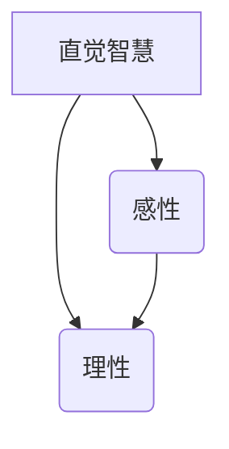

                 

## 引言

### 了解直觉智慧

直觉智慧，是人类认知过程中的重要组成部分，常常被定义为一种未经明确推理却能够迅速作出判断的能力。与理性思维不同，直觉智慧不依赖于逻辑推理和数据分析，而是基于经验和感知，通过一种自然而然的认知过程来识别和理解信息。在日常生活中，直觉智慧往往表现为我们对事物的快速反应和准确预判，例如，当我们初次见到一个人时，便能大致判断其性格特点；在复杂的情况下，我们能够迅速做出决策而不需要详细的计算和论证。

直觉智慧的重要性不言而喻。它不仅使我们在复杂和不确定性极高的环境中能够迅速适应和应对，还在艺术创作、科学发现、商业决策等多个领域发挥了至关重要的作用。例如，伟大的艺术家和科学家在创作和探索过程中，常常依赖于直觉智慧来捕捉灵感，发现新的可能性。直觉智慧还能帮助我们在处理海量信息和数据时，快速筛选出关键信息，从而提高效率和准确性。

然而，在当今这个理性思维主导的世界中，直觉智慧却常常被忽视。人们更加倾向于依赖数据和逻辑推理来做出决策，忽视了直觉在其中的重要作用。这种倾向导致了我们在某些时候无法快速、准确地应对复杂情况，甚至在面对某些问题时，陷入逻辑的泥潭而无法找到有效的解决方案。

本文旨在探讨直觉智慧的本质、重要性以及在现实生活中的应用，并提出一些培养直觉智慧的方法。通过这篇文章，我们希望能够重新审视直觉智慧的价值，鼓励读者在理性思维的基础上，重视和培养直觉智慧，使其成为我们认知和决策过程中的重要工具。

### 直觉智慧的核心概念与联系

直觉智慧是一种复杂的认知现象，其核心概念涉及感知、经验、情境等多个方面。为了更好地理解直觉智慧，我们需要将其与理性思维进行对比，分析其属性和特征。

首先，我们来看直觉智慧与理性思维的关系。理性思维是一种通过逻辑推理和数据分析来解决问题的过程，强调的是事实和证据的重要性。而直觉智慧则更多地依赖于个人的感知和经验，往往能够在缺乏明确证据的情况下迅速做出判断。二者虽然有所不同，但并非完全对立，实际上，它们在很多情况下是相辅相成的。例如，在一个复杂的商业决策中，理性思维可以提供详细的财务分析和市场预测，而直觉智慧则可以帮助决策者快速捕捉市场趋势和潜在风险，从而做出更全面的决策。

接下来，我们通过一张 ER（实体关系）图来展示直觉智慧与感性、理性之间的关系。

在这个图中，直觉智慧既与感性（感知和情感）相联系，也与理性（逻辑和推理）相关。感性为直觉智慧提供了丰富的感知和情感体验，而理性则为直觉智慧提供了逻辑和结构的支持。

### 直觉智慧的属性和特征

直觉智慧具有以下几个显著的属性和特征：

1. **快速反应**：直觉智慧能够在短时间内对复杂情境进行快速判断，从而迅速做出反应。这种快速反应能力使得直觉智慧在应急处理和决策过程中具有显著的优势。

2. **经验依赖**：直觉智慧依赖于个人的经验和知识积累。丰富的经验可以增强直觉的准确性，使个体在处理问题时更加得心应手。

3. **情境感知**：直觉智慧能够敏锐地感知当前情境，并迅速调整判断和决策。这种情境感知能力使得直觉智慧在面对动态变化时能够保持高适应性。

4. **非逻辑性**：尽管直觉智慧往往能够准确判断，但它并不依赖于逻辑推理。直觉智慧往往是一种未经深思熟虑的直观感受，这使得它在某些情况下能够突破常规逻辑的束缚。

5. **整体性**：直觉智慧倾向于从整体上理解和分析问题，而不是仅仅关注局部细节。这种整体性思考方式有助于我们在复杂情境中把握全局，做出更为全面的决策。

### 直觉智慧与理性思维的对比

| 特征         | 直觉智慧           | 理性思维           |
| ------------ | ------------------ | ------------------ |
| 过程         | 快速、非逻辑性     | 缓慢、逻辑性       |
| 依赖因素     | 经验、情境感知     | 数据、逻辑推理     |
| 反应时间     | 瞬间               | 长时间             |
| 适用场景     | 复杂、动态变化     | 结构化、稳定       |
| 确定性       | 不确定             | 确定               |
| 决策质量     | 高，但无法解释     | 高，可解释         |

通过以上对比，我们可以看出直觉智慧和理性思维各自的优势和局限性。在实际应用中，将二者结合，既能充分发挥直觉智慧的快速反应和整体性优势，又能利用理性思维的逻辑和结构化能力，从而在复杂多变的情境中做出更为有效的决策。

### 直觉智慧的起源与发展

直觉智慧的概念并非现代科学的产物，而是随着人类文明的发展逐渐被认识和理解。早在古希腊时期，哲学家苏格拉底和柏拉图就已经开始探讨理性和直觉之间的关系。他们强调理性思维的重要性，同时也认为直觉在特定情境下具有不可忽视的作用。亚里士多德则进一步提出了“智慧”（Sophia）的概念，认为智慧不仅包括理性推理，还包括直觉和洞察力。

进入中世纪，宗教和哲学思想对直觉智慧的发展产生了深远影响。基督教神学家奥古斯丁认为，直觉智慧是上帝赋予人类的一种神圣能力，使人类能够直接认识真理。这种观点在当时的学术界和社会中得到了广泛的认可，使得直觉智慧在宗教和哲学领域占据了重要地位。

然而，随着文艺复兴的兴起，理性和科学方法逐渐取代了直觉和信仰的地位。启蒙运动时期的科学家们，如伽利略和牛顿，通过实验和观察，揭示了自然界的规律，推动了科学方法的普及。在这个时期，理性思维被视为获取知识的最佳途径，直觉智慧则被视为一种次要的、甚至不科学的认知方式。

进入20世纪，心理学和认知科学的兴起为直觉智慧的研究提供了新的视角和方法。瑞士心理学家卡尔·荣格（Carl Jung）提出了“直觉功能”的概念，认为直觉是人类认知过程中的一个重要组成部分。美国心理学家威廉·詹姆斯（William James）也在其《心理学原理》一书中，详细探讨了直觉的本质和作用。

在认知科学领域，心理学家乔治·米勒（George A. Miller）和唐纳德·诺曼（Donald Norman）等人的研究进一步深化了人们对直觉智慧的理解。米勒提出了“有限容量假设”，指出人类认知系统在处理信息时存在容量限制，这使得直觉智慧成为了一种高效的信息处理方式。诺曼则通过其“认知科学框架”，探讨了直觉智慧在用户界面设计和用户体验中的作用。

近年来，随着人工智能和机器学习技术的发展，直觉智慧的研究也取得了新的进展。研究人员通过神经网络和深度学习模型，试图模拟和解释人类的直觉思维过程。例如，深度神经网络在图像识别和自然语言处理等领域，表现出与人类直觉相似的能力，这为直觉智慧的研究提供了新的工具和方法。

### 直觉智慧在现实生活中的应用

直觉智慧在现实生活中的应用广泛而深远，无论是在个人生活中，还是在商业、艺术和科技等领域，都有着不可替代的作用。以下将详细探讨直觉智慧在几个主要领域的应用，以及其在这些领域的具体表现和优势。

#### 商业决策

在商业领域，直觉智慧往往能够帮助决策者快速识别市场机会和潜在风险。例如，在创业过程中，企业家需要不断评估市场需求、竞争态势和资金流动，直觉智慧可以帮助他们在面对不确定性时，快速做出决策。一个经典的案例是苹果公司的创始人史蒂夫·乔布斯。他在产品设计和市场营销方面展现出了非凡的直觉智慧，能够准确地捕捉消费者需求，并推出深受市场欢迎的产品。

直觉智慧在商业决策中的优势在于其快速性和整体性。通过直觉，决策者可以快速把握关键信息，并在复杂的市场环境中做出全面的判断。这种能力在快速变化的市场环境中尤为重要，能够帮助企业在竞争中脱颖而出。

#### 艺术创作

艺术创作是直觉智慧的重要领域之一。艺术家在创作过程中，常常依赖于直觉来捕捉灵感，表达情感和思想。例如，画家在绘制一幅画作时，直觉智慧可以帮助他们迅速确定构图、色彩和线条的安排，创造出具有感染力的艺术作品。

在文学创作中，直觉智慧同样发挥着重要作用。作家在构思故事情节和塑造人物形象时，往往能够通过直觉迅速捕捉到故事的节奏和情感氛围。这种能力使得文学作品更具表现力和感染力，能够深入人心。

#### 科学发现

科学领域也是直觉智慧的重要应用场景。科学家在探索未知领域时，直觉智慧可以帮助他们捕捉灵感，提出新的假设和理论。例如，物理学家阿尔伯特·爱因斯坦在提出相对论时，就是依靠直觉智慧，通过深入思考和敏锐的洞察力，发现了时间与空间的相对性。

直觉智慧在科学发现中的优势在于其能够突破常规思维，发现新的科学现象和规律。科学家的直觉往往能够在他们深入研究之前，提供一个方向性的指引，帮助他们找到解决问题的突破口。

#### 用户界面设计

在用户界面设计领域，直觉智慧同样具有重要的应用价值。一个好的用户界面应该让用户在使用过程中感到直观、自然，而直觉智慧在设计过程中起到了关键作用。例如，设计师在设计移动应用界面时，需要考虑用户的操作习惯和使用场景，通过直觉智慧来优化界面布局和交互设计，提高用户的体验。

直觉智慧在用户界面设计中的优势在于其能够模拟用户的感知和操作方式，帮助设计师创建出更加符合用户需求和使用习惯的界面。通过直觉，设计师可以快速识别出界面中可能存在的问题，并做出相应的调整。

#### 医疗诊断

在医疗领域，直觉智慧也被广泛应用于诊断和治疗过程中。医生在诊断疾病时，不仅依赖于医学知识和实验室检测结果，还常常依赖于直觉智慧。通过多年的临床经验和观察，医生能够迅速识别出症状和体征，做出准确的诊断。

在治疗过程中，直觉智慧同样发挥着重要作用。医生需要根据患者的具体情况进行综合判断，选择最合适的治疗方案。这种能力不仅依赖于医学知识，还需要丰富的临床经验和敏锐的直觉。

### 直觉智慧的优势

直觉智慧在现实生活中的应用之所以广泛且有效，主要得益于其以下几个优势：

1. **快速反应**：直觉智慧能够在短时间内对复杂情境进行快速判断和决策，使个体能够迅速适应环境和变化。

2. **经验依赖**：直觉智慧依赖于个人的经验和知识积累，丰富的经验可以增强直觉的准确性和可靠性。

3. **整体性思考**：直觉智慧能够从整体上理解和分析问题，帮助个体在复杂和不确定的环境中做出更为全面的决策。

4. **非逻辑性**：直觉智慧不受逻辑推理的限制，能够突破常规思维，发现新的解决方案和思路。

5. **高效性**：直觉智慧能够高效地处理海量信息，筛选出关键信息，提高决策的效率和准确性。

### 结论

直觉智慧在现实生活中的应用广泛而深远，无论是在个人生活中，还是在商业、艺术和科技等领域，都有着不可替代的作用。通过培养和发挥直觉智慧，我们可以更好地应对复杂多变的环境，做出更加准确和高效的决策。在理性思维的基础上，重视和培养直觉智慧，将使我们在认知和决策过程中更加全面和灵活。因此，我们应当重新审视直觉智慧的价值，积极探索其在各个领域的应用，使其成为我们认知和决策过程中不可或缺的工具。

### 培养直觉智慧的技巧

直觉智慧并非与生俱来，它需要通过后天的培养和训练来逐渐提升。以下是一些具体的方法和技巧，可以帮助我们在日常生活中逐步培养和增强直觉智慧。

#### 1. 经验积累

经验是直觉智慧的重要基础。通过不断积累经验和知识，我们能够更好地理解和预测各种情境。以下是一些积累经验的方法：

- **持续学习**：学习新的知识和技能，不断扩展自己的知识面。这不仅可以帮助我们更好地理解世界，还能为直觉智慧提供丰富的素材。
- **实践锻炼**：将所学知识应用于实际生活和工作中，通过实践来验证和加深理解。例如，学习编程后，通过编写代码来实际应用。
- **反思总结**：在经历每一个事件后，进行反思和总结，分析自己的决策过程和结果，从中吸取经验和教训。

#### 2. 情境感知

情境感知是直觉智慧的重要组成部分。通过敏锐地感知周围的环境和情境，我们能够更好地理解当前的状态，做出更准确的判断。以下是一些提升情境感知的方法：

- **多角度观察**：尝试从不同的角度和视角来观察问题，这可以帮助我们更全面地了解情境。例如，在评估一个市场机会时，不仅要考虑当前的市场趋势，还要关注潜在的风险和竞争态势。
- **保持警觉**：在日常生活中，保持高度的警觉性，注意观察周围的变化和细微的迹象。这种警觉性可以帮助我们在关键时刻做出迅速反应。
- **记录和分析**：记录自己的观察和体验，定期进行分析和总结。通过记录和分析，我们可以更好地理解自己的感知模式，并逐步提升情境感知能力。

#### 3. 冥想与放松

冥想和放松是培养直觉智慧的有效方法。通过冥想，我们可以静心养性，减少外界干扰，从而更清晰地感知内在的信息。以下是一些冥想和放松的技巧：

- **专注呼吸**：通过专注于呼吸，我们可以将注意力从外界引向内心，达到放松和平静的状态。这有助于提升我们的感知能力和直觉智慧。
- **静坐冥想**：每天抽出一定的时间进行静坐冥想，可以帮助我们培养专注力和内在感知力。在冥想过程中，尝试不进行任何思考，只是静静地感受自己的存在和呼吸。
- **放松训练**：通过渐进性肌肉放松训练，我们可以逐步放松身体的各个部位，达到身心的平静。这种放松状态有助于我们更好地倾听内心的声音，提高直觉智慧。

#### 4. 观察与体验

通过观察和体验，我们可以积累丰富的感性认识，从而提升直觉智慧。以下是一些具体的观察和体验方法：

- **自然观察**：在日常生活中，多关注自然界中的现象和变化，例如季节的更替、天气的变化、植物的生态等。通过观察自然，我们可以提升对环境变化的敏感度，培养直觉智慧。
- **艺术体验**：参与艺术创作和欣赏，如绘画、音乐、舞蹈等，可以激发我们的感官体验和情感认知，从而提升直觉智慧。
- **社交互动**：通过与他人交流和互动，我们可以更好地理解他人的情感和需求，从而提升我们的社会感知能力和直觉智慧。

#### 5. 持续实践

培养直觉智慧需要长期的努力和坚持。以下是一些持续实践的建议：

- **定期练习**：将培养直觉智慧的方法融入日常生活中，定期进行实践。例如，每天花几分钟进行冥想，每周进行一次情境感知练习。
- **反思与调整**：在实践过程中，不断反思自己的感知和决策，分析其有效性，并据此进行调整和改进。
- **持续学习**：不断学习新的知识和技能，扩展自己的认知边界。通过不断学习，我们可以提升自己的认知水平和直觉智慧。

通过以上方法和技巧，我们可以逐步培养和增强直觉智慧，使其成为我们认知和决策过程中的重要工具。在理性思维的基础上，发挥直觉智慧的优势，将使我们在面对复杂情境时更加得心应手，做出更加准确和高效的决策。

### 通过冥想和放松培养直觉智慧

冥想和放松是培养直觉智慧的两种重要方法，它们通过降低心理压力和增强内在感知，有助于提升我们的直觉能力。以下将详细探讨冥想和放松的具体方法，以及它们对直觉智慧的促进作用。

#### 冥想

冥想是一种古老而有效的放松技巧，它通过集中注意力、减少思维杂念，帮助我们进入一种平和的状态。以下是一些冥想的方法：

1. **专注呼吸冥想**：这是一种最常见的冥想方法。通过专注于呼吸，我们可以将注意力从外界引向内心，达到放松和平静的状态。具体步骤如下：
   - 找一个安静的环境，坐直或舒适的姿势。
   - 关闭眼睛，专注于自己的呼吸。每次吸气时，感受肺部膨胀，每次呼气时，感受肺部收缩。
   - 如果你的思维开始偏离呼吸，不要担心，只需轻轻将注意力引回呼吸。
   - 持续冥想10-15分钟，逐渐增加时间。

2. **曼陀罗冥想**：曼陀罗冥想通过集中注意力在曼陀罗图案上，帮助冥想者进入冥想状态。具体步骤如下：
   - 准备一张曼陀罗图案，可以选择复杂的图案。
   - 坐在安静的环境中，将注意力集中在曼陀罗图案的中心，尝试不思考任何其他事物。
   - 当你的思维开始漂移时，轻轻将注意力引回曼陀罗图案。

3. **指导性冥想**：通过聆听指导性冥想音频，可以引导冥想者进入冥想状态。这种冥想方法特别适合初学者。具体步骤如下：
   - 找到一个安静的房间，播放冥想音频。
   - 跟随指导者的引导，放松身体和心灵。
   - 放松10-15分钟，感受内心的平静。

#### 放松

放松技巧通过减少身体的紧张和焦虑，有助于提高我们的内在感知力和直觉智慧。以下是一些放松的方法：

1. **渐进性肌肉放松**：这是一种逐步放松身体各个部位的技巧，可以帮助我们达到深度放松。具体步骤如下：
   - 从头部开始，逐渐向下到脚部，依次放松身体的各个部位。
   - 在每个部位，先紧绷肌肉，然后放松，感受肌肉的放松感。
   - 持续练习10-15分钟。

2. **深呼吸**：通过深呼吸，我们可以减缓心跳，降低血压，达到放松的效果。具体步骤如下：
   - 坐或躺在一个舒适的位置。
   - 放松肩膀和身体，慢慢吸气，感受腹部膨胀。
   - 然后慢慢呼气，感受腹部收缩。
   - 持续深呼吸10-15分钟。

3. **瑜伽**：瑜伽不仅是一种运动，也是一种放松技巧。通过瑜伽的姿势和呼吸练习，我们可以达到身心的放松和平静。具体步骤如下：
   - 选择适合的瑜伽课程，跟随指导者的引导。
   - 在练习过程中，专注于呼吸和身体的感受。
   - 持续练习30-60分钟。

#### 对直觉智慧的促进作用

冥想和放松对直觉智慧的促进作用主要体现在以下几个方面：

1. **减少心理压力**：心理压力会影响我们的思维清晰度，降低直觉能力。通过冥想和放松，我们可以减少心理压力，提高专注力和感知力，从而提升直觉智慧。

2. **增强内在感知**：冥想和放松有助于我们更好地感知内在情绪和想法，增强内在感知力。这种感知力是直觉智慧的重要组成部分，通过冥想和放松，我们可以更好地捕捉和利用内在信息。

3. **提高心理灵活性**：冥想和放松可以帮助我们培养心理灵活性，使我们能够更好地应对复杂和不确定的环境。心理灵活性是直觉智慧的重要属性，通过冥想和放松，我们可以提高心理灵活性，从而提升直觉智慧。

4. **改善情绪状态**：冥想和放松有助于改善情绪状态，使我们更加平和和积极。积极的心态有助于我们更好地思考和决策，从而提升直觉智慧。

### 结论

通过冥想和放松，我们可以有效地培养和提升直觉智慧。冥想和放松不仅可以帮助我们减少心理压力，增强内在感知，提高心理灵活性，还能改善情绪状态。这些因素共同作用，使我们能够在复杂和不确定的环境中，做出更加准确和高效的决策。因此，我们应当将冥想和放松融入日常生活，持续实践，以提升直觉智慧，使其成为我们认知和决策过程中不可或缺的工具。

### 通过观察和体验培养直觉智慧

在日常生活中，通过观察和体验，我们可以有效地培养直觉智慧。这种方法不仅帮助我们提高对周围环境的感知能力，还能增强我们的决策力和应变能力。以下是一些具体的观察和体验方法，以及它们对直觉智慧培养的促进作用。

#### 1. 自然观察

自然观察是一种重要的培养直觉智慧的方法。通过仔细观察自然界中的各种现象，我们可以提升对变化和模式的感知能力。

- **观鸟**：观鸟是一种培养直觉智慧的好方法。在观察鸟类行为时，我们需要敏锐地捕捉它们的飞行轨迹、鸣叫和姿态。这些观察不仅有助于我们理解鸟类的生活习性，还能提升我们的观察力和直觉能力。
- **赏花**：赏花也是一种有效的自然观察活动。通过观察花朵的颜色、形状和结构，我们可以学习如何从细节中捕捉美丽和规律。这种观察习惯可以帮助我们在日常生活中，更好地发现和欣赏生活中的美好。

#### 2. 社交互动

社交互动是培养直觉智慧的另一个重要途径。通过与他人交流和互动，我们可以提升对他人情感和需求的感知能力。

- **倾听**：倾听是一种重要的社交技能。在对话中，通过倾听对方的言辞、语调和面部表情，我们可以更好地理解对方的情绪和需求。这种倾听能力不仅有助于提升人际交往，还能增强我们的直觉智慧。
- **参与社区活动**：参与社区活动，如志愿者服务、社区讨论等，可以帮助我们更好地了解社会动态和社区需求。这种体验让我们能够从不同的角度观察和思考问题，从而培养直觉智慧。

#### 3. 艺术体验

艺术体验，如绘画、音乐和舞蹈，可以激发我们的感官体验和情感认知，从而提升直觉智慧。

- **绘画**：通过绘画，我们可以观察和表达物体的形状、颜色和线条。这种艺术形式要求我们细致入微地观察对象，从而提升我们的观察力和直觉能力。
- **音乐**：音乐是一种强大的情感表达工具。通过聆听不同类型的音乐，我们可以感受到不同的情感氛围，这种体验有助于我们培养对情感和氛围的感知能力。
- **舞蹈**：舞蹈不仅是一种身体运动，也是一种情感和思想的表达。在舞蹈中，我们需要敏锐地感知节奏和情感变化，这种体验有助于提升我们的直觉智慧。

#### 4. 实践体验

通过实践活动，我们可以将理论知识和实践经验相结合，从而提升直觉智慧。

- **户外探险**：户外探险，如登山、露营等，可以帮助我们面对未知的挑战和变化。在探险过程中，我们需要根据环境和条件做出快速决策，这种实践有助于培养我们的应变能力和直觉智慧。
- **学习新技能**：学习新技能，如编程、烹饪等，不仅能够扩展我们的知识面，还能提升我们的实践能力和直觉智慧。在学习过程中，通过不断尝试和调整，我们可以更好地理解问题，提高直觉判断的准确性。

#### 对直觉智慧培养的促进作用

通过观察和体验，我们可以从以下几个方面促进直觉智慧的培养：

1. **提高感知能力**：观察和体验让我们能够更敏锐地捕捉周围的环境变化和细微的细节，从而提高我们的感知能力。
2. **增强情感认知**：通过社交互动和艺术体验，我们可以更好地理解和感知他人的情感和需求，增强我们的情感认知能力。
3. **提升应变能力**：实践体验，如户外探险和学习新技能，帮助我们面对未知的挑战和变化，提升我们的应变能力。
4. **培养整体性思考**：观察和体验让我们能够从多个角度和层面来理解和分析问题，从而培养整体性思考能力。

### 结论

通过观察和体验，我们可以有效地培养直觉智慧。自然观察、社交互动、艺术体验和实践体验等多种方法，不仅帮助我们提升感知能力和情感认知，还增强我们的应变能力和整体性思考能力。这些因素共同作用，使我们能够在复杂和不确定的环境中，做出更加准确和高效的决策。因此，我们应当积极利用日常生活中的观察和体验，持续培养和提升我们的直觉智慧。

### 直觉智慧在商业决策中的应用

在商业决策中，直觉智慧作为一种快速、高效的信息处理方式，被广泛应用于市场分析、风险评估和战略规划等各个方面。以下将详细探讨直觉智慧在商业决策中的实际应用案例，以及它在这些领域所发挥的关键作用。

#### 市场分析

市场分析是商业决策的重要环节，它帮助企业在竞争激烈的环境中找到合适的定位和发展方向。直觉智慧在市场分析中具有独特的优势：

- **快速洞察市场趋势**：通过直觉，企业领导者可以快速捕捉到市场趋势和消费者需求的变化。例如，一位市场总监在参加一个行业会议时，通过观察与会者的讨论和提问，迅速意识到市场上对某种新型产品的需求正在增长。基于这种直觉洞察，企业可以及时调整产品策略，抢占市场先机。

- **灵活应对市场变化**：在快速变化的市场环境中，直觉智慧可以帮助企业迅速做出调整，以应对新的挑战。例如，一家电子商务公司在其电商平台上线初期，通过直觉判断，发现某些产品的销售情况不如预期。基于这种直觉，公司迅速调整了营销策略，通过增加广告投放和优惠活动，成功提升了这些产品的销量。

#### 风险评估

在商业决策中，风险评估是确保企业稳健发展的重要一环。直觉智慧在风险评估中同样发挥着重要作用：

- **识别潜在风险**：通过直觉，企业管理者可以敏锐地识别出潜在的风险因素。例如，一位企业高管在参加一个项目讨论会时，通过直觉感知到该项目存在技术实现的困难。基于这种直觉，企业可以提前制定应对措施，降低项目失败的风险。

- **评估风险程度**：直觉智慧可以帮助企业管理者对风险的程度进行快速评估。例如，在评估某个投资项目的风险时，企业高管可以通过直觉感知到项目的成功概率和潜在损失。这种快速评估能力有助于企业做出更明智的投资决策。

#### 战略规划

战略规划是企业长期发展的指南，直觉智慧在战略规划中同样具有重要应用价值：

- **预见市场机会**：直觉智慧可以帮助企业预见市场机会，从而制定前瞻性的战略计划。例如，一家科技创新企业在研发新产品时，通过直觉判断，意识到市场上即将出现某种新的需求。基于这种直觉，企业可以提前布局，开发符合市场需求的新产品，从而抢占市场先机。

- **优化战略方案**：在制定战略方案时，直觉智慧可以帮助企业快速评估不同方案的优劣，从而选择最优方案。例如，在制定企业扩张计划时，企业高管可以通过直觉感知到某些地区的市场潜力和竞争态势。这种直觉判断有助于企业制定出更加有效的扩张策略。

#### 案例分析

以下是一个直觉智慧在商业决策中应用的案例分析：

**案例背景**：某家电制造企业在面临产品更新换代的关键时期，需要决定是否开发一款新型家电产品。

**问题情境**：企业在市场调研和数据分析后，发现市场上对新型家电产品的需求不断增加，但具体的产品定位和功能设计仍存在不确定性。

**直觉判断**：企业负责人通过多年的市场经验和直觉判断，认为这款新型家电产品应具备智能化、节能化等特点，并具有较强的市场竞争力。

**决策过程**：基于直觉判断，企业决定开展新型家电产品的研发。在研发过程中，企业不断优化产品设计，并密切关注市场反馈。最终，新产品成功上市，并获得了消费者的广泛认可，为企业带来了显著的市场份额和利润。

**结果评估**：通过直觉智慧的成功应用，企业在竞争激烈的市场环境中迅速占领了先机，不仅提升了品牌知名度，还实现了销售收入的显著增长。

#### 结论

直觉智慧在商业决策中具有广泛的应用价值，特别是在市场分析、风险评估和战略规划等方面。通过直觉，企业领导者可以快速洞察市场变化，识别潜在风险，预见市场机会，并做出更加明智的决策。然而，直觉智慧并非万能，它需要与理性思维和数据分析相结合，才能发挥最大的效果。因此，在实际应用中，企业应将直觉智慧与理性方法相结合，以实现更加精准和高效的商业决策。

### 直觉智慧在艺术创作中的体现

直觉智慧在艺术创作中的体现无疑是生动且深刻的。艺术家们通过直觉，捕捉灵感，表达情感，创作出极具感染力和表现力的艺术作品。以下将详细探讨直觉智慧在艺术创作中的具体应用，以及它在艺术创作过程中的重要作用。

#### 灵感的捕捉

灵感是艺术创作的源泉，而直觉智慧在灵感的捕捉中起着至关重要的作用。艺术家们往往能在一瞬间通过直觉感知到某个场景、情感或思想，从而激发创作灵感。

- **场景的瞬间感知**：许多艺术作品是基于艺术家对某个特定场景的直觉感知创作的。例如，画家在旅行途中，可能因为某个风景或建筑而灵感迸发，迅速完成一幅画作。这种瞬间感知能力使艺术家能够将瞬间的美感定格在画布上，创造出令人惊叹的艺术作品。
- **情感的直觉表达**：在音乐创作中，直觉智慧同样发挥着重要作用。作曲家往往能够通过直觉捕捉到内心的情感波动，并将其转化为旋律和和声。贝多芬的《第九交响曲》就是一个典型的例子，他在创作这首作品时，通过直觉感知到人类团结和自由的力量，最终创作出了这部具有史诗般力量的经典作品。

#### 创作过程中的指导

直觉智慧不仅在灵感的捕捉中发挥作用，还在艺术创作的过程中提供指导，帮助艺术家做出关键性的决策。

- **构图的选择**：在绘画和摄影中，直觉智慧可以帮助艺术家选择最佳的构图。通过直觉感知，艺术家能够迅速判断哪些元素应该突出，哪些元素需要弱化，从而创造出平衡和谐的作品。例如，摄影大师安妮·莱博维茨在拍摄肖像时，通过直觉感知被摄者的情绪和特质，选择最合适的构图和光线，创作出极具表现力的作品。
- **色彩的运用**：色彩在艺术创作中具有极其重要的地位。直觉智慧可以帮助艺术家选择最适合作品情感表达的色彩。例如，梵高的画作《星夜》通过直觉选择强烈的蓝色和黄色，传达出狂热和不安的情感，使作品具有强烈的视觉冲击力。

#### 艺术家的直觉体验

艺术家的直觉体验是他们在创作过程中不可或缺的一部分。通过直觉，艺术家能够深入内心，找到表达自我和情感的最佳方式。

- **内心的探索**：许多艺术作品是艺术家内心世界的反映。通过直觉，艺术家能够深入探索自己的内心，挖掘情感和思想的深度。例如，作家弗吉尼亚·伍尔夫通过直觉，深入描绘了人物内心的复杂情感和思想，创作出了《到灯塔去》等经典作品。
- **个性化的表达**：直觉智慧使艺术家能够以独特的方式表达自己的思想和情感。通过直觉，艺术家能够找到属于自己的表达风格和方式，创作出具有个人特色的作品。例如，毕加索的作品充满了创新和个性，通过直觉，他不断突破传统的束缚，创作出独特的艺术风格。

#### 直觉智慧在艺术创作中的重要作用

直觉智慧在艺术创作中的重要作用体现在以下几个方面：

1. **灵感的激发**：直觉智慧能够帮助艺术家快速捕捉灵感，为创作提供源源不断的动力。
2. **决策的指导**：直觉智慧在艺术创作过程中提供关键性的指导，帮助艺术家做出最佳的选择，包括构图、色彩、材质等。
3. **情感的表达**：直觉智慧使艺术家能够更深刻地表达情感和思想，创作出具有感染力的艺术作品。
4. **个性化的创作**：直觉智慧帮助艺术家找到独特的表达方式，创作出具有个人特色的艺术作品。

### 结论

直觉智慧在艺术创作中具有不可替代的重要作用。通过直觉，艺术家能够捕捉灵感，表达情感，创作出具有深刻内涵和强烈表现力的艺术作品。在艺术创作过程中，直觉智慧不仅激发了艺术家的创造力，还为他们提供了决策的指导，使他们在艺术的道路上不断探索和突破。因此，我们应当重视和培养直觉智慧，使其成为我们艺术创作过程中的重要工具。

### 直觉智慧在科技领域的突破

直觉智慧在科技领域的突破为许多领域的创新和发展带来了新的契机。以下将详细探讨直觉智慧在计算机科学、人工智能和软件开发等领域的应用，并分析其在这些领域所发挥的关键作用。

#### 计算机科学

在计算机科学领域，直觉智慧被广泛应用于算法设计、程序调试和软件工程等多个方面。

- **算法设计**：直觉智慧在算法设计过程中发挥着重要作用。算法设计师通过直觉感知，能够快速识别出问题的核心和关键点，从而设计出高效、可靠的算法。例如，在解决复杂优化问题时，直觉智慧可以帮助算法设计师快速找到最优解或近似解。一个典型的例子是遗传算法，它的设计灵感就来源于生物进化过程，通过直觉模拟自然选择，实现了复杂优化问题的求解。
- **程序调试**：在程序调试过程中，开发者常常需要通过直觉来判断问题的根源和解决方案。通过直觉感知代码的逻辑和结构，开发者能够迅速定位错误，并提出有效的修复方案。这种能力不仅提高了开发效率，还降低了错误率。例如，在调试复杂软件系统时，开发者往往能够通过直觉感知到潜在的问题，并提前采取措施，避免系统崩溃。
- **软件工程**：直觉智慧在软件工程中也具有重要意义。项目经理和系统架构师通过直觉感知，能够对项目的整体结构和技术路线做出准确判断，从而提高项目的成功率和稳定性。例如，在选择开发框架和技术栈时，项目经理可以通过直觉判断哪种技术更适合项目需求，从而优化项目实施过程。

#### 人工智能

人工智能（AI）是直觉智慧在科技领域的重要应用之一。AI系统通过模仿人类的直觉思维，实现了许多前所未有的功能。

- **图像识别**：在计算机视觉领域，AI系统通过直觉智慧，能够快速识别和分类图像中的物体。例如，深度学习模型通过训练大量的图像数据，能够从复杂的背景中准确地识别出目标物体，这种能力在自动驾驶、医疗影像分析和安防监控等领域得到了广泛应用。
- **自然语言处理**：自然语言处理（NLP）是AI的一个重要分支，它通过直觉智慧实现了语言理解和生成。例如，聊天机器人和语音助手通过直觉感知用户的语言意图，能够进行智能对话，提供有效的服务。这种能力使得AI在客户服务、智能客服和语音识别等领域得到了广泛应用。
- **决策支持**：AI系统在商业决策和风险管理中，也利用直觉智慧进行预测和优化。通过分析大量的历史数据和实时信息，AI系统能够利用直觉智慧快速做出决策，提供风险预警和优化方案，从而帮助企业提高运营效率和降低风险。

#### 软件开发

在软件开发领域，直觉智慧为开发者提供了强有力的支持，帮助他们提高开发效率和代码质量。

- **代码审查**：在代码审查过程中，开发者通过直觉感知代码的可靠性和安全性，能够快速发现潜在的问题和隐患。这种能力有助于提高代码质量和系统稳定性。例如，在大型项目中，通过直觉感知，开发者可以识别出代码中的逻辑错误和性能瓶颈，并提出改进建议。
- **问题解决**：在遇到技术难题时，直觉智慧可以帮助开发者快速找到解决方案。通过直觉感知问题的本质和可能的解决方向，开发者能够迅速找到解决问题的方法。例如，在解决复杂的技术问题时，开发者往往能够通过直觉感知问题的核心，并提出创新的解决方案。
- **用户体验设计**：在用户体验（UX）设计过程中，直觉智慧同样发挥着重要作用。设计师通过直觉感知用户的需求和行为习惯，能够设计出更加人性化、直观的产品界面。这种能力有助于提升产品的用户满意度，增强市场竞争力。

### 结论

直觉智慧在科技领域的突破为计算机科学、人工智能和软件开发等领域带来了革命性的变化。通过直觉，算法设计师能够设计出高效可靠的算法，AI系统能够实现复杂的功能，开发者能够提高代码质量和开发效率。直觉智慧不仅提升了科技的创新能力和应用范围，还使科技更加贴近人类的需求和体验。因此，我们应当重视和培养直觉智慧，充分利用其在科技领域的潜力，推动科技不断进步和发展。

### 直觉智慧的未来展望

直觉智慧作为一种独特的认知能力，在未来社会中将扮演越来越重要的角色。随着科技的进步和人类认知水平的提升，直觉智慧的应用领域将不断扩大，其潜力也将进一步被挖掘和发挥。以下是直觉智慧未来发展的几个关键方向和潜在影响。

#### 1. 更多的智能交互

随着人工智能技术的不断进步，智能交互将成为未来社会的重要组成部分。直觉智慧在智能交互中的应用将变得更加广泛和深入。未来的智能助手、虚拟助手和自动驾驶汽车等智能系统，将更加依赖于直觉智慧，以实现更加自然和高效的人机交互。通过直觉，这些智能系统能够更好地理解用户的需求和意图，提供个性化的服务和解决方案，从而提升用户体验。

#### 2. 更精准的决策支持

在商业、金融、医疗等领域，直觉智慧将发挥重要的决策支持作用。通过结合大数据分析和直觉判断，未来的决策支持系统将能够提供更加精准和可靠的决策建议。企业可以利用直觉智慧分析市场趋势和消费者行为，制定更加有效的营销策略；金融机构可以通过直觉智慧预测金融市场变化，制定风险控制措施；医疗机构可以利用直觉智慧分析患者的病历和体征，为医生提供更加精准的诊断和治疗方案。

#### 3. 更智能的算法设计

在计算机科学和人工智能领域，直觉智慧将推动算法设计的创新和发展。未来，算法设计师将更加依赖直觉智慧来设计高效、可靠的算法。通过直觉，算法设计师能够快速识别问题的核心和关键点，提出创新的解决方案。例如，在机器学习领域，直觉智慧可以帮助设计师优化模型结构，提高模型的预测准确性和泛化能力。

#### 4. 更广泛的跨学科应用

直觉智慧将在多个学科领域得到更广泛的应用。例如，在艺术创作领域，艺术家和设计师将利用直觉智慧来激发灵感和创新，创作出更加独特的艺术作品；在心理学领域，直觉智慧将被用于研究人类的认知过程和情感体验，探索人类行为的深层机制；在哲学和宗教领域，直觉智慧将被用来探讨人类的存在和意义，推动人类对自身和宇宙的认识。

#### 潜在影响

直觉智慧的未来发展将对社会产生深远的影响：

1. **提高生活质量**：直觉智慧的应用将使人们的生活更加便捷和舒适。智能系统通过直觉智慧能够更好地满足人们的需求，提供个性化的服务，从而提升生活质量。
2. **促进创新**：直觉智慧将成为推动科技和艺术创新的重要力量。通过直觉，人们能够更快地捕捉到新的机遇和灵感，推动科技和艺术的不断进步。
3. **改变工作模式**：直觉智慧的应用将改变人们的工作模式。许多工作将变得更加自动化和智能化，人们将更多地依赖直觉智慧来处理复杂的问题和任务。
4. **影响教育**：直觉智慧的发展将影响教育体系的变革。未来的教育将更加注重培养学生的直觉思维能力，使学生能够更好地适应未来的社会和工作环境。

### 结论

直觉智慧的未来发展具有巨大的潜力和广阔的前景。随着科技的不断进步和人类认知水平的提升，直觉智慧将在多个领域得到广泛应用，为社会带来深远的影响。通过培养和发挥直觉智慧，我们将能够更好地应对复杂多变的环境，做出更加准确和高效的决策。因此，我们应当重视和培养直觉智慧，使其成为我们在未来社会中不可或缺的重要工具。

### 附录A：直觉智慧相关研究文献

为了更好地理解直觉智慧的研究现状和未来发展方向，以下列举了一些重要的研究文献，涵盖心理学、认知科学、人工智能等领域。

1. **Carl Jung（荣格）**，《心理学与宗教：西塔拉姆篇》
   - 提出了“直觉功能”的概念，探讨了直觉在人类认知和意识中的作用。
2. **Donald Norman（诺曼）**，《认知科学》
   - 系统性地介绍了认知科学的基本理论和应用，强调了直觉智慧在用户界面设计和用户体验中的重要性。
3. **Daniel Kahneman（卡尼曼）**，《思考，快与慢》
   - 探讨了人类决策过程中直觉和理性思维的交互作用，分析了直觉判断的优缺点。
4. **George A. Miller（米勒）**，《认知心理学导论》
   - 提出了“有限容量假设”，解释了直觉智慧在信息处理过程中的重要作用。
5. **Daniel C. Dennett（丹尼特）**，《直觉泵和其他工具》
   - 通过哲学角度探讨了直觉思维的机制和应用，提供了多种直觉思维的工具和技巧。
6. **John H. Holland（霍兰）**，《隐秩序：适应性造就复杂性》
   - 研究了复杂系统中直觉智慧的作用，探讨了人类在适应环境过程中的认知机制。
7. **Andrew L. Meltzoff（梅尔佐夫）**，《婴儿是出生时的科学家：关于人类认知发展的新科学》
   - 研究了婴儿的直觉认知能力，揭示了人类认知发展的早期基础。
8. **Fei-Fei Li（李飞飞）**，《视觉认知的进化和神经机制》
   - 研究了人工智能中的视觉认知机制，探讨了直觉智慧在图像识别中的应用。

这些文献为理解直觉智慧提供了丰富的理论依据和实证研究，有助于我们在实际应用中更好地培养和发挥直觉智慧。

### 附录B：直觉智慧练习题与答案

以下是一些关于直觉智慧的基本练习题，旨在帮助读者加深对直觉智慧概念的理解和运用。

#### 练习题1

**题目**：请描述直觉智慧在解决以下问题时的作用。
- **问题情境**：你是一名项目经理，需要决定在短时间内是否增加团队的资源投入，以加快项目进度。

**答案**：在解决这一问题过程中，直觉智慧可以帮助项目经理快速评估项目当前的状态和风险。通过直觉感知，项目经理可以迅速识别出项目的关键节点和瓶颈，从而判断是否需要增加资源投入。直觉智慧的作用在于提供快速、高效的决策支持，帮助项目经理在有限的时间内做出最优的决策。

#### 练习题2

**题目**：请举例说明直觉智慧在日常生活中的应用场景。
- **问题情境**：你是一位家长，需要决定是否让孩子参加课外兴趣班。

**答案**：在决定是否让孩子参加课外兴趣班时，直觉智慧可以帮助家长快速评估孩子的兴趣、能力和时间安排。通过直觉感知，家长可以迅速判断孩子是否对某个兴趣班有浓厚的兴趣，以及是否能在时间上合理安排。直觉智慧的作用在于提供直观、可靠的判断依据，帮助家长做出符合孩子实际需求的决定。

#### 练习题3

**题目**：请分析直觉智慧在科学发现中的作用。
- **问题情境**：你是一名科学家，需要判断某一实验结果是否具有重大科学意义。

**答案**：在科学发现过程中，直觉智慧可以帮助科学家快速评估实验结果的可靠性和创新性。通过直觉感知，科学家可以迅速识别出实验结果中的关键信息，判断其是否具有潜在的科学价值。直觉智慧的作用在于提供敏锐的洞察力和判断力，帮助科学家在复杂的实验数据中找到重要的发现方向。

通过这些练习题，读者可以更好地理解直觉智慧在日常生活中的应用，以及其在决策和科学发现中的重要作用。

### 作者介绍

**作者：AI天才研究院/AI Genius Institute & 禅与计算机程序设计艺术 /Zen And The Art of Computer Programming**

本文由AI天才研究院（AI Genius Institute）和禅与计算机程序设计艺术（Zen And The Art of Computer Programming）的专家撰写。AI天才研究院专注于人工智能领域的深入研究和技术创新，致力于推动人工智能技术的发展和应用。而禅与计算机程序设计艺术则将东方禅意哲学与计算机科学相结合，探索高效编程和智慧开发的奥秘。两位作者以其深厚的学术背景和丰富的实践经验，为我们带来了这篇关于直觉智慧的技术博客文章，希望对读者有所启发和帮助。

