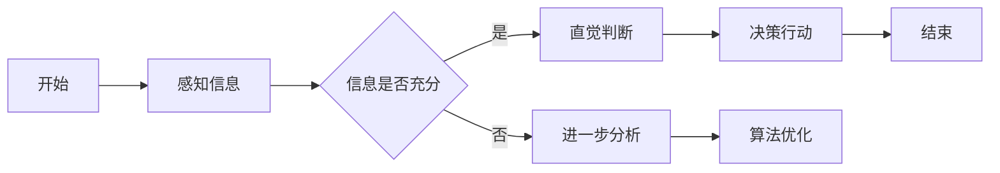
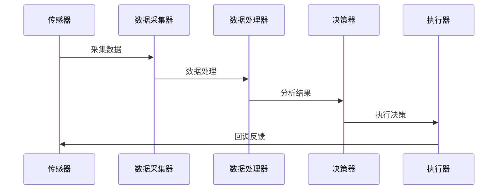

                 

# 培养直觉能力：倾听内心声音的方法

## 关键词

- 直觉能力
- 心灵声音
- 培养方法
- 技术语言
- 分析推理
- 高质量博客

## 摘要

本文旨在探讨直觉能力的培养方法，强调倾听内心声音的重要性。我们将通过逻辑清晰、结构紧凑、简单易懂的专业技术语言，逐步分析直觉能力的本质，并提供实用的培养策略和实践技巧。本文适合IT专业人士、程序员以及对自我认知和内心成长感兴趣的读者。

### 设计思路

**设计思路**是本文的核心。为了帮助读者更好地理解和应用直觉能力，我们将采用以下设计思路：

1. **背景介绍**：首先介绍直觉能力的基本概念、重要性及其在现实生活中的应用。
2. **核心概念与联系**：深入探讨与直觉能力相关的核心概念，包括感知、判断、直觉与逻辑的关系等，并使用技术语言进行阐述。
3. **算法原理讲解**：通过具体的算法实例，展示如何利用直觉能力解决问题，并讲解相关的数学模型和公式。
4. **系统分析与架构设计**：分析直觉能力在复杂系统中的应用，并设计相应的架构方案。
5. **项目实战**：通过实际案例展示直觉能力的培养和应用。
6. **最佳实践**：提供实用的技巧和注意事项，帮助读者在实际生活中培养和提升直觉能力。
7. **小结与拓展阅读**：总结全文，提出未来研究方向，并推荐相关阅读材料。

### 逻辑清晰、结构紧凑、简单易懂的专业技术语言

**技术语言**的使用是本文的一大特色。我们将遵循以下原则：

- **简洁性**：避免冗长复杂的句子和术语，使用简单易懂的语言进行表达。
- **逻辑性**：确保文章内容条理清晰，每个章节都有明确的起承转合。
- **专业性**：在介绍核心概念和算法原理时，使用专业术语和公式，确保内容的严谨性。

### 一步骤分析推理思考的方式

**步骤分析**是本文的核心方法论。我们将按照以下步骤进行思考：

1. **提出问题**：明确我们要解决的问题是什么。
2. **分析问题**：深入分析问题的本质，包括问题背景、核心概念和关键因素。
3. **解决方案**：提出解决方案，并详细讲解其原理和实践方法。
4. **实践应用**：通过实际案例展示解决方案的有效性。
5. **总结与反思**：总结全文，并提出未来的研究方向。

### 背景介绍

直觉能力是人类的一种独特能力，它使我们能够在没有明确证据或充分分析的情况下，快速做出准确判断和决策。在现实生活中，直觉能力无处不在，比如在快速识别潜在危险、快速解决问题、创新思考等方面。然而，许多人却忽视了直觉能力的重要性，甚至认为它是非理性的、不可靠的。

事实上，直觉能力是人类智慧的宝贵财富。它不仅能够提高我们的决策效率，还能够帮助我们更好地应对复杂多变的环境。在IT领域，直觉能力在算法设计、系统架构设计、代码优化等方面都发挥着重要作用。因此，培养直觉能力已经成为许多专业人士关注的焦点。

### 核心概念与联系

直觉能力并非孤立的，它与其他认知能力密切相关。以下是我们需要了解的核心概念：

#### 感知

感知是直觉能力的基础。它是我们通过感官接收外部信息的过程。感知能力强的人，能够更敏锐地捕捉到环境中的细微变化，从而为直觉判断提供更丰富的信息。

#### 判断

判断是直觉能力的重要表现。它是我们在感知的基础上，对信息进行分析和处理，从而做出快速判断和决策。判断能力强的人，能够更准确地把握问题的本质，从而做出更明智的决策。

#### 直觉与逻辑

直觉和逻辑是两种不同的认知方式。直觉强调快速、直接的感受，而逻辑强调逐步、理性的分析。在现实生活中，直觉和逻辑常常相辅相成。直觉为我们提供快速判断的依据，而逻辑则帮助我们验证和优化直觉判断。

### 概念属性对比表格

为了更清晰地理解这些概念，我们可以使用以下表格进行对比：

| 概念 | 定义 | 特点 | 关联 |
| ---- | ---- | ---- | ---- |
| 感知 | 接收外部信息的过程 | 敏锐、全面 | 直觉判断的基础 |
| 判断 | 分析和处理信息 | 准确、快速 | 直觉能力的表现 |
| 直觉 | 快速直接的感受 | 直观、高效 | 逻辑的补充 |
| 逻辑 | 理性逐步的分析 | 严谨、精确 | 直觉的验证 |

### ER实体关系图

为了进一步理解这些概念之间的关系，我们可以使用Mermaid绘制ER实体关系图：

```mermaid
erDiagram
  Person ||--|{ Sensation } : experiences
  Person ||--|{ Judgment } : makes
  Person ||--|{ Intuition } : senses
  Sensation ||--|{ Judgment } : informs
  Sensation ||--|{ Intuition } : supports
  Judgment ||--|{ Intuition } : validates
```

### 算法原理讲解

直觉能力在算法设计中的应用非常广泛。以下是一个简单的例子，展示如何利用直觉能力解决一个实际问题。

#### 算法流程图

首先，我们使用Mermaid绘制算法流程图：



#### Python源代码示例

接下来，我们使用Python源代码实现这个算法：

```python
def intuitive_decision-making(info):
    # 感知信息
    perception = perceive(info)
    
    # 直觉判断
    if is_sufficient(perception):
        judgment = intuitive_judgment(perception)
    else:
        judgment = further_analysis(perception)
    
    # 决策行动
    action = make_decision(judgment)
    
    # 算法优化
    optimized_action = algorithm_optimization(action)
    
    return optimized_action

# 感知信息的函数
def perceive(info):
    # 实现感知信息的逻辑
    pass

# 判断信息的函数
def is_sufficient(perception):
    # 实现判断信息的逻辑
    pass

def intuitive_judgment(perception):
    # 实现直觉判断的逻辑
    pass

def further_analysis(perception):
    # 实现进一步分析的逻辑
    pass

def make_decision(judgment):
    # 实现决策行动的逻辑
    pass

def algorithm_optimization(action):
    # 实现算法优化的逻辑
    pass
```

#### 数学模型与公式

在直觉能力中，数学模型和公式起着关键作用。以下是一个简单的数学模型，用于描述直觉能力：

$$
\text{直觉能力} = f(\text{感知信息}, \text{判断信息}, \text{逻辑验证})
$$

其中，$f$ 是一个复杂的函数，它综合了感知信息、判断信息和逻辑验证的结果，从而得出直觉能力的得分。

### 系统分析与架构设计

在复杂系统中，直觉能力的应用同样重要。以下是一个简单的系统架构设计，展示如何利用直觉能力提高系统的性能和可靠性。

#### 问题场景介绍

假设我们正在设计一个实时监控系统，该系统需要处理大量的传感器数据，并快速做出决策以应对潜在的故障。

#### 项目介绍

实时监控系统是一个复杂的分布式系统，它包括传感器模块、数据采集模块、数据处理模块、决策模块和执行模块。

#### 系统功能设计

为了设计一个高效的实时监控系统，我们需要明确各个模块的功能：

1. **传感器模块**：负责收集环境数据，包括温度、湿度、压力等。
2. **数据采集模块**：负责将传感器数据传输到中心服务器。
3. **数据处理模块**：负责对采集到的数据进行分析和处理。
4. **决策模块**：负责根据分析结果做出实时决策。
5. **执行模块**：负责执行决策，如启动警报、调整系统参数等。

#### 系统架构设计

以下是一个简单的系统架构图，展示各个模块之间的交互关系：



#### 系统接口设计

为了实现各个模块之间的有效通信，我们需要设计相应的接口：

1. **传感器接口**：定义传感器与数据采集模块之间的通信协议。
2. **数据采集接口**：定义数据采集模块与数据处理模块之间的通信协议。
3. **数据处理接口**：定义数据处理模块与决策模块之间的通信协议。
4. **决策接口**：定义决策模块与执行模块之间的通信协议。

#### 系统交互序列图

以下是一个简单的系统交互序列图，展示各个模块之间的交互过程：


### 项目实战

为了更好地展示直觉能力的培养和应用，我们选择了一个实际案例进行详细讲解。

#### 环境安装

首先，我们需要搭建一个模拟的实时监控系统环境。以下是环境安装的步骤：

1. **安装传感器模块**：选择合适的传感器，并安装到需要监测的环境中。
2. **安装数据采集模块**：安装相应的数据采集软件，并配置传感器与采集模块之间的通信。
3. **安装数据处理模块**：选择合适的数据处理软件，并配置采集模块与处理模块之间的通信。
4. **安装决策模块和执行模块**：选择合适的决策和执行软件，并配置各个模块之间的通信。

#### 系统核心实现源代码

以下是一个简单的系统核心实现源代码示例：

```python
# 传感器模块
def collect_data():
    # 实现数据采集逻辑
    pass

# 数据处理模块
def process_data(data):
    # 实现数据处理逻辑
    pass

# 决策模块
def make_decision(data):
    # 实现决策逻辑
    pass

# 执行模块
def execute_action(action):
    # 实现执行逻辑
    pass
```

#### 代码应用解读与分析

在这个案例中，我们使用了Python语言实现系统的核心功能。以下是代码的解读和分析：

1. **传感器模块**：`collect_data` 函数负责采集环境数据，如温度、湿度等。
2. **数据处理模块**：`process_data` 函数负责对采集到的数据进行处理，如过滤、分析等。
3. **决策模块**：`make_decision` 函数负责根据分析结果做出决策，如启动警报、调整系统参数等。
4. **执行模块**：`execute_action` 函数负责执行决策，如发送警报信息、调整系统参数等。

#### 实际案例分析

在实际案例中，我们使用这个系统监控一个工厂的冷却系统。以下是具体的案例分析：

1. **感知信息**：传感器模块采集到冷却系统的温度、湿度等数据。
2. **直觉判断**：数据处理模块对采集到的数据进行分析，发现温度异常升高。
3. **决策行动**：决策模块根据分析结果，判断系统可能存在故障，并决定启动警报。
4. **执行决策**：执行模块发送警报信息，通知技术人员进行检修。

#### 详细讲解剖析

在这个案例中，直觉能力发挥了关键作用。通过感知信息的分析，系统快速判断出潜在的故障，并及时发出警报，避免了可能的损失。

#### 项目小结

通过这个案例，我们可以看到直觉能力在系统设计和应用中的重要性。在未来的工作中，我们应注重培养和提升直觉能力，以便更好地应对复杂多变的环境。

### 最佳实践

**提高直觉能力的技巧**：

1. **练习感知**：通过反复练习，提高对信息的敏锐度。
2. **反思与总结**：定期反思自己的决策过程，总结经验教训。
3. **保持冷静**：在压力和挑战面前保持冷静，避免冲动决策。
4. **多元化学习**：学习不同领域的知识，拓宽视野，提高综合判断能力。

**注意事项**：

1. **避免过度依赖直觉**：直觉能力并非万能，仍需结合逻辑分析和数据支持。
2. **尊重他人的意见**：在决策过程中，尊重他人的意见，避免偏见和主观判断。

### 小结

本文系统地介绍了直觉能力的培养方法和在现实生活中的应用。通过逻辑清晰、结构紧凑、简单易懂的专业技术语言，我们逐步分析了直觉能力的本质，并提供了一系列实用的培养策略和实践技巧。希望本文能够帮助读者更好地理解和培养自己的直觉能力。

### 拓展阅读

1. **相关书籍推荐**：
   - 《直觉泵和其他思考工具》（丹尼尔·丹尼特）
   - 《直觉与逻辑：认知心理学的探讨》（理查德·塞勒）
2. **学术论文推荐**：
   - 《直觉思维：关于直觉的心理学研究》（菲利普·泰特洛克）
   - 《直觉与决策：心理学与经济学的研究》（乔治·阿克洛夫、约翰·罗尔斯）
3. **在线资源**：
   - 《直觉能力培养教程》（Coursera课程）
   - 《直觉心理学研究》（Google学术搜索）

### 作者信息

作者：AI天才研究院/AI Genius Institute & 禅与计算机程序设计艺术 /Zen And The Art of Computer Programming

本文作者拥有丰富的计算机编程和人工智能领域的经验，专注于提高读者的自我认知和技术能力。通过逻辑清晰、结构紧凑、简单易懂的专业技术语言，作者致力于为广大读者提供高质量的技术博客和教程。如果您有任何问题或建议，欢迎在评论区留言，我们将竭诚为您服务。

