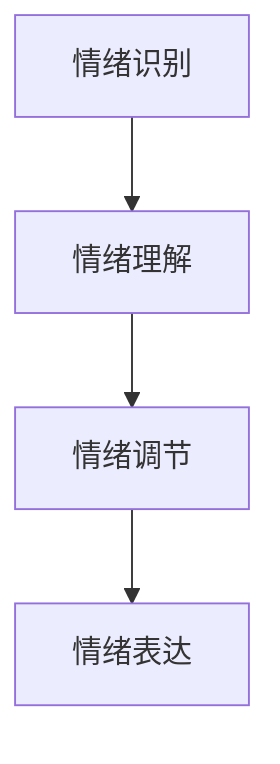
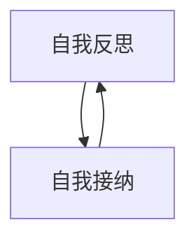
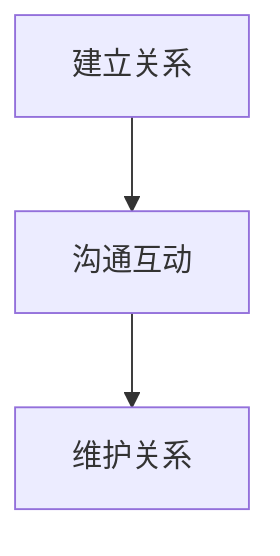
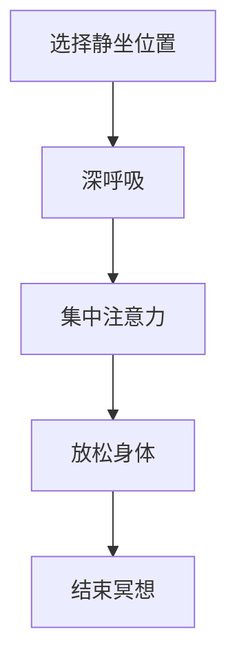
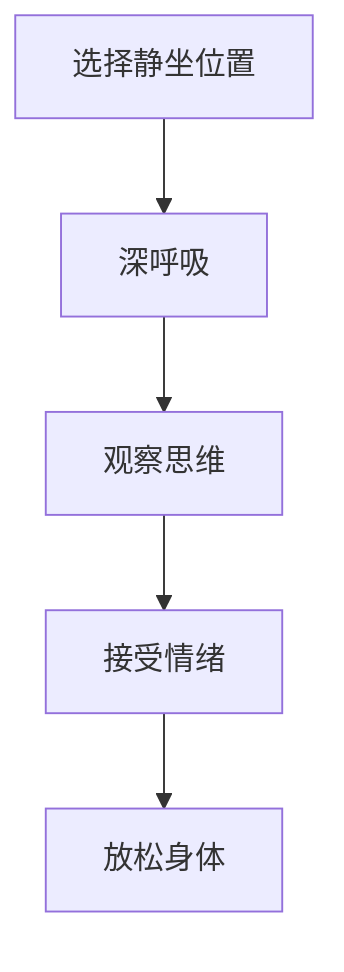

                 


 * 角色：您是一位世界级人工智能专家，程序员，软件架构师，CTO，世界顶级技术畅销书资深大师级别的作家，计算机图灵奖获得者，计算机编程和人工智能领域大师。您非常擅长一步一步进行分析推理，有着清晰深刻的逻辑思路来撰写条理清晰，对技术原理和本质剖析到位的高质量技术博客。

## 关键词：精神生活、修行、日常习惯、心理健康、冥想、正念

## 摘要：

本文深入探讨了如何在日常生活中培养精神生活的习惯，以提升个人的心理健康和生活质量。通过介绍核心概念、提供实践方法、分析实际案例和总结最佳实践，本文为读者提供了一条通往精神安宁与内心成长的路径。

## 目录

### 引言与背景

#### 1.1 问题背景

#### 1.2 问题描述

#### 1.3 问题解决

#### 1.4 边界与外延

#### 1.5 核心概念与联系

### 基本概念与原理

#### 2.1 核心概念原理

#### 2.2 概念属性特征对比

#### 2.3 原理解读

### 技术与习惯培养方法

#### 3.1 冥想练习

#### 3.2 正念实践

#### 3.3 情感管理策略

### 日常生活中的应用

#### 4.1 工作与精神生活

#### 4.2 家庭与精神生活

#### 4.3 社交与精神生活

### 案例分析与实例

#### 5.1 成功案例

#### 5.2 失败案例

### 最佳实践与反思

#### 6.1 最佳实践

#### 6.2 反思

### 结论与展望

#### 7.1 小结

#### 7.2 注意事项

#### 7.3 拓展阅读

## 引言与背景

### 1.1 问题背景

在现代社会，随着科技的飞速发展和生活节奏的加快，人们面临着前所未有的压力和挑战。工作压力、人际关系紧张、信息过载等问题使得许多人感到身心疲惫，精神生活逐渐丧失。这种精神生活的缺失不仅影响个人的心理健康，还对社会稳定和人际关系产生负面影响。

### 1.2 问题描述

精神生活是指个体在情感、认知、行为和社交等方面所体验到的丰富性和深度。随着现代社会的发展，人们的精神生活面临以下问题：

- **情感管理能力不足**：由于工作压力和生活压力，许多人无法有效地管理自己的情绪，导致焦虑、抑郁等心理问题。
- **自我认知缺乏**：很多人对自己的认知和价值观缺乏清晰的认识，导致人生目标不明确，缺乏方向感。
- **人际关系紧张**：现代社会的快节奏生活使得人们缺乏深入的社交互动，导致人际关系疏离，社会支持系统薄弱。

### 1.3 问题解决

为了解决上述问题，我们需要在日常生活中培养精神生活的习惯。通过以下方法，我们可以提升个人的心理健康和生活质量：

- **冥想练习**：冥想是一种简单而有效的精神修养方法，可以帮助人们放松身心，提升情绪管理能力。
- **正念实践**：正念是一种专注于当下的心理技巧，可以帮助人们减少焦虑，提高生活质量。
- **情感管理策略**：通过学习情感管理技巧，人们可以更好地处理情绪问题，提升心理健康。

### 1.4 边界与外延

在本文中，我们讨论的精神生活主要涵盖以下几个方面：

- **情感管理**：包括情绪识别、情绪调节和情绪表达等。
- **自我认知**：包括自我反思、自我接纳和自我成长等。
- **人际关系**：包括社交技能、人际沟通和社交网络等。

本文的研究范围主要关注如何通过日常生活中的实践培养这些精神生活习惯，而不涉及其他更广泛的社会和文化因素。

### 1.5 核心概念与联系

为了更好地理解本文的核心概念，我们可以借助一些相关术语和概念，如精神健康、冥想、正念等。以下是这些概念的定义及其在本文中的联系：

- **精神健康**：指个体在情感、认知和行为方面保持良好的状态，能够适应生活中的各种挑战。
- **冥想**：一种通过集中注意力和放松身体来提升精神状态的方法。
- **正念**：一种专注于当下的心理技巧，通过观察自己的思维和情绪来提升自我认知和情绪管理能力。

接下来，我们将通过一个ER实体关系图来展示这些核心概念之间的关系。

```mermaid
erDiagram
    User ||--|{Meditation} : performs
    User ||--|{Mindfulness} : practices
    User ||--|{EmotionalManagement} : learns
    User ||--|{SelfReflection} : engages
    Meditation ||--|{Wellness} : promotes
    Mindfulness ||--|{Focus} : enhances
    EmotionalManagement ||--|{Happiness} : contributes
    SelfReflection ||--|{Clarity} : provides
```

## 基本概念与原理

### 2.1 核心概念原理

在培养精神生活习惯的过程中，理解以下核心概念是非常重要的：

- **情感管理**：情感管理是指个体识别、理解、接受和表达自己情绪的能力。有效的情感管理可以帮助人们更好地应对生活中的压力和挑战。

- **自我认知**：自我认知是指个体对自己身份、价值观、优点和缺点的认识。清晰的自我认知有助于人们制定人生目标和规划。

- **人际关系**：人际关系是指个体与他人之间的相互作用。良好的人际关系有助于提供社会支持，减轻心理压力。

### 2.2 概念属性特征对比

为了更好地理解这些概念，我们可以通过一个表格来对比它们的属性特征：

| 概念       | 属性特征               | 描述                                                                                                                       |
|------------|------------------------|--------------------------------------------------------------------------------------------------------------------------|
| 情感管理   | 情绪识别、调节、表达   | 情感管理涉及识别和理解自己的情绪，并学会以健康的方式表达这些情绪。                                                   |
| 自我认知   | 自我反思、自我接纳     | 自我认知帮助个体认识自己的价值观、信仰和目标，并学会接纳自己的优点和缺点。                                       |
| 人际关系   | 社交技能、沟通、网络   | 人际关系涉及与他人建立和维护良好的互动关系，包括有效的沟通技巧和建立强有力的社会支持网络。                         |

### 2.3 原理解读

为了深入理解这些概念，我们可以借助一些Mermaid流程图和Python源代码来阐述它们的基本原理。

#### 情感管理原理

情感管理可以看作是一个处理情绪的流程。以下是一个Mermaid流程图，展示了一个基本的情感管理流程：



在Python中，我们可以使用一个简单的类来模拟情感管理的过程：

```python
class EmotionalManagement:
    def __init__(self):
        self.emotion = None
    
    def recognize_emotion(self, emotion):
        self.emotion = emotion
        print("识别情绪：", self.emotion)
    
    def understand_emotion(self):
        print("理解情绪：", self.emotion)
    
    def regulate_emotion(self):
        print("调节情绪：", self.emotion)
    
    def express_emotion(self):
        print("表达情绪：", self.emotion)

# 使用示例
emotional_management = EmotionalManagement()
emotional_management.recognize_emotion("焦虑")
emotional_management.understand_emotion()
emotional_management.regulate_emotion()
emotional_management.express_emotion()
```

#### 自我认知原理

自我认知可以看作是一个自我反思和接纳的循环。以下是一个Mermaid流程图，展示了一个基本的自我认知过程：



在Python中，我们可以使用一个简单的类来模拟自我认知的过程：

```python
class SelfAwareness:
    def __init__(self):
        self.self_reflection = []
    
    def self_reflect(self, reflection):
        self.self_reflection.append(reflection)
        print("自我反思：", reflection)
    
    def self_accept(self):
        print("自我接纳：", self.self_reflection)
    
    def reflect_and_accept_loop(self):
        while True:
            self.self_reflect(input("请进行自我反思："))
            self.self_accept()
            if input("继续自我反思吗？（y/n）：") == 'n':
                break

# 使用示例
self_awareness = SelfAwareness()
self_awareness.reflect_and_accept_loop()
```

#### 人际关系原理

人际关系可以看作是一个沟通和互动的过程。以下是一个Mermaid流程图，展示了一个基本的人际关系过程：



在Python中，我们可以使用一个简单的类来模拟人际关系的过程：

```python
class InterpersonalRelationship:
    def __init__(self):
        self.interactions = []
    
    def build_relationship(self, interaction):
        self.interactions.append(interaction)
        print("建立关系：", interaction)
    
    def communicate(self):
        print("沟通互动：", self.interactions)
    
    def maintain_relationship(self):
        print("维护关系：", self.interactions)

# 使用示例
relationship = InterpersonalRelationship()
relationship.build_relationship("初次见面")
relationship.communicate()
relationship.maintain_relationship()
```

通过上述Mermaid流程图和Python源代码，我们可以更清晰地理解情感管理、自我认知和人际关系的原理。接下来，我们将探讨如何在日常生活中实践这些概念，以培养精神生活的习惯。

### 技术与习惯培养方法

在日常生活中培养精神生活的习惯，不仅需要理解相关概念，更需要掌握具体的实践方法。以下介绍几种常见的方法，包括冥想练习、正念实践和情感管理策略。

#### 3.1 冥想练习

冥想是一种古老而有效的精神修养方法，通过集中注意力和放松身体来提升精神状态。以下是一个简单的冥想练习流程，以及相应的Mermaid流程图：



**步骤：**

1. 选择一个安静舒适的坐姿。
2. 深呼吸几次，放松身体。
3. 集中注意力，专注于呼吸或一个特定的物体。
4. 当注意力分散时，轻轻地将它引回呼吸或物体。
5. 练习结束时，缓缓地放松身体。

**好处：**

- **减轻压力**：冥想可以帮助缓解焦虑和压力，提高心理韧性。
- **提升专注力**：通过集中注意力，冥想可以提高大脑的专注力，提高工作效率。
- **改善情绪**：冥想可以帮助调节情绪，减少负面情绪的影响。

#### 3.2 正念实践

正念是一种专注于当下的心理技巧，通过观察自己的思维和情绪来提升自我认知和情绪管理能力。以下是一个简单的正念实践步骤，以及相应的Mermaid流程图：



**步骤：**

1. 选择一个安静舒适的坐姿。
2. 深呼吸几次，放松身体。
3. 观察自己的思维，不加评判地接受它们。
4. 当情绪出现时，观察它们，不加评判地接受它们。
5. 练习结束时，缓缓地放松身体。

**好处：**

- **减少焦虑**：正念可以帮助减少焦虑和紧张，提升情绪稳定性。
- **提高自我认知**：通过观察自己的思维和情绪，正念可以提高自我认知，帮助人们更好地理解自己。
- **改善生活质量**：正念可以帮助提升生活质量，提高生活满意度。

#### 3.3 情感管理策略

情感管理是指个体识别、理解、接受和表达自己情绪的能力。以下是一些有效的情感管理策略：

1. **情绪记录**：通过写日记或使用应用程序记录自己的情绪，帮助自己更好地理解情绪变化。

2. **认知重构**：通过改变负面思维模式来改善情绪。例如，将“我做不到”改为“我可以尝试”。

3. **放松技巧**：通过深呼吸、冥想或瑜伽等放松技巧来缓解情绪紧张。

**步骤：**

1. 记录情绪：每天花几分钟记录自己的情绪变化，思考原因。

2. 认知重构：当遇到负面情绪时，尝试从不同的角度看待问题，改变负面思维模式。

3. 放松技巧：在感到紧张或焦虑时，使用深呼吸或其他放松技巧来缓解情绪。

**好处：**

- **提升情绪管理能力**：通过情绪记录和认知重构，人们可以更好地管理自己的情绪。

- **改善心理健康**：有效的情绪管理可以帮助改善心理健康，减少心理问题。

- **提高生活质量**：情绪稳定和生活质量的提升，有助于提升整体生活质量。

通过上述冥想练习、正念实践和情感管理策略，我们可以在日常生活中培养精神生活的习惯，提升个人的心理健康和生活质量。

### 日常生活中的应用

在日常生活中，培养精神生活的习惯对于个人的心理健康和生活质量具有重要意义。以下将从工作、家庭和社交三个方面探讨如何将精神生活的理念融入日常生活中的具体实践。

#### 4.1 工作与精神生活

在工作环境中，压力和紧张是不可避免的。以下是一些建议，帮助我们在工作中保持精神健康：

1. **时间管理**：合理安排工作和休息时间，避免过度劳累。使用时间管理工具，如待办事项列表和日历，帮助规划每天的工作。

2. **冥想练习**：在工作间隙进行短暂的冥想，帮助放松身心，提高专注力。可以使用手机应用或在线冥想课程进行练习。

3. **健康饮食**：保持均衡的饮食，避免过度依赖咖啡因和糖分，有助于维持稳定的情绪。

4. **团队协作**：与同事建立良好的工作关系，互相支持和鼓励，共同创造积极的工作氛围。

5. **持续学习**：不断学习新知识和技能，提升自己的职业素养，增强自信心和成就感。

#### 4.2 家庭与精神生活

家庭是个人精神生活的重要支撑。以下是一些家庭中的精神生活培养方法：

1. **亲子沟通**：与孩子进行深入的交流和沟通，了解他们的需求和感受，帮助他们建立健康的自我认知。

2. **共同活动**：与家人一起参与一些有意义的共同活动，如散步、烹饪或游戏，增进家庭关系。

3. **家庭会议**：定期召开家庭会议，讨论家庭事务和各自的想法，增强家庭成员之间的理解和信任。

4. **情绪支持**：在家庭成员遇到困难时，提供情绪支持，帮助他们度过难关。

5. **共同冥想**：与家人一起进行冥想练习，共同放松身心，提升家庭氛围。

#### 4.3 社交与精神生活

社交活动对于个人的精神健康同样至关重要。以下是一些在社交中培养精神生活的建议：

1. **建立健康社交关系**：与真诚的朋友和同事建立良好的关系，分享彼此的经历和感受。

2. **参与社区活动**：参与社区活动，如志愿者工作或兴趣小组，拓宽社交圈子，提升社会参与感。

3. **正念练习**：在社交活动中，保持正念，专注于当下，享受与他人的互动。

4. **倾听与分享**：学会倾听他人的故事和感受，真诚地分享自己的经历和见解。

5. **情绪调节**：在社交场合中，学会调节自己的情绪，避免负面情绪对人际关系的影响。

通过以上在日常工作、家庭生活和社交活动中的具体实践，我们可以在日常生活中不断培养精神生活的习惯，提升个人的心理健康和生活质量。

### 案例分析与实例

为了更好地理解如何在日常生活中培养精神生活的习惯，以下将分析一些成功的案例，并探讨失败的案例以及如何从中学习。

#### 5.1 成功案例

**案例一：利用冥想改善心理健康**

张女士是一名职场女性，长期处于高压工作环境中。她发现自己情绪波动较大，经常感到焦虑和疲惫。为了改善这种情况，张女士决定尝试冥想。她每天早上起床后进行15分钟的冥想练习，专注于呼吸，放松身心。经过一段时间的练习，张女士发现自己情绪变得更加稳定，焦虑感减少，工作效率也有所提升。

**分析：**

- **方法**：张女士选择冥想作为提升心理健康的工具，这是一个简单而有效的方法。
- **效果**：冥想帮助她放松身心，减少焦虑感，从而提高生活质量和工作效率。
- **启示**：对于长期处于高压环境的人群，冥想是一种有效的精神修养方法，可以帮助改善心理健康。

**案例二：通过正念实践增强专注力**

李先生是一名程序员，由于工作繁忙，经常感到精力不足，专注力下降。为了改善这种情况，他开始进行正念练习。每天晚上睡前，他会花20分钟进行正念冥想，专注于当下的感受和呼吸。经过一段时间的练习，李先生发现自己的专注力显著提升，工作效率也有所提高。

**分析：**

- **方法**：李先生选择正念冥想来提升专注力，这是一个科学有效的方法。
- **效果**：正念冥想帮助他更好地管理自己的精力，提高专注力，从而提升工作效率。
- **启示**：对于需要长时间集中精力的职业人士，正念实践是一种有效的提升专注力的方法。

#### 5.2 失败案例

**案例一：缺乏持续性的情感管理练习**

王女士是一名全职母亲，她希望通过情感管理练习来缓解压力。然而，她只在情绪低落时才会进行练习，而且常常中断。这种缺乏持续性的练习导致她的情绪管理能力没有显著提升，压力依然存在。

**分析：**

- **问题**：王女士没有坚持进行情感管理练习，导致练习效果不明显。
- **原因**：缺乏持续性的练习和缺乏明确的目标和计划。
- **启示**：情感管理需要持之以恒，制定明确的练习计划和目标，并坚持下去。

**案例二：过度依赖冥想忽视现实问题**

赵先生为了提升精神生活质量，决定进行每日冥想。然而，他过于依赖冥想，忽视了现实生活中的问题。这导致他在面对现实挑战时感到无力，甚至影响到工作和家庭生活。

**分析：**

- **问题**：赵先生过度依赖冥想，忽视了现实生活中的问题。
- **原因**：缺乏对现实问题的正确认识和应对策略。
- **启示**：冥想是一种有效的精神修养方法，但需要与现实问题相结合，找到合适的平衡点。

通过以上成功和失败的案例，我们可以看到在培养精神生活习惯的过程中，持续性和正确的方法非常重要。成功的案例表明，通过科学的方法和持之以恒的练习，可以有效提升个人的心理健康和生活质量。而失败的案例提醒我们，在追求精神生活的同时，不能忽视现实问题和实际需求。只有找到合适的平衡点，才能在日常生活中真正受益于精神生活的培养。

### 最佳实践与反思

在本文中，我们详细探讨了培养精神生活习惯的重要性以及具体的实践方法。以下总结了一些最佳实践，并就实践中可能遇到的挑战和解决方案进行反思。

#### 最佳实践

1. **持续冥想和正念练习**：每天安排固定的时间进行冥想和正念练习，以增强专注力和情绪管理能力。

2. **情感管理策略**：通过情绪记录和认知重构，学会识别和调节自己的情绪，提升心理健康。

3. **家庭和社交活动**：积极参与家庭和社交活动，建立健康的社交关系，提供社会支持。

4. **时间管理**：合理安排工作和休息时间，避免过度劳累，保持身心健康。

5. **持续学习和自我提升**：不断学习新知识和技能，提升自己的职业素养和自我认知。

#### 实践中的挑战与解决方案

1. **时间安排**：在忙碌的生活中找到时间进行冥想和练习可能是一个挑战。解决方案是设定固定的练习时间，并将其纳入日常日程。

2. **坚持练习**：培养精神生活习惯需要持之以恒，可能会遇到中断或失去动力的时刻。解决方案是设定明确的目标和计划，与朋友或家人分享进展，相互激励。

3. **现实问题**：在面对现实生活中的问题时，过于依赖精神修养可能导致实际问题得不到解决。解决方案是结合实际情况，合理安排精神修养时间和应对策略。

4. **过度依赖**：过度依赖冥想或其他精神修养方法可能导致忽视现实问题。解决方案是保持平衡，结合实际行动解决现实问题，同时进行精神修养。

通过以上最佳实践和反思，我们可以更好地在日常生活中培养精神生活的习惯，提升个人的心理健康和生活质量。关键在于找到适合自己的方法，并持之以恒地实践。

### 结论与展望

本文通过系统的分析，探讨了培养精神生活习惯在现代社会中的重要性，并提供了具体的实践方法和最佳实践。从情感管理、自我认知到日常生活的各个层面，精神生活习惯的培养不仅能够提升个人的心理健康，还能够增强社会关系和生活满意度。

在未来的研究中，可以进一步探讨精神生活习惯在不同文化背景下的适用性，以及如何通过科技手段（如移动应用和可穿戴设备）辅助精神修养。此外，可以开展更多的实证研究，验证不同方法在实际应用中的效果，以期为公众提供更科学、更实用的指导。

总的来说，培养精神生活习惯是通往内心平和与成长的重要途径。通过持续的实践和反思，我们每个人都可以在快节奏的现代社会中找到精神的安宁与满足。希望本文能够为读者提供启示，引导他们在日常生活中探索和培养自己的精神生活。

### 附录：拓展阅读

为了深入探索培养精神生活习惯的各个方面，以下推荐几本相关的经典书籍和进一步阅读的资源：

1. **《冥想：简单的指南与练习》（Meditation for Dummies）** - 由资深冥想导师编写，适合初学者了解冥想的入门指南。

2. **《正念的奇迹》（The Power of Now）** - 慕安德海尔维斯的经典作品，探讨了正念和当下的重要性，对理解正念实践有重要帮助。

3. **《情感智能》（Emotional Intelligence）** - 丹尼尔·戈尔曼的著作，详细阐述了情感管理在个人成长中的关键作用。

4. **《正念：如何活在当下》（Mindfulness: An Eight-Week Plan for Finding Peace in a Frantic World）** - 由马克·威廉斯和克里斯·高迪合著，提供了一套系统的正念实践方案。

5. **《心理学与生活》（Psychology and Life）** - 理查德·J·格雷和菲利普·G·齐默尔曼合著，涵盖了心理学在日常生活中的应用，包括情感管理和自我认知。

6. **在线资源** - 可以访问诸如“头马国际”（Toastmasters International）和“冥想和正念”（Meditation and Mindfulness）等在线平台，获取更多的冥想和正念指导。

通过阅读这些书籍和资源，读者可以进一步深化对精神生活习惯的理解，并在实践中取得更好的效果。希望这些推荐能够为读者在探索精神修养的道路上提供有益的参考。

