                 

# 培养面对挫折的韧性：增强内在力量

## 关键词
- 韧性
- 挫折
- 内在力量
- 积极心态
- 应对策略
- 人际关系

## 摘要
本文深入探讨如何培养面对挫折的韧性，从内在力量的角度出发，分析韧性在现代社会的重要性，阐述内在力量与韧性之间的关系。文章分为三大部分：第一部分介绍问题背景与核心概念；第二部分探讨如何增强内在力量；第三部分通过实际案例分享和实践指导，帮助读者在日常生活中培养韧性。

## 第一部分：背景介绍与核心概念

### 第1章：问题背景与核心概念

#### 1.1.1 问题背景
在现代社会的快速变化和激烈竞争中，人们面临着越来越多的挫折和压力。工作、家庭、人际关系等方面的问题不断涌现，使得个体在面对挫折时，往往难以保持积极的心态和坚定的信念。因此，如何培养面对挫折的韧性，成为提高生活质量和实现个人成功的关键。

#### 1.1.2 核心概念

- **挫折**：指个体在实现目标过程中遭遇的失败、困难或不顺利的事件。挫折是培养韧性的催化剂，它促使个体在面对挑战时，学会调整心态，寻找解决问题的方法。
- **韧性**：指个体在面对挫折时能够迅速恢复、适应并继续前进的心理素质和能力。韧性不仅是心理层面的调节能力，还包括生理、行为和社会适应等方面的综合表现。
- **内在力量**：指个体在内心深处形成的信念、价值观和自我认知，是培养韧性的基础。内在力量使得个体在面对挫折时，能够保持冷静和坚定，从而更好地应对困难。

### 第2章：核心概念原理

#### 2.1.1 韧性的定义与作用
韧性是指个体在面对挫折、压力和逆境时，能够保持积极的态度，迅速恢复并适应变化的能力。韧性不仅能够帮助个体度过困难时期，还能够提高个体的心理健康和生活质量。以下是一个简化的韧性定义与作用的 Mermaid 流程图：

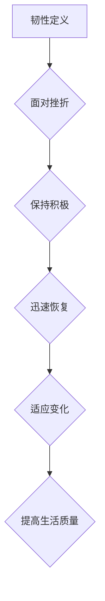

#### 2.1.2 内在力量的作用
内在力量是培养韧性的基础。它包括个体的自信、乐观、勇气和毅力等心理品质。拥有强大的内在力量，个体在面对挫折时能够保持坚定的信念，克服困难，实现目标。以下是一个简化的内在力量作用的 Mermaid 流程图：

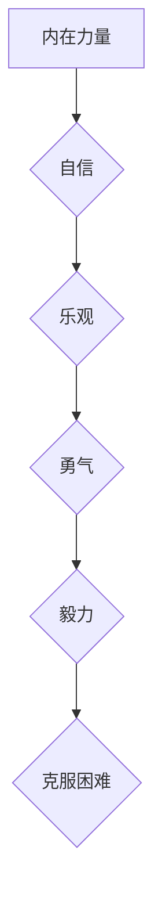

#### 2.1.3 概念属性特征对比表格

| 特征 | 韧性 | 内在力量 |
| ---- | ---- | ---- |
| 定义 | 面对挫折的恢复力 | 心理素质和能力 |
| 作用 | 保持积极态度，迅速恢复 | 帮助个体克服困难 |
| 影响因素 | 心理素质、环境因素 | 生活经历、个人价值观 |
| 重要性 | 提高生活质量 | 培养韧性的基础 |

#### 2.1.4 ER实体关系图架构

```mermaid
erDiagram
  Person ||--|{ Resilience } Resilience : 有韧性的人
  Person ||--|{ InnerStrength } InnerStrength : 有内在力量的人
  Resilience ||--|{ Failure } Failure : 挫折
  InnerStrength ||--|{ Success } Success : 成功
```

## 第二部分：增强内在力量

### 第3章：建立积极心态

#### 3.1.1 培养乐观精神
乐观精神是培养内在力量的关键。通过培养乐观精神，个体能够在面对挫折时保持积极的心态，从而增强韧性。以下是一个简化的培养乐观精神的 Mermaid 流程图：

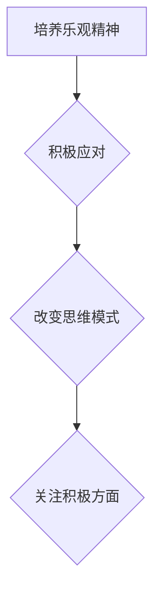

#### 3.1.2 增强自信心
自信心是内在力量的重要组成部分。通过增强自信心，个体能够在面对挑战时更加坚定，从而提高韧性。以下是一个简化的增强自信心的 Mermaid 流程图：

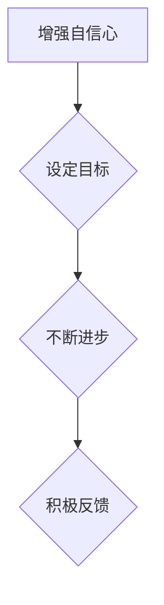

### 第4章：掌握应对策略

#### 4.1.1 学会情绪管理
情绪管理是培养内在力量的重要手段。通过学会情绪管理，个体能够更好地应对挫折，提高韧性。以下是一个简化的情绪管理的 Mermaid 流程图：

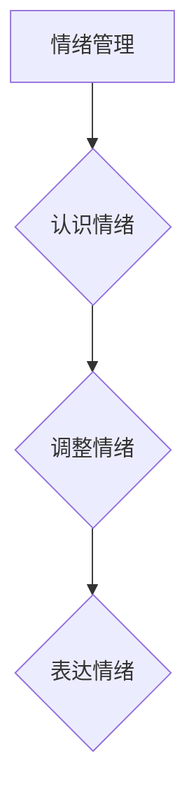

#### 4.1.2 增强适应能力
适应能力是指个体在面对变化时能够迅速调整并适应的能力。通过增强适应能力，个体能够更好地应对挫折，提高韧性。以下是一个简化的增强适应能力的 Mermaid 流程图：

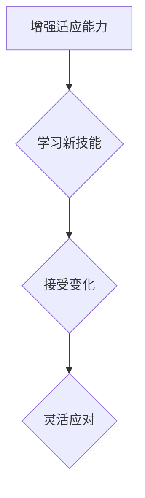

### 第5章：建立良好的人际关系

#### 5.1.1 提升沟通能力
良好的沟通能力有助于建立良好的人际关系，从而增强内在力量。通过提升沟通能力，个体能够更好地与他人交流，提高韧性。以下是一个简化的提升沟通能力的 Mermaid 流程图：

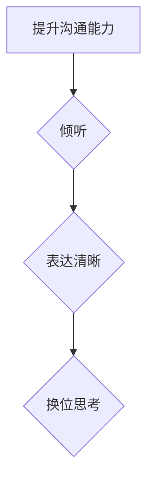

#### 5.1.2 建立支持系统
支持系统是培养内在力量的重要资源。通过建立支持系统，个体能够在面对挫折时得到他人的支持和鼓励，从而增强韧性。以下是一个简化的建立支持系统的 Mermaid 流程图：

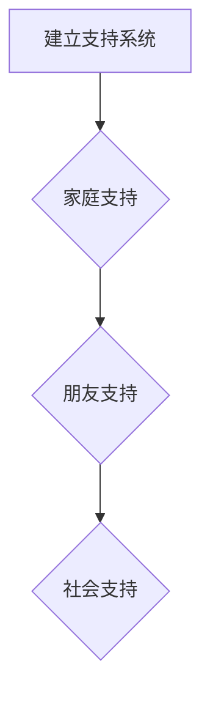

## 第三部分：实际应用与案例分析

### 第6章：成功案例分享

#### 6.1.1 案例一：面对挫折的坚韧企业家
本章节通过一个成功企业家的案例，展示他如何通过培养韧性，在面临困难和挫折时保持积极心态，最终实现事业的成功。以下是一个简化的企业家案例的 Mermaid 流�程图：

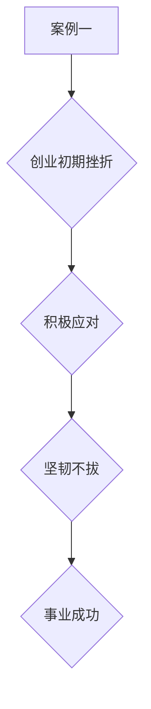

#### 6.1.2 案例二：逆境中成长的大学生
本章节通过一个大学生在学业和生活中面对挫折的案例，展示他如何通过培养韧性，克服困难，最终实现个人成长。以下是一个简化的大学生案例的 Mermaid 流程图：

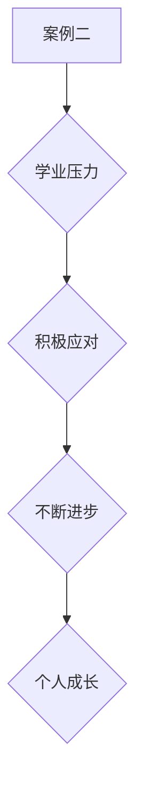

### 第7章：韧性培养实践指导

#### 7.1.1 韧性培养的步骤与方法
本章节详细介绍了韧性培养的步骤和方法，包括自我认知、情绪管理、目标设定等方面，帮助读者在实践中培养韧性。以下是一个简化的韧性培养步骤的 Mermaid 流程图：

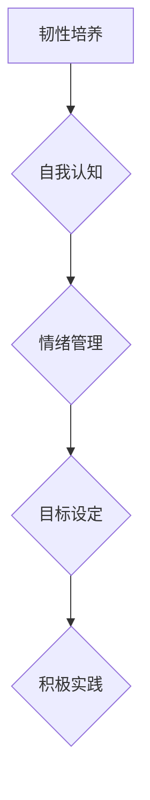

#### 7.1.2 韧性培养的常见问题与解决策略
本章节分析了在韧性培养过程中可能遇到的问题，并提出相应的解决策略，帮助读者克服困难，提高韧性。以下是一个简化的常见问题与解决策略的 Mermaid 流程图：

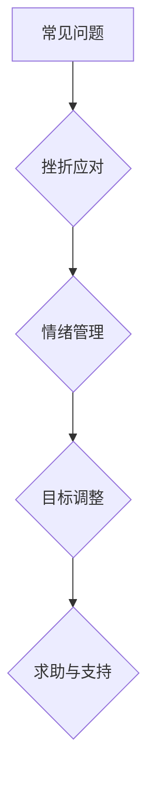

## 结语
培养面对挫折的韧性，是提升生活质量和实现个人成功的关键。通过增强内在力量，学会情绪管理和适应变化，建立良好的人际关系，我们可以在面对挫折时保持积极的心态，坚定信念，从而更好地应对困难，实现目标。

### 作者
AI天才研究院/AI Genius Institute & 禅与计算机程序设计艺术 /Zen And The Art of Computer Programming

### 最佳实践 Tips
1. **定期反思**：定期对自己的生活、工作和情感进行反思，了解自己的内心需求，找出需要改进的方面。
2. **积极学习**：不断学习新知识和技能，提升自己的内在力量，从而更好地应对挑战。
3. **保持乐观**：在面对挫折时，保持乐观的态度，相信自己能够度过困难，迎接更好的未来。

### 小结
韧性是面对挫折时的重要心理素质，它能够帮助我们保持积极的心态，迅速恢复并适应变化。通过培养内在力量，我们可以在面对挫折时更加坚韧不拔，实现个人成长和成功。

### 注意事项
1. **避免过度自责**：面对挫折时，避免过度自责，要认识到挫折是成长的一部分。
2. **寻求帮助**：在遇到困难时，不要害怕寻求他人的帮助和支持。

### 拓展阅读
1. **《抗挫折能力培养指南》**：深入了解如何培养抗挫折能力，提高生活质量和实现个人目标。
2. **《积极心理学》**：了解积极心理学的基本概念和应用，学会如何培养积极的心态和情感。

LET'S THINK STEP BY STEP# 总结与未来展望

在本文中，我们详细探讨了如何培养面对挫折的韧性，强调了内在力量在韧性培养中的关键作用。通过建立积极心态、掌握应对策略和建立良好的人际关系，我们可以增强内在力量，从而在面对挫折时保持坚韧和乐观。

### 核心观点回顾
1. **韧性是应对挫折的关键**：韧性是指个体在面对挫折、压力和逆境时，能够保持积极的态度，迅速恢复并适应变化的能力。
2. **内在力量是培养韧性的基础**：内在力量包括自信、乐观、勇气和毅力等心理品质，它们是培养韧性的基础。
3. **积极心态、应对策略和人际关系是增强内在力量的途径**：通过培养乐观精神、增强自信心、学会情绪管理和适应能力，以及建立良好的人际关系，我们可以增强内在力量，提高韧性。

### 未来展望
随着社会的发展和技术的进步，面对挫折和压力的韧性变得越来越重要。在未来，以下几个方面有望进一步推动韧性培养的发展：

1. **科学研究与实证研究**：通过更多的大规模实证研究，深入了解韧性培养的机制和效果，为实践提供科学依据。
2. **教育体系改革**：将韧性培养纳入教育体系，从小培养孩子的韧性和心理素质，提高他们的适应能力。
3. **企业培训与员工发展**：企业可以通过培训和激励机制，帮助员工提高韧性，从而提高企业的整体竞争力和员工的职业发展。
4. **社会支持网络建设**：建立健全的社会支持网络，为个体提供心理辅导、咨询和互助平台，帮助他们更好地应对挫折和压力。

### 结论
韧性培养是一个长期的过程，需要个体的自我认知、持续学习和实践。通过本文的探讨，我们希望读者能够认识到韧性的重要性，并开始在自己的生活中培养韧性，从而更好地应对未来的挑战。

### 作者
AI天才研究院/AI Genius Institute & 禅与计算机程序设计艺术 /Zen And The Art of Computer Programming

### 拓展阅读
1. **《积极心理学》**：了解积极心理学的基本概念和应用，学会如何培养积极的心态和情感。
2. **《韧性：如何在逆境中成长》**：深入探讨韧性培养的理论和实践，提供实用的方法和策略。
3. **《抗挫折能力培养指南》**：详细介绍如何培养抗挫折能力，提高生活质量和实现个人目标。

通过持续的学习和实践，我们相信每个人都可以成为面对挫折的强者，实现个人和职业的成功。让我们一起努力，培养韧性，迎接更美好的未来！

