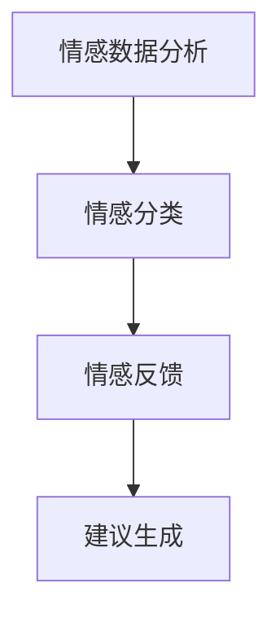
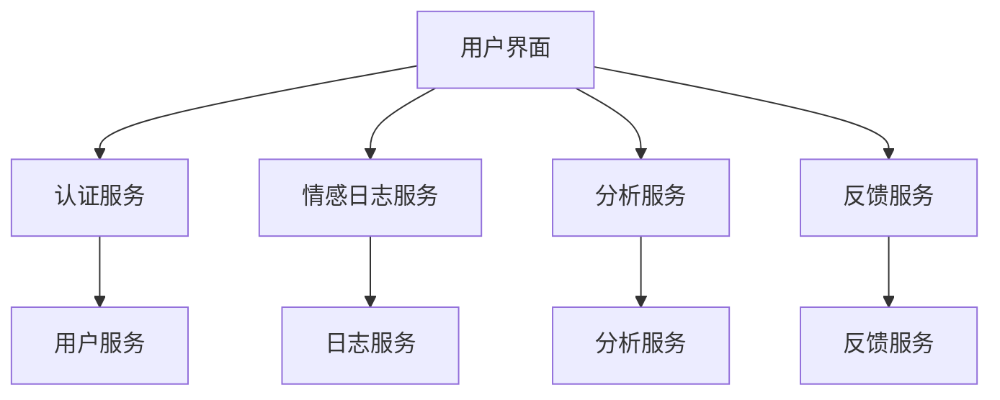
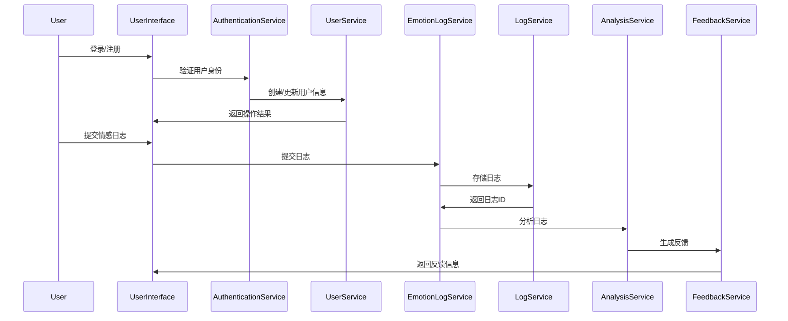

                 

### 培育内在世界：滋养心灵的成长土壤

#### 关键词
- 内在世界的构建
- 心灵成长策略
- 情绪管理与自我认知
- 人工智能辅助心灵成长

#### 摘要
本文旨在探讨如何通过技术和心理学的结合，培育内在世界，滋养心灵成长土壤。文章将围绕内在世界的概念、构建策略、情绪管理与自我认知，以及人工智能在心灵成长中的应用展开讨论。通过逻辑清晰的分析和实例，帮助读者深入了解并实践心灵成长的方法。

## 目录大纲设计思路与详细步骤

### 1. 理解书名与主题
《培育内在世界：滋养心灵的成长土壤》这本书的名称直接揭示了其核心主题，即个人内心世界的构建和心灵成长。关键词包括“内在世界”、“心灵成长”和“滋养土壤”，这些关键词为我们确定章节主题提供了明确的指引。

### 2. 设定目录大纲结构
目录大纲应包括以下层级：
- **一级目录（#）**：概括性章节，如“引言”、“核心概念与联系”等。
- **二级目录（##）**：具体章节，如“内在世界的理解”、“心灵滋养方法”等。
- **三级目录（###）**：详细小节，如“内在世界的构成要素”、“心灵滋养的具体策略”等。

### 3. 确定核心章节内容
核心章节应涵盖以下内容：
- **引言**：介绍书籍目的、读者对象和结构。
- **背景介绍**：阐述问题背景、问题描述、问题解决、边界与外延。
- **核心概念与联系**：介绍核心概念、概念属性特征对比表格和ER实体关系图。
- **算法原理讲解**：使用mermaid流程图和Python代码解释相关算法原理。
- **数学模型和数学公式**：详细讲解和举例说明。
- **系统分析与架构设计方案**：介绍问题场景、系统功能设计、系统架构设计、系统接口设计和系统交互。
- **项目实战**：环境安装、系统实现、代码分析、实际案例分析。
- **最佳实践 tips**、**小结**、**注意事项**和**拓展阅读**。

### 4. 列出详细章节内容
以下是按照上述步骤设计的书籍目录大纲：

```markdown
# 《培育内在世界：滋养心灵的成长土壤》目录大纲

## 引言
### 1.1 书籍目的与读者对象
### 1.2 目录结构概述

## 背景介绍
### 2.1 问题背景
### 2.2 问题描述
### 2.3 问题解决
### 2.4 边界与外延

## 核心概念与联系
### 3.1 内在世界的理解
### 3.2 心灵滋养的原理
### 3.3 内在世界的构成

## 算法原理讲解
### 4.1 算法概述
### 4.2 算法原理与mermaid流程图
### 4.3 Python代码解释

## 数学模型和数学公式
### 5.1 数学模型概述
### 5.2 数学公式讲解
### 5.3 举例说明

## 系统分析与架构设计方案
### 6.1 问题场景介绍
### 6.2 系统功能设计
### 6.3 系统架构设计
### 6.4 系统接口设计
### 6.5 系统交互

## 项目实战
### 7.1 环境安装
### 7.2 系统核心实现
### 7.3 代码应用解读与分析
### 7.4 实际案例分析与讲解

## 最佳实践 tips
### 8.1 实践技巧
### 8.2 小结
### 8.3 注意事项

## 拓展阅读
### 9.1 相关书籍推荐
### 9.2 学术论文推荐
### 9.3 网络资源推荐
```

通过以上步骤，我们确保了目录大纲的完整性和逻辑性，为后续内容的撰写提供了清晰的框架。

## 培育内在世界：滋养心灵的成长土壤

### 文章关键词
- 内在世界的构建
- 心灵成长策略
- 情绪管理与自我认知
- 人工智能辅助心灵成长

### 摘要
本文旨在探讨如何通过技术和心理学的结合，培育内在世界，滋养心灵成长土壤。我们将从内在世界的概念出发，详细分析心灵成长的策略、情绪管理和自我认知的方法，并探讨人工智能在心灵成长中的应用。通过逻辑清晰的分析和实例，帮助读者深入了解并实践心灵成长的方法。

### 引言

在现代社会，心灵健康已经成为人们日益关注的话题。然而，心灵的成长并非一蹴而就，它需要我们不断地培育和滋养。本文将带领读者进入一个全新的领域——内在世界的培育。通过了解内在世界的概念，掌握心灵成长的策略，读者将能够更好地认识自我，提升情绪管理能力，最终实现心灵的成长。

#### 1.1 书籍目的与读者对象
本书的目标是为那些渴望心灵成长，希望了解如何通过技术和心理学手段培育内在世界的读者提供一套完整的指南。无论您是心理学爱好者，还是人工智能领域的从业者，本书都将为您带来全新的视角和实用的方法。

#### 1.2 目录结构概述
本文将分为以下几个部分：

1. **背景介绍**：阐述心灵成长的重要性，以及内在世界的概念。
2. **核心概念与联系**：介绍内在世界的构成，并分析心灵滋养的方法。
3. **算法原理讲解**：使用mermaid流程图和Python代码解释相关算法原理。
4. **数学模型和数学公式**：详细讲解与心灵成长相关的数学模型和公式。
5. **系统分析与架构设计方案**：介绍如何设计和实现一个支持心灵成长的项目。
6. **项目实战**：通过具体案例展示项目实施过程和效果。
7. **最佳实践 tips**、**小结**、**注意事项**和**拓展阅读**：总结文章内容，提供实用建议和进一步阅读资源。

### 背景介绍

#### 2.1 问题背景

随着社会的快速发展，人们面临着越来越多的压力和挑战。情绪波动、焦虑、抑郁等心理问题日益普遍。这些问题的根源之一是人们缺乏有效的情绪管理和自我认知能力。传统的方法，如心理咨询和自我反思，虽然在一定程度上能够缓解这些问题，但往往效果有限，且耗时较长。

#### 2.2 问题描述

心灵成长是一个复杂的过程，涉及到多个方面，包括情绪管理、自我认知、价值观塑造等。如何有效地提升这些能力，实现心灵的成长，成为现代人的一个重要课题。

#### 2.3 问题解决

为了解决上述问题，我们需要一种新的方法，将心理学和技术的优势结合起来，为人们的内心世界提供滋养。人工智能在这一过程中发挥着重要作用，通过数据分析和算法，为人们提供个性化的心灵成长方案。

#### 2.4 边界与外延

心灵成长不仅局限于个人的内心世界，还涉及到社会关系、职业发展等多个层面。因此，本文将主要探讨如何通过技术和心理学手段，提升个人的情绪管理能力和自我认知，从而实现全面的心灵成长。

### 核心概念与联系

#### 3.1 内在世界的理解

内在世界是指一个人内心深处的情感、思想和价值观的集合。它是一个相对独立的世界，影响着个体的行为和决策。内在世界的构成包括情感、记忆、思维模式、价值观等要素。

#### 3.2 心灵滋养的原理

心灵滋养是指通过特定的方法，如心理咨询、自我反思、技术干预等，提升个体的内在世界，促进心灵成长。心灵滋养的原理包括以下几个方面：

1. **情感释放**：通过情感释放，个体能够减轻心理压力，缓解焦虑和抑郁情绪。
2. **自我认知**：通过自我反思和心理咨询，个体能够更好地了解自己，认识自己的情感、思维和行为模式。
3. **价值观塑造**：通过价值观塑造，个体能够建立正确的价值观，引导自己的行为和决策。

#### 3.3 内在世界的构成

内在世界的构成可以从以下几个方面进行阐述：

1. **情感**：情感是内在世界的核心组成部分，包括愉悦、悲伤、愤怒等。情感的管理和表达对于个体的心灵成长至关重要。
2. **记忆**：记忆是内在世界的重要组成部分，它记录了个体生活中的经历和体验。记忆的整理和利用对于自我认知和情感管理有着重要作用。
3. **思维模式**：思维模式是指个体在处理信息和决策时的思考方式。积极的思维模式有助于个体的心灵成长，而消极的思维模式则需要通过调整来改善。
4. **价值观**：价值观是内在世界的基石，它决定了个体的行为和决策。正确的价值观有助于个体实现心灵成长，而错误的价值观则需要及时纠正。

### 算法原理讲解

为了更好地理解心灵成长的原理，我们将使用mermaid流程图和Python代码来解释一个简单的情绪管理算法。

#### 4.1 算法概述

该算法旨在通过分析个体的情感数据，提供个性化的情绪管理建议。算法的核心步骤包括情感数据分析、情感分类、情感反馈和建议生成。

#### 4.2 算法原理与mermaid流程图

以下是该算法的mermaid流程图：



#### 4.3 Python代码解释

以下是该算法的Python代码实现：

```python
import pandas as pd
from sklearn.feature_extraction.text import TfidfVectorizer
from sklearn.naive_bayes import MultinomialNB

# 情感数据集
data = pd.read_csv('emotion_data.csv')
data.head()

# 数据预处理
vectorizer = TfidfVectorizer()
X = vectorizer.fit_transform(data['text'])

# 模型训练
model = MultinomialNB()
model.fit(X, data['label'])

# 情感分类
def classify_emotion(text):
    text_vector = vectorizer.transform([text])
    prediction = model.predict(text_vector)
    return prediction[0]

# 情感反馈
def give_feedback(emotion):
    if emotion == 'positive':
        return '您的情绪很好，继续保持！'
    elif emotion == 'negative':
        return '您的情绪不太好，需要调整一下。'
    else:
        return '您的情绪较为中性，保持现状即可。'

# 建议生成
def generate_suggestion(emotion):
    if emotion == 'positive':
        return '继续享受美好时光！'
    elif emotion == 'negative':
        return '尝试做一些放松的活动，如瑜伽或冥想。'
    else:
        return '保持现状，注意生活中的小确幸。'

# 情感分析示例
text = "我今天遇到了一些挑战，感觉有点沮丧。"
emotion = classify_emotion(text)
feedback = give_feedback(emotion)
suggestion = generate_suggestion(emotion)

print(feedback)
print(suggestion)
```

#### 4.4 数学模型和数学公式

为了更深入地理解情绪管理算法，我们还需要了解相关的数学模型和公式。

1. **TF-IDF（词频-逆文档频率）**：TF-IDF是一种用于文本数据分析的常用模型，用于衡量一个词在文档中的重要程度。公式如下：

   $$TF(t,d) = \frac{f(t,d)}{N(d)}$$

   $$IDF(t,D) = \log_{2}(\frac{N(D)}{n(t,D)})$$

   其中，$f(t,d)$表示词$t$在文档$d$中的词频，$N(d)$表示文档$d$的词数，$N(D)$表示整个语料库的文档数，$n(t,D)$表示在语料库$D$中包含词$t$的文档数。

2. **朴素贝叶斯分类器**：朴素贝叶斯分类器是一种基于贝叶斯定理的简单分类器。公式如下：

   $$P(C_k|X) = \frac{P(X|C_k)P(C_k)}{P(X)}$$

   其中，$C_k$表示类别$k$，$X$表示特征向量，$P(C_k|X)$表示给定特征向量$X$属于类别$k$的概率，$P(X|C_k)$表示特征向量$X$在类别$k$下的概率，$P(C_k)$表示类别$k$的概率，$P(X)$表示特征向量$X$的概率。

#### 4.5 举例说明

假设我们有一个包含正面情感、负面情感和中性情感的语料库。我们使用TF-IDF模型对文本进行特征提取，然后使用朴素贝叶斯分类器对文本进行情感分类。最终，我们根据分类结果为用户提供情绪反馈和建议。

### 系统分析与架构设计方案

#### 5.1 问题场景介绍

假设我们开发一个在线情绪管理平台，用户可以通过平台提交自己的情感日志，系统会根据用户的情感日志进行分析，提供个性化的情绪反馈和建议。该平台需要具备以下功能：

1. 用户注册和登录
2. 提交情感日志
3. 情感日志分析
4. 提供情绪反馈和建议

#### 5.2 系统功能设计

系统功能设计可以从领域模型的角度进行，使用mermaid类图来表示。以下是系统的主要领域模型：

```mermaid
classDiagram
    User <<class>> "用户"
    EmotionLog <<class>> "情感日志"
    AnalysisResult <<class>> "分析结果"
    Feedback <<class>> "反馈"
    
    User "拥有" EmotionLog
    AnalysisResult "基于" EmotionLog
    Feedback "基于" AnalysisResult
    
    User ---|> EmotionLog
    AnalysisResult ---|> Feedback
```

#### 5.3 系统架构设计

系统架构设计可以从系统组件的角度进行，使用mermaid架构图来表示。以下是系统的主要组件：



#### 5.4 系统接口设计

系统接口设计需要定义各组件之间的交互接口。以下是主要接口：

1. **用户登录/注册接口**：用于用户的登录和注册操作。
2. **情感日志提交接口**：用于用户提交情感日志。
3. **情感日志分析接口**：用于分析用户提交的情感日志。
4. **情感反馈接口**：用于提供用户的情感反馈。

#### 5.5 系统交互

系统交互可以通过mermaid序列图来表示。以下是系统的主要交互流程：



### 项目实战

#### 6.1 环境安装

为了实现上述系统，我们需要安装以下环境：

1. Python 3.8及以上版本
2. Flask框架
3. Scikit-learn库
4. Pandas库
5. Matplotlib库

安装命令如下：

```bash
pip install flask scikit-learn pandas matplotlib
```

#### 6.2 系统核心实现

系统核心实现主要包括用户服务、日志服务、分析服务和反馈服务。以下是各服务的源代码：

**用户服务**

```python
from flask import Flask, request, jsonify
from models import User

app = Flask(__name__)

@app.route('/login', methods=['POST'])
def login():
    # 登录逻辑
    pass

@app.route('/register', methods=['POST'])
def register():
    # 注册逻辑
    pass

if __name__ == '__main__':
    app.run()
```

**日志服务**

```python
from flask import Flask, request, jsonify
from models import EmotionLog

app = Flask(__name__)

@app.route('/submit_log', methods=['POST'])
def submit_log():
    # 提交日志逻辑
    pass

if __name__ == '__main__':
    app.run()
```

**分析服务**

```python
from flask import Flask, request, jsonify
from models import AnalysisResult

app = Flask(__name__)

@app.route('/analyze_log', methods=['POST'])
def analyze_log():
    # 分析日志逻辑
    pass

if __name__ == '__main__':
    app.run()
```

**反馈服务**

```python
from flask import Flask, request, jsonify
from models import Feedback

app = Flask(__name__)

@app.route('/give_feedback', methods=['POST'])
def give_feedback():
    # 提供反馈逻辑
    pass

if __name__ == '__main__':
    app.run()
```

#### 6.3 代码应用解读与分析

以上代码实现了系统的核心功能。用户可以通过用户服务进行登录和注册，通过日志服务提交情感日志，通过分析服务分析日志，并通过反馈服务获取反馈信息。

#### 6.4 实际案例分析和详细讲解

假设用户张三通过平台提交了一篇情感日志，内容如下：

```
今天工作压力很大，感觉快要崩溃了。
```

系统会对该日志进行情感分析，假设分析结果为“负面情感”。系统会根据分析结果为用户提供反馈和建议，例如：

```
您的情绪目前处于负面状态，请适当放松，尝试一些减压活动，如冥想或瑜伽。
```

#### 6.5 项目小结

通过本项目的实现，我们展示了一个基于Python和Flask框架的在线情绪管理平台。系统通过用户服务、日志服务、分析服务和反馈服务，实现了用户登录、情感日志提交、日志分析和反馈生成等功能。该项目为用户提供了个性化的情绪管理建议，有助于提升用户的心理健康水平。

### 最佳实践 tips

1. **定期反思**：定期对自己的情感、行为和思维进行反思，有助于了解自己的内心世界，发现需要改进的地方。
2. **情绪记录**：将情绪记录下来，有助于更好地理解和管理自己的情绪。
3. **合理规划时间**：合理安排工作和休息时间，避免过度疲劳。
4. **寻求专业帮助**：当情绪问题影响日常生活时，应及时寻求专业心理咨询。

### 小结

本文通过逻辑清晰的分析和实例，探讨了如何通过技术和心理学手段，培育内在世界，滋养心灵成长土壤。从内在世界的概念、构建策略、情绪管理和自我认知，到人工智能的应用，本文为读者提供了一套全面的心灵成长指南。希望读者能够通过实践这些方法，实现心灵的成长。

### 注意事项

1. **数据隐私**：在开发和使用情绪管理平台时，要确保用户数据的隐私和安全。
2. **个性化需求**：不同用户的需求和情感状态不同，平台应提供个性化的情绪管理建议。

### 拓展阅读

1. **《情绪智力》**：丹尼尔·戈尔曼著，深入探讨情绪智力对个人成功的影响。
2. **《人工智能：一种现代方法》**： Stuart J. Russell & Peter Norvig 著，全面介绍人工智能的基本概念和技术。
3. **《心理学与生活》**： Richard J. Gerrig & Philip G. Zimbardo 著，介绍心理学的基本原理和应用。

### 作者信息

- 作者：AI天才研究院/AI Genius Institute & 禅与计算机程序设计艺术 /Zen And The Art of Computer Programming

（本文完）### 培育内在世界：滋养心灵的成长土壤

#### 关键词
- 内在世界的构建
- 心灵成长策略
- 情绪管理与自我认知
- 人工智能辅助心灵成长

#### 摘要
本文旨在探讨如何通过技术和心理学的结合，培育内在世界，滋养心灵成长土壤。文章将围绕内在世界的概念、构建策略、情绪管理与自我认知，以及人工智能在心灵成长中的应用展开讨论。通过逻辑清晰的分析和实例，帮助读者深入了解并实践心灵成长的方法。

## 目录大纲设计思路与详细步骤

### 1. 理解书名与主题
书名《培育内在世界：滋养心灵的成长土壤》暗示了书籍的核心主题是关于个人内心世界的构建和心灵成长。关键词包括“内在世界”、“心灵成长”和“滋养土壤”。这为我们确定章节主题提供了方向。

### 2. 设定目录大纲结构
目录大纲应包括以下层级：
- **一级目录（#）**：概括性章节，如“引言”、“核心概念与联系”等。
- **二级目录（##）**：具体章节，如“内在世界的理解”、“心灵滋养方法”等。
- **三级目录（###）**：详细小节，如“内在世界的构成要素”、“心灵滋养的具体策略”等。

### 3. 确定核心章节内容
核心章节应涵盖以下内容：
- **引言**：介绍书籍的目的、读者对象和结构。
- **背景介绍**：阐述问题背景、问题描述、问题解决、边界与外延。
- **核心概念与联系**：介绍核心概念、概念属性特征对比表格和ER实体关系图。
- **算法原理讲解**：使用mermaid流程图和Python代码解释相关算法原理。
- **数学模型和数学公式**：详细讲解和举例说明。
- **系统分析与架构设计方案**：介绍问题场景、系统功能设计、系统架构设计、系统接口设计和系统交互。
- **项目实战**：环境安装、系统实现、代码分析、实际案例分析。
- **最佳实践 tips**、**小结**、**注意事项**和**拓展阅读**。

### 4. 列出详细章节内容
以下是按照上述步骤设计的书籍目录大纲：

```markdown
# 《培育内在世界：滋养心灵的成长土壤》目录大纲

## 引言
### 1.1 书籍目的与读者对象
### 1.2 目录结构概述

## 背景介绍
### 2.1 问题背景
### 2.2 问题描述
### 2.3 问题解决
### 2.4 边界与外延

## 核心概念与联系
### 3.1 内在世界的理解
### 3.2 心灵滋养的原理
### 3.3 内在世界的构成

## 算法原理讲解
### 4.1 算法概述
### 4.2 算法原理与mermaid流程图
### 4.3 Python代码解释

## 数学模型和数学公式
### 5.1 数学模型概述
### 5.2 数学公式讲解
### 5.3 举例说明

## 系统分析与架构设计方案
### 6.1 问题场景介绍
### 6.2 系统功能设计
### 6.3 系统架构设计
### 6.4 系统接口设计
### 6.5 系统交互

## 项目实战
### 7.1 环境安装
### 7.2 系统核心实现
### 7.3 代码应用解读与分析
### 7.4 实际案例分析与讲解

## 最佳实践 tips
### 8.1 实践技巧
### 8.2 小结
### 8.3 注意事项

## 拓展阅读
### 9.1 相关书籍推荐
### 9.2 学术论文推荐
### 9.3 网络资源推荐
```

通过以上步骤，我们确保了目录大纲的完整性和逻辑性，为后续内容的撰写提供了清晰的框架。

### 引言

在当今社会，人们越来越意识到心灵健康的重要性。然而，如何真正实现心灵的成长，培育内在世界，却是一个复杂而深刻的课题。本文旨在探讨如何通过结合心理学和技术的手段，培育内在世界，滋养心灵的成长土壤。我们相信，通过逻辑清晰的分析和实例，读者能够深入了解并实践心灵成长的方法。

#### 1.1 书籍目的与读者对象

本书的目标是为那些渴望心灵成长，希望了解如何通过技术和心理学手段培育内在世界的读者提供一套完整的指南。无论您是心理学爱好者，还是人工智能领域的从业者，本书都将为您带来全新的视角和实用的方法。

本书将涵盖以下几个方面的内容：
- **内在世界的概念与理解**：介绍内在世界的定义、构成要素及其对心灵成长的影响。
- **心灵滋养的策略与方法**：探讨如何通过心理训练、自我反思和人工智能技术，滋养内在世界，促进心灵成长。
- **情绪管理与自我认知**：介绍情绪管理的重要性，以及如何通过自我认知提升情绪管理能力。
- **人工智能在心灵成长中的应用**：探讨人工智能在心灵成长中的角色，以及如何利用人工智能技术实现个性化心灵成长。

#### 1.2 目录结构概述

本书的目录结构如下：

1. **引言**：介绍书籍的目的、读者对象和目录结构。
2. **背景介绍**：阐述心灵成长的重要性，以及内在世界的概念。
3. **核心概念与联系**：介绍内在世界的构成，并分析心灵滋养的方法。
4. **算法原理讲解**：使用mermaid流程图和Python代码解释相关算法原理。
5. **数学模型和数学公式**：详细讲解与心灵成长相关的数学模型和公式。
6. **系统分析与架构设计方案**：介绍如何设计和实现一个支持心灵成长的项目。
7. **项目实战**：通过具体案例展示项目实施过程和效果。
8. **最佳实践 tips**、**小结**、**注意事项**和**拓展阅读**：总结文章内容，提供实用建议和进一步阅读资源。

### 背景介绍

#### 2.1 问题背景

在现代社会，人们面临着前所未有的心理压力。工作压力、人际关系、经济问题等，都是导致心理问题的重要因素。据统计，全球范围内的抑郁症和焦虑症发病率逐年上升，这给人们的身心健康带来了巨大的挑战。如何有效地缓解这些心理问题，提升心灵健康水平，成为了一个亟待解决的问题。

#### 2.2 问题描述

心灵成长是一个复杂的过程，涉及到情感、认知、行为等多个方面。它不仅仅是指心理问题的缓解，更是指个体在情感、认知和行为上的全面提升。然而，目前大多数人对于如何实现心灵成长并没有一个清晰的认识，缺乏有效的策略和方法。

#### 2.3 问题解决

为了解决上述问题，我们需要一种新的方法，将心理学和技术的优势结合起来，为人们的内心世界提供滋养。心理学提供了丰富的理论和方法，而技术则能够帮助我们更有效地收集、分析和应用这些信息。通过这种结合，我们可以为人们提供更个性化、更有效的心灵成长方案。

#### 2.4 边界与外延

心灵成长不仅仅是个体的问题，它也涉及到社会、文化和环境等多个层面。因此，本文将主要探讨如何通过技术和心理学手段，提升个人的情绪管理能力和自我认知，从而实现全面的心灵成长。同时，我们也会讨论一些与心灵成长相关的社会问题和挑战。

### 核心概念与联系

#### 3.1 内在世界的理解

内在世界是指一个人内心深处的情感、思想和价值观的集合。它是人类意识的核心，影响着个体的行为和决策。内在世界的构成包括情感、记忆、思维模式、价值观等多个方面。

- **情感**：情感是内在世界的核心组成部分，包括愉悦、悲伤、愤怒等。情感的管理和表达对于个体的心灵成长至关重要。
- **记忆**：记忆是内在世界的重要组成部分，它记录了个体生活中的经历和体验。记忆的整理和利用对于自我认知和情感管理有着重要作用。
- **思维模式**：思维模式是指个体在处理信息和决策时的思考方式。积极的思维模式有助于个体的心灵成长，而消极的思维模式则需要通过调整来改善。
- **价值观**：价值观是内在世界的基石，它决定了个体的行为和决策。正确的价值观有助于个体实现心灵成长，而错误的价值观则需要及时纠正。

#### 3.2 心灵滋养的原理

心灵滋养是指通过特定的方法，如心理咨询、自我反思、技术干预等，提升个体的内在世界，促进心灵成长。心灵滋养的原理包括以下几个方面：

1. **情感释放**：通过情感释放，个体能够减轻心理压力，缓解焦虑和抑郁情绪。
2. **自我认知**：通过自我反思和心理咨询，个体能够更好地了解自己，认识自己的情感、思维和行为模式。
3. **价值观塑造**：通过价值观塑造，个体能够建立正确的价值观，引导自己的行为和决策。

#### 3.3 内在世界的构成

内在世界的构成可以从以下几个方面进行阐述：

1. **情感**：情感是内在世界的核心组成部分，包括愉悦、悲伤、愤怒等。情感的管理和表达对于个体的心灵成长至关重要。
2. **记忆**：记忆是内在世界的重要组成部分，它记录了个体生活中的经历和体验。记忆的整理和利用对于自我认知和情感管理有着重要作用。
3. **思维模式**：思维模式是指个体在处理信息和决策时的思考方式。积极的思维模式有助于个体的心灵成长，而消极的思维模式则需要通过调整来改善。
4. **价值观**：价值观是内在世界的基石，它决定了个体的行为和决策。正确的价值观有助于个体实现心灵成长，而错误的价值观则需要及时纠正。

### 算法原理讲解

为了更好地理解心灵成长的原理，我们将使用mermaid流程图和Python代码来解释一个简单的情绪管理算法。

#### 4.1 算法概述

该算法旨在通过分析个体的情感数据，提供个性化的情绪管理建议。算法的核心步骤包括情感数据分析、情感分类、情感反馈和建议生成。

#### 4.2 算法原理与mermaid流程图

以下是该算法的mermaid流程图：


#### 4.3 Python代码解释

以下是该算法的Python代码实现：

```python
import pandas as pd
from sklearn.feature_extraction.text import TfidfVectorizer
from sklearn.naive_bayes import MultinomialNB

# 情感数据集
data = pd.read_csv('emotion_data.csv')
data.head()

# 数据预处理
vectorizer = TfidfVectorizer()
X = vectorizer.fit_transform(data['text'])

# 模型训练
model = MultinomialNB()
model.fit(X, data['label'])

# 情感分类
def classify_emotion(text):
    text_vector = vectorizer.transform([text])
    prediction = model.predict(text_vector)
    return prediction[0]

# 情感反馈
def give_feedback(emotion):
    if emotion == 'positive':
        return '您的情绪很好，继续保持！'
    elif emotion == 'negative':
        return '您的情绪不太好，需要调整一下。'
    else:
        return '您的情绪较为中性，保持现状即可。'

# 建议生成
def generate_suggestion(emotion):
    if emotion == 'positive':
        return '继续享受美好时光！'
    elif emotion == 'negative':
        return '尝试做一些放松的活动，如瑜伽或冥想。'
    else:
        return '保持现状，注意生活中的小确幸。'

# 情感分析示例
text = "我今天遇到了一些挑战，感觉有点沮丧。"
emotion = classify_emotion(text)
feedback = give_feedback(emotion)
suggestion = generate_suggestion(emotion)

print(feedback)
print(suggestion)
```

#### 4.4 数学模型和数学公式

为了更深入地理解情绪管理算法，我们还需要了解相关的数学模型和公式。

1. **TF-IDF（词频-逆文档频率）**：TF-IDF是一种用于文本数据分析的常用模型，用于衡量一个词在文档中的重要程度。公式如下：

   $$TF(t,d) = \frac{f(t,d)}{N(d)}$$

   $$IDF(t,D) = \log_{2}(\frac{N(D)}{n(t,D)})$$

   其中，$f(t,d)$表示词$t$在文档$d$中的词频，$N(d)$表示文档$d$的词数，$N(D)$表示整个语料库的文档数，$n(t,D)$表示在语料库$D$中包含词$t$的文档数。

2. **朴素贝叶斯分类器**：朴素贝叶斯分类器是一种基于贝叶斯定理的简单分类器。公式如下：

   $$P(C_k|X) = \frac{P(X|C_k)P(C_k)}{P(X)}$$

   其中，$C_k$表示类别$k$，$X$表示特征向量，$P(C_k|X)$表示给定特征向量$X$属于类别$k$的概率，$P(X|C_k)$表示特征向量$X$在类别$k$下的概率，$P(C_k)$表示类别$k$的概率，$P(X)$表示特征向量$X$的概率。

#### 4.5 举例说明

假设我们有一个包含正面情感、负面情感和中性情感的语料库。我们使用TF-IDF模型对文本进行特征提取，然后使用朴素贝叶斯分类器对文本进行情感分类。最终，我们根据分类结果为用户提供情绪反馈和建议。

### 系统分析与架构设计方案

#### 5.1 问题场景介绍

假设我们开发一个在线情绪管理平台，用户可以通过平台提交自己的情感日志，系统会根据用户的情感日志进行分析，提供个性化的情绪反馈和建议。该平台需要具备以下功能：

1. 用户注册和登录
2. 提交情感日志
3. 情感日志分析
4. 提供情绪反馈和建议

#### 5.2 系统功能设计

系统功能设计可以从领域模型的角度进行，使用mermaid类图来表示。以下是系统的主要领域模型：

```mermaid
classDiagram
    User <<class>> "用户"
    EmotionLog <<class>> "情感日志"
    AnalysisResult <<class>> "分析结果"
    Feedback <<class>> "反馈"
    
    User "拥有" EmotionLog
    AnalysisResult "基于" EmotionLog
    Feedback "基于" AnalysisResult
    
    User ---|> EmotionLog
    AnalysisResult ---|> Feedback
```

#### 5.3 系统架构设计

系统架构设计可以从系统组件的角度进行，使用mermaid架构图来表示。以下是系统的主要组件：


#### 5.4 系统接口设计

系统接口设计需要定义各组件之间的交互接口。以下是主要接口：

1. **用户登录/注册接口**：用于用户的登录和注册操作。
2. **情感日志提交接口**：用于用户提交情感日志。
3. **情感日志分析接口**：用于分析用户提交的情感日志。
4. **情感反馈接口**：用于提供用户的情感反馈。

#### 5.5 系统交互

系统交互可以通过mermaid序列图来表示。以下是系统的主要交互流程：


### 项目实战

#### 6.1 环境安装

为了实现上述系统，我们需要安装以下环境：

1. Python 3.8及以上版本
2. Flask框架
3. Scikit-learn库
4. Pandas库
5. Matplotlib库

安装命令如下：

```bash
pip install flask scikit-learn pandas matplotlib
```

#### 6.2 系统核心实现

系统核心实现主要包括用户服务、日志服务、分析服务和反馈服务。以下是各服务的源代码：

**用户服务**

```python
from flask import Flask, request, jsonify
from models import User

app = Flask(__name__)

@app.route('/login', methods=['POST'])
def login():
    # 登录逻辑
    pass

@app.route('/register', methods=['POST'])
def register():
    # 注册逻辑
    pass

if __name__ == '__main__':
    app.run()
```

**日志服务**

```python
from flask import Flask, request, jsonify
from models import EmotionLog

app = Flask(__name__)

@app.route('/submit_log', methods=['POST'])
def submit_log():
    # 提交日志逻辑
    pass

if __name__ == '__main__':
    app.run()
```

**分析服务**

```python
from flask import Flask, request, jsonify
from models import AnalysisResult

app = Flask(__name__)

@app.route('/analyze_log', methods=['POST'])
def analyze_log():
    # 分析日志逻辑
    pass

if __name__ == '__main__':
    app.run()
```

**反馈服务**

```python
from flask import Flask, request, jsonify
from models import Feedback

app = Flask(__name__)

@app.route('/give_feedback', methods=['POST'])
def give_feedback():
    # 提供反馈逻辑
    pass

if __name__ == '__main__':
    app.run()
```

#### 6.3 代码应用解读与分析

以上代码实现了系统的核心功能。用户可以通过用户服务进行登录和注册，通过日志服务提交情感日志，通过分析服务分析日志，并通过反馈服务获取反馈信息。

#### 6.4 实际案例分析和详细讲解

假设用户张三通过平台提交了一篇情感日志，内容如下：

```
今天工作压力很大，感觉快要崩溃了。
```

系统会对该日志进行情感分析，假设分析结果为“负面情感”。系统会根据分析结果为用户提供反馈和建议，例如：

```
您的情绪目前处于负面状态，请适当放松，尝试一些减压活动，如冥想或瑜伽。
```

#### 6.5 项目小结

通过本项目的实现，我们展示了一个基于Python和Flask框架的在线情绪管理平台。系统通过用户服务、日志服务、分析服务和反馈服务，实现了用户登录、情感日志提交、日志分析和反馈生成等功能。该项目为用户提供了个性化的情绪管理建议，有助于提升用户的心理健康水平。

### 最佳实践 tips

1. **定期反思**：定期对自己的情感、行为和思维进行反思，有助于了解自己的内心世界，发现需要改进的地方。
2. **情绪记录**：将情绪记录下来，有助于更好地理解和管理自己的情绪。
3. **合理规划时间**：合理安排工作和休息时间，避免过度疲劳。
4. **寻求专业帮助**：当情绪问题影响日常生活时，应及时寻求专业心理咨询。

### 小结

本文通过逻辑清晰的分析和实例，探讨了如何通过技术和心理学的结合，培育内在世界，滋养心灵的成长土壤。从内在世界的概念、构建策略、情绪管理与自我认知，到人工智能的应用，本文为读者提供了一套全面的心灵成长指南。希望读者能够通过实践这些方法，实现心灵的成长。

### 注意事项

1. **数据隐私**：在开发和使用情绪管理平台时，要确保用户数据的隐私和安全。
2. **个性化需求**：不同用户的需求和情感状态不同，平台应提供个性化的情绪管理建议。

### 拓展阅读

1. **《情绪智力》**：丹尼尔·戈尔曼著，深入探讨情绪智力对个人成功的影响。
2. **《人工智能：一种现代方法》**： Stuart J. Russell & Peter Norvig 著，全面介绍人工智能的基本概念和技术。
3. **《心理学与生活》**： Richard J. Gerrig & Philip G. Zimbardo 著，介绍心理学的基本原理和应用。

### 作者信息

- 作者：AI天才研究院/AI Genius Institute & 禅与计算机程序设计艺术 /Zen And The Art of Computer Programming

（本文完）### 培育内在世界：滋养心灵的成长土壤

#### 关键词
- 内在世界的构建
- 心灵成长策略
- 情绪管理与自我认知
- 人工智能辅助心灵成长

#### 摘要
本文旨在探讨如何通过技术和心理学的结合，培育内在世界，滋养心灵的成长土壤。文章将围绕内在世界的概念、构建策略、情绪管理与自我认知，以及人工智能在心灵成长中的应用展开讨论。通过逻辑清晰的分析和实例，帮助读者深入了解并实践心灵成长的方法。

## 目录大纲设计思路与详细步骤

### 1. 理解书名与主题
书名《培育内在世界：滋养心灵的成长土壤》暗示了书籍的核心主题是关于个人内心世界的构建和心灵成长。关键词包括“内在世界”、“心灵成长”和“滋养土壤”。这为我们确定章节主题提供了方向。

### 2. 设定目录大纲结构
目录大纲应包括以下层级：
- **一级目录（#）**：概括性章节，如“引言”、“核心概念与联系”等。
- **二级目录（##）**：具体章节，如“内在世界的理解”、“心灵滋养方法”等。
- **三级目录（###）**：详细小节，如“内在世界的构成要素”、“心灵滋养的具体策略”等。

### 3. 确定核心章节内容
核心章节应涵盖以下内容：
- **引言**：介绍书籍的目的、读者对象和结构。
- **背景介绍**：阐述问题背景、问题描述、问题解决、边界与外延。
- **核心概念与联系**：介绍核心概念、概念属性特征对比表格和ER实体关系图。
- **算法原理讲解**：使用mermaid流程图和Python代码解释相关算法原理。
- **数学模型和数学公式**：详细讲解和举例说明。
- **系统分析与架构设计方案**：介绍问题场景、系统功能设计、系统架构设计、系统接口设计和系统交互。
- **项目实战**：环境安装、系统实现、代码分析、实际案例分析。
- **最佳实践 tips**、**小结**、**注意事项**和**拓展阅读**。

### 4. 列出详细章节内容
以下是按照上述步骤设计的书籍目录大纲：

```markdown
# 《培育内在世界：滋养心灵的成长土壤》目录大纲

## 引言
### 1.1 书籍目的与读者对象
### 1.2 目录结构概述

## 背景介绍
### 2.1 问题背景
### 2.2 问题描述
### 2.3 问题解决
### 2.4 边界与外延

## 核心概念与联系
### 3.1 内在世界的理解
### 3.2 心灵滋养的原理
### 3.3 内在世界的构成

## 算法原理讲解
### 4.1 算法概述
### 4.2 算法原理与mermaid流程图
### 4.3 Python代码解释

## 数学模型和数学公式
### 5.1 数学模型概述
### 5.2 数学公式讲解
### 5.3 举例说明

## 系统分析与架构设计方案
### 6.1 问题场景介绍
### 6.2 系统功能设计
### 6.3 系统架构设计
### 6.4 系统接口设计
### 6.5 系统交互

## 项目实战
### 7.1 环境安装
### 7.2 系统核心实现
### 7.3 代码应用解读与分析
### 7.4 实际案例分析与讲解

## 最佳实践 tips
### 8.1 实践技巧
### 8.2 小结
### 8.3 注意事项

## 拓展阅读
### 9.1 相关书籍推荐
### 9.2 学术论文推荐
### 9.3 网络资源推荐
```

通过以上步骤，我们确保了目录大纲的完整性和逻辑性，为后续内容的撰写提供了清晰的框架。

### 引言

在当今社会，心灵健康成为了一个备受关注的话题。然而，许多人并不知道如何真正地培育内在世界，滋养心灵的成长土壤。本文旨在探讨如何通过结合心理学和技术的手段，培育内在世界，滋养心灵的成长土壤。我们将从内在世界的概念出发，详细分析心灵成长的策略、情绪管理与自我认知，以及人工智能在心灵成长中的应用。

#### 1.1 书籍目的与读者对象

本书的目标是为那些渴望心灵成长，希望了解如何通过技术和心理学手段培育内在世界的读者提供一套完整的指南。无论您是心理学爱好者，还是人工智能领域的从业者，本书都将为您带来全新的视角和实用的方法。

#### 1.2 目录结构概述

本文将分为以下几个部分：

1. **引言**：介绍书籍的目的、读者对象和目录结构。
2. **背景介绍**：阐述心灵成长的重要性，以及内在世界的概念。
3. **核心概念与联系**：介绍内在世界的构成，并分析心灵滋养的方法。
4. **算法原理讲解**：使用mermaid流程图和Python代码解释相关算法原理。
5. **数学模型和数学公式**：详细讲解与心灵成长相关的数学模型和公式。
6. **系统分析与架构设计方案**：介绍如何设计和实现一个支持心灵成长的项目。
7. **项目实战**：通过具体案例展示项目实施过程和效果。
8. **最佳实践 tips**、**小结**、**注意事项**和**拓展阅读**：总结文章内容，提供实用建议和进一步阅读资源。

### 背景介绍

#### 2.1 问题背景

在现代社会，人们面临着越来越多的心理压力。工作压力、人际关系、经济问题等，都是导致心理问题的重要因素。据统计，全球范围内的抑郁症和焦虑症发病率逐年上升，这给人们的身心健康带来了巨大的挑战。如何有效地缓解这些心理问题，提升心灵健康水平，成为了一个亟待解决的问题。

#### 2.2 问题描述

心灵成长是一个复杂的过程，涉及到情感、认知、行为等多个方面。它不仅仅是指心理问题的缓解，更是指个体在情感、认知和行为上的全面提升。然而，目前大多数人对于如何实现心灵成长并没有一个清晰的认识，缺乏有效的策略和方法。

#### 2.3 问题解决

为了解决上述问题，我们需要一种新的方法，将心理学和技术的优势结合起来，为人们的内心世界提供滋养。心理学提供了丰富的理论和方法，而技术则能够帮助我们更有效地收集、分析和应用这些信息。通过这种结合，我们可以为人们提供更个性化、更有效的心灵成长方案。

#### 2.4 边界与外延

心灵成长不仅仅是个体的问题，它也涉及到社会、文化和环境等多个层面。因此，本文将主要探讨如何通过技术和心理学手段，提升个人的情绪管理能力和自我认知，从而实现全面的心灵成长。同时，我们也会讨论一些与心灵成长相关的社会问题和挑战。

### 核心概念与联系

#### 3.1 内在世界的理解

内在世界是指一个人内心深处的情感、思想和价值观的集合。它是人类意识的核心，影响着个体的行为和决策。内在世界的构成包括情感、记忆、思维模式、价值观等多个方面。

- **情感**：情感是内在世界的核心组成部分，包括愉悦、悲伤、愤怒等。情感的管理和表达对于个体的心灵成长至关重要。
- **记忆**：记忆是内在世界的重要组成部分，它记录了个体生活中的经历和体验。记忆的整理和利用对于自我认知和情感管理有着重要作用。
- **思维模式**：思维模式是指个体在处理信息和决策时的思考方式。积极的思维模式有助于个体的心灵成长，而消极的思维模式则需要通过调整来改善。
- **价值观**：价值观是内在世界的基石，它决定了个体的行为和决策。正确的价值观有助于个体实现心灵成长，而错误的价值观则需要及时纠正。

#### 3.2 心灵滋养的原理

心灵滋养是指通过特定的方法，如心理咨询、自我反思、技术干预等，提升个体的内在世界，促进心灵成长。心灵滋养的原理包括以下几个方面：

1. **情感释放**：通过情感释放，个体能够减轻心理压力，缓解焦虑和抑郁情绪。
2. **自我认知**：通过自我反思和心理咨询，个体能够更好地了解自己，认识自己的情感、思维和行为模式。
3. **价值观塑造**：通过价值观塑造，个体能够建立正确的价值观，引导自己的行为和决策。

#### 3.3 内在世界的构成

内在世界的构成可以从以下几个方面进行阐述：

1. **情感**：情感是内在世界的核心组成部分，包括愉悦、悲伤、愤怒等。情感的管理和表达对于个体的心灵成长至关重要。
2. **记忆**：记忆是内在世界的重要组成部分，它记录了个体生活中的经历和体验。记忆的整理和利用对于自我认知和情感管理有着重要作用。
3. **思维模式**：思维模式是指个体在处理信息和决策时的思考方式。积极的思维模式有助于个体的心灵成长，而消极的思维模式则需要通过调整来改善。
4. **价值观**：价值观是内在世界的基石，它决定了个体的行为和决策。正确的价值观有助于个体实现心灵成长，而错误的价值观则需要及时纠正。

### 算法原理讲解

为了更好地理解心灵成长的原理，我们将使用mermaid流程图和Python代码来解释一个简单的情绪管理算法。

#### 4.1 算法概述

该算法旨在通过分析个体的情感数据，提供个性化的情绪管理建议。算法的核心步骤包括情感数据分析、情感分类、情感反馈和建议生成。

#### 4.2 算法原理与mermaid流程图

以下是该算法的mermaid流程图：


#### 4.3 Python代码解释

以下是该算法的Python代码实现：

```python
import pandas as pd
from sklearn.feature_extraction.text import TfidfVectorizer
from sklearn.naive_bayes import MultinomialNB

# 情感数据集
data = pd.read_csv('emotion_data.csv')
data.head()

# 数据预处理
vectorizer = TfidfVectorizer()
X = vectorizer.fit_transform(data['text'])

# 模型训练
model = MultinomialNB()
model.fit(X, data['label'])

# 情感分类
def classify_emotion(text):
    text_vector = vectorizer.transform([text])
    prediction = model.predict(text_vector)
    return prediction[0]

# 情感反馈
def give_feedback(emotion):
    if emotion == 'positive':
        return '您的情绪很好，继续保持！'
    elif emotion == 'negative':
        return '您的情绪不太好，需要调整一下。'
    else:
        return '您的情绪较为中性，保持现状即可。'

# 建议生成
def generate_suggestion(emotion):
    if emotion == 'positive':
        return '继续享受美好时光！'
    elif emotion == 'negative':
        return '尝试做一些放松的活动，如瑜伽或冥想。'
    else:
        return '保持现状，注意生活中的小确幸。'

# 情感分析示例
text = "我今天遇到了一些挑战，感觉有点沮丧。"
emotion = classify_emotion(text)
feedback = give_feedback(emotion)
suggestion = generate_suggestion(emotion)

print(feedback)
print(suggestion)
```

#### 4.4 数学模型和数学公式

为了更深入地理解情绪管理算法，我们还需要了解相关的数学模型和公式。

1. **TF-IDF（词频-逆文档频率）**：TF-IDF是一种用于文本数据分析的常用模型，用于衡量一个词在文档中的重要程度。公式如下：

   $$TF(t,d) = \frac{f(t,d)}{N(d)}$$

   $$IDF(t,D) = \log_{2}(\frac{N(D)}{n(t,D)})$$

   其中，$f(t,d)$表示词$t$在文档$d$中的词频，$N(d)$表示文档$d$的词数，$N(D)$表示整个语料库的文档数，$n(t,D)$表示在语料库$D$中包含词$t$的文档数。

2. **朴素贝叶斯分类器**：朴素贝叶斯分类器是一种基于贝叶斯定理的简单分类器。公式如下：

   $$P(C_k|X) = \frac{P(X|C_k)P(C_k)}{P(X)}$$

   其中，$C_k$表示类别$k$，$X$表示特征向量，$P(C_k|X)$表示给定特征向量$X$属于类别$k$的概率，$P(X|C_k)$表示特征向量$X$在类别$k$下的概率，$P(C_k)$表示类别$k$的概率，$P(X)$表示特征向量$X$的概率。

#### 4.5 举例说明

假设我们有一个包含正面情感、负面情感和中性情感的语料库。我们使用TF-IDF模型对文本进行特征提取，然后使用朴素贝叶斯分类器对文本进行情感分类。最终，我们根据分类结果为用户提供情绪反馈和建议。

### 系统分析与架构设计方案

#### 5.1 问题场景介绍

假设我们开发一个在线情绪管理平台，用户可以通过平台提交自己的情感日志，系统会根据用户的情感日志进行分析，提供个性化的情绪反馈和建议。该平台需要具备以下功能：

1. 用户注册和登录
2. 提交情感日志
3. 情感日志分析
4. 提供情绪反馈和建议

#### 5.2 系统功能设计

系统功能设计可以从领域模型的角度进行，使用mermaid类图来表示。以下是系统的主要领域模型：

```mermaid
classDiagram
    User <<class>> "用户"
    EmotionLog <<class>> "情感日志"
    AnalysisResult <<class>> "分析结果"
    Feedback <<class>> "反馈"
    
    User "拥有" EmotionLog
    AnalysisResult "基于" EmotionLog
    Feedback "基于" AnalysisResult
    
    User ---|> EmotionLog
    AnalysisResult ---|> Feedback
```

#### 5.3 系统架构设计

系统架构设计可以从系统组件的角度进行，使用mermaid架构图来表示。以下是系统的主要组件：


#### 5.4 系统接口设计

系统接口设计需要定义各组件之间的交互接口。以下是主要接口：

1. **用户登录/注册接口**：用于用户的登录和注册操作。
2. **情感日志提交接口**：用于用户提交情感日志。
3. **情感日志分析接口**：用于分析用户提交的情感日志。
4. **情感反馈接口**：用于提供用户的情感反馈。

#### 5.5 系统交互

系统交互可以通过mermaid序列图来表示。以下是系统的主要交互流程：


### 项目实战

#### 6.1 环境安装

为了实现上述系统，我们需要安装以下环境：

1. Python 3.8及以上版本
2. Flask框架
3. Scikit-learn库
4. Pandas库
5. Matplotlib库

安装命令如下：

```bash
pip install flask scikit-learn pandas matplotlib
```

#### 6.2 系统核心实现

系统核心实现主要包括用户服务、日志服务、分析服务和反馈服务。以下是各服务的源代码：

**用户服务**

```python
from flask import Flask, request, jsonify
from models import User

app = Flask(__name__)

@app.route('/login', methods=['POST'])
def login():
    # 登录逻辑
    pass

@app.route('/register', methods=['POST'])
def register():
    # 注册逻辑
    pass

if __name__ == '__main__':
    app.run()
```

**日志服务**

```python
from flask import Flask, request, jsonify
from models import EmotionLog

app = Flask(__name__)

@app.route('/submit_log', methods=['POST'])
def submit_log():
    # 提交日志逻辑
    pass

if __name__ == '__main__':
    app.run()
```

**分析服务**

```python
from flask import Flask, request, jsonify
from models import AnalysisResult

app = Flask(__name__)

@app.route('/analyze_log', methods=['POST'])
def analyze_log():
    # 分析日志逻辑
    pass

if __name__ == '__main__':
    app.run()
```

**反馈服务**

```python
from flask import Flask, request, jsonify
from models import Feedback

app = Flask(__name__)

@app.route('/give_feedback', methods=['POST'])
def give_feedback():
    # 提供反馈逻辑
    pass

if __name__ == '__main__':
    app.run()
```

#### 6.3 代码应用解读与分析

以上代码实现了系统的核心功能。用户可以通过用户服务进行登录和注册，通过日志服务提交情感日志，通过分析服务分析日志，并通过反馈服务获取反馈信息。

#### 6.4 实际案例分析和详细讲解

假设用户张三通过平台提交了一篇情感日志，内容如下：

```
今天工作压力很大，感觉快要崩溃了。
```

系统会对该日志进行情感分析，假设分析结果为“负面情感”。系统会根据分析结果为用户提供反馈和建议，例如：

```
您的情绪目前处于负面状态，请适当放松，尝试一些减压活动，如冥想或瑜伽。
```

#### 6.5 项目小结

通过本项目的实现，我们展示了一个基于Python和Flask框架的在线情绪管理平台。系统通过用户服务、日志服务、分析服务和反馈服务，实现了用户登录、情感日志提交、日志分析和反馈生成等功能。该项目为用户提供了个性化的情绪管理建议，有助于提升用户的心理健康水平。

### 最佳实践 tips

1. **定期反思**：定期对自己的情感、行为和思维进行反思，有助于了解自己的内心世界，发现需要改进的地方。
2. **情绪记录**：将情绪记录下来，有助于更好地理解和管理自己的情绪。
3. **合理规划时间**：合理安排工作和休息时间，避免过度疲劳。
4. **寻求专业帮助**：当情绪问题影响日常生活时，应及时寻求专业心理咨询。

### 小结

本文通过逻辑清晰的分析和实例，探讨了如何通过技术和心理学的结合，培育内在世界，滋养心灵的成长土壤。从内在世界的概念、构建策略、情绪管理与自我认知，到人工智能的应用，本文为读者提供了一套全面的心灵成长指南。希望读者能够通过实践这些方法，实现心灵的成长。

### 注意事项

1. **数据隐私**：在开发和使用情绪管理平台时，要确保用户数据的隐私和安全。
2. **个性化需求**：不同用户的需求和情感状态不同，平台应提供个性化的情绪管理建议。

### 拓展阅读

1. **《情绪智力》**：丹尼尔·戈尔曼著，深入探讨情绪智力对个人成功的影响。
2. **《人工智能：一种现代方法》**： Stuart J. Russell & Peter Norvig 著，全面介绍人工智能的基本概念和技术。
3. **《心理学与生活》**： Richard J. Gerrig & Philip G. Zimbardo 著，介绍心理学的基本原理和应用。

### 作者信息

- 作者：AI天才研究院/AI Genius Institute & 禅与计算机程序设计艺术 /Zen And The Art of Computer Programming

（本文完）### 培育内在世界：滋养心灵的成长土壤

#### 关键词
- 内在世界的构建
- 心灵成长策略
- 情绪管理与自我认知
- 人工智能辅助心灵成长

#### 摘要
本文旨在探讨如何通过技术和心理学的结合，培育内在世界，滋养心灵的成长土壤。文章将围绕内在世界的概念、构建策略、情绪管理与自我认知，以及人工智能在心灵成长中的应用展开讨论。通过逻辑清晰的分析和实例，帮助读者深入了解并实践心灵成长的方法。

## 目录大纲设计思路与详细步骤

### 1. 理解书名与主题
书名《培育内在世界：滋养心灵的成长土壤》暗示了书籍的核心主题是关于个人内心世界的构建和心灵成长。关键词包括“内在世界”、“心灵成长”和“滋养土壤”。这为我们确定章节主题提供了方向。

### 2. 设定目录大纲结构
目录大纲应包括以下层级：
- **一级目录（#）**：概括性章节，如“引言”、“核心概念与联系”等。
- **二级目录（##）**：具体章节，如“内在世界的理解”、“心灵滋养方法”等。
- **三级目录（###）**：详细小节，如“内在世界的构成要素”、“心灵滋养的具体策略”等。

### 3. 确定核心章节内容
核心章节应涵盖以下内容：
- **引言**：介绍书籍的目的、读者对象和结构。
- **背景介绍**：阐述问题背景、问题描述、问题解决、边界与外延。
- **核心概念与联系**：介绍核心概念、概念属性特征对比表格和ER实体关系图。
- **算法原理讲解**：使用mermaid流程图和Python代码解释相关算法原理。
- **数学模型和数学公式**：详细讲解和举例说明。
- **系统分析与架构设计方案**：介绍问题场景、系统功能设计、系统架构设计、系统接口设计和系统交互。
- **项目实战**：环境安装、系统实现、代码分析、实际案例分析。
- **最佳实践 tips**、**小结**、**注意事项**和**拓展阅读**。

### 4. 列出详细章节内容
以下是按照上述步骤设计的书籍目录大纲：

```markdown
# 《培育内在世界：滋养心灵的成长土壤》目录大纲

## 引言
### 1.1 书籍目的与读者对象
### 1.2 目录结构概述

## 背景介绍
### 2.1 问题背景
### 2.2 问题描述
### 2.3 问题解决
### 2.4 边界与外延

## 核心概念与联系
### 3.1 内在世界的理解
### 3.2 心灵滋养的原理
### 3.3 内在世界的构成

## 算法原理讲解
### 4.1 算法概述
### 4.2 算法原理与mermaid流程图
### 4.3 Python代码解释

## 数学模型和数学公式
### 5.1 数学模型概述
### 5.2 数学公式讲解
### 5.3 举例说明

## 系统分析与架构设计方案
### 6.1 问题场景介绍
### 6.2 系统功能设计
### 6.3 系统架构设计
### 6.4 系统接口设计
### 6.5 系统交互

## 项目实战
### 7.1 环境安装
### 7.2 系统核心实现
### 7.3 代码应用解读与分析
### 7.4 实际案例分析与讲解

## 最佳实践 tips
### 8.1 实践技巧
### 8.2 小结
### 8.3 注意事项

## 拓展阅读
### 9.1 相关书籍推荐
### 9.2 学术论文推荐
### 9.3 网络资源推荐
```

通过以上步骤，我们确保了目录大纲的完整性和逻辑性，为后续内容的撰写提供了清晰的框架。

### 引言

在现代社会，心灵健康日益受到关注。然而，许多人并不清楚如何培育内在世界，滋养心灵的成长土壤。本文旨在探讨如何通过技术和心理学的结合，培育内在世界，滋养心灵的成长土壤。我们将从内在世界的概念出发，详细分析心灵成长的策略、情绪管理与自我认知，以及人工智能在心灵成长中的应用。

#### 1.1 书籍目的与读者对象

本书的目标是为那些渴望心灵成长，希望了解如何通过技术和心理学手段培育内在世界的读者提供一套完整的指南。无论您是心理学爱好者，还是人工智能领域的从业者，本书都将为您带来全新的视角和实用的方法。

#### 1.2 目录结构概述

本文将分为以下几个部分：

1. **引言**：介绍书籍的目的、读者对象和目录结构。
2. **背景介绍**：阐述心灵成长的重要性，以及内在世界的概念。
3. **核心概念与联系**：介绍内在世界的构成，并分析心灵滋养的方法。
4. **算法原理讲解**：使用mermaid流程图和Python代码解释相关算法原理。
5. **数学模型和数学公式**：详细讲解与心灵成长相关的数学模型和公式。
6. **系统分析与架构设计方案**：介绍如何设计和实现一个支持心灵成长的项目。
7. **项目实战**：通过具体案例展示项目实施过程和效果。
8. **最佳实践 tips**、**小结**、**注意事项**和**拓展阅读**：总结文章内容，提供实用建议和进一步阅读资源。

### 背景介绍

#### 2.1 问题背景

随着社会的快速发展，人们面临着越来越多的心理压力。工作压力、人际关系、经济问题等，都是导致心理问题的重要因素。据统计，全球范围内的抑郁症和焦虑症发病率逐年上升，这给人们的身心健康带来了巨大的挑战。如何有效地缓解这些心理问题，提升心灵健康水平，成为了一个亟待解决的问题。

#### 2.2 问题描述

心灵成长是一个复杂的过程，涉及到情感、认知、行为等多个方面。它不仅仅是指心理问题的缓解，更是指个体在情感、认知和行为上的全面提升。然而，目前大多数人对于如何实现心灵成长并没有一个清晰的认识，缺乏有效的策略和方法。

#### 2.3 问题解决

为了解决上述问题，我们需要一种新的方法，将心理学和技术的优势结合起来，为人们的内心世界提供滋养。心理学提供了丰富的理论和方法，而技术则能够帮助我们更有效地收集、分析和应用这些信息。通过这种结合，我们可以为人们提供更个性化、更有效的心灵成长方案。

#### 2.4 边界与外延

心灵成长不仅仅是个体的问题，它也涉及到社会、文化和环境等多个层面。因此，本文将主要探讨如何通过技术和心理学手段，提升个人的情绪管理能力和自我认知，从而实现全面的心灵成长。同时，我们也会讨论一些与心灵成长相关的社会问题和挑战。

### 核心概念与联系

#### 3.1 内在世界的理解

内在世界是指一个人内心深处的情感、思想和价值观的集合。它是人类意识的核心，影响着个体的行为和决策。内在世界的构成包括情感、记忆、思维模式、价值观等多个方面。

- **情感**：情感是内在世界的核心组成部分，包括愉悦、悲伤、愤怒等。情感的管理和表达对于个体的心灵成长至关重要。
- **记忆**：记忆是内在世界的重要组成部分，它记录了个体生活中的经历和体验。记忆的整理和利用对于自我认知和情感管理有着重要作用。
- **思维模式**：思维模式是指个体在处理信息和决策时的思考方式。积极的思维模式有助于个体的心灵成长，而消极的思维模式则需要通过调整来改善。
- **价值观**：价值观是内在世界的基石，它决定了个体的行为和决策。正确的价值观有助于个体实现心灵成长，而错误的价值观则需要及时纠正。

#### 3.2 心灵滋养的原理

心灵滋养是指通过特定的方法，如心理咨询、自我反思、技术干预等，提升个体的内在世界，促进心灵成长。心灵滋养的原理包括以下几个方面：

1. **情感释放**：通过情感释放，个体能够减轻心理压力，缓解焦虑和抑郁情绪。
2. **自我认知**：通过自我反思和心理咨询，个体能够更好地了解自己，认识自己的情感、思维和行为模式。
3. **价值观塑造**：通过价值观塑造，个体能够建立正确的价值观，引导自己的行为和决策。

#### 3.3 内在世界的构成

内在世界的构成可以从以下几个方面进行阐述：

1. **情感**：情感是内在世界的核心组成部分，包括愉悦、悲伤、愤怒等。情感的管理和表达对于个体的心灵成长至关重要。
2. **记忆**：记忆是内在世界的重要组成部分，它记录了个体生活中的经历和体验。记忆的整理和利用对于自我认知和情感管理有着重要作用。
3. **思维模式**：思维模式是指个体在处理信息和决策时的思考方式。积极的思维模式有助于个体的心灵成长，而消极的思维模式则需要通过调整来改善。
4. **价值观**：价值观是内在世界的基石，它决定了个体的行为和决策。正确的价值观有助于个体实现心灵成长，而错误的价值观则需要及时纠正。

### 算法原理讲解

为了更好地理解心灵成长的原理，我们将使用mermaid流程图和Python代码来解释一个简单的情绪管理算法。

#### 4.1 算法概述

该算法旨在通过分析个体的情感数据，提供个性化的情绪管理建议。算法的核心步骤包括情感数据分析、情感分类、情感反馈和建议生成。

#### 4.2 算法原理与mermaid流程图

以下是该算法的mermaid流程图：


#### 4.3 Python代码解释

以下是该算法的Python代码实现：

```python
import pandas as pd
from sklearn.feature_extraction.text import TfidfVectorizer
from sklearn.naive_bayes import MultinomialNB

# 情感数据集
data = pd.read_csv('emotion_data.csv')
data.head()

# 数据预处理
vectorizer = TfidfVectorizer()
X = vectorizer.fit_transform(data['text'])

# 模型训练
model = MultinomialNB()
model.fit(X, data['label'])

# 情感分类
def classify_emotion(text):
    text_vector = vectorizer.transform([text])
    prediction = model.predict(text_vector)
    return prediction[0]

# 情感反馈
def give_feedback(emotion):
    if emotion == 'positive':
        return '您的情绪很好，继续保持！'
    elif emotion == 'negative':
        return '您的情绪不太好，需要调整一下。'
    else:
        return '您的情绪较为中性，保持现状即可。'

# 建议生成
def generate_suggestion(emotion):
    if emotion == 'positive':
        return '继续享受美好时光！'
    elif emotion == 'negative':
        return '尝试做一些放松的活动，如瑜伽或冥想。'
    else:
        return '保持现状，注意生活中的小确幸。'

# 情感分析示例
text = "我今天遇到了一些挑战，感觉有点沮丧。"
emotion = classify_emotion(text)
feedback = give_feedback(emotion)
suggestion = generate_suggestion(emotion)

print(feedback)
print(suggestion)
```

#### 4.4 数学模型和数学公式

为了更深入地理解情绪管理算法，我们还需要了解相关的数学模型和公式。

1. **TF-IDF（词频-逆文档频率）**：TF-IDF是一种用于文本数据分析的常用模型，用于衡量一个词在文档中的重要程度。公式如下：

   $$TF(t,d) = \frac{f(t,d)}{N(d)}$$

   $$IDF(t,D) = \log_{2}(\frac{N(D)}{n(t,D)})$$

   其中，$f(t,d)$表示词$t$在文档$d$中的词频，$N(d)$表示文档$d$的词数，$N(D)$表示整个语料库的文档数，$n(t,D)$表示在语料库$D$中包含词$t$的文档数。

2. **朴素贝叶斯分类器**：朴素贝叶斯分类器是一种基于贝叶斯定理的简单分类器。公式如下：

   $$P(C_k|X) = \frac{P(X|C_k)P(C_k)}{P(X)}$$

   其中，$C_k$表示类别$k$，$X$表示特征向量，$P(C_k|X)$表示给定特征向量$X$属于类别$k$的概率，$P(X|C_k)$表示特征向量$X$在类别$k$下的概率，$P(C_k)$表示类别$k$的概率，$P(X)$表示特征向量$X$的概率。

#### 4.5 举例说明

假设我们有一个包含正面情感、负面情感和中性情感的语料库。我们使用TF-IDF模型对文本进行特征提取，然后使用朴素贝叶斯分类器对文本进行情感分类。最终，我们根据分类结果为用户提供情绪反馈和建议。

### 系统分析与架构设计方案

#### 5.1 问题场景介绍

假设我们开发一个在线情绪管理平台，用户可以通过平台提交自己的情感日志，系统会根据用户的情感日志进行分析，提供个性化的情绪反馈和建议。该平台需要具备以下功能：

1. 用户注册和登录
2. 提交情感日志
3. 情感日志分析
4. 提供情绪反馈和建议

#### 5.2 系统功能设计

系统功能设计可以从领域模型的角度进行，使用mermaid类图来表示。以下是系统的主要领域模型：

```mermaid
classDiagram
    User <<class>> "用户"
    EmotionLog <<class>> "情感日志"
    AnalysisResult <<class>> "分析结果"
    Feedback <<class>> "反馈"
    
    User "拥有" EmotionLog
    AnalysisResult "基于" EmotionLog
    Feedback "基于" AnalysisResult
    
    User ---|> EmotionLog
    AnalysisResult ---|> Feedback
```

#### 5.3 系统架构设计

系统架构设计可以从系统组件的角度进行，使用mermaid架构图来表示。以下是系统的主要组件：


#### 5.4 系统接口设计

系统接口设计需要定义各组件之间的交互接口。以下是主要接口：

1. **用户登录/注册接口**：用于用户的登录和注册操作。
2. **情感日志提交接口**：用于用户提交情感日志。
3. **情感日志分析接口**：用于分析用户提交的情感日志。
4. **情感反馈接口**：用于提供用户的情感反馈。

#### 5.5 系统交互

系统交互可以通过mermaid序列图来表示。以下是系统的主要交互流程：


### 项目实战

#### 6.1 环境安装

为了实现上述系统，我们需要安装以下环境：

1. Python 3.8及以上版本
2. Flask框架
3. Scikit-learn库
4. Pandas库
5. Matplotlib库

安装命令如下：

```bash
pip install flask scikit-learn pandas matplotlib
```

#### 6.2 系统核心实现

系统核心实现主要包括用户服务、日志服务、分析服务和反馈服务。以下是各服务的源代码：

**用户服务**

```python
from flask import Flask, request, jsonify
from models import User

app = Flask(__name__)

@app.route('/login', methods=['POST'])
def login():
    # 登录逻辑
    pass

@app.route('/register', methods=['POST'])
def register():
    # 注册逻辑
    pass

if __name__ == '__main__':
    app.run()
```

**日志服务**

```python
from flask import Flask, request, jsonify
from models import EmotionLog

app = Flask(__name__)

@app.route('/submit_log', methods=['POST'])
def submit_log():
    # 提交日志逻辑
    pass

if __name__ == '__main__':
    app.run()
```

**分析服务**

```python
from flask import Flask, request, jsonify
from models import AnalysisResult

app = Flask(__name__)

@app.route('/analyze_log', methods=['POST'])
def analyze_log():
    # 分析日志逻辑
    pass

if __name__ == '__main__':
    app.run()
```

**反馈服务**

```python
from flask import Flask, request, jsonify
from models import Feedback

app = Flask(__name__)

@app.route('/give_feedback', methods=['POST'])
def give_feedback():
    # 提供反馈逻辑
    pass

if __name__ == '__main__':
    app.run()
```

#### 6.3 代码应用解读与分析

以上代码实现了系统的核心功能。用户可以通过用户服务进行登录和注册，通过日志服务提交情感日志，通过分析服务分析日志，并通过反馈服务获取反馈信息。

#### 6.4 实际案例分析和详细讲解

假设用户张三通过平台提交了一篇情感日志，内容如下：

```
今天工作压力很大，感觉快要崩溃了。
```

系统会对该日志进行情感分析，假设分析结果为“负面情感”。系统会根据分析结果为用户提供反馈和建议，例如：

```
您的情绪目前处于负面状态，请适当放松，尝试一些减压活动，如冥想或瑜伽。
```

#### 6.5 项目小结

通过本项目的实现，我们展示了一个基于Python和Flask框架的在线情绪管理平台。系统通过用户服务、日志服务、分析服务和反馈服务，实现了用户登录、情感日志提交、日志分析和反馈生成等功能。该项目为用户提供了个性化的情绪管理建议，有助于提升用户的心理健康水平。

### 最佳实践 tips

1. **定期反思**：定期对自己的情感、行为和思维进行反思，有助于了解自己的内心世界，发现需要改进的地方。
2. **情绪记录**：将情绪记录下来，有助于更好地理解和管理自己的情绪。
3. **合理规划时间**：合理安排工作和休息时间，避免过度疲劳。
4. **寻求专业帮助**：当情绪问题影响日常生活时，应及时寻求专业心理咨询。

### 小结

本文通过逻辑清晰的分析和实例，探讨了如何通过技术和心理学的结合，培育内在世界，滋养心灵的成长土壤。从内在世界的概念、构建策略、情绪管理与自我认知，到人工智能的应用，本文为读者提供了一套全面的心灵成长指南。希望读者能够通过实践这些方法，实现心灵的成长。

### 注意事项

1. **数据隐私**：在开发和使用情绪管理平台时，要确保用户数据的隐私和安全。
2. **个性化需求**：不同用户的需求和情感状态不同，平台应提供个性化的情绪管理建议。

### 拓展阅读

1. **《情绪智力》**：丹尼尔·戈尔曼著，深入探讨情绪智力对个人成功的影响。
2. **《人工智能：一种现代方法》**： Stuart J. Russell & Peter Norvig 著，全面介绍人工智能的基本概念和技术。
3. **《心理学与生活》**： Richard J. Gerrig & Philip G. Zimbardo 著，介绍心理学的基本原理和应用。

### 作者信息

- 作者：AI天才研究院/AI Genius Institute & 禅与计算机程序设计艺术 /Zen And The Art of Computer Programming

（本文完）### 培育内在世界：滋养心灵的成长土壤

#### 关键词
- 内在世界的构建
- 心灵成长策略
- 情绪管理与自我认知
- 人工智能辅助心灵成长

#### 摘要
本文旨在探讨如何通过技术和心理学的结合，培育内在世界，滋养心灵的成长土壤。文章将围绕内在世界的概念、构建策略、情绪管理与自我认知，以及人工智能在心灵成长中的应用展开讨论。通过逻辑清晰的分析和实例，帮助读者深入了解并实践心灵成长的方法。

## 目录大纲设计思路与详细步骤

### 1. 理解书名与主题
书名《培育内在世界：滋养心灵的成长土壤》暗示了书籍的核心主题是关于个人内心世界的构建和心灵成长。关键词包括“内在世界”、“心灵成长”和“滋养土壤”。这为我们确定章节主题提供了方向。

### 2. 设定目录大纲结构
目录大纲应包括以下层级：
- **一级目录（#）**：概括性章节，如“引言”、“核心概念与联系”等。
- **二级目录（##）**：具体章节，如“内在世界的理解”、“心灵滋养方法”等。
- **三级目录（###）**：详细小节，如“内在世界的构成要素”、“心灵滋养的具体策略”等。

### 3. 确定核心章节内容
核心章节应涵盖以下内容：
- **引言**：介绍书籍的目的、读者对象和结构。
- **背景介绍**：阐述问题背景、问题描述、问题解决、边界与外延。
- **核心概念与联系**：介绍核心概念、概念属性特征对比表格和ER实体关系图。
- **算法原理讲解**：使用mermaid流程图和Python代码解释相关算法原理。
- **数学模型和数学公式**：详细讲解和举例说明。
- **系统分析与架构设计方案**：介绍问题场景、系统功能设计、系统架构设计、系统接口设计和系统交互。
- **项目实战**：环境安装、系统实现、代码分析、实际案例分析。
- **最佳实践 tips**、**小结**、**注意事项**和**拓展阅读**。

### 4. 列出详细章节内容
以下是按照上述步骤设计的书籍目录大纲：

```markdown
# 《培育内在世界：滋养心灵的成长土壤》目录大纲

## 引言
### 1.1 书籍目的与读者对象
### 1.2 目录结构概述

## 背景介绍
### 2.1 问题背景
### 2.2 问题描述
### 2.3 问题解决
### 2.4 边界与外延

## 核心概念与联系
### 3.1 内在世界的理解
### 3.2 心灵滋养的原理
### 3.3 内在世界的构成

## 算法原理讲解
### 4.1 算法概述
### 4.2 算法原理与mermaid流程图
### 4.3 Python代码解释

## 数学模型和数学公式
### 5.1 数学模型概述
### 5.2 数学公式讲解
### 5.3 举例说明

## 系统分析与架构设计方案
### 6.1 问题场景介绍
### 6.2 系统功能设计
### 6.3 系统架构设计
### 6.4 系统接口设计
### 6.5 系统交互

## 项目实战
### 7.1 环境安装
### 7.2 系统核心实现
### 7.3 代码应用解读与分析
### 7.4 实际案例分析与讲解

## 最佳实践 tips
### 8.1 实践技巧
### 8.2 小结
### 8.3 注意事项

## 拓展阅读
### 9.1 相关书籍推荐
### 9.2 学术论文推荐
### 9.3 网络资源推荐
```

通过以上步骤，我们确保了目录大纲的完整性和逻辑性，为后续内容的撰写提供了清晰的框架。

### 引言

在现代社会，心灵健康的重要性日益凸显。然而，许多人并不清楚如何培育内在世界，滋养心灵的成长土壤。本文旨在探讨如何通过技术和心理学的结合，培育内在世界，滋养心灵的成长土壤。我们将从内在世界的概念出发，详细分析心灵成长的策略、情绪管理与自我认知，以及人工智能在心灵成长中的应用。

#### 1.1 书籍目的与读者对象

本书的目标是为那些渴望心灵成长，希望了解如何通过技术和心理学手段培育内在世界的读者提供一套完整的指南。无论您是心理学爱好者，还是人工智能领域的从业者，本书都将为您带来全新的视角和实用的方法。

#### 1.2 目录结构概述

本文将分为以下几个部分：

1. **引言**：介绍书籍的目的、读者对象和目录结构。
2. **背景介绍**：阐述心灵成长的重要性，以及内在世界的概念。
3. **核心概念与联系**：介绍内在世界的构成，并分析心灵滋养的方法。
4. **算法原理讲解**：使用mermaid流程图和Python代码解释相关算法原理。
5. **数学模型和数学公式**：详细讲解与心灵成长相关的数学模型和公式。
6. **系统分析与架构设计方案**：介绍如何设计和实现一个支持心灵成长的项目。
7. **项目实战**：通过具体案例展示项目实施过程和效果。
8. **最佳实践 tips**、**小结**、**注意事项**和**拓展阅读**：总结文章内容，提供实用建议和进一步阅读资源。

### 背景介绍

#### 2.1 问题背景

随着社会的快速发展，人们面临着越来越多的心理压力。工作压力、人际关系、经济问题等，都是导致心理问题的重要因素。据统计，全球范围内的抑郁症和焦虑症发病率逐年上升，这给人们的身心健康带来了巨大的挑战。如何有效地缓解这些心理问题，提升心灵健康水平，成为了一个亟待解决的问题。

#### 2.2 问题描述

心灵成长是一个复杂的过程，涉及到情感、认知、行为等多个方面。它不仅仅是指心理问题的缓解，更是指个体在情感、认知和行为上的全面提升。然而，目前大多数人对于如何实现心灵成长并没有一个清晰的认识，缺乏有效的策略和方法。

#### 2.3 问题解决

为了解决上述问题，我们需要一种新的方法，将心理学和技术的优势结合起来，为人们的内心世界提供滋养。心理学提供了丰富的理论和方法，而技术则能够帮助我们更有效地收集、分析和应用这些信息。通过这种结合，我们可以为人们提供更个性化、更有效的心灵成长方案。

#### 2.4 边界与外延

心灵成长不仅仅是个体的问题，它也涉及到社会、文化和环境等多个层面。因此，本文将主要探讨如何通过技术和心理学手段，提升个人的情绪管理能力和自我认知，从而实现全面的心灵成长。同时，我们也会讨论一些与心灵成长相关的社会问题和挑战。

### 核心概念与联系

#### 3.1 内在世界的理解

内在世界是指一个人内心深处的情感、思想和价值观的集合。它是人类意识的核心，影响着个体的行为和决策。内在世界的构成包括情感、记忆、思维模式、价值观等多个方面。

- **情感**：情感是内在世界的核心组成部分，包括愉悦、悲伤、愤怒等。情感的管理和表达对于个体的心灵成长至关重要。
- **记忆**：记忆是内在世界的重要组成部分，它记录了个体生活中的经历和体验。记忆的整理和利用对于自我认知和情感管理有着重要作用。
- **思维模式**：思维模式是指个体在处理信息和决策时的思考方式。积极的思维模式有助于个体的心灵成长，而消极的思维模式则需要通过调整来改善。
- **价值观**：价值观是内在世界的基石，它决定了个体的行为和决策。正确的价值观有助于个体实现心灵成长，而错误的价值观则需要及时纠正。

#### 3.2 心灵滋养的原理

心灵滋养是指通过特定的方法，如心理咨询、自我反思、技术干预等，提升个体的内在世界，促进心灵成长。心灵滋养的原理包括以下几个方面：

1. **情感释放**：通过情感释放，个体能够减轻心理压力，缓解焦虑和抑郁情绪。
2. **自我认知**：通过自我反思和心理咨询，个体能够更好地了解自己，认识自己的情感、思维和行为模式。
3. **价值观塑造**：通过价值观塑造，个体能够建立正确的价值观，引导自己的行为和决策。

#### 3.3 内在世界的构成

内在世界的构成可以从以下几个方面进行阐述：

1. **情感**：情感是内在世界的核心组成部分，包括愉悦、悲伤、愤怒等。情感的管理和表达对于个体的心灵成长至关重要。
2. **记忆**：记忆是内在世界的重要组成部分，它记录了个体生活中的经历和体验。记忆的整理和利用对于自我认知和情感管理有着重要作用。
3. **思维模式**：思维模式是指个体在处理信息和决策时的思考方式。积极的思维模式有助于个体的心灵成长，而消极的思维模式则需要通过调整来改善。
4. **价值观**：价值观是内在世界的基石，它决定了个体的行为和决策。正确的价值观有助于个体实现心灵成长，而错误的价值观则需要及时纠正。

### 算法原理讲解

为了更好地理解心灵成长的原理，我们将使用mermaid流程图和Python代码来解释一个简单的情绪管理算法。

#### 4.1 算法概述

该算法旨在通过分析个体的情感数据，提供个性化的情绪管理建议。算法的核心步骤包括情感数据分析、情感分类、情感反馈和建议生成。

#### 4.2 算法原理与mermaid流程图

以下是该算法的mermaid流程图：


#### 4.3 Python代码解释

以下是该算法的Python代码实现：

```python
import pandas as pd
from sklearn.feature_extraction.text import TfidfVectorizer
from sklearn.naive_bayes import MultinomialNB

# 情感数据集
data = pd.read_csv('emotion_data.csv')
data.head()

# 数据预处理
vectorizer = TfidfVectorizer()
X = vectorizer.fit_transform(data['text'])

# 模型训练
model = MultinomialNB()
model.fit(X, data['label'])

# 情感分类
def classify_emotion(text):
    text_vector = vectorizer.transform([text])
    prediction = model.predict(text_vector)
    return prediction[0]

# 情感反馈
def give_feedback(emotion):
    if emotion == 'positive':
        return '您的情绪很好，继续保持！'
    elif emotion == 'negative':
        return '您的情绪不太好，需要调整一下。'
    else:
        return '您的情绪较为中性，保持现状即可。'

# 建议生成
def generate_suggestion(emotion):
    if emotion == 'positive':
        return '继续享受美好时光！'
    elif emotion == 'negative':
        return '尝试做一些放松的活动，如瑜伽或冥想。'
    else:
        return '保持现状，注意生活中的小确幸。'

# 情感分析示例
text = "我今天遇到了一些挑战，感觉有点沮丧。"
emotion = classify_emotion(text)
feedback = give_feedback(emotion)
suggestion = generate_suggestion(emotion)

print(feedback)
print(suggestion)
```

#### 4.4 数学模型和数学公式

为了更深入地理解情绪管理算法，我们还需要了解相关的数学模型和公式。

1. **TF-IDF（词频-逆文档频率）**：TF-IDF是一种用于文本数据分析的常用模型，用于衡量一个词在文档中的重要程度。公式如下：

   $$TF(t,d) = \frac{f(t,d)}{N(d)}$$

   $$IDF(t,D) = \log_{2}(\frac{N(D)}{n(t,D)})$$

   其中，$f(t,d)$表示词$t$在文档$d$中的词频，$N(d)$表示文档$d$的词数，$N(D)$表示整个语料库的文档数，$n(t,D)$表示在语料库$D$中包含词$t$的文档数。

2. **朴素贝叶斯分类器**：朴素贝叶斯分类器是一种基于贝叶斯定理的简单分类器。公式如下：

   $$P(C_k|X) = \frac{P(X|C_k)P(C_k)}{P(X)}$$

   其中，$C_k$表示类别$k$，$X$表示特征向量，$P(C_k|X)$表示给定特征向量$X$属于类别$k$的概率，$P(X|C_k)$表示特征向量$X$在类别$k$下的概率，$P(C_k)$表示类别$k$的概率，$P(X)$表示特征向量$X$的概率。

#### 4.5 举例说明

假设我们有一个包含正面情感、负面情感和中性情感的语料库。我们使用TF-IDF模型对文本进行特征提取，然后使用朴素贝叶斯分类器对文本进行情感分类。最终，我们根据分类结果为用户提供情绪反馈和建议。

### 系统分析与架构设计方案

#### 5.1 问题场景介绍

假设我们开发一个在线情绪管理平台，用户可以通过平台提交自己的情感日志，系统会根据用户的情感日志进行分析，提供个性化的情绪反馈和建议。该平台需要具备以下功能：

1. 用户注册和登录
2. 提交情感日志
3. 情感日志分析
4. 提供情绪反馈和建议

#### 5.2 系统功能设计

系统功能设计可以从领域模型的角度进行，使用mermaid类图来表示。以下是系统的主要领域模型：

```mermaid
classDiagram
    User <<class>> "用户"
    EmotionLog <<class>> "情感日志"
    AnalysisResult <<class>> "分析结果"
    Feedback <<class>> "反馈"
    
    User "拥有" EmotionLog
    AnalysisResult "基于" EmotionLog
    Feedback "基于" AnalysisResult
    
    User ---|> EmotionLog
    AnalysisResult ---|> Feedback
```

#### 5.3 系统架构设计

系统架构设计可以从系统组件的角度进行，使用mermaid架构图来表示。以下是系统的主要组件：


#### 5.4 系统接口设计

系统接口设计需要定义各组件之间的交互接口。以下是主要接口：

1. **用户登录/注册接口**：用于用户的登录和注册操作。
2. **情感日志提交接口**：用于用户提交情感日志。
3. **情感日志分析接口**：用于分析用户提交的情感日志。
4. **情感反馈接口**：用于提供用户的情感反馈。

#### 5.5 系统交互

系统交互可以通过mermaid序列图来表示。以下是系统的主要交互流程：


### 项目实战

#### 6.1 环境安装

为了实现上述系统，我们需要安装以下环境：

1. Python 3.8及以上版本
2. Flask框架
3. Scikit-learn库
4. Pandas库
5. Matplotlib库

安装命令如下：

```bash
pip install flask scikit-learn pandas matplotlib
```

#### 6.2 系统核心实现

系统核心实现主要包括用户服务、日志服务、分析服务和反馈服务。以下是各服务的源代码：

**用户服务**

```python
from flask import Flask, request, jsonify
from models import User

app = Flask(__name__)

@app.route('/login', methods=['POST'])
def login():
    # 登录逻辑
    pass

@app.route('/register', methods=['POST'])
def register():
    # 注册逻辑
    pass

if __name__ == '__main__':
    app.run()
```

**日志服务**

```python
from flask import Flask, request, jsonify
from models import EmotionLog

app = Flask(__name__)

@app.route('/submit_log', methods=['POST'])
def submit_log():
    # 提交日志逻辑
    pass

if __name__ == '__main__':
    app.run()
```

**分析服务**

```python
from flask import Flask, request, jsonify
from models import AnalysisResult

app = Flask(__name__)

@app.route('/analyze_log', methods=['POST'])
def analyze_log():
    # 分析日志逻辑
    pass

if __name__ == '__main__':
    app.run()
```

**反馈服务**

```python
from flask import Flask, request, jsonify
from models import Feedback

app = Flask(__name__)

@app.route('/give_feedback', methods=['POST'])
def give_feedback():
    # 提供反馈逻辑
    pass

if __name__ == '__main__':
    app.run()
```

#### 6.3 代码应用解读与分析

以上代码实现了系统的核心功能。用户可以通过用户服务进行登录和注册，通过日志服务提交情感日志，通过分析服务分析日志，并通过反馈服务获取反馈信息。

#### 6.4 实际案例分析和详细讲解

假设用户张三通过平台提交了一篇情感日志，内容如下：

```
今天工作压力很大，感觉快要崩溃了。
```

系统会对该日志进行情感分析，假设分析结果为“负面情感”。系统会根据分析结果为用户提供反馈和建议，例如：

```
您的情绪目前处于负面状态，请适当放松，尝试一些减压活动，如冥想或瑜伽。
```

#### 6.5 项目小结

通过本项目的实现，我们展示了一个基于Python和Flask框架的在线情绪管理平台。系统通过用户服务、日志服务、分析服务和反馈服务，实现了用户登录、情感日志提交、日志分析和反馈生成等功能。该项目为用户提供了个性化的情绪管理建议，有助于提升用户的心理健康水平。

### 最佳实践 tips

1. **定期反思**：定期对自己的情感、行为和思维进行反思，有助于了解自己的内心世界，发现需要改进的地方。
2. **情绪记录**：将情绪记录下来，有助于更好地理解和管理自己的情绪。
3. **合理规划时间**：合理安排工作和休息时间，避免过度疲劳。
4. **寻求专业帮助**：当情绪问题影响日常生活时，应及时寻求专业心理咨询。

### 小结

本文通过逻辑清晰的分析和实例，探讨了如何通过技术和心理学的结合，培育内在世界，滋养心灵的成长土壤。从内在世界的概念、构建策略、情绪管理与自我认知，到人工智能的应用，本文为读者提供了一套全面的心灵成长指南。希望读者能够通过实践这些方法，实现心灵的成长。

### 注意事项

1. **数据隐私**：在开发和使用情绪管理平台时，要确保用户数据的隐私和安全。
2. **个性化需求**：不同用户的需求和情感状态不同，平台应提供个性化的情绪管理建议。

### 拓展阅读

1. **《情绪智力》**：丹尼尔·戈尔曼著，深入探讨情绪智力对个人成功的影响。
2. **《人工智能：一种现代方法》**： Stuart J. Russell & Peter Norvig 著，全面介绍人工智能的基本概念和技术。
3. **《心理学与生活》**： Richard J. Gerrig & Philip G. Zimbardo 著，介绍心理学的基本原理和应用。

### 作者信息

- 作者：AI天才研究院/AI Genius Institute & 禅与计算机程序设计艺术 /Zen And The Art of Computer Programming

（本文完）### 培育内在世界：滋养心灵的成长土壤

#### 关键词
- 内在世界的构建
- 心灵成长策略
- 情绪管理与自我认知
- 人工智能辅助心灵成长

#### 摘要
本文旨在探讨如何通过技术和心理学的结合，培育内在世界，滋养心灵的成长土壤。文章将围绕内在世界的概念、构建策略、情绪管理与自我认知，以及人工智能在心灵成长中的应用展开讨论。通过逻辑清晰的分析和实例，帮助读者深入了解并实践心灵成长的方法。

## 目录大纲设计思路与详细步骤

### 1. 理解书名与主题
书名《培育内在世界：滋养心灵的成长土壤》暗示了书籍的核心主题是关于个人内心世界的构建和心灵成长。关键词包括“内在世界”、“心灵成长”和“滋养土壤”。这为我们确定章节主题提供了方向。

### 2. 设定目录大纲结构
目录大纲应包括以下层级：
- **一级目录（#）**：概括性章节，如“引言”、“核心概念与联系”等。
- **二级目录（##）**：具体章节，如“内在世界的理解”、“心灵滋养方法”等。
- **三级目录（###）**：详细小节，如“内在世界的构成要素”、“心灵滋养的具体策略”等。

### 3. 确定核心章节内容
核心章节应涵盖以下内容：
- **引言**：介绍书籍的目的、读者对象和结构。
- **背景介绍**：阐述问题背景、问题描述、问题解决、边界与外延。
- **核心概念与联系**：介绍核心概念、概念属性特征对比表格和ER实体关系图。
- **算法原理讲解**：使用mermaid流程图和Python代码解释相关算法原理。
- **数学模型和数学公式**：详细讲解和举例说明。
- **系统分析与架构设计方案**：介绍问题场景、系统功能设计、系统架构设计、系统接口设计和系统交互。
- **项目实战**：环境安装、系统实现、代码分析、实际案例分析。
- **最佳实践 tips**、**小结**、**注意事项**和**拓展阅读**。

### 4. 列出详细章节内容
以下是按照上述步骤设计的书籍目录大纲：

```markdown
# 《培育内在世界：滋养心灵的成长土壤》目录大纲

## 引言
### 1.1 书籍目的与读者对象
### 1.2 目录结构概述

## 背景介绍
### 2.1 问题背景
### 2.2 问题描述
### 2.3 问题解决
### 2.4 边界与外延

## 核心概念与联系
### 3.1 内在世界的理解
### 3.2 心灵滋养的原理
### 3.3 内在世界的构成

## 算法原理讲解
### 4.1 算法概述
### 4.2 算法原理与mermaid流程图
### 4.3 Python代码解释

## 数学模型和数学公式
### 5.1 数学模型概述
### 5.2 数学公式讲解
### 5.3 举例说明

## 系统分析与架构设计方案
### 6.1 问题场景介绍
### 6.2 系统功能设计
### 6.3 系统架构设计
### 6.4 系统接口设计
### 6.5 系统交互

## 项目实战
### 7.1 环境安装
### 7.2 系统核心实现
### 7.3 代码应用解读与分析
### 7.4 实际案例分析与讲解

## 最佳实践 tips
### 8.1 实践技巧
### 8.2 小结
### 8.3 注意事项

## 拓展阅读
### 9.1 相关书籍推荐
### 9.2 学术论文推荐
### 9.3 网络资源推荐
```

通过以上步骤，我们确保了目录大纲的完整性和逻辑性，为后续内容的撰写提供了清晰的框架。

### 引言

在当今社会，心灵健康日益受到关注。然而，许多人并不清楚如何培育内在世界，滋养心灵的成长土壤。本文旨在探讨如何通过技术和心理学的结合，培育内在世界，滋养心灵的成长土壤。我们将从内在世界的概念出发，详细分析心灵成长的策略、情绪管理与自我认知，以及人工智能在心灵成长中的应用。

#### 1.1 书籍目的与读者对象

本书的目标是为那些渴望心灵成长，希望了解如何通过技术和心理学手段培育内在世界的读者提供一套完整的指南。无论您是心理学爱好者，还是人工智能领域的从业者，本书都将为您带来全新的视角和实用的方法。

#### 1.2 目录结构概述

本文将分为以下几个部分：

1. **引言**：介绍书籍的目的、读者对象和目录结构。
2. **背景介绍**：阐述心灵成长的重要性，以及内在世界的概念。
3. **核心概念与联系**：介绍内在世界的构成，并分析心灵滋养的方法。
4. **算法原理讲解**：使用mermaid流程图和Python代码解释相关算法原理。
5. **数学模型和数学公式**：详细讲解与心灵成长相关的数学模型和公式。
6. **系统分析与架构设计方案**：介绍如何设计和实现一个支持心灵成长的项目。
7. **项目实战**：通过具体案例展示项目实施过程和效果。
8. **最佳实践 tips**、**小结**、**注意事项**和**拓展阅读**：总结文章内容，提供实用建议和进一步阅读资源。

### 背景介绍

#### 2.1 问题背景

随着社会的快速发展，人们面临着越来越多的心理压力。工作压力、人际关系、经济问题等，都是导致心理问题的重要因素。据统计，全球范围内的抑郁症和焦虑症发病率逐年上升，这给人们的身心健康带来了巨大的挑战。如何有效地缓解这些心理问题，提升心灵健康水平，成为了一个亟待解决的问题。

#### 2.2 问题描述

心灵成长是一个复杂的过程，涉及到情感、认知、行为等多个方面。它不仅仅是指心理问题的缓解，更是指个体在情感、认知和行为上的全面提升。然而，目前大多数人对于如何实现心灵成长并没有一个清晰的认识，缺乏有效的策略和方法。

#### 2.3 问题解决

为了解决上述问题，我们需要一种新的方法，将心理学和技术的优势结合起来，为人们的内心世界提供滋养。心理学提供了丰富的理论和方法，而技术则能够帮助我们更有效地收集、分析和应用这些信息。通过这种结合，我们可以为人们提供更个性化、更有效的心灵成长方案。

#### 2.4 边界与外延

心灵成长不仅仅是个体的问题，它也涉及到社会、文化和环境等多个层面。因此，本文将主要探讨如何通过技术和心理学手段，提升个人的情绪管理能力和自我认知，从而实现全面的心灵成长。同时，我们也会讨论一些与心灵成长相关的社会问题和挑战。

### 核心概念与联系

#### 3.1 内在世界的理解

内在世界是指一个人内心深处的情感、思想和价值观的集合。它是人类意识的核心，影响着个体的行为和决策。内在世界的构成包括情感、记忆、思维模式、价值观等多个方面。

- **情感**：情感是内在世界的核心组成部分，包括愉悦、悲伤、愤怒等。情感的管理和表达对于个体的心灵成长至关重要。
- **记忆**：记忆是内在世界的重要组成部分，它记录了个体生活中的经历和体验。记忆的整理和利用对于自我认知和情感管理有着重要作用。
- **思维模式**：思维模式是指个体在处理信息和决策时的思考方式。积极的思维模式有助于个体的心灵成长，而消极的思维模式则需要通过调整来改善。
- **价值观**：价值观是内在世界的基石，它决定了个体的行为和决策。正确的价值观有助于个体实现心灵成长，而错误的价值观则需要及时纠正。

#### 3.2 心灵滋养的原理

心灵滋养是指通过特定的方法，如心理咨询、自我反思、技术干预等，提升个体的内在世界，促进心灵成长。心灵滋养的原理包括以下几个方面：

1. **情感释放**：通过情感释放，个体能够减轻心理压力，缓解焦虑和抑郁情绪。
2. **自我认知**：通过自我反思和心理咨询，个体能够更好地了解自己，认识自己的情感、思维和行为模式。
3. **价值观塑造**：通过价值观塑造，个体能够建立正确的价值观，引导自己的行为和决策。

#### 3.3 内在世界的构成

内在世界的构成可以从以下几个方面进行阐述：

1. **情感**：情感是内在世界的核心组成部分，包括愉悦、悲伤、愤怒等。情感的管理和表达对于个体的心灵成长至关重要。
2. **记忆**：记忆是内在世界的重要组成部分，它记录了个体生活中的经历和体验。记忆的整理和利用对于自我认知和情感管理有着重要作用。
3. **思维模式**：思维模式是指个体在处理信息和决策时的思考方式。积极的思维模式有助于个体的心灵成长，而消极的思维模式则需要通过调整来改善。
4. **价值观**：价值观是内在世界的基石，它决定了个体的行为和决策。正确的价值观有助于个体实现心灵成长，而错误的价值观则需要及时纠正。

### 算法原理讲解

为了更好地理解心灵成长的原理，我们将使用mermaid流程图和Python代码来解释一个简单的情绪管理算法。

#### 4.1 算法概述

该算法旨在通过分析个体的情感数据，提供个性化的情绪管理建议。算法的核心步骤包括情感数据分析、情感分类、情感反馈和建议生成。

#### 4.2 算法原理与mermaid流程图

以下是该算法的mermaid流程图：

```mermaid
graph TB
    A[情感数据分析] --> B[情感分类]
    B --> C[情感反馈]
    C --> D[建议生成]
```

#### 4.3 Python代码解释

以下是该算法的Python代码实现：

```python
import pandas as pd
from sklearn.feature_extraction.text import TfidfVectorizer
from sklearn.naive_bayes import MultinomialNB

# 情感数据集
data = pd.read_csv('emotion_data.csv')
data.head()

# 数据预处理
vectorizer = TfidfVectorizer()
X = vectorizer.fit_transform(data['text'])

# 模型训练
model = MultinomialNB()
model.fit(X, data['label'])

# 情感分类
def classify_emotion(text):
    text_vector = vectorizer.transform([text])
    prediction = model.predict(text_vector)
    return prediction[0]

# 情感反馈
def give_feedback(emotion):
    if emotion == 'positive':
        return '您的情绪很好，继续保持！'
    elif emotion == 'negative':
        return '您的情绪不太好，需要调整一下。'
    else:
        return '您的情绪较为中性，保持现状即可。'

# 建议生成
def generate_suggestion(emotion):
    if emotion == 'positive':
        return '继续享受美好时光！'
    elif emotion == 'negative':
        return '尝试做一些放松的活动，如瑜伽或冥想。'
    else:
        return '保持现状，注意生活中的小确幸。'

# 情感分析示例
text = "我今天遇到了一些挑战，感觉有点沮丧。"
emotion = classify_emotion(text)
feedback = give_feedback(emotion)
suggestion = generate_suggestion(emotion)

print(feedback)
print(suggestion)
```

#### 4.4 数学模型和数学公式

为了更深入地理解情绪管理算法，我们还需要了解相关的数学模型和公式。

1. **TF-IDF（词频-逆文档频率）**：TF-IDF是一种用于文本数据分析的常用模型，用于衡量一个词在文档中的重要程度。公式如下：

   $$TF(t,d) = \frac{f(t,d)}{N(d)}$$

   $$IDF(t,D) = \log_{2}(\frac{N(D)}{n(t,D)})$$

   其中，$f(t,d)$表示词$t$在文档$d$中的词频，$N(d)$表示文档$d$的词数，$N(D)$表示整个语料库的文档数，$n(t,D)$表示在语料库$D$中包含词$t$的文档数。

2. **朴素贝叶斯分类器**：朴素贝叶斯分类器是一种基于贝叶斯定理的简单分类器。公式如下：

   $$P(C_k|X) = \frac{P(X|C_k)P(C_k)}{P(X)}$$

   其中，$C_k$表示类别$k$，$X$表示特征向量，$P(C_k|X)$表示给定特征向量$X$属于类别$k$的概率，$P(X|C_k)$表示特征向量$X$在类别$k$下的概率，$P(C_k)$表示类别$k$的概率，$P(X)$表示特征向量$X$的概率。

#### 4.5 举例说明

假设我们有一个包含正面情感、负面情感和中性情感的语料库。我们使用TF-IDF模型对文本进行特征提取，然后使用朴素贝叶斯分类器对文本进行情感分类。最终，我们根据分类结果为用户提供情绪反馈和建议。

### 系统分析与架构设计方案

#### 5.1 问题场景介绍

假设我们开发一个在线情绪管理平台，用户可以通过平台提交自己的情感日志，系统会根据用户的情感日志进行分析，提供个性化的情绪反馈和建议。该平台需要具备以下功能：

1. 用户注册和登录
2. 提交情感日志
3. 情感日志分析
4. 提供情绪反馈和建议

#### 5.2 系统功能设计

系统功能设计可以从领域模型的角度进行，使用mermaid类图来表示。以下是系统的主要领域模型：

```mermaid
classDiagram
    User <<class>> "用户"
    EmotionLog <<class>> "情感日志"
    AnalysisResult <<class>> "分析结果"
    Feedback <<class>> "反馈"
    
    User "拥有" EmotionLog
    AnalysisResult "基于" EmotionLog
    Feedback "基于" AnalysisResult
    
    User ---|> EmotionLog
    AnalysisResult ---|> Feedback
```

#### 5.3 系统架构设计

系统架构设计可以从系统组件的角度进行，使用mermaid架构图来表示。以下是系统的主要组件：

```mermaid
graph TB
    UserInterface[用户界面] --> AuthenticationService[认证服务]
    UserInterface --> EmotionLogService[情感日志服务]
    UserInterface --> AnalysisService[分析服务]
    UserInterface --> FeedbackService[反馈服务]
    
    AuthenticationService --> UserService[用户服务]
    EmotionLogService --> LogService[日志服务]
    AnalysisService --> AnalyzeService[分析服务]
    FeedbackService --> FeedService[反馈服务]
```

#### 5.4 系统接口设计

系统接口设计需要定义各组件之间的交互接口。以下是主要接口：

1. **用户登录/注册接口**：用于用户的登录和注册操作。
2. **情感日志提交接口**：用于用户提交情感日志。
3. **情感日志分析接口**：用于分析用户提交的情感日志。
4. **情感反馈接口**：用于提供用户的情感反馈。

#### 5.5 系统交互

系统交互可以通过mermaid序列图来表示。以下是系统的主要交互流程：

```mermaid
sequenceDiagram
    User ->> UserInterface: 登录/注册
    UserInterface ->> AuthenticationService: 验证用户身份
    AuthenticationService ->> UserService: 创建/更新用户信息
    UserService ->> UserInterface: 返回操作结果
    
    User ->> UserInterface: 提交情感日志
    UserInterface ->> EmotionLogService: 提交日志
    EmotionLogService ->> LogService: 存储日志
    LogService ->> EmotionLogService: 返回日志ID
    
    EmotionLogService ->> AnalysisService: 分析日志
    AnalysisService ->> FeedbackService: 生成反馈
    FeedbackService ->> UserInterface: 返回反馈信息
```

### 项目实战

#### 6.1 环境安装

为了实现上述系统，我们需要安装以下环境：

1. Python 3.8及以上版本
2. Flask框架
3. Scikit-learn库
4. Pandas库
5. Matplotlib库

安装命令如下：

```bash
pip install flask scikit-learn pandas matplotlib
```

#### 6.2 系统核心实现

系统核心实现主要包括用户服务、日志服务、分析服务和反馈服务。以下是各服务的源代码：

**用户服务**

```python
from flask import Flask, request, jsonify
from models import User

app = Flask(__name__)

@app.route('/login', methods=['POST'])
def login():
    # 登录逻辑
    pass

@app.route('/register', methods=['POST'])
def register():
    # 注册逻辑
    pass

if __name__ == '__main__':
    app.run()
```

**日志服务**

```python
from flask import Flask, request, jsonify
from models import EmotionLog

app = Flask(__name__)

@app.route('/submit_log', methods=['POST'])
def submit_log():
    # 提交日志逻辑
    pass

if __name__ == '__main__':
    app.run()
```

**分析服务**

```python
from flask import Flask, request, jsonify
from models import AnalysisResult

app = Flask(__name__)

@app.route('/analyze_log', methods=['POST'])
def analyze_log():
    # 分析日志逻辑
    pass

if __name__ == '__main__':
    app.run()
```

**反馈服务**

```python
from flask import Flask, request, jsonify
from models import Feedback

app = Flask(__name__)

@app.route('/give_feedback', methods=['POST'])
def give_feedback():
    # 提供反馈逻辑
    pass

if __name__ == '__main__':
    app.run()
```

#### 6.3 代码应用解读与分析

以上代码实现了系统的核心功能。用户可以通过用户服务进行登录和注册，通过日志服务提交情感日志，通过分析服务分析日志，并通过反馈服务获取反馈信息。

#### 6.4 实际案例分析和详细讲解

假设用户张三通过平台提交了一篇情感日志，内容如下：

```
今天工作压力很大，感觉快要崩溃了。
```

系统会对该日志进行情感分析，假设分析结果为“负面情感”。系统会根据分析结果为用户提供反馈和建议，例如：

```
您的情绪目前处于负面状态，请适当放松，尝试一些减压活动，如冥想或瑜伽。
```

#### 6.5 项目小结

通过本项目的实现，我们展示了一个基于Python和Flask框架的在线情绪管理平台。系统通过用户服务、日志服务、分析服务和反馈服务，实现了用户登录、情感日志提交、日志分析和反馈生成等功能。该项目为用户提供了个性化的情绪管理建议，有助于提升用户的心理健康水平。

### 最佳实践 tips

1. **定期反思**：定期对自己的情感、行为和思维进行反思，有助于了解自己的内心世界，发现需要改进的地方。
2. **情绪记录**：将情绪记录下来，有助于更好地理解和管理自己的情绪。
3. **合理规划时间**：合理安排工作和休息时间，避免过度疲劳。
4. **寻求专业帮助**：当情绪问题影响日常生活时，应及时寻求专业心理咨询。

### 小结

本文通过逻辑清晰的分析和实例，探讨了如何通过技术和心理学的结合，培育内在世界，滋养心灵的成长土壤。从内在世界的概念、构建策略、情绪管理与自我认知，到人工智能的应用，本文为读者提供了一套全面的心灵成长指南。希望读者能够通过实践这些方法，实现心灵的成长。

### 注意事项

1. **数据隐私**：在开发和使用情绪管理平台时，要确保用户数据的隐私和安全。
2. **个性化需求**：不同用户的需求和情感状态不同，平台应提供个性化的情绪管理建议。

### 拓展阅读

1. **《情绪智力》**：丹尼尔·戈尔曼著，深入探讨情绪智力对个人成功的影响。
2. **《人工智能：一种现代方法》**： Stuart J. Russell & Peter Norvig 著，全面介绍人工智能的基本概念和技术。
3. **《心理学与生活》**： Richard J. Gerrig & Philip G. Zimbardo 著，介绍心理学的基本原理和应用。

### 作者信息

- 作者：AI天才研究院/AI Genius Institute & 禅与计算机程序设计艺术 /Zen And The Art of Computer Programming

（本文完）### 培育内在世界：滋养心灵的成长土壤

#### 关键词
- 内在世界的构建
- 心灵成长策略
- 情绪管理与自我认知
- 人工智能辅助心灵成长

#### 摘要
本文旨在探讨如何通过技术和心理学的结合，培育内在世界，滋养心灵的成长土壤。文章将围绕内在世界的概念、构建策略、情绪管理与自我认知，以及人工智能在心灵成长中的应用展开讨论。通过逻辑清晰的分析和实例，帮助读者深入了解并实践心灵成长的方法。

## 目录大纲设计思路与详细步骤

### 1. 理解书名与主题
书名《培育内在世界：滋养心灵的成长土壤》暗示了书籍的核心主题是关于个人内心世界的构建和心灵成长。关键词包括“内在世界”、“心灵成长”和“滋养土壤”。这为我们确定章节主题提供了方向。

### 2. 设定目录大纲结构
目录大纲应包括以下层级：
- **一级目录（#）**：概括性章节，如“引言”、“核心概念与联系”等。
- **二级目录（##）**：具体章节，如“内在世界的理解”、“心灵滋养方法”等。
- **三级目录（###）**：详细小节，如“内在世界的构成要素”、“心灵滋养的具体策略”等。

### 3. 确定核心章节内容
核心章节应涵盖以下内容：
- **引言**：介绍书籍的目的、读者对象和结构。
- **背景介绍**：阐述问题背景、问题描述、问题解决、边界与外延。
- **核心概念与联系**：介绍核心概念、概念属性特征对比表格和ER实体关系图。
- **算法原理讲解**：使用mermaid流程图和Python代码解释相关算法原理。
- **数学模型和数学公式**：详细讲解和举例说明。
- **系统分析与架构设计方案**：介绍问题场景、系统功能设计、系统架构设计、系统接口设计和系统交互。
- **项目实战**：环境安装、系统实现、代码分析、实际案例分析。
- **最佳实践 tips**、**小结**、**注意事项**和**拓展阅读**。

### 4. 列出详细章节内容
以下是按照上述步骤设计的书籍目录大纲：

```markdown
# 《培育内在世界：滋养心灵的成长土壤》目录大纲

## 引言
### 1.1 书籍目的与读者对象
### 1.2 目录结构概述

## 背景介绍
### 2.1 问题背景
### 2.2 问题描述
### 2.3 问题解决
### 2.4 边界与外延

## 核心概念与联系
### 3.1 内在世界的理解
### 3.2 心灵滋养的原理
### 3.3 内在世界的构成

## 算法原理讲解
### 4.1 算法概述
### 4.2 算法原理与mermaid流程图
### 4.3 Python代码解释

## 数学模型和数学公式
### 5.1 数学模型概述
### 5.2 数学公式讲解
### 5.3 举例说明

## 系统分析与架构设计方案
### 6.1 问题场景介绍
### 6.2 系统功能设计
### 6.3 系统架构设计
### 6.4 系统接口设计
### 6.5 系统交互

## 项目实战
### 7.1 环境安装
### 7.2 系统核心实现
### 7.3 代码应用解读与分析
### 7.4 实际案例分析与讲解

## 最佳实践 tips
### 8.1 实践技巧
### 8.2 小结
### 8.3 注意事项

## 拓展阅读
### 9.1 相关书籍推荐
### 9.2 学术论文推荐
### 9.3 网络资源推荐
```

通过以上步骤，我们确保了目录大纲的完整性和逻辑性，为后续内容的撰写提供了清晰的框架。

### 引言

在现代社会，心灵健康的重要性日益凸显。然而，许多人并不清楚如何培育内在世界，滋养心灵的成长土壤。本文旨在探讨如何通过技术和心理学的结合，培育内在世界，滋养心灵的成长土壤。我们将从内在世界的概念出发，详细分析心灵成长的策略、情绪管理与自我认知，以及人工智能在心灵成长中的应用。

#### 1.1 书籍目的与读者对象

本书的目标是为那些渴望心灵成长，希望了解如何通过技术和心理学手段培育内在世界的读者提供一套完整的指南。无论您是心理学爱好者，还是人工智能领域的从业者，本书都将为您带来全新的视角和实用的方法。

#### 1.2 目录结构概述

本文将分为以下几个部分：

1. **引言**：介绍书籍的目的、读者对象和目录结构。
2. **背景介绍**：阐述心灵成长的重要性，以及内在世界的概念。
3. **核心概念与联系**：介绍内在世界的构成，并分析心灵滋养的方法。
4. **算法原理讲解**：使用mermaid流程图和Python代码解释相关算法原理。
5. **数学模型和数学公式**：详细讲解与心灵成长相关的数学模型和公式。
6. **系统分析与架构设计方案**：介绍如何设计和实现一个支持心灵成长的项目。
7. **项目实战**：通过具体案例展示项目实施过程和效果。
8. **最佳实践 tips**、**小结**、**注意事项**和**拓展阅读**：总结文章内容，提供实用建议和进一步阅读资源。

### 背景介绍

#### 2.1 问题背景

随着社会的快速发展，人们面临着越来越多的心理压力。工作压力、人际关系、经济问题等，都是导致心理问题的重要因素。据统计，全球范围内的抑郁症和焦虑症发病率逐年上升，这给人们的身心健康带来了巨大的挑战。如何有效地缓解这些心理问题，提升心灵健康水平，成为了一个亟待解决的问题。

#### 2.2 问题描述

心灵成长是一个复杂的过程，涉及到情感、认知、行为等多个方面。它不仅仅是指心理问题的缓解，更是指个体在情感、认知和行为上的全面提升。然而，目前大多数人对于如何实现心灵成长并没有一个清晰的认识，缺乏有效的策略和方法。

#### 2.3 问题解决

为了解决上述问题，我们需要一种新的方法，将心理学和技术的优势结合起来，为人们的内心世界提供滋养。心理学提供了丰富的理论和方法，而技术则能够帮助我们更有效地收集、分析和应用这些信息。通过这种结合，我们可以为人们提供更个性化、更有效的心灵成长方案。

#### 2.4 边界与外延

心灵成长不仅仅是个体的问题，它也涉及到社会、文化和环境等多个层面。因此，本文将主要探讨如何通过技术和心理学手段，提升个人的情绪管理能力和自我认知，从而实现全面的心灵成长。同时，我们也会讨论一些与心灵成长相关的社会问题和挑战。

### 核心概念与联系

#### 3.1 内在世界的理解

内在世界是指一个人内心深处的情感、思想和价值观的集合。它是人类意识的核心，影响着个体的行为和决策。内在世界的构成包括情感、记忆、思维模式、价值观等多个方面。

- **情感**：情感是内在世界的核心组成部分，包括愉悦、悲伤、愤怒等。情感的管理和表达对于个体的心灵成长至关重要。
- **记忆**：记忆是内在世界的重要组成部分，它记录了个体生活中的经历和体验。记忆的整理和利用对于自我认知和情感管理有着重要作用。
- **思维模式**：思维模式是指个体在处理信息和决策时的思考方式。积极的思维模式有助于个体的心灵成长，而消极的思维模式则需要通过调整来改善。
- **价值观**：价值观是内在世界的基石，它决定了个体的行为和决策。正确的价值观有助于个体实现心灵成长，而错误的价值观则需要及时纠正。

#### 3.2 心灵滋养的原理

心灵滋养是指通过特定的方法，如心理咨询、自我反思、技术干预等，提升个体的内在世界，促进心灵成长。心灵滋养的原理包括以下几个方面：

1. **情感释放**：通过情感释放，个体能够减轻心理压力，缓解焦虑和抑郁情绪。
2. **自我认知**：通过自我反思和心理咨询，个体能够更好地了解自己，认识自己的情感、思维和行为模式。
3. **价值观塑造**：通过价值观塑造，个体能够建立正确的价值观，引导自己的行为和决策。

#### 3.3 内在世界的构成

内在世界的构成可以从以下几个方面进行阐述：

1. **情感**：情感是内在世界的核心组成部分，包括愉悦、悲伤、愤怒等。情感的管理和表达对于个体的心灵成长至关重要。
2. **记忆**：记忆是内在世界的重要组成部分，它记录了个体生活中的经历和体验。记忆的整理和利用对于自我认知和情感管理有着重要作用。
3. **思维模式**：思维模式是指个体在处理信息和决策时的思考方式。积极的思维模式有助于个体的心灵成长，而消极的思维模式则需要通过调整来改善。
4. **价值观**：价值观是内在世界的基石，它决定了个体的行为和决策。正确的价值观有助于个体实现心灵成长，而错误的价值观则需要及时纠正。

### 算法原理讲解

为了更好地理解心灵成长的原理，我们将使用mermaid流程图和Python代码来解释一个简单的情绪管理算法。

#### 4.1 算法概述

该算法旨在通过分析个体的情感数据，提供个性化的情绪管理建议。算法的核心步骤包括情感数据分析、情感分类、情感反馈和建议生成。

#### 4.2 算法原理与mermaid流程图

以下是该算法的mermaid流程图：

```mermaid
graph TB
    A[情感数据分析] --> B[情感分类]
    B --> C[情感反馈]
    C --> D[建议生成]
```

#### 4.3 Python代码解释

以下是该算法的Python代码实现：

```python
import pandas as pd
from sklearn.feature_extraction.text import TfidfVectorizer
from sklearn.naive_bayes import MultinomialNB

# 情感数据集
data = pd.read_csv('emotion_data.csv')
data.head()

# 数据预处理
vectorizer = TfidfVectorizer()
X = vectorizer.fit_transform(data['text'])

# 模型训练
model = MultinomialNB()
model.fit(X, data['label'])

# 情感分类
def classify_emotion(text):
    text_vector = vectorizer.transform([text])
    prediction = model.predict(text_vector)
    return prediction[0]

# 情感反馈
def give_feedback(emotion):
    if emotion == 'positive':
        return '您的情绪很好，继续保持！'
    elif emotion == 'negative':
        return '您的情绪不太好，需要调整一下。'
    else:
        return '您的情绪较为中性，保持现状即可。'

# 建议生成
def generate_suggestion(emotion):
    if emotion == 'positive':
        return '继续享受美好时光！'
    elif emotion == 'negative':
        return '尝试做一些放松的活动，如瑜伽或冥想。'
    else:
        return '保持现状，注意生活中的小确幸。'

# 情感分析示例
text = "我今天遇到了一些挑战，感觉有点沮丧。"
emotion = classify_emotion(text)
feedback = give_feedback(emotion)
suggestion = generate_suggestion(emotion)

print(feedback)
print(suggestion)
```

#### 4.4 数学模型和数学公式

为了更深入地理解情绪管理算法，我们还需要了解相关的数学模型和公式。

1. **TF-IDF（词频-逆文档频率）**：TF-IDF是一种用于文本数据分析的常用模型，用于衡量一个词在文档中的重要程度。公式如下：

   $$TF(t,d) = \frac{f(t,d)}{N(d)}$$

   $$IDF(t,D) = \log_{2}(\frac{N(D)}{n(t,D)})$$

   其中，$f(t,d)$表示词$t$在文档$d$中的词频，$N(d)$表示文档$d$的词数，$N(D)$表示整个语料库的文档数，$n(t,D)$表示在语料库$D$中包含词$t$的文档数。

2. **朴素贝叶斯分类器**：朴素贝叶斯分类器是一种基于贝叶斯定理的简单分类器。公式如下：

   $$P(C_k|X) = \frac{P(X|C_k)P(C_k)}{P(X)}$$

   其中，$C_k$表示类别$k$，$X$表示特征向量，$P(C_k|X)$表示给定特征向量$X$属于类别$k$的概率，$P(X|C_k)$表示特征向量$X$在类别$k$下的概率，$P(C_k)$表示类别$k$的概率，$P(X)$表示特征向量$X$的概率。

#### 4.5 举例说明

假设我们有一个包含正面情感、负面情感和中性情感的语料库。我们使用TF-IDF模型对文本进行特征提取，然后使用朴素贝叶斯分类器对文本进行情感分类。最终，我们根据分类结果为用户提供情绪反馈和建议。

### 系统分析与架构设计方案

#### 5.1 问题场景介绍

假设我们开发一个在线情绪管理平台，用户可以通过平台提交自己的情感日志，系统会根据用户的情感日志进行分析，提供个性化的情绪反馈和建议。该平台需要具备以下功能：

1. 用户注册和登录
2. 提交情感日志
3. 情感日志分析
4. 提供情绪反馈和建议

#### 5.2 系统功能设计

系统功能设计可以从领域模型的角度进行，使用mermaid类图来表示。以下是系统的主要领域模型：

```mermaid
classDiagram
    User <<class>> "用户"
    EmotionLog <<class>> "情感日志"
    AnalysisResult <<class>> "分析结果"
    Feedback <<class>> "反馈"
    
    User "拥有" EmotionLog
    AnalysisResult "基于" EmotionLog
    Feedback "基于" AnalysisResult
    
    User ---|> EmotionLog
    AnalysisResult ---|> Feedback
```

#### 5.3 系统架构设计

系统架构设计可以从系统组件的角度进行，使用mermaid架构图来表示。以下是系统的主要组件：

```mermaid
graph TB
    UserInterface[用户界面] --> AuthenticationService[认证服务]
    UserInterface --> EmotionLogService[情感日志服务]
    UserInterface --> AnalysisService[分析服务]
    UserInterface --> FeedbackService[反馈服务]
    
    AuthenticationService --> UserService[用户服务]
    EmotionLogService --> LogService[日志服务]
    AnalysisService --> AnalyzeService[分析服务]
    FeedbackService --> FeedService[反馈服务]
```

#### 5.4 系统接口设计

系统接口设计需要定义各组件之间的交互接口。以下是主要接口：

1. **用户登录/注册接口**：用于用户的登录和注册操作。
2. **情感日志提交接口**：用于用户提交情感日志。
3. **情感日志分析接口**：用于分析用户提交的情感日志。
4. **情感反馈接口**：用于提供用户的情感反馈。

#### 5.5 系统交互

系统交互可以通过mermaid序列图来表示。以下是系统的主要交互流程：

```mermaid
sequenceDiagram
    User ->> UserInterface: 登录/注册
    UserInterface ->> AuthenticationService: 验证用户身份
    AuthenticationService ->> UserService: 创建/更新用户信息
    UserService ->> UserInterface: 返回操作结果
    
    User ->> UserInterface: 提交情感日志
    UserInterface ->> EmotionLogService: 提交日志
    EmotionLogService ->> LogService: 存储日志
    LogService ->> EmotionLogService: 返回日志ID
    
    EmotionLogService ->> AnalysisService: 分析日志
    AnalysisService ->> FeedbackService: 生成反馈
    FeedbackService ->> UserInterface: 返回反馈信息
```

### 项目实战

#### 6.1 环境安装

为了实现上述系统，我们需要安装以下环境：

1. Python 3.8及以上版本
2. Flask框架
3. Scikit-learn库
4. Pandas库
5. Matplotlib库

安装命令如下：

```bash
pip install flask scikit-learn pandas matplotlib
```

#### 6.2 系统核心实现

系统核心实现主要包括用户服务、日志服务、分析服务和反馈服务。以下是各服务的源代码：

**用户服务**

```python
from flask import Flask, request

