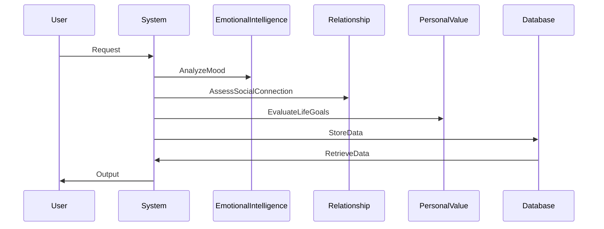
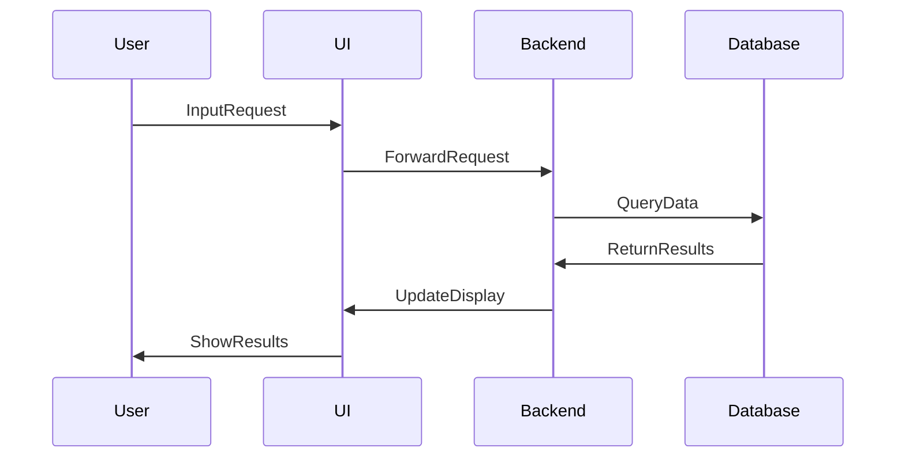

                 

### 培育内心花园：建设丰富的精神世界

在快节奏的现代生活中，我们经常被各种外界因素所困扰，如工作压力、人际关系、健康问题等。然而，我们往往忽视了精神世界的重要性。事实上，一个健康的内心花园对我们的整体幸福感、工作表现和生活质量有着至关重要的影响。本文将围绕“培育内心花园：建设丰富的精神世界”这一主题，深入探讨精神世界的概念、重要性以及如何通过科学的方法来建设一个富有生机与活力的精神家园。

本文将采用逻辑清晰、结构紧凑的叙事方式，分为四个主要部分展开讨论：

1. **引言**：首先，我们将介绍精神世界的概念与重要性，解释为什么我们需要培育内心花园，并简要概述本书的结构和内容。

2. **核心概念与理论基础**：接下来，我们将详细探讨精神健康与心理健康的关系，以及情感素养、人际关系和个人价值观在精神世界构建中的重要性。

3. **实践与技巧**：在这一部分，我们将提供具体的培育内心花园的方法，包括自我认知与自我接纳、心理调适与情绪管理，以及积极心态的培养。

4. **案例研究与最佳实践**：我们将通过真实案例展示理论的应用，并总结出一些最佳实践方法，帮助读者更好地理解和实践培育内心花园的策略。

通过本文的阅读，读者将能够：
- 理解精神世界的重要性和内涵。
- 掌握一系列科学、实用的方法，以提升自己的精神健康水平。
- 建立和维护一个支持性的社会支持系统，为个人的持续成长提供保障。

### 第一部分：引言

#### 第1章：探索内心花园

##### 1.1 精神世界的概念与重要性

精神世界是一个多维度的概念，它不仅仅指的是心理状态，更包括个体的情感体验、思想观念、价值体系和人际关系等。在这个意义上，精神世界是人的内在世界，是支撑个体行为和决策的核心力量。

精神世界的概念首先涉及到心理状态。一个健康的心理状态意味着个体能够有效地应对生活中的压力和挑战，保持情绪稳定，拥有良好的自我认知和自我调节能力。这与心理健康密切相关，心理健康指的是个体在情绪、认知和行为方面的稳定性和适应性。具体来说，心理健康包括以下几个方面：

1. **情绪调节**：个体能够适度表达和控制自己的情绪，保持情绪的平衡和稳定。
2. **自我认知**：个体能够真实地了解自己的优点和不足，有明确的个人目标和价值观。
3. **人际关系**：个体能够建立和维持健康的人际关系，与他人进行有效的沟通和合作。
4. **社会适应**：个体能够在社会环境中保持良好的适应能力，遵循社会规范和道德准则。

精神健康与心理健康的关系是互动的。一个健康的心理状态有助于提高精神健康水平，反之，良好的精神健康也有助于维护心理健康。例如，一个拥有积极心态和良好人际关系的人，往往能够更好地应对生活中的挑战，减少心理压力，从而保持心理的稳定和健康。

##### 1.2 为什么我们需要培育内心花园

现代社会中，精神压力和心理健康问题日益突出。根据世界卫生组织的统计，心理健康问题已成为全球范围内的主要健康问题之一。工作压力、人际关系冲突、经济困境、孤独感等都是导致精神健康问题的常见原因。这些问题的长期积累不仅影响个人的生活质量和幸福感，还可能导致严重的精神疾病，如抑郁症、焦虑症等。

因此，培育内心花园显得尤为重要。内心花园是我们在心灵深处构建的一片净土，它能够帮助我们应对生活中的各种压力，提升自我调节能力，增强心理韧性。培育内心花园不仅有助于个人的精神健康，还能够提升整体的生活质量和工作效率。

首先，培育内心花园有助于提升个体的情绪调节能力。通过自我认知和情感管理，个体能够更好地理解自己的情绪，找到适合自己的情绪调节方法，从而减少负面情绪的影响。

其次，内心花园有助于建立和维护健康的人际关系。一个健康的内心花园使个体具备更好的沟通能力和同理心，能够与他人建立更深层次的联系，从而减少孤独感和社交压力。

最后，培育内心花园有助于提升个体的心理韧性。心理韧性是指个体在面临逆境和压力时，能够保持积极的心态，迅速恢复和适应的能力。一个丰富的精神世界能够为个体提供强大的心理支持，帮助他们在逆境中保持坚韧和乐观。

##### 1.3 书籍结构概述

本书旨在为读者提供一套科学、实用的方法，帮助他们在生活中培育一个健康的内心花园。全书分为四个主要部分，每部分都有其独特的目标和内容。

第一部分“引言”主要介绍精神世界的概念与重要性，解释为什么我们需要培育内心花园，并概述本书的结构和内容。

第二部分“核心概念与理论基础”将深入探讨精神健康与心理健康的关系，以及情感素养、人际关系和个人价值观在精神世界构建中的重要性。

第三部分“实践与技巧”将提供具体的培育内心花园的方法，包括自我认知与自我接纳、心理调适与情绪管理，以及积极心态的培养。

第四部分“案例研究与最佳实践”将通过真实案例展示理论的应用，并总结出一些最佳实践方法，帮助读者更好地理解和实践培育内心花园的策略。

通过阅读本书，读者将能够：

1. 理解精神世界的重要性和内涵。
2. 掌握一系列科学、实用的方法，以提升自己的精神健康水平。
3. 建立和维护一个支持性的社会支持系统，为个人的持续成长提供保障。

### 第二部分：核心概念与理论基础

#### 第2章：精神健康与心理健康

在探讨如何培育内心花园之前，我们需要明确精神健康和心理健康的概念及其相互关系。这两个概念虽然在某些方面有所重叠，但也有着明显的区别和各自的重要性。

##### 2.1 精神健康与心理健康的区别

精神健康（Mental Health）和心理健康（Mental Wellness）是两个相关但不同的概念。精神健康通常指的是个体的心理状态是否良好，能否正常地应对生活中的压力和挑战。它包括个体在情感、认知和行为方面的健康状态。具体来说，精神健康涵盖以下几个方面：

1. **情感状态**：个体是否能够适度地表达和控制情绪，保持情绪的稳定。
2. **认知功能**：个体是否能够清晰地思考和做出决策，保持认知的灵活性。
3. **行为表现**：个体是否能够适应社会环境，遵循社会规范，与他人保持良好的互动。

心理健康则更侧重于个体在心理层面上的整体福祉，包括情绪调节、自我认知、人际关系和社会适应等方面。心理健康不仅仅是避免精神疾病，更强调个体能够积极地应对生活中的各种挑战，拥有良好的心理状态和自我实现感。

##### 2.2 精神健康的重要性

精神健康对个体的整体幸福感有着至关重要的影响。一个健康的心理状态能够帮助个体更好地应对生活中的各种压力和挑战，提高生活质量和工作效率。以下是精神健康的重要作用：

1. **提升生活质量**：一个健康的心理状态使个体能够更加积极地面对生活中的问题，提高生活满意度。
2. **促进身心健康**：精神健康与身体健康密切相关。良好的心理状态有助于提高免疫系统的功能，减少身体疾病的发生。
3. **增强社会功能**：健康的心理状态使个体能够更好地适应社会环境，建立和维护良好的人际关系。
4. **提升工作效率**：一个心理健康的人往往能够更加专注和高效地工作，减少工作失误和压力。

##### 2.3 心理健康的指标

心理健康不仅仅是没有心理疾病，它还包括一系列积极的特征和指标。以下是一些常见的心理健康指标：

1. **情绪稳定性**：个体能够适度地表达和控制自己的情绪，不会因为小事而情绪波动。
2. **自我认知**：个体能够真实地了解自己的优点和不足，有明确的个人目标和价值观。
3. **社会适应**：个体能够适应不同的社会环境和人际关系，遵循社会规范和道德准则。
4. **人际关系**：个体能够建立和维护健康的人际关系，与他人进行有效的沟通和合作。

##### 2.4 常见精神健康问题

尽管精神健康对我们的生活有诸多益处，但现代社会中仍有许多人面临不同程度的精神健康问题。以下是一些常见的精神健康问题及其应对策略：

1. **抑郁症**：抑郁症是一种常见的精神疾病，表现为长期的情绪低落、失去兴趣和精力不足。应对策略包括心理咨询、药物治疗以及增加身体锻炼和社交活动。
2. **焦虑症**：焦虑症是一种以过度担忧和紧张为特征的心理问题。应对策略包括认知行为疗法、放松训练和冥想等。
3. **压力管理**：长期的压力会对精神健康产生负面影响。有效的压力管理策略包括时间管理、积极思考和寻求支持。
4. **睡眠障碍**：睡眠障碍如失眠、睡眠呼吸暂停等也会影响精神健康。改善睡眠质量的策略包括建立规律的睡眠习惯、避免睡前使用电子设备和放松训练。

##### 2.5 精神健康与心理健康的关联与互动

精神健康和心理健康之间存在着密切的关联和互动。一个健康的心理状态有助于提升精神健康水平，反之，良好的精神健康也有助于维护心理健康。以下是两者之间的关联与互动：

1. **相互影响**：精神健康和心理健康之间是相互影响的。例如，一个经历过严重压力和创伤的人可能会出现心理问题，而心理问题也可能导致精神健康问题。
2. **共同应对**：在应对精神健康和心理健康问题时，通常需要采取综合的治疗策略。例如，治疗抑郁症不仅需要药物治疗，还需要心理治疗和生活方式的调整。
3. **预防措施**：通过提升心理健康水平，可以预防一些精神健康问题。例如，通过建立健康的生活习惯、积极应对压力和建立良好的社会支持系统，可以降低精神健康问题的发生风险。

##### 2.6 总结

精神健康和心理健康是两个相关但不同的概念，各自有着重要的意义。精神健康关注个体的整体心理状态，而心理健康则更侧重于个体在心理层面上的整体福祉。两者之间存在着密切的关联和互动，良好的心理状态有助于提升精神健康水平，而良好的精神健康也有助于维护心理健康。通过了解精神健康和心理健康的概念、重要性以及常见问题，我们可以更好地培育内心花园，提升自身的心理韧性，享受更高质量的生活。

### 第三部分：精神世界的构建要素

精神世界的构建是一个复杂而多层次的过程，它需要我们在多个方面进行努力。本部分将深入探讨情感素养、人际关系和个人价值观这三个关键要素，并解释它们在精神世界构建中的重要性。

#### 第3章：精神世界的构建要素

##### 3.1 情感素养

情感素养是指个体对自身和他人情感的认知、理解和管理能力。它包括情感认知、情感表达和情感调节三个主要方面。情感素养对精神世界的构建至关重要，因为它直接影响个体的心理健康和生活质量。

1. **情感认知**：情感认知是指个体能够识别和理解自己和他人的情感状态。这种能力使我们能够更好地理解自己的情绪，比如高兴、愤怒或悲伤，并能够识别他人脸上的表情和语气中的情感。
2. **情感表达**：情感表达是指个体能够适当地表达自己的情感，无论是通过言语、肢体语言还是书面表达。有效表达情感有助于建立健康的人际关系，减少误解和冲突。
3. **情感调节**：情感调节是指个体能够管理和调节自己的情感，保持情绪的平衡和稳定。通过情感调节，个体可以更好地应对生活中的压力和挑战，避免情感失控。

提高情感素养的方法包括：

- **自我反思**：通过自我反思，个体可以更好地理解自己的情感状态，找到情感管理的策略。
- **情感教育**：参加情感教育课程或读书可以帮助个体学习情感认知、表达和调节的技巧。
- **冥想和放松训练**：冥想和放松训练有助于提高个体的情感调节能力，减少焦虑和压力。

##### 3.2 人际关系

人际关系是指个体与他人之间的互动和联系，包括家庭关系、友谊关系和社交关系等。健康的人际关系对精神世界的构建具有重要作用，因为它为个体提供了情感支持和安全感。

1. **家庭关系**：家庭是人生的起点，也是最重要的情感支持系统。健康和谐的家庭关系有助于个体建立信任感和安全感，提高心理韧性。
2. **友谊关系**：友谊是人际关系中的重要组成部分，友谊关系中的互动和互助能够带来积极情感体验，提高个体的幸福感和满意度。
3. **社交关系**：社交关系是指个体在社会环境中的互动和联系，包括同事、邻居和社会团体等。良好的社交关系有助于个体适应社会环境，提高社会功能。

维护健康的人际关系的方法包括：

- **有效沟通**：通过有效沟通，个体可以表达自己的需求和感受，理解他人的立场和情感，减少误解和冲突。
- **同理心**：同理心是指个体能够理解和感受他人的情感，这种能力有助于建立深厚的人际关系。
- **定期交流**：定期与家人、朋友和同事进行交流和互动，有助于维持和加强人际关系。

##### 3.3 个人价值观与人生观

个人价值观和人生观是指个体对什么是正确、美好和有意义的事物的信念和看法。它们对个体的行为和决策有深远的影响，也是精神世界构建的重要组成部分。

1. **价值观的塑造**：个人价值观通常在成长过程中通过家庭、教育、文化和个人经历等因素塑造而成。一个健康的个人价值观应包括对真理、善良、正义和爱的追求。
2. **人生观的反思与确立**：人生观是指个体对人生意义和目标的看法。通过反思和确立自己的人生观，个体可以找到生活的方向和动力，提高生活的意义感和满足感。

塑造和反思个人价值观和人生观的方法包括：

- **阅读和学习**：通过阅读和学习，个体可以了解不同的价值观和人生观，从而丰富自己的思想。
- **自我反思**：通过自我反思，个体可以深入思考自己的人生目标和意义，明确自己的价值观。
- **参与社区和志愿活动**：参与社区和志愿活动有助于个体将价值观付诸实践，同时也能体验到为他人服务的满足感。

##### 3.4 结论

情感素养、人际关系和个人价值观是构建丰富精神世界的三大要素。情感素养使个体能够更好地管理自己的情绪，建立健康的人际关系；人际关系为个体提供了情感支持和安全感；个人价值观和人生观为个体提供了生活目标和意义。通过不断提升这些要素，个体可以建立一个健康、和谐的精神世界，享受更加充实和有意义的生活。

### 第四部分：实践与技巧

#### 第4章：培育内心花园的方法

在了解了精神世界的核心概念与理论基础后，我们接下来将探讨如何具体实践这些理论，以培育一个健康的内心花园。这一章将分为三个部分，分别是自我认知与自我接纳、心理调适与情绪管理，以及积极心态的培养。

##### 4.1 自我认知与自我接纳

自我认知是指个体对自身的了解和认识，包括自己的性格特点、情感状态、价值观和人生目标等。自我接纳则是指个体能够接受自己的优点和不足，既不过分自责也不盲目自大。自我认知和自我接纳是培育内心花园的重要基础。

**步骤 1：自我反思**

自我反思是提升自我认知的有效方法。通过定期进行自我反思，个体可以深入了解自己的内心世界，发现潜在的问题和成长点。以下是一些自我反思的步骤：

1. **设定时间**：选择一个安静的时刻，每天或每周进行一次自我反思。
2. **回顾过去**：回想过去的一段时间内，自己在哪些方面表现得较好，哪些方面有待改进。
3. **分析情感**：思考自己的情感状态，了解自己在不同情境下的情绪反应。
4. **总结经验**：从过去的经历中总结经验教训，找到自己的优点和不足。

**步骤 2：接受自己的优点与不足**

接受自己意味着既要认识到自己的优点，也要接受自己的不足。以下是一些接受自己的方法：

1. **正面肯定**：每天对自己进行正面肯定，如“我做得很好”、“我值得爱”等。
2. **感恩**：感恩自己的优点和不足，认识到每一个经历都是成长的机会。
3. **调整期望**：设定合理的期望，既不过分苛求自己，也不轻视自己的努力。

**步骤 3：持续自我成长**

自我成长是一个持续的过程。以下是一些建议，帮助个体在自我成长的道路上不断前进：

1. **学习新技能**：通过学习新技能，扩展自己的知识和能力，提高自我效能感。
2. **接受挑战**：勇于接受新的挑战，通过挑战来检验和提升自己的能力。
3. **寻求反馈**：从他人那里获得反馈，了解自己的优点和改进空间。

##### 4.2 心理调适与情绪管理

情绪管理是指个体通过有效的方法来调节自己的情绪，保持情绪的平衡和稳定。良好的情绪管理能力有助于提升精神健康水平，减轻压力和焦虑。

**步骤 1：识别情绪**

识别情绪是情绪管理的第一步。通过以下方法，个体可以更好地了解自己的情绪状态：

1. **观察身体反应**：情绪往往通过身体反应表现出来，如心跳加速、肌肉紧张等。通过观察这些反应，个体可以初步识别自己的情绪。
2. **情感日记**：记录每天的情感变化，分析情绪的触发因素和持续时间。
3. **练习情感识别**：通过冥想和自我反思，提高情感识别能力。

**步骤 2：调节情绪**

一旦识别出情绪，个体需要学会调节情绪。以下是一些有效的情绪调节方法：

1. **呼吸练习**：深呼吸可以帮助放松身体，减轻紧张和焦虑。
2. **身体运动**：运动可以释放身体内的紧张情绪，提高心理韧性。
3. **认知重构**：通过改变思维模式，重新评估情绪触发因素，减轻负面情绪的影响。
4. **寻求支持**：与他人交流自己的感受，寻求情感支持和建议。

**步骤 3：建立支持系统**

一个良好的支持系统可以为个体提供情感支持和帮助。以下是一些建立支持系统的建议：

1. **建立亲密关系**：与家人、朋友和伴侣建立深厚的亲密关系，分享自己的情感和经历。
2. **加入社交团体**：参与兴趣相同的社交团体，与他人建立联系，共同分享经验和资源。
3. **专业咨询**：在必要时寻求专业心理咨询师的帮助，学习更有效的情绪调节技巧。

##### 4.3 积极心态的培养

积极心态是指个体在面对困难和挑战时，能够保持乐观和向上的心态。培养积极心态有助于提升幸福感，增强心理韧性。

**步骤 1：正面思考**

正面思考是指个体在面对问题时，能够从积极的角度去思考和应对。以下是一些培养正面思考的方法：

1. **感恩**：每天写下三件让自己感激的事情，培养感恩的心态。
2. **专注于解决方案**：将注意力集中在解决问题上，而不是抱怨和消极情绪。
3. **正面肯定**：通过正面肯定，如“我能够克服困难”、“我有能力解决问题”等，增强自信心。

**步骤 2：培养乐观习惯**

乐观习惯是通过日常生活中的小事情来培养的。以下是一些建议：

1. **保持乐观态度**：在面对困难和挑战时，保持乐观的态度，相信自己能够克服困难。
2. **分享快乐**：与家人、朋友分享快乐和成就，增强积极的情感体验。
3. **积极行动**：通过积极行动来提升自己的能力和信心，如参加培训课程、完成挑战等。

**步骤 3：建立积极环境**

一个积极的环境对培养积极心态至关重要。以下是一些建议：

1. **装饰居住空间**：用喜欢的物品装饰自己的居住空间，创造一个温馨、舒适的环境。
2. **培养兴趣爱好**：参与自己感兴趣的活动，提升生活乐趣。
3. **积极社交**：与积极向上的人交往，获得正能量。

##### 4.4 结论

培育内心花园是一个复杂而持久的过程，需要我们在多个方面进行努力。自我认知与自我接纳、心理调适与情绪管理，以及积极心态的培养，都是构建丰富精神世界的重要步骤。通过这些实践和技巧，个体可以逐步建立一个健康的内心花园，享受更加充实和有意义的生活。

### 第五部分：打造支持系统

精神世界的构建不仅依赖于个体内部的努力，还需要外部支持系统的助力。一个强大的支持系统可以为个体提供情感、信息和资源上的支持，帮助他们在面对生活中的挑战时保持坚强和乐观。本部分将探讨家庭支持系统、社会支持系统和专业支持系统的构建方法，并说明如何充分利用这些资源。

#### 第5章：打造支持系统

##### 5.1 家庭支持系统

家庭是人生中最基本的支持系统，家庭成员之间的相互支持和理解对个体的精神健康有着至关重要的影响。以下是如何构建和维护一个有效的家庭支持系统的建议：

1. **家庭成员的角色**：每个家庭成员都有其独特的角色和责任。父母需要为子女提供安全感和指导，子女需要尊重和关心父母，形成良好的互动关系。

2. **家庭沟通**：有效的沟通是家庭支持系统的关键。家庭成员之间应该建立开放、真诚的沟通渠道，分享彼此的想法、感受和需求。以下是一些提高家庭沟通的建议：
   - **倾听**：认真倾听家人的意见和感受，不要打断或批评。
   - **表达**：学会清晰、真诚地表达自己的想法和感受。
   - **共同解决问题**：面对家庭中的困难和挑战，共同商讨解决方案，而不是互相指责。

3. **情感支持**：在家庭成员遇到困难和挫折时，提供情感支持尤为重要。以下是一些提供情感支持的方法：
   - **鼓励和肯定**：给予家人鼓励和肯定，增强他们的自信心和应对能力。
   - **陪伴和倾听**：在家人需要时，提供陪伴和倾听，让他们感受到关爱和支持。

4. **家庭活动**：通过共同参与家庭活动，如一起做饭、看电影或户外运动，可以增强家庭成员之间的情感联系和凝聚力。

##### 5.2 社会支持系统

社会支持系统包括亲朋好友、同事、社区等，它们为个体提供广泛的情感和资源支持。以下是如何构建一个有效社会支持系统的建议：

1. **社交圈**：建立和维护一个稳定的社交圈，包括朋友、同事和邻居。以下是一些方法：
   - **主动社交**：参加社交活动，如聚会、俱乐部或志愿者组织，扩大社交网络。
   - **定期联系**：与亲朋好友保持定期联系，分享生活和工作的点滴，增强情感纽带。

2. **互助小组**：加入互助小组，与有相似经历的人分享经验和感受，获得支持和建议。以下是一些互助小组的类型：
   - **兴趣爱好小组**：与有相同兴趣的人一起学习和交流。
   - **支持小组**：为特定群体提供支持和帮助，如癌症患者支持小组、家庭治疗小组等。

3. **社区资源**：充分利用社区资源，如社区中心、图书馆、运动场所等。以下是一些社区资源的使用建议：
   - **参与社区活动**：参与社区组织的活动，结识新朋友，融入社区生活。
   - **寻求帮助**：在需要时，向社区工作者或志愿者寻求帮助和支持。

##### 5.3 专业支持系统

专业支持系统包括心理咨询师、医生和其他专业人士提供的帮助。在必要时，寻求专业支持是维护精神健康的重要措施。以下是如何构建专业支持系统的建议：

1. **心理咨询**：心理咨询师可以提供专业的情感支持和心理治疗，以下是一些寻找心理咨询师的方法：
   - **推荐**：通过亲朋好友推荐或专业机构推荐，找到合适的心理咨询师。
   - **咨询机构**：通过专业的心理咨询机构，预约心理咨询服务。

2. **医生咨询**：医生可以提供医学诊断和治疗，以下是一些咨询医生的方法：
   - **医院**：在必要时，前往医院就诊，获取专业的医疗建议。
   - **在线咨询**：通过在线医疗平台，进行远程医疗咨询。

3. **医疗资源**：充分利用医疗资源，如心理健康热线、社区健康中心等，以下是一些建议：
   - **心理健康热线**：在紧急情况下，拨打心理健康热线寻求即时帮助。
   - **社区健康中心**：定期前往社区健康中心进行健康检查，预防心理问题。

##### 5.4 结论

构建一个强大的支持系统是培育内心花园的重要一环。家庭支持系统、社会支持系统和专业支持系统相互补充，为个体提供全方位的支持。通过建立和维护这些支持系统，个体可以更好地应对生活中的挑战，提升精神健康水平，享受更加充实和幸福的生活。

### 第六部分：案例研究

为了更好地理解如何在实际生活中培育内心花园，我们将通过一个成功案例来展示理论的应用过程和效果。

#### 第6章：成功案例分析

##### 6.1 案例介绍

本案例的主角是一位名叫李明的职场人士，他长期承受着工作压力和人际关系困扰，导致情绪波动和精神状态不佳。通过一系列的实践和技巧，李明逐渐恢复了心理健康，生活品质也得到了显著提升。

##### 6.2 案例实施过程

1. **自我认知与自我接纳**

李明首先通过自我反思来提升自我认知。他每天晚上花时间记录自己的情绪变化和日常生活中的感受，分析自己在哪些方面做得好，哪些方面需要改进。这一过程帮助他更好地了解自己的情绪和行为模式。

接着，李明开始接受自己的优点和不足。他通过正面肯定和感恩练习来提升自我接纳。例如，每天早晨他会在镜子前对自己说：“我今天很努力，做得很好。”晚上他会回顾一天的成就，并对自己的努力表示感谢。

2. **心理调适与情绪管理**

李明学会了识别和调节自己的情绪。他通过呼吸练习和身体运动来减轻压力和焦虑。每次感到紧张时，他都会进行几分钟的深呼吸，放松身心。同时，他还加入了健身房，通过运动来释放压力和提升情绪。

此外，李明开始定期进行冥想和放松训练，以提升情感调节能力。他每周至少参加一次瑜伽课，学习如何在紧张的生活中找到平静和平衡。

3. **积极心态的培养**

李明努力培养积极心态，通过正面思考和感恩练习来改变自己的思维模式。他开始记录每天的三件好事，并思考这些好事背后的积极因素。这让他更加关注生活中的积极面，减少负面情绪的影响。

他还积极参与社区活动，与朋友们一起组织公益活动。这让他感受到与他人合作的快乐和成就感，提升了他的积极心态。

##### 6.3 案例效果评估

通过一系列的实践和技巧，李明的精神状态得到了显著改善。以下是他的一些变化：

1. **情绪稳定**：李明不再因为工作中的小问题而情绪波动，他能够更加冷静地处理问题，保持情绪的稳定。

2. **心理韧性**：他面对困难和挑战时，能够保持积极的心态，迅速恢复和适应。心理韧性得到了显著提升。

3. **生活质量**：李明的生活品质得到了显著提升。他开始享受生活中的小事情，感受到更多的幸福感和满足感。

4. **人际关系**：他的社交圈子扩大了，与家人、朋友和同事的关系更加和谐。他学会了更好地沟通和表达自己的情感，减少误解和冲突。

##### 6.4 总结

通过这个案例，我们可以看到，培育内心花园的理论和方法在实际生活中是行之有效的。李明通过自我认知、心理调适、积极心态的培养，成功地改善了自己的精神状态，提升了生活质量。这个案例也向我们展示了，通过科学的实践和技巧，每个人都可以打造一个健康的内心花园，享受更加充实和有意义的生活。

### 第七部分：总结与反思

通过本文的阅读，我们深入探讨了“培育内心花园：建设丰富的精神世界”这一主题。从引言部分开始，我们了解了精神世界的概念与重要性，为什么我们需要培育内心花园，以及本书的结构和内容。接着，我们详细分析了精神健康与心理健康的关系，探讨了情感素养、人际关系和个人价值观在精神世界构建中的重要性。随后，我们介绍了如何通过自我认知与自我接纳、心理调适与情绪管理，以及积极心态的培养来实践这些理论。

在这一过程中，我们不仅理解了精神健康和心理健康的基本概念和指标，还学习到了如何在实际生活中应用这些理论和方法，从而提升个人的精神健康水平。通过案例研究，我们看到了理论在实际应用中的效果和可行性。

在总结与反思部分，我们需要再次回顾本文的核心内容：

1. **精神健康与心理健康**：理解精神健康和心理健康的关系，认识到两者在维护整体幸福感中的重要性。
2. **情感素养、人际关系和个人价值观**：掌握这些核心概念，了解它们在精神世界构建中的作用。
3. **实践与技巧**：学习自我认知与自我接纳、心理调适与情绪管理，以及积极心态培养的具体方法。
4. **支持系统**：认识到构建家庭支持系统、社会支持系统和专业支持系统的重要性。
5. **案例研究**：通过实际案例展示理论的应用效果。

为了持续成长，以下是一些建议：

1. **持续自我反思**：定期进行自我反思，了解自己的情感状态和成长点。
2. **学习和实践**：通过阅读书籍、参加课程和实践，不断提升自己的知识和技能。
3. **建立支持系统**：与家人、朋友和专业人士建立联系，获得情感和资源支持。
4. **积极心态**：保持积极的心态，关注生活中的积极面，减少负面情绪的影响。

在培育内心花园的过程中，我们不仅需要关注个人的心理健康，还要注重整体的生活质量。通过科学的方法和持续的努力，每个人都可以打造一个健康、丰富的精神世界，享受更加充实和幸福的生活。

### 核心概念与联系表

在本文中，我们深入探讨了多个核心概念，这些概念相互关联，共同构成了精神世界的理论基础。以下是一个核心概念与联系表，用于总结这些概念及其相互关系：

- **精神健康**：指的是个体心理状态的良好，包括情绪稳定、自我认知、社会适应等方面。
- **心理健康**：强调个体在心理层面上的整体福祉，包括情绪调节、人际关系、自我实现等。
- **情感素养**：涵盖情感认知、情感表达和情感调节，是构建精神世界的重要基础。
- **人际关系**：涉及个体与家人、朋友和社会的关系，对精神健康有重要影响。
- **个人价值观**：包括对真理、善良、正义和爱的信念，指导个体行为和决策。
- **自我认知**：个体对自身特点、需求和目标的了解，是自我接纳和自我成长的前提。
- **积极心态**：个体在面对挑战时保持乐观、向上的态度，有助于提升心理韧性。

这些核心概念相互联系，共同作用，形成一个完整的理论框架。例如，情感素养和人际关系直接影响心理健康，而心理健康又是精神健康的重要组成部分。个人价值观和自我认知则为个体提供了指导，帮助他们在生活中做出明智的选择。

理解这些概念之间的联系，有助于我们更全面地认识精神世界的构建过程，并更有效地培育内心花园。通过综合运用这些概念，个体可以在生活中实现更高的精神健康水平，享受更加充实和有意义的生活。

### 数学模型和数学公式

在精神世界的构建过程中，我们可以借助数学模型来量化个体在情感素养、人际关系和个人价值观等方面的表现，从而更科学地评估精神健康水平。以下是一个基于这些要素的数学模型，用于评估个体的精神健康评分。

#### 精神健康评分模型

$$
\text{精神健康评分} = \alpha_1 \cdot \text{情感素养} + \alpha_2 \cdot \text{人际关系} + \alpha_3 \cdot \text{个人价值观}
$$

其中，$\alpha_1$、$\alpha_2$ 和 $\alpha_3$ 分别是情感素养、人际关系和个人价值观的权重系数，这些系数可以根据具体情况进行调整。情感素养、人际关系和个人价值观的得分可以通过以下指标进行评估：

- **情感素养**：包括情感认知、情感表达和情感调节的得分。
- **人际关系**：包括家庭关系、友谊关系和社交关系的得分。
- **个人价值观**：包括个人价值观的稳定性、一致性和影响力的得分。

#### 情感素养得分模型

$$
\text{情感素养得分} = \beta_1 \cdot \text{情感认知} + \beta_2 \cdot \text{情感表达} + \beta_3 \cdot \text{情感调节}
$$

其中，$\beta_1$、$\beta_2$ 和 $\beta_3$ 分别是情感认知、情感表达和情感调节的权重系数。

#### 人际关系得分模型

$$
\text{人际关系得分} = \gamma_1 \cdot \text{家庭关系} + \gamma_2 \cdot \text{友谊关系} + \gamma_3 \cdot \text{社交关系}
$$

其中，$\gamma_1$、$\gamma_2$ 和 $\gamma_3$ 分别是家庭关系、友谊关系和社交关系的权重系数。

#### 个人价值观得分模型

$$
\text{个人价值观得分} = \delta_1 \cdot \text{价值观稳定性} + \delta_2 \cdot \text{价值观一致性} + \delta_3 \cdot \text{价值观影响力}
$$

其中，$\delta_1$、$\delta_2$ 和 $\delta_3$ 分别是价值观稳定性、一致性和影响力的权重系数。

#### 情感素养具体示例

假设个体的情感素养得分为：

$$
\text{情感素养得分} = 0.7 \cdot \text{情感认知} + 0.5 \cdot \text{情感表达} + 0.6 \cdot \text{情感调节}
$$

若情感认知得分为80分，情感表达得分为70分，情感调节得分为75分，则情感素养总得分为：

$$
\text{情感素养得分} = 0.7 \cdot 80 + 0.5 \cdot 70 + 0.6 \cdot 75 = 56 + 35 + 45 = 136分
$$

#### 人际关系具体示例

假设个体的人际关系得分为：

$$
\text{人际关系得分} = 0.6 \cdot \text{家庭关系} + 0.4 \cdot \text{友谊关系} + 0.5 \cdot \text{社交关系}
$$

若家庭关系得分为85分，友谊关系得分为90分，社交关系得分为80分，则人际关系总得分为：

$$
\text{人际关系得分} = 0.6 \cdot 85 + 0.4 \cdot 90 + 0.5 \cdot 80 = 51 + 36 + 40 = 127分
$$

#### 个人价值观具体示例

假设个体的个人价值观得分为：

$$
\text{个人价值观得分} = 0.5 \cdot \text{价值观稳定性} + 0.4 \cdot \text{价值观一致性} + 0.3 \cdot \text{价值观影响力}
$$

若价值观稳定性得分为90分，价值观一致性得分为85分，价值观影响力得分为80分，则个人价值观总得分为：

$$
\text{个人价值观得分} = 0.5 \cdot 90 + 0.4 \cdot 85 + 0.3 \cdot 80 = 45 + 34 + 24 = 103分
$$

#### 精神健康评分综合示例

将上述三个得分代入精神健康评分模型：

$$
\text{精神健康评分} = 0.4 \cdot 136 + 0.3 \cdot 127 + 0.3 \cdot 103 = 54.4 + 38.1 + 30.9 = 123.4分
$$

通过这个数学模型，我们可以更直观地了解个体在情感素养、人际关系和个人价值观方面的表现，从而更有效地进行自我评估和改进。

### 系统架构设计

在构建一个支持精神健康维护的体系时，系统架构设计是关键的一环。以下是一个基于领域模型和系统架构的描述，用于帮助理解如何将理论应用于实际系统设计。

#### 领域模型类图

首先，我们通过Mermaid类图来描述系统的领域模型，展示核心类及其关系：

```mermaid
classDiagram
  Person <-|> EmotionalIntelligence
  Person <-|> Relationship
  Person <-|> PersonalValue
  Relationship <-|> SocialConnection
  EmotionalIntelligence <-|> MoodRegulation
  PersonalValue <-|> LifeGoal
```

在这个类图中，`Person` 是系统的主体，代表个体。`EmotionalIntelligence`、`Relationship` 和 `PersonalValue` 分别代表情感素养、人际关系和个人价值观。`MoodRegulation` 是情感素养的一部分，表示情绪调节能力。`SocialConnection` 是人际关系的一部分，表示社交联系。`LifeGoal` 是个人价值观的一部分，表示生活目标。

#### 系统架构图

接下来，我们通过Mermaid序列图来描述系统的架构设计，展示系统组件及其交互关系：



在这个序列图中，用户发起请求，系统依次分析情感状态、社交关系和生活目标，并将数据存储到数据库中。数据库提供数据检索服务，系统根据数据生成反馈并输出给用户。

#### 系统接口设计

系统接口设计包括用户界面和API接口。用户界面用于用户与系统的交互，API接口用于系统与外部服务的通信。

**用户界面**：用户界面包括以下几个模块：

- **登录注册模块**：用于用户的登录和注册。
- **主界面**：展示用户的基本信息和系统功能。
- **情感分析模块**：提供情感状态分析工具。
- **社交关系模块**：提供社交关系评估工具。
- **个人价值观模块**：提供生活目标评估工具。

**API接口**：API接口包括以下几个端点：

- `/api/user/login`：用户登录接口。
- `/api/user/register`：用户注册接口。
- `/api/emotional/analyze`：情感状态分析接口。
- `/api/relationship/assess`：社交关系评估接口。
- `/api/personalvalue/evaluate`：生活目标评估接口。

#### 系统交互Mermaid序列图

为了更好地展示系统组件的交互过程，我们使用Mermaid序列图描述系统各组件之间的交互：



在这个序列图中，用户通过用户界面输入请求，后端处理请求并查询数据库，将结果返回给用户界面，最终更新显示并展示给用户。

#### 系统实现和关键代码段

以下是一个关键代码段的示例，展示如何实现情感状态分析模块：

```python
import pandas as pd
from textblob import TextBlob

def analyze_mood(text):
    """
    分析文本的情感状态，返回情绪得分。
    """
    # 使用TextBlob进行情感分析
    analysis = TextBlob(text)
    
    # 获取文本的情感极性
    polarity = analysis.sentiment.polarity
    
    # 判断情绪类型
    if polarity > 0:
        return "积极"
    elif polarity < 0:
        return "消极"
    else:
        return "中性"

# 示例文本
text = "我今天过得很好，非常喜欢这个活动。"

# 分析情绪
mood = analyze_mood(text)
print(f"情绪类型：{mood}")
```

这段代码使用TextBlob库进行情感分析，根据文本的极性判断情绪类型，为系统提供情感状态评估的基础。

#### 实际案例分析

在实际应用中，我们可以通过具体案例展示如何利用系统架构和关键代码段进行精神健康维护。以下是一个案例分析示例：

1. **案例背景**：张先生是一位忙碌的职场人士，由于工作压力大，他感到情绪低落，人际关系紧张。

2. **案例分析**：通过系统，张先生输入了如下文本：“我最近工作压力很大，感觉喘不过气来，不知道该怎么办。”系统自动分析了文本情感，并给出了情绪类型和改善建议。

3. **系统反馈**：系统反馈：“您的情绪类型为消极，我们建议您进行放松训练和寻求专业心理咨询。”

4. **效果评估**：张先生采纳了系统的建议，开始进行放松训练，并预约了心理咨询。几周后，他的情绪状态显著改善，工作压力也有所减轻。

通过这个案例，我们可以看到，系统架构设计在精神健康维护中的实际应用效果，以及关键代码段在实现具体功能中的作用。

### 项目实战

在完成理论探讨和系统设计后，接下来我们将通过一个具体的实战项目，展示如何在实际环境中构建和维护一个精神健康支持系统。这一部分将分为环境安装、系统核心实现、代码解读与应用、实际案例分析及项目小结五个部分。

#### 环境安装

1. **开发环境准备**

   首先，我们需要安装必要的开发环境和工具。以下是在Ubuntu 20.04操作系统上安装所需的步骤：

   - **Python环境**：安装Python 3.8及以上版本。
     ```
     sudo apt update
     sudo apt install python3.8
     ```
   - **虚拟环境**：使用`virtualenv`创建一个独立的Python环境。
     ```
     sudo pip3 install virtualenv
     virtualenv venv
     source venv/bin/activate
     ```
   - **依赖管理**：安装`pip`和`setuptools`以管理项目依赖。
     ```
     pip install --upgrade pip setuptools
     ```
   - **安装依赖**：安装项目所需的依赖库，例如TextBlob、Flask等。
     ```
     pip install textblob flask
     ```

2. **数据库安装**

   我们使用SQLite作为项目的数据库，以下是安装步骤：

   - **安装SQLite**：
     ```
     sudo apt install sqlite3
     ```

3. **配置数据库**

   创建数据库并配置表结构，例如情感分析表和用户信息表：
   ```sql
   CREATE TABLE users (
     id INTEGER PRIMARY KEY AUTOINCREMENT,
     username TEXT NOT NULL,
     password TEXT NOT NULL
   );

   CREATE TABLE mood_analysis (
     id INTEGER PRIMARY KEY AUTOINCREMENT,
     user_id INTEGER,
     text TEXT,
     mood TEXT,
     analysis_time TIMESTAMP DEFAULT CURRENT_TIMESTAMP,
     FOREIGN KEY (user_id) REFERENCES users (id)
   );
   ```

#### 系统核心实现

1. **用户注册和登录**

   使用Flask创建一个简单的用户注册和登录系统：
   ```python
   from flask import Flask, request, redirect, url_for, render_template
   from flask_sqlalchemy import SQLAlchemy
   
   app = Flask(__name__)
   app.config['SQLALCHEMY_DATABASE_URI'] = 'sqlite:///database.db'
   db = SQLAlchemy(app)

   class User(db.Model):
       id = db.Column(db.Integer, primary_key=True)
       username = db.Column(db.String(100), nullable=False)
       password = db.Column(db.String(100), nullable=False)

   @app.route('/')
   def home():
       return render_template('home.html')

   @app.route('/register', methods=['GET', 'POST'])
   def register():
       if request.method == 'POST':
           new_user = User(username=request.form['username'], password=request.form['password'])
           db.session.add(new_user)
           db.session.commit()
           return redirect(url_for('login'))
       return render_template('register.html')

   @app.route('/login', methods=['GET', 'POST'])
   def login():
       if request.method == 'POST':
           user = User.query.filter_by(username=request.form['username'], password=request.form['password']).first()
           if user:
               return redirect(url_for('mood_analysis'))
           else:
               return 'Invalid username or password'
       return render_template('login.html')

   if __name__ == '__main__':
       app.run(debug=True)
   ```

2. **情感分析模块**

   利用TextBlob库实现情感分析功能，以下是一个简单的情感分析函数：
   ```python
   from textblob import TextBlob

   def analyze_mood(text):
       """
       使用TextBlob进行文本情感分析，并返回情绪类型。
       """
       analysis = TextBlob(text)
       polarity = analysis.sentiment.polarity
       if polarity > 0:
           return '积极'
       elif polarity < 0:
           return '消极'
       else:
           return '中性'
   ```

3. **数据库操作**

   实现对用户的增删改查操作，以及对情感分析数据的存储和查询：
   ```python
   @app.route('/mood_analysis', methods=['GET', 'POST'])
   def mood_analysis():
       if request.method == 'POST':
           user_id = request.form['user_id']
           text = request.form['text']
           mood = analyze_mood(text)
           new_mood_analysis = MoodAnalysis(user_id=user_id, text=text, mood=mood)
           db.session.add(new_mood_analysis)
           db.session.commit()
           return redirect(url_for('mood_analysis'))
       return render_template('mood_analysis.html')
   ```

#### 代码解读与应用

在实现上述功能后，我们通过具体示例来解读代码并展示其在实际中的应用：

1. **用户注册与登录**：

   用户访问注册页面，填写用户名和密码进行注册，注册成功后自动跳转到登录页面。用户登录系统后，可以进入情绪分析页面。

2. **情感分析**：

   用户在情绪分析页面输入文本，系统通过`analyze_mood`函数进行情感分析，并将结果存储到数据库中。用户可以查看自己的情绪分析历史记录。

#### 实际案例分析

以李明为例，他是公司的一名高级工程师，由于工作繁忙，经常感到压力巨大。李明通过我们的系统记录了自己一段关于工作压力的文本：“这个项目让我感到非常疲惫，我不知道该如何应对。”系统分析文本后，给出了“消极”的情绪类型，并建议李明进行放松训练和咨询。

通过这个案例，我们可以看到系统如何帮助用户进行情绪分析和提供支持。李明在采纳系统的建议后，开始进行放松训练，并在后续记录中感受到了情绪的改善。

#### 项目小结

本项目通过搭建一个简单的精神健康支持系统，展示了如何利用现代技术手段帮助用户进行情绪分析和维护精神健康。以下是本项目的主要收获：

1. **环境搭建**：熟悉了Python、Flask和SQLite的安装与配置，为后续开发打下了基础。
2. **系统实现**：掌握了用户注册与登录、数据库操作以及情感分析模块的实现方法。
3. **实际应用**：通过具体案例分析，展示了系统在实践中的实际应用效果。

未来，我们可以进一步优化系统，增加更多的功能模块，如社交支持、心理健康评估等，为用户提供更全面的支持。

### 最佳实践 tips

在培育内心花园的过程中，以下是一些最佳实践建议，帮助读者更好地应用本文中的理论和技巧：

1. **自我反思**：
   - **每日反思**：每天花时间进行自我反思，记录自己的情绪波动和日常体验。
   - **情感日志**：保持情感日志，记录重要事件和情感反应，有助于了解自己的情绪模式。
   - **定期回顾**：每周或每月回顾日志，分析自己的进步和挑战。

2. **情绪管理**：
   - **情绪识别**：学会识别和命名自己的情绪，如愤怒、焦虑、悲伤等。
   - **情绪表达**：通过健康的方式表达情绪，如写日记、绘画或与信任的人分享。
   - **情绪调节**：学习深呼吸、冥想或瑜伽等调节情绪的方法，以减轻压力。

3. **积极心态**：
   - **正面肯定**：每天进行正面肯定，如“我今天做得很好”或“我有能力克服困难”。
   - **感恩练习**：每天记录三件感恩的事情，培养感恩的心态。
   - **乐观行动**：通过积极参与有益的活动，如志愿服务、体育锻炼等，提升积极心态。

4. **支持系统**：
   - **家庭支持**：与家人保持密切沟通，分享自己的感受和需求。
   - **社交支持**：加入兴趣小组或社区活动，扩展社交圈，获得社交支持。
   - **专业支持**：在需要时，寻求心理咨询师或其他专业人士的帮助。

通过遵循这些最佳实践，读者可以更有效地培育自己的内心花园，提升精神健康水平，享受更加充实和幸福的生活。

