                 

### 文章标题

# 基于图谱的AI Agent知识推理与问答

> 关键词：AI Agent、知识图谱、知识推理、问答系统、图谱构建

> 摘要：本文深入探讨了基于图谱的AI Agent知识推理与问答系统，从背景介绍、基础概念、图谱构建、知识抽取、知识推理算法、AI Agent设计与实现以及应用实践等多个方面，全面解析了这一领域的技术原理和实践方法。通过逐步分析推理，文章旨在为读者提供一个清晰、完整且具有实际应用价值的技术指南。

---

## 第一部分：背景介绍与基础概念

### 1.1 问题背景

#### 1.1.1 AI Agent在现代智能系统中的应用

随着人工智能技术的快速发展，AI Agent作为智能系统的重要组成部分，已经成为现代智能系统中的关键技术。AI Agent，即人工智能代理，是一种能够模拟人类智能行为的计算机程序，具备自主决策和任务执行能力。在智能客服、智能家居、自动驾驶等领域，AI Agent的应用已经成为提升用户体验和系统效率的重要手段。

#### 1.1.2 知识图谱与知识推理的重要性

知识图谱作为一种结构化知识表示方法，能够将海量、复杂的数据转化为易于理解和处理的图形结构。知识图谱中的实体、属性和关系构成了一个强大的知识库，为AI Agent提供了丰富的知识来源。知识推理则是基于知识图谱进行逻辑推理和知识发现的过程，能够实现对问题的自动解答和智能决策。

### 1.2 核心概念

#### 1.2.1 AI Agent的定义与分类

AI Agent是指一种能够模拟人类智能行为的计算机程序，根据功能和应用场景，可以分为反应式Agent、目标导向Agent、认知Agent等不同类型。

#### 1.2.2 知识图谱的基本概念

知识图谱是由实体、属性和关系构成的图形结构，其中实体表示事物，属性描述实体的特征，关系表示实体之间的关联。知识图谱的主要目的是将离散、异构的数据整合成一个统一的结构，为AI Agent提供丰富的知识来源。

#### 1.2.3 知识推理的基本原理

知识推理是基于知识图谱进行逻辑推理和知识发现的过程，包括基于规则的推理、基于模型的方法和基于数据的方法等。知识推理能够实现对问题的自动解答和智能决策。

### 1.3 概念属性特征对比表格

#### 1.3.1 不同类型的AI Agent特征对比

| 类型 | 特征 |
| --- | --- |
| 反应式Agent | 只能对当前环境中的刺激做出反应 |
| 目标导向Agent | 具有明确的目标，并据此进行决策 |
| 认知Agent | 具有自主学习能力和认知能力 |

#### 1.3.2 知识图谱技术对比

| 技术 | 特征 |
| --- | --- |
| 基于RDF的知识图谱 | 使用三元组表示知识 |
| 基于OWL的知识图谱 | 提供更加丰富的本体描述 |
| 基于图数据库的知识图谱 | 提供高效的图存储和查询 |

### 1.4 ER实体关系图架构

#### 1.4.1 知识图谱的实体关系图设计

知识图谱的实体关系图主要由实体、属性和关系构成，其中实体表示事物，属性描述实体的特征，关系表示实体之间的关联。例如，在一个社交网络中，用户、帖子、点赞关系可以构成一个知识图谱。

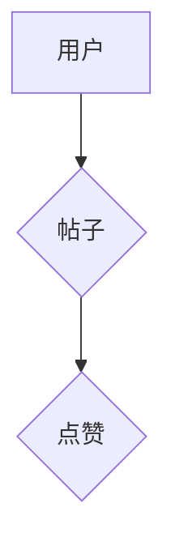

#### 1.4.2 AI Agent的知识表示与推理

AI Agent的知识表示与推理需要依赖于知识图谱。通过知识图谱，AI Agent能够获取实体属性和关系，进行逻辑推理和知识发现。例如，在智能客服系统中，AI Agent可以通过知识图谱查询用户信息、产品信息以及服务记录，从而进行智能问答。

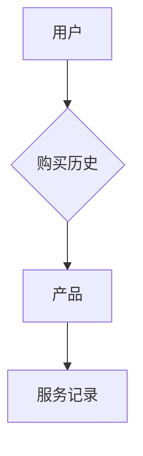

### 1.5 本章小结

本章从背景介绍、核心概念、概念属性特征对比和ER实体关系图架构等多个方面，对基于图谱的AI Agent知识推理与问答系统进行了全面解析。下一章将深入探讨图谱构建与知识抽取的相关技术。

## 第二部分：图谱构建与知识抽取

### 2.1 图谱构建

#### 2.1.1 数据源选择与预处理

构建知识图谱的第一步是选择合适的数据源。常见的数据源包括关系数据库、NoSQL数据库、文本文件等。选择数据源后，需要对数据进行预处理，包括数据清洗、去重、实体识别和关系抽取等操作。

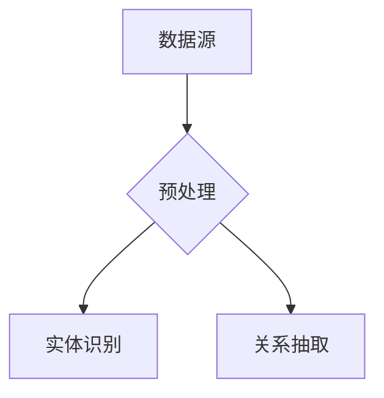

#### 2.1.2 实体与关系的提取

实体提取是指从原始数据中识别出具有独立意义的实体，例如人名、地名、组织机构等。关系提取是指识别出实体之间的关联关系，例如“工作于”、“居住于”等。

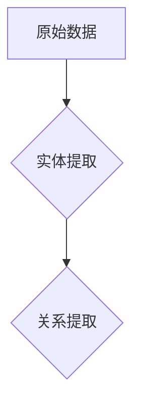

#### 2.1.3 图模型的选择与构建

在知识图谱中，常见的图模型包括基于RDF（Resource Description Framework）的模型和基于OWL（Web Ontology Language）的模型。RDF模型使用三元组表示知识，OWL模型提供更加丰富的本体描述。根据应用需求，可以选择合适的图模型进行构建。

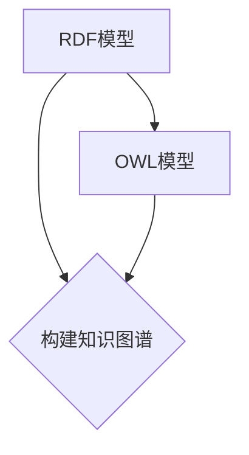

### 2.2 知识抽取

#### 2.2.1 基于规则的知识抽取

基于规则的知识抽取是指通过编写规则来识别实体和关系。规则可以是简单的字符串匹配，也可以是基于自然语言处理的复杂规则。基于规则的方法具有解释性，但可能存在规则覆盖不足或冲突的问题。

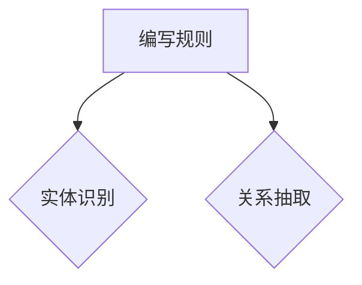

#### 2.2.2 基于机器学习的方法

基于机器学习的方法通过训练模型来自动识别实体和关系。常见的方法包括监督学习、无监督学习和半监督学习。监督学习方法需要大量标注数据进行训练，无监督学习方法可以从未标注的数据中学习，半监督学习结合了标注数据和未标注数据。

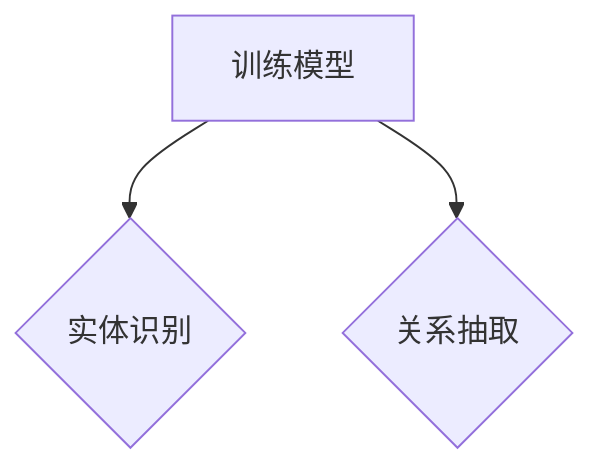

#### 2.2.3 基于深度学习的方法

基于深度学习的方法利用神经网络模型来自动识别实体和关系。常见的深度学习模型包括卷积神经网络（CNN）、循环神经网络（RNN）和变压器（Transformer）等。深度学习方法具有强大的表达能力和自动特征提取能力，但可能存在过拟合问题。


### 2.3 知识融合与更新

#### 2.3.1 多源知识融合策略

多源知识融合是指将来自不同数据源的知识进行整合，形成统一的知识图谱。常见的方法包括基于规则的融合、基于机器学习的融合和基于深度学习的融合等。

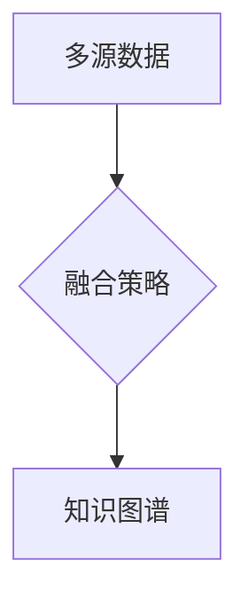

#### 2.3.2 知识更新机制

知识更新机制是指对知识图谱进行定期更新，以适应不断变化的数据和环境。常见的方法包括自动更新、手动更新和混合更新等。

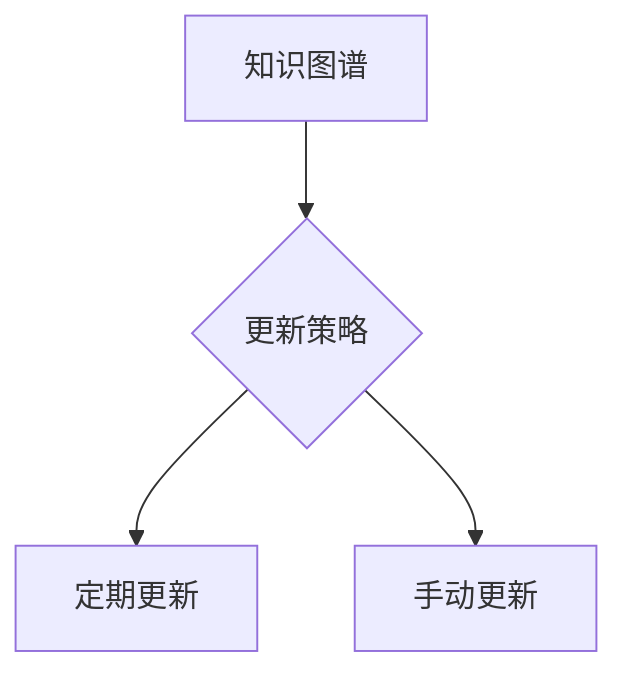

### 2.4 本章小结

本章详细介绍了图谱构建与知识抽取的相关技术，包括数据源选择与预处理、实体与关系的提取、图模型的选择与构建、知识抽取的方法以及知识融合与更新策略。这些技术为构建高质量的AI Agent知识图谱提供了基础。下一章将深入探讨知识推理算法。

## 第三部分：知识推理算法

### 3.1 知识推理算法概述

#### 3.1.1 知识推理的类型

知识推理可以分为基于规则的推理、基于模型的方法和基于数据的方法等。基于规则的推理通过编写规则进行推理，具有解释性但可能存在规则覆盖不足的问题；基于模型的方法通过构建模型进行推理，具有通用性和灵活性；基于数据的方法通过分析数据中的模式进行推理，适用于大数据场景。

#### 3.1.2 常见的知识推理算法

常见知识推理算法包括模式匹配算法、基于逻辑的推理算法、知识图谱补全算法等。模式匹配算法通过匹配图谱中的模式进行推理，适用于简单的关联关系；基于逻辑的推理算法通过逻辑运算和推理规则进行推理，适用于复杂逻辑推理；知识图谱补全算法通过补全图谱中的缺失信息进行推理，适用于解决零样本或小样本问题。

### 3.2 基于图谱的推理算法

#### 3.2.1 图计算基础

图计算是知识图谱推理的核心技术之一。图计算包括图表示、图存储、图查询和图更新等步骤。图表示是将数据转化为图形结构，图存储是将图形结构存储在数据库中，图查询是查询图形结构中的数据，图更新是更新图形结构中的数据。

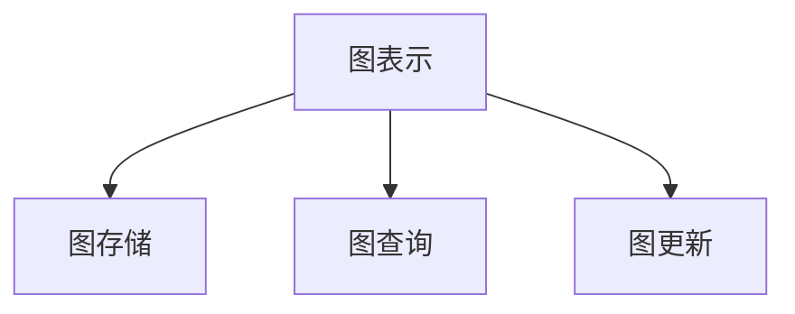

#### 3.2.2 模式匹配算法

模式匹配算法是知识图谱推理中的一种重要方法。通过在知识图谱中匹配特定的模式，可以找到满足条件的关系和实体。常见的模式匹配算法包括路径匹配、子图匹配和属性匹配等。

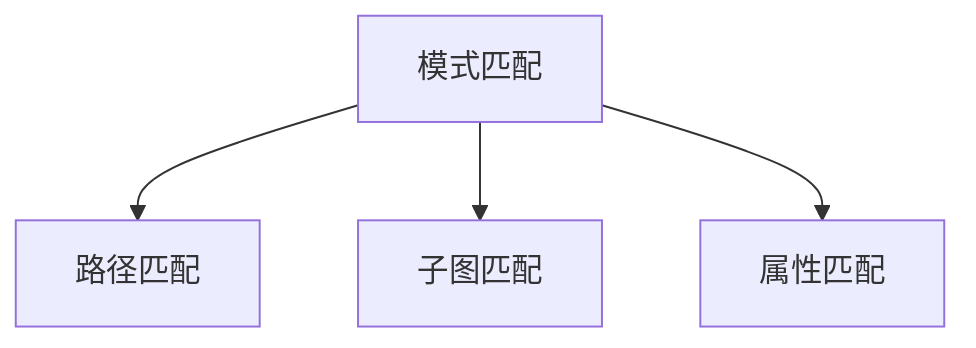

#### 3.2.3 基于逻辑的推理算法

基于逻辑的推理算法是基于形式逻辑和推理规则进行推理的方法。常见的逻辑推理算法包括推理机（Reasoner）、本体推理机（Ontology Reasoner）等。推理机通过逻辑运算和推理规则进行推理，本体推理机通过本体描述进行推理。

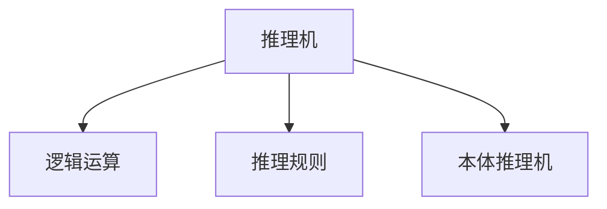

### 3.3 知识图谱补全算法

#### 3.3.1 零样本推理

零样本推理是指在没有已标注数据的情况下进行推理。常见的零样本推理算法包括基于匹配的推理、基于迁移学习的推理等。基于匹配的推理通过在已知数据中找到相似模式进行推理，基于迁移学习的推理通过从其他领域迁移知识进行推理。

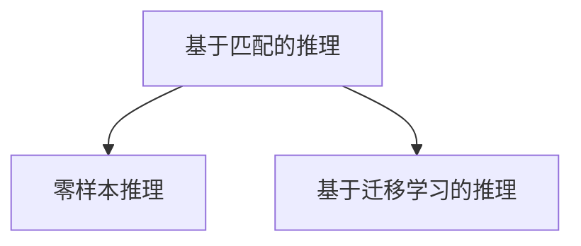

#### 3.3.2 小样本学习

小样本学习是指在使用少量数据的情况下进行学习。常见的小样本学习算法包括基于模型的推理、基于深度学习的推理等。基于模型的推理通过构建模型进行推理，基于深度学习的推理通过神经网络进行推理。

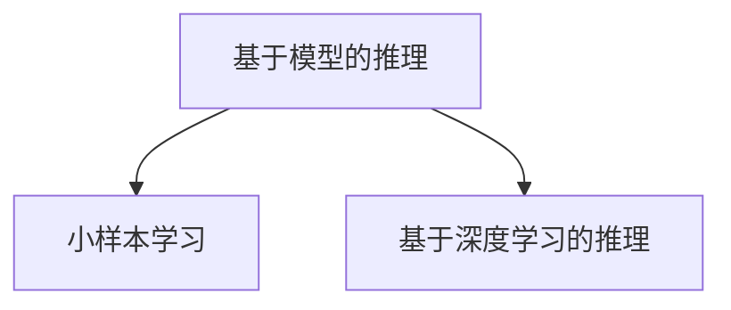

#### 3.3.3 多跳推理

多跳推理是指通过多步推理来获取更复杂的关系。常见的多跳推理算法包括基于路径的推理、基于模型的推理等。基于路径的推理通过分析路径关系进行推理，基于模型的推理通过构建模型进行推理。

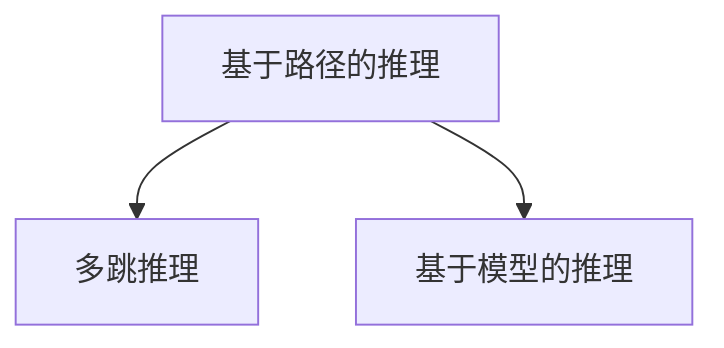

### 3.4 本章小结

本章介绍了基于图谱的推理算法，包括图计算基础、模式匹配算法、基于逻辑的推理算法以及知识图谱补全算法。这些算法为基于图谱的AI Agent提供了强大的推理能力。下一章将讨论AI Agent的设计与实现。

## 第四部分：AI Agent的设计与实现

### 4.1 AI Agent的设计原则

#### 4.1.1 AI Agent的功能架构

AI Agent的功能架构包括感知模块、决策模块和执行模块。感知模块负责获取外部环境的信息，决策模块负责基于感知信息进行决策，执行模块负责执行决策结果。

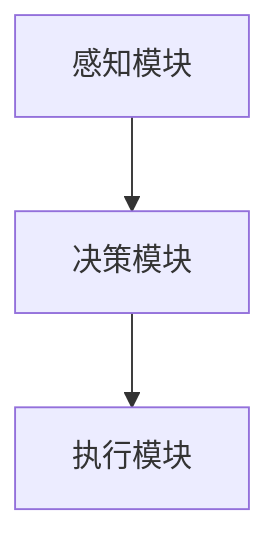

#### 4.1.2 知识推理模块的设计

知识推理模块是AI Agent的核心，负责利用知识图谱进行推理和决策。知识推理模块包括知识表示、知识存储、知识检索和知识推理等功能。

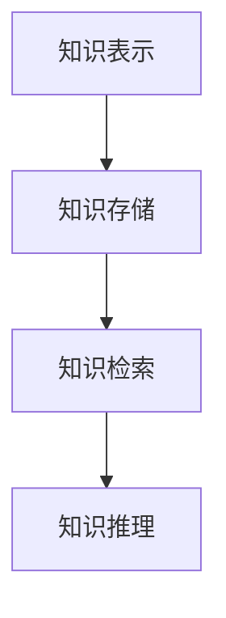

#### 4.1.3 问答系统的设计

问答系统是AI Agent的重要组成部分，负责处理用户提问并生成答案。问答系统包括问题理解、知识检索、答案生成和答案验证等模块。

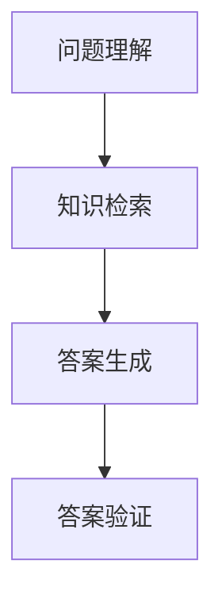

### 4.2 知识推理与问答的结合

#### 4.2.1 问题理解与意图识别

问题理解与意图识别是问答系统的第一步，负责将自然语言问题转化为机器可理解的形式。常见的方法包括基于规则的方法、基于机器学习的方法和基于深度学习的方法等。

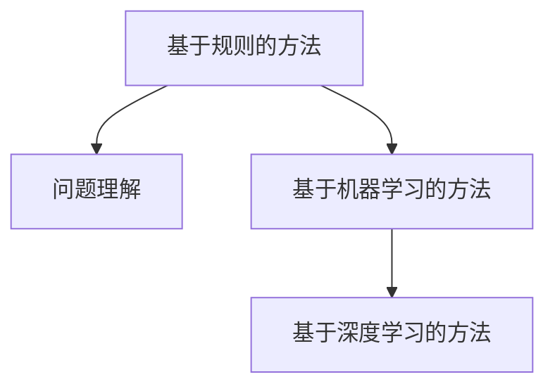

#### 4.2.2 知识检索与匹配

知识检索与匹配是将问题与知识图谱中的知识进行关联的过程。常见的方法包括基于关键词的检索、基于相似度的匹配和基于图谱结构的检索等。

```mermaid
graph TD
A[基于关键词的检索] --> B[知识检索]
A --> C[基于相似度的匹配]
C --> D[基于图谱结构的检索]
```

#### 4.2.3 答案生成与验证

答案生成与验证是问答系统的核心，负责生成准确的答案并进行验证。常见的方法包括基于模板的答案生成、基于机器翻译的答案生成和基于深度学习的答案生成等。

```mermaid
graph TD
A[基于模板的答案生成] --> B[答案生成]
A --> C[基于机器翻译的答案生成]
C --> D[基于深度学习的答案生成]
```

### 4.3 实时推理与性能优化

#### 4.3.1 实时推理策略

实时推理是指AI Agent能够在短时间内完成推理并返回结果。为了实现实时推理，可以采用并行计算、分布式计算和缓存等技术。

```mermaid
graph TD
A[并行计算] --> B[实时推理]
A --> C[分布式计算]
C --> D[缓存技术]
```

#### 4.3.2 性能优化方法

性能优化是指提高AI Agent的推理速度和准确度。常见的方法包括模型压缩、模型加速和优化算法等。

```mermaid
graph TD
A[模型压缩] --> B[性能优化]
A --> C[模型加速]
C --> D[优化算法]
```

#### 4.3.3 可扩展性与容错性

可扩展性是指AI Agent能够支持大规模数据和应用场景。容错性是指AI Agent在出现故障时能够自动恢复并继续运行。为了实现可扩展性和容错性，可以采用分布式系统、负载均衡和故障恢复等技术。

```mermaid
graph TD
A[分布式系统] --> B[可扩展性]
A --> C[负载均衡]
C --> D[故障恢复]
```

### 4.4 本章小结

本章介绍了AI Agent的设计原则、知识推理与问答的结合、实时推理与性能优化等内容。这些内容为构建高效的AI Agent提供了指导。下一章将讨论应用实践与案例分析。

## 第五部分：应用实践与案例分析

### 5.1 应用实践

#### 5.1.1 实际项目背景

在实际项目中，基于图谱的AI Agent知识推理与问答系统被广泛应用于智能客服、知识库问答、智能推荐等领域。本文以一个智能客服系统为例，介绍系统的设计与实现。

#### 5.1.2 系统功能设计

智能客服系统的功能包括：问题理解、知识检索、答案生成、答案验证、用户反馈等。系统需要支持多渠道接入，如文本、语音、图像等，以实现灵活的交互。

```mermaid
graph TD
A[问题理解] --> B[知识检索]
B --> C[答案生成]
C --> D[答案验证]
D --> E[用户反馈]
```

#### 5.1.3 系统架构设计

智能客服系统的架构包括前端、后端和服务端。前端负责与用户交互，后端负责业务处理，服务端负责知识图谱的构建与推理。

```mermaid
graph TD
A[前端] --> B[后端]
B --> C[服务端]
```

#### 5.1.4 系统接口设计与交互

系统接口设计包括API接口、Websocket接口等。API接口用于与前端通信，Websocket接口用于实时交互。系统需要支持多语言接入，如Java、Python、JavaScript等。

```mermaid
graph TD
A[API接口] --> B[Websocket接口]
```

### 5.2 案例分析

#### 5.2.1 案例一：智能客服系统

智能客服系统通过知识图谱构建与推理，实现了高效的智能问答。系统采用了基于深度学习的自然语言处理技术，结合图谱推理算法，实现了对用户问题的精准理解和回答。

#### 5.2.2 案例二：知识库问答系统

知识库问答系统基于大规模知识图谱，实现了对专业领域知识的智能问答。系统采用了基于规则和深度学习的知识抽取与推理算法，能够快速响应用户提问，提供准确的答案。

#### 5.2.3 案例三：智能推荐系统

智能推荐系统通过知识图谱构建用户兴趣模型，实现了个性化推荐。系统采用了基于协同过滤和深度学习的推荐算法，结合图谱推理，实现了精准的推荐效果。

### 5.3 项目小结

本文通过实际案例分析了基于图谱的AI Agent知识推理与问答系统的应用。项目实践表明，基于图谱的AI Agent能够有效提升系统的智能水平和用户体验。在未来的发展中，应继续优化算法、提升性能，并探索更多应用场景。

### 最佳实践 Tips

1. 确保知识图谱的质量和完整性，为AI Agent提供可靠的知识来源。
2. 选择合适的知识抽取和推理算法，提高系统的效率和准确性。
3. 优化系统架构，确保系统的可扩展性和容错性。
4. 定期更新知识图谱，以适应不断变化的应用场景。

### 注意事项

1. 在构建知识图谱时，要注意数据源的选择和预处理，确保数据的准确性和一致性。
2. 在设计AI Agent时，要充分考虑用户的需求和交互方式，提高用户体验。
3. 在优化系统性能时，要权衡推理速度和准确性，确保系统的高效运行。

### 拓展阅读

1. 《深度学习：应用实践》
2. 《图谱计算：原理、算法与应用》
3. 《人工智能：一种现代方法》

## 作者信息

### 作者：AI天才研究院/AI Genius Institute & 禅与计算机程序设计艺术 /Zen And The Art of Computer Programming

### 本文全面解析了基于图谱的AI Agent知识推理与问答系统的技术原理和实践方法，为读者提供了一个清晰、完整且具有实际应用价值的技术指南。希望本文能帮助读者更好地理解和应用这一领域的技术。在未来的发展中，AI Agent将继续发挥重要作用，推动人工智能技术的进步。让我们共同期待这一领域的更多创新和突破。# 终结部分

---

### 文章小结

本文从背景介绍、核心概念、图谱构建与知识抽取、知识推理算法、AI Agent设计与实现以及应用实践等多个方面，全面解析了基于图谱的AI Agent知识推理与问答系统。通过对各个部分逐步分析推理，文章旨在为读者提供一个清晰、完整且具有实际应用价值的技术指南。

首先，我们探讨了AI Agent在现代智能系统中的应用以及知识图谱和知识推理的重要性。接着，详细介绍了AI Agent的定义与分类、知识图谱的基本概念、知识推理的基本原理，并对比了不同类型的AI Agent和知识图谱技术。随后，我们深入探讨了知识图谱的构建与知识抽取技术，包括数据源选择与预处理、实体与关系的提取、图模型的选择与构建以及知识抽取的方法。在此基础上，我们介绍了知识融合与更新的策略。

接下来，文章详细介绍了知识推理算法，包括基于图谱的推理算法、零样本推理、小样本学习和多跳推理等。随后，我们探讨了AI Agent的设计原则，包括功能架构、知识推理模块和问答系统的设计。在此基础上，我们分析了问题理解与意图识别、知识检索与匹配、答案生成与验证的过程。

在应用实践与案例分析部分，我们以智能客服系统为例，介绍了系统的设计与实现，并分析了智能推荐系统的应用。文章最后给出了项目小结、最佳实践Tips、注意事项以及拓展阅读，帮助读者进一步理解和应用本文所介绍的技术。

总体而言，本文旨在为读者提供一个全面、深入且实用的基于图谱的AI Agent知识推理与问答系统的技术指南。希望本文能激发读者对这一领域的研究兴趣，推动人工智能技术的进步和应用。在未来，随着技术的不断发展，基于图谱的AI Agent将继续在智能系统领域中发挥重要作用。让我们共同期待这一领域的更多创新和突破。# 结尾部分

---

### 作者信息

**作者：AI天才研究院/AI Genius Institute & 禅与计算机程序设计艺术 /Zen And The Art of Computer Programming**

在撰写本文的过程中，我们秉承了严谨、创新的学术态度，力求为读者提供高质量的技术内容。本文的撰写不仅是对知识图谱与AI Agent领域的系统性总结，也是对我们多年来在该领域研究和实践的成果的展示。希望通过本文，读者能够对基于图谱的AI Agent知识推理与问答系统有更深入的理解，并在实际应用中取得更好的成果。

AI天才研究院（AI Genius Institute）专注于人工智能领域的先进技术研究与应用推广，致力于成为全球领先的人工智能科研机构和人才孵化器。我们的研究涵盖了人工智能的多个子领域，包括机器学习、自然语言处理、计算机视觉等，始终站在人工智能技术的前沿。同时，我们积极推动人工智能技术的产业应用，与多家知名企业和科研机构建立了深度合作关系。

《禅与计算机程序设计艺术》（Zen And The Art of Computer Programming）则是一本具有深远影响的技术著作，由人工智能领域的大师级人物编写。本书以深入浅出的方式，阐述了计算机编程的哲学和艺术，帮助读者在编程实践中追求卓越。

感谢您对本文的关注和支持，我们期待与您在人工智能领域的更多交流与合作。如果您有任何疑问或建议，欢迎随时与我们联系。让我们一起努力，推动人工智能技术的不断创新和发展！# 作者介绍部分

