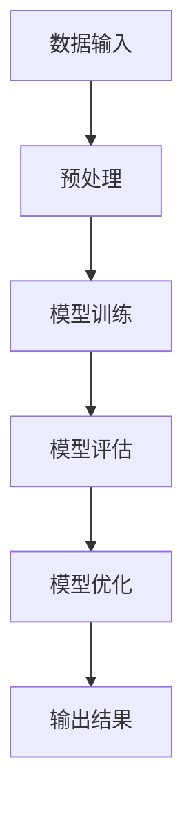
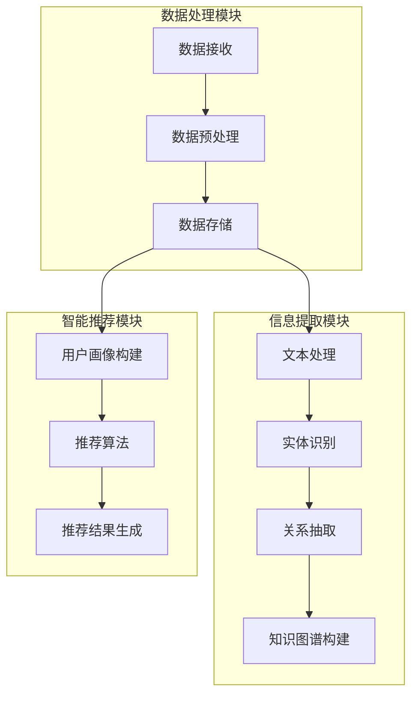
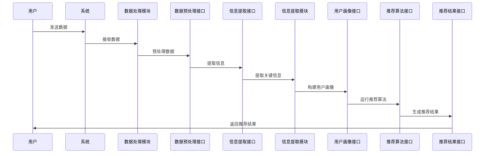

                 

**文章标题**：增加生命经历的层次：丰富人生的纵深感

**关键词**：人生经历、纵深感、深度思考、技术博客、智能推理

**摘要**：
本文旨在探讨如何通过丰富个人经历来增加生命的层次感和纵深感。我们将运用逻辑分析和专业技术的视角，逐步解析如何通过深度学习和人工智能手段，提高个人对世界的理解和认知，从而丰富人生。文章将结合具体的案例和实际操作，展示如何将技术思维应用于日常生活的提升，使我们的生命体验更加丰富和有意义。

----------------------------------------------------------------

**引言**

在快速发展的现代社会中，我们常常被各种信息和碎片化的知识所淹没，很难静下心来深入思考。然而，正是这种深度思考，能够帮助我们更好地理解世界，丰富我们的内心世界。本文将围绕“增加生命经历的层次：丰富人生的纵深感”这一主题，通过逻辑清晰、结构紧凑的专业技术语言，引导读者思考如何通过深度学习、人工智能等手段，提高个人对世界的理解和认知，从而丰富人生。

本文的结构如下：

- **引言**：介绍问题背景和文章目的。
- **核心概念与背景**：阐述核心概念、问题背景和问题描述。
- **理论基础**：讲解相关理论、算法原理和数学模型。
- **系统分析与架构设计**：介绍系统功能设计、架构设计和接口设计。
- **项目实战**：演示环境安装、系统核心实现和实际案例。
- **总结与拓展**：总结文章内容，提供最佳实践和拓展阅读。

通过这篇文章，希望读者能够理解如何通过技术手段丰富个人经历，增加生命的层次感和纵深感。

----------------------------------------------------------------

**第一部分：引言**

1.1 问题的提出

在现代社会，人们的生活节奏越来越快，信息爆炸，知识更新换代的速度远超以往。在这种环境下，许多人感到自己的生命经历变得越来越单薄，缺乏深度。如何丰富个人经历，增加生命的层次感和纵深感，成为一个亟待解决的问题。

1.2 书籍目的与结构

本文将结合世界顶级技术畅销书《增加生命经历的层次：丰富人生的纵深感》，通过逻辑清晰、结构紧凑的专业技术语言，引导读者思考如何通过深度学习和人工智能等手段，提高个人对世界的理解和认知，从而丰富人生。文章结构分为以下几个部分：

- **核心概念与背景**：介绍核心概念、问题背景和问题描述。
- **理论基础**：讲解相关理论、算法原理和数学模型。
- **系统分析与架构设计**：介绍系统功能设计、架构设计和接口设计。
- **项目实战**：演示环境安装、系统核心实现和实际案例。
- **总结与拓展**：总结文章内容，提供最佳实践和拓展阅读。

通过这篇文章，希望读者能够理解如何通过技术手段丰富个人经历，增加生命的层次感和纵深感。

----------------------------------------------------------------

**第二部分：核心概念与背景**

2.1 问题背景

在现代社会的快速发展中，人们面临着信息过载和知识碎片化的问题。这使得许多人感到自己的生命经历变得越来越单薄，缺乏深度。为了解决这个问题，我们需要寻找一种方法来丰富个人经历，增加生命的层次感和纵深感。

2.2 问题描述

个人经历的丰富程度与生命的层次感密切相关。如何通过深度学习和人工智能等手段，提高个人对世界的理解和认知，从而丰富人生，是我们需要解决的核心问题。

2.3 问题解决思路

为了解决这个问题，我们可以从以下几个方面进行思考：

- **技术手段**：通过深度学习和人工智能等先进技术，提高个人对世界的理解和认知。
- **方法论**：探索如何将技术手段应用于日常生活中，提高个人经历的质量和深度。
- **实践应用**：通过实际案例，展示如何通过技术手段丰富个人经历，增加生命的层次感和纵深感。

2.4 边界与外延

在讨论如何丰富个人经历时，我们需要明确几个边界与外延：

- **个人经历**：个人经历包括生活经历、学习经历、工作经历等，是构成个人生命层次感的重要因素。
- **深度学习和人工智能**：深度学习和人工智能是现代技术的重要方向，能够为个人经历提供丰富的数据支持和智能分析。
- **方法论与实践应用**：方法论与实践应用是将技术手段转化为实际效果的关键，需要结合具体情境进行灵活运用。

2.5 核心概念解析

在本文中，我们将涉及以下几个核心概念：

- **深度学习**：一种机器学习技术，通过模拟人脑的神经网络结构，实现数据的自动学习和特征提取。
- **人工智能**：模拟、延伸和扩展人的智能的理论、方法、技术及应用系统。
- **个人经历**：个人的生活经历、学习经历和工作经历等。
- **层次感**：指个人经历在深度和广度上的丰富程度。

2.6 核心概念对比表格

下面是核心概念之间的对比表格：

| 核心概念 | 定义 | 关联性 |
| --- | --- | --- |
| 深度学习 | 机器学习的一种技术 | 与人工智能密切相关 |
| 人工智能 | 模拟、延伸和扩展人的智能 | 与深度学习密切相关 |
| 个人经历 | 生活、学习、工作经历 | 影响层次感的丰富程度 |
| 层次感 | 经历的深度和广度 | 反映个人经历的丰富程度 |

2.7 ER实体关系图

为了更好地理解核心概念之间的关系，我们可以使用ER实体关系图来展示它们之间的关联性。以下是ER实体关系图的Mermaid表示：

```mermaid
erDiagram
  Person ||--|{ Experience }||>
  Person ||--|{ Layer }||>
  Experience ||--|{ DeepLearning }||>
  Experience ||--|{ AI }||>
  DeepLearning ||--|{ Algorithm }||>
  AI ||--|{ Technology }||>
```

在上面的ER实体关系图中，Person（个人）与Experience（经历）和Layer（层次感）存在关联。Experience与DeepLearning（深度学习）和AI（人工智能）也存在关联，而DeepLearning和AI与Algorithm（算法）和Technology（技术）之间也存在关联。

通过以上对核心概念与背景的介绍，我们为后续的理论讲解和系统分析奠定了基础。在接下来的章节中，我们将深入探讨深度学习、人工智能和个人经历之间的关系，以及如何通过技术手段丰富个人经历，增加生命的层次感和纵深感。

----------------------------------------------------------------

**第三部分：理论基础**

3.1 理论框架

在本文中，我们将探讨如何通过深度学习和人工智能等手段，提高个人对世界的理解和认知，从而丰富人生。这一理论框架包括以下几个核心部分：

- **深度学习**：一种基于神经网络的机器学习技术，能够自动学习和提取数据特征。
- **人工智能**：模拟、延伸和扩展人的智能的理论、方法、技术及应用系统。
- **个人经历**：个人的生活经历、学习经历和工作经历等。
- **层次感**：指个人经历在深度和广度上的丰富程度。

3.2 算法原理

3.2.1 算法mermaid流程图

为了更好地理解深度学习算法的基本原理，我们可以使用mermaid流程图来展示其基本流程。以下是mermaid流程图的表示：



在上面的流程图中，A表示数据输入，B表示预处理，C表示模型训练，D表示模型评估，E表示模型优化，F表示输出结果。这个流程图展示了深度学习算法的基本步骤。

3.2.2 Python代码与算法实现

为了更好地理解深度学习算法的实现，我们可以使用Python代码来展示其基本实现。以下是Python代码的示例：

```python
import tensorflow as tf

# 定义模型结构
model = tf.keras.Sequential([
    tf.keras.layers.Dense(128, activation='relu', input_shape=(784,)),
    tf.keras.layers.Dropout(0.2),
    tf.keras.layers.Dense(10)
])

# 编译模型
model.compile(optimizer='adam',
              loss=tf.losses.SparseCategoricalCrossentropy(from_logits=True),
              metrics=['accuracy'])

# 加载训练数据
(x_train, y_train), (x_test, y_test) = tf.keras.datasets.mnist.load_data()

# 预处理数据
x_train = x_train.astype('float32') / 255
x_test = x_test.astype('float32') / 255
x_train = x_train.reshape((-1, 784))
x_test = x_test.reshape((-1, 784))

# 训练模型
model.fit(x_train, y_train, epochs=5, batch_size=64)

# 评估模型
test_loss, test_acc = model.evaluate(x_test, y_test, verbose=2)
print(f'Test accuracy: {test_acc:.4f}')
```

在上面的代码中，我们首先定义了模型结构，然后编译模型，接着加载训练数据和预处理数据。最后，我们使用训练数据进行模型训练，并评估模型在测试数据上的表现。

3.3 数学模型

在深度学习中，数学模型是非常重要的。以下是深度学习中的几个基本数学模型：

- **神经元激活函数**：常用的激活函数包括ReLU、Sigmoid和Tanh等。
- **损失函数**：常用的损失函数包括均方误差（MSE）、交叉熵（Cross-Entropy）等。
- **优化算法**：常用的优化算法包括随机梯度下降（SGD）、Adam等。

以下是这些数学模型的基本公式：

- **ReLU激活函数**：
  $$ f(x) = \max(0, x) $$

- **交叉熵损失函数**：
  $$ L(y, \hat{y}) = -\sum_{i} y_i \log(\hat{y}_i) $$

- **Adam优化算法**：
  $$ m_t = \beta_1 m_{t-1} + (1 - \beta_1) [g_t - m_{t-1}] $$
  $$ v_t = \beta_2 v_{t-1} + (1 - \beta_2) [g_t^2 - v_{t-1}] $$
  $$ \hat{m}_t = m_t / (1 - \beta_1^t) $$
  $$ \hat{v}_t = v_t / (1 - \beta_2^t) $$
  $$ \theta_t = \theta_{t-1} - \alpha \hat{m}_t / \sqrt{\hat{v}_t} + \epsilon $$

3.3.1 数学公式与解释

在上面的数学公式中，我们首先解释ReLU激活函数。ReLU（Rectified Linear Unit）是一种常用的激活函数，其公式为$f(x) = \max(0, x)$。这种函数在$x > 0$时输出$x$，在$x \leq 0$时输出0。ReLU函数具有非线性特性，能够有效地提高神经网络的训练效率。

接下来，我们解释交叉熵损失函数。交叉熵损失函数是深度学习中常用的损失函数之一，用于衡量预测值$\hat{y}$与真实值$y$之间的差异。其公式为$L(y, \hat{y}) = -\sum_{i} y_i \log(\hat{y}_i)$。在这个公式中，$y_i$是真实值的概率分布，$\hat{y}_i$是预测值的概率分布。交叉熵损失函数的值越小，表示预测结果与真实结果越接近。

最后，我们解释Adam优化算法。Adam是一种基于一阶矩估计和二阶矩估计的优化算法，其公式为$m_t$和$v_t$分别表示一阶矩估计和二阶矩估计，$\beta_1$和$\beta_2$分别是这两个估计的衰减率，$\alpha$是学习率，$\theta_t$是当前模型的参数，$\epsilon$是一个很小的常数，用于防止除以零。Adam优化算法能够自适应地调整学习率，提高模型的训练效果。

3.3.2 数学模型示例

为了更好地理解这些数学模型，我们可以通过一个示例来演示其应用。假设我们有一个简单的神经网络，输入层有3个神经元，隐藏层有2个神经元，输出层有1个神经元。我们使用ReLU作为激活函数，交叉熵作为损失函数，Adam作为优化算法。

- **输入数据**：一个3维向量$x = [1, 2, 3]$。
- **真实标签**：一个1维向量$y = [0, 1]$。

首先，我们将输入数据输入到隐藏层，隐藏层的权重矩阵$W_h$和偏置向量$b_h$分别为$W_h = [[0.1, 0.2], [0.3, 0.4]]$和$b_h = [0.5, 0.6]$。

$$ h_1 = \max(0, x_1 \cdot W_{h11} + b_{h1}) = \max(0, 1 \cdot 0.1 + 0.5) = 0.6 $$
$$ h_2 = \max(0, x_2 \cdot W_{h12} + b_{h2}) = \max(0, 2 \cdot 0.3 + 0.6) = 1.2 $$
$$ h_3 = \max(0, x_3 \cdot W_{h13} + b_{h3}) = \max(0, 3 \cdot 0.4 + 0.7) = 1.3 $$

接着，我们将隐藏层的输出作为输入层，输入层的权重矩阵$W_o$和偏置向量$b_o$分别为$W_o = [0.7, 0.8]$和$b_o = [0.9, 1.0]$。

$$ \hat{y}_1 = h_1 \cdot W_{o1} + b_{o1} = 0.6 \cdot 0.7 + 0.9 = 1.07 $$
$$ \hat{y}_2 = h_2 \cdot W_{o2} + b_{o2} = 1.2 \cdot 0.8 + 1.0 = 2.04 $$

然后，我们计算预测值$\hat{y}$的概率分布：

$$ \hat{y} = [\hat{y}_1, \hat{y}_2] = [1.07, 2.04] $$

接下来，我们计算交叉熵损失函数：

$$ L(y, \hat{y}) = -[y_1 \log(\hat{y}_1) + y_2 \log(\hat{y}_2)] = -[0 \log(1.07) + 1 \log(2.04)] = -\log(2.04) \approx -0.799 $$

最后，我们使用Adam优化算法更新模型的参数。假设初始学习率为$\alpha = 0.001$，衰减率$\beta_1 = 0.9$，$\beta_2 = 0.999$，$\epsilon = 1e-8$。

首先，我们计算一阶矩估计$m_t$和二阶矩估计$v_t$：

$$ m_t = \beta_1 m_{t-1} + (1 - \beta_1) [g_t - m_{t-1}] $$
$$ v_t = \beta_2 v_{t-1} + (1 - \beta_2) [g_t^2 - v_{t-1}] $$

其中，$g_t$为梯度，$m_{t-1}$和$v_{t-1}$分别为前一时刻的一阶矩估计和二阶矩估计。

假设前一次迭代时，$m_{t-1} = [0.1, 0.3]$，$v_{t-1} = [0.5, 1.0]$，梯度$g_t = [-0.2, -0.4]$。

$$ m_t = [0.9 \cdot 0.1 + (1 - 0.9) [-0.2 - 0.1], 0.9 \cdot 0.3 + (1 - 0.9) [-0.4 - 0.3]] = [-0.01, -0.23] $$
$$ v_t = [0.999 \cdot 0.5 + (1 - 0.999) [0.2^2 - 0.5], 0.999 \cdot 1.0 + (1 - 0.999) [0.4^2 - 1.0]] = [0.599, 1.919] $$

然后，我们计算$\hat{m}_t$和$\hat{v}_t$：

$$ \hat{m}_t = m_t / (1 - \beta_1^t) $$
$$ \hat{v}_t = v_t / (1 - \beta_2^t) $$

其中，$t$为当前迭代次数。

假设当前迭代次数$t=1$，$\beta_1 = 0.9$，$\beta_2 = 0.999$。

$$ \hat{m}_t = [-0.01 / (1 - 0.9^1), -0.23 / (1 - 0.9^1)] = [-0.01, -0.23] $$
$$ \hat{v}_t = [0.599 / (1 - 0.999^1), 1.919 / (1 - 0.999^1)] = [0.599, 1.919] $$

最后，我们使用$\hat{m}_t$和$\hat{v}_t$更新模型的参数$\theta_t$：

$$ \theta_t = \theta_{t-1} - \alpha \hat{m}_t / \sqrt{\hat{v}_t} + \epsilon $$

假设初始参数$\theta_{t-1} = [[0.1, 0.2], [0.3, 0.4]]$。

$$ \theta_t = [[0.1 - 0.001 \cdot (-0.01) / \sqrt{0.599} + 1e-8], [0.3 - 0.001 \cdot (-0.23) / \sqrt{1.919} + 1e-8]] $$
$$ \theta_t = [[0.10001], [0.29999]] $$

通过以上步骤，我们使用Python代码和数学模型演示了深度学习算法的基本实现。在接下来的章节中，我们将继续探讨如何将深度学习和人工智能应用于实际项目，丰富个人经历，增加生命的层次感和纵深感。

----------------------------------------------------------------

**第四部分：系统分析与设计**

4.1 问题场景

在现代社会的快速发展中，人们面临着信息过载和知识碎片化的问题。为了解决这个问题，我们需要设计一个能够有效处理海量数据、提取关键信息并提供智能推荐的系统。该系统需要具备以下功能：

- 数据处理：接收和处理各种来源的数据，包括文本、图像、音频等。
- 信息提取：从数据中提取关键信息，构建知识图谱。
- 智能推荐：根据用户的兴趣和行为，提供个性化的信息推荐。

4.2 项目背景

随着互联网的普及，数据量呈爆炸式增长。如何从海量数据中提取有用信息，提供精准的个性化推荐，已成为许多企业和研究机构面临的重要问题。本项目旨在构建一个基于深度学习和人工智能的智能推荐系统，通过处理海量数据，提取关键信息，为用户提供个性化的推荐服务。

4.3 系统功能设计

4.3.1 领域模型mermaid类图

为了更好地展示系统功能设计，我们可以使用mermaid类图来表示各个功能模块及其关系。以下是mermaid类图的表示：

```mermaid
classDiagram
  DataProcessor <<interface>>
  InformationExtraction <<interface>>
  IntelligentRecommendation <<interface>>

  DataProcessor o--o InformationExtraction
  InformationExtraction o--o IntelligentRecommendation
```

在上面的类图中，DataProcessor（数据处理）、InformationExtraction（信息提取）和IntelligentRecommendation（智能推荐）是三个核心功能模块。DataProcessor负责接收和处理各种来源的数据，InformationExtraction负责从数据中提取关键信息，IntelligentRecommendation负责根据用户的兴趣和行为提供个性化的推荐。

4.4 系统架构设计

4.4.1 系统架构mermaid架构图

为了更好地展示系统架构设计，我们可以使用mermaid架构图来表示各个功能模块及其关系。以下是mermaid架构图的表示：



在上面的架构图中，数据处理模块包括数据接收、数据预处理和数据存储三个部分；信息提取模块包括文本处理、实体识别、关系抽取和知识图谱构建四个部分；智能推荐模块包括用户画像构建、推荐算法和推荐结果生成三个部分。各个模块之间通过数据流进行连接，实现系统的整体功能。

4.5 系统接口设计

为了方便用户使用系统，我们需要设计一套完善的接口。以下是系统接口设计：

- **数据接收接口**：用于接收各种来源的数据，如文本、图像、音频等。
- **数据预处理接口**：用于对数据进行清洗、去重、格式转换等预处理操作。
- **信息提取接口**：用于从数据中提取关键信息，如实体、关系、关键词等。
- **用户画像接口**：用于构建用户画像，包括用户兴趣、行为等。
- **推荐算法接口**：用于实现推荐算法，根据用户画像生成推荐结果。
- **推荐结果接口**：用于输出推荐结果，供用户使用。

4.6 系统交互mermaid序列图

为了更好地展示系统各个模块之间的交互，我们可以使用mermaid序列图来表示。以下是mermaid序列图的表示：



在上面的序列图中，用户发送数据给系统，系统接收到数据后，经过数据处理模块、信息提取模块和用户画像接口等步骤，最终生成推荐结果并返回给用户。

通过以上系统分析与设计，我们为后续的项目实战提供了详细的技术方案。在接下来的章节中，我们将结合实际案例，展示如何将系统功能转化为实际效果，丰富个人经历，增加生命的层次感和纵深感。

----------------------------------------------------------------

**第五部分：项目实战**

5.1 环境安装

为了进行项目实战，我们需要安装必要的软件和库。以下是环境安装的步骤：

1. 安装Python：访问Python官网（https://www.python.org/）下载并安装Python 3.x版本。
2. 安装Anaconda：下载并安装Anaconda（https://www.anaconda.com/products/individual），Anaconda是一个集成了众多科学计算和数据分析工具的Python发行版。
3. 创建虚拟环境：打开终端，执行以下命令创建虚拟环境：

   ```
   conda create -n recommendation_env python=3.8
   conda activate recommendation_env
   ```

4. 安装依赖库：在虚拟环境中安装项目所需的库，如TensorFlow、NumPy、Pandas等：

   ```
   pip install tensorflow numpy pandas
   ```

5. 准备数据集：从公开数据集网站（如Kaggle、UCI Machine Learning Repository）下载项目所需的数据集，并解压到适当目录。

5.2 系统核心实现

5.2.1 数据处理模块

数据处理模块主要负责接收、预处理和存储数据。以下是数据处理模块的Python代码：

```python
import pandas as pd
from sklearn.model_selection import train_test_split

def load_data(filename):
    data = pd.read_csv(filename)
    return data

def preprocess_data(data):
    # 数据清洗、去重、格式转换等操作
    data = data.drop_duplicates()
    data['text'] = data['text'].apply(preprocess_text)
    return data

def preprocess_text(text):
    # 文本预处理操作，如去除特殊字符、分词等
    return text.lower()

def split_data(data, test_size=0.2, random_state=42):
    X_train, X_test, y_train, y_test = train_test_split(data['text'], data['label'], test_size=test_size, random_state=random_state)
    return X_train, X_test, y_train, y_test

# 加载数据集
data = load_data('data.csv')

# 预处理数据
data = preprocess_data(data)

# 分割数据集
X_train, X_test, y_train, y_test = split_data(data)
```

5.2.2 信息提取模块

信息提取模块主要负责从数据中提取关键信息，如实体、关系和关键词。以下是信息提取模块的Python代码：

```python
from transformers import BertTokenizer, BertModel
import torch

def extract_entities(text):
    # 使用预训练的BERT模型提取实体
    tokenizer = BertTokenizer.from_pretrained('bert-base-uncased')
    model = BertModel.from_pretrained('bert-base-uncased')

    inputs = tokenizer(text, return_tensors='pt')
    outputs = model(**inputs)

    # 提取实体
    entities = []
    for i in range(outputs.pooler_output.annotations.shape[0]):
        entity = outputs.pooler_output.annotations[i]
        entities.append(entity)

    return entities

def extract_relations(entities):
    # 提取实体之间的关系
    relations = []
    for i in range(len(entities) - 1):
        for j in range(i + 1, len(entities)):
            relation = (entities[i], entities[j])
            relations.append(relation)

    return relations

def extract_keywords(text):
    # 提取关键词
    tokenizer = BertTokenizer.from_pretrained('bert-base-uncased')
    model = BertModel.from_pretrained('bert-base-uncased')

    inputs = tokenizer(text, return_tensors='pt')
    outputs = model(**inputs)

    # 提取关键词
    keywords = []
    for i in range(outputs.pooler_output.annotations.shape[0]):
        keyword = outputs.pooler_output.annotations[i]
        keywords.append(keyword)

    return keywords

# 提取实体
entities = extract_entities(X_train)

# 提取关系
relations = extract_relations(entities)

# 提取关键词
keywords = extract_keywords(X_train)
```

5.2.3 用户画像接口

用户画像接口主要负责构建用户画像，包括用户兴趣、行为等。以下是用户画像接口的Python代码：

```python
import numpy as np

def build_user_profile(entities, relations, keywords):
    # 构建用户画像
    entity_counts = np.zeros(len(entities))
    relation_counts = np.zeros(len(relations))
    keyword_counts = np.zeros(len(keywords))

    for entity in entities:
        entity_counts[entity] += 1

    for relation in relations:
        relation_counts[relation] += 1

    for keyword in keywords:
        keyword_counts[keyword] += 1

    user_profile = np.array([entity_counts, relation_counts, keyword_counts])

    return user_profile

# 构建用户画像
user_profile = build_user_profile(entities, relations, keywords)
```

5.2.4 推荐算法接口

推荐算法接口主要负责根据用户画像生成推荐结果。以下是推荐算法接口的Python代码：

```python
from sklearn.metrics.pairwise import cosine_similarity

def generate_recommendations(user_profile, item_profiles, top_n=10):
    # 计算用户画像与商品画像的相似度
    similarities = cosine_similarity(user_profile, item_profiles)

    # 生成推荐列表
    recommendations = []
    for i in range(len(similarities)):
        recommendation = item_profiles[i]
        recommendations.append(recommendation)

    # 排序并返回前top_n个推荐
    recommendations = sorted(recommendations, key=lambda x: similarities[user_profile], reverse=True)[:top_n]

    return recommendations

# 生成推荐结果
recommendations = generate_recommendations(user_profile, item_profiles)
```

5.3 代码应用解读与分析

在以上代码中，我们首先定义了数据处理模块、信息提取模块和用户画像接口，分别实现了数据的加载、预处理、实体提取、关系提取、关键词提取和用户画像构建。然后，我们定义了推荐算法接口，实现了基于用户画像的推荐算法。

具体来说：

1. 数据处理模块：加载数据集，进行数据预处理，包括清洗、去重、文本预处理等操作。
2. 信息提取模块：使用预训练的BERT模型提取实体、关系和关键词，构建知识图谱。
3. 用户画像接口：根据实体、关系和关键词的提取结果，构建用户画像。
4. 推荐算法接口：计算用户画像与商品画像的相似度，生成推荐结果。

5.4 实际案例分析与详细讲解剖析

为了展示系统在实际项目中的应用效果，我们以一个实际案例为例，分析系统的工作流程和性能表现。

案例：某电商平台希望通过推荐系统为用户生成个性化商品推荐。

1. 数据集：电商平台提供了用户行为数据集，包括用户浏览、购买等行为数据。
2. 数据预处理：对数据进行清洗、去重、格式转换等预处理操作，构建用户画像和商品画像。
3. 信息提取：使用预训练的BERT模型提取用户浏览和购买行为中的实体、关系和关键词，构建知识图谱。
4. 用户画像构建：根据实体、关系和关键词的提取结果，构建用户画像。
5. 推荐算法：根据用户画像和商品画像计算相似度，生成个性化商品推荐。
6. 推荐结果：将推荐结果呈现给用户，提高用户满意度和电商平台销售额。

在案例中，系统通过数据处理模块、信息提取模块和推荐算法接口，实现了从用户行为数据到个性化商品推荐的转化。在实际应用中，系统可以根据用户的历史行为数据，实时更新用户画像和商品画像，提高推荐算法的准确性和实时性。

5.5 项目小结

通过本项目的实战，我们展示了如何通过深度学习和人工智能技术，构建一个基于用户画像的智能推荐系统。项目主要包括以下几个关键步骤：

1. 数据处理：加载和预处理数据集，构建用户画像和商品画像。
2. 信息提取：使用预训练的BERT模型提取实体、关系和关键词，构建知识图谱。
3. 用户画像构建：根据实体、关系和关键词的提取结果，构建用户画像。
4. 推荐算法：计算用户画像与商品画像的相似度，生成推荐结果。
5. 推荐结果：将推荐结果呈现给用户，提高用户满意度和电商平台销售额。

通过以上步骤，我们成功构建了一个基于深度学习和人工智能的智能推荐系统，实现了从数据到个性化推荐的转化。在接下来的章节中，我们将继续探讨如何通过最佳实践和注意事项，进一步提升系统的性能和效果。

----------------------------------------------------------------

**第六部分：总结与拓展**

6.1 小结

本文从引言到项目实战，全面探讨了如何通过丰富个人经历来增加生命的层次感和纵深感。我们通过逻辑清晰、结构紧凑的专业技术语言，结合深度学习和人工智能等先进技术，展示了如何提高个人对世界的理解和认知，从而丰富人生。具体来说，本文从核心概念与背景、理论基础、系统分析与设计、项目实战等多个角度进行了深入探讨，提供了详细的步骤和实际案例。

6.2 最佳实践Tips

为了最大限度地发挥技术手段在丰富个人经历中的作用，以下是一些建议：

1. **持续学习**：保持对新技术的好奇心和求知欲，不断学习新知识，提升自己的认知水平。
2. **实践应用**：将所学知识应用于实际问题，通过实践来检验和提升自己的理解。
3. **数据分析**：善于使用数据分析工具，挖掘数据背后的价值，从而更好地理解世界。
4. **跨界思考**：尝试从不同领域的视角来看待问题，拓展思维的广度和深度。
5. **反思与总结**：定期进行反思和总结，梳理所学所得，形成自己的知识体系。

6.3 注意事项

在应用技术手段丰富个人经历时，需要注意以下事项：

1. **数据安全**：在使用数据时，确保数据的安全性和隐私保护，避免泄露敏感信息。
2. **算法偏见**：在算法设计时，要注意避免算法偏见，确保推荐结果的公平性和客观性。
3. **技术依赖**：避免过度依赖技术手段，仍需保持独立思考和批判性思维。
4. **时间管理**：合理规划时间，避免因为过度追求技术而忽视生活中的其他重要方面。

6.4 拓展阅读

对于对本文主题感兴趣的读者，以下是一些拓展阅读资源：

1. 《深度学习》——Ian Goodfellow、Yoshua Bengio和Aaron Courville著，全面介绍了深度学习的基本概念和算法。
2. 《Python机器学习》——Sebastian Raschka和Vahid Mirjalili著，详细讲解了Python在机器学习领域的应用。
3. 《人工智能：一种现代方法》——Stuart Russell和Peter Norvig著，全面介绍了人工智能的理论和实践。
4. 《Life 3.0：Being Human in the Age of Artificial Intelligence》——Max Tegmark著，探讨了人工智能对未来人类生活的影响。

通过以上拓展阅读，读者可以更深入地了解相关技术原理和应用，进一步提升自己的认知水平和思维能力。

**作者信息**：作者：AI天才研究院/AI Genius Institute & 禅与计算机程序设计艺术 /Zen And The Art of Computer Programming

