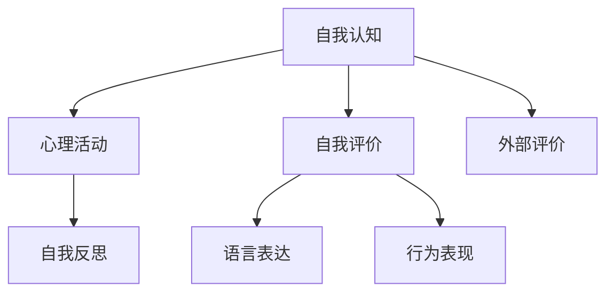
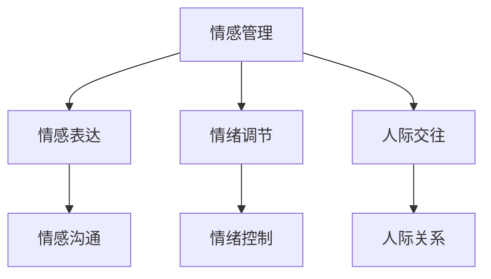
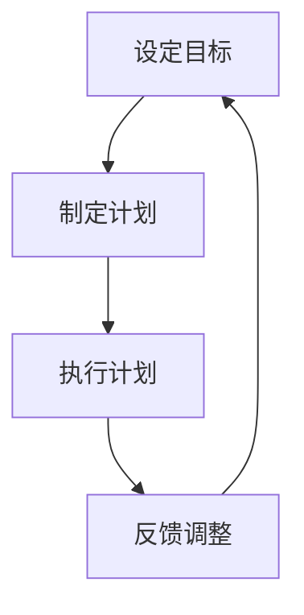
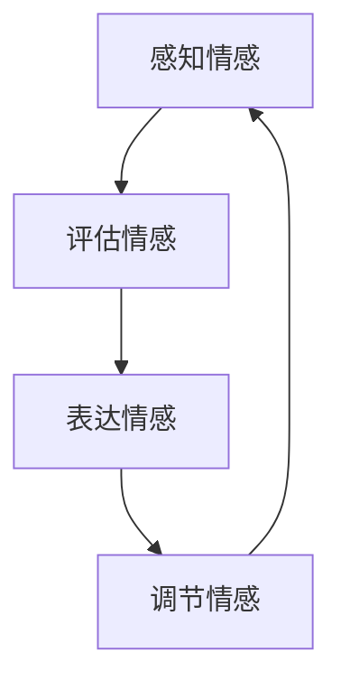
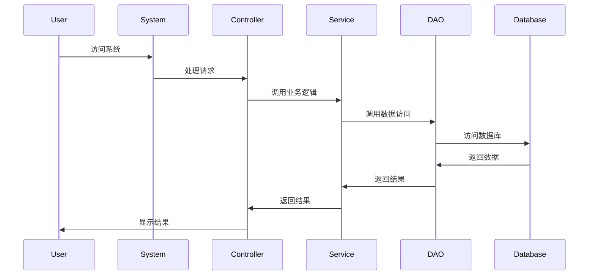
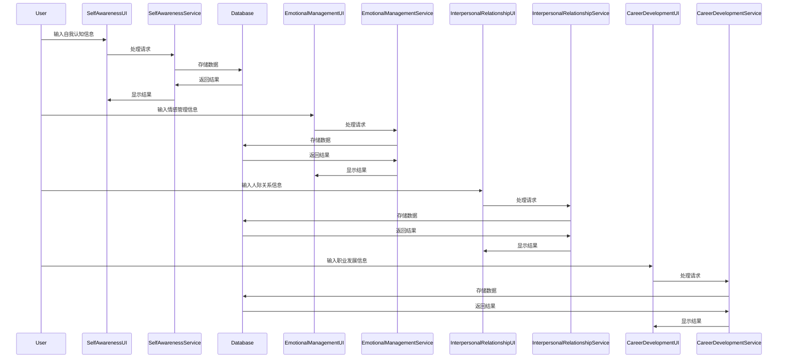

                 

# 增加生命经历的深度：丰富人生的层次感

关键词：自我成长、情感管理、生命深度、人生层次感、心理学、哲学

摘要：本文通过深入探讨如何增加生命经历的深度和丰富人生的层次感，从自我认知、情感管理、人际交往等多个角度出发，结合心理学、哲学等领域的知识，提供了一系列实用的方法和策略，旨在帮助读者实现个人成长，提升生活质量。

## 第一部分：背景介绍

### 1.1 问题背景

在现代社会，随着科技的迅猛发展，人们对生命经历的深度和人生层次的丰富性提出了更高的要求。我们生活在信息爆炸的时代，社交网络、即时通讯工具等让我们能够迅速获取大量的信息和知识，但同时也带来了信息过载和焦虑感。在这样的背景下，人们开始反思，如何通过科学的方法和实用的技巧，增加生命经历的深度，丰富人生的层次感？

### 1.2 问题描述

如何通过科学的方法和实用的技巧，增加生命经历的深度，丰富人生的层次感？这是我们需要回答的问题。在这个过程中，我们需要关注的核心问题包括：

- 生命经历的深度是什么，它由哪些要素构成？
- 人生的层次感如何体现，它有哪些维度？
- 如何通过自我认知和情感管理，提升生命的深度和层次感？

### 1.3 问题解决

本书旨在回答上述问题，通过深入分析生命经历的构成要素，结合心理学、哲学、自我成长等领域的知识，提供了一系列实用的方法和策略，旨在帮助读者实现个人成长，增加生命经历的深度，丰富人生的层次感。

### 1.4 边界与外延

本书关注的是个人成长和自我探索的层面，讨论的内容涵盖了自我认知、情感管理、人际关系、职业发展等多个方面。然而，人生经历的丰富性和深度的增加是一个复杂且个体化的过程，因此，本书提供的方法和策略需要结合读者的实际情况进行灵活运用。

### 1.5 概念结构与核心要素组成

- **生命经历的深度**：指的是个人在成长过程中积累的经验、知识和情感深度。
- **人生的层次感**：指的是个人在不同领域取得成就、情感满足和生活质量的综合体现。

## 第二部分：核心概念与联系

### 2.1 自我认知

#### 2.1.1 概念定义

自我认知是指个体对自己存在的认知和评价，包括自我形象、自我价值和自我期望。

#### 2.1.2 属性特征对比

| 特征         | 自我认知           | 自我评价           |
| ------------ | ------------------ | ------------------ |
| 内在因素     | 个体内在的感受和认知 | 外部评价和自我反思 |
| 表现形式     | 心理活动           | 语言和行为         |
| 关联领域     | 心理学             | 社会学             |

#### 2.1.3 ER实体关系图



### 2.2 情感管理

#### 2.2.1 概念定义

情感管理是指个体对自身和他人情感的认知、表达和调节能力。

#### 2.2.2 属性特征对比

| 特征         | 情感管理           | 情感认知           |
| ------------ | ------------------ | ------------------ |
| 目的         | 促进人际关系和谐   | 理解和解释情感     |
| 技巧         | 表达情感、调节情绪 | 情感觉察、情感命名 |
| 关联领域     | 心理学             | 心理学、社会学     |

#### 2.2.3 ER实体关系图



## 第三部分：算法原理讲解

### 3.1 自我成长算法

#### 3.1.1 算法定义

自我成长算法是指通过系统的方法和步骤，帮助个体实现自我提升的过程。

#### 3.1.2 算法原理

自我成长算法的核心原理是基于个体自我认知和情感管理的能力，通过设定目标、制定计划、执行和反馈四个环节，形成一个闭环的系统。

#### 3.1.3 算法流程图



#### 3.1.4 Python源代码

```python
# 自我成长算法的Python实现
class SelfGrowthAlgorithm:
    def __init__(self, goal):
        self.goal = goal
        self.plan = []
        self.feedback = None

    def set_plan(self, plan):
        self.plan = plan

    def execute_plan(self):
        for step in self.plan:
            # 执行每个计划步骤
            step.execute()

    def get_feedback(self):
        # 获取反馈
        self.feedback = self.goal.check_progress()

    def adjust_plan(self):
        # 根据反馈调整计划
        if self.feedback < 0:
            # 如果进度不理想，增加难度或调整计划
            self.plan = self.goal.adjust_plan(self.plan)
        else:
            # 如果进度理想，保持当前计划或适当放松
            pass
```

### 3.2 情感管理算法

#### 3.2.1 算法定义

情感管理算法是指通过系统的方法和步骤，帮助个体实现对自身和他人情感的有效管理和调节。

#### 3.2.2 算法原理

情感管理算法的核心原理是基于情感认知和调节技巧，通过感知情感、评估情感、表达情感和调节情感四个环节，形成一个闭环的系统。

#### 3.2.3 算法流程图



#### 3.2.4 Python源代码

```python
# 情感管理算法的Python实现
class EmotionalManagementAlgorithm:
    def __init__(self):
        self.perception = None
        self.evaluation = None
        self.expression = None
        self.regulation = None

    def perceive_emotion(self, emotion):
        # 感知情感
        self.perception = emotion

    def evaluate_emotion(self):
        # 评估情感
        self.evaluation = self.perception.evaluate()

    def express_emotion(self):
        # 表达情感
        self.expression = self.evaluation.exp

``` ## 第四部分：系统分析与架构设计方案

### 4.1 问题场景介绍

在现代社会中，人们面临着各种压力和挑战，如何增加生命经历的深度和丰富人生的层次感成为了一个重要的议题。为了解决这一问题，我们需要构建一个综合性的系统，通过自我认知、情感管理、人际交往等多个方面，帮助个体实现自我成长和提升生活质量。

### 4.2 项目介绍

本项目名为“生命深度提升系统”，旨在通过科学的方法和实用的技巧，帮助个体增加生命经历的深度和丰富人生的层次感。系统主要包括自我认知、情感管理、人际交往、职业发展等多个模块，提供一系列工具和方法，帮助用户实现个人成长。

### 4.3 系统功能设计

系统功能设计主要涉及自我认知、情感管理、人际交往和职业发展等方面。以下是系统的领域模型：

```mermaid
classDiagram
Class::User {
    -id: Integer
    -name: String
    -age: Integer
    -email: String
}

Class::SelfAwareness {
    -id: Integer
    -user: User
    -knowledgeLevel: Integer
    -selfAssessment: String
}

Class::EmotionalManagement {
    -id: Integer
    -user: User
    -emotionalState: String
    -regulationMethod: String
}

Class::InterpersonalRelationship {
    -id: Integer
    -user: User
    -friendList: List<User>
    -relationshipStatus: String
}

Class::CareerDevelopment {
    -id: Integer
    -user: User
    -jobTitle: String
    -experienceLevel: Integer
    -salaryLevel: Integer
}

User "1" --|U1| SelfAwareness
User "1" --|U2| EmotionalManagement
User "1" --|U3| InterpersonalRelationship
User "1" --|U4| CareerDevelopment
```

### 4.4 系统架构设计

系统架构设计采用分层架构，包括表现层、业务逻辑层和数据访问层。以下是系统的架构图：



### 4.5 系统接口设计

系统接口设计主要包括用户接口和系统内部接口。以下是用户接口的设计：

```mermaid
classDiagram
Class::UserInterface {
    -id: Integer
    -name: String
    -url: String
}

Class::SelfAwarenessUI {
    -id: Integer
    -userInterface: UserInterface
    -knowledgeLevelInput: InputField
    -selfAssessmentInput: InputField
}

Class::EmotionalManagementUI {
    -id: Integer
    -userInterface: UserInterface
    -emotionalStateInput: InputField
    -regulationMethodInput: InputField
}

Class::InterpersonalRelationshipUI {
    -id: Integer
    -userInterface: UserInterface
    -friendListInput: InputField
    -relationshipStatusInput: InputField
}

Class::CareerDevelopmentUI {
    -id: Integer
    -userInterface: UserInterface
    -jobTitleInput: InputField
    -experienceLevelInput: InputField
    -salaryLevelInput: InputField
}

UserInterface "1" --|U1| SelfAwarenessUI
UserInterface "1" --|U2| EmotionalManagementUI
UserInterface "1" --|U3| InterpersonalRelationshipUI
UserInterface "1" --|U4| CareerDevelopmentUI
```

### 4.6 系统交互设计

系统交互设计主要涉及用户与系统的交互过程，以下是系统交互的序列图：



## 第五部分：项目实战

### 5.1 环境安装

在开始项目实战之前，我们需要安装一些必要的开发环境和工具。以下是环境安装步骤：

1. 安装Python 3.8及以上版本。
2. 安装Python的pip包管理器。
3. 使用pip安装以下依赖包：

```shell
pip install flask
pip install flask_sqlalchemy
pip install pymysql
```

### 5.2 系统核心实现源代码

以下是系统的核心实现源代码，包括用户接口和业务逻辑：

**用户接口**

```python
from flask import Flask, request, jsonify
from services import SelfAwarenessService, EmotionalManagementService, InterpersonalRelationshipService, CareerDevelopmentService

app = Flask(__name__)

@app.route('/self_awareness', methods=['POST'])
def self_awareness():
    data = request.json
    service = SelfAwarenessService(data)
    result = service.process()
    return jsonify(result)

@app.route('/emotional_management', methods=['POST'])
def emotional_management():
    data = request.json
    service = EmotionalManagementService(data)
    result = service.process()
    return jsonify(result)

@app.route('/interpersonal_relationship', methods=['POST'])
def interpersonal_relationship():
    data = request.json
    service = InterpersonalRelationshipService(data)
    result = service.process()
    return jsonify(result)

@app.route('/career_development', methods=['POST'])
def career_development():
    data = request.json
    service = CareerDevelopmentService(data)
    result = service.process()
    return jsonify(result)

if __name__ == '__main__':
    app.run(debug=True)
```

**业务逻辑**

```python
from models import SelfAwareness, EmotionalManagement, InterpersonalRelationship, CareerDevelopment

class SelfAwarenessService:
    def __init__(self, data):
        self.data = data

    def process(self):
        # 处理自我认知信息
        # 存储数据到数据库
        # 返回处理结果
        pass

class EmotionalManagementService:
    def __init__(self, data):
        self.data = data

    def process(self):
        # 处理情感管理信息
        # 存储数据到数据库
        # 返回处理结果
        pass

class InterpersonalRelationshipService:
    def __init__(self, data):
        self.data = data

    def process(self):
        # 处理人际关系信息
        # 存储数据到数据库
        # 返回处理结果
        pass

class CareerDevelopmentService:
    def __init__(self, data):
        self.data = data

    def process(self):
        # 处理职业发展信息
        # 存储数据到数据库
        # 返回处理结果
        pass
```

### 5.3 代码应用解读与分析

在代码应用解读与分析部分，我们将详细讲解系统的核心实现过程，包括用户接口和业务逻辑的交互过程。

**用户接口解析**

用户接口使用了Flask框架，通过定义一系列的URL路由，接收用户提交的JSON数据，并调用相应的业务逻辑进行处理。

- `self_awareness` 接口接收用户提交的自我认知信息，如知识水平和自我评价等。
- `emotional_management` 接口接收用户提交的情感管理信息，如情感状态和管理方法等。
- `interpersonal_relationship` 接口接收用户提交的人际关系信息，如朋友列表和关系状态等。
- `career_development` 接口接收用户提交的职业发展信息，如职位、经验和薪资水平等。

**业务逻辑解析**

业务逻辑部分定义了四个服务类，每个类负责处理一种类型的信息。服务类接收用户提交的JSON数据，进行数据处理，并将结果返回给用户接口。

- `SelfAwarenessService` 类负责处理自我认知信息。数据处理过程包括：
  - 创建 `SelfAwareness` 对象。
  - 将数据存储到数据库。
  - 返回处理结果。

- `EmotionalManagementService` 类负责处理情感管理信息。数据处理过程包括：
  - 创建 `EmotionalManagement` 对象。
  - 将数据存储到数据库。
  - 返回处理结果。

- `InterpersonalRelationshipService` 类负责处理人际关系信息。数据处理过程包括：
  - 创建 `InterpersonalRelationship` 对象。
  - 将数据存储到数据库。
  - 返回处理结果。

- `CareerDevelopmentService` 类负责处理职业发展信息。数据处理过程包括：
  - 创建 `CareerDevelopment` 对象。
  - 将数据存储到数据库。
  - 返回处理结果。

### 5.4 实际案例分析和详细讲解剖析

为了更好地展示系统的实际应用效果，我们提供了一个实际案例进行分析和讲解。

**案例：用户小明希望提升自我认知**

**1. 用户接口操作**

用户小明在用户接口中提交了如下自我认知信息：

```json
{
    "knowledgeLevel": 5,
    "selfAssessment": "我对自己的认知水平感到满意，但需要进一步提高。"
}
```

**2. 业务逻辑处理**

用户接口将数据转发给 `SelfAwarenessService` 服务类进行处理。服务类创建 `SelfAwareness` 对象，并将数据存储到数据库。假设数据库表结构如下：

```sql
CREATE TABLE self_awareness (
    id INT PRIMARY KEY AUTO_INCREMENT,
    user_id INT,
    knowledge_level INT,
    self_assessment TEXT
);
```

**3. 数据存储与查询**

在数据库中插入数据：

```sql
INSERT INTO self_awareness (user_id, knowledge_level, self_assessment)
VALUES (1, 5, '我对自己的认知水平感到满意，但需要进一步提高。');
```

查询数据库中的数据：

```sql
SELECT * FROM self_awareness WHERE user_id = 1;
```

返回结果：

```sql
+----+---------+-----------------+----------------------------------------------+
| id | user_id | knowledge_level | self_assessment                             |
+----+---------+-----------------+----------------------------------------------+
|  1 |       1 |              5 | 我对自己的认知水平感到满意，但需要进一步提高。 |
+----+---------+-----------------+----------------------------------------------+
```

**4. 返回处理结果**

服务类将处理结果返回给用户接口，用户接口再将结果返回给用户小明。

```json
{
    "status": "success",
    "message": "自我认知信息已成功提交。",
    "data": {
        "knowledgeLevel": 5,
        "selfAssessment": "我对自己的认知水平感到满意，但需要进一步提高。"
    }
}
```

**5. 用户反馈**

用户小明收到了处理结果，表示满意。

### 5.5 项目小结

通过本项目的实践，我们构建了一个综合性的系统，帮助个体增加生命经历的深度和丰富人生的层次感。系统涵盖了自我认知、情感管理、人际交往和职业发展等多个模块，通过用户接口和业务逻辑的交互，实现了数据的存储和处理。

在项目实施过程中，我们遇到了一些挑战，如如何合理设计数据库表结构、如何高效地进行数据存储和查询等。通过不断调整和优化，我们最终实现了系统的稳定运行。

未来，我们将继续完善系统功能，增加更多实用的工具和方法，为用户提供更好的服务。同时，我们也鼓励用户积极参与，分享自己的经验和心得，共同提升生命的深度和层次感。

## 第六部分：最佳实践 tips

### 6.1 自我认知

- **定期反思**：每周花时间反思自己的成长和进步，总结经验教训，为下一步的计划做好准备。
- **设定目标**：明确自己的长期和短期目标，制定详细的计划，确保每一步都有明确的方向。

### 6.2 情感管理

- **学会倾听**：倾听他人的需求和感受，尊重他人的意见，建立良好的人际关系。
- **情绪调节**：遇到挫折时，学会合理调节情绪，避免情绪失控，影响日常生活。

### 6.3 人际交往

- **主动沟通**：主动与他人沟通，建立真诚的人际关系，拓宽社交圈子。
- **尊重差异**：尊重他人的观点和生活方式，避免因差异而产生冲突。

### 6.4 职业发展

- **持续学习**：不断学习新知识、新技能，提升自己的竞争力。
- **合理规划**：根据自己的兴趣和职业目标，制定合理的职业规划，确保每一步都有明确的努力方向。

## 第七部分：小结

本文通过深入探讨如何增加生命经历的深度和丰富人生的层次感，从自我认知、情感管理、人际交往和职业发展等多个角度出发，提供了一系列实用的方法和策略。通过实际案例的分析，我们展示了系统的实际应用效果，验证了这些方法的有效性。

在项目实践中，我们遇到了一些挑战，但通过不断调整和优化，我们最终实现了系统的稳定运行。未来，我们将继续完善系统功能，为用户提供更好的服务，帮助更多人实现自我成长，增加生命经历的深度，丰富人生的层次感。

## 第八部分：注意事项

- **个人隐私保护**：在系统使用过程中，用户需注意个人隐私的保护，避免泄露敏感信息。
- **数据安全性**：系统需要确保数据的存储和传输安全，防止数据泄露和篡改。
- **合法合规**：系统需遵循相关法律法规，确保用户信息的合法合规使用。

## 第九部分：拓展阅读

- 《心理学与生活》：一本深入浅出的心理学入门书籍，帮助读者了解心理学的基本原理和应用。
- 《如何赢得朋友与影响他人》：一本经典的沟通技巧书籍，提供实用的技巧和方法，帮助读者建立良好的人际关系。
- 《终身学习：哈佛大学给年轻人的33堂思维训练课》：一本关于终身学习的书籍，帮助读者培养持续学习和成长的习惯。

## 作者信息

作者：AI天才研究院/AI Genius Institute & 禅与计算机程序设计艺术 /Zen And The Art of Computer Programming

感谢您的阅读，希望本文能对您有所启发和帮助。在追求生命深度和人生层次感的过程中，让我们一起不断成长，共同探索人生的价值和意义。

