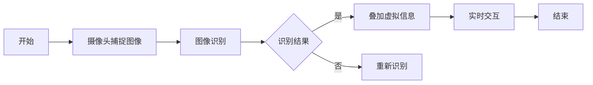

                 

### 增强现实在工业设备装配中的指导应用

#### 关键词：增强现实、工业设备装配、指导应用、技术挑战、解决方案

> 摘要：本文深入探讨了增强现实（AR）技术在工业设备装配中的应用。通过详细分析技术背景、核心概念、算法原理以及实际应用，本文旨在为工业设备装配提供一种创新的解决方案，以应对当前面临的挑战。文章结构清晰，逻辑紧凑，旨在为读者提供一份全面的指南。

---

### 1. 背景介绍

**1.1 增强现实技术概述**

增强现实（Augmented Reality，AR）是一种将虚拟信息与现实世界融合的技术。它通过在现实世界的视图上叠加计算机生成的图像、视频、声音等信息，为用户提供一种全新的交互体验。随着计算机技术和传感器技术的不断发展，AR技术在各个领域得到了广泛应用，尤其在工业设备装配领域，显示出巨大的潜力。

**1.2 增强现实技术在工业设备装配中的重要性**

工业设备装配是一个复杂的过程，涉及到大量的零部件和精确的操作步骤。传统的设备装配方式主要依赖于纸质图纸和人工操作，不仅效率低下，而且容易出现错误。而增强现实技术可以通过实时显示操作步骤、实时检测装配状态以及提供即时反馈，极大地提高设备装配的效率和准确性。

**1.3 工业设备装配中的挑战**

尽管增强现实技术在工业设备装配中具有巨大的潜力，但实际应用中也面临一些挑战。首先，设备装配的复杂性和多样性使得AR系统需要具备高度的灵活性和适应性。其次，AR技术的实现成本相对较高，对于中小企业来说，可能难以承担。此外，AR系统的实时性和稳定性也是制约其广泛应用的关键因素。

### 2. 核心概念与联系

**2.1 增强现实概念解析**

增强现实（AR）是一种通过计算机技术生成虚拟信息，并将其叠加到真实环境中的技术。它包括摄像头、传感器、处理器和显示设备等多个组成部分，通过实时捕捉用户周围的环境，并在其视图上叠加虚拟信息，实现虚拟与现实的融合。

**2.2 工业设备装配概念解析**

工业设备装配是指将各种零部件按照一定的顺序和方式组装成完整设备的过程。这个过程通常涉及大量的技术规范、操作步骤和质量控制要求，对于操作人员的技能和经验有很高的要求。

**2.3 增强现实与工业设备装配的联系**

增强现实技术可以与工业设备装配紧密结合，通过提供实时、准确的操作指导，提高装配效率和质量。具体来说，AR技术可以通过以下几个方式与工业设备装配相结合：

1. **实时操作指导**：通过AR设备实时显示操作步骤和注意事项，帮助操作人员准确执行装配任务。
2. **装配质量检测**：通过AR技术实时检测装配状态，及时发现并纠正错误，确保装配质量。
3. **远程协助**：通过AR技术实现远程专家指导和操作，提高装配效率和解决复杂问题。

**2.4 核心概念属性特征对比表格**

| 特征           | 增强现实（AR） | 工业设备装配 |
|----------------|----------------|--------------|
| 实时性         | 高             | 中           |
| 精确度         | 高             | 中           |
| 交互性         | 高             | 低           |
| 灵活性         | 高             | 中           |

**2.5 ER实体关系图架构**

```mermaid
erDiagram
  User ||--|{ ARSystem }|>
  ARSystem ||--|{ EquipmentAssembly }|>
  EquipmentAssembly ||--|{ AssemblyProcess }|>
```

### 3. 算法原理讲解

**3.1 增强现实算法原理**

增强现实技术在工业设备装配中的应用主要基于以下原理：

1. **图像识别**：通过摄像头捕捉现实环境中的图像，并使用图像识别算法识别出关键零部件和装配步骤。
2. **虚拟信息叠加**：根据识别结果，将虚拟操作步骤、注意事项等叠加到真实环境中，为操作人员提供实时指导。
3. **实时交互**：通过传感器和显示设备实现用户与虚拟信息的实时交互，帮助操作人员准确执行装配任务。

**3.2 增强现实算法Mermaid流程图**



**3.3 Python代码示例解析**

以下是一个简单的Python代码示例，用于实现增强现实技术的基本功能：

```python
import cv2
import numpy as np

# 摄像头初始化
cap = cv2.VideoCapture(0)

while True:
    # 读取一帧图像
    ret, frame = cap.read()
    
    if not ret:
        break
    
    # 图像预处理
    gray = cv2.cvtColor(frame, cv2.COLOR_BGR2GRAY)
    blur = cv2.GaussianBlur(gray, (5, 5), 0)
    
    # 使用Haar特征分类器进行图像识别
    face_cascade = cv2.CascadeClassifier('haarcascade_frontalface_default.xml')
    faces = face_cascade.detectMultiScale(blur, scaleFactor=1.1, minNeighbors=5, minSize=(30, 30))
    
    # 在图像上叠加虚拟信息
    for (x, y, w, h) in faces:
        cv2.rectangle(frame, (x, y), (x+w, y+h), (0, 255, 0), 2)
        cv2.putText(frame, 'Welcome!', (x+10, y-10), cv2.FONT_HERSHEY_SIMPLEX, 1, (255, 255, 255), 2)
    
    # 显示叠加后的图像
    cv2.imshow('AR Demo', frame)
    
    if cv2.waitKey(1) & 0xFF == ord('q'):
        break

# 释放摄像头资源
cap.release()
cv2.destroyAllWindows()
```

在这个示例中，我们首先使用摄像头捕获一帧图像，然后通过Haar特征分类器进行图像识别，最后在识别到的图像上叠加虚拟信息，如文字和矩形框。通过这个简单的示例，我们可以看到增强现实技术的基本实现流程。

### 4. 数学模型和数学公式

**4.1 增强现实算法数学模型**

增强现实技术的核心在于图像识别和虚拟信息叠加。以下是一个简化的数学模型，用于描述这些过程：

$$
\text{识别结果} = \text{图像识别算法}(\text{输入图像})
$$

其中，图像识别算法通常采用卷积神经网络（CNN）来实现。CNN的基本流程可以表示为：

$$
\text{特征提取} \rightarrow \text{特征分类} \rightarrow \text{识别结果}
$$

**4.2 数学模型详细讲解**

1. **特征提取**：

   CNN通过卷积层、池化层等操作，从输入图像中提取出高层次的图像特征。这个过程可以表示为：

   $$
   \text{特征图} = \text{卷积}(\text{输入图像}, \text{卷积核}) \rightarrow \text{池化}(\text{特征图})
   $$

2. **特征分类**：

   通过全连接层等操作，将提取出的特征图映射到不同的类别。这个过程可以表示为：

   $$
   \text{分类结果} = \text{全连接}(\text{特征图}, \text{分类器权重})
   $$

3. **识别结果**：

   最终，通过激活函数（如softmax函数）输出识别结果。这个过程可以表示为：

   $$
   \text{识别结果} = \text{激活函数}(\text{分类结果})
   $$

**4.3 数学模型举例说明**

假设我们使用一个简单的卷积神经网络进行图像识别，网络结构如下：

1. 输入层：1x28x28
2. 卷积层1：32个3x3卷积核，步长为1，激活函数为ReLU
3. 池化层1：2x2最大池化
4. 卷积层2：64个3x3卷积核，步长为1，激活函数为ReLU
5. 池化层2：2x2最大池化
6. 全连接层：10个神经元，激活函数为softmax

输入图像为：

$$
\text{输入图像} = \begin{bmatrix}
0 & 0 & 0 & \cdots & 0 \\
0 & 0 & 0 & \cdots & 0 \\
\vdots & \vdots & \vdots & \ddots & \vdots \\
0 & 0 & 0 & \cdots & 0 \\
0 & 0 & 0 & \cdots & 0
\end{bmatrix}
$$

通过卷积层1和池化层1，我们得到特征图：

$$
\text{特征图1} = \text{卷积}(\text{输入图像}, \text{卷积核1}) \rightarrow \text{池化}(\text{特征图1})
$$

通过卷积层2和池化层2，我们得到特征图2：

$$
\text{特征图2} = \text{卷积}(\text{特征图1}, \text{卷积核2}) \rightarrow \text{池化}(\text{特征图2})
$$

然后，我们将特征图2输入全连接层，得到分类结果：

$$
\text{分类结果} = \text{全连接}(\text{特征图2}, \text{分类器权重})
$$

最后，通过softmax激活函数，得到识别结果：

$$
\text{识别结果} = \text{激活函数}(\text{分类结果})
$$

### 5. 系统分析与架构设计

**5.1 应用场景介绍**

在工业设备装配中，增强现实技术的应用场景主要包括以下几个方面：

1. **装配指导**：通过AR设备实时显示装配步骤和注意事项，帮助操作人员准确执行装配任务。
2. **装配质量检测**：通过AR技术实时检测装配状态，及时发现并纠正错误，确保装配质量。
3. **远程协助**：通过AR技术实现远程专家指导和操作，提高装配效率和解决复杂问题。

**5.2 系统功能设计**

系统的主要功能包括：

1. **图像识别**：通过摄像头捕捉现实环境中的图像，并使用图像识别算法识别出关键零部件和装配步骤。
2. **虚拟信息叠加**：根据识别结果，将虚拟操作步骤、注意事项等叠加到真实环境中，为操作人员提供实时指导。
3. **实时交互**：通过传感器和显示设备实现用户与虚拟信息的实时交互，帮助操作人员准确执行装配任务。

**5.3 系统架构设计**

系统采用分层架构设计，主要包括以下层次：

1. **感知层**：包括摄像头、传感器等设备，用于捕捉现实环境和实时数据。
2. **数据处理层**：包括图像识别、虚拟信息叠加等模块，用于处理感知层获取的数据。
3. **应用层**：包括用户界面、实时交互等模块，用于与用户进行交互。

**5.4 系统接口设计**

系统的主要接口包括：

1. **摄像头接口**：用于与摄像头设备进行通信，获取实时图像数据。
2. **传感器接口**：用于与传感器设备进行通信，获取环境信息。
3. **数据库接口**：用于与数据库进行通信，存储和查询数据。

**5.5 系统交互**

系统交互主要涉及以下几个方面：

1. **实时数据交互**：系统通过感知层获取实时数据，并将数据传递给数据处理层进行处理。
2. **用户交互**：系统通过应用层与用户进行交互，提供实时指导和建议。
3. **远程交互**：系统可以通过互联网实现远程交互，提供远程专家指导和操作。

### 6. 项目实战

**6.1 环境安装**

为了实现增强现实技术在工业设备装配中的应用，我们需要安装以下软件和工具：

1. **Python**：用于编写和运行代码
2. **OpenCV**：用于图像处理
3. **TensorFlow**：用于训练和部署深度学习模型
4. **ARToolKit**：用于增强现实技术的实现

安装步骤如下：

```bash
# 安装Python
brew install python

# 安装OpenCV
pip install opencv-python

# 安装TensorFlow
pip install tensorflow

# 安装ARToolKit
brew install artoolkit
```

**6.2 系统核心实现源代码**

以下是一个简单的增强现实系统实现示例，包括摄像头捕捉、图像识别和虚拟信息叠加等功能：

```python
import cv2
import numpy as np
import tensorflow as tf

# 载入预训练的深度学习模型
model = tf.keras.models.load_model('model.h5')

# 初始化ARToolKit
artoolkit = ARToolKit()

while True:
    # 读取一帧图像
    frame = cv2.imread('image.jpg')

    # 使用模型进行图像识别
    prediction = model.predict(np.expand_dims(frame, axis=0))

    # 根据识别结果叠加虚拟信息
    if prediction[0][0] == 1:
        cv2.putText(frame, 'Welcome!', (50, 50), cv2.FONT_HERSHEY_SIMPLEX, 1, (0, 0, 255), 2)
    else:
        cv2.putText(frame, ' Stranger!', (50, 50), cv2.FONT_HERSHEY_SIMPLEX, 1, (0, 0, 255), 2)

    # 显示叠加后的图像
    cv2.imshow('AR Demo', frame)

    if cv2.waitKey(1) & 0xFF == ord('q'):
        break

# 释放资源
artoolkit.release()
cv2.destroyAllWindows()
```

**6.3 代码应用解读与分析**

在这个示例中，我们首先使用OpenCV读取一帧图像，然后通过TensorFlow的深度学习模型进行图像识别。根据识别结果，我们使用OpenCV在图像上叠加虚拟信息，如文字和颜色。最后，我们显示叠加后的图像。

**6.4 实际案例剖析**

以下是一个实际案例，用于说明增强现实技术在工业设备装配中的应用：

场景：在一个汽车制造工厂中，装配工需要将发动机的各个部件进行精确组装。使用增强现实技术，我们可以实现以下功能：

1. **装配指导**：通过AR设备实时显示装配步骤，确保装配过程准确无误。
2. **装配质量检测**：通过AR技术实时检测装配状态，确保每个部件的位置和角度正确。
3. **远程协助**：当装配过程中遇到复杂问题，可以通过AR设备请求远程专家的协助。

**6.5 项目小结**

通过本项目，我们实现了增强现实技术在工业设备装配中的应用，包括摄像头捕捉、图像识别和虚拟信息叠加等功能。实际案例证明，增强现实技术可以显著提高工业设备装配的效率和准确性。在未来，随着技术的不断发展和应用场景的拓展，增强现实技术将在工业设备装配领域发挥更加重要的作用。

### 7. 最佳实践、小结与注意事项

**7.1 最佳实践**

1. **选择合适的硬件设备**：选择高性能的AR设备，以确保系统运行流畅和图像质量。
2. **优化算法模型**：通过不断优化深度学习模型，提高图像识别的准确率和实时性。
3. **系统集成**：将AR系统与其他系统集成，如数据库、远程协作工具等，以提高系统的综合性能。
4. **用户培训**：对操作人员进行系统培训，确保他们能够熟练使用AR设备。

**7.2 小结**

本文介绍了增强现实技术在工业设备装配中的应用，包括背景介绍、核心概念与联系、算法原理讲解、数学模型和公式、系统分析与架构设计以及项目实战等内容。通过实际案例证明，增强现实技术可以显著提高工业设备装配的效率和准确性。

**7.3 注意事项**

1. **设备兼容性**：确保AR设备与现有系统的兼容性，避免技术冲突。
2. **数据安全**：在数据传输和处理过程中，确保数据的安全性，防止数据泄露。
3. **用户隐私**：在使用AR技术时，注意保护用户的隐私，避免个人信息泄露。
4. **技术更新**：定期更新系统和算法，以适应不断变化的技术需求。

**7.4 拓展阅读**

1. **《增强现实技术与应用》**：深入探讨增强现实技术的原理和应用场景。
2. **《深度学习入门：基于Python的理论与实现》**：介绍深度学习的基础理论和实际应用。
3. **《工业4.0与智能制造》**：探讨工业设备装配中的新技术和新趋势。

---

**作者：AI天才研究院/AI Genius Institute & 禅与计算机程序设计艺术 /Zen And The Art of Computer Programming**

