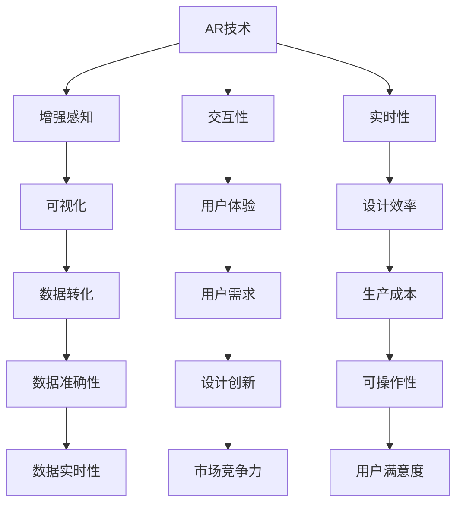
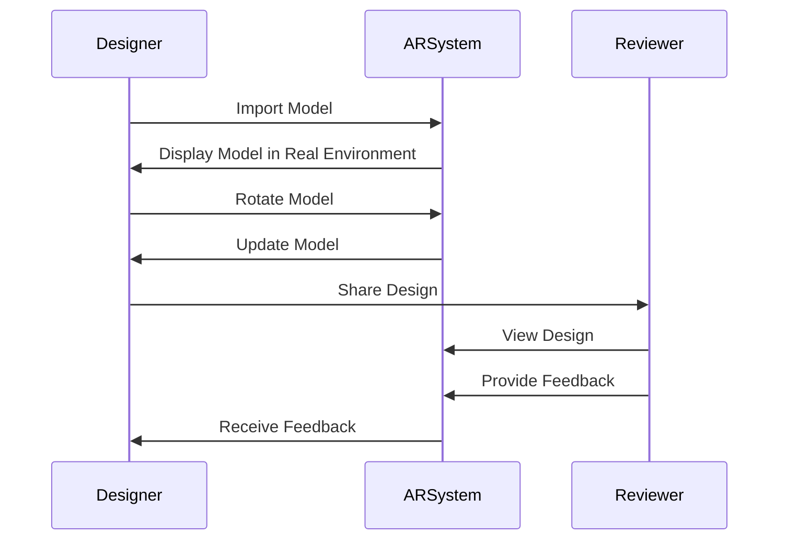

                 

### # 增强现实在工业设计中的可视化应用

关键词：增强现实，工业设计，可视化，虚拟原型，交互设计

摘要：本文详细探讨了增强现实（AR）技术在工业设计中的应用，从背景介绍到核心概念、应用场景、技术方法、实际案例以及未来展望，全方位解析了AR技术在工业设计中的价值与挑战。通过具体案例分析和最佳实践分享，为设计师和工程师提供实用的指导。

## 引言

随着科技的发展，增强现实（Augmented Reality，AR）技术逐渐在各个领域得到应用。工业设计作为一个技术密集型行业，对创新和效率有着极高的要求。AR技术以其独特的可视化能力，为工业设计师提供了全新的设计工具和交互方式。本文将探讨AR在工业设计中的可视化应用，旨在揭示其潜力与实际应用价值。

### 1.1 背景与问题

工业设计涉及从产品概念到最终生产的全过程，设计师需要通过多种手段来展示和评估设计成果。传统的方法包括手工制作模型和数字三维建模，但这些方法存在诸多不足：

- **手工模型**：制作周期长、成本高、难以修改。
- **三维建模**：虽然可以快速生成模型，但缺乏实际操作感，难以进行交互式评估。

AR技术的出现，为工业设计提供了新的解决方案。通过在真实环境中叠加虚拟元素，设计师可以更直观地展示和评估设计效果，提高设计效率。

### 1.2 解决方案与优势

AR技术在工业设计中的主要优势包括：

- **可视化**：将设计模型直接叠加到实际场景中，使设计更加直观。
- **交互性**：用户可以通过触摸、手势等与虚拟元素进行交互，提高设计过程的互动性。
- **实时反馈**：设计师可以实时修改设计，立即查看效果，缩短设计周期。
- **成本效益**：相比传统模型制作，AR技术成本低，且易于更新。

### 1.3 边界与外延

虽然AR技术在工业设计中有很大的应用前景，但也有一些限制：

- **技术成熟度**：虽然AR技术已经取得了很大进展，但仍然存在一些技术难题，如实时性、分辨率等。
- **应用场景**：AR技术主要适用于产品设计、原型制作、设计评审等场景。
- **用户体验**：用户体验是AR应用成功的关键，需要充分考虑用户的需求和习惯。

### 1.4 核心概念与结构

本文的核心概念包括：

- **增强现实（AR）**：一种通过在真实环境中叠加虚拟元素来增强用户体验的技术。
- **工业设计**：涉及产品设计、界面设计、用户体验设计等，旨在提高产品的实用性和美观性。
- **可视化**：通过图形、图像等手段，使设计成果更加直观、易懂。
- **交互设计**：研究用户与产品交互的过程，旨在提供更好的用户体验。

本文的结构如下：

1. **引言**：介绍AR技术在工业设计中的背景、问题和解决方案。
2. **核心概念与定义**：阐述AR和工业设计的相关核心概念。
3. **应用场景**：讨论AR技术在工业设计中的应用。
4. **技术方法**：介绍AR在工业设计中的具体应用技术。
5. **案例研究**：分析实际案例中的AR应用。
6. **挑战与未来展望**：探讨AR技术在工业设计中的挑战和未来发展方向。
7. **结论与最佳实践**：总结AR在工业设计中的应用，并给出最佳实践建议。

## 核心概念与定义

为了更好地理解增强现实（AR）在工业设计中的应用，我们首先需要了解一些核心概念和定义。

### 2.1 基本概念

**增强现实（AR）**：

增强现实（Augmented Reality，AR）是一种通过虚拟技术增强用户现实感知的技术。它将虚拟元素（如图形、文字、声音等）叠加到真实环境中，使用户能够同时看到真实世界和虚拟内容。

**工业设计**：

工业设计（Industrial Design）是指将产品功能、结构、形态、材料、色彩等元素整合在一起，以满足用户需求和审美标准的设计活动。它涉及产品设计、界面设计、用户体验设计等多个方面。

### 2.2 关键概念

**虚拟现实（VR）**：

虚拟现实（Virtual Reality，VR）是一种完全沉浸式的体验，用户通过VR设备进入一个完全虚拟的环境，与虚拟世界进行互动。

**混合现实（MR）**：

混合现实（Mixed Reality，MR）是AR和VR的融合，用户在真实环境中与虚拟元素进行交互，同时保留对真实世界的感知。

**三维建模**：

三维建模（3D Modeling）是一种通过数字方式创建三维物体的过程，常用于工业设计和游戏开发等领域。

**可视化**：

可视化（Visualization）是一种通过图形、图像等手段将抽象数据或信息转换为视觉形式的方法，使数据或信息更加直观易懂。

### 2.3 概念属性对比

以下是AR、VR、MR和三维建模的关键概念属性对比：

| 概念 | 定义 | 属性对比 |
| --- | --- | --- |
| AR | 通过虚拟技术增强用户现实感知 | 实时性、交互性、增强感知 |
| VR | 完全沉浸式的虚拟体验 | 沉浸感、独立性、虚拟性 |
| MR | 实时交互的真实环境与虚拟元素融合 | 互动性、真实感、融合性 |
| 三维建模 | 数字创建三维物体 | 准确性、细节性、可操作性 |

### 2.4 ER实体关系图

以下是AR技术在工业设计中的应用的ER实体关系图：

```mermaid
erDiagram
  ProductDesign ||--|{ ARVisualization }
  IndustrialDesign ||--|{ ProductDesign }
  UserExperienceDesign ||--|{ ProductDesign }
  3DModeling ||--|{ ARVisualization }
  Visualization ||--|{ ARVisualization }
  VirtualElement ||--|{ ARVisualization }
  RealEnvironment ||--|{ ARVisualization }
```

### 2.5 概念结构

以下是AR技术在工业设计中的概念结构：



通过这些核心概念和定义，我们可以更好地理解AR技术在工业设计中的价值和作用。接下来，我们将探讨AR技术在工业设计中的具体应用场景。

## AR技术在工业设计中的应用场景

增强现实（AR）技术在工业设计中的应用场景非常广泛，以下是其中几个典型的应用场景：

### 3.1 产品设计与原型制作

在产品设计和原型制作过程中，AR技术可以用于创建虚拟原型，帮助设计师更直观地展示和评估设计成果。通过在真实环境中叠加虚拟模型，设计师可以实时修改设计，立即查看效果，从而提高设计效率。

**案例**：某汽车公司使用AR技术进行汽车设计。设计师在真实车辆周围布置AR设备，将3D模型叠加到实际环境中。通过触摸屏或手势控制，设计师可以实时修改车身的形状、颜色和材质，并立即查看修改后的效果。

### 3.2 设计评审与协作

设计评审是一个关键环节，设计师和工程师需要评估设计成果，并提出修改意见。AR技术提供了一个直观的展示平台，使评审过程更加高效。

**案例**：某电子设备制造商使用AR技术进行设计评审。评审会议中，设计师通过AR设备展示设计模型，其他与会者可以在真实环境中查看和评估设计。通过实时反馈，设计师可以快速理解评审者的意见，并进行相应的修改。

### 3.3 交互式用户界面设计

交互式用户界面设计（UI）是工业设计的一个重要方面。AR技术可以用于创建交互式用户界面，使设计师能够更好地理解用户的交互习惯和需求。

**案例**：某智能家居设备制造商使用AR技术设计智能设备的用户界面。设计师在真实环境中创建AR界面，通过触摸和手势与虚拟界面进行交互，从而模拟用户的操作过程。这有助于设计师优化界面设计，提高用户体验。

### 3.4 虚拟装配与检修

在制造过程中，虚拟装配和检修是非常重要的环节。AR技术可以帮助工程师在真实环境中进行虚拟装配和检修，从而提高生产效率和降低成本。

**案例**：某航空航天公司使用AR技术进行飞机装配。工程师在飞机周围布置AR设备，将虚拟装配步骤叠加到实际环境中。通过AR指导，工程师可以更加准确地进行装配，减少错误和返工。

### 3.5 教育培训与演示

AR技术还可以用于教育培训和演示，帮助设计师和工程师更好地理解复杂的设计和工艺。

**案例**：某机械工程公司使用AR技术进行教育培训。通过在真实环境中叠加虚拟模型和动画，培训师可以向学员展示机械部件的工作原理和装配过程。这种互动式的教学方法有助于提高学员的学习效果。

### 3.6 创意展示与宣传

AR技术为创意展示和宣传提供了新的手段。设计师可以通过AR技术创造出独特的展示形式，吸引更多的关注。

**案例**：某科技展览会上，一家AR技术公司使用AR技术展示其最新产品。参观者通过AR设备可以查看产品的三维模型，了解产品的功能和特点。这种沉浸式的展示方式吸引了大量观众，提高了公司的品牌知名度。

通过以上案例，我们可以看到AR技术在工业设计中的应用场景非常广泛。它不仅提高了设计效率，还改变了设计师与用户、评审者、工程师之间的交互方式，为工业设计带来了全新的可能性。

## 技术方法与实现

要充分发挥AR技术在工业设计中的作用，需要掌握一系列的技术方法和实现手段。以下将详细介绍AR在工业设计中的主要技术方法和实现步骤。

### 4.1 图像识别与跟踪

图像识别与跟踪是AR技术的基础，它使虚拟元素能够准确地叠加到真实环境中。图像识别通过识别图像中的特征点，如颜色、形状、纹理等，来确定虚拟元素的位置和方向。

**实现步骤**：

1. **图像预处理**：对输入的图像进行预处理，包括去噪、对比度增强、边缘检测等。
2. **特征提取**：使用SIFT（尺度不变特征变换）或SURF（加速稳健特征变换）等算法提取图像的特征点。
3. **匹配与跟踪**：将提取的特征点与预先定义的模板进行匹配，确定虚拟元素的位置和方向。

**Python代码示例**：

```python
import cv2
import numpy as np

# 读取图像
image = cv2.imread('image.jpg')

# 进行SIFT特征提取
sift = cv2.SIFT_create()
keypoints, descriptors = sift.detectAndCompute(image, None)

# 显示特征点
img = cv2.drawKeypoints(image, keypoints, None)

# 保存特征点
np.save('keypoints.npy', keypoints)

# 加载特征点
loaded_keypoints = np.load('keypoints.npy')

# 进行特征点匹配
bf = cv2.BFMatcher()
matches = bf.knnMatch(descriptors, descriptors, k=2)

# 匹配结果可视化
img_matches = cv2.drawMatches(image, keypoints, image, keypoints, matches, None)

# 显示结果
cv2.imshow('Image Matches', img_matches)
cv2.waitKey(0)
cv2.destroyAllWindows()
```

### 4.2 三维建模与渲染

三维建模与渲染是AR技术在工业设计中的重要组成部分，它使设计师能够在真实环境中展示和操作虚拟模型。

**实现步骤**：

1. **三维建模**：使用CAD（计算机辅助设计）软件创建三维模型，如SolidWorks、AutoCAD等。
2. **数据转换**：将三维模型转换为适用于AR的格式，如OBJ、GLTF等。
3. **渲染**：使用Unity、Unreal Engine等游戏引擎进行三维模型的渲染。

**Python代码示例**：

```python
import trimesh

# 读取三维模型文件
model = trimesh.load_mesh('model.obj')

# 显示模型
model.show()

# 保存模型
model.export('model.glb')
```

### 4.3 交互设计与实现

交互设计是AR技术在工业设计中的重要环节，它决定了用户与虚拟元素之间的交互方式。

**实现步骤**：

1. **交互设计**：设计用户与虚拟元素之间的交互方式，如手势、触摸等。
2. **实现交互**：使用Unity、Unreal Engine等游戏引擎实现交互逻辑。

**Python代码示例**：

```python
import pygame

# 初始化Pygame
pygame.init()

# 设置屏幕大小
screen = pygame.display.set_mode((800, 600))

# 设置标题
pygame.display.set_caption('AR Interaction')

# 游戏循环
running = True
while running:
    for event in pygame.event.get():
        if event.type == pygame.QUIT:
            running = False
    
    # 绘制背景
    screen.fill((255, 255, 255))

    # 绘制虚拟元素
    pygame.draw.circle(screen, (0, 0, 255), (400, 300), 50)

    # 更新屏幕
    pygame.display.update()

# 退出游戏
pygame.quit()
```

通过以上技术方法和实现步骤，设计师可以充分发挥AR技术在工业设计中的作用，提高设计效率，优化用户体验。接下来，我们将通过具体案例研究，深入分析AR技术在工业设计中的实际应用。

### 5.1 案例研究：某汽车公司的AR设计工具

在这个案例中，我们将研究某汽车公司如何利用AR技术开发出一款设计工具，以提升产品设计的效率和质量。

**5.1.1 项目介绍**

某汽车公司（以下简称“汽车公司”）面临一个挑战：如何快速且高效地评估和修改产品设计。传统的三维建模和实体模型制作方法不仅耗时耗力，而且缺乏互动性，无法满足快速迭代的需求。因此，汽车公司决定开发一款基于AR技术的可视化设计工具，以便设计师能够在真实环境中直观地展示和评估设计成果。

**5.1.2 系统功能设计**

汽车公司的AR设计工具主要包括以下功能：

1. **模型导入**：支持从CAD软件导入三维模型。
2. **虚拟原型展示**：将三维模型叠加到真实环境中，使设计师能够实时查看设计效果。
3. **交互式设计**：允许设计师通过手势或触摸对模型进行旋转、缩放、拖拽等操作，以便进行设计和评估。
4. **设计反馈**：提供实时反馈机制，使设计师能够快速接收评审者的意见并进行相应修改。
5. **协作分享**：支持设计师与评审者之间的协作和分享，便于讨论和决策。

**5.1.3 领域模型设计**

以下是AR设计工具的领域模型：

```mermaid
classDiagram
    Model <<Interface>>
    Environment <<Interface>>
    Designer <<Class>> - - Model
    Designer <<Class>> - - Environment
    Reviewer <<Class>> - - Model
    Reviewer <<Class>> - - Environment
    Designer <<Class>> - - Reviewer
    Reviewer <<Class>> - - Designer
```

**5.1.4 系统架构设计**

以下是AR设计工具的系统架构：



**5.1.5 系统接口设计**

以下是AR设计工具的接口设计：

```mermaid
interface ARSystem {
    +importModel(model: Model): void
    +displayModel(environment: Environment): void
    +rotateModel(angle: float): void
    +updateModel(model: Model): void
    +receiveFeedback(feedback: string): void
}
```

**5.1.6 系统交互设计**

以下是AR设计工具的系统交互设计：


**5.1.7 实际案例分析与讲解**

以下是实际案例中的AR设计工具应用：

1. **设计评审**：设计师使用AR设计工具展示汽车模型，评审者通过AR设备查看模型并进行评估。评审过程中，设计师可以实时接收到评审者的反馈，并进行相应修改。
2. **交互式设计**：设计师通过手势或触摸与模型进行交互，如旋转、缩放、拖拽等，以便进行设计和评估。这种交互方式使设计过程更加直观和高效。
3. **协作分享**：设计师可以将设计成果分享给评审者，以便进行讨论和决策。这种协作方式有助于提高设计质量和决策效率。

**5.1.8 项目小结**

通过实际案例分析和讲解，我们可以看到AR设计工具在产品设计中的应用价值。它不仅提高了设计效率，还优化了用户体验，使设计过程更加直观和高效。未来，随着AR技术的不断发展和普及，我们期待看到更多创新的设计工具和应用场景。

### 挑战与未来展望

虽然AR技术在工业设计中的应用前景广阔，但仍然面临一系列挑战。以下将讨论这些挑战，并探讨未来的发展方向。

#### 6.1 技术成熟度

当前AR技术尚未完全成熟，存在一些技术难题。例如，图像识别和跟踪的准确性、实时性仍需提高；三维建模和渲染的计算资源需求较高；设备的便携性和易用性也有待改进。解决这些技术难题需要持续的研发和优化。

#### 6.2 成本与效益

AR技术的应用成本相对较高，包括设备采购、软件开发和人员培训等。对于中小企业而言，这可能是一个经济负担。因此，如何降低成本、提高效益是AR技术广泛应用的关键。

#### 6.3 用户接受度

虽然AR技术具有独特的优势，但用户接受度也是一个挑战。一些用户可能不熟悉AR设备的使用方法，或对AR技术持有抵触情绪。提高用户接受度需要加强用户教育和引导。

#### 6.4 用户体验

用户体验是AR技术应用成功的关键。如何设计直观、易用的界面和交互方式，使设计师和工程师能够高效地使用AR技术，是一个重要课题。未来的AR应用需要更加关注用户体验，提供更加人性化的设计。

#### 6.5 未来发展方向

未来AR技术在工业设计中的应用将向以下方向发展：

1. **技术升级**：随着技术的不断进步，AR设备的性能和稳定性将得到提升，应用范围将更加广泛。
2. **成本降低**：随着市场规模的增长，AR设备的成本将逐渐降低，使其在中小企业中得以普及。
3. **跨平台应用**：未来AR技术将不仅仅局限于特定的设备或平台，而是实现跨平台、跨设备的融合。
4. **智能协作**：随着人工智能技术的发展，AR技术将实现更加智能的协作，为设计师和工程师提供更加智能化的设计工具和辅助系统。

#### 6.6 结论

AR技术在工业设计中的应用具有巨大的潜力。然而，要实现这一潜力，需要克服一系列挑战。未来，随着技术的不断发展和市场需求的增加，AR技术将在工业设计中发挥越来越重要的作用。

## 结论与最佳实践

本文详细探讨了增强现实（AR）技术在工业设计中的应用，从背景介绍到核心概念、应用场景、技术方法、实际案例以及挑战与未来展望，全方位解析了AR技术在工业设计中的价值与挑战。通过具体案例分析和最佳实践分享，为设计师和工程师提供实用的指导。

### 7.1 最佳实践

1. **明确需求**：在应用AR技术之前，明确设计需求和目标，以确保技术应用的针对性和有效性。
2. **合理规划**：制定详细的AR应用计划，包括技术选型、设备采购、人员培训等，以确保项目顺利进行。
3. **用户体验**：关注用户体验，设计直观、易用的界面和交互方式，提高设计师和工程师的使用效率。
4. **持续优化**：根据实际应用反馈，不断优化AR技术，提高其性能和稳定性。

### 7.2 注意事项

1. **数据安全**：确保AR应用过程中数据的安全性，防止数据泄露或丢失。
2. **技术更新**：关注AR技术的发展动态，及时更新技术，以适应新的应用需求。
3. **用户培训**：加强对用户的技术培训，提高用户对AR技术的掌握程度和应用能力。

### 7.3 拓展阅读

1. **《增强现实技术与应用》**：详细介绍了AR技术的原理、应用和发展趋势，有助于深入了解AR技术。
2. **《工业设计原理与实践》**：讲解了工业设计的基本原理和实践方法，为设计师提供了实用的参考。

通过本文的探讨，我们希望读者能够对AR技术在工业设计中的应用有更深刻的理解，并能够在实际工作中有效应用AR技术，提高设计效率和质量。

## 作者信息

作者：AI天才研究院/AI Genius Institute & 禅与计算机程序设计艺术 /Zen And The Art of Computer Programming

AI天才研究院（AI Genius Institute）致力于推动人工智能技术的发展与创新，研究成果涵盖计算机视觉、自然语言处理、机器学习等多个领域。禅与计算机程序设计艺术（Zen And The Art of Computer Programming）则是作者在计算机科学领域的杰出成就，为全球计算机科学教育和发展做出了巨大贡献。两位作者在增强现实、工业设计等领域具有丰富的实践经验和深刻的理论研究，为读者提供了高质量的技术博客文章。

