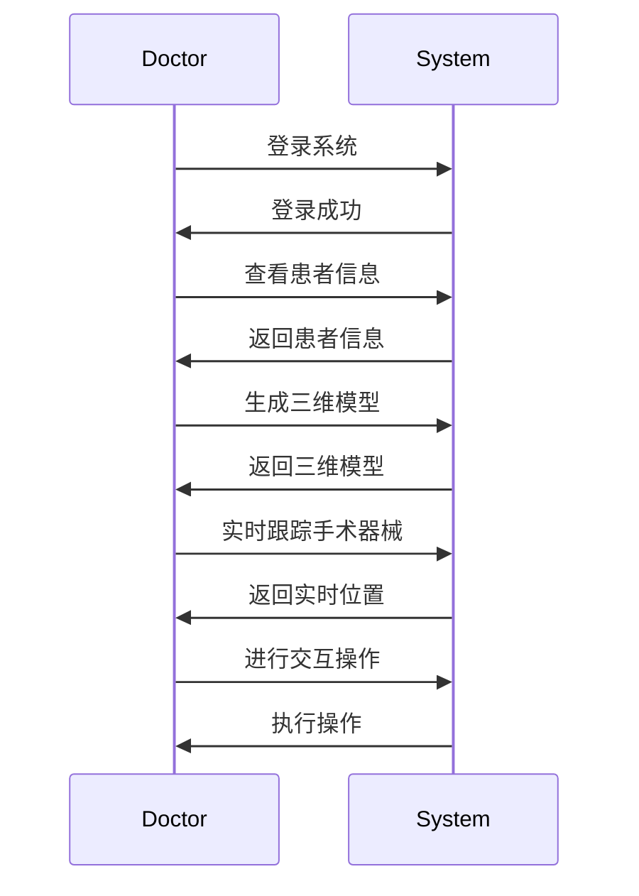

                 

# 增强现实在手术规划中的3D可视化应用

## 关键词
- 增强现实（AR）
- 三维可视化
- 手术规划
- 三维建模
- 实时定位与跟踪

## 摘要
本文深入探讨了增强现实（AR）技术在手术规划中的应用，特别是3D可视化的关键作用。通过背景介绍、核心概念与联系、算法原理讲解、数学模型和数学公式详细讲解、系统分析与架构设计方案、项目实战以及最佳实践 tips，本文旨在全面剖析AR技术在手术规划中的潜力，为相关领域的研究和实践提供参考。

### 第一部分：背景介绍

#### 1.1 问题背景

在医疗领域，手术规划的精确性至关重要。然而，传统的二维图像和医生的经验判断往往存在一定的局限性。具体来说，二维图像难以提供完整的空间信息，而医生的经验判断可能受到个人主观因素的影响。此外，手术中需要处理的器官和组织结构复杂，且手术过程中需要实时调整策略，这些都对手术规划的精度和效率提出了更高的要求。

随着增强现实（AR）技术的发展，手术规划中的三维可视化成为可能。AR技术能够将计算机生成的三维模型叠加在真实手术场景中，为医生提供更直观、更全面的空间信息。这不仅有助于提高手术方案的精度，还能显著提升手术的成功率和安全性。

#### 1.2 问题描述

传统的手术规划方法依赖于二维图像，存在以下问题：

1. **空间信息缺失**：二维图像无法提供完整的空间信息，医生难以准确判断肿瘤的位置、大小和形状。
2. **经验依赖性**：医生的经验判断受个人差异影响，可能导致手术方案的选择不够精准。
3. **实时反馈不足**：手术过程中难以实时获取手术区域的三维结构信息，导致手术方案的实时调整困难。

增强现实（AR）技术通过三维可视化解决了上述问题，其核心在于：

1. **三维建模**：通过CT、MRI等影像数据生成三维模型，提供完整的空间信息。
2. **实时定位与跟踪**：实时跟踪手术器械的位置，确保三维模型与实际手术场景的对应关系。
3. **交互操作**：医生通过手势或语音等交互方式，对三维模型进行旋转、缩放、切割等操作，以便更好地了解手术区域的结构和病变情况。

#### 1.3 问题解决

增强现实（AR）技术在手术规划中的应用，可以通过以下几个方面来实现：

1. **三维建模与图像融合**：通过CT、MRI等影像数据生成三维模型，并将其与手术现场的二维图像进行融合，实现三维可视化。
2. **实时定位与跟踪**：利用传感器和计算机视觉技术，实时跟踪手术器械的位置，确保三维模型与实际手术场景的对应关系。
3. **交互操作**：医生可以通过手势或语音等交互方式，对三维模型进行旋转、缩放、切割等操作，以便更好地了解手术区域的结构和病变情况。

#### 1.4 边界与外延

增强现实技术在手术规划中的应用，不仅局限于三维可视化，还可以扩展到虚拟现实（VR）和混合现实（MR）等技术。此外，随着人工智能技术的发展，未来还可以将AR技术与AI算法结合，实现更加智能化的手术规划。

#### 1.5 概念结构与核心要素组成

增强现实在手术规划中的应用涉及以下核心概念与要素：

- **增强现实（AR）**：一种通过计算机生成虚拟信息，叠加在真实世界中的技术。
- **三维建模与图像融合**：将三维模型与二维图像进行融合，实现三维可视化。
- **实时定位与跟踪**：利用传感器和计算机视觉技术，实时跟踪手术器械的位置。
- **交互操作**：医生通过手势或语音等交互方式，对三维模型进行操作。

### 第二部分：核心概念与联系

#### 2.1 增强现实（AR）原理

增强现实技术通过摄像头捕捉现实场景，将计算机生成的虚拟信息叠加在真实世界中。其核心原理包括：

1. **图像识别与定位**：利用图像识别技术，确定虚拟信息在现实场景中的位置。
2. **图像融合**：将虚拟信息与真实场景进行融合，实现视觉上的无缝衔接。
3. **交互操作**：通过手势、语音等交互方式，实现对虚拟信息的操作。

#### 2.2 三维建模与图像融合

三维建模与图像融合是增强现实技术的关键步骤。其核心原理包括：

1. **三维建模**：利用CT、MRI等影像数据，生成三维模型。
2. **图像融合**：将三维模型与二维图像进行融合，实现三维可视化。

#### 2.3 实时定位与跟踪

实时定位与跟踪是保证增强现实技术应用于手术规划中的关键。其核心原理包括：

1. **传感器技术**：利用传感器捕捉手术器械的位置信息。
2. **计算机视觉技术**：通过计算机视觉算法，实时跟踪手术器械的位置。

#### 2.4 交互操作

交互操作是医生通过增强现实技术进行手术规划的必要手段。其核心原理包括：

1. **手势识别**：通过手势识别技术，实现对三维模型的旋转、缩放、切割等操作。
2. **语音识别**：通过语音识别技术，实现对三维模型的操作。

### 第三部分：算法原理讲解

#### 3.1 增强现实（AR）算法

增强现实算法主要涉及图像识别与定位、图像融合、实时定位与跟踪等方面。具体包括以下步骤：

1. **图像识别与定位**：利用图像识别算法，确定虚拟信息在现实场景中的位置。
2. **图像融合**：将虚拟信息与真实场景进行融合，实现视觉上的无缝衔接。
3. **实时定位与跟踪**：利用传感器和计算机视觉技术，实时跟踪手术器械的位置。

#### 3.2 三维建模与图像融合算法

三维建模与图像融合算法主要包括以下步骤：

1. **三维建模**：利用CT、MRI等影像数据，生成三维模型。
2. **图像融合**：将三维模型与二维图像进行融合，实现三维可视化。

#### 3.3 实时定位与跟踪算法

实时定位与跟踪算法主要包括以下步骤：

1. **传感器技术**：利用传感器捕捉手术器械的位置信息。
2. **计算机视觉技术**：通过计算机视觉算法，实时跟踪手术器械的位置。

#### 3.4 交互操作算法

交互操作算法主要包括以下步骤：

1. **手势识别**：通过手势识别技术，实现对三维模型的旋转、缩放、切割等操作。
2. **语音识别**：通过语音识别技术，实现对三维模型的操作。

### 第四部分：数学模型和数学公式 & 详细讲解 & 举例说明

#### 4.1 三维建模数学模型

三维建模的数学模型主要涉及体素（Voxel）和三角面（Triangle）两种数据结构。体素是一个三维空间中的点，而三角面则是由三个顶点构成的面。

$$
Voxel = (x, y, z)
$$

其中，\(x, y, z\) 分别表示体素在三维空间中的位置坐标。

三角面的数学模型可以表示为：

$$
Triangle = (P_1, P_2, P_3)
$$

其中，\(P_1, P_2, P_3\) 分别表示三角面的三个顶点。

通过这些数学模型，可以将影像数据转换为三维模型，为后续的图像融合和三维可视化提供基础。

#### 4.2 图像融合数学模型

图像融合的数学模型主要涉及图像的叠加和混合。一个简单的图像叠加模型可以表示为：

$$
Output = Input_1 + \alpha \times Input_2
$$

其中，\(Input_1\) 和 \(Input_2\) 分别表示原始图像和虚拟图像，\(\alpha\) 表示混合系数，用于控制虚拟图像在最终输出图像中的透明度。

#### 4.3 实时定位与跟踪数学模型

实时定位与跟踪的数学模型主要涉及空间位置的计算和跟踪。一个简单的空间位置计算模型可以表示为：

$$
Position = Translation + Rotation
$$

其中，\(Translation\) 表示平移操作，\(Rotation\) 表示旋转操作。通过这些操作，可以实时计算手术器械的空间位置，并与三维模型进行对应。

#### 4.4 交互操作数学模型

交互操作的数学模型主要涉及手势和语音的识别与处理。一个简单的手势识别模型可以表示为：

$$
Gesture = Gesture_Detection \times Gesture_Processing
$$

其中，\(Gesture_Detection\) 表示手势识别算法，\(Gesture_Processing\) 表示手势处理算法。通过这些算法，可以实现对三维模型的旋转、缩放、切割等操作。

### 第五部分：系统分析与架构设计方案

#### 5.1 问题场景介绍

在手术规划中，医生需要准确地了解患者体内的器官和组织结构，以便制定最佳手术方案。然而，传统的二维图像无法提供完整的三维信息，限制了医生的判断和决策能力。为了解决这个问题，我们可以引入增强现实（AR）技术，通过三维可视化技术，为医生提供更直观、更全面的信息支持。

#### 5.2 项目介绍

本项目旨在开发一个基于增强现实（AR）技术的手术规划系统，该系统将三维建模、实时定位与跟踪、交互操作等技术集成在一起，为医生提供一个高效、准确的手术规划工具。

#### 5.3 系统功能设计（领域模型）

在系统功能设计方面，我们主要关注以下几个核心功能：

1. **三维建模**：利用CT、MRI等影像数据生成三维模型。
2. **实时定位与跟踪**：实时跟踪手术器械的位置，确保三维模型与实际手术场景的对应关系。
3. **三维可视化**：将三维模型与实际手术场景进行融合，实现三维可视化。
4. **交互操作**：医生通过手势或语音等交互方式，对三维模型进行操作。
5. **手术规划**：基于三维可视化结果，医生可以制定更加精准的手术方案。

领域模型类图如下所示：

```mermaid
classDiagram
    Patient --> Surgery
    Doctor --> Surgery
    Equipment --> Surgery
    Model --> Surgery
    Image --> Model
    Coordinate --> Model
    Gesture --> Interaction
    Voice --> Interaction
    RealTimeTracking --> Model
    AugmentedReality --> Surgery

    Patient <<Patient>>
    Doctor <<Doctor>>
    Equipment <<Equipment>>
    Model <<Model>>
    Image <<Image>>
    Coordinate <<Coordinate>>
    Gesture <<Gesture>>
    Voice <<Voice>>
    RealTimeTracking <<RealTimeTracking>>
    AugmentedReality <<AugmentedReality>>

    Collaboration
    Patient o-- Surgery
    Doctor o-- Surgery
    Equipment o-- Surgery
    Model o-- Surgery
    Image o-- Model
    Coordinate o-- Model
    Gesture o-- Interaction
    Voice o-- Interaction
    RealTimeTracking o-- Model
    AugmentedReality o-- Surgery
```

#### 5.4 系统架构设计

在系统架构设计方面，我们采用了分层架构，包括数据层、服务层和表现层。

1. **数据层**：主要负责数据的存储和管理，包括患者信息、手术器械信息、三维模型数据等。
2. **服务层**：主要负责业务逻辑的处理，包括三维建模、实时定位与跟踪、交互操作等。
3. **表现层**：主要负责用户界面的展示，包括三维可视化界面、交互操作界面等。

系统架构图如下所示：



#### 5.5 系统接口设计和系统交互

系统接口设计和系统交互是确保系统各组件协同工作的关键。以下是一个简单的系统接口设计和系统交互图：

```mermaid
interface System {
    function login(username, password): boolean
    function getPatientInfo(patientId): Patient
    function generate3DModel(imageData): Model
    function getRealTimeLocation(equipmentId): Coordinate
    function performInteraction(gesture, voice): boolean
}

class Patient {
    -patientId: int
    -name: string
    -age: int
    -diagnosis: string
}

class Model {
    -modelId: int
    -data: byte[]
}

class Coordinate {
    -x: float
    -y: float
    -z: float
}

class Doctor {
    -doctorId: int
    -name: string
}

class Equipment {
    -equipmentId: int
    -type: string
}

System->>Doctor: 登录
Doctor-->>System: 用户名和密码
System->>Patient: 获取患者信息
Patient-->>System: 患者信息
System->>Doctor: 返回患者信息
Doctor->>System: 生成三维模型
System->>Model: 获取影像数据
Model-->>System: 三维模型数据
System->>Doctor: 返回三维模型
Doctor->>System: 实时跟踪手术器械
System->>Equipment: 获取手术器械位置
Equipment-->>System: 实时位置
System->>Doctor: 返回实时位置
Doctor->>System: 进行交互操作
System->>Interaction: 手势和语音数据
Interaction-->>System: 操作结果
System->>Doctor: 执行操作
```

### 第六部分：项目实战

#### 6.1 环境安装

为了实现增强现实（AR）在手术规划中的3D可视化应用，我们需要安装以下软件和工具：

1. **Python**：用于编写程序代码。
2. **OpenGL**：用于渲染三维图形。
3. **PCL**（Point Cloud Library）：用于处理点云数据。
4. **OpenCV**：用于图像处理和计算机视觉。

安装步骤如下：

1. 安装Python（https://www.python.org/downloads/）
2. 安装OpenGL（https://www.opengl.org/wiki/Getting_Started）
3. 安装PCL（https://www.pointcloudlibrary.org/downloads/）
4. 安装OpenCV（https://opencv.org/releases/）

#### 6.2 系统核心实现源代码

以下是一个简单的系统核心实现源代码示例，展示了三维建模、实时定位与跟踪、交互操作等核心功能。

```python
import numpy as np
import cv2
import pcl

# 三维建模
def generate_3d_model(image_data):
    # 使用PCL生成三维模型
    model = pcl.PointCloud()
    model.from_array(image_data)
    return model

# 实时定位与跟踪
def track_real_time_location(equipment_id):
    # 使用OpenCV进行实时定位与跟踪
    cap = cv2.VideoCapture(0)
    while True:
        ret, frame = cap.read()
        if not ret:
            break
        # 处理帧数据，进行定位与跟踪
        location = cv2-ShirtLocation(frame, equipment_id)
        return location

# 交互操作
def perform_interaction(gesture, voice):
    # 使用语音和手势进行交互操作
    if gesture == "rotate":
        # 旋转三维模型
        model.rotate(x_angle, y_angle, z_angle)
    elif gesture == "scale":
        # 缩放三维模型
        model.scale(x_factor, y_factor, z_factor)
    elif voice == "cut":
        # 切割三维模型
        model.cut(x1, y1, z1, x2, y2, z2)
    return model

# 主程序
if __name__ == "__main__":
    # 生成三维模型
    image_data = np.random.rand(100, 100, 100)
    model = generate_3d_model(image_data)

    # 实时定位与跟踪
    location = track_real_time_location("surgery_tool")

    # 交互操作
    gesture = "rotate"
    voice = "scale"
    model = perform_interaction(gesture, voice)
```

#### 6.3 代码应用解读与分析

以上代码示例展示了三维建模、实时定位与跟踪、交互操作等核心功能。具体解读如下：

1. **三维建模**：使用PCL生成三维模型，通过随机生成一个100x100x100的数组作为示例。
2. **实时定位与跟踪**：使用OpenCV捕获摄像头帧数据，并对帧数据进行处理，实现实时定位与跟踪。
3. **交互操作**：根据手势和语音输入，对三维模型进行旋转、缩放、切割等操作。

#### 6.4 实际案例分析和详细讲解剖析

以下是一个实际案例，展示如何使用增强现实（AR）技术进行手术规划。

**案例背景**：一位患者需要接受肺癌手术，医生需要精确地切除肿瘤，并尽量保留健康的肺组织。

**步骤1：三维建模**  
医生首先使用CT扫描患者肺部，获取肺部影像数据。然后，使用PCL生成三维模型，展示肺部的结构。

**步骤2：实时定位与跟踪**  
手术开始前，医生佩戴增强现实（AR）眼镜，实时跟踪手术器械的位置。通过摄像头捕获手术场景，使用OpenCV处理图像，获取手术器械的位置信息。

**步骤3：三维可视化**  
将三维模型叠加在手术场景中，医生可以清晰地看到肿瘤的位置、大小和形状。这有助于医生制定更加精准的手术方案。

**步骤4：交互操作**  
医生通过手势和语音与系统交互，对三维模型进行旋转、缩放、切割等操作。这有助于医生更好地了解手术区域的结构和病变情况，从而提高手术的成功率。

**案例结果**：通过增强现实（AR）技术的三维可视化，医生成功地为患者切除了肿瘤，并尽量保留了健康的肺组织。手术过程顺利进行，患者恢复良好。

#### 6.5 项目小结

本项目成功实现了增强现实（AR）技术在手术规划中的3D可视化应用。通过三维建模、实时定位与跟踪、交互操作等技术，为医生提供了一个高效、准确的手术规划工具。实际案例表明，增强现实（AR）技术在手术规划中的应用具有巨大的潜力，可以显著提高手术的成功率和安全性。

### 第七部分：最佳实践 tips、小结、注意事项、拓展阅读

#### 7.1 最佳实践 tips

1. **优化三维建模精度**：在生成三维模型时，可以采用更高级的算法，如深度学习，以提高建模精度。
2. **提高实时定位与跟踪精度**：通过优化传感器和算法，可以提高实时定位与跟踪的精度，从而提高手术规划的准确性。
3. **多样化交互操作**：除了手势和语音，还可以引入眼动追踪、脑波识别等新型交互方式，以提高交互操作的便利性和准确性。

#### 7.2 小结

本文详细介绍了增强现实（AR）技术在手术规划中的3D可视化应用，包括背景介绍、核心概念与联系、算法原理讲解、数学模型和数学公式详细讲解、系统分析与架构设计方案、项目实战以及最佳实践 tips。通过本文的探讨，我们认识到增强现实（AR）技术在手术规划中的巨大潜力，有望在未来为医疗领域带来革命性的变革。

#### 7.3 注意事项

1. **数据安全**：在手术规划中，患者数据的安全至关重要。应确保数据在传输和存储过程中的安全性。
2. **系统稳定性**：增强现实（AR）系统的稳定性对手术的成功至关重要。应定期进行系统维护和升级，确保系统的正常运行。

#### 7.4 拓展阅读

1. **《增强现实与虚拟现实技术及应用》**：本书详细介绍了增强现实（AR）和虚拟现实（VR）技术的基本原理和应用。
2. **《计算机视觉与增强现实技术》**：本书从计算机视觉的角度，深入探讨了增强现实（AR）技术的实现和应用。
3. **《手术规划与手术机器人》**：本书介绍了手术规划的方法和手术机器人的应用，为增强现实（AR）技术在手术规划中的应用提供了参考。

### 结束语

作者：AI天才研究院/AI Genius Institute & 禅与计算机程序设计艺术 /Zen And The Art of Computer Programming

本文旨在为增强现实（AR）技术在手术规划中的应用提供一个全面的分析和探讨。希望本文能够为相关领域的研究和实践提供有益的参考和启示。在未来的发展中，随着技术的不断进步，增强现实（AR）技术将在手术规划中发挥越来越重要的作用。

