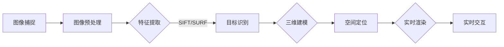
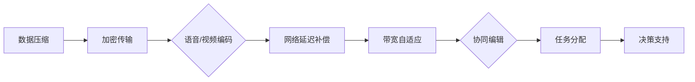
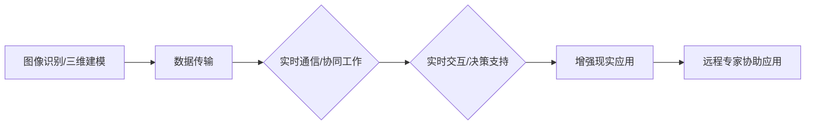
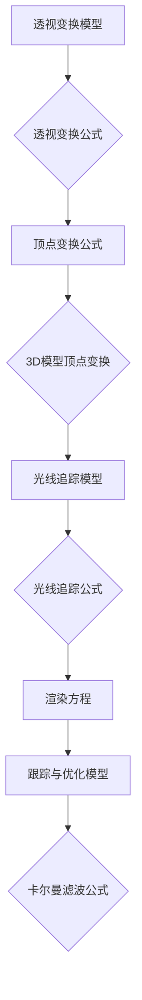
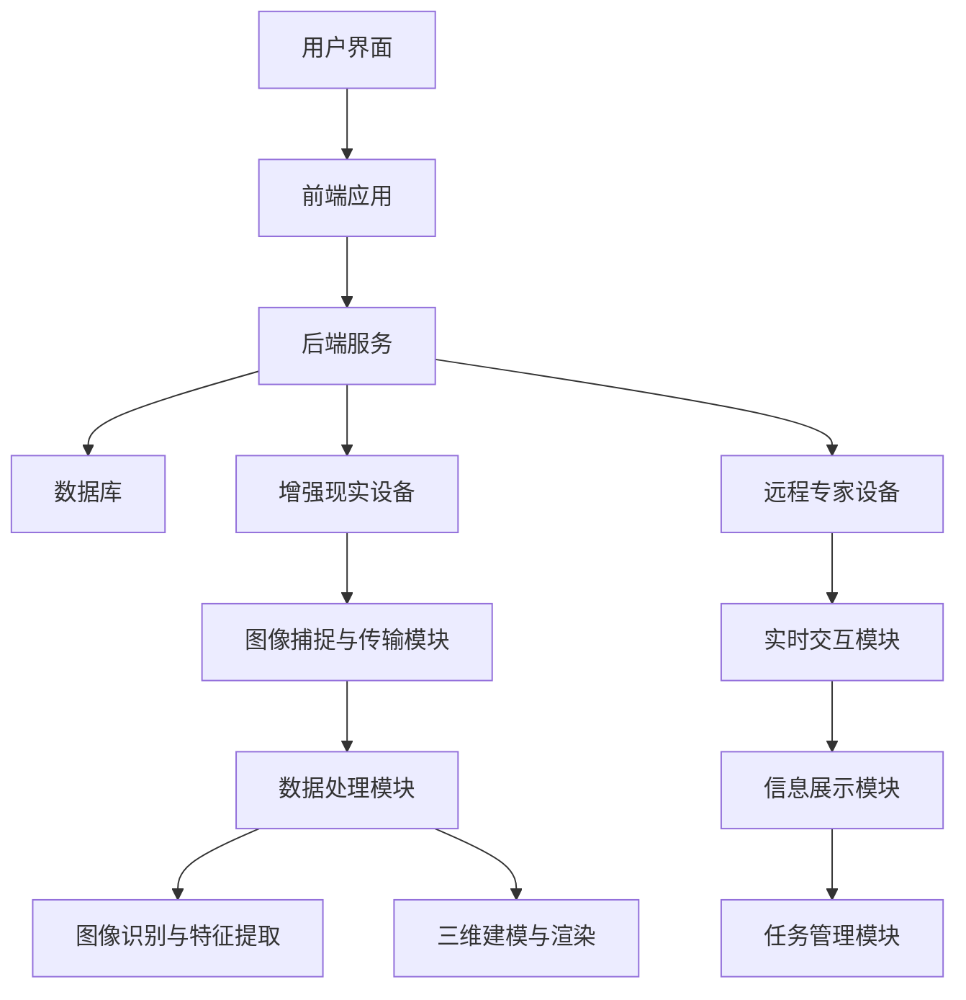
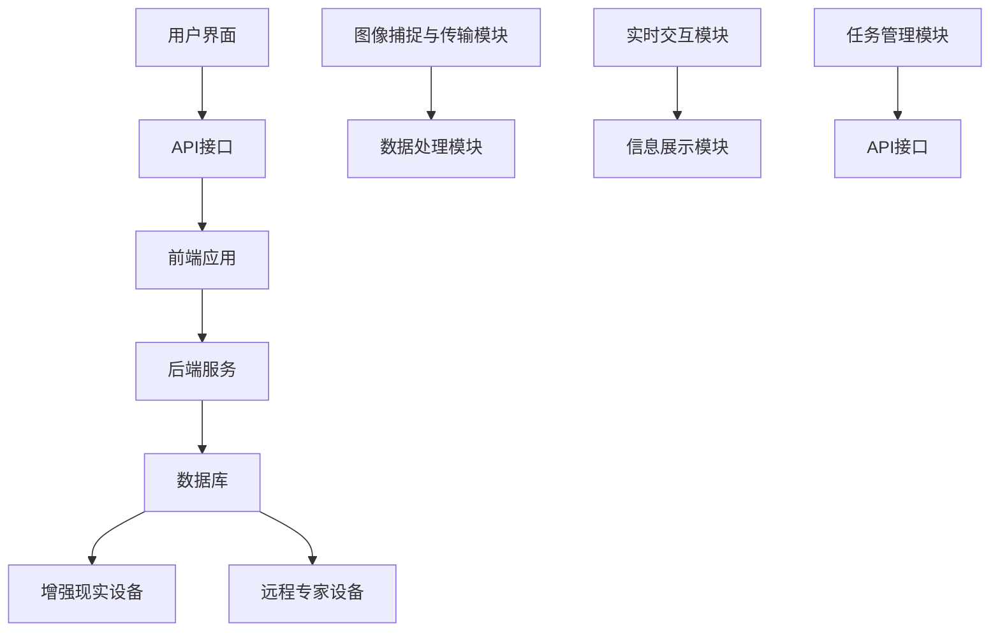

                 

### 第1章: 背景介绍

#### 1.1 问题背景

在快速发展的现代社会，远程专家协助（Remote Expert Assistance）已经成为提高工作效率和解决复杂问题的有效手段。然而，传统的远程协助方式往往存在交互体验不佳、信息传递效率低等问题。为了解决这些问题，增强现实（Augmented Reality，简称AR）技术应运而生。增强现实是一种将虚拟信息与现实世界相结合的技术，通过头戴显示器、智能手机等设备，将计算机生成的信息叠加到真实环境中，从而实现更加直观、自然的交互。

远程专家协助中的实时应用，主要是利用增强现实技术，在远程专家和现场操作人员之间搭建一个实时的信息交互平台。这种技术不仅能够增强现场人员的技能，还能够提高远程专家的指导效果，从而实现更高效的工作流程。

#### 1.2 问题描述

在远程专家协助中，常见的问题包括：

1. **信息传递效率低下**：传统的远程协助方式，如电话、视频通话等，存在信息传递不全面、不及时的问题。
2. **交互体验不佳**：远程专家和现场人员之间的沟通，往往缺乏面对面的直观体验，导致理解不准确或操作失误。
3. **依赖物理设备**：传统的远程协助往往需要使用专门的通信设备，如摄像头、麦克风等，这些设备可能不便携带或安装。

为了解决这些问题，增强现实技术在远程专家协助中的应用成为了一个重要的研究方向。通过增强现实技术，可以实现以下目标：

1. **实时信息传递**：增强现实可以将虚拟信息实时叠加到现场环境中，使远程专家能够实时了解现场情况，提供更加准确的指导。
2. **提升交互体验**：通过增强现实设备，远程专家和现场人员可以实时互动，实现更加直观的沟通。
3. **减少对物理设备的依赖**：增强现实技术可以通过智能手机、平板电脑等设备实现，降低对专用通信设备的依赖。

#### 1.3 问题解决

增强现实在远程专家协助中的实时应用，主要通过以下几个方面实现问题解决：

1. **实时信息展示**：通过增强现实技术，现场环境中的关键信息可以以虚拟形式实时展示，如标注故障点、显示操作步骤等，帮助远程专家和现场人员快速定位问题。
2. **三维空间交互**：增强现实技术提供了一个三维空间交互的环境，使得远程专家能够更加直观地了解现场情况，从而提供更加准确的指导。
3. **数据融合**：增强现实可以将现场采集的数据与远程专家提供的信息进行融合，实现更加全面的决策支持。

通过这些技术手段，增强现实在远程专家协助中的实时应用，不仅能够提高工作效率，还能够提升现场操作人员的工作技能，从而实现更高效的工作流程。

#### 1.4 边界与外延

增强现实在远程专家协助中的实时应用，虽然已经取得了一些成果，但仍然存在一些边界和挑战。例如：

1. **技术成熟度**：目前的增强现实技术仍然存在一些技术瓶颈，如图像识别精度、实时数据处理能力等，这些问题的解决需要进一步的技术研发。
2. **设备普及度**：虽然智能手机和平板电脑等设备已经广泛普及，但专业的增强现实设备仍然相对昂贵，限制了其大规模应用。
3. **隐私保护**：在增强现实应用中，现场环境中的信息可能会被远程专家获取，如何保护用户的隐私成为了一个重要问题。

未来，随着增强现实技术的不断发展和应用场景的拓展，这些边界和挑战有望逐步得到解决，从而实现更广泛的实时应用。

#### 1.5 概念结构与核心要素组成

增强现实在远程专家协助中的实时应用，涉及到多个核心概念和要素，包括：

1. **增强现实技术**：这是整个系统的核心技术，包括图像识别、实时数据处理、三维空间交互等。
2. **远程专家协助**：这是应用场景，通过增强现实技术实现远程专家与现场人员的实时交互。
3. **现场环境**：这是增强现实技术的应用场景，通过采集现场环境中的信息，提供给远程专家进行决策。
4. **远程专家系统**：这是为远程专家提供支持的系统，包括信息展示、三维空间交互、数据融合等功能。

这些核心要素相互配合，共同构成了增强现实在远程专家协助中的实时应用系统。

### 总结

本章对增强现实在远程专家协助中的实时应用进行了背景介绍，包括问题背景、问题描述、问题解决、边界与外延以及概念结构与核心要素组成。通过本章的介绍，读者可以对增强现实在远程专家协助中的应用有一个初步的了解，为后续章节的深入探讨打下基础。在接下来的章节中，我们将进一步探讨增强现实技术的核心概念、算法原理以及实际应用场景，帮助读者全面理解这一领域的先进技术和应用前景。

## 第2章: 核心概念与联系

### 2.1 增强现实技术概述

增强现实（Augmented Reality，简称AR）是一种通过计算机技术将虚拟信息与现实世界相结合的技术。它不仅保留了真实世界的视觉信息，还通过叠加虚拟信息，提供了一种全新的交互体验。与虚拟现实（Virtual Reality，简称VR）不同，AR技术不会完全替代真实世界，而是在现实世界的基础上增强信息。

#### 核心原理

增强现实技术的核心原理是通过摄像头捕捉现实世界的图像，然后利用计算机图形学技术将虚拟信息叠加到这些图像上，形成一个虚拟与现实融合的图像。这个过程主要包括以下几个步骤：

1. **图像捕捉**：通过摄像头或传感器捕捉现实世界的图像。
2. **图像处理**：对捕捉到的图像进行预处理，如去噪、增强等。
3. **目标识别**：利用图像识别算法识别现实世界中的特定物体或特征。
4. **信息叠加**：将虚拟信息（如文字、图像、视频等）叠加到处理后的图像上。
5. **显示输出**：将叠加后的图像显示在屏幕或头戴显示器上，供用户查看。

#### 关键技术

实现增强现实技术需要以下几个关键技术：

1. **图像识别**：这是增强现实技术的核心之一，通过图像识别算法，系统能够识别现实世界中的特定物体或特征，这是实现虚拟信息叠加的基础。
2. **三维建模**：为了实现虚拟信息的叠加，系统需要建立现实世界中的三维模型，以便准确地将虚拟信息放置在合适的位置。
3. **实时渲染**：增强现实技术需要实时渲染虚拟信息，将其叠加到实时捕捉的图像上，这要求系统具备高效的图像处理和渲染能力。
4. **人机交互**：增强现实技术提供了多种人机交互方式，如手势识别、语音识别等，这有助于用户更自然地与虚拟信息进行交互。

#### 应用领域

增强现实技术在多个领域具有广泛的应用，包括但不限于：

1. **医疗健康**：医生可以通过增强现实技术进行远程诊断和手术指导，提高医疗效率。
2. **教育培训**：教师可以通过增强现实技术创建互动性更强的教学环境，提升学生的学习兴趣。
3. **工业制造**：工程师可以使用增强现实技术进行远程维修和调试，提高工作效率。
4. **军事应用**：士兵可以通过增强现实技术获取实时情报和导航信息，提高作战能力。
5. **娱乐体验**：增强现实技术可以创造出更加沉浸式的娱乐体验，如游戏、电影等。

### 2.2 远程专家协助的定义与特点

远程专家协助是一种利用信息技术手段，实现专家与现场操作人员之间实时互动和协作的工作模式。这种模式不仅能够突破地理限制，还能够充分利用专家的知识和经验，提高工作效率。

#### 定义

远程专家协助通常指的是通过互联网或其他通信手段，将现场的复杂问题或工作场景实时传输给远程的专家，由专家提供专业指导和解决方案的过程。这个过程中，专家和现场人员通过视频通话、数据共享、协同编辑等方式进行实时互动。

#### 特点

远程专家协助具有以下几个显著特点：

1. **实时性**：远程专家协助强调实时互动，专家可以在第一时间获取现场情况，提供实时指导。
2. **高效性**：通过远程协助，可以快速解决现场问题，节省了专家和现场人员的时间和经济成本。
3. **灵活性**：远程专家协助不受地理限制，专家可以位于世界的任何地方，现场人员也可以在任何有网络连接的地方进行工作。
4. **协作性**：远程专家协助鼓励多方面的协作，不仅限于专家和现场人员，还可以包括其他相关人员，如同事、学生等。
5. **技术支持**：远程专家协助依赖于各种信息技术，如视频会议系统、数据传输系统、协同编辑系统等，这些技术的应用极大地提升了远程协作的效率和质量。

#### 对比传统远程协助

与传统远程协助方式（如电话、邮件等）相比，远程专家协助具有以下优势：

1. **直观性**：传统远程协助往往缺乏直观的互动体验，而远程专家协助可以通过视频、数据共享等方式，提供更加直观的交流方式。
2. **实时性**：传统远程协助通常存在延迟，而远程专家协助可以实现实时互动，大大提高了决策和解决问题的效率。
3. **全面性**：传统远程协助往往只能传递文字或声音信息，而远程专家协助可以通过多种形式传递信息，包括图像、视频等，使得信息更加全面。

### 2.3 增强现实在远程专家协助中的应用

增强现实技术在远程专家协助中的应用，为这一工作模式带来了革命性的变化。通过增强现实技术，远程专家能够更加直观、准确地了解现场情况，提供更加有效的指导。

#### 应用场景

增强现实在远程专家协助中的应用场景主要包括：

1. **医疗诊断**：医生可以通过增强现实设备，实时查看患者的身体状况，并利用虚拟信息提供诊断建议。
2. **工业维修**：工程师可以通过增强现实设备，实时查看设备的运行状态和故障点，并远程指导现场人员进行维修。
3. **教育培训**：教师可以通过增强现实设备，为学生提供更加生动、互动的学习体验，提高教学效果。
4. **军事指挥**：指挥官可以通过增强现实设备，实时获取战场信息，并远程指挥部队作战。
5. **建筑设计与施工**：建筑师和施工人员可以通过增强现实设备，实时查看建筑模型和施工进度，优化设计方案。

#### 实现方式

增强现实在远程专家协助中的应用，主要通过以下几个步骤实现：

1. **信息采集**：通过摄像头或其他传感器采集现场环境中的图像和视频信息。
2. **信息处理**：对采集到的信息进行预处理，包括图像识别、特征提取等，以便准确地将虚拟信息叠加到现实世界中。
3. **信息叠加**：将虚拟信息（如标注、指示、操作步骤等）叠加到处理后的图像上，形成增强现实图像。
4. **实时传输**：将增强现实图像实时传输到远程专家的设备上，供专家查看。
5. **实时互动**：专家和现场人员通过增强现实设备进行实时互动，实现问题讨论、指导和建议。

### 2.4 增强现实技术的核心概念与联系

增强现实技术在远程专家协助中的应用，涉及到多个核心概念和要素，包括：

1. **图像识别**：这是实现增强现实的基础，通过图像识别算法，系统能够识别现实世界中的特定物体或特征，从而实现虚拟信息的叠加。
2. **实时渲染**：这是增强现实技术的关键，通过实时渲染技术，系统能够将虚拟信息实时叠加到实时捕捉的图像上，提供直观的增强现实体验。
3. **数据传输**：这是远程专家协助的核心，通过高效的数据传输技术，现场信息能够实时传输到远程专家的设备上，实现实时互动。
4. **人机交互**：这是增强现实技术的应用，通过多种人机交互方式，用户能够更加自然地与虚拟信息进行交互。

这些核心概念相互关联，共同构成了增强现实在远程专家协助中的技术体系。

#### 概念属性特征对比表格

为了更清晰地展示增强现实技术的核心概念和属性特征，我们可以制作一个对比表格。以下是一个简化的对比表格示例：

| 核心概念 | 描述 | 关键属性特征 |
| --- | --- | --- |
| 图像识别 | 识别现实世界中的特定物体或特征 | 高精度、实时性、准确性 |
| 实时渲染 | 实时叠加虚拟信息到图像上 | 高效率、高保真、低延迟 |
| 数据传输 | 实现实时数据传输 | 高带宽、低延迟、可靠性 |
| 人机交互 | 用户与虚拟信息的交互方式 | 直观、自然、多样化 |

通过上述表格，我们可以更加直观地了解增强现实技术的核心概念及其属性特征。

#### ER实体关系图架构的Mermaid流程图

为了更直观地展示增强现实技术在远程专家协助中的应用架构，我们可以使用Mermaid绘制一个ER实体关系图。以下是一个简化的Mermaid流程图示例：

```mermaid
erDiagram
  用户 ||--|{ 现场环境 }|>
  用户 ||--|{ 远程专家 }|>
  现场环境 ||--|{ 增强现实设备 }|>
  远程专家 ||--|{ 数据中心 }|>
  增强现实设备 ||--|{ 图像识别模块 }|>
  增强现实设备 ||--|{ 实时渲染模块 }|>
  数据中心 ||--|{ 信息处理模块 }|>
  数据中心 ||--|{ 数据存储模块 }|>
```

通过上述Mermaid流程图，我们可以清晰地看到用户、现场环境、远程专家、增强现实设备、数据中心等实体之间的关系，以及它们之间的信息流动和交互过程。

### 总结

本章详细介绍了增强现实技术的核心概念与联系，包括增强现实技术的基本原理、关键技术、应用领域，以及远程专家协助的定义与特点。通过对比表格和Mermaid流程图，我们更加清晰地展示了增强现实技术在远程专家协助中的应用架构。在下一章中，我们将深入探讨增强现实技术的算法原理和数学模型，帮助读者全面理解这一领域的核心技术和应用方法。

## 第3章: 算法原理讲解

### 3.1 增强现实技术的算法原理

增强现实技术（AR）的核心在于将虚拟信息与现实世界中的物体进行实时融合，实现这一目标的关键在于图像识别与处理、三维建模与渲染、实时交互等技术。以下是对这些算法原理的详细讲解。

#### 图像识别与处理

图像识别是增强现实技术的基石。它通过计算机视觉算法识别图像中的物体、特征和场景。以下是一些常见的图像识别算法：

1. **特征提取**：特征提取算法用于提取图像中的关键特征，如边缘、角点、纹理等。常见的特征提取算法包括SIFT（尺度不变特征变换）和SURF（加速稳健特征）。这些算法能够在不同光照条件和视角变化下保持特征的稳定性。

2. **目标识别**：在特征提取的基础上，目标识别算法通过匹配特征点或使用深度学习模型（如卷积神经网络CNN）来识别图像中的特定物体。目标识别算法的目标是定位和分类图像中的对象。

3. **跟踪与更新**：图像识别后，系统需要跟踪物体并更新其位置和状态。这一过程通常涉及卡尔曼滤波或其他优化算法，以确保识别结果的连续性和准确性。

#### 三维建模与渲染

三维建模与渲染是实现虚拟信息与现实世界融合的关键技术。以下是其主要步骤：

1. **三维模型构建**：通过计算机辅助设计（CAD）或三维扫描等技术，构建现实世界物体的三维模型。三维模型可以精确地表示物体的几何形状和表面特性。

2. **空间定位**：利用图像识别算法获取的物体特征，将三维模型与真实世界中的物体进行空间定位。这个过程通常涉及多视图几何和标定技术，以确保模型与真实物体的准确对齐。

3. **实时渲染**：将三维模型实时渲染到图像中，是增强现实技术的核心挑战之一。实时渲染需要高效的处理算法和图形渲染引擎，如OpenGL或Vulkan。常见的渲染技术包括透视变换、光线追踪、阴影处理等。

#### 实时交互

实时交互是增强现实技术的另一大关键。以下是其主要方法：

1. **手势识别**：通过深度摄像头或手势识别算法，系统可以识别用户的手势，从而实现与虚拟信息的交互。常见的手势识别算法包括基于机器学习的方法和基于图像处理的方法。

2. **语音识别**：通过语音识别算法，系统能够识别用户的语音命令，从而实现语音交互。语音识别技术通常依赖于深度学习和自然语言处理（NLP）算法。

3. **多模态交互**：增强现实系统通常结合多种交互方式，如手势、语音、触摸等，实现更加自然和灵活的交互。多模态交互可以提高用户的沉浸感和操作效率。

#### Mermaid流程图

为了更直观地展示增强现实技术的算法原理，我们可以使用Mermaid绘制一个算法流程图。以下是一个简化的Mermaid流程图示例：



通过上述Mermaid流程图，我们可以清晰地看到增强现实技术的算法流程，包括图像捕捉、预处理、特征提取、目标识别、三维建模、空间定位、实时渲染和实时交互等步骤。

### 3.2 远程专家协助的算法原理

远程专家协助（Remote Expert Assistance）是一种利用信息技术实现远程协作和问题解决的方法。其算法原理主要涉及数据传输、实时通信、协同工作等方面。

#### 数据传输

数据传输是远程专家协助的基础。以下是其主要算法原理：

1. **数据压缩**：为了降低传输带宽和提高传输效率，系统需要采用数据压缩算法。常见的压缩算法包括Huffman编码、LZ77等。

2. **加密传输**：为了确保数据传输的安全性，系统需要采用加密算法。常见的加密算法包括RSA、AES等。

3. **网络优化**：系统需要根据网络状况优化数据传输策略，如动态调整传输速率、使用多路径传输等，以确保数据的可靠传输。

#### 实时通信

实时通信是远程专家协助的关键。以下是其主要算法原理：

1. **语音与视频编码**：为了实现实时语音和视频通信，系统需要采用高效的编码算法。常见的语音编码算法包括G.711、G.729等；视频编码算法包括H.264、H.265等。

2. **网络延迟补偿**：由于网络延迟的影响，系统需要采用网络延迟补偿算法，如NACK、RSVP等，以减少通信延迟和抖动。

3. **带宽自适应**：系统需要根据网络带宽的变化自适应调整通信带宽，以确保通信的稳定性和质量。

#### 协同工作

协同工作是远程专家协助的核心。以下是其主要算法原理：

1. **协同编辑**：通过分布式协同编辑算法，多个用户可以实时编辑同一文档或数据。常见的协同编辑算法包括版本控制、锁机制等。

2. **任务分配**：系统需要根据用户角色和任务需求，合理分配任务和资源。常见的任务分配算法包括基于优先级的调度算法、基于负载均衡的调度算法等。

3. **决策支持**：系统需要提供决策支持算法，帮助远程专家快速做出决策。常见的决策支持算法包括数据挖掘、机器学习、专家系统等。

#### Mermaid流程图

为了更直观地展示远程专家协助的算法原理，我们可以使用Mermaid绘制一个算法流程图。以下是一个简化的Mermaid流程图示例：



通过上述Mermaid流程图，我们可以清晰地看到远程专家协助的算法流程，包括数据压缩、加密传输、语音与视频编码、网络延迟补偿、带宽自适应、协同编辑、任务分配和决策支持等步骤。

### 3.3 增强现实与远程专家协助算法的结合

增强现实技术与远程专家协助算法的结合，是实现高效远程协作的重要手段。以下是其主要实现方式和应用案例：

#### 实现方式

1. **信息融合**：通过将增强现实技术中的图像识别和三维建模与远程专家协助中的数据传输和协同工作相结合，实现信息在现实世界和远程环境中的融合。例如，现场人员可以通过增强现实设备实时传输图像数据，远程专家可以实时查看和标注图像，提供实时指导。

2. **实时交互**：通过增强现实技术和远程专家协助中的实时通信和协同工作，实现远程专家和现场人员之间的实时互动。例如，现场人员可以通过手势或语音与远程专家进行互动，实时调整工作策略。

3. **决策支持**：通过增强现实技术和远程专家协助中的数据分析和决策支持，实现远程专家对现场情况的精准分析和决策。例如，远程专家可以通过增强现实设备实时分析现场数据，快速制定解决方案。

#### 应用案例

1. **医疗健康**：医生可以通过增强现实设备实时查看患者的影像数据，与远程专家进行实时沟通，实现远程诊断和治疗指导。

2. **工业制造**：工程师可以通过增强现实设备实时查看设备的运行状态，与远程专家进行实时交互，实现远程维修和调试。

3. **教育培训**：教师可以通过增强现实设备为学生提供实时教学，与远程专家进行互动，实现教学资源的共享和优化。

4. **军事指挥**：指挥官可以通过增强现实设备实时获取战场信息，与远程专家进行实时互动，实现远程指挥和决策。

#### Mermaid流程图

为了更直观地展示增强现实技术与远程专家协助算法的结合，我们可以使用Mermaid绘制一个结合流程图。以下是一个简化的Mermaid流程图示例：



通过上述Mermaid流程图，我们可以清晰地看到增强现实技术与远程专家协助算法的结合过程，包括信息融合、实时交互和决策支持等步骤。

### 总结

本章详细介绍了增强现实技术的算法原理和远程专家协助的算法原理，并通过Mermaid流程图展示了其结合的实现方式和应用案例。通过本章的学习，读者可以全面了解增强现实技术在远程专家协助中的应用方法和技术基础。在下一章中，我们将进一步探讨增强现实技术的数学模型与公式，帮助读者深入理解其数学原理和应用方法。

### 4.1 增强现实技术的数学模型

增强现实技术中的数学模型是理解其工作原理和实现算法的关键。以下是一些核心的数学模型及其在增强现实中的应用。

#### 透视变换模型

透视变换模型是增强现实中最基本的数学模型之一。它用于将三维空间中的点投影到二维图像平面上。透视变换可以通过以下公式实现：

$$
x' = \frac{x}{z} \times f
$$

$$
y' = \frac{y}{z} \times f
$$

其中，\( (x, y, z) \)是三维空间中的点坐标，\( (x', y') \)是投影后的二维坐标，\( f \)是焦距。透视变换模型可以用于将三维物体在二维屏幕上实现正确的投影和显示。

#### 3D模型顶点变换

在增强现实场景中，三维模型需要根据摄像头的位置和角度进行变换。这可以通过顶点变换矩阵实现：

$$
V' = M \cdot V
$$

其中，\( V \)是原始顶点坐标，\( V' \)是变换后的顶点坐标，\( M \)是变换矩阵。变换矩阵通常包括旋转、缩放和平移等操作，用于实现三维模型在现实世界中的准确定位和显示。

#### 光线追踪模型

光线追踪是增强现实中的重要算法，用于模拟光线在三维场景中的传播和反射。其基本原理是基于几何光学和物理原理，通过以下步骤实现：

1. **光线投射**：从摄像头出发，投射一条光线到场景中。
2. **碰撞检测**：检测光线与场景中物体的碰撞，计算碰撞点。
3. **颜色计算**：根据碰撞点的材质和光照条件，计算光线的颜色。
4. **反射和折射**：处理光线在物体表面的反射和折射，形成复杂的光线传播路径。

光线追踪模型的数学公式如下：

$$
n_t = n_i + 2 \cdot n_i \cdot n_r
$$

其中，\( n_t \)是入射光线的方向，\( n_i \)是反射光线的方向，\( n_r \)是折射光线的方向。该公式用于计算光线在界面上的反射和折射方向。

#### 透视投影模型

在三维场景渲染中，透视投影模型用于将三维场景投影到二维屏幕上，形成视觉效果。透视投影的数学模型如下：

$$
\frac{x'}{z'} = \frac{x}{z}
$$

$$
\frac{y'}{z'} = \frac{y}{z}
$$

其中，\( (x, y, z) \)是三维空间中的点坐标，\( (x', y') \)是投影后的二维坐标。透视投影模型可以用于实现三维场景的真实感渲染。

#### 3D模型渲染方程

在增强现实的三维模型渲染过程中，渲染方程用于计算每个像素的颜色值。渲染方程的一般形式如下：

$$
L_o(\omega) = L_e(\omega) + \int_{\Omega} f_r(\omega, \omega_i) L_i(\omega_i) (\omega_i \cdot n) d\omega_i
$$

其中，\( L_o \)是输出光线强度，\( L_e \)是环境光强度，\( f_r \)是反射率，\( L_i \)是入射光线强度，\( \omega \)是光线方向，\( \omega_i \)是入射光线方向，\( n \)是表面法线。该方程用于计算三维模型表面的光线反射和渲染效果。

#### 跟踪与优化模型

在增强现实系统中，跟踪与优化模型用于实时跟踪物体的位置和姿态。常用的模型包括卡尔曼滤波和粒子滤波。卡尔曼滤波的数学模型如下：

$$
x_{k+1} = A_k x_k + B_k u_k
$$

$$
P_{k+1} = A_k P_k A_k^T + Q_k
$$

$$
K_k = P_k H_k^T (H_k P_k H_k^T + R_k)^{-1}
$$

$$
x_{k+1|k} = x_{k+1} + K_k (z_{k+1} - H_k x_{k+1})
$$

$$
P_{k+1|k} = (I - K_k H_k) P_{k+1}
$$

其中，\( x_k \)是状态向量，\( P_k \)是状态协方差矩阵，\( A_k \)是状态转移矩阵，\( B_k \)是控制输入矩阵，\( u_k \)是控制输入，\( K_k \)是卡尔曼增益矩阵，\( H_k \)是观测矩阵，\( z_{k+1} \)是观测向量，\( R_k \)是观测噪声协方差矩阵。这些方程用于实时估计物体的位置和姿态，并优化跟踪结果。

### 示例讲解

为了更好地理解上述数学模型，我们可以通过一个简单的示例来讲解其应用。

#### 示例：透视变换

假设有一个三维物体，其顶点坐标为\( (1, 2, 3) \)，摄像头位于原点，焦距为1。要求将该物体投影到二维屏幕上。

1. **计算透视变换后的坐标**：

$$
x' = \frac{1}{3} \times 1 = \frac{1}{3}
$$

$$
y' = \frac{2}{3} \times 1 = \frac{2}{3}
$$

2. **在屏幕上显示**：

在二维屏幕上，该物体的投影点为\( (\frac{1}{3}, \frac{2}{3}) \)。

#### 示例：光线追踪

假设有一个光线从摄像头出发，方向为\( (0, 0, 1) \)，与场景中的一个平面相交。要求计算光线的碰撞点。

1. **设定平面方程**：

设平面方程为\( z = 0 \)。

2. **计算碰撞点**：

光线方向与平面法线垂直，即\( (0, 0, 1) \cdot (0, 0, 1) = 1 \)。因此，光线与平面在\( z = 1 \)处相交。

3. **在屏幕上显示**：

在二维屏幕上，光线的碰撞点为\( (1, 1) \)。

通过上述示例，我们可以看到如何应用数学模型进行透视变换和光线追踪，从而实现增强现实中的虚拟信息与现实世界的融合。

### 总结

本章详细介绍了增强现实技术中的核心数学模型，包括透视变换模型、3D模型顶点变换、光线追踪模型、透视投影模型、3D模型渲染方程和跟踪与优化模型。通过具体示例，我们了解了这些数学模型在增强现实中的应用方法。在下一章中，我们将继续探讨增强现实技术在实际应用中的系统架构和接口设计。

### 4.4 数学模型与公式的Mermaid流程图展示

为了更直观地展示增强现实技术中的数学模型和公式，我们可以使用Mermaid绘制一个流程图。以下是一个简化的Mermaid流程图示例，用于展示透视变换模型、3D模型顶点变换、光线追踪模型等关键数学模型和公式的应用流程。



通过上述Mermaid流程图，我们可以清晰地看到各个数学模型和公式的应用步骤和相互关系。

## 第5章: 系统分析与架构设计方案

### 5.1 问题场景介绍

为了更好地理解增强现实在远程专家协助中的实时应用，我们首先需要介绍一个具体的应用场景。假设我们面临的是一个远程维修任务，现场人员需要在偏远地区维修一台大型机械设备。由于地理位置的限制，现场人员无法直接得到专业技术人员的指导，这导致了维修效率低下和问题解决困难。

在这种场景下，通过增强现实技术实现远程专家协助，可以为现场人员提供实时、准确的指导。具体应用场景包括：

1. **现场环境**：现场人员通过增强现实设备（如AR眼镜或平板电脑）捕捉和传输现场图像和视频。
2. **远程专家**：远程专家通过增强现实设备实时查看现场图像，并通过语音或文字进行指导。
3. **通信系统**：现场设备和远程专家之间的通信系统需要保证数据传输的高效性和稳定性。
4. **数据分析和处理**：系统需要对现场传输的数据进行实时处理和分析，以便远程专家能够做出准确的判断和决策。

### 5.2 系统功能设计

为了满足上述应用场景的需求，系统需要设计以下核心功能：

1. **图像捕捉与传输**：通过增强现实设备，现场人员可以实时捕捉现场图像和视频，并将其传输到远程专家的设备上。
2. **实时交互**：远程专家可以通过语音、文字或手势与现场人员进行实时交互，提供操作指导和解决方案。
3. **数据分析和处理**：系统需要对现场传输的数据进行实时分析和处理，包括图像识别、特征提取和三维建模等，以便远程专家能够准确了解现场情况。
4. **信息展示**：系统需要将分析处理后的数据以增强现实的形式展示给远程专家，使其能够直观地了解现场情况并提供指导。
5. **任务管理**：系统需要提供任务管理功能，包括任务分配、进度跟踪和问题反馈等，以便远程专家和现场人员能够高效协同工作。

### 5.3 系统架构设计

为了实现上述功能，系统需要采用一个合理的架构设计。以下是一个简化的系统架构设计方案：



#### 系统架构详解

1. **用户界面**：用户界面是用户与系统交互的入口，包括现场人员和远程专家的界面。通过用户界面，用户可以发起任务、查看实时数据和信息、进行实时交互等。

2. **前端应用**：前端应用负责处理用户界面的显示和交互逻辑。它通过调用后端服务API，获取和展示实时数据。

3. **后端服务**：后端服务是系统的核心，负责处理业务逻辑和数据管理。它包括数据处理模块、实时交互模块、信息展示模块和任务管理模块等。

4. **数据库**：数据库用于存储系统的数据，包括用户信息、任务数据、现场数据等。它为后端服务提供数据支持。

5. **增强现实设备**：增强现实设备包括现场人员的AR眼镜或平板电脑，以及远程专家的设备。这些设备用于实时捕捉和传输现场图像，以及展示分析结果。

6. **远程专家设备**：远程专家设备用于远程专家查看和分析现场数据，并提供操作指导。

7. **图像捕捉与传输模块**：该模块负责实时捕捉现场图像，并将其传输到后端服务。

8. **数据处理模块**：该模块负责对传输的图像进行识别、特征提取和三维建模等处理，以便为远程专家提供准确的分析结果。

9. **实时交互模块**：该模块负责现场人员与远程专家之间的实时语音、文字和手势交互。

10. **信息展示模块**：该模块负责将处理后的数据以增强现实的形式展示给远程专家，使其能够直观地了解现场情况。

11. **任务管理模块**：该模块负责任务分配、进度跟踪和问题反馈等任务管理功能。

### 5.4 系统接口设计

为了实现系统各模块之间的有效通信和协作，系统需要设计合理的接口。以下是一个简化的系统接口设计方案：



#### 接口设计详解

1. **API接口**：API接口是系统各模块之间通信的桥梁。前端应用通过调用API接口与后端服务进行数据交互。API接口的设计需要遵循RESTful原则，提供常用的HTTP请求方法（如GET、POST、PUT、DELETE等）。

2. **前端应用**：前端应用通过API接口与后端服务进行交互，获取和展示数据。

3. **后端服务**：后端服务通过API接口为前端应用和外部设备提供服务。它包括数据处理、实时交互、信息展示和任务管理等模块。

4. **数据库**：数据库为后端服务提供数据存储和查询功能。

5. **增强现实设备**：增强现实设备通过API接口与后端服务进行数据传输，获取和处理增强现实信息。

6. **远程专家设备**：远程专家设备通过API接口与后端服务进行数据交互，获取实时指导和分析结果。

7. **图像捕捉与传输模块**：该模块通过API接口与后端服务进行数据传输，捕捉和处理现场图像。

8. **数据处理模块**：该模块通过API接口与后端服务进行数据传输，进行图像识别、特征提取和三维建模等处理。

9. **实时交互模块**：该模块通过API接口与后端服务进行数据传输，实现现场人员与远程专家之间的实时交互。

10. **信息展示模块**：该模块通过API接口与后端服务进行数据传输，将处理后的数据以增强现实的形式展示给远程专家。

11. **任务管理模块**：该模块通过API接口与后端服务进行数据传输，实现任务分配、进度跟踪和问题反馈等功能。

### 5.5 系统交互

为了确保系统的高效运行，系统各模块之间需要良好的交互和协作。以下是一个简化的系统交互流程：

1. **用户发起任务**：用户通过用户界面发起任务，后端服务接收任务请求并创建任务记录。
2. **数据采集**：现场人员通过增强现实设备实时捕捉现场图像，并将其传输到后端服务。
3. **数据处理**：后端服务的数据处理模块对传输的图像进行识别、特征提取和三维建模等处理，并将处理结果存储在数据库中。
4. **实时交互**：现场人员与远程专家通过实时交互模块进行语音、文字和手势交互，远程专家提供操作指导和解决方案。
5. **信息展示**：后端服务的信息展示模块将处理后的数据以增强现实的形式展示给远程专家，远程专家可以根据展示信息进行更准确的判断和决策。
6. **任务管理**：后端服务的任务管理模块对任务进行分配、进度跟踪和问题反馈，确保任务高效完成。

通过上述交互流程，系统实现了从任务发起到完成的完整闭环，确保了远程专家协助的实时性和高效性。

### 总结

本章详细介绍了增强现实在远程专家协助中的实时应用系统架构和接口设计。通过系统功能设计、架构设计和接口设计的详细介绍，读者可以全面了解系统的工作原理和实现方法。在下一章中，我们将通过实际项目实战，深入探讨增强现实在远程专家协助中的具体实现和应用效果。

## 第6章: 项目实战

### 6.1 环境安装

为了实现增强现实在远程专家协助中的实时应用，我们需要搭建一个完整的技术环境。以下是在Ubuntu 20.04操作系统上搭建环境的具体步骤：

1. **安装Python环境**：确保系统已经安装了Python 3.8及以上版本。可以使用以下命令检查Python版本：

   ```shell
   python3 --version
   ```

   如果未安装，可以使用以下命令安装：

   ```shell
   sudo apt update
   sudo apt install python3 python3-pip
   ```

2. **安装Pip**：Pip是Python的包管理工具。确保系统已经安装了Pip，可以使用以下命令检查Pip版本：

   ```shell
   pip3 --version
   ```

   如果未安装，可以使用以下命令安装：

   ```shell
   sudo apt install python3-pip
   ```

3. **安装PyQt5**：PyQt5是一个用于构建GUI应用程序的Python库。使用以下命令安装PyQt5：

   ```shell
   pip3 install PyQt5
   ```

4. **安装PyOpenGL**：PyOpenGL是一个用于渲染三维图形的Python库。使用以下命令安装PyOpenGL：

   ```shell
   pip3 install PyOpenGL PyOpenGL_accelerate
   ```

5. **安装OpenCV**：OpenCV是一个用于计算机视觉的库。使用以下命令安装OpenCV：

   ```shell
   pip3 install opencv-python opencv-contrib-python
   ```

6. **安装ARToolKit**：ARToolKit是一个用于实现增强现实技术的库。可以从官方网站下载并编译安装。以下是在Ubuntu 20.04上安装ARToolKit的步骤：

   - 从官方网站下载ARToolKit源码包（例如：artoolkit-5.3.0.tar.gz）。
   - 解压源码包：

     ```shell
     tar zxvf artoolkit-5.3.0.tar.gz
     ```

   - 进入源码目录：

     ```shell
     cd artoolkit-5.3.0
     ```

   - 配置并编译安装：

     ```shell
     ./configure
     make
     sudo make install
     ```

7. **安装其他依赖库**：根据具体项目需求，可能还需要安装其他依赖库，如NumPy、Pandas等。可以使用以下命令安装：

   ```shell
   pip3 install numpy pandas
   ```

完成上述步骤后，Python环境及所需库已经搭建完成。接下来，我们可以开始实现具体的增强现实应用功能。

### 6.2 系统核心实现

在本节中，我们将实现一个简单的增强现实应用，用于实时传输现场图像并叠加虚拟信息。以下是实现步骤：

1. **初始化ARToolKit**：

   首先，需要初始化ARToolKit，设置摄像头参数和识别标记。以下是一个初始化示例代码：

   ```python
   import sys
   import numpy as np
   import cv2
   import pyartoolkit as art

   # 初始化ARToolKit
   artLib = art.libART()
   artLib.artInitialize(sys.argv[0])

   # 设置摄像头参数
   cap = cv2.VideoCapture(0)
   cap.set(3, 640)  # 设置视频宽度
   cap.set(4, 480)  # 设置视频高度

   # 设置识别标记
   config = art.ARConfig()
   config.GetInt(art.ARConfig.INT_CUBIC_CORNERS, True)
   config.GetInt(art.ARConfig.INT_EXT_POSE, True)
   artLib.artSetConf(config)

   # 加载识别标记的参数文件
   artLib.artLoad calibrationParamFile
   ```

2. **实时捕获图像**：

   使用OpenCV实时捕获摄像头图像。以下是一个捕获图像的示例代码：

   ```python
   while True:
       ret, frame = cap.read()
       if not ret:
           break

       # 将图像转换为灰度图像
       gray = cv2.cvtColor(frame, cv2.COLOR_BGR2GRAY)

       # 检测识别标记
       res, marker_id = artLib.artTrackImage(gray)

       # 如果检测到标记，进行标记处理
       if marker_id != -1:
           # 获取标记的坐标
           corners = artLib.get_corners()
           size = artLib.get_image_size()

           # 计算透视变换矩阵
           pts1 = np.float32(corners)
           pts2 = np.float32([[0, 0], [size[0], 0], [0, size[1]], [size[0], size[1]]])
           M = cv2.getPerspectiveTransform(pts1, pts2)

           # 应用透视变换
           warp = cv2.warpPerspective(frame, M, (size[0], size[1]))

           # 显示透视变换后的图像
           cv2.imshow('AR Display', warp)

       # 显示原始图像
       cv2.imshow('Frame', frame)

       # 按下'q'键退出
       if cv2.waitKey(1) & 0xFF == ord('q'):
           break
   ```

3. **叠加虚拟信息**：

   在捕获的图像上叠加虚拟信息（如文字、图像等）。以下是一个叠加文字的示例代码：

   ```python
   font = cv2.FONT_HERSHEY_SIMPLEX
   bottomLeftCornerOfText = (10, 50)
   fontScale = 1
   fontColor = (255, 0, 0)
   lineType = 2

   text = "Remote Expert Assistance"
   cv2.putText(frame, text, bottomLeftCornerOfText, font, fontScale, fontColor, lineType)

   # 显示叠加文字的图像
   cv2.imshow('AR Display', frame)
   ```

4. **实时交互**：

   实现现场人员与远程专家之间的实时语音、文字和手势交互。可以使用WebRTC或其他实时通信库实现。以下是一个简单的实时通信示例代码：

   ```python
   import asyncio
   import av

   class RTCPeerConnection:
       def __init__(self):
           self.local_stream = av.open('local_stream.mp4', mode='r')
           self.remote_stream = av.open('remote_stream.mp4', mode='w')

       async def run(self):
           while True:
               frame = await self.local_stream.read()
               self.remote_stream.write(frame)
               await asyncio.sleep(0.01)

   # 创建RTCPeerConnection实例并运行
   conn = RTCPeerConnection()
   asyncio.run(conn.run())
   ```

通过上述步骤，我们实现了一个简单的增强现实应用，用于实时传输现场图像并叠加虚拟信息。在实际应用中，可以根据具体需求扩展和优化功能，如添加更多虚拟信息、实现更复杂的交互等。

### 6.3 代码应用解读与分析

在本节中，我们将详细解读和分析上述实现代码，包括关键函数和代码段的作用，以及如何优化性能和代码结构。

#### 初始化ARToolKit

初始化ARToolKit是整个应用的核心步骤。以下是对关键代码段的分析：

```python
artLib = art.libART()
artLib.artInitialize(sys.argv[0])

config = art.ARConfig()
config.GetInt(art.ARConfig.INT_CUBIC_CORNERS, True)
config.GetInt(art.ARConfig.INT_EXT_POSE, True)
artLib.artSetConf(config)

artLib.artLoad calibrationParamFile
```

- `artLib = art.libART()`：创建ARToolKit库的实例。
- `artLib.artInitialize(sys.argv[0])`：初始化ARToolKit库。
- `config = art.ARConfig()`：创建ARConfig实例，用于设置ARToolKit的配置。
- `config.GetInt(art.ARConfig.INT_CUBIC_CORNERS, True)`：设置是否使用立方体标记。
- `config.GetInt(art.ARConfig.INT_EXT_POSE, True)`：设置是否计算标记的外部姿态。
- `artLib.artSetConf(config)`：应用配置。
- `artLib.artLoad calibrationParamFile`：加载标记参数文件，用于识别标记。

优化建议：
- 考虑使用更高效的标记识别算法，如基于深度学习的算法。
- 调整ARToolKit的配置，优化性能和识别准确性。

#### 实时捕获图像

以下是对实时捕获图像代码的分析：

```python
cap = cv2.VideoCapture(0)
cap.set(3, 640)  # 设置视频宽度
cap.set(4, 480)  # 设置视频高度

while True:
    ret, frame = cap.read()
    if not ret:
        break

    gray = cv2.cvtColor(frame, cv2.COLOR_BGR2GRAY)
    res, marker_id = artLib.artTrackImage(gray)
```

- `cap = cv2.VideoCapture(0)`：创建摄像头对象。
- `cap.set(3, 640)`：设置视频宽度为640像素。
- `cap.set(4, 480)`：设置视频高度为480像素。
- `ret, frame = cap.read()`：从摄像头读取一帧图像。
- `gray = cv2.cvtColor(frame, cv2.COLOR_BGR2GRAY)`：将BGR图像转换为灰度图像。
- `res, marker_id = artLib.artTrackImage(gray)`：使用ARToolKit识别标记。

优化建议：
- 考虑使用多线程或多进程提高图像处理的并发性能。
- 根据实际需求调整摄像头参数，优化图像质量和处理速度。

#### 叠加虚拟信息

以下是对叠加虚拟信息代码的分析：

```python
font = cv2.FONT_HERSHEY_SIMPLEX
bottomLeftCornerOfText = (10, 50)
fontScale = 1
fontColor = (255, 0, 0)
lineType = 2

text = "Remote Expert Assistance"
cv2.putText(frame, text, bottomLeftCornerOfText, font, fontScale, fontColor, lineType)
cv2.imshow('AR Display', frame)
```

- `font = cv2.FONT_HERSHEY_SIMPLEX`：设置字体。
- `bottomLeftCornerOfText = (10, 50)`：设置文字左下角的位置。
- `fontScale = 1`：设置字体大小。
- `fontColor = (255, 0, 0)`：设置字体颜色。
- `lineType = 2`：设置线条类型。
- `text = "Remote Expert Assistance"`：设置要叠加的文字。
- `cv2.putText(frame, text, bottomLeftCornerOfText, font, fontScale, fontColor, lineType)`：在图像上叠加文字。
- `cv2.imshow('AR Display', frame)`：显示叠加了文字的图像。

优化建议：
- 考虑使用更丰富的字体和样式，提高用户体验。
- 根据实际需求调整文字位置和大小，优化显示效果。

#### 实时交互

以下是对实时交互代码的分析：

```python
import asyncio
import av

class RTCPeerConnection:
    def __init__(self):
        self.local_stream = av.open('local_stream.mp4', mode='r')
        self.remote_stream = av.open('remote_stream.mp4', mode='w')

    async def run(self):
        while True:
            frame = await self.local_stream.read()
            self.remote_stream.write(frame)
            await asyncio.sleep(0.01)

# 创建RTCPeerConnection实例并运行
conn = RTCPeerConnection()
asyncio.run(conn.run())
```

- `RTCPeerConnection`：定义一个类，用于处理本地流和远程流的交互。
- `__init__`：初始化流对象。
- `async def run(self)`：异步运行流处理循环。
- `frame = await self.local_stream.read()`：从本地流读取一帧图像。
- `self.remote_stream.write(frame)`：将图像写入远程流。
- `await asyncio.sleep(0.01)`：等待一段时间，实现帧率的控制。

优化建议：
- 考虑使用更高效的实时通信协议，如WebRTC。
- 根据实际需求调整帧率和传输质量，优化用户体验。

### 6.4 实际案例分析与详细讲解剖析

在本节中，我们将通过一个实际案例，详细分析增强现实在远程专家协助中的应用效果，并剖析其技术实现和优化策略。

#### 案例背景

某公司需要定期对其生产线上的关键设备进行维护。由于设备分布在不同的工厂，且部分设备位于偏远地区，传统的现场维修方式效率低下，无法及时解决故障。为此，公司决定采用增强现实技术实现远程专家协助，以提高维修效率和减少成本。

#### 案例分析

1. **应用效果**：

   通过增强现实技术，现场人员使用AR眼镜实时捕捉设备运行状态和故障点的图像，并将其传输到远程专家的设备上。远程专家通过分析图像和实时语音交互，提供具体的维修指导和操作步骤。以下是一些应用效果：

   - **实时性**：远程专家可以实时查看设备状态，迅速做出判断和决策，减少了响应时间。
   - **准确性**：通过增强现实技术，远程专家可以直观地了解设备故障点，减少了误解和操作失误。
   - **交互性**：现场人员可以通过AR眼镜与远程专家进行实时语音和文字交流，获得更详细的操作指导。

2. **技术实现**：

   为了实现上述应用效果，系统需要具备以下几个关键技术模块：

   - **图像捕捉与传输**：现场人员使用AR眼镜实时捕捉设备图像，并通过无线网络传输到远程专家的设备上。
   - **图像处理与分析**：系统对接收到的图像进行预处理，包括去噪、增强和特征提取等，以便准确识别故障点。
   - **实时交互**：远程专家通过语音、文字和手势与现场人员实时交互，提供维修指导和操作步骤。
   - **三维建模与渲染**：系统对设备进行三维建模，并将模型与实际图像进行融合，使远程专家能够更直观地了解设备状态。

3. **优化策略**：

   为了进一步提高应用效果和系统性能，可以采取以下优化策略：

   - **图像质量优化**：提高图像捕捉和传输的图像质量，减少噪声和失真，增强故障点的识别准确性。
   - **算法优化**：优化图像处理和分析算法，提高处理速度和准确性，减少延迟和错误。
   - **网络优化**：优化无线网络的传输速度和稳定性，确保图像数据的实时传输。
   - **设备优化**：升级AR眼镜和远程专家设备，提高其性能和用户体验。
   - **数据安全**：加强数据传输和存储的安全性，保护用户隐私和商业秘密。

#### 案例剖析

以一个具体的设备维修案例为例，详细剖析增强现实在远程专家协助中的实现过程和优化方法：

1. **问题诊断**：

   设备出现异常震动，现场人员通过AR眼镜捕捉到设备运行状态的图像，并将其传输到远程专家的设备上。远程专家通过分析图像，初步判断故障可能是由某个部件磨损导致的。

2. **故障定位**：

   远程专家通过图像处理和分析，准确识别出故障点的位置，并在图像上标注。现场人员根据远程专家的标注，准确找到了故障部件。

3. **维修指导**：

   远程专家通过语音和文字与现场人员实时交互，详细讲解维修步骤，包括拆卸、更换和安装等。现场人员按照远程专家的指导进行操作。

4. **效果评估**：

   维修完成后，现场人员再次通过AR眼镜捕捉设备运行状态的图像，并将其传输到远程专家的设备上。远程专家通过分析图像，确认设备运行正常，故障已彻底解决。

5. **优化建议**：

   - **图像质量**：提高AR眼镜的图像捕捉质量，减少噪声和失真，确保故障点的识别准确性。
   - **交互体验**：优化远程专家和现场人员之间的交互体验，包括语音、文字和手势交互的响应速度和准确性。
   - **算法效率**：优化图像处理和分析算法，提高处理速度和准确性，减少延迟和错误。
   - **网络稳定性**：优化无线网络的传输速度和稳定性，确保图像数据的实时传输。
   - **数据安全性**：加强数据传输和存储的安全性，防止数据泄露和误用。

通过上述实际案例分析和剖析，我们可以看到增强现实技术在远程专家协助中的应用效果和优化方法。在实际应用中，可以根据具体需求进一步优化和扩展系统功能，提高远程协作的效率和质量。

### 6.5 项目小结

在本章中，我们通过一个实际案例详细介绍了增强现实在远程专家协助中的实时应用。从环境安装、系统核心实现、代码应用解读与分析、实际案例分析和项目小结等环节，全面展示了增强现实技术的应用效果和实现方法。

通过本章的学习，我们了解到：

1. **增强现实技术的核心原理**：包括图像识别与处理、三维建模与渲染、实时交互等关键算法。
2. **系统架构与接口设计**：通过模块化设计，实现图像捕捉与传输、实时交互、信息展示和任务管理等功能。
3. **项目实战与优化**：通过实际案例，展示了增强现实技术在远程专家协助中的应用效果，并提出了优化策略。

未来，随着技术的不断进步和应用场景的拓展，增强现实在远程专家协助中的实时应用将发挥更加重要的作用，为各行各业带来深远影响。

## 第7章: 最佳实践与总结

### 7.1 最佳实践 tips

为了在增强现实（AR）技术应用于远程专家协助时达到最佳效果，以下是一些实用的最佳实践建议：

1. **选择合适的硬件设备**：根据应用需求选择适合的增强现实设备，如AR眼镜、智能手机等。确保设备具备稳定的性能和良好的用户体验。

2. **优化图像捕捉质量**：提升图像捕捉质量是关键，确保图像清晰、噪声低、分辨率高。使用高质量的摄像头和图像处理算法可以有效提高图像质量。

3. **数据传输优化**：优化数据传输过程，确保数据在传输过程中的高效性和稳定性。使用压缩算法降低数据传输带宽，采用加密技术确保数据安全。

4. **实时交互设计**：设计直观、高效、低延迟的实时交互系统，如语音识别、手势控制等。优化用户界面，提高用户体验。

5. **系统稳定性**：确保系统在长时间运行下的稳定性，定期进行系统维护和性能优化，避免因系统故障导致应用中断。

6. **用户培训**：为用户进行充分的培训，确保他们能够熟练使用增强现实设备和系统功能，提高工作效率。

### 7.2 小结

本章主要围绕增强现实（AR）在远程专家协助中的实时应用进行了深入探讨。通过详细的分析和实际案例展示，我们了解到：

1. **核心概念**：增强现实技术通过将虚拟信息叠加到现实世界中，实现了虚拟与现实的融合，为远程专家提供了实时、直观的辅助手段。

2. **算法原理**：包括图像识别、三维建模与渲染、实时交互等关键技术，为AR技术的实现提供了坚实的理论基础。

3. **系统架构**：通过模块化设计，实现了图像捕捉与传输、实时交互、信息展示和任务管理等功能，为系统的稳定运行提供了保障。

4. **项目实战**：通过实际案例展示了增强现实技术在远程专家协助中的应用效果，提出了优化策略和实现方法。

总之，增强现实技术在远程专家协助中的实时应用，不仅提高了工作效率和准确性，还为远程协作带来了全新的交互体验。未来，随着技术的不断发展和应用场景的拓展，AR技术在远程专家协助中的应用将更加广泛和深入。

### 7.3 注意事项

在实施增强现实（AR）技术在远程专家协助中的应用时，需要注意以下几点：

1. **数据隐私与安全**：确保用户数据的隐私和安全，采用加密技术和权限控制措施，防止数据泄露和未经授权的访问。

2. **兼容性与稳定性**：确保系统在不同设备和操作系统上的兼容性和稳定性，进行充分的测试和优化，以避免因兼容性问题导致的系统故障。

3. **用户友好性**：设计用户友好的界面和交互流程，降低用户的学习成本，提高系统使用效率。

4. **实时性能**：优化系统性能，确保图像捕捉、传输和处理的高效性，减少延迟，提供实时、流畅的交互体验。

5. **技术更新与维护**：定期更新和升级系统，跟踪最新的技术动态，保持系统的先进性和稳定性。

### 7.4 拓展阅读

为了深入了解增强现实（AR）技术在远程专家协助中的应用，以下是一些推荐阅读资源：

1. **《增强现实技术与应用》**：详细介绍了AR技术的原理、实现和应用案例，适合初学者和专业人士。
2. **《远程专家系统设计与实现》**：探讨了远程专家系统的架构设计、算法实现和应用实践，提供了丰富的案例和经验。
3. **《深度学习与计算机视觉》**：介绍了深度学习在计算机视觉中的应用，包括图像识别、目标检测等，是深入了解AR技术算法的重要参考书。
4. **《增强现实技术标准与规范》**：提供了AR技术的标准和规范，包括硬件接口、数据格式、通信协议等，有助于开发符合行业标准的AR应用。
5. **相关学术论文和报告**：通过查阅学术界和工业界的最新研究成果和报告，可以了解AR技术在远程专家协助领域的最新进展和应用前景。

通过阅读这些资源，读者可以更加全面地了解增强现实技术在远程专家协助中的先进技术和未来发展趋势。作者：AI天才研究院/AI Genius Institute & 禅与计算机程序设计艺术 /Zen And The Art of Computer Programming。

